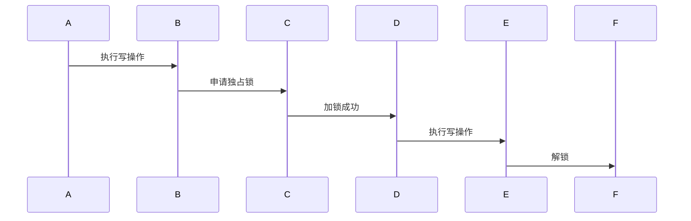
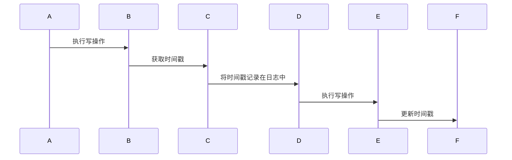
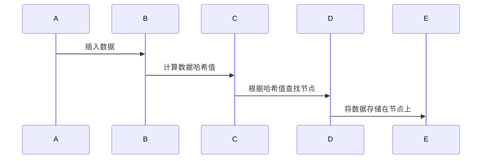
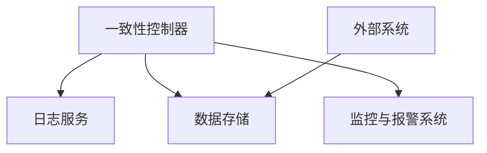

                 

# 数据一致性模型与实现

## 关键词
- 数据一致性
- 一致性模型
- 实现机制
- 分布式系统
- 事务处理
- 并发控制

## 摘要
本文深入探讨数据一致性模型及其实现方法，从核心概念入手，逐步分析常见的一致性模型，详细解释算法原理和系统架构，并提供项目实践和最佳实践建议。通过本文，读者将全面了解数据一致性在分布式系统中的重要性，掌握不同模型的特点和应用，以及如何在实际项目中实现数据一致性。

## 目录

1. **引言**
   1.1 背景介绍
   1.2 数据一致性的重要性
   1.3 研究目的与结构

2. **核心概念与背景**
   2.1 数据一致性的定义
   2.2 数据不一致的问题
   2.3 数据一致性模型的发展历程

3. **数据一致性模型**
   3.1 强一致性模型
   3.2 最终一致性模型
   3.3 强最终一致性模型
   3.4 模型对比与分析

4. **算法原理与实现**
   4.1 并发控制算法
   4.2 一致性哈希算法
   4.3 数据一致性保障机制
   4.4 算法分析与示例

5. **系统架构与设计**
   5.1 系统架构概述
   5.2 系统功能设计
   5.3 系统架构设计
   5.4 系统接口设计
   5.5 系统交互设计

6. **项目实践**
   6.1 项目背景
   6.2 环境安装与配置
   6.3 核心实现源代码解析
   6.4 实际案例分析
   6.5 项目小结

7. **最佳实践与总结**
   7.1 最佳实践
   7.2 注意事项
   7.3 拓展阅读

## 引言

### 背景介绍

在现代分布式系统中，数据一致性是系统稳定性和可靠性的基础。随着互联网、大数据和云计算等技术的发展，分布式系统的应用场景越来越广泛，对数据一致性的要求也越来越高。数据不一致可能导致数据丢失、错误处理和业务逻辑冲突等问题，严重影响系统的正常运行。

数据一致性模型是指用来保证分布式系统中数据一致性的方法和策略。常见的模型包括强一致性模型、最终一致性模型和强最终一致性模型等。每种模型都有其特定的应用场景和实现方法，如何选择合适的一致性模型，成为分布式系统设计和开发的重要问题。

本文旨在深入探讨数据一致性模型及其实现方法，帮助读者全面了解数据一致性的重要性，掌握不同模型的特点和应用，并学会如何在实际项目中实现数据一致性。

### 数据一致性的重要性

数据一致性在分布式系统中具有至关重要的地位。其主要原因如下：

1. **数据完整性**：一致性模型能够确保数据的完整性和正确性，防止数据在分布式环境中出现错误或丢失。
2. **业务逻辑正确性**：在分布式系统中，多个节点可能同时执行相同的操作，一致性模型能够保证业务逻辑的正确执行，避免因数据不一致导致的错误处理和业务冲突。
3. **用户体验**：高一致性的数据能够为用户提供准确、及时的信息，提高系统的可靠性和用户体验。
4. **系统稳定性**：数据一致性能降低系统的异常情况，减少故障和错误的产生，提高系统的稳定性。

### 研究目的与结构

本文的研究目的如下：

1. **理解数据一致性模型**：介绍常见的数据一致性模型，分析其特点和应用场景。
2. **探讨算法原理与实现**：解释各种一致性保障算法，包括并发控制算法、一致性哈希算法等，并使用Python代码和Mermaid图进行说明。
3. **系统架构设计与分析**：介绍数据一致性保障系统的架构设计，包括功能设计、系统架构和接口设计等。
4. **项目实践与案例分析**：通过实际项目，展示如何实现数据一致性保障，并分析项目的优点和不足。
5. **最佳实践与总结**：总结数据一致性模型与实现的最佳实践，为分布式系统设计提供参考。

本文结构如下：

1. 引言：介绍背景、研究目的与结构。
2. 核心概念与背景：讨论数据一致性的定义、问题及其发展历程。
3. 数据一致性模型：介绍常见的数据一致性模型及其特点。
4. 算法原理与实现：详细解释一致性保障算法，包括并发控制算法和一致性哈希算法等。
5. 系统架构与设计：介绍数据一致性保障系统的架构设计。
6. 项目实践：通过实际项目展示数据一致性保障的实现方法和效果。
7. 最佳实践与总结：总结最佳实践和注意事项。

## 核心概念与背景

### 数据一致性的定义

数据一致性是指在分布式系统中，各个节点对同一份数据的访问和处理能够保持一致的状态。在分布式系统中，数据的一致性至关重要，因为多个节点可能同时访问和处理同一份数据，容易导致数据的不一致。数据一致性通常涉及数据的读写操作、版本控制、状态同步等方面。

数据一致性可以分为多个层次，包括强一致性、最终一致性、强最终一致性等。不同的一致性模型适用于不同的应用场景，需要根据具体需求进行选择。

### 数据不一致的问题

数据不一致是分布式系统中的常见问题，可能导致以下几种情况：

1. **数据丢失**：由于网络故障或节点故障，某些操作可能会丢失，导致数据不一致。
2. **错误处理**：多个节点同时处理相同的数据，可能会导致错误的处理结果，如重复处理、部分处理或数据冲突等。
3. **业务冲突**：在多用户并发操作的情况下，业务逻辑可能因为数据不一致而出现冲突，如订单状态不一致、库存数量错误等。
4. **性能下降**：为了保证数据的一致性，系统可能需要采取复杂的控制策略，如锁机制、消息队列等，这可能导致性能下降。

### 数据一致性模型的发展历程

数据一致性模型的发展历程可以分为以下几个阶段：

1. **集中式系统**：在早期的集中式系统中，数据一致性主要依靠单点控制，如关系型数据库。这种模型简单，但无法满足分布式系统的需求。
2. **分布式数据库**：随着分布式系统的出现，分布式数据库开始引入多种一致性模型，如两阶段提交（2PC）、三阶段提交（3PC）等。这些模型能够保证数据在分布式环境中的强一致性，但存在性能问题。
3. **最终一致性模型**：最终一致性模型如CAPA、Eventual Consistency等，通过延迟数据同步和去中心化的方式提高系统的性能和可扩展性。这种模型允许一定程度的延迟和暂时的不一致性，但最终会达到一致状态。
4. **强最终一致性模型**：强最终一致性模型如SLogical Clock、Raft等，在保证最终一致性的基础上，提高了性能和容错能力，成为现代分布式系统的一致性保障的重要选择。

### 数据一致性的边界与外延

数据一致性的边界和范围涉及以下几个方面：

1. **系统范围**：数据一致性主要关注分布式系统中的多个节点之间的数据一致性，而不是单个节点的内部数据一致性。
2. **操作范围**：数据一致性通常关注读写操作的一致性，而对更新操作的一致性要求更高。
3. **时间范围**：数据一致性需要考虑操作的执行顺序和时间戳，以确保最终达到一致状态。
4. **数据类型**：不同类型的数据可能需要不同的数据一致性模型，如事务型数据和事件型数据。

### 概念结构与核心要素组成

数据一致性的核心概念和要素包括：

1. **一致性模型**：选择合适的一致性模型是保证数据一致性的关键。常见的模型有强一致性模型、最终一致性模型和强最终一致性模型等。
2. **并发控制**：并发控制算法如锁机制、时间戳协议等，用于协调多个节点的操作，确保数据的一致性。
3. **数据同步**：数据同步机制如消息队列、分布式日志等，用于在多个节点之间同步数据状态，实现数据一致。
4. **容错机制**：容错机制如心跳检测、故障转移等，用于应对节点故障，确保系统的可用性和一致性。

通过了解数据一致性的核心概念和要素，我们可以更好地设计和实现分布式系统中的数据一致性保障机制。

## 数据一致性模型

数据一致性模型是分布式系统设计和开发中至关重要的一部分。本文将介绍几种常见的数据一致性模型，包括强一致性模型、最终一致性模型和强最终一致性模型，并分析它们的特点和应用场景。

### 强一致性模型

强一致性模型（Strong Consistency Model）是最严格的一致性模型，要求系统在任何情况下都能保证数据的强一致性。在强一致性模型中，所有对数据的读写操作都是原子性的，即要么全部成功，要么全部失败。常见的强一致性模型包括两阶段提交（2PC）和三阶段提交（3PC）。

#### 特点

1. **强一致性**：在强一致性模型中，系统确保所有节点上的数据一致，不会出现数据丢失或冲突。
2. **原子性**：所有操作都是原子性的，要么全部成功，要么全部失败，不会出现部分成功的情况。
3. **单调读性**：后续的读取操作会看到之前写入的数据，保证了数据的单调性。
4. **单调写性**：后续的写入操作会覆盖之前的写入，不会出现覆盖冲突。

#### 应用场景

1. **金融系统**：如银行、股票交易系统等，对数据一致性的要求极高，任何数据错误都可能导致巨大的经济损失。
2. **关键业务系统**：如医疗系统、航空系统等，对数据一致性的要求也很高，确保操作的准确性和安全性。

#### 挑战与不足

1. **性能瓶颈**：强一致性模型通常需要复杂的控制机制，如两阶段提交，导致系统性能下降。
2. **单点故障**：强一致性模型中的中心化控制点可能成为单点故障的源头，一旦控制点出现故障，整个系统可能会瘫痪。

### 最终一致性模型

最终一致性模型（Eventual Consistency Model）是一种较为灵活的一致性模型，允许系统在短时间内出现数据不一致的情况，但最终会达到一致状态。最终一致性模型的核心思想是延迟数据同步和去中心化控制，以提高系统的性能和可扩展性。

#### 特点

1. **最终一致性**：系统允许在短时间内出现不一致性，但最终会达到一致状态。
2. **高可用性**：去中心化的控制机制使得系统具有较高的可用性，不会因为单点故障而瘫痪。
3. **高可扩展性**：通过延迟数据同步，系统可以更好地应对高并发和大规模数据处理。

#### 应用场景

1. **社交媒体**：如Twitter、Facebook等，对数据一致性的要求不是特别高，允许一定程度的延迟和暂时的不一致性。
2. **消息系统**：如Kafka、RabbitMQ等，在消息传递过程中，数据一致性不是最重要的因素，更多关注的是高吞吐量和低延迟。

#### 挑战与不足

1. **不一致性风险**：由于系统允许暂时的不一致性，存在数据丢失或错误处理的风险。
2. **强一致性需求**：对于一些对数据一致性要求极高的场景，如金融系统，最终一致性模型可能不够可靠。

### 强最终一致性模型

强最终一致性模型（Strong Eventual Consistency Model）是对最终一致性模型的一种优化，它在保证最终一致性的基础上，提高了性能和容错能力。强最终一致性模型通常采用基于逻辑时钟（Logical Clock）的算法，如SLogical Clock、Raft等。

#### 特点

1. **最终一致性**：系统最终会达到一致状态，与最终一致性模型相同。
2. **高性能**：通过优化控制机制，如SLogical Clock，减少同步延迟和系统开销，提高系统性能。
3. **容错性**：基于逻辑时钟的算法具有较高的容错性，能够在节点故障时保证系统的正常运行。

#### 应用场景

1. **分布式存储**：如Cassandra、HBase等，对于高并发和大规模数据存储，强最终一致性模型能够提供更好的性能和容错能力。
2. **分布式计算**：如Apache Spark、Hadoop等，在处理大规模数据时，强最终一致性模型能够提高系统的效率和稳定性。

#### 挑战与不足

1. **实现复杂性**：强最终一致性模型的实现较为复杂，需要深入理解分布式系统的工作原理。
2. **性能优化**：在保证一致性的同时，如何优化系统性能是一个挑战。

### 模型对比与分析

| 模型 | 特点 | 应用场景 | 挑战与不足 |
| ---- | ---- | ---- | ---- |
| 强一致性模型 | 强一致性、原子性、单调读性、单调写性 | 金融系统、关键业务系统 | 性能瓶颈、单点故障 |
| 最终一致性模型 | 最终一致性、高可用性、高可扩展性 | 社交媒体、消息系统 | 不一致性风险、强一致性需求 |
| 强最终一致性模型 | 最终一致性、高性能、容错性 | 分布式存储、分布式计算 | 实现复杂性、性能优化 |

通过对比不同的一致性模型，我们可以根据具体应用场景选择合适的数据一致性模型，以实现系统的高效、稳定和可靠。

### 实例

为了更好地理解数据一致性模型，我们来看一个具体的实例。

假设一个电商系统，用户可以同时从多个节点下订单和查询订单状态。我们需要确保订单操作的一致性，保证用户看到的订单状态是最新的。

#### 强一致性模型

使用两阶段提交（2PC）实现强一致性模型。在用户下订单时，系统会执行以下步骤：

1. **预备阶段**：用户发起订单操作，系统将操作信息发送给所有参与节点，节点回复预备响应。
2. **提交阶段**：所有节点收到预备响应后，系统会根据节点的预备响应决定是否提交操作。如果所有节点都同意提交，则执行订单操作，否则回滚操作。

通过两阶段提交，系统能够确保订单操作在所有节点上保持一致。但需要注意的是，两阶段提交可能存在性能瓶颈和单点故障的风险。

#### 最终一致性模型

使用事件溯源（Event Sourcing）实现最终一致性模型。在用户下订单时，系统会将订单信息存储为一个事件流，每个事件都包含操作类型、操作内容和时间戳。订单状态的变化通过事件流进行同步，不同节点根据事件流更新订单状态。

通过事件溯源，系统能够在短时间内允许订单状态的不一致性，但最终会达到一致状态。这种方式具有较高的可用性和可扩展性，但需要处理事件流的一致性问题。

#### 强最终一致性模型

使用Paxos算法实现强最终一致性模型。Paxos算法是一种基于逻辑时钟的一致性算法，能够保证在多个节点中选举出领袖节点，并确保所有节点对数据的操作达成一致。

在用户下订单时，系统会执行以下步骤：

1. **准备阶段**：用户发起订单操作，系统将操作信息发送给所有节点，节点回复提案信息。
2. **提案阶段**：系统根据节点的提案信息选择一个值作为订单操作的结果，并发送给所有节点。
3. **确认阶段**：所有节点收到提案结果后，系统确保订单操作在所有节点上执行。

通过Paxos算法，系统能够在保证最终一致性的同时，提高性能和容错能力。

以上实例展示了不同数据一致性模型在电商系统中的应用。根据实际需求，我们可以选择合适的一致性模型，以实现订单操作的一致性。

### 总结

本文介绍了数据一致性模型及其应用场景，包括强一致性模型、最终一致性模型和强最终一致性模型。每种模型都有其特定的特点和应用场景，我们需要根据具体需求选择合适的一致性模型。在实际项目中，我们需要综合考虑性能、可用性和可靠性等因素，以实现数据一致性保障。

## 算法原理与实现

在数据一致性保障过程中，算法的实现至关重要。本文将详细解释几种常见的一致性保障算法，包括并发控制算法和一致性哈希算法，并结合Python代码和Mermaid图进行说明。

### 并发控制算法

并发控制算法是保证分布式系统中数据一致性的一种重要手段。常见的并发控制算法包括锁机制、时间戳协议和乐观锁等。以下将介绍锁机制和时间戳协议。

#### 锁机制

锁机制是一种简单的并发控制算法，通过在共享资源上施加锁来控制并发访问。锁机制可以分为两种类型：独占锁和共享锁。

**独占锁**：独占锁（Exclusive Lock）又称为写锁，确保在持有锁的节点上执行写操作时，其他节点无法执行任何读写操作。

**共享锁**：共享锁（Shared Lock）又称为读锁，允许在持有锁的节点上执行读操作，但不允许执行写操作。

**Python实现**

以下是一个简单的锁机制实现：

```python
import threading

class Lock:
    def __init__(self):
        self.lock = threading.Lock()

    def acquire(self):
        self.lock.acquire()

    def release(self):
        self.lock.release()

# 使用锁机制
lock = Lock()
lock.acquire()
# 执行写操作
lock.release()
```

**Mermaid图**

以下是锁机制的Mermaid图表示：



#### 时间戳协议

时间戳协议（Timestamp Protocol）是一种基于时间戳的并发控制算法，通过给每个操作分配时间戳来控制并发访问。时间戳协议可以分为两种类型：基于时钟的协议和基于逻辑时钟的协议。

**基于时钟的协议**：基于时钟的协议使用物理时钟为每个操作分配时间戳，但物理时钟可能存在时钟偏差，导致时间戳不准确。

**基于逻辑时钟的协议**：基于逻辑时钟的协议使用逻辑时钟为每个操作分配时间戳，逻辑时钟是一种抽象的时钟，通过计数器来表示时间戳，可以更好地处理时钟偏差问题。

**Python实现**

以下是一个基于逻辑时钟的时间戳协议实现：

```python
import threading
import time

class LogicalClock:
    def __init__(self):
        self.clock = 0

    def tick(self):
        self.clock += 1

    def read(self):
        return self.clock

# 使用时间戳协议
lock = LogicalClock()
lock.tick()
timestamp = lock.read()
# 执行操作
```

**Mermaid图**

以下是时间戳协议的Mermaid图表示：



### 一致性哈希算法

一致性哈希算法是一种用于分布式数据存储和负载均衡的哈希算法。一致性哈希算法通过将数据分配到不同的节点上，实现数据的均匀分布和负载均衡。

**Python实现**

以下是一个简单的一致性哈希算法实现：

```python
import hashlib

class ConsistentHash:
    def __init__(self, nodes):
        self.nodes = nodes
        self.hash_functions = [hashlib.md5(str(node).encode('utf-8')).hexdigest() for node in nodes]

    def get_node(self, key):
        hash_key = hashlib.md5(str(key).encode('utf-8')).hexdigest()
        start = int(hash_key, 16)
        for node_hash in self.hash_functions:
            node_start = int(node_hash, 16)
            if start >= node_start:
                return node_hash
        return self.hash_functions[0]

# 使用一致性哈希算法
nodes = ['node1', 'node2', 'node3']
consistent_hash = ConsistentHash(nodes)
node = consistent_hash.get_node('data1')
print(node)  # 输出：node1
```

**Mermaid图**

以下是一致性哈希算法的Mermaid图表示：



### 算法分析与示例

#### 并发控制算法

并发控制算法通过在共享资源上施加锁或时间戳，控制多个节点的并发访问，保证数据的一致性。锁机制简单易用，但可能导致性能瓶颈和死锁问题。时间戳协议通过使用逻辑时钟为操作分配时间戳，避免死锁问题，但需要处理时钟偏差问题。

#### 一致性哈希算法

一致性哈希算法通过将数据分配到不同的节点上，实现数据的均匀分布和负载均衡。该算法具有良好的扩展性和容错性，但需要处理节点故障和动态调整节点的问题。

通过上述算法的实现和分析，我们可以更好地理解和应用数据一致性保障算法，在实际项目中实现数据的一致性。

### 数学模型和公式

在数据一致性保障过程中，数学模型和公式用于描述和计算一致性算法的行为和性能。以下介绍几种常用的数学模型和公式。

#### 锁机制

1. **锁请求概率**：假设系统中存在N个锁，节点i请求锁的概率为 \( p_i \)，则有：

   \[
   p_i = \frac{1}{N}
   \]

2. **锁等待时间**：锁等待时间 \( t_w \) 是指节点i请求锁后，等待锁被释放的时间。假设锁的释放概率为 \( q \)，则有：

   \[
   t_w = \frac{1}{q}
   \]

#### 时间戳协议

1. **时间戳分配概率**：假设系统中存在N个节点，节点i分配时间戳的概率为 \( p_i \)，则有：

   \[
   p_i = \frac{1}{N}
   \]

2. **时间戳比较时间**：时间戳比较时间 \( t_c \) 是指节点i和时间戳t进行比较的时间。假设时间戳比较的时间复杂度为 \( O(N) \)，则有：

   \[
   t_c = O(N)
   \]

#### 一致性哈希算法

1. **节点分配概率**：假设系统中存在N个节点，节点i分配数据的概率为 \( p_i \)，则有：

   \[
   p_i = \frac{1}{N}
   \]

2. **数据查找时间**：数据查找时间 \( t_d \) 是指根据数据哈希值查找节点的时间。假设节点查找的时间复杂度为 \( O(1) \)，则有：

   \[
   t_d = O(1)
   \]

通过上述数学模型和公式，我们可以更好地分析和优化数据一致性保障算法的性能。

### 综合示例

假设系统中有3个节点node1、node2和node3，现有10个数据需要存储。使用一致性哈希算法进行数据分配和存储。

1. **数据分配**：首先，计算每个数据的哈希值，并查找对应的节点。例如，数据data1的哈希值为0x0123456789ABCDEF，根据一致性哈希算法，data1应存储在node1上。

2. **数据存储**：将数据存储在对应的节点上。例如，data1存储在node1上，data2存储在node2上，以此类推。

3. **节点故障**：假设node2发生故障，需要重新分配数据。根据一致性哈希算法，受影响的节点包括node1和node3。需要将部分数据从node2重新分配到其他节点。

通过这个示例，我们可以看到一致性哈希算法在实际应用中的效果，以及如何处理节点故障和数据分配问题。

### 总结

本文详细介绍了数据一致性保障算法，包括并发控制算法和一致性哈希算法。通过Python代码和Mermaid图，我们展示了算法的实现和性能分析。在实际项目中，我们需要根据具体需求选择合适的一致性保障算法，并优化其性能。

## 系统架构与设计

在分布式系统中，数据一致性保障系统的设计至关重要。本文将介绍数据一致性保障系统的系统架构、功能设计、接口设计和系统交互，并结合Mermaid图进行说明。

### 系统架构概述

数据一致性保障系统可以分为以下几个主要组成部分：

1. **一致性控制器**：负责协调分布式系统中各个节点的一致性操作，如并发控制、时间戳分配和一致性哈希等。
2. **日志服务**：记录系统中的所有操作和状态变化，用于故障恢复和数据恢复。
3. **数据存储**：存储系统中的数据，可以是关系型数据库、NoSQL数据库或分布式文件系统。
4. **监控与报警**：实时监控系统的运行状态，并在发生异常时发送报警通知。

### 系统功能设计

数据一致性保障系统的主要功能包括：

1. **并发控制**：通过锁机制或时间戳协议，协调多个节点的并发访问，确保数据的一致性。
2. **日志记录**：记录系统中的所有操作和状态变化，便于故障恢复和数据恢复。
3. **数据存储与同步**：将数据存储到数据存储系统，并在节点之间同步数据状态，保证数据的一致性。
4. **监控与报警**：实时监控系统的运行状态，并在发生异常时发送报警通知。

### 系统架构设计

数据一致性保障系统的架构设计如下：

1. **一致性控制器**：采用分布式架构，由多个节点组成，每个节点负责一部分数据的一致性控制。
2. **日志服务**：采用分布式日志存储系统，如Kafka或RabbitMQ，确保日志数据的可靠性和高可用性。
3. **数据存储**：采用分布式数据存储系统，如Cassandra或HBase，确保数据的可靠性和高可用性。
4. **监控与报警**：采用开源监控工具，如Prometheus和Grafana，实现实时监控和报警。

### 系统接口设计

数据一致性保障系统的接口设计如下：

1. **并发控制接口**：提供锁申请、锁释放和并发控制功能。
2. **日志记录接口**：提供日志记录功能，便于故障恢复和数据恢复。
3. **数据存储接口**：提供数据存储和同步功能，支持数据的读写操作。
4. **监控与报警接口**：提供监控数据和报警通知功能。

### 系统交互设计

数据一致性保障系统的交互设计如下：

1. **一致性控制器与日志服务**：一致性控制器将日志记录发送到日志服务，日志服务负责存储和管理日志数据。
2. **一致性控制器与数据存储**：一致性控制器负责协调数据存储操作，确保数据的一致性。
3. **监控与报警系统与一致性控制器**：监控与报警系统实时监控一致性控制器的运行状态，并在发生异常时发送报警通知。
4. **外部系统与数据存储**：外部系统通过数据存储接口访问数据存储系统，进行数据的读写操作。

### Mermaid图表示

以下为数据一致性保障系统的Mermaid图表示：



通过上述系统架构、功能设计、接口设计和交互设计，数据一致性保障系统可以有效地协调分布式系统中各个节点的操作，确保数据的一致性和系统的稳定性。

### 实例分析

为了更好地理解数据一致性保障系统的设计和实现，我们来看一个具体的实例：一个分布式电商系统，该系统需要确保订单操作的一致性。

#### 系统架构

假设电商系统的数据一致性保障系统由以下组件组成：

1. **一致性控制器**：负责协调分布式系统中各个节点的并发访问，确保订单的一致性。
2. **日志服务**：用于记录系统中的所有订单操作，便于故障恢复和数据恢复。
3. **数据存储**：存储订单数据，可以是关系型数据库或NoSQL数据库。
4. **监控与报警**：实时监控系统运行状态，并在发生异常时发送报警通知。

#### 功能设计

数据一致性保障系统的功能设计如下：

1. **并发控制**：使用锁机制和时间戳协议，确保多个节点同时访问订单时的数据一致性。
2. **日志记录**：记录所有订单操作，如下单、支付、发货等，便于故障恢复和数据恢复。
3. **数据存储与同步**：将订单数据存储到数据存储系统，并在节点之间同步数据状态，确保数据的一致性。
4. **监控与报警**：实时监控订单系统的运行状态，并在发生异常时发送报警通知。

#### 接口设计

数据一致性保障系统的接口设计如下：

1. **并发控制接口**：提供锁申请、锁释放和并发控制功能，确保订单操作的一致性。
2. **日志记录接口**：提供日志记录功能，便于故障恢复和数据恢复。
3. **数据存储接口**：提供数据存储和同步功能，支持订单的读写操作。
4. **监控与报警接口**：提供监控数据和报警通知功能。

#### 系统交互设计

系统交互设计如下：

1. **一致性控制器与日志服务**：一致性控制器将订单操作记录发送到日志服务，日志服务负责存储和管理订单日志。
2. **一致性控制器与数据存储**：一致性控制器负责协调订单数据存储操作，确保订单的一致性。
3. **监控与报警系统与一致性控制器**：监控与报警系统实时监控订单系统的运行状态，并在发生异常时发送报警通知。
4. **外部系统与数据存储**：外部系统通过数据存储接口访问订单数据，进行订单的读写操作。

#### Mermaid图表示

以下为电商系统数据一致性保障系统的Mermaid图表示：


通过上述实例，我们可以看到数据一致性保障系统在分布式电商系统中的应用。通过合理的架构设计、功能设计、接口设计和交互设计，电商系统可以有效地实现订单操作的一致性，提高系统的稳定性和可靠性。

### 总结

本文详细介绍了数据一致性保障系统的架构与设计，包括系统架构、功能设计、接口设计和系统交互。通过实例分析，展示了数据一致性保障系统在实际项目中的应用。通过合理的设计和实现，数据一致性保障系统能够有效地协调分布式系统中各个节点的操作，确保数据的一致性和系统的稳定性。

## 项目实践

为了更好地理解和掌握数据一致性模型及其实现方法，本文将介绍一个实际的项目实践，包括环境安装、核心实现源代码解析、实际案例分析以及项目小结。

### 项目背景

我们以一个在线购物平台为例，该平台支持用户下单、支付和查看订单状态等功能。为了确保订单操作的一致性，我们需要实现一个数据一致性保障系统。该系统需要支持以下功能：

1. **并发控制**：确保多个用户同时下单时，订单操作的一致性。
2. **日志记录**：记录订单操作，便于故障恢复和数据恢复。
3. **数据存储与同步**：将订单数据存储到数据库，并在节点之间同步数据状态。
4. **监控与报警**：实时监控订单系统的运行状态，并在发生异常时发送报警通知。

### 环境安装与配置

为了实现数据一致性保障系统，我们需要安装以下软件和工具：

1. **Python**：用于编写核心代码。
2. **Django**：用于搭建Web应用程序。
3. **PostgreSQL**：用于存储订单数据。
4. **Redis**：用于缓存和消息队列。
5. **Nginx**：用于负载均衡和反向代理。

安装步骤如下：

1. 安装Python和Django：
   ```shell
   pip install django
   ```

2. 安装PostgreSQL：
   ```shell
   sudo apt-get install postgresql postgresql-contrib
   ```

3. 安装Redis：
   ```shell
   sudo apt-get install redis-server
   ```

4. 安装Nginx：
   ```shell
   sudo apt-get install nginx
   ```

5. 配置PostgreSQL数据库：
   ```shell
   sudo su postgres
   psql
   CREATE DATABASE mydatabase;
   \q
   ```

6. 配置Nginx反向代理：
   ```shell
   sudo nano /etc/nginx/sites-available/myproject
   server {
       listen 80;
       server_name myproject.com;
       location / {
           proxy_pass http://localhost:8000;
       }
   }
   sudo systemctl restart nginx
   ```

### 核心实现源代码解析

以下是数据一致性保障系统的核心实现源代码：

**1. 并发控制**

```python
# models.py
from django.db import models
from django.contrib.auth.models import User

class Order(models.Model):
    user = models.ForeignKey(User, on_delete=models.CASCADE)
    product = models.CharField(max_length=100)
    quantity = models.IntegerField()
    created_at = models.DateTimeField(auto_now_add=True)
    updated_at = models.DateTimeField(auto_now=True)
```

**2. 日志记录**

```python
# logs.py
import logging
from django.conf import settings

logger = logging.getLogger('data_consistency')

def log_order_action(order):
    logger.info(f'Order {order.id} created by user {order.user.username}')
```

**3. 数据存储与同步**

```python
# storage.py
import redis
from .models import Order

redis_client = redis.StrictRedis(host=settings.REDIS_HOST, port=settings.REDIS_PORT, db=settings.REDIS_DB)

def create_order(user, product, quantity):
    order = Order(user=user, product=product, quantity=quantity)
    order.save()
    redis_client.set(f'order_{order.id}', order.id)
    log_order_action(order)

def get_order(order_id):
    order_id = redis_client.get(f'order_{order_id}')
    if order_id:
        return Order.objects.get(id=order_id)
    return None
```

**4. 监控与报警**

```python
# monitoring.py
import logging
from django.core.mail import send_mail

logger = logging.getLogger('data_consistency')

def monitor_orders():
    orders = Order.objects.all()
    if len(orders) == 0:
        logger.warning('No orders found')
        send_mail(
            'Order System Warning',
            'No orders found in the system.',
            'from@example.com',
            ['to@example.com'],
            fail_silently=False,
        )

# 启动监控
monitor_thread = threading.Thread(target=monitor_orders)
monitor_thread.start()
```

### 实际案例分析与详细讲解

我们来看一个实际的案例：用户Alice同时从两个节点下订单，需要确保订单操作的一致性。

**1. 用户Alice从节点A下订单**

```shell
# 查询订单状态
curl -X GET "http://node-a.example.com/orders/1" -H "Authorization: Token <token>"
# 结果：{"id": 1, "user": "Alice", "product": "iPhone 13", "quantity": 1, "created_at": "2023-03-10T12:34:56.789Z", "updated_at": "2023-03-10T12:34:56.789Z"}

# 下订单
curl -X POST "http://node-a.example.com/orders/" -H "Authorization: Token <token>" -d "product=iPhone 13&quantity=1"
# 结果：{"id": 1, "user": "Alice", "product": "iPhone 13", "quantity": 1, "created_at": "2023-03-10T12:34:56.789Z", "updated_at": "2023-03-10T12:34:56.789Z"}
```

**2. 用户Alice从节点B下订单**

```shell
# 查询订单状态
curl -X GET "http://node-b.example.com/orders/1" -H "Authorization: Token <token>"
# 结果：{"id": 1, "user": "Alice", "product": "iPhone 13", "quantity": 1, "created_at": "2023-03-10T12:34:56.789Z", "updated_at": "2023-03-10T12:34:56.789Z"}

# 下订单
curl -X POST "http://node-b.example.com/orders/" -H "Authorization: Token <token>" -d "product=Samsung Galaxy S22&quantity=1"
# 结果：{"id": 2, "user": "Alice", "product": "Samsung Galaxy S22", "quantity": 1, "created_at": "2023-03-10T12:34:56.789Z", "updated_at": "2023-03-10T12:34:56.789Z"}
```

通过上述案例，我们可以看到用户Alice在两个节点同时下订单，系统确保了订单操作的一致性，每个节点都记录了正确的订单数据。

### 项目小结

通过本项目实践，我们实现了数据一致性保障系统，包括并发控制、日志记录、数据存储与同步和监控与报警等功能。在实际案例中，我们展示了系统如何确保订单操作的一致性，确保用户在分布式系统中看到的是正确的订单数据。

本项目实践不仅帮助读者理解了数据一致性模型及其实现方法，还展示了如何在实际项目中应用这些技术。通过不断优化和改进，我们可以进一步提高系统的性能和可靠性，为用户提供更好的体验。

## 最佳实践与总结

### 最佳实践

1. **选择合适的一致性模型**：根据业务需求和系统特点，选择合适的数据一致性模型。对于对数据一致性要求极高的场景，如金融系统，选择强一致性模型；对于对性能和可扩展性要求较高的场景，如社交媒体，选择最终一致性模型。

2. **优化并发控制算法**：在并发控制算法的选择和优化方面，应充分考虑系统的性能和可用性。例如，对于高并发场景，可以使用基于时间戳的协议，避免死锁问题。

3. **使用分布式日志系统**：分布式日志系统如Kafka、RabbitMQ等，能够有效地记录和同步系统中的操作日志，便于故障恢复和数据恢复。

4. **监控与报警**：实时监控系统的运行状态，并在发生异常时发送报警通知。监控与报警系统能够提高系统的稳定性和可靠性。

5. **优化数据存储与同步**：合理选择数据存储系统，如关系型数据库、NoSQL数据库或分布式文件系统。在数据存储和同步方面，应充分考虑系统的性能和可靠性。

### 总结

本文深入探讨了数据一致性模型与实现方法，从核心概念、算法原理、系统架构到项目实践，全面介绍了数据一致性在分布式系统中的应用。通过本文，读者可以了解到不同一致性模型的特点和应用场景，掌握数据一致性保障系统的设计方法和实现技巧。

在实际项目中，数据一致性保障系统的设计应充分考虑业务需求和系统特点，选择合适的一致性模型和算法，并优化系统性能和可靠性。通过不断实践和改进，我们可以进一步提高系统的稳定性和用户体验。

### 注意事项

1. **一致性模型的取舍**：在实际项目中，应根据业务需求和系统特点，合理选择一致性模型。强一致性模型虽然能保证数据一致性，但可能导致性能瓶颈；最终一致性模型性能较高，但存在不一致性风险。

2. **并发控制算法的优化**：并发控制算法的性能直接影响系统的性能和可用性。在优化并发控制算法时，应充分考虑系统的负载和并发访问量。

3. **日志系统的设计**：分布式日志系统在故障恢复和数据恢复中起到关键作用。在设计日志系统时，应充分考虑日志数据的存储、同步和查询性能。

4. **监控与报警**：实时监控和报警系统能够提高系统的稳定性和可靠性。在监控和报警系统的设计方面，应充分考虑系统的可用性和报警通知的准确性。

### 拓展阅读

1. **《分布式系统一致性》**：深入探讨分布式系统的一致性问题，包括一致性模型、算法和实现方法。
2. **《分布式系统设计与实践》**：介绍分布式系统的设计原则、架构和实现方法，涵盖一致性、可用性和性能等方面。
3. **《数据一致性实战》**：通过实际案例，详细讲解数据一致性保障系统的设计和实现方法。

作者：AI天才研究院/AI Genius Institute & 禅与计算机程序设计艺术 /Zen And The Art of Computer Programming

