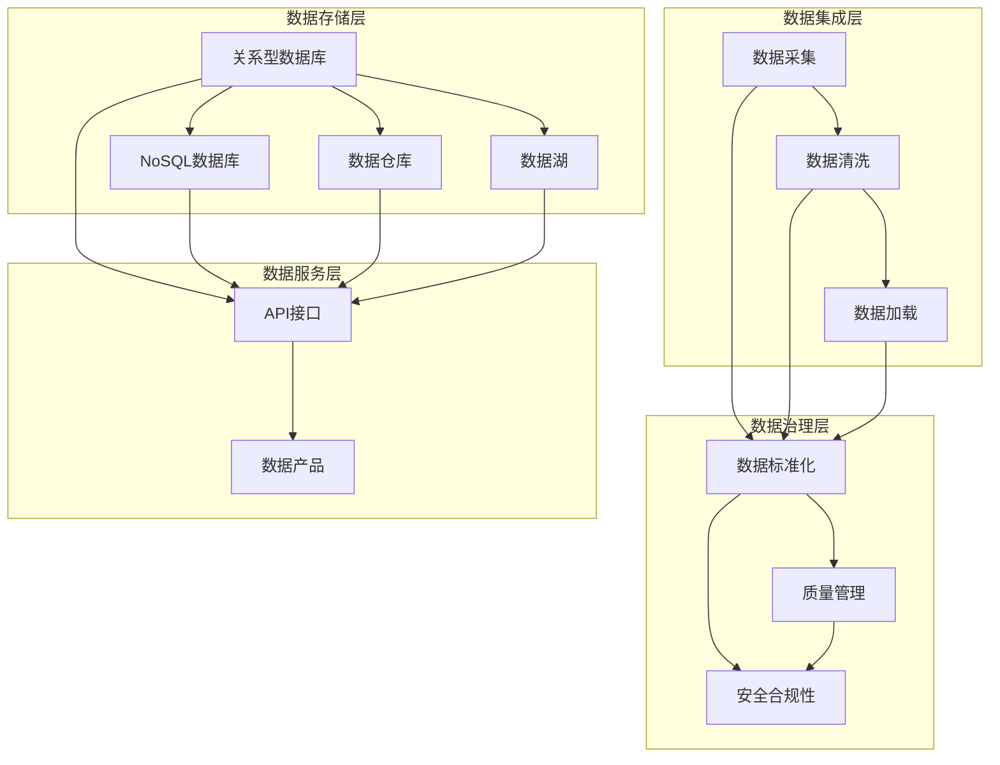
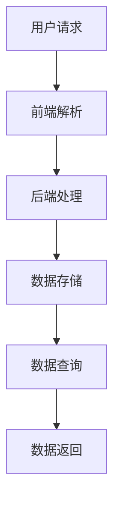
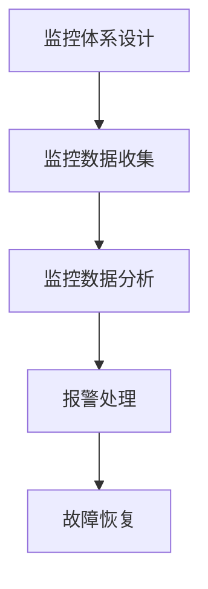
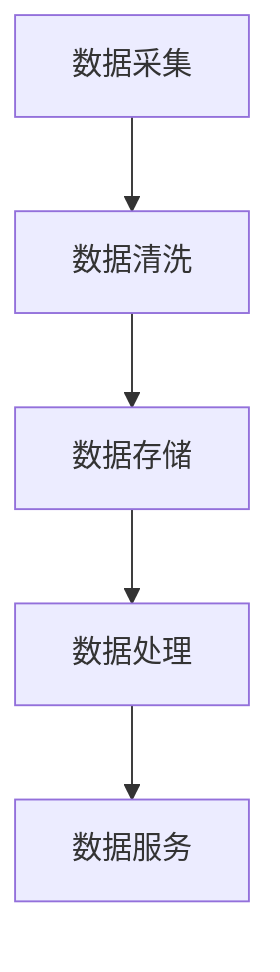
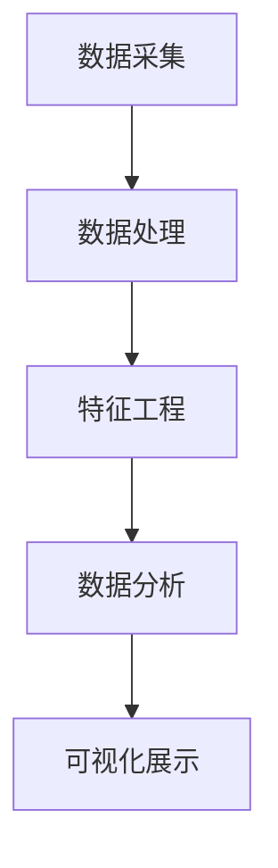

                 

### 关键词

1. **数据中台**
2. **数据基础设施**
3. **业务赋能**
4. **架构设计**
5. **项目实战**
6. **最佳实践**
7. **技术栈**

### 摘要

本文将深入探讨数据中台这一重要的技术概念，详细分析其背景、组成部分、技术栈、架构模式，并逐步展示如何进行系统架构设计、项目实战以及最佳实践。通过逻辑清晰、结构紧凑的论述，我们旨在为读者提供一个全面、易懂的指导，帮助其在业务中有效构建和利用数据中台这一数据基础设施，以实现业务的数字化转型和高效运营。

## 第一部分：数据中台概述

### 第1章：数据中台的概念与背景

#### 1.1 数据中台的定义

数据中台（Data Hub）是一种以数据为核心，集数据集成、治理、存储、分析和服务于一体的综合性平台。它不仅承载了企业内部的数据处理任务，还为企业提供了对外数据服务的接口，是企业数字化转型和数据驱动决策的关键基础设施。

#### 1.1.1 数据中台的起源

数据中台的概念起源于互联网企业，尤其是在大数据和云计算技术快速发展的背景下，互联网企业为了更好地管理和利用海量数据，逐步形成了数据中台这一架构模式。随着这一模式的成熟，越来越多的传统企业也开始借鉴并实施数据中台，以应对数据治理和业务敏捷性需求。

#### 1.1.2 数据中台的作用与意义

数据中台在企业中的作用主要体现在以下几个方面：

1. **数据集成**：通过数据中台，企业可以实现对内外部数据的集成，打破数据孤岛，实现数据资源的统一管理和利用。
2. **数据治理**：数据中台提供了数据治理的功能，包括数据质量管理、数据安全和隐私保护等，确保数据的高质量和合规性。
3. **数据服务**：数据中台为企业内部和外部提供数据服务，支持业务决策和产品创新。
4. **业务敏捷性**：数据中台通过模块化、灵活的架构设计，能够快速响应业务需求，提高企业的业务敏捷性。

#### 1.1.3 数据中台与大数据平台的区别

虽然数据中台和大数据平台都是企业数据处理的重要工具，但它们在定位和功能上存在一定的区别：

1. **定位不同**：大数据平台更侧重于大数据存储、计算和分析，而数据中台则更注重数据的集成、治理和服务。
2. **功能侧重点**：大数据平台主要解决数据量大、计算复杂的问题，而数据中台则更关注数据的质量、安全和合规性。
3. **应用场景**：大数据平台通常用于企业内部的数据分析和挖掘，而数据中台则既可以服务于内部业务，也可以对外提供数据服务。

#### 1.2 数据中台的组成部分

数据中台由以下几个核心组成部分构成：

1. **数据集成**：数据集成层负责将内外部数据源进行整合，实现数据的一站式接入和管理。
2. **数据治理**：数据治理层负责数据的清洗、转换、校验和质量保证，确保数据的高质量和合规性。
3. **数据存储**：数据存储层负责数据的存储和管理，包括关系型数据库、NoSQL数据库、数据仓库和数据湖等。
4. **数据服务**：数据服务层为企业内部和外部提供数据接口，支持数据共享和业务应用。

#### 1.3 数据中台的技术栈

数据中台的技术栈涵盖了多个领域，包括大数据技术、云计算技术和AI技术。以下是几个关键技术的概述：

1. **大数据技术**：如Hadoop、Spark等，用于大规模数据存储和处理。
2. **云计算技术**：如AWS、Azure、阿里云等，提供弹性的计算和存储资源。
3. **AI技术**：如机器学习、深度学习、自然语言处理等，用于数据分析和智能决策。

#### 1.4 数据中台的架构模式

数据中台的架构模式有多种，常见的包括分层架构、微服务架构和数据网格架构。每种架构模式都有其独特的优势和适用场景。

1. **分层架构**：将数据中台分为数据集成层、数据治理层、数据存储层和数据服务层，层次分明，便于管理。
2. **微服务架构**：将数据中台分解为多个微服务，每个微服务负责特定的功能，独立开发、部署和维护，提高系统的灵活性和可扩展性。
3. **数据网格架构**：将数据中台看作一个分布式系统，通过数据网格技术实现数据的高效存储、传输和处理。

#### 1.5 数据中台的发展趋势

数据中台作为企业数字化转型的关键基础设施，其发展趋势体现在以下几个方面：

1. **技术融合**：数据中台将与云计算、大数据、AI等新兴技术更加紧密地融合，实现更高效的数据管理和分析。
2. **行业定制**：不同行业的数据中台将根据行业特点进行定制化设计，满足行业特定的数据需求。
3. **数据安全与隐私**：随着数据安全法规的日益严格，数据中台将更加注重数据安全和隐私保护。

#### 1.6 本章小结

本章对数据中台的概念、背景、组成部分、技术栈、架构模式和发展趋势进行了详细阐述，为后续章节的深入分析奠定了基础。在接下来的章节中，我们将进一步探讨数据中台的系统架构设计、项目实战和最佳实践。

## 第二部分：数据中台的系统架构设计

### 第2章：数据中台的架构设计与实现

#### 2.1 数据中台的设计原则

在设计和构建数据中台时，需要遵循以下原则，以确保系统的可扩展性、可靠性、高效性和易用性：

1. **可扩展性**：数据中台应具备良好的可扩展性，能够根据业务需求快速扩展计算和存储资源，以应对数据量的增长。
2. **可靠性**：数据中台需要保证数据的高可靠性和一致性，确保业务决策的准确性。
3. **高效性**：数据中台应优化数据处理流程，提高数据处理速度和性能，降低延迟。
4. **易用性**：数据中台应提供友好的用户界面和便捷的操作体验，降低用户使用门槛。

#### 2.2 数据中台的架构设计

数据中台的架构设计分为以下几个层次：

1. **数据集成层**：负责数据的采集、清洗和加载，实现数据的一站式接入和管理。
2. **数据治理层**：负责数据的标准化、质量管理、数据安全和合规性检查。
3. **数据存储层**：负责数据的存储和管理，包括关系型数据库、NoSQL数据库、数据仓库和数据湖等。
4. **数据服务层**：负责数据的共享和业务应用，提供API接口和数据产品。

以下是一个简化的数据中台架构图（使用Mermaid绘制）：



#### 2.3 数据中台的接口设计与实现

数据中台的接口设计应遵循RESTful API设计原则，提供简洁、直观的接口文档，以便开发者快速上手和使用。以下是一个示例接口设计：

```yaml
# 接口文档示例
GET /api/v1/data/integrate
# 功能：获取集成数据
# 参数：
  - source: 数据源名称
  - format: 数据格式
# 返回值：
  - status: 状态码
  - data: 数据内容
  - message: 消息
```

#### 2.4 数据中台的交互设计

数据中台的交互设计应注重用户操作体验，包括用户界面设计和系统交互设计。以下是一些关键点：

1. **用户界面设计**：使用直观的界面元素和布局，提高用户操作的便捷性。
2. **系统交互设计**：通过事件驱动和异步处理，提高系统的响应速度和用户体验。

以下是一个简化的数据中台交互设计流程图（使用Mermaid绘制）：



#### 2.5 数据中台的监控与运维

数据中台的监控与运维是确保系统稳定运行的重要环节，包括以下几个方面：

1. **监控体系设计**：建立全面的监控体系，实时监控系统的运行状态和性能指标。
2. **运维流程**：制定详细的运维流程，确保系统的高可用性和故障快速恢复。

以下是一个简化的数据中台监控与运维流程图（使用Mermaid绘制）：



#### 2.6 本章小结

本章详细介绍了数据中台的设计原则、架构设计、接口设计与实现、交互设计以及监控与运维。通过本章的学习，读者应能够对数据中台的系统架构设计有一个全面的理解，为后续的项目实战和最佳实践打下坚实的基础。

## 第三部分：数据中台项目实战

### 第3章：构建数据中台的实战案例

#### 3.1 项目背景

本案例将介绍一个企业级数据中台的构建过程，该企业是一家大型电商公司，业务规模庞大，数据量巨大。随着业务的快速发展，企业内部数据孤岛问题突出，数据治理能力不足，亟需构建一个高效、稳定的数据中台，以支持业务的持续发展和数据驱动决策。

#### 3.1.1 项目概述

本项目的主要目标包括：

1. **数据集成**：将企业内部及外部数据进行统一接入和管理，实现数据的全面整合。
2. **数据治理**：建立完善的数据治理体系，确保数据质量，提高数据可信度。
3. **数据分析**：提供高效的数据分析能力，支持业务决策和运营优化。
4. **数据服务**：构建数据服务接口，为企业内部和外部应用提供数据支持。

#### 3.1.2 项目目标

1. **数据集成**：实现多源数据的统一接入，包括内部业务系统数据、第三方数据源、物联网设备数据等。
2. **数据治理**：建立数据质量管理流程，确保数据的一致性、准确性和合规性。
3. **数据分析**：利用大数据技术进行实时数据分析和离线数据分析，提供丰富的数据报表和可视化工具。
4. **数据服务**：构建API接口和数据产品，支持业务应用的灵活调用和数据共享。

#### 3.1.3 项目挑战

本项目面临的主要挑战包括：

1. **数据多样性**：企业内部和外部的数据源类型繁多，包括结构化数据、半结构化数据和非结构化数据，如何高效地统一管理和处理这些数据是一个挑战。
2. **数据质量**：数据质量问题是企业数字化转型中的常见问题，如何在海量数据中保证数据的质量和准确性是关键。
3. **系统稳定性**：在业务高峰期，如何保证数据中台的稳定运行，确保数据的及时处理和服务的响应速度。
4. **数据安全与隐私**：在数据共享和开放的过程中，如何保护用户隐私和确保数据安全是一个重要课题。

#### 3.2 技术栈与工具选择

为了实现本项目目标，我们选择了以下技术栈和工具：

1. **大数据技术栈**：
   - 数据采集：Kafka、Flume
   - 数据处理：Apache Spark、Flink
   - 数据存储：HDFS、HBase、MongoDB
   - 数据仓库：Apache Hive、Apache Impala

2. **云计算技术栈**：
   - 云平台：AWS、阿里云
   - 容器化技术：Docker、Kubernetes
   - 自动化部署：Ansible、Jenkins

3. **AI技术栈**：
   - 机器学习框架：TensorFlow、PyTorch
   - 数据分析工具：Tableau、Power BI

4. **开发工具**：
   - 编程语言：Python、Java
   - 版本控制：Git
   - 静态网站生成：Jekyll、Hexo

#### 3.3 数据中台的实现

数据中台的实现分为以下几个关键步骤：

1. **数据集成**：
   - 采集企业内部业务系统数据，包括订单、库存、用户行为等。
   - 采集第三方数据源，如社交媒体、广告平台等。
   - 采集物联网设备数据，如传感器数据、设备状态等。

2. **数据治理**：
   - 数据清洗：去除重复数据、处理缺失值、纠正错误数据等。
   - 数据标准化：统一数据格式和命名规范，确保数据的一致性。
   - 数据质量管理：建立数据质量监控体系，定期检查数据质量。

3. **数据存储**：
   - 结构化数据存储：使用关系型数据库（如MySQL）或NoSQL数据库（如MongoDB）。
   - 半结构化数据存储：使用HDFS和HBase等大数据存储技术。
   - 非结构化数据存储：使用数据湖技术（如Amazon S3、阿里云OSS）。

4. **数据分析**：
   - 实时数据分析：使用Apache Spark和Flink进行实时数据处理和计算。
   - 离线数据分析：使用Apache Hive和Apache Impala进行离线数据处理和报表生成。

5. **数据服务**：
   - 构建API接口：使用RESTful API设计原则，提供数据查询和操作接口。
   - 数据产品化：开发数据可视化工具，如Tableau和Power BI，将数据分析结果以直观的图表形式展示。

以下是一个简化的数据中台实现流程图（使用Mermaid绘制）：



#### 3.4 代码应用解读与分析

以下是一个数据中台的关键代码片段，用于实现数据清洗和加载功能。代码使用Python编写，结合了Pandas库和Spark库的功能。

```python
# 数据清洗和加载代码示例
import pandas as pd
from pyspark.sql import SparkSession

# 初始化Spark会话
spark = SparkSession.builder.appName("DataCleaningExample").getOrCreate()

# 读取CSV文件
df = pd.read_csv("data_source.csv")

# 数据清洗
# 去除重复数据
df = df.drop_duplicates()

# 处理缺失值
df.fillna(df.mean(), inplace=True)

# 数据标准化
df['age'] = df['age'].map(lambda x: x if x > 0 else None)

# 将Pandas DataFrame转换为Spark DataFrame
spark_df = spark.createDataFrame(df)

# 数据加载到HDFS
spark_df.write.format("parquet").mode("overwrite").saveAsTable("cleaned_data")

# 关闭Spark会话
spark.stop()
```

该代码首先读取CSV文件，然后进行数据清洗操作，包括去除重复数据、处理缺失值和数据标准化。最后，将清洗后的数据加载到HDFS中。代码中使用了Pandas库进行数据操作，结合了Spark库进行分布式数据处理。

#### 3.5 实际案例分析与详细讲解

以下是一个数据中台的实际案例，用于分析用户购买行为，为企业提供销售策略建议。

**案例背景**：某电商企业希望通过分析用户购买行为，识别高价值用户和潜在流失用户，从而优化销售策略，提高销售额。

**案例目标**：
1. **识别高价值用户**：分析用户的购买频次、购买金额等指标，识别高价值用户。
2. **识别潜在流失用户**：分析用户的购买行为特征，识别可能流失的用户，并制定挽留策略。

**实现步骤**：
1. **数据采集**：采集用户的订单数据，包括订单编号、用户ID、购买时间、购买金额等。
2. **数据处理**：对采集的数据进行清洗和预处理，包括去除重复数据、处理缺失值等。
3. **特征工程**：提取用户的购买行为特征，如购买频次、平均购买金额、最近一次购买时间等。
4. **数据分析**：使用机器学习算法进行用户行为分析，识别高价值用户和潜在流失用户。
5. **可视化展示**：将分析结果以图表形式展示，为业务决策提供支持。

**详细讲解**：
1. **数据采集**：
   - 数据来源：企业的订单数据库。
   - 数据格式：CSV文件。

2. **数据处理**：
   - 数据清洗：去除重复订单、处理缺失值。
   - 数据预处理：将日期格式转换为标准格式，提取用户ID和订单编号。

3. **特征工程**：
   - 购买频次：计算用户在指定时间范围内的订单数量。
   - 平均购买金额：计算用户在指定时间范围内的平均购买金额。
   - 最近一次购买时间：计算用户在指定时间范围内的最近一次购买时间。

4. **数据分析**：
   - 高价值用户识别：使用聚类算法（如K-Means）将用户分为高价值用户和普通用户。
   - 潜在流失用户识别：使用生存分析（如Cox比例风险模型）预测用户的流失风险。

5. **可视化展示**：
   - 购买行为趋势图：展示用户的购买频次、购买金额等指标。
   - 用户分类图表：展示高价值用户和潜在流失用户的分布情况。

以下是一个简化的数据中台实际案例流程图（使用Mermaid绘制）：



通过该案例，企业可以识别出高价值用户和潜在流失用户，从而制定更有针对性的销售策略，提高用户满意度和销售额。

#### 3.6 项目小结

本项目通过构建数据中台，实现了数据的集成、治理、分析和服务，为企业提供了强大的数据支持。以下是本项目的主要成果和经验教训：

1. **项目成果**：
   - 数据集成：实现了多源数据的统一接入和管理。
   - 数据治理：建立了数据质量管理流程，提高了数据质量。
   - 数据分析：提供了丰富的数据报表和可视化工具，支持业务决策。
   - 数据服务：构建了API接口和数据产品，支持业务应用的灵活调用。

2. **经验教训**：
   - 数据多样性：在面对多种数据源时，需灵活选择数据采集和处理工具。
   - 数据质量：数据质量是数据中台的核心，必须建立完善的数据质量管理流程。
   - 系统稳定性：在业务高峰期，需确保系统的稳定运行，优化数据处理流程。
   - 数据安全与隐私：在数据共享和开放的过程中，需注重数据安全和用户隐私保护。

通过本项目的实践，企业可以更好地利用数据中台这一数据基础设施，实现业务的数字化转型和高效运营。未来，数据中台将朝着更智能化、更高效化的方向发展，为企业创造更大的价值。

## 第四部分：数据中台的最佳实践与拓展

### 第4章：数据中台的最佳实践

#### 4.1 数据中台建设的关键步骤

1. **需求分析**：明确数据中台的建设目标和需求，包括数据集成、治理、分析和服务的具体要求。
2. **架构设计**：根据需求分析，设计数据中台的架构，选择合适的架构模式和技术栈。
3. **技术选型**：选择适合项目需求的技术组件和工具，如大数据技术、云计算技术和AI技术。
4. **数据治理**：建立数据质量管理流程，确保数据的高质量和合规性。
5. **系统实施**：按照架构设计和技术选型，进行系统实施和部署。
6. **监控与运维**：建立监控体系，确保系统的稳定运行和高效运维。

#### 4.2 数据中台建设中的常见问题与解决方案

1. **数据质量**：数据质量问题是数据中台建设中的常见问题，解决方案包括：
   - 数据清洗：去除重复数据、处理缺失值、纠正错误数据等。
   - 数据标准化：统一数据格式和命名规范，确保数据的一致性。
   - 数据质量管理：建立数据质量监控体系，定期检查数据质量。

2. **系统性能**：系统性能问题是影响数据中台使用体验的重要因素，解决方案包括：
   - 数据分区：合理设置数据分区，提高数据处理速度。
   - 数据压缩：使用数据压缩技术，减少存储空间占用。
   - 缓存策略：使用缓存技术，提高系统响应速度。

3. **数据安全**：数据安全问题是数据中台建设中的关键问题，解决方案包括：
   - 数据加密：对敏感数据进行加密，确保数据传输和存储安全。
   - 访问控制：建立严格的访问控制机制，限制对数据的访问权限。
   - 安全审计：建立安全审计机制，监控和记录数据访问和操作行为。

#### 4.3 数据中台应用的最佳实践

1. **业务驱动**：数据中台的建设和应用应紧密围绕业务需求，确保数据中台能够为业务提供实际价值。
2. **数据驱动决策**：通过数据分析和可视化工具，支持业务决策，提高决策的准确性和效率。
3. **敏捷开发**：采用敏捷开发方法，快速迭代和优化数据中台功能，满足业务变化需求。
4. **数据共享与开放**：建立数据共享与开放机制，促进数据资源的充分利用和业务创新。
5. **持续优化**：定期评估数据中台的运行效果，持续优化系统性能和数据质量。

#### 4.4 数据中台未来的发展趋势

1. **智能化**：随着人工智能技术的发展，数据中台将实现更智能的数据处理和分析，提高系统的智能化水平。
2. **数据治理**：数据治理将在数据中台中扮演更加重要的角色，确保数据的质量、安全和合规性。
3. **多云与混合云**：数据中台将支持多云和混合云架构，提高系统的灵活性和可扩展性。
4. **边缘计算**：数据中台将向边缘计算延伸，支持实时数据处理和智能决策，提高系统的响应速度和性能。
5. **数据隐私与安全**：随着数据安全法规的不断完善，数据中台将更加注重数据隐私保护和安全防护。

### 本章小结

本章通过最佳实践和常见问题的解决方案，为数据中台的建设和应用提供了指导。随着技术的不断进步和业务需求的多样化，数据中台将不断发展，成为企业数字化转型的重要基础设施。

## 作者信息

作者：AI天才研究院/AI Genius Institute & 禅与计算机程序设计艺术 /Zen And The Art of Computer Programming

## 全文总结

本文系统地介绍了数据中台这一重要的数据基础设施，从概念、背景、组成部分、技术栈、架构设计到项目实战和最佳实践，进行了全面、深入的探讨。通过本文，读者可以了解数据中台的基本概念、作用和重要性，掌握其系统架构设计的关键要素，以及如何在实际项目中有效地构建和利用数据中台。同时，本文还提供了丰富的最佳实践和解决方案，帮助读者应对数据中台建设过程中可能遇到的问题。随着技术的不断进步和业务需求的增长，数据中台将在企业数字化转型中发挥越来越重要的作用，为业务决策和运营优化提供强有力的支持。希望本文能够为读者在数据中台领域的研究和应用提供有益的参考和启示。

## 参考资料

1. 《数据中台：构建企业数据基础设施》
2. 《大数据技术导论》
3. 《云计算：概念、技术和应用》
4. 《人工智能：一种现代的方法》
5. 《数据治理实践指南》
6. 《边缘计算：技术与实践》
7. 《数据中台案例分析：企业数字化转型之路》

## 拓展阅读

1. 数据中台与大数据平台的对比分析
2. 数据中台在金融行业的应用实践
3. 数据中台与AI技术的深度融合
4. 数据中台在智能制造中的应用场景
5. 数据中台建设中的数据安全与隐私保护
6. 数据中台技术趋势及未来展望
7. 数据中台在互联网公司的实践案例
8. 数据中台在医疗健康领域的应用探索
9. 数据中台在零售行业的成功实践
10. 数据中台在公共安全领域的应用案例

