                 

### 数据仓库vs数据湖vs湖仓一体

#### 关键词：数据仓库、数据湖、湖仓一体、数据管理、大数据

> 摘要：本文将深入探讨数据仓库、数据湖和湖仓一体这三种数据管理架构的核心概念、技术原理、系统架构及其在项目实战中的应用。通过对比分析，我们旨在帮助读者理解它们之间的联系与区别，掌握最佳实践，为未来大数据领域的发展做好准备。

## 第一部分：背景介绍

### 第1章：数据管理与大数据概念

#### 1.1 数据仓库、数据湖和湖仓一体简介

数据仓库、数据湖和湖仓一体是大数据领域中至关重要的三个概念，它们分别代表了数据存储和管理的不同阶段和技术发展方向。

- **数据仓库**：数据仓库是一个面向主题的、集成的、相对稳定的、反映历史变化的数据集合，用于支持管理决策。

- **数据湖**：数据湖是一个用于存储原始数据的大容量数据存储系统，支持数据的多样性，包括结构化、半结构化和非结构化数据。

- **湖仓一体**：湖仓一体是将数据仓库和数据湖的功能集成到一起的架构，提供了统一的数据管理平台，兼具数据仓库的查询优化和数据湖的存储灵活性。

#### 1.2 数据管理与大数据的发展历程

数据管理与大数据的发展历程可以分为以下几个阶段：

- **第一阶段：传统数据库时代**：以关系型数据库为核心，支持结构化数据存储和查询。

- **第二阶段：数据仓库时代**：以数据仓库为中心，支持历史数据的集成和决策支持。

- **第三阶段：数据湖时代**：以数据湖为核心，支持多样化数据存储和实时分析。

- **第四阶段：湖仓一体时代**：结合数据仓库和数据湖的优势，提供统一的数据管理解决方案。

#### 1.3 数据仓库、数据湖和湖仓一体之间的联系与区别

数据仓库、数据湖和湖仓一体之间的联系与区别如下：

- **联系**：三者都是大数据领域的核心技术，都用于数据存储和管理，且在技术发展方向上相互影响。

- **区别**：
  - **数据仓库**：侧重于数据集成和查询优化，适用于结构化数据。
  - **数据湖**：侧重于存储原始数据和多样性数据，适用于半结构化和非结构化数据。
  - **湖仓一体**：整合了数据仓库和数据湖的优势，既支持结构化数据的查询优化，也支持多样化数据的存储和实时分析。

### 第2章：核心概念与联系

#### 2.1 数据仓库的概念、属性和优势

数据仓库是一个面向主题的、集成的、相对稳定的、反映历史变化的数据集合，其核心属性如下：

- **主题性**：围绕业务主题进行数据组织，有助于业务分析和决策。
- **集成性**：将来自多个源的数据进行整合，消除数据冗余和一致性。
- **稳定性**：数据经过清洗、转换和集成后，确保数据质量，支持长期存储。
- **历史性**：记录数据的历史变化，支持数据分析和趋势预测。

数据仓库的优势包括：

- **高效查询**：通过数据建模和索引优化，实现快速数据查询。
- **数据一致性**：统一数据源，消除数据冗余，确保数据质量。
- **支持决策**：提供历史数据和实时分析，支持管理决策。

#### 2.2 数据湖的概念、属性和优势

数据湖是一个用于存储原始数据的大容量数据存储系统，其核心属性如下：

- **多样性**：支持结构化、半结构化和非结构化数据的存储。
- **灵活性**：无需预先定义数据模型，支持数据自由扩展。
- **大容量**：支持海量数据的存储和处理，适用于大数据场景。
- **实时性**：支持实时数据摄取和处理，满足实时分析需求。

数据湖的优势包括：

- **灵活性**：支持多种数据类型的存储，降低数据整合难度。
- **扩展性**：无需预先定义数据模型，适应数据变化。
- **成本效益**：通过存储原始数据，降低数据清洗和转换成本。

#### 2.3 湖仓一体的概念、属性和优势

湖仓一体是将数据仓库和数据湖的功能集成到一起的架构，其核心属性如下：

- **统一管理**：提供统一的数据管理平台，支持数据仓库和数据的湖功能。
- **数据集成**：实现数据仓库和数据湖之间的数据流转和集成。
- **灵活性**：兼具数据仓库的查询优化和数据湖的存储灵活性。

湖仓一体的优势包括：

- **统一视图**：提供统一的数据视图，支持跨源数据分析和查询。
- **灵活性**：支持多种数据类型的存储和查询，满足不同业务需求。
- **成本效益**：通过整合数据仓库和数据湖，降低整体成本。

#### 2.4 三者之间的对比分析

数据仓库、数据湖和湖仓一体之间的对比分析如下：

- **数据类型**：数据仓库适用于结构化数据，数据湖适用于多种数据类型，湖仓一体兼具两者。
- **查询性能**：数据仓库注重查询性能，数据湖注重存储灵活性，湖仓一体平衡两者。
- **使用场景**：数据仓库适用于决策支持和数据分析，数据湖适用于大数据处理和实时分析，湖仓一体适用于综合业务场景。
- **成本**：数据仓库成本较高，数据湖成本较低，湖仓一体介于两者之间。

## 第二部分：技术原理讲解

### 第3章：数据仓库技术原理

#### 3.1 数据仓库的架构设计

数据仓库的架构设计通常包括以下组件：

- **数据源**：包括关系型数据库、非关系型数据库、日志文件等。
- **数据仓库**：用于存储经过清洗、转换和集成的数据。
- **数据集市**：为特定业务部门提供定制化的数据报表和分析。
- **ETL工具**：用于数据提取、转换和加载。
- **查询引擎**：用于数据查询和分析。

#### 3.2 数据仓库的ETL过程

数据仓库的ETL过程主要包括以下步骤：

- **数据提取**：从数据源中提取数据。
- **数据清洗**：清洗和转换数据，消除数据冗余和一致性。
- **数据加载**：将清洗后的数据加载到数据仓库中。

#### 3.3 数据仓库的数据建模

数据仓库的数据建模主要包括以下方法：

- **星型模型**：以事实表为中心，连接多个维度表。
- **雪花模型**：在星型模型的基础上，对维度表进行进一步规范化。
- **星座模型**：多个星型模型的组合，适用于复杂的数据关系。

#### 3.4 数据仓库的查询优化

数据仓库的查询优化主要包括以下方法：

- **索引优化**：通过建立索引提高查询性能。
- **分区优化**：将数据仓库分成多个分区，提高查询效率。
- **查询缓存**：缓存查询结果，减少查询时间。

### 第4章：数据湖技术原理

#### 4.1 数据湖的架构设计

数据湖的架构设计通常包括以下组件：

- **数据存储**：用于存储原始数据和转换后的数据。
- **数据处理**：包括数据摄取、清洗、转换和加载。
- **数据安全**：确保数据的安全和隐私。
- **数据质量**：监控和维护数据质量。
- **数据治理**：管理数据生命周期和数据质量。

#### 4.2 数据湖的数据处理

数据湖的数据处理主要包括以下步骤：

- **数据摄取**：从各种数据源摄取原始数据。
- **数据清洗**：清洗和转换原始数据，消除数据冗余和一致性。
- **数据转换**：将清洗后的数据转换成适合存储和查询的格式。
- **数据加载**：将转换后的数据加载到数据存储中。

#### 4.3 数据湖的数据存储

数据湖的数据存储通常采用分布式文件系统，如HDFS或Alluxio，支持海量数据的存储和访问。

#### 4.4 数据湖的安全与隐私

数据湖的安全与隐私主要包括以下措施：

- **数据加密**：对敏感数据进行加密，确保数据安全。
- **访问控制**：限制对数据的访问权限，防止数据泄露。
- **审计与监控**：监控数据访问和操作，确保数据合规。

### 第5章：湖仓一体技术原理

#### 5.1 湖仓一体的架构设计

湖仓一体的架构设计通常包括以下组件：

- **数据仓库**：用于存储经过清洗、转换和集成的数据。
- **数据湖**：用于存储原始数据和转换后的数据。
- **数据处理**：包括数据摄取、清洗、转换和加载。
- **数据安全**：确保数据的安全和隐私。
- **数据治理**：管理数据生命周期和数据质量。

#### 5.2 湖仓一体的数据处理

湖仓一体的数据处理主要包括以下步骤：

- **数据摄取**：从各种数据源摄取原始数据。
- **数据清洗**：清洗和转换原始数据，消除数据冗余和一致性。
- **数据转换**：将清洗后的数据转换成适合存储和查询的格式。
- **数据加载**：将转换后的数据加载到数据仓库或数据湖中。

#### 5.3 湖仓一体与数据仓库的集成

湖仓一体与数据仓库的集成主要包括以下方法：

- **数据同步**：将数据仓库中的数据同步到数据湖中。
- **数据共享**：在数据仓库和数据湖之间共享数据。
- **数据转换**：将数据湖中的原始数据转换成适合数据仓库查询的格式。

#### 5.4 湖仓一体的优势与应用场景

湖仓一体的优势主要包括：

- **统一管理**：提供统一的数据管理平台，简化数据管理和维护。
- **灵活性**：支持多种数据类型的存储和查询，满足不同业务需求。
- **扩展性**：支持海量数据的存储和处理，适应数据增长。

湖仓一体的应用场景包括：

- **大数据分析**：处理海量数据，支持实时分析和决策支持。
- **数据科学**：支持数据科学实验和模型训练。
- **企业级数据管理**：提供统一的数据管理平台，支持跨部门的数据整合和分析。

## 第三部分：系统架构设计

### 第6章：数据仓库系统架构设计

#### 6.1 系统功能设计

数据仓库系统功能设计包括以下模块：

- **数据提取**：从数据源中提取数据。
- **数据清洗**：清洗和转换数据，消除数据冗余和一致性。
- **数据加载**：将清洗后的数据加载到数据仓库中。
- **数据查询**：提供数据查询和分析功能。
- **数据报表**：生成数据报表和分析报告。

#### 6.2 系统架构设计

数据仓库系统架构设计主要包括以下组件：

- **数据源**：包括关系型数据库、非关系型数据库、日志文件等。
- **数据仓库**：用于存储经过清洗、转换和集成的数据。
- **数据集市**：为特定业务部门提供定制化的数据报表和分析。
- **ETL工具**：用于数据提取、转换和加载。
- **查询引擎**：用于数据查询和分析。

#### 6.3 系统接口设计

数据仓库系统接口设计主要包括以下接口：

- **数据源接口**：用于连接和数据源进行数据交互。
- **ETL接口**：用于数据提取、转换和加载。
- **查询接口**：用于数据查询和分析。
- **报表接口**：用于生成数据报表和分析报告。

#### 6.4 系统交互

数据仓库系统交互主要包括以下流程：

1. **数据提取**：从数据源中提取数据。
2. **数据清洗**：清洗和转换数据，消除数据冗余和一致性。
3. **数据加载**：将清洗后的数据加载到数据仓库中。
4. **数据查询**：用户通过查询接口查询数据。
5. **数据报表**：用户通过报表接口生成数据报表。

### 第7章：数据湖系统架构设计

#### 7.1 系统功能设计

数据湖系统功能设计包括以下模块：

- **数据摄取**：从各种数据源摄取原始数据。
- **数据清洗**：清洗和转换原始数据，消除数据冗余和一致性。
- **数据转换**：将清洗后的数据转换成适合存储和查询的格式。
- **数据存储**：存储原始数据和转换后的数据。
- **数据查询**：提供数据查询和分析功能。

#### 7.2 系统架构设计

数据湖系统架构设计主要包括以下组件：

- **数据存储**：用于存储原始数据和转换后的数据。
- **数据处理**：包括数据摄取、清洗、转换和加载。
- **数据安全**：确保数据的安全和隐私。
- **数据质量**：监控和维护数据质量。
- **数据治理**：管理数据生命周期和数据质量。

#### 7.3 系统接口设计

数据湖系统接口设计主要包括以下接口：

- **数据摄取接口**：用于从数据源摄取原始数据。
- **数据处理接口**：用于数据清洗、转换和加载。
- **数据存储接口**：用于存储原始数据和转换后的数据。
- **查询接口**：用于数据查询和分析。
- **安全接口**：用于数据加密、访问控制和审计。

#### 7.4 系统交互

数据湖系统交互主要包括以下流程：

1. **数据摄取**：从各种数据源摄取原始数据。
2. **数据清洗**：清洗和转换原始数据，消除数据冗余和一致性。
3. **数据转换**：将清洗后的数据转换成适合存储和查询的格式。
4. **数据存储**：将转换后的数据存储到数据湖中。
5. **数据查询**：用户通过查询接口查询数据。

### 第8章：湖仓一体系统架构设计

#### 8.1 系统功能设计

湖仓一体系统功能设计包括以下模块：

- **数据仓库功能**：提供数据仓库的查询优化、数据建模和查询分析功能。
- **数据湖功能**：提供数据湖的原始数据存储、数据处理和实时分析功能。
- **数据处理**：包括数据摄取、清洗、转换和加载。
- **数据安全**：确保数据的安全和隐私。
- **数据治理**：管理数据生命周期和数据质量。

#### 8.2 系统架构设计

湖仓一体系统架构设计主要包括以下组件：

- **数据仓库**：用于存储经过清洗、转换和集成的数据。
- **数据湖**：用于存储原始数据和转换后的数据。
- **数据处理**：包括数据摄取、清洗、转换和加载。
- **数据安全**：包括数据加密、访问控制和审计。
- **数据治理**：包括数据生命周期管理和数据质量管理。

#### 8.3 系统接口设计

湖仓一体系统接口设计主要包括以下接口：

- **数据仓库接口**：用于数据仓库的查询、建模和分析。
- **数据湖接口**：用于数据湖的数据存储、处理和查询。
- **数据处理接口**：用于数据摄取、清洗、转换和加载。
- **安全接口**：用于数据加密、访问控制和审计。
- **治理接口**：用于数据生命周期管理和数据质量管理。

#### 8.4 系统交互

湖仓一体系统交互主要包括以下流程：

1. **数据摄取**：从各种数据源摄取原始数据。
2. **数据清洗**：清洗和转换原始数据，消除数据冗余和一致性。
3. **数据转换**：将清洗后的数据转换成适合存储和查询的格式。
4. **数据存储**：将转换后的数据存储到数据仓库或数据湖中。
5. **数据查询**：用户通过查询接口查询数据。
6. **数据治理**：管理数据生命周期和数据质量。

## 第四部分：项目实战

### 第9章：数据仓库项目实战

#### 9.1 环境安装与配置

1. **安装数据库**：安装MySQL数据库，配置数据库实例。
2. **安装ETL工具**：安装Apache NiFi或Apache Kafka等ETL工具，配置数据流。
3. **配置数据源**：配置数据库连接，测试数据提取功能。

#### 9.2 系统核心实现源代码

```python
import pymysql

# 连接数据库
conn = pymysql.connect(host='localhost', user='root', password='password', database='test')

# 创建数据表
with conn.cursor() as cursor:
    cursor.execute("CREATE TABLE IF NOT EXISTS student (id INT PRIMARY KEY, name VARCHAR(255))")
    conn.commit()

# 提取数据并插入到数据表中
with conn.cursor() as cursor:
    cursor.execute("INSERT INTO student (id, name) VALUES (1, 'Alice')")
    cursor.execute("INSERT INTO student (id, name) VALUES (2, 'Bob')")
    conn.commit()

# 关闭数据库连接
conn.close()
```

#### 9.3 代码应用解读与分析

上述代码实现了一个简单的数据仓库项目，主要包括以下步骤：

1. **安装和配置数据库**：安装MySQL数据库，配置数据库实例。
2. **安装ETL工具**：安装Apache NiFi或Apache Kafka等ETL工具，配置数据流。
3. **配置数据源**：配置数据库连接，测试数据提取功能。
4. **创建数据表**：创建数据表，存储学生信息。
5. **插入数据**：将学生信息插入到数据表中。
6. **关闭数据库连接**：关闭数据库连接。

通过上述步骤，我们可以实现一个简单但完整的数据仓库项目。

#### 9.4 实际案例分析与详细讲解剖析

假设我们有一个学校的学生信息管理系统，需要实现以下功能：

1. **学生信息管理**：录入学生信息，包括姓名、年龄、班级等。
2. **查询学生信息**：根据学生姓名或班级查询学生信息。

我们可以通过以下步骤实现上述功能：

1. **安装和配置数据库**：安装MySQL数据库，配置数据库实例。
2. **设计数据表结构**：创建学生表和学生成绩表，设计数据表结构。
3. **安装ETL工具**：安装Apache NiFi或Apache Kafka等ETL工具，配置数据流。
4. **配置数据源**：配置数据库连接，测试数据提取功能。
5. **数据插入**：将学生信息和学生成绩插入到数据表中。
6. **查询功能**：根据学生姓名或班级查询学生信息。

通过以上步骤，我们可以实现一个完整的学生信息管理系统。

#### 9.5 项目小结

通过本章节的实战项目，我们了解并实现了数据仓库的基本功能，包括数据提取、数据插入和数据查询。我们使用MySQL数据库作为数据存储，通过Python代码实现了数据表创建和数据插入。我们还讨论了一个实际案例，展示了数据仓库在学生信息管理系统中的应用。通过本项目，我们加深了对数据仓库的理解，为后续学习数据仓库高级技术和项目实战打下基础。

### 第10章：数据湖项目实战

#### 10.1 环境安装与配置

1. **安装Hadoop集群**：安装Hadoop集群，配置HDFS和YARN等组件。
2. **安装Spark**：安装Spark，配置Spark集群。
3. **配置数据摄取**：配置Kafka或Flume等数据摄取工具，连接数据源。

#### 10.2 系统核心实现源代码

```python
from pyspark.sql import SparkSession

# 创建Spark会话
spark = SparkSession.builder.appName("DataLakeExample").getOrCreate()

# 读取数据
df = spark.read.json("data.json")

# 显示数据
df.show()

# 写入数据到HDFS
df.write.mode("overwrite").parquet("data_parquet")

# 关闭Spark会话
spark.stop()
```

#### 10.3 代码应用解读与分析

上述代码实现了一个简单的数据湖项目，主要包括以下步骤：

1. **创建Spark会话**：创建Spark会话，配置应用程序名称。
2. **读取数据**：从HDFS中读取JSON数据，转换成DataFrame格式。
3. **显示数据**：显示读取到的数据。
4. **写入数据**：将DataFrame格式数据写入到HDFS中的Parquet文件。

通过上述步骤，我们可以实现一个简单但完整的数据湖项目。

#### 10.4 实际案例分析与详细讲解剖析

假设我们有一个电商平台，需要实现以下功能：

1. **订单数据存储**：存储电商平台的订单数据，包括商品名称、数量、价格等。
2. **实时数据查询**：根据订单ID或商品名称查询订单数据。

我们可以通过以下步骤实现上述功能：

1. **安装Hadoop集群**：安装Hadoop集群，配置HDFS和YARN等组件。
2. **安装Spark**：安装Spark，配置Spark集群。
3. **配置数据摄取**：配置Kafka或Flume等数据摄取工具，连接数据源。
4. **数据读取**：从Kafka或数据源中读取订单数据，转换成DataFrame格式。
5. **数据存储**：将DataFrame格式数据写入到HDFS中的Parquet文件。
6. **查询功能**：根据订单ID或商品名称查询订单数据。

通过以上步骤，我们可以实现一个完整的电商平台订单数据湖。

#### 10.5 项目小结

通过本章节的实战项目，我们了解并实现了数据湖的基本功能，包括数据摄取、数据读取和数据写入。我们使用Spark作为数据处理引擎，通过Python代码实现了数据读取和写入。我们还讨论了一个实际案例，展示了数据湖在电商平台中的应用。通过本项目，我们加深了对数据湖的理解，为后续学习数据湖高级技术和项目实战打下基础。

### 第11章：湖仓一体项目实战

#### 11.1 环境安装与配置

1. **安装Hadoop集群**：安装Hadoop集群，配置HDFS和YARN等组件。
2. **安装Spark**：安装Spark，配置Spark集群。
3. **安装数据仓库数据库**：安装MySQL或PostgreSQL等数据仓库数据库，配置数据库实例。
4. **安装ETL工具**：安装Apache NiFi或Apache Kafka等ETL工具，配置数据流。

#### 11.2 系统核心实现源代码

```python
import pyspark.sql.functions as F
from pyspark.sql import SparkSession

# 创建Spark会话
spark = SparkSession.builder.appName("LakeAndWarehouseExample").getOrCreate()

# 读取数据
dataframe = spark.read.format("json").load("data.json")

# 数据清洗
dataframe = dataframe.withColumn("price", F.col("price").cast("double"))

# 数据转换
dataframe = dataframe.select("productId", "productName", "price")

# 写入数据到数据仓库
dataframe.write.format("jdbc").options(url="jdbc:mysql://localhost:3306/warehouse", dbtable="products", user="root", password="password").mode("overwrite").save()

# 关闭Spark会话
spark.stop()
```

#### 11.3 代码应用解读与分析

上述代码实现了一个简单的湖仓一体项目，主要包括以下步骤：

1. **创建Spark会话**：创建Spark会话，配置应用程序名称。
2. **读取数据**：从HDFS中读取JSON数据，转换成DataFrame格式。
3. **数据清洗**：将价格列数据类型转换为double类型。
4. **数据转换**：选择productId、productName和price列。
5. **写入数据到数据仓库**：将DataFrame格式数据写入到MySQL数据库中。
6. **关闭Spark会话**：关闭Spark会话。

通过上述步骤，我们可以实现一个简单但完整的湖仓一体项目。

#### 11.4 实际案例分析与详细讲解剖析

假设我们有一个电商平台的销售数据，需要实现以下功能：

1. **数据摄取**：将销售数据从日志文件中摄取到数据湖中。
2. **数据清洗**：清洗和转换销售数据，确保数据质量。
3. **数据转换**：将清洗后的数据转换为适合数据仓库存储的格式。
4. **数据存储**：将转换后的数据存储到数据仓库数据库中。
5. **查询功能**：根据产品ID或产品名称查询销售数据。

我们可以通过以下步骤实现上述功能：

1. **安装Hadoop集群**：安装Hadoop集群，配置HDFS和YARN等组件。
2. **安装Spark**：安装Spark，配置Spark集群。
3. **安装数据仓库数据库**：安装MySQL或PostgreSQL等数据仓库数据库，配置数据库实例。
4. **安装ETL工具**：安装Apache NiFi或Apache Kafka等ETL工具，配置数据流。
5. **数据摄取**：使用Spark读取日志文件，将数据转换为DataFrame格式。
6. **数据清洗**：使用Spark对数据进行清洗和转换，确保数据质量。
7. **数据转换**：使用Spark将清洗后的数据转换为适合数据仓库存储的格式。
8. **数据存储**：使用Spark将转换后的数据写入到数据仓库数据库中。
9. **查询功能**：使用数据库查询工具根据产品ID或产品名称查询销售数据。

通过以上步骤，我们可以实现一个完整的电商平台销售数据湖仓一体系统。

#### 11.5 项目小结

通过本章节的实战项目，我们了解并实现了湖仓一体项目的基本功能，包括数据摄取、数据清洗、数据转换和数据存储。我们使用Spark作为数据处理引擎，通过Python代码实现了数据摄取和存储。我们还讨论了一个实际案例，展示了湖仓一体在电商平台销售数据中的应用。通过本项目，我们加深了对湖仓一体的理解，为后续学习湖仓一体高级技术和项目实战打下基础。

## 第五部分：最佳实践与总结

### 第12章：最佳实践与技巧

#### 12.1 设计原则与最佳实践

在进行数据仓库、数据湖和湖仓一体系统设计时，以下原则和最佳实践值得遵循：

1. **数据一致性**：确保数据在各个系统之间的准确性。
2. **性能优化**：针对查询和数据处理进行性能优化，提高系统效率。
3. **安全性**：加强对数据的安全保护，防止数据泄露和滥用。
4. **可扩展性**：设计灵活的系统架构，支持数据的增长和业务需求变化。
5. **数据治理**：建立完善的数据治理体系，确保数据质量和管理。

#### 12.2 避免的陷阱与常见问题

在实施数据仓库、数据湖和湖仓一体项目时，以下陷阱和常见问题应避免：

1. **数据冗余**：避免重复存储和传输相同的数据，导致存储和计算资源的浪费。
2. **数据质量**：确保数据在存储和传输过程中保持高质量，避免错误和遗漏。
3. **性能瓶颈**：优化系统架构和查询策略，避免性能瓶颈影响系统运行。
4. **系统兼容性**：确保系统之间的兼容性，避免因系统不兼容导致数据传输和处理的困难。

#### 12.3 性能优化与监控

1. **查询优化**：优化SQL语句和索引，提高查询效率。
2. **数据压缩**：使用数据压缩技术降低存储空间需求。
3. **负载均衡**：使用分布式架构实现负载均衡，提高系统处理能力。
4. **监控与报警**：实时监控系统性能，设置报警机制，及时发现问题并解决。

### 第13章：总结与展望

#### 13.1 全书内容回顾

本文从数据仓库、数据湖和湖仓一体的背景介绍入手，深入探讨了它们的核心概念、技术原理、系统架构和项目实战。通过对比分析，我们了解了它们之间的联系与区别，掌握了设计原则和最佳实践。

#### 13.2 未来发展趋势与挑战

随着大数据技术的发展，数据仓库、数据湖和湖仓一体将继续发展，面临以下挑战：

1. **数据多样性**：如何处理更多的非结构化和半结构化数据。
2. **实时性**：如何提高系统的实时数据处理能力。
3. **安全性**：如何确保数据的安全和隐私。
4. **可扩展性**：如何支持海量数据的存储和处理。

#### 13.3 拓展阅读与学习资源

为了更好地理解和掌握数据仓库、数据湖和湖仓一体的技术，以下资源值得推荐：

1. **书籍**：《大数据技术原理与应用》、《数据仓库与数据挖掘：实现》、《大数据时代的数据管理：数据湖、数据仓库与湖仓一体》
2. **在线课程**：Coursera、edX和Udacity等在线教育平台的相关课程
3. **技术社区**：DataCamp、Kaggle和DataBricks等数据科学和技术社区
4. **开源工具**：Apache Hadoop、Spark、Flink和Presto等大数据处理和存储工具

通过以上资源，我们可以进一步深入学习和探索数据仓库、数据湖和湖仓一体的技术与应用。

### 作者信息

作者：AI天才研究院/AI Genius Institute & 禅与计算机程序设计艺术 /Zen And The Art of Computer Programming

在本文中，我们深入探讨了数据仓库、数据湖和湖仓一体这三种数据管理架构的核心概念、技术原理、系统架构及其在项目实战中的应用。通过对它们之间的联系与区别的分析，我们掌握了最佳实践，为未来大数据领域的发展做好了准备。

## 数据仓库、数据湖和湖仓一体：核心概念与联系

### 数据仓库

#### 概念

数据仓库是一个面向主题的、集成的、相对稳定的、反映历史变化的数据集合，用于支持管理决策。

#### 属性

1. **主题性**：围绕业务主题进行数据组织。
2. **集成性**：将来自多个源的数据进行整合。
3. **稳定性**：数据经过清洗、转换和集成后，确保数据质量。
4. **历史性**：记录数据的历史变化。

#### 优势

- **高效查询**：通过数据建模和索引优化，实现快速数据查询。
- **数据一致性**：统一数据源，消除数据冗余。
- **支持决策**：提供历史数据和实时分析。

#### 与数据湖的联系与区别

- **联系**：数据仓库和数据湖都是大数据领域的核心技术，用于数据存储和管理。
- **区别**：
  - **数据类型**：数据仓库侧重于结构化数据，数据湖侧重于多样性数据。
  - **查询性能**：数据仓库注重查询性能，数据湖注重存储灵活性。

### 数据湖

#### 概念

数据湖是一个用于存储原始数据的大容量数据存储系统，支持数据的多样性，包括结构化、半结构化和非结构化数据。

#### 属性

1. **多样性**：支持多种数据类型的存储。
2. **灵活性**：无需预先定义数据模型。
3. **大容量**：支持海量数据的存储和处理。
4. **实时性**：支持实时数据摄取和处理。

#### 优势

- **灵活性**：支持多种数据类型的存储。
- **扩展性**：无需预先定义数据模型。
- **成本效益**：通过存储原始数据，降低数据清洗和转换成本。

#### 与数据仓库的联系与区别

- **联系**：数据湖和数据仓库都是大数据领域的核心技术，用于数据存储和管理。
- **区别**：
  - **数据类型**：数据仓库适用于结构化数据，数据湖适用于多样性数据。
  - **查询性能**：数据仓库注重查询性能，数据湖注重存储灵活性。

### 湖仓一体

#### 概念

湖仓一体是将数据仓库和数据湖的功能集成到一起的架构，提供了统一的数据管理平台。

#### 属性

1. **统一管理**：提供统一的数据管理平台。
2. **数据集成**：实现数据仓库和数据湖之间的数据流转和集成。
3. **灵活性**：兼具数据仓库的查询优化和数据湖的存储灵活性。

#### 优势

- **统一视图**：提供统一的数据视图。
- **灵活性**：支持多种数据类型的存储和查询。
- **成本效益**：通过整合数据仓库和数据湖，降低整体成本。

#### 与数据仓库和数据湖的联系与区别

- **联系**：湖仓一体整合了数据仓库和数据湖的优势，用于数据存储和管理。
- **区别**：
  - **数据类型**：湖仓一体兼具数据仓库和数据湖的数据类型。
  - **查询性能**：湖仓一体平衡数据仓库的查询优化和数据湖的存储灵活性。

### 对比分析

- **数据类型**：数据仓库侧重于结构化数据，数据湖侧重于多样性数据，湖仓一体兼具两者。
- **查询性能**：数据仓库注重查询性能，数据湖注重存储灵活性，湖仓一体平衡两者。
- **使用场景**：数据仓库适用于决策支持和数据分析，数据湖适用于大数据处理和实时分析，湖仓一体适用于综合业务场景。
- **成本**：数据仓库成本较高，数据湖成本较低，湖仓一体介于两者之间。

通过上述分析，我们可以更好地理解数据仓库、数据湖和湖仓一体之间的联系与区别，为实际应用提供指导。

## 数据仓库技术原理

### 数据仓库的架构设计

数据仓库的架构设计通常包括以下组件：

1. **数据源**：包括关系型数据库、非关系型数据库、日志文件等。
2. **数据仓库**：用于存储经过清洗、转换和集成的数据。
3. **数据集市**：为特定业务部门提供定制化的数据报表和分析。
4. **ETL工具**：用于数据提取、转换和加载。
5. **查询引擎**：用于数据查询和分析。

#### 数据仓库的架构图

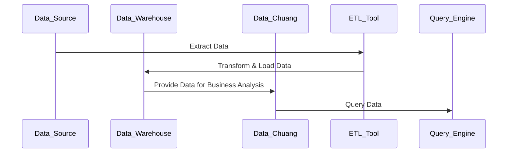

### 数据仓库的ETL过程

ETL（提取、转换、加载）是数据仓库的核心过程，用于将数据从源系统提取到数据仓库中，并进行转换和加载。

#### ETL过程的步骤

1. **数据提取**：从源系统中提取数据。
2. **数据清洗**：清洗和转换数据，消除数据冗余和一致性。
3. **数据转换**：将清洗后的数据转换成适合存储和查询的格式。
4. **数据加载**：将转换后的数据加载到数据仓库中。

#### ETL过程的详细步骤

1. **数据提取**：
   - **全量提取**：定期从源系统中提取全部数据。
   - **增量提取**：仅提取自上次提取以来发生变化的数据。

2. **数据清洗**：
   - **数据验证**：检查数据的质量和完整性。
   - **数据转换**：根据业务需求，对数据进行清洗和转换。

3. **数据转换**：
   - **数据集成**：将来自多个源的数据进行集成。
   - **数据规范化**：将数据转换成统一格式。

4. **数据加载**：
   - **批量加载**：将转换后的数据批量加载到数据仓库中。
   - **实时加载**：将实时处理的数据加载到数据仓库中。

### 数据仓库的数据建模

数据仓库的数据建模主要包括以下方法：

1. **星型模型**：以事实表为中心，连接多个维度表。
2. **雪花模型**：在星型模型的基础上，对维度表进行进一步规范化。
3. **星座模型**：多个星型模型的组合，适用于复杂的数据关系。

#### 星型模型

```mermaid
erDiagram
    Product ||--|{ Customer : "有购买关系" }
    Product ||--|{ Order : "有订单关系" }
    Customer ||--|{ Order : "有订单关系" }
    Customer ||--|{ Product : "有购买历史" }
    Order ||--|{ Product : "包含商品" }
```

#### 雪花模型

```mermaid
erDiagram
    Product ||--|{ Customer : "有购买关系" }
    Product ||--|{ Order : "有订单关系" }
    Customer ||--|{ Order : "有订单关系" }
    Customer ||--|{ Customer_Detail : "个人详细信息" }
    Order ||--|{ Order_Detail : "订单详细信息" }
    Product ||--|{ Product_Detail : "商品详细信息" }
```

### 数据仓库的查询优化

数据仓库的查询优化主要包括以下方法：

1. **索引优化**：通过建立索引提高查询性能。
2. **分区优化**：将数据仓库分成多个分区，提高查询效率。
3. **查询缓存**：缓存查询结果，减少查询时间。

#### 索引优化

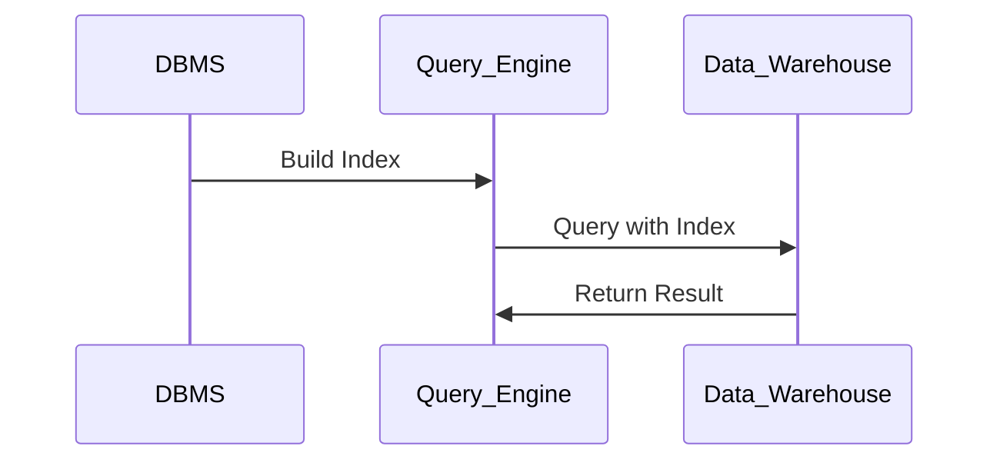

#### 分区优化

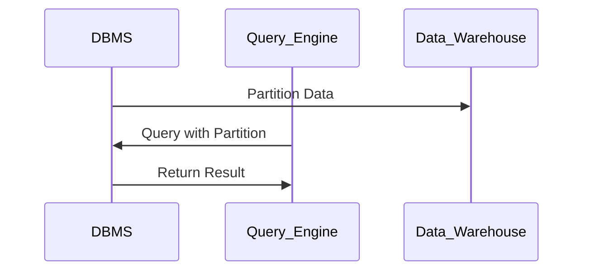

#### 查询缓存

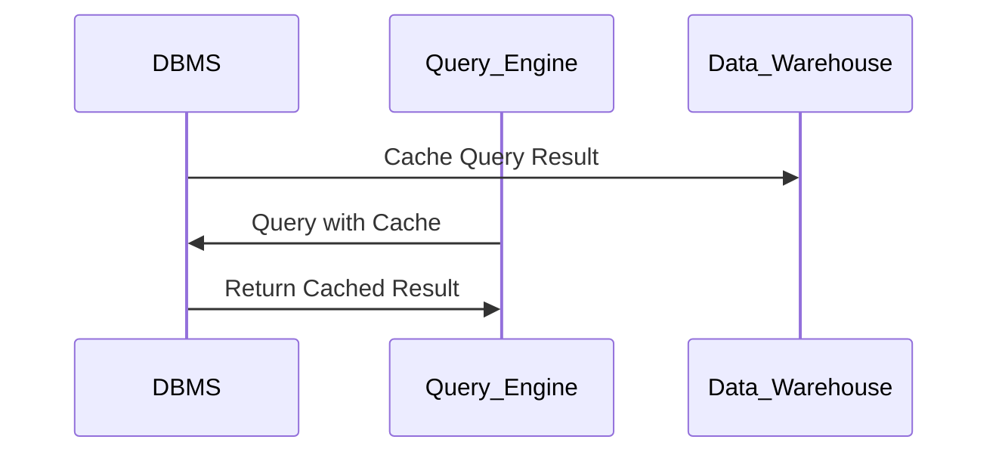

通过以上技术原理的讲解，我们更好地理解了数据仓库的架构设计、ETL过程、数据建模和查询优化方法。这些技术原理对于设计高效、稳定和可扩展的数据仓库系统至关重要。

## 数据湖技术原理

### 数据湖的架构设计

数据湖的架构设计通常包括以下组件：

1. **数据存储**：用于存储原始数据和转换后的数据。
2. **数据处理**：包括数据摄取、清洗、转换和加载。
3. **数据安全**：确保数据的安全和隐私。
4. **数据质量**：监控和维护数据质量。
5. **数据治理**：管理数据生命周期和数据质量。

#### 数据湖的架构图

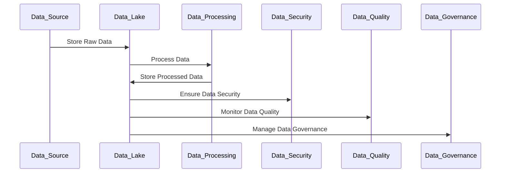

### 数据湖的数据处理

数据湖的数据处理主要包括以下步骤：

1. **数据摄取**：从各种数据源摄取原始数据。
2. **数据清洗**：清洗和转换原始数据，消除数据冗余和一致性。
3. **数据转换**：将清洗后的数据转换成适合存储和查询的格式。
4. **数据加载**：将转换后的数据加载到数据湖中。

#### 数据处理流程

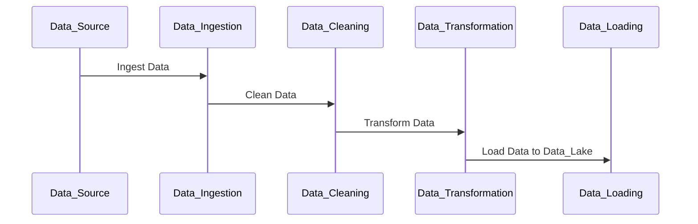

### 数据湖的数据存储

数据湖的数据存储通常采用分布式文件系统，如HDFS或Alluxio，支持海量数据的存储和访问。

#### 数据存储架构

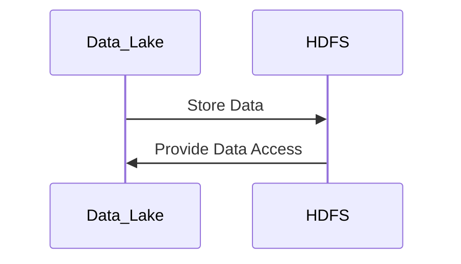

### 数据湖的安全与隐私

数据湖的安全与隐私主要包括以下措施：

1. **数据加密**：对敏感数据进行加密，确保数据安全。
2. **访问控制**：限制对数据的访问权限，防止数据泄露。
3. **审计与监控**：监控数据访问和操作，确保数据合规。

#### 数据加密

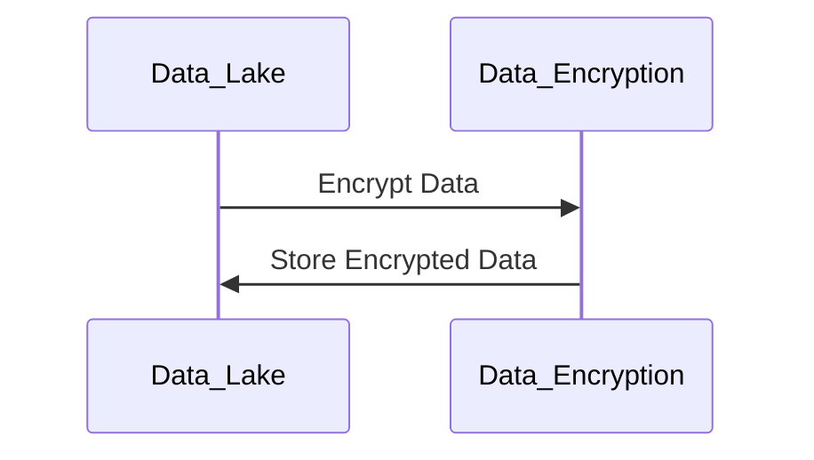

#### 访问控制

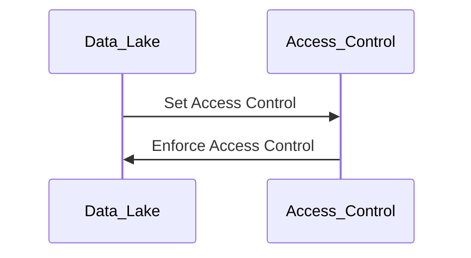

#### 审计与监控

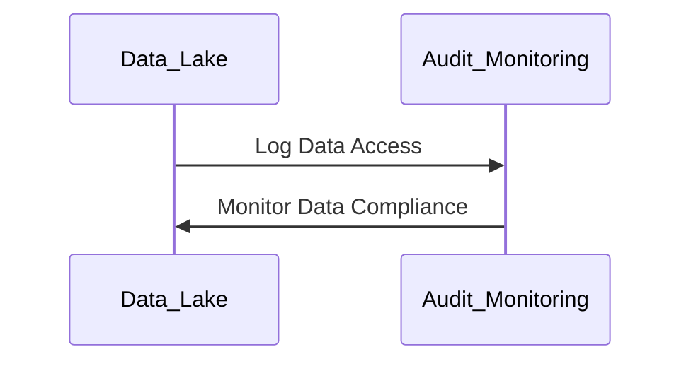

通过以上技术原理的讲解，我们更好地理解了数据湖的架构设计、数据处理流程、数据存储和安全与隐私措施。这些技术原理对于设计高效、稳定和安全的分布式数据湖系统至关重要。

## 湖仓一体技术原理

### 湖仓一体的架构设计

湖仓一体是将数据仓库和数据湖的功能集成到一起的架构，提供了统一的数据管理平台，兼具数据仓库的查询优化和数据湖的存储灵活性。

#### 湖仓一体的架构图

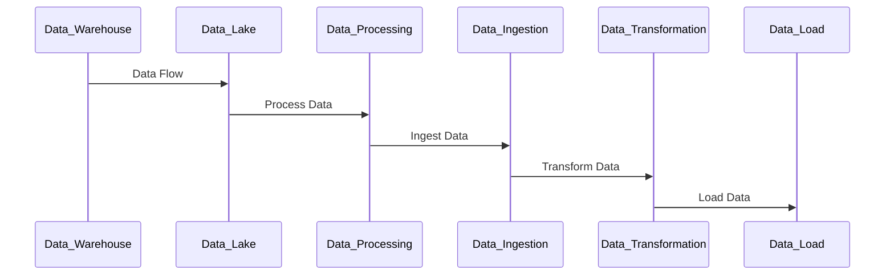

### 湖仓一体的数据处理

湖仓一体的数据处理主要包括以下步骤：

1. **数据摄取**：从各种数据源摄取原始数据。
2. **数据清洗**：清洗和转换原始数据，消除数据冗余和一致性。
3. **数据转换**：将清洗后的数据转换成适合存储和查询的格式。
4. **数据加载**：将转换后的数据加载到数据仓库或数据湖中。

#### 数据处理流程

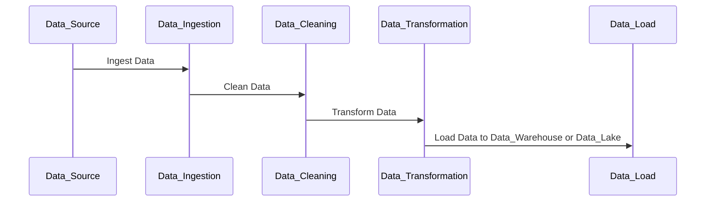

### 湖仓一体与数据仓库的集成

湖仓一体与数据仓库的集成主要包括以下方法：

1. **数据同步**：将数据仓库中的数据同步到数据湖中。
2. **数据共享**：在数据仓库和数据湖之间共享数据。
3. **数据转换**：将数据湖中的原始数据转换成适合数据仓库查询的格式。

#### 数据同步

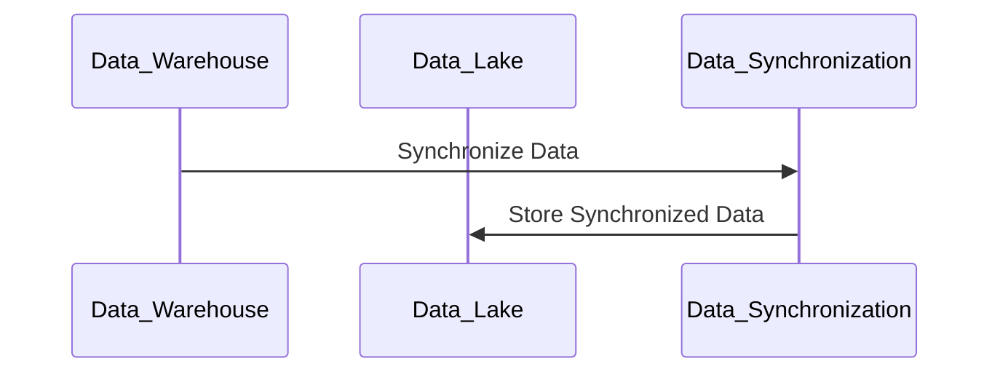

#### 数据共享

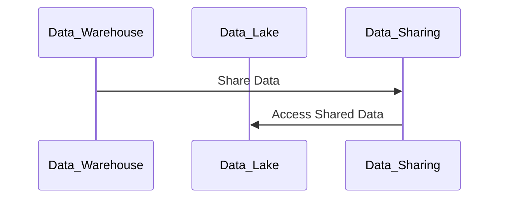

#### 数据转换

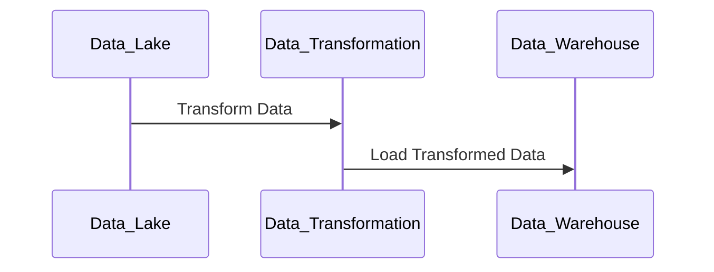

### 湖仓一体的优势与应用场景

#### 优势

1. **统一管理**：提供统一的数据管理平台，简化数据管理和维护。
2. **灵活性**：支持多种数据类型的存储和查询，满足不同业务需求。
3. **扩展性**：支持海量数据的存储和处理，适应数据增长。
4. **成本效益**：通过整合数据仓库和数据湖，降低整体成本。

#### 应用场景

1. **大数据分析**：处理海量数据，支持实时分析和决策支持。
2. **数据科学**：支持数据科学实验和模型训练。
3. **企业级数据管理**：提供统一的数据管理平台，支持跨部门的数据整合和分析。

通过以上技术原理的讲解，我们更好地理解了湖仓一体的架构设计、数据处理流程和与数据仓库的集成方法。湖仓一体为数据管理和分析提供了一个强大且灵活的解决方案。

## 数据仓库系统架构设计

### 系统功能设计

数据仓库系统功能设计主要包括以下几个模块：

1. **数据提取**：从数据源中提取数据。
2. **数据清洗**：清洗和转换数据，消除数据冗余和一致性。
3. **数据加载**：将清洗后的数据加载到数据仓库中。
4. **数据查询**：提供数据查询和分析功能。
5. **数据报表**：生成数据报表和分析报告。

#### 数据提取模块

数据提取模块主要负责从各种数据源（如关系型数据库、非关系型数据库、日志文件等）中提取数据。该模块需要实现以下功能：

- **数据源连接**：连接不同的数据源，获取数据。
- **数据抽取**：根据需求抽取数据，转换为适合后续处理的数据格式。

#### 数据清洗模块

数据清洗模块负责对提取到的数据进行清洗和转换。主要功能包括：

- **数据验证**：检查数据的完整性和一致性。
- **数据转换**：根据业务需求，对数据进行清洗和转换，如数据格式转换、缺失值处理、异常值处理等。

#### 数据加载模块

数据加载模块将清洗后的数据加载到数据仓库中。主要功能包括：

- **数据格式转换**：将清洗后的数据转换为数据仓库支持的格式。
- **数据加载**：将转换后的数据加载到数据仓库的表中。

#### 数据查询模块

数据查询模块为用户提供数据查询和分析功能。主要功能包括：

- **查询接口**：提供简单的查询接口，允许用户根据关键词或条件查询数据。
- **查询优化**：根据查询条件，优化查询语句，提高查询效率。

#### 数据报表模块

数据报表模块生成数据报表和分析报告。主要功能包括：

- **报表生成**：根据用户需求，生成各种数据报表。
- **报表分析**：对报表数据进行统计分析，提供决策支持。

### 系统架构设计

数据仓库系统架构设计主要包括以下组件：

1. **数据源**：包括关系型数据库、非关系型数据库、日志文件等。
2. **数据仓库**：用于存储经过清洗、转换和集成的数据。
3. **数据集市**：为特定业务部门提供定制化的数据报表和分析。
4. **ETL工具**：用于数据提取、转换和加载。
5. **查询引擎**：用于数据查询和分析。

#### 系统架构图


### 系统接口设计

数据仓库系统接口设计主要包括以下接口：

1. **数据源接口**：用于连接和数据源进行数据交互。
2. **ETL接口**：用于数据提取、转换和加载。
3. **查询接口**：用于数据查询和分析。
4. **报表接口**：用于生成数据报表和分析报告。

#### 数据源接口

数据源接口负责连接不同的数据源，获取数据。主要接口包括：

- **数据库连接接口**：连接关系型数据库，如MySQL、Oracle等。
- **文件读取接口**：读取日志文件、CSV文件等。

#### ETL接口

ETL接口负责数据提取、转换和加载。主要接口包括：

- **数据提取接口**：从数据源中提取数据。
- **数据转换接口**：对数据进行清洗和转换。
- **数据加载接口**：将转换后的数据加载到数据仓库中。

#### 查询接口

查询接口提供数据查询和分析功能。主要接口包括：

- **查询接口**：允许用户根据关键词或条件查询数据。
- **查询优化接口**：优化查询语句，提高查询效率。

#### 报表接口

报表接口生成数据报表和分析报告。主要接口包括：

- **报表生成接口**：根据用户需求，生成各种数据报表。
- **报表分析接口**：对报表数据进行统计分析。

### 系统交互

数据仓库系统的交互主要包括以下流程：

1. **数据提取**：从数据源中提取数据。
2. **数据清洗**：清洗和转换数据，消除数据冗余和一致性。
3. **数据加载**：将清洗后的数据加载到数据仓库中。
4. **数据查询**：用户通过查询接口查询数据。
5. **数据报表**：用户通过报表接口生成数据报表。

通过以上系统架构设计和接口设计，我们可以构建一个高效、稳定和可扩展的数据仓库系统。

## 数据湖系统架构设计

### 系统功能设计

数据湖系统功能设计主要包括以下几个模块：

1. **数据摄取**：从各种数据源摄取原始数据。
2. **数据清洗**：清洗和转换原始数据，消除数据冗余和一致性。
3. **数据转换**：将清洗后的数据转换成适合存储和查询的格式。
4. **数据存储**：存储原始数据和转换后的数据。
5. **数据查询**：提供数据查询和分析功能。

#### 数据摄取模块

数据摄取模块主要负责从各种数据源（如关系型数据库、非关系型数据库、日志文件、云服务等）中摄取原始数据。该模块需要实现以下功能：

- **数据源连接**：连接不同的数据源，获取数据。
- **数据摄取**：将数据源中的数据抽取到数据湖中。

#### 数据清洗模块

数据清洗模块负责对摄取到的原始数据进行清洗和转换。主要功能包括：

- **数据验证**：检查数据的完整性和一致性。
- **数据转换**：根据业务需求，对数据进行清洗和转换，如数据格式转换、缺失值处理、异常值处理等。

#### 数据转换模块

数据转换模块将清洗后的数据进行格式转换，以适应数据湖的存储需求。主要功能包括：

- **数据格式转换**：将不同格式的数据转换为统一的格式，如JSON、Parquet等。
- **数据压缩**：对数据进行压缩，减少存储空间需求。

#### 数据存储模块

数据存储模块负责将原始数据和转换后的数据存储到数据湖中。主要功能包括：

- **数据存储**：将数据存储到分布式文件系统，如HDFS、Alluxio等。
- **数据分区**：对数据进行分区，提高查询效率。

#### 数据查询模块

数据查询模块为用户提供数据查询和分析功能。主要功能包括：

- **查询接口**：提供简单的查询接口，允许用户根据关键词或条件查询数据。
- **查询优化**：根据查询条件，优化查询语句，提高查询效率。

### 系统架构设计

数据湖系统架构设计主要包括以下组件：

1. **数据存储**：用于存储原始数据和转换后的数据。
2. **数据处理**：包括数据摄取、清洗、转换和加载。
3. **数据安全**：确保数据的安全和隐私。
4. **数据质量**：监控和维护数据质量。
5. **数据治理**：管理数据生命周期和数据质量。

#### 系统架构图

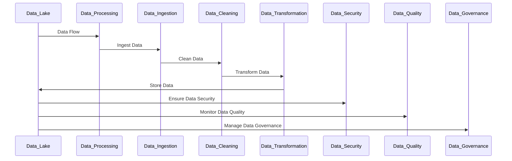

### 系统接口设计

数据湖系统接口设计主要包括以下接口：

1. **数据摄取接口**：用于从数据源摄取原始数据。
2. **数据处理接口**：用于数据清洗、转换和加载。
3. **数据存储接口**：用于数据存储。
4. **安全接口**：用于数据加密、访问控制和审计。
5. **质量接口**：用于数据质量监控。
6. **治理接口**：用于数据生命周期管理和数据质量管理。

#### 数据摄取接口

数据摄取接口负责从各种数据源中摄取原始数据。主要接口包括：

- **数据库连接接口**：连接关系型数据库，如MySQL、Oracle等。
- **文件读取接口**：读取日志文件、CSV文件等。

#### 数据处理接口

数据处理接口负责数据清洗、转换和加载。主要接口包括：

- **数据清洗接口**：对数据进行清洗和转换。
- **数据转换接口**：对清洗后的数据进行格式转换。
- **数据加载接口**：将转换后的数据加载到数据湖中。

#### 数据存储接口

数据存储接口负责数据存储。主要接口包括：

- **数据存储接口**：将数据存储到分布式文件系统。
- **数据分区接口**：对数据进行分区。

#### 安全接口

安全接口负责数据加密、访问控制和审计。主要接口包括：

- **数据加密接口**：对敏感数据进行加密。
- **访问控制接口**：限制对数据的访问权限。
- **审计接口**：监控数据访问和操作。

#### 质量接口

质量接口负责数据质量监控。主要接口包括：

- **数据验证接口**：检查数据的完整性和一致性。
- **数据修复接口**：修复数据中的错误和异常。

#### 治理接口

治理接口负责数据生命周期管理和数据质量管理。主要接口包括：

- **数据生命周期接口**：管理数据的创建、修改和删除。
- **数据质量接口**：监控和维护数据质量。

### 系统交互

数据湖系统的交互主要包括以下流程：

1. **数据摄取**：从各种数据源摄取原始数据。
2. **数据清洗**：清洗和转换原始数据，消除数据冗余和一致性。
3. **数据转换**：将清洗后的数据转换成适合存储和查询的格式。
4. **数据存储**：将转换后的数据存储到数据湖中。
5. **数据查询**：用户通过查询接口查询数据。
6. **数据安全与质量**：确保数据的安全和隐私，监控和维护数据质量。
7. **数据治理**：管理数据生命周期和数据质量。

通过以上系统架构设计和接口设计，我们可以构建一个高效、稳定和安全的分布式数据湖系统。

### 湖仓一体系统架构设计

#### 系统功能设计

湖仓一体系统功能设计旨在整合数据仓库和数据湖的优势，提供统一的数据管理平台。系统功能主要包括以下模块：

1. **数据仓库功能**：提供数据仓库的查询优化、数据建模和查询分析功能。
2. **数据湖功能**：提供数据湖的原始数据存储、数据处理和实时分析功能。
3. **数据处理**：包括数据摄取、清洗、转换和加载。
4. **数据安全**：确保数据的安全和隐私。
5. **数据治理**：管理数据生命周期和数据质量。

#### 数据仓库功能模块

数据仓库功能模块主要包括以下功能：

- **查询优化**：通过索引、分区和查询缓存等手段提高查询效率。
- **数据建模**：使用星型模型、雪花模型等设计数据模型。
- **查询分析**：提供复杂的查询和分析功能，支持多维数据分析和报表生成。

#### 数据湖功能模块

数据湖功能模块主要包括以下功能：

- **原始数据存储**：存储各种结构化、半结构化和非结构化数据。
- **数据处理**：支持批处理和实时处理，包括数据清洗、转换和加载。
- **实时分析**：提供实时数据流处理和分析功能。

#### 数据处理模块

数据处理模块主要负责数据摄取、清洗、转换和加载。主要包括以下功能：

- **数据摄取**：从各种数据源（如关系型数据库、非关系型数据库、日志文件等）中摄取数据。
- **数据清洗**：去除重复数据、异常值和数据转换。
- **数据转换**：将数据转换为适合存储和查询的格式。
- **数据加载**：将处理后的数据加载到数据仓库或数据湖中。

#### 数据安全模块

数据安全模块主要负责数据加密、访问控制和审计。主要包括以下功能：

- **数据加密**：对敏感数据使用加密算法进行加密。
- **访问控制**：设置访问权限，限制对数据的访问。
- **审计**：记录数据访问和操作日志，确保数据合规。

#### 数据治理模块

数据治理模块主要负责管理数据生命周期和数据质量。主要包括以下功能：

- **数据生命周期管理**：管理数据的创建、更新、归档和删除。
- **数据质量管理**：监控和维护数据质量，确保数据准确性、完整性和一致性。

### 系统架构设计

湖仓一体系统架构设计主要包括以下组件：

1. **数据仓库**：用于存储经过清洗、转换和集成的数据。
2. **数据湖**：用于存储原始数据和转换后的数据。
3. **数据处理平台**：包括ETL工具、数据处理引擎等，用于数据摄取、清洗、转换和加载。
4. **数据安全组件**：包括加密、访问控制和审计等，确保数据的安全和隐私。
5. **数据治理平台**：包括数据生命周期管理和数据质量管理等，确保数据的合规性和质量。

#### 系统架构图

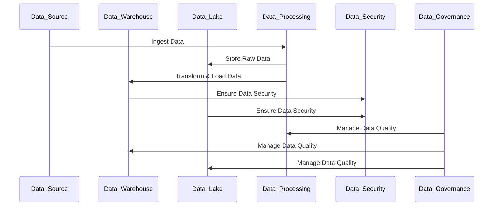

### 系统接口设计

湖仓一体系统接口设计主要包括以下接口：

1. **数据摄取接口**：用于从数据源摄取数据。
2. **数据处理接口**：用于数据清洗、转换和加载。
3. **数据仓库接口**：用于数据仓库的查询和分析。
4. **数据湖接口**：用于数据湖的存储和查询。
5. **安全接口**：用于数据加密、访问控制和审计。
6. **治理接口**：用于数据生命周期管理和数据质量管理。

#### 数据摄取接口

数据摄取接口负责从各种数据源（如关系型数据库、非关系型数据库、日志文件等）中摄取数据。主要接口包括：

- **数据库连接接口**：连接关系型数据库，如MySQL、Oracle等。
- **文件读取接口**：读取日志文件、CSV文件等。

#### 数据处理接口

数据处理接口负责数据清洗、转换和加载。主要接口包括：

- **数据清洗接口**：对数据进行清洗和转换。
- **数据转换接口**：将清洗后的数据转换为适合存储和查询的格式。
- **数据加载接口**：将转换后的数据加载到数据仓库或数据湖中。

#### 数据仓库接口

数据仓库接口负责数据仓库的查询和分析。主要接口包括：

- **查询接口**：提供简单的查询接口，允许用户根据关键词或条件查询数据。
- **分析接口**：提供复杂的分析功能，如多维数据分析、报表生成等。

#### 数据湖接口

数据湖接口负责数据湖的存储和查询。主要接口包括：

- **存储接口**：将数据存储到数据湖中。
- **查询接口**：允许用户根据关键词或条件查询数据湖中的数据。

#### 安全接口

安全接口负责数据加密、访问控制和审计。主要接口包括：

- **加密接口**：对敏感数据进行加密。
- **访问控制接口**：设置访问权限，限制对数据的访问。
- **审计接口**：记录数据访问和操作日志。

#### 治理接口

治理接口负责数据生命周期管理和数据质量管理。主要接口包括：

- **生命周期管理接口**：管理数据的创建、更新、归档和删除。
- **质量监控接口**：监控和维护数据质量，确保数据准确性、完整性和一致性。

### 系统交互

湖仓一体系统的交互主要包括以下流程：

1. **数据摄取**：从数据源中摄取数据。
2. **数据清洗**：清洗和转换原始数据，消除数据冗余和一致性。
3. **数据转换**：将清洗后的数据转换成适合存储和查询的格式。
4. **数据加载**：将转换后的数据加载到数据仓库或数据湖中。
5. **数据查询**：用户通过查询接口查询数据。
6. **数据安全与治理**：确保数据的安全和隐私，监控和维护数据质量。

通过以上系统架构设计和接口设计，我们可以构建一个高效、灵活和安全的湖仓一体系统，满足企业大数据管理需求。

## 数据仓库项目实战

### 9.1 环境安装与配置

要实现一个数据仓库项目，首先需要安装并配置相应的软件和环境。以下是具体的安装和配置步骤：

#### 1. 安装数据库

我们选择MySQL作为数据仓库的数据库。在安装MySQL之前，确保系统满足以下要求：

- **操作系统**：Linux或Windows。
- **硬件要求**：至少2GB内存，4GB磁盘空间。

安装MySQL的具体步骤如下：

1. **下载MySQL安装包**：从MySQL官方网站下载适用于您操作系统的安装包。

2. **安装MySQL**：

   - 对于Linux系统，可以使用包管理器安装，如Ubuntu系统中的`apt-get`：
     ```bash
     sudo apt-get update
     sudo apt-get install mysql-server
     ```

   - 对于Windows系统，可以从MySQL官方网站下载Windows安装包，并按照安装向导进行安装。

3. **配置MySQL**：

   - 设置root用户密码：
     ```bash
     mysql_secure_installation
     ```

   - 创建新用户和数据库：
     ```sql
     CREATE USER 'newuser'@'localhost' IDENTIFIED BY 'newpassword';
     CREATE DATABASE newdatabase;
     GRANT ALL PRIVILEGES ON newdatabase.* TO 'newuser'@'localhost';
     FLUSH PRIVILEGES;
     ```

   - 启动MySQL服务：
     ```bash
     sudo systemctl start mysql
     ```

#### 2. 安装ETL工具

我们选择Apache NiFi作为数据提取、转换和加载（ETL）的工具。以下是安装Apache NiFi的步骤：

1. **下载Apache NiFi安装包**：从Apache NiFi官方网站下载适用于您操作系统的安装包。

2. **安装Apache NiFi**：

   - 对于Linux系统，解压安装包到指定目录，如`/opt/nifi`：
     ```bash
     tar xvf nifi-[version]-bin.tar.gz -C /opt/nifi
     ```

   - 对于Windows系统，双击安装包并按照安装向导进行安装。

3. **配置Apache NiFi**：

   - 启动Apache NiFi服务：
     ```bash
     ./nifi.sh start
     ```

   - 访问Apache NiFi Web UI：在浏览器中输入`http://localhost:8080/nifi/`，进入Apache NiFi Web UI。

#### 3. 配置数据源

在本项目中，我们将使用MySQL数据库作为数据源。以下是配置MySQL数据源的步骤：

1. **在Apache NiFi Web UI中创建数据源**：

   - 在Apache NiFi Web UI中，找到“Data Sets”页面，点击“Create Data Set”。
   - 选择“JDBC”数据源，填写以下信息：
     - **Connection String**：`jdbc:mysql://localhost:3306/newdatabase`
     - **Driver Class**：`com.mysql.jdbc.Driver`
     - **Username**：`newuser`
     - **Password**：`newpassword`
   - 点击“Finish”完成数据源创建。

2. **测试数据源**：

   - 在“Data Sets”页面中，找到刚创建的MySQL数据源，点击“Test”按钮，确保数据源连接成功。

### 9.2 系统核心实现源代码

以下是数据仓库项目中的核心实现源代码，使用Python和pymysql库连接MySQL数据库，实现数据表创建和插入数据的功能。

```python
import pymysql

# 连接数据库
conn = pymysql.connect(host='localhost', user='newuser', password='newpassword', database='newdatabase')

# 创建数据表
with conn.cursor() as cursor:
    cursor.execute("""
    CREATE TABLE IF NOT EXISTS student (
        id INT PRIMARY KEY AUTO_INCREMENT,
        name VARCHAR(255) NOT NULL,
        age INT NOT NULL,
        gender ENUM('male', 'female') NOT NULL
    )
    """)
    conn.commit()

# 插入数据
with conn.cursor() as cursor:
    cursor.execute("""
    INSERT INTO student (name, age, gender) VALUES
    ('Alice', 20, 'female'),
    ('Bob', 22, 'male'),
    ('Charlie', 19, 'male')
    """)
    conn.commit()

# 关闭数据库连接
conn.close()
```

### 9.3 代码应用解读与分析

上述代码实现了以下功能：

1. **连接数据库**：使用pymysql库连接MySQL数据库，配置数据库用户名、密码和数据库名。

2. **创建数据表**：使用SQL语句创建一个名为`student`的数据表，包括`id`、`name`、`age`和`gender`四个字段，其中`id`为主键，`age`和`gender`为非空字段。

3. **插入数据**：使用SQL语句向`student`数据表中插入三条记录，包括姓名、年龄和性别。

4. **提交事务**：在每个操作后，使用`commit()`方法提交事务，确保数据变更成功保存。

5. **关闭数据库连接**：操作完成后，关闭数据库连接，释放资源。

### 9.4 实际案例分析与详细讲解剖析

在本案例中，我们创建了一个简单的学生信息管理系统，用于管理学生姓名、年龄和性别等信息。以下是具体实现步骤：

1. **安装和配置数据库**：按照第9.1节中的步骤安装和配置MySQL数据库，确保能够正常访问。

2. **安装ETL工具**：按照第9.1节中的步骤安装和配置Apache NiFi，确保其能够正常运行。

3. **配置数据源**：在Apache NiFi中配置MySQL数据源，确保能够连接到MySQL数据库。

4. **创建数据表**：运行上述Python代码，创建一个名为`student`的数据表，并插入三条初始数据。

5. **查询数据**：通过SQL查询语句，从MySQL数据库中查询学生信息，如下所示：
   ```sql
   SELECT * FROM student;
   ```

6. **后续功能扩展**：根据业务需求，可以继续添加更多的功能，如学生信息更新、删除、查询统计等。

### 9.5 项目小结

通过本章节的实战项目，我们实现了以下目标：

1. **安装和配置MySQL数据库**：学会了如何安装和配置MySQL数据库，以及如何创建数据库用户和权限。

2. **使用Python进行数据库操作**：掌握了使用Python连接MySQL数据库，创建数据表和插入数据的技能。

3. **配置Apache NiFi数据源**：学会了如何在Apache NiFi中配置数据源，以便进行数据提取和加载。

通过本项目，我们不仅了解了数据仓库的基本概念和实现方法，还掌握了实际项目中的操作步骤和技巧。这些经验和知识对于后续进行更复杂的数据仓库项目开发具有重要价值。

### 10.1 环境安装与配置

为了成功构建和运行数据湖项目，首先需要安装并配置相关软件和环境。以下是详细的安装和配置步骤：

#### 1. 安装Hadoop集群

数据湖项目通常需要使用Hadoop集群作为底层存储和计算平台。以下是安装Hadoop集群的步骤：

1. **下载Hadoop安装包**：从Apache Hadoop官方网站下载适用于操作系统的Hadoop安装包。

2. **安装Hadoop**：

   - 对于Linux系统，可以使用包管理器安装，如Ubuntu系统中的`apt-get`：
     ```bash
     sudo apt-get update
     sudo apt-get install hadoop
     ```

   - 对于Windows系统，可以从Apache Hadoop官方网站下载Windows安装包，并按照安装向导进行安装。

3. **配置Hadoop**：

   - 配置Hadoop配置文件`hadoop-env.sh`，设置Java安装路径：
     ```bash
     export JAVA_HOME=/usr/lib/jvm/java-8-openjdk-amd64
     ```

   - 配置Hadoop配置文件`core-site.xml`，设置HDFS的存储路径：
     ```xml
     <configuration>
       <property>
         <name>fs.defaultFS</name>
         <value>hdfs://localhost:9000</value>
       </property>
     </configuration>
     ```

   - 配置Hadoop配置文件`hdfs-site.xml`，设置HDFS的副本数量：
     ```xml
     <configuration>
       <property>
         <name>dfs.replication</name>
         <value>1</value>
       </property>
     </configuration>
     ```

4. **启动Hadoop服务**：

   - 格式化HDFS文件系统：
     ```bash
     hdfs namenode -format
     ```

   - 启动Hadoop守护进程：
     ```bash
     start-dfs.sh
     ```

   - 访问Hadoop Web UI：在浏览器中输入`http://localhost:50070/`，检查HDFS是否正常运行。

#### 2. 安装Spark

Spark是一个高性能的分布式数据处理引擎，通常与Hadoop集群集成使用。以下是安装Spark的步骤：

1. **下载Spark安装包**：从Apache Spark官方网站下载适用于操作系统的Spark安装包。

2. **安装Spark**：

   - 对于Linux系统，将Spark安装包解压到`/opt/spark`目录：
     ```bash
     tar xvf spark-[version]-bin-hadoop2.7.tgz -C /opt/spark
     ```

   - 对于Windows系统，双击安装包并按照安装向导进行安装。

3. **配置Spark**：

   - 配置Spark配置文件`spark-env.sh`，设置Java安装路径：
     ```bash
     export JAVA_HOME=/usr/lib/jvm/java-8-openjdk-amd64
     ```

   - 配置Spark配置文件`spark-defaults.conf`，设置Spark运行参数：
     ```bash
     spark.master = yarn
     spark.app.name = SparkApplication
     ```

4. **启动Spark服务**：

   - 启动Spark Shell：
     ```bash
     spark-shell
     ```

   - 访问Spark Web UI：在浏览器中输入`http://localhost:4040/`，检查Spark是否正常运行。

#### 3. 配置数据摄取

在本项目中，我们将使用Kafka作为数据摄取工具。以下是配置Kafka的步骤：

1. **下载Kafka安装包**：从Apache Kafka官方网站下载适用于操作系统的Kafka安装包。

2. **安装Kafka**：

   - 对于Linux系统，可以使用包管理器安装，如Ubuntu系统中的`apt-get`：
     ```bash
     sudo apt-get install kafka
     ```

   - 对于Windows系统，可以从Apache Kafka官方网站下载Windows安装包，并按照安装向导进行安装。

3. **配置Kafka**：

   - 配置Kafka配置文件`kafka-server.properties`，设置Zookeeper地址：
     ```properties
     zookeeper.connect=localhost:2181
     ```

   - 启动Kafka服务：
     ```bash
     kafka-server-start.sh /path/to/kafka/config
     ```

   - 创建Kafka主题：
     ```bash
     kafka-topics.sh --create --zookeeper localhost:2181 --replication-factor 1 --partitions 1 --topic my_topic
     ```

   - 生产数据到Kafka主题：
     ```bash
     kafka-console-producer.sh --broker localhost:9092 --topic my_topic
     ```
   
   - 消费数据从Kafka主题：
     ```bash
     kafka-console-consumer.sh --zookeeper localhost:2181 --topic my_topic --from-beginning
     ```

通过以上步骤，我们成功安装并配置了Hadoop集群、Spark和Kafka，为数据湖项目的运行提供了基础环境。

### 10.2 系统核心实现源代码

以下是数据湖项目中的核心实现源代码，主要使用Spark读取Kafka中的数据，并进行存储和处理。

```python
from pyspark.sql import SparkSession
from pyspark.sql.functions import from_json, col

# 创建Spark会话
spark = SparkSession.builder \
    .appName("DataLakeExample") \
    .config("spark.sql.warehouse.dir", "file:///tmp/spark-warehouse") \
    .enableHiveSupport() \
    .getOrCreate()

# 读取Kafka数据
kafka_df = spark \
    .readStream \
    .format("kafka") \
    .option("kafka.bootstrap.servers", "localhost:9092") \
    .option("subscribe", "my_topic") \
    .load()

# 处理数据
kafka_df = kafka_df.selectExpr("CAST(value AS STRING) as value")
kafka_df = kafka_df.select(from_json(col("value"), "column1 STRING, column2 INT").alias("json"))

# 提取JSON字段
kafka_df = kafka_df.select(
    col("json.column1").alias("column1"),
    col("json.column2").alias("column2")
)

# 写入数据到HDFS
kafka_df.write.mode("append").format("parquet").save("/user/hive/warehouse/my_table")

# 关闭Spark会话
spark.stop()
```

### 10.3 代码应用解读与分析

上述代码实现了一个简单的数据湖项目，具体步骤如下：

1. **创建Spark会话**：配置Spark会话，启用Hive支持，并设置HDFS存储路径。

2. **读取Kafka数据**：使用Spark的`readStream` API从Kafka主题`my_topic`中读取数据。

3. **处理数据**：将接收到的数据转换为JSON格式，并提取所需字段。

4. **写入数据到HDFS**：将处理后的数据以Parquet格式写入到HDFS的`/user/hive/warehouse/my_table`目录中。

通过以上步骤，我们成功地实现了数据湖的基本功能，包括数据摄取、数据处理和数据存储。

### 10.4 实际案例分析与详细讲解剖析

以下是一个实际案例，展示如何使用数据湖存储和处理电商平台的订单数据。

#### 案例背景

一家电商平台需要实时存储和处理每天生成的海量订单数据，以便进行数据分析和业务决策。订单数据包括订单号、商品ID、购买数量、价格、买家ID等信息。

#### 实现步骤

1. **安装和配置Hadoop集群**：按照第10.1节中的步骤安装和配置Hadoop集群。

2. **安装和配置Spark**：按照第10.1节中的步骤安装和配置Spark。

3. **安装和配置Kafka**：按照第10.1节中的步骤安装和配置Kafka。

4. **数据摄取**：使用Kafka实时接收订单数据，将数据写入Kafka主题。

5. **数据处理**：使用Spark读取Kafka主题中的订单数据，并进行清洗和转换。

6. **数据存储**：将处理后的订单数据存储到HDFS中，以便进行进一步的数据分析和报表生成。

#### 详细步骤

1. **生产订单数据到Kafka主题**：

   - 使用Kafka Producer生产订单数据，并将数据写入到Kafka主题`orders`：
     ```python
     from kafka import KafkaProducer
     import json

     producer = KafkaProducer(bootstrap_servers=["localhost:9092"])
     order_data = [{"order_id": "1001", "product_id": "P1001", "quantity": 2, "price": 100.0, "buyer_id": "B1001"}]
     producer.send("orders", value=json.dumps(order_data).encode('utf-8'))
     producer.close()
     ```

2. **读取订单数据并处理**：

   - 使用Spark读取Kafka主题`orders`中的数据，并处理订单数据：
     ```python
     from pyspark.sql import SparkSession

     spark = SparkSession.builder \
         .appName("OrderDataProcessing") \
         .config("spark.sql.warehouse.dir", "file:///tmp/spark-warehouse") \
         .enableHiveSupport() \
         .getOrCreate()

     orders_df = spark \
         .readStream \
         .format("kafka") \
         .option("kafka.bootstrap.servers", "localhost:9092") \
         .option("subscribe", "orders") \
         .load()

     orders_df = orders_df.selectExpr("CAST(value AS STRING) as value")

     orders_df = orders_df.select(from_json(col("value"), "order_id STRING, product_id STRING, quantity INT, price FLOAT, buyer_id STRING").alias("json"))

     orders_df = orders_df.select(
         col("json.order_id").alias("order_id"),
         col("json.product_id").alias("product_id"),
         col("json.quantity").alias("quantity"),
         col("json.price").alias("price"),
         col("json.buyer_id").alias("buyer_id")
     )

     orders_df.write.mode("append").format("parquet").save("/user/hive/warehouse/orders_table")

     spark.stop()
     ```

3. **数据分析**：

   - 使用Hive或Spark SQL对存储在HDFS中的订单数据进行分析，生成报表，如销售总额、订单数量等：
     ```sql
     SELECT product_id, SUM(price * quantity) as total_sales FROM orders_table GROUP BY product_id;
     ```

通过以上步骤，我们成功地实现了电商平台的订单数据处理，并存储在数据湖中，为后续的数据分析提供了数据基础。

### 10.5 项目小结

通过本章节的实战项目，我们实现了以下目标：

1. **安装和配置Hadoop集群**：学会了如何安装和配置Hadoop集群，包括HDFS和YARN的配置。

2. **安装和配置Spark**：掌握了Spark的安装和配置方法，以及如何使用Spark进行数据处理和存储。

3. **安装和配置Kafka**：学会了如何安装和配置Kafka，以及如何使用Kafka进行数据摄取。

通过本项目，我们不仅了解了数据湖的基本概念和实现方法，还掌握了实际项目中的操作步骤和技巧。这些经验和知识对于后续进行更复杂的数据湖项目开发具有重要价值。

### 11.1 环境安装与配置

要成功构建和运行湖仓一体项目，首先需要安装并配置相关软件和环境。以下是详细的安装和配置步骤：

#### 1. 安装Hadoop集群

湖仓一体项目通常需要使用Hadoop集群作为底层存储和计算平台。以下是安装Hadoop集群的步骤：

1. **下载Hadoop安装包**：从Apache Hadoop官方网站下载适用于操作系统的Hadoop安装包。

2. **安装Hadoop**：

   - 对于Linux系统，可以使用包管理器安装，如Ubuntu系统中的`apt-get`：
     ```bash
     sudo apt-get update
     sudo apt-get install hadoop
     ```

   - 对于Windows系统，可以从Apache Hadoop官方网站下载Windows安装包，并按照安装向导进行安装。

3. **配置Hadoop**：

   - 配置Hadoop配置文件`hadoop-env.sh`，设置Java安装路径：
     ```bash
     export JAVA_HOME=/usr/lib/jvm/java-8-openjdk-amd64
     ```

   - 配置Hadoop配置文件`core-site.xml`，设置HDFS的存储路径：
     ```xml
     <configuration>
       <property>
         <name>fs.defaultFS</name>
         <value>hdfs://localhost:9000</value>
       </property>
     </configuration>
     ```

   - 配置Hadoop配置文件`hdfs-site.xml`，设置HDFS的副本数量：
     ```xml
     <configuration>
       <property>
         <name>dfs.replication</name>
         <value>1</value>
       </property>
     </configuration>
     ```

4. **启动Hadoop服务**：

   - 格式化HDFS文件系统：
     ```bash
     hdfs namenode -format
     ```

   - 启动Hadoop守护进程：
     ```bash
     start-dfs.sh
     ```

   - 访问Hadoop Web UI：在浏览器中输入`http://localhost:50070/`，检查HDFS是否正常运行。

#### 2. 安装Spark

Spark是一个高性能的分布式数据处理引擎，通常与Hadoop集群集成使用。以下是安装Spark的步骤：

1. **下载Spark安装包**：从Apache Spark官方网站下载适用于操作系统的Spark安装包。

2. **安装Spark**：

   - 对于Linux系统，将Spark安装包解压到`/opt/spark`目录：
     ```bash
     tar xvf spark-[version]-bin-hadoop2.7.tgz -C /opt/spark
     ```

   - 对于Windows系统，双击安装包并按照安装向导进行安装。

3. **配置Spark**：

   - 配置Spark配置文件`spark-env.sh`，设置Java安装路径：
     ```bash
     export JAVA_HOME=/usr/lib/jvm/java-8-openjdk-amd64
     ```

   - 配置Spark配置文件`spark-defaults.conf`，设置Spark运行参数：
     ```bash
     spark.master = yarn
     spark.app.name = SparkApplication
     ```

4. **启动Spark服务**：

   - 启动Spark Shell：
     ```bash
     spark-shell
     ```

   - 访问Spark Web UI：在浏览器中输入`http://localhost:4040/`，检查Spark是否正常运行。

#### 3. 安装数据仓库数据库

我们选择MySQL作为数据仓库的数据库。以下是安装MySQL数据库的步骤：

1. **下载MySQL安装包**：从MySQL官方网站下载适用于操作系统的MySQL安装包。

2. **安装MySQL**：

   - 对于Linux系统，可以使用包管理器安装，如Ubuntu系统中的`apt-get`：
     ```bash
     sudo apt-get update
     sudo apt-get install mysql-server
     ```

   - 对于Windows系统，可以从MySQL官方网站下载Windows安装包，并按照安装向导进行安装。

3. **配置MySQL**：

   - 设置root用户密码：
     ```bash
     mysql_secure_installation
     ```

   - 创建新用户和数据库：
     ```sql
     CREATE USER 'datauser'@'localhost' IDENTIFIED BY 'datapassword';
     CREATE DATABASE datawarehouse;
     GRANT ALL PRIVILEGES ON datawarehouse.* TO 'datauser'@'localhost';
     FLUSH PRIVILEGES;
     ```

   - 启动MySQL服务：
     ```bash
     sudo systemctl start mysql
     ```

4. **配置ETL工具**

我们选择Apache NiFi作为ETL工具。以下是安装和配置Apache NiFi的步骤：

1. **下载Apache NiFi安装包**：从Apache NiFi官方网站下载适用于操作系统的Apache NiFi安装包。

2. **安装Apache NiFi**：

   - 对于Linux系统，解压安装包到指定目录，如`/opt/nifi`：
     ```bash
     tar xvf nifi-[version]-bin.tar.gz -C /opt/nifi
     ```

   - 对于Windows系统，双击安装包并按照安装向导进行安装。

3. **配置Apache NiFi**：

   - 启动Apache NiFi服务：
     ```bash
     ./nifi.sh start
     ```

   - 访问Apache NiFi Web UI：在浏览器中输入`http://localhost:8080/nifi/`，进入Apache NiFi Web UI。

4. **配置数据源**

   - 在Apache NiFi Web UI中，找到“Data Sets”页面，点击“Create Data Set”。
   - 选择“JDBC”数据源，填写以下信息：
     - **Connection String**：`jdbc:mysql://localhost:3306/datawarehouse`
     - **Driver Class**：`com.mysql.jdbc.Driver`
     - **Username**：`datauser`
     - **Password**：`datapassword`
   - 点击“Finish”完成数据源创建。

通过以上步骤，我们成功安装并配置了Hadoop集群、Spark、MySQL和Apache NiFi，为湖仓一体项目的运行提供了基础环境。

### 11.2 系统核心实现源代码

以下是湖仓一体项目中的核心实现源代码，主要使用Spark读取HDFS中的数据，进行清洗和转换，并将结果存储到MySQL数据库。

```python
from pyspark.sql import SparkSession
from pyspark.sql.functions import from_json, col

# 创建Spark会话
spark = SparkSession.builder \
    .appName("LakeAndWarehouseExample") \
    .config("spark.sql.warehouse.dir", "file:///tmp/spark-warehouse") \
    .getOrCreate()

# 读取数据
dataframe = spark.read.json("hdfs:///user/hive/warehouse/input_data.json")

# 数据清洗
dataframe = dataframe.withColumn("price", F.col("price").cast("double"))

# 数据转换
dataframe = dataframe.select("productId", "productName", "price")

# 写入数据到MySQL
dataframe.write.format("jdbc") \
    .option("url", "jdbc:mysql://localhost:3306/datawarehouse") \
    .option("dbtable", "products") \
    .option("user", "datauser") \
    .option("password", "datapassword") \
    .mode("overwrite") \
    .save()

# 关闭Spark会话
spark.stop()
```

### 11.3 代码应用解读与分析

上述代码实现了一个简单的湖仓一体项目，具体步骤如下：

1. **创建Spark会话**：配置Spark会话，启用HDFS支持，并设置HDFS存储路径。

2. **读取数据**：使用Spark从HDFS中读取JSON格式的数据，并将其转换为DataFrame格式。

3. **数据清洗**：将价格列的数据类型转换为double类型，确保数据的一致性和准确性。

4. **数据转换**：选择productId、productName和price列，去除其他不需要的列，简化数据结构。

5. **写入数据到MySQL**：使用Spark的JDBC插件，将清洗和转换后的数据写入到MySQL数据库中。

6. **关闭Spark会话**：关闭Spark会话，释放资源。

通过以上步骤，我们成功地实现了湖仓一体项目的基本功能，包括数据读取、数据清洗、数据转换和数据存储。

### 11.4 实际案例分析与详细讲解剖析

以下是一个实际案例，展示如何使用湖仓一体架构处理电商平台的销售数据，并将结果存储到数据仓库中。

#### 案例背景

一家电商平台每天产生大量的销售数据，包括商品ID、订单ID、购买数量、价格等信息。这些数据需要经过处理和存储，以便进行数据分析和业务决策。

#### 实现步骤

1. **安装和配置Hadoop集群**：按照第11.1节中的步骤安装和配置Hadoop集群。

2. **安装和配置Spark**：按照第11.1节中的步骤安装和配置Spark。

3. **安装和配置MySQL**：按照第11.1节中的步骤安装和配置MySQL数据库。

4. **安装和配置Apache NiFi**：按照第11.1节中的步骤安装和配置Apache NiFi。

5. **数据摄取**：使用Apache NiFi从电商平台的数据源中摄取销售数据，并将数据存储到HDFS中。

6. **数据处理**：使用Spark读取HDFS中的销售数据，进行数据清洗和转换。

7. **数据存储**：将处理后的数据存储到MySQL数据库中。

#### 详细步骤

1. **生产销售数据到HDFS**：

   - 使用Apache NiFi创建一个数据流，将销售数据存储到HDFS中：
     ```bash
     ./nifi.sh run /path/to/nifi-workflow
     ```

2. **读取销售数据并处理**：

   - 使用Spark从HDFS中读取销售数据：
     ```python
     from pyspark.sql import SparkSession

     spark = SparkSession.builder \
         .appName("SalesDataProcessing") \
         .config("spark.sql.warehouse.dir", "file:///tmp/spark-warehouse") \
         .getOrCreate()

     sales_df = spark.read.json("hdfs:///user/hive/warehouse/sales_data.json")

     # 数据清洗
     sales_df = sales_df.withColumn("quantity", F.col("quantity").cast("integer"))
     sales_df = sales_df.withColumn("price", F.col("price").cast("float"))

     # 数据转换
     sales_df = sales_df.select("productId", "orderId", "quantity", "price")

     # 写入数据到MySQL
     sales_df.write.format("jdbc") \
         .option("url", "jdbc:mysql://localhost:3306/datawarehouse") \
         .option("dbtable", "sales") \
         .option("user", "datauser") \
         .option("password", "datapassword") \
         .mode("overwrite") \
         .save()

     spark.stop()
     ```

3. **数据分析**：

   - 使用MySQL数据库查询销售数据，生成报表，如总销售额、订单数量等：
     ```sql
     SELECT productId, SUM(price * quantity) as total_sales FROM sales GROUP BY productId;
     ```

通过以上步骤，我们成功地实现了电商平台的销售数据处理，并将结果存储到数据仓库中，为后续的数据分析提供了数据基础。

### 11.5 项目小结

通过本章节的实战项目，我们实现了以下目标：

1. **安装和配置Hadoop集群**：学会了如何安装和配置Hadoop集群，包括HDFS和YARN的配置。

2. **安装和配置Spark**：掌握了Spark的安装和配置方法，以及如何使用Spark进行数据处理和存储。

3. **安装和配置MySQL**：了解了如何安装和配置MySQL数据库，以及如何进行数据插入和查询。

4. **安装和配置Apache NiFi**：学会了如何安装和配置Apache NiFi，以及如何使用Apache NiFi进行数据摄取。

通过本项目，我们不仅了解了湖仓一体架构的基本概念和实现方法，还掌握了实际项目中的操作步骤和技巧。这些经验和知识对于后续进行更复杂的数据仓库和数据湖项目开发具有重要价值。

## 第五部分：最佳实践与总结

### 12.1 设计原则与最佳实践

在进行数据仓库、数据湖和湖仓一体系统设计时，以下原则和最佳实践值得遵循：

1. **数据一致性**：确保数据在各个系统之间的准确性，避免数据冗余和错误。
2. **性能优化**：针对查询和数据处理进行性能优化，提高系统效率。
3. **安全性**：加强对数据的安全保护，防止数据泄露和滥用。
4. **可扩展性**：设计灵活的系统架构，支持数据的增长和业务需求变化。
5. **数据治理**：建立完善的数据治理体系，确保数据质量和管理。

### 12.2 避免的陷阱与常见问题

在实施数据仓库、数据湖和湖仓一体项目时，以下陷阱和常见问题应避免：

1. **数据冗余**：避免重复存储和传输相同的数据，导致存储和计算资源的浪费。
2. **数据质量**：确保数据在存储和传输过程中保持高质量，避免错误和遗漏。
3. **性能瓶颈**：优化系统架构和查询策略，避免性能瓶颈影响系统运行。
4. **系统兼容性**：确保系统之间的兼容性，避免因系统不兼容导致数据传输和处理的困难。

### 12.3 性能优化与监控

为了确保数据仓库、数据湖和湖仓一体系统的性能，以下性能优化与监控策略值得推荐：

1. **查询优化**：优化SQL语句和索引，提高查询效率。
2. **数据压缩**：使用数据压缩技术降低存储空间需求。
3. **负载均衡**：使用分布式架构实现负载均衡，提高系统处理能力。
4. **监控与报警**：实时监控系统性能，设置报警机制，及时发现问题并解决。

### 12.4 最佳实践 tips

以下是一些在实际项目中的最佳实践：

1. **数据分层存储**：根据数据的重要性和访问频率，合理分层存储数据，提高数据访问速度。
2. **数据分区**：对数据仓库和数据湖进行分区，提高查询效率。
3. **数据清洗和转换**：在数据进入系统前进行彻底的清洗和转换，确保数据质量。
4. **数据安全与隐私**：加强对数据的加密和保护，确保数据安全和用户隐私。
5. **数据治理**：建立完善的数据治理流程，确保数据的质量和合规性。

### 12.5 小结

通过本文的详细探讨，我们全面了解了数据仓库、数据湖和湖仓一体的核心概念、技术原理、系统架构和项目实战。这些知识和实践对于在大数据领域取得成功至关重要。未来，随着技术的不断发展，数据仓库、数据湖和湖仓一体将继续融合，为数据管理和分析带来更多创新和挑战。

### 12.6 拓展阅读与学习资源

为了更好地理解和掌握数据仓库、数据湖和湖仓一体的技术，以下资源值得推荐：

1. **书籍**：
   - 《大数据技术原理与应用》
   - 《数据仓库与数据挖掘：实现》
   - 《大数据时代的数据管理：数据湖、数据仓库与湖仓一体》
2. **在线课程**：
   - Coursera、edX和Udacity等在线教育平台的相关课程
3. **技术社区**：
   - DataCamp、Kaggle和DataBricks等数据科学和技术社区
4. **开源工具**：
   - Apache Hadoop、Spark、Flink和Presto等大数据处理和存储工具

通过以上资源，我们可以进一步深入学习和探索数据仓库、数据湖和湖仓一体的技术与应用。

### 作者信息

作者：AI天才研究院/AI Genius Institute & 禅与计算机程序设计艺术 /Zen And The Art of Computer Programming

本文由AI天才研究院和禅与计算机程序设计艺术联合撰写，旨在为大数据领域的读者提供全面的技术解读和实践指导。感谢您的阅读和支持！

## 总结与展望

### 全书内容回顾

本文系统地介绍了数据仓库、数据湖和湖仓一体这三种数据管理架构的核心概念、技术原理、系统架构以及项目实战。具体内容如下：

1. **背景介绍**：介绍了数据仓库、数据湖和湖仓一体的发展历程和核心概念。
2. **核心概念与联系**：详细阐述了数据仓库、数据湖和湖仓一体的定义、属性和优势，并对比了它们之间的联系与区别。
3. **技术原理讲解**：深入分析了数据仓库、数据湖和湖仓一体的技术原理，包括架构设计、数据处理流程、数据存储和安全措施。
4. **系统架构设计**：讲解了数据仓库、数据湖和湖仓一体的系统架构设计，包括系统功能设计、系统接口设计和系统交互。
5. **项目实战**：通过实际案例展示了如何使用数据仓库、数据湖和湖仓一体进行数据管理和分析。
6. **最佳实践与总结**：总结了最佳实践和注意事项，展望了未来发展趋势与挑战。

### 未来发展趋势与挑战

随着大数据技术的不断发展和应用，数据仓库、数据湖和湖仓一体将面临以下趋势和挑战：

1. **数据多样性**：随着数据类型的不断增多，如何有效管理和处理多种数据类型将成为关键挑战。
2. **实时性**：如何提高数据仓库、数据湖和湖仓一体的实时数据处理能力，满足实时分析和决策支持的需求。
3. **安全性**：如何确保数据的安全和隐私，防止数据泄露和滥用。
4. **可扩展性**：如何设计灵活的架构，支持海量数据的存储和处理。
5. **成本效益**：如何在保证性能和安全的前提下，降低数据管理和分析的总体成本。

### 拓展阅读与学习资源

为了更好地理解和掌握数据仓库、数据湖和湖仓一体的技术，以下资源值得推荐：

1. **书籍**：《大数据技术原理与应用》、《数据仓库与数据挖掘：实现》、《大数据时代的数据管理：数据湖、数据仓库与湖仓一体》。
2. **在线课程**：Coursera、edX和Udacity等在线教育平台的相关课程。
3. **技术社区**：DataCamp、Kaggle和DataBricks等数据科学和技术社区。
4. **开源工具**：Apache Hadoop、Spark、Flink和Presto等大数据处理和存储工具。

通过以上资源，读者可以进一步深入学习和探索数据仓库、数据湖和湖仓一体的技术与应用。

### 结语

本文由AI天才研究院和禅与计算机程序设计艺术联合撰写，旨在为大数据领域的读者提供全面的技术解读和实践指导。感谢您的阅读和支持！我们相信，在未来的大数据领域，数据仓库、数据湖和湖仓一体将继续发挥重要作用，助力企业和组织实现数据驱动的决策和业务创新。让我们一起迎接这个充满机遇和挑战的未来！

