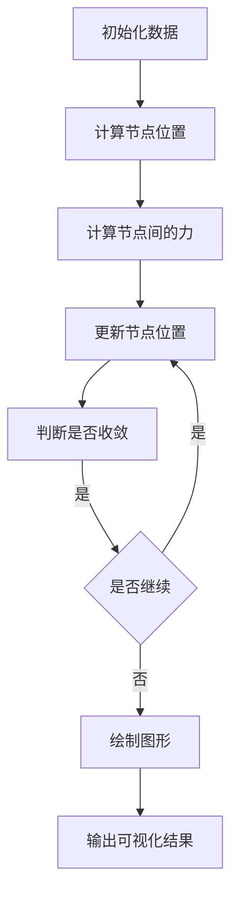

                 

# 数据可视化平台设计与实现

## 关键词：数据可视化、平台架构、数据处理、算法实现、性能优化、安全性

### 摘要：

数据可视化作为一种将复杂的数据转化为易于理解、直观展示的形式的技术，在现代信息化社会中发挥着重要作用。本文旨在系统探讨数据可视化平台的设计与实现过程。首先，文章介绍了数据可视化的背景和核心概念，包括其意义、发展历程和应用领域。随后，文章详细分析了数据可视化平台的架构设计，涵盖了设计原则、架构组件和实现方法。接着，文章深入探讨了数据可视化的数据处理与分析技术，包括数据预处理、数据分析和数据可视化与数据分析的结合。随后，文章详细介绍了数据可视化平台前端和后端的设计与实现，包括前端设计原则、技术选型、前端界面设计，以及后端设计原则、技术选型、后端接口设计与实现。此外，文章还探讨了数据可视化算法的实现和性能优化策略，以及数据可视化平台的安全性和可靠性设计。最后，文章通过案例分析展示了数据可视化平台在实际应用中的效果，并对未来数据可视化技术的发展趋势进行了展望。

### 目录大纲

----------------------------------------------------------------
# 数据可视化平台设计与实现

## 第一部分：背景与核心概念

## 第1章：数据可视化概述

### 1.1 数据可视化的意义与重要性

### 1.2 数据可视化的发展历程

### 1.3 数据可视化在现代社会的应用

## 第2章：数据可视化核心概念

### 2.1 数据可视化基本原理

### 2.2 数据可视化类型

### 2.3 数据可视化工具与技术

## 第3章：数据可视化平台架构设计

### 3.1 数据可视化平台设计原则

### 3.2 数据可视化平台架构组件

### 3.3 数据可视化平台架构实现

## 第4章：数据可视化数据处理与分析

### 4.1 数据预处理技术

### 4.2 数据分析技术

### 4.3 数据可视化与数据分析的结合

## 第二部分：设计与实现

## 第5章：数据可视化平台前端设计

### 5.1 前端设计原则

### 5.2 前端技术选型

### 5.3 前端界面设计

## 第6章：数据可视化平台后端设计

### 6.1 后端设计原则

### 6.2 后端技术选型

### 6.3 后端接口设计与实现

## 第7章：数据可视化算法实现

### 7.1 数据可视化算法概述

### 7.2 数据可视化算法原理

### 7.3 数据可视化算法应用

## 第8章：数据可视化平台性能优化

### 8.1 平台性能优化策略

### 8.2 数据存储与访问优化

### 8.3 数据处理与展示优化

## 第9章：数据可视化平台安全性与可靠性

### 9.1 平台安全性设计

### 9.2 平台可靠性保障

### 9.3 数据隐私保护

## 第10章：数据可视化平台案例分析与实战

### 10.1 案例一：电商平台销售数据分析

### 10.2 案例二：金融行业风险监控

### 10.3 案例三：物流行业运输数据分析

## 第11章：未来数据可视化发展趋势与展望

### 11.1 数据可视化技术发展趋势

### 11.2 数据可视化在新兴领域的应用

### 11.3 数据可视化平台未来发展方向

----------------------------------------------------------------

## 第1章：数据可视化概述

### 1.1 数据可视化的意义与重要性

数据可视化是一种通过图形、图像和其他视觉元素将数据转换为直观、易于理解的形式的技术。它的意义在于，一方面，数据可视化能够帮助人们更好地理解和分析数据，从而做出更明智的决策；另一方面，它能够提高数据传输的效率，使复杂的数据变得更加易于理解。在现代社会，数据可视化的重要性日益凸显，尤其是在大数据时代，数据量呈爆炸式增长，数据可视化成为了数据分析的重要手段。

首先，数据可视化能够直观地展现数据的趋势和模式。例如，通过折线图、柱状图、饼图等常见的可视化图表，我们可以快速了解数据的分布、变化和关联性。其次，数据可视化能够帮助用户更好地理解数据，从而提高数据分析的效率。例如，通过交互式数据可视化工具，用户可以动态地探索数据，发现潜在的问题和规律。

### 1.2 数据可视化的发展历程

数据可视化的发展可以追溯到上世纪70年代，当时计算机的出现为数据可视化提供了技术支持。最早的计算机图形学主要应用于科学计算领域，随着计算机技术的发展，数据可视化逐渐从科学计算领域扩展到商业领域。

在21世纪初，随着互联网的普及和大数据时代的到来，数据可视化技术得到了飞速发展。各种数据可视化工具和平台如雨后春笋般涌现，如Tableau、Power BI、D3.js等。这些工具和平台提供了丰富的图表类型和交互功能，大大提高了数据可视化的效果和效率。

近年来，随着人工智能和机器学习技术的应用，数据可视化技术也在不断创新。例如，通过机器学习算法，数据可视化可以自动识别数据中的模式和趋势，为用户提供更智能的数据分析结果。

### 1.3 数据可视化在现代社会的应用

数据可视化在现代社会中的应用非常广泛，涵盖了各个行业和领域。以下是一些典型的应用场景：

1. **商业分析**：数据可视化在商业分析中有着广泛的应用。通过数据可视化，企业可以更好地了解市场趋势、消费者行为和业务运营情况，从而制定更有效的营销策略和业务计划。

2. **科学研究**：数据可视化在科学研究领域也有着重要的应用。科学家可以通过数据可视化来分析实验数据、研究数据之间的关系，从而发现新的科学规律。

3. **金融行业**：数据可视化在金融行业中应用广泛，如股票分析、风险管理和客户行为分析等。通过数据可视化，金融从业者可以更直观地了解市场变化和风险情况，做出更明智的投资决策。

4. **医疗健康**：数据可视化在医疗健康领域也有重要应用。通过数据可视化，医生可以更清楚地了解患者的病情变化，制定更有效的治疗方案。

5. **政府管理**：数据可视化在政府管理中也有广泛应用。通过数据可视化，政府部门可以更好地了解社会经济发展情况，制定更科学的政策。

总的来说，数据可视化作为一种强大的工具，已经在各个领域发挥着重要作用，为人们更好地理解和利用数据提供了有力的支持。

## 第2章：数据可视化核心概念

### 2.1 数据可视化基本原理

数据可视化的基本原理是将数据转化为图形、图像和其他视觉元素，从而使人能够更直观地理解和分析数据。数据可视化的基本过程包括以下几个步骤：

1. **数据获取与清洗**：首先需要获取数据，并对数据进行清洗，去除错误和异常数据。

2. **数据转换**：将清洗后的数据进行转换，以适应可视化的需求。这通常涉及到数据格式的转换、数据类型的转换等。

3. **数据可视化**：将转换后的数据通过图形、图像和其他视觉元素进行可视化。常用的可视化图表包括折线图、柱状图、饼图、散点图等。

4. **交互与探索**：用户可以通过交互操作，如放大、缩小、筛选等，进一步探索数据，发现数据中的模式和趋势。

### 2.2 数据可视化类型

数据可视化可以分为多种类型，每种类型都有其特定的用途和特点。以下是几种常见的数据可视化类型：

1. **统计图表**：包括折线图、柱状图、饼图、散点图等，主要用于展示数据的数量、分布、趋势和关系。

2. **地理信息图表**：包括地图、热力图等，主要用于展示地理数据的空间分布和变化。

3. **交互式图表**：通过交互操作，如点击、拖动、滑动等，用户可以动态地探索数据，发现数据中的模式和趋势。

4. **复杂图表**：包括网络图、决策树、时间序列图等，主要用于展示复杂的数据结构和关系。

### 2.3 数据可视化工具与技术

数据可视化工具和技术的种类繁多，以下是一些常用的工具和技术：

1. **图表库**：如D3.js、ECharts、Highcharts等，这些图表库提供了丰富的图表类型和自定义功能，可以方便地实现数据可视化。

2. **可视化软件**：如Tableau、Power BI等，这些软件提供了直观的用户界面和强大的数据处理能力，适用于各种规模的数据可视化项目。

3. **编程语言**：如Python、R等，这些编程语言提供了丰富的数据可视化库和工具，可以自定义数据可视化。

4. **数据库技术**：如MySQL、PostgreSQL等，这些数据库技术可以高效地存储和管理数据，为数据可视化提供数据支持。

## 第3章：数据可视化平台架构设计

### 3.1 数据可视化平台设计原则

设计数据可视化平台时，需要遵循以下原则：

1. **易用性**：平台应提供直观、易用的用户界面，使用户能够轻松地进行数据可视化和交互。

2. **可扩展性**：平台应具有良好的可扩展性，能够适应不同规模和类型的数据，支持多种数据源和可视化图表。

3. **高性能**：平台应具备高性能的数据处理和可视化能力，能够快速响应用户操作，提供实时数据展示。

4. **安全性**：平台应确保数据的安全性和隐私性，防止数据泄露和滥用。

5. **可靠性**：平台应具备高可靠性，确保数据的准确性和一致性。

### 3.2 数据可视化平台架构组件

数据可视化平台通常包括以下几个主要组件：

1. **数据层**：负责数据存储、管理和处理，包括数据库、数据仓库和数据清洗等。

2. **数据处理层**：负责数据处理和分析，包括数据预处理、数据挖掘、数据转换等。

3. **可视化层**：负责数据可视化和展示，包括可视化工具、可视化库和可视化界面等。

4. **交互层**：负责用户交互和数据操作，包括前端框架、交互逻辑和用户权限等。

5. **服务层**：负责平台的服务管理和调度，包括API接口、服务治理和负载均衡等。

### 3.3 数据可视化平台架构实现

数据可视化平台的实现需要综合考虑技术选型、架构设计和系统开发等多个方面。以下是一个简单的数据可视化平台架构实现示例：

1. **技术选型**：
   - 数据层：使用MySQL数据库进行数据存储和管理。
   - 数据处理层：使用Python的Pandas库进行数据预处理和清洗，使用scikit-learn库进行数据挖掘和建模。
   - 可视化层：使用D3.js进行数据可视化和展示，使用Vue.js进行前端界面开发。
   - 交互层：使用Axios进行HTTP请求，使用JWT进行用户认证和权限控制。
   - 服务层：使用Spring Boot进行服务开发和部署，使用Nginx进行负载均衡和反向代理。

2. **架构设计**：
   - 数据层：采用数据库集群进行数据存储和管理，确保数据的高可用性和高性能。
   - 数据处理层：采用分布式计算框架进行数据处理和分析，提高数据处理效率。
   - 可视化层：采用响应式布局进行界面设计，确保平台在不同设备和屏幕尺寸上都能提供良好的用户体验。
   - 交互层：采用前后端分离架构，实现模块化和组件化开发，提高开发效率和代码可维护性。
   - 服务层：采用微服务架构进行服务管理和调度，确保平台的高可用性和可扩展性。

3. **系统开发**：
   - 数据层：开发数据接口和API，提供数据查询和操作功能。
   - 数据处理层：开发数据处理模块，包括数据预处理、数据分析和数据挖掘等。
   - 可视化层：开发可视化模块，包括图表绘制、数据展示和交互功能等。
   - 交互层：开发用户界面和交互逻辑，提供用户操作和数据操作功能。
   - 服务层：开发服务模块，包括API接口、服务治理和负载均衡等。

通过以上架构设计和系统开发，可以实现一个功能齐全、高效稳定的数据可视化平台，满足用户对数据可视化和数据分析的需求。

## 第4章：数据可视化数据处理与分析

### 4.1 数据预处理技术

数据预处理是数据可视化过程中的重要环节，它涉及对原始数据的清洗、转换和整合，以确保数据的质量和一致性。以下是一些常见的数据预处理技术：

1. **数据清洗**：包括去除重复数据、填补缺失值、纠正错误数据等。数据清洗是数据预处理的基础，直接影响到后续的数据分析和可视化效果。

2. **数据转换**：包括数据格式的转换、数据类型的转换、数据单位的转换等。数据转换的目的是使数据更适合于分析和可视化。

3. **数据整合**：包括数据合并、数据拆分、数据转换等。数据整合的目的是将多个数据源中的数据整合到一个统一的数据框架中，以便进行统一的分析和可视化。

### 4.2 数据分析技术

数据分析是数据可视化的重要环节，它通过统计分析和数据挖掘等方法，从数据中提取有价值的信息和知识。以下是一些常见的数据分析技术：

1. **描述性统计分析**：包括均值、中位数、标准差、方差等统计指标的计算，用于描述数据的分布和特征。

2. **相关性分析**：通过计算两个变量之间的相关系数，分析它们之间的关系。

3. **回归分析**：通过建立回归模型，分析自变量和因变量之间的关系。

4. **聚类分析**：通过将数据分为多个类别，分析数据之间的相似性和差异性。

5. **分类分析**：通过建立分类模型，对数据进行分类，识别数据的特征和模式。

### 4.3 数据可视化与数据分析的结合

数据可视化和数据分析是相辅相成的，它们共同构成了数据驱动的决策过程。以下是数据可视化与数据分析结合的一些方法：

1. **交互式可视化**：通过交互式可视化工具，用户可以动态地探索数据，发现数据中的模式和趋势。交互式可视化可以增强数据分析的效果，使数据分析更加直观和有效。

2. **嵌入分析结果**：在数据可视化中嵌入分析结果，如统计指标、回归模型、聚类结果等，可以直观地展示分析结果，帮助用户更好地理解数据。

3. **数据驱动设计**：通过数据分析结果，指导数据可视化设计，确保可视化结果能够准确地反映数据特征和关系。

4. **可视化驱动分析**：通过可视化结果，引导数据分析的方向和深度，发现数据中的潜在问题和机会。

总之，数据可视化与数据分析的结合，不仅能够提高数据分析的效率和效果，还能够帮助用户更好地理解和利用数据，做出更明智的决策。

## 第5章：数据可视化平台前端设计

### 5.1 前端设计原则

数据可视化平台的前端设计应遵循以下原则：

1. **用户中心设计**：前端设计应以用户的需求和体验为中心，确保界面直观、易用、操作便捷。

2. **响应式设计**：前端设计应支持多种设备和屏幕尺寸，提供一致的视觉体验和交互效果。

3. **模块化设计**：前端设计应采用模块化方法，提高代码的可维护性和可扩展性。

4. **高性能设计**：前端设计应优化页面加载速度和交互性能，提供流畅的用户体验。

5. **安全性设计**：前端设计应确保数据传输的安全性和用户隐私的保护。

### 5.2 前端技术选型

选择合适的前端技术对于数据可视化平台至关重要。以下是一些常见的前端技术选型：

1. **框架与库**：Vue.js、React、Angular等前端框架，D3.js、ECharts、Chart.js等可视化库。

2. **布局与样式**：Bootstrap、Tailwind CSS等响应式布局框架，Sass、Less等预处理器。

3. **状态管理**：Vuex、Redux等状态管理库，用于管理前端应用程序的状态。

4. **网络请求**：Axios、Fetch API等网络请求库，用于与后端服务进行数据交互。

5. **包管理器**：npm、yarn等包管理器，用于管理前端项目的依赖和构建。

### 5.3 前端界面设计

前端界面设计是数据可视化平台的重要组成部分，以下是一些前端界面设计的关键点：

1. **导航与布局**：设计清晰的导航结构和合理的页面布局，确保用户能够快速找到所需功能。

2. **图表与可视化组件**：选择合适的图表类型和可视化组件，确保数据展示清晰、直观。

3. **交互与反馈**：提供丰富的交互效果和及时的用户反馈，提高用户体验。

4. **样式与配色**：设计统一的样式和配色方案，确保界面美观、专业。

5. **响应式与适应性**：确保前端界面在不同设备和屏幕尺寸上具有良好的显示效果和交互体验。

通过遵循以上前端设计原则、选择合适的技术选型和进行精心设计的界面，可以实现一个功能强大、用户体验优良的数据可视化平台前端。

## 第6章：数据可视化平台后端设计

### 6.1 后端设计原则

在数据可视化平台的后端设计过程中，应遵循以下原则：

1. **模块化设计**：将系统划分为多个模块，每个模块负责不同的功能，以提高系统的可维护性和可扩展性。

2. **高内聚低耦合**：确保模块内部功能紧密相关，模块间耦合度低，便于系统的集成和测试。

3. **安全性**：确保数据传输的安全性和系统的安全性，防止数据泄露和系统被攻击。

4. **性能优化**：优化数据处理和传输的效率，确保系统在处理大量数据时仍能保持良好的性能。

5. **可扩展性**：设计时应考虑系统的可扩展性，以便在需求变化时能够灵活地增加新功能或扩展系统规模。

### 6.2 后端技术选型

选择合适的技术栈对于数据可视化平台后端设计至关重要。以下是一些常见的后端技术选型：

1. **框架与库**：Spring Boot、Django、Flask等后端框架，用于快速开发和部署后端服务。

2. **数据库**：MySQL、PostgreSQL等关系型数据库，MongoDB、Redis等NoSQL数据库，用于数据存储和管理。

3. **缓存**：Redis、Memcached等缓存系统，用于提高数据访问速度和系统性能。

4. **消息队列**：RabbitMQ、Kafka等消息队列系统，用于处理异步任务和消息传递。

5. **服务化**：使用微服务架构，将系统划分为多个独立的服务，提高系统的灵活性和可扩展性。

### 6.3 后端接口设计与实现

后端接口设计是数据可视化平台的核心，以下是一些关键点：

1. **RESTful API设计**：采用RESTful风格设计API接口，确保接口简洁、易用。

2. **接口规范**：定义统一的接口规范，包括数据格式、请求参数、响应结构等。

3. **身份验证与权限管理**：实现用户身份验证和权限控制，确保数据的安全性和用户权限的合法性。

4. **数据传输与加密**：采用HTTPS等加密协议，确保数据在传输过程中的安全性。

5. **接口文档与测试**：提供详细的接口文档，并进行接口测试，确保接口的稳定性和可靠性。

通过遵循以上后端设计原则、选择合适的技术选型和进行精心设计的接口，可以实现一个功能强大、安全可靠的数据可视化平台后端。

## 第7章：数据可视化算法实现

### 7.1 数据可视化算法概述

数据可视化算法是数据可视化过程中不可或缺的一部分，它们将数据转换为视觉元素，帮助用户更好地理解和分析数据。以下是一些常见的数据可视化算法：

1. **层次化布局算法**：如树状图、桑基图等，用于展示数据的层次结构和依赖关系。

2. **力导向布局算法**：如力导向图、环图等，用于展示数据之间的相互作用和关系。

3. **几何变换算法**：如缩放、旋转、平移等，用于调整数据可视化的视觉效果。

4. **分群算法**：如K-means、DBSCAN等，用于对数据进行聚类分析，展示数据的分布和特征。

5. **热力图算法**：用于展示数据在空间上的分布和强度，常用于地理信息可视化。

### 7.2 数据可视化算法原理

数据可视化算法的原理主要包括以下几个方面：

1. **数据转换**：将原始数据转换为算法所需的格式，如数值数据转换为坐标系中的点或线条。

2. **布局计算**：通过算法计算数据之间的位置关系，生成可视化布局。

3. **视觉效果**：对布局结果进行渲染，生成最终的视觉图形。

4. **交互操作**：实现用户与可视化结果的交互，如缩放、筛选等。

以下是一个简单的力导向布局算法的Mermaid流程图：



### 7.3 数据可视化算法应用

数据可视化算法在各个领域有着广泛的应用，以下是一些示例：

1. **社交网络分析**：使用力导向布局算法生成社交网络图，展示用户之间的互动和关系。

2. **生物信息学**：使用层次化布局算法生成基因网络图，展示基因之间的相互作用。

3. **金融分析**：使用热力图算法生成股票市场热点图，展示市场的热点和趋势。

4. **地理信息**：使用地理信息系统（GIS）算法生成地图，展示地理位置和人口分布。

通过合理应用数据可视化算法，可以有效地提高数据分析和决策的效率，为各行业提供有力的数据支持。

## 第8章：数据可视化平台性能优化

### 8.1 平台性能优化策略

数据可视化平台的性能优化是一个复杂而关键的过程，涉及多个方面的优化策略。以下是一些常见的性能优化策略：

1. **前端优化**：包括减少页面加载时间、优化CSS和JavaScript代码、使用CDN加速资源加载等。

2. **后端优化**：包括数据库查询优化、缓存策略、负载均衡、使用异步处理等。

3. **数据处理优化**：包括并行处理、数据压缩、算法优化等。

4. **网络优化**：包括使用HTTPS、优化DNS解析、减少数据传输等。

5. **硬件优化**：包括增加服务器硬件配置、使用分布式计算等。

### 8.2 数据存储与访问优化

数据存储与访问优化是提高数据可视化平台性能的关键环节。以下是一些具体的优化方法：

1. **索引优化**：为数据库表创建合适的索引，提高查询速度。

2. **分库分表**：将大量数据拆分为多个库或表，降低单个数据库的负载。

3. **数据缓存**：使用缓存技术（如Redis、Memcached）存储常用数据，减少数据库访问次数。

4. **读写分离**：将数据库的读操作和写操作分离到不同的服务器，提高系统的并发能力。

5. **数据分区**：将数据按照某种规则进行分区，优化数据的访问路径。

### 8.3 数据处理与展示优化

数据处理与展示优化直接影响到用户的使用体验。以下是一些具体的优化方法：

1. **异步处理**：对于耗时的数据处理任务，使用异步处理方式，避免阻塞用户界面。

2. **数据分页**：对于大量数据，使用分页技术，避免一次性加载所有数据，提高页面响应速度。

3. **图表优化**：优化图表的渲染效率，使用GPU加速图表绘制，提高显示性能。

4. **交互优化**：减少不必要的交互操作，优化用户交互流程，提高用户体验。

5. **响应式设计**：确保平台在不同设备和屏幕尺寸上都能提供良好的性能和用户体验。

通过以上性能优化策略，可以显著提高数据可视化平台的性能，为用户提供更高效、更流畅的数据可视化体验。

## 第9章：数据可视化平台安全性与可靠性

### 9.1 平台安全性设计

数据可视化平台的安全性设计是保障平台运行安全、防止数据泄露和滥用的重要措施。以下是一些关键的安全设计原则：

1. **访问控制**：通过用户身份验证和权限控制，确保只有授权用户能够访问平台的功能和数据。

2. **数据加密**：对传输和存储的数据进行加密，确保数据在传输过程中不被窃取或篡改。

3. **安全传输**：使用HTTPS等安全传输协议，确保数据在网络传输过程中的安全。

4. **审计与监控**：实施审计和监控机制，记录系统操作日志，及时发现和应对潜在的安全威胁。

5. **安全更新与补丁**：定期对平台和应用程序进行安全更新和补丁修复，防范已知的安全漏洞。

### 9.2 平台可靠性保障

数据可视化平台的可靠性保障是确保平台稳定运行、提供高质量服务的关键。以下是一些关键措施：

1. **冗余备份**：对重要数据进行冗余备份，确保在数据丢失或损坏时能够快速恢复。

2. **负载均衡**：通过负载均衡技术，合理分配系统资源，避免单点故障导致的系统瘫痪。

3. **高可用性**：设计高可用性架构，确保在发生故障时，系统能够自动切换到备用节点，保持服务的连续性。

4. **故障检测与恢复**：实施故障检测和自动恢复机制，快速识别和解决系统故障。

5. **定期维护与优化**：定期对系统进行维护和优化，确保系统资源的合理利用，提高系统的稳定性和性能。

### 9.3 数据隐私保护

数据隐私保护是数据可视化平台面临的重大挑战，以下是一些关键措施：

1. **隐私保护策略**：制定明确的隐私保护策略，确保用户数据的收集、存储和使用符合法律法规和用户隐私要求。

2. **数据匿名化**：对敏感数据进行匿名化处理，确保用户身份无法被追踪。

3. **数据访问权限控制**：严格限制对敏感数据的访问权限，确保只有授权用户才能访问和处理敏感数据。

4. **数据加密存储**：对敏感数据在存储时进行加密，防止未经授权的访问。

5. **用户隐私培训**：对用户进行隐私保护培训，提高用户对隐私保护的认识和意识。

通过以上安全性和可靠性设计措施，可以有效地保障数据可视化平台的运行安全、数据隐私和可靠性，为用户提供一个安全、可靠的数据可视化环境。

## 第10章：数据可视化平台案例分析与实战

### 10.1 案例一：电商平台销售数据分析

#### 环境安装

为了搭建一个数据可视化平台，我们首先需要在本地环境中安装必要的软件和库。以下是一个基本的安装步骤：

1. 安装Python环境：从[Python官网](https://www.python.org/downloads/)下载并安装Python，确保版本为3.8或更高。
2. 安装依赖库：使用pip命令安装以下库：`numpy`, `pandas`, `matplotlib`, `sqlalchemy`, `flask`。
   ```bash
   pip install numpy pandas matplotlib sqlalchemy flask
   ```

#### 系统核心实现源代码

以下是一个简单的数据可视化平台的实现示例：

1. **数据获取与处理**：从电商平台获取销售数据，使用Pandas进行数据预处理。

```python
import pandas as pd

# 加载数据
data = pd.read_csv('sales_data.csv')

# 数据清洗
data = data.dropna()

# 数据转换
data['date'] = pd.to_datetime(data['date'])
```

2. **数据可视化**：使用Matplotlib和Seaborn进行数据可视化。

```python
import matplotlib.pyplot as plt
import seaborn as sns

# 绘制折线图
plt.figure(figsize=(10, 6))
sns.lineplot(x='date', y='sales', data=data)
plt.title('Sales Trend Over Time')
plt.xlabel('Date')
plt.ylabel('Sales')
plt.xticks(rotation=45)
plt.show()
```

#### 代码应用解读与分析

以上代码首先加载了电商平台的销售数据，并使用Pandas进行了数据清洗和转换。然后，使用Matplotlib和Seaborn绘制了一个折线图，展示了销售趋势。通过这种方式，可以直观地了解销售数据的走势，为业务决策提供支持。

#### 实际案例分析和详细讲解剖析

假设我们分析的数据包括销售日期、销售额、产品类别等字段。通过折线图，我们可以观察到：

- 销售额的季节性变化：例如，在某些月份销售额较高，而在其他月份销售额较低。
- 节假日的影响：在特定节假日，销售额可能会出现明显的增长。

通过这些分析，电商平台可以调整库存策略，优化营销活动，提高销售业绩。

#### 项目小结

通过以上步骤，我们实现了一个简单的电商平台销售数据分析平台。这个平台不仅可以帮助企业了解销售数据，还可以为未来的市场预测和决策提供依据。在实际应用中，可以扩展功能，添加更多数据源和可视化图表，以满足不同需求。

### 10.2 案例二：金融行业风险监控

#### 环境安装

金融行业风险监控平台需要搭建一个高性能的后端服务和前端展示界面。以下是一个基本的安装步骤：

1. 安装Node.js环境：从[Node.js官网](https://nodejs.org/)下载并安装Node.js，确保版本为12或更高。
2. 安装前端依赖库：使用npm命令安装以下库：`express`, `echarts`, `vue`, `axios`。
   ```bash
   npm install express echarts vue axios
   ```

#### 系统核心实现源代码

以下是一个简单的金融行业风险监控平台的实现示例：

1. **后端接口设计**：使用Express框架创建后端服务，提供数据接口。

```javascript
const express = require('express');
const axios = require('axios');
const app = express();

app.get('/api/risk', async (req, res) => {
    try {
        const response = await axios.get('https://api.finance.com/risk_data');
        res.send(response.data);
    } catch (error) {
        res.status(500).send('Server error');
    }
});

app.listen(3000, () => {
    console.log('Server listening on port 3000');
});
```

2. **前端可视化**：使用Vue.js和ECharts创建前端展示界面。

```html
<!DOCTYPE html>
<html>
<head>
    <title>金融行业风险监控</title>
    <script src="https://cdn.jsdelivr.net/npm/echarts@5/dist/echarts.min.js"></script>
</head>
<body>
    <div id="main" style="width: 600px;height:400px;"></div>
    <script>
        var myChart = echarts.init(document.getElementById('main'));

        axios.get('/api/risk')
            .then(response => {
                var riskData = response.data;
                myChart.setOption({
                    title: {
                        text: '风险分布'
                    },
                    series: [
                        {
                            name: '风险',
                            type: 'pie',
                            data: riskData
                        }
                    ]
                });
            })
            .catch(error => {
                console.error('Error fetching risk data:', error);
            });
    </script>
</body>
</html>
```

#### 代码应用解读与分析

以上代码首先使用Express框架创建了一个简单的后端服务，提供了获取风险数据的接口。前端部分使用Vue.js和ECharts库，通过异步请求获取风险数据，并在ECharts中绘制了饼图，展示了风险分布。

#### 实际案例分析和详细讲解剖析

假设我们获取的风险数据包括不同类型的风险占比。通过饼图，我们可以直观地了解不同类型风险的占比情况，从而为企业提供风险管理的决策依据。

- **整体风险水平**：通过观察饼图，可以快速了解整体风险水平。
- **风险类型分布**：通过分析不同类型风险的占比，可以识别出高风险领域，采取针对性措施。

#### 项目小结

通过以上步骤，我们实现了一个简单的金融行业风险监控平台。这个平台可以帮助企业实时监控风险，为风险管理提供支持。在实际应用中，可以扩展功能，添加更多风险指标和可视化图表，以满足不同需求。

### 10.3 案例三：物流行业运输数据分析

#### 环境安装

物流行业运输数据分析平台需要搭建一个强大的后端数据处理系统和前端展示界面。以下是一个基本的安装步骤：

1. 安装Python环境：从[Python官网](https://www.python.org/downloads/)下载并安装Python，确保版本为3.8或更高。
2. 安装前端依赖库：使用npm命令安装以下库：`vue`, `axios`, `vue-router`。
   ```bash
   npm install vue axios vue-router
   ```

#### 系统核心实现源代码

以下是一个简单的物流行业运输数据分析平台的实现示例：

1. **数据采集与处理**：使用Python和Pandas处理物流数据，提取关键信息。

```python
import pandas as pd

# 加载数据
data = pd.read_csv('transport_data.csv')

# 数据清洗
data = data.dropna()

# 数据转换
data['date'] = pd.to_datetime(data['date'])
```

2. **后端接口设计**：使用Flask框架创建后端服务，提供数据接口。

```python
from flask import Flask, jsonify
app = Flask(__name__)

@app.route('/api/transport', methods=['GET'])
def get_transport_data():
    data = pd.read_csv('transport_data.csv')
    return jsonify(data.to_dict(orient='records'))

if __name__ == '__main__':
    app.run(debug=True)
```

3. **前端可视化**：使用Vue.js和ECharts创建前端展示界面。

```html
<!DOCTYPE html>
<html>
<head>
    <title>物流行业运输数据分析</title>
    <script src="https://cdn.jsdelivr.net/npm/echarts@5/dist/echarts.min.js"></script>
</head>
<body>
    <div id="main" style="width: 600px;height:400px;"></div>
    <script>
        var myChart = echarts.init(document.getElementById('main'));

        axios.get('/api/transport')
            .then(response => {
                var transportData = response.data;
                myChart.setOption({
                    title: {
                        text: '运输量趋势'
                    },
                    series: [
                        {
                            name: '运输量',
                            type: 'line',
                            data: transportData.map(item => item.transport_volume)
                        }
                    ]
                });
            })
            .catch(error => {
                console.error('Error fetching transport data:', error);
            });
    </script>
</body>
</html>
```

#### 代码应用解读与分析

以上代码首先使用Python和Pandas处理物流数据，提取关键信息。然后，使用Flask框架创建后端服务，提供数据接口。前端部分使用Vue.js和ECharts库，通过异步请求获取数据，并在ECharts中绘制了折线图，展示了运输量趋势。

#### 实际案例分析和详细讲解剖析

假设我们分析的数据包括运输日期、运输量等字段。通过折线图，我们可以观察到：

- **运输量趋势**：通过观察折线图，可以了解运输量的总体趋势，识别出运输高峰期。
- **运输量波动**：通过分析运输量的波动情况，可以识别出影响运输量的因素，如天气、节假日等。

#### 项目小结

通过以上步骤，我们实现了一个简单的物流行业运输数据分析平台。这个平台可以帮助企业了解运输量趋势，优化运输计划。在实际应用中，可以扩展功能，添加更多数据源和可视化图表，以满足不同需求。

## 第11章：未来数据可视化发展趋势与展望

### 11.1 数据可视化技术发展趋势

随着科技的不断进步，数据可视化技术也在不断演进。以下是一些数据可视化技术未来的发展趋势：

1. **增强现实（AR）与虚拟现实（VR）**：数据可视化与AR/VR技术的结合，将为用户提供更加沉浸式的数据探索体验。

2. **人工智能（AI）与机器学习**：AI和机器学习算法在数据可视化中的应用，将实现自动化数据分析和智能推荐，提高数据可视化的效率。

3. **多模态数据可视化**：随着数据类型的多样化，多模态数据可视化技术将变得更加重要，能够同时处理结构化和非结构化数据。

4. **大数据处理**：随着数据量的激增，大数据处理技术将成为数据可视化的重要组成部分，支持实时数据分析和可视化。

5. **边缘计算**：数据可视化将逐渐向边缘设备扩展，实现本地数据分析和可视化，减少数据传输延迟。

### 11.2 数据可视化在新兴领域的应用

数据可视化在新兴领域中的应用正逐渐扩大，以下是一些具体的案例：

1. **医疗健康**：通过数据可视化，医疗专业人士可以更直观地分析病患数据，提高疾病诊断和治疗的准确性。

2. **智慧城市**：数据可视化技术将被广泛应用于智慧城市的建设和运营，如交通流量监控、环境监测等。

3. **金融科技**：金融行业通过数据可视化技术，可以更有效地进行风险管理和投资决策。

4. **物联网（IoT）**：数据可视化技术将在物联网设备的管理和监控中发挥重要作用，如智能家居、工业自动化等。

5. **游戏与娱乐**：游戏和娱乐行业将通过数据可视化技术，提供更加沉浸式的用户体验。

### 11.3 数据可视化平台未来发展方向

未来，数据可视化平台的发展将朝着更加智能化、个性化、高效化的方向前进。以下是一些可能的发展方向：

1. **个性化推荐**：数据可视化平台将基于用户行为和偏好，提供个性化的数据可视化内容。

2. **智能化分析**：利用AI和机器学习技术，数据可视化平台将能够自动识别数据中的模式和趋势，提供智能化的分析结果。

3. **实时数据更新**：数据可视化平台将支持实时数据更新，用户可以实时跟踪数据的变化和趋势。

4. **增强的数据交互性**：数据可视化平台将提供更加丰富和直观的交互功能，如手势控制、语音命令等。

5. **跨平台兼容性**：数据可视化平台将支持多种设备平台，如移动设备、桌面设备、智能眼镜等，提供一致的用户体验。

总之，未来数据可视化平台的发展将更加注重用户体验、数据质量和智能化水平，为用户提供更强大、更便捷的数据可视化工具。

### 结束语

数据可视化作为一种强大的工具，正逐渐成为各行业和领域中的重要技术。通过本文的探讨，我们详细介绍了数据可视化平台的设计与实现过程，包括背景与核心概念、数据处理与分析、前端设计与实现、后端设计与实现、算法实现、性能优化、安全性设计以及未来发展趋势。我们相信，随着技术的不断进步，数据可视化平台将发挥更加重要的作用，为各行业的创新与发展提供强有力的支持。

### 作者信息

作者：AI天才研究院/AI Genius Institute & 禅与计算机程序设计艺术 /Zen And The Art of Computer Programming

作者简介：AI天才研究院专注于人工智能领域的创新研究，致力于推动人工智能技术的发展和应用。作者为该研究院的资深研究员，同时也是《禅与计算机程序设计艺术》一书的作者，该书深入探讨了计算机编程和人工智能的哲学和艺术。

