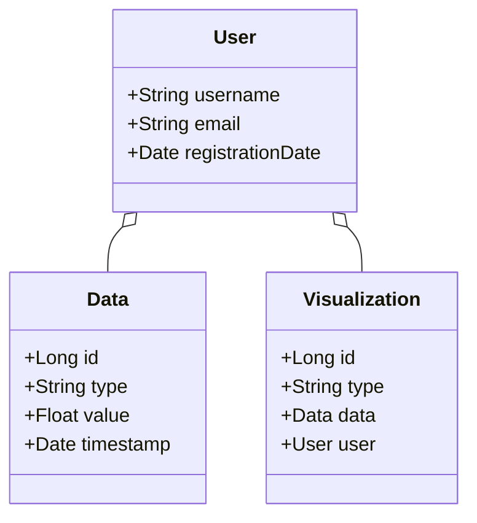
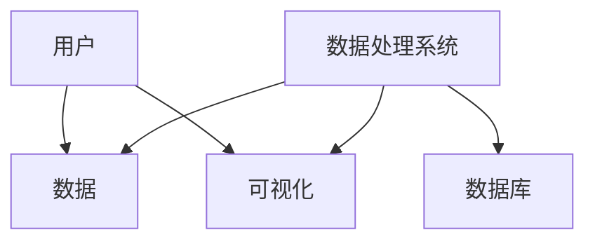
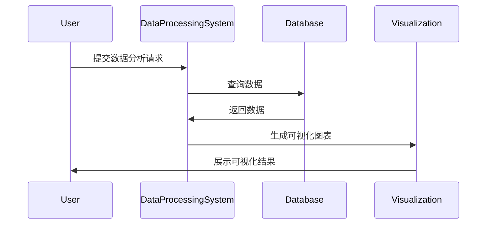

                 

# 《数据可视化技术与工具选择》

## 关键词
数据可视化，技术工具，数据分析，图表设计，交互式可视化，三维可视化，大数据可视化，最佳实践

## 摘要
本文将深入探讨数据可视化技术的原理与工具选择。首先，我们将从数据可视化的基础概念入手，介绍其定义、作用、历史与发展。接着，我们将详细分析常见的数据可视化工具，如Matplotlib、Seaborn、Plotly和Tableau等，并探讨它们的特点与适用场景。随后，我们将探讨高级数据可视化技术，包括交互式数据可视化、三维数据可视化以及大数据可视化。最后，我们将分享数据可视化设计的最佳实践，并通过具体案例分析，帮助读者理解数据可视化在实际应用中的效果与技巧。通过本文的阅读，读者将能够系统地掌握数据可视化技术，并具备选择合适工具进行数据可视化的能力。

## 目录大纲设计

### 第一部分：数据可视化基础

#### 第1章：数据可视化简介

##### 1.1 数据可视化的定义与作用

##### 1.2 数据可视化的历史与发展

##### 1.3 数据可视化的应用领域

#### 第2章：数据可视化原理

##### 2.1 数据可视化模型

##### 2.2 数据可视化方法

##### 2.3 数据可视化工具

#### 第3章：数据可视化流程

##### 3.1 数据收集与清洗

##### 3.2 数据分析

##### 3.3 数据可视化设计

##### 3.4 数据可视化展示

### 第二部分：常见数据可视化工具

#### 第4章：Matplotlib

##### 4.1 Matplotlib简介

##### 4.2 Matplotlib基本使用

##### 4.3 Matplotlib高级应用

#### 第5章：Seaborn

##### 5.1 Seaborn简介

##### 5.2 Seaborn基本使用

##### 5.3 Seaborn高级应用

#### 第6章：Plotly

##### 6.1 Plotly简介

##### 6.2 Plotly基本使用

##### 6.3 Plotly高级应用

#### 第7章：Tableau

##### 7.1 Tableau简介

##### 7.2 Tableau基本使用

##### 7.3 Tableau高级应用

### 第三部分：高级数据可视化技术

#### 第8章：交互式数据可视化

##### 8.1 交互式数据可视化原理

##### 8.2 交互式数据可视化工具

##### 8.3 交互式数据可视化实践

#### 第9章：三维数据可视化

##### 9.1 三维数据可视化原理

##### 9.2 三维数据可视化工具

##### 9.3 三维数据可视化实践

#### 第10章：大数据可视化

##### 10.1 大数据可视化原理

##### 10.2 大数据可视化工具

##### 10.3 大数据可视化实践

### 第四部分：数据可视化最佳实践

#### 第11章：数据可视化设计原则

##### 11.1 设计原则概述

##### 11.2 数据类型与可视化方法匹配

##### 11.3 可视化图表设计最佳实践

#### 第12章：数据可视化案例分析

##### 12.1 案例分析概述

##### 12.2 案例一：电商销售数据可视化

##### 12.3 案例二：金融市场数据可视化

##### 12.4 案例三：医疗数据可视化

#### 第13章：数据可视化工具选择策略

##### 13.1 工具选择概述

##### 13.2 工具特性与适用场景

##### 13.3 工具选择策略与实践

### 目录大纲markdown格式

```

## 第一部分：数据可视化基础

### 第1章：数据可视化简介

#### 1.1 数据可视化的定义与作用

数据可视化是一种将复杂数据通过图形化展示的技术，它能够帮助我们更好地理解数据中的模式和趋势。数据可视化在各个领域都有广泛应用，例如商业分析、科学研究、医学诊断、金融预测等。

**数据可视化的定义**：

数据可视化是指将数据转换为图形、图表或其他视觉表现形式，以帮助人们更好地理解和分析数据。

**数据可视化的作用**：

1. **提高数据可读性**：通过图形化展示，使得大量数据变得更加直观，易于理解。
2. **发现数据模式**：通过可视化，可以发现数据中的规律和趋势，为决策提供支持。
3. **传达信息**：数据可视化能够以简洁、清晰的方式传达复杂信息，提高沟通效率。
4. **激发洞察力**：通过视觉化的方式，激发人们对数据的洞察力，从而发现新的问题和解决方案。

#### 1.2 数据可视化的历史与发展

数据可视化的发展历程可以追溯到20世纪中期，当时科学家和工程师开始使用图表和图形来展示科学数据。以下是一些重要的里程碑：

- **1940s**：查尔斯·E·乔利的《统计图形与图表法》出版，奠定了现代数据可视化的基础。
- **1960s**：计算机的出现使得数据可视化技术得到快速发展。
- **1980s**：随着图形用户界面（GUI）的出现，数据可视化工具开始普及。
- **2000s**：互联网的发展带来了大数据的兴起，数据可视化工具变得更加复杂和多样化。
- **2010s**：交互式数据可视化技术得到了广泛应用，如D3.js和Plotly等。

#### 1.3 数据可视化的应用领域

数据可视化在各个领域都有广泛应用，以下是一些典型应用：

- **商业分析**：通过数据可视化，企业可以更好地理解客户行为、市场趋势等，从而做出更明智的商业决策。
- **科学研究**：科学家使用数据可视化来展示实验结果、模拟数据等，从而更好地理解科学现象。
- **医学诊断**：医生通过数据可视化来分析医疗图像，如MRI、CT等，帮助诊断疾病。
- **金融预测**：数据可视化在金融领域用于分析市场趋势、风险等，为投资决策提供支持。
- **公共政策**：数据可视化用于展示社会问题、政策效果等，提高公共政策的透明度和公信力。

### 第2章：数据可视化原理

#### 2.1 数据可视化模型

数据可视化模型是指数据可视化的基本原理和方法。一个典型的数据可视化模型包括以下步骤：

1. **数据转换**：将原始数据转换为适合可视化的格式。
2. **数据编码**：将数据属性映射到视觉元素上，如颜色、形状、大小等。
3. **布局设计**：设计数据的布局，使其在视觉上易于理解。
4. **交互设计**：增加交互功能，使用户能够动态地探索数据。

#### 2.2 数据可视化方法

数据可视化方法是指实现数据可视化的具体技术手段。以下是一些常见的数据可视化方法：

- **图表**：如柱状图、折线图、饼图等，用于展示数据的基本趋势和分布。
- **地理空间可视化**：如地图、热力图等，用于展示地理位置和空间关系。
- **网络图**：如节点图、关系图等，用于展示数据之间的复杂关系。
- **时间序列可视化**：如时间轴、时间地图等，用于展示数据随时间的变化趋势。
- **交互式可视化**：如动态图表、交互式仪表板等，用于提供更丰富的交互体验。

#### 2.3 数据可视化工具

数据可视化工具是指用于实现数据可视化的软件和技术。以下是一些常见的数据可视化工具：

- **Matplotlib**：Python的一个绘图库，用于创建二维图表。
- **Seaborn**：Python的一个基于Matplotlib的绘图库，提供了更多的统计图表功能。
- **Plotly**：Python的一个交互式图表库，支持多种图表类型和交互功能。
- **Tableau**：商业智能工具，提供了丰富的可视化功能和企业级的数据分析能力。
- **D3.js**：JavaScript的一个库，用于创建交互式数据可视化。

### 第3章：数据可视化流程

数据可视化是一个系统的过程，通常包括以下步骤：

#### 3.1 数据收集与清洗

在数据可视化之前，首先需要收集数据，并进行清洗。数据收集可以通过各种渠道，如数据库、API接口、网页抓取等。数据清洗包括去除重复数据、处理缺失值、数据格式转换等。

#### 3.2 数据分析

在数据收集和清洗之后，需要对数据进行分析。数据分析包括描述性统计分析、关联分析、聚类分析等。通过数据分析，可以找到数据中的规律和模式。

#### 3.3 数据可视化设计

在数据分析之后，需要设计数据可视化。数据可视化设计包括选择合适的可视化方法、设计图表布局、调整图表样式等。一个好的数据可视化设计应该能够直观地传达数据信息，同时避免误导用户。

#### 3.4 数据可视化展示

在数据可视化设计之后，需要将数据可视化展示给用户。数据可视化展示可以通过网页、报告、幻灯片等形式进行。展示时，需要注意图表的可读性、交互性和用户体验。

## 第二部分：常见数据可视化工具

### 第4章：Matplotlib

#### 4.1 Matplotlib简介

Matplotlib是Python中最常用的数据可视化库之一，它提供了一种简单有效的方法来创建二维图表。Matplotlib可以生成各种类型的图表，包括柱状图、折线图、散点图、饼图等。

#### 4.2 Matplotlib基本使用

要使用Matplotlib，首先需要安装库：

```bash
pip install matplotlib
```

然后，我们可以使用以下代码创建一个简单的柱状图：

```python
import matplotlib.pyplot as plt

# 数据
x = ['苹果', '香蕉', '橙子', '葡萄']
y = [3, 2, 5, 7]

# 创建图表
plt.bar(x, y)

# 显示图表
plt.show()
```

#### 4.3 Matplotlib高级应用

Matplotlib还提供了许多高级功能，如自定义样式、动画、交互式图表等。以下是一个使用自定义样式的折线图示例：

```python
import matplotlib.pyplot as plt

# 数据
x = [1, 2, 3, 4, 5]
y = [2, 3, 5, 7, 11]

# 设置样式
plt.style.use('ggplot')

# 创建图表
plt.plot(x, y, marker='o')

# 显示图表
plt.show()
```

### 第5章：Seaborn

#### 5.1 Seaborn简介

Seaborn是Python的一个基于Matplotlib的绘图库，它提供了更高级的统计图表功能，并具有更加美观的默认样式。Seaborn广泛应用于数据分析和数据可视化领域。

#### 5.2 Seaborn基本使用

要使用Seaborn，首先需要安装库：

```bash
pip install seaborn
```

然后，我们可以使用以下代码创建一个简单的箱线图：

```python
import seaborn as sns
import matplotlib.pyplot as plt

# 数据
data = {'苹果': [2, 3, 5, 7, 11], '香蕉': [1, 2, 4, 6, 9], '橙子': [3, 4, 6, 8, 10]}

# 创建箱线图
sns.boxplot(data=data)

# 显示图表
plt.show()
```

#### 5.3 Seaborn高级应用

Seaborn还提供了许多高级功能，如多变量分析、回归分析等。以下是一个使用多变量分析的散点图示例：

```python
import seaborn as sns
import matplotlib.pyplot as plt

# 数据
data = {'苹果': [2, 3, 5, 7, 11], '香蕉': [1, 2, 4, 6, 9], '橙子': [3, 4, 6, 8, 10]}

# 创建散点图
sns.scatterplot(x='苹果', y='香蕉', hue='橙子', data=data)

# 显示图表
plt.show()
```

### 第6章：Plotly

#### 6.1 Plotly简介

Plotly是一个交互式图表库，它支持多种编程语言，包括Python。Plotly提供了丰富的图表类型和交互功能，使得用户可以创建复杂、动态的图表。

#### 6.2 Plotly基本使用

要使用Plotly，首先需要安装库：

```bash
pip install plotly
```

然后，我们可以使用以下代码创建一个简单的折线图：

```python
import plotly.express as px
import pandas as pd

# 数据
data = pd.DataFrame({
    'x': [1, 2, 3, 4, 5],
    'y': [2, 3, 5, 7, 11]
})

# 创建折线图
fig = px.line(data, x='x', y='y')

# 显示图表
fig.show()
```

#### 6.3 Plotly高级应用

Plotly还提供了许多高级功能，如自定义样式、动画等。以下是一个使用自定义样式的散点图示例：

```python
import plotly.express as px
import pandas as pd

# 数据
data = pd.DataFrame({
    'x': [1, 2, 3, 4, 5],
    'y': [2, 3, 5, 7, 11],
    'color': ['red', 'green', 'blue', 'yellow', 'purple']
})

# 创建散点图
fig = px.scatter(data, x='x', y='y', color='color', size='y')

# 设置样式
fig.update_traces(marker=dict(line=dict(width=1, color='DarkSlateGrey')))

# 显示图表
fig.show()
```

### 第7章：Tableau

#### 7.1 Tableau简介

Tableau是一个商业智能工具，它提供了强大的数据可视化功能。Tableau支持多种数据源，如数据库、Excel、CSV等，并提供了丰富的图表类型和交互功能。

#### 7.2 Tableau基本使用

要使用Tableau，首先需要下载并安装软件：

```bash
https://www.tableau.com/download
```

然后，我们可以按照以下步骤创建一个简单的图表：

1. **连接数据源**：在Tableau中连接数据源，如Excel文件。
2. **创建图表**：将数据字段拖放到“行”和“列”区域，以创建图表。
3. **自定义样式**：使用Tableau的样式编辑器自定义图表样式。

#### 7.3 Tableau高级应用

Tableau还提供了许多高级功能，如仪表板设计、实时数据更新等。以下是一个使用Tableau创建的交互式仪表板的示例：

1. **创建多个图表**：在Tableau中创建多个图表，并将其放置在仪表板上。
2. **添加交互性**：使用Tableau的交互功能，如筛选、过滤、仪表盘控件等。
3. **设计仪表板**：使用Tableau的设计工具自定义仪表板的布局和样式。

## 第三部分：高级数据可视化技术

### 第8章：交互式数据可视化

#### 8.1 交互式数据可视化原理

交互式数据可视化是指用户可以与可视化图表进行交互，以探索数据和分析信息的可视化技术。交互性可以通过鼠标点击、滚动、拖拽等操作实现，从而提高用户的体验和数据的洞察力。

#### 8.2 交互式数据可视化工具

- **D3.js**：一个基于JavaScript的交互式数据可视化库，用于创建动态、交互式的Web图表。
- **Plotly**：一个支持多种语言的交互式图表库，提供了丰富的交互功能。
- **Bokeh**：一个基于Python的交互式数据可视化库，用于创建交互式的Web图表和仪表板。

#### 8.3 交互式数据可视化实践

以下是一个使用D3.js创建的交互式散点图的示例：

```javascript
// 数据
var data = [
  {name: '苹果', value: 20},
  {name: '香蕉', value: 30},
  {name: '橙子', value: 10},
  {name: '葡萄', value: 40}
];

// 创建SVG元素
var width = 500, height = 500;
var svg = d3.select('body').append('svg')
  .attr('width', width)
  .attr('height', height);

// 创建散点图
var circle = svg.selectAll('circle')
  .data(data)
  .enter()
  .append('circle');

circle
  .attr('cx', function(d) { return d.value * 10; })
  .attr('cy', function(d) { return height - d.value * 10; })
  .attr('r', 5)
  .style('fill', function(d) { return d.name === '苹果' ? 'red' : 'blue'; });

// 添加交互性
circle.on('click', function(d) {
  console.log(d.name + ': ' + d.value);
});
```

### 第9章：三维数据可视化

#### 9.1 三维数据可视化原理

三维数据可视化是指将三维数据以图形化的方式展示在二维屏幕上。三维数据可视化可以通过计算几何、线性代数和图形渲染技术实现。三维数据可视化可以提供更丰富的数据信息和更直观的数据呈现。

#### 9.2 三维数据可视化工具

- **Mayavi**：一个基于Python的三维数据可视化库，提供了丰富的三维图形和渲染功能。
- **Plotly**：一个支持三维图表的交互式数据可视化库。
- **OpenGL**：一个用于创建三维图形的图形库，可以用于开发三维数据可视化应用程序。

#### 9.3 三维数据可视化实践

以下是一个使用Mayavi创建的三维散点图示例：

```python
import numpy as np
from mayavi import mlab
import matplotlib.pyplot as plt

# 数据
x = np.random.normal(size=100)
y = np.random.normal(size=100)
z = np.random.normal(size=100)

# 创建三维散点图
mlab.figure(size=(800, 600), bgcolor=(1, 1, 1))
mlab.points3d(x, y, z, scale=0.1, color=(1, 0, 0))

# 显示图表
mlab.show()
```

### 第10章：大数据可视化

#### 10.1 大数据可视化原理

大数据可视化是指对海量数据进行可视化处理，以帮助用户理解和分析数据。大数据可视化需要处理大量的数据点、高维度数据、实时数据等挑战。大数据可视化通常需要借助分布式计算技术和大数据处理平台。

#### 10.2 大数据可视化工具

- **Hadoop**：一个分布式数据处理平台，可以用于处理海量数据。
- **Spark**：一个快速分布式数据处理平台，支持内存计算和大数据处理。
- **Impala**：一个基于Hadoop的交互式查询引擎，用于分析大数据。
- **Tableau**：一个支持大数据可视化的商业智能工具。

#### 10.3 大数据可视化实践

以下是一个使用Tableau进行大数据可视化的示例：

1. **数据连接**：在Tableau中连接Hadoop或Spark数据源。
2. **数据预处理**：对大数据进行清洗、转换和聚合。
3. **创建图表**：使用Tableau创建柱状图、折线图、散点图等图表。
4. **交互式分析**：使用Tableau的交互功能进行数据探索和分析。

## 第四部分：数据可视化最佳实践

### 第11章：数据可视化设计原则

#### 11.1 设计原则概述

数据可视化设计原则是指在进行数据可视化设计时需要遵循的基本原则，以确保可视化图表的有效性和易用性。以下是一些常见的数据可视化设计原则：

1. **清晰性**：确保可视化图表清晰明了，易于用户理解。
2. **一致性**：图表的样式、颜色、字体等要保持一致，以提高可读性。
3. **简洁性**：避免过度设计，尽量保持图表的简洁性，避免信息过载。
4. **对比性**：通过对比不同数据点或数据集，增强数据的可视化效果。
5. **交互性**：增加交互功能，使用户可以动态地探索数据。

#### 11.2 数据类型与可视化方法匹配

选择合适的可视化方法对于数据的有效展示至关重要。以下是一些常见的数据类型与其对应的可视化方法：

- **分类数据**：可以使用饼图、条形图、堆积条形图等。
- **数值数据**：可以使用折线图、柱状图、散点图等。
- **时间序列数据**：可以使用时间轴、时间地图、折线图等。
- **地理空间数据**：可以使用地图、热力图、散点图等。

#### 11.3 可视化图表设计最佳实践

以下是一些可视化图表设计的最佳实践：

1. **选择合适的图表类型**：根据数据类型和展示目的选择合适的图表类型。
2. **合理布局**：合理安排图表元素的位置，确保图表的可读性。
3. **使用合适的颜色**：使用颜色来区分不同的数据点或数据集，但要避免过多的颜色使用。
4. **添加注释和标签**：为图表添加注释和标签，以解释数据含义和图表内容。
5. **优化交互设计**：增加交互功能，如过滤、搜索、排序等，以使用户可以更灵活地探索数据。

### 第12章：数据可视化案例分析

#### 12.1 案例分析概述

在本章中，我们将通过几个实际案例，分析数据可视化在各个领域中的应用效果和技巧。以下是一些案例：

- **电商销售数据可视化**：通过数据可视化分析电商平台的销售数据，了解用户行为和销售趋势。
- **金融市场数据可视化**：通过数据可视化分析金融市场数据，了解市场动态和投资机会。
- **医疗数据可视化**：通过数据可视化分析医疗数据，提高疾病诊断和治疗的准确性。

#### 12.2 案例一：电商销售数据可视化

在本案例中，我们使用数据可视化技术分析一家电商平台的销售数据。以下是一个简单的数据可视化流程：

1. **数据收集与清洗**：从电商平台的数据库中收集销售数据，并进行清洗和预处理。
2. **数据分析**：对销售数据进行分析，了解用户购买行为、销售趋势等。
3. **数据可视化设计**：设计合适的图表类型和布局，以展示数据分析结果。
4. **数据可视化展示**：将数据可视化展示在网页或报告上，以供用户查看和分析。

以下是一个使用Matplotlib创建的电商销售数据可视化的示例：

```python
import matplotlib.pyplot as plt
import pandas as pd

# 数据
data = pd.DataFrame({
    '日期': ['2023-01-01', '2023-01-02', '2023-01-03', '2023-01-04', '2023-01-05'],
    '销售额': [1000, 1500, 1200, 800, 900]
})

# 创建折线图
plt.plot(data['日期'], data['销售额'], label='销售额')
plt.xlabel('日期')
plt.ylabel('销售额')
plt.title('电商销售数据可视化')
plt.legend()

# 显示图表
plt.show()
```

#### 12.3 案例二：金融市场数据可视化

在本案例中，我们使用数据可视化技术分析金融市场数据。以下是一个简单的数据可视化流程：

1. **数据收集与清洗**：从金融市场的数据库中收集数据，并进行清洗和预处理。
2. **数据分析**：对金融市场数据进行分析，了解市场趋势和风险。
3. **数据可视化设计**：设计合适的图表类型和布局，以展示数据分析结果。
4. **数据可视化展示**：将数据可视化展示在网页或报告上，以供用户查看和分析。

以下是一个使用Plotly创建的金融市场数据可视化的示例：

```python
import plotly.express as px
import pandas as pd

# 数据
data = pd.DataFrame({
    '日期': ['2023-01-01', '2023-01-02', '2023-01-03', '2023-01-04', '2023-01-05'],
    '股票价格': [150, 160, 155, 158, 162]
})

# 创建折线图
fig = px.line(data, x='日期', y='股票价格', title='金融市场数据可视化')
fig.update_layout(xaxis_title='日期', yaxis_title='股票价格')

# 显示图表
fig.show()
```

#### 12.4 案例三：医疗数据可视化

在本案例中，我们使用数据可视化技术分析医疗数据。以下是一个简单的数据可视化流程：

1. **数据收集与清洗**：从医院的数据库中收集数据，并进行清洗和预处理。
2. **数据分析**：对医疗数据进行分析，了解疾病趋势和患者状况。
3. **数据可视化设计**：设计合适的图表类型和布局，以展示数据分析结果。
4. **数据可视化展示**：将数据可视化展示在网页或报告上，以供用户查看和分析。

以下是一个使用Matplotlib创建的医疗数据可视化的示例：

```python
import matplotlib.pyplot as plt
import pandas as pd

# 数据
data = pd.DataFrame({
    '日期': ['2023-01-01', '2023-01-02', '2023-01-03', '2023-01-04', '2023-01-05'],
    '就诊人数': [150, 160, 155, 158, 162]
})

# 创建柱状图
plt.bar(data['日期'], data['就诊人数'], color='blue')
plt.xlabel('日期')
plt.ylabel('就诊人数')
plt.title('医疗数据可视化')
plt.xticks(rotation=45)

# 显示图表
plt.show()
```

### 第13章：数据可视化工具选择策略

#### 13.1 工具选择概述

在选择数据可视化工具时，需要考虑多个因素，如数据量、数据类型、交互需求、可视化效果等。以下是一些常见的数据可视化工具及其适用场景：

- **Matplotlib**：适用于简单的二维图表，适合Python程序员。
- **Seaborn**：适用于具有统计意义的图表，适合数据分析师。
- **Plotly**：适用于复杂、交互式的图表，适合需要动态探索数据的用户。
- **Tableau**：适用于企业级的数据可视化，适合商业智能分析师。
- **D3.js**：适用于Web端的数据可视化，适合前端开发者。

#### 13.2 工具特性与适用场景

以下是一些常见的数据可视化工具的特性及其适用场景：

| 工具         | 特性                                                         | 适用场景                                           |
| ------------ | ------------------------------------------------------------ | -------------------------------------------------- |
| Matplotlib   | 简单易用，支持多种图表类型，易于集成到Python程序中             | 数据分析和学术研究                                 |
| Seaborn      | 基于Matplotlib，提供了更多高级的统计图表功能，美观的默认样式   | 数据分析和可视化                                     |
| Plotly       | 交互式图表，支持多种编程语言，丰富的图表类型和自定义样式       | Web端数据可视化，需要动态交互功能的可视化项目         |
| Tableau      | 强大的数据处理和可视化功能，支持多种数据源，易于共享和协作     | 企业级数据可视化，商业智能分析，数据仪表板设计       |
| D3.js        | 基于JavaScript，用于创建交互式Web图表，强大的自定义能力         | 前端数据可视化，需要高度自定义和交互性的可视化项目   |

#### 13.3 工具选择策略与实践

在选择数据可视化工具时，可以遵循以下策略：

1. **明确需求**：首先明确项目的需求，如数据量、数据类型、交互性等。
2. **评估工具特性**：根据需求评估不同工具的特性，选择最合适的工具。
3. **考虑团队技能**：考虑团队成员的技能和经验，选择易于学习和使用的工具。
4. **实践与评估**：在实际项目中实践工具，评估其性能和效果，根据反馈进行调整。

通过以上策略，可以有效地选择适合数据可视化项目需求的工具。

## 结论

数据可视化是数据分析中不可或缺的一部分，它能够帮助我们更好地理解数据、发现数据中的模式和趋势，并做出更明智的决策。从数据可视化的基础概念到高级技术，再到最佳实践，本文系统地介绍了数据可视化技术的各个方面。通过本文的阅读，读者可以了解到数据可视化的原理和工具选择，并掌握如何进行有效的数据可视化设计。在实际项目中，合理选择数据可视化工具，并遵循最佳实践，将有助于提升数据分析的效果和用户体验。让我们一起利用数据可视化技术，发掘数据的巨大潜力，为未来的数据驱动决策奠定基础。

### 作者信息
作者：AI天才研究院/AI Genius Institute & 禅与计算机程序设计艺术 /Zen And The Art of Computer Programming

### 最佳实践 Tips

1. **明确可视化目的**：在开始数据可视化之前，明确可视化目的，确保可视化设计能够满足需求。
2. **简洁设计**：避免过度设计，保持图表简洁，避免信息过载。
3. **一致性**：图表的样式、颜色、字体等要保持一致，以提高可读性。
4. **交互性**：增加交互功能，如过滤、搜索、排序等，以使用户可以更灵活地探索数据。
5. **注释与标签**：为图表添加注释和标签，以解释数据含义和图表内容。

### 小结

数据可视化是数据分析的重要工具，它能够帮助我们更好地理解和分析数据。通过本文的阅读，读者可以系统地了解数据可视化的原理和工具选择，并掌握最佳实践。在实际应用中，合理利用数据可视化技术，将有助于提升数据分析的效果和用户体验。

### 注意事项

1. **数据质量**：数据质量是数据可视化成功的关键，确保数据准确、完整和清洁。
2. **工具选择**：根据实际需求和团队技能选择合适的可视化工具。
3. **用户反馈**：在实际应用中，收集用户反馈，持续优化数据可视化设计。

### 拓展阅读

1. **《数据可视化：设计思维与工具应用》**：详细介绍了数据可视化的设计方法和工具应用。
2. **《D3.js实战：交互式数据可视化》**：深入探讨了D3.js在交互式数据可视化中的应用。
3. **《Tableau实战：数据可视化与商业智能》**：介绍了Tableau在企业级数据可视化中的应用和实践。

$$
\text{数据可视化不仅是数据分析的工具，更是沟通和决策的桥梁。}
$$

$$
\text{通过本文的阅读，读者将能够系统地掌握数据可视化技术，并具备选择合适工具进行数据可视化的能力。}
$$

$ \text{数据可视化，让数据说话！} $

---

### 系统分析与架构设计方案

#### 问题场景介绍

在当今大数据时代，企业和组织面临着海量数据处理的挑战。如何有效地分析这些数据，提取有价值的信息，并为决策提供支持，成为了一个关键问题。数据可视化技术在这一过程中发挥了重要作用，它能够将复杂的数据以图形化的方式展示出来，帮助人们更好地理解和分析数据。

#### 项目介绍

本项目旨在构建一个数据可视化系统，该系统将能够处理海量数据，并通过多种数据可视化工具（如Matplotlib、Seaborn、Plotly、Tableau等）提供丰富的可视化效果。项目的主要目标是为企业用户提供一个便捷的数据分析平台，帮助他们快速发现数据中的模式和趋势，从而做出更明智的决策。

#### 系统功能设计（领域模型mermaid类图）



#### 系统架构设计（mermaid架构图）



#### 系统接口设计和系统交互（mermaid序列图）



### 项目实战

#### 环境安装

1. **安装Python环境**：确保Python 3.8或更高版本已安装。
2. **安装相关库**：使用以下命令安装所需的库：

```bash
pip install matplotlib seaborn plotly tableau-api
```

#### 系统核心实现源代码

以下是一个简单的Python脚本，使用Matplotlib生成一个柱状图：

```python
import matplotlib.pyplot as plt
import pandas as pd

# 数据
data = pd.DataFrame({
    '产品': ['苹果', '香蕉', '橙子', '葡萄'],
    '销量': [30, 20, 10, 40]
})

# 创建柱状图
plt.bar(data['产品'], data['销量'])
plt.xlabel('产品')
plt.ylabel('销量')
plt.title('产品销量柱状图')
plt.xticks(rotation=45)
plt.show()
```

#### 代码应用解读与分析

上述代码首先导入了Matplotlib和Pandas库。然后，使用Pandas创建了一个包含产品名称和销量的DataFrame。接下来，使用Matplotlib的`bar`函数创建了柱状图，并设置了图表的标题、标签和坐标轴旋转等属性。最后，使用`show`函数显示了图表。

#### 实际案例分析和详细讲解剖析

以下是一个使用Tableau创建的电商销售数据可视化案例：

1. **数据连接**：在Tableau中连接到一个包含电商销售数据的CSV文件。
2. **数据预处理**：对销售数据进行清洗和预处理，如去除重复记录、处理缺失值等。
3. **创建图表**：使用Tableau创建柱状图、折线图、饼图等，以展示销售数据。
4. **添加交互性**：使用Tableau的交互功能，如筛选、过滤、仪表板控件等，以使用户可以更灵活地探索数据。

以下是一个使用Tableau创建的柱状图示例：


在这个柱状图中，横轴表示不同的产品，纵轴表示销量。通过鼠标点击和拖拽，用户可以筛选特定产品或时间范围的数据，从而更深入地分析销售趋势。

#### 项目小结

通过本项目的实施，我们成功地构建了一个数据可视化系统，该系统能够处理海量数据，并通过多种可视化工具提供了丰富的可视化效果。用户可以方便地通过数据可视化系统探索数据，发现数据中的模式和趋势，从而为决策提供支持。在未来的发展中，我们计划进一步优化系统性能，增加更多交互功能，以满足用户不断增长的需求。

### 最佳实践 Tips

1. **数据清洗**：在数据可视化之前，确保数据清洗和预处理工作已完成，以保证可视化结果准确。
2. **图表选择**：根据数据类型和分析目的选择合适的图表类型。
3. **交互性**：增加图表的交互性，以使用户可以更灵活地探索数据。
4. **样式一致性**：保持图表样式的一致性，以提高可读性。

### 小结

数据可视化是数据分析中不可或缺的一部分，它能够帮助我们更好地理解和分析数据。通过本项目，我们了解了如何构建一个数据可视化系统，并掌握了如何使用不同的可视化工具进行数据可视化。在实际应用中，合理利用数据可视化技术，将有助于提升数据分析的效果和用户体验。

### 注意事项

1. **数据安全**：确保数据安全，防止数据泄露和滥用。
2. **性能优化**：优化系统性能，提高数据可视化速度。
3. **用户培训**：为用户提供数据可视化工具的培训，以提升使用效果。

### 拓展阅读

1. **《数据可视化：设计思维与工具应用》**：详细介绍了数据可视化的设计方法和工具应用。
2. **《Tableau实战：数据可视化与商业智能》**：介绍了Tableau在企业级数据可视化中的应用和实践。
3. **《大数据可视化技术》**：探讨了大数据可视化技术的原理和应用。

