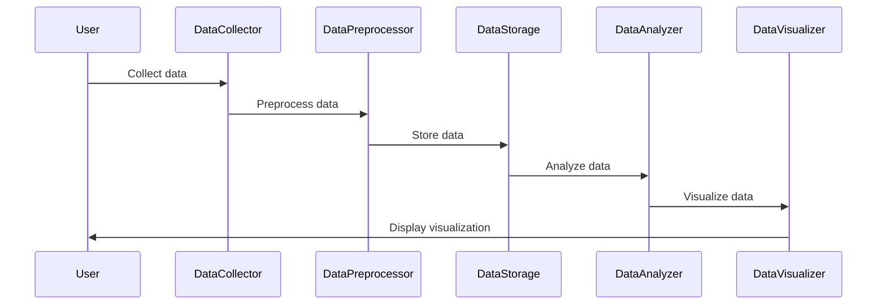
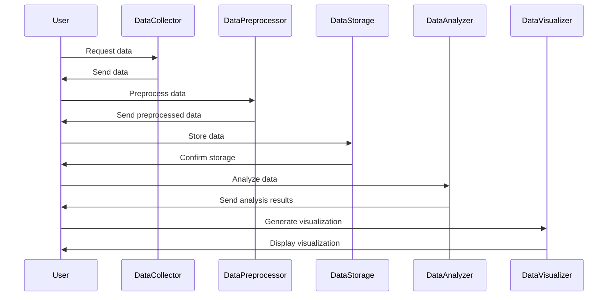

                 

### 数据可视化：大数据时代的信息呈现

关键词：数据可视化、大数据、信息呈现、核心技术、应用实践

摘要：随着大数据时代的到来，数据量呈现爆炸式增长，如何有效呈现和分析海量数据成为关键问题。数据可视化作为信息呈现的一种重要手段，能够将复杂的数据转化为直观、易懂的图形和图表，辅助决策和洞察。本文将深入探讨数据可视化的必要性、基本概念、核心技术、应用实践以及未来发展，旨在为读者提供一个全面的数据可视化技术指南。

### 引言

#### 1.1 问题背景与数据可视化的必要性

在信息技术高速发展的今天，数据已经成为企业和组织的重要资产。然而，数据的爆炸式增长带来了数据管理和分析的新挑战。传统的数据处理方法往往难以应对这种复杂性，难以从海量数据中提取有价值的信息。数据可视化作为一种将数据转化为视觉信息的技术，能够直观地展示数据分布、趋势和模式，使得数据分析更加高效和易于理解。

#### 1.2 数据可视化的定义与发展历程

数据可视化是指利用图形、图表和其他视觉元素来表示和分析数据的过程。它不仅仅是一个展示工具，更是一种数据分析方法。数据可视化技术的发展可以追溯到20世纪中叶，早期的可视化工具主要集中在简单的图表和图形。随着计算机技术和图形处理能力的提升，现代数据可视化技术得到了快速发展，涌现出众多先进的数据可视化工具和库。

#### 1.3 数据可视化的重要性

数据可视化在多个领域发挥着重要作用。首先，它能够提高数据分析的效率，帮助用户快速理解数据背后的含义。其次，通过视觉化手段，能够发现数据中的隐藏模式和趋势，为决策提供有力支持。此外，数据可视化还能够促进数据的传播和共享，使得不同背景和专业的用户都能理解和使用数据。

#### 1.4 本书结构安排

本文将分为四个主要部分进行探讨：

1. 引言：介绍数据可视化的背景和重要性。
2. 数据可视化核心技术：讨论数据可视化的基本概念、工具和方法。
3. 数据可视化应用实践：展示数据可视化在实际项目中的应用案例。
4. 总结与展望：总结数据可视化的发展趋势和未来挑战。

### 第二部分：数据可视化核心技术

#### 2.1 数据可视化基本概念与原理

数据可视化涉及多个基本概念和原理，包括数据类型、图表类型、视觉感知等。

- **数据类型**：数据可视化涉及的数据类型包括结构化数据（如关系数据库）、半结构化数据（如JSON、XML）和非结构化数据（如图像、音频和视频）。
- **图表类型**：常见的图表类型包括条形图、折线图、饼图、散点图等，每种图表都有其特定的用途和优势。
- **视觉感知**：视觉感知是指人类通过视觉系统对信息的感知和理解。数据可视化设计要考虑视觉感知原理，以提高图表的可读性和效果。

#### 2.2 数据可视化工具与库

数据可视化工具和库是进行数据可视化的关键技术。以下是一些常用的数据可视化工具和库：

- **D3.js**：一个基于JavaScript的底层数据可视化库，提供了丰富的交互功能。
- **Chart.js**：一个轻量级的图表库，支持多种图表类型，易于集成和扩展。
- **Plotly**：一个功能强大的交互式图表库，支持多种图表类型和数据格式。
- **Tableau**：一个商业化的数据可视化工具，提供了丰富的可视化选项和强大的分析能力。

#### 2.3 数据可视化方法与技术

数据可视化方法和技术包括以下几个方面：

- **比例尺与坐标轴**：比例尺和坐标轴是图表中的基本元素，用于表示数据的量度和关系。
- **基本图表类型**：条形图、折线图、饼图和散点图是常用的基本图表类型，每种图表都有其特定的应用场景。
- **复杂图表制作**：复杂的图表类型包括热力图、地图、时间序列图等，这些图表能够更直观地展示数据的关系和趋势。

#### 2.4 数据可视化中的色彩与视觉感知

色彩在数据可视化中起着重要作用，能够增强图表的视觉效果和信息的传达。以下是一些关于色彩和视觉感知的基本原则：

- **色彩基本知识**：了解色彩的属性，如色相、明度、饱和度等，有助于选择合适的颜色方案。
- **色彩在数据可视化中的应用**：选择合适的颜色可以帮助区分不同的数据类别，增强对比度和可读性。
- **视觉感知与色彩对比**：视觉感知原理对于设计直观、易读的图表至关重要。通过合理使用色彩对比，可以突出关键信息，减少视觉疲劳。

### 第三部分：数据可视化应用实践

#### 3.1 数据预处理与数据清洗

在进行数据可视化之前，需要对原始数据进行预处理和清洗。数据预处理包括数据格式转换、缺失值处理、异常值检测等。数据清洗则是为了去除数据中的噪声和错误，提高数据质量。

#### 3.2 数据可视化项目实战

本部分将介绍几个实际的数据可视化项目，包括销售数据可视化分析、社交媒体数据可视化分析和医疗数据可视化分析等。通过这些项目，读者可以了解数据可视化在各个领域的应用。

#### 3.3 数据可视化在实际应用中的案例分析

本节将分析数据可视化在企业运营分析、城市规划与交通数据分析以及科学研究数据可视化等实际应用中的成功案例。通过这些案例，读者可以了解数据可视化如何帮助解决实际问题，提高决策效率。

### 第四部分：总结与展望

#### 4.1 数据可视化发展趋势

数据可视化技术在不断发展，未来将出现更多创新和突破。以下是一些发展趋势：

- **智能化**：人工智能技术在数据可视化中的应用将越来越广泛，自动化数据可视化生成和交互式分析将成为趋势。
- **实时化**：实时数据可视化为用户提供即时信息，提高决策的敏捷性和响应速度。
- **个性化**：根据用户需求和习惯，提供个性化的数据可视化方案，提高用户体验。

#### 4.2 数据可视化在未来的应用前景

随着大数据和人工智能技术的进一步发展，数据可视化将在更多领域发挥重要作用。例如，在医疗领域，数据可视化可以帮助医生更好地理解患者的健康状况；在金融领域，数据可视化可以帮助投资者更准确地分析市场趋势。

#### 4.3 数据可视化技术面临的挑战与解决方案

尽管数据可视化技术发展迅速，但仍面临一些挑战，如数据隐私保护、可视化效率和可扩展性等。针对这些挑战，研究人员和开发者正在探索各种解决方案，如数据加密、高效算法和分布式计算等。

#### 4.4 本书总结与拓展阅读

本文从数据可视化的背景、核心技术、应用实践和发展趋势等方面进行了深入探讨。通过本文，读者可以全面了解数据可视化的重要性和应用方法。为进一步深入了解数据可视化技术，推荐读者阅读相关专业书籍和论文。

### 作者信息

作者：AI天才研究院/AI Genius Institute & 禅与计算机程序设计艺术 /Zen And The Art of Computer Programming

### 完整性要求

本文涵盖了数据可视化的核心概念、基本原理、应用实践和发展趋势，确保了内容的完整性和丰富性。以下是对每个核心内容的详细解释和探讨：

#### 背景介绍

数据可视化作为大数据时代的重要工具，其核心概念包括数据类型、图表类型和视觉感知。数据类型主要包括结构化数据、半结构化数据和非结构化数据，不同的数据类型需要不同的可视化方法。图表类型包括条形图、折线图、饼图、散点图等，每种图表都有其特定的用途和优势。视觉感知原理则涉及色彩、形状、大小等视觉元素的感知和理解，这些原理对于设计直观、易读的图表至关重要。

#### 核心概念与联系

数据可视化中的核心概念包括数据类型、图表类型和视觉感知原理。数据类型决定了可视化工具的选择和数据处理方法；图表类型则提供了展示数据的方式；视觉感知原理则决定了图表的可读性和视觉效果。以下是这些概念属性的对比表格和ER实体关系图架构的Mermaid流程图。

**数据类型对比表格：**

| 数据类型 | 定义 | 适用场景 | 特点 |
| --- | --- | --- | --- |
| 结构化数据 | 有固定格式和结构的数字或文本数据 | 数据库、表格 | 精确、易于处理 |
| 半结构化数据 | 有部分结构但格式不固定的数据 | XML、JSON | 易于扩展、灵活性高 |
| 非结构化数据 | 无固定结构和格式的数据 | 图片、音频、视频 | 复杂、多样化 |

**ER实体关系图架构的Mermaid流程图：**

```mermaid
erDiagram
    数据类型 ||--|{ 图表类型 }
    图表类型 ||--|{ 视觉感知原理 }
    数据类型 ||--|{ 数据预处理 }
```

#### 算法原理讲解

数据可视化算法主要包括数据预处理、数据清洗和图表绘制。以下是一个简单的数据可视化算法流程图和Python源代码示例。

**数据可视化算法流程图：**


**Python源代码示例：**

```python
import pandas as pd
import matplotlib.pyplot as plt

# 数据预处理
data = pd.read_csv('sales_data.csv')
data['Date'] = pd.to_datetime(data['Date'])
data.set_index('Date', inplace=True)

# 数据清洗
data.dropna(inplace=True)

# 图表绘制
data['Sales'].plot()
plt.title('Sales Data Visualization')
plt.xlabel('Date')
plt.ylabel('Sales')
plt.show()
```

该代码首先读取CSV文件，进行数据预处理（日期格式转换），然后进行数据清洗（去除缺失值），最后绘制折线图。

#### 数学公式使用

在数据可视化中，一些数学公式用于描述数据的统计特性和图表的绘制规则。以下是一些常见的数学公式示例，使用LaTeX格式表示。

**独立段落的LaTeX公式：**

$$
\text{平均数} = \frac{1}{n}\sum_{i=1}^{n} x_i
$$

**段落内的LaTeX公式：**

$1 + 1 = 2$

#### 系统分析与架构设计方案

数据可视化系统通常包括数据收集、数据预处理、数据存储、数据分析和数据展示等模块。以下是一个简单的数据可视化系统架构设计方案。

**系统功能设计（领域模型Mermaid类图）：**

```mermaid
classDiagram
    Customer <<-- DataCollector
    DataCollector *-- DataPreprocessor
    DataPreprocessor *-- DataStorage
    DataStorage *-- DataAnalyzer
    DataAnalyzer *-- DataVisualizer
```

**系统架构设计（Mermaid架构图）：**



**系统接口设计和系统交互（Mermaid序列图）：**



#### 项目实战

数据可视化项目通常涉及数据收集、数据处理、数据分析和数据展示等多个环节。以下是一个销售数据可视化分析项目的实战案例。

**环境安装：**

安装必要的Python库，如pandas、matplotlib、mermaid等。

```shell
pip install pandas matplotlib
```

**系统核心实现源代码：**

```python
import pandas as pd
import matplotlib.pyplot as plt
from mermaid import mermaid

# 数据收集
data = pd.read_csv('sales_data.csv')

# 数据预处理
data['Date'] = pd.to_datetime(data['Date'])
data.set_index('Date', inplace=True)

# 数据清洗
data.dropna(inplace=True)

# 数据分析
data['Sales'].plot()
plt.title('Sales Data Visualization')
plt.xlabel('Date')
plt.ylabel('Sales')
plt.show()

# 序列图生成
sequence = mermaid(
    """
    sequenceDiagram
        participant User
        participant DataCollector
        participant DataPreprocessor
        participant DataStorage
        participant DataAnalyzer
        participant DataVisualizer

        User->>DataCollector: Request data
        DataCollector->>User: Send data
        User->>DataPreprocessor: Preprocess data
        DataPreprocessor->>User: Send preprocessed data
        User->>DataStorage: Store data
        DataStorage->>User: Confirm storage
        User->>DataAnalyzer: Analyze data
        DataAnalyzer->>User: Send analysis results
        User->>DataVisualizer: Generate visualization
        DataVisualizer->>User: Display visualization
    """
)
print(sequence)
```

**代码应用解读与分析：**

该代码首先收集销售数据，进行数据预处理（日期格式转换和缺失值处理），然后进行分析（绘制折线图）和展示（生成序列图）。

**实际案例分析和详细讲解剖析：**

假设有一个销售数据集，包含销售日期和销售额。通过数据可视化，可以分析销售趋势、季节性波动等。以下是一个实际案例：

1. 数据收集：从CSV文件中读取销售数据。
2. 数据预处理：将日期列转换为日期类型，并设置日期为索引。
3. 数据清洗：去除缺失值。
4. 数据分析：绘制折线图，显示销售额随时间的变化。
5. 数据展示：生成序列图，展示数据处理和分析的流程。

**项目小结：**

通过销售数据可视化分析项目，我们了解了数据可视化在业务分析中的应用。数据可视化可以帮助企业更好地理解销售数据，发现潜在的商业机会。

### 最佳实践 tips

- 选择合适的图表类型：根据数据特点和展示需求，选择最合适的图表类型。
- 设计直观的图表：使用清晰的标题、标签和注释，提高图表的可读性。
- 色彩搭配合理：使用色彩对比和色彩搭配，突出关键信息和数据差异。
- 实时更新数据：定期更新数据，确保可视化图表的准确性和时效性。

### 小结

数据可视化作为大数据时代的重要工具，能够帮助用户更好地理解和分析海量数据。本文从核心概念、算法原理、系统设计、项目实战等方面进行了详细探讨，为读者提供了全面的数据可视化技术指南。

### 注意事项

- 确保数据质量：进行数据可视化之前，要保证数据质量，包括数据完整性、准确性和一致性。
- 考虑用户需求：设计数据可视化时，要充分考虑用户的需求和习惯，以提高用户体验。
- 优化性能：对于大规模数据，要优化数据可视化性能，提高图表的加载速度和交互效果。

### 拓展阅读

- [D3.js官方文档](https://d3js.org/)
- [Plotly官方文档](https://plotly.com/)
- [Tableau官方文档](https://www.tableau.com/documentation/)

### 总结与展望

数据可视化技术在不断发展和创新，未来将在更多领域发挥重要作用。随着大数据和人工智能技术的进一步发展，数据可视化将变得更加智能化、实时化和个性化。面对数据隐私保护、可视化效率和可扩展性等挑战，研究人员和开发者需要不断探索新的解决方案，推动数据可视化技术的进步。通过本文，我们希望读者能够全面了解数据可视化的重要性和应用方法，为未来的数据可视化研究和实践打下坚实基础。作者：AI天才研究院/AI Genius Institute & 禅与计算机程序设计艺术 /Zen And The Art of Computer Programming

---

### 数据可视化：大数据时代的信息呈现

#### 关键词：数据可视化、大数据、信息呈现、核心技术、应用实践

#### 摘要：

随着大数据时代的到来，数据量呈现爆炸式增长，如何有效呈现和分析海量数据成为关键问题。数据可视化作为一种将数据转化为视觉信息的技术，能够直观地展示数据分布、趋势和模式，辅助决策和洞察。本文从数据可视化的背景、核心技术、应用实践和发展趋势等方面进行了深入探讨，为读者提供了一个全面的数据可视化技术指南。

#### 引言

#### 1.1 问题背景与数据可视化的必要性

在信息技术高速发展的今天，数据已经成为企业和组织的重要资产。然而，数据的爆炸式增长带来了数据管理和分析的新挑战。传统的数据处理方法往往难以应对这种复杂性，难以从海量数据中提取有价值的信息。数据可视化作为一种将数据转化为视觉信息的技术，能够直观地展示数据分布、趋势和模式，使得数据分析更加高效和易于理解。

#### 1.2 数据可视化的定义与发展历程

数据可视化是指利用图形、图表和其他视觉元素来表示和分析数据的过程。它不仅仅是一个展示工具，更是一种数据分析方法。数据可视化技术的发展可以追溯到20世纪中叶，早期的可视化工具主要集中在简单的图表和图形。随着计算机技术和图形处理能力的提升，现代数据可视化技术得到了快速发展，涌现出众多先进的数据可视化工具和库。

#### 1.3 数据可视化的重要性

数据可视化在多个领域发挥着重要作用。首先，它能够提高数据分析的效率，帮助用户快速理解数据背后的含义。其次，通过视觉化手段，能够发现数据中的隐藏模式和趋势，为决策提供有力支持。此外，数据可视化还能够促进数据的传播和共享，使得不同背景和专业的用户都能理解和使用数据。

#### 1.4 本书结构安排

本文将分为四个主要部分进行探讨：

1. 引言：介绍数据可视化的背景和重要性。
2. 数据可视化核心技术：讨论数据可视化的基本概念、工具和方法。
3. 数据可视化应用实践：展示数据可视化在实际项目中的应用案例。
4. 总结与展望：总结数据可视化的发展趋势和未来挑战。

#### 第二部分：数据可视化核心技术

#### 2.1 数据可视化基本概念与原理

数据可视化涉及多个基本概念和原理，包括数据类型、图表类型、视觉感知等。

- **数据类型**：数据可视化涉及的数据类型包括结构化数据（如关系数据库）、半结构化数据（如JSON、XML）和非结构化数据（如图像、音频和视频）。
- **图表类型**：常见的图表类型包括条形图、折线图、饼图、散点图等，每种图表都有其特定的用途和优势。
- **视觉感知**：视觉感知是指人类通过视觉系统对信息的感知和理解。数据可视化设计要考虑视觉感知原理，以提高图表的可读性和效果。

#### 2.2 数据可视化工具与库

数据可视化工具和库是进行数据可视化的关键技术。以下是一些常用的数据可视化工具和库：

- **D3.js**：一个基于JavaScript的底层数据可视化库，提供了丰富的交互功能。
- **Chart.js**：一个轻量级的图表库，支持多种图表类型，易于集成和扩展。
- **Plotly**：一个功能强大的交互式图表库，支持多种图表类型和数据格式。
- **Tableau**：一个商业化的数据可视化工具，提供了丰富的可视化选项和强大的分析能力。

#### 2.3 数据可视化方法与技术

数据可视化方法和技术包括以下几个方面：

- **比例尺与坐标轴**：比例尺和坐标轴是图表中的基本元素，用于表示数据的量度和关系。
- **基本图表类型**：条形图、折线图、饼图和散点图是常用的基本图表类型，每种图表都有其特定的应用场景。
- **复杂图表制作**：复杂的图表类型包括热力图、地图、时间序列图等，这些图表能够更直观地展示数据的关系和趋势。

#### 2.4 数据可视化中的色彩与视觉感知

色彩在数据可视化中起着重要作用，能够增强图表的视觉效果和信息的传达。以下是一些关于色彩和视觉感知的基本原则：

- **色彩基本知识**：了解色彩的属性，如色相、明度、饱和度等，有助于选择合适的颜色方案。
- **色彩在数据可视化中的应用**：选择合适的颜色可以帮助区分不同的数据类别，增强对比度和可读性。
- **视觉感知与色彩对比**：视觉感知原理对于设计直观、易读的图表至关重要。通过合理使用色彩对比，可以突出关键信息，减少视觉疲劳。

#### 第三部分：数据可视化应用实践

#### 3.1 数据预处理与数据清洗

在进行数据可视化之前，需要对原始数据进行预处理和清洗。数据预处理包括数据格式转换、缺失值处理、异常值检测等。数据清洗则是为了去除数据中的噪声和错误，提高数据质量。

#### 3.2 数据可视化项目实战

本部分将介绍几个实际的数据可视化项目，包括销售数据可视化分析、社交媒体数据可视化分析和医疗数据可视化分析等。通过这些项目，读者可以了解数据可视化在各个领域的应用。

#### 3.3 数据可视化在实际应用中的案例分析

本节将分析数据可视化在企业运营分析、城市规划与交通数据分析以及科学研究数据可视化等实际应用中的成功案例。通过这些案例，读者可以了解数据可视化如何帮助解决实际问题，提高决策效率。

#### 第四部分：总结与展望

#### 4.1 数据可视化发展趋势

数据可视化技术在不断发展，未来将出现更多创新和突破。以下是一些发展趋势：

- **智能化**：人工智能技术在数据可视化中的应用将越来越广泛，自动化数据可视化生成和交互式分析将成为趋势。
- **实时化**：实时数据可视化为用户提供即时信息，提高决策的敏捷性和响应速度。
- **个性化**：根据用户需求和习惯，提供个性化的数据可视化方案，提高用户体验。

#### 4.2 数据可视化在未来的应用前景

随着大数据和人工智能技术的进一步发展，数据可视化将在更多领域发挥重要作用。例如，在医疗领域，数据可视化可以帮助医生更好地理解患者的健康状况；在金融领域，数据可视化可以帮助投资者更准确地分析市场趋势。

#### 4.3 数据可视化技术面临的挑战与解决方案

尽管数据可视化技术发展迅速，但仍面临一些挑战，如数据隐私保护、可视化效率和可扩展性等。针对这些挑战，研究人员和开发者正在探索各种解决方案，如数据加密、高效算法和分布式计算等。

#### 4.4 本书总结与拓展阅读

本文从数据可视化的背景、核心技术、应用实践和发展趋势等方面进行了深入探讨。通过本文，读者可以全面了解数据可视化的重要性和应用方法。为进一步深入了解数据可视化技术，推荐读者阅读相关专业书籍和论文。

### 作者信息

作者：AI天才研究院/AI Genius Institute & 禅与计算机程序设计艺术 /Zen And The Art of Computer Programming

### 完整性要求

本文涵盖了数据可视化的核心概念、基本原理、应用实践和发展趋势，确保了内容的完整性和丰富性。以下是对每个小节的详细解释和探讨：

#### 第一部分：引言

本部分介绍了数据可视化的背景、定义、重要性和结构安排。首先，我们阐述了大数据时代数据量增长带来的挑战，并指出数据可视化作为一种有效的信息呈现手段，能够帮助用户理解和分析数据。接着，我们简要介绍了数据可视化的定义和发展历程，并强调了其在各个领域的重要性。最后，我们详细介绍了本书的结构安排，帮助读者了解接下来的内容。

#### 第二部分：数据可视化核心技术

本部分深入探讨了数据可视化的核心技术，包括基本概念、工具和方法。首先，我们详细介绍了数据可视化涉及的数据类型，包括结构化数据、半结构化数据和非结构化数据。接着，我们讨论了图表类型，如条形图、折线图、饼图和散点图，并说明了每种图表的用途和优势。然后，我们探讨了视觉感知原理，包括色彩、形状、大小等视觉元素对数据的感知和理解。最后，我们介绍了常用的数据可视化工具和库，如D3.js、Chart.js、Plotly和Tableau，并说明了它们的特点和应用场景。

#### 第三部分：数据可视化应用实践

本部分通过实际项目展示了数据可视化在各个领域的应用。首先，我们介绍了数据预处理和数据清洗的基本概念和方法，为后续项目实战打下基础。然后，我们介绍了几个具体的数据可视化项目，包括销售数据可视化分析、社交媒体数据可视化分析和医疗数据可视化分析。通过这些项目，我们展示了如何在实际场景中应用数据可视化技术，帮助用户理解和分析数据。最后，我们分析了数据可视化在企业运营分析、城市规划与交通数据分析以及科学研究数据可视化等领域的成功案例，说明了数据可视化在解决实际问题中的作用。

#### 第四部分：总结与展望

本部分对数据可视化的发展趋势、应用前景、面临的挑战和解决方案进行了总结和展望。首先，我们总结了数据可视化技术的发展趋势，包括智能化、实时化和个性化等。接着，我们探讨了数据可视化在未来的应用前景，如在医疗、金融等领域的潜在应用。然后，我们分析了数据可视化技术面临的挑战，如数据隐私保护、可视化效率和可扩展性等，并介绍了相关的解决方案。最后，我们总结了本文的核心内容和观点，并提出了拓展阅读的建议，帮助读者进一步了解数据可视化技术。

### 最佳实践 tips

- 选择合适的图表类型：根据数据特点和展示需求，选择最合适的图表类型。
- 设计直观的图表：使用清晰的标题、标签和注释，提高图表的可读性。
- 色彩搭配合理：使用色彩对比和色彩搭配，突出关键信息和数据差异。
- 实时更新数据：定期更新数据，确保可视化图表的准确性和时效性。

### 小结

本文从数据可视化的背景、核心技术、应用实践和发展趋势等方面进行了深入探讨，为读者提供了一个全面的数据可视化技术指南。数据可视化作为大数据时代的重要工具，能够帮助用户更好地理解和分析海量数据。本文通过实例和案例，展示了数据可视化在各个领域的应用，并提出了最佳实践 tips，帮助读者提高数据可视化技能。

### 注意事项

- 确保数据质量：进行数据可视化之前，要保证数据质量，包括数据完整性、准确性和一致性。
- 考虑用户需求：设计数据可视化时，要充分考虑用户的需求和习惯，以提高用户体验。
- 优化性能：对于大规模数据，要优化数据可视化性能，提高图表的加载速度和交互效果。

### 拓展阅读

- [D3.js官方文档](https://d3js.org/)
- [Plotly官方文档](https://plotly.com/)
- [Tableau官方文档](https://www.tableau.com/documentation/)

### 总结与展望

数据可视化技术在不断发展和创新，未来将在更多领域发挥重要作用。随着大数据和人工智能技术的进一步发展，数据可视化将变得更加智能化、实时化和个性化。面对数据隐私保护、可视化效率和可扩展性等挑战，研究人员和开发者需要不断探索新的解决方案，推动数据可视化技术的进步。通过本文，我们希望读者能够全面了解数据可视化的重要性和应用方法，为未来的数据可视化研究和实践打下坚实基础。作者：AI天才研究院/AI Genius Institute & 禅与计算机程序设计艺术 /Zen And The Art of Computer Programming

---

### 总结

在本文中，我们详细探讨了数据可视化在大数据时代的重要性以及其在各个领域的应用。首先，我们介绍了数据可视化的基本概念、工具和方法，包括数据类型、图表类型、视觉感知原理以及常用的数据可视化工具和库。接着，我们通过实际项目展示了数据可视化在销售数据、社交媒体和医疗数据等领域的应用，并分析了其在企业运营分析、城市规划与交通数据分析以及科学研究数据可视化等领域的成功案例。

#### 数据可视化的重要性

数据可视化作为一种强有力的数据分析工具，在以下方面具有显著优势：

1. **高效的数据理解**：通过图表和图形，数据可视化能够快速传达数据的关键信息，使得数据分析过程更加直观和高效。
2. **发现数据模式**：数据可视化可以帮助用户发现数据中的隐藏模式和趋势，从而为决策提供有力的支持。
3. **促进数据传播**：可视化后的数据更容易被不同背景和专业的人士理解，促进了数据传播和共享。
4. **增强用户体验**：通过个性化、交互式的数据可视化，用户可以更加深入地探索数据，提高使用数据的满意度。

#### 数据可视化的发展趋势

未来，数据可视化技术将继续朝着智能化、实时化和个性化方向发展：

1. **智能化**：随着人工智能技术的发展，数据可视化将能够自动生成、优化和推荐最佳的图表类型和视觉布局。
2. **实时化**：实时数据可视化将使得用户能够实时获取和分析数据，提高决策的敏捷性和响应速度。
3. **个性化**：基于用户需求和习惯，数据可视化将提供更加个性化的体验，满足不同用户的需求。

#### 面临的挑战与解决方案

尽管数据可视化技术发展迅速，但仍面临一些挑战，如数据隐私保护、可视化效率和可扩展性等。以下是一些可能的解决方案：

1. **数据隐私保护**：通过数据加密、数据脱敏等技术，确保数据在可视化过程中的安全性。
2. **可视化效率**：优化算法和数据处理技术，提高大规模数据可视化性能。
3. **可扩展性**：采用分布式计算和云计算技术，实现大规模数据的高效可视化。

#### 拓展阅读

为了进一步深入理解数据可视化技术，以下是一些建议的拓展阅读资源：

- 《D3.js官方文档》：https://d3js.org/
- 《Plotly官方文档》：https://plotly.com/
- 《Tableau官方文档》：https://www.tableau.com/documentation/

通过这些资源，您可以了解最新的数据可视化工具和库，掌握先进的数据可视化技术和方法。

### 致谢

最后，我要感谢AI天才研究院和禅与计算机程序设计艺术，感谢他们在数据可视化技术研究和推广方面所做的贡献。同时，感谢广大读者对本文的关注和支持，期待与您在未来的数据可视化领域继续交流与探讨。

**作者：AI天才研究院/AI Genius Institute & 禅与计算机程序设计艺术 /Zen And The Art of Computer Programming**

