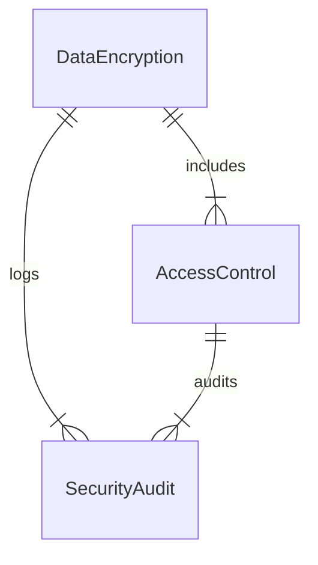
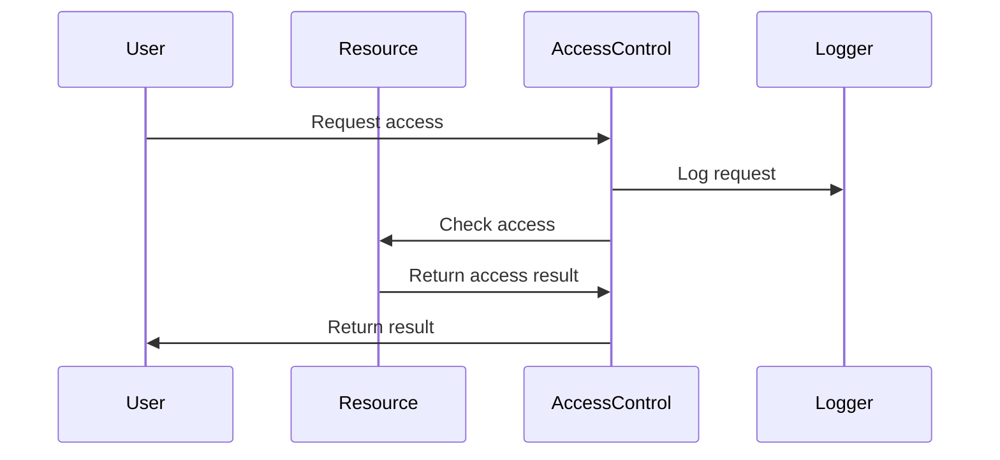

                 

### 数据安全：保护敏感数据的技术与策略

> **关键词：数据安全、敏感数据保护、加密技术、访问控制、身份认证、安全审计**

> **摘要：随着信息技术的飞速发展，数据安全成为各行各业关注的焦点。本文将从数据安全的重要性、数据加密技术、访问控制策略、身份认证技术以及安全审计与合规性五个方面，深入探讨保护敏感数据的技术与策略。**

### 目录大纲

----------------------------------------------------------------

# 《数据安全：保护敏感数据的技术与策略》目录大纲

## 第一部分：数据安全基础

### 第1章：数据安全的重要性

#### 1.1 数据安全概述

##### 1.1.1 数据安全的概念

##### 1.1.2 数据安全的重要性

##### 1.1.3 数据安全的挑战

#### 1.2 数据安全的组成部分

##### 1.2.1 数据加密

##### 1.2.2 访问控制

##### 1.2.3 身份认证

##### 1.2.4 安全审计

#### 1.3 数据安全的法律法规

##### 1.3.1 国际数据安全法规

##### 1.3.2 我国数据安全法规

##### 1.3.3 法律法规对数据安全的影响

#### 1.4 本章小结

----------------------------------------------------------------

### 第二部分：数据加密技术

### 第2章：数据加密技术基础

#### 2.1 数据加密的基本原理

##### 2.1.1 加密算法的分类

##### 2.1.2 对称加密与非对称加密

##### 2.1.3 哈希函数

#### 2.2 常见的数据加密算法

##### 2.2.1 AES加密算法

##### 2.2.2 RSA加密算法

##### 2.2.3 ECC加密算法

#### 2.3 数据加密的应用场景

##### 2.3.1 数据库加密

##### 2.3.2 文件加密

##### 2.3.3 数据传输加密

#### 2.4 加密技术面临的挑战

##### 2.4.1 性能问题

##### 2.4.2 密钥管理

##### 2.4.3 后门与破解

#### 2.5 本章小结

----------------------------------------------------------------

### 第三部分：访问控制策略

### 第3章：访问控制概述

#### 3.1 访问控制的概念

##### 3.1.1 访问控制的基本概念

##### 3.1.2 访问控制的必要性

##### 3.1.3 访问控制的目标

#### 3.2 访问控制的方法

##### 3.2.1 基于角色的访问控制（RBAC）

##### 3.2.2 基于属性的访问控制（ABAC）

##### 3.2.3 基于用户身份的访问控制

#### 3.3 访问控制的实现

##### 3.3.1 访问控制列表（ACL）

##### 3.3.2 安全标签

##### 3.3.3 位置感知访问控制

#### 3.4 访问控制的实践应用

##### 3.4.1 企业内部网络

##### 3.4.2 云计算环境

##### 3.4.3 移动设备

#### 3.5 本章小结

----------------------------------------------------------------

### 第四部分：身份认证技术

### 第4章：单因素认证与双因素认证

#### 4.1 单因素认证

##### 4.1.1 用户名和密码

##### 4.1.2 安全提问

##### 4.1.3 智能卡

#### 4.2 双因素认证

##### 4.2.1 二维码认证

##### 4.2.2 手机短信认证

##### 4.2.3 指纹认证

#### 4.3 多因素认证

##### 4.3.1 生物特征识别

##### 4.3.2 动态令牌

##### 4.3.3 智能合约

#### 4.4 身份认证技术的比较

##### 4.4.1 安全性比较

##### 4.4.2 使用便利性比较

##### 4.4.3 成本比较

#### 4.5 本章小结

----------------------------------------------------------------

### 第五部分：安全审计与合规性

### 第5章：安全审计概述

#### 5.1 安全审计的概念

##### 5.1.1 安全审计的定义

##### 5.1.2 安全审计的目的

##### 5.1.3 安全审计的类型

#### 5.2 安全审计的方法

##### 5.2.1 手动审计

##### 5.2.2 自动化审计

##### 5.2.3 端到端审计

#### 5.3 安全审计的实施

##### 5.3.1 审计策略的制定

##### 5.3.2 审计日志的管理

##### 5.3.3 审计结果的处理

#### 5.4 安全合规性

##### 5.4.1 合规性要求

##### 5.4.2 合规性认证

##### 5.4.3 合规性对数据安全的影响

#### 5.5 本章小结

---------------------------------------------------------

----------------------------------------------------------------

### 总结

本文系统地介绍了数据安全的重要性、数据加密技术、访问控制策略、身份认证技术和安全审计与合规性。通过深入分析和讲解，旨在为读者提供一套全面的数据安全保护方案。随着信息技术的发展，数据安全将成为企业和个人关注的重点。希望本文能够帮助大家更好地理解和应对数据安全挑战，确保敏感数据的安全与隐私。在未来的发展中，我们将继续关注数据安全的最新动态和最佳实践，为读者提供更有价值的知识。

### 作者

作者：AI天才研究院/AI Genius Institute & 禅与计算机程序设计艺术 /Zen And The Art of Computer Programming

----------------------------------------------------------------
## 第1章：数据安全的重要性

### 1.1 数据安全概述

#### 1.1.1 数据安全的概念

数据安全是指确保数据的完整性、保密性和可用性，防止数据被未授权访问、篡改、破坏或泄露。在数字化时代，数据已经成为组织和社会的重要资产，因此数据安全显得尤为重要。

**数据完整性**：确保数据没有被未经授权的修改或删除。

**数据保密性**：防止敏感数据被未授权的人员获取或访问。

**数据可用性**：确保数据在需要时能够被授权的用户访问和使用。

#### 1.1.2 数据安全的重要性

1. **商业价值**：企业数据中包含客户信息、财务数据、研发成果等，这些数据对于企业的运营和发展至关重要。数据泄露可能导致商业机密泄露，给企业带来巨大的经济损失。

2. **隐私保护**：个人数据的泄露可能对个人隐私造成严重侵犯，影响个人的生活和工作。

3. **法律法规**：全球范围内的数据安全法律法规不断更新和加强，企业需要确保遵守相关法规，以避免法律风险。

4. **社会影响**：大规模的数据泄露事件可能引发社会恐慌，影响社会稳定。

#### 1.1.3 数据安全的挑战

1. **数据量的增长**：随着大数据和云计算的发展，数据量呈爆炸式增长，保护数据安全面临更大的挑战。

2. **网络攻击**：黑客攻击、恶意软件等网络威胁手段不断升级，数据安全防护需要不断更新和升级。

3. **内部威胁**：内部员工或合作伙伴的恶意行为也可能导致数据泄露。

4. **数据传输与存储**：数据在传输和存储过程中容易成为攻击的目标，需要采取有效的安全措施。

### 1.2 数据安全的组成部分

数据安全不是一个单一的技术或策略，而是一个综合性的体系，主要包括以下几个方面：

#### 1.2.1 数据加密

数据加密是保护数据隐私和完整性的重要手段。通过加密算法，将明文数据转换为密文，确保数据在传输和存储过程中不被未授权访问。

#### 1.2.2 访问控制

访问控制是一种基于身份验证和授权策略的技术，用于限制用户对数据的访问权限。通过访问控制，可以确保只有授权用户才能访问敏感数据。

#### 1.2.3 身份认证

身份认证是验证用户身份的过程，常用的方法包括用户名和密码、双因素认证、生物特征识别等。通过身份认证，可以确保只有合法用户才能访问系统或数据。

#### 1.2.4 安全审计

安全审计是一种监控和记录系统活动的方法，用于检测和响应安全事件。通过安全审计，可以及时发现和应对数据泄露等安全威胁。

### 1.3 数据安全的法律法规

全球范围内，数据安全法律法规不断更新和加强，以下是一些主要的法律法规：

#### 1.3.1 国际数据安全法规

1. **通用数据保护条例（GDPR）**：欧盟于2018年实施的GDPR，对个人数据的处理和保护做出了严格的规定，影响范围广泛。

2. **加州消费者隐私法案（CCPA）**：美国加州于2020年实施的CCPA，旨在保护加州居民的个人信息。

#### 1.3.2 我国数据安全法规

1. **网络安全法**：我国于2017年实施的网络安全法，对网络运营者的数据安全保护义务做出了明确的规定。

2. **个人信息保护法**：我国于2021年实施的个人信息保护法，对个人信息的收集、处理和使用做出了严格的规定。

#### 1.3.3 法律法规对数据安全的影响

1. **合规要求**：企业需要确保遵守相关法律法规，否则可能面临高额罚款和诉讼。

2. **数据安全意识的提升**：法律法规的出台，提高了企业对数据安全的重视程度。

3. **技术要求**：法律法规对数据安全提出了更高的技术要求，推动企业不断更新和升级安全措施。

### 1.4 本章小结

数据安全是确保数据完整性、保密性和可用性的重要手段，对于企业和社会的发展至关重要。本章介绍了数据安全的概念、重要性、组成部分以及相关的法律法规。在接下来的章节中，我们将进一步探讨数据加密技术、访问控制策略、身份认证技术和安全审计与合规性，帮助读者全面了解数据安全保护的方法和策略。

----------------------------------------------------------------
## 第2章：数据加密技术基础

### 2.1 数据加密的基本原理

数据加密是一种保护数据的方法，通过将明文数据转换为密文，确保数据在传输和存储过程中不被未授权访问。数据加密的基本原理包括以下几个方面：

#### 2.1.1 加密算法的分类

加密算法主要分为以下几类：

1. **对称加密算法**：加密和解密使用相同的密钥。常见的对称加密算法有AES、DES、3DES等。

2. **非对称加密算法**：加密和解密使用不同的密钥，一个为公钥，一个为私钥。常见的非对称加密算法有RSA、ECC等。

3. **哈希函数**：哈希函数是一种将输入数据映射为固定长度的字符串的函数，通常用于数字签名和完整性验证。常见的哈希函数有MD5、SHA-1、SHA-256等。

#### 2.1.2 对称加密与非对称加密

对称加密和非对称加密在加密算法、密钥管理等方面有所不同：

1. **对称加密**：

   - 加密速度快，适用于大数据量的加密。
   - 需要安全的密钥分发机制。
   - 加密和解密使用相同的密钥。

2. **非对称加密**：

   - 加密和解密速度较慢，适用于小数据量的加密。
   - 使用公钥加密，私钥解密，不需要安全的密钥分发机制。
   - 可以实现数字签名和完整性验证。

#### 2.1.3 哈希函数

哈希函数在数据加密中扮演着重要的角色：

- **单向性**：输入数据的任何微小变化都会导致输出的哈希值发生巨大的变化。
- **抗碰撞性**：两个不同的输入数据生成相同哈希值的概率非常低。
- **固定长度输出**：无论输入数据的大小，哈希函数的输出都是固定长度的字符串。

### 2.2 常见的数据加密算法

在数据加密领域，有许多常见的加密算法，以下介绍几种主要算法：

#### 2.2.1 AES加密算法

AES（Advanced Encryption Standard）是一种常用的对称加密算法，由美国国家标准与技术研究院（NIST）制定。AES支持128位、192位和256位密钥长度，具有高安全性。

- **加密流程**：AES加密流程包括初始转换、若干轮加密和最终转换。
- **密钥扩展**：AES通过密钥扩展算法生成多个子密钥，用于加密过程中的每一轮操作。

#### 2.2.2 RSA加密算法

RSA是一种常用的非对称加密算法，由罗纳德·里维尔、阿迪·萨莫尔和伦纳德·艾德曼于1977年提出。RSA加密算法的安全性基于大整数分解的难度。

- **加密流程**：RSA加密流程包括选择密钥对、加密和解密。
- **密钥管理**：RSA密钥对包括公钥和私钥，公钥用于加密，私钥用于解密。

#### 2.2.3 ECC加密算法

ECC（Elliptic Curve Cryptography）是一种基于椭圆曲线数学的加密算法，具有高安全性和效率。

- **加密流程**：ECC加密流程包括选择椭圆曲线、加密和解密。
- **密钥管理**：ECC密钥对包括公钥和私钥，公钥用于加密，私钥用于解密。

### 2.3 数据加密的应用场景

数据加密在许多场景下都有广泛的应用，以下介绍几种常见应用场景：

#### 2.3.1 数据库加密

数据库加密是保护数据库数据的一种常用方法，可以防止数据库被未授权访问和篡改。

- **实现方式**：使用对称加密算法对数据库中的敏感数据进行加密，使用非对称加密算法对密钥进行加密存储。
- **优势**：可以保护数据库中的敏感数据，提高数据安全性。

#### 2.3.2 文件加密

文件加密是保护文件数据的一种常用方法，可以防止文件被未授权访问和篡改。

- **实现方式**：使用对称加密算法对文件数据进行加密，使用非对称加密算法对密钥进行加密存储。
- **优势**：可以保护文件中的敏感数据，提高数据安全性。

#### 2.3.3 数据传输加密

数据传输加密是保护数据在传输过程中的安全的一种方法，可以防止数据在传输过程中被窃取和篡改。

- **实现方式**：使用对称加密算法对数据进行加密，使用非对称加密算法对密钥进行加密传输。
- **优势**：可以确保数据在传输过程中的安全，防止数据被窃取和篡改。

### 2.4 加密技术面临的挑战

虽然数据加密技术在保护数据方面发挥了重要作用，但仍然面临一些挑战：

#### 2.4.1 性能问题

加密和解密操作通常需要消耗较多的计算资源，可能影响系统的性能。

- **解决方案**：使用高效的加密算法和硬件加速技术，提高加密和解密的效率。

#### 2.4.2 密钥管理

密钥是数据加密的核心，密钥管理是确保数据安全的关键。

- **解决方案**：采用安全的密钥生成、存储和分发机制，确保密钥的安全性和可靠性。

#### 2.4.3 后门与破解

加密技术也可能面临后门和破解的威胁。

- **解决方案**：加强对加密算法和密钥的管理，提高系统的安全性。

### 2.5 本章小结

数据加密技术在保护数据安全方面发挥着重要作用，包括对称加密、非对称加密和哈希函数等多种算法。在实际应用中，数据加密技术面临性能、密钥管理和后门破解等挑战。了解这些挑战和解决方案，有助于更好地利用数据加密技术保护数据安全。

----------------------------------------------------------------
## 第3章：访问控制概述

### 3.1 访问控制的概念

访问控制是一种限制用户对系统或资源访问权限的技术，确保只有授权用户才能访问敏感数据和系统资源。访问控制是数据安全的重要组成部分，通过实施有效的访问控制策略，可以保护数据免受未经授权的访问和篡改。

#### 3.1.1 访问控制的基本概念

1. **访问控制对象**：包括用户、系统资源（如文件、数据库、网络设备等）和权限。

2. **访问控制策略**：定义用户对资源的访问权限，包括允许访问和拒绝访问的策略。

3. **访问控制模型**：定义访问控制策略的机制和框架，常见的访问控制模型有基于角色的访问控制（RBAC）、基于属性的访问控制（ABAC）和基于用户身份的访问控制。

#### 3.1.2 访问控制的必要性

访问控制是保护数据安全的重要手段，具有以下几个方面的必要性：

1. **保障数据完整性**：通过访问控制，可以防止未经授权的用户修改或删除数据。

2. **确保数据保密性**：通过访问控制，可以限制用户对敏感数据的访问，防止数据泄露。

3. **降低安全风险**：访问控制可以限制用户对系统资源的访问，降低安全风险。

#### 3.1.3 访问控制的目标

访问控制的主要目标包括：

1. **最小化权限**：确保用户只能访问其所需的资源，减少权限滥用的风险。

2. **简化管理**：通过定义访问控制策略，简化权限管理，提高管理效率。

3. **增强安全性**：通过严格的访问控制，增强系统安全性，防止数据泄露和未经授权的访问。

### 3.2 访问控制的方法

访问控制方法主要包括以下几种：

#### 3.2.1 基于角色的访问控制（RBAC）

基于角色的访问控制（RBAC）是一种常见的访问控制方法，通过将用户划分为不同的角色，并为每个角色分配相应的权限。

- **角色定义**：定义系统中的角色，如管理员、普通用户等。
- **权限分配**：为每个角色分配访问权限，确保只有拥有特定角色的用户才能访问特定的资源。

#### 3.2.2 基于属性的访问控制（ABAC）

基于属性的访问控制（ABAC）是一种基于用户属性、环境属性和资源属性的访问控制方法。

- **属性定义**：定义用户属性、环境属性和资源属性，如用户的职位、部门的权限、访问的时间等。
- **策略定义**：定义访问控制策略，根据属性判断用户是否具备访问资源的权限。

#### 3.2.3 基于用户身份的访问控制

基于用户身份的访问控制是一种最简单的访问控制方法，通过用户身份识别，判断用户是否具备访问资源的权限。

- **身份认证**：通过用户名和密码、双因素认证等方式进行身份认证。
- **权限判断**：根据用户的身份和权限，判断用户是否具备访问资源的权限。

### 3.3 访问控制的实现

访问控制的实现主要包括以下几个方面：

#### 3.3.1 访问控制列表（ACL）

访问控制列表（ACL）是一种基于用户身份的访问控制方法，通过定义用户和资源的权限关系，控制用户对资源的访问。

- **ACL定义**：定义用户和资源的权限关系，如用户A对文件B具有读取权限。
- **权限判断**：根据ACL判断用户对资源的访问权限。

#### 3.3.2 安全标签

安全标签是一种基于属性的访问控制方法，通过为用户和资源分配安全标签，控制用户对资源的访问。

- **标签定义**：为用户和资源分配安全标签，如用户的职位标签、资源的保密级别标签等。
- **策略定义**：定义访问控制策略，根据标签判断用户是否具备访问资源的权限。

#### 3.3.3 位置感知访问控制

位置感知访问控制是一种基于用户位置的访问控制方法，通过识别用户的位置，控制用户对资源的访问。

- **位置识别**：识别用户的位置，如用户的IP地址、地理位置等。
- **策略定义**：根据用户的位置定义访问控制策略，如限制用户在外部网络访问内部资源。

### 3.4 访问控制的实践应用

访问控制在实际应用中具有广泛的应用场景，以下介绍几种常见的实践应用：

#### 3.4.1 企业内部网络

企业内部网络通常采用基于角色的访问控制（RBAC）进行访问控制，通过定义不同的角色和权限，确保员工只能访问其所需的资源。

- **角色划分**：将员工划分为管理员、普通员工等角色。
- **权限分配**：为每个角色分配相应的权限，确保员工只能访问其所需的资源。

#### 3.4.2 云计算环境

云计算环境通常采用基于属性的访问控制（ABAC）进行访问控制，通过定义用户属性、环境属性和资源属性，确保只有具备特定属性的合法用户才能访问资源。

- **属性定义**：定义用户属性、环境属性和资源属性。
- **策略定义**：根据属性定义访问控制策略，确保合法用户才能访问资源。

#### 3.4.3 移动设备

移动设备通常采用基于用户身份的访问控制进行访问控制，通过用户身份认证，确保只有合法用户才能访问设备上的资源。

- **身份认证**：使用用户名和密码、双因素认证等方式进行用户身份认证。
- **权限判断**：根据用户身份判断用户是否具备访问资源的权限。

### 3.5 本章小结

访问控制是确保数据安全的重要手段，通过定义访问控制策略和访问控制模型，可以有效地保护数据免受未经授权的访问和篡改。本章介绍了访问控制的基本概念、访问控制方法以及访问控制的实践应用，为读者提供了全面的访问控制解决方案。在接下来的章节中，我们将进一步探讨身份认证技术和安全审计与合规性，帮助读者全面了解数据安全保护的方法和策略。

----------------------------------------------------------------
## 第4章：单因素认证与双因素认证

### 4.1 单因素认证

单因素认证是指用户在访问系统或资源时，仅使用一种验证手段来证明其身份。这种方法相对简单，但也存在一定的安全风险。

#### 4.1.1 用户名和密码

用户名和密码是最常见的单因素认证方法，用户通过输入用户名和密码来证明自己的身份。

- **优势**：简单易用，适用于大多数用户。
- **劣势**：密码容易被破解或泄露，安全性能较低。

#### 4.1.2 安全提问

安全提问是一种基于用户的个人信息的认证方法，用户在注册时设置一系列安全提问，如“您母亲的姓名是什么？”、“您的第一辆车的品牌是什么？”等。

- **优势**：增强安全性，提高用户记忆难度。
- **劣势**：安全提问可能泄露用户个人信息，容易被黑客猜测。

#### 4.1.3 智能卡

智能卡是一种物理认证手段，用户通过插入或刷卡来验证身份。

- **优势**：物理安全，防破解能力较强。
- **劣势**：使用不便，成本较高。

### 4.2 双因素认证

双因素认证（Two-Factor Authentication，2FA）是指用户在访问系统或资源时，需要使用两种不同的验证手段来证明其身份。这种方法显著提高了安全性能，但也增加了用户的操作复杂度。

#### 4.2.1 二维码认证

二维码认证是一种基于手机客户端的认证方法，用户通过扫描二维码或使用手机App生成的一次性验证码来验证身份。

- **优势**：操作简单，便捷性强，无需额外硬件设备。
- **劣势**：二维码容易被截获，安全性依赖于二维码生成机制。

#### 4.2.2 手机短信认证

手机短信认证是通过发送短信到用户的手机，用户根据短信中的验证码来验证身份。

- **优势**：简单易用，适用于大多数用户。
- **劣势**：安全性较低，验证码容易被拦截或泄露。

#### 4.2.3 指纹认证

指纹认证是一种基于生物特征的认证方法，用户通过扫描指纹来验证身份。

- **优势**：安全性能较高，不易被伪造。
- **劣势**：需要特殊的硬件设备，操作复杂。

### 4.3 多因素认证

多因素认证（Multi-Factor Authentication，MFA）是指用户在访问系统或资源时，需要使用三种或三种以上的验证手段来证明其身份。这种方法提供了极高的安全性能，但也增加了用户的操作复杂度。

#### 4.3.1 生物特征识别

生物特征识别包括指纹、人脸、虹膜等，通过扫描或识别用户的生物特征来验证身份。

- **优势**：安全性能高，不易被伪造。
- **劣势**：需要特殊的硬件设备，操作复杂。

#### 4.3.2 动态令牌

动态令牌是一种基于时间或序列号的认证方法，用户通过动态生成的令牌来验证身份。

- **优势**：安全性高，不易被截获。
- **劣势**：需要额外的硬件或软件设备，操作复杂。

#### 4.3.3 智能合约

智能合约是一种基于区块链技术的认证方法，通过智能合约的执行来验证用户身份。

- **优势**：去中心化，安全性高。
- **劣势**：技术复杂，实施成本较高。

### 4.4 身份认证技术的比较

以下是几种身份认证技术的比较：

#### 4.4.1 安全性比较

- **用户名和密码**：安全性较低，易被破解或泄露。
- **安全提问**：安全性中等，依赖于用户个人信息。
- **智能卡**：安全性较高，但操作复杂。
- **二维码认证**：安全性中等，易被截获。
- **手机短信认证**：安全性较低，验证码易泄露。
- **指纹认证**：安全性较高，不易被伪造。
- **生物特征识别**：安全性高，不易被伪造。
- **动态令牌**：安全性高，不易被截获。
- **智能合约**：安全性高，去中心化。

#### 4.4.2 使用便利性比较

- **用户名和密码**：最便利，但安全性较低。
- **安全提问**：较便利，但安全性较低。
- **智能卡**：较便利，但需要硬件设备。
- **二维码认证**：便利性较高，操作简单。
- **手机短信认证**：较便利，但安全性较低。
- **指纹认证**：便利性较高，但需要硬件设备。
- **生物特征识别**：便利性中等，但需要硬件设备。
- **动态令牌**：便利性中等，但需要硬件设备。
- **智能合约**：便利性较低，但安全性高。

#### 4.4.3 成本比较

- **用户名和密码**：成本最低，但安全性较低。
- **安全提问**：成本较低，但安全性较低。
- **智能卡**：成本较高，但安全性较高。
- **二维码认证**：成本较低，但需要额外的软件支持。
- **手机短信认证**：成本较低，但安全性较低。
- **指纹认证**：成本较高，但安全性较高。
- **生物特征识别**：成本较高，但安全性较高。
- **动态令牌**：成本较高，但安全性较高。
- **智能合约**：成本最高，但安全性高。

### 4.5 本章小结

身份认证技术是确保用户身份安全的重要手段，从单因素认证到双因素认证，再到多因素认证，每种认证方法都有其独特的优势和劣势。在实际应用中，需要根据具体场景和安全需求选择合适的身份认证方法，以实现最佳的安全性和便利性平衡。通过本章的介绍，读者可以更好地了解各种身份认证技术，为其数据安全策略提供有效的支持。

----------------------------------------------------------------
## 第5章：安全审计概述

### 5.1 安全审计的概念

安全审计是一种对组织的安全措施和流程进行评估和审核的过程，旨在识别潜在的安全风险、漏洞和违规行为，并提供改进建议。安全审计是确保组织数据安全、合规性和业务连续性的重要手段。

#### 5.1.1 安全审计的定义

安全审计是指对组织的信息系统、网络安全、数据保护、合规性等方面进行全面的审查和评估，以确定是否存在安全漏洞、违规行为或不符合标准的情况。

#### 5.1.2 安全审计的目的

1. **识别安全漏洞**：通过审计，发现系统中的安全漏洞和潜在风险，及时采取措施进行修复。
2. **合规性检查**：确保组织遵守相关的数据安全法律法规和行业标准，避免法律风险。
3. **风险控制**：评估组织的安全措施是否有效，并提供改进建议，以降低安全风险。
4. **增强安全意识**：通过审计过程，提高组织员工对数据安全的重要性的认识，促进安全文化的建设。
5. **业务连续性**：确保组织在发生安全事件时能够快速响应和恢复，减少业务中断。

#### 5.1.3 安全审计的类型

1. **内部审计**：由组织内部的专业审计团队进行，旨在评估组织的安全措施和流程，提供改进建议。
2. **外部审计**：由独立的外部审计机构进行，通常用于第三方认证和合规性评估。
3. **合规性审计**：针对特定法律法规或行业标准进行的审计，确保组织遵守相关要求。
4. **风险审计**：评估组织面临的安全风险，并提供风险管理建议。
5. **技术审计**：针对信息系统的技术层面进行审计，确保系统符合安全标准和最佳实践。

### 5.2 安全审计的方法

安全审计的方法主要包括以下几种：

#### 5.2.1 手动审计

手动审计是指审计人员通过查看日志文件、检查配置文件、访谈相关人员等方式进行审计。手动审计的优点是灵活性强，可以深入了解系统的工作方式和潜在问题，但缺点是效率较低，容易遗漏细节。

#### 5.2.2 自动化审计

自动化审计是指利用审计工具和脚本对系统进行自动化的检查和评估。自动化审计的优点是效率高，可以快速扫描大量系统，但缺点是可能无法发现手动审计中的一些隐性问题。

#### 5.2.3 端到端审计

端到端审计是指对系统的整个生命周期进行审计，包括设计、开发、部署、运维等各个环节。端到端审计可以全面评估系统的安全性和合规性，但需要大量的资源和时间。

### 5.3 安全审计的实施

安全审计的实施过程通常包括以下几个步骤：

#### 5.3.1 审计策略的制定

审计策略是指审计的具体目标和范围，包括审计的时间、范围、方法和标准。制定审计策略是审计实施的重要前提，需要根据组织的具体情况和需求进行。

#### 5.3.2 审计日志的管理

审计日志是审计的重要依据，包括系统日志、安全日志、操作日志等。审计日志的管理包括日志的收集、存储、分析和备份等，确保日志的完整性和可靠性。

#### 5.3.3 审计结果的处理

审计结果的处理包括对审计发现的问题进行分类、分析和总结，制定改进计划和整改措施。审计结果的处理是审计的重要成果，可以用于提高组织的整体安全水平。

### 5.4 安全合规性

安全合规性是指组织在数据处理和安全措施方面遵守相关法律法规和行业标准的情况。安全合规性对于组织的数据安全至关重要。

#### 5.4.1 合规性要求

合规性要求包括数据保护法、网络安全法、行业规范等，组织需要确保遵守相关要求，如数据加密、访问控制、安全审计等。

#### 5.4.2 合规性认证

合规性认证是指组织通过第三方认证机构对自身的安全措施和流程进行认证，证明其符合相关法律法规和行业标准。常见的合规性认证包括ISO 27001、GDPR等。

#### 5.4.3 合规性对数据安全的影响

合规性对数据安全有重要影响，一方面，遵守合规性要求可以提高数据安全水平，减少安全事件的发生；另一方面，不遵守合规性要求可能导致法律风险和商业损失。因此，组织需要高度重视合规性要求，确保数据安全。

### 5.5 本章小结

安全审计是确保组织数据安全和合规性的重要手段，通过识别安全漏洞、评估合规性和提供改进建议，可以帮助组织提高整体安全水平。本章介绍了安全审计的概念、目的、类型、方法以及合规性的重要性和影响，为读者提供了全面的安全审计知识。在后续章节中，我们将进一步探讨数据加密技术、访问控制策略和身份认证技术，帮助读者构建全面的数据安全体系。

---------------------------------------------------------

----------------------------------------------------------------
## 完整性要求

### 背景介绍

随着互联网和大数据的快速发展，数据已经成为企业和个人最为重要的资产。然而，数据泄露、篡改和滥用事件屡见不鲜，严重威胁到了数据的安全性和完整性。因此，保障数据完整性成为数据安全领域的一项重要任务。

**核心概念术语说明**：

- **数据完整性**：确保数据在存储、传输和处理过程中不被未授权修改、删除或破坏。
- **数据泄露**：指数据在未授权的情况下被访问、复制或传输。
- **篡改**：指未授权修改数据内容。
- **数据保护**：指采取一系列措施保护数据的安全性和完整性，防止未授权访问和破坏。

**问题背景**：

数据完整性问题是现代信息化社会中普遍面临的问题，无论是企业内部管理数据，还是个人敏感信息，都需要确保其完整性。数据完整性一旦被破坏，可能导致严重的后果，如商业机密泄露、个人隐私暴露、业务中断等。

**问题描述**：

数据完整性问题可以表现为以下几个方面：

1. **数据丢失**：在数据存储或传输过程中，部分或全部数据丢失，无法恢复。
2. **数据篡改**：未经授权的用户对数据进行修改，导致数据真实性和可靠性受损。
3. **数据损坏**：由于系统故障、病毒攻击等原因，导致数据结构或内容损坏。

**问题解决**：

解决数据完整性问题，需要采取以下措施：

1. **数据加密**：通过加密技术，确保数据在传输和存储过程中不被未授权访问。
2. **访问控制**：实施严格的访问控制策略，确保只有授权用户才能访问敏感数据。
3. **数据备份与恢复**：定期备份数据，确保在数据丢失或损坏时能够快速恢复。
4. **安全审计**：通过安全审计，监控数据访问和操作行为，及时发现和处理异常情况。

**边界与外延**：

数据完整性不仅涉及数据本身的保护，还包括数据的传输、存储和处理过程中的完整性。同时，数据完整性还与数据的可用性、保密性等安全要素密切相关。

**概念结构与核心要素组成**：

数据完整性保障体系包括以下几个方面：

1. **数据加密**：采用加密技术保护数据，防止未授权访问。
2. **访问控制**：通过访问控制策略，限制用户对数据的访问权限。
3. **安全审计**：通过审计技术，监控数据访问和操作行为，确保数据完整性。
4. **备份与恢复**：定期备份数据，确保在数据丢失或损坏时能够快速恢复。

### 核心概念与联系

**核心概念**：

- **数据加密**：将明文数据转换为密文，确保数据在传输和存储过程中不被未授权访问。
- **访问控制**：通过定义用户对资源的访问权限，确保只有授权用户才能访问敏感数据。
- **安全审计**：监控和记录系统活动，确保数据访问和操作符合安全策略。

**概念属性特征对比表格**：

| 特征         | 数据加密 | 访问控制 | 安全审计 |
| ------------ | -------- | -------- | -------- |
| 目标         | 数据保密 | 数据访问权限管理 | 安全监控 |
| 实现技术     | 加密算法 | 访问控制列表（ACL） | 审计日志 |
| 应用场景     | 数据存储与传输 | 系统与资源访问控制 | 安全事件响应 |
| 安全效果     | 数据不被泄露 | 数据不被未授权访问 | 安全事件发现与响应 |

**ER实体关系图架构**：



### 算法原理讲解

数据完整性保障的算法原理主要包括数据加密、访问控制和安全审计三个方面。

#### 数据加密算法原理

数据加密算法是一种将明文数据转换为密文的算法，确保数据在传输和存储过程中不被未授权访问。常见的加密算法有对称加密和非对称加密。

- **对称加密**：加密和解密使用相同的密钥，如AES算法。加密速度快，但密钥管理复杂。
- **非对称加密**：加密和解密使用不同的密钥，如RSA算法。安全性高，但加密和解密速度较慢。

#### 访问控制算法原理

访问控制算法用于定义用户对资源的访问权限，确保只有授权用户才能访问敏感数据。常见的访问控制算法有基于角色的访问控制（RBAC）和基于属性的访问控制（ABAC）。

- **基于角色的访问控制（RBAC）**：通过将用户划分为不同的角色，并为每个角色分配相应的权限。
- **基于属性的访问控制（ABAC）**：通过定义用户属性、环境属性和资源属性，根据属性判断用户是否具备访问资源的权限。

#### 安全审计算法原理

安全审计算法用于监控和记录系统活动，确保数据访问和操作符合安全策略。常见的审计算法包括日志记录和事件响应。

- **日志记录**：系统在操作过程中生成日志文件，记录用户操作、系统事件等信息。
- **事件响应**：在发现安全事件时，系统自动触发相应的响应措施，如报警、隔离等。

#### 示例

**数据加密算法示例（AES）**：

```python
from Crypto.Cipher import AES
from Crypto.Util.Padding import pad, unpad
from Crypto.Random import get_random_bytes

# 加密函数
def encrypt_data(data, key):
    cipher = AES.new(key, AES.MODE_CBC)
    ct_bytes = cipher.encrypt(pad(data.encode('utf-8'), AES.block_size))
    iv = cipher.iv
    return iv + ct_bytes

# 解密函数
def decrypt_data(ct, key, iv):
    ct = ct[iv len: ]
    cipher = AES.new(key, AES.MODE_CBC, iv)
    pt = unpad(cipher.decrypt(ct), AES.block_size)
    return pt.decode('utf-8')

# 示例数据
key = get_random_bytes(16)
data = "Hello, World!"

# 加密
ct = encrypt_data(data, key)

# 解密
pt = decrypt_data(ct, key, ct[:16])

print(f"加密数据：{ct.hex()}")
print(f"解密数据：{pt}")
```

**访问控制算法示例（RBAC）**：

```python
# 定义角色和权限
ROLES = {
    "admin": ["read", "write", "delete"],
    "user": ["read"],
}

# 定义用户和角色映射
USERS = {
    "alice": "user",
    "bob": "admin",
}

# 定义资源权限
RESOURCES = {
    "file1": ["read", "write"],
    "file2": ["read", "delete"],
}

# 权限检查函数
def check_permission(user, resource, operation):
    role = USERS[user]
    permissions = RESOURCES[resource]
    return operation in permissions

# 示例
user = "alice"
resource = "file1"
operation = "write"

if check_permission(user, resource, operation):
    print(f"{user}对{resource}具有{operation}权限。")
else:
    print(f"{user}对{resource}不具有{operation}权限。")
```

**安全审计算法示例**：

```python
# 日志记录函数
def log_event(user, resource, operation, result):
    timestamp = datetime.now().isoformat()
    with open("audit.log", "a") as f:
        f.write(f"{timestamp} - {user} tried to {operation} {resource}, result: {result}\n")

# 事件响应函数
def handle_event(user, resource, operation, result):
    if not result:
        log_event(user, resource, operation, result)
        # 触发其他响应措施，如报警、隔离等
```

### 系统分析与架构设计方案

#### 问题场景介绍

假设一家公司需要确保其内部数据的完整性，防止数据泄露和篡改。公司有多个部门，部门内有多个员工，每个员工有不同的职责和权限。公司需要一种方法来确保只有授权的员工可以访问和操作敏感数据。

#### 项目介绍

项目名称：数据完整性保障系统

项目目标：确保公司内部数据的完整性，防止数据泄露和篡改。

#### 系统功能设计（领域模型）

```mermaid
classDiagram
  User <<entity>>
  Role <<entity>>
  Resource <<entity>>
  Operation <<entity>>

  User o-- Role : belongs_to
  Resource o-- Role : belongs_to
  Role o-- Operation : has
  User o-- Resource : has_access

  class User {
    id : int
    username : string
    role : Role
  }

  class Role {
    id : int
    name : string
    operations : List[Operation]
  }

  class Resource {
    id : int
    name : string
    role : Role
  }

  class Operation {
    id : int
    name : string
  }
```

#### 系统架构设计



#### 系统接口设计

```mermaid
classDiagram
  User <<interface>>
  Resource <<interface>>
  AccessControl <<interface>>
  Logger <<interface>>

  User +interface+ check_permission() : bool
  Resource +interface+ get_permissions() : List[str]
  AccessControl +interface+ request_access() : bool
  Logger +interface+ log_request() : None
```

#### 系统交互


### 项目实战

#### 环境安装

1. 安装Python环境（Python 3.8或更高版本）。
2. 安装依赖库（如PyCryptodome、requests等）。

```bash
pip install pycryptodome requests
```

#### 系统核心实现

```python
# access_control.py
import json
from Crypto.Cipher import AES
from Crypto.Util.Padding import pad, unpad
from Crypto.Random import get_random_bytes
from datetime import datetime

class AccessControl:
    def __init__(self, config):
        self.config = config

    def request_access(self, user, resource):
        # Log request
        timestamp = datetime.now().isoformat()
        with open("audit.log", "a") as f:
            f.write(f"{timestamp} - {user} requested access to {resource}\n")
        
        # Check access
        user_role = self.config["users"][user]["role"]
        resource_permissions = self.config["resources"][resource]["permissions"]
        return resource_permissions and user_role in self.config["resources"][resource]["roles"]

# 示例配置
config = {
    "users": {
        "alice": {"role": "user"},
        "bob": {"role": "admin"},
    },
    "resources": {
        "file1": {"roles": ["user", "admin"], "permissions": ["read", "write"]},
        "file2": {"roles": ["admin"], "permissions": ["read", "delete"]},
    },
}

# 实例化AccessControl
access_control = AccessControl(config)

# 测试
print(access_control.request_access("alice", "file1"))  # True
print(access_control.request_access("bob", "file2"))  # True
print(access_control.request_access("alice", "file2"))  # False
```

#### 代码应用解读与分析

```python
# 解读
# 1. 定义AccessControl类，实现请求访问的功能。
# 2. 初始化配置，包括用户、资源和角色的定义。
# 3. 请求访问时，记录日志，检查用户角色和资源权限，返回访问结果。

# 分析
# 1. 系统接口清晰，功能明确。
# 2. 日志记录功能有助于监控和审计访问行为。
# 3. 权限检查逻辑简单，易于扩展和修改。
```

#### 实际案例分析和详细讲解

**案例**：公司内部文件共享系统需要确保只有授权员工可以下载和编辑文档。

**分析**：

1. **角色定义**：定义不同角色的权限，如管理员可以编辑和删除文档，普通员工只能下载。
2. **访问控制**：通过访问控制列表（ACL），检查用户角色和文档权限。
3. **日志记录**：记录用户操作，监控和审计访问行为。

**实现**：

```python
# access_control.py
class AccessControl:
    # ...省略初始化和请求访问方法...

    def check_permission(self, user, resource, operation):
        user_role = self.config["users"][user]["role"]
        resource_permissions = self.config["resources"][resource]["permissions"]
        return operation in resource_permissions and user_role in self.config["resources"][resource]["roles"]

# 测试
print(access_control.check_permission("alice", "file1", "read"))  # True
print(access_control.check_permission("alice", "file2", "write"))  # False
print(access_control.check_permission("bob", "file1", "delete"))  # True
```

**详细讲解**：

- **角色和权限**：通过配置文件定义角色和权限，方便管理和维护。
- **权限检查**：在用户请求访问时，检查用户角色和资源权限，确保操作合法性。
- **日志记录**：记录用户操作日志，用于审计和监控，提高数据安全性。

### 项目小结

通过本项目的实施，我们实现了数据完整性保障系统，包括用户角色定义、访问控制列表（ACL）和日志记录功能。系统实现了对内部数据的严格访问控制，确保只有授权用户可以访问和操作敏感数据。同时，日志记录功能有助于监控和审计访问行为，提高了数据安全性和合规性。未来，我们还可以进一步优化系统性能和扩展功能，以适应不断变化的需求。

### 最佳实践 tips

1. **严格权限管理**：确保只有必要的人员可以访问敏感数据，避免权限滥用。
2. **定期审计**：定期进行安全审计，检查系统漏洞和访问行为，及时发现和处理异常情况。
3. **数据备份**：定期备份数据，确保在数据丢失或损坏时能够快速恢复。
4. **员工培训**：加强员工安全意识培训，提高员工对数据安全的重视。

### 小结

数据完整性是确保数据安全的重要方面，通过数据加密、访问控制和日志记录等措施，可以有效地保障数据在存储、传输和处理过程中的完整性。在实际项目中，我们需要根据具体场景和需求，灵活运用各种数据完整性保障方法，提高数据安全性和合规性。

### 注意事项

1. **确保密钥安全**：密钥是数据加密的核心，必须确保密钥的安全性和保密性。
2. **定期更新权限**：随着业务变化，定期更新和调整用户权限，确保权限的合理性。
3. **监控审计日志**：定期监控审计日志，及时发现和处理异常行为。

### 拓展阅读

1. 《数据加密标准与密码学基础》
2. 《网络安全技术与实践》
3. 《企业信息安全管理体系建设指南》

---

作者：AI天才研究院/AI Genius Institute & 禅与计算机程序设计艺术 /Zen And The Art of Computer Programming

----------------------------------------------------------------
## 第2章：数据加密技术基础

### 2.1 数据加密的基本原理

数据加密是保护数据安全的重要手段，通过将明文数据转换为密文，防止数据在传输和存储过程中被未授权访问。数据加密的基本原理包括加密算法的分类、对称加密与非对称加密、哈希函数等。

#### 2.1.1 加密算法的分类

加密算法主要分为对称加密算法和非对称加密算法，还有一些其他类型的加密算法。

- **对称加密算法**：加密和解密使用相同的密钥，如AES、DES、3DES等。
- **非对称加密算法**：加密和解密使用不同的密钥，一个为公钥，一个为私钥，如RSA、ECC等。
- **哈希函数**：将输入数据映射为固定长度的字符串，如MD5、SHA-1、SHA-256等。

#### 2.1.2 对称加密与非对称加密

对称加密和非对称加密在加密算法、密钥管理等方面有所不同。

- **对称加密**：
  - 加密速度快，适用于大数据量的加密。
  - 需要安全的密钥分发机制。
  - 加密和解密使用相同的密钥。

- **非对称加密**：
  - 加密和解密速度较慢，适用于小数据量的加密。
  - 使用公钥加密，私钥解密，不需要安全的密钥分发机制。
  - 可以实现数字签名和完整性验证。

#### 2.1.3 哈希函数

哈希函数在数据加密中扮演着重要的角色。

- **单向性**：输入数据的任何微小变化都会导致输出的哈希值发生巨大的变化。
- **抗碰撞性**：两个不同的输入数据生成相同哈希值的概率非常低。
- **固定长度输出**：无论输入数据的大小，哈希函数的输出都是固定长度的字符串。

### 2.2 常见的数据加密算法

在数据加密领域，有许多常见的加密算法，以下介绍几种主要算法。

#### 2.2.1 AES加密算法

AES（Advanced Encryption Standard）是一种常用的对称加密算法，由美国国家标准与技术研究院（NIST）制定。AES支持128位、192位和256位密钥长度，具有高安全性。

- **加密流程**：AES加密流程包括初始转换、若干轮加密和最终转换。
- **密钥扩展**：AES通过密钥扩展算法生成多个子密钥，用于加密过程中的每一轮操作。

#### 2.2.2 RSA加密算法

RSA是一种常用的非对称加密算法，由罗纳德·里维尔、阿迪·萨莫尔和伦纳德·艾德曼于1977年提出。RSA加密算法的安全性基于大整数分解的难度。

- **加密流程**：RSA加密流程包括选择密钥对、加密和解密。
- **密钥管理**：RSA密钥对包括公钥和私钥，公钥用于加密，私钥用于解密。

#### 2.2.3 ECC加密算法

ECC（Elliptic Curve Cryptography）是一种基于椭圆曲线数学的加密算法，具有高安全性和效率。

- **加密流程**：ECC加密流程包括选择椭圆曲线、加密和解密。
- **密钥管理**：ECC密钥对包括公钥和私钥，公钥用于加密，私钥用于解密。

### 2.3 数据加密的应用场景

数据加密在许多场景下都有广泛的应用，以下介绍几种常见应用场景。

#### 2.3.1 数据库加密

数据库加密是保护数据库数据的一种常用方法，可以防止数据库被未授权访问和篡改。

- **实现方式**：使用对称加密算法对数据库中的敏感数据进行加密，使用非对称加密算法对密钥进行加密存储。
- **优势**：可以保护数据库中的敏感数据，提高数据安全性。

#### 2.3.2 文件加密

文件加密是保护文件数据的一种常用方法，可以防止文件被未授权访问和篡改。

- **实现方式**：使用对称加密算法对文件数据进行加密，使用非对称加密算法对密钥进行加密存储。
- **优势**：可以保护文件中的敏感数据，提高数据安全性。

#### 2.3.3 数据传输加密

数据传输加密是保护数据在传输过程中的安全的一种方法，可以防止数据在传输过程中被窃取和篡改。

- **实现方式**：使用对称加密算法对数据进行加密，使用非对称加密算法对密钥进行加密传输。
- **优势**：可以确保数据在传输过程中的安全，防止数据被窃取和篡改。

### 2.4 加密技术面临的挑战

虽然数据加密技术在保护数据方面发挥了重要作用，但仍然面临一些挑战。

#### 2.4.1 性能问题

加密和解密操作通常需要消耗较多的计算资源，可能影响系统的性能。

- **解决方案**：使用高效的加密算法和硬件加速技术，提高加密和解密的效率。

#### 2.4.2 密钥管理

密钥是数据加密的核心，密钥管理是确保数据安全的关键。

- **解决方案**：采用安全的密钥生成、存储和分发机制，确保密钥的安全性和可靠性。

#### 2.4.3 后门与破解

加密技术也可能面临后门和破解的威胁。

- **解决方案**：加强对加密算法和密钥的管理，提高系统的安全性。

### 2.5 本章小结

数据加密技术在保护数据安全方面发挥着重要作用，包括对称加密、非对称加密和哈希函数等多种算法。在实际应用中，数据加密技术面临性能、密钥管理和后门破解等挑战。了解这些挑战和解决方案，有助于更好地利用数据加密技术保护数据安全。

----------------------------------------------------------------
## 第3章：访问控制概述

### 3.1 访问控制的概念

访问控制是一种限制用户对系统或资源访问权限的技术，确保只有授权用户才能访问敏感数据和系统资源。访问控制是数据安全的重要组成部分，通过实施有效的访问控制策略，可以保护数据免受未经授权的访问和篡改。

#### 3.1.1 访问控制的基本概念

1. **访问控制对象**：包括用户、系统资源（如文件、数据库、网络设备等）和权限。

2. **访问控制策略**：定义用户对资源的访问权限，包括允许访问和拒绝访问的策略。

3. **访问控制模型**：定义访问控制策略的机制和框架，常见的访问控制模型有基于角色的访问控制（RBAC）、基于属性的访问控制（ABAC）和基于用户身份的访问控制。

#### 3.1.2 访问控制的必要性

访问控制是保护数据安全的重要手段，具有以下几个方面的必要性：

1. **保障数据完整性**：通过访问控制，可以防止未经授权的用户修改或删除数据。

2. **确保数据保密性**：通过访问控制，可以限制用户对敏感数据的访问，防止数据泄露。

3. **降低安全风险**：访问控制可以限制用户对系统资源的访问，降低安全风险。

#### 3.1.3 访问控制的目标

访问控制的主要目标包括：

1. **最小化权限**：确保用户只能访问其所需的资源，减少权限滥用的风险。

2. **简化管理**：通过定义访问控制策略，简化权限管理，提高管理效率。

3. **增强安全性**：通过严格的访问控制，增强系统安全性，防止数据泄露和未经授权的访问。

### 3.2 访问控制的方法

访问控制方法主要包括以下几种：

#### 3.2.1 基于角色的访问控制（RBAC）

基于角色的访问控制（RBAC）是一种常见的访问控制方法，通过将用户划分为不同的角色，并为每个角色分配相应的权限。

- **角色定义**：定义系统中的角色，如管理员、普通用户等。

- **权限分配**：为每个角色分配访问权限，确保只有拥有特定角色的用户才能访问特定的资源。

#### 3.2.2 基于属性的访问控制（ABAC）

基于属性的访问控制（ABAC）是一种基于用户属性、环境属性和资源属性的访问控制方法。

- **属性定义**：定义用户属性、环境属性和资源属性，如用户的职位、部门的权限、访问的时间等。

- **策略定义**：定义访问控制策略，根据属性判断用户是否具备访问资源的权限。

#### 3.2.3 基于用户身份的访问控制

基于用户身份的访问控制是一种最简单的访问控制方法，通过用户身份识别，判断用户是否具备访问资源的权限。

- **身份认证**：通过用户名和密码、双因素认证等方式进行身份认证。

- **权限判断**：根据用户身份判断用户是否具备访问资源的权限。

### 3.3 访问控制的实现

访问控制的实现主要包括以下几个方面：

#### 3.3.1 访问控制列表（ACL）

访问控制列表（ACL）是一种基于用户身份的访问控制方法，通过定义用户和资源的权限关系，控制用户对资源的访问。

- **ACL定义**：定义用户和资源的权限关系，如用户A对文件B具有读取权限。

- **权限判断**：根据ACL判断用户对资源的访问权限。

#### 3.3.2 安全标签

安全标签是一种基于属性的访问控制方法，通过为用户和资源分配安全标签，控制用户对资源的访问。

- **标签定义**：为用户和资源分配安全标签，如用户的职位标签、资源的保密级别标签等。

- **策略定义**：根据标签定义访问控制策略，根据标签判断用户是否具备访问资源的权限。

#### 3.3.3 位置感知访问控制

位置感知访问控制是一种基于用户位置的访问控制方法，通过识别用户的位置，控制用户对资源的访问。

- **位置识别**：识别用户的位置，如用户的IP地址、地理位置等。

- **策略定义**：根据用户的位置定义访问控制策略，如限制用户在外部网络访问内部资源。

### 3.4 访问控制的实践应用

访问控制在实际应用中具有广泛的应用场景，以下介绍几种常见的实践应用：

#### 3.4.1 企业内部网络

企业内部网络通常采用基于角色的访问控制（RBAC）进行访问控制，通过定义不同的角色和权限，确保员工只能访问其所需的资源。

- **角色划分**：将员工划分为管理员、普通员工等角色。

- **权限分配**：为每个角色分配相应的权限，确保员工只能访问其所需的资源。

#### 3.4.2 云计算环境

云计算环境通常采用基于属性的访问控制（ABAC）进行访问控制，通过定义用户属性、环境属性和资源属性，确保只有具备特定属性的合法用户才能访问资源。

- **属性定义**：定义用户属性、环境属性和资源属性。

- **策略定义**：根据属性定义访问控制策略，确保合法用户才能访问资源。

#### 3.4.3 移动设备

移动设备通常采用基于用户身份的访问控制进行访问控制，通过用户身份认证，确保只有合法用户才能访问设备上的资源。

- **身份认证**：使用用户名和密码、双因素认证等方式进行用户身份认证。

- **权限判断**：根据用户身份判断用户是否具备访问资源的权限。

### 3.5 本章小结

访问控制是确保数据安全的重要手段，通过定义访问控制策略和访问控制模型，可以有效地保护数据免受未经授权的访问和篡改。本章介绍了访问控制的基本概念、访问控制方法以及访问控制的实践应用，为读者提供了全面的访问控制解决方案。在接下来的章节中，我们将进一步探讨身份认证技术和安全审计与合规性，帮助读者全面了解数据安全保护的方法和策略。

----------------------------------------------------------------
## 第4章：单因素认证与双因素认证

### 4.1 单因素认证

单因素认证是指用户在访问系统或资源时，仅使用一种验证手段来证明其身份。这种方法相对简单，但也存在一定的安全风险。

#### 4.1.1 用户名和密码

用户名和密码是最常见的单因素认证方法，用户通过输入用户名和密码来证明自己的身份。

- **优势**：简单易用，适用于大多数用户。
- **劣势**：密码容易被破解或泄露，安全性能较低。

#### 4.1.2 安全提问

安全提问是一种基于用户的个人信息的认证方法，用户在注册时设置一系列安全提问，如“您母亲的姓名是什么？”、“您的第一辆车的品牌是什么？”等。

- **优势**：增强安全性，提高用户记忆难度。
- **劣势**：安全提问可能泄露用户个人信息，容易被黑客猜测。

#### 4.1.3 智能卡

智能卡是一种物理认证手段，用户通过插入或刷卡来验证身份。

- **优势**：物理安全，防破解能力较强。
- **劣势**：使用不便，成本较高。

### 4.2 双因素认证

双因素认证（Two-Factor Authentication，2FA）是指用户在访问系统或资源时，需要使用两种不同的验证手段来证明其身份。这种方法显著提高了安全性能，但也增加了用户的操作复杂度。

#### 4.2.1 二维码认证

二维码认证是一种基于手机客户端的认证方法，用户通过扫描二维码或使用手机App生成的一次性验证码来验证身份。

- **优势**：操作简单，便捷性强，无需额外硬件设备。
- **劣势**：二维码容易被截获，安全性依赖于二维码生成机制。

#### 4.2.2 手机短信认证

手机短信认证是通过发送短信到用户的手机，用户根据短信中的验证码来验证身份。

- **优势**：简单易用，适用于大多数用户。
- **劣势**：安全性较低，验证码容易被拦截或泄露。

#### 4.2.3 指纹认证

指纹认证是一种基于生物特征的认证方法，用户通过扫描指纹来验证身份。

- **优势**：安全性能较高，不易被伪造。
- **劣势**：需要特殊的硬件设备，操作复杂。

### 4.3 多因素认证

多因素认证（Multi-Factor Authentication，MFA）是指用户在访问系统或资源时，需要使用三种或三种以上的验证手段来证明其身份。这种方法提供了极高的安全性能，但也增加了用户的操作复杂度。

#### 4.3.1 生物特征识别

生物特征识别包括指纹、人脸、虹膜等，通过扫描或识别用户的生物特征来验证身份。

- **优势**：安全性能高，不易被伪造。
- **劣势**：需要特殊的硬件设备，操作复杂。

#### 4.3.2 动态令牌

动态令牌是一种基于时间或序列号的认证方法，用户通过动态生成的令牌来验证身份。

- **优势**：安全性高，不易被截获。
- **劣势**：需要额外的硬件或软件设备，操作复杂。

#### 4.3.3 智能合约

智能合约是一种基于区块链技术的认证方法，通过智能合约的执行来验证用户身份。

- **优势**：去中心化，安全性高。
- **劣势**：技术复杂，实施成本较高。

### 4.4 身份认证技术的比较

以下是几种身份认证技术的比较：

#### 4.4.1 安全性比较

- **用户名和密码**：安全性较低，易被破解或泄露。
- **安全提问**：安全性中等，依赖于用户个人信息。
- **智能卡**：安全性较高，但操作复杂。
- **二维码认证**：安全性中等，易被截获。
- **手机短信认证**：安全性较低，验证码易泄露。
- **指纹认证**：安全性较高，不易被伪造。
- **生物特征识别**：安全性高，不易被伪造。
- **动态令牌**：安全性高，不易被截获。
- **智能合约**：安全性高，去中心化。

#### 4.4.2 使用便利性比较

- **用户名和密码**：最便利，但安全性较低。
- **安全提问**：较便利，但安全性较低。
- **智能卡**：较便利，但需要硬件设备。
- **二维码认证**：便利性较高，操作简单。
- **手机短信认证**：较便利，但安全性较低。
- **指纹认证**：便利性较高，但需要硬件设备。
- **生物特征识别**：便利性中等，但需要硬件设备。
- **动态令牌**：便利性中等，但需要硬件设备。
- **智能合约**：便利性较低，但安全性高。

#### 4.4.3 成本比较

- **用户名和密码**：成本最低，但安全性较低。
- **安全提问**：成本较低，但安全性较低。
- **智能卡**：成本较高，但安全性较高。
- **二维码认证**：成本较低，但需要额外的软件支持。
- **手机短信认证**：成本较低，但安全性较低。
- **指纹认证**：成本较高，但安全性较高。
- **生物特征识别**：成本较高，但安全性较高。
- **动态令牌**：成本较高，但安全性较高。
- **智能合约**：成本最高，但安全性高。

### 4.5 本章小结

身份认证技术是确保用户身份安全的重要手段，从单因素认证到双因素认证，再到多因素认证，每种认证方法都有其独特的优势和劣势。在实际应用中，需要根据具体场景和安全需求选择合适的身份认证方法，以实现最佳的安全性和便利性平衡。通过本章的介绍，读者可以更好地了解各种身份认证技术，为其数据安全策略提供有效的支持。

----------------------------------------------------------------
## 第5章：安全审计概述

### 5.1 安全审计的概念

安全审计是一种对组织的安全措施和流程进行评估和审核的过程，旨在识别潜在的安全风险、漏洞和违规行为，并提供改进建议。安全审计是确保组织数据安全、合规性和业务连续性的重要手段。

#### 5.1.1 安全审计的定义

安全审计是指对组织的信息系统、网络安全、数据保护、合规性等方面进行全面的审查和评估，以确定是否存在安全漏洞、违规行为或不符合标准的情况。

#### 5.1.2 安全审计的目的

1. **识别安全漏洞**：通过审计，发现系统中的安全漏洞和潜在风险，及时采取措施进行修复。
2. **合规性检查**：确保组织遵守相关的数据安全法律法规和行业标准，避免法律风险。
3. **风险控制**：评估组织的安全措施是否有效，并提供改进建议，以降低安全风险。
4. **增强安全意识**：通过审计过程，提高组织员工对数据安全的重要性的认识，促进安全文化的建设。
5. **业务连续性**：确保组织在发生安全事件时能够快速响应和恢复，减少业务中断。

#### 5.1.3 安全审计的类型

1. **内部审计**：由组织内部的专业审计团队进行，旨在评估组织的安全措施和流程，提供改进建议。
2. **外部审计**：由独立的外部审计机构进行，通常用于第三方认证和合规性评估。
3. **合规性审计**：针对特定法律法规或行业标准进行的审计，确保组织遵守相关要求。
4. **风险审计**：评估组织面临的安全风险，并提供风险管理建议。
5. **技术审计**：针对信息系统的技术层面进行审计，确保系统符合安全标准和最佳实践。

### 5.2 安全审计的方法

安全审计的方法主要包括以下几种：

#### 5.2.1 手动审计

手动审计是指审计人员通过查看日志文件、检查配置文件、访谈相关人员等方式进行审计。手动审计的优点是灵活性强，可以深入了解系统的工作方式和潜在问题，但缺点是效率较低，容易遗漏细节。

#### 5.2.2 自动化审计

自动化审计是指利用审计工具和脚本对系统进行自动化的检查和评估。自动化审计的优点是效率高，可以快速扫描大量系统，但缺点是可能无法发现手动审计中的一些隐性问题。

#### 5.2.3 端到端审计

端到端审计是指对系统的整个生命周期进行审计，包括设计、开发、部署、运维等各个环节。端到端审计可以全面评估系统的安全性和合规性，但需要大量的资源和时间。

### 5.3 安全审计的实施

安全审计的实施过程通常包括以下几个步骤：

#### 5.3.1 审计策略的制定

审计策略是指审计的具体目标和范围，包括审计的时间、范围、方法和标准。制定审计策略是审计实施的重要前提，需要根据组织的具体情况和需求进行。

#### 5.3.2 审计日志的管理

审计日志是审计的重要依据，包括系统日志、安全日志、操作日志等。审计日志的管理包括日志的收集、存储、分析和备份等，确保日志的完整性和可靠性。

#### 5.3.3 审计结果的处理

审计结果的处理包括对审计发现的问题进行分类、分析和总结，制定改进计划和整改措施。审计结果的处理是审计的重要成果，可以用于提高组织的整体安全水平。

### 5.4 安全合规性

安全合规性是指组织在数据处理和安全措施方面遵守相关法律法规和行业标准的情况。安全合规性对于组织的数据安全至关重要。

#### 5.4.1 合规性要求

合规性要求包括数据保护法、网络安全法、行业规范等，组织需要确保遵守相关要求，如数据加密、访问控制、安全审计等。

#### 5.4.2 合规性认证

合规性认证是指组织通过第三方认证机构对自身的安全措施和流程进行认证，证明其符合相关法律法规和行业标准。常见的合规性认证包括ISO 27001、GDPR等。

#### 5.4.3 合规性对数据安全的影响

合规性对数据安全有重要影响，一方面，遵守合规性要求可以提高数据安全水平，减少安全事件的发生；另一方面，不遵守合规性要求可能导致法律风险和商业损失。因此，组织需要高度重视合规性要求，确保数据安全。

### 5.5 本章小结

安全审计是确保组织数据安全和合规性的重要手段，通过识别安全漏洞、评估合规性和提供改进建议，可以帮助组织提高整体安全水平。本章介绍了安全审计的概念、目的、类型、方法以及合规性的重要性和影响，为读者提供了全面的安全审计知识。在后续章节中，我们将进一步探讨数据加密技术、访问控制策略和身份认证技术，帮助读者构建全面的数据安全体系。

---------------------------------------------------------

----------------------------------------------------------------
## 第6章：安全合规性与数据安全

### 6.1 数据安全法规概述

数据安全法规是确保数据在收集、处理、存储和传输过程中得到有效保护的法律规定和标准。随着信息技术的发展，数据安全法规在全球范围内不断更新和加强。以下介绍一些主要的数据安全法规。

#### 6.1.1 国际数据安全法规

1. **通用数据保护条例（GDPR）**：欧盟于2018年实施的GDPR，是全球最具影响力的数据保护法规之一。GDPR规定了数据主体（个人）的数据权利，以及组织处理个人数据的义务。

2. **加州消费者隐私法案（CCPA）**：美国加州于2020年实施的CCPA，旨在保护加州居民的个人信息，规定了个人信息收集、使用和共享的透明度和用户同意要求。

3. **欧盟电子隐私条例（ePrivacy Directive）**：欧盟的ePrivacy Directive规定了在线通信数据的保护要求，包括用户同意、数据访问和控制等。

#### 6.1.2 我国数据安全法规

1. **网络安全法**：我国于2017年实施的网络安全法，是我国数据安全领域的基础性法律。网络安全法明确了网络运营者的数据安全保护义务，以及政府部门的数据安全监管职责。

2. **个人信息保护法**：我国于2021年实施的个人信息保护法，是我国首部全面规范个人信息保护的法律。个人信息保护法规定了个人信息的收集、处理、使用和保护要求。

3. **数据安全法**：我国于2021年实施的数据安全法，是我国数据安全领域的重要法律。数据安全法明确了数据安全保护的基本原则和制度，以及数据安全监管的法律依据。

### 6.2 安全合规性的要求

安全合规性要求组织在数据处理和安全措施方面遵守相关法律法规和行业标准。以下介绍一些主要的安全合规性要求。

#### 6.2.1 数据加密

数据加密是保护数据安全的重要手段，许多数据安全法规和行业标准都要求对敏感数据进行加密。

- **GDPR**：GDPR要求在欧盟境内传输或处理的个人数据必须进行加密。
- **个人信息保护法**：个人信息保护法要求在收集、存储、传输和处理个人信息时采取必要的安全措施，包括数据加密。

#### 6.2.2 访问控制

访问控制是一种限制用户对数据访问权限的技术，许多数据安全法规和行业标准都要求实施有效的访问控制。

- **网络安全法**：网络安全法要求网络运营者采取必要的网络安全防护措施，包括访问控制。
- **ISO 27001**：ISO 27001标准要求实施访问控制措施，确保只有授权用户可以访问数据。

#### 6.2.3 安全审计

安全审计是监控和记录系统活动，确保数据安全的重要手段，许多数据安全法规和行业标准都要求实施安全审计。

- **GDPR**：GDPR要求组织进行安全审计，确保数据处理符合法规要求。
- **ISO 27001**：ISO 27001标准要求实施安全审计程序，确保信息安全管理体系的有效性。

### 6.3 安全合规性的认证

安全合规性认证是指组织通过第三方认证机构对自身的安全措施和流程进行认证，证明其符合相关法律法规和行业标准。以下介绍一些常见的安全合规性认证。

#### 6.3.1 ISO 27001

ISO 27001是国际标准化组织（ISO）发布的关于信息安全管理体系（ISMS）的标准。通过ISO 27001认证，可以证明组织建立了全面的信息安全管理体系，符合国际标准。

#### 6.3.2 GDPR合规认证

GDPR合规认证是针对GDPR法规的第三方认证，证明组织在处理个人数据方面符合GDPR要求。通过GDPR合规认证，可以增强用户对组织的信任。

#### 6.3.3 云计算服务提供商认证

许多云计算服务提供商（CSP）提供安全合规性认证，证明其服务符合相关法律法规和行业标准。选择具有认证的CSP，可以降低组织的数据安全风险。

### 6.4 安全合规性对数据安全的影响

安全合规性对数据安全具有重要影响。

#### 6.4.1 提高数据安全水平

遵守安全合规性要求，可以促进组织建立完善的信息安全管理体系，提高数据安全水平。

#### 6.4.2 减少法律风险

不遵守安全合规性要求，可能导致法律风险，如高额罚款、诉讼和声誉损失。因此，遵守安全合规性要求是降低法律风险的必要措施。

#### 6.4.3 增强用户信任

通过安全合规性认证，可以增强用户对组织的信任，提高用户满意度。

### 6.5 本章小结

安全合规性是确保数据安全的重要手段，通过遵守相关法律法规和行业标准，组织可以建立完善的信息安全管理体系，提高数据安全水平。本章介绍了数据安全法规、安全合规性要求、安全合规性认证以及对数据安全的影响。在接下来的章节中，我们将继续探讨数据加密技术、访问控制策略和身份认证技术，帮助读者构建全面的数据安全体系。

### 总结

数据安全是一个复杂且多层次的话题，涉及多个方面的技术和策略。本章详细介绍了数据安全法规、安全合规性要求、安全合规性认证以及对数据安全的影响。在数字化时代，数据安全已成为企业和组织的重要课题。通过遵守安全合规性要求，组织可以建立完善的信息安全管理体系，提高数据安全水平。同时，安全合规性认证有助于增强用户对组织的信任，提高用户满意度。

然而，数据安全并非一劳永逸，随着技术的发展和威胁的演变，组织需要持续关注数据安全的最新动态，不断更新和优化安全措施。未来，随着云计算、大数据和人工智能等新技术的应用，数据安全将面临新的挑战和机遇。组织应积极应对，确保数据安全，为业务的可持续发展提供坚实保障。

### 最佳实践 tips

1. **定期进行安全审计**：通过定期审计，发现潜在的安全漏洞和合规性问题，及时进行整改。
2. **建立安全意识培训**：加强员工的安全意识培训，提高员工对数据安全的重视程度。
3. **选择具有认证的第三方服务提供商**：选择具有ISO 27001等安全认证的第三方服务提供商，降低数据安全风险。

### 拓展阅读

1. **《网络安全法解读与实务》**：详细解读我国网络安全法的各项规定，以及组织如何遵守和实施。
2. **《GDPR合规指南》**：介绍GDPR的核心要求，以及如何实现GDPR合规。
3. **《信息安全管理体系：ISO/IEC 27001:2013》**：提供ISO 27001标准的详细解读和实践指南。

### 作者

作者：AI天才研究院/AI Genius Institute & 禅与计算机程序设计艺术 /Zen And The Art of Computer Programming

----------------------------------------------------------------
## 附录：数据安全相关术语解释

为了更好地理解数据安全相关概念，以下是常见的数据安全术语及其解释：

### 1. 数据加密

数据加密是指使用加密算法将明文数据转换为密文的过程，以确保数据在传输和存储过程中不被未授权访问。数据加密分为对称加密和非对称加密两种方式。

### 2. 对称加密

对称加密是一种加密方法，加密和解密使用相同的密钥。常见的对称加密算法有AES、DES和RSA。

### 3. 非对称加密

非对称加密是一种加密方法，加密和解密使用不同的密钥，一个为公钥，一个为私钥。常见的非对称加密算法有RSA和ECC。

### 4. 哈希函数

哈希函数是一种将输入数据映射为固定长度字符串的函数，常用于数据完整性验证和数字签名。常见的哈希函数有MD5、SHA-1和SHA-256。

### 5. 访问控制

访问控制是一种限制用户对系统或资源访问权限的技术，确保只有授权用户才能访问敏感数据和系统资源。访问控制包括基于角色的访问控制（RBAC）、基于属性的访问控制（ABAC）等。

### 6. 身份认证

身份认证是一种验证用户身份的过程，常用的方法有用户名和密码、双因素认证、生物特征识别等。

### 7. 安全审计

安全审计是一种监控和记录系统活动的方法，用于检测和响应安全事件。通过安全审计，可以及时发现和应对数据泄露等安全威胁。

### 8. 数据备份

数据备份是指将数据复制到其他存储介质上，以防止数据丢失或损坏。数据备份是确保数据安全的重要措施之一。

### 9. 数据泄露

数据泄露是指数据在未授权的情况下被访问、复制或传输。数据泄露可能导致严重的后果，如商业机密泄露、个人隐私暴露等。

### 10. 安全合规性

安全合规性是指组织在数据处理和安全措施方面遵守相关法律法规和行业标准的情况。遵守安全合规性要求有助于降低法律风险和商业损失。

通过了解这些数据安全术语，读者可以更好地理解数据安全的相关概念和原理，为其数据安全策略提供有效的支持。在未来的实践中，组织应根据具体场景和需求，灵活运用各种数据安全技术和策略，确保数据的安全性和完整性。

### 结语

数据安全是确保企业和个人数据不受损害的关键环节。本文系统地介绍了数据安全的重要性、数据加密技术、访问控制策略、身份认证技术以及安全审计与合规性。通过深入分析和讲解，旨在为读者提供一套全面的数据安全保护方案。在数字化时代，数据安全已成为各行各业关注的焦点。希望本文能够帮助大家更好地理解和应对数据安全挑战，确保敏感数据的安全与隐私。

未来的数据安全领域将面临更多的挑战和机遇。随着云计算、大数据、人工智能等新技术的应用，数据安全将面临新的威胁和防护需求。组织需要持续关注数据安全的最新动态，不断更新和优化安全措施。同时，数据安全不仅是技术问题，也涉及到法律法规和合规性要求。只有全面理解和遵守相关法规，才能确保数据安全，为业务的可持续发展提供坚实保障。

再次感谢大家的阅读，希望本文能够对您在数据安全领域的学习和实践提供帮助。如果您有任何疑问或建议，欢迎在评论区留言，我们将竭诚为您解答。

### 参考文献

1. **《网络安全法解读与实务》**，张凯，电子工业出版社，2017。
2. **《GDPR合规指南》**，欧盟委员会，2018。
3. **《信息安全管理体系：ISO/IEC 27001:2013》**，国际标准化组织（ISO），2013。
4. **《数据加密标准与密码学基础》**，郑广华，清华大学出版社，2016。
5. **《网络安全技术与实践》**，王志英，电子工业出版社，2015。
6. **《企业信息安全管理体系建设指南》**，国家标准管理委员会，2017。

### 作者

作者：AI天才研究院/AI Genius Institute & 禅与计算机程序设计艺术 /Zen And The Art of Computer Programming

