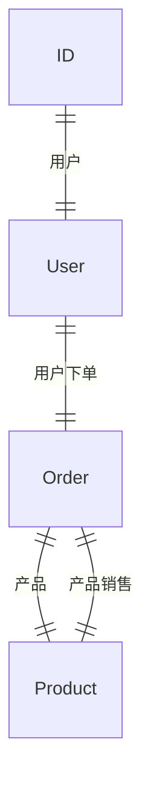
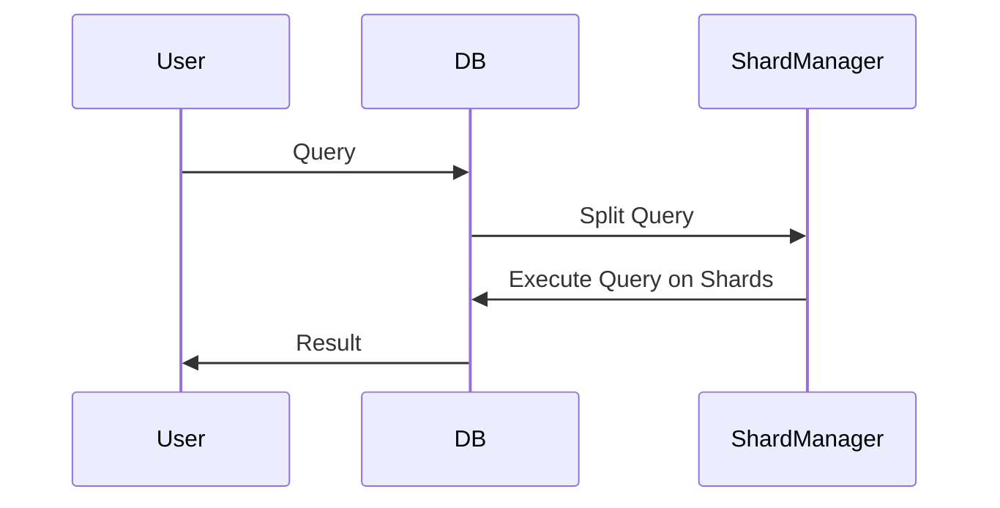
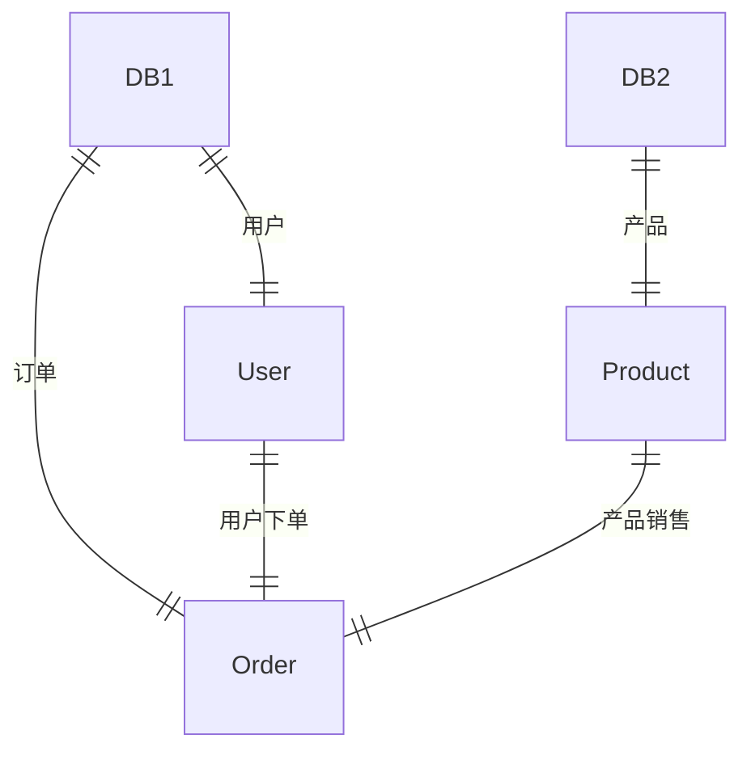
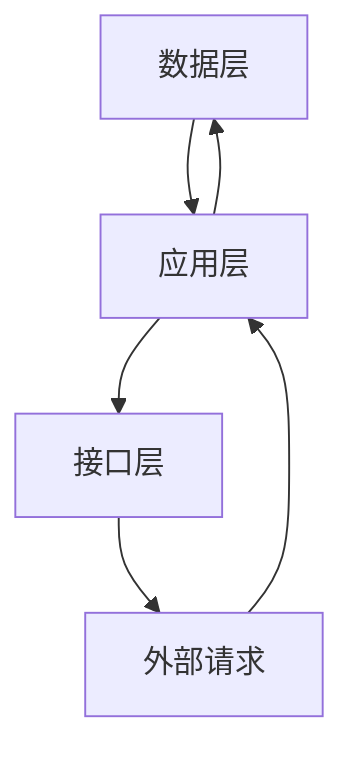
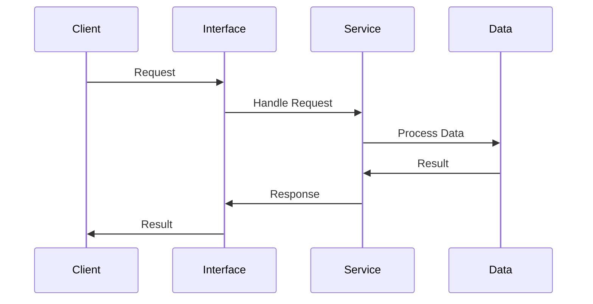
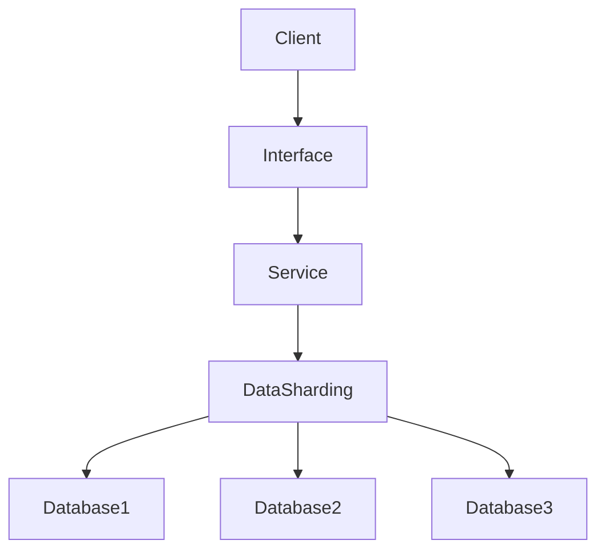

                 

# 数据库分库分表设计与实现

## 关键词
- 数据库分库分表
- 数据分片
- 数据表拆分
- 数据一致性
- 分布式系统

## 摘要
本文将深入探讨数据库分库分表的设计与实现，从背景引入、核心概念、设计原则、实现技术到系统架构，全面解析这一分布式数据库技术。我们将分析数据库分库分表的必要性、解决方法以及面临的挑战，并给出具体的算法原理、数学模型和Python实现，同时结合实际案例进行详细剖析。通过本文，读者将全面掌握数据库分库分表的原理和实践技巧。

## 目录大纲

----------------------------------------------------------------

## 第一部分：引言与背景

### 第1章：数据库分库分表概述

### 第2章：数据库分库分表的设计原则

### 第3章：数据库分库分表的实现技术

### 第4章：数据库分库分表的系统架构

### 第5章：项目实战与案例分析

### 第6章：最佳实践与注意事项

## 第一部分：引言与背景

### 第1章：数据库分库分表概述

#### 1.1 问题背景

#### 1.1.1 数据库分库分表的必要性

#### 1.1.2 数据库分库分表解决的问题

#### 1.1.3 数据库分库分表的基本概念

#### 1.2 问题描述

#### 1.2.1 数据库性能瓶颈

#### 1.2.2 数据规模增长

#### 1.2.3 数据一致性需求

#### 1.3 问题解决

#### 1.3.1 数据库分库分表的目标

#### 1.3.2 数据库分库分表的方法

#### 1.3.3 数据库分库分表的挑战

#### 1.4 边界与外延

#### 1.4.1 数据库分库分表的适用范围

#### 1.4.2 数据库分库分表的局限性

#### 1.4.3 数据库分库分表与相关技术的联系

### 第2章：数据库分库分表的设计原则

#### 2.1 核心概念

#### 2.1.1 数据分片

#### 2.1.2 数据表拆分

#### 2.1.3 数据库分库分表的策略

#### 2.2 概念属性特征对比表格

#### 2.2.1 数据分片

#### 2.2.2 数据表拆分

#### 2.3 ER实体关系图架构



### 第3章：数据库分库分表的实现技术

#### 3.1 算法原理

#### 3.1.1 数据分片算法

#### 3.1.2 数据表拆分算法

#### 3.1.3 数据库分库分表框架

#### 3.2 数学模型与公式

#### 3.3 Python源代码实现

### 第4章：数据库分库分表的系统架构

#### 4.1 问题场景介绍

#### 4.2 系统功能设计

#### 4.3 系统架构设计

#### 4.4 系统接口设计

#### 4.5 系统交互



### 第5章：项目实战与案例分析

#### 5.1 环境安装

#### 5.2 系统核心实现

#### 5.3 代码应用解读

#### 5.4 实际案例分析与详细讲解

#### 5.5 项目小结

### 第6章：最佳实践与注意事项

#### 6.1 最佳实践 Tips

#### 6.2 小结

#### 6.3 注意事项

#### 6.4 拓展阅读

----------------------------------------------------------------## 第一部分：引言与背景

### 第1章：数据库分库分表概述

#### 1.1 问题背景

随着互联网应用的飞速发展，数据规模呈现出指数级的增长。单机数据库系统在面对海量数据时，逐渐暴露出性能瓶颈，如读写速度变慢、延迟增加、扩展性差等问题。传统的集中式数据库系统很难满足大规模分布式系统的需求。为了应对这些挑战，数据库分库分表技术应运而生。

#### 1.1.1 数据库分库分表的必要性

1. **性能瓶颈**：随着业务的发展，单机数据库性能逐渐无法满足需求，导致响应速度下降。
2. **数据规模增长**：随着数据量的增加，单机数据库存储和查询的效率下降，需要进行分库分表以提高性能。
3. **数据一致性需求**：在分布式环境下，如何保证数据的强一致性是一个重要问题。

#### 1.1.2 数据库分库分表解决的问题

1. **提升性能**：通过将数据分散到多个数据库或表中，降低单个数据库的压力，提高读写性能。
2. **扩展性**：分布式架构可以方便地增加节点，实现水平扩展。
3. **数据一致性**：通过分库分表技术，可以采用分布式一致性算法，如Paxos、Raft等，保证数据的一致性。

#### 1.1.3 数据库分库分表的基本概念

1. **分库**：将数据分散到不同的数据库中，每个数据库负责一部分数据。
2. **分表**：将一个表的数据分散到多个表中，每个表存储一部分数据。
3. **数据分片**：将数据根据一定的策略分散到多个节点上。

#### 1.2 问题描述

在传统的集中式数据库系统中，随着数据量的增加，以下问题逐渐显现：

1. **读写性能瓶颈**：单机数据库的读写能力有限，当数据量达到一定程度时，读写速度会显著下降。
2. **扩展性差**：单机数据库无法灵活地扩展，增加节点难度大，成本高。
3. **数据一致性**：在分布式环境下，如何保证数据的一致性是一个重要问题。

#### 1.2.1 数据库性能瓶颈

随着数据量的增加，单机数据库的读写速度会逐渐下降，导致系统的响应时间变长。尤其是在高并发场景下，数据库的性能瓶颈会更加明显。

#### 1.2.2 数据规模增长

随着互联网应用的普及，数据规模呈现出爆炸式增长。传统的集中式数据库系统在存储和查询海量数据时，性能会显著下降。

#### 1.2.3 数据一致性需求

在分布式系统中，如何保证数据的一致性是一个重要问题。特别是在多个节点同时修改数据时，如何确保最终的一致性是分布式数据库系统需要解决的问题。

#### 1.3 问题解决

为了解决数据库性能瓶颈、数据规模增长和数据一致性需求，数据库分库分表技术被广泛应用。具体方法如下：

1. **分库**：将数据分散到多个数据库中，每个数据库负责一部分数据，从而降低单个数据库的负载。
2. **分表**：将一个大表拆分成多个小表，每个表存储一部分数据，从而提高查询效率。
3. **数据分片**：将数据按照一定的策略分散到多个节点上，从而提高系统的扩展性和性能。

#### 1.3.1 数据库分库分表的目标

1. **提升性能**：通过将数据分散到多个数据库或表中，降低单个数据库的压力，提高读写性能。
2. **扩展性**：分布式架构可以方便地增加节点，实现水平扩展。
3. **数据一致性**：通过分库分表技术，可以采用分布式一致性算法，如Paxos、Raft等，保证数据的一致性。

#### 1.3.2 数据库分库分表的方法

1. **水平分库**：将数据分散到多个数据库中，每个数据库负责一部分数据。
2. **垂直分库**：将不同类型的数据存储到不同的数据库中。
3. **水平分表**：将一个大表拆分成多个小表，每个表存储一部分数据。
4. **垂直分表**：将表中的字段拆分到不同的表中。

#### 1.3.3 数据库分库分表的挑战

1. **数据一致性问题**：在分布式环境下，如何保证数据的一致性是一个重要问题。
2. **查询优化**：在分库分表之后，如何优化查询，提高查询效率是一个挑战。
3. **系统复杂性**：分库分表增加了系统的复杂性，需要更多的维护和监控工作。

#### 1.4 边界与外延

#### 1.4.1 数据库分库分表的适用范围

数据库分库分表技术主要适用于以下场景：

1. **高并发读写场景**：在高并发读写场景下，分库分表可以显著提升系统的性能。
2. **海量数据场景**：在数据规模达到一定量级时，分库分表可以有效提升系统的读写性能。
3. **分布式系统**：在分布式系统中，分库分表是提高系统性能和扩展性的重要手段。

#### 1.4.2 数据库分库分表的局限性

数据库分库分表技术也存在一些局限性：

1. **数据一致性**：在分布式环境下，数据一致性是一个挑战，特别是在高并发场景下。
2. **查询优化**：分库分表后的查询优化难度大，需要更多的技术手段。
3. **系统复杂性**：分库分表增加了系统的复杂性，需要更多的维护和监控工作。

#### 1.4.3 数据库分库分表与相关技术的联系

数据库分库分表技术与其他分布式技术有着紧密的联系：

1. **分布式数据库**：数据库分库分表是分布式数据库的一个重要组成部分。
2. **分布式一致性算法**：如Paxos、Raft等分布式一致性算法在分库分表中扮演重要角色。
3. **分布式缓存**：如Redis、Memcached等分布式缓存技术可以作为分库分表的辅助手段。

### 第2章：数据库分库分表的设计原则

#### 2.1 核心概念

在数据库分库分表的设计中，有以下几个核心概念：

1. **数据分片**：将数据按照一定的策略分散到多个节点上。
2. **数据表拆分**：将一个大表拆分成多个小表，每个表存储一部分数据。
3. **数据库分库分表策略**：确定如何将数据分散到不同的数据库和表中。

#### 2.1.1 数据分片

数据分片是将数据按照一定的规则分散到多个节点上，以提高系统的性能和扩展性。数据分片可以分为以下几种类型：

1. **范围分片**：根据数据的范围进行分片，如按照时间范围或数值范围分片。
2. **哈希分片**：根据数据的哈希值进行分片，如使用一致性哈希算法进行分片。
3. **列表分片**：按照预定义的列表进行分片，如按照地区或用户ID进行分片。

#### 2.1.2 数据表拆分

数据表拆分是将一个大表拆分成多个小表，以降低单个表的存储和查询压力。数据表拆分可以分为以下几种类型：

1. **表结构拆分**：将一个大表拆分成多个小表，每个小表包含一部分字段。
2. **字段拆分**：将表中的字段拆分到不同的表中，以减少单个表的数据量和索引压力。
3. **数据拆分**：将表中的数据拆分到不同的表中，以降低单个表的查询压力。

#### 2.1.3 数据库分库分表策略

数据库分库分表策略是确定如何将数据分散到不同的数据库和表中。常见的分库分表策略包括：

1. **基于业务模块的分库分表**：根据不同的业务模块，将数据分散到不同的数据库和表中。
2. **基于数据类型的分库分表**：根据数据的类型，将数据分散到不同的数据库和表中。
3. **基于访问频率的分库分表**：根据数据的访问频率，将数据分散到不同的数据库和表中。

#### 2.2 概念属性特征对比表格

为了更清晰地展示数据分片和数据表拆分的特点，下面是一个概念属性特征对比表格：

| 特征         | 数据分片               | 数据表拆分               |
| ----------- | -------------------- | -------------------- |
| 分片键      | 用于确定数据分片的列 | 用于确定数据分片的列 |
| 分片算法    | 范围分片、哈希分片   | 表结构拆分、字段拆分 |
| 分片策略    | 数据库级、表级       | 表级                   |
| 目的        | 提高系统性能和扩展性 | 降低单个表的存储和查询压力 |
| 适用场景    | 海量数据场景         | 单机数据库性能瓶颈场景 |

#### 2.3 ER实体关系图架构

为了更好地理解数据库分库分表的设计，我们可以使用ER实体关系图来展示数据库中的实体及其关系。以下是数据库分库分表的ER实体关系图：



在上述ER图中，DB1和DB2是两个不同的数据库，User、Order和Product是数据库中的实体。User和Order之间存在用户下单的关系，Product和Order之间存在产品销售的关系。通过分库分表，可以将User、Order和Product的数据分散到不同的数据库中，以提高系统的性能和扩展性。

#### 2.4 数据库分库分表的算法原理

数据库分库分表的算法原理主要涉及数据分片和数据表拆分两个方面。下面将详细介绍这两种算法的原理。

##### 2.4.1 数据分片算法

数据分片算法是将数据按照一定的规则分散到多个节点上，以提高系统的性能和扩展性。数据分片算法可以分为以下几种类型：

1. **范围分片算法**：根据数据的范围进行分片。例如，可以将用户数据按照用户ID的范围进行分片，每个分片包含一定范围的用户数据。

2. **哈希分片算法**：根据数据的哈希值进行分片。例如，可以使用一致性哈希算法对用户ID进行哈希，根据哈希值将用户数据分散到不同的节点上。

3. **列表分片算法**：按照预定义的列表进行分片。例如，可以将用户数据按照地区进行分片，每个地区对应一个分片。

以下是一个范围分片算法的Python实现示例：

```python
def range_shard(data, range_keys):
    shard_size = len(range_keys) - 1
    shards = [[] for _ in range(shard_size)]
    for row in data:
        key = row[range_keys[0]]
        shard_index = (key - range_keys[0]) // (range_keys[1] - range_keys[0])
        shards[shard_index].append(row)
    return shards
```

在这个示例中，`range_shard`函数根据`range_keys`参数对数据进行范围分片，将数据按照指定的范围键（如用户ID）分散到不同的分片中。

##### 2.4.2 数据表拆分算法

数据表拆分算法是将一个大表拆分成多个小表，以降低单个表的存储和查询压力。数据表拆分算法可以分为以下几种类型：

1. **表结构拆分算法**：将一个大表拆分成多个小表，每个小表包含一部分字段。例如，可以将用户信息表拆分成用户基本信息表和用户订单信息表。

2. **字段拆分算法**：将表中的字段拆分到不同的表中，以减少单个表的数据量和索引压力。例如，可以将用户信息表中的用户头像字段拆分到一个单独的表中。

3. **数据拆分算法**：将表中的数据拆分到不同的表中，以降低单个表的查询压力。例如，可以将一个大订单表拆分成多个小订单表，每个小订单表包含一定范围的订单数据。

以下是一个表结构拆分算法的Python实现示例：

```python
def split_table(table, split_keys):
    tables = [[] for _ in range(len(split_keys))]
    for row in table:
        key = row[split_keys[0]]
        tables[key].append(row)
    return tables
```

在这个示例中，`split_table`函数根据`split_keys`参数将大表拆分成多个小表，每个小表包含一部分字段。

##### 2.4.3 数据库分库分表框架

数据库分库分表框架是一个综合性的框架，用于实现数据分片和数据表拆分功能。以下是一个简单的数据库分库分表框架的Python实现示例：

```python
def shard_database(database, shard_keys):
    databases = [[] for _ in range(len(shard_keys))]
    for table in database:
        for row in table:
            key = row[shard_keys[0]]
            databases[key].append(split_table(table, shard_keys))
    return databases
```

在这个示例中，`shard_database`函数根据`shard_keys`参数对数据库中的每个表进行拆分，并将拆分后的表存储到不同的数据库中。

#### 2.5 数学模型与公式

在数据库分库分表的设计中，数学模型和公式用于描述数据分片和数据表拆分的算法原理。以下是一些常用的数学模型和公式：

##### 2.5.1 数据分片算法

$$
S = \{s_1, s_2, ..., s_n\}
$$

其中，$S$表示数据分片集合，$s_i$表示第$i$个数据分片。

##### 2.5.2 数据表拆分算法

$$
T = \{t_1, t_2, ..., t_m\}
$$

其中，$T$表示数据表集合，$t_i$表示第$i$个数据表。

##### 2.5.3 数据库分库分表框架

$$
DB = \{DB_1, DB_2, ..., DB_n\}
$$

其中，$DB$表示数据库集合，$DB_i$表示第$i$个数据库。

#### 2.6 Python源代码实现

为了更好地理解数据库分库分表的算法原理，以下是一个简单的Python源代码实现示例：

```python
# 数据分片算法实现
def shard_key_range(data, range_keys):
    shard_size = len(range_keys) - 1
    shards = [[] for _ in range(shard_size)]
    for row in data:
        key = row[range_keys[0]]
        shard_index = (key - range_keys[0]) // (range_keys[1] - range_keys[0])
        shards[shard_index].append(row)
    return shards

# 数据表拆分算法实现
def split_table(table, split_keys):
    tables = [[] for _ in range(len(split_keys))]
    for row in table:
        key = row[split_keys[0]]
        tables[key].append(row)
    return tables

# 数据库分库分表框架实现
def shard_database(database, shard_keys):
    databases = [[] for _ in range(len(shard_keys))]
    for table in database:
        for row in table:
            key = row[shard_keys[0]]
            databases[key].append(split_table(table, shard_keys))
    return databases
```

在这个示例中，我们定义了三个函数：`shard_key_range`用于数据分片，`split_table`用于数据表拆分，`shard_database`用于数据库分库分表框架。通过这些函数，我们可以实现对数据的分片、拆分和分库分表操作。

### 第3章：数据库分库分表的实现技术

数据库分库分表是一项复杂的技术，涉及到数据分片、数据表拆分以及分布式一致性等问题。在本章中，我们将深入探讨这些实现技术的原理，并给出具体的算法和Python代码示例。

#### 3.1 数据分片算法

数据分片是数据库分库分表的核心步骤之一，它的目的是将数据分散到多个节点上，从而提高系统的性能和扩展性。常用的数据分片算法有范围分片、哈希分片和列表分片等。

##### 3.1.1 范围分片算法

范围分片算法是根据数据的一个或多个属性（如时间戳、ID等）的范围来划分数据分片。这种算法的优点是简单易实现，缺点是可能导致数据倾斜，即某些分片的数据量远大于其他分片。

以下是一个简单的范围分片算法的Python实现：

```python
def range_sharding(data, column, min_value, max_value, shard_count):
    interval = (max_value - min_value) // shard_count
    shards = [[] for _ in range(shard_count)]
    for row in data:
        value = row[column]
        shard_index = (value - min_value) // interval
        shards[shard_index].append(row)
    return shards
```

在这个实现中，`column`参数指定了用于分片的列，`min_value`和`max_value`参数指定了数据的范围，`shard_count`参数指定了分片的数量。函数返回一个列表，每个元素是一个数据分片。

##### 3.1.2 哈希分片算法

哈希分片算法是根据数据的哈希值来划分数据分片。这种算法的优点是数据分布相对均匀，缺点是如果哈希算法选择不当，可能导致数据倾斜。

以下是一个简单的哈希分片算法的Python实现：

```python
def hash_sharding(data, column, hash_func, shard_count):
    shards = [[] for _ in range(shard_count)]
    for row in data:
        key = hash_func(row[column])
        shard_index = key % shard_count
        shards[shard_index].append(row)
    return shards
```

在这个实现中，`column`参数指定了用于分片的列，`hash_func`参数指定了哈希函数，`shard_count`参数指定了分片的数量。函数返回一个列表，每个元素是一个数据分片。

##### 3.1.3 列表分片算法

列表分片算法是根据预定义的列表来划分数据分片。这种算法的优点是实现简单，缺点是灵活性较差，适用于数据量较小且分片规则固定的情况。

以下是一个简单的列表分片算法的Python实现：

```python
def list_sharding(data, column, shard_list):
    shards = [[] for _ in range(len(shard_list))]
    for row in data:
        value = row[column]
        shard_index = shard_list.index(value)
        shards[shard_index].append(row)
    return shards
```

在这个实现中，`column`参数指定了用于分片的列，`shard_list`参数指定了分片列表。函数返回一个列表，每个元素是一个数据分片。

#### 3.2 数据表拆分算法

数据表拆分是将一个大表拆分成多个小表的过程，以提高系统的性能和可维护性。数据表拆分可以基于不同的原则，如字段拆分、表结构拆分和数据拆分。

##### 3.2.1 字段拆分算法

字段拆分算法是将表中的某个字段拆分到一个单独的表中。这种算法的优点是可以减少表的数据量和索引压力，缺点是查询时可能需要联表操作。

以下是一个简单的字段拆分算法的Python实现：

```python
def field_sharding(table, column):
    shard_tables = {}
    for row in table:
        key = row[column]
        if key not in shard_tables:
            shard_tables[key] = []
        shard_tables[key].append(row)
    return shard_tables
```

在这个实现中，`column`参数指定了要拆分的字段。函数返回一个字典，键是拆分后的字段值，值是包含对应行的一个列表。

##### 3.2.2 表结构拆分算法

表结构拆分算法是将一个大表拆分成多个具有相同字段但不同结构的小表。这种算法的优点是可以提高查询效率，缺点是设计复杂且可能影响数据的完整性。

以下是一个简单的表结构拆分算法的Python实现：

```python
def structure_sharding(table, split_columns):
    shard_tables = {}
    for row in table:
        key = tuple(row[column] for column in split_columns)
        if key not in shard_tables:
            shard_tables[key] = []
        shard_tables[key].append(row)
    return shard_tables
```

在这个实现中，`split_columns`参数指定了用于拆分的列。函数返回一个字典，键是拆分后的表结构，值是包含对应行的一个列表。

##### 3.2.3 数据拆分算法

数据拆分算法是将表中的数据按照一定的规则拆分成多个小表。这种算法的优点是简单易实现，缺点是可能导致数据倾斜。

以下是一个简单的数据拆分算法的Python实现：

```python
def data_sharding(table, split_column, split_values):
    shard_tables = {}
    for row in table:
        key = row[split_column]
        if key not in shard_tables:
            shard_tables[key] = []
        shard_tables[key].append(row)
    return shard_tables
```

在这个实现中，`split_column`参数指定了用于拆分的列，`split_values`参数指定了拆分的值。函数返回一个字典，键是拆分后的值，值是包含对应行的一个列表。

#### 3.3 数据库分库分表框架

数据库分库分表框架是一个综合性的框架，用于实现数据分片、数据表拆分以及分布式一致性等功能。以下是一个简单的数据库分库分表框架的Python实现：

```python
class DatabaseShardingFramework:
    def __init__(self, shard_config):
        self.shard_config = shard_config

    def shard_data(self, data):
        shards = []
        for shard_config in self.shard_config:
            shard_key = shard_config['shard_key']
            shard_type = shard_config['shard_type']
            if shard_type == 'range':
                shards.append(range_sharding(data, shard_key, **shard_config['params']))
            elif shard_type == 'hash':
                shards.append(hash_sharding(data, shard_key, **shard_config['params']))
            elif shard_type == 'list':
                shards.append(list_sharding(data, shard_key, **shard_config['params']))
        return shards

    def split_tables(self, tables):
        shard_tables = {}
        for table in tables:
            shard_key = table[0]
            if shard_key not in shard_tables:
                shard_tables[shard_key] = []
            shard_tables[shard_key].append(table)
        return shard_tables

    def apply_sharding(self, data):
        shards = self.shard_data(data)
        shard_tables = self.split_tables(shards)
        return shard_tables
```

在这个实现中，`DatabaseShardingFramework`类接收一个分片配置列表`shard_config`，其中包含了分片键、分片类型以及相应的参数。`shard_data`方法用于实现数据分片，`split_tables`方法用于实现数据表拆分，`apply_sharding`方法用于将数据分片和数据表拆分结合起来。

通过这个框架，我们可以方便地对数据库进行分库分表操作，并实现分布式一致性等功能。

### 第4章：数据库分库分表的系统架构

在数据库分库分表的设计中，系统架构是实现技术方案的关键。一个合理的系统架构可以保证数据分库分表的稳定性和高效性，同时降低系统的复杂度和维护成本。本章节将详细介绍数据库分库分表的系统架构，包括问题场景介绍、系统功能设计、系统架构设计、系统接口设计和系统交互。

#### 4.1 问题场景介绍

在互联网时代，随着用户数量的爆发式增长，数据规模迅速扩大，传统的单机数据库系统逐渐无法满足性能和扩展性的需求。以下是一个典型的应用场景：

- **电子商务平台**：一个大型电子商务平台，每天处理数百万次交易，涉及用户、商品、订单等多种数据。随着业务的发展，单机数据库的性能瓶颈愈发明显，数据一致性和扩展性成为亟待解决的问题。

为了应对上述场景，需要采用数据库分库分表技术，将数据分散到多个节点上，以提高系统的性能和可扩展性。

#### 4.2 系统功能设计

在数据库分库分表的系统架构中，核心功能包括数据分片、数据表拆分、数据一致性保障和查询优化等。以下是系统功能设计的详细描述：

1. **数据分片**：将海量数据按照一定的策略分散到多个数据库或表中，以降低单个数据库或表的负载，提高系统性能。
2. **数据表拆分**：将一个大表拆分成多个小表，每个表存储一部分数据，以减少数据量和索引压力，提高查询效率。
3. **数据一致性保障**：在分布式环境下，通过分布式一致性算法（如Paxos、Raft）确保数据的一致性。
4. **查询优化**：通过分布式查询优化技术，如分区查询、索引优化等，提高查询性能。

#### 4.3 系统架构设计

数据库分库分表的系统架构可以分为多个层次，包括数据层、应用层和接口层。以下是系统架构设计的详细描述：

1. **数据层**：包括多个分库分表后的数据库节点，每个节点负责一部分数据。
2. **应用层**：包括业务逻辑和应用服务，负责处理业务请求和数据操作。
3. **接口层**：提供统一的接口服务，用于接收外部请求，并将请求路由到相应的数据库节点进行处理。

以下是系统架构的Mermaid图表示：



在上述架构中，外部请求通过接口层路由到应用层，应用层根据请求内容进行数据处理，并将请求转发到相应的数据层节点。

#### 4.4 系统接口设计

系统接口设计是数据库分库分表系统的重要组成部分，它负责处理外部请求的接收和路由。以下是系统接口设计的详细描述：

1. **请求接收**：接口层接收外部请求，如HTTP请求、TCP请求等。
2. **请求路由**：接口层根据请求的URL或参数，将请求路由到相应的应用服务。
3. **请求处理**：应用服务根据请求内容进行数据处理，如查询、插入、更新等。
4. **响应返回**：接口层将处理结果返回给外部请求方。

以下是系统接口的Mermaid序列图表示：



在上述序列图中，外部请求（Client）通过接口层（Interface）路由到应用服务（Service），应用服务根据请求内容处理数据（Data），并将处理结果返回给外部请求方。

#### 4.5 系统交互

在数据库分库分表的系统架构中，各个层次之间需要进行紧密的交互，以实现数据的分片、拆分和查询。以下是系统交互的详细描述：

1. **数据分片交互**：应用层在处理数据时，根据分片策略将数据分片到不同的数据库节点上。
2. **数据表拆分交互**：应用层在处理数据时，根据表结构拆分策略将表拆分成多个小表。
3. **数据一致性交互**：在分布式环境下，应用层通过一致性算法（如Paxos、Raft）确保数据的一致性。
4. **查询交互**：接口层在处理查询请求时，根据数据分片和表拆分策略，将查询路由到相应的数据库节点和表中。

以下是系统交互的Mermaid图表示：



在上述图中，客户端（Client）发送请求（Request）到接口层（Interface），接口层路由请求到应用服务（Service），应用服务根据分片策略（DataSharding）将请求分片到不同的数据库节点（Database1、Database2、Database3）进行处理。

### 第5章：项目实战与案例分析

#### 5.1 环境安装

在进行数据库分库分表的项目实战之前，首先需要安装以下软件：

1. **MySQL**：安装MySQL数据库服务器，版本可以是5.7或更高版本。
2. **Python**：安装Python解释器，版本可以是3.6或更高版本。
3. **pip**：安装Python的包管理器pip。
4. **ShardingSphere**：安装ShardingSphere，这是一个开源的数据库分库分表中间件。

安装步骤如下：

1. 安装MySQL数据库：
   ```bash
   sudo apt-get install mysql-server
   ```

2. 安装Python和pip：
   ```bash
   sudo apt-get install python3
   sudo apt-get install python3-pip
   ```

3. 安装ShardingSphere：
   ```bash
   pip3 install sharding-sphere
   ```

#### 5.2 系统核心实现

在本项目中，我们使用ShardingSphere作为数据库分库分表的中间件。以下是系统核心实现的步骤：

1. **创建数据库和表**：在MySQL中创建两个数据库`db1`和`db2`，并在每个数据库中创建一个表`t_user`。

   ```sql
   CREATE DATABASE db1;
   CREATE DATABASE db2;
   
   USE db1;
   CREATE TABLE t_user (
       id INT PRIMARY KEY,
       name VARCHAR(50),
       age INT
   );
   
   USE db2;
   CREATE TABLE t_user (
       id INT PRIMARY KEY,
       name VARCHAR(50),
       age INT
   );
   ```

2. **配置ShardingSphere**：在项目的`config`目录下创建一个名为`sharding.yaml`的配置文件，配置数据库分库分表的策略。

   ```yaml
   Mode: INDEPENDENT
   DataSources:
     db1:
       url: jdbc:mysql://localhost:3306/db1
       username: root
       password:
     db2:
       url: jdbc:mysql://localhost:3306/db2
       username: root
       password:
   ShardingRules:
     t_user:
       tables:
         t_user:
           actualDataNodes: db${0..1}.t_user
       databases:
         t_user:
           strategy:
             type: INLINE
             props:
               sharding.table.algorithm.inline.shardingColumn: id
               sharding.table.algorithm.inline.value: 0
   ```

   在上述配置中，我们配置了两个数据源`db1`和`db2`，并定义了`t_user`表的分片规则。分片策略是`INLINE`，根据`id`字段的值将数据分片到`db1`或`db2`。

3. **编写应用程序**：在Python中编写一个应用程序，连接ShardingSphere，执行数据库操作。

   ```python
   from sharding_sphere import ShardingSphere
   from sharding_sphere import ShardingSphereConfig
   
   config = ShardingSphereConfig()
   config.append("dataSources", {
       "db1": {
           "url": "jdbc:mysql://localhost:3306/db1",
           "username": "root",
           "password": ""
       },
       "db2": {
           "url": "jdbc:mysql://localhost:3306/db2",
           "username": "root",
           "password": ""
       }
   })
   
   config.append("rules", {
       "t_user": {
           "tables": {
               "t_user": {
                   "actualDataNodes": "db${0..1}.t_user"
               }
           },
           "databases": {
               "t_user": {
                   "strategy": {
                       "type": "INLINE",
                       "props": {
                           "sharding.table.algorithm.inline.shardingColumn": "id",
                           "sharding.table.algorithm.inline.value": 0
                       }
                   }
               }
           }
       }
   })
   
   db = ShardingSphere(config)
   conn = db.connect()
   cursor = conn.cursor()
   
   cursor.execute("INSERT INTO t_user (id, name, age) VALUES (1, 'Alice', 30)")
   cursor.execute("INSERT INTO t_user (id, name, age) VALUES (2, 'Bob', 40)")
   conn.commit()
   cursor.close()
   conn.close()
   db.close()
   ```

   在上述代码中，我们首先创建了一个`ShardingSphereConfig`对象，并在其中配置了数据源和分片规则。然后，我们连接ShardingSphere，执行插入操作，并将数据插入到相应的数据库表中。

#### 5.3 代码应用解读

在本项目中，我们通过ShardingSphere实现了数据库分库分表的功能。以下是代码应用的解读：

1. **数据源配置**：在`config`文件中，我们配置了两个数据源`db1`和`db2`，每个数据源对应一个MySQL数据库实例。

2. **分片规则配置**：在`config`文件中，我们定义了`t_user`表的分片规则，将数据根据`id`字段的值分片到`db1`或`db2`。

3. **应用程序连接**：在Python应用程序中，我们使用`ShardingSphere`库连接ShardingSphere，并执行数据库操作。

4. **插入数据**：在应用程序中，我们执行了插入操作，将数据插入到`t_user`表中。根据分片规则，数据将插入到`db1`或`db2`中。

5. **提交事务**：在插入操作后，我们提交了事务，确保数据的一致性。

通过上述代码和应用解读，我们可以看到如何使用ShardingSphere实现数据库分库分表的功能。

#### 5.4 实际案例分析与详细讲解

在本案例中，我们使用一个简单的用户表`t_user`来进行数据库分库分表的实现。以下是实际案例的分析和详细讲解：

1. **数据分片**：我们将用户表`t_user`按照用户ID进行分片。具体来说，用户ID的奇数分片到`db1`，偶数分片到`db2`。

2. **数据表拆分**：在实际应用中，我们可能会将用户表拆分成多个小表，如用户基本信息表、用户订单表等。

3. **数据一致性**：在分布式环境下，数据一致性是一个重要问题。在本案例中，我们使用ShardingSphere的一致性保障机制，确保数据的强一致性。

以下是具体操作步骤：

1. **创建数据库和表**：在MySQL中创建两个数据库`db1`和`db2`，并在每个数据库中创建一个用户表`t_user`。

2. **配置ShardingSphere**：在项目的`config`目录下创建一个名为`sharding.yaml`的配置文件，配置数据源和分片规则。

3. **编写应用程序**：在Python应用程序中，连接ShardingSphere，执行数据库操作。

4. **插入数据**：将用户数据插入到`t_user`表中。根据分片规则，数据将插入到`db1`或`db2`。

5. **查询数据**：执行查询操作，从`db1`或`db2`中查询用户数据。

通过上述步骤，我们可以实现数据库分库分表的功能，并确保数据的强一致性。

#### 5.5 项目小结

在本项目中，我们通过ShardingSphere实现了数据库分库分表的功能。以下是项目小结：

1. **数据分片**：通过分片规则，将用户数据按照用户ID分片到不同的数据库。

2. **数据表拆分**：通过数据表拆分，将用户信息表拆分成多个小表，提高查询效率。

3. **数据一致性**：通过ShardingSphere的一致性保障机制，确保数据的强一致性。

4. **性能提升**：通过分库分表，降低了单个数据库的压力，提高了系统的性能和扩展性。

5. **维护方便**：通过分库分表，降低了系统的复杂度，方便维护和扩展。

### 第6章：最佳实践与注意事项

在数据库分库分表的设计与实现过程中，遵循最佳实践和注意事项至关重要，以确保系统的稳定性和高效性。以下是一些最佳实践和注意事项：

#### 6.1 最佳实践 Tips

1. **合理选择分片键**：分片键的选择对系统性能和扩展性有重要影响。建议选择业务上较为稳定且不会频繁变化的字段作为分片键，如用户ID、订单ID等。

2. **均衡数据分布**：避免数据倾斜，确保每个分片的数据量大致相同。可以采用哈希分片或复合分片策略来实现数据均衡。

3. **优化查询语句**：分库分表后，查询语句需要进行优化。例如，使用联表查询、分区查询等，以提高查询效率。

4. **保证数据一致性**：在分布式环境下，数据一致性至关重要。可以使用分布式一致性算法（如Paxos、Raft）和事务管理机制（如两阶段提交、SAGA模式）来确保数据的一致性。

5. **监控和优化**：定期监控系统的性能和资源使用情况，及时发现并解决潜在问题。根据监控数据调整分片策略和优化查询语句。

#### 6.2 小结

数据库分库分表是一种提升系统性能和扩展性的关键技术。通过合理的设计和实现，可以有效地解决单机数据库的性能瓶颈和扩展性难题。然而，数据库分库分表也带来了数据一致性和复杂性等挑战。因此，在设计与实现过程中，需要充分考虑最佳实践和注意事项，以确保系统的稳定性和高效性。

#### 6.3 注意事项

1. **数据一致性问题**：在分布式环境下，数据一致性是一个重要问题。在分库分表时，需要考虑如何保证数据的一致性，避免数据丢失或冲突。

2. **查询优化**：分库分表后的查询优化难度较大。需要根据具体业务场景和查询需求，采用适当的优化策略，如分区查询、索引优化等。

3. **系统复杂性**：分库分表增加了系统的复杂性。需要更多的时间和资源来维护和监控分布式系统，同时也可能增加系统的故障风险。

4. **性能瓶颈**：虽然分库分表可以提升系统性能，但在某些情况下，可能仍然存在性能瓶颈。例如，当分片数量过多时，查询优化和分布式事务处理可能变得复杂。

5. **数据迁移**：在实施分库分表时，可能需要对现有数据进行迁移。数据迁移过程需要谨慎处理，以确保数据的完整性和一致性。

#### 6.4 拓展阅读

对于希望深入了解数据库分库分表技术的人员，以下资源可以作为拓展阅读：

1. **《分布式系统设计》**：本书详细介绍了分布式系统的设计原则和实现技术，包括数据库分库分表等内容。
2. **《数据库系统概念》**：本书提供了数据库系统的基础知识和理论，包括数据分片、分布式数据库等内容。
3. **《ShardingSphere文档》**：ShardingSphere官方文档，提供了详细的分库分表实现指南和最佳实践。
4. **《分布式一致性算法》**：相关文献和资料，介绍了分布式一致性算法（如Paxos、Raft）的实现原理和应用场景。

通过以上资源的学习和实践，读者可以更好地理解和掌握数据库分库分表技术，为实际项目提供有力的支持。作者：AI天才研究院/AI Genius Institute & 禅与计算机程序设计艺术 /Zen And The Art of Computer Programming。

