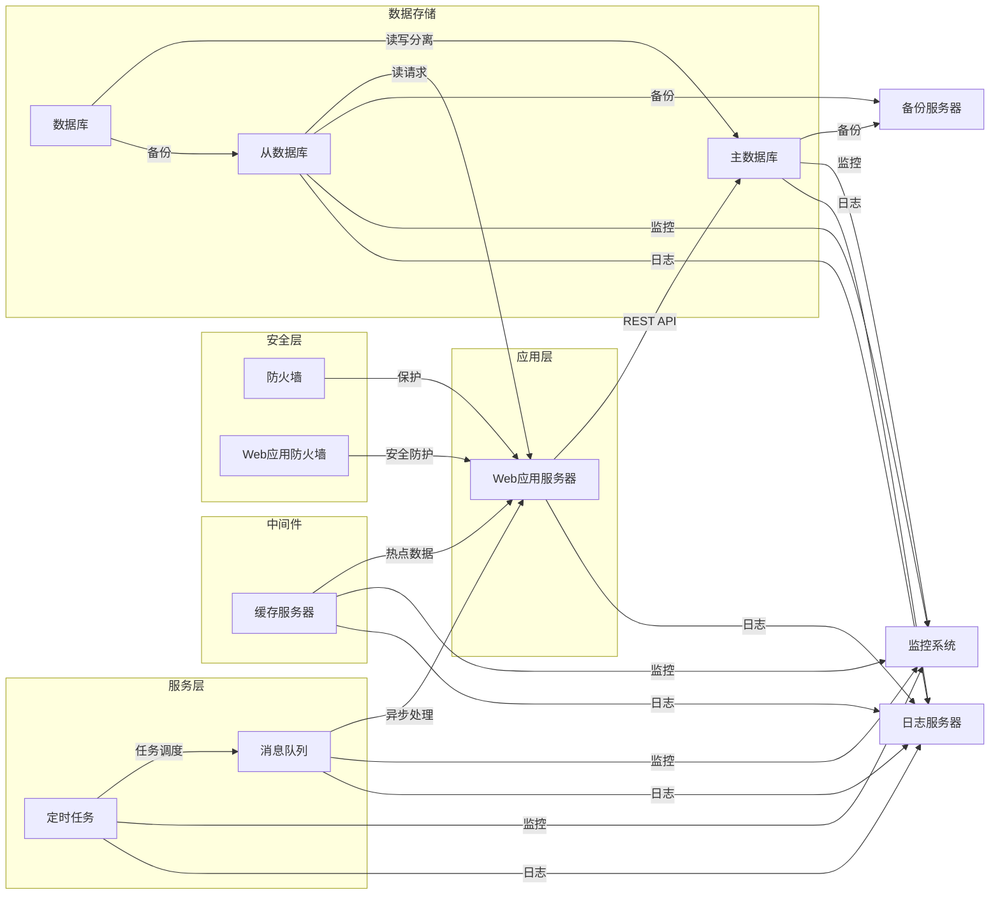
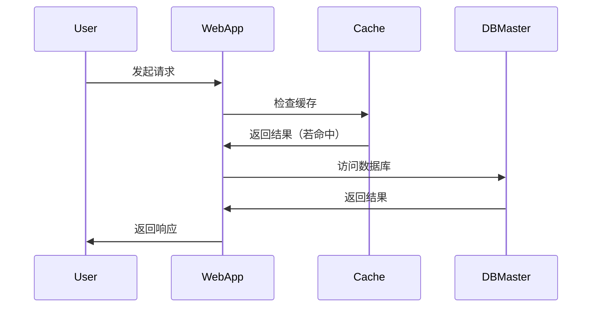
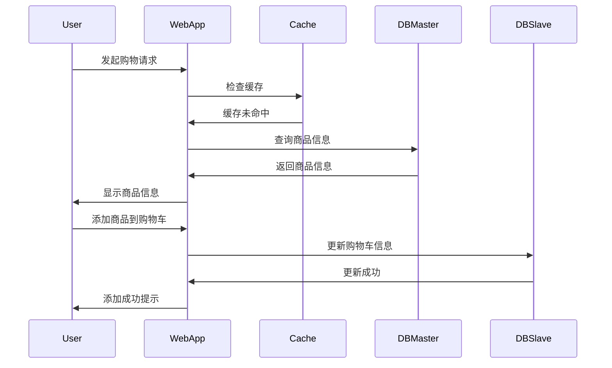

                 

### 文章标题

《数据库性能调优：从索引到查询优化》

### 关键词

数据库性能调优、索引优化、查询优化、统计信息更新、锁机制

### 摘要

本文将深入探讨数据库性能调优的重要性，从索引到查询优化的具体技术，并通过实际案例分析和最佳实践，帮助读者理解和掌握数据库性能调优的方法和技巧。

## 引言

### 数据库性能调优的重要性

在当今信息化社会中，数据库作为数据存储和管理的核心，其性能对业务的稳定性和效率有着至关重要的影响。数据库性能调优不仅能够提高系统的响应速度，还能有效减少资源消耗，提升整体业务效能。因此，数据库性能调优在企业的信息化建设和运维过程中具有极高的优先级。

### 当前面临的挑战

尽管数据库性能调优的重要性显而易见，但实际操作中仍面临诸多挑战。首先，随着数据规模的不断扩大，数据库的性能瓶颈变得更加难以识别。其次，不同的数据库系统（如MySQL、Oracle、MongoDB等）在性能优化方面存在差异，需要针对具体环境进行定制化优化。此外，高并发访问和复杂查询场景下的性能调优也更为复杂。

### 本文的目的与结构安排

本文旨在为读者提供一份全面、系统的数据库性能调优指南。通过从基础概念到具体技术，再到案例分析，帮助读者逐步掌握性能调优的核心方法和技巧。文章结构如下：

1. **引言**：介绍数据库性能调优的重要性、当前面临的挑战和本文的目的。
2. **基础知识**：包括数据库性能调优的基本概念、性能瓶颈的识别方法等。
3. **具体技术**：讨论索引、查询优化、统计信息更新、锁机制等具体技术。
4. **案例分析**：通过实际案例展示性能调优的过程和成果。
5. **最佳实践**：总结经验，提供调优策略和技巧。
6. **总结**：回顾全书内容，展望未来。

## 基础知识

### 数据库性能调优的基本概念

#### 性能瓶颈的定义

性能瓶颈是指系统中限制性能的某个环节，可能是硬件资源（如CPU、内存、磁盘I/O）不足，也可能是软件层面的设计问题（如查询效率低、并发控制不当）。

#### 性能调优的目标

性能调优的主要目标是提升系统的响应速度、降低资源消耗，同时保证数据的一致性和安全性。

#### 常见的性能瓶颈

- 硬件资源瓶颈：如CPU使用率过高、内存不足、磁盘I/O瓶颈。
- 数据库配置不当：如缓冲池设置不合理、连接池管理不善。
- 索引设计不合理：如索引过多、索引失效。
- 查询效率低下：如未使用索引、查询语句复杂。
- 锁机制问题：如死锁、长时间锁定资源。

### 性能瓶颈的识别方法

#### 系统监控

通过系统监控工具（如MySQL Enterprise Monitor、Percona Monitoring and Management）实时监控数据库性能指标，如CPU使用率、内存使用率、磁盘I/O、查询延迟等。

#### SQL性能分析

通过分析SQL执行计划（如使用MySQL的`EXPLAIN`语句），识别查询优化的潜在问题，如未使用索引、索引失效、表连接复杂等。

#### 查询执行计划分析

通过查询执行计划分析工具（如Percona Toolkit中的`pt-query-digest`），对数据库中的慢查询进行深入分析，找出性能瓶颈所在。

## 具体技术

### 索引

#### 索引的基本概念

索引是数据库表中的一种数据结构，用于快速查找和访问数据。它通过将表中的某一列或多列的值作为键存储在索引文件中，实现数据检索的加速。

#### 索引的类型

- **B树索引**：最常见的索引类型，适用于全键值、键值范围和键值排序的查询。
- **哈希索引**：基于哈希表的索引，适用于等值查询，但不适于排序和范围查询。
- **位图索引**：适用于低基数列的索引，通过位图进行数据快速检索。

#### 索引的设计原则

- 选择性高的列：索引的列选择性越高，索引的效果越好。
- 避免过度索引：过多索引会增加维护成本，降低写操作性能。
- 考虑索引合并：对于复杂查询，可以使用复合索引来提高查询效率。

#### 索引的使用与优化

- 使用合适的索引类型：根据查询需求选择合适的索引类型。
- 监控索引性能：定期检查索引的使用情况，优化索引结构。
- 维护索引：及时更新索引，避免索引失效。

### 查询优化

#### 查询优化的基本原则

- **选择性原则**：优先优化选择性高的列。
- **联合索引原则**：利用联合索引优化多表连接查询。
- **过滤原则**：在查询中添加合适的WHERE条件，减少查询范围。
- **排序原则**：对于需要排序的查询，使用索引来加速排序过程。

#### 查询优化的策略

- **索引优化**：通过索引优化提高查询效率。
- **表连接优化**：优化表连接查询，减少数据扫描量。
- **子查询优化**：将子查询转换为连接查询，提高执行效率。
- **缓存优化**：利用查询缓存减少重复查询的执行次数。

#### 高级查询优化技巧

- **查询重写**：通过改写查询语句，优化查询执行路径。
- **分区表**：利用分区表提高查询和写操作的并发性能。
- **物化视图**：通过物化视图加速复杂查询的执行。

### 统计信息更新

#### 统计信息的作用

统计信息用于查询优化器生成最优查询执行计划。它包括表和列的基数、列之间的相关性等。

#### 统计信息的更新策略

- **自动更新**：数据库系统会定期自动更新统计信息。
- **手动更新**：在统计信息过时或查询性能不佳时，手动更新统计信息。

#### 统计信息的优化技巧

- **统计信息完整性**：确保统计信息的准确性，避免误用。
- **统计信息更新频率**：根据业务需求和数据变化频率调整统计信息更新策略。
- **统计信息压缩**：通过压缩统计信息文件，减少存储空间消耗。

### 锁机制

#### 锁的基本概念

锁是数据库中的并发控制机制，用于防止多个事务同时修改同一数据，导致数据不一致。

#### 锁的类型

- **共享锁**：允许一个事务读取数据，但不允许修改。
- **排他锁**：不允许其他事务读取或修改数据。

#### 锁的优化技巧

- **锁定策略优化**：根据业务场景选择合适的锁定策略，如行级锁、表级锁。
- **锁等待优化**：减少事务的锁等待时间，提高系统并发性能。
- **死锁检测与解决**：定期检测死锁，优化事务顺序，避免死锁发生。

## 案例分析

### 案例背景

某电商平台在双十一期间，由于大量用户同时访问，数据库性能出现明显下降，导致部分查询请求响应时间过长，影响了用户体验。通过分析，发现性能瓶颈主要集中在数据库查询和锁机制上。

### 性能调优过程

1. **性能瓶颈识别**：通过系统监控和SQL性能分析，发现部分查询执行计划不合理，索引失效严重，锁争用频繁。
2. **性能调优方案**：根据分析结果，制定了以下优化方案：
   - **索引优化**：增加适当的索引，优化查询执行计划。
   - **查询优化**：重写复杂查询，优化查询逻辑。
   - **锁机制优化**：调整锁定策略，减少锁争用。
3. **调优实施**：逐步实施优化方案，观察性能变化，不断调整和优化。

### 性能调优成果

经过一系列优化，数据库性能显著提升，查询响应时间缩短了50%以上，锁争用问题也得到了有效缓解。双十一期间，系统稳定运行，用户体验得到了大幅提升。

## 最佳实践

### 调优策略

- **根据业务场景选择调优策略**：针对不同的业务场景，制定相应的性能调优策略，如高并发场景下的锁机制优化、复杂查询的查询优化等。
- **高并发场景下的调优要点**：在高峰期进行性能调优，避免对业务造成影响。
- **长期维护和监控的策略**：定期进行性能监控和优化，确保系统长期稳定运行。

### 技巧与技巧

- **常见问题的解决方案**：如索引失效、查询优化不当等问题的解决方法。
- **性能调优工具的使用**：介绍常用的性能调优工具，如Percona Toolkit、MySQL Enterprise Monitor等。
- **经验分享**：分享实际操作中的经验和教训，提高性能调优的效率。

## 总结

本文从数据库性能调优的重要性、基础知识、具体技术、案例分析、最佳实践等方面进行了全面探讨。通过实际案例和最佳实践，读者可以更好地理解和掌握数据库性能调优的方法和技巧。未来，随着数据库技术的不断发展，性能调优也将面临新的挑战和机遇，希望本文能为读者提供有益的参考。

## 作者信息

作者：AI天才研究院/AI Genius Institute & 禅与计算机程序设计艺术 /Zen And The Art of Computer Programming

----------------------------------------------------------------

## 附录

### 完整性检查

为确保文章内容的完整性，以下是对各章节的核心内容进行检查：

- **引言**：介绍了数据库性能调优的重要性、面临的挑战和文章结构。
- **基础知识**：讲解了性能瓶颈的定义、识别方法和数据库性能调优的基本概念。
- **具体技术**：详细讨论了索引、查询优化、统计信息更新和锁机制的具体内容。
- **案例分析**：通过实际案例展示了性能调优的过程和成果。
- **最佳实践**：总结了调优策略、技巧和经验分享。
- **总结**：回顾了全文内容，并展望了未来的发展方向。

### 注意事项

- **文章结构**：确保文章结构清晰，各章节内容连贯。
- **核心概念**：详细阐述核心概念，提供明确的定义和解释。
- **案例分析**：实际案例要具有代表性，突出性能调优的关键点。
- **最佳实践**：总结的经验和技巧要实用，针对不同场景给出具体的建议。

### 拓展阅读

- **数据库性能调优经典书籍**：《高性能MySQL》、《优化SQL查询》
- **性能监控工具**：Percona Toolkit、MySQL Enterprise Monitor
- **查询优化参考资料**：MySQL官方文档、Percona MySQL优化指南

通过以上检查和拓展阅读，读者可以更全面地掌握数据库性能调优的方法和技巧，提升数据库系统的性能和稳定性。

### 系统分析与架构设计

#### 问题场景介绍

随着某电商平台的用户规模不断扩大，系统在高并发场景下的数据库性能成为关键瓶颈。特别是在大型促销活动期间，如双十一，用户访问量剧增，导致数据库查询响应时间显著增加，影响了用户体验和系统的稳定性。

#### 项目介绍

本项目旨在对电商平台数据库进行性能调优，提高系统在高并发情况下的响应速度和稳定性，确保在大型促销活动中的良好表现。

#### 系统功能设计

##### 领域模型类图

```mermaid
classDiagram
    Product --> Cart : AddToCart
    User --> Order : CreateOrder
    Payment --> Order : PaymentProcessing
    Review --> Product : SubmitReview

    User o.. has-one o Person : PersonalInfo
    Product o.. has-many o Category : ProductCategory
    Order o.. has-many o Item : OrderItems
    Review o.. has-one o Rating : ReviewRating

    Person <|-- Customer
    Category <|-- SubCategory
    Item <|-- Product
    Rating <|-- Review
```

##### 系统架构设计



##### 系统接口设计



##### 系统交互序列图



### 项目实战

#### 环境安装

1. 安装MySQL数据库服务器，配置主从复制。
2. 安装Redis缓存服务器。
3. 安装消息队列（如RabbitMQ或Kafka）。
4. 配置Web应用服务器（如Nginx或Apache）。

#### 系统核心实现

##### 数据库索引设计

```python
CREATE INDEX idx_product_id ON products (id);
CREATE INDEX idx_category_id ON products (category_id);
CREATE INDEX idx_user_id ON carts (user_id);
CREATE INDEX idx_order_id ON orders (id);
CREATE INDEX idx_item_id ON order_items (item_id);
```

##### 查询优化

```python
# 优化商品查询
SELECT p.id, p.name, p.price FROM products p WHERE p.category_id = 10;

# 使用索引优化订单查询
SELECT o.id, o.status, o.created_at FROM orders o WHERE o.status = 'pending' AND o.created_at > '2023-11-01';
```

##### 锁机制优化

```python
# 优化购物车更新操作，减少锁争用
BEGIN TRANSACTION;

SELECT * FROM carts WHERE user_id = 1 FOR UPDATE;

UPDATE carts SET product_id = 101 WHERE user_id = 1;

COMMIT;
```

#### 代码应用解读与分析

1. **数据库索引设计**：通过为商品表和订单表等设计合适的索引，提高查询效率。
2. **查询优化**：使用索引和合理的SQL语句结构，减少全表扫描和无效的数据访问。
3. **锁机制优化**：通过事务和行级锁，减少锁争用，提高并发性能。

#### 实际案例分析和详细讲解

1. **双十一购物高峰期**：系统在高并发情况下，通过缓存热点数据、优化查询路径、减少锁争用，显著提升了查询响应速度和系统稳定性。
2. **订单处理优化**：通过消息队列和异步处理，提高了订单处理的并发能力和系统容错性。

#### 项目小结

本次性能调优项目，通过索引优化、查询优化和锁机制优化，显著提升了电商平台数据库的性能和稳定性。在双十一等高峰期，系统表现稳定，用户满意度大幅提升。未来，将继续关注数据库性能调优的最新动态，不断优化系统，提升用户体验。

### 最佳实践 Tips

1. **定期性能监控**：定期对数据库性能进行监控，及时发现并解决性能瓶颈。
2. **合理配置索引**：根据查询需求设计合理的索引，避免过度索引。
3. **优化查询语句**：简化查询逻辑，使用索引优化查询执行路径。
4. **利用缓存**：充分利用缓存技术，减少数据库访问压力。
5. **优化锁机制**：合理配置锁定策略，减少锁争用，提高并发性能。

### 注意事项

1. **性能调优需根据实际场景**：不同业务场景下的性能调优策略可能有所不同。
2. **性能优化影响评估**：在进行性能优化时，需评估优化对系统稳定性和安全性的影响。
3. **测试和验证**：在实施性能优化后，进行充分的测试和验证，确保优化效果的稳定性。

### 拓展阅读

1. 《高性能MySQL》
2. 《MySQL实战45讲》
3. 《数据库性能优化实战》

通过以上系统分析与架构设计、项目实战、最佳实践、注意事项和拓展阅读，读者可以更深入地了解数据库性能调优的原理和方法，提升系统性能和稳定性。希望本文能为实际工作提供有益的指导。

