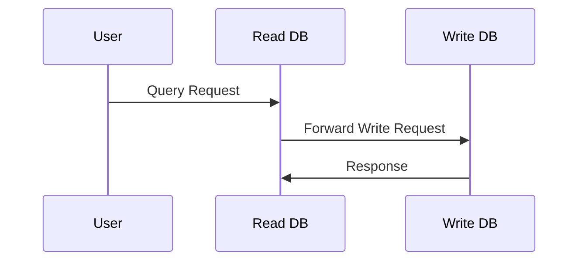
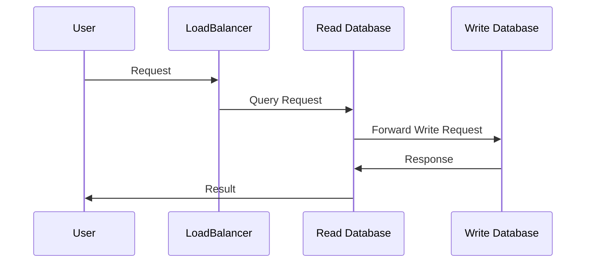
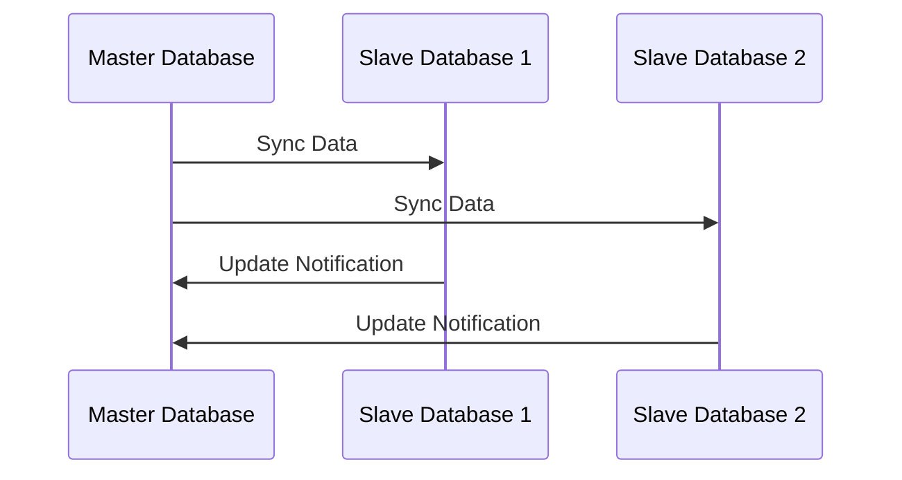
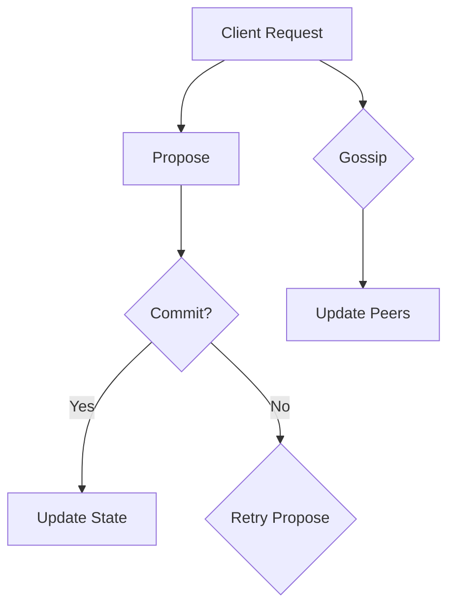
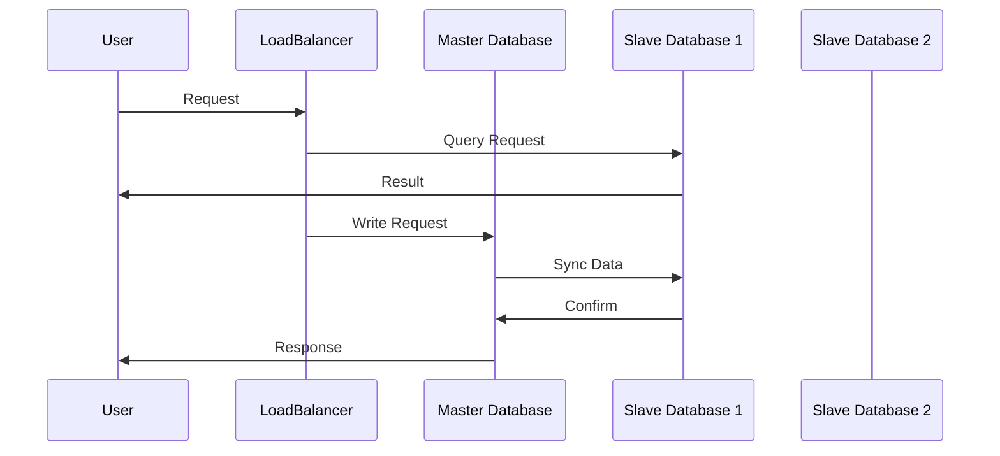

                 

### 引言

数据库读写分离技术是分布式数据库系统架构中的一项重要技术，旨在通过将数据库读写操作分离到不同的服务器或节点上，以提高系统的性能和可用性。随着互联网应用的快速发展，单体数据库已经难以满足高并发、大数据量的处理需求，读写分离技术因此成为提升系统性能的关键手段。

#### 1.1 问题背景与定义

在传统的单体数据库架构中，所有的读写操作都集中在一个数据库实例上。当系统面临大量用户请求时，数据库成为性能瓶颈。具体问题包括：

- **性能瓶颈**：读写操作集中在一个实例上，容易导致单点性能问题。
- **扩展性差**：扩容时只能通过垂直扩展（增加服务器配置）来实现，难以线性扩展。
- **高可用性挑战**：一旦数据库实例故障，整个系统将瘫痪。

读写分离技术通过将读操作和写操作分离到不同的服务器或节点上，解决上述问题。其基本概念包括：

- **读库与写库**：读库用于处理用户的查询请求，写库用于处理用户的写入请求。
- **主库与从库**：主库负责写入操作，从库负责读取操作，但并不限于单主多从架构。

#### 1.2 读写分离技术的重要性

读写分离技术的重要性体现在以下几个方面：

- **提高系统性能**：通过将读操作和写操作分离，可以充分利用多台服务器的计算资源，提高系统的并发处理能力。
- **增强系统稳定性**：读写分离可以实现数据的冗余备份，从而提高系统的容错能力。
- **支持线性扩展**：通过增加读库或写库节点，可以线性扩展系统性能，满足业务增长需求。

#### 1.3 读写分离的基本架构

读写分离的基本架构主要包括以下组件：

- **主库**：负责处理所有的写入操作。
- **从库**：负责处理所有的读取操作，可以并行处理多个查询请求。
- **负载均衡器**：用于将读请求分配到不同的从库上，实现负载均衡。

下面是一个简单的读写分离架构示意图：

在这幅图中，用户的读请求直接发送到读库，用户的写请求则由读库转发到写库。通过这种方式，读写操作得以分离，从而提高了系统的性能和稳定性。

### 背景介绍

在现代互联网应用中，数据库系统的性能和稳定性对于业务的成功至关重要。随着用户数量的激增和业务复杂性的增加，单体数据库逐渐暴露出以下问题：

- **性能瓶颈**：单体数据库架构下，读写操作集中在一个实例上，容易成为性能瓶颈。在高并发场景下，数据库的性能限制可能导致系统响应缓慢，影响用户体验。
- **扩展性差**：扩容时只能通过垂直扩展（增加服务器配置）来实现，这种方式的成本高且难以线性扩展，难以满足不断增长的业务需求。
- **高可用性挑战**：一旦数据库实例发生故障，整个系统可能无法访问，导致业务中断。单体数据库的高可用性设计复杂，实现成本高。

为了解决这些问题，读写分离技术应运而生。通过将读操作和写操作分离到不同的服务器或节点上，读写分离技术能够有效地提高系统的性能、扩展性和可用性。

#### 核心概念术语说明

- **读库**：处理读取请求的数据库实例，可以有一个或多个。
- **写库**：处理写入请求的数据库实例，通常只有一个。
- **主库**：负责处理写入操作的数据库实例，是写库的主节点。
- **从库**：负责处理读取操作的数据库实例，可以是主库的从节点，也可以是独立的从节点。

#### 问题背景

单体数据库架构在高并发场景下，性能瓶颈问题尤为突出。例如，一个电商网站在促销活动期间，可能会面临数百万用户的访问请求。如果所有的读写请求都集中在一个数据库实例上，数据库的性能可能无法承受，导致响应时间急剧增加，用户体验差。此外，单体数据库的扩展性差，扩容困难，难以满足业务快速增长的需求。

#### 问题描述

单体数据库在面临以下问题时表现不佳：

1. **性能瓶颈**：读写操作集中在一个实例上，容易成为性能瓶颈。
2. **扩展性差**：扩容时只能通过垂直扩展，成本高且难以线性扩展。
3. **高可用性挑战**：一旦数据库实例故障，系统可能无法访问，导致业务中断。

#### 问题解决

读写分离技术通过将读操作和写操作分离，可以有效解决上述问题：

1. **性能瓶颈**：通过将读操作和写操作分离到不同的服务器或节点上，可以充分利用多台服务器的计算资源，提高系统的并发处理能力。
2. **扩展性**：通过增加读库或写库节点，可以线性扩展系统性能，满足业务增长需求。
3. **高可用性**：读写分离可以实现数据的冗余备份，从而提高系统的容错能力。一旦某个数据库实例发生故障，其他实例可以继续提供服务，确保系统的高可用性。

#### 边界与外延

读写分离技术适用于高并发、大数据量的互联网应用。边界条件包括：

1. **高并发**：系统需要处理大量的读写请求。
2. **大数据量**：数据库存储的数据量较大。

在外延方面，读写分离技术不仅适用于关系数据库，也适用于NoSQL数据库。通过合理的设计和配置，读写分离技术可以在各种类型的数据库系统中发挥重要作用。

#### 概念结构与核心要素组成

读写分离技术的核心概念结构包括：

1. **读库与写库**：读库负责处理查询请求，写库负责处理写入请求。
2. **主库与从库**：主库是写库的主节点，从库是读库的从节点。
3. **负载均衡器**：用于将读请求分配到不同的从库上，实现负载均衡。

这些要素相互关联，共同构成一个高效、可扩展、高可用的数据库系统。

#### 核心概念与联系

在深入讨论读写分离技术之前，我们需要明确一些核心概念及其之间的关系。以下是几个关键术语及其定义：

1. **读写分离**：读写分离是一种数据库架构设计技术，通过将读操作和写操作分离到不同的数据库实例上，以提高系统性能和可用性。
2. **分库分表**：分库分表是将数据库拆分为多个独立的小数据库和小表，以应对大数据量和高并发访问需求。
3. **数据库分片**：数据库分片是将一个大型数据库拆分为多个较小的数据库，每个数据库负责存储数据的一部分。
4. **主从复制**：主从复制是一种数据复制技术，通过将主数据库的更改同步到从数据库，实现数据冗余和备份。
5. **负载均衡器**：负载均衡器用于将网络请求分配到多个服务器或节点，以实现流量分发和系统扩展。

下面是一个表格，对比了这些核心概念：

| 核心概念       | 定义                                                         | 关联关系                                                       |
|----------------|--------------------------------------------------------------|----------------------------------------------------------------|
| 读写分离       | 将读操作和写操作分离到不同数据库实例上                        | 依赖分库分表、数据库分片、主从复制和负载均衡器                 |
| 分库分表       | 将数据库拆分为多个独立的小数据库和小表                        | 用于处理大数据量和高并发访问                                 |
| 数据库分片     | 将大型数据库拆分为多个较小数据库                             | 提高数据存储和处理能力                                       |
| 主从复制       | 同步主数据库的更改到从数据库                                  | 提高数据可用性和系统容错性                                   |
| 负载均衡器     | 将网络请求分配到多个服务器或节点                             | 提高系统性能和可用性                                         |

通过这些核心概念及其定义的对比，我们可以更好地理解读写分离技术的本质和其在分布式数据库系统中的应用。

### 原理与架构设计

#### 2.1 读写分离的基本原理

读写分离技术的核心在于将数据库的读操作和写操作分离到不同的服务器或节点上，从而提高系统的性能和可用性。具体来说，读写分离的基本原理包括以下几个方面：

1. **读写分离的工作机制**：
   - **读分离**：用户的查询请求被路由到多个从库上，从库负责处理这些查询请求，并将结果返回给用户。
   - **写分离**：用户的写入请求被路由到主库上，主库负责处理这些写入请求。

2. **分布式数据库架构**：
   - 读写分离通常结合分布式数据库架构使用，分布式数据库架构将数据库拆分为多个较小规模的数据库实例，分布在不同的服务器或节点上。
   - 分布式数据库架构通过数据分片（Sharding）和主从复制（Replication）技术，实现数据的水平扩展和冗余备份。

下面是一个简单的读写分离架构示意图：

在这幅图中，用户的读请求被路由到负载均衡器，负载均衡器将请求分配到多个读库中，读库处理查询请求后将结果返回给用户。用户的写请求则直接发送到主库，主库处理写入请求后，结果会同步到从库中。

#### 2.2 数据库分片

数据库分片（Database Sharding）是将一个大数据库拆分为多个较小数据库的过程，每个数据库实例负责存储数据的一部分。分片技术可以有效地提高数据库系统的性能、扩展性和可用性。以下是数据库分片的相关概念和策略：

1. **分片的概念与原理**：
   - **分片键**：分片键是用于将数据分布到不同分片的键，通常是主键或其他唯一键。
   - **分片算法**：分片算法用于确定数据应存储在哪个分片上，常见的分片算法包括哈希分片、范围分片和列表分片。

2. **分片策略**：
   - **哈希分片**：使用哈希函数将数据分配到不同的分片上，具有均匀分布数据的特点。
   - **范围分片**：根据数据范围的划分将数据分配到不同的分片上，适用于时间序列数据。
   - **列表分片**：将数据按照预定义的列表分配到不同的分片上，适用于数据预分片场景。

3. **分片的优势与挑战**：
   - **优势**：通过将数据分散存储，分片技术可以减少单点性能瓶颈，提高系统的并发处理能力。
   - **挑战**：分片会增加系统的复杂度，需要处理跨分片查询、数据一致性和故障转移等问题。

#### 2.3 主从复制的配置与优化

主从复制（Master-Slave Replication）是一种数据复制技术，通过将主数据库的更改同步到从数据库，实现数据的冗余备份和负载均衡。以下是主从复制的相关概念、配置方法和性能优化策略：

1. **主从复制的概念**：
   - **主库**：负责处理所有的写入操作，并作为数据更新的源头。
   - **从库**：负责处理读取操作，并从主库同步数据变更。

2. **主从复制的配置**：
   - **同步复制**：数据更新在主库和从库之间同步进行，确保数据的一致性。
   - **异步复制**：数据更新在主库上执行，但延迟同步到从库，适用于对一致性要求不高的场景。

3. **性能优化策略**：
   - **延迟复制**：通过延迟复制减轻主库的负载，减少同步延迟。
   - **并行复制**：在多个从库上并行复制数据，提高复制速度。
   - **压缩与加密**：对复制的数据进行压缩和加密，减少网络带宽使用和保证数据安全性。

下面是一个简单的数据库分片和主从复制架构示意图：

在这幅图中，主库MasterDB处理所有写入请求，并将数据同步到从库SlaveDB1和SlaveDB2。从库处理读取请求，并在主库发生数据变更时接收更新通知。

### 核心概念与联系

在深入讨论数据库分片和主从复制的原理之前，我们需要明确一些核心概念及其之间的关系。以下是几个关键术语及其定义：

1. **数据库分片**：数据库分片是将一个大数据库拆分为多个较小数据库的过程，每个数据库实例负责存储数据的一部分。
2. **分片键**：分片键是用于将数据分布到不同分片的键，通常是主键或其他唯一键。
3. **分片算法**：分片算法用于确定数据应存储在哪个分片上，常见的分片算法包括哈希分片、范围分片和列表分片。
4. **主从复制**：主从复制是一种数据复制技术，通过将主数据库的更改同步到从数据库，实现数据的冗余备份和负载均衡。
5. **主库**：主库负责处理所有的写入操作，并作为数据更新的源头。
6. **从库**：从库负责处理读取操作，并从主库同步数据变更。

下面是一个表格，对比了这些核心概念：

| 核心概念       | 定义                                                         | 关联关系                                                       |
|----------------|--------------------------------------------------------------|----------------------------------------------------------------|
| 数据库分片     | 将大数据库拆分为多个较小数据库实例                          | 需要分片键和分片算法，用于数据分布和查询优化                     |
| 分片键         | 用于将数据分布到不同分片的键                               | 需要与分片算法配合，确保数据均匀分布                           |
| 分片算法       | 确定数据应存储在哪个分片上的算法                           | 影响数据分布的均匀性和查询性能                               |
| 主从复制       | 将主数据库的更改同步到从数据库                             | 提高数据可用性和系统容错性，需要处理数据一致性和延迟问题       |
| 主库           | 负责处理所有写入操作，作为数据更新的源头                     | 需要与从库保持数据一致性，支持故障转移和负载均衡                 |
| 从库           | 负责处理读取操作，从主库同步数据变更                         | 需要支持并行读取和负载均衡，提高系统性能                       |

通过这些核心概念及其定义的对比，我们可以更好地理解数据库分片和主从复制技术的本质和其在分布式数据库系统中的应用。

### 数据一致性策略

在分布式数据库系统中，数据一致性是一个至关重要的课题。由于数据分布在多个节点上，不同节点的操作可能存在先后顺序差异，导致数据一致性问题的发生。以下将介绍几种常见的数据一致性策略，包括一致性模型、冲突检测与解决机制以及数据一致性协议。

#### 3.1 数据一致性的模型

数据一致性模型描述了分布式系统中不同节点之间如何保持数据的一致性。以下是一些常见的一致性模型：

1. **强一致性（Strong Consistency）**：
   - 定义：在强一致性模型下，系统中的所有节点在同一时间看到相同的数据状态。
   - 特点：确保数据的最终一致性，但可能会降低系统的可用性和扩展性。
   - 适用场景：对数据一致性要求非常高的系统，如金融交易系统。

2. **最终一致性（ eventual consistency）**：
   - 定义：在最终一致性模型下，系统中的所有节点可能在某个时间点看到不一致的数据，但最终会达到一致性状态。
   - 特点：允许一定的数据延迟，提高系统的可用性和扩展性。
   - 适用场景：对数据一致性要求不是非常严格的系统，如社交媒体平台。

3. **部分一致性（Partial Consistency）**：
   - 定义：在部分一致性模型下，系统中的部分节点可能看到不同步的数据状态。
   - 特点：通常用于高性能和可扩展性要求较高的场景。
   - 适用场景：对数据一致性的要求较低，如实时搜索引擎。

4. **线性一致性（Linear Consistency）**：
   - 定义：在线性一致性模型下，系统中的操作顺序保持一致，就像在一个顺序执行的数据库中一样。
   - 特点：确保操作顺序的一致性，但不保证全局数据的一致性。
   - 适用场景：对操作顺序一致性要求较高的系统，如分布式事务处理。

#### 3.2 冲突检测与解决

在分布式数据库系统中，由于网络延迟和并发操作的存在，数据冲突是不可避免的。以下介绍几种常见的冲突检测与解决机制：

1. **版本向量（Version Vector）**：
   - 原理：每个节点维护一个版本向量，包含所有已知的操作版本。
   - 冲突解决：在更新操作时，通过比较版本向量，确定哪个版本更优先。

2. **乐观锁（Optimistic Locking）**：
   - 原理：在执行操作前，不检查数据的一致性，而是在操作完成后检查是否存在冲突。
   - 冲突解决：如果检测到冲突，回滚操作并重新尝试。

3. **悲观锁（Pessimistic Locking）**：
   - 原理：在执行操作前，先检查数据的一致性，确保不会与其他操作冲突。
   - 冲突解决：通过锁机制防止并发操作。

4. **向量时钟（Vector Clock）**：
   - 原理：每个节点维护一个向量时钟，记录与其他节点的相对操作顺序。
   - 冲突解决：通过比较向量时钟，确定操作顺序和冲突。

#### 3.3 数据一致性协议

数据一致性协议是一组规则和算法，用于确保分布式系统中数据的一致性。以下介绍两种常见的数据一致性协议：

1. **Paxos协议**：
   - 原理：Paxos协议是一种基于多数派原则的分布式一致性算法，确保一个分布式系统在多个副本中达成一致状态。
   - 特点：容错性强，支持大规模分布式系统。

2. **Raft协议**：
   - 原理：Raft协议是一种基于日志复制机制的分布式一致性算法，通过领导者（Leader）节点实现一致性。
   - 特点：易于理解，高效，支持故障转移和快速恢复。

下面是一个简单的Paxos协议的mermaid流程图：

在这幅图中，客户请求（Client Request）发送给提议者（Proposer），提议者将请求发送给其他副本（Acceptor），并通过多数派原则达成一致。如果请求被接受，则更新状态（Update State），否则重试提议。

通过了解这些数据一致性策略、冲突检测与解决机制以及数据一致性协议，我们可以更好地设计和实现一个稳定、高性能的分布式数据库系统。

### 高可用性与容错性设计

高可用性和容错性是分布式数据库系统设计中的重要考量因素。在分布式环境中，单点故障和系统故障是常见的挑战，因此，设计一个具备高可用性和容错性的数据库系统至关重要。以下将讨论高可用性设计原则、容错性技术以及具体的实现方法。

#### 4.1 高可用性设计原则

高可用性设计的目标是确保系统在故障情况下能够快速恢复，从而减少业务中断时间。以下是一些关键的高可用性设计原则：

1. **冗余备份**：通过在多个节点上备份数据和日志，确保在节点故障时能够快速恢复。
2. **故障转移**：在主库发生故障时，能够快速切换到从库，继续提供服务。
3. **负载均衡**：通过负载均衡器，将请求均匀分配到各个节点，避免单点过载。
4. **自动化监控与恢复**：利用自动化监控工具和恢复机制，及时发现故障并自动恢复。

#### 4.2 容错性技术

容错性技术旨在提高系统的健壮性，确保在部分节点故障时，系统能够继续正常运行。以下是一些常见的容错性技术：

1. **选举算法**：用于在分布式系统中选择新的领导者（如Raft协议中的领导者选举），确保系统在主节点故障时能够快速恢复。
2. **数据复制**：通过在多个节点上复制数据和日志，确保系统在节点故障时能够继续提供服务。
3. **去同步**：在部分节点故障时，其他节点继续处理请求，避免整个系统瘫痪。
4. **数据校验与恢复**：定期进行数据校验，检测并修复数据不一致问题，确保系统数据的完整性。

#### 4.3 实现方法

以下是一些实现高可用性和容错性的具体方法：

1. **主从复制**：在主库和多个从库之间建立主从复制关系，确保在主库故障时，从库能够自动切换为主库。
   - **配置方法**：设置从库为只读模式，确保数据一致性。
   - **优化策略**：定期同步主库和从库的数据，减少数据延迟。

2. **负载均衡**：使用负载均衡器，将请求均匀分配到各个节点，避免单点过载。
   - **配置方法**：配置负载均衡器，设置健康检查和流量分配策略。
   - **优化策略**：动态调整负载均衡策略，根据节点负载情况分配流量。

3. **故障转移与选举算法**：在分布式系统中实现故障转移和领导者选举机制，确保系统能够在主节点故障时快速恢复。
   - **配置方法**：配置Raft或Paxos协议，实现故障转移和领导者选举。
   - **优化策略**：定期进行领导者选举，确保系统稳定性。

4. **自动化监控与恢复**：利用监控工具，实时监测系统状态，自动发现并恢复故障。
   - **配置方法**：配置监控系统，设置告警规则和自动恢复策略。
   - **优化策略**：结合日志分析，优化监控和恢复策略。

通过以上高可用性和容错性设计原则、技术以及实现方法，我们可以构建一个稳定、高性能的分布式数据库系统，确保业务连续性和数据可靠性。

### 监控与维护

在分布式数据库系统中，监控与维护是确保系统稳定性和性能的关键环节。通过有效的监控工具和实践，可以及时发现并解决潜在问题，优化系统性能。以下将介绍监控工具、维护实践和最佳策略。

#### 5.1 监控工具

监控分布式数据库系统需要使用多种工具，以下是一些常用的监控工具：

1. **Prometheus**：一款开源监控解决方案，支持多维数据收集、存储和查询，适用于监控分布式系统。
   - **特点**：高度可扩展，支持多种数据源和告警机制。

2. **Grafana**：一款开源的监控仪表板工具，可以与Prometheus等数据源集成，提供直观的监控视图。
   - **特点**：支持自定义仪表板，易于配置和操作。

3. **Zabbix**：一款开源监控解决方案，支持多种监控协议和告警机制，适用于大规模分布式系统。
   - **特点**：支持实时监控和可视化报表，易于集成和扩展。

4. **DataDog**：一款商业监控工具，提供全面的监控、日志分析和性能优化功能。
   - **特点**：自动发现和监控应用组件，支持多语言集成。

#### 5.2 维护实践

维护分布式数据库系统包括日常操作、故障排查和性能调优等方面。以下是一些常见的维护实践：

1. **日常操作**：
   - **备份与恢复**：定期进行数据备份，确保在故障发生时能够快速恢复。
   - **日志管理**：定期清理日志文件，防止日志过多占用磁盘空间。
   - **安全更新**：及时更新系统软件和数据库版本，修补已知漏洞。

2. **故障排查**：
   - **日志分析**：通过分析日志，定位故障原因和异常行为。
   - **性能监控**：监控系统性能指标，如CPU、内存、磁盘使用情况，识别性能瓶颈。
   - **故障演练**：定期进行故障演练，测试系统在故障情况下的恢复能力。

3. **性能调优**：
   - **索引优化**：根据查询需求，合理配置索引，提高查询效率。
   - **查询优化**：优化SQL查询语句，减少查询时间和资源消耗。
   - **分区管理**：定期对分区表进行维护和优化，确保分区策略的有效性。

#### 5.3 最佳策略

为了确保分布式数据库系统的稳定性和性能，以下是一些最佳策略：

1. **自动化监控与告警**：使用自动化工具，实时监控系统状态，并根据阈值设置自动告警，及时响应异常情况。
2. **定期评估与优化**：定期对系统进行性能评估和优化，根据业务需求和系统负载调整配置和策略。
3. **备份与恢复演练**：定期进行备份和恢复演练，确保在故障发生时能够快速恢复业务。
4. **安全性与合规性**：确保系统符合安全性和合规性要求，定期进行安全审计和漏洞扫描。
5. **文档与知识库**：建立完善的文档和知识库，记录系统配置、操作流程和故障处理方法，提高运维效率和问题解决能力。

通过以上监控工具、维护实践和最佳策略，可以有效地确保分布式数据库系统的稳定性和性能，为业务的持续发展提供可靠保障。

### 案例研究

#### 6.1 案例一：电商系统的数据库读写分离实践

在电子商务领域，数据库读写分离技术被广泛应用于应对高并发、大数据量的业务需求。以下是一个关于电商系统数据库读写分离的实践案例，包括需求分析、架构设计与实现、遇到的问题与解决方案。

##### 6.1.1 需求分析

某大型电商平台，在日常运营中需要处理数百万用户的访问请求，包括商品浏览、购物车操作、订单生成等。随着业务的快速发展，系统面临以下需求：

1. **提高查询性能**：商品浏览和订单查询等读操作频繁，需要高效处理大量并发请求。
2. **保障数据一致性**：订单生成等写操作需要确保数据的一致性和可靠性。
3. **支持系统扩展**：随着业务增长，需要能够灵活扩展数据库性能。

##### 6.1.2 架构设计与实现

针对上述需求，电商系统的数据库架构采用读写分离设计，包括以下组件：

1. **主库**：负责处理所有的写入操作，确保数据的一致性和可靠性。
2. **从库**：负责处理所有的读取操作，实现查询性能的提升。
3. **负载均衡器**：将读请求分配到不同的从库上，实现负载均衡。

架构设计如下：

在该架构中，用户的读请求通过负载均衡器分配到从库，从库处理查询并将结果返回给用户。用户的写请求直接发送到主库，主库处理写入操作后，将数据同步到从库，确保数据一致性。

##### 6.1.3 遇到的问题与解决方案

在实现数据库读写分离过程中，遇到以下问题及解决方案：

1. **数据一致性**：在读写分离架构中，如何确保主库和从库的数据一致性是一个关键问题。
   - **解决方案**：采用两阶段提交（2PC）协议，确保在主库和从库之间的事务一致性。

2. **负载均衡**：如何合理分配读请求到不同的从库，避免单个从库过载。
   - **解决方案**：采用基于请求特征的负载均衡策略，如按用户ID或订单ID分配请求，确保请求均匀分布。

3. **故障转移**：在主库发生故障时，如何快速切换到从库。
   - **解决方案**：采用主从复制和故障转移机制，确保在主库故障时，从库能够自动切换为主库，继续提供服务。

通过以上架构设计和解决方案，电商平台实现了高效的数据库读写分离，提高了系统的性能和可用性，为业务的持续发展提供了有力支持。

#### 6.2 案例二：社交媒体平台的数据库读写分离策略

社交媒体平台通常需要处理海量用户的高并发访问和大数据量存储。以下是一个关于社交媒体平台数据库读写分离策略的案例，包括需求分析、架构设计与实现、遇到的问题与解决方案。

##### 6.2.1 需求分析

某社交媒体平台，用户量超过亿级，每天产生大量社交互动数据。平台需要处理以下需求：

1. **提高查询性能**：用户的动态浏览、消息查询等读操作频繁，需要高效处理大量并发请求。
2. **保障数据一致性**：用户的互动操作如点赞、评论等写操作需要确保数据的一致性和可靠性。
3. **支持系统扩展**：随着用户量的增长，需要能够灵活扩展数据库性能。

##### 6.2.2 架构设计与实现

针对上述需求，社交媒体平台的数据库架构采用读写分离设计，包括以下组件：

1. **主库**：负责处理所有的写入操作，确保数据的一致性和可靠性。
2. **从库**：负责处理所有的读取操作，实现查询性能的提升。
3. **负载均衡器**：将读请求分配到不同的从库上，实现负载均衡。

架构设计如下：

在该架构中，用户的读请求通过负载均衡器分配到从库，从库处理查询并将结果返回给用户。用户的写请求直接发送到主库，主库处理写入操作后，将数据同步到从库，确保数据一致性。

##### 6.2.3 遇到的问题与解决方案

在实现数据库读写分离过程中，社交媒体平台遇到以下问题及解决方案：

1. **数据一致性**：在读写分离架构中，如何确保主库和从库的数据一致性是一个关键问题。
   - **解决方案**：采用最终一致性模型，允许一定的数据延迟，确保最终一致。

2. **负载均衡**：如何合理分配读请求到不同的从库，避免单个从库过载。
   - **解决方案**：采用基于用户ID或地理位置的负载均衡策略，确保请求均匀分布。

3. **故障转移**：在主库发生故障时，如何快速切换到从库。
   - **解决方案**：采用主从复制和故障转移机制，确保在主库故障时，从库能够自动切换为主库，继续提供服务。

通过以上架构设计和解决方案，社交媒体平台实现了高效的数据库读写分离，提高了系统的性能和可用性，为用户的持续互动提供了可靠保障。

### 结论与展望

在本文中，我们详细探讨了数据库读写分离技术的核心概念、原理、架构设计以及实现方法。通过分析电子商务平台和社交媒体平台的应用案例，我们看到了读写分离技术在应对高并发、大数据量场景中的重要作用。

#### 主要结论

1. **性能提升**：通过读写分离，系统能够将读操作和写操作分离到不同的服务器或节点上，有效提升系统的并发处理能力。
2. **数据一致性**：合理的设计和策略可以确保读写分离架构下的数据一致性，满足不同业务场景的需求。
3. **扩展性**：读写分离支持系统的线性扩展，为业务增长提供了灵活性。

#### 未来发展方向

1. **自动化与智能化**：随着人工智能技术的发展，未来数据库读写分离架构可能会更加智能化，自动调整负载均衡和故障转移策略。
2. **多模型数据库支持**：随着多模型数据库的流行，读写分离技术需要适应不同数据存储模型，如关系数据库、NoSQL数据库等。
3. **数据一致性新协议**：新的一致性协议和技术（如分布式事务处理、分布式锁机制等）的引入，将进一步提高读写分离架构的性能和可靠性。

总之，数据库读写分离技术是现代分布式数据库系统架构中的关键组件，对于提升系统性能、扩展性和可用性具有重要意义。随着技术的不断进步，读写分离技术将在未来的数据库领域发挥更加重要的作用。

### 最佳实践、小结与注意事项

在实践数据库读写分离技术时，以下是一些最佳实践、小结和注意事项：

#### 最佳实践

1. **合理选择分片键**：分片键的选择直接影响数据的分布和查询性能，应选择能够均匀分布数据的键，如用户ID或时间戳。
2. **配置适当的负载均衡策略**：根据业务需求和系统负载，合理配置负载均衡策略，确保请求均匀分配到各个节点。
3. **确保数据一致性**：采用合适的数据一致性模型和策略，如最终一致性模型和分布式事务处理，确保系统在不同节点之间的数据一致性。
4. **监控与告警**：实时监控系统性能指标，配置告警机制，及时响应异常情况，确保系统稳定运行。

#### 小结

1. **数据库读写分离能够提高系统的性能、扩展性和可用性**，通过分离读操作和写操作，充分利用多台服务器的计算资源。
2. **合理设计分片策略和负载均衡策略**，确保数据的高效分布和查询性能。
3. **数据一致性是读写分离架构中的关键**，采用合适的一致性模型和策略，确保系统在不同节点之间的数据一致性。
4. **高可用性和容错性设计**，通过冗余备份、故障转移等技术，确保系统在故障情况下能够快速恢复。

#### 注意事项

1. **分片键的选择**：避免使用频繁变动的键作为分片键，如订单号，以免影响查询性能和数据一致性。
2. **负载均衡器的选择**：选择合适的负载均衡器，支持健康检查和动态调整策略，确保请求的合理分配。
3. **数据一致性模型的选择**：根据业务需求和一致性要求，选择合适的一致性模型，避免过度追求一致性带来的性能损耗。
4. **监控与告警**：实时监控系统性能，配置告警规则，及时发现和解决潜在问题。

通过遵循这些最佳实践、小结和注意事项，可以更好地实现数据库读写分离技术的应用，提升系统的性能和稳定性。

### 拓展阅读

对于希望深入了解数据库读写分离技术的读者，以下是一些建议的拓展阅读资料：

1. **论文阅读**：
   - "CAP Theorem: What It Is and What It Isn't" by Eric Brewer，深入探讨分布式系统的一致性、可用性和分区容忍性。
   - "Consistency in a Distributed System" by Seth Gilbert and Nancy Lynch，探讨分布式系统中的数据一致性模型和算法。

2. **技术书籍**：
   - 《分布式系统原理与范型》由John L. Hennessy和David A. Patterson著，涵盖分布式系统的基本原理和设计范式。
   - 《分布式数据库系统》由Philip A. Bernstein、Vijay Narayanan和William Wang著，详细介绍分布式数据库系统的架构和实现技术。

3. **开源项目**：
   - **Cassandra**：一款开源分布式NoSQL数据库，提供高可用性和容错性的读写分离架构。
   - **MongoDB**：一款开源分布式文档数据库，支持分片和复制，实现高效的读写分离。
   - **TiDB**：一款开源分布式关系数据库，基于PD和TiKV实现自动分片和故障转移。

通过阅读这些资料，可以进一步了解分布式数据库系统的原理、架构和最佳实践，为实际应用提供指导。

