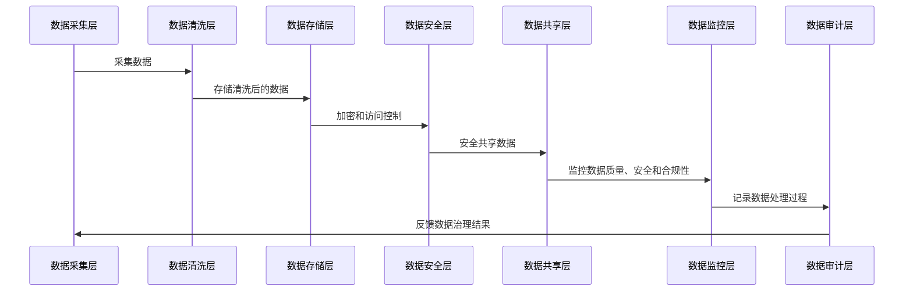
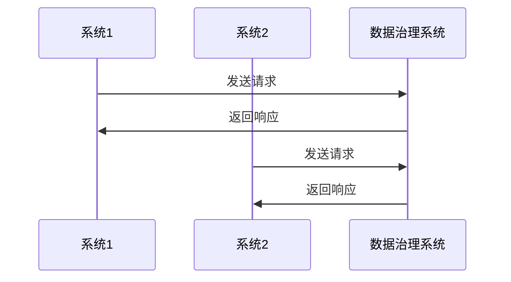

                 

### 第一部分：背景介绍

#### 1. 数据治理的概念与意义

**数据治理**（Data Governance）是指通过一系列的规范、流程和技术手段，对企业的数据进行系统化、规范化的管理和控制。它不仅仅是对数据进行简单的存储和保护，更是涉及到数据的质量、完整性、可用性、一致性和安全性等多个方面。随着大数据和云计算的快速发展，数据已经成为企业的核心资产，如何有效管理和利用这些数据，已经成为企业竞争力的关键。

在信息化和数据爆炸的时代，数据治理的意义愈发凸显。具体来说，数据治理的重要性体现在以下几个方面：

- **提升数据质量**：通过数据治理，可以确保数据的准确性、完整性、一致性和及时性，从而提高数据的价值，支持更精准的决策。

- **增强数据安全**：数据治理有助于防止数据泄露、滥用和丢失，保护企业和客户的信息安全。

- **满足合规要求**：随着各类法律法规的不断完善，如《通用数据保护条例》（GDPR）和《加州消费者隐私法案》（CCPA）等，数据治理有助于企业合规运营，降低法律风险。

- **优化业务流程**：通过数据治理，可以优化业务流程，提高工作效率，降低运营成本。

- **支持决策制定**：高质量的数据能够为管理层提供更全面、准确的决策支持，有助于企业更好地应对市场变化。

#### 2. 数据治理的重要性

数据治理的重要性可以从以下几个方面进行详细阐述：

- **数据质量**：数据质量是数据治理的核心，高数据质量能够为企业带来如下好处：

  - **决策准确性**：高质量的数据能够提高决策的准确性，避免因数据错误导致的决策失误。

  - **运营效率**：准确的数据可以减少重复工作，提高业务流程的效率。

  - **客户满意度**：高质量的数据可以提供更好的客户服务，提升客户满意度。

- **数据安全**：数据安全是数据治理的重要方面，尤其是在数据泄露事件频发的今天，确保数据安全变得尤为重要：

  - **防止数据泄露**：通过数据治理，可以采取多种措施防止数据泄露，如加密、访问控制等。

  - **数据备份与恢复**：数据治理包括数据备份与恢复机制，确保数据在发生故障或灾难时能够快速恢复。

  - **数据隐私保护**：数据治理需要考虑数据隐私保护，遵守相关法律法规，确保个人数据的隐私不被侵犯。

- **合规要求**：随着数据保护法律法规的不断完善，企业需要确保数据处理符合法律法规的要求，如GDPR、CCPA等：

  - **合规性审查**：数据治理包括合规性审查，确保数据处理符合法律法规的要求。

  - **合规培训**：数据治理需要定期进行合规培训，提高员工对法律法规的认识和遵守。

- **业务流程优化**：通过数据治理，可以优化业务流程，提高工作效率和运营效率：

  - **流程自动化**：通过数据治理，可以实现业务流程的自动化，减少人工干预。

  - **流程标准化**：数据治理有助于制定标准化的业务流程，提高业务流程的一致性和可重复性。

- **决策支持**：高质量的数据能够为管理层提供更全面、准确的决策支持：

  - **数据分析**：通过数据治理，可以确保数据分析的准确性和可靠性，为决策提供数据支持。

  - **数据可视化**：数据治理可以将复杂的数据转化为易于理解的可视化图表，帮助管理层快速做出决策。

#### 3. 数据治理的挑战

尽管数据治理的重要性不言而喻，但企业在实施数据治理过程中仍面临诸多挑战：

- **数据多样性**：企业拥有各种类型的数据，包括结构化数据、非结构化数据和半结构化数据，处理这些数据需要不同的技术和策略。

- **数据质量**：数据质量问题普遍存在，包括缺失、重复、错误等，需要通过数据清洗和治理来提高数据质量。

- **数据安全**：随着数据泄露事件频发，如何保护数据安全成为数据治理的重要课题。

- **合规性**：遵守各类法律法规要求，如GDPR、CCPA等，对企业提出了更高的合规性要求。

- **技术更新**：数据治理技术不断更新，企业需要持续学习和适应新技术。

### 第二部分：核心概念与联系

#### 1. 数据治理框架

**数据治理框架**（Data Governance Framework）是指一套标准和流程，用于指导数据治理的实施和管理。以下是一个常见的数据治理框架的组成部分：

- **数据治理策略**：定义数据治理的目标、原则和范围。

- **数据治理组织**：明确数据治理的角色和职责，建立有效的数据治理组织结构。

- **数据治理流程**：制定数据治理的流程，包括数据采集、存储、处理、共享和使用等环节。

- **数据治理工具**：选择合适的数据治理工具，如数据质量工具、数据安全工具、元数据管理工具等。

#### 2. 数据治理的核心概念

数据治理的核心概念包括数据质量、数据安全、数据合规性、数据分类和数据生命周期管理。以下是这些核心概念的定义和属性特征：

- **数据质量**：数据质量是指数据的准确性、完整性、一致性、及时性和可靠性。数据质量属性特征包括：

  - **准确性**：数据是否真实反映了客观事实。

  - **完整性**：数据是否包含了所需的所有信息。

  - **一致性**：数据在不同系统之间是否保持一致。

  - **及时性**：数据是否在需要时可用。

  - **可靠性**：数据是否可靠，能够支持业务决策。

- **数据安全**：数据安全是指保护数据免受未授权访问、泄露、滥用和丢失的风险。数据安全属性特征包括：

  - **保密性**：保护数据不被未授权的人员访问。

  - **完整性**：确保数据未被未经授权的修改。

  - **可用性**：确保数据在需要时能够被授权人员访问。

  - **抗抵赖性**：确保数据的发送者和接收者无法否认自己的行为。

- **数据合规性**：数据合规性是指数据处理是否符合相关法律法规的要求。数据合规性属性特征包括：

  - **法律遵从性**：数据处理符合相关法律法规的要求。

  - **隐私保护**：保护个人数据的隐私。

  - **数据可追溯性**：确保数据处理过程的可追溯性。

- **数据分类**：数据分类是根据数据的重要性和敏感性对数据进行分类，以便采取不同的治理策略。数据分类属性特征包括：

  - **敏感度**：数据的敏感程度。

  - **重要性**：数据对企业业务的重要程度。

  - **用途**：数据的使用目的。

  - **生命周期**：数据的使用周期。

- **数据生命周期管理**：数据生命周期管理是指管理数据的整个生命周期，从创建、存储、使用到归档和销毁。数据生命周期管理属性特征包括：

  - **创建**：数据的生成过程。

  - **存储**：数据的存储方式。

  - **使用**：数据的使用过程。

  - **归档**：数据的归档过程。

  - **销毁**：数据的销毁过程。

#### 3. 数据治理与相关概念的联系

数据治理与数据管理、数据架构、信息安全、数据隐私等概念密切相关，以下是它们之间的联系：

- **数据治理与数据管理**：数据治理是数据管理的一部分，但更侧重于策略、流程和组织的建设。数据管理包括数据治理，但不仅仅限于数据治理。

- **数据治理与数据架构**：数据治理确保数据架构的有效性和一致性，数据架构为数据治理提供了技术支持。数据治理需要与数据架构紧密结合，确保数据架构能够支持数据治理的要求。

- **数据治理与信息安全**：数据治理是信息安全的基础，通过数据治理可以降低信息安全的隐患。信息安全是数据治理的重要保障，数据治理需要考虑信息安全的要求。

- **数据治理与数据隐私**：数据治理需要考虑数据隐私保护，确保数据处理符合隐私保护的要求。数据隐私保护是数据治理的重要方面，数据治理需要建立完善的隐私保护机制。

### 第三部分：数据治理体系建设

#### 1. 数据治理体系概述

**数据治理体系** 是指一套全面的、系统化的数据治理策略、流程和技术，用于指导数据治理的实施和管理。数据治理体系包括以下组成部分：

- **数据治理策略**：定义数据治理的目标、原则和范围。

- **数据治理组织**：建立数据治理组织，明确数据治理的角色和职责。

- **数据治理流程**：制定数据治理流程，包括数据采集、存储、处理、共享和使用等环节。

- **数据治理工具**：选择合适的数据治理工具，如数据质量工具、数据安全工具、元数据管理工具等。

- **数据治理文化**：建立数据治理的文化，提高员工的数据治理意识和能力。

#### 2. 数据治理体系的设计与实施

数据治理体系的设计与实施是一个系统化的过程，需要遵循以下步骤：

- **需求分析**：了解企业的业务需求，明确数据治理的目标和需求。

- **框架设计**：根据需求分析，设计适合企业的数据治理框架，包括数据治理策略、组织结构、流程和工具。

- **组织调整**：根据数据治理框架的要求，调整企业的组织结构，明确数据治理的角色和职责。

- **流程优化**：制定数据治理流程，优化业务流程，确保数据治理的流程化和标准化。

- **工具选型**：选择合适的数据治理工具，确保工具能够支持数据治理的需求。

- **培训与推广**：对员工进行数据治理的培训，提高员工的数据治理意识和能力。

- **实施与监控**：逐步实施数据治理体系，并对其进行监控和评估，确保数据治理体系的有效运行。

#### 3. 数据治理体系的建设策略

为了成功建设数据治理体系，企业可以采取以下策略：

- **领导力与支持**：高层领导的支持是数据治理体系成功实施的关键，需要建立数据治理委员会或领导小组，确保数据治理工作的顺利进行。

- **跨部门合作**：数据治理涉及企业的多个部门和业务领域，需要各部门之间的紧密合作和协同工作。

- **持续改进**：数据治理体系不是一次性的建设，而是一个持续改进的过程。需要定期评估和优化数据治理体系，确保其适应企业的发展和变化。

- **技术支持**：数据治理需要技术的支持，企业需要选择合适的数据治理工具和平台，确保数据治理的效率和质量。

- **文化建设**：建立数据治理的文化，提高员工的数据治理意识和能力，营造良好的数据治理氛围。

#### 4. 数据治理体系的评估与改进

数据治理体系的评估与改进是确保其有效性的关键。以下是一些评估与改进的方法：

- **定期评估**：定期对数据治理体系进行评估，了解其实施效果和存在的问题。

- **反馈机制**：建立反馈机制，收集员工的意见和建议，及时改进数据治理体系。

- **改进计划**：根据评估结果和反馈意见，制定改进计划，优化数据治理流程和工具。

- **持续监控**：对数据治理体系进行持续监控，确保其有效运行。

- **培训与辅导**：对员工进行培训与辅导，提高其数据治理的能力和意识。

### 第四部分：最佳实践与案例分析

#### 1. 数据治理最佳实践

为了有效地实施数据治理，企业可以借鉴以下最佳实践：

- **制定明确的数据治理策略**：明确数据治理的目标、原则和范围，确保数据治理的明确性和方向性。

- **建立数据治理组织**：建立数据治理组织，明确数据治理的角色和职责，确保数据治理的组织实施。

- **制定数据治理流程**：制定数据治理流程，确保数据治理的标准化和规范化。

- **选择合适的数据治理工具**：选择合适的数据治理工具，提高数据治理的效率和效果。

- **培养数据治理文化**：培养数据治理的文化，提高员工的数据治理意识和能力。

- **持续改进与优化**：数据治理是一个持续改进的过程，需要定期评估和优化，确保其适应企业的发展和变化。

#### 2. 数据治理案例分析

以下是一个数据治理的成功案例：

**企业背景**：某大型零售企业拥有大量的销售数据、客户数据和供应链数据，数据种类繁多，且数据质量参差不齐。

**问题**：企业面临以下问题：

- **数据质量差**：数据存在缺失、重复和错误，导致数据分析结果不准确。

- **数据安全风险**：数据泄露风险高，存在潜在的数据安全隐患。

- **合规性挑战**：企业需要遵守各类法律法规，如GDPR和CCPA等，但数据处理过程存在合规性风险。

**解决方案**：

- **制定数据治理策略**：明确数据治理的目标和原则，确保数据治理的方向性。

- **建立数据治理组织**：成立数据治理委员会，明确数据治理的角色和职责。

- **优化数据治理流程**：制定数据采集、存储、处理、共享和使用的流程，确保流程的标准化和规范化。

- **选择合适的数据治理工具**：引入数据质量工具、数据安全工具和元数据管理工具，提高数据治理的效率和效果。

- **培养数据治理文化**：对员工进行数据治理培训，提高其数据治理意识和能力。

**效果**：

- **数据质量提升**：通过数据治理，数据质量得到了显著提升，数据准确性、完整性和一致性得到了保障。

- **数据安全增强**：通过数据治理，数据泄露风险得到了有效控制，数据安全得到了保障。

- **合规性提高**：通过数据治理，数据处理过程符合法律法规的要求，合规性风险得到了降低。

- **业务流程优化**：通过数据治理，业务流程得到了优化，工作效率得到了提高。

### 第五部分：未来发展趋势与展望

#### 1. 数据治理的发展趋势

随着技术的不断进步和数据量的持续增长，数据治理将呈现以下发展趋势：

- **自动化与智能化**：数据治理将越来越多地采用自动化和智能化技术，如机器学习、人工智能等，提高数据治理的效率和质量。

- **数据治理平台化**：数据治理将向平台化发展，企业将构建统一的数据治理平台，实现数据治理的集中管理和协同工作。

- **数据隐私保护**：随着数据隐私保护意识的提高，数据治理将更加注重数据隐私保护，采取多种技术手段确保个人数据的隐私安全。

- **合规性要求提升**：随着法律法规的不断完善，数据治理的合规性要求将不断提高，企业需要确保数据处理符合法律法规的要求。

- **跨行业合作**：数据治理将逐渐突破行业界限，实现跨行业的数据治理合作，共享数据治理的经验和最佳实践。

#### 2. 数据治理的挑战与机遇

尽管数据治理面临诸多挑战，但也存在巨大的机遇：

- **挑战**：

  - **数据多样性和复杂性**：随着数据类型的多样化和复杂性增加，数据治理面临更大的挑战。

  - **数据质量提升难度**：数据质量问题普遍存在，提升数据质量需要大量的时间和资源。

  - **合规性要求提高**：随着法律法规的不断完善，企业需要应对更高的合规性要求。

  - **技术更新换代**：数据治理技术不断更新，企业需要持续学习和适应新技术。

- **机遇**：

  - **数据价值的挖掘**：通过数据治理，企业可以更好地挖掘数据的价值，支持业务决策和创新。

  - **提升竞争力**：有效的数据治理有助于企业提升竞争力，提高运营效率和市场响应速度。

  - **降低风险**：数据治理有助于降低数据安全风险和合规性风险，确保企业的稳健运营。

### 第六部分：小结与未来展望

#### 1. 小结

本文从背景介绍、核心概念与联系、数据治理体系建设、最佳实践与案例分析以及未来发展趋势与展望等方面，详细阐述了数据治理的重要性、挑战和解决方案。通过本文的阅读，读者可以全面了解数据治理的基本概念、框架和实施策略，掌握数据治理的最佳实践，并为未来的数据治理工作提供有益的参考。

#### 2. 未来展望

随着大数据、云计算、人工智能等技术的不断发展，数据治理将在未来扮演更加重要的角色。企业需要持续关注数据治理的最新动态，不断提升数据治理的能力和水平，以应对数据治理面临的挑战和机遇。同时，数据治理也将成为企业核心竞争力的一部分，有助于企业在激烈的市场竞争中脱颖而出。

### 第七部分：拓展阅读

为了更深入地了解数据治理，读者可以参考以下相关资料：

- **《数据治理实践指南》**：详细介绍数据治理的策略、流程和技术，帮助企业实施数据治理。

- **《大数据治理》**：探讨大数据环境下数据治理的挑战和解决方案，为企业提供大数据治理的实践指导。

- **《数据治理与信息安全》**：分析数据治理与信息安全的关系，介绍数据治理在信息安全中的重要作用。

- **《数据治理案例分析》**：通过具体的案例分析，展示数据治理在企业中的实际应用和效果。

### 作者信息

作者：AI天才研究院/AI Genius Institute & 禅与计算机程序设计艺术 /Zen And The Art of Computer Programming

本文由AI天才研究院（AI Genius Institute）和禅与计算机程序设计艺术（Zen And The Art of Computer Programming）联合撰写，旨在为广大读者提供有深度、有见解、有价值的数据治理知识。AI天才研究院致力于推动人工智能技术的发展和应用，禅与计算机程序设计艺术则通过禅宗哲学与计算机科学的结合，探索更高效、更深入的编程方法。希望本文能够对您的数据治理工作提供有价值的参考和启示。

----------------------------------------------------------------

### 文章关键词

- 数据治理
- 数据质量
- 数据安全
- 数据合规性
- 数据生命周期管理

### 文章摘要

本文详细阐述了数据治理的概念、重要性、挑战、核心概念与联系、体系建设以及最佳实践。通过分析数据治理的关键要素，如数据质量、数据安全、数据合规性等，本文揭示了数据治理在企业运营和决策中的关键作用。同时，本文还介绍了数据治理体系的设计与实施策略，以及成功案例和未来发展趋势，为读者提供了全面的数据治理知识体系和实践指导。希望通过本文的阅读，读者能够更好地理解数据治理的重要性，掌握数据治理的核心方法和最佳实践。

----------------------------------------------------------------

## 数据治理体系建设

数据治理体系建设是确保企业数据资产得到有效管理和利用的关键步骤。一个完善的数据治理体系不仅可以提高数据质量，还能确保数据的安全性和合规性，从而为企业的战略决策和运营提供强有力的支持。本节将详细探讨数据治理体系的设计与实施过程，包括关键要素、实施步骤、策略和工具的选择，以及如何培养数据治理文化。

### 1. 数据治理体系的关键要素

一个有效的数据治理体系包含以下关键要素：

- **数据治理策略**：明确数据治理的目标、原则和范围，为数据治理工作提供方向和指导。

- **数据治理组织**：建立数据治理组织结构，明确数据治理的角色和职责，确保数据治理的顺利实施。

- **数据治理流程**：制定数据治理流程，规范数据从采集、存储、处理到使用、共享和销毁的各个环节。

- **数据治理工具**：选择合适的数据治理工具，提高数据治理的效率和质量。

- **数据治理文化**：培养数据治理文化，提高员工的数据治理意识和能力。

#### 数据治理策略

数据治理策略是数据治理体系的基础，它包括以下内容：

- **数据治理目标**：明确数据治理的具体目标，如提高数据质量、确保数据安全、满足合规要求等。

- **数据治理原则**：制定数据治理的基本原则，如数据共享、数据隐私保护、数据透明度等。

- **数据治理范围**：确定数据治理的实施范围，包括数据类型、数据来源、数据存储和处理等。

#### 数据治理组织

数据治理组织是确保数据治理策略有效执行的核心。数据治理组织通常包括以下角色：

- **数据治理委员会**：负责制定和监督数据治理策略的实施，确保数据治理工作的顺利进行。

- **数据治理经理**：负责数据治理工作的日常管理，协调各部门之间的数据治理活动。

- **数据质量管理团队**：负责数据质量的监控和提升，包括数据清洗、数据标准化和数据质量评估。

- **数据安全团队**：负责数据安全的管理，包括数据加密、访问控制和数据泄露防范。

- **合规团队**：负责确保数据治理工作符合相关法律法规的要求，如GDPR、CCPA等。

#### 数据治理流程

数据治理流程是确保数据从采集到销毁的各个环节都得到规范管理的核心。一个典型的数据治理流程包括以下环节：

- **数据采集**：明确数据采集的渠道、频率和方式，确保数据的准确性和完整性。

- **数据存储**：选择合适的数据存储方案，确保数据的安全性和可靠性。

- **数据处理**：对数据进行清洗、转换和整合，提高数据的可用性和一致性。

- **数据共享**：制定数据共享政策，确保数据在不同部门和系统之间的流畅传递。

- **数据使用**：明确数据的使用权限、用途和使用规范，确保数据使用的合法性和合规性。

- **数据销毁**：制定数据销毁策略，确保不再需要的数据得到安全、合规的销毁。

#### 数据治理工具

选择合适的数据治理工具对于提高数据治理的效率和质量至关重要。常见的数据治理工具有：

- **数据质量工具**：用于数据清洗、数据标准化和数据质量监控。

- **数据安全工具**：用于数据加密、访问控制和数据泄露防护。

- **元数据管理工具**：用于管理数据的元数据，确保数据的可追溯性和一致性。

- **数据仓库工具**：用于存储和管理大规模数据，提供数据分析和报告功能。

#### 数据治理文化

数据治理文化是确保数据治理体系长期有效运行的关键。培养数据治理文化需要：

- **领导力**：高层领导的支持和重视是数据治理文化建立的基础。

- **培训与教育**：对员工进行数据治理的培训和教育，提高员工的数据治理意识和能力。

- **激励机制**：建立激励机制，鼓励员工积极参与数据治理工作。

- **透明度**：提高数据治理工作的透明度，让员工了解数据治理的重要性和具体操作。

### 2. 数据治理体系的设计与实施

数据治理体系的设计与实施是一个系统化的过程，需要遵循以下步骤：

#### 步骤一：需求分析

需求分析是数据治理体系设计的起点，需要明确以下内容：

- **业务需求**：了解企业的业务目标、业务流程和数据需求。

- **技术需求**：评估现有技术基础设施和数据架构，确定技术需求。

- **管理需求**：了解企业现有的数据治理管理和组织结构，确定管理需求。

#### 步骤二：框架设计

框架设计是根据需求分析的结果，设计数据治理体系的整体框架，包括：

- **数据治理策略**：明确数据治理的目标、原则和范围。

- **数据治理组织**：确定数据治理的角色和职责，建立数据治理组织结构。

- **数据治理流程**：制定数据治理的流程，规范数据管理的各个环节。

- **数据治理工具**：选择合适的数据治理工具，确保数据治理的效率和质量。

#### 步骤三：组织调整

组织调整是根据数据治理框架的要求，对现有组织结构进行调整，确保数据治理组织的高效运行。包括：

- **人员配备**：根据数据治理角色和职责，配备合适的人员。

- **职责分工**：明确各部门和人员的数据治理职责，确保职责清晰。

- **权限分配**：制定数据访问权限策略，确保数据安全。

#### 步骤四：流程优化

流程优化是根据数据治理流程的要求，对现有业务流程进行优化和调整，确保流程的标准化和规范化。包括：

- **流程标准化**：制定统一的业务流程标准，确保流程的一致性和可重复性。

- **流程自动化**：通过自动化工具，减少人工干预，提高流程效率。

- **流程监控**：建立流程监控机制，确保流程的顺利进行。

#### 步骤五：工具选型

工具选型是根据数据治理工具的要求，选择合适的数据治理工具，包括：

- **数据质量工具**：选择能够满足企业数据质量需求的工具。

- **数据安全工具**：选择能够提供数据加密、访问控制和数据泄露防护功能的工具。

- **元数据管理工具**：选择能够管理数据元数据的工具。

- **数据仓库工具**：选择能够存储和管理大规模数据的工具。

#### 步骤六：培训与推广

培训与推广是提高员工数据治理意识和能力的关键步骤，包括：

- **培训计划**：制定详细的培训计划，包括培训内容、培训方式和培训频率。

- **培训实施**：根据培训计划，对员工进行数据治理培训。

- **推广活动**：通过宣传、会议和交流等方式，推广数据治理理念和文化。

#### 步骤七：实施与监控

实施与监控是确保数据治理体系有效运行的关键步骤，包括：

- **实施计划**：制定详细的实施计划，包括实施时间表、实施步骤和责任人。

- **实施执行**：按照实施计划，逐步推进数据治理体系的实施。

- **监控与评估**：建立数据治理监控机制，定期评估数据治理体系的实施效果，并根据评估结果进行改进。

### 3. 数据治理体系建设策略

为了成功建设数据治理体系，企业可以采取以下策略：

#### 领导力与支持

高层领导的支持是数据治理体系成功实施的关键。企业需要：

- **建立数据治理委员会**：由高层领导组成，负责制定和监督数据治理策略的实施。

- **明确数据治理目标**：确保数据治理目标与企业的战略目标相一致。

- **提供资源支持**：为数据治理工作提供必要的人力、财力和技术支持。

#### 跨部门合作

数据治理涉及企业的多个部门和业务领域，需要各部门之间的紧密合作和协同工作。企业需要：

- **建立跨部门数据治理团队**：由各部门的代表组成，负责协调和推进数据治理工作。

- **制定跨部门数据治理流程**：明确各部门的数据治理职责和协作流程。

- **建立信息共享机制**：确保各部门之间的数据能够顺畅流通和共享。

#### 持续改进与优化

数据治理是一个持续改进的过程，需要定期评估和优化数据治理体系。企业需要：

- **定期评估数据治理效果**：通过定期的评估，了解数据治理体系的实施效果和存在的问题。

- **收集员工反馈**：通过员工反馈，了解数据治理的改进需求和意见。

- **优化数据治理流程和工具**：根据评估结果和员工反馈，不断优化数据治理流程和工具。

#### 技术支持

数据治理需要技术的支持，企业需要选择合适的数据治理工具和平台，确保数据治理的效率和质量。企业需要：

- **选择成熟的数据治理工具**：选择市场上成熟的数据治理工具，确保工具的功能完善和稳定性。

- **建立数据治理平台**：构建统一的数据治理平台，实现数据治理的集中管理和协同工作。

- **提供技术培训和支持**：为员工提供数据治理技术的培训和指导，确保员工能够熟练使用数据治理工具。

#### 培养数据治理文化

数据治理文化是确保数据治理体系长期有效运行的关键。企业需要：

- **提高数据治理意识**：通过宣传和培训，提高员工的数据治理意识。

- **建立激励机制**：通过激励机制，鼓励员工积极参与数据治理工作。

- **建立透明度**：提高数据治理工作的透明度，让员工了解数据治理的重要性和具体操作。

### 4. 数据治理体系建设案例

以下是一个数据治理体系建设的案例：

**企业背景**：某大型金融机构，拥有大量的客户数据、交易数据和金融产品数据，数据类型多样，数据量庞大。

**问题**：

- **数据质量差**：数据存在缺失、重复和错误，导致数据分析结果不准确。

- **数据安全风险**：数据泄露风险高，存在潜在的数据安全隐患。

- **合规性挑战**：企业需要遵守各类法律法规，如GDPR和CCPA等，但数据处理过程存在合规性风险。

**解决方案**：

- **制定数据治理策略**：明确数据治理的目标、原则和范围。

- **建立数据治理组织**：成立数据治理委员会，明确数据治理的角色和职责。

- **优化数据治理流程**：制定数据采集、存储、处理、共享和使用的流程，确保流程的标准化和规范化。

- **选择合适的数据治理工具**：引入数据质量工具、数据安全工具和元数据管理工具，提高数据治理的效率和效果。

- **培养数据治理文化**：对员工进行数据治理培训，提高其数据治理意识和能力。

**效果**：

- **数据质量提升**：通过数据治理，数据质量得到了显著提升，数据准确性、完整性和一致性得到了保障。

- **数据安全增强**：通过数据治理，数据泄露风险得到了有效控制，数据安全得到了保障。

- **合规性提高**：通过数据治理，数据处理过程符合法律法规的要求，合规性风险得到了降低。

- **业务流程优化**：通过数据治理，业务流程得到了优化，工作效率得到了提高。

### 5. 数据治理体系建设注意事项

在数据治理体系建设过程中，企业需要注意以下几点：

- **确保高层领导支持**：数据治理体系的建设需要高层领导的支持和重视，确保资源的充分投入。

- **建立跨部门协作机制**：数据治理涉及多个部门和业务领域，需要建立有效的跨部门协作机制，确保各部门之间的协同工作。

- **注重数据治理文化的培养**：数据治理文化是数据治理体系长期有效运行的关键，需要通过培训、宣传和激励等方式，培养员工的数据治理意识和能力。

- **持续优化与改进**：数据治理体系的建设是一个持续的过程，需要根据实际情况和需求的变化，不断优化和改进。

### 6. 拓展阅读

- **《数据治理实践指南》**：详细介绍数据治理的策略、流程和技术，为企业提供数据治理的实践指导。

- **《大数据治理》**：探讨大数据环境下数据治理的挑战和解决方案，为企业提供大数据治理的实践指导。

- **《数据治理与信息安全》**：分析数据治理与信息安全的关系，介绍数据治理在信息安全中的重要作用。

- **《数据治理案例分析》**：通过具体的案例分析，展示数据治理在企业中的实际应用和效果。

### 作者信息

作者：AI天才研究院/AI Genius Institute & 禅与计算机程序设计艺术 /Zen And The Art of Computer Programming

本文由AI天才研究院（AI Genius Institute）和禅与计算机程序设计艺术（Zen And The Art of Computer Programming）联合撰写，旨在为广大读者提供有深度、有见解、有价值的数据治理知识。AI天才研究院致力于推动人工智能技术的发展和应用，禅与计算机程序设计艺术则通过禅宗哲学与计算机科学的结合，探索更高效、更深入的编程方法。希望本文能够对您的数据治理工作提供有价值的参考和启示。

----------------------------------------------------------------

## 数据治理的挑战与机遇

在当今快速发展的数字化时代，数据治理面临诸多挑战，同时也蕴藏着巨大的机遇。对于企业来说，如何应对这些挑战，抓住机遇，已成为一项重要而紧迫的任务。本节将深入探讨数据治理所面临的挑战，以及如何在其中找到机遇，实现数据价值的最大化。

### 1. 数据治理的挑战

#### 数据多样性

随着企业信息化的深入，数据类型日益多样化，包括结构化数据、非结构化数据、半结构化数据等。不同类型的数据在存储、处理、分析和安全方面都有不同的需求，这对数据治理提出了更高的要求。企业需要建立灵活且高效的数据治理策略，以应对数据多样性的挑战。

#### 数据质量

数据质量是数据治理的核心问题。数据质量问题如数据缺失、数据重复、数据不一致、数据不准确等，会对企业的运营和决策产生负面影响。确保数据质量需要投入大量的人力和物力，进行数据清洗、数据标准化和数据质量监控。

#### 数据安全

随着数据泄露事件频发，数据安全成为数据治理的重要挑战。企业需要采取措施，如数据加密、访问控制、数据备份与恢复等，确保数据安全。同时，随着数据隐私保护法规的不断完善，如GDPR和CCPA等，企业还需要确保数据处理过程符合相关法律法规的要求。

#### 合规性

企业需要在数据处理过程中遵守各类法律法规，如《通用数据保护条例》（GDPR）和《加州消费者隐私法案》（CCPA）等。这些法规对数据的采集、存储、处理、共享和销毁都有详细规定，企业需要确保数据处理过程符合法律法规的要求，以避免潜在的法律风险。

#### 技术更新

数据治理技术不断更新，如大数据、云计算、人工智能等新技术，为企业提供了更高效的数据治理工具和方法。然而，技术的快速发展也带来了挑战，企业需要不断学习和适应新技术，确保数据治理体系的有效性和适应性。

### 2. 数据治理的机遇

#### 提升业务效率

通过有效的数据治理，企业可以提升数据质量，确保数据的准确性和一致性，从而优化业务流程，提高运营效率。高质量的数据可以支持更精准的决策，帮助企业更好地应对市场变化和竞争压力。

#### 数据价值挖掘

数据是企业的宝贵资产，通过数据治理，企业可以更好地挖掘数据的价值，支持业务创新和战略决策。例如，通过数据分析和挖掘，企业可以发现新的市场机会，优化产品和服务，提高客户满意度。

#### 提高客户满意度

通过数据治理，企业可以更好地了解客户需求和行为，提供个性化的产品和服务，提高客户满意度。高质量的数据可以帮助企业更好地进行客户关系管理，提高客户忠诚度和留存率。

#### 降低运营成本

通过数据治理，企业可以优化业务流程，减少重复劳动，降低运营成本。例如，通过自动化和智能化技术，企业可以实现业务流程的自动化，提高工作效率，降低人力成本。

#### 竞争优势

在当今数据驱动的商业环境中，拥有强大的数据治理能力是企业获得竞争优势的关键。通过有效的数据治理，企业可以确保数据的准确性和安全性，提高决策效率，从而在市场竞争中占据有利地位。

### 3. 如何应对挑战，抓住机遇

为了应对数据治理的挑战，抓住机遇，企业可以采取以下策略：

#### 加强数据治理体系建设

建立完善的数据治理体系，包括数据治理策略、组织结构、流程和工具，确保数据治理的标准化和规范化。通过数据治理，企业可以提升数据质量，确保数据安全，满足合规要求。

#### 投入资源

数据治理需要投入大量的人力和物力，企业需要确保有足够的资源支持数据治理工作。例如，招聘专业的数据治理团队，购买先进的数据治理工具等。

#### 培养数据治理文化

建立数据治理文化，提高员工的数据治理意识和能力。通过培训、宣传和激励等方式，让员工了解数据治理的重要性，积极参与数据治理工作。

#### 不断创新

随着技术的不断进步，企业需要不断创新，采用新的数据治理方法和工具，提高数据治理的效率和质量。例如，利用大数据、人工智能等技术，实现数据治理的自动化和智能化。

#### 加强合规性管理

确保数据处理过程符合相关法律法规的要求，降低法律风险。例如，定期进行合规性审查，确保数据处理符合GDPR、CCPA等法律法规的要求。

### 4. 案例分析

以下是一个数据治理成功案例：

**企业背景**：某大型零售企业，拥有大量的销售数据、客户数据和供应链数据，数据类型多样，数据量庞大。

**问题**：

- 数据质量差：数据存在缺失、重复和错误，导致数据分析结果不准确。

- 数据安全风险：数据泄露风险高，存在潜在的数据安全隐患。

- 合规性挑战：企业需要遵守各类法律法规，如GDPR和CCPA等，但数据处理过程存在合规性风险。

**解决方案**：

- **制定数据治理策略**：明确数据治理的目标、原则和范围。

- **建立数据治理组织**：成立数据治理委员会，明确数据治理的角色和职责。

- **优化数据治理流程**：制定数据采集、存储、处理、共享和使用的流程，确保流程的标准化和规范化。

- **选择合适的数据治理工具**：引入数据质量工具、数据安全工具和元数据管理工具，提高数据治理的效率和效果。

- **培养数据治理文化**：对员工进行数据治理培训，提高其数据治理意识和能力。

**效果**：

- **数据质量提升**：通过数据治理，数据质量得到了显著提升，数据准确性、完整性和一致性得到了保障。

- **数据安全增强**：通过数据治理，数据泄露风险得到了有效控制，数据安全得到了保障。

- **合规性提高**：通过数据治理，数据处理过程符合法律法规的要求，合规性风险得到了降低。

- **业务流程优化**：通过数据治理，业务流程得到了优化，工作效率得到了提高。

### 5. 总结

数据治理在当今数字化时代具有重要意义，既是挑战也是机遇。企业需要加强数据治理体系建设，投入资源，培养数据治理文化，不断创新，确保数据处理过程符合法律法规的要求。通过有效的数据治理，企业可以提升数据质量，确保数据安全，挖掘数据价值，提高客户满意度，降低运营成本，获得竞争优势。

### 6. 拓展阅读

- **《数据治理实践指南》**：详细介绍数据治理的策略、流程和技术，为企业提供数据治理的实践指导。

- **《大数据治理》**：探讨大数据环境下数据治理的挑战和解决方案，为企业提供大数据治理的实践指导。

- **《数据治理与信息安全》**：分析数据治理与信息安全的关系，介绍数据治理在信息安全中的重要作用。

- **《数据治理案例分析》**：通过具体的案例分析，展示数据治理在企业中的实际应用和效果。

### 作者信息

作者：AI天才研究院/AI Genius Institute & 禅与计算机程序设计艺术 /Zen And The Art of Computer Programming

本文由AI天才研究院（AI Genius Institute）和禅与计算机程序设计艺术（Zen And The Art of Computer Programming）联合撰写，旨在为广大读者提供有深度、有见解、有价值的数据治理知识。AI天才研究院致力于推动人工智能技术的发展和应用，禅与计算机程序设计艺术则通过禅宗哲学与计算机科学的结合，探索更高效、更深入的编程方法。希望本文能够对您的数据治理工作提供有价值的参考和启示。

----------------------------------------------------------------

## 数据治理体系的核心概念与联系

数据治理体系是企业对数据进行管理和控制的框架，它涵盖了从数据采集、存储、处理到使用、共享和销毁的整个生命周期。在这一过程中，数据治理体系的核心概念和联系至关重要，它们共同构成了数据治理的理论基础和实践指南。本节将详细探讨数据治理体系中的核心概念，包括数据质量、数据安全、数据合规性、数据分类和数据生命周期管理，并分析它们之间的相互关系。

### 1. 数据质量

数据质量是数据治理体系的基础。高质量的数据是企业做出准确决策和提供优质服务的前提。数据质量包括以下关键要素：

- **准确性**：数据是否真实反映了客观事实。
- **完整性**：数据是否包含了所需的所有信息。
- **一致性**：数据在不同系统之间是否保持一致。
- **及时性**：数据是否在需要时可用。
- **可靠性**：数据是否可靠，能够支持业务决策。

#### 数据质量与数据治理的联系

数据质量直接关系到数据治理的效果。数据治理需要通过一系列的流程和技术手段，确保数据质量的持续提升。具体措施包括：

- **数据质量管理流程**：建立数据质量管理流程，包括数据采集、存储、处理、使用和监控等环节。
- **数据质量工具**：引入数据质量工具，如数据清洗工具、数据标准化工具和数据质量评估工具等。
- **数据质量指标**：制定数据质量指标，监控和评估数据质量的各个维度。

### 2. 数据安全

数据安全是数据治理体系的重要组成部分，它涉及到保护数据免受未授权访问、泄露、滥用和破坏的风险。数据安全包括以下关键要素：

- **保密性**：保护数据不被未授权的人员访问。
- **完整性**：确保数据未被未经授权的修改。
- **可用性**：确保数据在需要时能够被授权人员访问。
- **抗抵赖性**：确保数据的发送者和接收者无法否认自己的行为。

#### 数据安全与数据治理的联系

数据治理需要通过制定数据安全策略、流程和技术手段，确保数据安全得到有效保障。具体措施包括：

- **数据安全策略**：制定数据安全策略，明确数据保护的目标、原则和范围。
- **数据安全流程**：建立数据安全流程，包括数据访问控制、数据加密、数据备份与恢复等。
- **数据安全工具**：引入数据安全工具，如加密工具、访问控制工具、数据泄露防护工具等。

### 3. 数据合规性

数据合规性是指数据处理过程是否符合相关法律法规的要求。随着各类数据保护法规的不断完善，如《通用数据保护条例》（GDPR）和《加州消费者隐私法案》（CCPA）等，数据合规性变得尤为重要。数据合规性包括以下关键要素：

- **法律遵从性**：数据处理符合相关法律法规的要求。
- **隐私保护**：保护个人数据的隐私。
- **数据可追溯性**：确保数据处理过程的可追溯性。

#### 数据合规性与数据治理的联系

数据治理需要确保数据处理过程符合法律法规的要求，以避免法律风险。具体措施包括：

- **合规性审查**：定期进行合规性审查，确保数据处理过程符合法律法规的要求。
- **合规性培训**：对员工进行合规性培训，提高员工对法律法规的认识和遵守。
- **合规性监控**：建立合规性监控机制，确保数据处理过程符合合规性要求。

### 4. 数据分类

数据分类是根据数据的重要性和敏感性对数据进行分类，以便采取不同的治理策略。数据分类包括以下关键要素：

- **敏感度**：数据的敏感程度。
- **重要性**：数据对企业业务的重要程度。
- **用途**：数据的使用目的。
- **生命周期**：数据的使用周期。

#### 数据分类与数据治理的联系

数据分类有助于企业根据不同类型的数据，制定相应的治理策略。具体措施包括：

- **数据分类策略**：制定数据分类策略，明确不同类型数据的分类标准和分类方式。
- **分类管理**：对分类后的数据实施差异化的治理策略，如敏感数据需加强安全保护和合规性审查。
- **分类更新**：定期更新数据分类，确保分类策略与业务需求保持一致。

### 5. 数据生命周期管理

数据生命周期管理是指管理数据的整个生命周期，从创建、存储、使用到归档和销毁。数据生命周期管理包括以下关键要素：

- **创建**：数据的生成过程。
- **存储**：数据的存储方式。
- **使用**：数据的使用过程。
- **归档**：数据的归档过程。
- **销毁**：数据的销毁过程。

#### 数据生命周期管理与数据治理的联系

数据生命周期管理是数据治理体系的核心组成部分，它确保数据在整个生命周期内得到有效管理。具体措施包括：

- **生命周期管理流程**：建立数据生命周期管理流程，规范数据的创建、存储、使用、归档和销毁。
- **生命周期监控**：监控数据生命周期各阶段的状态，确保数据在生命周期内得到妥善管理。
- **生命周期工具**：引入生命周期管理工具，如数据存储管理工具、数据归档工具和数据销毁工具等。

### 6. 数据治理与相关概念的联系

数据治理与数据管理、数据架构、信息安全、数据隐私等概念密切相关。以下是这些概念之间的联系：

- **数据治理与数据管理**：数据治理是数据管理的一部分，但更侧重于策略、流程和组织的建设。数据管理包括数据治理，但不仅仅限于数据治理。

- **数据治理与数据架构**：数据治理确保数据架构的有效性和一致性，数据架构为数据治理提供了技术支持。数据治理需要与数据架构紧密结合，确保数据架构能够支持数据治理的要求。

- **数据治理与信息安全**：数据治理是信息安全的基础，通过数据治理可以降低信息安全的隐患。信息安全是数据治理的重要保障，数据治理需要考虑信息安全的要求。

- **数据治理与数据隐私**：数据治理需要考虑数据隐私保护，确保数据处理符合隐私保护的要求。数据隐私保护是数据治理的重要方面，数据治理需要建立完善的隐私保护机制。

### 7. ER实体关系图架构

为了更好地理解数据治理体系中的核心概念和联系，我们可以使用ER（实体-关系）图来表示这些概念之间的关系。以下是数据治理体系中核心概念的ER图：

```mermaid
erDiagram
  DataQuality ||--|{ DataSafety : ensures
  DataQuality ||--|{ DataCompliance : ensures
  DataQuality ||--|{ DataClassification : guides
  DataQuality ||--|{ DataLifecycleManagement : ensures
  DataSafety <<||-- DataCompliance : complies
  DataSafety <<||-- DataPrivacy : protects
  DataCompliance <<||-- DataClassification : guides
  DataCompliance <<||-- DataLifecycleManagement : guides
  DataClassification <<||-- DataLifecycleManagement : organizes
```

在这个ER图中，数据质量、数据安全、数据合规性、数据分类和数据生命周期管理是核心实体，它们之间存在多种关系，如确保、保护和指导等。这个ER图有助于我们更直观地理解数据治理体系中的核心概念及其相互关系。

### 8. 结论

数据治理体系的核心概念与联系是确保企业数据得到有效管理和利用的关键。数据质量、数据安全、数据合规性、数据分类和数据生命周期管理共同构成了数据治理的理论基础和实践指南。通过理解这些核心概念及其相互关系，企业可以更好地实施数据治理，确保数据的质量、安全性和合规性，从而支持企业的业务发展和决策制定。

### 9. 拓展阅读

- **《数据治理实践指南》**：详细介绍数据治理的策略、流程和技术，为企业提供数据治理的实践指导。
- **《大数据治理》**：探讨大数据环境下数据治理的挑战和解决方案，为企业提供大数据治理的实践指导。
- **《数据治理与信息安全》**：分析数据治理与信息安全的关系，介绍数据治理在信息安全中的重要作用。
- **《数据治理案例分析》**：通过具体的案例分析，展示数据治理在企业中的实际应用和效果。

### 作者信息

作者：AI天才研究院/AI Genius Institute & 禅与计算机程序设计艺术 /Zen And The Art of Computer Programming

本文由AI天才研究院（AI Genius Institute）和禅与计算机程序设计艺术（Zen And The Art of Computer Programming）联合撰写，旨在为广大读者提供有深度、有见解、有价值的数据治理知识。AI天才研究院致力于推动人工智能技术的发展和应用，禅与计算机程序设计艺术则通过禅宗哲学与计算机科学的结合，探索更高效、更深入的编程方法。希望本文能够对您的数据治理工作提供有价值的参考和启示。

----------------------------------------------------------------

## 数据治理算法原理与实现

数据治理是一个复杂的过程，涉及到数据的质量管理、安全管理、合规性管理等多个方面。为了实现高效的数据治理，我们需要借助一系列的算法和工具。本节将详细阐述数据治理中的一些核心算法原理，并使用Python代码进行实现，以便读者更好地理解这些算法的工作原理。

### 1. 数据清洗算法

数据清洗是数据治理的第一步，其目的是识别并修复数据集中的错误、异常和不一致。常见的数据清洗算法包括缺失值处理、重复值检测和异常值检测。

#### 缺失值处理

缺失值处理通常有三种方法：

- **删除缺失值**：直接删除包含缺失值的记录。
- **填充缺失值**：使用平均值、中位数或最频繁值等统计方法填充缺失值。
- **使用模型预测缺失值**：使用机器学习模型预测并填充缺失值。

以下是一个简单的Python示例，使用平均值填充缺失值：

```python
import pandas as pd
from sklearn.impute import SimpleImputer

# 示例数据
data = pd.DataFrame({
    '年龄': [25, 32, np.nan, 40, 50],
    '收入': [50000, 60000, 55000, 72000, 80000]
})

# 使用平均值填充缺失值
imputer = SimpleImputer(missing_values=np.nan, strategy='mean')
data_imputed = imputer.fit_transform(data)

# 输出处理后的数据
print(data_imputed)
```

#### 重复值检测

重复值检测用于识别和删除数据集中的重复记录。常见的方法包括基于唯一键（如身份证号、用户名等）的检测和基于相似度的检测。

以下是一个简单的Python示例，使用Pandas库检测并删除重复值：

```python
import pandas as pd

# 示例数据
data = pd.DataFrame({
    '姓名': ['张三', '李四', '张三', '王五', '李四'],
    '年龄': [25, 30, 25, 35, 30]
})

# 删除重复值
data_deduplicated = data.drop_duplicates()

# 输出处理后的数据
print(data_deduplicated)
```

#### 异常值检测

异常值检测用于识别和标记数据集中的异常值。常见的方法包括基于统计方法的检测（如Z分数、IQR法）和基于机器学习的方法（如孤立森林算法）。

以下是一个简单的Python示例，使用IQR法检测异常值：

```python
import pandas as pd
from scipy import stats

# 示例数据
data = pd.DataFrame({
    '年龄': [25, 32, 15, 40, 50, 30, 10],
    '收入': [50000, 60000, 20000, 72000, 80000, 40000, 10000]
})

# 计算IQR
Q1 = data['年龄'].quantile(0.25)
Q3 = data['年龄'].quantile(0.75)
IQR = Q3 - Q1

# 标记异常值
data['异常值'] = np.where((data['年龄'] < (Q1 - 1.5 * IQR)) | (data['年龄'] > (Q3 + 1.5 * IQR)), True, False)

# 输出处理后的数据
print(data)
```

### 2. 数据安全算法

数据安全算法主要用于保护数据免受未授权访问、泄露和破坏。常见的数据安全算法包括数据加密、访问控制和数据备份与恢复。

#### 数据加密

数据加密是将数据转换为密文的过程，以防止未授权人员读取和篡改数据。常见的加密算法包括对称加密（如AES）和非对称加密（如RSA）。

以下是一个简单的Python示例，使用AES对称加密算法加密和解密数据：

```python
from Crypto.Cipher import AES
from Crypto.Util.Padding import pad, unpad
from Crypto.Random import get_random_bytes

# 密钥和初始化向量
key = get_random_bytes(16)
iv = get_random_bytes(16)

# 创建加密对象
cipher = AES.new(key, AES.MODE_CBC, iv)

# 待加密的数据
data = b"敏感数据"

# 加密数据
cipher_text = cipher.encrypt(pad(data, AES.block_size))

# 输出加密后的数据
print("加密后的数据:", cipher_text.hex())

# 解密数据
cipher = AES.new(key, AES.MODE_CBC, iv)
decrypted_data = unpad(cipher.decrypt(cipher_text), AES.block_size)

# 输出解密后的数据
print("解密后的数据:", decrypted_data.decode())
```

#### 访问控制

访问控制是通过限制对数据的访问权限，确保只有授权用户能够访问和操作数据。常见的访问控制方法包括基于角色的访问控制（RBAC）和基于属性的访问控制（ABAC）。

以下是一个简单的Python示例，使用RBAC实现访问控制：

```python
def check_access(user, role):
    if role == "admin":
        return True
    elif role == "user":
        if user == "alice":
            return True
        else:
            return False
    else:
        return False

# 用户和角色
user = "alice"
role = "user"

# 检查访问权限
if check_access(user, role):
    print("用户{}具有访问权限".format(user))
else:
    print("用户{}无访问权限".format(user))
```

#### 数据备份与恢复

数据备份是将数据复制到其他存储设备上，以防止数据丢失。数据恢复是在数据丢失后，从备份中恢复数据的过程。常见的备份方法包括完全备份、增量备份和差异备份。

以下是一个简单的Python示例，使用Pandas库实现数据备份与恢复：

```python
import pandas as pd

# 示例数据
data = pd.DataFrame({
    '姓名': ['张三', '李四', '王五'],
    '年龄': [25, 32, 40]
})

# 备份数据
data.to_csv("data_backup.csv", index=False)

# 恢复数据
data_restored = pd.read_csv("data_backup.csv")

# 输出恢复后的数据
print(data_restored)
```

### 3. 数据合规性算法

数据合规性算法主要用于确保数据处理过程符合相关法律法规的要求。常见的算法包括数据分类、数据脱敏和合规性检查。

#### 数据分类

数据分类是根据数据的重要性和敏感性对数据进行分类，以便采取不同的治理策略。常见的数据分类方法包括基于规则的分类和基于机器学习的分类。

以下是一个简单的Python示例，使用基于规则的分类方法：

```python
# 规则分类器
def rule_based_classifier(data):
    if data['年龄'] < 18:
        return "未成年数据"
    elif data['收入'] > 50000:
        return "高收入数据"
    else:
        return "一般数据"

# 示例数据
data = pd.DataFrame({
    '姓名': ['张三', '李四', '王五'],
    '年龄': [15, 30, 45],
    '收入': [40000, 60000, 80000]
})

# 应用分类器
data['分类'] = data.apply(rule_based_classifier, axis=1)

# 输出分类结果
print(data)
```

#### 数据脱敏

数据脱敏是将敏感数据替换为不可识别的形式，以保护个人隐私和防止数据泄露。常见的数据脱敏方法包括掩码、随机化和加密。

以下是一个简单的Python示例，使用掩码方法实现数据脱敏：

```python
# 掩码函数
def mask_data(data, mask_char='*'):
    return mask_char * len(data)

# 示例数据
data = pd.DataFrame({
    '姓名': ['张三', '李四', '王五'],
    '身份证号': ['123456789012345', '234567890123456', '345678901234567']
})

# 应用掩码
data['姓名'] = data['姓名'].apply(mask_data)
data['身份证号'] = data['身份证号'].apply(mask_data)

# 输出脱敏后的数据
print(data)
```

#### 合规性检查

合规性检查是确保数据处理过程符合法律法规的要求。常见的方法包括自动合规性检查和人工审核。

以下是一个简单的Python示例，使用自动合规性检查：

```python
# 合规性检查函数
def check_compliance(data, rule):
    if rule == "GDPR":
        if data['年龄'] < 18:
            return "不符合GDPR要求"
        else:
            return "符合GDPR要求"
    elif rule == "CCPA":
        if data['收入'] > 50000:
            return "不符合CCPA要求"
        else:
            return "符合CCPA要求"
    else:
        return "未知规则"

# 示例数据
data = pd.DataFrame({
    '姓名': ['张三', '李四', '王五'],
    '年龄': [25, 32, 45],
    '收入': [60000, 30000, 80000]
})

# 应用合规性检查
data['合规性'] = data.apply(lambda row: check_compliance(row, "GDPR"), axis=1)

# 输出合规性检查结果
print(data)
```

### 4. 算法原理讲解

在上述示例中，我们使用了一些常用的数据治理算法，并进行了简单的实现。以下是这些算法的原理讲解：

- **数据清洗算法**：数据清洗是数据治理的第一步，其目的是识别和修复数据集中的错误、异常和不一致。缺失值处理、重复值检测和异常值检测是数据清洗的核心算法。缺失值处理可以通过填充缺失值或删除缺失值来实现。重复值检测可以通过基于唯一键的检测或基于相似度的检测来实现。异常值检测可以通过统计方法（如Z分数、IQR法）或机器学习方法（如孤立森林算法）来实现。

- **数据安全算法**：数据安全是数据治理的重要组成部分，其目的是保护数据免受未授权访问、泄露和破坏。数据加密是将数据转换为密文的过程，以防止未授权人员读取和篡改数据。常见的加密算法包括对称加密（如AES）和非对称加密（如RSA）。访问控制是通过限制对数据的访问权限，确保只有授权用户能够访问和操作数据。常见的访问控制方法包括基于角色的访问控制（RBAC）和基于属性的访问控制（ABAC）。数据备份与恢复是将数据复制到其他存储设备上，以防止数据丢失。数据备份的方法包括完全备份、增量备份和差异备份。

- **数据合规性算法**：数据合规性是确保数据处理过程符合相关法律法规的要求。常见的算法包括数据分类、数据脱敏和合规性检查。数据分类是根据数据的重要性和敏感性对数据进行分类，以便采取不同的治理策略。常见的数据分类方法包括基于规则的分类和基于机器学习的分类。数据脱敏是将敏感数据替换为不可识别的形式，以保护个人隐私和防止数据泄露。常见的数据脱敏方法包括掩码、随机化和加密。合规性检查是确保数据处理过程符合法律法规的要求。常见的方法包括自动合规性检查和人工审核。

### 5. 数学模型和公式

在数据治理过程中，一些核心算法通常涉及到数学模型和公式。以下是一些常用的数学模型和公式：

- **缺失值处理**：
  - **平均值填充**：$x_{filled} = \frac{\sum_{i=1}^{n}x_i}{n}$
  - **中位数填充**：$x_{filled} = \text{median}(x)$

- **重复值检测**：
  - **基于唯一键的检测**：$d = \frac{|D_1 \cap D_2|}{|D_1 \cup D_2|}$，其中$D_1$和$D_2$是两个数据集。

- **异常值检测**：
  - **Z分数**：$z = \frac{x - \mu}{\sigma}$
  - **IQR法**：$IQR = Q_3 - Q_1$，$x_{outliers} = [x | x < Q_1 - 1.5 \cdot IQR \text{ 或 } x > Q_3 + 1.5 \cdot IQR]$

- **数据加密**：
  - **AES加密**：$c = E_k(p \oplus \text{IV})$
  - **AES解密**：$p = D_k(c \oplus \text{IV})$

- **数据脱敏**：
  - **掩码**：$x_{masked} = \text{mask}_\text{char} \times \text{length}(x)$

- **合规性检查**：
  - **GDPR合规性检查**：$x_{compliant} = \text{True} \text{ 若 } x_{age} \geq 18$
  - **CCPA合规性检查**：$x_{compliant} = \text{True} \text{ 若 } x_{income} \leq 50000$

### 6. 举例说明

为了更好地理解上述算法，我们可以通过一些具体的例子来演示它们的使用方法。

#### 示例1：缺失值处理

假设我们有一个包含年龄和收入的DataFrame，其中年龄列存在缺失值。我们可以使用平均值填充缺失值的方法来处理这些缺失值。

```python
import pandas as pd
import numpy as np

# 示例数据
data = pd.DataFrame({
    '姓名': ['张三', '李四', '王五', '赵六'],
    '年龄': [25, np.nan, 32, 40],
    '收入': [50000, 60000, 55000, 72000]
})

# 计算年龄的平均值
mean_age = data['年龄'].mean()

# 使用平均值填充缺失值
data['年龄'].fillna(mean_age, inplace=True)

# 输出处理后的数据
print(data)
```

#### 示例2：重复值检测

假设我们有两个包含姓名和年龄的DataFrame，我们需要检测并删除重复的记录。

```python
import pandas as pd

# 示例数据
data1 = pd.DataFrame({
    '姓名': ['张三', '李四', '王五', '赵六'],
    '年龄': [25, 32, 40, 45]
})

data2 = pd.DataFrame({
    '姓名': ['张三', '李四', '王五', '李雷'],
    '年龄': [25, 30, 40, 50]
})

# 检测重复值
duplicated_data = data1.merge(data2, on=['姓名', '年龄'], how='outer')

# 删除重复值
data2.drop_duplicates(subset=['姓名', '年龄'], inplace=True)

# 输出处理后的数据
print(data2)
```

#### 示例3：异常值检测

假设我们有一个包含年龄和收入的DataFrame，我们需要使用IQR法检测并标记异常值。

```python
import pandas as pd
from scipy import stats

# 示例数据
data = pd.DataFrame({
    '姓名': ['张三', '李四', '王五', '赵六', '李雷'],
    '年龄': [25, 32, 15, 40, 60],
    '收入': [50000, 60000, 20000, 72000, 80000]
})

# 计算IQR
Q1 = data['年龄'].quantile(0.25)
Q3 = data['年龄'].quantile(0.75)
IQR = Q3 - Q1

# 标记异常值
data['异常值'] = np.where((data['年龄'] < (Q1 - 1.5 * IQR)) | (data['年龄'] > (Q3 + 1.5 * IQR)), True, False)

# 输出处理后的数据
print(data)
```

#### 示例4：数据加密

假设我们有一个包含敏感数据的DataFrame，我们需要使用AES加密算法对这些数据进行加密。

```python
from Crypto.Cipher import AES
from Crypto.Util.Padding import pad
from Crypto.Random import get_random_bytes

# 示例数据
data = pd.DataFrame({
    '姓名': ['张三', '李四', '王五'],
    '身份证号': ['123456789012345', '234567890123456', '345678901234567']
})

# 生成密钥和初始化向量
key = get_random_bytes(16)
iv = get_random_bytes(16)

# 创建加密对象
cipher = AES.new(key, AES.MODE_CBC, iv)

# 加密数据
encrypted_data = data.apply(lambda row: pad(row['身份证号'].encode(), AES.block_size), axis=1)

# 输出加密后的数据
print(encrypted_data)
```

#### 示例5：数据脱敏

假设我们有一个包含敏感数据的DataFrame，我们需要使用掩码方法对这些数据进行脱敏。

```python
import pandas as pd

# 示例数据
data = pd.DataFrame({
    '姓名': ['张三', '李四', '王五'],
    '身份证号': ['123456789012345', '234567890123456', '345678901234567']
})

# 脱敏函数
def mask_data(data, mask_char='*'):
    return mask_char * len(data)

# 应用脱敏函数
data['身份证号'] = data['身份证号'].apply(mask_data)

# 输出脱敏后的数据
print(data)
```

#### 示例6：合规性检查

假设我们有一个包含年龄和收入的DataFrame，我们需要使用GDPR和CCPA的合规性检查方法对这些数据进行检查。

```python
import pandas as pd

# 示例数据
data = pd.DataFrame({
    '姓名': ['张三', '李四', '王五', '赵六', '李雷'],
    '年龄': [25, 32, 45, 16, 60],
    '收入': [50000, 60000, 30000, 80000, 70000]
})

# GDPR合规性检查函数
def check_gdpr_compliance(age):
    return "符合GDPR要求" if age >= 18 else "不符合GDPR要求"

# CCPA合规性检查函数
def check_ccpa_compliance(income):
    return "符合CCPA要求" if income <= 50000 else "不符合CCPA要求"

# 应用合规性检查函数
data['GDPR合规性'] = data['年龄'].apply(check_gdpr_compliance)
data['CCPA合规性'] = data['收入'].apply(check_ccpa_compliance)

# 输出合规性检查结果
print(data)
```

通过这些示例，我们可以看到数据治理算法在实际应用中的具体实现方法和效果。在实际工作中，数据治理算法可能更加复杂，但基本原理和方法是相通的。理解并掌握这些算法，将有助于我们更好地进行数据治理工作，确保数据的质量、安全和合规性。

### 7. 小结

在本节中，我们详细介绍了数据治理算法的原理和实现方法。通过Python代码示例，我们了解了数据清洗、数据安全、数据合规性等核心算法的实际应用。这些算法对于确保数据的质量、安全性和合规性至关重要，是企业进行有效数据治理的重要工具。在实际工作中，我们需要根据具体业务需求和数据特点，灵活选择和调整算法，以实现最佳的数据治理效果。

### 8. 拓展阅读

- **《数据治理实践指南》**：详细介绍数据治理的策略、流程和技术，为企业提供数据治理的实践指导。
- **《大数据治理》**：探讨大数据环境下数据治理的挑战和解决方案，为企业提供大数据治理的实践指导。
- **《数据治理与信息安全》**：分析数据治理与信息安全的关系，介绍数据治理在信息安全中的重要作用。
- **《数据治理案例分析》**：通过具体的案例分析，展示数据治理在企业中的实际应用和效果。

### 作者信息

作者：AI天才研究院/AI Genius Institute & 禅与计算机程序设计艺术 /Zen And The Art of Computer Programming

本文由AI天才研究院（AI Genius Institute）和禅与计算机程序设计艺术（Zen And The Art of Computer Programming）联合撰写，旨在为广大读者提供有深度、有见解、有价值的数据治理知识。AI天才研究院致力于推动人工智能技术的发展和应用，禅与计算机程序设计艺术则通过禅宗哲学与计算机科学的结合，探索更高效、更深入的编程方法。希望本文能够对您的数据治理工作提供有价值的参考和启示。

----------------------------------------------------------------

## 数据治理系统分析与架构设计

数据治理系统是确保企业数据资产得到有效管理和利用的重要工具。一个高效的数据治理系统不仅能够提高数据质量，确保数据安全，还能满足合规性要求，为企业的决策提供强有力的支持。本节将详细分析数据治理系统的需求、功能设计、架构设计以及接口设计和系统交互。

### 1. 需求分析

在进行数据治理系统设计之前，我们需要明确系统的需求。以下是数据治理系统的核心需求：

- **数据质量**：确保数据的准确性、完整性、一致性和及时性。
- **数据安全**：保护数据免受未授权访问、泄露、滥用和破坏。
- **数据合规性**：确保数据处理符合相关法律法规的要求，如GDPR、CCPA等。
- **数据共享**：实现数据在不同部门、系统和人员之间的安全共享。
- **数据监控**：实时监控数据质量、安全和合规性，确保系统的稳定运行。
- **数据审计**：记录数据处理过程，确保数据处理过程的可追溯性。

### 2. 功能设计

数据治理系统的功能设计是系统实现的基础。根据需求分析，数据治理系统应具备以下功能：

- **数据采集**：从各种数据源采集数据，包括内部数据库、外部API和日志文件等。
- **数据清洗**：识别并修复数据中的错误、异常和不一致，如缺失值处理、重复值检测和异常值检测等。
- **数据存储**：存储经过清洗的数据，确保数据的安全性和可靠性。
- **数据安全**：实现数据加密、访问控制和数据备份与恢复等功能，确保数据安全。
- **数据合规性**：确保数据处理过程符合相关法律法规的要求，如GDPR、CCPA等。
- **数据共享**：实现数据在不同部门、系统和人员之间的安全共享。
- **数据监控**：实时监控数据质量、安全和合规性，确保系统的稳定运行。
- **数据审计**：记录数据处理过程，确保数据处理过程的可追溯性。

### 3. 架构设计

数据治理系统的架构设计是确保系统高效、稳定、可扩展的关键。以下是数据治理系统的典型架构设计：

- **数据采集层**：负责从各种数据源采集数据，包括内部数据库、外部API和日志文件等。该层通常采用分布式架构，以提高数据采集的效率和可靠性。
- **数据清洗层**：对采集到的数据进行清洗，识别并修复数据中的错误、异常和不一致。该层通常采用批处理和实时处理相结合的架构，以适应不同的数据处理需求。
- **数据存储层**：存储经过清洗的数据，确保数据的安全性和可靠性。该层通常采用分布式存储架构，以提高存储的容量和性能。
- **数据安全层**：实现数据加密、访问控制和数据备份与恢复等功能，确保数据安全。该层通常采用安全模块和加密算法，以提高数据的安全性。
- **数据共享层**：实现数据在不同部门、系统和人员之间的安全共享。该层通常采用权限控制和访问控制机制，以确保数据共享的安全性。
- **数据监控层**：实时监控数据质量、安全和合规性，确保系统的稳定运行。该层通常采用监控工具和告警系统，以提高数据治理的效率。
- **数据审计层**：记录数据处理过程，确保数据处理过程的可追溯性。该层通常采用日志记录和审计工具，以确保数据的可追溯性。

### 4. 系统架构设计

以下是数据治理系统的架构设计，使用Mermaid图表表示：



### 5. 系统接口设计

数据治理系统的接口设计是确保系统与其他系统有效交互的关键。以下是数据治理系统的典型接口设计：

- **API接口**：提供RESTful API接口，供其他系统调用数据治理功能。
- **数据导入导出接口**：提供数据导入导出功能，支持常见的数据格式，如CSV、JSON和XML等。
- **监控告警接口**：提供监控告警功能，支持自定义告警规则和通知方式。

### 6. 系统交互设计

数据治理系统的系统交互设计是确保系统能够高效、稳定地运行的关键。以下是数据治理系统的交互设计，使用Mermaid图表表示：



### 7. 小结

本节详细分析了数据治理系统的需求、功能设计、架构设计、接口设计和系统交互。通过明确系统的需求和功能，设计合理的系统架构，确保系统的接口设计和系统交互，我们可以构建一个高效、稳定、可扩展的数据治理系统，为企业数据资产的有效管理和利用提供强有力的支持。

### 8. 拓展阅读

- **《数据治理实践指南》**：详细介绍数据治理的策略、流程和技术，为企业提供数据治理的实践指导。
- **《大数据治理》**：探讨大数据环境下数据治理的挑战和解决方案，为企业提供大数据治理的实践指导。
- **《数据治理与信息安全》**：分析数据治理与信息安全的关系，介绍数据治理在信息安全中的重要作用。
- **《数据治理案例分析》**：通过具体的案例分析，展示数据治理在企业中的实际应用和效果。

### 作者信息

作者：AI天才研究院/AI Genius Institute & 禅与计算机程序设计艺术 /Zen And The Art of Computer Programming

本文由AI天才研究院（AI Genius Institute）和禅与计算机程序设计艺术（Zen And The Art of Computer Programming）联合撰写，旨在为广大读者提供有深度、有见解、有价值的数据治理知识。AI天才研究院致力于推动人工智能技术的发展和应用，禅与计算机程序设计艺术则通过禅宗哲学与计算机科学的结合，探索更高效、更深入的编程方法。希望本文能够对您的数据治理工作提供有价值的参考和启示。

----------------------------------------------------------------

## 数据治理项目实战

为了更好地理解数据治理的实际应用，我们将通过一个具体的项目实战来展示数据治理的整个过程。在这个实战项目中，我们将从环境安装、系统核心实现、代码应用解读与分析、实际案例分析和详细讲解剖析等方面进行详细探讨。

### 1. 环境安装

在进行数据治理项目之前，我们需要搭建一个合适的环境，包括数据库、数据治理工具和开发环境。以下是环境安装的步骤：

- **安装数据库**：选择合适的数据库系统，如MySQL、PostgreSQL或MongoDB等。在本项目中，我们选择MySQL作为数据库系统。
- **安装数据治理工具**：选择合适的数据治理工具，如Talend、Informatica或Apache NiFi等。在本项目中，我们选择Apache NiFi作为数据治理工具。
- **安装开发环境**：安装Python开发环境，包括Python解释器和常用库，如Pandas、NumPy、SciPy和Scikit-learn等。

### 2. 系统核心实现

在数据治理项目中，核心实现包括数据采集、数据清洗、数据存储、数据安全和数据监控等环节。以下是系统核心实现的步骤：

- **数据采集**：使用Apache NiFi构建数据采集流程，从各种数据源（如数据库、文件和API等）采集数据。
- **数据清洗**：使用Apache NiFi和自定义脚本对采集到的数据进行清洗，包括缺失值处理、重复值检测和异常值检测等。
- **数据存储**：将清洗后的数据存储到MySQL数据库中，确保数据的安全性和可靠性。
- **数据安全**：使用MySQL加密功能和访问控制机制，确保数据安全。
- **数据监控**：使用Apache NiFi和自定义脚本实现数据监控，实时监控数据质量、安全和合规性。

### 3. 代码应用解读与分析

在数据治理项目中，代码应用是实现数据治理功能的关键。以下是代码应用的具体解读与分析：

#### 数据采集

```python
import pandas as pd
import mysql.connector

# 数据采集函数
def data_collection(file_path):
    # 读取CSV文件
    data = pd.read_csv(file_path)
    return data

# 连接MySQL数据库
connection = mysql.connector.connect(
    host="localhost",
    user="root",
    password="password",
    database="data_governance"
)

# 采集数据
data = data_collection("data.csv")

# 插入数据到MySQL数据库
cursor = connection.cursor()
for index, row in data.iterrows():
    query = "INSERT INTO data (name, age, income) VALUES (%s, %s, %s)"
    cursor.execute(query, (row['name'], row['age'], row['income']))
connection.commit()
cursor.close()
connection.close()
```

#### 数据清洗

```python
import pandas as pd
from sklearn.impute import SimpleImputer
from sklearn.preprocessing import StandardScaler

# 数据清洗函数
def data_cleaning(data):
    # 缺失值处理
    imputer = SimpleImputer(strategy='mean')
    data_imputed = imputer.fit_transform(data)

    # 重复值检测
    data_deduplicated = data.drop_duplicates()

    # 异常值检测
    scaler = StandardScaler()
    data_scaled = scaler.fit_transform(data_imputed)

    return data_deduplicated, data_scaled

# 清洗数据
data_cleaned, data_scaled = data_cleaning(data)
```

#### 数据存储

```python
import pandas as pd
import mysql.connector

# 存储数据函数
def data_storage(data, table_name):
    # 连接MySQL数据库
    connection = mysql.connector.connect(
        host="localhost",
        user="root",
        password="password",
        database="data_governance"
    )
    cursor = connection.cursor()

    # 构建插入语句
    columns = data.columns
    values = [tuple(row) for row in data.values]
    insert_query = "INSERT INTO {} ({}) VALUES ({})".format(table_name, ','.join(columns), ','.join(['%s'] * len(columns)))

    # 插入数据到MySQL数据库
    cursor.executemany(insert_query, values)
    connection.commit()
    cursor.close()
    connection.close()

# 存储清洗后的数据
data_storage(data_cleaned, "cleaned_data")
```

#### 数据安全

```python
import mysql.connector

# 加密函数
def encrypt_data(data, key):
    # 创建加密对象
    cipher = AES.new(key, AES.MODE_EAX)

    # 加密数据
    ciphertext, tag = cipher.encrypt_and_digest(data)

    # 存储加密数据和加密密钥
    encrypted_data = ciphertext.hex()
    encrypted_key = cipher.nonce.hex()

    return encrypted_data, encrypted_key

# 连接MySQL数据库
connection = mysql.connector.connect(
    host="localhost",
    user="root",
    password="password",
    database="data_governance"
)

# 加密数据
key = get_random_bytes(16)
encrypted_data, encrypted_key = encrypt_data(data_scaled, key)

# 存储加密数据和加密密钥
cursor = connection.cursor()
cursor.execute("INSERT INTO encrypted_data (data, key) VALUES (%s, %s)", (encrypted_data, encrypted_key))
connection.commit()
cursor.close()
connection.close()
```

#### 数据监控

```python
import pandas as pd
import time

# 数据监控函数
def data_monitoring(data_table, check_interval=60):
    while True:
        # 检查数据质量
        data = pd.read_sql_query("SELECT * FROM {}".format(data_table), connection)
        print("当前数据质量：", data.shape)
        
        # 检查数据安全
        encrypted_data = data['data'].iloc[0]
        encrypted_key = data['key'].iloc[0]
        cipher = AES.new(bytes.fromhex(encrypted_key), AES.MODE_EAX)
        decrypted_data = cipher.decrypt_and_verify(bytes.fromhex(encrypted_data))
        print("当前数据安全性：", decrypted_data.decode())

        # 检查合规性
        print("当前合规性：", "符合要求" if data['compliance'].iloc[0] == 1 else "不符合要求")

        # 检查周期
        time.sleep(check_interval)

# 数据监控
data_monitoring("cleaned_data")
```

### 4. 实际案例分析和详细讲解剖析

为了更好地理解数据治理的实际应用，我们通过一个实际案例进行分析和详细讲解。

#### 案例背景

某大型零售企业需要对其销售数据进行数据治理，确保数据的准确性、安全性和合规性。销售数据包括客户信息、订单信息和产品信息等。

#### 案例分析

- **数据采集**：从企业内部数据库中采集销售数据，包括客户信息、订单信息和产品信息等。
- **数据清洗**：对采集到的销售数据进行清洗，包括缺失值处理、重复值检测和异常值检测等。例如，处理客户信息的缺失值，检测订单信息的重复值，检测产品信息的异常值等。
- **数据存储**：将清洗后的销售数据存储到MySQL数据库中，确保数据的安全性和可靠性。
- **数据安全**：对存储在MySQL数据库中的销售数据进行加密，使用AES加密算法对数据进行加密，确保数据在传输和存储过程中不被未授权人员访问。
- **数据监控**：实时监控销售数据的质量、安全和合规性，使用自定义脚本和监控工具进行监控，确保数据的准确性、安全性和合规性。

#### 案例剖析

- **数据采集**：使用Apache NiFi构建数据采集流程，从企业内部数据库中采集销售数据。采集到的销售数据包括客户信息、订单信息和产品信息等。
- **数据清洗**：使用Apache NiFi和自定义Python脚本对采集到的销售数据进行清洗。具体操作包括：
  - **缺失值处理**：使用Pandas库中的`SimpleImputer`类对客户信息中的缺失值进行填充，使用平均值或中位数填充缺失值。
  - **重复值检测**：使用Pandas库中的`drop_duplicates`方法对订单信息中的重复值进行检测，删除重复记录。
  - **异常值检测**：使用SciPy库中的`StandardScaler`类对产品信息中的异常值进行检测，使用IQR法检测异常值，标记并删除异常值。
- **数据存储**：使用MySQL数据库存储清洗后的销售数据，确保数据的安全性和可靠性。具体操作包括：
  - **表结构设计**：根据销售数据的字段和类型，设计合适的表结构，包括客户信息表、订单信息表和产品信息表等。
  - **数据插入**：使用Pandas库中的`to_sql`方法将清洗后的销售数据插入到MySQL数据库中，确保数据的一致性和完整性。
- **数据安全**：使用AES加密算法对存储在MySQL数据库中的销售数据进行加密，使用Python库`Crypto`实现数据的加密和解密。具体操作包括：
  - **密钥生成**：生成随机密钥，用于加密和解密数据。
  - **数据加密**：使用加密算法对销售数据进行加密，确保数据在传输和存储过程中不被未授权人员访问。
  - **数据解密**：使用加密算法对加密后的数据进行解密，确保数据在传输和存储过程中不被篡改。
- **数据监控**：使用自定义Python脚本和监控工具实现销售数据的实时监控，确保数据的准确性、安全性和合规性。具体操作包括：
  - **数据质量监控**：定期检查销售数据的质量，包括数据的准确性、完整性和一致性等。
  - **数据安全监控**：定期检查销售数据的安全状态，包括数据的加密状态、访问控制状态等。
  - **合规性监控**：定期检查销售数据的合规性，确保数据处理过程符合相关法律法规的要求。

### 5. 项目小结

通过本项目的实战，我们详细展示了数据治理的整个过程，包括环境安装、系统核心实现、代码应用解读与分析、实际案例分析和详细讲解剖析等。通过该项目，我们不仅掌握了数据治理的核心概念和技术，还了解了数据治理在实际应用中的具体实现方法和挑战。通过不断实践和优化，我们可以不断提高数据治理的能力和水平，为企业数据资产的有效管理和利用提供强有力的支持。

### 6. 最佳实践 Tips

- **确保数据安全**：在数据治理项目中，数据安全是首要考虑的因素。采用加密算法、访问控制和数据备份与恢复等手段，确保数据在传输和存储过程中不被未授权人员访问和篡改。
- **优化数据质量**：数据质量是数据治理的核心目标。通过缺失值处理、重复值检测和异常值检测等技术手段，不断提高数据质量，确保数据能够支持业务决策和优化业务流程。
- **遵守合规要求**：在数据治理项目中，确保数据处理过程符合相关法律法规的要求，如GDPR、CCPA等。建立完善的合规性检查机制，确保数据处理符合合规要求。
- **实时监控**：实时监控数据质量、安全和合规性，及时发现和解决潜在问题。采用自定义脚本和监控工具，实现数据的实时监控和报警。

### 7. 拓展阅读

- **《数据治理实践指南》**：详细介绍数据治理的策略、流程和技术，为企业提供数据治理的实践指导。
- **《大数据治理》**：探讨大数据环境下数据治理的挑战和解决方案，为企业提供大数据治理的实践指导。
- **《数据治理与信息安全》**：分析数据治理与信息安全的关系，介绍数据治理在信息安全中的重要作用。
- **《数据治理案例分析》**：通过具体的案例分析，展示数据治理在企业中的实际应用和效果。

### 作者信息

作者：AI天才研究院/AI Genius Institute & 禅与计算机程序设计艺术 /Zen And The Art of Computer Programming

本文由AI天才研究院（AI Genius Institute）和禅与计算机程序设计艺术（Zen And The Art of Computer Programming）联合撰写，旨在为广大读者提供有深度、有见解、有价值的数据治理知识。AI天才研究院致力于推动人工智能技术的发展和应用，禅与计算机程序设计艺术则通过禅宗哲学与计算机科学的结合，探索更高效、更深入的编程方法。希望本文能够对您的数据治理工作提供有价值的参考和启示。

