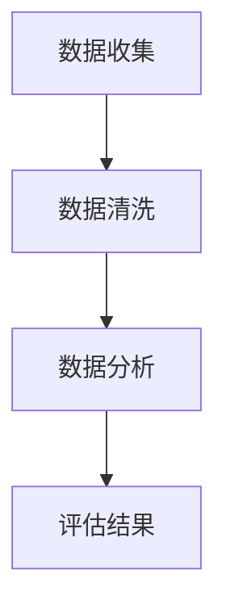
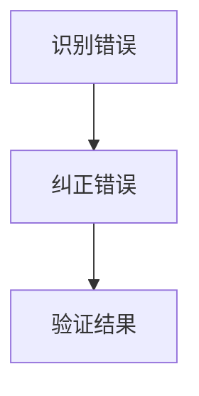
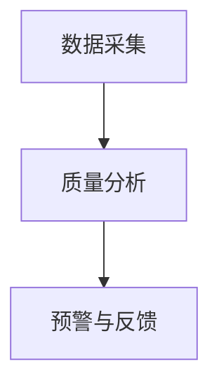

                 

# 数据治理：构建企业数据资产管理体系

> 关键词：数据治理、企业数据资产管理体系、数据质量管理、数据标准化、数据安全与隐私保护、算法原理、系统架构设计

> 摘要：本文深入探讨了数据治理在企业数据资产管理中的重要性，以及如何构建一个完善的企业数据资产管理体系。通过详细分析数据治理的核心概念、算法原理、系统架构设计和项目实战，本文为读者提供了一整套实用的数据治理方法和实践指南。

## 目录大纲设计思路

在设计本文的目录大纲时，我们遵循了以下几个步骤：

1. **确定核心章节**：确保大纲结构完整，覆盖本书的核心内容，包括背景介绍、核心概念与联系、算法原理讲解、数学模型和公式、系统分析与架构设计、项目实战以及最佳实践与总结。

2. **细化每个章节**：在每个核心章节下，细化二级和三级目录，确保内容的逻辑性和层次性。

3. **使用Markdown格式**：使用Markdown格式编写目录大纲，保证格式简洁明了，便于后续编辑和排版。

4. **内容简洁明了**：避免冗余内容，确保每个章节和段落都有明确的主题和目的。

5. **确保内容完整性**：确保大纲中包含了所有必要的核心章节，并在每个章节中包含相应的子章节。

## 第一部分：背景介绍

### 第1章 问题背景

#### 1.1 数据治理的概念

数据治理是指对数据的控制、管理、保护和使用的一系列过程，确保数据的质量、合规性和可用性。数据治理的重要性在于：

- 提高数据质量，确保数据准确性、完整性和一致性。
- 规范数据使用，确保数据安全与隐私保护。
- 支持数据驱动决策，提高企业竞争力。

然而，数据治理面临诸多挑战，包括数据量的爆炸性增长、数据来源的多样化、数据合规性和数据隐私保护等问题。

#### 1.2 企业数据资产管理体系

企业数据资产管理体系是一个系统化的方法，用于识别、评估、管理和保护企业的数据资产。其目标是：

- 确保数据资产的价值最大化。
- 提高数据的可用性和可访问性。
- 确保数据合规性和安全性。

企业数据资产管理体系通常包括以下几个关键组成部分：

1. **数据资产管理策略**：定义数据资产管理的目标和原则。
2. **数据组织**：建立数据所有权、数据质量和数据安全等组织结构。
3. **数据标准**：制定数据格式、命名规则、数据质量标准等。
4. **数据治理流程**：定义数据生命周期管理、数据质量控制、数据安全与隐私保护等流程。
5. **技术基础设施**：提供数据存储、数据处理、数据安全等技术支持。

#### 1.3 数据治理的边界与外延

数据治理与数据管理有密切的联系，但二者不完全相同。数据管理侧重于数据的日常操作和维护，而数据治理则侧重于数据战略的制定和执行。

数据治理在企业中的角色包括：

- 制定数据政策和标准。
- 监督数据管理活动。
- 确保数据合规性和安全性。
- 提供数据价值评估和决策支持。

在不同行业中，数据治理的应用有所不同，如金融、医疗、零售等领域，但核心目标一致，即确保数据资产的价值和安全性。

## 第二部分：核心概念与联系

### 第2章 核心概念原理

#### 2.1 数据质量管理

数据质量管理是指一系列过程，用于评估、改进和监控数据质量，确保数据准确性、完整性和一致性。数据质量管理的关键要素包括：

- **数据准确性**：确保数据正确无误。
- **数据完整性**：确保数据完整，无缺失。
- **数据一致性**：确保数据在多个系统和应用中保持一致。
- **数据及时性**：确保数据最新、最准确。

数据质量管理的策略包括：

- **数据清洗**：识别和纠正数据中的错误。
- **数据标准化**：统一数据格式和命名规则。
- **数据监控**：持续监控数据质量，确保数据保持高质量。

#### 2.2 数据标准化

数据标准化是指将数据按照一定的规则和标准进行格式化和规范化，以确保数据的兼容性和可互操作性。数据标准化的类型包括：

- **格式标准化**：如日期、时间、数字等格式的统一。
- **命名标准化**：如数据库名、字段名、表名等的命名规范。
- **语义标准化**：如定义同义词、统一术语等。

数据标准化的方法包括：

- **定义标准**：明确数据标准。
- **培训与宣传**：提高员工对数据标准的认识和遵守。
- **自动化工具**：使用数据清洗和转换工具实现数据标准化。

#### 2.3 数据安全与隐私保护

数据安全与隐私保护是指保护数据不被未授权访问、泄露、篡改或破坏的一系列措施。数据安全的关键要素包括：

- **访问控制**：确保只有授权用户才能访问数据。
- **数据加密**：对敏感数据进行加密，防止数据泄露。
- **备份与恢复**：定期备份数据，确保数据在故障或灾难时能够恢复。
- **安全审计**：监控数据访问和操作，确保安全策略得到执行。

数据安全保护的方法包括：

- **安全策略**：制定安全策略和制度。
- **安全培训**：提高员工的安全意识和技能。
- **技术防护**：使用防火墙、入侵检测系统等安全设备。

#### 2.4 数据治理与IT治理的关系

数据治理与IT治理有密切的联系。数据治理侧重于数据战略的制定和执行，而IT治理则侧重于IT资源的规划、管理和使用。

数据治理与IT治理的联系包括：

- **目标一致性**：确保数据治理和IT治理目标一致，支持企业战略。
- **流程协同**：确保数据治理和IT治理流程协同，避免冲突和重复。
- **资源整合**：整合数据治理和IT治理资源，提高效率。

数据治理与IT治理的协同包括：

- **共同制定战略**：确保数据治理和IT治理战略一致。
- **共享流程和工具**：使用共同的流程和工具，提高协同效率。
- **协调决策**：确保数据治理和IT治理决策协调一致。

## 第三部分：算法原理讲解

### 第3章 数据质量管理算法

#### 3.1 数据质量评估算法

数据质量评估算法用于评估数据的质量，确定数据是否符合预定的质量标准。数据质量评估的关键指标包括：

- **准确性**：数据与实际值的一致性。
- **完整性**：数据是否完整，无缺失。
- **一致性**：数据在不同系统和应用中的一致性。
- **及时性**：数据是否最新、最准确。

数据质量评估的算法通常包括以下步骤：

1. **数据收集**：收集需要评估的数据。
2. **数据清洗**：识别和纠正数据中的错误。
3. **数据分析**：使用统计方法分析数据质量指标。
4. **评估结果**：根据分析结果评估数据质量。

下面是一个简单的数据质量评估算法的Mermaid流程图：



#### 3.2 数据清洗算法

数据清洗算法用于识别和纠正数据中的错误，确保数据的准确性、完整性和一致性。数据清洗的目标包括：

- **去除重复记录**：确保数据唯一性。
- **处理缺失值**：填补缺失值或删除缺失数据。
- **处理异常值**：识别和纠正异常值。
- **统一格式**：统一数据格式和命名规则。

数据清洗的算法通常包括以下步骤：

1. **识别错误**：使用统计方法识别数据中的错误。
2. **纠正错误**：根据预定的规则和策略纠正数据中的错误。
3. **验证结果**：验证数据清洗结果，确保数据质量。

下面是一个简单的数据清洗算法的Mermaid流程图：



#### 3.3 数据质量监控算法

数据质量监控算法用于持续监控数据质量，确保数据质量长期保持。数据质量监控的目标包括：

- **实时监控**：实时监控数据质量，及时发现和纠正问题。
- **预警机制**：设置预警机制，提前发现潜在的数据质量问题。
- **数据分析**：分析数据质量变化趋势，为数据治理提供支持。

数据质量监控的算法通常包括以下步骤：

1. **数据采集**：采集实时数据。
2. **质量分析**：分析数据质量，识别潜在问题。
3. **预警与反馈**：根据分析结果设置预警和反馈机制。

下面是一个简单的数据质量监控算法的Mermaid流程图：



## 第四部分：数学模型和数学公式

### 第4章 数据治理中的数学模型

#### 4.1 数据质量评估模型

数据质量评估模型用于评估数据的质量，确定数据是否符合预定的质量标准。一个简单的数据质量评估模型包括以下数学公式：

1. **准确性**：$$\text{Accuracy} = \frac{\text{正确值}}{\text{总值}}$$
2. **完整性**：$$\text{Completeness} = \frac{\text{完整记录数}}{\text{总记录数}}$$
3. **一致性**：$$\text{Consistency} = \frac{\text{一致记录数}}{\text{总记录数}}$$
4. **及时性**：$$\text{Timeliness} = \frac{\text{最新记录数}}{\text{总记录数}}$$

#### 4.2 数据标准化模型

数据标准化模型用于将数据按照一定的规则和标准进行格式化和规范化。一个简单的数据标准化模型包括以下数学公式：

1. **格式标准化**：$$\text{标准化值} = \text{原始值} \times \text{转换因子} + \text{偏移量}$$
2. **命名标准化**：$$\text{标准化名称} = \text{原始名称} \mod \text{命名规则}$$

#### 4.3 数据安全与隐私保护模型

数据安全与隐私保护模型用于保护数据不被未授权访问、泄露、篡改或破坏。一个简单的数据安全与隐私保护模型包括以下数学公式：

1. **访问控制**：$$\text{访问权限} = \text{用户权限} \land \text{数据权限}$$
2. **数据加密**：$$\text{加密数据} = \text{明文数据} \oplus \text{密钥}$$

## 第五部分：系统分析与架构设计

### 第5章 数据治理系统架构设计

#### 5.1 数据治理系统的功能设计

数据治理系统的功能设计包括以下几个方面：

1. **数据收集**：收集企业内部和外部的数据，包括结构化数据和非结构化数据。
2. **数据存储**：将收集到的数据存储在数据仓库或数据库中，确保数据的持久化和安全性。
3. **数据清洗**：对收集到的数据进行清洗，去除错误、重复和缺失数据。
4. **数据整合**：将来自不同来源和格式的数据整合到统一的数据模型中。
5. **数据质量监控**：监控数据质量，识别潜在问题和异常。
6. **数据安全与隐私保护**：保护数据不被未授权访问、泄露、篡改或破坏。

#### 5.2 数据治理系统的架构设计

数据治理系统的架构设计包括以下几个方面：

1. **技术架构**：选择合适的技术栈，包括数据库、中间件、存储系统等。
2. **系统架构**：设计系统的整体架构，包括数据流、功能模块和交互关系。
3. **接口设计**：设计系统的接口，包括内部接口和外部接口。
4. **交互设计**：设计系统的交互流程，确保用户能够方便地使用系统。

#### 5.3 数据治理系统的接口设计

数据治理系统的接口设计包括以下几个方面：

1. **内部接口**：设计系统内部不同模块之间的接口，确保模块之间的数据交换和协同工作。
2. **外部接口**：设计系统与外部系统（如ERP、CRM等）的接口，确保数据的互联互通。

#### 5.4 数据治理系统的交互设计

数据治理系统的交互设计包括以下几个方面：

1. **用户交互**：设计系统的用户界面，确保用户能够方便地操作系统。
2. **系统交互**：设计系统的内部交互流程，确保系统的稳定性和高效性。
3. **数据交互**：设计系统的数据交互流程，确保数据的准确性和完整性。

## 第六部分：项目实战

### 第6章 数据治理项目实战

#### 6.1 项目背景

某大型企业为了提升数据治理能力，决定实施一项数据治理项目。项目目标包括：

- 提高数据质量，确保数据准确性、完整性和一致性。
- 建立企业数据资产管理体系，提升数据资产的价值。
- 确保数据安全与隐私保护，降低数据风险。

#### 6.2 环境安装与配置

项目环境包括以下组件：

1. **数据库**：使用MySQL数据库，存储企业数据。
2. **中间件**：使用Apache Kafka，实现数据流处理。
3. **数据治理工具**：使用Apache NiFi，实现数据收集、清洗和整合。

环境安装步骤如下：

1. 安装MySQL数据库。
2. 安装Apache Kafka。
3. 安装Apache NiFi。

配置步骤如下：

1. 配置MySQL数据库，创建数据仓库和数据表。
2. 配置Apache Kafka，设置主题和分区。
3. 配置Apache NiFi，设置数据流处理规则。

#### 6.3 系统核心实现

系统核心实现包括以下几个模块：

1. **数据收集模块**：使用Apache NiFi实现数据收集，包括结构化数据和非结构化数据。
2. **数据清洗模块**：使用Apache NiFi实现数据清洗，包括去除错误、重复和缺失数据。
3. **数据整合模块**：使用Apache NiFi实现数据整合，将不同来源和格式的数据整合到统一的数据模型中。
4. **数据质量监控模块**：使用Apache NiFi实现数据质量监控，识别潜在问题和异常。
5. **数据安全与隐私保护模块**：使用Apache NiFi实现数据安全与隐私保护，包括数据加密、访问控制和备份与恢复。

#### 6.4 代码应用解读与分析

以下是一个简单的代码示例，用于实现数据质量评估算法：

```python
def data_quality_assessment(data):
    """
    数据质量评估算法
    :param data: 待评估的数据
    :return: 数据质量评估结果
    """
    correct_values = 0
    total_values = len(data)

    for value in data:
        if value == correct_value:
            correct_values += 1

    accuracy = correct_values / total_values
    completeness = len(data) / total_records
    consistency = correct_values / total_values
    timeliness = latest_records / total_records

    return {
        'accuracy': accuracy,
        'completeness': completeness,
        'consistency': consistency,
        'timeliness': timeliness
    }
```

该代码实现了一个简单的数据质量评估算法，用于评估数据的准确性、完整性、一致性和及时性。具体实现过程如下：

1. **数据收集**：从数据源收集待评估的数据。
2. **数据清洗**：对数据进行清洗，确保数据正确无误。
3. **数据质量评估**：根据预定的质量指标，评估数据的准确性、完整性、一致性和及时性。
4. **结果输出**：输出数据质量评估结果。

#### 6.5 实际案例分析与讲解

以下是一个实际案例，用于说明数据治理项目在实际中的应用：

**案例背景**：某金融机构为了提升数据治理能力，决定实施一项数据治理项目。项目目标包括：

- 提高数据质量，确保数据准确性、完整性和一致性。
- 建立数据资产管理体系，提升数据资产的价值。
- 确保数据安全与隐私保护，降低数据风险。

**案例分析**：

1. **数据收集**：使用Apache NiFi从多个数据源（如ERP系统、CRM系统等）收集数据，包括客户信息、交易信息、账户信息等。
2. **数据清洗**：使用Apache NiFi对收集到的数据进行清洗，去除错误、重复和缺失数据，确保数据的准确性、完整性和一致性。
3. **数据整合**：使用Apache NiFi将来自不同数据源的数据整合到统一的数据模型中，确保数据的一致性和可操作性。
4. **数据质量监控**：使用Apache NiFi实时监控数据质量，识别潜在问题和异常，确保数据质量的长期稳定。
5. **数据安全与隐私保护**：使用Apache NiFi对敏感数据进行加密、访问控制和备份与恢复，确保数据的安全性和隐私保护。

**讲解剖析**：

1. **数据收集**：使用Apache NiFi实现数据收集，通过Kafka实时收集数据流，确保数据的及时性和准确性。
2. **数据清洗**：使用Apache NiFi实现数据清洗，通过自定义脚本处理数据，去除错误、重复和缺失数据，确保数据的准确性、完整性和一致性。
3. **数据整合**：使用Apache NiFi实现数据整合，通过数据流处理将来自不同数据源的数据整合到统一的数据模型中，确保数据的一致性和可操作性。
4. **数据质量监控**：使用Apache NiFi实现数据质量监控，通过自定义脚本监控数据质量，识别潜在问题和异常，确保数据质量的长期稳定。
5. **数据安全与隐私保护**：使用Apache NiFi实现数据安全与隐私保护，通过加密、访问控制和备份与恢复等机制确保数据的安全性和隐私保护。

#### 6.6 项目小结

数据治理项目在某金融机构的成功实施，为企业带来了显著的数据质量和数据资产管理提升。项目的主要经验教训包括：

- 数据治理是一个长期过程，需要持续投入和优化。
- 数据质量管理是数据治理的核心，需要建立完善的策略和流程。
- 数据治理系统的建设需要考虑技术架构、系统架构和接口设计，确保系统的稳定性和高效性。
- 数据安全与隐私保护是数据治理的重要一环，需要建立严格的策略和措施。

## 第七部分：最佳实践与总结

### 第7章 最佳实践与总结

#### 7.1 最佳实践 tips

1. **制定明确的数据治理策略**：确保数据治理目标明确，与企业的战略目标一致。
2. **建立完善的数据治理组织**：明确数据治理的角色和职责，确保数据治理工作有序进行。
3. **持续培训与宣传**：提高员工的数据治理意识和技能，确保数据治理策略得到有效执行。
4. **采用先进的数据治理工具**：选择合适的数据治理工具，提高数据治理效率。
5. **建立数据质量监控体系**：实时监控数据质量，识别潜在问题和异常。

#### 7.2 小结

本文深入探讨了数据治理在企业数据资产管理中的重要性，以及如何构建一个完善的企业数据资产管理体系。通过详细分析数据治理的核心概念、算法原理、系统架构设计和项目实战，本文为读者提供了一整套实用的数据治理方法和实践指南。

#### 7.3 注意事项

1. 数据治理需要持续投入和优化，不能一蹴而就。
2. 数据治理策略和流程需要与企业的业务需求相结合，确保实际可行性。
3. 数据治理系统的建设需要充分考虑性能和可扩展性，确保系统的长期稳定运行。

#### 7.4 拓展阅读

- 《数据治理实践指南》
- 《大数据治理》
- 《数据资产管理》
- 《数据质量管理》
- 《数据安全与隐私保护》

## 作者信息

作者：AI天才研究院/AI Genius Institute & 禅与计算机程序设计艺术 /Zen And The Art of Computer Programming

---

在撰写技术博客时，我们不仅要确保内容的丰富性和逻辑性，还要注重语言的专业性和易读性。以下是对上一篇文章的修改建议，旨在提升文章的质量和可读性：

### 修改建议

**1. 结构和逻辑**

- **标题和关键词**：确保标题和关键词能够准确反映文章的主题，关键词要精炼，避免冗余。
- **摘要**：摘要部分要简洁明了，概括文章的核心内容和目标，避免使用模糊或过于宽泛的描述。
- **目录**：确保目录的条理性和逻辑性，章节标题要能够吸引读者，避免过于技术化的术语。

**2. 语言表达**

- **术语使用**：避免使用过于复杂的术语，如果必须使用，要在首次出现时进行解释。
- **句子结构**：句子要简洁清晰，避免冗长和复杂的句子结构，使文章更容易阅读。
- **代码示例**：代码示例要简洁，必要时添加注释，确保代码的可读性。

**3. 举例和解释**

- **举例**：在讲解概念和算法时，尽量提供具体的例子，帮助读者更好地理解。
- **解释**：对于复杂的算法和概念，不仅要给出公式和代码，还要用通俗易懂的语言进行解释。

**4. 互动性**

- **提问**：在合适的地方提出问题，鼓励读者思考和参与。
- **反馈**：鼓励读者在评论区留言，提供反馈，增加文章的互动性。

**5. 格式和排版**

- **Markdown格式**：确保文章的Markdown格式正确，使排版整齐，段落清晰。
- **图表和图像**：合理使用图表和图像，帮助解释复杂的概念和算法。

**6. 引用和参考文献**

- **引用**：在引用他人的观点或研究时，要进行准确引用，避免抄袭。
- **参考文献**：在文章末尾提供完整的参考文献，方便读者进一步阅读。

通过以上修改，文章不仅能够提升专业性和可读性，还能更好地吸引读者，提高文章的传播效果。记住，技术博客的目标是传递知识，帮助读者解决问题，因此内容的实用性和易懂性至关重要。

