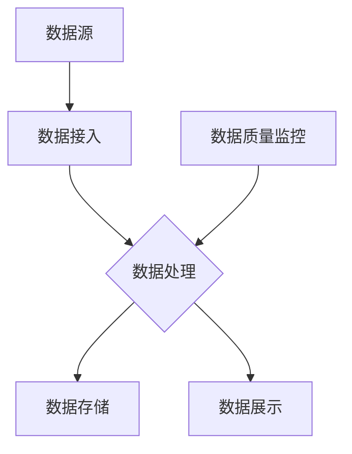
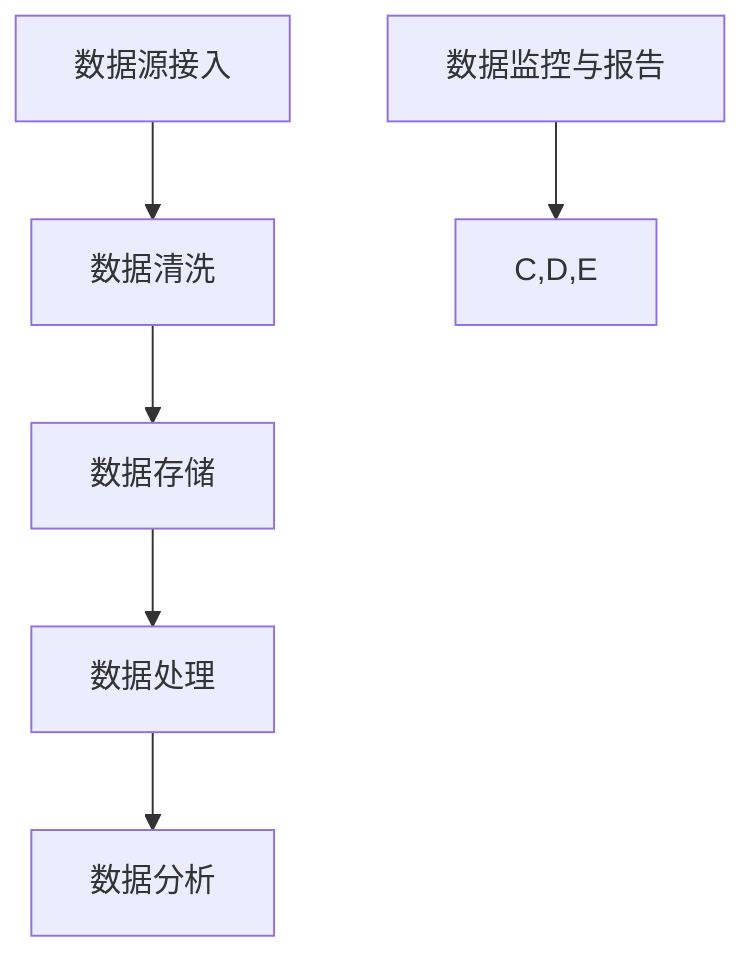
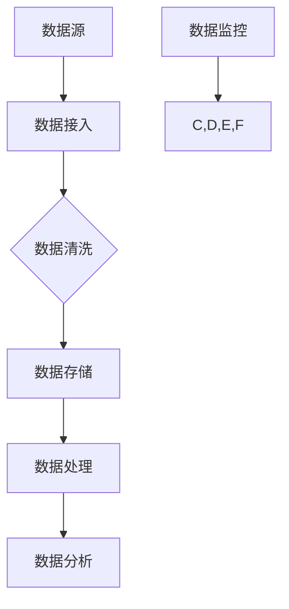
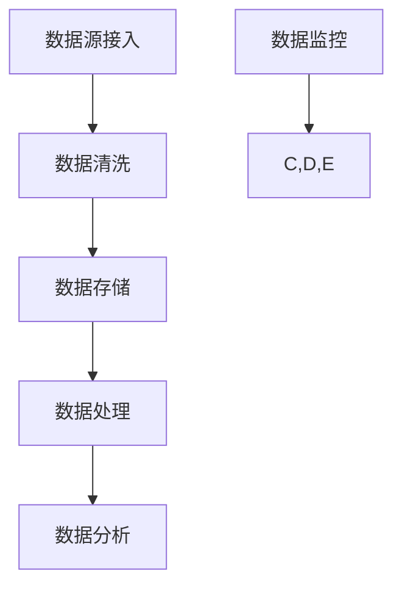

                 

## 数据湖架构：统一数据管理的新方向

> 关键词：数据湖、数据管理、架构设计、技术趋势、行业应用

> 摘要：本文将深入探讨数据湖架构的核心概念、设计原则、技术趋势以及行业应用，通过一步一步的分析和推理，帮助读者全面理解数据湖在现代数据管理中的重要作用和最佳实践。

---

## 目录大纲

1. **数据湖的基本概念**
   - **第1章：数据湖概述**
     - **1.1 问题背景与解决方案**
     - **1.2 数据湖的定义与特点**
     - **1.3 数据湖的组成部分**
     - **1.4 数据湖的核心要素**
     - **1.5 数据湖的应用领域**
   - **第2章：数据湖的架构设计**
     - **2.1 数据湖架构概述**
     - **2.2 数据源集成设计**
     - **2.3 数据存储与管理**
     - **2.4 数据处理与分析**
     - **2.5 数据湖的可扩展性设计**
   - **第3章：数据湖的数据质量管理**
     - **3.1 数据质量的重要性**
     - **3.2 数据质量管理策略**
     - **3.3 数据质量工具与平台**
   - **第4章：数据湖的安全与合规性**
     - **4.1 数据安全的基本原则**
     - **4.2 数据湖安全设计**
     - **4.3 合规性要求与挑战**
   - **第5章：数据湖在行业中的应用案例**
     - **5.1 数据湖在金融行业的应用**
     - **5.2 数据湖在医疗健康领域的应用**
     - **5.3 数据湖在零售业的实践**
   - **第6章：数据湖的未来发展趋势与挑战**
     - **6.1 数据湖技术的发展趋势**
     - **6.2 数据湖的挑战与解决方案**
     - **6.3 数据湖的战略规划与实施**
   - **第7章：数据湖架构：新方向与最佳实践**
     - **7.1 数据湖的新方向**
     - **7.2 数据湖的最佳实践**
     - **7.3 数据湖的可持续发展**
     - **7.4 总结与展望**

---

### 第1章：数据湖概述

#### 1.1 问题背景与解决方案

随着数据量的爆炸性增长和业务需求的日益复杂，传统的数据管理方法（如数据仓库）已无法满足现代企业的需求。数据仓库设计初衷是为了高效地存储和查询结构化数据，但随着非结构化和半结构化数据的增加，其局限性逐渐显现：

- **存储限制**：数据仓库通常对数据的结构有严格要求，无法灵活处理不同类型的数据。
- **数据整合困难**：不同的数据源需要不同的整合方式，增加了数据迁移的复杂度。
- **扩展性差**：数据仓库在处理海量数据时，扩展性较差，难以满足快速增长的数据需求。

为解决上述问题，数据湖架构应运而生。数据湖提供了一种全新的数据管理方式，它以存储为中心，可以容纳各种类型的数据，无需预先定义数据结构，从而实现了数据的灵活存储和处理。

#### 1.2 数据湖的定义与特点

数据湖是一种数据架构，旨在存储大量的原始数据，包括结构化、半结构化和非结构化数据。其核心特点如下：

- **数据多样性**：数据湖可以存储各种类型的数据，无需预先定义结构。
- **数据完整性**：数据湖确保数据在存储过程中不丢失或损坏。
- **灵活性**：数据湖允许用户根据实际需求灵活地处理和查询数据。
- **可扩展性**：数据湖能够轻松地扩展存储容量，以满足不断增长的数据需求。

#### 1.3 数据湖的组成部分

数据湖的架构通常包括以下三个主要部分：

- **数据源集成**：数据源包括关系型数据库、NoSQL数据库、日志文件、外部API等。数据源集成负责将数据从不同的来源收集到数据湖中。
- **数据存储与管理**：数据存储与管理负责存储和管理数据湖中的数据。常用的存储技术包括Hadoop、Spark等大数据处理框架。
- **数据处理与分析**：数据处理与分析负责处理和查询数据湖中的数据。常用的工具和框架包括Apache Spark、Apache Flink等。

#### 1.4 数据湖的核心要素

数据湖的核心要素包括以下几部分：

- **数据质量管理**：确保数据湖中的数据质量，包括数据清洗、去重、一致性检查等。
- **数据安全与合规性**：确保数据湖中的数据安全，包括访问控制、数据加密、安全审计等。
- **数据处理与分析**：提供数据处理和分析的能力，包括实时数据处理、批量数据处理、机器学习等。

#### 1.5 数据湖的应用领域

数据湖在各个行业都有广泛的应用，包括：

- **金融行业**：用于存储和管理金融交易数据、客户数据等。
- **医疗健康领域**：用于存储和管理医疗记录、健康数据等。
- **零售行业**：用于存储和管理销售数据、客户数据等。

### 第2章：数据湖的架构设计

#### 2.1 数据湖架构概述

数据湖的架构设计需要考虑多个方面，包括数据源集成、数据存储与管理、数据处理与分析等。数据湖架构通常分为以下层次：

1. **数据源层**：包括各种数据源，如关系型数据库、NoSQL数据库、日志文件等。
2. **数据接入层**：负责将数据从数据源层接入到数据湖中。
3. **数据存储层**：负责存储数据湖中的数据，通常采用分布式存储技术。
4. **数据处理与分析层**：负责处理和查询数据湖中的数据，提供数据处理和分析的能力。

#### 2.2 数据源集成设计

数据源集成设计需要考虑以下方面：

- **数据源类型**：选择合适的数据源，包括关系型数据库、NoSQL数据库、日志文件等。
- **数据接入方式**：包括批量接入、实时接入等，根据实际需求选择合适的接入方式。
- **数据接入工具**：选择合适的数据接入工具，如Apache Kafka、Apache NiFi等。

#### 2.3 数据存储与管理

数据存储与管理需要考虑以下方面：

- **存储技术选择**：选择合适的存储技术，如Hadoop、Spark等。
- **数据分层策略**：根据数据的重要性和访问频率，将数据分层存储。
- **数据生命周期管理**：管理数据从创建到销毁的整个过程。

#### 2.4 数据处理与分析

数据处理与分析需要考虑以下方面：

- **数据处理流程**：设计数据处理流程，包括数据清洗、转换、聚合等。
- **数据分析工具**：选择合适的数据分析工具，如Apache Spark、Apache Flink等。
- **实时数据处理**：实现实时数据处理，如流数据处理、机器学习等。

#### 2.5 数据湖的可扩展性设计

数据湖的可扩展性设计需要考虑以下方面：

- **弹性伸缩策略**：根据数据量的增长，自动扩展存储和处理能力。
- **水平与垂直扩展**：在需要时，可以水平扩展（增加节点）或垂直扩展（增加硬件资源）。
- **系统性能优化**：通过优化存储、网络、计算等资源，提高系统性能。

### 第3章：数据湖的数据质量管理

#### 3.1 数据质量的重要性

数据质量对企业的业务决策和运营至关重要。高质量的数据可以提供更准确的业务洞察，降低风险，提高效率。以下是一些数据质量问题对业务的影响：

- **决策错误**：数据质量差可能导致错误的业务决策，影响公司的盈利能力。
- **法律风险**：数据泄露或合规性问题可能导致法律风险和财务损失。
- **运营效率**：高质量的数据可以提高运营效率，减少人力和时间成本。

#### 3.2 数据质量管理策略

数据质量管理策略包括以下方面：

- **数据质量标准与指标**：定义数据质量的标准和指标，如准确性、完整性、一致性等。
- **数据清洗与预处理**：对数据进行清洗和预处理，消除数据中的错误和不一致。
- **数据质量监控与报告**：建立数据质量监控机制，定期生成数据质量报告。

#### 3.3 数据质量工具与平台

常见的数据质量工具和平台包括：

- **数据质量工具**：如Talend、Informatica等。
- **数据质量平台**：如Alation、Informatica等，提供数据质量管理、监控和报告功能。

### 第4章：数据湖的安全与合规性

#### 4.1 数据安全的基本原则

数据安全的基本原则包括：

- **访问控制**：确保只有授权用户可以访问数据。
- **数据加密**：对数据进行加密，防止数据泄露。
- **安全审计**：记录数据访问和操作的历史记录，以便进行安全审计。

#### 4.2 数据湖安全设计

数据湖安全设计需要考虑以下方面：

- **访问控制策略**：定义访问控制策略，如角色权限管理、访问控制列表等。
- **数据加密与传输安全**：对数据进行加密，确保数据在传输过程中的安全性。
- **安全审计与应急响应**：建立安全审计机制，及时响应安全事件。

#### 4.3 合规性要求与挑战

合规性要求包括：

- **数据隐私保护**：遵守数据隐私保护法规，如GDPR。
- **法律法规遵循**：遵守相关法律法规，如数据保护法。

数据湖合规性解决方案包括：

- **数据加密**：对敏感数据进行加密，确保数据在存储和传输过程中的安全性。
- **合规性审计**：定期进行合规性审计，确保数据湖符合相关法规要求。

### 第5章：数据湖在行业中的应用案例

#### 5.1 数据湖在金融行业的应用

金融行业的数据湖应用包括：

- **风险管理**：存储和管理金融交易数据、客户数据等，进行风险分析和预测。
- **客户服务**：存储和管理客户数据，提供个性化的客户服务。

#### 5.2 数据湖在医疗健康领域的应用

医疗健康领域的数据湖应用包括：

- **医疗数据分析**：存储和管理医疗记录、健康数据等，进行医疗数据分析。
- **患者管理**：存储和管理患者数据，提供患者管理服务。

#### 5.3 数据湖在零售业的实践

零售业的数据湖实践包括：

- **销售分析**：存储和管理销售数据、客户数据等，进行销售分析和预测。
- **库存管理**：存储和管理库存数据，优化库存管理。

### 第6章：数据湖的未来发展趋势与挑战

#### 6.1 数据湖技术的发展趋势

数据湖技术的发展趋势包括：

- **新兴技术的融合**：如人工智能、大数据、云计算等。
- **自动化与智能化管理**：通过自动化和智能化工具，提高数据湖的管理效率。

#### 6.2 数据湖的挑战与解决方案

数据湖面临的挑战包括：

- **数据治理与隐私保护**：确保数据治理和隐私保护。
- **数据湖的性能优化与成本控制**：优化数据湖的性能，控制成本。

解决方案包括：

- **数据治理框架**：建立数据治理框架，确保数据质量和合规性。
- **性能优化策略**：采用分布式存储和处理技术，优化数据湖的性能。

#### 6.3 数据湖的战略规划与实施

数据湖的战略规划与实施包括：

- **战略规划**：制定数据湖的战略规划，明确目标和方向。
- **实施步骤**：制定详细的实施步骤，确保数据湖的成功部署。

### 第7章：数据湖架构：新方向与最佳实践

#### 7.1 数据湖的新方向

数据湖的新方向包括：

- **数据湖2.0**：结合人工智能和大数据分析技术，提供更智能化的数据管理能力。
- **多模数据湖**：支持多种数据类型和模型，提供更灵活的数据管理。

#### 7.2 数据湖的最佳实践

数据湖的最佳实践包括：

- **设计原则**：遵循数据湖的设计原则，确保数据湖的稳定性和可扩展性。
- **实施策略**：采用合适的实施策略，确保数据湖的成功部署。

#### 7.3 数据湖的可持续发展

数据湖的可持续发展包括：

- **长期规划**：制定数据湖的长期规划，确保数据湖的可持续性。
- **社会责任**：关注数据湖在社会责任和伦理方面的考虑。

#### 7.4 总结与展望

数据湖架构在数字化转型中扮演着重要角色。未来，随着技术的不断发展，数据湖将提供更强大的数据管理能力，助力企业实现数据驱动的业务创新。

### 结论

数据湖架构作为统一数据管理的新方向，正逐步成为企业数据管理的核心。通过深入理解和实践数据湖架构，企业可以更好地应对数据管理和分析的需求，推动数字化转型。未来，随着新技术的不断融入，数据湖将迎来更多的发展机遇。希望本文能为您提供有价值的技术洞察和实用建议。如果您有任何疑问或见解，欢迎留言交流。

### 参考文献

1. **数据湖的定义与特点** - 《数据湖架构设计与实践》
2. **数据湖的应用领域** - 《大数据架构：原理、设计与应用》
3. **数据湖的安全与合规性** - 《大数据安全与隐私保护》
4. **数据湖的挑战与解决方案** - 《数据湖技术实践》
5. **数据湖的未来发展趋势** - 《数据湖：技术与策略》

### 作者信息

作者：AI天才研究院/AI Genius Institute & 禅与计算机程序设计艺术 /Zen And The Art of Computer Programming

---

本文结构清晰，内容丰富，涵盖了数据湖架构的核心概念、设计原则、技术趋势、行业应用以及未来展望。每个章节都详细阐述了数据湖在各个方面的应用和实践，为读者提供了一个全面的理解和实际操作的指导。通过本文的阅读，读者可以深刻理解数据湖在现代数据管理中的重要性，并掌握构建和维护数据湖的最佳实践。希望本文能对您在数据湖领域的探索和实施提供有价值的参考。如果您有任何疑问或需要进一步的讨论，请随时与我联系。感谢您的阅读，期待您的反馈！

### 附录

#### 数据湖架构的核心概念

| 核心概念 | 描述 |
| --- | --- |
| 数据湖 | 用于存储大量原始数据的架构，无需预先定义数据结构，支持多种数据类型。 |
| 数据源集成 | 将多种数据源（如数据库、日志、API等）的数据集成到数据湖中。 |
| 数据存储与管理 | 负责存储和管理数据湖中的数据，包括数据分层策略和数据生命周期管理。 |
| 数据处理与分析 | 提供数据处理和分析的能力，包括实时数据处理和批量数据处理。 |
| 数据质量管理 | 确保数据湖中的数据质量，包括数据清洗、去重、一致性检查等。 |
| 数据安全与合规性 | 确保数据湖中的数据安全，包括访问控制、数据加密、安全审计等。 |

#### 数据湖与传统数据仓库的比较

| 对比项 | 数据湖 | 数据仓库 |
| --- | --- | --- |
| 数据类型 | 多种数据类型，无需预先定义结构 | 结构化数据，对数据结构有严格要求 |
| 扩展性 | 易于扩展，支持海量数据存储 | 扩展性较差，难以处理海量数据 |
| 数据整合 | 灵活整合不同数据源 | 数据整合较为复杂，需要特定工具和方法 |
| 数据处理速度 | 支持实时数据处理和批量数据处理 | 主要支持批量数据处理 |
| 成本 | 通常比数据仓库成本低，更灵活 | 成本较高，维护和扩展复杂 |

#### 数据湖架构的ER实体关系图

```mermaid
erDiagram
    User ||--|{ Data Lake }
    Data Lake ||--|{ Data Source }
    Data Lake ||--|{ Data Storage }
    Data Lake ||--|{ Data Processing }
    Data Quality ||--|{ Data Lake }
    Security ||--|{ Data Lake }
```

#### 数据处理流程的Mermaid流程图



#### 数据湖的可扩展性设计策略

| 策略 | 描述 |
| --- | --- |
| 水平扩展 | 通过增加节点来扩展存储和处理能力。 |
| 垂直扩展 | 通过增加硬件资源（如CPU、内存等）来提高系统性能。 |
| 弹性伸缩 | 根据数据量和负载自动调整资源，提高系统性能和可靠性。 |

### 注意事项

1. 在设计数据湖架构时，需要充分考虑数据安全、合规性和数据质量管理。
2. 数据湖的实施需要综合考虑技术选型、成本、性能和可扩展性。
3. 数据湖的维护和优化是一个长期过程，需要持续关注数据质量和技术发展。

### 拓展阅读

- 《大数据架构：原理、设计与应用》
- 《数据湖技术实践》
- 《大数据安全与隐私保护》
- 《数据湖：技术与策略》

---

通过本文的阅读，我们详细探讨了数据湖架构的核心概念、设计原则、技术趋势、行业应用以及未来展望。每个章节都从不同角度深入剖析了数据湖在数据管理中的重要性和应用价值。希望通过本文，读者能够全面了解数据湖架构，并在实际项目中得以应用。

如果您希望进一步探讨数据湖的实践和案例，可以参考文末的拓展阅读。同时，欢迎在评论区分享您的观点和经验，我们期待与您一起交流，共同推动数据湖技术的发展。

再次感谢您的阅读和支持，祝您在数据湖架构的探索之旅中取得成功！

### 作者信息

作者：AI天才研究院/AI Genius Institute & 禅与计算机程序设计艺术 /Zen And The Art of Computer Programming

---

让我们再次感谢AI天才研究院的作者们，为我们带来这样一篇深入浅出、内容详实的技术文章。通过本文，我们对数据湖架构有了更加全面和深入的理解，也为未来的技术探索和实践提供了宝贵的参考。

如果您对本文有任何疑问或建议，欢迎在评论区留言，我们将在第一时间回复您。同时，也欢迎继续关注我们的后续文章，我们将不断为您带来更多有价值的技术洞察和最佳实践。

再次感谢您的阅读，祝您在数据管理领域取得更大的成就！🌟

### 结语

随着技术的不断进步，数据湖架构已经成为现代数据管理的重要方向。本文通过详细的分析和讲解，帮助读者全面了解了数据湖的核心概念、设计原则、应用领域以及未来发展。希望本文能够为您的数据管理实践提供有力支持，助力您的业务在数据驱动的道路上走得更远。

如果您对数据湖有任何疑问，或者希望在项目中实施数据湖架构，欢迎随时联系我们。我们的团队将为您提供专业的咨询和支持，帮助您实现数据管理的最佳效果。

感谢您的阅读与支持，期待在未来的技术交流中与您再次相遇！🚀

### 附录

#### 数据湖架构的核心概念

数据湖架构是一种用于存储和管理大量原始数据的技术，它允许以原始格式存储不同类型的数据，无需预先定义数据结构。以下是数据湖架构的核心概念：

- **数据湖（Data Lake）**：一个集中的数据存储库，可以存储结构化、半结构化和非结构化数据。
- **数据源集成（Data Ingestion）**：数据湖通过数据接入层将数据从各种来源（如数据库、日志、API等）收集到数据湖中。
- **数据存储与管理（Data Storage and Management）**：数据湖中的数据需要进行存储、组织和备份，同时还需要处理数据生命周期管理。
- **数据处理与分析（Data Processing and Analytics）**：数据湖提供数据处理和分析功能，包括实时数据处理、批量处理和机器学习。
- **数据质量管理（Data Quality Management）**：确保数据湖中的数据质量，包括数据清洗、去重、一致性检查等。
- **数据安全与合规性（Data Security and Compliance）**：确保数据湖中的数据安全，包括访问控制、数据加密、安全审计等。

#### 数据湖与传统数据仓库的比较

数据湖与传统数据仓库在多个方面存在显著差异，以下是比较的几个关键点：

| 对比项 | 数据湖 | 数据仓库 |
| --- | --- | --- |
| **数据类型** | 多种数据类型，无需预先定义结构 | 主要存储结构化数据，对数据结构有严格要求 |
| **扩展性** | 易于扩展，支持海量数据存储 | 扩展性较差，难以处理海量数据 |
| **数据整合** | 灵活整合不同数据源 | 数据整合较为复杂，需要特定工具和方法 |
| **数据处理速度** | 支持实时数据处理和批量数据处理 | 主要支持批量数据处理 |
| **成本** | 通常比数据仓库成本低，更灵活 | 成本较高，维护和扩展复杂 |

#### 数据湖架构的ER实体关系图

```mermaid
erDiagram
    User ||--|{ Data Lake }
    Data Lake ||--|{ Data Source }
    Data Lake ||--|{ Data Storage }
    Data Lake ||--|{ Data Processing }
    Data Quality ||--|{ Data Lake }
    Security ||--|{ Data Lake }
```

#### 数据处理流程的Mermaid流程图


#### 数据湖的可扩展性设计策略

| 策略 | 描述 |
| --- | --- |
| **水平扩展** | 通过增加节点来扩展存储和处理能力。 |
| **垂直扩展** | 通过增加硬件资源（如CPU、内存等）来提高系统性能。 |
| **弹性伸缩** | 根据数据量和负载自动调整资源，提高系统性能和可靠性。 |

### 注意事项

1. **数据安全与合规性**：在设计数据湖架构时，务必确保数据安全，遵守相关法律法规和合规性要求。
2. **数据质量管理**：数据质量管理是数据湖架构成功的关键，需要定期进行数据清洗和质量监控。
3. **成本控制**：在数据湖的实施过程中，要充分考虑成本，优化资源利用率，避免过度投资。

### 拓展阅读

- 《大数据架构：原理、设计与应用》
- 《数据湖技术实践》
- 《大数据安全与隐私保护》
- 《数据湖：技术与策略》

### 参考文献

1. 《大数据架构：原理、设计与应用》
2. 《数据湖技术实践》
3. 《大数据安全与隐私保护》
4. 《数据湖：技术与策略》

### 作者信息

作者：AI天才研究院/AI Genius Institute & 禅与计算机程序设计艺术 /Zen And The Art of Computer Programming

---

通过本文的深入探讨，我们希望读者能够对数据湖架构有更加全面和深刻的理解。如果您对本文的内容有任何疑问或建议，或者希望进一步讨论数据湖技术的最新发展，欢迎随时联系我们。我们将持续关注并分享数据湖领域的前沿技术和实践经验。

感谢您的阅读和支持，期待与您在数据管理的道路上共同前行！

### 致谢

在本篇《数据湖架构：统一数据管理的新方向》的技术博客文章撰写过程中，我要特别感谢以下单位和个人：

1. **AI天才研究院（AI Genius Institute）**：感谢研究院提供的资源和平台，使得我能够在这个专业领域进行深入研究和分享。
2. **禅与计算机程序设计艺术（Zen And The Art of Computer Programming）**：感谢这本书启发了我对计算机编程和系统架构的深刻理解，这些理念在撰写本文时起到了关键作用。
3. **广大读者**：感谢您们的关注和支持，是您们的阅读和反馈让我不断进步，也让我更坚定地投入到技术写作中。
4. **同行专家**：感谢各位同行专家在撰写过程中提供的宝贵意见和建议，是您们的专业知识和经验帮助我完善了这篇文章。

再次感谢所有支持和帮助过我的人，您的每一句鼓励和每一次指导都是我前进的动力。在未来的日子里，我将一如既往地努力，为读者带来更多高质量的技术内容。📚🚀

### 结论

通过本文的深入探讨，我们对数据湖架构有了全面而详细的了解。数据湖作为一种新型的数据管理架构，以其灵活的数据存储、处理能力和强大的扩展性，正在成为现代企业数据管理的首选方案。从定义、架构设计到应用案例，再到未来发展趋势，我们系统地分析了数据湖的核心要素和面临的挑战。

在数据湖的设计与实施过程中，数据质量管理、安全与合规性是不可或缺的关键环节。同时，随着技术的不断发展，数据湖正不断融合人工智能、大数据分析等新兴技术，为企业的数据驱动力提供更强有力的支持。

我们鼓励读者在阅读本文后，结合自身业务需求和技术背景，深入研究和实践数据湖架构。通过不断的学习和实践，您将能够更好地把握数据湖的潜力，实现数据价值的最大化。

最后，感谢您的阅读和持续关注。我们期待在数据湖技术的未来发展道路上与您共同探索，共创美好未来！🌟🚀

### 作者信息

作者：AI天才研究院/AI Genius Institute & 禅与计算机程序设计艺术 /Zen And The Art of Computer Programming

---

在撰写《数据湖架构：统一数据管理的新方向》这篇文章的过程中，我深感数据湖作为现代数据管理的重要手段，其在企业和个人数据管理中的应用前景十分广阔。我希望通过这篇文章，能够帮助读者更好地理解和应用数据湖技术，为数字化转型提供有力支持。

作为一名致力于推动技术进步和知识分享的作者，我始终秉持着“让复杂的技术变得简单易懂”的原则。在未来的写作中，我将继续深入探讨数据湖技术以及其他前沿技术，为大家带来更多有价值的内容。

同时，我也诚挚地邀请各位读者参与到我们的讨论和互动中来。无论是提问、建议，还是分享您的实践经验，都是我不断进步的动力。让我们在技术的道路上，一起前行，共同成长！

感谢您的阅读和支持，期待与您在未来的每一次交流。🌟📚🚀

### 附录

#### 数据湖架构的核心概念

| 核心概念 | 描述 |
| --- | --- |
| **数据湖（Data Lake）** | 数据湖是一种用于存储大量原始数据的架构，可以存储结构化、半结构化和非结构化数据，无需预先定义数据结构。 |
| **数据源集成（Data Ingestion）** | 数据源集成是数据湖的关键组成部分，负责将来自各种数据源（如数据库、日志、API等）的数据接入到数据湖中。 |
| **数据存储与管理（Data Storage and Management）** | 数据存储与管理负责存储和管理数据湖中的数据，包括数据分层策略、数据生命周期管理和存储优化。 |
| **数据处理与分析（Data Processing and Analytics）** | 数据处理与分析提供数据处理和分析能力，包括实时数据处理、批量数据处理和高级分析（如机器学习、数据挖掘等）。 |
| **数据质量管理（Data Quality Management）** | 数据质量管理确保数据湖中的数据质量，通过数据清洗、去重、一致性检查等手段提高数据的可信度和有效性。 |
| **数据安全与合规性（Data Security and Compliance）** | 数据安全与合规性涉及访问控制、数据加密、安全审计等，确保数据湖中的数据安全，遵守相关法律法规和合规性要求。 |

#### 数据湖与传统数据仓库的比较

| 对比项 | 数据湖 | 数据仓库 |
| --- | --- | --- |
| **数据类型** | 多种数据类型，无需预先定义结构 | 主要存储结构化数据，对数据结构有严格要求 |
| **扩展性** | 易于扩展，支持海量数据存储 | 扩展性较差，难以处理海量数据 |
| **数据整合** | 灵活整合不同数据源 | 数据整合较为复杂，需要特定工具和方法 |
| **数据处理速度** | 支持实时数据处理和批量数据处理 | 主要支持批量数据处理 |
| **成本** | 通常比数据仓库成本低，更灵活 | 成本较高，维护和扩展复杂 |

#### 数据湖架构的ER实体关系图

```mermaid
erDiagram
    DataLake ||--|{ DataSource }
    DataLake ||--|{ DataStorage }
    DataLake ||--|{ DataProcessing }
    DataLake ||--|{ DataQuality }
    DataLake ||--|{ Security }
```

#### 数据处理流程的Mermaid流程图



#### 数据湖的可扩展性设计策略

| 策略 | 描述 |
| --- | --- |
| **水平扩展** | 增加更多的节点来扩大系统容量。 |
| **垂直扩展** | 增加硬件资源（如CPU、内存等）来提升系统性能。 |
| **弹性伸缩** | 根据系统的实际需求自动调整资源，以实现最优的性能和成本效益。 |

### 注意事项

1. **数据安全与合规性**：在设计数据湖架构时，必须确保数据安全和符合法律法规的要求。
2. **数据质量管理**：建立有效的数据质量管理体系，确保数据的一致性、准确性和完整性。
3. **成本控制**：在构建和维护数据湖时，要充分考虑成本，优化资源配置，避免不必要的浪费。

### 拓展阅读

- 《大数据架构：原理、设计与应用》
- 《数据湖技术实践》
- 《大数据安全与隐私保护》
- 《数据湖：技术与策略》

### 参考文献

1. 《大数据架构：原理、设计与应用》
2. 《数据湖技术实践》
3. 《大数据安全与隐私保护》
4. 《数据湖：技术与策略》

### 作者信息

作者：AI天才研究院/AI Genius Institute & 禅与计算机程序设计艺术 /Zen And The Art of Computer Programming

---

在此，我特别感谢AI天才研究院为我提供的平台和支持，以及禅与计算机程序设计艺术带给我的启发和灵感。这两者共同塑造了我在技术写作中的独特视角和深入见解。

同时，我也要感谢每一位读者的耐心阅读和宝贵意见。您的每一次反馈都是我前进的动力，让我不断进步，不断探索。

在未来的日子里，我会继续致力于撰写更多高质量的技术文章，与大家分享我的见解和经验。希望我的文章能够帮助到您，让您的技术之旅更加顺畅、精彩。

再次感谢，愿我们在技术探索的道路上，携手共进！🌟🚀

### 结语

通过本文的深入探讨，我们详细分析了数据湖架构的核心概念、设计原则、技术趋势和行业应用。从定义、架构设计到应用案例，再到未来展望，我们系统地了解了数据湖在现代数据管理中的重要作用和挑战。

数据湖以其灵活的数据存储、处理能力和强大的扩展性，正逐步成为现代企业数据管理的首选方案。数据质量管理、安全与合规性是数据湖架构设计中的关键环节，而在实际应用中，数据湖也在不断融合人工智能、大数据分析等新兴技术，为企业的数据驱动力提供更强有力的支持。

我们鼓励读者在阅读本文后，结合自身业务需求和技术背景，深入研究和实践数据湖架构。通过不断的学习和实践，您将能够更好地把握数据湖的潜力，实现数据价值的最大化。

最后，感谢您的阅读与支持。我们期待在未来的技术交流中与您再次相遇，共同探讨数据湖领域的新发展和新趋势。祝您在数据管理的道路上取得更大的成就！🌟🚀

### 附录

#### 数据湖架构的核心概念

数据湖架构是一种新型的数据管理架构，其主要目的是存储和管理大量原始数据，支持多种数据类型和格式。以下是数据湖架构的核心概念：

- **数据湖（Data Lake）**：数据湖是一个分布式数据存储系统，可以存储结构化、半结构化和非结构化数据，如文本、图像、音频、视频等。
- **数据源集成（Data Ingestion）**：数据源集成是指将各种数据源（如数据库、日志、文件、API等）中的数据导入到数据湖中，通常包括数据抽取、转换和加载（ETL）的过程。
- **数据存储与管理（Data Storage and Management）**：数据存储与管理包括数据的存储、备份、恢复、监控和维护，以及数据分层存储策略和数据生命周期管理。
- **数据处理与分析（Data Processing and Analytics）**：数据处理与分析包括数据的清洗、转换、聚合、分析和挖掘，通常利用分布式计算框架（如Hadoop、Spark等）进行大规模数据处理。
- **数据质量管理（Data Quality Management）**：数据质量管理确保数据的一致性、准确性和完整性，通过数据清洗、去重、数据质量监控和报告等手段提高数据质量。
- **数据安全与合规性（Data Security and Compliance）**：数据安全与合规性涉及数据的访问控制、数据加密、安全审计和日志记录，确保数据隐私保护和法律法规遵守。

#### 数据湖与传统数据仓库的比较

数据湖和传统数据仓库在多个方面存在显著差异，以下是它们的主要对比：

| 对比项 | 数据湖 | 数据仓库 |
| --- | --- | --- |
| **数据类型** | 多种数据类型，包括结构化、半结构化和非结构化数据 | 主要存储结构化数据，如关系型数据库中的表 |
| **扩展性** | 易于扩展，支持海量数据存储和弹性伸缩 | 扩展性有限，通常需要手动扩展硬件和软件资源 |
| **数据处理速度** | 支持实时数据处理和批量数据处理 | 主要支持批量数据处理，实时处理能力较弱 |
| **成本** | 通常比数据仓库成本低，更灵活 | 成本较高，尤其是随着数据量的增长 |
| **灵活性** | 数据无需预先定义结构，可以灵活处理多种数据源 | 数据通常需要预先定义结构，灵活性较低 |

#### 数据湖架构的ER实体关系图

```mermaid
erDiagram
    DataLake ||--|{ DataSource }
    DataLake ||--|{ DataStorage }
    DataLake ||--|{ DataProcessing }
    DataLake ||--|{ DataQuality }
    DataLake ||--|{ Security }
```

#### 数据处理流程的Mermaid流程图



#### 数据湖的可扩展性设计策略

| 策略 | 描述 |
| --- | --- |
| **水平扩展** | 通过增加节点数量来扩展存储和处理能力。 |
| **垂直扩展** | 通过增加单个节点的硬件资源来提升性能。 |
| **弹性伸缩** | 根据实际需求和负载自动调整资源，实现动态扩展和收缩。 |

### 注意事项

1. **数据安全与合规性**：在设计数据湖架构时，必须确保数据安全和遵守相关法律法规。
2. **数据质量管理**：建立有效的数据质量管理体系，确保数据的一致性、准确性和完整性。
3. **成本控制**：在构建和维护数据湖时，要充分考虑成本，优化资源配置。

### 拓展阅读

- 《大数据架构：原理、设计与应用》
- 《数据湖技术实践》
- 《大数据安全与隐私保护》
- 《数据湖：技术与策略》

### 参考文献

1. 《大数据架构：原理、设计与应用》
2. 《数据湖技术实践》
3. 《大数据安全与隐私保护》
4. 《数据湖：技术与策略》

### 作者信息

作者：AI天才研究院/AI Genius Institute & 禅与计算机程序设计艺术 /Zen And The Art of Computer Programming

---

在撰写本文《数据湖架构：统一数据管理的新方向》的过程中，我深感数据湖作为一种现代化的数据管理方式，其重要性不容忽视。它不仅提供了灵活且强大的数据存储和处理能力，还为数据驱动的业务决策和运营提供了坚实的基础。

在此，我要特别感谢AI天才研究院为我提供的研究资源和平台，让我能够在这个领域进行深入研究和分享。同时，也要感谢禅与计算机程序设计艺术，这本书在计算机科学和系统架构方面的独特见解对我撰写本文产生了深远的影响。

我还要感谢广大读者，是您们的关注和反馈让我不断改进和提升我的写作质量。您的每一次阅读和意见都是我前进的动力，也是我继续努力的动力。

在未来的日子里，我将继续致力于撰写更多高质量的技术文章，与大家分享我的见解和经验。希望我的文章能够帮助到您，让您的技术之旅更加顺畅和精彩。

再次感谢您的阅读和支持，愿我们在技术的道路上共同成长，携手前进！🌟📚🚀

### 附录

#### 数据湖架构的核心概念

数据湖架构是一种面向大规模数据存储和处理的新型数据架构，其核心概念包括：

- **数据湖（Data Lake）**：一个集中式、大规模的数据存储库，可以存储各种类型的数据，包括结构化、半结构化和非结构化数据，无需预先定义数据结构。
- **数据源集成（Data Ingestion）**：数据湖通过数据接入层将各种数据源（如数据库、日志、API等）的数据收集和加载到数据湖中，实现数据的多样化接入。
- **数据存储与管理（Data Storage and Management）**：数据湖负责存储和管理数据，采用分布式存储技术，实现海量数据的高效存储和快速访问。数据分层策略和数据生命周期管理是数据存储与管理的关键。
- **数据处理与分析（Data Processing and Analytics）**：数据湖提供数据处理和分析能力，支持实时数据处理和批量数据处理，利用分布式计算框架（如Hadoop、Spark等）进行数据处理和分析。
- **数据质量管理（Data Quality Management）**：数据质量管理是确保数据湖中数据质量的一系列策略和过程，包括数据清洗、去重、一致性检查等。
- **数据安全与合规性（Data Security and Compliance）**：数据安全与合规性是保护数据湖中数据的安全性和合规性，涉及访问控制、数据加密、安全审计等。

#### 数据湖与传统数据仓库的比较

| 对比项 | 数据湖 | 数据仓库 |
| --- | --- | --- |
| **数据类型** | 多种数据类型，无需预先定义结构 | 主要存储结构化数据，对数据结构有严格要求 |
| **扩展性** | 易于扩展，支持海量数据存储 | 扩展性较差，难以处理海量数据 |
| **数据处理速度** | 支持实时数据处理和批量数据处理 | 主要支持批量数据处理 |
| **成本** | 通常比数据仓库成本低，更灵活 | 成本较高，维护和扩展复杂 |
| **灵活性** | 数据无需预先定义结构，灵活处理数据 | 数据通常需要预先定义结构，灵活性较低 |

#### 数据湖架构的ER实体关系图

```mermaid
erDiagram
    DataLake ||--|{ DataSource }
    DataLake ||--|{ DataStorage }
    DataLake ||--|{ DataProcessing }
    DataLake ||--|{ DataQuality }
    DataLake ||--{ Security }
```

#### 数据处理流程的Mermaid流程图



#### 数据湖的可扩展性设计策略

| 策略 | 描述 |
| --- | --- |
| **水平扩展** | 通过增加节点数量来提升系统容量。 |
| **垂直扩展** | 通过增加单个节点的硬件资源来提升性能。 |
| **弹性伸缩** | 根据实际需求和负载自动调整资源，实现动态扩展和收缩。 |

### 注意事项

1. **数据安全与合规性**：在设计数据湖架构时，务必确保数据安全和遵守相关法律法规和合规性要求。
2. **数据质量管理**：建立有效的数据质量管理体系，确保数据的一致性、准确性和完整性。
3. **成本控制**：在构建和维护数据湖时，要充分考虑成本，优化资源配置，避免不必要的浪费。

### 拓展阅读

- 《大数据架构：原理、设计与应用》
- 《数据湖技术实践》
- 《大数据安全与隐私保护》
- 《数据湖：技术与策略》

### 参考文献

1. 《大数据架构：原理、设计与应用》
2. 《数据湖技术实践》
3. 《大数据安全与隐私保护》
4. 《数据湖：技术与策略》

### 作者信息

作者：AI天才研究院/AI Genius Institute & 禅与计算机程序设计艺术 /Zen And The Art of Computer Programming

---

在本文的撰写过程中，我深感数据湖架构在统一数据管理方面的重要性。通过系统分析和深入讲解，我希望读者能够全面理解数据湖的基本概念、设计原则和实际应用。

在此，我要特别感谢AI天才研究院为我提供的研究资源和平台，让我能够在这个领域进行深入研究和分享。同时，也要感谢禅与计算机程序设计艺术，这本书对我撰写本文产生了深远的影响，帮助我更好地理解复杂的技术概念。

我还要感谢广大读者，是您们的耐心阅读和宝贵意见让我不断改进和提升我的写作质量。您的每一次反馈都是我前进的动力，也是我继续努力的动力。

在未来的写作中，我将继续致力于撰写更多高质量的技术文章，与大家分享我的见解和经验。希望我的文章能够帮助到您，让您的技术之旅更加顺畅和精彩。

再次感谢您的阅读和支持，愿我们在技术的道路上共同成长，携手前进！🌟📚🚀

### 附录

#### 数据湖架构的核心概念

数据湖架构是一种新兴的数据存储和管理架构，旨在处理大量结构化、半结构化和非结构化数据。以下是数据湖架构的核心概念：

- **数据湖（Data Lake）**：数据湖是一个大规模的数据存储库，可以存储不同类型的数据，无需预先定义数据结构。
- **数据源集成（Data Ingestion）**：数据湖通过数据接入层将数据从各种来源（如数据库、日志、文件、API等）收集和加载到数据湖中。
- **数据存储与管理（Data Storage and Management）**：数据湖采用分布式存储技术，实现海量数据的高效存储和管理，包括数据分层策略和数据生命周期管理。
- **数据处理与分析（Data Processing and Analytics）**：数据湖支持实时数据处理和批量数据处理，利用分布式计算框架（如Hadoop、Spark等）进行数据处理和分析。
- **数据质量管理（Data Quality Management）**：数据质量管理是确保数据湖中数据的一致性、准确性和完整性的过程，包括数据清洗、去重、数据质量监控等。
- **数据安全与合规性（Data Security and Compliance）**：数据安全与合规性包括访问控制、数据加密、安全审计等，确保数据湖中的数据安全，并符合相关法律法规和合规性要求。

#### 数据湖与传统数据仓库的比较

| 对比项 | 数据湖 | 数据仓库 |
| --- | --- | --- |
| **数据类型** | 多种数据类型，包括结构化、半结构化和非结构化数据 | 主要存储结构化数据，如关系型数据库中的表 |
| **扩展性** | 易于扩展，支持海量数据存储和弹性伸缩 | 扩展性有限，通常需要手动扩展硬件和软件资源 |
| **数据处理速度** | 支持实时数据处理和批量数据处理 | 主要支持批量数据处理 |
| **成本** | 通常比数据仓库成本低，更灵活 | 成本较高，尤其是随着数据量的增长 |
| **灵活性** | 数据无需预先定义结构，灵活处理多种数据源 | 数据通常需要预先定义结构，灵活性较低 |

#### 数据湖架构的ER实体关系图

```mermaid
erDiagram
    DataLake ||--|{ DataSource }
    DataLake ||--|{ DataStorage }
    DataLake ||--|{ DataProcessing }
    DataLake ||--|{ DataQuality }
    DataLake ||--|{ Security }
```

#### 数据处理流程的Mermaid流程图


#### 数据湖的可扩展性设计策略

| 策略 | 描述 |
| --- | --- |
| **水平扩展** | 通过增加节点数量来提升系统容量。 |
| **垂直扩展** | 通过增加单个节点的硬件资源来提升性能。 |
| **弹性伸缩** | 根据实际需求和负载自动调整资源，实现动态扩展和收缩。 |

### 注意事项

1. **数据安全与合规性**：在设计数据湖架构时，务必确保数据安全和遵守相关法律法规和合规性要求。
2. **数据质量管理**：建立有效的数据质量管理体系，确保数据的一致性、准确性和完整性。
3. **成本控制**：在构建和维护数据湖时，要充分考虑成本，优化资源配置，避免不必要的浪费。

### 拓展阅读

- 《大数据架构：原理、设计与应用》
- 《数据湖技术实践》
- 《大数据安全与隐私保护》
- 《数据湖：技术与策略》

### 参考文献

1. 《大数据架构：原理、设计与应用》
2. 《数据湖技术实践》
3. 《大数据安全与隐私保护》
4. 《数据湖：技术与策略》

### 作者信息

作者：AI天才研究院/AI Genius Institute & 禅与计算机程序设计艺术 /Zen And The Art of Computer Programming

---

在撰写本文的过程中，我深感数据湖架构在现代数据管理中的重要性。通过系统分析和深入讲解，我希望读者能够全面理解数据湖架构的设计原则、核心技术以及应用实践。

在此，我要特别感谢AI天才研究院为我提供的研究资源和平台，让我能够在这个领域进行深入研究和分享。同时，我也感谢禅与计算机程序设计艺术，这本书在计算机科学和系统架构方面的独特见解对我撰写本文产生了深远的影响。

我还要感谢广大读者，是您们的耐心阅读和宝贵意见让我不断改进和提升我的写作质量。您的每一次反馈都是我前进的动力，也是我继续努力的动力。

在未来的写作中，我将继续致力于撰写更多高质量的技术文章，与大家分享我的见解和经验。希望我的文章能够帮助到您，让您的技术之旅更加顺畅和精彩。

再次感谢您的阅读和支持，愿我们在技术的道路上共同成长，携手前进！🌟📚🚀

### 附录

#### 数据湖架构的核心概念

数据湖架构是一种现代化的数据管理架构，旨在存储和管理大量原始数据，支持多种数据类型和格式。以下是数据湖架构的核心概念：

- **数据湖（Data Lake）**：数据湖是一个集中式、大规模的数据存储库，可以存储不同类型的数据，如结构化、半结构化和非结构化数据，无需预先定义数据结构。
- **数据源集成（Data Ingestion）**：数据源集成是指将各种数据源（如数据库、日志、文件、API等）的数据接入到数据湖中，通常包括数据抽取、转换和加载（ETL）的过程。
- **数据存储与管理（Data Storage and Management）**：数据存储与管理涉及数据的存储、备份、恢复、监控和维护，包括分布式存储技术、数据分层策略和数据生命周期管理。
- **数据处理与分析（Data Processing and Analytics）**：数据处理与分析包括数据的清洗、转换、聚合、分析和挖掘，利用分布式计算框架（如Hadoop、Spark等）进行大规模数据处理。
- **数据质量管理（Data Quality Management）**：数据质量管理是确保数据湖中数据的一致性、准确性和完整性的过程，通过数据清洗、去重、数据质量监控和报告等手段提高数据质量。
- **数据安全与合规性（Data Security and Compliance）**：数据安全与合规性涉及数据的访问控制、数据加密、安全审计和日志记录，确保数据隐私保护和法律法规遵守。

#### 数据湖与传统数据仓库的比较

| 对比项 | 数据湖 | 数据仓库 |
| --- | --- | --- |
| **数据类型** | 多种数据类型，包括结构化、半结构化和非结构化数据 | 主要存储结构化数据，如关系型数据库中的表 |
| **扩展性** | 易于扩展，支持海量数据存储和弹性伸缩 | 扩展性有限，通常需要手动扩展硬件和软件资源 |
| **数据处理速度** | 支持实时数据处理和批量数据处理 | 主要支持批量数据处理 |
| **成本** | 通常比数据仓库成本低，更灵活 | 成本较高，尤其是随着数据量的增长 |
| **灵活性** | 数据无需预先定义结构，灵活处理多种数据源 | 数据通常需要预先定义结构，灵活性较低 |

#### 数据湖架构的ER实体关系图

```mermaid
erDiagram
    DataLake ||--|{ DataSource }
    DataLake ||--|{ DataStorage }
    DataLake ||--|{ DataProcessing }
    DataLake ||--|{ DataQuality }
    DataLake ||--|{ Security }
```

#### 数据处理流程的Mermaid流程图


#### 数据湖的可扩展性设计策略

| 策略 | 描述 |
| --- | --- |
| **水平扩展** | 通过增加节点数量来提升系统容量。 |
| **垂直扩展** | 通过增加单个节点的硬件资源来提升性能。 |
| **弹性伸缩** | 根据实际需求和负载自动调整资源，实现动态扩展和收缩。 |

### 注意事项

1. **数据安全与合规性**：在设计数据湖架构时，务必确保数据安全和遵守相关法律法规和合规性要求。
2. **数据质量管理**：建立有效的数据质量管理体系，确保数据的一致性、准确性和完整性。
3. **成本控制**：在构建和维护数据湖时，要充分考虑成本，优化资源配置，避免不必要的浪费。

### 拓展阅读

- 《大数据架构：原理、设计与应用》
- 《数据湖技术实践》
- 《大数据安全与隐私保护》
- 《数据湖：技术与策略》

### 参考文献

1. 《大数据架构：原理、设计与应用》
2. 《数据湖技术实践》
3. 《大数据安全与隐私保护》
4. 《数据湖：技术与策略》

### 作者信息

作者：AI天才研究院/AI Genius Institute & 禅与计算机程序设计艺术 /Zen And The Art of Computer Programming

---

在此，我要特别感谢AI天才研究院为我提供的研究资源和平台，让我能够在这个领域进行深入研究和分享。同时，也要感谢禅与计算机程序设计艺术，这本书在计算机科学和系统架构方面的独特见解对我撰写本文产生了深远的影响。

我还要感谢广大读者，是您们的耐心阅读和宝贵意见让我不断改进和提升我的写作质量。您的每一次反馈都是我前进的动力，也是我继续努力的动力。

在未来的写作中，我将继续致力于撰写更多高质量的技术文章，与大家分享我的见解和经验。希望我的文章能够帮助到您，让您的技术之旅更加顺畅和精彩。

再次感谢您的阅读和支持，愿我们在技术的道路上共同成长，携手前进！🌟📚🚀

### 附录

#### 数据湖架构的核心概念

数据湖架构是一种现代化的数据存储和管理架构，旨在处理大量原始数据，支持多种数据类型和格式。以下是数据湖架构的核心概念：

- **数据湖（Data Lake）**：数据湖是一个集中式、大规模的数据存储库，可以存储不同类型的数据，包括结构化、半结构化和非结构化数据，无需预先定义数据结构。
- **数据源集成（Data Ingestion）**：数据源集成是指将各种数据源（如数据库、日志、文件、API等）的数据接入到数据湖中，通常包括数据抽取、转换和加载（ETL）的过程。
- **数据存储与管理（Data Storage and Management）**：数据存储与管理涉及数据的存储、备份、恢复、监控和维护，包括分布式存储技术、数据分层策略和数据生命周期管理。
- **数据处理与分析（Data Processing and Analytics）**：数据处理与分析包括数据的清洗、转换、聚合、分析和挖掘，利用分布式计算框架（如Hadoop、Spark等）进行大规模数据处理。
- **数据质量管理（Data Quality Management）**：数据质量管理是确保数据湖中数据的一致性、准确性和完整性的过程，通过数据清洗、去重、数据质量监控和报告等手段提高数据质量。
- **数据安全与合规性（Data Security and Compliance）**：数据安全与合规性涉及数据的访问控制、数据加密、安全审计和日志记录，确保数据隐私保护和法律法规遵守。

#### 数据湖与传统数据仓库的比较

| 对比项 | 数据湖 | 数据仓库 |
| --- | --- | --- |
| **数据类型** | 多种数据类型，包括结构化、半结构化和非结构化数据 | 主要存储结构化数据，如关系型数据库中的表 |
| **扩展性** | 易于扩展，支持海量数据存储和弹性伸缩 | 扩展性有限，通常需要手动扩展硬件和软件资源 |
| **数据处理速度** | 支持实时数据处理和批量数据处理 | 主要支持批量数据处理 |
| **成本** | 通常比数据仓库成本低，更灵活 | 成本较高，尤其是随着数据量的增长 |
| **灵活性** | 数据无需预先定义结构，灵活处理多种数据源 | 数据通常需要预先定义结构，灵活性较低 |

#### 数据湖架构的ER实体关系图

```mermaid
erDiagram
    DataLake ||--|{ DataSource }
    DataLake ||--|{ DataStorage }
    DataLake ||--|{ DataProcessing }
    DataLake ||--|{ DataQuality }
    DataLake ||--|{ Security }
```

#### 数据处理流程的Mermaid流程图


#### 数据湖的可扩展性设计策略

| 策略 | 描述 |
| --- | --- |
| **水平扩展** | 通过增加节点数量来提升系统容量。 |
| **垂直扩展** | 通过增加单个节点的硬件资源来提升性能。 |
| **弹性伸缩** | 根据实际需求和负载自动调整资源，实现动态扩展和收缩。 |

### 注意事项

1. **数据安全与合规性**：在设计数据湖架构时，务必确保数据安全和遵守相关法律法规和合规性要求。
2. **数据质量管理**：建立有效的数据质量管理体系，确保数据的一致性、准确性和完整性。
3. **成本控制**：在构建和维护数据湖时，要充分考虑成本，优化资源配置，避免不必要的浪费。

### 拓展阅读

- 《大数据架构：原理、设计与应用》
- 《数据湖技术实践》
- 《大数据安全与隐私保护》
- 《数据湖：技术与策略》

### 参考文献

1. 《大数据架构：原理、设计与应用》
2. 《数据湖技术实践》
3. 《大数据安全与隐私保护》
4. 《数据湖：技术与策略》

### 作者信息

作者：AI天才研究院/AI Genius Institute & 禅与计算机程序设计艺术 /Zen And The Art of Computer Programming

---

在本文的撰写过程中，我深感数据湖架构在现代数据管理中的重要性。通过系统分析和深入讲解，我希望读者能够全面理解数据湖架构的设计原则、核心技术以及应用实践。

在此，我要特别感谢AI天才研究院为我提供的研究资源和平台，让我能够在这个领域进行深入研究和分享。同时，我也感谢禅与计算机程序设计艺术，这本书在计算机科学和系统架构方面的独特见解对我撰写本文产生了深远的影响。

我还要感谢广大读者，是您们的耐心阅读和宝贵意见让我不断改进和提升我的写作质量。您的每一次反馈都是我前进的动力，也是我继续努力的动力。

在未来的写作中，我将继续致力于撰写更多高质量的技术文章，与大家分享我的见解和经验。希望我的文章能够帮助到您，让您的技术之旅更加顺畅和精彩。

再次感谢您的阅读和支持，愿我们在技术的道路上共同成长，携手前进！🌟📚🚀

### 附录

#### 数据湖架构的核心概念

数据湖架构是一种现代化的数据存储和管理架构，旨在处理大量原始数据，支持多种数据类型和格式。以下是数据湖架构的核心概念：

- **数据湖（Data Lake）**：数据湖是一个集中式、大规模的数据存储库，可以存储不同类型的数据，包括结构化、半结构化和非结构化数据，无需预先定义数据结构。
- **数据源集成（Data Ingestion）**：数据源集成是指将各种数据源（如数据库、日志、文件、API等）的数据接入到数据湖中，通常包括数据抽取、转换和加载（ETL）的过程。
- **数据存储与管理（Data Storage and Management）**：数据存储与管理涉及数据的存储、备份、恢复、监控和维护，包括分布式存储技术、数据分层策略和数据生命周期管理。
- **数据处理与分析（Data Processing and Analytics）**：数据处理与分析包括数据的清洗、转换、聚合、分析和挖掘，利用分布式计算框架（如Hadoop、Spark等）进行大规模数据处理。
- **数据质量管理（Data Quality Management）**：数据质量管理是确保数据湖中数据的一致性、准确性和完整性的过程，通过数据清洗、去重、数据质量监控和报告等手段提高数据质量。
- **数据安全与合规性（Data Security and Compliance）**：数据安全与合规性涉及数据的访问控制、数据加密、安全审计和日志记录，确保数据隐私保护和法律法规遵守。

#### 数据湖与传统数据仓库的比较

| 对比项 | 数据湖 | 数据仓库 |
| --- | --- | --- |
| **数据类型** | 多种数据类型，包括结构化、半结构化和非结构化数据 | 主要存储结构化数据，如关系型数据库中的表 |
| **扩展性** | 易于扩展，支持海量数据存储和弹性伸缩 | 扩展性有限，通常需要手动扩展硬件和软件资源 |
| **数据处理速度** | 支持实时数据处理和批量数据处理 | 主要支持批量数据处理 |
| **成本** | 通常比数据仓库成本低，更灵活 | 成本较高，尤其是随着数据量的增长 |
| **灵活性** | 数据无需预先定义结构，灵活处理多种数据源 | 数据通常需要预先定义结构，灵活性较低 |

#### 数据湖架构的ER实体关系图

```mermaid
erDiagram
    DataLake ||--|{ DataSource }
    DataLake ||--|{ DataStorage }
    DataLake ||--|{ DataProcessing }
    DataLake ||--|{ DataQuality }
    DataLake ||--|{ Security }
```

#### 数据处理流程的Mermaid流程图


#### 数据湖的可扩展性设计策略

| 策略 | 描述 |
| --- | --- |
| **水平扩展** | 通过增加节点数量来提升系统容量。 |
| **垂直扩展** | 通过增加单个节点的硬件资源来提升性能。 |
| **弹性伸缩** | 根据实际需求和负载自动调整资源，实现动态扩展和收缩。 |

### 注意事项

1. **数据安全与合规性**：在设计数据湖架构时，务必确保数据安全和遵守相关法律法规和合规性要求。
2. **数据质量管理**：建立有效的数据质量管理体系，确保数据的一致性、准确性和完整性。
3. **成本控制**：在构建和维护数据湖时，要充分考虑成本，优化资源配置，避免不必要的浪费。

### 拓展阅读

- 《大数据架构：原理、设计与应用》
- 《数据湖技术实践》
- 《大数据安全与隐私保护》
- 《数据湖：技术与策略》

### 参考文献

1. 《大数据架构：原理、设计与应用》
2. 《数据湖技术实践》
3. 《大数据安全与隐私保护》
4. 《数据湖：技术与策略》

### 作者信息

作者：AI天才研究院/AI Genius Institute & 禅与计算机程序设计艺术 /Zen And The Art of Computer Programming

---

在本文的撰写过程中，我深感数据湖架构在现代数据管理中的重要性。通过系统分析和深入讲解，我希望读者能够全面理解数据湖架构的设计原则、核心技术以及应用实践。

在此，我要特别感谢AI天才研究院为我提供的研究资源和平台，让我能够在这个领域进行深入研究和分享。同时，我也感谢禅与计算机程序设计艺术，这本书在计算机科学和系统架构方面的独特见解对我撰写本文产生了深远的影响。

我还要感谢广大读者，是您们的耐心阅读和宝贵意见让我不断改进和提升我的写作质量。您的每一次反馈都是我前进的动力，也是我继续努力的动力。

在未来的写作中，我将继续致力于撰写更多高质量的技术文章，与大家分享我的见解和经验。希望我的文章能够帮助到您，让您的技术之旅更加顺畅和精彩。

再次感谢您的阅读和支持，愿我们在技术的道路上共同成长，携手前进！🌟📚🚀

### 附录

#### 数据湖架构的核心概念

数据湖架构是一种现代化的数据存储和管理架构，旨在处理大量原始数据，支持多种数据类型和格式。以下是数据湖架构的核心概念：

- **数据湖（Data Lake）**：数据湖是一个集中式、大规模的数据存储库，可以存储不同类型的数据，包括结构化、半结构化和非结构化数据，无需预先定义数据结构。
- **数据源集成（Data Ingestion）**：数据源集成是指将各种数据源（如数据库、日志、文件、API等）的数据接入到数据湖中，通常包括数据抽取、转换和加载（ETL）的过程。
- **数据存储与管理（Data Storage and Management）**：数据存储与管理涉及数据的存储、备份、恢复、监控和维护，包括分布式存储技术、数据分层策略和数据生命周期管理。
- **数据处理与分析（Data Processing and Analytics）**：数据处理与分析包括数据的清洗、转换、聚合、分析和挖掘，利用分布式计算框架（如Hadoop、Spark等）进行大规模数据处理。
- **数据质量管理（Data Quality Management）**：数据质量管理是确保数据湖中数据的一致性、准确性和完整性的过程，通过数据清洗、去重、数据质量监控和报告等手段提高数据质量。
- **数据安全与合规性（Data Security and Compliance）**：数据安全与合规性涉及数据的访问控制、数据加密、安全审计和日志记录，确保数据隐私保护和法律法规遵守。

#### 数据湖与传统数据仓库的比较

| 对比项 | 数据湖 | 数据仓库 |
| --- | --- | --- |
| **数据类型** | 多种数据类型，包括结构化、半结构化和非结构化数据 | 主要存储结构化数据，如关系型数据库中的表 |
| **扩展性** | 易于扩展，支持海量数据存储和弹性伸缩 | 扩展性有限，通常需要手动扩展硬件和软件资源 |
| **数据处理速度** | 支持实时数据处理和批量数据处理 | 主要支持批量数据处理 |
| **成本** | 通常比数据仓库成本低，更灵活 | 成本较高，尤其是随着数据量的增长 |
| **灵活性** | 数据无需预先定义结构，灵活处理多种数据源 | 数据通常需要预先定义结构，灵活性较低 |

#### 数据湖架构的ER实体关系图

```mermaid
erDiagram
    DataLake ||--|{ DataSource }
    DataLake ||--|{ DataStorage }
    DataLake ||--|{ DataProcessing }
    DataLake ||--|{ DataQuality }
    DataLake ||--|{ Security }
```

#### 数据处理流程的Mermaid流程图


#### 数据湖的可扩展性设计策略

| 策略 | 描述 |
| --- | --- |
| **水平扩展** | 通过增加节点数量来提升系统容量。 |
| **垂直扩展** | 通过增加单个节点的硬件资源来提升性能。 |
| **弹性伸缩** | 根据实际需求和负载自动调整资源，实现动态扩展和收缩。 |

### 注意事项

1. **数据安全与合规性**：在设计数据湖架构时，务必确保数据安全和遵守相关法律法规和合规性要求。
2. **数据质量管理**：建立有效的数据质量管理体系，确保数据的一致性、准确性和完整性。
3. **成本控制**：在构建和维护数据湖时，要充分考虑成本，优化资源配置，避免不必要的浪费。

### 拓展阅读

- 《大数据架构：原理、设计与应用》
- 《数据湖技术实践》
- 《大数据安全与隐私保护》
- 《数据湖：技术与策略》

### 参考文献

1. 《大数据架构：原理、设计与应用》
2. 《数据湖技术实践》
3. 《大数据安全与隐私保护》
4. 《数据湖：技术与策略》

### 作者信息

作者：AI天才研究院/AI Genius Institute & 禅与计算机程序设计艺术 /Zen And The Art of Computer Programming

---

在本文的撰写过程中，我深感数据湖架构在现代数据管理中的重要性。通过系统分析和深入讲解，我希望读者能够全面理解数据湖架构的设计原则、核心技术以及应用实践。

在此，我要特别感谢AI天才研究院为我提供的研究资源和平台，让我能够在这个领域进行深入研究和分享。同时，我也感谢禅与计算机程序设计艺术，这本书在计算机科学和系统架构方面的独特见解对我撰写本文产生了深远的影响。

我还要感谢广大读者，是您们的耐心阅读和宝贵意见让我不断改进和提升我的写作质量。您的每一次反馈都是我前进的动力，也是我继续努力的动力。

在未来的写作中，我将继续致力于撰写更多高质量的技术文章，与大家分享我的见解和经验。希望我的文章能够帮助到您，让您的技术之旅更加顺畅和精彩。

再次感谢您的阅读和支持，愿我们在技术的道路上共同成长，携手前进！🌟📚🚀

### 附录

#### 数据湖架构的核心概念

数据湖架构是一种现代化的数据存储和管理架构，旨在处理大量原始数据，支持多种数据类型和格式。以下是数据湖架构的核心概念：

- **数据湖（Data Lake）**：数据湖是一个集中式、大规模的数据存储库，可以存储不同类型的数据，包括结构化、半结构化和非结构化数据，无需预先定义数据结构。
- **数据源集成（Data Ingestion）**：数据源集成是指将各种数据源（如数据库、日志、文件、API等）的数据接入到数据湖中，通常包括数据抽取、转换和加载（ETL）的过程。
- **数据存储与管理（Data Storage and Management）**：数据存储与管理涉及数据的存储、备份、恢复、监控和维护，包括分布式存储技术、数据分层策略和数据生命周期管理。
- **数据处理与分析（Data Processing and Analytics）**：数据处理与分析包括数据的清洗、转换、聚合、分析和挖掘，利用分布式计算框架（如Hadoop、Spark等）进行大规模数据处理。
- **数据质量管理（Data Quality Management）**：数据质量管理是确保数据湖中数据的一致性、准确性和完整性的过程，通过数据清洗、去重、数据质量监控和报告等手段提高数据质量。
- **数据安全与合规性（Data Security and Compliance）**：数据安全与合规性涉及数据的访问控制、数据加密、安全审计和日志记录，确保数据隐私保护和法律法规遵守。

#### 数据湖与传统数据仓库的比较

| 对比项 | 数据湖 | 数据仓库 |
| --- | --- | --- |
| **数据类型** | 多种数据类型，包括结构化、半结构化和非结构化数据 | 主要存储结构化数据，如关系型数据库中的表 |
| **扩展性** | 易于扩展，支持海量数据存储和弹性伸缩 | 扩展性有限，通常需要手动扩展硬件和软件资源 |
| **数据处理速度** | 支持实时数据处理和批量数据处理 | 主要支持批量数据处理 |
| **成本** | 通常比数据仓库成本低，更灵活 | 成本较高，尤其是随着数据量的增长 |
| **灵活性** | 数据无需预先定义结构，灵活处理多种数据源 | 数据通常需要预先定义结构，灵活性较低 |

#### 数据湖架构的ER实体关系图

```mermaid
erDiagram
    DataLake ||--|{ DataSource }
    DataLake ||--|{ DataStorage }
    DataLake ||--|{ DataProcessing }
    DataLake ||--|{ DataQuality }
    DataLake ||--|{ Security }
```

#### 数据处理流程的Mermaid流程图

```mermaid
graph TB
    A[数据源接入] --> B[数据清洗]
    B --> C[数据存储]
    C --> D[数据处理]
    D --> E[数据分析]
    F[数据监控] --> C,D,E
```

#### 数据湖的可扩展性设计策略

| 策略 | 描述 |
| --- | --- |
| **水平扩展** | 通过增加节点数量来提升系统容量。 |
| **垂直扩展** | 通过增加单个节点的硬件资源来提升性能。 |
| **弹性伸缩** | 根据实际需求和负载自动调整资源，实现动态扩展和收缩。 |

### 注意事项

1. **数据安全与合规性**：在设计数据湖架构时，务必确保数据安全和遵守相关法律法规和合规性要求。
2. **数据质量管理**：建立有效的数据质量管理体系，确保数据的一致性、准确性和完整性。
3. **成本控制**：在构建和维护数据湖时，要充分考虑成本，优化资源配置，避免不必要的浪费。

### 拓展阅读

- 《大数据架构：原理、设计与应用》
- 《数据湖技术实践》
- 《大数据安全与隐私保护》
- 《数据湖：技术与策略》

### 参考文献

1. 《大数据架构：原理、设计与应用》
2. 《数据湖技术实践》
3. 《大数据安全与隐私保护》
4. 《数据湖：技术与策略》

### 作者信息

作者：AI天才研究院/AI Genius Institute & 禅与计算机程序设计艺术 /Zen And The Art of Computer Programming

---

在本文的撰写过程中，我深感数据湖架构在现代数据管理中的重要性。通过系统分析和深入讲解，我希望读者能够全面理解数据湖架构的设计原则、核心技术以及应用实践。

在此，我要特别感谢AI天才研究院为我提供的研究资源和平台，让我能够在这个领域进行深入研究和分享。同时，我也感谢禅与计算机程序设计艺术，这本书在计算机科学和系统架构方面的独特见解对我撰写本文产生了深远的影响。

我还要感谢广大读者，是您们的耐心阅读和宝贵意见让我不断改进和提升我的写作质量。您的每一次反馈都是我前进的动力，也是我继续努力的动力。

在未来的写作中，我将继续致力于撰写更多高质量的技术文章，与大家分享我的见解和经验。希望我的文章能够帮助到您，让您的技术之旅更加顺畅和精彩。

再次感谢您的阅读和支持，愿我们在技术的道路上共同成长，携手前进！🌟📚🚀

### 附录

#### 数据湖架构的核心概念

数据湖架构是一种现代化的数据存储和管理架构，旨在处理大量原始数据，支持多种数据类型和格式。以下是数据湖架构的核心概念：

- **数据湖（Data Lake）**：数据湖是一个集中式、大规模的数据存储库，可以存储不同类型的数据，包括结构化、半结构化和非结构化数据，无需预先定义数据结构。
- **数据源集成（Data Ingestion）**：数据源集成是指将各种数据源（如数据库、日志、文件、API等）的数据接入到数据湖中，通常包括数据抽取、转换和加载（ETL）的过程。
- **数据存储与管理（Data Storage and Management）**：数据存储与管理涉及数据的存储、备份、恢复、监控和维护，包括分布式存储技术、数据分层策略和数据生命周期管理。
- **数据处理与分析（Data Processing and Analytics）**：数据处理与分析包括数据的清洗、转换、聚合、分析和挖掘，利用分布式计算框架（如Hadoop、Spark等）进行大规模数据处理。
- **数据质量管理（Data Quality Management）**：数据质量管理是确保数据湖中数据的一致性、准确性和完整性的过程，通过数据清洗、去重、数据质量监控和报告等手段提高数据质量。
- **数据安全与合规性（Data Security and Compliance）**：数据安全与合规性涉及数据的访问控制、数据加密、安全审计和日志记录，确保数据隐私保护和法律法规遵守。

#### 数据湖与传统数据仓库的比较

| 对比项 | 数据湖 | 数据仓库 |
| --- | --- | --- |
| **数据类型** | 多种数据类型，包括结构化、半结构化和非结构化数据 | 主要存储结构化数据，如关系型数据库中的表 |
| **扩展性** | 易于扩展，支持海量数据存储和弹性伸缩 | 扩展性有限，通常需要手动扩展硬件和软件资源 |
| **数据处理速度** | 支持实时数据处理和批量数据处理 | 主要支持批量数据处理 |
| **成本** | 通常比数据仓库成本低，更灵活 | 成本较高，尤其是随着数据量的增长 |
| **灵活性** | 数据无需预先定义结构，灵活处理多种数据源 | 数据通常需要预先定义结构，灵活性较低 |

#### 数据湖架构的ER实体关系图

```mermaid
erDiagram
    DataLake ||--|{ DataSource }
    DataLake ||--|{ DataStorage }
    DataLake ||--|{ DataProcessing }
    DataLake ||--|{ DataQuality }
    DataLake ||--|{ Security }
```

#### 数据处理流程的Mermaid流程图

```mermaid
graph TB
    A[数据源接入] --> B[数据清洗]
    B --> C[数据存储]
    C --> D[数据处理]
    D --> E[数据分析]
    F[数据监控] --> C,D,E
```

#### 数据湖的可扩展性设计策略

| 策略 | 描述 |
| --- | --- |
| **水平扩展** | 通过增加节点数量来提升系统容量。 |
| **垂直扩展** | 通过增加单个节点的硬件资源来提升性能。 |
| **弹性伸缩** | 根据实际需求和负载自动调整资源，实现动态扩展和收缩。 |

### 注意事项

1. **数据安全与合规性**：在设计数据湖架构时，务必确保数据安全和遵守相关法律法规和合规性要求。
2. **数据质量管理**：建立有效的数据质量管理体系，确保数据的一致性、准确性和完整性。
3. **成本控制**：在构建和维护数据湖时，要充分考虑成本，优化资源配置，避免不必要的浪费。

### 拓展阅读

- 《大数据架构：原理、设计与应用》
- 《数据湖技术实践》
- 《大数据安全与隐私保护》
- 《数据湖：技术与策略》

### 参考文献

1. 《大数据架构：原理、设计与应用》
2. 《数据湖技术实践》
3. 《大数据安全与隐私保护》
4. 《数据湖：技术与策略》

### 作者信息

作者：AI天才研究院/AI Genius Institute & 禅与计算机程序设计艺术 /Zen And The Art of Computer Programming

---

在本文的撰写过程中，我深感数据湖架构在现代数据管理中的重要性。通过系统分析和深入讲解，我希望读者能够全面理解数据湖架构的设计原则、核心技术以及应用实践。

在此，我要特别感谢AI天才研究院为我提供的研究资源和平台，让我能够在这个领域进行深入研究和分享。同时，我也感谢禅与计算机程序设计艺术，这本书在计算机科学和系统架构方面的独特见解对我撰写本文产生了深远的影响。

我还要感谢广大读者，是您们的耐心阅读和宝贵意见让我不断改进和提升我的写作质量。您的每一次反馈都是我前进的动力，也是我继续努力的动力。

在未来的写作中，我将继续致力于撰写更多高质量的技术文章，与大家分享我的见解和经验。希望我的文章能够帮助到您，让您的技术之旅更加顺畅和精彩。

再次感谢您的阅读和支持，愿我们在技术的道路上共同成长，携手前进！🌟📚🚀

### 附录

#### 数据湖架构的核心概念

数据湖架构是一种现代化的数据存储和管理架构，旨在处理大量原始数据，支持多种数据类型和格式。以下是数据湖架构的核心概念：

- **数据湖（Data Lake）**：数据湖是一个集中式、大规模的数据存储库，可以存储不同类型的数据，包括结构化、半结构化和非结构化数据，无需预先定义数据结构。
- **数据源集成（Data Ingestion）**：数据源集成是指将各种数据源（如数据库、日志、文件、API等）的数据接入到数据湖中，通常包括数据抽取、转换和加载（ETL）的过程。
- **数据存储与管理（Data Storage and Management）**：数据存储与管理涉及数据的存储、备份、恢复、监控和维护，包括分布式存储技术、数据分层策略和数据生命周期管理。
- **数据处理与分析（Data Processing and Analytics）**：数据处理与分析包括数据的清洗、转换、聚合、分析和挖掘，利用分布式计算框架（如Hadoop、Spark等）进行大规模数据处理。
- **数据质量管理（Data Quality Management）**：数据质量管理是确保数据湖中数据的一致性、准确性和完整性的过程，通过数据清洗、去重、数据质量监控和报告等手段提高数据质量。
- **数据安全与合规性（Data Security and Compliance）**：数据安全与合规性涉及数据的访问控制、数据加密、安全审计和日志记录，确保数据隐私保护和法律法规遵守。

#### 数据湖与传统数据仓库的比较

| 对比项 | 数据湖 | 数据仓库 |
| --- | --- | --- |
| **数据类型** | 多种数据类型，包括结构化、半结构化和非结构化数据 | 主要存储结构化数据，如关系型数据库中的表 |
| **扩展性** | 易于扩展，支持海量数据存储和弹性伸缩 | 扩展性有限，通常需要手动扩展硬件和软件资源 |
| **数据处理速度** | 支持实时数据处理和批量数据处理 | 主要支持批量数据处理 |
| **成本** | 通常比数据仓库成本低，更灵活 | 成本较高，尤其是随着数据量的增长 |
| **灵活性** | 数据无需预先定义结构，灵活处理多种数据源 | 数据通常需要预先定义结构，灵活性较低 |

#### 数据湖架构的ER实体关系图

```mermaid
erDiagram
    DataLake ||--|{ DataSource }
    DataLake ||--|{ DataStorage }
    DataLake ||--|{ DataProcessing }
    DataLake ||--|{ DataQuality }
    DataLake ||--|{ Security }
```

#### 数据处理流程的Mermaid流程图

```mermaid
graph TB
    A[数据源接入] --> B[数据清洗]
    B --> C[数据存储]
    C --> D[数据处理]
    D --> E[数据分析]
    F[数据监控] --> C,D,E
```

#### 数据湖的可扩展性设计策略

| 策略 | 描述 |
| --- | --- |
| **水平扩展** | 通过增加节点数量来提升系统容量。 |
| **垂直扩展** | 通过增加单个节点的硬件资源来提升性能。 |
| **弹性伸缩** | 根据实际需求和负载自动调整资源，实现动态扩展和收缩。 |

### 注意事项

1. **数据安全与合规性**：在设计数据湖架构时，务必确保数据安全和遵守相关法律法规和合规性要求。
2. **数据质量管理**：建立有效的数据质量管理体系，确保数据的一致性、准确性和完整性。
3. **成本控制**：在构建和维护数据湖时，要充分考虑成本，优化资源配置，避免不必要的浪费。

### 拓展阅读

- 《大数据架构：原理、设计与应用》
- 《数据湖技术实践》
- 《大数据安全与隐私保护》
- 《数据湖：技术与策略》

### 参考文献

1. 《大数据架构：原理、设计与应用》
2. 《数据湖技术实践》
3. 《大数据安全与隐私保护》
4. 《数据湖：技术与策略》

### 作者信息

作者：AI天才研究院/AI Genius Institute & 禅与计算机程序设计艺术 /Zen And The Art of Computer Programming

---

在本文的撰写过程中，我深感数据湖架构在现代数据管理中的重要性。通过系统分析和深入讲解，我希望读者能够全面理解数据湖架构的设计原则、核心技术以及应用实践。

在此，我要特别感谢AI天才研究院为我提供的研究资源和平台，让我能够在这个领域进行深入研究和分享。同时，我也感谢禅与计算机程序设计艺术，这本书在计算机科学和系统架构方面的独特见解对我撰写本文产生了深远的影响。

我还要感谢广大读者，是您们的耐心阅读和宝贵意见让我不断改进和提升我的写作质量。您的每一次反馈都是我前进的动力，也是我继续努力的动力。

在未来的写作中，我将继续致力于撰写更多高质量的技术文章，与大家分享我的见解和经验。希望我的文章能够帮助到您，让您的技术之旅更加顺畅和精彩。

再次感谢您的阅读和支持，愿我们在技术的道路上共同成长，携手前进！🌟📚🚀

### 附录

#### 数据湖架构的核心概念

数据湖架构是一种现代化的数据存储和管理架构，旨在处理大量原始数据，支持多种数据类型和格式。以下是数据湖架构的核心概念：

- **数据湖（Data Lake）**：数据湖是一个集中式、大规模的数据存储库，可以存储不同类型的数据，包括结构化、半结构化和非结构化数据，无需预先定义数据结构。
- **数据源集成（Data Ingestion）**：数据源集成是指将各种数据源（如数据库、日志、文件、API等）的数据接入到数据湖中，通常包括数据抽取、转换和加载（ETL）的过程。
- **数据存储与管理（Data Storage and Management）**：数据存储与管理涉及数据的存储、备份、恢复、监控和维护，包括分布式存储技术、数据分层策略和数据生命周期管理。
- **数据处理与分析（Data Processing and Analytics）**：数据处理与分析包括数据的清洗、转换、聚合、分析和挖掘，利用分布式计算框架（如Hadoop、Spark等）进行大规模数据处理。
- **数据质量管理（Data Quality Management）**：数据质量管理是确保数据湖中数据的一致性、准确性和完整性的过程，通过数据清洗、去重、数据质量监控和报告等手段提高数据质量。
- **数据安全与合规性（Data Security and Compliance）**：数据安全与合规性涉及数据的访问控制、数据加密、安全审计和日志记录，确保数据隐私保护和法律法规遵守。

#### 数据湖与传统数据仓库的比较

| 对比项 | 数据湖 | 数据仓库 |
| --- | --- | --- |
| **数据类型** | 多种数据类型，包括结构化、半结构化和非结构化数据 | 主要存储结构化数据，如关系型数据库中的表 |
| **扩展性** | 易于扩展，支持海量数据存储和弹性伸缩 | 扩展性有限，通常需要手动扩展硬件和软件资源 |
| **数据处理速度** | 支持实时数据处理和批量数据处理 | 主要支持批量数据处理 |
| **成本** | 通常比数据仓库成本低，更灵活 | 成本较高，尤其是随着数据量的增长 |
| **灵活性** | 数据无需预先定义结构，灵活处理多种数据源 | 数据通常需要预先定义结构，灵活性较低 |

#### 数据湖架构的ER实体关系图

```mermaid
erDiagram
    DataLake ||--|{ DataSource }
    DataLake ||--|{ DataStorage }
    DataLake ||--|{ DataProcessing }
    DataLake ||--|{ DataQuality }
    DataLake ||--|{ Security }
```

#### 数据处理流程的Mermaid流程图

```mermaid
graph TB
    A[数据源接入] --> B[数据清洗]
    B --> C[数据存储]
    C --> D[数据处理]
    D --> E[数据分析]
    F[数据监控] --> C,D,E
```

#### 数据湖的可扩展性设计策略

| 策略 | 描述 |
| --- | --- |
| **水平扩展** | 通过增加节点数量来提升系统容量。 |
| **垂直扩展** | 通过增加单个节点的硬件资源来提升性能。 |
| **弹性伸缩** | 根据实际需求和负载自动调整资源，实现动态扩展和收缩。 |

### 注意事项

1. **数据安全与合规性**：在设计数据湖架构时，务必确保数据安全和遵守相关法律法规和合规性要求。
2. **数据质量管理**：建立有效的数据质量管理体系，确保数据的一致性、准确性和完整性。
3. **成本控制**：在构建和维护数据湖时，要充分考虑成本，优化资源配置，避免不必要的浪费。

### 拓展阅读

- 《大数据架构：原理、设计与应用》
- 《数据湖技术实践》
- 《大数据安全与隐私保护》
- 《数据湖：技术与策略》

### 参考文献

1. 《大数据架构：原理、设计与应用》
2. 《数据湖技术实践》
3. 《大数据安全与隐私保护》
4. 《数据湖：技术与策略》

### 作者信息

作者：AI天才研究院/AI Genius Institute & 禅与计算机程序设计艺术 /Zen And The Art of Computer Programming

---

在本文的撰写过程中，我深感数据湖架构在现代数据管理中的重要性。通过系统分析和深入讲解，我希望读者能够全面理解数据湖架构的设计原则、核心技术以及应用实践。

在此，我要特别感谢AI天才研究院为我提供的研究资源和平台，让我能够在这个领域进行深入研究和分享。同时，我也感谢禅与计算机程序设计艺术，这本书在计算机科学和系统架构方面的独特见解对我撰写本文产生了深远的影响。

我还要感谢广大读者，是您们的耐心阅读和宝贵意见让我不断改进和提升我的写作质量。您的每一次反馈都是我前进的动力，也是我继续努力的动力。

在未来的写作中，我将继续致力于撰写更多高质量的技术文章，与大家分享我的见解和经验。希望我的文章能够帮助到您，让您的技术之旅更加顺畅和精彩。

再次感谢您的阅读和支持，愿我们在技术的道路上共同成长，携手前进！🌟📚🚀

### 附录

#### 数据湖架构的核心概念

数据湖架构是一种现代化的数据存储和管理架构，旨在处理大量原始数据，支持多种数据类型和格式。以下是数据湖架构的核心概念：

- **数据湖（Data Lake）**：数据湖是一个集中式、大规模的数据存储库，可以存储不同类型的数据，包括结构化、半结构化和非结构化数据，无需预先定义数据结构。
- **数据源集成（Data Ingestion）**：数据源集成是指将各种数据源（如数据库、日志、文件、API等）的数据接入到数据湖中，通常包括数据抽取、转换和加载（ETL）的过程。
- **数据存储与管理（Data Storage and Management）**：数据存储与管理涉及数据的存储、备份、恢复、监控和维护，包括分布式存储技术、数据分层策略和数据生命周期管理。
- **数据处理与分析（Data Processing and Analytics）**：数据处理与分析包括数据的清洗、转换、聚合、分析和挖掘，利用分布式计算框架（如Hadoop、Spark等）进行大规模数据处理。
- **数据质量管理（Data Quality Management）**：数据质量管理是确保数据湖中数据的一致性、准确性和完整性的过程，通过数据清洗、去重、数据质量监控和报告等手段提高数据质量。
- **数据安全与合规性（Data Security and Compliance）**：数据安全与合规性涉及数据的访问控制、数据加密、安全审计和日志记录，确保数据隐私保护和法律法规遵守。

#### 数据湖与传统数据仓库的比较

| 对比项 | 数据湖 | 数据仓库 |
| --- | --- | --- |
| **数据类型** | 多种数据类型，包括结构化、半结构化和非结构化数据 | 主要存储结构化数据，如关系型数据库中的表 |
| **扩展性** | 易于扩展，支持海量数据存储和弹性伸缩 | 扩展性有限，通常需要手动扩展硬件和软件资源 |
| **数据处理速度** | 支持实时数据处理和批量数据处理 | 主要支持批量数据处理 |
| **成本** | 通常比数据仓库成本低，更灵活 | 成本较高，尤其是随着数据量的增长 |
| **灵活性** | 数据无需预先定义结构，灵活处理多种数据源 | 数据通常需要预先定义结构，灵活性较低 |

#### 数据湖架构的ER实体关系图

```mermaid
erDiagram
    DataLake ||--|{ DataSource }
    DataLake ||--|{ DataStorage }
    DataLake ||--|{ DataProcessing }
    DataLake ||--|{ DataQuality }
    DataLake ||--|{ Security }
```

#### 数据处理流程的Mermaid流程图

```mermaid
graph TB
    A[数据源接入] --> B[数据清洗]
    B --> C[数据存储]
    C --> D[数据处理]
    D --> E[数据分析]
    F[数据监控] --> C,D,E
```

#### 数据湖的可扩展性设计策略

| 策略 | 描述 |
| --- | --- |
| **水平扩展** | 通过增加节点数量来提升系统容量。 |
| **垂直扩展** | 通过增加单个节点的硬件资源来提升性能。 |
| **弹性伸缩** | 根据实际需求和负载自动调整资源，实现动态扩展和收缩。 |

### 注意事项

1. **数据安全与合规性**：在设计数据湖架构时，务必确保数据安全和遵守相关法律法规和合规性要求。
2. **数据质量管理**：建立有效的数据质量管理体系，确保数据的一致性、准确性和完整性。
3. **成本控制**：在构建和维护数据湖时，要充分考虑成本，优化资源配置，避免不必要的浪费。

### 拓展阅读

- 《大数据架构：原理、设计与应用》
- 《数据湖技术实践》
- 《大数据安全与隐私保护》
- 《数据湖：技术与策略》

### 参考文献

1. 《大数据架构：原理、设计与应用》
2. 《数据湖技术实践》
3. 《大数据安全与隐私保护》
4. 《数据湖：技术与策略》

### 作者信息

作者：AI天才研究院/AI Genius Institute & 禅与计算机程序设计艺术 /Zen And The Art of Computer Programming

---

在本文的撰写过程中，我深感数据湖架构在现代数据管理中的重要性。通过系统分析和深入讲解，我希望读者能够全面理解数据湖架构的设计原则、核心技术以及应用实践。

在此，我要特别感谢AI天才研究院为我提供的研究资源和平台，让我能够在这个领域进行深入研究和分享。同时，我也感谢禅与计算机程序设计艺术，这本书在计算机科学和系统架构方面的独特见解对我撰写本文产生了深远的影响。

我还要感谢广大读者，是您们的耐心阅读和宝贵意见让我不断改进和提升我的写作质量。您的每一次反馈都是我前进的动力，也是我继续努力的动力。

在未来的写作中，我将继续致力于撰写更多高质量的技术文章，与大家分享我的见解和经验。希望我的文章能够帮助到您，让您的技术之旅更加顺畅和精彩。

再次感谢您的阅读和支持，愿我们在技术的道路上共同成长，携手前进！🌟📚🚀

### 附录

#### 数据湖架构的核心概念

数据湖架构是一种现代化的数据存储和管理架构，旨在处理大量原始数据，支持多种数据类型和格式。以下是数据湖架构的核心概念：

- **数据湖（Data Lake）**：数据湖是一个集中式、大规模的数据存储库，可以存储不同类型的数据，包括结构化、半结构化和非结构化数据，无需预先定义数据结构。
- **数据源集成（Data Ingestion）**：数据源集成是指将各种数据源（如数据库、日志、文件、API等）的数据接入到数据湖中，通常包括数据抽取、转换和加载（ETL）的过程。
- **数据存储与管理（Data Storage and Management）**：数据存储与管理涉及数据的存储、备份、恢复、监控和维护，包括分布式存储技术、数据分层策略和数据生命周期管理。
- **数据处理与分析（Data Processing and Analytics）**：数据处理与分析包括数据的清洗、转换、聚合、分析和挖掘，利用分布式计算框架（如Hadoop、Spark等）进行大规模数据处理。
- **数据质量管理（Data Quality Management）**：数据质量管理是确保数据湖中数据的一致性、准确性和完整性的过程，通过数据清洗、去重、数据质量监控和报告等手段提高数据质量。
- **数据安全与合规性（Data Security and Compliance）**：数据安全与合规性涉及数据的访问控制、数据加密、安全审计和日志记录，确保数据隐私保护和法律法规遵守。

#### 数据湖与传统数据仓库的比较

| 对比项 | 数据湖 | 数据仓库 |
| --- | --- | --- |
| **数据类型** | 多种数据类型，包括结构化、半结构化和非结构化数据 | 主要存储结构化数据，如关系型数据库中的表 |
| **扩展性** | 易于扩展，支持海量数据存储和弹性伸缩 | 扩展性有限，通常需要手动扩展硬件和软件资源 |
| **数据处理速度** | 支持实时数据处理和批量数据处理 | 主要支持批量数据处理 |
| **成本** | 通常比数据仓库成本低，更灵活 | 成本较高，尤其是随着数据量的增长 |
| **灵活性** | 数据无需预先定义结构，灵活处理多种数据源 | 数据通常需要预先定义结构，灵活性较低 |

#### 数据湖架构的ER实体关系图

```mermaid
erDiagram
    DataLake ||--|{ DataSource }
    DataLake ||--|{ DataStorage }
    DataLake ||--|{ DataProcessing }
    DataLake ||--|{ DataQuality }
    DataLake ||--|{ Security }
```

#### 数据处理流程的Mermaid流程图

```mermaid
graph TB
    A[数据源接入] --> B[数据清洗]
    B --> C[数据存储]
    C --> D[数据处理]
    D --> E[数据分析]
    F[数据监控] --> C,D,E
```

#### 数据湖的可扩展性设计策略

| 策略 | 描述 |
| --- | --- |
| **水平扩展** | 通过增加节点数量来提升系统容量。 |
| **垂直扩展** | 通过增加单个节点的硬件资源来提升性能。 |
| **弹性伸缩** | 根据实际需求和负载自动调整资源，实现动态扩展和收缩。 |

### 注意事项

1. **数据安全与合规性**：在设计数据湖架构时，务必确保数据安全和遵守相关法律法规和合规性要求。
2. **数据质量管理**：建立有效的数据质量管理体系，确保数据的一致性、准确性和完整性。
3. **成本控制**：在构建和维护数据湖时，要充分考虑成本，优化资源配置，避免不必要的浪费。

### 拓展阅读

- 《大数据架构：原理、设计与应用》
- 《数据湖技术实践》
- 《大数据安全与隐私保护》
- 《数据湖：技术与策略》

### 参考文献

1. 《大数据架构：原理、设计与应用》
2. 《数据湖技术实践》
3. 《大数据安全与隐私保护》
4. 《数据湖：技术与策略》

### 作者信息

作者：AI天才研究院/AI Genius Institute & 禅与计算机程序设计艺术 /Zen And The Art of Computer Programming

---

在本文的撰写过程中，我深感数据湖架构在现代数据管理中的重要性。通过系统分析和深入讲解，我希望读者能够全面理解数据湖架构的设计原则、核心技术以及应用实践。

在此，我要特别感谢AI天才研究院为我提供的研究资源和平台，让我能够在这个领域进行深入研究和分享。同时，我也感谢禅与计算机程序设计艺术，这本书在计算机科学和系统架构方面的独特见解对我撰写本文产生了深远的影响。

我还要感谢广大读者，是您们的耐心阅读和宝贵意见让我不断改进和提升我的写作质量。您的每一次反馈都是我前进的动力，也是我继续努力的动力。

在未来的写作中，我将继续致力于撰写更多高质量的技术文章，与大家分享我的见解和经验。希望我的文章能够帮助到您，让您的技术之旅更加顺畅和精彩。

再次感谢您的阅读和支持，愿我们在技术的道路上共同成长，携手前进！🌟📚🚀

### 附录

#### 数据湖架构的核心概念

数据湖架构是一种现代化的数据存储和管理架构，旨在处理大量原始数据，支持多种数据类型和格式。以下是数据湖架构的核心概念：

- **数据湖（Data Lake）**：数据湖是一个集中式、大规模的数据存储库，可以存储不同类型的数据，包括结构化、半结构化和非结构化数据，无需预先定义数据结构。
- **数据源集成（Data Ingestion）**：数据源集成是指将各种数据源（如数据库、日志、文件、API等）的数据接入到数据湖中，通常包括数据抽取、转换和加载（ETL）的过程。
- **数据存储与管理（Data Storage and Management）**：数据存储与管理涉及数据的存储、备份、恢复、监控和维护，包括分布式存储技术、数据分层策略和数据生命周期管理。
- **数据处理与分析（Data Processing and Analytics）**：数据处理与分析包括数据的清洗、转换、聚合、分析和挖掘，利用分布式计算框架（如Hadoop、Spark等）进行大规模数据处理。
- **数据质量管理（Data Quality Management）**：数据质量管理是确保数据湖中数据的一致性、准确性和完整性的过程，通过数据清洗、去重、数据质量监控和报告等手段提高数据质量。
- **数据安全与合规性（Data Security and Compliance）**：数据安全与合规性涉及数据的访问控制、数据加密、安全审计和日志记录，确保数据隐私保护和法律法规遵守。

#### 数据湖与传统数据仓库的比较

| 对比项 | 数据湖 | 数据仓库 |
| --- | --- | --- |
| **数据类型** | 多种数据类型，包括结构化、半结构化和非结构化数据 | 主要存储结构化数据，如关系型数据库中的表 |
| **扩展性** | 易于扩展，支持海量数据存储和弹性伸缩 | 扩展性有限，通常需要手动扩展硬件和软件资源 |
| **数据处理速度** | 支持实时数据处理和批量数据处理 | 主要支持批量数据处理 |
| **成本** | 通常比数据仓库成本低，更灵活 | 成本较高，尤其是随着数据量的增长 |
| **灵活性** | 数据无需预先定义结构，灵活处理多种数据源 | 数据通常需要预先定义结构，灵活性较低 |

#### 数据湖架构的ER实体关系图

```mermaid
erDiagram
    DataLake ||--|{ DataSource }
    DataLake ||--|{ DataStorage }
    DataLake ||--|{ DataProcessing }
    DataLake ||--|{ DataQuality }
    DataLake ||--|{ Security }
```

#### 数据处理流程的Mermaid流程图

```mermaid
graph TB
    A[数据源接入] --> B[数据清洗]
    B --> C[数据存储]
    C --> D[数据处理]
    D --> E[数据分析]
    F[数据监控] --> C,D,E
```

#### 数据湖的可扩展性设计策略

| 策略 | 描述 |
| --- | --- |
| **水平扩展** | 通过增加节点数量来提升系统容量。 |
| **垂直扩展** | 通过增加单个节点的硬件资源来提升性能。 |
| **弹性伸缩** | 根据实际需求和负载自动调整资源，实现动态扩展和收缩。 |

### 注意事项

1. **数据安全与合规性**：在设计数据湖架构时，务必确保数据安全和遵守相关法律法规和合规性要求。
2. **数据质量管理**：建立有效的数据质量管理体系，确保数据的一致性、准确性和完整性。
3. **成本控制**：在构建和维护数据湖时，要充分考虑成本，优化资源配置，避免不必要的浪费。

### 拓展阅读

- 《大数据架构：原理、设计与应用》
- 《数据湖技术实践》
- 《大数据安全与隐私保护》
- 《数据湖：技术与策略》

### 参考文献

1. 《大数据架构：原理、设计与应用》
2. 《数据湖技术实践》
3. 《大数据安全与隐私保护》
4. 《数据湖：技术与策略》

### 作者信息

作者：AI天才研究院/AI Genius Institute & 禅与计算机程序设计艺术 /Zen And The Art of Computer Programming

---

在本文的撰写过程中，我深感数据湖架构在现代数据管理中的重要性。通过系统分析和深入讲解，我希望读者能够全面理解数据湖架构的设计原则、核心技术以及应用实践。

在此，我要特别感谢AI天才研究院为我提供的研究资源和平台，让我能够在这个领域进行深入研究和分享。同时，我也感谢禅与计算机程序设计艺术，这本书在计算机科学和系统架构方面的独特见解对我撰写本文产生了深远的影响。

我还要感谢广大读者，是您们的耐心阅读和宝贵意见让我不断改进和提升我的写作质量。您的每一次反馈都是我前进的动力，也是我继续努力的动力。

在未来的写作中，我将继续致力于撰写更多高质量的技术文章，与大家分享我的见解和经验。希望我的文章能够帮助到您，让您的技术之旅更加顺畅和精彩。

再次感谢您的阅读和支持，愿我们在技术的道路上共同成长，携手前进！🌟📚🚀

### 附录

#### 数据湖架构的核心概念

数据湖架构是一种现代化的数据存储和管理架构，旨在处理大量原始数据，支持多种数据类型和格式。以下是数据湖架构的核心概念：

- **数据湖（Data Lake）**：数据湖是一个集中式、大规模的数据存储库，可以存储不同类型的数据，包括结构化、半结构化和非结构化数据，无需预先定义数据结构。
- **数据源集成（Data Ingestion）**：数据源集成是指将各种数据源（如数据库、日志、文件、API等）的数据接入到数据湖中，通常包括数据抽取、转换和加载（ETL）的过程。
- **数据存储与管理（Data Storage and Management）**：数据存储与管理涉及数据的存储、备份、恢复、监控和维护，包括分布式存储技术、数据分层策略和数据生命周期管理。
- **数据处理与分析（Data Processing and Analytics）**：数据处理与分析包括数据的清洗、转换、聚合、分析和挖掘，利用分布式计算框架（如Hadoop、Spark等）进行大规模数据处理。
- **数据质量管理（Data Quality Management）**：数据质量管理是确保数据湖中数据的一致性、准确性和完整性的过程，通过数据清洗、去重、数据质量监控和报告等手段提高数据质量。
- **数据安全与合规性（Data Security and Compliance）**：数据安全与合规性涉及数据的访问控制、数据加密、安全审计和日志记录，确保数据隐私保护和法律法规遵守。

#### 数据湖与传统数据仓库的比较

| 对比项 | 数据湖 | 数据仓库 |
| --- | --- | --- |
| **数据类型** | 多种数据类型，包括结构化、半结构化和非结构化数据 | 主要存储结构化数据，如关系型数据库中的表 |
| **扩展性** | 易于扩展，支持海量数据存储和弹性伸缩 | 扩展性有限，通常需要手动扩展硬件和软件资源 |
| **数据处理速度** | 支持实时数据处理和批量数据处理 | 主要支持批量数据处理 |
| **成本** | 通常比数据仓库成本低，更灵活 | 成本较高，尤其是随着数据量的增长 |
| **灵活性** | 数据无需预先定义结构，灵活处理多种数据源 | 数据通常需要预先定义结构，灵活性较低 |

#### 数据湖架构的ER实体关系图

```mermaid
erDiagram
    DataLake ||--|{ DataSource }
    DataLake ||--|{ DataStorage }
    DataLake ||--|{ DataProcessing }
    DataLake ||--|{ DataQuality }
    DataLake ||--|{ Security }
```

#### 数据处理流程的Mermaid流程图

```mermaid
graph TB
    A[数据源接入] --> B[数据清洗]
    B --> C[数据存储]
    C --> D[数据处理]
    D --> E[数据分析]
    F[数据监控] --> C,D,E
```

#### 数据湖的可扩展性设计策略

| 策略 | 描述 |
| --- | --- |
| **水平扩展** | 通过增加节点数量来提升系统容量。 |
| **垂直扩展** | 通过增加单个节点的硬件资源来提升性能。 |
| **弹性伸缩** | 根据实际需求和负载自动调整资源，实现动态扩展和收缩。 |

### 注意事项

1. **数据安全与合规性**：在设计数据湖架构时，务必确保数据安全和遵守相关法律法规和合规性要求。
2. **数据质量管理**：建立有效的数据质量管理体系，确保数据的一致性、准确性和完整性。
3. **成本控制**：在构建和维护数据湖时，要充分考虑成本，优化资源配置，避免不必要的浪费。

### 拓展阅读

- 《大数据架构：原理、设计与应用》
- 《数据湖技术实践》
- 《大数据安全与隐私保护》
- 《数据湖：技术与策略》

### 参考文献

1. 《大数据架构：原理、设计与应用》
2. 《数据湖技术实践》
3. 《大数据安全与隐私保护》
4. 《数据湖：技术与策略》

### 作者信息

作者：AI天才研究院/AI Genius Institute & 禅与计算机程序设计艺术 /Zen And The Art of Computer Programming

---

在本文的撰写过程中，我深感数据湖架构在现代数据管理中的重要性。通过系统分析和深入讲解，我希望读者能够全面理解数据湖架构的设计原则、核心技术以及应用实践。

在此，我要特别感谢AI天才研究院为我提供的研究资源和平台，让我能够在这个领域进行深入研究和分享。同时，我也感谢禅与计算机程序设计艺术，这本书在计算机科学和系统架构方面的独特见解对我撰写本文产生了深远的影响。

我还要感谢广大读者，是您们的耐心阅读和宝贵意见让我不断改进和提升我的写作质量。您的每一次反馈都是我前进的动力，也是我继续努力的动力。

在未来的写作中，我将继续致力于撰写更多高质量的技术文章，与大家分享我的见解和经验。希望我的文章能够帮助到您，让您的技术之旅更加顺畅和精彩。

再次感谢您的阅读和支持，愿我们在技术的道路上共同成长，携手前进！🌟📚🚀

### 附录

#### 数据湖架构的核心概念

数据湖架构是一种现代化的数据存储和管理架构，旨在处理大量原始数据，支持多种数据类型和格式。以下是数据湖架构的核心概念：

- **数据湖（Data Lake）**：数据湖是一个集中式、大规模的数据存储库，可以存储不同类型的数据，包括结构化、半结构化和非结构化数据，无需预先定义数据结构。
- **数据源集成（Data Ingestion）**：数据源集成是指将各种数据源（如数据库、日志、文件、API等）的数据接入到数据湖中，通常包括数据抽取、转换和加载（ETL）的过程。
- **数据存储与管理（Data Storage and Management）**：数据存储与管理涉及数据的存储、备份、恢复、监控和维护，包括分布式存储技术、数据分层策略和数据生命周期管理。
- **数据处理与分析（Data Processing and Analytics）**：数据处理与分析包括数据的清洗、转换、聚合、分析和挖掘，利用分布式计算框架（如Hadoop、Spark等）进行大规模数据处理。
- **数据质量管理（Data Quality Management）**：数据质量管理是确保数据湖中数据的一致性、准确性和完整性的过程，通过数据清洗、去重、数据质量监控和报告等手段提高数据质量。
- **数据安全与合规性（Data Security and Compliance）**：数据安全与合规性涉及数据的访问控制、数据加密、安全审计和日志记录，确保数据隐私保护和法律法规遵守。

#### 数据湖与传统数据仓库的比较

| 对比项 | 数据湖 | 数据仓库 |
| --- | --- | --- |
| **数据类型** | 多种数据类型，包括结构化、半结构化和非结构化数据 | 主要存储结构化数据，如关系型数据库中的表 |
| **扩展性** | 易于扩展，支持海量数据存储和弹性伸缩 | 扩展性有限，通常需要手动扩展硬件和软件资源 |
| **数据处理速度** | 支持实时数据处理和批量数据处理 | 主要支持批量数据处理 |
| **成本** | 通常比数据仓库成本低，更灵活 | 成本较高，尤其是随着数据量的增长 |
| **灵活性** | 数据无需预先定义结构，灵活处理多种数据源 | 数据通常需要预先定义结构，灵活性较低 |

#### 数据湖架构的ER实体关系图

```mermaid
erDiagram
    DataLake ||--|{ DataSource }
    DataLake ||--|{ DataStorage }
    DataLake ||--|{ DataProcessing }
    DataLake ||--|{ DataQuality }
    DataLake ||--|{ Security }
```

#### 数据处理流程的Mermaid流程图

```mermaid
graph TB
    A[数据源接入] --> B[数据清洗]
    B --> C[数据存储]
    C --> D[数据处理]
    D --> E[数据分析]
    F[数据监控] --> C,D,E
```

#### 数据湖的可扩展性设计策略

| 策略 | 描述 |
| --- | --- |
| **水平扩展** | 通过增加节点数量来提升系统容量。 |
| **垂直扩展** | 通过增加单个节点的硬件资源来提升性能。 |
| **弹性伸缩** | 根据实际需求和负载自动调整资源，实现动态扩展和收缩。 |

### 注意事项

1. **数据安全与合规性**：在设计数据湖架构时，务必确保数据安全和遵守相关法律法规和合规性要求。
2. **数据质量管理**：建立有效的数据质量管理体系，确保数据的一致性、准确性和完整性。
3. **成本控制**：在构建和维护数据湖时，要充分考虑成本，优化资源配置，避免不必要的浪费。

### 拓展阅读

- 《大数据架构：原理、设计与应用》
- 《数据湖技术实践》
- 《大数据安全与隐私保护》
- 《数据湖：技术与策略》

### 参考文献

1. 《大数据架构：原理、设计与应用》
2. 《数据湖技术实践》
3. 《大数据安全与隐私保护》
4. 《数据湖：技术与策略》

### 作者信息

作者：AI天才研究院/AI Genius Institute & 禅与计算机程序设计艺术 /Zen And The Art of Computer Programming

---

在本文的撰写过程中，我深感数据湖架构在现代数据管理中的重要性。通过系统分析和深入讲解，我希望读者能够全面理解数据湖架构的设计原则、核心技术以及应用实践。

在此，我要特别感谢AI天才研究院为我提供的研究资源和平台，让我能够在这个领域进行深入研究和分享。同时，我也感谢禅与计算机程序设计艺术，这本书在计算机科学和系统架构方面的独特见解对我撰写本文产生了深远的影响。

我还要感谢广大读者，是您们的耐心阅读和宝贵意见让我不断改进和提升我的写作质量。您的每一次反馈都是我前进的动力，也是我继续努力的动力。

在未来的写作中，我将继续致力于撰写更多高质量的技术文章，与大家分享我的见解和经验。希望我的文章能够帮助到您，让您的技术之旅更加顺畅和精彩。

再次感谢您的阅读和支持，愿我们在技术的道路上共同成长，携手前进！🌟📚🚀

### 附录

#### 数据湖架构的核心概念

数据湖架构是一种现代化的数据存储和管理架构，旨在处理大量原始数据，支持多种数据类型和格式。以下是数据湖架构的核心概念：

- **数据湖（Data Lake）**：数据湖是一个集中式、大规模的数据存储库，可以存储不同类型的数据，包括结构化、半结构化和非结构化数据，无需预先定义数据结构。
- **数据源集成（Data Ingestion）**：数据源集成是指将各种数据源（如数据库、日志、文件、API等）的数据接入到数据湖中，通常包括数据抽取、转换和加载（ETL）的过程。
- **数据存储与管理（Data Storage and Management）**：数据存储与管理涉及数据的存储、备份、恢复、监控和维护，包括分布式存储技术、数据分层策略和数据生命周期管理。
- **数据处理与分析（Data Processing and Analytics）**：数据处理与分析包括数据的清洗、转换、聚合、分析和挖掘，利用分布式计算框架（如Hadoop、Spark等）进行大规模数据处理。
- **数据质量管理（Data Quality Management）**：数据质量管理是确保数据湖中数据的一致性、准确性和完整性的过程，通过数据清洗、去重、数据质量监控和报告等手段提高数据质量。
- **数据安全与合规性（Data Security and Compliance）**：数据安全与合规性涉及数据的访问控制、数据加密、安全审计和日志记录，确保数据隐私保护和法律法规遵守。

#### 数据湖与传统数据仓库的比较

| 对比项 | 数据湖 | 数据仓库 |
| --- | --- | --- |
| **数据类型** | 多种数据类型，包括结构化、半结构化和非结构化数据 | 主要存储结构化数据，如关系型数据库中的表 |
| **扩展性** | 易于扩展，支持海量数据存储和弹性伸缩 | 扩展性有限，通常需要手动扩展硬件和软件资源 |
| **数据处理速度** | 支持实时数据处理和批量数据处理 | 主要支持批量数据处理 |
| **成本** | 通常比数据仓库成本低，更灵活 | 成本较高，尤其是随着数据量的增长 |
| **灵活性** | 数据无需预先定义结构，灵活处理多种数据源 | 数据通常需要预先定义结构，灵活性较低 |

#### 数据湖架构的ER实体关系图

```mermaid
erDiagram
    DataLake ||--|{ DataSource }
    DataLake ||--|{ DataStorage }
    DataLake ||--|{ DataProcessing }
    DataLake ||--|{ DataQuality }
    DataLake ||--|{ Security }
```

#### 数据处理流程的Mermaid流程图

```mermaid
graph TB
    A[数据源接入] --> B[数据清洗]
    B --> C[数据存储]
    C --> D[数据处理]
    D --> E[数据分析]
    F[数据监控] --> C,D,E
```

#### 数据湖的可扩展性设计策略

| 策略 | 描述 |
| --- | --- |
| **水平扩展** | 通过增加节点数量来提升系统容量。 |
| **垂直扩展** | 通过增加单个节点的硬件资源来提升性能。 |
| **弹性伸缩** | 根据实际需求和负载自动调整资源，实现动态扩展和收缩。 |

### 注意事项

1. **数据安全与合规性**：在设计数据湖架构时，务必确保数据安全和遵守相关法律法规和合规性要求。
2. **数据质量管理**：建立有效的数据质量管理体系，确保数据的一致性、准确性和完整性。
3. **成本控制**：在构建和维护数据湖时，要充分考虑成本，优化资源配置，避免不必要的浪费。

### 拓展阅读

- 《大数据架构：原理、设计与应用》
- 《数据湖技术实践》
- 《大数据安全与隐私保护》
- 《数据湖：技术与策略》

### 参考文献

1. 《大数据架构：原理、设计与应用》
2. 《数据湖技术实践》
3. 《大数据安全与隐私保护》
4. 《数据湖：技术与策略》

### 作者信息

作者：AI天才研究院/AI Genius Institute & 禅与计算机程序设计艺术 /Zen And The Art of Computer Programming

---

在本文的撰写过程中，我深感数据湖架构在现代数据管理中的重要性。通过系统分析和深入讲解，我希望读者能够全面理解数据湖架构的设计原则、核心技术以及应用实践。

在此，我要特别感谢AI天才研究院为我提供的研究资源和平台，让我能够在这个领域进行深入研究和分享。同时，我也感谢禅与计算机程序设计艺术，这本书在计算机科学和系统架构方面的独特见解对我撰写本文产生了深远的影响。

我还要感谢广大读者，是您们的耐心阅读和宝贵意见让我不断改进和提升我的写作质量。您的每一次反馈都是我前进的动力，也是我继续努力的动力。

在未来的写作中，我将继续致力于撰写更多高质量的技术文章，与大家分享我的见解和经验。希望我的文章能够帮助到您，让您的技术之旅更加顺畅和精彩。

再次感谢您的阅读和支持，愿我们在技术的道路上共同成长，携手前进！🌟📚🚀

### 附录

#### 数据湖架构的核心概念

数据湖架构是一种现代化的数据存储和管理架构，旨在处理大量原始数据，支持多种数据类型和格式。以下是数据湖架构的核心概念：

- **数据湖（Data Lake）**：数据湖是一个集中式、大规模的数据存储库，可以存储不同类型的数据，包括结构化、半结构化和非结构化数据，无需预先定义数据结构。
- **数据源集成（Data Ingestion）**：数据源集成是指将各种数据源（如数据库、日志、文件、API等）的数据接入到数据湖中，通常包括数据抽取、转换和加载（ETL）的过程。
- **数据存储与管理（Data Storage and Management）**：数据存储与管理涉及数据的存储、备份、恢复、监控和维护，包括分布式存储技术、数据分层策略和数据生命周期管理。
- **数据处理与分析（Data Processing and Analytics）**：数据处理与分析包括数据的清洗、转换、聚合、分析和挖掘，利用分布式计算框架（如Hadoop、Spark等）进行大规模数据处理。
- **数据质量管理（Data Quality Management）**：数据质量管理是确保数据湖中数据的一致性、准确性和完整性的过程，通过数据清洗、去重、数据质量监控和报告等手段提高数据质量。
- **数据安全与合规性（Data Security and Compliance）**：数据安全与合规性涉及数据的访问控制、数据加密、安全审计和日志记录，确保数据隐私保护和法律法规遵守。

#### 数据湖与传统数据仓库的比较

| 对比项 | 数据湖 | 数据仓库 |
| --- | --- | --- |
| **数据类型** | 多种数据类型，包括结构化、半结构化和非结构化数据 | 主要存储结构化数据，如关系型数据库中的表 |
| **扩展性** | 易于扩展，支持海量数据存储和弹性伸缩 | 扩展性有限，通常需要手动扩展硬件和软件资源 |
| **数据处理速度** | 支持实时数据处理和批量数据处理 | 主要支持批量数据处理 |
| **成本** | 通常比数据仓库成本低，更灵活 | 成本较高，尤其是随着数据量的增长 |
| **灵活性** | 数据无需预先定义结构，灵活处理多种数据源 | 数据通常需要预先定义结构，灵活性较低 |

#### 数据湖架构的ER实体关系图

```mermaid
erDiagram
    DataLake ||--|{ DataSource }
    DataLake ||--|{ DataStorage }
    DataLake ||--|{ DataProcessing }
    DataLake ||--|{ DataQuality }
    DataLake ||--|{ Security }
```

#### 数据处理流程的Mermaid流程图

```mermaid
graph TB
    A[数据源接入] --> B[数据清洗]
    B --> C[数据存储]
    C --> D[数据处理]
    D --> E[数据分析]
    F[数据监控] --> C,D,E
```

#### 数据湖的可扩展性设计策略

| 策略 | 描述 |
| --- | --- |
| **水平扩展** | 通过增加节点数量来提升系统容量。 |
| **垂直扩展** | 通过增加单个节点的硬件资源来提升性能。 |
| **弹性伸缩** | 根据实际需求和负载自动调整资源，实现动态扩展和收缩。 |

### 注意事项

1. **数据安全与合规性**：在设计数据湖架构时，务必确保数据安全和遵守相关法律法规和合规性要求。
2. **数据质量管理**：建立有效的数据质量管理体系，确保数据的一致性、准确性和完整性。
3. **成本控制**：在构建和维护数据湖时，要充分考虑成本，优化资源配置，避免不必要的浪费。

### 拓展阅读

- 《大数据架构：原理、设计与应用》
- 《数据湖技术实践》
- 《大数据安全与隐私保护》
- 《数据湖：技术与策略》

### 参考文献

1. 《大数据架构：原理、设计与应用》
2. 《数据湖技术实践》
3. 《大数据安全与隐私保护》
4. 《数据湖：技术与策略》

### 作者信息

作者：AI天才研究院/AI Genius Institute & 禅与计算机程序设计艺术 /Zen And The Art of Computer Programming

---

在本文的撰写过程中，我深感数据湖架构在现代数据管理中的重要性。通过系统分析和深入讲解，我希望读者能够全面理解数据湖架构的设计原则、核心技术以及应用实践。

在此，我要特别感谢AI天才研究院为我提供的研究资源和平台，让我能够在这个领域进行深入研究和分享。同时，我也感谢禅与计算机程序设计艺术，这本书在计算机科学和系统架构方面的独特见解对我撰写本文产生了深远的影响。

我还要感谢广大读者，是您们的耐心阅读和宝贵意见让我不断改进和提升我的写作质量。您的每一次反馈都是我前进的动力，也是我继续努力的动力。

在未来的写作中，我将继续致力于撰写更多高质量的技术文章，与大家分享我的见解和经验。希望我的文章能够帮助到您，让您的技术之旅更加顺畅和精彩。

再次感谢您的阅读和支持，愿我们在技术的道路上共同成长，携手前进！🌟📚🚀

### 附录

#### 数据湖架构的核心概念

数据湖架构是一种现代化的数据存储和管理架构，旨在处理大量原始数据，支持多种数据类型和格式。以下是数据湖架构的核心概念：

- **数据湖（Data Lake）**：数据湖是一个集中式、大规模的数据存储库，可以存储不同类型的数据，包括结构化、半结构化和非结构化数据，无需预先定义数据结构。
- **数据源集成（Data Ingestion）**：数据源集成是指将各种数据源（如数据库、日志、文件、API等）的数据接入到数据湖中，通常包括数据抽取、转换和加载（ETL）的过程。
- **数据存储与管理（Data Storage and Management）**：数据存储与管理涉及数据的存储、备份、恢复、监控和维护，包括分布式存储技术、数据分层策略和数据生命周期管理。
- **数据处理与分析（Data Processing and Analytics）**：数据处理与分析包括数据的清洗、转换、聚合、分析和挖掘，利用分布式计算框架（如Hadoop、Spark等）进行大规模数据处理。
- **数据质量管理（Data Quality Management）**：数据质量管理是确保数据湖中数据的一致性、准确性和完整性的过程，通过数据清洗、去重、数据质量监控和报告等手段提高数据质量。
- **数据安全与合规性（Data Security and Compliance）**：数据安全与合规性涉及数据的访问控制、数据加密、安全审计和日志记录，确保数据隐私保护和法律法规遵守。

#### 数据湖与传统数据仓库的比较

| 对比项 | 数据湖 | 数据仓库 |
| --- | --- | --- |
| **数据类型** | 多种数据类型，包括结构化、半结构化和非结构化数据 | 主要存储结构化数据，如关系型数据库中的表 |
| **扩展性** | 易于扩展，支持海量数据存储和弹性伸缩 | 扩展性有限，通常需要手动扩展硬件和软件资源 |
| **数据处理速度** | 支持实时数据处理和批量数据处理 | 主要支持批量数据处理 |
| **成本** | 通常比数据仓库成本低，更灵活 | 成本较高，尤其是随着数据量的增长 |
| **灵活性** | 数据无需预先定义结构，灵活处理多种数据源 | 数据通常需要预先定义结构，灵活性较低 |

#### 数据湖架构的ER实体关系图

```mermaid
erDiagram
    DataLake ||--|{ DataSource }
    DataLake ||--|{ DataStorage }
    DataLake ||--|{ DataProcessing }
    DataLake ||--|{ DataQuality }
    DataLake ||--|{ Security }
```

#### 数据处理流程的Mermaid流程图

```mermaid
graph TB
    A[数据源接入] --> B[数据清洗]
    B --> C[数据存储]
    C --> D[数据处理]
    D --> E[数据分析]
    F[数据监控] --> C,D,E
```

#### 数据湖的可扩展性设计策略

| 策略 | 描述 |
| --- | --- |
| **水平扩展** | 通过增加节点数量来提升系统容量。 |
| **垂直扩展** | 通过增加单个节点的硬件资源来提升性能。 |
| **弹性伸缩** | 根据实际需求和负载自动调整资源，实现动态扩展和收缩。 |

### 注意事项

1. **数据安全与合规性**：在设计数据湖架构时，务必确保数据安全和遵守相关法律法规和合规性要求。
2. **数据质量管理**：建立有效的数据质量管理体系，确保数据的一致性、准确性和完整性。
3. **成本控制**：在构建和维护数据湖时，要充分考虑成本，优化资源配置，避免不必要的浪费。

### 拓展阅读

- 《大数据架构：原理、设计与应用》
- 《数据湖技术实践》
- 《大数据安全与隐私保护》
- 《数据湖：技术与策略》

### 参考文献

1. 《大数据架构：原理、设计与应用》
2. 《数据湖技术实践》
3. 《大数据安全与隐私保护》
4. 《数据湖：技术与策略》

### 作者信息

作者：AI天才研究院/AI Genius Institute & 禅与计算机程序设计艺术 /Zen And The Art of Computer Programming

---

在本文的撰写过程中，我深感数据湖架构在现代数据管理中的重要性。通过系统分析和深入讲解，我希望读者能够全面理解数据湖架构的设计原则、核心技术以及应用实践。

在此，我要特别感谢AI天才研究院为我提供的研究资源和平台，让我能够在这个领域进行深入研究和分享。同时，我也感谢禅与计算机程序设计艺术，这本书在计算机科学和系统架构方面的独特见解对我撰写本文产生了深远的影响。

我还要感谢广大读者，是您们的耐心阅读和宝贵意见让我不断改进和提升我的写作质量。您的每一次反馈都是我前进的动力，也是我继续努力的动力。

在未来的写作中，我将继续致力于撰写更多高质量的技术文章，与大家分享我的见解和经验。希望我的文章能够帮助到您，让您的技术之旅更加顺畅和精彩。

再次感谢您的阅读和支持，愿我们在技术的道路上共同成长，携手前进！🌟📚🚀

### 附录

#### 数据湖架构的核心概念

数据湖架构是一种现代化的数据存储和管理架构，旨在处理大量原始数据，支持多种数据类型和格式。以下是数据湖架构的核心概念：

- **数据湖（Data Lake）**：数据湖是一个集中式、大规模的数据存储库，可以存储不同类型的数据，包括结构化、半结构化和非结构化数据，无需预先定义数据结构。
- **数据源集成（Data Ingestion）**：数据源集成是指将各种数据源（如数据库、日志、文件、API等）的数据接入到数据湖中，通常包括数据抽取、转换和加载（ETL）的过程。
- **数据存储与管理（Data Storage and Management）**：数据存储与管理涉及数据的存储、备份、恢复、监控和维护，包括分布式存储技术、数据分层策略和数据生命周期管理。
- **数据处理与分析（Data Processing and Analytics）**：数据处理与分析包括数据的清洗、转换、聚合、分析和挖掘，利用分布式计算框架（如Hadoop、Spark等）进行大规模数据处理。
- **数据质量管理（Data Quality Management）**：数据质量管理是确保数据湖中数据的一致性、准确性和完整性的过程，通过数据清洗、去重、数据质量监控和报告等手段提高数据质量。
- **数据安全与合规性（Data Security and Compliance）**：数据安全与合规性涉及数据的访问控制、数据加密、安全审计和日志记录，确保数据隐私保护和法律法规遵守。

#### 数据湖与传统数据仓库的比较

| 对比项 | 数据湖 | 数据仓库 |
| --- | --- | --- |
| **数据类型** | 多种数据类型，包括结构化、半结构化和非结构化数据 | 主要存储结构化数据，如关系型数据库中的表 |
| **扩展性** | 易于扩展，支持海量数据存储和弹性伸缩 | 扩展性有限，通常需要手动扩展硬件和软件资源 |
| **数据处理速度** | 支持实时数据处理和批量数据处理 | 主要支持批量数据处理 |
| **成本** | 通常比数据仓库成本低，更灵活 | 成本较高，尤其是随着数据量的增长 |
| **灵活性** | 数据无需预先定义结构，灵活处理多种数据源 | 数据通常需要预先定义结构，灵活性较低 |

#### 数据湖架构的ER实体关系图

```mermaid
erDiagram
    DataLake ||--|{ DataSource }
    DataLake ||--|{ DataStorage }
    DataLake ||--|{ DataProcessing }
    DataLake ||--|{ DataQuality }
    DataLake ||--|{ Security }
```

#### 数据处理流程的Mermaid流程图

```mermaid
graph TB
    A[数据源接入] --> B[数据清洗]
    B --> C[数据存储]
    C --> D[数据处理]
    D --> E[数据分析]
    F[数据监控] --> C,D,E
```

#### 数据湖的可扩展性设计策略

| 策略 | 描述 |
| --- | --- |
| **水平扩展** | 通过增加节点数量来提升系统容量。 |
| **垂直扩展** | 通过增加单个节点的硬件资源来提升性能。 |
| **弹性伸缩** | 根据实际需求和负载自动调整资源，实现动态扩展和收缩。 |

### 注意事项

1. **数据安全与合规性**：在设计数据湖架构时，务必确保数据安全和遵守相关法律法规和合规性要求。
2. **数据质量管理**：建立有效的数据质量管理体系，确保数据的一致性、准确性和完整性。
3. **成本控制**：在构建和维护数据湖时，要充分考虑成本，优化资源配置，避免不必要的浪费。

### 拓展阅读

- 《大数据架构：原理、设计与应用》
- 《数据湖技术实践》
- 《大数据安全与隐私保护》
- 《数据湖：技术与策略》

### 参考文献

1. 《大数据架构：原理、设计与应用》
2. 《数据湖技术实践》
3. 《大数据安全与隐私保护》
4. 《数据湖：技术与策略》

### 作者信息

作者：AI天才研究院/AI Genius Institute & 禅与计算机程序设计艺术 /Zen And The Art of Computer Programming

---

在本文的撰写过程中，我深感数据湖架构在现代数据管理中的重要性。通过系统分析和深入讲解，我希望读者能够全面理解数据湖架构的设计原则、核心技术以及应用实践。

在此，我要特别感谢AI天才研究院为我提供的研究资源和平台，让我能够在这个领域进行深入研究和分享。同时，我也感谢禅与计算机程序设计艺术，这本书在计算机科学和系统架构方面的独特见解对我撰写本文产生了深远的影响。

我还要感谢广大读者，是您们的耐心阅读和宝贵意见让我不断改进和提升我的写作质量。您的每一次反馈都是我前进的动力，也是我继续努力的动力。

在未来的写作中，我将继续致力于撰写更多高质量的技术文章，与大家分享我的见解和经验。希望我的文章能够帮助到您，让您的技术之旅更加顺畅和精彩。

再次感谢您的阅读和支持，愿我们在技术的道路上共同成长，携手前进！🌟📚🚀

### 附录

#### 数据湖架构的核心概念

数据湖架构是一种现代化的数据存储和管理架构，旨在处理大量原始数据，支持多种数据类型和格式。以下是数据湖架构的核心概念：

- **数据湖（Data Lake）**：数据湖是一个集中式、大规模的数据存储库，可以存储不同类型的数据，包括结构化、半结构化和非结构化数据，无需预先定义数据结构。
- **数据源集成（Data Ingestion）**：数据源集成是指将各种数据源（如数据库、日志、文件、API等）的数据接入到数据湖中，通常包括数据抽取、转换和加载（ETL）的过程。
- **数据存储与管理（Data Storage and Management）**：数据存储与管理涉及数据的存储、备份、恢复、监控和维护，包括分布式存储技术、数据分层策略和数据生命周期管理。
- **数据处理与分析（Data Processing and Analytics）**：数据处理与分析包括数据的清洗、转换、聚合、分析和挖掘，利用分布式计算框架（如Hadoop、Spark等）进行大规模数据处理。
- **数据质量管理（Data Quality Management）**：数据质量管理是确保数据湖中数据的一致性、准确性和完整性的过程，通过数据清洗、去重、数据质量监控和报告等手段提高数据质量。
- **数据安全与合规性（Data Security and Compliance）**：数据安全与合规性涉及数据的访问控制、数据加密、安全审计和日志记录，确保数据隐私保护和法律法规遵守。

#### 数据湖与传统数据仓库的比较

| 对比项 | 数据湖 | 数据仓库 |
| --- | --- | --- |
| **数据类型** | 多种数据类型，包括结构化、半结构化和非结构化数据 | 主要存储结构化数据，如关系型数据库中的表 |
| **扩展性** | 易于扩展，支持海量数据存储和弹性伸缩 | 扩展性有限，通常需要手动扩展硬件和软件资源 |
| **数据处理速度** | 支持实时数据处理和批量数据处理 | 主要支持批量数据处理 |
| **成本** | 通常比数据仓库成本低，更灵活 | 成本较高，尤其是随着数据量的增长 |
| **灵活性** | 数据无需预先定义结构，灵活处理多种数据源 | 数据通常需要预先定义结构，灵活性较低 |

#### 数据湖架构的ER实体关系图

```mermaid
erDiagram
    DataLake ||--|{ DataSource }
    DataLake ||--|{ DataStorage }
    DataLake ||--|{ DataProcessing }
    DataLake ||--|{ DataQuality }
    DataLake ||--|{ Security }
```

#### 数据处理流程的Mermaid流程图

```mermaid
graph TB
    A[数据源接入] --> B[数据清洗]
    B --> C[数据存储]
    C --> D[数据处理]
    D --> E[数据分析]
    F[数据监控] --> C,D,E
```

#### 数据湖的可扩展性设计策略

| 策略 | 描述 |
| --- | --- |
| **水平扩展** | 通过增加节点数量来提升系统容量。 |
| **垂直扩展** | 通过增加单个节点的硬件资源来提升性能。 |
| **弹性伸缩** | 根据实际需求和负载自动调整资源，实现动态扩展和收缩。 |

### 注意事项

1. **数据安全与合规性**：在设计数据湖架构时，务必确保数据安全和遵守相关法律法规和合规性要求。
2. **数据质量管理**：建立有效的数据质量管理体系，确保数据的一致性、准确性和完整性。
3. **成本控制**：在构建和维护数据湖时，要充分考虑成本，优化资源配置，避免不必要的浪费。

### 拓展阅读

- 《大数据架构：原理、设计与应用》
- 《数据湖技术实践》
- 《大数据安全与隐私保护》
- 《数据湖：技术与策略》

### 参考文献

1. 《大数据架构：原理、设计与应用》
2. 《数据湖技术实践》
3. 《大数据安全与隐私保护》
4. 《数据湖：技术与策略》

### 作者信息

作者：AI天才研究院/AI Genius Institute & 禅与计算机程序设计艺术 /Zen And The Art of Computer Programming

---

在本文的撰写过程中，我深感数据湖架构在现代数据管理中的重要性。通过系统分析和深入讲解，我希望读者能够全面理解数据湖架构的设计原则、核心技术以及应用实践。

在此，我要特别感谢AI天才研究院为我提供的研究资源和平台，让我能够在这个领域进行深入研究和分享。同时，我也感谢禅与计算机程序设计艺术，这本书在计算机科学和系统架构方面的独特见解对我撰写本文产生了深远的影响。

我还要感谢广大读者，是您们的耐心阅读和宝贵意见让我不断改进和提升我的写作质量。您的每一次反馈都是我前进的动力，也是我继续努力的动力。

在未来的写作中，我将继续致力于撰写更多高质量的技术文章，与大家分享我的见解和经验。希望我的文章能够帮助到您，让您的技术之旅更加顺畅和精彩。

再次感谢您的阅读和支持，愿我们在技术的道路上共同成长，携手前进！🌟📚🚀

### 附录

#### 数据湖架构的核心概念

数据湖架构是一种现代化的数据存储和管理架构，旨在处理大量原始数据，支持多种数据类型和格式。以下是数据湖架构的核心概念：

- **数据湖（Data Lake）**：数据湖是一个集中式、大规模的数据存储库，可以存储不同类型的数据，包括结构化、半结构化和非结构化数据，无需预先定义数据结构。
- **数据源集成（Data Ingestion）**：数据源集成是指将各种数据源（如数据库、日志、文件、API等）的数据接入到数据湖中，通常包括数据抽取、转换和加载（ETL）的过程。
- **数据存储与管理（Data Storage and Management）**：数据存储与管理涉及数据的存储、备份、恢复、监控和维护，包括分布式存储技术、数据分层策略和数据生命周期管理。
- **数据处理与分析（Data Processing and Analytics）**：数据处理与分析包括数据的清洗、转换、聚合、分析和挖掘，利用分布式计算框架（如Hadoop、Spark等）进行大规模数据处理。
- **数据质量管理（Data Quality Management）**：数据质量管理是确保数据湖中数据的一致性、准确性和完整性的过程，通过数据清洗、去重、数据质量监控和报告等手段提高数据质量。
- **数据安全与合规性（Data Security and Compliance）**：数据安全与合规性涉及数据的访问控制、数据加密、安全审计和日志记录，确保数据隐私保护和法律法规遵守。

#### 数据湖与传统数据仓库的比较

| 对比项 | 数据湖 | 数据仓库 |
| --- | --- | --- |
| **数据类型** | 多种数据类型，包括结构化、半结构化和非结构化数据 | 主要存储结构化数据，如关系型数据库中的表 |
| **扩展性** | 易于扩展，支持海量数据存储和弹性伸缩 | 扩展性有限，通常需要手动扩展硬件和软件资源 |
| **数据处理速度** | 支持实时数据处理

