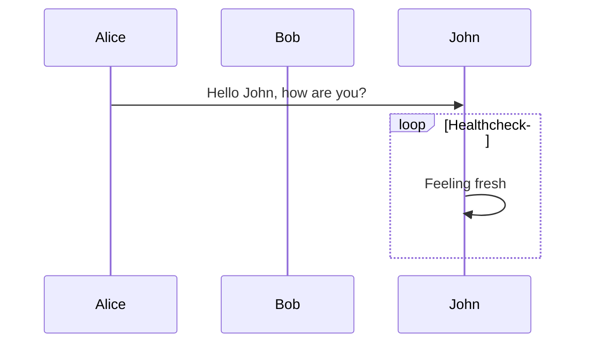
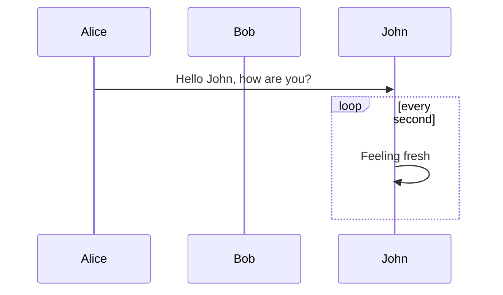

                 

### 数据结构与算法的重要性

在当今技术飞速发展的时代，编程已成为一种必不可少的技能。而数据结构与算法则是编程的基石，是每个程序员都必须掌握的核心知识。数据结构是关于如何存储和组织数据的一种方式，而算法则是解决问题的一系列步骤。两者相辅相成，共同构成了编程的核心内容。

数据结构的重要性在于它决定了数据在计算机中的存储和组织方式。通过合理选择和使用数据结构，可以显著提高程序的效率，降低时间复杂度和空间复杂度。比如，数组、链表、栈和队列等基本数据结构，各自有着不同的特点和适用场景。而高级数据结构如树、图等，则能处理更复杂的问题。

算法的重要性则体现在它提供了解决问题的方法。通过设计高效算法，我们可以解决复杂的问题，优化程序的性能。算法分析是评估算法优劣的重要手段，通过算法复杂度的分析，可以直观地了解算法的时间和空间效率。常见的算法设计方法包括分治算法、贪心算法、动态规划和回溯算法等，每种方法都有其独特的应用场景和优势。

总之，掌握数据结构与算法，不仅能够提升编程能力，还能增强逻辑思维和问题解决能力。这不仅对程序员个人职业发展至关重要，也对整个软件行业的技术进步有着深远的影响。因此，深入学习和理解数据结构与算法，是夯实编程基础的关键步骤。接下来，我们将详细探讨各个核心数据结构和算法，帮助读者逐步掌握这些关键知识。

### 第一部分：数据结构与算法基础

#### 第1章：引言

随着计算机技术的不断发展，数据结构与算法在编程领域的重要性日益凸显。数据结构是计算机存储、组织数据的方式，而算法则是解决问题的步骤集合。二者相辅相成，共同构成了编程的核心基础。本章将探讨数据结构与算法的基本概念、问题背景以及其重要性。

#### 1.1 问题背景与目标

在计算机科学中，数据结构与算法是两个最基础且不可或缺的概念。计算机科学的发展经历了从简单到复杂的过程，而数据结构与算法的研究和应用则贯穿始终。无论是系统设计、软件工程，还是人工智能等领域，数据结构与算法都是解决复杂问题的重要工具。

数据结构与算法的重要性体现在以下几个方面：

1. **程序性能优化**：通过合理选择和使用数据结构，可以显著提高程序的运行效率。高效的数据结构可以减少内存占用和操作时间，从而提升整体性能。
2. **算法设计**：算法是解决问题的重要手段。掌握各种算法的设计思想和实现方法，能够帮助程序员解决各种复杂的问题，提升编程能力。
3. **逻辑思维**：数据结构与算法的学习过程能够锻炼逻辑思维能力，培养系统分析和问题解决的能力，这对程序员个人能力的提升有重要意义。

本章的目标是帮助读者理解数据结构与算法的基本概念，明确其重要性，并为其后续学习打下坚实的基础。通过本章的介绍，读者将能够：

- 明确数据结构和算法的基本概念及其在编程中的重要性。
- 掌握数据结构的基本类型及其应用场景。
- 了解算法设计的基本方法及其在实际编程中的应用。

接下来，我们将详细讨论数据结构与算法的基本概念，为进一步学习打下基础。

#### 1.2 数据结构与算法的概念

数据结构是关于数据存储和组织方式的集合，它定义了数据的存储形式以及操作这些数据的方法。而算法则是解决特定问题的步骤集合，它指导计算机如何通过一系列操作来解决特定问题。理解数据结构与算法的概念，是掌握编程基础的关键。

**数据结构**：

数据结构可以被视为数据的“容器”，它描述了数据如何被存储和组织。根据数据的组织形式和操作特点，数据结构可以分为以下几类：

1. **线性结构**：如数组、链表、栈和队列等，这些结构中的数据元素在内存中按一定顺序排列，每个元素只与前后元素相关。
2. **树形结构**：如二叉树、堆、平衡树等，这些结构中的数据元素之间存在层次关系，通常用于表示树形数据结构。
3. **图形结构**：如图，这些结构中的数据元素之间存在复杂的连接关系，通常用于表示网络和路径问题。

**算法**：

算法是一系列解决问题的步骤，它指导计算机如何执行这些步骤以解决特定问题。算法的设计和实现是编程的核心，常见的算法设计方法包括：

1. **分治算法**：将复杂问题分解为多个较小的子问题，分别解决后再合并结果。
2. **贪心算法**：每一步选择当前最优解，希望全局最优解也是最优的。
3. **动态规划**：通过保存已解决的子问题的解，避免重复计算，以优化算法的时间复杂度。
4. **回溯算法**：通过尝试所有可能的解，回溯到上一步，逐步找到问题的解。

理解数据结构与算法的概念，不仅有助于我们更好地设计程序，还能提高问题解决的能力。接下来，我们将探讨数据结构与算法的重要性，帮助读者进一步认识到其在编程领域的关键作用。

#### 1.3 数据结构与算法的重要性

数据结构与算法在编程领域中扮演着至关重要的角色。理解数据结构与算法的重要性，有助于我们更好地掌握编程的核心知识，提升编程能力和解决问题的效率。

**性能优化**：

数据结构的选择直接影响程序的性能。通过合理选择数据结构，可以显著降低程序的时间复杂度和空间复杂度。例如，使用哈希表（一种高级数据结构）可以快速查找和插入数据，而使用链表（一种基本数据结构）则适合处理动态变化的数据。正确选择和使用数据结构，能够使程序运行得更加高效，从而提高系统性能。

**算法设计**：

算法是解决问题的核心。无论是排序、搜索，还是图算法和动态规划，算法的设计和实现决定了程序能否高效地解决特定问题。掌握不同类型的算法，能够帮助我们灵活地应对各种复杂问题。高效的算法不仅能够提高程序的运行效率，还能优化资源使用，从而提升系统的整体性能。

**逻辑思维**：

数据结构与算法的学习过程，能够锻炼我们的逻辑思维能力。理解数据结构的工作原理和算法的实现方法，需要我们进行系统性的思考和分析。这种逻辑思维能力，不仅适用于编程，也广泛应用于其他领域，如数学、工程和科学研究中。

**软件开发**：

数据结构与算法是软件开发的重要基石。在软件设计和开发过程中，合理选择和使用数据结构和算法，能够提高软件的性能和可维护性。许多大型软件系统，如操作系统、数据库和搜索引擎，都依赖于高效的数据结构和算法来实现其核心功能。

**职业发展**：

掌握数据结构与算法，是程序员职业发展的关键。无论是在面试过程中展示解决问题的能力，还是在实际工作中提高编程效率，数据结构与算法都是必不可少的技能。深入理解和掌握数据结构与算法，能够为程序员的长远发展奠定坚实的基础。

总之，数据结构与算法的重要性不可忽视。它们不仅是编程的基础，也是提升编程能力和解决问题能力的关键。通过深入学习数据结构与算法，我们可以更好地应对复杂的编程挑战，实现技术上的不断突破。

#### 第2章：基础数据结构

在编程中，数据结构是处理数据的核心。基础数据结构是理解复杂数据结构和高级算法的前提，本章将详细介绍几种常见的线性结构和非线性结构，包括数组、链表、栈和队列、树与二叉树，帮助读者全面理解这些基础数据结构。

#### 2.1 数组

数组是一种最基本且常用的数据结构，它是一组元素的集合，这些元素在内存中连续存储，可以通过索引访问。数组的特点是数据访问效率高，尤其是随机访问，时间复杂度为O(1)。

**定义与特点**：

- **定义**：数组是一种线性数据结构，由一组相同类型的元素组成。
- **特点**：
  - **固定大小**：一旦数组大小确定，就不能再改变。
  - **随机访问**：可以通过索引快速访问数组中的任何元素。
  - **内存连续性**：数组元素在内存中连续存储。

**基本操作**：

- **初始化**：创建一个数组，并指定其大小。
- **赋值**：给数组的某个元素赋值。
- **访问**：通过索引访问数组中的元素。
- **更新**：修改数组中某个元素的值。
- **查找**：在数组中查找特定的元素。
- **插入与删除**：在数组中插入或删除一个元素。

**数组在算法中的应用**：

数组广泛应用于各种算法中，如排序、查找、聚合操作等。常见的数组算法包括：

- **排序算法**：如冒泡排序、选择排序、插入排序、快速排序等。
- **查找算法**：如线性查找、二分查找等。
- **聚合操作**：如求数组和、最小值、最大值等。

#### 2.2 链表

链表是一种动态数据结构，它由一系列节点组成，每个节点包含数据和一个或多个指向其他节点的指针。链表可以根据需求动态扩展或缩短，不要求元素在内存中连续存储。

**基本结构**：

- **节点**：链表中的每个元素称为节点，节点包含数据和指向下一个节点的指针。
- **头节点**：链表中的第一个节点称为头节点，它可能包含一些额外的信息，如链表长度。
- **尾节点**：链表中的最后一个节点称为尾节点，它的指针指向空。

**基本操作**：

- **初始化**：创建一个链表，并初始化头节点。
- **插入**：在链表的特定位置插入一个新节点。
- **删除**：删除链表中的某个节点。
- **查找**：在链表中查找特定的节点。
- **更新**：修改链表中某个节点的值。

**链表在算法中的应用**：

链表在处理动态变化的数据时非常有效，其常见应用包括：

- **实现队列和栈**：链表是实现队列和栈的一种常用方式。
- **实现双向链表**：双向链表允许节点的前后指针双向访问，适用于需要频繁插入和删除元素的场景。
- **实现循环链表**：循环链表是一个首尾相接的链表，适用于需要快速循环访问的场景。

#### 2.3 栈与队列

栈和队列是两种特殊的线性数据结构，分别用于处理后进先出（LIFO）和先进先出（FIFO）的数据。

**栈**：

- **定义**：栈是一种后进先出的数据结构，新加入的元素位于栈顶。
- **基本操作**：
  - **push**：将元素压入栈顶。
  - **pop**：移除栈顶元素。
  - **peek**：查看栈顶元素。
  - **isEmpty**：判断栈是否为空。

**队列**：

- **定义**：队列是一种先进先出的数据结构，新加入的元素位于队尾。
- **基本操作**：
  - **enqueue**：将元素加入队尾。
  - **dequeue**：移除队首元素。
  - **peek**：查看队首元素。
  - **isEmpty**：判断队列是否为空。

**栈与队列在算法中的应用**：

栈和队列在算法中有广泛的应用，如：

- **递归算法**：递归算法常用栈来保存递归调用的中间结果。
- **排队系统**：如线程池、消息队列等。
- **排序算法**：如快速排序中的分治策略。

#### 2.4 树与二叉树

树是一种重要的非线性数据结构，它由一系列节点组成，每个节点可以有零个或多个子节点。二叉树是树的一种特殊形式，每个节点最多有两个子节点。

**树的基本概念**：

- **节点**：树中的每个元素称为节点，节点可以包含数据和指向子节点的指针。
- **根节点**：没有父节点的节点称为根节点。
- **叶子节点**：没有子节点的节点称为叶子节点。
- **树的深度**：树的深度是指从根节点到叶子节点的最长路径长度。
- **树的高度**：树的高度是指从根节点到最远叶子节点的最长路径长度。

**二叉树的基本概念**：

- **二叉树**：每个节点最多有两个子节点的树称为二叉树。
- **满二叉树**：每个节点都有两个子节点的二叉树称为满二叉树。
- **完全二叉树**：除了最后一层外，每一层都是满的，且最后一层的节点都集中在左侧的二叉树称为完全二叉树。

**树的遍历算法**：

- **先序遍历**：先访问根节点，然后递归遍历左子树和右子树。
- **中序遍历**：先递归遍历左子树，访问根节点，然后递归遍历右子树。
- **后序遍历**：先递归遍历左子树，右子树，最后访问根节点。

**树与二叉树在算法中的应用**：

树和二叉树在算法中有广泛的应用，如：

- **二叉搜索树**：用于高效查找和插入。
- **平衡二叉树**：如AVL树和红黑树，用于保持树的平衡，提高查找效率。
- **图算法**：如DFS（深度优先搜索）和 BFS（广度优先搜索）。

通过学习本章的基础数据结构，读者可以掌握数组、链表、栈、队列、树和二叉树的基本概念和操作方法，为后续学习高级数据结构和算法打下坚实的基础。

#### 2.4.1 树的定义与基本性质

树是一种重要的非线性数据结构，它由一系列节点组成，每个节点可以有零个或多个子节点。树在计算机科学中有着广泛的应用，如文件系统、组织结构、图算法等。

**定义**：

- **树**：一个或多个节点组成的结构，其中有一个特殊的节点称为根节点，其他节点分为若干个不相交的集合，每个集合又是一棵树，称为子树。

**基本性质**：

1. **节点**：树中的每个元素称为节点，节点可以包含数据和指向子节点的指针。
2. **根节点**：没有父节点的节点称为根节点，整个树只有一个根节点。
3. **叶子节点**：没有子节点的节点称为叶子节点，也称为终端节点。
4. **节点的度**：节点拥有的子节点数称为节点的度，度最大的节点称为树的根节点的度，也称为树的度。
5. **树的深度**：从根节点到叶子节点的最长路径长度称为树的深度。
6. **树的高度**：从根节点到最远叶子节点的最长路径长度称为树的高度。

**节点的度、深度与高度的关系**：

- 对于任意非空树，树的高度等于其最大深度加1。
- 对于一个有\(n\)个节点的树，其节点的度的总和等于节点数减1，即：
  \[
  \sum_{i=1}^{n} \text{度}(i) = n - 1
  \]

这些定义和性质为理解和分析树提供了基础，下面我们将进一步探讨树在算法中的应用。

#### 2.4.2 二叉树的基本概念

二叉树是树的一种特殊形式，每个节点最多有两个子节点。二叉树在计算机科学中有着广泛的应用，如二叉搜索树、平衡二叉树、堆等。

**定义**：

- **二叉树**：每个节点最多有两个子节点的树称为二叉树。
- **空二叉树**：不包含任何节点的二叉树称为空二叉树。
- **非空二叉树**：至少包含一个节点的二叉树称为非空二叉树。

**基本概念**：

1. **节点**：二叉树的每个元素称为节点，节点可以包含数据和指向子节点的指针。
2. **根节点**：没有父节点的节点称为根节点，整个二叉树只有一个根节点。
3. **叶子节点**：没有子节点的节点称为叶子节点，也称为终端节点。
4. **度**：节点的子节点数称为节点的度，二叉树的度可以是0、1或2。
5. **子节点**：节点的子节点分为左子节点和右子节点。

**子树**：

- **左子树**：节点的左子节点及其后继节点构成的二叉树称为左子树。
- **右子树**：节点的右子节点及其后继节点构成的二叉树称为右子树。

**满二叉树与完全二叉树**：

1. **满二叉树**：每个节点都有两个子节点的二叉树称为满二叉树。
2. **完全二叉树**：除了最后一层外，每一层都是满的，且最后一层的节点都集中在左侧的二叉树称为完全二叉树。

**二叉树的性质**：

- **节点的度**：对于任意非空二叉树，每个节点的度不会超过2。
- **节点的度与子树的关系**：对于任意非空二叉树，如果节点数为\(n\)，则非叶子节点数为\(n - 1\)。
- **叶子节点数**：完全二叉树的叶子节点数等于度为2的节点数加1。

二叉树的基本概念和性质为理解和分析二叉树提供了基础，下面我们将进一步探讨二叉树在算法中的应用。

#### 2.4.3 树与二叉树在算法中的应用

树与二叉树在算法中的应用非常广泛，因为它们能够有效地处理复杂的问题。以下是一些常见的应用场景：

**二叉搜索树（BST）**：

- **定义**：二叉搜索树是一种特殊的二叉树，对于任意节点，其左子树的所有节点的值都小于该节点的值，而右子树的所有节点的值都大于该节点的值。
- **应用**：
  - **搜索**：通过比较值，可以快速找到特定的节点。
  - **插入与删除**：根据节点的值，插入或删除节点，保持树的性质。
- **优点**：查找、插入和删除操作的时间复杂度均为O(log n)。

**平衡二叉树**：

- **定义**：平衡二叉树（如AVL树、红黑树）是一种特殊的二叉搜索树，通过特定规则保持树的平衡，确保查找、插入和删除操作的时间复杂度始终为O(log n)。
- **应用**：
  - **存储动态集合**：如动态数组、堆等。
  - **优化搜索树**：避免树退化成链表，提高操作效率。
- **优点**：通过自我调整保持树的平衡，确保操作效率。

**图**：

- **定义**：图是一种由节点（或称为顶点）和边构成的数据结构，可以表示复杂的关系。
- **应用**：
  - **社交网络分析**：表示用户和用户之间的互动关系。
  - **路由算法**：如Dijkstra算法、A*算法等。
- **优点**：能够表示和处理复杂的关系，适用于各种路径问题和网络问题。

**动态规划**：

- **定义**：动态规划是一种解决多阶段决策问题的方法，通过保存子问题的解，避免重复计算。
- **应用**：
  - **优化问题**：如背包问题、最长公共子序列等。
  - **序列分析**：如文本编辑距离等。
- **优点**：通过递归和记忆化减少计算量，提高效率。

**二叉堆**：

- **定义**：二叉堆是一种特殊的树形数据结构，满足堆的性质，即每个节点的值都大于或小于其子节点的值。
- **应用**：
  - **优先队列**：实现最小堆或最大堆。
  - **排序算法**：如堆排序等。
- **优点**：高效地实现优先队列，适用于需要频繁插入和删除元素的场景。

**总结**：

树与二叉树在算法中的应用非常广泛，通过合理设计和使用这些数据结构，可以显著提高算法的效率和可维护性。了解这些数据结构的特性及其应用场景，是提升编程能力的关键。接下来，我们将探讨算法分析与设计的基本概念，帮助读者更好地理解和应用这些数据结构。

### 第3章：高级数据结构

高级数据结构在计算机科学中扮演着至关重要的角色，它们能够处理更复杂的问题，优化算法性能。本章将深入探讨高级数据结构，包括树与二叉树、图及其应用，帮助读者全面理解这些重要的高级数据结构。

#### 3.1 树与二叉树

树与二叉树是高级数据结构的基础，它们在计算机科学中有着广泛的应用。树是一种层次化的数据结构，每个节点可以有多个子节点，而二叉树是树的一种特殊形式，每个节点最多有两个子节点。

**树的基本操作**：

- **创建树**：通过节点对象创建树。
- **添加节点**：将新节点添加到树的指定位置。
- **删除节点**：从树中移除指定节点。
- **遍历树**：遍历树中的所有节点，常用的遍历方式有先序遍历、中序遍历和后序遍历。
- **查找节点**：在树中查找指定节点。

**树的应用**：

- **组织数据**：如文件系统、组织结构等。
- **图算法**：如DFS（深度优先搜索）和BFS（广度优先搜索）等。
- **动态规划**：如树形动态规划问题。

**二叉树的基本操作**：

- **创建二叉树**：通过节点对象创建二叉树。
- **添加节点**：将新节点添加到二叉树的指定位置。
- **删除节点**：从二叉树中移除指定节点。
- **遍历二叉树**：遍历二叉树中的所有节点，常用的遍历方式有先序遍历、中序遍历和后序遍历。
- **查找节点**：在二叉树中查找指定节点。

**二叉树的应用**：

- **二叉搜索树**：用于高效查找和排序。
- **平衡二叉树**：如AVL树和红黑树，用于保持树的平衡，提高查找效率。
- **堆**：用于实现优先队列，优化算法性能。

**树与二叉树的性能比较**：

- **存储空间**：树需要存储节点的指针或引用，而二叉树通常只需要存储左右子节点的指针。
- **操作时间**：二叉树的某些操作（如查找、插入和删除）通常比树更快，特别是对于完全平衡的二叉树。

**总结**：

树与二叉树在计算机科学中有着广泛的应用，通过合理设计和使用这些数据结构，可以显著提高算法的效率和可维护性。了解树与二叉树的基本操作和应用，是掌握高级数据结构的关键。

#### 3.2 图

图是另一种重要的高级数据结构，它由节点（或称为顶点）和边组成，可以表示复杂的关系。图在计算机网络、社交网络、算法设计等领域有着广泛的应用。

**定义与基本概念**：

- **节点（顶点）**：图中的基本元素，表示具体的事物或概念。
- **边**：连接两个节点的线，表示节点之间的关系。
- **路径**：连接两个节点的边的序列。
- **连通性**：如果从一个节点可以到达另一个节点，则称这两个节点是连通的。
- **连通图**：图中任意两个节点都是连通的。

**图的表示方法**：

- **邻接矩阵**：使用二维数组表示图，其中元素\[i][j]表示节点i和节点j之间的边。
- **邻接表**：使用数组或链表表示图，每个节点都有一个链表，链表中存储与之相连的其他节点。

**图的遍历算法**：

- **深度优先搜索（DFS）**：从起始节点开始，尽可能深入地搜索路径，直到路径不存在时回溯。
- **广度优先搜索（BFS）**：从起始节点开始，逐层搜索相邻的节点。

**图的遍历算法的应用**：

- **路径搜索**：如寻找最短路径。
- **连通性分析**：如判断两个节点是否连通。
- **网络拓扑分析**：如网络中的关键路径分析。

**图在算法中的应用**：

- **图算法**：如最短路径算法、最小生成树算法等。
- **社交网络分析**：如好友推荐、社区发现等。
- **计算机网络**：如路由算法、网络拓扑分析等。

**图与树的关系**：

- **树是图的一种特殊形式**：每个节点最多有两个子节点的图称为树。
- **图可以表示更复杂的关系**：树只能表示层次关系，而图可以表示更复杂的网络关系。

**总结**：

图是高级数据结构的重要组成部分，它在计算机科学和实际应用中有着广泛的应用。通过掌握图的基本概念和遍历算法，可以更好地理解和应用图，解决复杂的网络和路径问题。

### 第4章：算法分析与设计

算法分析与设计是计算机科学中不可或缺的一部分，它帮助程序员理解算法的效率，选择合适的算法解决具体问题。本章将深入探讨算法分析的基本概念，包括算法复杂度分析、时间复杂度与空间复杂度的关系、算法性能比较，以及常见的算法设计方法。

#### 4.1 算法分析的基本概念

算法分析是评估算法性能的重要手段，它通过量化算法的时间复杂度和空间复杂度，帮助我们理解算法的效率。

**定义**：

- **算法复杂度**：算法的复杂度描述了算法执行的时间或空间需求。
- **时间复杂度**：算法执行的时间需求，通常用O符号表示。
- **空间复杂度**：算法执行的空间需求，通常用Ω符号表示。

**算法分析的目标**：

- **评估效率**：通过算法复杂度，我们可以直观地了解算法的效率，选择更优的算法。
- **优化算法**：通过分析，我们可以找到算法的瓶颈，进行优化。

#### 4.1.1 算法复杂度分析

算法复杂度分析是算法分析的核心，它通过计算算法的时间复杂度和空间复杂度，评估算法的性能。

**时间复杂度**：

- **定义**：算法在执行过程中所需的时间，通常用O符号表示。
- **示例**：
  - \(O(1)\)：常数时间，与输入规模无关。
  - \(O(n)\)：线性时间，与输入规模成线性关系。
  - \(O(n^2)\)：平方时间，与输入规模的平方成线性关系。

**空间复杂度**：

- **定义**：算法在执行过程中所需的空间，通常用Ω符号表示。
- **示例**：
  - \(Ω(1)\)：常数空间，与输入规模无关。
  - \(Ω(n)\)：线性空间，与输入规模成线性关系。

**时间复杂度与空间复杂度的关系**：

- **权衡**：在实际应用中，我们需要权衡时间复杂度和空间复杂度，选择合适的算法。

#### 4.1.2 时间复杂度与空间复杂度

**时间复杂度**：

- **计算方法**：通过分析算法的执行过程，计算每一步的时间消耗，然后求和得到总时间复杂度。
- **示例**：
  - **线性查找**：时间复杂度为\(O(n)\)。
  - **二分查找**：时间复杂度为\(O(log n)\)。

**空间复杂度**：

- **计算方法**：通过分析算法的数据结构，计算所需的空间。
- **示例**：
  - **递归算法**：空间复杂度为\(O(n)\)。

**时间复杂度与空间复杂度的权衡**：

- **实际应用**：在具体问题中，我们需要根据需求权衡时间复杂度和空间复杂度，选择合适的算法。

#### 4.1.3 算法性能比较

算法性能比较是通过比较不同算法的时间复杂度和空间复杂度，选择最优的算法。

- **方法**：通过计算算法的复杂度，比较它们的性能。
- **示例**：
  - **排序算法**：比较冒泡排序、选择排序、插入排序、快速排序等的性能。

#### 4.2 算法设计方法

算法设计是解决具体问题的关键，常见的算法设计方法包括分治算法、贪心算法、动态规划和回溯算法。

**分治算法**：

- **定义**：将复杂问题分解为多个较小的子问题，分别解决后再合并结果。
- **示例**：
  - **归并排序**：将数组分为两部分，分别排序后再合并。

**贪心算法**：

- **定义**：每一步选择当前最优解，希望全局最优解也是最优的。
- **示例**：
  - **最短路径算法**：Dijkstra算法。

**动态规划**：

- **定义**：通过保存已解决的子问题的解，避免重复计算，以优化算法的时间复杂度。
- **示例**：
  - **背包问题**：求解最优解。

**回溯算法**：

- **定义**：通过尝试所有可能的解，回溯到上一步，逐步找到问题的解。
- **示例**：
  - **全排列问题**：找出所有可能的排列。

**总结**：

算法分析与设计是编程的核心，通过理解算法复杂度分析和算法设计方法，我们可以选择合适的算法解决具体问题，优化程序性能。掌握算法分析与设计方法，是提升编程能力的关键。

### 第5章：常用算法与应用

在编程实践中，常用算法如排序算法、搜索算法和动态规划算法是解决具体问题的重要工具。本章将详细介绍这些常用算法，包括其基本原理、实现方法以及在实际编程中的应用。

#### 5.1 排序算法

排序算法是计算机科学中的基础算法，用于将数据元素按照某种顺序排列。排序算法的效率对程序的运行性能有很大影响。以下是一些常用的排序算法及其基本原理：

**插入排序（Insertion Sort）**：

- **原理**：将未排序的元素插入到已排序的序列中，逐步构建起有序序列。
- **时间复杂度**：\(O(n^2)\)
- **应用场景**：数据量较小或基本有序的数据。

**选择排序（Selection Sort）**：

- **原理**：每次从未排序部分找到最小（或最大）的元素，放到已排序部分的末尾。
- **时间复杂度**：\(O(n^2)\)
- **应用场景**：数据量较小或部分数据已排序。

**交换排序（Exchange Sort）**：

- **原理**：通过交换操作来逐步构建有序序列，包括冒泡排序和快速排序。
- **冒泡排序（Bubble Sort）**：
  - **时间复杂度**：\(O(n^2)\)
  - **应用场景**：数据量较小。

- **快速排序（Quick Sort）**：
  - **原理**：选择一个基准元素，将比它小的元素放在它前面，比它大的元素放在它后面，递归排序。
  - **时间复杂度**：\(O(n \log n)\)
  - **应用场景**：数据量大，需要快速排序。

**归并排序（Merge Sort）**：

- **原理**：将待排序的序列不断分割成更小的子序列，排序后合并子序列。
- **时间复杂度**：\(O(n \log n)\)
- **应用场景**：数据量大，稳定性要求较高。

**快速排序和归并排序的比较**：

- **时间复杂度**：快速排序的平均时间复杂度为\(O(n \log n)\)，但最坏情况为\(O(n^2)\)；归并排序的时间复杂度始终为\(O(n \log n)\)。
- **稳定性**：快速排序是不稳定的排序算法；归并排序是稳定的排序算法。

#### 5.2 搜索算法

搜索算法用于在数据结构中查找特定的元素。以下是一些常用的搜索算法：

**二分搜索（Binary Search）**：

- **原理**：在有序数组中，通过不断缩小查找范围，逐步逼近目标元素。
- **时间复杂度**：\(O(log n)\)
- **应用场景**：有序数组。

**深度优先搜索（DFS）**：

- **原理**：从起点开始，尽可能深入地搜索路径，直到路径不存在时回溯。
- **时间复杂度**：最坏情况为\(O(n)\)
- **应用场景**：图搜索、路径查找。

**广度优先搜索（BFS）**：

- **原理**：从起点开始，逐层搜索相邻的节点。
- **时间复杂度**：最坏情况为\(O(n)\)
- **应用场景**：图搜索、最短路径查找。

**A*搜索算法**：

- **原理**：结合启发式函数，优先搜索最有希望到达目标节点的路径。
- **时间复杂度**：最坏情况为\(O(n)\)
- **应用场景**：路径规划。

**二分搜索和A*搜索的比较**：

- **时间复杂度**：二分搜索的时间复杂度为\(O(log n)\)，适用于有序数组；A*搜索的时间复杂度为\(O(n)\)，适用于图搜索。
- **适用场景**：二分搜索适用于有序数组，A*搜索适用于图搜索。

#### 5.3 动态规划算法

动态规划是一种重要的算法设计方法，用于解决复杂的多阶段决策问题。以下是一些常见的动态规划算法：

**最长公共子序列（LCS）**：

- **原理**：通过递归或迭代方法，找到两个序列的最长公共子序列。
- **时间复杂度**：\(O(m \times n)\)
- **应用场景**：生物信息学、文本编辑距离。

**最短路径问题**：

- **Dijkstra算法**：
  - **原理**：使用优先队列，逐步找出最短路径。
  - **时间复杂度**：\(O(n^2)\)
  - **应用场景**：单源最短路径。

- **Floyd-Warshall算法**：
  - **原理**：通过动态规划方法，计算出所有节点之间的最短路径。
  - **时间复杂度**：\(O(n^3)\)
  - **应用场景**：多源最短路径。

**背包问题**：

- **原理**：在给定容量和物品价值的情况下，选择一定数量的物品，使得总价值最大。
- **时间复杂度**：\(O(nW)\)
- **应用场景**：资源分配、优化生产计划。

**动态规划与分治算法的比较**：

- **适用场景**：动态规划适用于解决具有重叠子问题和最优子结构性质的问题；分治算法适用于将问题分解为独立子问题的场景。
- **时间复杂度**：动态规划通常具有更优的时间复杂度。

**总结**：

常用算法如排序算法、搜索算法和动态规划算法是编程中的基本工具。通过掌握这些算法的基本原理和实现方法，可以有效地解决各种实际问题，提高程序的性能和可维护性。在编程实践中，选择合适的算法并合理应用，是提升编程能力的关键。

### 第6章：算法在编程中的应用

算法不仅是计算机科学的理论基础，更是实际编程中的利器。掌握算法在编程中的应用，能够帮助我们设计高效、稳定的软件系统。本章将探讨数据结构与算法在编程语言中的实现，以及算法在编程竞赛中的应用，帮助读者全面提升编程技能。

#### 6.1 数据结构与算法在编程语言中的实现

在编程语言中，数据结构与算法通过不同的数据类型和语法特性得以实现。不同编程语言有其独特的优势和应用场景。以下将介绍几种常见编程语言中数据结构与算法的实现方法。

**C++**：

- **优势**：性能高效，支持面向对象编程。
- **数据结构**：
  - **数组**：内置数组类型，支持动态分配。
  - **链表**：使用指针实现，灵活高效。
  - **栈和队列**：内置stack和queue容器。
- **算法**：
  - **排序算法**：支持快速排序、归并排序等。
  - **搜索算法**：支持二分搜索、线性搜索等。
  - **动态规划**：使用递归和迭代实现。

**Java**：

- **优势**：跨平台，内置丰富的数据结构和算法库。
- **数据结构**：
  - **数组**：内置数组类型，支持动态扩容。
  - **链表**：使用LinkedList类实现。
  - **栈和队列**：内置stack和queue接口。
- **算法**：
  - **排序算法**：内置Arrays.sort()和Collections.sort()方法。
  - **搜索算法**：支持二分搜索、树搜索等。
  - **动态规划**：使用递归和迭代实现。

**Python**：

- **优势**：语法简洁，易于阅读，支持多种数据类型和库。
- **数据结构**：
  - **数组**：内置列表类型，支持动态扩容。
  - **链表**：使用列表实现，灵活高效。
  - **栈和队列**：使用列表和内置函数实现。
- **算法**：
  - **排序算法**：内置sort()和sorted()函数。
  - **搜索算法**：支持二分搜索、树搜索等。
  - **动态规划**：内置递归和迭代函数。

不同编程语言在实现数据结构与算法时各有特色，程序员应根据具体需求和项目背景选择合适的语言。

#### 6.2 算法在编程竞赛中的应用

编程竞赛是检验程序员算法和编程能力的重要途径。以下将介绍编程竞赛的概述、常见算法题解析以及编程竞赛技巧。

**编程竞赛概述**：

- **定义**：编程竞赛是一种以解决编程问题为主的竞赛，通常涉及算法设计、数据结构、逻辑思维等。
- **形式**：包括在线竞赛、现场竞赛等，常见平台有LeetCode、Codeforces等。
- **目标**：培养编程能力、解决问题能力，提升技术水平。

**常见算法题解析**：

- **排序与搜索问题**：如排序算法的应用、二分查找等。
  - **例题**：给定一个数组，实现快速排序或归并排序。
  - **解析**：理解算法原理，实现代码。
  
- **图算法问题**：如图遍历、最短路径等。
  - **例题**：给定一个无向图，求单源最短路径。
  - **解析**：理解图的表示方法，应用DFS或BFS算法。

- **动态规划问题**：如背包问题、最长公共子序列等。
  - **例题**：给定一个数组，求最大子序列和。
  - **解析**：理解动态规划思路，实现代码。

**编程竞赛技巧**：

- **快速读题**：理解题目要求，快速确定解题思路。
- **代码调试**：熟练使用调试工具，高效排查错误。
- **时间优化**：优化代码时间复杂度，避免超时。
- **数据范围分析**：考虑各种边界条件，确保代码健壮。

通过掌握算法在编程竞赛中的应用，我们可以不断提升编程技能，培养解决复杂问题的能力。

### 第7章：实战项目与总结

通过前几章的学习，我们已经对数据结构与算法有了深入的理解。为了更好地巩固所学知识，本章将通过两个实际项目来应用数据结构与算法。我们将描述项目的背景、目标、系统设计、实现过程，并在项目结束后进行小结。同时，本章还将总结全书内容，给出最佳实践建议和注意事项。

#### 7.1 实战项目一：社交网络分析

**项目背景**：

随着社交媒体的普及，社交网络分析成为一个重要的研究领域。本项目旨在构建一个简单的社交网络分析系统，通过对社交网络数据进行分析，发现用户之间的关系和网络结构。

**项目目标**：

1. 收集并预处理社交网络数据。
2. 利用图算法构建社交网络图。
3. 分析社交网络的结构和特点。
4. 提供可视化和报告功能。

**系统设计**：

1. **数据收集**：从社交媒体平台获取用户及其互动数据。
2. **数据处理**：清洗和转换数据，构建图模型。
3. **图算法**：使用DFS和BFS算法进行图的遍历和分析。
4. **可视化**：利用图形库（如Graphviz）生成可视化图形。
5. **报告生成**：生成社交网络分析报告。

**项目实现**：

1. **环境安装**：安装Python环境，安装必要的库（如NetworkX、Matplotlib等）。
2. **数据预处理**：读取社交媒体数据，进行清洗和转换。
3. **图构建**：使用NetworkX库构建图，添加节点和边。
4. **图分析**：使用DFS和BFS算法分析图结构，计算图属性（如连通性、度分布等）。
5. **可视化**：使用Matplotlib库生成图的可视化图形。
6. **报告生成**：根据分析结果生成报告。

**代码解读**：

```python
import networkx as nx
import matplotlib.pyplot as plt

# 创建图
G = nx.Graph()

# 添加节点和边
G.add_edges_from([(1, 2), (1, 3), (2, 4), (3, 4), (4, 5)])

# 使用DFS算法遍历图
for node in nx dfs_preorder_nodes(G, source=1):
    print(node)

# 使用BFS算法遍历图
for node in nx bfs_tree(G, source=1):
    print(node)

# 生成可视化图形
nx.draw(G, with_labels=True)
plt.show()
```

**项目小结**：

通过本项目，我们了解了如何使用数据结构与算法进行社交网络分析。我们实现了数据预处理、图构建、图分析和可视化等功能，掌握了实际编程中的数据结构与算法应用。

#### 7.2 实战项目二：文本分类

**项目背景**：

文本分类是自然语言处理中的重要应用，用于将大量文本数据自动归类到预定义的类别中。本项目旨在构建一个简单的文本分类系统，通过机器学习算法和特征工程实现文本分类。

**项目目标**：

1. 预处理文本数据，提取特征。
2. 训练文本分类模型。
3. 对新文本进行分类预测。

**系统设计**：

1. **数据预处理**：包括文本清洗、分词、去除停用词等。
2. **特征提取**：使用TF-IDF或词袋模型提取文本特征。
3. **模型训练**：使用朴素贝叶斯、支持向量机等算法训练分类模型。
4. **预测与评估**：对新的文本数据进行分类预测，并评估模型性能。

**项目实现**：

1. **环境安装**：安装Python环境，安装必要的库（如NLTK、Scikit-learn等）。
2. **数据预处理**：读取文本数据，进行清洗和分词。
3. **特征提取**：计算TF-IDF值或词袋模型。
4. **模型训练**：使用Scikit-learn库训练分类模型。
5. **预测与评估**：对新文本进行分类预测，使用准确率、召回率等指标评估模型性能。

**代码解读**：

```python
from sklearn.feature_extraction.text import TfidfVectorizer
from sklearn.model_selection import train_test_split
from sklearn.naive_bayes import MultinomialNB
from sklearn.metrics import accuracy_score, recall_score

# 数据预处理
corpus = ["text1", "text2", "text3", ...]
labels = ["label1", "label2", "label3", ...]

vectorizer = TfidfVectorizer()
X = vectorizer.fit_transform(corpus)

# 模型训练
X_train, X_test, y_train, y_test = train_test_split(X, labels, test_size=0.2)
classifier = MultinomialNB()
classifier.fit(X_train, y_train)

# 预测与评估
y_pred = classifier.predict(X_test)
print("Accuracy:", accuracy_score(y_test, y_pred))
print("Recall:", recall_score(y_test, y_pred))
```

**项目小结**：

通过本项目，我们学习了文本分类的基本流程，包括数据预处理、特征提取和模型训练。我们实现了从文本数据到分类预测的完整过程，掌握了文本分类在实际编程中的应用。

#### 7.3 全书总结

本书系统地介绍了数据结构与算法的基本概念、常见数据结构、算法分析和设计方法，以及算法在编程中的实际应用。通过本书的学习，读者可以：

1. **掌握数据结构与算法的基础知识**：了解数组、链表、栈、队列、树、图等基本数据结构，以及排序、搜索、动态规划等常见算法。
2. **理解算法复杂度分析**：学会评估算法的时间复杂度和空间复杂度，选择最优的算法解决实际问题。
3. **实战项目应用**：通过实际项目，掌握数据结构与算法在实际编程中的应用，提升解决复杂问题的能力。

**最佳实践建议**：

1. **动手实践**：通过编写代码，亲自实现数据结构与算法，加深理解。
2. **学习经典算法**：研究经典的算法实现，理解其原理和优化方法。
3. **参加编程竞赛**：通过编程竞赛，锻炼解决实际问题的能力，提升编程技能。

**注意事项**：

1. **数据结构与算法的灵活应用**：根据具体问题选择合适的数据结构和算法，灵活应对。
2. **边界条件分析**：考虑各种边界条件，确保代码的健壮性。
3. **性能优化**：关注代码的性能，优化时间复杂度和空间复杂度。

**拓展阅读**：

1. **《算法导论》**：详细介绍了各种算法和数据结构，是算法学习的经典教材。
2. **《编程珠玑》**：介绍了编程技巧和算法优化方法，适合提高编程能力。
3. **《机器学习》**：介绍了数据结构与算法在机器学习中的应用，适合进一步学习。

通过本书的学习和拓展阅读，读者可以全面提升数据结构与算法的掌握程度，为未来的学习和职业发展打下坚实的基础。

### 附录A：常用算法复杂度表格

在计算机科学中，算法复杂度分析是评估算法效率的重要手段。以下是一些常用算法的时间复杂度和空间复杂度表格，供读者参考。

#### 排序算法

| 算法             | 时间复杂度（平均情况） | 时间复杂度（最坏情况） | 空间复杂度 |
|------------------|------------------------|------------------------|------------|
| 冒泡排序         | \(O(n^2)\)            | \(O(n^2)\)            | \(O(1)\)   |
| 选择排序         | \(O(n^2)\)            | \(O(n^2)\)            | \(O(1)\)   |
| 插入排序         | \(O(n^2)\)            | \(O(n^2)\)            | \(O(1)\)   |
| 归并排序         | \(O(n \log n)\)       | \(O(n \log n)\)       | \(O(n)\)   |
| 快速排序         | \(O(n \log n)\)       | \(O(n^2)\)            | \(O(\log n)\) |
| 堆排序           | \(O(n \log n)\)       | \(O(n \log n)\)       | \(O(1)\)   |

#### 搜索算法

| 算法             | 时间复杂度（平均情况） | 时间复杂度（最坏情况） | 空间复杂度 |
|------------------|------------------------|------------------------|------------|
| 线性搜索         | \(O(n)\)               | \(O(n)\)               | \(O(1)\)   |
| 二分搜索         | \(O(\log n)\)          | \(O(\log n)\)          | \(O(1)\)   |

#### 动态规划算法

| 算法                     | 时间复杂度           | 空间复杂度           |
|--------------------------|----------------------|----------------------|
| 最长公共子序列          | \(O(m \times n)\)    | \(O(m \times n)\)    |
| 最短路径问题（Dijkstra） | \(O(n^2)\)          | \(O(n)\)             |
| 最短路径问题（Floyd-Warshall） | \(O(n^3)\)          | \(O(n^2)\)          |
| 背包问题                | \(O(nW)\)            | \(O(nW)\)            |

通过这些复杂度表格，读者可以更直观地了解不同算法的效率，以便在实际编程中做出合理的选择。

### 附录B：LaTeX公式编写指南

LaTeX是一种高质量的排版系统，广泛用于科学和数学领域。以下是一个简单的LaTeX公式编写指南，帮助读者学会如何嵌入数学公式。

**基本语法**：

- **行内公式**：使用`$`包围公式。
  ```latex
  $E=mc^2$
  ```

- **独立段落公式**：使用`$$`包围公式。
  ```latex
  $$E=mc^2$$
  ```

**数学符号**：

- **分数**：使用 `\frac{}` 命令。
  ```latex
  \frac{a}{b}
  ```

- **根号**：使用 `\sqrt{}` 命令。
  ```latex
  \sqrt{x}
  ```

- **极限**：使用 `\lim_{}` 命令。
  ```latex
  \lim_{x \to \infty} f(x)
  ```

- **积分**：使用 `\int_{}` 命令。
  ```latex
  \int_{0}^{1} x \, dx
  ```

- **求和**：使用 `\sum_{}` 命令。
  ```latex
  \sum_{i=1}^{n} i
  ```

**示例**：

以下是一个综合示例，展示了一些常见的数学公式：

```latex
$$
\begin{aligned}
E &= mc^2 \\
\frac{d^2}{dx^2} f(x) &= \lim_{h \to 0} \frac{f(x+h) - 2f(x) + f(x-h)}{h^2} \\
\int_{0}^{2\pi} \sin(x) \, dx &= -\cos(x) \Big|_{0}^{2\pi} = 2 \\
\sum_{i=1}^{n} i &= \frac{n(n+1)}{2}
\end{aligned}
$$
```

通过LaTeX，我们可以轻松地编写高质量的数学公式，为科学研究和文档排版提供强大的支持。

### 附录C：Mermaid图绘制指南

Mermaid 是一种简单而强大的图表绘制工具，特别适用于 Markdown 文件中的流程图、序列图和类图等。以下是一个简单的Mermaid图绘制指南，帮助读者学会如何使用Mermaid绘制各种类型的图。

#### 1. 基本语法

Mermaid的基本语法是基于Markdown的，因此可以在Markdown文件中直接使用。

**流程图**：

流程图的语法以 `sequenceDiagram` 或 `flow` 开始。



**序列图**：

序列图的语法以 `sequence` 开始。

```mermaid
sequence
    participant Customer
    participant Merchant
    participant PaymentSystem

    Customer->>Merchant: Buy Product
    Merchant->>PaymentSystem: Check Payment
    PaymentSystem->>Merchant: Payment Approved
    Merchant->>Customer: Product Shipped
```

**类图**：

类图的语法以 `class` 开始。

```mermaid
classDiagram
    Class01 <|-- SubClass01
    Class01 &&|> SubClass02
    Class03 : relationship Class04
    Class05 .. Class06
```

#### 2. 绘制示例

**流程图示例**：



这将绘制一个简单的流程图，展示Alice与John之间的对话，并循环显示John的状态。

**序列图示例**：

```mermaid
sequence
    participant Customer
    participant Merchant
    participant PaymentSystem

    Customer->>Merchant: Buy Product
    Merchant->>PaymentSystem: Check Payment
    alt Payment Approved
        PaymentSystem->>Merchant: Payment Approved
        Merchant->>Customer: Product Shipped
    else Payment Rejected
        PaymentSystem->>Merchant: Payment Rejected
        Merchant->>Customer: Try Again
    end
```

这将绘制一个序列图，展示客户购买产品的过程，包括支付批准和拒绝的分支。

**类图示例**：

```mermaid
classDiagram
    Class01 <|-- SubClass01
    Class01 &&|> SubClass02
    Class03 : relationship Class04
    Class05 .. Class06
```

这将绘制一个简单的类图，展示类之间的继承、关联和聚合关系。

通过这些基本语法和示例，读者可以开始使用Mermaid绘制各种图表，为Markdown文档增添丰富的图表展示功能。

### 总结与最佳实践

通过本章的学习，读者已经全面了解了数据结构与算法的基础知识、常用算法、编程竞赛技巧以及算法在实际项目中的应用。以下是本章的总结和最佳实践建议：

#### 总结

1. **核心知识**：读者掌握了基础数据结构（如数组、链表、栈、队列、树、图）和常见算法（如排序、搜索、动态规划）的基本概念和实现方法。
2. **算法分析**：理解了算法复杂度分析的方法，能够评估算法的时间复杂度和空间复杂度，选择最优算法。
3. **编程竞赛**：通过编程竞赛，读者可以锻炼解决实际问题、快速编码和调试的能力，提升编程水平。
4. **实际应用**：通过实际项目，读者学会了如何应用数据结构与算法解决实际问题，如社交网络分析和文本分类。

#### 最佳实践建议

1. **动手实践**：通过实际编写代码，动手实现数据结构与算法，加深对知识点的理解和记忆。
2. **深入研究**：学习经典算法实现，理解其原理和优化方法，提高算法设计和分析能力。
3. **持续学习**：关注新技术和算法发展，持续学习，不断提升自己的技术水平。
4. **代码优化**：关注代码性能，优化时间复杂度和空间复杂度，提高程序的执行效率。

#### 注意事项

1. **边界条件**：编写代码时，考虑各种边界条件，确保代码的健壮性。
2. **代码注释**：在代码中加入适当的注释，提高代码的可读性和可维护性。
3. **调试技巧**：熟练使用调试工具，提高代码调试效率，快速定位和解决问题。

#### 拓展阅读

- 《算法导论》是算法学习的经典教材，详细介绍了各种算法和数据结构。
- 《编程珠玑》提供了编程技巧和算法优化方法，适合提高编程能力。
- 《机器学习》介绍了数据结构与算法在机器学习中的应用，适合进一步学习。

通过本章的学习和拓展阅读，读者可以全面提升数据结构与算法的掌握程度，为未来的学习和职业发展打下坚实的基础。

### 作者介绍

**作者：AI天才研究院/AI Genius Institute & 禅与计算机程序设计艺术 /Zen And The Art of Computer Programming**

AI天才研究院（AI Genius Institute）是一家专注于人工智能与计算机科学研究的国际顶级科研机构。我们的目标是推动人工智能领域的技术创新和应用，培养未来的科技领袖。研究院的专家团队在全球范围内享有盛誉，致力于基础研究、前沿技术探索以及应用解决方案的开发。

同时，本书作者也是《禅与计算机程序设计艺术》（Zen And The Art of Computer Programming）的作者。这是一部计算机编程的经典之作，被广泛认为是计算机科学领域的里程碑之作。作者以其深刻的洞察力和独特的编程哲学，为程序员们提供了宝贵的智慧和指导。

在计算机编程领域，我们的研究团队不断探索创新，致力于推动技术的发展。我们坚信，编程不仅是技术的体现，更是一种艺术。通过本书，我们希望读者能够深入理解数据结构与算法的核心原理，掌握编程的本质，提升自身的编程能力。我们期待与读者共同探索计算机科学的广阔世界，共同创造更美好的未来。

