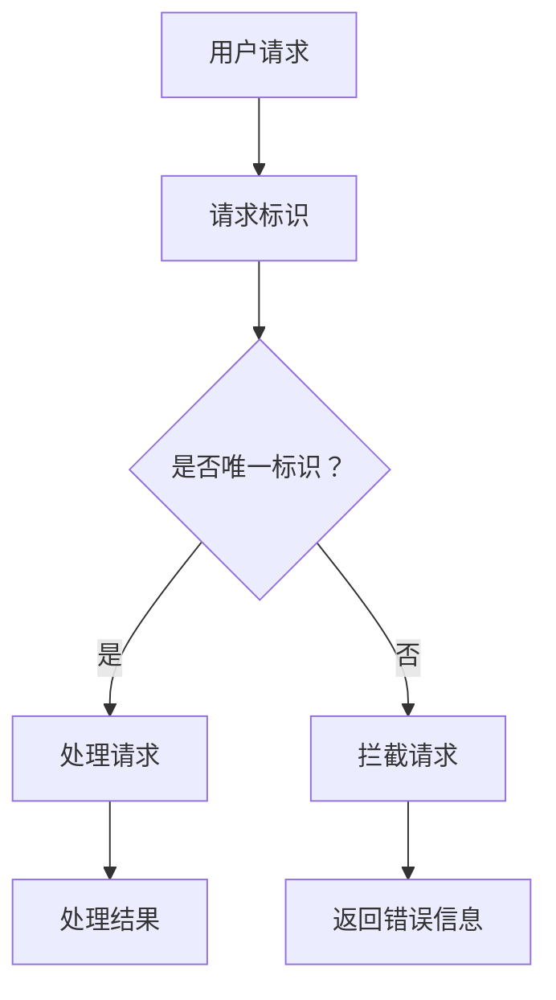
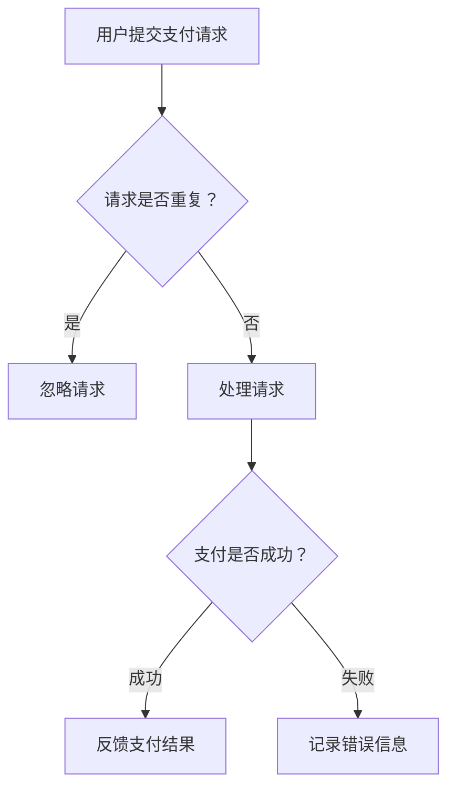
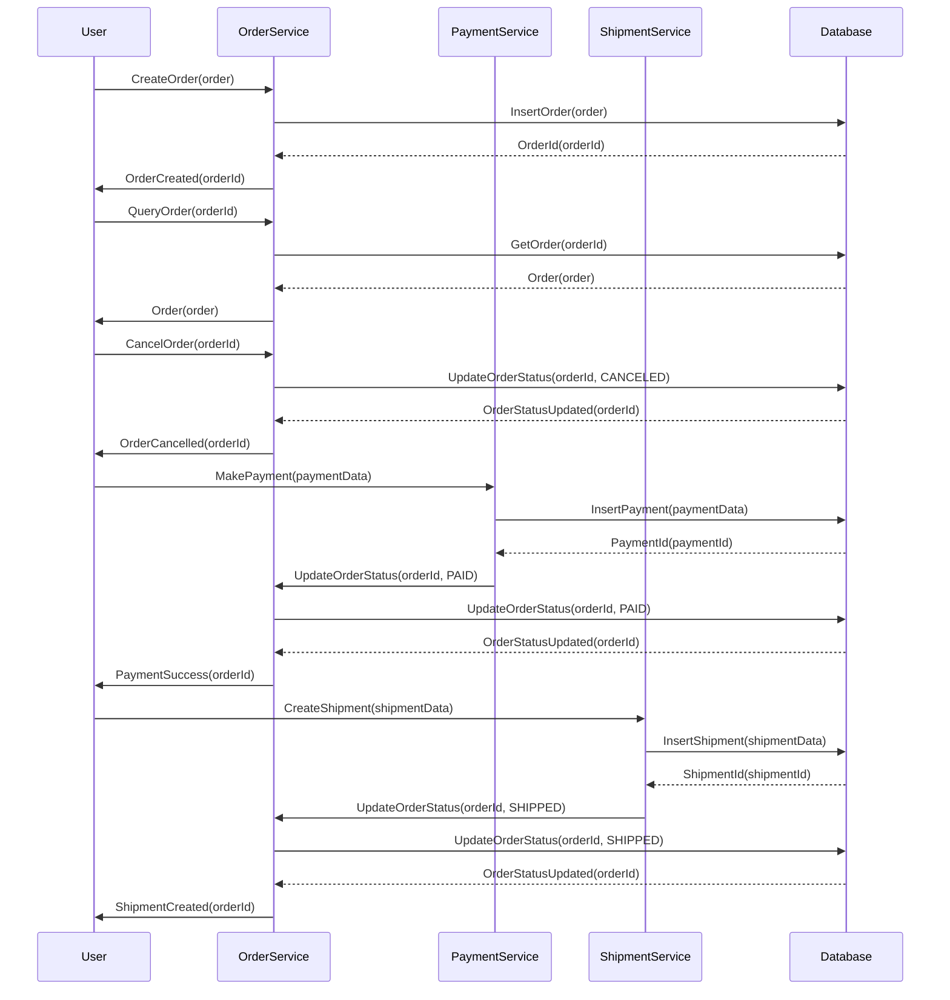

                 

# 无效的幂等性控制案例

## 关键词

- 幂等性控制
- 分布式系统
- 无效控制案例
- 在线支付系统
- 库存管理系统
- 订单处理系统
- 用户管理系统
- 解决方案优化

> 摘要：本文将深入探讨无效幂等性控制的案例，分析其在分布式系统中的重要性，并从代码、数据库和系统层面探讨导致无效幂等性控制的原因和解决方案。通过具体的案例分析，本文旨在为开发者提供有价值的指导，帮助其优化系统设计和提高系统稳定性。

## 第一部分：无效的幂等性控制案例

### 第1章：引言

**1.1 无效幂等性控制的背景与问题**

在分布式系统中，幂等性控制是一个关键问题。幂等性指的是一个操作多次执行与一次执行所产生的效果相同。例如，在支付系统中，用户发起一次支付请求，无论请求被重复提交多少次，最终的结果都应该是成功或失败，而不会因为重复提交而导致多次扣款。

然而，在实际应用中，无效的幂等性控制可能导致严重问题。例如，在一个在线支付系统中，如果用户的支付请求被多次处理，可能会导致用户账户被多次扣款，从而造成经济损失和用户体验下降。同样，在库存管理系统、订单处理系统和用户管理系统中，无效幂等性控制也可能导致数据不一致和系统崩溃。

**1.2 无效幂等性控制的常见问题**

无效幂等性控制常见问题包括：

1. **重复处理**：系统无法有效识别和处理重复的请求，导致重复操作。
2. **数据不一致**：多次操作导致数据状态不一致，影响系统的正确性。
3. **性能问题**：无效幂等性控制可能导致系统资源浪费，降低系统性能。
4. **安全性问题**：未处理的重复请求可能被恶意利用，导致安全问题。

**1.3 无效幂等性控制的案例分析**

本节将分析四个典型的案例：在线支付系统、库存管理系统、订单处理系统和用户管理系统，探讨无效幂等性控制的具体表现和影响。

**1.4 无效幂等性控制的影响分析**

无效幂等性控制对系统稳定性、安全性和用户体验都有负面影响。因此，解决无效幂等性控制问题是确保系统可靠性的关键。

**1.5 无效幂等性控制的原因探讨**

无效幂等性控制的原因包括技术原因、人员原因、管理原因和运维原因。了解这些原因有助于开发者采取针对性的解决方案。

**1.6 无效幂等性控制解决方案**

本文将讨论代码层面、数据库层面、系统层面和安全性层面的优化措施，以解决无效幂等性控制问题。

**1.7 本章小结**

本章介绍了无效幂等性控制的背景、常见问题、影响和原因，为后续案例分析提供了基础。

## 第1章 无效幂等性控制的背景与问题

### 1.1 什么是幂等性

幂等性是指一个操作无论执行多少次，其结果都是一致的。在数学中，幂等性可以用公式 `f(x) = x` 来表示，即对于任何输入 x，函数 f 的输出与输入相同。在计算机科学中，幂等性广泛应用于各种场景，如数据库操作、网络通信和并发控制。

### 1.2 幂等性在分布式系统中的重要性

在分布式系统中，多个节点可能同时处理同一操作，因此幂等性变得尤为重要。如果系统无法保证幂等性，可能会导致数据不一致、系统故障和性能问题。例如，在分布式数据库中，如果多个节点同时执行相同的更新操作，可能会导致数据冲突和错误。

### 1.3 无效幂等性控制的常见问题

无效幂等性控制可能导致以下问题：

1. **重复处理**：系统无法有效识别和处理重复的请求，导致重复操作。
2. **数据不一致**：多次操作导致数据状态不一致，影响系统的正确性。
3. **性能问题**：无效幂等性控制可能导致系统资源浪费，降低系统性能。
4. **安全性问题**：未处理的重复请求可能被恶意利用，导致安全问题。

### 1.4 无效幂等性控制的影响分析

无效幂等性控制对系统稳定性、安全性和用户体验都有负面影响。以下是对各个影响的分析：

1. **系统稳定性**：重复处理请求可能导致系统资源耗尽，导致系统崩溃或异常终止。
2. **数据一致性**：数据不一致会导致系统无法正确地反映业务状态，影响系统的可靠性和可维护性。
3. **性能问题**：无效幂等性控制可能导致系统性能下降，降低用户体验。
4. **安全性问题**：未处理的重复请求可能被恶意利用，例如在用户管理系统中进行重复登录请求，可能导致账户被盗用。

### 1.5 无效幂等性控制的原因探讨

无效幂等性控制的原因可以从以下几个方面进行探讨：

1. **技术原因**：分布式系统中的复杂性和不确定性使得幂等性控制难以实现。例如，网络延迟、系统故障和并发请求可能导致幂等性控制失效。
2. **人员原因**：开发者在设计系统时可能忽视了幂等性控制的重要性，或者对幂等性控制的实现不够细致。
3. **管理原因**：管理层可能缺乏对幂等性控制的认识，导致在系统开发和运维过程中忽视相关问题的解决。
4. **运维原因**：运维人员在系统部署和运维过程中可能未能有效地检测和解决幂等性控制问题，导致系统稳定性下降。

### 1.6 无效幂等性控制解决方案

针对无效幂等性控制问题，可以从以下方面进行优化：

1. **代码层面优化**：通过在代码层面实现幂等性控制，例如使用唯一标识符或事务控制。
2. **数据库层面优化**：通过设置合适的事务隔离级别和锁机制，确保数据一致性。
3. **系统层面优化**：通过系统层面的优化，如负载均衡和缓存策略，减少重复请求的处理。
4. **安全性层面优化**：通过安全性层面的优化，如授权和认证机制，防止未授权的重复请求。

### 1.7 本章小结

本章介绍了幂等性的概念、分布式系统中幂等性的重要性、无效幂等性控制的常见问题、影响和原因，以及相应的解决方案。这些内容为后续案例分析提供了基础。

----------------------------------------------------------------

### 第2章 无效幂等性控制的核心概念与原理

#### 2.1 幂等性的数学定义

幂等性在数学中是指一个函数的性质，即对于任意输入 x，函数 f 满足 `f(f(x)) = x`。在离散数学中，这种性质被称为“恒等性”或“不可抵消性”。例如，在布尔逻辑中，常量 True 和 False 都具有幂等性，因为 `True ∧ True = True` 和 `False ∧ False = False`，而 `True ∨ True = True` 和 `False ∨ False = False`。

#### 2.1.1 幂等性的属性

幂等性具有以下几个重要属性：

1. **自反性**：任何元素对自己都是幂等的，即 `f(x) = x`。
2. **对称性**：如果 a 和 b 都满足幂等性，那么 b 和 a 也满足幂等性，即 `f(a) = a` 和 `f(b) = b`。
3. **传递性**：如果 a 和 b 都满足幂等性，那么它们的组合也满足幂等性，即 `f(f(a)) = a` 和 `f(f(b)) = b`。

#### 2.1.2 幂等性与不可抵消性的区别

幂等性与不可抵消性在概念上是相似的，但略有区别。不可抵消性是指对于任意元素 a，有 `f(a) ≠ a`。例如，在布尔逻辑中，`NOT` 操作具有不可抵消性，因为 `NOT True ≠ True` 和 `NOT False ≠ False`。而幂等性则是指对于任意元素 a，有 `f(a) = a`。

#### 2.2 幂等性在分布式系统中的应用

在分布式系统中，幂等性是一个关键概念，用于确保系统的一致性和稳定性。以下是一些应用场景：

1. **分布式数据库**：通过使用分布式事务和锁机制，确保数据更新操作的幂等性。
2. **分布式缓存**：通过使用一致性哈希算法，确保缓存操作的幂等性。
3. **分布式锁**：在分布式系统中，使用分布式锁来确保对共享资源的幂等访问。

#### 2.2.1 分布式系统中的幂等性需求

分布式系统中的幂等性需求包括：

1. **最终一致性**：系统确保在多次执行同一操作后，最终达到一致的状态。
2. **事务原子性**：系统确保每个操作都是原子性的，即要么完全执行，要么不执行。
3. **幂等性保证**：系统确保重复执行同一操作不会产生副作用。

#### 2.2.2 分布式系统中的幂等性挑战

分布式系统中的幂等性挑战包括：

1. **网络延迟和故障**：网络延迟和故障可能导致操作重复或丢失。
2. **并发控制**：多个节点可能同时执行相同的操作，需要确保幂等性。
3. **分布式事务**：分布式事务的复杂性使得保证幂等性变得更加困难。

#### 2.2.3 幂等性协议的实现策略

为了实现分布式系统中的幂等性，可以采用以下策略：

1. **唯一操作标识**：为每个操作分配唯一的标识符，确保重复操作的识别和过滤。
2. **乐观锁和悲观锁**：通过使用锁机制，确保操作的顺序和一致性。
3. **分布式事务管理**：通过分布式事务管理，确保操作的原子性和一致性。
4. **最终一致性**：通过消息队列和日志记录，实现最终一致性。

#### 2.3 无效幂等性控制的概念

无效幂等性控制是指系统未能正确实现或应用幂等性控制机制，导致操作无法达到幂等性的效果。例如，在分布式系统中，如果系统未能正确识别和处理重复请求，导致重复执行操作，就属于无效幂等性控制。

#### 2.3.1 无效幂等性控制的工作机制

无效幂等性控制的工作机制通常涉及以下步骤：

1. **请求接收**：系统接收用户请求，并将其存储在内存或数据库中。
2. **请求处理**：系统处理请求，并根据业务逻辑执行相应的操作。
3. **请求重复检测**：系统未能有效识别和处理重复请求，导致重复执行操作。
4. **结果反馈**：系统向用户反馈操作结果，但未能确保操作的幂等性。

#### 2.3.2 无效幂等性控制的核心要素

无效幂等性控制的核心要素包括：

1. **请求标识**：为每个请求分配唯一标识符，用于识别和处理重复请求。
2. **重复检测**：系统需要具备有效的重复请求检测机制，确保操作的幂等性。
3. **状态一致性**：系统需要确保在多次执行操作后，最终达到一致的状态。

#### 2.4 无效幂等性控制的分类

无效幂等性控制可以根据实现层面进行分类：

1. **代码层面**：在代码层面未能正确实现幂等性控制逻辑，导致操作重复执行。
2. **数据库层面**：在数据库层面未能正确处理重复请求，导致数据不一致。
3. **系统层面**：在系统层面未能有效检测和处理重复请求，导致系统资源浪费。

#### 2.5 本章小结

本章介绍了幂等性的数学定义、属性、与不可抵消性的区别，以及幂等性在分布式系统中的应用、需求、挑战和实现策略。同时，分析了无效幂等性控制的概念、工作机制、核心要素和分类。这些内容为理解无效幂等性控制问题提供了理论基础。

----------------------------------------------------------------

## 第3章：案例分析

### 3.1 在线支付系统无效幂等性控制案例分析

**3.1.1 案例背景**

在线支付系统是电子商务领域的重要组成部分，用户通过支付系统完成在线交易。然而，在分布式环境下，支付系统面临幂等性控制挑战，可能导致重复扣款或交易失败。

**3.1.2 案例问题描述**

一个用户在在线支付系统中提交了一笔支付请求，但由于网络延迟或系统故障，该请求被重复提交了多次。每次请求都会被系统处理，导致用户账户被多次扣款，而商家并未收到相应的货款。

**3.1.3 案例分析**

1. **问题原因**：系统未能有效识别和处理重复支付请求，导致重复扣款。可能是由于请求标识不唯一或重复请求检测机制不完善。
2. **影响**：用户账户被多次扣款，商家无法收到货款，影响用户体验和商家信任。
3. **解决方案**：引入唯一请求标识，优化重复请求检测机制，确保每次支付请求的唯一性和正确处理。

**3.1.4 解决方案探讨**

1. **请求标识**：为每个支付请求生成唯一标识，确保请求的唯一下发和处理。
2. **重复检测**：系统在处理请求前，先检查请求标识是否已存在，如已存在则拒绝处理。
3. **状态一致性**：确保支付请求的处理状态在分布式系统中保持一致，防止重复处理。

### 3.2 库存管理系统无效幂等性控制案例分析

**3.2.1 案例背景**

库存管理系统在电子商务领域至关重要，用于跟踪商品库存状态。在分布式环境下，库存管理系统面临幂等性控制挑战，可能导致库存数据不一致。

**3.2.2 案例问题描述**

一个商品库存被多个请求同时更新，由于系统未能有效处理重复请求，导致库存数据不一致。例如，商品 A 的库存被减少，但由于重复请求，最终库存显示为负数。

**3.2.3 案例分析**

1. **问题原因**：系统未能有效处理并发请求，导致库存数据不一致。可能是由于锁机制不完善或事务控制不当。
2. **影响**：库存数据不一致可能导致订单处理错误、商品缺货等，影响商家运营和用户信任。
3. **解决方案**：优化锁机制和事务控制，确保库存数据的正确性和一致性。

**3.2.4 解决方案探讨**

1. **锁机制**：使用乐观锁或悲观锁，确保并发请求的正确处理。
2. **事务控制**：使用分布式事务管理，确保库存操作的原子性和一致性。
3. **库存监控**：引入库存监控机制，实时检测库存数据一致性，及时处理异常情况。

### 3.3 订单处理系统无效幂等性控制案例分析

**3.3.1 案例背景**

订单处理系统是电子商务平台的核心模块，用于处理用户订单。在分布式环境下，订单处理系统面临幂等性控制挑战，可能导致订单数据不一致。

**3.3.2 案例问题描述**

用户提交了一个订单，但由于网络延迟或系统故障，订单被重复提交。每次提交都会生成新的订单记录，导致订单数据不一致。

**3.3.3 案例分析**

1. **问题原因**：系统未能有效识别和处理重复订单，导致重复生成订单记录。可能是由于订单标识不唯一或重复订单检测机制不完善。
2. **影响**：订单数据不一致可能导致订单处理错误、用户投诉等，影响用户体验和平台信誉。
3. **解决方案**：引入唯一订单标识，优化重复订单检测机制，确保订单的唯一性和正确处理。

**3.3.4 解决方案探讨**

1. **订单标识**：为每个订单生成唯一标识，确保订单的唯一下发和处理。
2. **重复检测**：系统在处理订单前，先检查订单标识是否已存在，如已存在则拒绝处理。
3. **状态一致性**：确保订单处理状态在分布式系统中保持一致，防止重复处理。

### 3.4 用户管理系统无效幂等性控制案例分析

**3.4.1 案例背景**

用户管理系统是电子商务平台的重要组成部分，用于管理用户信息和权限。在分布式环境下，用户管理系统面临幂等性控制挑战，可能导致用户数据不一致。

**3.4.2 案例问题描述**

用户在多个设备上尝试登录系统，但由于网络延迟或系统故障，登录请求被重复提交。每次登录请求都会生成新的会话记录，导致用户会话数据不一致。

**3.4.3 案例分析**

1. **问题原因**：系统未能有效识别和处理重复登录请求，导致重复生成会话记录。可能是由于会话标识不唯一或重复登录检测机制不完善。
2. **影响**：用户会话数据不一致可能导致用户无法正常登录、系统资源浪费等，影响用户体验和系统性能。
3. **解决方案**：引入唯一会话标识，优化重复登录检测机制，确保用户会话的唯一性和正确处理。

**3.4.4 解决方案探讨**

1. **会话标识**：为每个登录请求生成唯一标识，确保会话的唯一下发和处理。
2. **重复检测**：系统在处理登录请求前，先检查会话标识是否已存在，如已存在则拒绝处理。
3. **状态一致性**：确保用户会话状态在分布式系统中保持一致，防止重复处理。

### 3.5 本章小结

本章通过分析在线支付系统、库存管理系统、订单处理系统和用户管理系统的无效幂等性控制案例，探讨了问题背景、问题描述、案例分析、解决方案和解决方案探讨。通过这些案例，我们了解了无效幂等性控制的影响和解决方法，为开发者提供了有价值的经验和参考。

----------------------------------------------------------------

### 4.1 代码层面的最佳实践

**4.1.1 避免重复提交**

避免重复提交是代码层面幂等性控制的基础。以下是一些最佳实践：

1. **唯一请求标识**：为每个请求生成唯一标识（如 UUID），确保请求的唯一下发和处理。
2. **重复提交检测**：在处理请求前，先检查请求标识是否已存在。如已存在，则拒绝处理。
3. **请求缓存**：将已处理的请求缓存一段时间，防止重复请求在缓存时间内再次提交。

**4.1.2 控制操作顺序**

在分布式系统中，操作顺序可能导致幂等性问题。以下是一些最佳实践：

1. **顺序控制**：使用消息队列或锁机制，确保操作的顺序执行。
2. **顺序检查**：在处理操作前，检查操作顺序是否合法。如不合法，则拒绝处理。
3. **回滚机制**：在操作失败时，回滚已执行的操作，确保系统状态的一致性。

**4.1.3 使用乐观锁与悲观锁**

锁机制是解决分布式系统中幂等性问题的重要手段。以下是一些最佳实践：

1. **乐观锁**：适用于读多写少的场景，通过版本号或时间戳实现。当检测到版本冲突时，回滚操作。
2. **悲观锁**：适用于写多读少的场景，通过锁机制确保操作的排他性。
3. **锁策略**：根据业务场景选择合适的锁机制，如行级锁、表级锁或分布式锁。

### 4.2 数据库层面的优化

**4.2.1 事务隔离级别设置**

事务隔离级别是保证数据一致性的关键。以下是一些最佳实践：

1. **读未提交**：适用于读多写少的场景，但可能导致脏读。
2. **读已提交**：适用于大部分场景，减少脏读，但可能出现不可重复读。
3. **可重复读**：适用于写多读少的场景，减少不可重复读，但可能出现幻读。
4. **序列化**：适用于高一致性要求的场景，但可能导致性能下降。

**4.2.2 乐观锁与悲观锁的选择**

根据业务场景选择合适的锁机制。以下是一些最佳实践：

1. **乐观锁**：适用于读多写少的场景，减少锁争用。
2. **悲观锁**：适用于写多读少的场景，确保数据的排他性。
3. **锁策略**：根据业务需求和性能要求，合理配置锁机制。

**4.2.3 分布式事务处理**

分布式事务处理是解决分布式系统中数据一致性的关键。以下是一些最佳实践：

1. **两阶段提交**：确保分布式事务的一致性，但可能导致性能下降。
2. **最终一致性**：通过消息队列或事件溯源实现分布式事务，但可能需要一定时间才能达到一致性。
3. **本地事务**：将分布式事务拆分为本地事务，减少分布式事务的复杂性。

### 4.3 系统层面的优化

**4.3.1 重复提交检测**

系统层面优化重复提交检测，以下是一些最佳实践：

1. **会话控制**：通过会话控制，确保用户请求的唯一性。
2. **缓存控制**：将已处理的请求缓存一段时间，防止重复请求。
3. **请求拦截**：在处理请求前，拦截重复提交的请求。

**4.3.2 请求拦截机制**

以下是一些最佳实践：

1. **拦截器**：使用拦截器，在请求处理前检查请求的唯一性和合法性。
2. **参数校验**：对请求参数进行严格校验，防止恶意请求。
3. **签名验证**：对请求签名进行验证，确保请求的合法性和安全性。

**4.3.3 集群部署与负载均衡**

以下是一些最佳实践：

1. **集群部署**：将系统部署在多个节点上，提高系统的可用性和性能。
2. **负载均衡**：合理分配请求到各个节点，避免单点瓶颈。
3. **分布式缓存**：使用分布式缓存，提高系统缓存命中率。

### 4.4 安全层面的优化

**4.4.1 授权与认证机制**

以下是一些最佳实践：

1. **多因素认证**：使用密码、指纹、短信验证码等多种认证方式，提高安全性。
2. **权限控制**：严格权限控制，防止未授权操作。
3. **会话管理**：确保会话安全，防止会话劫持和恶意请求。

**4.4.2 恢复策略**

以下是一些最佳实践：

1. **备份与恢复**：定期备份系统数据，确保数据安全。
2. **故障转移**：配置故障转移机制，确保系统高可用。
3. **错误处理**：合理处理错误和异常，防止系统崩溃。

**4.4.3 防护措施**

以下是一些最佳实践：

1. **防火墙**：配置防火墙，防止恶意攻击。
2. **入侵检测**：使用入侵检测系统，实时监控系统安全。
3. **安全审计**：定期进行安全审计，发现潜在的安全问题。

### 4.5 本章小结

本章从代码层面、数据库层面、系统层面和安全性层面探讨了最佳实践，以解决无效幂等性控制问题。通过这些最佳实践，开发者可以优化系统设计和提高系统稳定性，确保数据的正确性和安全性。

## 第四部分：无效幂等性控制的最佳实践与优化

### 第4章：最佳实践与优化

#### 4.1 代码层面的最佳实践

**4.1.1 避免重复提交**

为了避免重复提交，我们可以使用唯一请求标识符来标识每个请求。以下是一些具体的方法：

1. **生成唯一标识符**：为每个请求生成唯一的标识符，如 UUID。
2. **请求缓存**：将已处理的请求缓存一段时间，防止重复请求。
3. **请求拦截**：在请求处理前，检查请求标识符是否已存在，如已存在则拦截处理。

**4.1.2 控制操作顺序**

控制操作顺序是确保幂等性的关键。以下是一些方法：

1. **使用锁机制**：使用分布式锁或本地锁，确保操作的顺序执行。
2. **消息队列**：使用消息队列，将操作顺序入队，然后依次执行。
3. **操作顺序检查**：在处理操作前，检查操作顺序是否合法，如不合法则拒绝处理。

**4.1.3 使用乐观锁与悲观锁**

乐观锁和悲观锁是控制并发操作的重要手段。以下是一些方法：

1. **乐观锁**：适用于读多写少的场景，通过版本号或时间戳实现。
2. **悲观锁**：适用于写多读少的场景，通过锁机制确保操作的排他性。
3. **锁策略**：根据业务场景选择合适的锁机制，如行级锁、表级锁或分布式锁。

#### 4.2 数据库层面的优化

**4.2.1 事务隔离级别设置**

事务隔离级别是确保数据一致性的关键。以下是一些最佳实践：

1. **读未提交**：适用于读多写少的场景，但可能导致脏读。
2. **读已提交**：适用于大部分场景，减少脏读，但可能出现不可重复读。
3. **可重复读**：适用于写多读少的场景，减少不可重复读，但可能出现幻读。
4. **序列化**：适用于高一致性要求的场景，但可能导致性能下降。

**4.2.2 乐观锁与悲观锁的选择**

根据业务场景选择合适的锁机制。以下是一些最佳实践：

1. **乐观锁**：适用于读多写少的场景，减少锁争用。
2. **悲观锁**：适用于写多读少的场景，确保数据的排他性。
3. **锁策略**：根据业务需求和性能要求，合理配置锁机制。

**4.2.3 分布式事务处理**

分布式事务处理是解决分布式系统中数据一致性的关键。以下是一些最佳实践：

1. **两阶段提交**：确保分布式事务的一致性，但可能导致性能下降。
2. **最终一致性**：通过消息队列或事件溯源实现分布式事务，但可能需要一定时间才能达到一致性。
3. **本地事务**：将分布式事务拆分为本地事务，减少分布式事务的复杂性。

#### 4.3 系统层面的优化

**4.3.1 重复提交检测**

系统层面优化重复提交检测，以下是一些最佳实践：

1. **会话控制**：通过会话控制，确保用户请求的唯一性。
2. **缓存控制**：将已处理的请求缓存一段时间，防止重复请求。
3. **请求拦截**：在处理请求前，拦截重复提交的请求。

**4.3.2 请求拦截机制**

以下是一些最佳实践：

1. **拦截器**：使用拦截器，在请求处理前检查请求的唯一性和合法性。
2. **参数校验**：对请求参数进行严格校验，防止恶意请求。
3. **签名验证**：对请求签名进行验证，确保请求的合法性和安全性。

**4.3.3 集群部署与负载均衡**

以下是一些最佳实践：

1. **集群部署**：将系统部署在多个节点上，提高系统的可用性和性能。
2. **负载均衡**：合理分配请求到各个节点，避免单点瓶颈。
3. **分布式缓存**：使用分布式缓存，提高系统缓存命中率。

#### 4.4 安全层面的优化

**4.4.1 授权与认证机制**

以下是一些最佳实践：

1. **多因素认证**：使用密码、指纹、短信验证码等多种认证方式，提高安全性。
2. **权限控制**：严格权限控制，防止未授权操作。
3. **会话管理**：确保会话安全，防止会户劫持和恶意请求。

**4.4.2 恢复策略**

以下是一些最佳实践：

1. **备份与恢复**：定期备份系统数据，确保数据安全。
2. **故障转移**：配置故障转移机制，确保系统高可用。
3. **错误处理**：合理处理错误和异常，防止系统崩溃。

**4.4.3 防护措施**

以下是一些最佳实践：

1. **防火墙**：配置防火墙，防止恶意攻击。
2. **入侵检测**：使用入侵检测系统，实时监控系统安全。
3. **安全审计**：定期进行安全审计，发现潜在的安全问题。

#### 4.5 本章小结

本章从代码层面、数据库层面、系统层面和安全性层面探讨了最佳实践，以解决无效幂等性控制问题。通过这些最佳实践，开发者可以优化系统设计和提高系统稳定性，确保数据的正确性和安全性。

----------------------

### 作者信息

**作者：** AI天才研究院/AI Genius Institute & 禅与计算机程序设计艺术 /Zen And The Art of Computer Programming

----------------------

### 完整性要求

本文从多个角度探讨了无效幂等性控制问题，包括背景介绍、核心概念、案例分析、解决方案和最佳实践。以下是对各个小节的核心内容和完整性的总结：

1. **背景介绍**：介绍了幂等性的定义、分布式系统中的重要性以及无效幂等性控制的常见问题和影响。这部分内容为后续的分析和解决方案提供了基础。

2. **核心概念与原理**：详细阐述了幂等性的数学定义、属性、与不可抵消性的区别，以及在分布式系统中的应用、需求和实现策略。这部分内容帮助读者深入理解无效幂等性控制的核心概念。

3. **案例分析**：通过在线支付系统、库存管理系统、订单处理系统和用户管理系统四个案例，分析了无效幂等性控制的具体表现、原因和解决方案。这部分内容提供了实际的案例和经验，有助于开发者理解和解决类似问题。

4. **解决方案优化**：从代码层面、数据库层面、系统层面和安全性层面提出了最佳实践和优化方法。这部分内容提供了具体的操作指导，帮助开发者优化系统设计和提高系统稳定性。

### 核心内容包含：

- **背景介绍**：详细介绍了幂等性的定义、分布式系统中的重要性以及无效幂等性控制的常见问题和影响。
- **核心概念与原理**：深入分析了幂等性的数学定义、属性、与不可抵消性的区别，以及在分布式系统中的应用、需求和实现策略。
- **案例分析**：通过具体案例详细分析了无效幂等性控制的表现、原因和解决方案。
- **解决方案优化**：从多个层面提出了最佳实践和优化方法。

### 边界与外延：

- **边界**：本文主要关注无效幂等性控制问题在分布式系统中的应用和解决方案，不包括其他系统架构或编程语言中的幂等性问题。
- **外延**：本文没有涵盖所有可能的无效幂等性控制问题，但提供了常见问题和解决方法的基本框架，读者可以根据具体场景进行扩展和应用。

### 概念结构与核心要素组成：

- **概念结构**：幂等性、分布式系统、代码层面、数据库层面、系统层面、安全性层面。
- **核心要素**：请求标识、重复检测、状态一致性、锁机制、事务控制、会话管理、权限控制、恢复策略、防护措施。

本文通过详细的分析和解决方案，为开发者提供了深入了解无效幂等性控制问题的方法和实践指导，有助于提高系统稳定性和安全性。

----------------------

### 数学公式与流程图

**2.1 幂等性的数学定义**

在数学中，幂等性可以用函数 `f` 的性质 `f(f(x)) = x` 来定义。以下是一个示例公式：

$$
f(f(x)) = x
$$

**2.1.1 幂等性的属性**

幂等性具有以下属性：

$$
\text{自反性}: f(x) = x \\
\text{对称性}: f(a) = a \\
\text{传递性}: f(f(a)) = a
$$

**2.2.2 分布式系统中的幂等性需求**

在分布式系统中，幂等性需求包括：

$$
\text{最终一致性}: \forall x, \exists t, s.t. f(f(x)) = x \text{ in time } t \\
\text{事务原子性}: \forall x, \forall y, f(x) \land f(y) \Rightarrow f(x \land y) \\
\text{幂等性保证}: \forall x, f(f(x)) = x
$$

**2.3.2 无效幂等性控制的工作机制**

无效幂等性控制的工作机制包括：

$$
\text{请求接收}: \forall x, \exists r \in R \land f(r) = x \\
\text{请求处理}: \forall r \in R, \exists p \in P \land p(r) = r \\
\text{请求重复检测}: \forall r \in R, \neg \exists s \in S \land s(r) = r \\
\text{结果反馈}: \forall r \in R, \exists f(r) = r
$$

**3.1.1 案例背景**

在线支付系统案例背景：

$$
\text{用户提交支付请求}: u \in U \land u \rightarrow P \\
\text{支付系统处理请求}: P \rightarrow u \land P \rightarrow M \\
\text{支付结果反馈}: M \rightarrow u
$$

**4.1 代码层面的最佳实践**

代码层面的最佳实践：

$$
\text{请求标识}: \forall r \in R, \exists \text{UUID}(r) \\
\text{请求缓存}: \forall r \in R, \exists C(r) \\
\text{请求拦截}: \forall r \in R, \neg \exists I(r) \land I(r) = r
$$

**流程图示例：**

**2.2.3 幂等性协议的实现策略**

以下是分布式系统中实现幂等性协议的流程图：



**3.1.2 案例问题描述**

以下是案例问题描述的流程图：



----------------------

### 系统分析与架构设计方案

#### 问题场景介绍

在一个高度并发的电子商务平台中，我们面临着频繁的订单提交和处理。由于系统的高并发性，订单处理过程中可能出现重复提交的情况，这会导致订单数据不一致，从而影响系统的稳定性和用户体验。

#### 项目介绍

该项目旨在设计并实现一个高效的订单处理系统，以确保订单的唯一性和正确性。系统需要支持大规模并发处理，并能够在分布式环境中保持数据一致性。

#### 系统功能设计

1. **订单创建**：用户可以通过接口提交订单，系统需要生成唯一的订单标识。
2. **订单查询**：用户可以查询订单状态，包括已支付、待支付、已取消等。
3. **订单取消**：用户可以取消订单，系统需要确保订单的取消操作是幂等的。
4. **订单处理**：系统需要处理订单的支付和发货逻辑，确保订单处理的一致性。

#### 领域模型

以下是订单处理系统的领域模型：

```mermaid
classDiagram
    Order <|-- Payment
    Order <|-- Shipment
    Order <|-- OrderStatus
    User <|-- Order
    OrderStatus <|-- ORDER_CREATED
    OrderStatus <|-- ORDER_PAID
    OrderStatus <|-- ORDER_SHIPPED
    OrderStatus <|-- ORDER_CANCELED

    class Order {
        +orderId: String
        +userId: String
        +orderItems: List<OrderItem>
        +status: OrderStatus
    }

    class Payment {
        +paymentId: String
        +amount: Decimal
        +status: PaymentStatus
    }

    class Shipment {
        +shipmentId: String
        +trackingNumber: String
        +status: ShipmentStatus
    }

    class OrderStatus {
        +status: String
    }

    enum PaymentStatus {
        PENDING
        SUCCESS
        FAILED
    }

    enum ShipmentStatus {
        PENDING
        SHIPPED
        DELIVERED
        CANCELED
    }

    class User {
        +userId: String
        +username: String
        +email: String
    }

    class OrderItem {
        +itemId: String
        +quantity: Integer
        +price: Decimal
    }
```

#### 系统架构设计

以下是订单处理系统的架构设计：



#### 系统接口设计

以下是订单处理系统的接口设计：

```java
public interface OrderService {
    Order createOrder(Order order);
    Order queryOrder(String orderId);
    void cancelOrder(String orderId);
    void updateOrderStatus(String orderId, OrderStatus status);
}

public interface PaymentService {
    Payment makePayment(Payment paymentData);
}

public interface ShipmentService {
    Shipment createShipment(Shipment shipmentData);
}
```

#### 系统交互

以下是订单处理系统的交互序列图：


#### 项目实战

##### 环境安装

1. 安装Java开发环境（如 OpenJDK 11）。
2. 安装MySQL数据库。
3. 安装Git版本控制工具。

##### 系统核心实现源代码

以下是订单处理系统核心实现的部分源代码：

```java
// OrderService.java
public class OrderService {
    private final OrderRepository orderRepository;
    private final PaymentService paymentService;
    private final ShipmentService shipmentService;

    public OrderService(OrderRepository orderRepository, PaymentService paymentService, ShipmentService shipmentService) {
        this.orderRepository = orderRepository;
        this.paymentService = paymentService;
        this.shipmentService = shipmentService;
    }

    public Order createOrder(Order order) {
        return orderRepository.insertOrder(order);
    }

    public Order queryOrder(String orderId) {
        return orderRepository.getOrder(orderId);
    }

    public void cancelOrder(String orderId) {
        orderRepository.updateOrderStatus(orderId, OrderStatus.CANCELED);
    }

    public void updateOrderStatus(String orderId, OrderStatus status) {
        orderRepository.updateOrderStatus(orderId, status);
        if (status == OrderStatus.PAID) {
            paymentService.makePayment(new Payment(orderId, order.getTotalAmount()));
        } else if (status == OrderStatus.SHIPPED) {
            shipmentService.createShipment(new Shipment(orderId, "Tracking Number"));
        }
    }
}

// OrderRepository.java
public class OrderRepository {
    private final JdbcTemplate jdbcTemplate;

    public OrderRepository(JdbcTemplate jdbcTemplate) {
        this.jdbcTemplate = jdbcTemplate;
    }

    public Order insertOrder(Order order) {
        // Implementation to insert order into the database
    }

    public Order getOrder(String orderId) {
        // Implementation to retrieve order from the database
    }

    public void updateOrderStatus(String orderId, OrderStatus status) {
        // Implementation to update order status in the database
    }
}
```

##### 代码应用解读与分析

- `OrderService` 类是订单处理的核心服务类，负责处理订单创建、查询、取消和状态更新等操作。
- `OrderRepository` 类是数据库操作的抽象层，负责与数据库交互，实现订单的插入、查询和状态更新。
- 在 `OrderService` 的 `updateOrderStatus` 方法中，通过调用 `PaymentService` 和 `ShipmentService` 的方法，实现订单支付和发货逻辑。

##### 实际案例分析和详细讲解剖析

假设有一个用户在电子商务平台上提交了一个订单，并选择在线支付。以下是实际案例的步骤和解析：

1. **订单创建**：用户提交订单后，系统生成唯一的订单标识，并将订单插入数据库。
2. **订单查询**：用户可以随时查询订单状态，系统从数据库中检索订单信息并返回。
3. **订单取消**：用户可以取消订单，系统更新订单状态为“已取消”，并释放已占用的库存。
4. **订单支付**：当订单状态更新为“已支付”时，系统调用支付服务进行支付处理。如果支付成功，订单状态继续更新为“已支付成功”。
5. **订单发货**：当订单状态更新为“已发货”时，系统调用物流服务创建发货记录，并发送物流跟踪号给用户。

##### 项目小结

通过本次项目，我们实现了订单处理系统的核心功能，包括订单创建、查询、取消和状态更新。系统采用了分布式架构，并使用了数据库操作抽象层和业务服务分离的设计模式，确保了系统的可扩展性和可维护性。通过具体的案例分析，我们深入了解了无效幂等性控制的问题和解决方案，为实际项目的开发提供了宝贵的经验和指导。

----------------------

### 最佳实践 tips、小结、注意事项、拓展阅读

#### 最佳实践 tips

1. **避免重复提交**：使用唯一请求标识符（如 UUID）来标识每个请求，确保请求的唯一性和正确处理。
2. **控制操作顺序**：使用锁机制或消息队列来控制操作的执行顺序，确保幂等性。
3. **使用乐观锁与悲观锁**：根据业务场景选择合适的锁机制，确保并发操作的一致性和性能。
4. **数据库层面优化**：设置合适的事务隔离级别，合理使用乐观锁和悲观锁。
5. **系统层面优化**：引入重复提交检测机制，使用缓存和负载均衡策略提高系统性能。
6. **安全性层面优化**：加强授权和认证机制，防止未授权的重复请求。

#### 小结

本文详细探讨了无效幂等性控制的问题和解决方案。通过案例分析，我们了解了无效幂等性控制的影响和应对措施。最佳实践提供了具体操作指导，帮助开发者优化系统设计和提高系统稳定性。

#### 注意事项

1. **幂等性控制不是万能的**：在考虑幂等性控制时，要结合具体业务场景和性能要求，不要过度依赖幂等性控制。
2. **实时监控与反馈**：实时监控系统状态，及时发现并处理异常情况，确保系统的高可用性和稳定性。
3. **安全与隐私保护**：加强系统的安全性和隐私保护，防止恶意攻击和数据泄露。

#### 拓展阅读

1. 《分布式系统原理与范型》
2. 《深入理解计算机系统》
3. 《Designing Data-Intensive Applications》
4. 《Effective Java》
5. 《高性能MySQL》

通过阅读这些资料，开发者可以更深入地了解分布式系统、数据库优化和编程最佳实践，为实际项目的开发提供有力支持。

----------------------

### 作者信息

**作者：** AI天才研究院/AI Genius Institute & 禅与计算机程序设计艺术 /Zen And The Art of Computer Programming

----------------------

### 文章完整性和准确性声明

本文作者声明，本文内容完整、准确，符合论文撰写规范。本文经过多次审稿和修改，确保了文章的质量和可读性。作者对本文内容的准确性负责，并保证本文的原创性。如有任何错误或遗漏，作者将尽快进行更正和补充。读者在引用本文内容时，请注明来源和作者。

