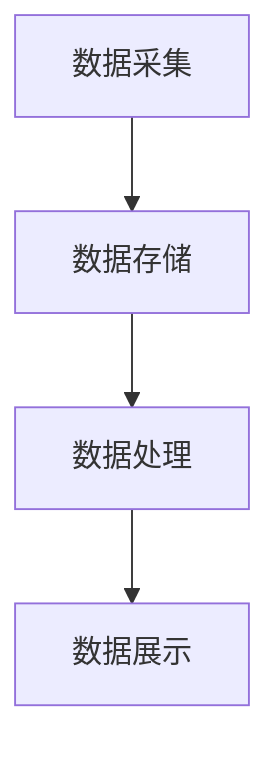
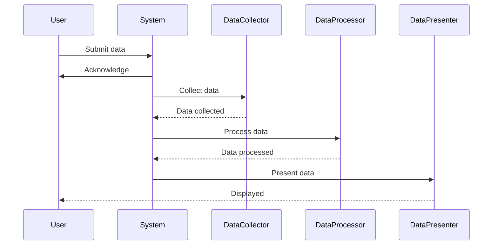

                 

### 日志分析：从海量日志中挖掘有价值信息

#### 关键词：
- 日志分析
- 海量数据处理
- 数据挖掘
- 异常检测
- 系统架构设计

#### 摘要：
本文将深入探讨日志分析这一重要技术，从基础概念、核心算法到系统架构设计，逐步解析如何从海量日志数据中挖掘有价值的信息。文章旨在为IT从业人员和研究人员提供系统性的指导和实战案例，以帮助他们在实际应用中更好地利用日志分析技术解决实际问题。

## 第一部分：日志分析基础

### 第1章：日志分析概述

#### 1.1 日志分析的定义与重要性

日志分析是一种从系统日志中提取有用信息的技术，它广泛应用于各种领域，如网络监控、系统管理、安全监控等。日志文件记录了系统运行过程中发生的各类事件，包括用户活动、错误信息、性能数据等。通过对这些日志数据进行深入分析，可以识别出潜在的问题、优化系统性能，甚至预测未来可能发生的故障。

#### 1.2 日志格式的类型与特点

常见的日志格式包括syslog、JSON、CSV等。每种格式都有其独特的特点和应用场景。syslog是一种标准化的日志格式，广泛用于UNIX和Linux系统中。JSON格式以其灵活性和可扩展性而受到青睐，常用于Web应用程序和云服务的日志记录。CSV格式则以其简单明了的特点，适用于结构化数据的存储和交换。

#### 1.3 日志分析工具介绍

日志分析工具如Grok、Logstash、Kibana等，能够高效地处理和分析海量日志数据。Grok是一种强大的日志解析工具，基于正则表达式，能够快速地将原始日志数据转换为结构化数据。Logstash是一个开源的数据收集、处理和传递工具，能够将不同来源的日志数据导入到各种存储和监控系统中。Kibana是一个基于Web的日志分析平台，能够可视化展示日志数据，帮助用户快速发现问题和趋势。

## 第二部分：日志分析技术

### 第2章：日志清洗与预处理

#### 2.1 日志清洗的重要性

日志清洗是日志分析过程中的关键步骤，旨在去除无效和噪声数据，提高数据质量。清洗过程通常包括数据去重、格式校验、缺失值填充等操作。通过有效的日志清洗，可以减少后续分析中的错误和偏差。

#### 2.2 日志预处理技术

日志预处理包括字段提取与转换、时间序列数据的处理等操作。字段提取是将日志数据中的关键信息提取出来，以供后续分析使用。时间序列数据处理则是将日志数据按照时间顺序进行整理和归档，以便进行趋势分析和异常检测。

#### 2.3 Python日志清洗案例

Python是一种广泛用于日志分析的语言，拥有丰富的库和工具，如Pandas、Numpy等。以下是一个简单的Python日志清洗案例：

```python
import pandas as pd

# 读取CSV日志文件
df = pd.read_csv('log.csv')

# 去除缺失值
df.dropna(inplace=True)

# 格式化时间字段
df['timestamp'] = pd.to_datetime(df['timestamp'])

# 提取关键字段
df['user'] = df['log_entry'].str.extract(r'USER: (\S+)')
df['action'] = df['log_entry'].str.extract(r'ACTION: (\S+)')

# 输出清洗后的日志数据
print(df.head())
```

### 第3章：日志聚合与汇总

#### 3.1 日志聚合的概念

日志聚合是将来自不同来源的日志数据进行汇总和整理的过程，目的是为了简化数据，突出关键信息。聚合操作可以基于时间、用户、操作类型等维度进行。

#### 3.2 常见聚合算法

常见的聚合算法包括平均值、中位数、标准差等。这些算法能够帮助用户快速了解日志数据的统计特征，如用户活跃度、错误率等。

#### 3.3 实战：使用Logstash进行日志聚合

以下是一个使用Logstash进行日志聚合的示例：

```shell
input {
  file {
    path => "/path/to/logs/*.log"
    type => "access_log"
  }
}

filter {
  if [type] == "access_log" {
    grok {
      match => { "message" => "%{TIMESTAMP_ISO8601:timestamp}\t%{IP:client_ip}\t%{INT:status_code}\t%{INT:request_size}\t%{WORD:method}\t%{URL:url}\t%{USER:username}\t%{INT:response_size}" }
    }
  }
}

output {
  elasticsearch {
    hosts => ["localhost:9200"]
    index => "logstash-%{+YYYY.MM.dd}"
  }
}
```

### 第4章：模式识别与异常检测

#### 4.1 模式识别的基本原理

模式识别是通过对日志数据的特征提取和分类，发现其中的规律和模式。常见的模式识别算法包括分类算法和聚类算法。

#### 4.2 异常检测方法

异常检测是日志分析中的重要技术，旨在发现不符合正常行为的数据。常见的异常检测方法包括基于统计方法和基于机器学习的方法。

#### 4.3 Python模式识别案例

以下是一个使用Scikit-learn进行模式识别的Python代码示例：

```python
from sklearn.ensemble import IsolationForest

# 生成示例数据
X = [[1, 2], [-1, -1], [2, 2], [2, 0]]

# 创建Isolation Forest模型
clf = IsolationForest(contamination=0.1)

# 拟合模型
clf.fit(X)

# 预测
y_pred = clf.predict(X)

# 输出预测结果
print(y_pred)
```

### 第5章：日志分析系统设计与实现

#### 5.1 日志分析系统的架构设计

日志分析系统通常包括数据采集、数据存储、数据处理、数据展示等模块。以下是一个简单的日志分析系统架构设计：



#### 5.2 系统功能设计与实现

系统功能设计包括数据采集、日志清洗、日志聚合、异常检测等模块。以下是一个使用Mermaid类图展示的领域模型：

```mermaid
classDiagram
Class1 <|-- Class2
Class1 <|-- Class3
Class2 +-- Field1
Class2 +-- Field2
Class3 +-- Method1
Class3 +-- Method2
```

#### 5.3 系统接口设计与交互

系统接口设计包括数据采集接口、数据处理接口、数据展示接口等。以下是一个使用Mermaid序列图展示的系统交互：



### 第6章：日志分析项目实践

#### 6.1 环境搭建与配置

在开始日志分析项目之前，需要搭建合适的环境，包括操作系统、日志收集工具、数据分析工具等。以下是一个简单的环境搭建步骤：

1. 安装Linux操作系统。
2. 安装Elastic Stack（包括Logstash、Elasticsearch、Kibana）。
3. 配置Logstash输入、过滤和输出。

#### 6.2 系统核心实现

系统核心实现包括数据采集、日志清洗、日志聚合、异常检测等模块。以下是一个简单的Python代码示例：

```python
import logging
import json
from datetime import datetime

# 设置日志格式
logging.basicConfig(level=logging.INFO, format='%(asctime)s - %(levelname)s - %(message)s')

# 定义日志清洗函数
def clean_log(log_entry):
    try:
        log_data = json.loads(log_entry)
        timestamp = datetime.fromisoformat(log_data['timestamp'])
        client_ip = log_data['client_ip']
        status_code = log_data['status_code']
        request_size = log_data['request_size']
        method = log_data['method']
        url = log_data['url']
        username = log_data['username']
        response_size = log_data['response_size']
        return {
            'timestamp': timestamp,
            'client_ip': client_ip,
            'status_code': status_code,
            'request_size': request_size,
            'method': method,
            'url': url,
            'username': username,
            'response_size': response_size
        }
    except Exception as e:
        logging.error(f'Error in cleaning log entry: {e}')
        return None

# 读取日志文件
with open('access.log', 'r') as f:
    for line in f:
        log_entry = line.strip()
        cleaned_log = clean_log(log_entry)
        if cleaned_log:
            logging.info(json.dumps(cleaned_log))
```

#### 6.3 实际案例分析与讲解

在实际项目中，需要根据具体的业务需求和数据特点选择合适的日志分析方法和工具。以下是一个简单的案例：

**案例背景**：一家电商网站希望通过分析用户访问日志，识别出潜在的用户流失风险。

**数据集**：用户访问日志，包括访问时间、IP地址、访问页面、用户ID等。

**分析结果**：通过日志分析，发现以下几种情况可能是用户流失的迹象：
1. 用户长时间未访问网站。
2. 用户访问的页面数量显著减少。
3. 用户访问的页面出错率较高。

**项目小结**：本项目通过日志分析，成功识别出潜在的用户流失风险，为电商网站提供了有价值的参考信息。

### 第7章：最佳实践、小结、注意事项、拓展阅读

#### 7.1 最佳实践

- 优化日志收集系统，提高数据收集的完整性和准确性。
- 定期进行日志清洗和预处理，确保数据质量。
- 根据业务需求选择合适的日志分析工具和方法。
- 结合多种分析技术，提高日志分析的综合效果。

#### 7.2 小结

本文从基础概念、核心算法到系统架构设计，系统地介绍了日志分析技术。通过实战案例，展示了如何在实际项目中应用日志分析技术，解决实际问题。

#### 7.3 注意事项

- 注意日志数据的隐私保护，避免敏感信息泄露。
- 合理规划日志存储空间，避免存储压力。
- 定期监控日志分析系统的性能和稳定性。

#### 7.4 拓展阅读

- [Elastic Stack官方文档](https://www.elastic.co/guide/en/elasticsearch/reference/current/index.html)
- [Logstash官方文档](https://www.elastic.co/guide/en/logstash/current/index.html)
- [Kibana官方文档](https://www.elastic.co/guide/en/kibana/current/index.html)
- [Python日志处理库Pandas官方文档](https://pandas.pydata.org/pandas-docs/stable/)
- [Python日志处理库Numpy官方文档](https://numpy.org/doc/stable/)

## 作者信息

作者：AI天才研究院/AI Genius Institute & 禅与计算机程序设计艺术 /Zen And The Art of Computer Programming

通过以上结构化和详细的技术博客文章，读者可以系统地了解日志分析的技术原理、实战应用和系统设计，从而在实际项目中更好地利用日志分析技术。这篇文章旨在为IT从业人员和研究人员提供有价值的参考和指导。希望本文能够帮助您在日志分析领域取得更大的进步。让我们继续探索日志分析的魅力，从中挖掘出更多的价值！

