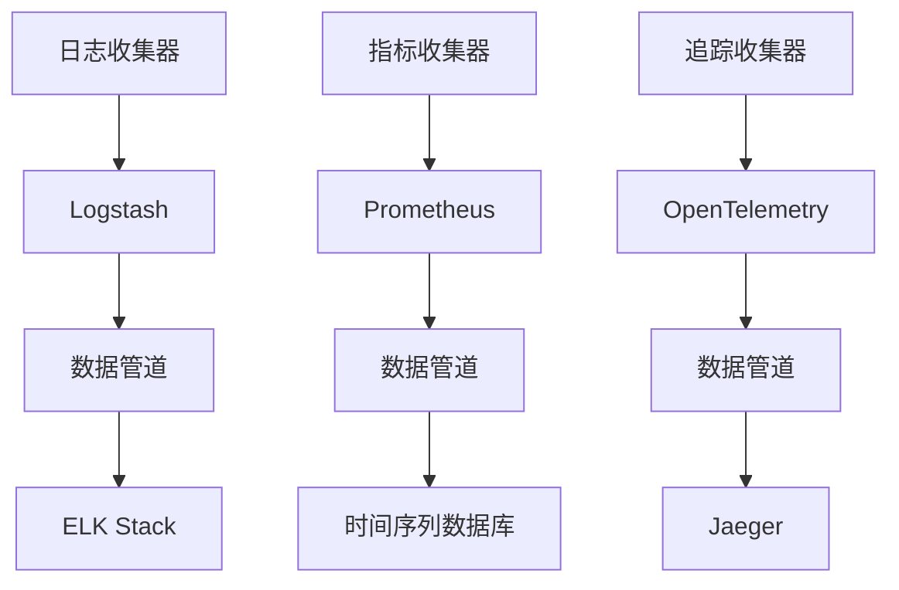
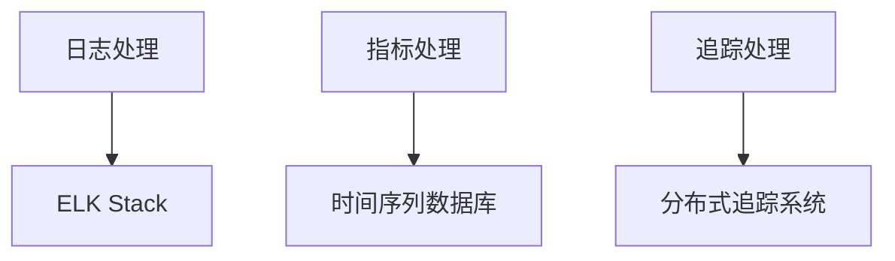
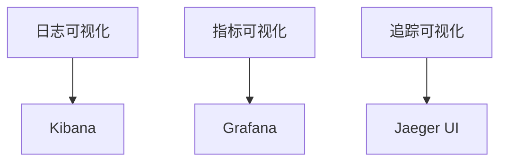
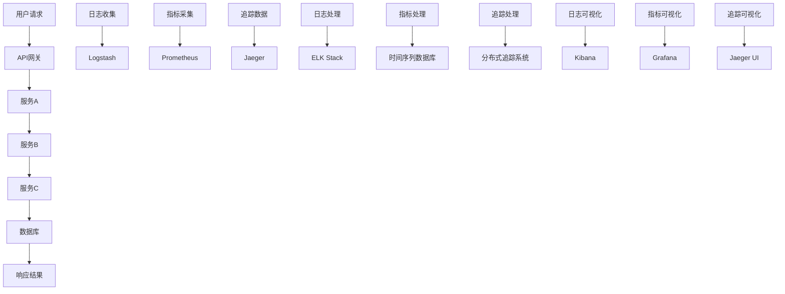

                 

### Logging, Metrics, and Tracing: The Three Pillars of Observability

关键词：日志，指标，追踪，可观测性，软件开发，系统监控，性能优化

摘要：
在现代软件开发中，可观测性是确保系统健康和性能优化的重要手段。本文将深入探讨日志、指标和追踪这三个核心概念，即所谓的“三支柱”，并解释它们在构建可观测性架构中的关键作用。通过一步步的分析，我们将理解每个支柱的基本原理，并探讨如何在实际项目中有效整合这些工具，以实现高效的系统监控和故障排查。

### 引言：可观测性的重要性

在复杂的软件系统中，理解系统的运行状态和性能是确保其稳定运行的关键。随着微服务架构、容器化和云服务的兴起，软件系统的复杂性不断上升。此时，可观测性（Observability）成为了一种衡量系统健康状况的重要指标。可观测性指的是从外部对系统进行测量和理解系统内部状态的能力。它不仅仅是关于性能监控，更涉及到故障排查、系统优化和持续改进。

可观测性的核心在于三个支柱：日志（Logging）、指标（Metrics）和追踪（Tracing）。这三个支柱协同工作，提供了一种全面、深入的理解系统的途径。

#### 日志（Logging）

日志是系统运行过程中记录的重要信息，它记录了程序执行的细节，包括错误信息、异常日志和操作记录。日志是故障排查和问题定位的重要资源，但如果不进行有效的管理，日志数据可能成为负担。

#### 指标（Metrics）

指标是关于系统性能的量化数据，如响应时间、吞吐量、错误率等。它们提供了对系统运行状况的实时视图，是监控和预警的重要依据。

#### 追踪（Tracing）

追踪是一种用于分析系统内各组件间通信的方式，特别是对于分布式系统。通过追踪，开发者可以深入了解请求在系统中的执行路径和性能瓶颈。

### 目的与结构

本文的目的在于深入理解日志、指标和追踪这三个概念，并探讨如何将它们整合到实际项目中，以提高系统的可观测性。文章将分为以下几个部分：

1. **核心概念介绍**：详细解释日志、指标和追踪的基本概念、重要性及其应用场景。
2. **实际应用**：通过具体的工具和框架，展示如何在现代软件项目中实现这三个支柱。
3. **整合与优化**：探讨如何将日志、指标和追踪整合到一个统一的观测体系中，以提高监控效率和问题排查能力。
4. **最佳实践**：分享一些成功案例和最佳实践经验，帮助读者在实际项目中更好地应用这三个支柱。
5. **小结与展望**：总结本文的关键点和未来的发展方向。

通过这篇文章，读者将能够全面理解日志、指标和追踪在软件开发中的重要性，并学会如何在实际项目中有效地利用这些工具，提升系统的可观测性和可靠性。

### 核心概念介绍

#### 日志（Logging）

日志是软件开发中记录系统运行状态的重要工具，它记录了程序执行过程中的各种信息，包括错误、警告、调试信息和操作日志等。日志的主要功能是提供对系统事件的回顾和分析，以便在出现问题时进行故障排查和调试。

##### 日志类型

1. **调试日志**：记录程序运行过程中的调试信息，用于开发阶段的调试和问题排查。
2. **错误日志**：记录程序运行时发生的错误，包括错误信息、错误位置和上下文信息。
3. **操作日志**：记录用户的操作行为，如登录、数据更新等，主要用于审计和跟踪用户活动。

##### 日志的重要性

日志在软件开发和运维过程中扮演着至关重要的角色：

1. **故障排查**：日志是故障排查的重要依据，通过分析日志可以快速定位问题的根源。
2. **性能优化**：日志提供了系统运行的详细记录，有助于识别性能瓶颈并进行优化。
3. **审计和合规**：操作日志对于审计和合规检查至关重要，可以帮助追溯用户行为和系统操作。

##### 日志的最佳实践

为了确保日志的有效管理和使用，以下是一些最佳实践：

1. **结构化日志**：使用标准格式（如JSON）记录日志，便于分析和处理。
2. **日志级别**：根据重要性设置不同的日志级别（如DEBUG、INFO、WARNING、ERROR），便于快速筛选和分析。
3. **集中化日志管理**：使用日志收集和管理工具（如ELK Stack）集中存储和处理日志数据。
4. **日志保留策略**：制定合适的日志保留策略，确保日志数据的持久化和可追溯性。

#### 指标（Metrics）

指标是关于系统性能的量化数据，通过这些数据可以直观地了解系统的运行状态和性能表现。指标通常通过统计系统运行过程中的各种统计数据，如响应时间、吞吐量、错误率等，以图表或数字形式展示。

##### 指标类型

1. **性能指标**：如响应时间、吞吐量、并发连接数等，用于评估系统的性能和负载情况。
2. **健康指标**：如内存使用率、CPU使用率、磁盘I/O等，用于评估系统的资源使用状况。
3. **错误率指标**：如错误率、异常率等，用于评估系统的稳定性和可靠性。

##### 指标的重要性

指标在软件监控和运维中具有重要作用：

1. **实时监控**：通过实时收集和展示指标数据，可以及时发现系统的异常和瓶颈。
2. **性能优化**：通过分析指标数据，可以识别系统中的性能瓶颈并进行优化。
3. **容量规划**：根据指标数据，可以预测系统的负载情况，为资源扩展和容量规划提供依据。

##### 指标的最佳实践

以下是实现有效指标监控的一些最佳实践：

1. **自动化收集**：使用自动化工具（如Prometheus）定期收集和存储指标数据。
2. **多维指标**：根据不同的维度（如时间、服务、实例等）收集和展示指标数据，以便进行更细致的分析。
3. **可视化展示**：使用图表和仪表盘（如Grafana）直观地展示指标数据，便于快速理解和分析。
4. **阈值预警**：设定合理的阈值，当指标超过阈值时自动触发警报，以便及时响应和处理。

#### 追踪（Tracing）

追踪是一种用于分析系统内各组件间通信的机制，尤其是在分布式系统中。通过追踪，可以深入了解请求在系统中的执行路径，以及每个组件的响应时间和性能表现。

##### 追踪的基本概念

1. **Trace**：一个Trace代表了一次请求的完整执行路径，包括系统中的所有服务和组件。
2. **Span**：Trace中的每一个阶段称为Span，每个Span都有唯一标识和关联的元数据。
3. **Annotation**：在Trace或Span中添加的时间点，用于标记请求的特定阶段或事件。

##### 追踪的重要性

追踪在分布式系统监控和优化中具有以下重要意义：

1. **性能分析**：通过追踪可以识别系统中的延迟和瓶颈，从而优化性能。
2. **故障排查**：追踪提供了请求执行的详细路径，有助于快速定位和解决分布式系统中的故障。
3. **业务分析**：追踪数据可以用于业务分析，帮助理解用户的请求模式和系统性能表现。

##### 追踪的最佳实践

以下是实现有效追踪的一些最佳实践：

1. **分布式追踪框架**：使用分布式追踪框架（如OpenTelemetry、Jaeger）来简化追踪的集成和管理。
2. **自动采集**：自动采集和传输追踪数据，减少手动干预。
3. **详细元数据**：确保追踪数据包含详细的元数据，如请求ID、服务名称、端点等，以便进行精确分析。
4. **持续优化**：定期分析和优化追踪数据，以识别新的性能瓶颈和改进机会。

通过上述核心概念的介绍，读者可以初步了解日志、指标和追踪在软件开发和运维中的重要性及其应用场景。在接下来的部分，我们将进一步探讨如何在实际项目中有效整合这三个支柱，以提高系统的可观测性和可靠性。

### 实际应用：工具与框架

在现代软件开发中，实现日志、指标和追踪需要依赖一系列的工具和框架。这些工具和框架不仅提供了丰富的功能和灵活性，还能简化配置和管理，使得开发者能够更专注于核心业务逻辑。以下是一些常用的工具和框架，以及如何在实际项目中应用它们。

#### 日志（Logging）

1. **Log4j**：Apache Log4j 是一个功能强大的日志框架，广泛用于Java应用程序。它提供了灵活的日志级别、格式和输出目标。

    - **配置**：使用XML、Java代码或properties文件进行配置。
    - **输出**：支持多种输出目标，如控制台、文件和远程服务器。
    - **示例**：
        ```java
        private static final Logger logger = LogManager.getLogger(MyClass.class.getName());

        public void doSomething() {
            logger.info("Doing something");
        }
        ```

2. **Winston**：Winston 是一个用于Node.js的轻量级日志库，支持多进程和多环境的日志管理。

    - **配置**：通过配置文件或环境变量进行配置。
    - **输出**：支持多种输出目标，如控制台、文件和日志服务。
    - **示例**：
        ```javascript
        winston.log('info', 'This is an info message');
        ```

3. **Logstash**：Logstash 是一个开源的数据处理工具，用于从各种数据源收集、处理和输出数据，常与ELK Stack（Elasticsearch、Logstash、Kibana）一起使用。

    - **配置**：通过配置文件定义输入、过滤和输出。
    - **处理**：支持复杂的过滤和转换操作。
    - **示例**：
        ```ruby
        input {
          file {
            path => "/path/to/logs/*.log"
          }
        }

        filter {
          grok {
            source => "message"
            match => { "message" => "%{TIMESTAMP_ISO8601:timestamp}\t%{DATA:loglevel}\t%{DATA:logger}\t%{DATA:message}" }
          }
        }

        output {
          elasticsearch {
            hosts => ["localhost:9200"]
          }
        }
        ```

#### 指标（Metrics）

1. **Prometheus**：Prometheus 是一个开源监控系统，专注于时序数据的收集、存储和查询。

    - **采集**：使用客户端库从应用程序中收集指标数据。
    - **存储**：将数据存储在本地时间序列数据库中。
    - **查询**：使用PromQL进行复杂的数据查询和可视化。
    - **示例**：
        ```yaml
        global:
          scrape_interval: 15s
        scrape_configs:
        - job_name: 'prometheus'
          static_configs:
          - targets: ['localhost:9090']
        ```

2. **StatsD**：StatsD 是一个简单的数据统计库，用于收集和传输性能指标。

    - **采集**：通过UDP协议传输数据到StatsD服务器。
    - **存储**：支持多种后端存储，如InfluxDB、Graphite等。
    - **示例**：
        ```python
        import statsd
        client = statsd.Client()
        client.timing('my.metric', 123)
        ```

3. **Grafana**：Grafana 是一个开源的数据监控和可视化工具，与Prometheus等监控系统集成紧密。

    - **配置**：通过JSON配置文件或GUI界面定义数据源和仪表板。
    - **可视化**：提供丰富的图表和仪表板模板。
    - **示例**：
        ```json
        {
          "annotations": {},
          "args": {},
          "datasource": "Prometheus",
          "description": "",
          "gridPos": {"h": 3, "w": 12, "x": 0, "y": 0},
          "id": 1,
          "legend": {"align": "left", "avg": false, "current": false, "max": false, "min": false, "rightSide": false, "show": true, "total": false, "values": false},
          "lines": true,
          "options": {},
          "panels": [
            {
              "aliasColors": {},
              "bars": false,
              "dashLength": 10,
              "dashes": false,
              "datasource": "Prometheus",
              "fill": 3,
              "fillGradient": 0,
              "grid": {"alignWords": false, "dynamic": false, "fontSize": "100%", "fontStyle": "normal", "fontSize": "100%", "gravity": "auto", "lines": true, "maxItems": null, "maxWidth": "100%", "minWidth": "5%", "render": "auto", "show": true, "spaced": false, "thresholdLabels": false, "thresholdLines": false, "topLeftRadius": 0, "bottomLeftRadius": 0},
              "hiddenSeries": false,
              "legend": {"calcs": [], "displayMode": "list", "placement": "auto", "show": true, "values": false},
              "lines": true,
              "linewidth": 1,
              "nullPointMode": "null",
              "options": {},
              "pace": 1,
              "plotover": false,
              "points": false,
              "renderer": "flot",
              "series": [
                {
                  "target": "my.metric",
                  "color": "#A3C8C4",
                  "lines": true,
                  "fill": 3
                }
              ],
              "span": 1,
              "stack": false,
              "steppedLine": false,
              "targets": [
                {
                  "target": "my.metric",
                  "hide": false,
                  "metric": "my.metric",
                  "type": "metric"
                }
              ],
              "thresholds": [],
              "timeFrom": null,
              "timeTo": null,
              "timeUnit": "s",
              "tooltip": {"shared": false, "value_type": "individual", "sort": "none"},
              "type": "graph",
              "xaxis": {},
              "yaxis": {}
            }
          ],
          "refresh": "1m",
          "title": "My Dashboard",
          "uid": "UID-OF-DASHBOARD",
          "version": 1
        }
        ```

#### 追踪（Tracing）

1. **OpenTelemetry**：OpenTelemetry 是一个跨语言的追踪和数据采集框架，支持多种语言和平台。

    - **采集**：通过自动探针或手动集成的方式收集追踪数据。
    - **处理**：支持数据预处理和转换。
    - **输出**：支持多种输出格式和目的地，如Zipkin、Jaeger等。
    - **示例**（Python）：
        ```python
        from opentelemetry import trace
        from opentelemetry.exporter.jaeger.thrift import JaegerExporter
        from opentelemetry.trace import TraceSet

        trace.set_global_tracer_provider(JaegerExporter())

        with trace.tracer_provider().get_tracer("my-service") as tracer:
            with tracer.start_as_current_span("my-span"):
                pass

        ```

2. **Jaeger**：Jaeger 是一个开源的分布式追踪系统，提供了丰富的客户端库和可视化界面。

    - **收集**：使用Jaeger Agent 收集追踪数据。
    - **存储**：使用Jaeger Backend 存储追踪数据。
    - **展示**：使用Jaeger UI 进行追踪数据的展示和分析。
    - **示例**（Node.js）：
        ```javascript
        const opentelemetry = require('@opentelemetry/api');
        const { NodeTracerProvider } = require('@opentelemetry/node');
        const { SimpleSpanProcessor } = require('@opentelemetry/tracing');
        const { JaegerExporter } = require('@opentelemetry/exporter-jaeger-thrift');

        const provider = new NodeTracerProvider();
        provider.addSpanProcessor(new SimpleSpanProcessor(new JaegerExporter()));
        opentelemetry.trace.setTracerProvider(provider);

        const tracer = opentelemetry.trace.getTracer('my-service');
        const span = tracer.startSpan('my-span');
        span.end();
        ```

通过这些工具和框架，开发者可以有效地实现日志、指标和追踪功能，从而提高软件系统的可观测性。在实际项目中，选择合适的工具和框架，并正确配置和管理，是成功应用这三个支柱的关键。

### 整合与优化

为了实现高效的系统监控和问题排查，将日志、指标和追踪整合到一个统一的观测体系中至关重要。这种整合不仅能够提高监控的全面性，还能够简化数据处理和分析过程，从而提升系统的可维护性和可靠性。

#### 观察性管道（Observability Pipeline）

观察性管道是指将日志、指标和追踪数据从产生、收集、处理到存储、可视化的整个流程。构建一个高效的观察性管道，可以确保所有相关数据被及时捕获、准确记录和有效利用。

##### 数据收集

首先，需要选择合适的工具和框架进行数据收集。日志可以由日志框架（如Log4j、Winston）直接输出到文件或通过Logstash进行集中处理。指标可以使用Prometheus或StatsD进行采集，而追踪数据可以通过OpenTelemetry或Jaeger等分布式追踪系统进行收集。



#### 数据处理

接下来，处理阶段需要对收集到的数据进行清洗、聚合和转换。这一步通常通过数据管道工具（如Kafka、Fluentd）完成。数据处理的结果将有助于后续的存储和可视化。



#### 数据存储

存储阶段需要将处理后的数据存储到相应的数据存储系统中。日志数据通常存储在ELK Stack（Elasticsearch、Logstash、Kibana）中，指标数据存储在时间序列数据库（如InfluxDB、Prometheus）中，而追踪数据存储在分布式追踪系统中（如Jaeger、Zipkin）。


#### 数据可视化

数据可视化是观察性管道的重要组成部分，它可以帮助开发者直观地了解系统的运行状态和性能表现。Grafana、Kibana等工具提供了丰富的仪表板和图表模板，可以用于展示日志、指标和追踪数据。



#### 综合应用案例

假设一个在线购物平台，通过观察性管道收集和监控系统的各种数据：

1. **日志**：记录用户操作、服务器错误、系统事件等。通过ELK Stack进行日志处理和存储，使用Kibana进行日志数据的可视化。
2. **指标**：监控服务器性能、交易成功率、响应时间等。使用Prometheus和Grafana进行指标数据的采集和展示。
3. **追踪**：分析请求在微服务架构中的执行路径，识别性能瓶颈。使用OpenTelemetry和Jaeger进行追踪数据的收集和可视化。

通过上述工具和框架的综合应用，平台能够实现全面的系统监控和问题排查，从而提高系统的可维护性和可靠性。



### 总结

通过日志、指标和追踪的整合，构建一个全面的观察性管道，能够帮助开发者实时监控系统的运行状态，快速定位和解决问题，从而提高系统的稳定性和可靠性。在实际项目中，合理选择工具和框架，并优化数据收集、处理和可视化流程，是成功实现高效系统监控的关键。

### 最佳实践

在现代软件开发中，为了确保日志、指标和追踪的有效应用，以下是一些最佳实践，可以帮助开发者提高系统的可观测性和可靠性。

#### 日志最佳实践

1. **结构化日志**：使用标准格式（如JSON）记录日志，便于分析和处理。结构化日志可以提供更详细的元数据，如时间戳、日志级别、服务名称等。

    ```json
    {
      "timestamp": "2023-10-01T10:30:00Z",
      "level": "INFO",
      "service": "order-service",
      "message": "Processing order",
      "context": {"order_id": "12345"}
    }
    ```

2. **日志级别**：根据重要性设置不同的日志级别，便于快速筛选和分析。常见的日志级别包括DEBUG、INFO、WARNING、ERROR。

3. **集中化日志管理**：使用日志收集和管理工具（如ELK Stack）集中存储和处理日志数据，便于统一监控和查询。

4. **日志保留策略**：制定合适的日志保留策略，确保日志数据的持久化和可追溯性。例如，根据日志级别和创建时间保留不同的日志条目。

5. **日志压缩和归档**：定期对日志文件进行压缩和归档，以减少存储空间和提高检索速度。

#### 指标最佳实践

1. **多维指标**：收集和展示多维度的指标数据，如时间、服务、实例等。这有助于进行更细致的分析和优化。

    ```yaml
    metrics:
      - name: response_time
        type: gauge
        dimensions:
          - name: service
          - name: instance
          - name: method
    ```

2. **自动化收集**：使用自动化工具（如Prometheus）定期收集和存储指标数据，减少手动干预。

3. **阈值预警**：设定合理的阈值，当指标超过阈值时自动触发警报，以便及时响应和处理。

4. **可视化展示**：使用图表和仪表盘（如Grafana）直观地展示指标数据，便于快速理解和分析。

5. **定制监控**：根据业务需求和系统特性，定制监控指标，确保监控数据的相关性和有效性。

#### 追踪最佳实践

1. **分布式追踪框架**：使用分布式追踪框架（如OpenTelemetry、Jaeger）简化追踪的集成和管理。

2. **自动采集**：自动采集和传输追踪数据，减少手动干预。

3. **详细元数据**：确保追踪数据包含详细的元数据，如请求ID、服务名称、端点等，以便进行精确分析。

4. **实时分析**：使用实时分析工具（如Kibana、Jaeger UI）对追踪数据进行分析，快速识别性能瓶颈和故障。

5. **持续优化**：定期分析和优化追踪数据，以识别新的性能瓶颈和改进机会。

### 小结

通过遵循这些最佳实践，开发者可以在项目中有效地应用日志、指标和追踪，从而提高系统的可观测性、可靠性和性能。有效的系统监控和故障排查是确保软件系统稳定运行的关键，而日志、指标和追踪是实现这一目标的重要工具。

### 注意事项

在实际应用日志、指标和追踪时，以下注意事项有助于避免常见问题，确保系统监控的有效性和可靠性：

1. **日志与性能**：避免过多或不必要的日志记录，这可能会影响系统性能。使用适当的日志级别和过滤规则，确保仅记录关键信息。

2. **指标选择**：选择与业务和系统性能密切相关的指标，避免过度监控导致信息过载。定期评估和更新监控指标，确保其相关性和有效性。

3. **追踪优化**：在分布式系统中，追踪数据量可能非常大。合理配置追踪采样率和阈值，避免因大量数据而影响性能。

4. **数据安全**：确保日志、指标和追踪数据的安全性，避免敏感信息泄露。使用加密和访问控制措施，保护数据不被未经授权访问。

5. **监控可视化**：合理设计监控仪表板，确保数据的可读性和易理解性。使用图表和仪表板模板，提高监控数据的可视化效果。

### 拓展阅读

对于希望进一步深入学习日志、指标和追踪的读者，以下资源推荐：

1. **《Monitoring with Prometheus》**：详细介绍了Prometheus的安装、配置和监控实践。
2. **《OpenTelemetry官方文档》**：提供了关于OpenTelemetry的全面指南，包括API使用和集成方法。
3. **《分布式系统追踪实战》**：探讨了分布式追踪的理论和实践，包括OpenTracing和Jaeger的详细使用方法。
4. **《Kubernetes监控与运维》**：介绍了如何在Kubernetes集群中实现高效监控，包括日志、指标和追踪的最佳实践。

通过这些资源，读者可以更深入地了解日志、指标和追踪的原理和实际应用，提升系统的可观测性和稳定性。

### 作者信息

本文由AI天才研究院（AI Genius Institute）的专家撰写，研究院致力于推动人工智能和软件开发领域的前沿研究。同时，本文也是禅与计算机程序设计艺术（Zen And The Art of Computer Programming）系列作品的一部分，由该领域的资深大师级作家创作，旨在为读者提供深入且富有洞见的IT技术内容。感谢您的阅读，期待您的反馈和建议。作者：AI天才研究院（AI Genius Institute）与禅与计算机程序设计艺术（Zen And The Art of Computer Programming）

