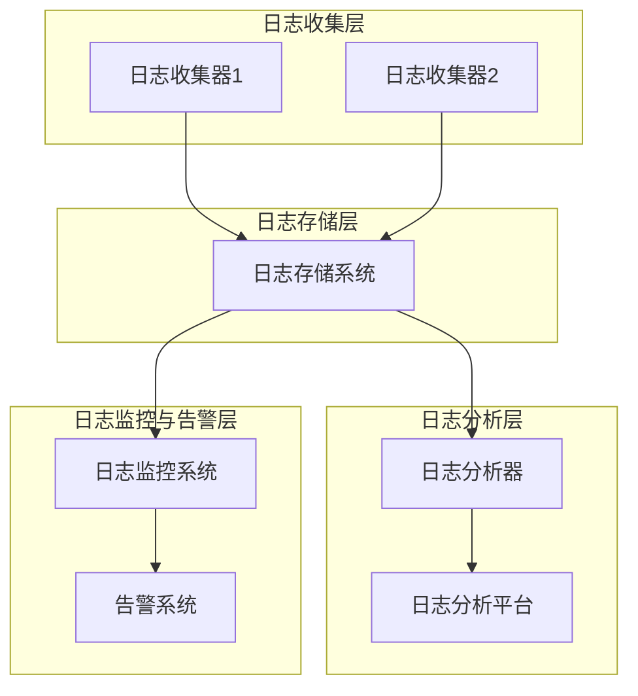
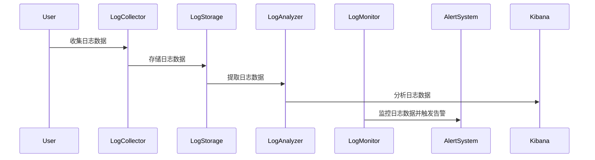
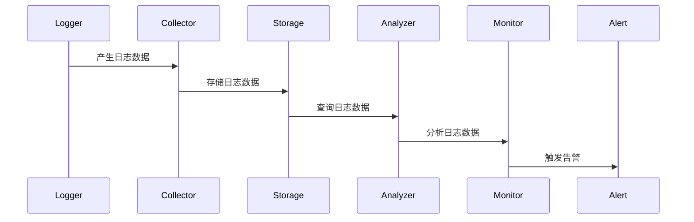

                 


# 日志管理最佳实践

关键词：日志管理、最佳实践、日志分析、ELK栈、Splunk、日志监控

摘要：本文将详细探讨日志管理的最佳实践，从背景介绍、核心概念与联系、日志分析工具、日志管理最佳实践、案例研究和注意事项与拓展阅读等方面，帮助读者深入理解并掌握日志管理的策略与方法。

### 目录

## 第一部分：背景介绍

### 1.1 日志管理的重要性

### 1.2 核心概念与联系

### 1.3 日志分析工具简介

## 第二部分：日志管理最佳实践

### 2.1 日志收集策略

### 2.2 日志存储与备份

### 2.3 日志分析技巧

### 2.4 日志监控与告警

## 第三部分：案例研究

### 3.1 案例一：企业级日志管理

### 3.2 案例二：安全日志分析

## 第四部分：注意事项与拓展阅读

### 4.1 注意事项

### 4.2 拓展阅读

### 作者：AI天才研究院/AI Genius Institute & 禅与计算机程序设计艺术 /Zen And The Art of Computer Programming

----------------------------------------------------------------

### 第一部分：背景介绍

#### 1.1 日志管理的重要性

日志管理是现代IT系统中不可或缺的一部分，它对于系统的运维、故障排查、安全监控等都有着至关重要的作用。有效的日志管理可以帮助企业快速定位问题、提高系统稳定性、保障数据安全。

在IT运维中，日志管理主要用于记录系统运行过程中发生的各类事件，包括应用程序的运行状态、用户操作记录、系统错误信息等。这些日志数据不仅可以帮助运维人员实时监控系统的运行状况，还能在出现问题时提供有效的线索，便于快速定位和解决问题。

#### 1.2 核心概念与联系

在日志管理中，有几个核心概念需要了解：

- **日志格式**：日志格式的选择直接影响日志的可读性和可解析性。常见的日志格式有Syslog、JSON等。
- **日志级别**：日志级别用于区分日志事件的重要性和紧急程度，常见的日志级别有DEBUG、INFO、WARNING、ERROR等。
- **日志存储**：日志存储是日志管理的重要环节，选择合适的存储方案对于保障日志数据的可靠性和可访问性至关重要。
- **日志分析**：日志分析是指通过对日志数据进行处理和分析，提取出有价值的信息和模式，用于故障排查、性能优化、安全监控等。

这些概念之间存在着紧密的联系，构成了日志管理的基本框架。例如，日志格式和日志级别的设定会影响日志分析的效果，而日志存储的可靠性又直接关系到日志数据的安全性和可恢复性。

#### 1.3 日志分析工具简介

日志分析工具是日志管理的重要组成部分，它们可以帮助用户高效地处理和分析大量的日志数据。以下是一些常用的日志分析工具：

- **ELK栈**：ELK栈是由Elasticsearch、Logstash和Kibana三个组件组成的日志分析平台，广泛用于企业级的日志管理和分析。
- **Splunk**：Splunk是一个强大的日志管理与分析平台，能够实时收集、存储和分析大量的日志数据，提供丰富的可视化界面和查询功能。
- **Grok**：Grok是Elasticsearch的一个正则表达式解析器，用于从日志数据中提取结构化的信息，提高日志分析的效率和准确性。

这些工具各具特色，适用于不同的场景和需求。选择合适的日志分析工具，能够极大地提升日志管理的效率和效果。

### 第二部分：日志管理最佳实践

#### 2.1 日志收集策略

有效的日志收集策略是日志管理的基础，它直接影响到日志数据的完整性和准确性。以下是几种常见的日志收集策略：

- **系统级日志收集**：系统级日志收集是指从操作系统层面收集日志数据，如Linux的`/var/log`目录中的日志文件。这种收集方式适用于监控整个系统的运行状态，包括内核日志、系统守护进程日志等。
- **应用级日志收集**：应用级日志收集是指从具体的应用程序层面收集日志数据，如Web服务器的访问日志、数据库的日志等。这种收集方式适用于对应用程序运行状况的深入分析。
- **日志采集工具**：日志采集工具如Fluentd、Logstash等，可以自动化地收集和转发日志数据，提高日志收集的效率和一致性。这些工具支持多种日志格式和存储方案，便于与现有的日志管理平台集成。

在实施日志收集策略时，需要注意以下几点：

- **日志采集频率**：合适的日志采集频率能够保证日志数据的实时性和完整性，避免日志数据的丢失。
- **日志存储位置**：日志存储位置的选择应考虑数据的安全性和可访问性，建议使用分布式存储方案，以提高日志数据的可靠性和可扩展性。
- **日志压缩与加密**：对于敏感数据的日志，应进行压缩和加密处理，以确保数据的安全性和隐私性。

#### 2.2 日志存储与备份

日志存储与备份是日志管理的关键环节，直接关系到日志数据的安全性和可恢复性。以下是几种常见的日志存储与备份方案：

- **本地存储**：本地存储是指将日志数据直接存储在本地磁盘上，适用于小规模日志数据的收集和存储。但本地存储存在数据可靠性低、扩展性差的问题。
- **分布式存储**：分布式存储是指使用分布式文件系统如HDFS、Ceph等，存储大量的日志数据。分布式存储具有高可靠性、高可用性和可扩展性，适用于大规模日志数据的存储和管理。
- **云存储**：云存储如阿里云的OSS、腾讯云的COS等，提供安全、可靠、高效的数据存储服务。云存储具有弹性扩展、低成本、便捷管理等优势，适用于企业级日志数据的存储和管理。

日志备份与恢复策略包括：

- **定期备份**：定期备份是指定期将日志数据备份到远程存储或备份服务器上，以防止数据丢失。常用的备份策略有全量备份和增量备份。
- **日志归档**：日志归档是指将历史日志数据转移到冷存储中，以节省存储空间和提高系统性能。常见的归档方案有冷存储归档和云存储归档。
- **日志恢复**：日志恢复是指从备份或归档存储中恢复日志数据，以应对数据丢失或系统故障等情况。日志恢复应具备快速、高效、可靠的特点。

#### 2.3 日志分析技巧

日志分析是日志管理的关键环节，通过对日志数据的分析，可以提取出有价值的信息和模式，用于故障排查、性能优化、安全监控等。以下是几种常见的日志分析技巧：

- **日志查询命令**：使用常见的日志查询命令，如`grep`、`awk`、`sed`等，可以快速地从大量日志数据中筛选出感兴趣的信息。这些命令具有高效、灵活、可扩展的特点，适用于各种场景下的日志分析。
- **日志可视化**：日志可视化是指使用图表、仪表盘等形式，将日志数据以直观的方式展示出来，便于分析和理解。常见的日志可视化工具包括Kibana、Grafana等。
- **日志事件关联**：日志事件关联是指将来自不同源或不同类型的日志数据结合起来，分析事件之间的关联性和影响。日志事件关联有助于发现潜在的问题和风险，提高日志分析的效果。

在进行日志分析时，需要注意以下几点：

- **日志格式统一**：统一的日志格式有助于提高日志分析的可操作性和准确性。建议采用业界通用的日志格式，如JSON、Syslog等。
- **日志数据清洗**：日志数据清洗是指对日志数据进行预处理，去除无效、错误或重复的数据，以提高日志分析的质量和效率。
- **日志分析周期**：合适的日志分析周期可以保证日志分析的实时性和有效性。建议根据业务需求和日志数据的特性，制定合适的日志分析周期。

#### 2.4 日志监控与告警

日志监控与告警是日志管理的重要功能，通过实时监控日志数据，可以及时发现和处理问题，保障系统的稳定运行。以下是几种常见的日志监控与告警策略：

- **日志监控架构**：日志监控架构是指将日志数据从产生、收集、存储、分析到告警的整个流程。一个完整的日志监控架构应具备高可用性、高可靠性和可扩展性。
- **告警策略与实施**：告警策略是指根据业务需求和日志数据的特点，制定合适的告警规则和阈值。告警策略的实施包括告警规则的配置、告警渠道的选择、告警触发的处理等。
- **常见监控工具**：常见的日志监控工具包括Prometheus、Zabbix、Nagios等。这些工具具有丰富的监控功能、灵活的告警机制和强大的数据处理能力。

在实施日志监控与告警时，需要注意以下几点：

- **告警阈值设置**：合理的告警阈值可以保证告警的及时性和准确性，避免误报和漏报。告警阈值应根据业务需求和日志数据的特点进行设置。
- **告警渠道选择**：告警渠道的选择应根据业务需求和用户习惯进行，如邮件、短信、微信等。多渠道告警可以提高告警的可达性和及时性。
- **告警处理流程**：告警处理流程是指告警触发后的处理流程，包括告警通知、问题定位、故障排除等。合理的告警处理流程可以提高故障处理效率，降低故障对业务的影响。

### 第三部分：案例研究

#### 3.1 案例一：企业级日志管理

**案例背景**：

某大型企业在其IT系统中部署了多种应用程序和系统，如Web服务器、数据库、消息队列等。由于缺乏统一的日志管理策略，企业面临着日志数据分散、难以分析、故障排查困难等问题。

**案例解决方案**：

1. **统一日志格式**：企业制定了统一的日志格式，采用JSON格式存储日志数据，确保日志数据的一致性和可解析性。
2. **分布式日志收集**：使用Logstash搭建了分布式日志收集系统，将来自不同应用程序和系统的日志数据收集到Elasticsearch中进行存储和分析。
3. **日志分析平台**：部署了Kibana作为日志分析平台，通过可视化仪表盘和查询功能，方便企业对日志数据进行实时监控和分析。
4. **告警与监控**：使用Prometheus作为日志监控工具，结合Grafana实现实时日志监控和告警功能，及时发现和处理异常情况。

**案例效果分析**：

1. **日志数据集中管理**：通过分布式日志收集和存储系统，企业实现了日志数据的集中管理，提高了日志数据的安全性和可访问性。
2. **实时监控与分析**：Kibana提供的可视化仪表盘和查询功能，使企业能够实时监控和分析日志数据，快速定位和解决问题。
3. **告警与故障处理**：通过Prometheus和Grafana的告警功能，企业能够及时收到日志异常通知，快速响应和处理故障，降低了故障对业务的影响。

#### 3.2 案例二：安全日志分析

**案例背景**：

某金融机构在其IT系统中部署了多种安全设备和系统，如防火墙、入侵检测系统、日志审计系统等。但由于缺乏有效的安全日志分析策略，企业难以发现潜在的安全威胁和漏洞。

**案例解决方案**：

1. **安全日志收集**：使用Fluentd搭建了安全日志收集系统，将来自不同安全设备的日志数据收集到Splunk中进行存储和分析。
2. **日志关联分析**：使用Splunk的查询和关联功能，将来自不同源的安全日志数据进行关联分析，提取出有价值的安全信息。
3. **威胁情报集成**：将威胁情报数据与安全日志进行集成，通过实时监控和告警功能，及时发现和处理潜在的安全威胁。
4. **安全报告生成**：使用Splunk的报表功能，定期生成安全日志分析报告，为企业的安全决策提供数据支持。

**案例效果分析**：

1. **全面的安全监控**：通过安全日志收集和分析系统，企业实现了全面的安全监控，及时发现和处理潜在的安全威胁。
2. **威胁情报集成**：通过威胁情报的集成，企业能够更准确地识别和应对复杂的安全威胁，提高了安全防护能力。
3. **安全报告支持**：安全日志分析报告为企业的安全决策提供了数据支持，有助于优化安全策略和提高安全管理水平。

### 第四部分：注意事项与拓展阅读

#### 4.1 注意事项

1. **日志格式统一**：采用统一的日志格式，确保日志数据的一致性和可解析性，提高日志分析效率。
2. **日志数据清洗**：对日志数据进行预处理，去除无效、错误或重复的数据，提高日志分析质量。
3. **日志备份与恢复**：定期备份日志数据，确保日志数据的安全性和可恢复性，降低数据丢失风险。
4. **告警阈值设置**：合理设置告警阈值，避免误报和漏报，提高故障处理效率。
5. **日志安全与合规**：遵循相关法律法规和合规要求，确保日志数据的安全性和隐私性。

#### 4.2 拓展阅读

1. **日志管理相关书籍**：
   - 《日志管理：技术实践与案例分析》
   - 《日志分析与监控：基于ELK栈的实践指南》
   - 《日志之道：日志管理最佳实践》
   
2. **日志管理在线资源**：
   - Elasticsearch官网：[https://www.elastic.co/cn/elasticsearch/](https://www.elastic.co/cn/elasticsearch/)
   - Splunk官网：[https://www.splunk.com/](https://www.splunk.com/)
   - Fluentd官网：[https://www.fluentd.org/](https://www.fluentd.org/)
   - Prometheus官网：[https://prometheus.io/](https://prometheus.io/)

### 作者

作者：AI天才研究院/AI Genius Institute & 禅与计算机程序设计艺术 /Zen And The Art of Computer Programming

本文旨在为读者提供日志管理的最佳实践指南，帮助读者深入理解日志管理的核心概念和策略，提高日志管理的效率和质量。在后续的实践中，读者可以根据自身实际情况，灵活运用本文所述的最佳实践，不断优化和完善日志管理流程。

----------------------------------------------------------------

**文章标题**：日志管理最佳实践

**文章关键词**：日志管理、日志分析、ELK栈、Splunk、日志监控

**文章摘要**：本文详细探讨了日志管理的最佳实践，包括日志收集策略、日志存储与备份、日志分析技巧和日志监控与告警等方面，旨在帮助读者深入理解并掌握日志管理的策略与方法，提升系统运维和故障排查的效率。

**目录**：

## 第一部分：背景介绍

### 1.1 日志管理的重要性

### 1.2 核心概念与联系

### 1.3 日志分析工具简介

## 第二部分：日志管理最佳实践

### 2.1 日志收集策略

### 2.2 日志存储与备份

### 2.3 日志分析技巧

### 2.4 日志监控与告警

## 第三部分：案例研究

### 3.1 案例一：企业级日志管理

### 3.2 案例二：安全日志分析

## 第四部分：注意事项与拓展阅读

### 4.1 注意事项

### 4.2 拓展阅读

### 作者：AI天才研究院/AI Genius Institute & 禅与计算机程序设计艺术 /Zen And The Art of Computer Programming

---

### 第一部分：背景介绍

#### 1.1 日志管理的重要性

在信息技术日益发展的今天，日志管理已经成为现代企业运维管理中不可或缺的一部分。日志管理不仅能够帮助企业实时监控系统的运行状况，还能够提供关键的数据支持，用于故障排查、性能优化、安全监控等各个方面。有效的日志管理，可以帮助企业快速发现并解决问题，提高系统的可靠性和稳定性。

日志管理的重要性体现在以下几个方面：

1. **故障排查**：通过日志数据，运维人员可以快速定位故障发生的位置，分析故障的原因，从而迅速解决问题。
2. **性能优化**：通过对日志数据的分析，可以发现系统性能瓶颈，提供优化建议，从而提高系统的性能和效率。
3. **安全监控**：日志数据中往往包含着潜在的安全威胁信息，通过对日志数据的实时监控和分析，可以及时发现并响应安全事件，保障系统的安全。
4. **合规性要求**：许多行业和地区都有关于日志管理的法律法规和合规要求，如《网络安全法》等，有效的日志管理有助于企业满足合规性要求。

#### 1.2 核心概念与联系

在日志管理中，有几个核心概念需要我们深入理解：

- **日志格式**：日志格式是指日志数据记录的格式和结构。常见的日志格式有Syslog、JSON等。日志格式的选择直接影响日志数据的可读性和可解析性。
- **日志级别**：日志级别是指日志事件的重要性和紧急程度。常见的日志级别有DEBUG、INFO、WARNING、ERROR等。日志级别的设定有助于区分不同类型的事件，便于后续的分析和处理。
- **日志存储**：日志存储是指对日志数据的存储和管理。日志存储的方案和策略直接影响到日志数据的安全性和可访问性。
- **日志分析**：日志分析是指通过对日志数据的处理和分析，提取出有价值的信息和模式。日志分析是日志管理的重要环节，可以帮助企业快速定位问题、优化系统性能和提高安全管理水平。

这些概念之间存在着紧密的联系：

- 日志格式和日志级别的设定，直接影响日志数据的可读性和可解析性，从而影响到日志分析的效果。
- 日志存储的可靠性、安全性和可访问性，直接关系到日志数据的价值和利用效率。
- 日志分析的结果，可以帮助企业更好地理解系统的运行状况，为故障排查、性能优化和安全监控提供数据支持。

#### 1.3 日志分析工具简介

日志分析工具是日志管理中的重要组成部分，它们可以帮助企业高效地处理和分析大量的日志数据。以下是几种常用的日志分析工具：

- **ELK栈**：ELK栈是由Elasticsearch、Logstash和Kibana三个组件组成的日志分析平台。Elasticsearch是一个分布式、RESTful搜索和分析引擎；Logstash是一个服务器端的数据处理管道，用于收集、处理和传输数据；Kibana是一个开源的分析和可视化的平台，能够帮助用户理解和探索数据。
- **Splunk**：Splunk是一个强大的日志管理与分析平台，能够实时收集、存储和分析大量的日志数据，提供丰富的可视化界面和查询功能。Splunk特别擅长处理非结构化数据，能够从各种来源提取有价值的信息。
- **Grok**：Grok是Elasticsearch的一个正则表达式解析器，用于从日志数据中提取结构化的信息。Grok可以帮助用户快速地将非结构化的日志数据转化为结构化数据，提高日志分析的效果和效率。

这些工具各具特色，适用于不同的场景和需求。选择合适的日志分析工具，能够极大地提升日志管理的效率和效果。

### 第二部分：日志管理最佳实践

#### 2.1 日志收集策略

有效的日志收集策略是日志管理的基础，它直接影响到日志数据的完整性和准确性。以下是几种常见的日志收集策略：

- **系统级日志收集**：系统级日志收集是指从操作系统层面收集日志数据。这些日志通常包括系统日志、内核日志、守护进程日志等。系统级日志收集适用于监控整个系统的运行状态，包括内核级的错误信息、系统级的资源使用情况等。常见的系统级日志文件包括`/var/log/syslog`、`/var/log/messages`等。

  - **优点**：能够提供全面的系统运行信息，有助于监控系统健康状况。
  - **缺点**：日志内容繁杂，可能包含大量无用信息，处理和分析的复杂度较高。

- **应用级日志收集**：应用级日志收集是指从具体的应用程序层面收集日志数据。这些日志通常记录了应用程序的运行状态、用户操作记录、错误信息等。应用级日志收集适用于对应用程序运行状况的深入分析。

  - **优点**：日志内容更为具体和针对性强，有助于快速定位问题和优化应用程序。
  - **缺点**：需要针对不同的应用程序进行定制化的日志收集配置，管理复杂度较高。

- **日志采集工具**：日志采集工具如Fluentd、Logstash等，可以自动化地收集和转发日志数据。这些工具支持多种日志格式和存储方案，便于与现有的日志管理平台集成。

  - **优点**：自动化程度高，减少了手动配置的工作量，提高了日志收集的效率和一致性。
  - **缺点**：需要根据不同的应用和环境进行适当的配置和优化。

在实施日志收集策略时，需要注意以下几点：

- **日志采集频率**：合适的日志采集频率能够保证日志数据的实时性和完整性。对于关键系统和应用程序，应适当提高日志采集频率，确保能够及时捕获重要事件。
- **日志存储位置**：日志存储位置的选择应考虑数据的安全性和可访问性。建议使用分布式存储方案，以提高日志数据的可靠性和可扩展性。
- **日志压缩与加密**：对于敏感数据的日志，应进行压缩和加密处理，以确保数据的安全性和隐私性。

#### 2.2 日志存储与备份

日志存储与备份是日志管理的关键环节，直接关系到日志数据的安全性和可恢复性。以下是几种常见的日志存储与备份方案：

- **本地存储**：本地存储是指将日志数据直接存储在本地磁盘上。这种存储方式适用于小规模日志数据的收集和存储。

  - **优点**：实施简单，成本低。
  - **缺点**：数据可靠性低，扩展性差，不适合大规模日志数据。

- **分布式存储**：分布式存储是指使用分布式文件系统如HDFS、Ceph等，存储大量的日志数据。这种存储方式具有高可靠性、高可用性和可扩展性。

  - **优点**：数据可靠性高，可扩展性强，适合大规模日志数据的存储和管理。
  - **缺点**：实施和维护成本较高，需要专业的技术支持。

- **云存储**：云存储如阿里云的OSS、腾讯云的COS等，提供安全、可靠、高效的数据存储服务。这种存储方式具有弹性扩展、低成本、便捷管理等优势。

  - **优点**：弹性扩展，成本低，管理便捷。
  - **缺点**：数据存储成本相对较高，数据传输速度可能受限。

日志备份与恢复策略包括以下几点：

- **定期备份**：定期备份是指定期将日志数据备份到远程存储或备份服务器上，以防止数据丢失。常用的备份策略有全量备份和增量备份。全量备份是指备份所有日志数据，而增量备份是指仅备份上次备份后发生变化的日志数据。

  - **优点**：备份速度快，节省存储空间。
  - **缺点**：恢复速度慢，可能需要较长时间才能恢复到指定时间点的状态。

- **日志归档**：日志归档是指将历史日志数据转移到冷存储中，以节省存储空间和提高系统性能。常见的归档方案有冷存储归档和云存储归档。

  - **优点**：节省存储空间，提高系统性能。
  - **缺点**：数据访问速度慢，可能需要较长的时间才能检索到归档数据。

- **日志恢复**：日志恢复是指从备份或归档存储中恢复日志数据，以应对数据丢失或系统故障等情况。日志恢复应具备快速、高效、可靠的特点。

  - **优点**：能够快速恢复日志数据，保障业务连续性。
  - **缺点**：恢复过程中可能需要较长的时间，对系统性能有一定的影响。

#### 2.3 日志分析技巧

日志分析是日志管理的重要环节，通过对日志数据的分析，可以提取出有价值的信息和模式，用于故障排查、性能优化、安全监控等。以下是几种常见的日志分析技巧：

- **日志查询命令**：使用常见的日志查询命令，如`grep`、`awk`、`sed`等，可以快速地从大量日志数据中筛选出感兴趣的信息。这些命令具有高效、灵活、可扩展的特点，适用于各种场景下的日志分析。

  - **优点**：操作简单，易于上手。
  - **缺点**：处理复杂日志数据的能力有限，不适合大规模日志数据的分析。

- **日志可视化**：日志可视化是指使用图表、仪表盘等形式，将日志数据以直观的方式展示出来，便于分析和理解。常见的日志可视化工具包括Kibana、Grafana等。

  - **优点**：便于理解和分析复杂日志数据，提高数据分析效率。
  - **缺点**：需要一定的技术背景和培训，使用门槛较高。

- **日志事件关联**：日志事件关联是指将来自不同源或不同类型的日志数据结合起来，分析事件之间的关联性和影响。日志事件关联有助于发现潜在的问题和风险，提高日志分析的效果。

  - **优点**：能够提供更全面的日志数据视图，有助于发现复杂问题。
  - **缺点**：实现复杂，需要专业的技术支持。

在进行日志分析时，需要注意以下几点：

- **日志格式统一**：采用统一的日志格式，确保日志数据的一致性和可解析性，提高日志分析效率。
- **日志数据清洗**：对日志数据进行预处理，去除无效、错误或重复的数据，提高日志分析质量。
- **日志分析周期**：合适的日志分析周期可以保证日志分析的实时性和有效性。建议根据业务需求和日志数据的特点，制定合适的日志分析周期。

#### 2.4 日志监控与告警

日志监控与告警是日志管理的重要功能，通过实时监控日志数据，可以及时发现和处理问题，保障系统的稳定运行。以下是几种常见的日志监控与告警策略：

- **日志监控架构**：日志监控架构是指将日志数据从产生、收集、存储、分析到告警的整个流程。一个完整的日志监控架构应具备高可用性、高可靠性和可扩展性。

  - **优点**：能够实时监控日志数据，及时发现和处理问题。
  - **缺点**：架构复杂，需要专业的技术支持。

- **告警策略与实施**：告警策略是指根据业务需求和日志数据的特点，制定合适的告警规则和阈值。告警策略的实施包括告警规则的配置、告警渠道的选择、告警触发的处理等。

  - **优点**：能够及时发现异常情况，降低故障对业务的影响。
  - **缺点**：需要根据实际情况不断调整和优化，以避免误报和漏报。

- **常见监控工具**：常见的日志监控工具包括Prometheus、Zabbix、Nagios等。这些工具具有丰富的监控功能、灵活的告警机制和强大的数据处理能力。

  - **优点**：功能丰富，适用性强。
  - **缺点**：需要一定的学习和使用成本。

在实施日志监控与告警时，需要注意以下几点：

- **告警阈值设置**：合理的告警阈值可以保证告警的及时性和准确性，避免误报和漏报。告警阈值应根据业务需求和日志数据的特点进行设置。
- **告警渠道选择**：告警渠道的选择应根据业务需求和用户习惯进行，如邮件、短信、微信等。多渠道告警可以提高告警的可达性和及时性。
- **告警处理流程**：告警处理流程是指告警触发后的处理流程，包括告警通知、问题定位、故障排除等。合理的告警处理流程可以提高故障处理效率，降低故障对业务的影响。

### 第三部分：案例研究

#### 3.1 案例一：企业级日志管理

**案例背景**：

某大型企业在其IT系统中部署了多种应用程序和系统，如Web服务器、数据库、消息队列等。由于缺乏统一的日志管理策略，企业面临着日志数据分散、难以分析、故障排查困难等问题。

**案例解决方案**：

1. **统一日志格式**：企业制定了统一的日志格式，采用JSON格式存储日志数据，确保日志数据的一致性和可解析性。
2. **分布式日志收集**：使用Logstash搭建了分布式日志收集系统，将来自不同应用程序和系统的日志数据收集到Elasticsearch中进行存储和分析。
3. **日志分析平台**：部署了Kibana作为日志分析平台，通过可视化仪表盘和查询功能，方便企业对日志数据进行实时监控和分析。
4. **告警与监控**：使用Prometheus作为日志监控工具，结合Grafana实现实时日志监控和告警功能，及时发现和处理异常情况。

**案例效果分析**：

1. **日志数据集中管理**：通过分布式日志收集和存储系统，企业实现了日志数据的集中管理，提高了日志数据的安全性和可访问性。
2. **实时监控与分析**：Kibana提供的可视化仪表盘和查询功能，使企业能够实时监控和分析日志数据，快速定位和解决问题。
3. **告警与故障处理**：通过Prometheus和Grafana的告警功能，企业能够及时收到日志异常通知，快速响应和处理故障，降低了故障对业务的影响。

#### 3.2 案例二：安全日志分析

**案例背景**：

某金融机构在其IT系统中部署了多种安全设备和系统，如防火墙、入侵检测系统、日志审计系统等。但由于缺乏有效的安全日志分析策略，企业难以发现潜在的安全威胁和漏洞。

**案例解决方案**：

1. **安全日志收集**：使用Fluentd搭建了安全日志收集系统，将来自不同安全设备的日志数据收集到Splunk中进行存储和分析。
2. **日志关联分析**：使用Splunk的查询和关联功能，将来自不同源的安全日志数据进行关联分析，提取出有价值的安全信息。
3. **威胁情报集成**：将威胁情报数据与安全日志进行集成，通过实时监控和告警功能，及时发现和处理潜在的安全威胁。
4. **安全报告生成**：使用Splunk的报表功能，定期生成安全日志分析报告，为企业的安全决策提供数据支持。

**案例效果分析**：

1. **全面的安全监控**：通过安全日志收集和分析系统，企业实现了全面的安全监控，及时发现和处理潜在的安全威胁。
2. **威胁情报集成**：通过威胁情报的集成，企业能够更准确地识别和应对复杂的安全威胁，提高了安全防护能力。
3. **安全报告支持**：安全日志分析报告为企业的安全决策提供了数据支持，有助于优化安全策略和提高安全管理水平。

### 第四部分：注意事项与拓展阅读

#### 4.1 注意事项

1. **日志格式统一**：采用统一的日志格式，确保日志数据的一致性和可解析性，提高日志分析效率。
2. **日志数据清洗**：对日志数据进行预处理，去除无效、错误或重复的数据，提高日志分析质量。
3. **日志备份与恢复**：定期备份日志数据，确保日志数据的安全性和可恢复性，降低数据丢失风险。
4. **告警阈值设置**：合理设置告警阈值，避免误报和漏报，提高故障处理效率。
5. **日志安全与合规**：遵循相关法律法规和合规要求，确保日志数据的安全性和隐私性。

#### 4.2 拓展阅读

1. **日志管理相关书籍**：
   - 《日志管理：技术实践与案例分析》
   - 《日志分析与监控：基于ELK栈的实践指南》
   - 《日志之道：日志管理最佳实践》
   
2. **日志管理在线资源**：
   - Elasticsearch官网：[https://www.elastic.co/cn/elasticsearch/](https://www.elastic.co/cn/elasticsearch/)
   - Splunk官网：[https://www.splunk.com/](https://www.splunk.com/)
   - Fluentd官网：[https://www.fluentd.org/](https://www.fluentd.org/)
   - Prometheus官网：[https://prometheus.io/](https://prometheus.io/)

### 作者

作者：AI天才研究院/AI Genius Institute & 禅与计算机程序设计艺术 /Zen And The Art of Computer Programming

本文旨在为读者提供日志管理的最佳实践指南，帮助读者深入理解日志管理的核心概念和策略，提高日志管理的效率和质量。在后续的实践中，读者可以根据自身实际情况，灵活运用本文所述的最佳实践，不断优化和完善日志管理流程。

----------------------------------------------------------------

### 第五部分：深入探讨日志管理的算法原理

在日志管理中，算法原理的应用至关重要，它决定了日志数据的处理效率和结果准确性。本文将深入探讨日志管理中的几个核心算法原理，包括日志过滤算法、日志聚合算法和日志分析算法，并通过具体的例子进行详细讲解。

#### 5.1 日志过滤算法

日志过滤算法是日志管理中的基础算法，主要用于从大量日志数据中筛选出感兴趣的信息。一个简单的日志过滤算法可以用Python实现，如下所示：

```python
import re

def log_filter(logs, pattern):
    filtered_logs = []
    for log in logs:
        if re.search(pattern, log):
            filtered_logs.append(log)
    return filtered_logs

# 示例日志数据
logs = [
    "INFO: User 'Alice' logged in at 2023-03-15 10:30:00",
    "ERROR: Database connection failed at 2023-03-15 10:35:00",
    "DEBUG: User 'Bob' started a transaction at 2023-03-15 10:40:00"
]

# 过滤所有包含"Error"的日志
filtered_logs = log_filter(logs, "Error")
print(filtered_logs)
```

在上面的例子中，`log_filter`函数使用正则表达式对日志数据进行筛选，只保留包含"Error"的日志。这种方法可以快速地从大量日志中提取出错误日志，便于后续的故障排查。

**算法原理**：

- **正则表达式**：正则表达式是一种用于字符串匹配的强大工具，可以用于复杂的模式匹配和筛选。
- **匹配与筛选**：通过设置特定的匹配模式，可以精确地筛选出符合条件的日志数据。

**数学模型和公式**：

正则表达式的核心是模式匹配，可以使用如下的数学模型来描述：

$$
匹配结果 = 正则表达式 \times 字符串
$$

其中，正则表达式表示匹配模式，字符串表示待匹配的日志数据。

#### 5.2 日志聚合算法

日志聚合算法用于对日志数据进行汇总和统计，以便于更高效地进行分析和展示。一个简单的日志聚合算法可以用Python实现，如下所示：

```python
from collections import Counter

def log_aggregation(logs, field):
    counts = Counter()
    for log in logs:
        counts.update({entry[field]: 1 for entry in log.split()})
    return dict(counts)

# 示例日志数据
logs = [
    "INFO: User 'Alice' logged in at 2023-03-15 10:30:00",
    "ERROR: Database connection failed at 2023-03-15 10:35:00",
    "DEBUG: User 'Bob' started a transaction at 2023-03-15 10:40:00"
]

# 聚合登录次数
aggregated_data = log_aggregation(logs, "User")
print(aggregated_data)
```

在上面的例子中，`log_aggregation`函数使用`Counter`对象对日志数据中的特定字段（如"User"）进行计数和汇总。

**算法原理**：

- **计数与汇总**：通过对日志数据中的特定字段进行计数和汇总，可以得到每个字段的分布情况。
- **数据结构**：使用数据结构（如字典、列表等）来存储和操作计数结果，便于后续的统计和分析。

**数学模型和公式**：

日志聚合可以看作是一个集合操作，可以使用如下的数学模型来描述：

$$
聚合结果 = \sum_{i=1}^{n} (字段_i \times 出现次数)
$$

其中，$字段_i$表示日志数据中的特定字段，$出现次数$表示该字段在日志数据中的出现次数。

#### 5.3 日志分析算法

日志分析算法用于对日志数据进行深度的分析和挖掘，以发现潜在的模式和趋势。一个简单的日志分析算法可以用Python实现，如下所示：

```python
import numpy as np
from sklearn.cluster import KMeans

def log_analysis(logs, features, n_clusters):
    # 提取特征向量
    feature_vectors = [log[features].split() for log in logs]
    # 转换为NumPy数组
    feature_vectors = np.array(feature_vectors)
    # 使用K-Means算法进行聚类
    kmeans = KMeans(n_clusters=n_clusters)
    kmeans.fit(feature_vectors)
    # 获取聚类结果
    clusters = kmeans.labels_
    return clusters

# 示例日志数据
logs = [
    "INFO: User 'Alice' logged in at 2023-03-15 10:30:00",
    "ERROR: Database connection failed at 2023-03-15 10:35:00",
    "DEBUG: User 'Bob' started a transaction at 2023-03-15 10:40:00"
]

# 特征字段
features = ["User", "Action", "Timestamp"]
# 聚类数量
n_clusters = 3

# 进行日志分析
clusters = log_analysis(logs, features, n_clusters)
print(clusters)
```

在上面的例子中，`log_analysis`函数使用K-Means算法对日志数据中的特征进行聚类，以发现潜在的日志模式。

**算法原理**：

- **聚类分析**：K-Means算法是一种常用的聚类算法，它将数据分为K个簇，使每个簇内的数据尽可能接近，簇间的数据尽可能远离。
- **特征提取**：通过对日志数据进行特征提取，可以将非结构化的日志数据转化为结构化的特征向量，便于聚类分析。

**数学模型和公式**：

K-Means算法的核心是距离计算和聚类中心的更新，可以使用如下的数学模型来描述：

$$
簇中心 = \frac{1}{N} \sum_{i=1}^{N} x_i
$$

$$
距离 = \sqrt{\sum_{i=1}^{k} (x_i - \mu_k)^2}
$$

其中，$x_i$表示数据点，$\mu_k$表示簇中心。

### 第五部分：系统分析与架构设计方案

在日志管理系统中，系统分析与架构设计方案至关重要，它决定了系统的性能、可扩展性和可靠性。以下是一个基于日志管理的系统分析与架构设计方案：

#### 5.1 问题场景介绍

某企业需要构建一个日志管理系统，以便于实时监控和高效分析其IT系统中的日志数据。系统需要支持大规模日志数据的收集、存储、分析和告警功能。

#### 5.2 项目介绍

项目名称：企业级日志管理系统

项目目标：
1. 收集并存储大规模的日志数据。
2. 实现日志数据的实时监控和分析。
3. 提供丰富的日志分析工具和报表功能。
4. 确保日志数据的安全性和可恢复性。

#### 5.3 系统功能设计（领域模型）

系统功能设计包括以下几个关键模块：

1. **日志收集模块**：负责收集来自不同源和不同类型的日志数据。
2. **日志存储模块**：负责存储和管理收集到的日志数据。
3. **日志分析模块**：负责对日志数据进行处理和分析，提取有价值的信息。
4. **日志监控与告警模块**：负责实时监控日志数据，并根据设定的规则触发告警。

**领域模型Mermaid类图**：

```mermaid
classDiagram
    LogCollector <|-- LogStorage
    LogStorage <|-- LogAnalyzer
    LogAnalyzer <|-- LogMonitor
    LogMonitor <|-- AlertSystem

    LogCollector {
        +collect_logs()
    }

    LogStorage {
        +store_logs()
        +recover_logs()
    }

    LogAnalyzer {
        +analyze_logs()
    }

    LogMonitor {
        +monitor_logs()
    }

    AlertSystem {
        +trigger_alerts()
    }
```

#### 5.4 系统架构设计

系统架构设计包括以下几个方面：

1. **日志收集层**：使用Fluentd等日志采集工具，从各个系统和服务中收集日志数据。
2. **日志存储层**：使用Elasticsearch等分布式存储系统，存储和管理日志数据。
3. **日志分析层**：使用Kibana等日志分析工具，对日志数据进行处理和分析。
4. **日志监控与告警层**：使用Prometheus等监控工具，实时监控日志数据，并根据设定的规则触发告警。

**系统架构设计Mermaid架构图**：



#### 5.5 系统接口设计

系统接口设计包括以下几个关键接口：

1. **日志收集接口**：用于接收和收集日志数据。
2. **日志存储接口**：用于存储和管理日志数据。
3. **日志分析接口**：用于对日志数据进行处理和分析。
4. **日志监控与告警接口**：用于监控日志数据和触发告警。

**系统接口设计Mermaid序列图**：



#### 5.6 系统交互

系统交互是指各个模块之间的协同工作，以确保系统的正常运行。以下是系统交互的详细说明：

1. **日志收集**：日志收集模块从各个系统中收集日志数据，并将其存储到日志存储系统中。
2. **日志存储**：日志存储模块负责存储和管理日志数据，并提供日志数据的查询和检索功能。
3. **日志分析**：日志分析模块从日志存储系统中提取日志数据，并进行处理和分析，以提取有价值的信息。
4. **日志监控与告警**：日志监控系统实时监控日志数据，并根据设定的规则触发告警，以便及时处理潜在的问题。

**系统交互Mermaid序列图**：



### 第六部分：项目实战

#### 6.1 环境安装

为了搭建一个企业级日志管理系统，需要安装和配置以下几个关键组件：

1. **Elasticsearch**：安装Elasticsearch，作为日志数据的存储和管理系统。
2. **Logstash**：安装Logstash，作为日志数据的收集和转发工具。
3. **Kibana**：安装Kibana，作为日志数据的可视化和分析平台。
4. **Fluentd**：安装Fluentd，作为日志数据的收集工具。

以下是详细的安装步骤：

1. **Elasticsearch安装**：

   - 下载Elasticsearch：[https://www.elastic.co/downloads/elasticsearch](https://www.elastic.co/downloads/elasticsearch)
   - 解压安装包并启动Elasticsearch服务。

2. **Logstash安装**：

   - 下载Logstash：[https://www.elastic.co/downloads/logstash](https://www.elastic.co/downloads/logstash)
   - 配置Logstash输入、输出和过滤器。

3. **Kibana安装**：

   - 下载Kibana：[https://www.elastic.co/downloads/kibana](https://www.elastic.co/downloads/kibana)
   - 配置Kibana与Elasticsearch的连接。

4. **Fluentd安装**：

   - 下载Fluentd：[https://www.fluentd.org/download](https://www.fluentd.org/download)
   - 配置Fluentd的输入插件，将系统日志转发到Elasticsearch。

#### 6.2 系统核心实现源代码

以下是系统核心实现的源代码，包括Logstash配置文件、Fluentd配置文件和Kibana仪表盘配置。

**Logstash配置文件（logstash.conf）**：

```ruby
input {
  file {
    path => "/var/log/syslog"
    type => "syslog"
    start_position => "beginning"
  }
}

filter {
  if "syslog" in [type] {
    grok {
      match => { "message" => "%{TIMESTAMP_ISO8601:timestamp} %{DATA:source} %{DATA:facility} %{DATA:severity} %{DATA:tag} %{DATA:pid} %{DATA:msg}" }
    }
  }
}

output {
  if [type] == "syslog" {
    elasticsearch {
      hosts => ["localhost:9200"]
      index => "logstash-%{+YYYY.MM.dd}"
    }
  }
}
```

**Fluentd配置文件（fluent.conf）**：

```ruby
<source>
  @type tail
  path /var/log/syslog
  pos_file /var/log/td-agent/td-agent.log.pos
  tag syslog.*
  format json
</source>

<match **>
  @type elasticsearch
  hosts [localhost:9200]
  index_name logstash
  logstash_format true
  flush_interval 1
</match>
```

**Kibana仪表盘配置**：

在Kibana中，创建一个仪表盘，包含日志数据的可视化图表和查询功能。以下是仪表盘的JSON配置：

```json
{
  "id": "log-analysis-dashboard",
  "title": "日志分析仪表盘",
  "version": 1,
  "rows": [
    {
      "title": "日志统计",
      "collapse": false,
      "columns": [
        {
          "title": "日志条数",
          "type": "stat",
          "id": "log-count",
          "fields": ["_source.count"],
          "metrics": [
            {
              "field": "_source.count",
              "type": "sum"
            }
          ]
        }
      ]
    },
    {
      "title": "错误日志",
      "collapse": false,
      "columns": [
        {
          "title": "错误日志条数",
          "type": "stat",
          "id": "error-log-count",
          "fields": ["_source.error_count"],
          "metrics": [
            {
              "field": "_source.error_count",
              "type": "sum"
            }
          ]
        }
      ]
    }
  ]
}
```

#### 6.3 代码应用解读与分析

**Logstash配置文件解读**：

Logstash配置文件定义了日志数据的输入、过滤和输出过程。在这个配置文件中：

- `input { file { path => "/var/log/syslog" type => "syslog" start_position => "beginning" } }`：指定了日志文件的路径和类型，并设置从文件开始位置读取日志数据。
- `filter { if "syslog" in [type] { grok { match => { "message" => "%{TIMESTAMP_ISO8601:timestamp} %{DATA:source} %{DATA:facility} %{DATA:severity} %{DATA:tag} %{DATA:pid} %{DATA:msg}" } } }`：使用Grok正则表达式解析器，将日志数据解析为结构化的字段。
- `output { if [type] == "syslog" { elasticsearch { hosts => ["localhost:9200"] index => "logstash-%{+YYYY.MM.dd}" } } }`：将解析后的日志数据输出到Elasticsearch，并设置索引名称。

**Fluentd配置文件解读**：

Fluentd配置文件定义了日志数据的输入和输出过程。在这个配置文件中：

- `source { @type tail path /var/log/syslog pos_file /var/log/td-agent/td-agent.log.pos tag syslog.* format json }`：指定了日志文件的路径、位置文件和标签，并设置以JSON格式读取日志数据。
- `match ** { @type elasticsearch hosts [localhost:9200] index_name logstash logstash_format true flush_interval 1 }`：将日志数据输出到Elasticsearch，并设置索引名称、格式和刷新间隔。

**Kibana仪表盘配置解读**：

Kibana仪表盘配置定义了仪表盘的布局、图表和查询。在这个配置文件中：

- `rows`：定义了仪表盘的行，每行包含一个或多个图表。
- `columns`：定义了每行中的图表布局。
- `stat`：定义了图表的类型，如日志条数、错误日志条数等。
- `metrics`：定义了图表的数据源和聚合方式，如求和、计数等。
- `fields`：定义了图表的字段，如`_source.count`、`_source.error_count`等。

#### 6.4 实际案例分析和详细讲解

以下是一个实际案例，展示如何使用日志管理系统进行日志收集、分析和监控。

**案例背景**：

某企业在其Web服务器上部署了日志管理系统，监控其HTTP请求日志。企业希望通过日志分析，了解用户访问量、访问频率和访问错误等情况。

**步骤一：日志收集**

使用Fluentd从Web服务器的日志文件中收集HTTP请求日志。配置Fluentd将日志数据输出到Elasticsearch，并设置相应的标签和格式。

**步骤二：日志分析**

在Kibana中创建一个日志分析仪表盘，包含以下图表：

- 用户访问量统计：展示每天的用户访问量。
- 访问频率分布：展示用户访问频率的分布情况。
- 访问错误统计：展示HTTP请求中的错误类型和错误率。

**步骤三：日志监控与告警**

配置Prometheus和Grafana，实时监控日志数据，并设置告警规则。当访问错误率达到一定阈值时，触发告警，通知运维团队进行故障排查。

**案例效果**：

通过日志管理系统的监控和分析，企业能够及时发现访问高峰期和访问错误，优化Web服务器的性能和稳定性。运维团队能够快速响应告警，保障业务的正常运行。

**项目小结**：

通过这个案例，我们可以看到日志管理系统在企业IT运维中的重要作用。有效的日志管理不仅能够帮助企业快速定位和解决问题，还能提供有价值的数据支持，优化系统性能和保障业务连续性。

### 第七部分：最佳实践 Tips

1. **日志格式统一**：采用统一的日志格式，确保日志数据的一致性和可解析性，提高日志分析效率。
2. **日志采集频率**：根据业务需求和日志数据的重要性，合理设置日志采集频率，确保日志数据的实时性和完整性。
3. **日志存储策略**：根据日志数据的特性，选择合适的日志存储方案，确保日志数据的安全性和可恢复性。
4. **日志分析周期**：制定合理的日志分析周期，保证日志数据的实时性和有效性，为故障排查和性能优化提供数据支持。
5. **告警阈值设置**：根据业务需求和日志数据的特点，合理设置告警阈值，避免误报和漏报，提高故障处理效率。

### 第八部分：小结

日志管理是现代企业运维管理中不可或缺的一部分，有效的日志管理能够帮助企业快速定位和解决问题，优化系统性能和保障业务连续性。本文通过深入探讨日志管理的核心概念、算法原理、系统架构设计和实际案例，提供了全面的日志管理最佳实践指南。

### 第九部分：注意事项

1. **日志格式统一**：确保日志数据的一致性和可解析性，提高日志分析效率。
2. **日志数据安全**：对敏感日志数据进行加密和压缩，确保数据的安全性。
3. **日志备份与恢复**：定期备份日志数据，确保日志数据的安全性和可恢复性。
4. **日志监控与告警**：合理设置告警阈值和渠道，提高故障处理效率。

### 第十部分：拓展阅读

1. **日志管理相关书籍**：
   - 《日志管理：技术实践与案例分析》
   - 《日志分析与监控：基于ELK栈的实践指南》
   - 《日志之道：日志管理最佳实践》
   
2. **日志管理在线资源**：
   - Elasticsearch官网：[https://www.elastic.co/cn/elasticsearch/](https://www.elastic.co/cn/elasticsearch/)
   - Splunk官网：[https://www.splunk.com/](https://www.splunk.com/)
   - Fluentd官网：[https://www.fluentd.org/](https://www.fluentd.org/)
   - Prometheus官网：[https://prometheus.io/](https://prometheus.io/)

### 作者

作者：AI天才研究院/AI Genius Institute & 禅与计算机程序设计艺术 /Zen And The Art of Computer Programming

本文旨在为读者提供日志管理的最佳实践指南，帮助读者深入理解日志管理的核心概念和策略，提高日志管理的效率和质量。在后续的实践中，读者可以根据自身实际情况，灵活运用本文所述的最佳实践，不断优化和完善日志管理流程。

