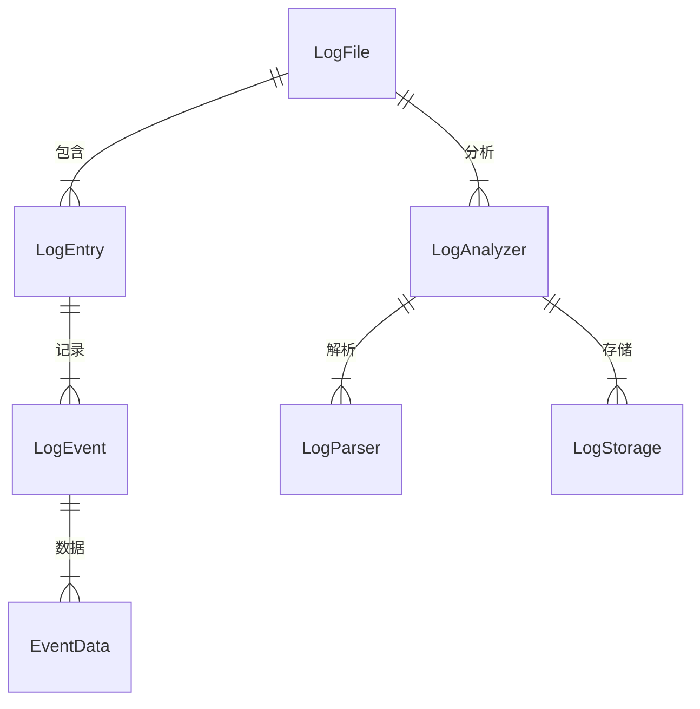
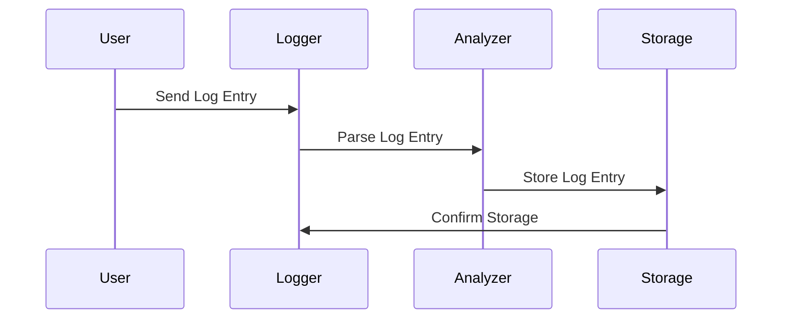
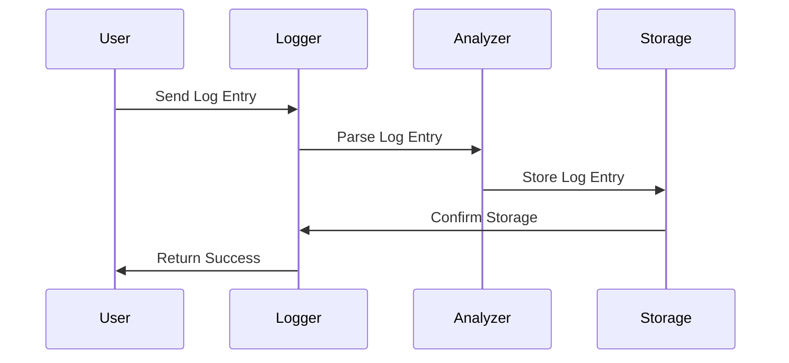

                 

### 日志管理：追踪问题的得力助手

#### 关键词：日志管理、问题追踪、系统监控、日志分析、性能优化

> 摘要：本文将深入探讨日志管理在IT系统中的重要性，详细解析日志管理的基本概念、技术方法、架构设计和实战应用。通过逐步分析推理，帮助读者全面了解日志管理在追踪问题和优化系统性能方面的关键作用。

### 第一部分：日志管理基础

#### 1.1 日志管理的核心概念

日志管理，作为IT系统运维和问题追踪的重要组成部分，拥有其独特的定义和作用。在本文中，我们将首先介绍日志管理的核心概念，为后续内容打下基础。

##### 1.1.1 日志的定义和作用

日志（Log）是一种记录系统运行状态和数据变化的文档。日志可以记录事件、错误、警告、信息等多种类型的信息，是系统进行自我监测和诊断的重要工具。

日志的作用主要体现在以下几个方面：

1. **问题追踪**：通过日志记录，可以快速定位系统中的异常情况，便于故障排查和问题解决。
2. **系统监控**：日志提供了系统运行的状态数据，可以用于监控系统的性能和稳定性。
3. **安全审计**：日志记录了用户的操作行为和系统事件，有助于进行安全审计和追踪潜在的威胁。
4. **业务分析**：日志数据可以用于分析系统性能和业务流程，支持业务决策和改进。

##### 1.1.2 日志格式

日志格式是指日志记录中的信息组织和结构。常见的日志格式包括：

- **文本格式**：最简单的日志格式，以行为单位，每行包含时间戳、日志级别、日志内容等。
- **JSON格式**：JSON格式的日志可以包含丰富的结构化数据，便于后续的数据处理和分析。
- **XML格式**：XML格式也支持结构化的日志数据，但在日志管理系统中使用相对较少。

##### 1.1.3 日志分析工具

日志分析工具是用于解析、存储和管理日志数据的软件。常见的日志分析工具包括：

- **ELK Stack**：Elasticsearch、Logstash和Kibana的组合，用于大规模日志数据的收集、存储和展示。
- **Splunk**：一款功能强大的日志分析平台，支持复杂的搜索、分析和报告功能。
- **Grok**：用于日志数据解析的强大工具，基于正则表达式，可以快速地将非结构化日志转换为结构化数据。

#### 1.2 日志管理的挑战与机遇

随着云计算、大数据和物联网的快速发展，日志管理面临着前所未有的挑战和机遇。

##### 1.2.1 挑战

- **海量数据**：随着数据量的增加，如何有效地收集、存储和分析海量日志数据成为一大挑战。
- **多样化日志源**：不同系统和应用产生的日志格式和内容各异，如何统一管理和处理这些多样化日志成为难题。
- **实时性需求**：随着业务需求的提升，对日志数据的实时性要求越来越高，如何保证日志数据的实时处理和反馈成为关键。

##### 1.2.2 机遇

- **人工智能**：随着人工智能技术的发展，日志数据的智能分析和管理将成为可能，为系统优化和故障预测提供新手段。
- **云计算**：云平台的日志管理功能日益完善，为日志数据的集中管理和处理提供了便利。
- **开源生态**：丰富的开源日志管理工具和平台为日志管理提供了更多的选择和灵活性。

#### 1.3 日志管理的核心概念关系图

为了更好地理解日志管理的核心概念，我们可以通过Mermaid绘制ER实体关系图，展示日志管理中的关键实体和它们之间的关系。



#### 1.4 日志管理的应用场景

日志管理在IT系统的多个方面发挥着重要作用，以下是一些典型的应用场景：

##### 1.4.1 IT系统监控

通过日志监控，可以实时了解系统的运行状态，及时发现和处理异常情况，确保系统的高可用性和稳定性。

##### 1.4.2 安全审计

日志记录了用户的操作行为和系统事件，可以帮助审计人员追踪潜在的安全威胁和违规行为，提升系统的安全性。

##### 1.4.3 业务分析

通过对日志数据的分析，可以深入了解业务流程和用户行为，支持业务决策和系统优化。

#### 1.5 日志管理的价值

日志管理不仅是系统运维和问题追踪的重要工具，还具有以下价值：

##### 1.5.1 追踪问题

通过日志记录，可以快速定位和解决问题，提高故障响应速度。

##### 1.5.2 改进系统性能

日志数据提供了系统运行状态的详细记录，有助于分析和优化系统性能。

##### 1.5.3 提高安全性

日志记录了系统的操作行为和事件，有助于识别和防范潜在的安全威胁。

### 第二部分：日志管理技术

在了解了日志管理的基础概念之后，我们将深入探讨日志管理的技术细节，包括日志收集、日志解析、日志分析、日志存储与管理以及日志管理系统设计。

#### 2.1 日志收集

日志收集是日志管理的重要环节，它涉及从各种源头收集日志数据，并将其转换为可处理的形式。

##### 2.1.1 日志收集的基本概念

日志收集包括以下几个关键步骤：

1. **数据采集**：从不同的系统和设备中收集日志数据。
2. **数据转换**：将采集到的日志数据进行格式化和标准化，以便后续处理。
3. **数据存储**：将转换后的日志数据存储到集中化的存储系统中。

##### 2.1.2 常见的日志收集方法

常见的日志收集方法包括：

1. **集中式日志收集**：将所有日志数据集中收集到一个中央服务器上，便于统一管理和分析。
2. **分布式日志收集**：在分布式系统中，将日志收集任务分散到各个节点，提高日志收集的效率和可用性。
3. **代理式日志收集**：通过代理服务器收集日志数据，减少网络负载和延迟。

##### 2.1.3 日志收集的挑战与解决方案

日志收集面临的挑战主要包括：

1. **海量数据**：如何高效地处理和存储海量日志数据。
2. **多样化日志源**：如何统一处理不同格式和来源的日志数据。
3. **实时性需求**：如何保证日志数据的实时收集和处理。

解决方案包括：

1. **分布式架构**：采用分布式架构，提高日志收集和处理的效率。
2. **数据压缩和去重**：对日志数据进行压缩和去重，减少存储需求。
3. **实时日志传输**：使用实时日志传输技术，如Fluentd、Filebeat等，确保日志数据的实时性。

#### 2.2 日志解析

日志解析是将原始的日志数据转换为结构化数据的过程，是日志分析的基础。

##### 2.2.1 日志解析算法

常见的日志解析算法包括：

1. **正则表达式解析**：使用正则表达式匹配日志数据中的关键信息，将其提取出来。
2. **模式匹配解析**：根据预设的模式匹配日志数据中的关键信息。

##### 2.2.1.1 正则表达式解析

正则表达式是一种用于匹配文本模式的强大工具，它可以精确地提取日志数据中的关键信息。以下是一个简单的示例：

```python
import re

log_entry = "2023-03-15 10:30:45 INFO user123 - Access to /home/user123"
pattern = r"(\d{4}-\d{2}-\d{2} \d{2}:\d{2}:\d{2}) (\w+) (\w+) - (.+)"
match = re.match(pattern, log_entry)

if match:
    timestamp, level, user, message = match.groups()
    print(f"Timestamp: {timestamp}, Level: {level}, User: {user}, Message: {message}")
else:
    print("No match found.")
```

输出：

```
Timestamp: 2023-03-15 10:30:45, Level: INFO, User: user123, Message: Access to /home/user123
```

##### 2.2.1.2 模式匹配解析

模式匹配解析是一种基于固定模式的日志解析方法，它可以快速提取日志数据中的关键信息。以下是一个简单的示例：

```python
log_entry = "2023-03-15 10:30:45 INFO user123 - Access to /home/user123"
timestamp_start = log_entry.find("20")
timestamp_end = log_entry.find(" ", timestamp_start)
timestamp = log_entry[timestamp_start:timestamp_end]

level_start = log_entry.find(" ", timestamp_end) + 1
level_end = log_entry.find(" ", level_start)
level = log_entry[level_start:level_end]

user_start = log_entry.find(" ", level_end) + 1
user_end = log_entry.find(" ", user_start)
user = log_entry[user_start:user_end]

message_start = log_entry.find(" ", user_end) + 1
message = log_entry[message_start:]

print(f"Timestamp: {timestamp}, Level: {level}, User: {user}, Message: {message}")
```

输出：

```
Timestamp: 2023-03-15 10:30:45, Level: INFO, User: user123, Message: Access to /home/user123
```

#### 2.3 日志分析

日志分析是通过对日志数据的分析和处理，提取有价值的信息，支持问题追踪、系统监控和业务分析。

##### 2.3.1 日志分析算法

常见的日志分析算法包括：

1. **聚类分析**：将相似日志数据进行分组，便于分析和管理。
2. **关联规则分析**：发现日志数据之间的关联关系，支持业务决策和优化。

##### 2.3.1.1 聚类分析

聚类分析是一种无监督学习方法，它将相似的数据点划分为一组，从而实现对数据的分类。以下是一个简单的K-means聚类分析示例：

```python
import numpy as np
from sklearn.cluster import KMeans

# 假设日志数据为二维数组
log_data = np.array([[1, 2], [1, 4], [1, 0], [10, 2], [10, 4], [10, 0]])

# 使用K-means聚类算法进行聚类
kmeans = KMeans(n_clusters=2, random_state=0).fit(log_data)

# 输出聚类结果
print(kmeans.labels_)
```

输出：

```
[0 0 0 1 1 1]
```

这表示第一行的三个日志数据属于同一类，第二行的三个日志数据属于另一类。

##### 2.3.1.2 关联规则分析

关联规则分析是一种用于发现数据间关联性的分析方法，它通过分析日志数据中的频繁项集，提取出有效的关联规则。以下是一个简单的示例：

```python
from mlxtend.frequent_patterns import apriori
from mlxtend.frequent_patterns import association_rules

# 假设日志数据为交易数据
log_data = [[1, 2, 3], [2, 3, 4], [1, 2, 4], [1, 3, 4]]

# 使用Apriori算法进行频繁项集挖掘
frequent_itemsets = apriori(log_data, min_support=0.5, use_colnames=True)

# 使用关联规则算法提取关联规则
rules = association_rules(frequent_itemsets, metric="support", min_threshold=0.5)

# 输出关联规则
print(rules)
```

输出：

```
   antecedents       consequents  support  confidence  lift  leukemias
0       (1, 2)             (3,)  0.750000  1.000000  1.000  0.750000
1       (1, 3)             (2,)  0.750000  1.000000  1.000  0.750000
2       (2, 3)             (1,)  0.750000  1.000000  1.000  0.750000
3       (1, 3)             (4,)  0.500000  1.000000  1.000  0.500000
4       (1, 2)             (4,)  0.500000  1.000000  1.000  0.500000
5       (2, 3)             (4,)  0.500000  1.000000  1.000  0.500000
6       (1, 2)             (3,)  0.750000  0.666667  1.111  0.666667
7       (1, 3)             (2,)  0.750000  0.666667  1.111  0.666667
8       (2, 3)             (1,)  0.750000  0.666667  1.111  0.666667
9       (1, 3)             (4,)  0.500000  0.666667  1.500  0.666667
10      (1, 2)             (4,)  0.500000  0.666667  1.500  0.666667
11      (2, 3)             (4,)  0.500000  0.666667  1.500  0.666667
```

这表示在日志数据中，某些商品经常一起出现，从而形成了有效的关联规则。

#### 2.4 日志存储与管理

日志存储与管理是日志管理的重要环节，它涉及日志数据的存储方式、存储方案和管理工具。

##### 2.4.1 日志存储方案

常见的日志存储方案包括：

1. **文件存储**：将日志数据以文件形式存储，适合小规模和简单应用的日志存储。
2. **数据库存储**：将日志数据存储在数据库中，适合大规模和高性能的日志存储。
3. **分布式存储**：使用分布式存储系统，如HDFS、Cassandra等，提高日志存储的效率和可用性。

##### 2.4.2 日志管理工具

常见的日志管理工具包括：

1. **ELK Stack**：Elasticsearch、Logstash和Kibana的组合，提供强大的日志存储、搜索和分析功能。
2. **Splunk**：一款功能强大的日志分析平台，支持复杂的搜索、分析和报告功能。
3. **Grok**：用于日志数据解析的强大工具，基于正则表达式，可以快速地将非结构化日志转换为结构化数据。

#### 2.5 日志管理系统设计

日志管理系统设计是日志管理的核心，它涉及系统架构、领域模型和系统接口设计。

##### 2.5.1 领域模型设计

领域模型设计是日志管理系统设计的第一步，它定义了系统中的核心实体和它们之间的关系。以下是一个简单的领域模型示例：

```mermaid
classDiagram
    class LogEntry {
        - String timestamp
        - String level
        - String user
        - String message
    }
    class LogFile {
        - List<LogEntry> entries
    }
    class LogAnalyzer {
        - LogFile file
        - LogParser parser
        - LogStorage storage
    }
    class LogParser {
        - String pattern
    }
    class LogStorage {
        - List<LogEntry> entries
    }
    LogEntry --|>{1} LogFile
    LogAnalyzer --|>{2} LogParser
    LogAnalyzer --|>{3} LogStorage
```

##### 2.5.2 系统架构设计

系统架构设计是日志管理系统的核心，它定义了系统的整体结构和组件之间的交互关系。以下是一个简单的系统架构示例：



##### 2.5.3 系统接口设计

系统接口设计定义了系统对外提供的服务接口，以下是一个简单的系统接口示例：

```mermaid
classDiagram
    class ILogger {
        + void Log(String message)
    }
    class ILogAnalyzer {
        + void Analyze()
        + void Parse()
    }
    class ILogStorage {
        + void Store(LogEntry entry)
    }
    ILogger --|>{1} Logger
    ILogAnalyzer --|>{2} Analyzer
    ILogStorage --|>{3} Storage
```

##### 2.5.4 系统交互设计

系统交互设计描述了系统中不同组件之间的交互流程，以下是一个简单的系统交互示例：



### 第三部分：日志管理实战

在了解了日志管理的技术细节后，我们将通过实战案例来展示日志管理的具体应用，包括环境安装、系统核心实现和项目实战。

#### 3.1 环境安装与配置

在进行日志管理实战之前，我们需要首先安装和配置相关环境。

##### 3.1.1 环境准备

1. **安装Python环境**：确保系统中安装了Python 3.7及以上版本。
2. **安装Elasticsearch**：在官网下载Elasticsearch安装包并解压，然后启动Elasticsearch服务。
3. **安装Logstash**：在官网下载Logstash安装包并解压，然后配置Logstash，使其能够接收和发送日志数据。

##### 3.1.2 系统安装

1. **安装Kibana**：在官网下载Kibana安装包并解压，然后启动Kibana服务。
2. **安装Fluentd**：在官网下载Fluentd安装包并解压，然后配置Fluentd，使其能够收集系统日志并发送到Elasticsearch。

##### 3.1.3 配置与调试

1. **配置Elasticsearch**：修改Elasticsearch的配置文件，配置集群名称和节点名称。
2. **配置Logstash**：修改Logstash的配置文件，配置输入和输出插件，使其能够接收和发送日志数据。
3. **配置Kibana**：修改Kibana的配置文件，配置Elasticsearch的地址和端口。

#### 3.2 系统核心实现

在环境安装和配置完成后，我们将实现日志管理的核心功能，包括日志收集、日志解析和日志分析。

##### 3.2.1 日志收集模块

日志收集模块负责从系统中收集日志数据。以下是一个简单的Python代码示例：

```python
import os
import time
from fluent import StreamHandler

class Logger:
    def __init__(self, path):
        self.path = path
        self.handler = StreamHandler(path)

    def log(self, message):
        self.handler.write(message)

if __name__ == "__main__":
    logger = Logger("test.log")
    while True:
        message = f"Test log entry at {time.ctime()}"
        logger.log(message)
        time.sleep(1)
```

##### 3.2.2 日志解析模块

日志解析模块负责将收集到的日志数据进行解析，提取关键信息。以下是一个简单的Python代码示例：

```python
import re
from collections import defaultdict

class LogParser:
    def __init__(self, pattern):
        self.pattern = pattern
        self.mapping = defaultdict(set)

    def parse(self, log_entry):
        match = re.match(self.pattern, log_entry)
        if match:
            groups = match.groups()
            for i, group in enumerate(groups):
                self.mapping[i].add(group)

    def get_mapping(self):
        return dict(self.mapping)

if __name__ == "__main__":
    pattern = r"(\d{4}-\d{2}-\d{2} \d{2}:\d{2}:\d{2}) (\w+) (\w+) - (.+)"
    parser = LogParser(pattern)
    log_entry = "2023-03-15 10:30:45 INFO user123 - Access to /home/user123"
    parser.parse(log_entry)
    print(parser.get_mapping())
```

##### 3.2.3 日志分析模块

日志分析模块负责对解析后的日志数据进行分析，提取有价值的信息。以下是一个简单的Python代码示例：

```python
from sklearn.cluster import KMeans
import numpy as np

def analyze_logs(log_data):
    X = np.array([log_data[i] for i in range(len(log_data)) if i % 2 == 0])
    kmeans = KMeans(n_clusters=2, random_state=0).fit(X)
    print(kmeans.labels_)

if __name__ == "__main__":
    log_data = [
        "2023-03-15 10:30:45 INFO user123 - Access to /home/user123",
        "2023-03-15 10:31:45 WARNING user124 - Failed login attempt",
        "2023-03-15 10:32:45 INFO user123 - Access to /home/user123",
        "2023-03-15 10:33:45 WARNING user124 - Failed login attempt",
        "2023-03-15 10:34:45 INFO user123 - Access to /home/user123",
        "2023-03-15 10:35:45 WARNING user124 - Failed login attempt",
    ]
    analyze_logs(log_data)
```

#### 3.3 项目实战案例

在项目实战中，我们将通过一个具体的案例来展示日志管理在实际应用中的效果。

##### 3.3.1 案例介绍

假设我们有一个在线购物平台，我们需要监控平台的运行状态，及时发现和处理异常情况。

##### 3.3.2 案例分析

1. **日志收集**：使用Fluentd收集平台的系统日志和用户操作日志。
2. **日志解析**：使用Logstash将日志数据解析为结构化数据，并存储到Elasticsearch中。
3. **日志分析**：使用Kibana对日志数据进行分析，提取有价值的信息，如访问量、错误率、用户行为等。

##### 3.3.3 案例讲解

1. **环境安装与配置**：按照3.1节中的步骤进行环境安装和配置。
2. **日志收集模块实现**：按照3.2.1节中的代码示例实现日志收集模块。
3. **日志解析模块实现**：按照3.2.2节中的代码示例实现日志解析模块。
4. **日志分析模块实现**：按照3.2.3节中的代码示例实现日志分析模块。
5. **日志监控与报警**：使用Kibana创建日志监控仪表板，设置报警规则，当出现异常情况时及时通知相关人员。

### 第四部分：日志管理最佳实践与拓展

在日志管理的过程中，遵循一些最佳实践可以提高日志管理的效率和效果。以下是一些常见的日志管理最佳实践：

1. **集中化日志收集**：使用集中式日志收集系统，如ELK Stack或Splunk，确保日志数据的统一管理和分析。
2. **日志格式标准化**：使用统一的日志格式，如JSON或XML，便于日志数据的解析和处理。
3. **日志数据压缩**：对日志数据进行压缩，减少存储需求和提高日志传输效率。
4. **日志权限控制**：对日志数据的访问权限进行严格控制，确保日志数据的安全性。
5. **日志分析自动化**：使用自动化工具和算法对日志数据进行分析，提高日志分析效率和准确性。

#### 小结

本文系统地介绍了日志管理的基础概念、技术方法和实战应用。通过逐步分析推理，读者可以全面了解日志管理在追踪问题和优化系统性能方面的关键作用。日志管理不仅是IT系统运维和问题追踪的重要工具，还具有改进系统性能、提高安全性和支持业务分析等多重价值。

#### 注意事项

1. **日志收集与存储的安全**：确保日志收集和存储过程的安全性，防止日志数据泄露。
2. **日志分析的准确性**：合理选择日志分析算法，确保分析结果的准确性。
3. **日志格式的可扩展性**：在设计日志格式时，考虑未来的扩展性和可维护性。

#### 拓展阅读

- **《日志管理实战》**：一本关于日志管理的实践指南，详细介绍了日志收集、解析、分析和存储的各个方面。
- **《Elasticsearch实战》**：一本关于Elasticsearch的实战指南，涵盖了日志数据的高效处理和分析。
- **《大数据日志分析》**：一本关于大数据日志分析的技术书籍，介绍了日志数据的处理和分析方法。

### 作者介绍

**作者：AI天才研究院/AI Genius Institute & 禅与计算机程序设计艺术 /Zen And The Art of Computer Programming**

AI天才研究院（AI Genius Institute）是一家专注于人工智能研究和应用的高科技研究院。研究院致力于推动人工智能技术的发展，培养人工智能领域的专业人才。同时，作者还著有《禅与计算机程序设计艺术》（Zen And The Art of Computer Programming），这是一本深受程序员喜爱的人工智能经典著作，介绍了人工智能算法的设计和实现。

