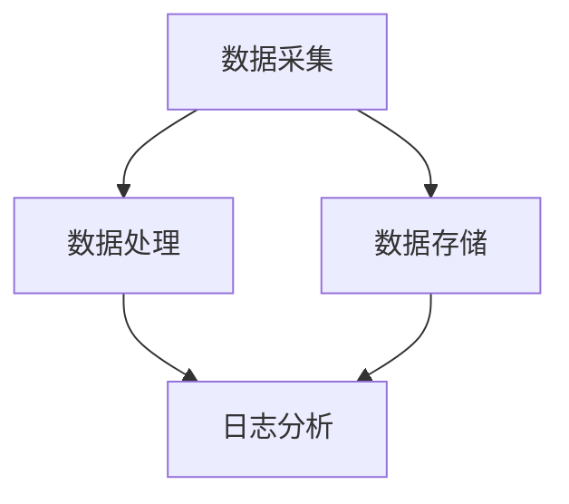

                 

# 日志管理：集中式日志系统的设计与实现

关键词：日志管理、集中式日志系统、架构设计、日志分析、性能优化

摘要：随着IT系统的日益复杂化，日志管理成为系统运维中不可或缺的一环。本文将探讨日志管理的重要性，集中式日志系统的架构设计与实现，日志聚合与处理技术，以及日志分析工具和技术。通过一步步分析推理，本文旨在为读者提供一个全面深入的了解，以及在实际应用中的最佳实践。

## 目录大纲

1. 引言：日志管理的重要性
2. 集中式日志系统的架构设计与实现
3. 日志聚合与处理技术
4. 日志分析工具与技术
5. 最佳实践与小结

## 第1章 引言：日志管理的重要性

### 1.1 问题背景

日志管理，是指对系统中产生的日志数据进行收集、存储、处理和分析的过程。日志数据是系统运行过程中产生的记录，它们包含了系统事件、错误、调试信息等，对于系统的监控、故障排查、性能优化等都有着重要的价值。

**日志管理的定义**：日志管理是一个系统化的过程，它包括日志数据的生成、收集、存储、处理、分析和展示等多个环节。

**日志管理的必要性**：在当今复杂的IT环境中，系统的规模和复杂度不断增加，日志管理的重要性也随之提升。首先，日志管理可以帮助运维团队更好地监控系统运行状态，及时发现和解决问题。其次，日志管理在安全方面也有着重要作用，通过对日志数据的分析，可以识别和响应潜在的安全威胁。最后，有效的日志管理可以提高运维效率，减少人工干预，实现自动化运维。

**日志管理的挑战**：随着系统规模的扩大，日志数据的规模也日益庞大。如何高效地收集、存储和处理这些日志数据成为一大挑战。此外，不同系统的日志格式可能各不相同，如何将这些不同格式的日志数据进行统一处理也是一个难题。

### 1.2 日志管理的关键概念

**日志格式**：常见的日志格式包括文本格式和结构化格式，如JSON。文本格式便于人类阅读，但难以进行结构化处理；结构化格式则便于计算机处理，但可能降低可读性。

**集中式日志系统**：集中式日志系统是将分散的日志数据集中到一个系统中进行管理和分析。它具有日志数据统一、集中管理、易于分析等优势。

**日志分析工具**：常见的日志分析工具有ELK（Elasticsearch、Logstash、Kibana）、Logstash、Kafka等。这些工具可以根据具体需求进行选择和应用。

### 1.3 日志管理的目标

**提高系统可观测性**：通过日志管理，可以全面记录系统运行过程中的各种事件，提高系统的可观测性，便于运维团队及时发现和解决问题。

**增强安全性**：日志管理可以帮助识别和响应潜在的安全威胁，提高系统的安全性。

**优化运维效率**：通过自动化日志处理和分析，可以减少人工干预，提高运维效率。

### 1.4 小结

日志管理在系统运维中扮演着重要角色，它不仅可以帮助提高系统的可观测性和安全性，还能优化运维效率。然而，日志管理也面临着诸多挑战，如日志数据规模庞大、日志格式多样等。本文将围绕集中式日志系统的设计与实现，探讨日志管理的解决方案。

## 第2章 集中式日志系统的架构设计与实现

### 2.1 集中式日志系统的架构设计

**系统架构概述**：

集中式日志系统主要包括数据采集、数据存储、数据处理和日志分析等模块。以下是一个典型的集中式日志系统架构图：

**数据采集**：

数据采集是日志系统的第一步，它负责从各个系统或服务中收集日志数据。常见的采集方法包括基于代理的采集、基于API的采集和基于网络流量分析等。

**数据存储**：

日志数据的存储是集中式日志系统的核心，它决定了日志数据的可靠性和可扩展性。常见的日志存储解决方案包括关系数据库、NoSQL数据库和日志文件存储等。以下是几种常见的存储解决方案的对比表格：

| 解决方案         | 优点                           | 缺点                           |
|-----------------|--------------------------------|--------------------------------|
| 关系数据库         | 数据结构稳定，易于查询           | 存储性能较差，扩展性较差           |
| NoSQL数据库         | 存储性能高，扩展性好             | 数据结构灵活，查询复杂           |
| 日志文件存储       | 简单易用，成本低               | 数据量大时，查询效率低           |

**数据处理**：

数据处理是对采集到的日志数据进行清洗、格式转换和索引等操作，以便于后续的日志分析。常见的处理方法包括日志清洗、格式转换和日志索引等。

**日志分析**：

日志分析是集中式日志系统的最后一步，它通过对处理后的日志数据进行分析，发现系统运行中的问题、趋势和模式。常见的日志分析技术包括模式识别、机器学习等。

### 2.2 实现集中式日志系统

**系统开发**：

实现集中式日志系统需要选择合适的技术栈，包括编程语言、框架和中间件等。常见的编程语言有Python、Java和Go等，常见的框架有Spring Boot、Flask和Django等，常见的中间件有Kafka、Elasticsearch等。

**性能优化**：

性能优化是集中式日志系统设计中的重要一环，它决定了系统的响应速度和处理能力。常见的性能优化方法包括负载均衡、缓存策略和并行处理等。

**安全性考虑**：

在日志管理中，数据安全和隐私保护是非常重要的。常见的安全措施包括数据加密、访问控制和安全审计等。

### 2.3 集中式日志系统的实际应用

**案例研究**：

通过具体案例展示集中式日志系统在实际应用中的效果，可以更好地理解集中式日志系统的优势和应用场景。

**最佳实践**：

总结集中式日志系统在实际应用中的最佳实践，以供读者参考。

### 2.4 小结

集中式日志系统在日志管理中具有关键作用。通过合理的架构设计、有效的数据处理和先进的日志分析技术，集中式日志系统可以帮助提高系统的可观测性、安全性和运维效率。在实现集中式日志系统时，需要考虑性能优化和安全性等因素。

## 第3章 日志聚合与处理技术

### 3.1 日志聚合技术

**日志聚合的概念**：

日志聚合是指将来自多个系统或服务的日志数据进行收集和整合，以便进行统一处理和分析。

**日志聚合的方法**：

常见的日志聚合方法包括基于代理的聚合、基于API的聚合和基于日志聚合工具的聚合等。

- **基于代理的聚合**：通过部署代理服务，将各个系统的日志数据发送到集中式日志系统。

- **基于API的聚合**：通过各个系统提供的API接口，定时或实时地将日志数据发送到集中式日志系统。

- **基于日志聚合工具的聚合**：使用专门的日志聚合工具，如Logstash、Fluentd等，将多个系统的日志数据进行收集和整合。

**日志聚合的挑战**：

在日志聚合过程中，可能会遇到以下问题：

- **数据完整性**：如何确保聚合过程中数据的完整性，防止数据丢失。

- **延迟**：如何降低日志数据传输的延迟，保证实时性。

- **性能**：如何处理大规模的日志数据，保证系统的性能。

### 3.2 日志处理技术

**日志清洗**：

日志清洗是对采集到的日志数据进行预处理，去除无关数据、填充缺失值等，以提高日志数据的可用性。

**日志格式转换**：

日志格式转换是将不同格式的日志数据转换为统一格式，以便进行后续处理和分析。

**日志索引**：

日志索引是对日志数据建立索引，以便快速检索和分析。

### 3.3 日志处理工具

**Logstash**：

Logstash是一个开源的数据收集和处理工具，它可以将来自不同来源的数据进行收集、格式转换和输出。以下是Logstash的基本使用方法和配置：

- **输入模块**：负责从各种数据源读取数据，如文件、日志、数据库等。

- **过滤模块**：对输入的数据进行处理和转换，如过滤特定字段、添加新的字段等。

- **输出模块**：将处理后的数据输出到目标存储或分析工具，如Elasticsearch、Kafka等。

**Kafka**：

Kafka是一种分布式消息队列系统，它可以高效地处理大规模日志数据，并支持高吞吐量的数据流处理。

**Elasticsearch**：

Elasticsearch是一种基于Lucene的全文搜索引擎，它可以对大规模的日志数据进行快速检索和分析。

### 3.4 小结

日志聚合与处理技术在日志管理中起着重要作用。通过有效的日志聚合，可以实现对大量日志数据的统一管理和处理。日志处理技术则可以提高日志数据的可用性和可分析性。选择合适的日志处理工具，可以进一步优化日志管理流程，提高系统的运行效率。

## 第4章 日志分析工具与技术

### 4.1 日志分析工具

**ELK栈**：

ELK栈是由Elasticsearch、Logstash和Kibana三个组件组成的日志分析平台。以下是ELK栈的组成部分和集成方法：

- **Elasticsearch**：Elasticsearch是一个分布式、RESTful搜索引擎，它提供了高效、可扩展的日志数据存储和检索能力。

- **Logstash**：Logstash是一个数据收集和处理工具，它可以将各种来源的日志数据进行收集、格式转换和输出。

- **Kibana**：Kibana是一个数据可视化和分析工具，它可以帮助用户对日志数据进行实时监控和分析。

**其他日志分析工具**：

除了ELK栈，还有其他一些流行的日志分析工具，如Splunk、Grok等。Splunk是一种强大的日志分析平台，它提供了丰富的数据可视化和报告功能。Grok是一种用于日志数据解析的工具，它使用正则表达式来提取和解析日志数据。

### 4.2 日志分析技术

**模式识别**：

模式识别是日志分析中的一个重要技术，它通过分析日志数据中的模式，发现潜在的异常行为和问题。常见的模式识别方法包括基于规则的方法、机器学习方法等。

**机器学习**：

机器学习是日志分析中的一种先进技术，它通过训练模型，对日志数据进行分类、聚类和异常检测等操作。常见的机器学习算法包括K-means、决策树、神经网络等。

### 4.3 日志分析工具的应用

**案例研究**：

通过具体案例展示日志分析工具在实际应用中的效果，可以更好地理解日志分析工具的优势和应用场景。

**最佳实践**：

总结日志分析工具在实际应用中的最佳实践，以供读者参考。

### 4.4 小结

日志分析工具和技术在日志管理中起着关键作用。通过选择合适的日志分析工具，并运用有效的分析技术，可以实现对日志数据的深入挖掘和利用，提高系统的运行效率和安全性。

## 最佳实践与小结

### 最佳实践

- **日志格式统一**：为了便于日志数据的处理和分析，建议统一日志格式，如采用JSON格式，以便于结构化处理。

- **日志数据备份**：定期备份日志数据，以防数据丢失。

- **日志数据安全**：对日志数据进行加密和访问控制，确保数据安全。

- **日志数据归档**：对长时间未使用的日志数据进行归档，以减轻存储压力。

### 小结

日志管理是系统运维中不可或缺的一环，它对于系统的监控、故障排查、性能优化和安全性等方面都有着重要作用。通过合理的架构设计、有效的数据处理和先进的日志分析技术，可以实现高效的日志管理。在日志管理实践中，还需要关注日志格式统一、数据备份、数据安全和归档等最佳实践，以提高日志管理的效率和效果。

### 注意事项

- **日志规模控制**：随着系统规模的扩大，日志数据的规模也会增大，需要合理控制日志规模，避免日志数据过多导致系统性能下降。

- **日志数据一致性**：在日志聚合和处理过程中，要确保日志数据的一致性，防止数据丢失或错误。

### 拓展阅读

- **《日志管理实战》**：该书详细介绍了日志管理的最佳实践和技术，包括日志收集、存储、处理和分析等。

- **《Elastic Stack实战》**：该书介绍了ELK栈的使用方法、配置和优化技巧，是日志分析领域的重要参考书。

### 作者

作者：AI天才研究院/AI Genius Institute & 禅与计算机程序设计艺术 /Zen And The Art of Computer Programming

