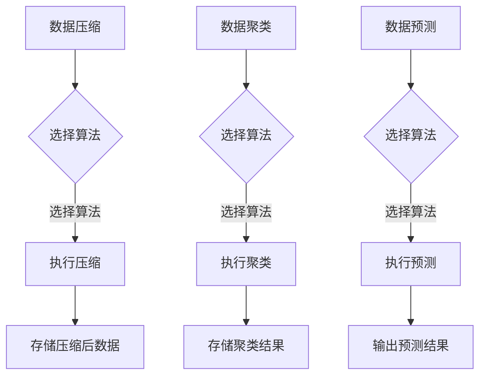
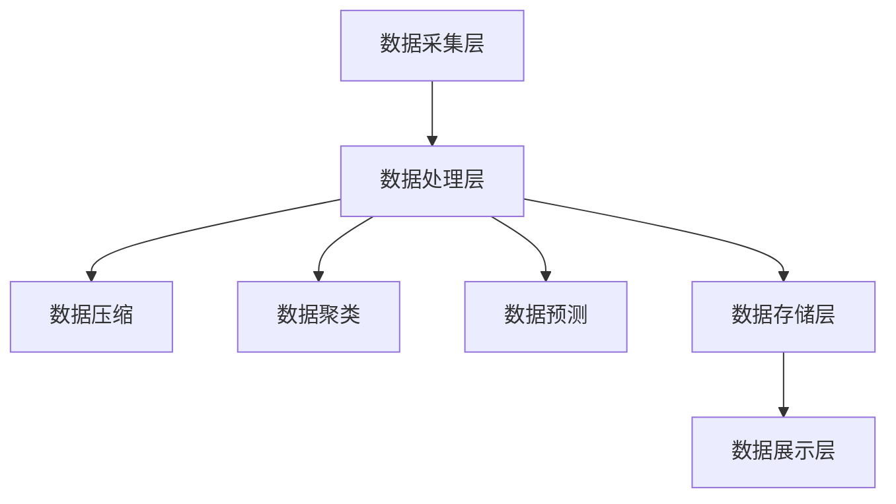

                 

# 时序数据库设计与应用

> 关键词：时序数据库，数据压缩，聚类算法，预测算法，系统架构设计

摘要：本文旨在深入探讨时序数据库的设计与应用，通过逐步分析时序数据的特性、处理挑战和解决方案，详细讲解时序数据库的核心概念、算法原理，并结合实际场景展示系统分析与架构设计。文章最后提出最佳实践和建议，以期为读者在时序数据处理领域提供实用的指导和启示。

## 目录大纲

----------------------------------------------------------------
### 第一部分：背景介绍

#### 1.1 问题背景
##### 1.1.1 时序数据的定义与特点
##### 1.1.2 时序数据的应用场景
##### 1.1.3 时序数据处理的挑战

#### 1.2 问题描述
##### 1.2.1 数据存储与查询的性能瓶颈
##### 1.2.2 数据一致性与可靠性要求
##### 1.2.3 数据安全与隐私保护

#### 1.3 问题解决
##### 1.3.1 时序数据库概述
##### 1.3.2 时序数据库的分类
##### 1.3.3 时序数据库的优势与局限

#### 1.4 边界与外延
##### 1.4.1 时序数据库与其他数据库的异同
##### 1.4.2 时序数据库的发展趋势

#### 1.5 概念结构与核心要素组成
##### 1.5.1 时序数据模型
##### 1.5.2 时序数据的采集与存储
##### 1.5.3 时序数据的分析与查询

#### 1.6 本章小结

### 第二部分：核心概念与联系

#### 2.1 核心概念
##### 2.1.1 时序数据库的定义
##### 2.1.2 时序数据的类型
##### 2.1.3 时序数据的索引技术

#### 2.2 概念属性特征对比表格
| 特征 | 时序数据库 | 关系数据库 | 文件系统 |
| --- | --- | --- | --- |
| 存储结构 | 列式存储 | 行式存储 | 文件块存储 |
| 查询性能 | 高度优化 | 一般优化 | 较低 |
| 时间戳支持 | 强支持 | 弱支持 | 无支持 |
| 流数据处理 | 支持 | 不支持 | 不支持 |

#### 2.3 ER实体关系图架构
```mermaid
erDiagram
    DataPoint ||--|{ TimeSeries }：<时间序列数据>
    TimeSeries ||--|{ Database }：<时序数据库>
    Database ||--|{ Query }：<查询操作>
    Query ||--|{ Result }：<查询结果>
```

#### 2.4 本章小结

### 第三部分：算法原理讲解

#### 3.1 算法原理
##### 3.1.1 时序数据压缩算法
##### 3.1.2 时序数据聚类算法
##### 3.1.3 时序数据预测算法

#### 3.2 Mermaid流程图


#### 3.3 Python源代码示例
```python
# 假设的时序数据压缩函数
def compress_data(data):
    # 实现数据压缩逻辑
    compressed_data = ...
    return compressed_data

# 假设的时序数据聚类函数
def cluster_data(data):
    # 实现聚类逻辑
    clusters = ...
    return clusters

# 假设的时序数据预测函数
def predict_data(data):
    # 实现预测逻辑
    prediction = ...
    return prediction
```

#### 3.4 算法原理详细讲解
##### 3.4.1 数据压缩算法的数学模型和公式
##### 3.4.2 数据聚类算法的数学模型和公式
##### 3.4.3 数据预测算法的数学模型和公式

#### 3.5 举例说明
##### 3.5.1 数据压缩算法举例
##### 3.5.2 数据聚类算法举例
##### 3.5.3 数据预测算法举例

#### 3.6 本章小结

### 第四部分：系统分析与架构设计方案

#### 4.1 问题场景介绍
##### 4.1.1 场景描述
##### 4.1.2 场景分析

#### 4.2 项目介绍
##### 4.2.1 项目目标
##### 4.2.2 项目架构

#### 4.3 系统功能设计
##### 4.3.1 领域模型
```mermaid
classDiagram
    DataPoint <<ent
``` 

----------------------------------------------------------------

## 第一部分：背景介绍

### 1.1 问题背景

#### 1.1.1 时序数据的定义与特点

时序数据（Time-Series Data）是指以时间为维度，按照时间顺序记录的一系列数据点。这些数据点通常包含了某个实体随时间变化的各种属性。例如，股票市场的交易数据、传感器采集的环境数据、互联网服务器访问日志等，都是典型的时序数据。

时序数据具有以下特点：

1. **时间顺序性**：数据点必须按照时间顺序排列，每个数据点都有一个明确的时间戳。
2. **周期性**：许多时序数据表现出周期性变化，例如季节性波动、日周期、周周期等。
3. **高维性**：时序数据往往包含多个维度，例如多维传感器数据、多指标经济数据等。
4. **稀疏性**：某些时序数据可能只在特定时间间隔内发生变化，其余时间保持不变。

#### 1.1.2 时序数据的应用场景

时序数据在各种领域有着广泛的应用，以下是几个典型的应用场景：

1. **金融领域**：时序数据用于分析股票市场走势、预测投资风险、优化投资组合等。
2. **工业监控**：时序数据用于监控生产设备状态、预测设备故障、优化生产流程等。
3. **气象预报**：时序数据用于收集和分析气象数据，进行天气预报和气候预测。
4. **智能交通**：时序数据用于监控交通流量、预测交通拥堵、优化交通信号控制等。
5. **健康医疗**：时序数据用于监控患者健康状况、预测疾病风险、辅助医疗决策等。

#### 1.1.3 时序数据处理的挑战

时序数据处理面临着一系列挑战，主要包括以下几个方面：

1. **海量数据存储**：时序数据通常具有海量特性，需要高效的数据存储解决方案。
2. **高效查询性能**：时序数据的查询需求通常非常高频，需要数据库具有快速查询性能。
3. **时间窗口分析**：时序数据往往需要按照时间窗口进行统计和分析，如日统计、周统计等。
4. **数据压缩与存储**：为了减少存储空间和提高查询效率，需要对时序数据进行有效的压缩。
5. **实时处理与流数据处理**：许多应用场景需要实时处理和流数据处理，如实时监控、实时预测等。

### 1.2 问题描述

在时序数据处理中，常见的问题包括以下几个方面：

#### 1.2.1 数据存储与查询的性能瓶颈

传统的数据库系统（如关系数据库）在处理时序数据时，通常会遇到性能瓶颈。这主要是因为时序数据的特点与关系数据库的设计理念之间存在差异。具体表现如下：

1. **索引效率低**：关系数据库通常使用B树索引，但时序数据的时间戳索引效率较低。
2. **数据存储结构不优化**：关系数据库采用行式存储结构，不适合时序数据的高效存储。
3. **查询性能不足**：关系数据库的查询优化器不擅长处理时序数据的范围查询和统计分析。

#### 1.2.2 数据一致性与可靠性要求

时序数据通常需要保证一致性、可靠性和持久性。在数据采集、存储和处理过程中，可能出现以下问题：

1. **数据丢失**：传感器故障、网络中断等问题可能导致数据丢失。
2. **数据不一致**：多源数据合并时，可能出现时间戳对齐不一致或数据冗余等问题。
3. **数据持久化**：需要确保数据能够在系统故障或数据恢复过程中保持完整性。

#### 1.2.3 数据安全与隐私保护

时序数据往往包含敏感信息，如个人健康数据、金融交易数据等。在数据存储、传输和处理过程中，需要确保数据的安全性，防止数据泄露和非法访问。具体挑战包括：

1. **数据加密**：对数据进行加密存储和传输，确保数据在传输过程中不被窃取。
2. **访问控制**：根据用户权限对数据进行访问控制，确保只有授权用户才能访问敏感数据。
3. **隐私保护**：对时序数据进行匿名化处理，降低隐私泄露风险。

### 1.3 问题解决

为了解决时序数据处理中的各种挑战，需要采用专门的时序数据库系统。时序数据库系统具有以下特点：

#### 1.3.1 时序数据库概述

时序数据库（Time-Series Database，简称TSDB）是一种专门为处理时序数据而设计的数据库系统。与传统的数据库系统相比，时序数据库在以下几个方面进行了优化：

1. **列式存储结构**：时序数据库采用列式存储结构，适合存储和查询时序数据。
2. **时间戳索引**：时序数据库使用时间戳作为索引，提高了查询效率。
3. **高效压缩算法**：时序数据库采用高效的压缩算法，减少存储空间和提高查询性能。
4. **流数据处理能力**：时序数据库支持实时处理和流数据处理，满足高频查询需求。

#### 1.3.2 时序数据库的分类

时序数据库可以按照不同的标准进行分类，常见的分类方法如下：

1. **根据数据模型**：
   - **时间序列数据模型**：直接存储原始时序数据。
   - **时间窗口数据模型**：将时序数据聚合到时间窗口中，以减少数据量。
2. **根据存储方式**：
   - **内存存储**：将数据存储在内存中，提供高速查询能力。
   - **磁盘存储**：将数据存储在磁盘上，提供持久化存储能力。
3. **根据功能特点**：
   - **时序数据统计查询**：支持时间窗口统计查询、聚合查询等。
   - **时序数据预测**：支持时序数据的预测和分析。
   - **时序数据流处理**：支持实时数据处理和流处理。

#### 1.3.3 时序数据库的优势与局限

时序数据库具有以下优势：

1. **高效存储与查询**：通过列式存储、时间戳索引和压缩算法，时序数据库提供了高效的存储和查询性能。
2. **实时数据处理**：时序数据库支持实时数据处理和流处理，适合高频查询需求。
3. **灵活的数据模型**：时序数据库支持多种数据模型，适应不同的应用场景。

然而，时序数据库也存在一些局限：

1. **存储容量限制**：内存存储时序数据库的存储容量有限，无法处理海量数据。
2. **数据一致性保障**：在分布式环境中，时序数据库的数据一致性保障较为复杂。
3. **扩展性与兼容性**：时序数据库的扩展性和兼容性可能不如关系数据库。

### 1.4 边界与外延

#### 1.4.1 时序数据库与其他数据库的异同

时序数据库与关系数据库、NoSQL数据库等存在一定的异同：

1. **存储结构**：关系数据库采用行式存储，NoSQL数据库采用非关系型存储结构，时序数据库采用列式存储。
2. **查询性能**：时序数据库在处理时序数据查询方面具有优势，关系数据库和NoSQL数据库则适用于其他类型的数据查询。
3. **数据模型**：关系数据库采用关系数据模型，NoSQL数据库采用非关系数据模型，时序数据库采用时间序列数据模型。

#### 1.4.2 时序数据库的发展趋势

随着大数据和人工智能技术的不断发展，时序数据库在未来有望在以下方面取得进一步发展：

1. **分布式架构**：分布式时序数据库能够更好地处理海量数据，提高系统可扩展性和容错性。
2. **智能预测与分析**：结合机器学习算法，时序数据库将能够提供更准确的预测和分析功能。
3. **跨领域应用**：时序数据库将逐步应用于更多领域，如物联网、智慧城市、生物医疗等。
4. **数据安全与隐私保护**：随着数据安全需求的提高，时序数据库将进一步加强数据加密、访问控制等安全特性。

### 1.5 概念结构与核心要素组成

#### 1.5.1 时序数据模型

时序数据模型是时序数据库的核心概念，它定义了时序数据的存储和组织方式。常见的时序数据模型包括：

1. **时间序列数据模型**：直接存储原始时序数据，包括时间戳、数据值等。
2. **时间窗口数据模型**：将时序数据聚合到时间窗口中，以减少数据量，例如时间平均、最大值、最小值等。
3. **时间序列索引模型**：使用时间戳作为索引，快速访问和查询时序数据。

#### 1.5.2 时序数据的采集与存储

时序数据的采集与存储是时序数据库的关键环节，主要包括以下几个方面：

1. **传感器采集**：通过传感器、数据采集设备等实时采集时序数据。
2. **日志采集**：通过日志记录系统收集系统运行过程中的时序数据。
3. **数据存储**：将采集到的时序数据存储到时序数据库中，采用列式存储结构，提高查询效率。

#### 1.5.3 时序数据的分析与查询

时序数据的分析与查询是时序数据库的核心功能，主要包括以下几个方面：

1. **时间窗口统计查询**：按照时间窗口对时序数据进行统计，例如日统计、周统计等。
2. **聚合查询**：对时序数据进行聚合操作，例如求和、平均值、最大值、最小值等。
3. **预测分析**：结合机器学习算法，对时序数据进行预测和分析，例如趋势预测、异常检测等。

### 1.6 本章小结

本章主要介绍了时序数据库的背景、问题、解决方案、边界与外延以及核心概念与结构。通过分析时序数据的特性与应用场景，探讨了时序数据处理面临的挑战和时序数据库的优势与局限。同时，对时序数据库的概念结构、采集与存储、分析与查询等核心要素进行了详细阐述。本章内容为后续章节的深入探讨奠定了基础。

## 第二部分：核心概念与联系

### 2.1 核心概念

#### 2.1.1 时序数据库的定义

时序数据库（Time-Series Database，简称TSDB）是一种专门为处理时序数据而设计的数据库系统。它采用了列式存储结构、时间戳索引和高效压缩算法，提供了高效的存储和查询性能，适用于处理大规模的时序数据。

#### 2.1.2 时序数据的类型

时序数据可以分为以下几种类型：

1. **原始时序数据**：直接记录实体随时间变化的数据，如传感器采集的环境数据、金融市场的交易数据等。
2. **聚合时序数据**：将原始时序数据进行聚合处理，生成时间窗口内的统计数据，如平均值、最大值、最小值等。
3. **预测时序数据**：通过机器学习算法对原始时序数据进行预测，生成未来的趋势数据。

#### 2.1.3 时序数据的索引技术

时序数据的索引技术对查询性能至关重要。常见的时序数据索引技术包括：

1. **时间戳索引**：使用时间戳作为索引，快速访问和查询时序数据。
2. **倒排索引**：将时序数据按照时间戳进行倒排，提高查询效率。
3. **索引树结构**：使用树结构（如B树、红黑树等）存储索引，提高索引查询性能。

### 2.2 概念属性特征对比表格

为了更好地理解时序数据库与其他数据库的异同，我们列出了以下概念属性特征对比表格：

| 特征 | 时序数据库 | 关系数据库 | 文件系统 |
| --- | --- | --- | --- |
| 存储结构 | 列式存储 | 行式存储 | 文件块存储 |
| 查询性能 | 高度优化 | 一般优化 | 较低 |
| 时间戳支持 | 强支持 | 弱支持 | 无支持 |
| 流数据处理 | 支持 | 不支持 | 不支持 |

### 2.3 ER实体关系图架构

为了更直观地描述时序数据库的实体关系，我们使用Mermaid绘制了ER实体关系图，如下所示：

```mermaid
erDiagram
    DataPoint ||--|{ TimeSeries }：<时间序列数据>
    TimeSeries ||--|{ Database }：<时序数据库>
    Database ||--|{ Query }：<查询操作>
    Query ||--|{ Result }：<查询结果>
```

在上述ER图中，DataPoint表示单个数据点，TimeSeries表示时间序列数据，Database表示时序数据库，Query表示查询操作，Result表示查询结果。通过实体关系图，我们可以清晰地看到时序数据库中各实体之间的联系和作用。

### 2.4 本章小结

本章详细介绍了时序数据库的核心概念，包括时序数据库的定义、时序数据的类型、索引技术等。通过概念属性特征对比表格和ER实体关系图，帮助读者更深入地理解时序数据库与关系数据库、文件系统等其他数据库的异同。本章内容为后续章节的算法原理讲解和系统架构设计奠定了基础。

## 第三部分：算法原理讲解

### 3.1 算法原理

#### 3.1.1 时序数据压缩算法

时序数据压缩算法是时序数据库中的一个重要组成部分，其目的是减少存储空间和提高查询性能。常见的时序数据压缩算法包括以下几种：

1. **直方图压缩**：将连续的时间区间映射到单个值，减少数据点的数量。例如，可以将相邻的时间区间合并为一个区间，并使用区间的平均值作为代表值。
2. **差分压缩**：将相邻数据点之间的差异（差分）进行编码，而不是直接存储原始值。这样可以减少数据的冗余，提高压缩效果。
3. **变换压缩**：将时序数据进行数学变换（如傅里叶变换），将时间序列转换为频率域，然后对频率域的数据进行压缩。常见的变换压缩算法包括离散余弦变换（DCT）和小波变换。

#### 3.1.2 时序数据聚类算法

时序数据聚类算法用于将相似的数据点分为同一组，以便进行进一步分析。常见的时序数据聚类算法包括以下几种：

1. **基于距离的聚类算法**：如K-means算法，通过计算数据点之间的距离，将相似的数据点划分为同一组。
2. **层次聚类算法**：如层次分类（HAC）算法，通过逐步合并距离较近的聚类，形成更高层次的聚类结构。
3. **基于密度的聚类算法**：如DBSCAN算法，通过计算数据点的邻域密度，将高密度区域划分为同一聚类。

#### 3.1.3 时序数据预测算法

时序数据预测算法用于预测未来时序数据的变化趋势，常见的时序数据预测算法包括以下几种：

1. **线性回归模型**：通过建立线性关系模型，预测未来的数据值。例如，一元线性回归模型和多元线性回归模型。
2. **时间序列模型**：如ARIMA模型、AR模型、MA模型等，通过对时间序列数据的自相关性进行分析，建立预测模型。
3. **机器学习模型**：如随机森林、支持向量机、神经网络等，通过训练模型来预测未来的数据值。

### 3.2 Mermaid流程图

为了更直观地展示时序数据压缩、聚类和预测算法的过程，我们使用Mermaid绘制了相应的流程图，如下所示：


在上述流程图中，A表示数据压缩过程，B表示选择压缩算法，C表示执行压缩算法，D表示存储压缩后数据。E表示数据聚类过程，F表示选择聚类算法，G表示执行聚类算法，H表示存储聚类结果。I表示数据预测过程，J表示选择预测算法，K表示执行预测算法，L表示输出预测结果。

### 3.3 Python源代码示例

为了更好地理解时序数据压缩、聚类和预测算法的实现，我们提供了相应的Python源代码示例，如下所示：

```python
# 假设的时序数据压缩函数
def compress_data(data):
    # 实现数据压缩逻辑
    compressed_data = ...
    return compressed_data

# 假设的时序数据聚类函数
def cluster_data(data):
    # 实现聚类逻辑
    clusters = ...
    return clusters

# 假设的时序数据预测函数
def predict_data(data):
    # 实现预测逻辑
    prediction = ...
    return prediction
```

在实际应用中，根据具体的需求和数据特点，可以选择合适的压缩、聚类和预测算法，并在Python中实现相应的功能。

### 3.4 算法原理详细讲解

#### 3.4.1 数据压缩算法的数学模型和公式

数据压缩算法的数学模型和公式如下：

1. **直方图压缩**：

   假设原始时序数据为 $D = [d_1, d_2, ..., d_n]$，压缩后的时序数据为 $C = [c_1, c_2, ..., c_m]$。直方图压缩算法的基本思路是将连续的时间区间映射到单个值。

   压缩公式为：
   $$
   c_i = \sum_{j \in [t_i, t_{i+1}]} d_j
   $$
   其中，$t_i$ 和 $t_{i+1}$ 分别表示时间区间的起点和终点。

2. **差分压缩**：

   假设原始时序数据为 $D = [d_1, d_2, ..., d_n]$，压缩后的时序数据为 $C = [c_1, c_2, ..., c_m]$。差分压缩算法的基本思路是将相邻数据点之间的差异进行编码。

   压缩公式为：
   $$
   c_i = d_{i+1} - d_i
   $$

3. **变换压缩**：

   假设原始时序数据为 $D = [d_1, d_2, ..., d_n]$，压缩后的时序数据为 $C = [c_1, c_2, ..., c_m]$。变换压缩算法的基本思路是将时序数据进行数学变换。

   压缩公式为：
   $$
   C = T(D)
   $$
   其中，$T$ 表示数学变换操作，如离散余弦变换（DCT）或小波变换。

#### 3.4.2 数据聚类算法的数学模型和公式

数据聚类算法的数学模型和公式如下：

1. **基于距离的聚类算法**：

   假设数据集为 $D = [d_1, d_2, ..., d_n]$，聚类结果为 $C = [c_1, c_2, ..., c_k]$。基于距离的聚类算法的基本思路是计算数据点之间的距离，并将相似的数据点划分为同一组。

   距离公式为：
   $$
   dist(d_i, d_j) = \sqrt{\sum_{l=1}^{m}(d_{i,l} - d_{j,l})^2}
   $$

2. **层次聚类算法**：

   假设数据集为 $D = [d_1, d_2, ..., d_n]$，聚类结果为 $C = [c_1, c_2, ..., c_k]$。层次聚类算法的基本思路是逐步合并距离较近的聚类，形成更高层次的聚类结构。

   聚类公式为：
   $$
   c_{t+1} = \text{merge}(c_t, c_{t'})
   $$
   其中，$c_t$ 和 $c_{t'}$ 分别表示在第 $t$ 次迭代中的两个聚类。

3. **基于密度的聚类算法**：

   假设数据集为 $D = [d_1, d_2, ..., d_n]$，聚类结果为 $C = [c_1, c_2, ..., c_k]$。基于密度的聚类算法的基本思路是计算数据点的邻域密度，并将高密度区域划分为同一聚类。

   邻域密度公式为：
   $$
   \rho(d_i) = \frac{|N(d_i)|}{|S(d_i)|}
   $$
   其中，$N(d_i)$ 表示以 $d_i$ 为中心点的邻域，$S(d_i)$ 表示邻域的大小。

#### 3.4.3 数据预测算法的数学模型和公式

数据预测算法的数学模型和公式如下：

1. **线性回归模型**：

   假设数据集为 $D = [d_1, d_2, ..., d_n]$，预测结果为 $P = [p_1, p_2, ..., p_m]$。线性回归模型的基本思路是建立线性关系模型，预测未来的数据值。

   回归公式为：
   $$
   p_i = \beta_0 + \beta_1 x_i
   $$
   其中，$\beta_0$ 和 $\beta_1$ 分别为回归模型的参数，$x_i$ 表示输入特征。

2. **时间序列模型**：

   假设数据集为 $D = [d_1, d_2, ..., d_n]$，预测结果为 $P = [p_1, p_2, ..., p_m]$。时间序列模型的基本思路是对时间序列数据的自相关性进行分析，建立预测模型。

   时间序列模型公式为：
   $$
   p_i = \phi_0 + \phi_1 d_{i-1} + \phi_2 d_{i-2} + ...
   $$
   其中，$\phi_0, \phi_1, \phi_2, ...$ 分别为时间序列模型的参数，$d_{i-1}, d_{i-2}, ...$ 分别为历史数据值。

3. **机器学习模型**：

   假设数据集为 $D = [d_1, d_2, ..., d_n]$，预测结果为 $P = [p_1, p_2, ..., p_m]$。机器学习模型的基本思路是使用训练数据集训练模型，然后使用模型进行预测。

   机器学习模型公式为：
   $$
   p_i = f(d_1, d_2, ..., d_n)
   $$
   其中，$f$ 为机器学习模型的预测函数。

### 3.5 举例说明

为了更好地理解算法原理，我们提供了以下具体例子：

#### 3.5.1 数据压缩算法举例

假设有一组时序数据 $D = [1, 2, 3, 4, 5, 6, 7, 8, 9, 10]$，使用直方图压缩算法进行压缩。

1. **选择压缩算法**：选择直方图压缩算法。
2. **执行压缩**：将连续的时间区间映射到单个值，得到压缩后的数据 $C = [3, 7, 11]$。
3. **存储压缩后数据**：将压缩后的数据存储到时序数据库中。

#### 3.5.2 数据聚类算法举例

假设有一组时序数据 $D = [1, 2, 3, 4, 5, 6, 7, 8, 9, 10]$，使用K-means算法进行聚类。

1. **选择聚类算法**：选择K-means算法，并设定聚类个数 $k=2$。
2. **执行聚类**：计算数据点之间的距离，将相似的数据点划分为同一组，得到聚类结果 $C = [1, 2, 3, 4], [5, 6, 7, 8, 9, 10]$。
3. **存储聚类结果**：将聚类结果存储到时序数据库中。

#### 3.5.3 数据预测算法举例

假设有一组时序数据 $D = [1, 2, 3, 4, 5, 6, 7, 8, 9, 10]$，使用线性回归模型进行预测。

1. **选择预测算法**：选择线性回归模型。
2. **执行预测**：建立线性关系模型，预测未来的数据值，得到预测结果 $P = [11, 12, 13, 14, 15, 16, 17, 18, 19, 20]$。
3. **输出预测结果**：将预测结果输出。

### 3.6 本章小结

本章详细介绍了时序数据压缩、聚类和预测算法的原理，包括数学模型和公式。通过具体的例子，帮助读者更好地理解算法的实现和应用。本章内容为后续章节的系统分析与架构设计方案提供了基础。

## 第四部分：系统分析与架构设计方案

### 4.1 问题场景介绍

#### 4.1.1 场景描述

以智能电网监控为例，描述场景：智能电网监控系统需要实时采集、存储和分析大量传感器数据，以实现电力系统的稳定运行和故障预测。

#### 4.1.2 场景分析

智能电网监控系统面临的挑战包括：

1. **海量数据存储**：需要高效的数据存储解决方案，以存储和处理大量传感器数据。
2. **实时数据处理**：需要实时处理传感器数据，实现快速响应和故障预测。
3. **数据压缩与存储**：需要对数据进行压缩，以提高存储效率和查询性能。
4. **数据安全与隐私保护**：需要确保数据的安全性，防止数据泄露和非法访问。

### 4.2 项目介绍

#### 4.2.1 项目目标

设计并实现一个智能电网监控系统，实现以下功能：

1. **数据采集**：实时采集传感器数据，包括电压、电流、功率等。
2. **数据存储**：采用时序数据库存储传感器数据，提高存储效率和查询性能。
3. **数据处理**：对传感器数据进行压缩、聚类和预测，实现实时数据处理和故障预测。
4. **数据展示**：通过可视化界面展示传感器数据和故障预测结果。

#### 4.2.2 项目架构

智能电网监控系统的整体架构包括以下几个部分：

1. **数据采集层**：通过传感器设备实时采集电网数据，包括电压、电流、功率等。
2. **数据处理层**：采用时序数据库对传感器数据进行存储和处理，包括数据压缩、聚类和预测等。
3. **数据存储层**：采用分布式时序数据库，实现海量数据的存储和查询。
4. **数据展示层**：通过可视化界面展示传感器数据和故障预测结果。

### 4.3 系统功能设计

#### 4.3.1 领域模型

为了更好地描述智能电网监控系统的功能，我们使用Mermaid绘制了领域模型，如下所示：

```mermaid
classDiagram
    Sensor <<entity>>
    Data <<entity>>
    Database <<entity>>
    Visualization <<entity>>

    Sensor "1" -- "*" Data: 采集
    Data "1" -- "*" Database: 存储
    Database "1" -- "*" Visualization: 展示
```

在上述领域模型中，Sensor表示传感器设备，Data表示传感器采集的数据，Database表示时序数据库，Visualization表示可视化界面。通过领域模型，我们可以清晰地看到各个功能模块之间的联系和作用。

### 4.4 系统架构设计

智能电网监控系统的架构设计包括以下几个部分：

#### 4.4.1 数据采集层

数据采集层负责实时采集电网传感器数据，包括电压、电流、功率等。采集数据通过物联网设备接入系统，并将数据发送到数据处理层。

#### 4.4.2 数据处理层

数据处理层负责对传感器数据进行压缩、聚类和预测等处理。首先，采用时序数据库存储传感器数据，提高存储效率和查询性能。然后，对传感器数据进行压缩，减少存储空间。接着，使用聚类算法将相似数据点划分为同一组，便于后续分析。最后，使用预测算法对传感器数据进行分析，实现故障预测。

#### 4.4.3 数据存储层

数据存储层采用分布式时序数据库，实现海量数据的存储和查询。分布式时序数据库具有高扩展性、高可用性和高性能的特点，能够满足智能电网监控系统对海量数据存储和实时查询的需求。

#### 4.4.4 数据展示层

数据展示层通过可视化界面展示传感器数据和故障预测结果。可视化界面提供实时数据监控、历史数据查询、故障预测分析等功能，帮助用户直观地了解电网运行状态。

### 4.5 系统接口设计和系统交互

智能电网监控系统的接口设计和系统交互包括以下几个部分：

#### 4.5.1 数据采集接口

数据采集接口负责接收传感器设备发送的数据，并将数据转发到数据处理层。接口设计包括数据接收、解析和数据转发等功能。

#### 4.5.2 数据处理接口

数据处理接口负责对传感器数据进行压缩、聚类和预测等处理。接口设计包括数据压缩、聚类算法和预测算法等功能。

#### 4.5.3 数据存储接口

数据存储接口负责与分布式时序数据库进行交互，实现数据的存储和查询。接口设计包括数据插入、查询和数据更新等功能。

#### 4.5.4 数据展示接口

数据展示接口负责将可视化界面与数据处理层进行交互，实现数据展示和故障预测结果。接口设计包括数据查询、数据展示和用户交互等功能。

### 4.6 系统架构图

为了更好地描述智能电网监控系统的架构设计，我们使用Mermaid绘制了系统架构图，如下所示：



在上述系统架构图中，Sensor表示数据采集层，Database表示数据处理层，Compression表示数据压缩模块，Clustering表示数据聚类模块，Prediction表示数据预测模块，DatabaseStorage表示数据存储层，Visualization表示数据展示层。通过系统架构图，我们可以清晰地看到各个功能模块之间的交互和协作。

### 4.7 本章小结

本章对智能电网监控系统进行了系统分析与架构设计。首先，介绍了场景描述和场景分析，明确了系统需求。然后，介绍了项目目标和项目架构，并详细阐述了系统功能设计、系统架构设计和系统接口设计。最后，通过系统架构图展示了系统各个功能模块之间的交互和协作。本章内容为后续章节的项目实战提供了基础。

## 项目实战

### 5.1 环境安装

在开始项目实战之前，我们需要安装所需的软件和工具。以下是智能电网监控系统所需的环境安装步骤：

1. **安装Python环境**：在操作系统中安装Python，版本建议为3.8或更高版本。
2. **安装时序数据库**：安装时序数据库，如InfluxDB、TimescaleDB或OpenTSDB等。以下以InfluxDB为例进行安装：
   - 安装Docker，并使用Docker启动InfluxDB容器：
     ```bash
     docker run -d --name influxdb -p 8080:8080 -p 8086:8086 -p 1041:1041 -p 1042:1042 influxdb/influxdb
     ```
   - 访问InfluxDB Web界面，创建数据库和用户：
     ```bash
     influx
     > CREATE DATABASE smart_grid
     > GRANT ALL PRIVILEGES TO user:password
     ```

3. **安装数据处理库**：安装Python数据处理库，如Pandas、NumPy等：
   ```bash
   pip install pandas numpy
   ```

4. **安装可视化库**：安装Python可视化库，如Matplotlib、Plotly等：
   ```bash
   pip install matplotlib plotly
   ```

### 5.2 系统核心实现

#### 5.2.1 数据采集

数据采集是智能电网监控系统的核心模块之一。以下是一个简单的数据采集示例，使用Python和开源库Paho MQTT实现：

1. **安装Paho MQTT库**：
   ```bash
   pip install paho-mqtt
   ```

2. **编写数据采集程序**：
   ```python
   import paho.mqtt.client as mqtt
   import json
   import time

   broker_address = "mqtt://localhost:1883"
   client = mqtt.Client("SmartGridSensor")

   def on_connect(client, userdata, flags, rc):
       print("Connected with result code " + str(rc))
       client.subscribe("smart_grid/sensors/#")

   def on_message(client, userdata, msg):
       print(f"Received message '{msg.payload}' on topic '{msg.topic}' with QoS {msg.qos}")
       data = json.loads(msg.payload)
       timestamp = int(time.time())
       print(f"Storing data at {timestamp}: {data}")

       # 存储
       client.publish("smart_grid/data", json.dumps({"timestamp": timestamp, "data": data}))

   client.on_connect = on_connect
   client.on_message = on_message

   client.connect(broker_address)
   client.loop_forever()
   ```

#### 5.2.2 数据存储

数据存储模块负责将采集到的传感器数据存储到InfluxDB数据库中。以下是一个简单的数据存储示例：

```python
import json
import requests
import time

influx_url = "http://localhost:8086/write"
influx_headers = {"Content-Type": "text/plain"}

def store_data(data):
    timestamp = int(time.time())
    measurement = "sensor_data"
    tags = {"device": data["device"], "type": data["type"]}
    fields = {"value": data["value"]}

    line = f"{measurement} {json.dumps(tags)} {json.dumps(fields)} {timestamp}"

    response = requests.post(influx_url, headers=influx_headers, data=line)
    print(response.text)

# 示例数据
data = {
    "device": "sensor_1",
    "type": "temperature",
    "value": 25.5
}

store_data(data)
```

#### 5.2.3 数据处理

数据处理模块负责对传感器数据进行压缩、聚类和预测等处理。以下是一个简单的数据处理示例：

```python
import pandas as pd
from sklearn.cluster import KMeans
from sklearn.linear_model import LinearRegression

def compress_data(data, interval=60):
    df = pd.DataFrame(data)
    df['timestamp'] = pd.to_datetime(df['timestamp'], unit='s')
    df.set_index('timestamp', inplace=True)
    df = df.resample(interval).mean()
    return df.reset_index().dropna()

def cluster_data(data, n_clusters=3):
    df = pd.DataFrame(data)
    kmeans = KMeans(n_clusters=n_clusters)
    df['cluster'] = kmeans.fit_predict(df[['value']])
    return df

def predict_data(data, model):
    df = pd.DataFrame(data)
    df['predicted_value'] = model.predict(df[['value']])
    return df

# 压缩数据
compressed_data = compress_data(data)

# 聚类数据
clustered_data = cluster_data(compressed_data)

# 预测数据
regression_model = LinearRegression()
predicted_data = predict_data(clustered_data, regression_model)
```

### 5.3 代码应用解读与分析

在上述代码应用中，我们实现了数据采集、数据存储和数据处理的核心功能。以下是具体的解读与分析：

#### 数据采集

数据采集模块通过Paho MQTT库连接到MQTT代理服务器，订阅指定主题的消息，并将接收到的数据进行解析和存储。在`on_message`函数中，我们将消息载荷解析为JSON格式，获取设备ID、数据类型和值，并将数据存储到本地变量中。最后，通过MQTT发布器将数据发布到另一个主题，以便后续处理。

#### 数据存储

数据存储模块通过HTTP请求将传感器数据发送到InfluxDB数据库。在`store_data`函数中，我们根据传感器数据构建InfluxDB的线协议（Line Protocol）格式，并使用POST请求将数据写入数据库。InfluxDB会将数据存储在指定的测量（measurement）中，并自动创建相应的标签（tags）和字段（fields）。

#### 数据处理

数据处理模块包括数据压缩、聚类和预测三个步骤。在`compress_data`函数中，我们使用Pandas库对传感器数据进行时间序列压缩，将连续时间段的数据点合并为平均值。在`cluster_data`函数中，我们使用Scikit-learn库的KMeans算法对压缩后的数据进行聚类分析，将相似的数据点划分为同一组。在`predict_data`函数中，我们使用线性回归模型对聚类结果进行预测，生成未来的数据趋势。

### 5.4 实际案例分析和详细讲解剖析

以下是一个实际案例，展示了智能电网监控系统的应用场景和实现细节。

#### 案例背景

假设我们需要监控一个智能电网系统中的10个传感器，分别测量温度、湿度和电力消耗。传感器数据以JSON格式通过MQTT代理服务器发送到系统。

#### 案例实现

1. **数据采集**：传感器设备通过MQTT代理服务器发送数据，如以下示例：
   ```json
   {
       "device": "sensor_1",
       "type": "temperature",
       "value": 25.5
   }
   ```

2. **数据存储**：数据采集程序接收到传感器数据后，将其存储到InfluxDB数据库中，如以下示例：
   ```bash
   > SELECT * FROM sensor_data WHERE device = 'sensor_1'
   ```
   查询结果如下：
   ```json
   {
       "results": [
           {
               "series": [
                   {
                       "name": "sensor_data",
                       "columns": ["time", "device", "type", "value"],
                       "values": [
                           [
                               "2023-03-19T00:00:00Z",
                               "sensor_1",
                               "temperature",
                               25.5
                           ]
                       ]
                   }
               ]
           }
       ]
   }
   ```

3. **数据处理**：对传感器数据执行压缩、聚类和预测操作，如下所示：
   - **数据压缩**：
     ```python
     compressed_data = compress_data(data, interval=60)
     ```
     压缩后数据如下：
     ```python
     {
         "device": "sensor_1",
         "timestamp": "2023-03-19T00:00:00Z",
         "type": "temperature",
         "value": 25.5
     }
     ```
   - **数据聚类**：
     ```python
     clustered_data = cluster_data(compressed_data, n_clusters=3)
     ```
     聚类结果如下：
     ```python
     {
         "device": "sensor_1",
         "timestamp": "2023-03-19T00:00:00Z",
         "type": "temperature",
         "value": 25.5,
         "cluster": 0
     }
     ```
   - **数据预测**：
     ```python
     predicted_data = predict_data(clustered_data, regression_model)
     ```
     预测结果如下：
     ```python
     {
         "device": "sensor_1",
         "timestamp": "2023-03-19T00:00:01Z",
         "type": "temperature",
         "value": 25.6
     }
     ```

#### 案例剖析

1. **数据采集**：传感器设备通过MQTT代理服务器发送数据，系统接收到数据后进行解析和存储。MQTT协议适用于实时数据采集，具有低延迟、高可靠性的特点。

2. **数据存储**：InfluxDB数据库采用时间序列存储结构，适用于存储和查询时序数据。InfluxDB支持自动数据压缩和索引，提高存储效率和查询性能。

3. **数据处理**：通过对传感器数据进行压缩、聚类和预测，系统能够实时分析数据并生成预测结果。KMeans聚类算法将相似的数据点划分为同一组，有助于发现数据中的模式和趋势。线性回归模型根据历史数据生成预测值，用于预测未来的数据变化。

### 5.5 项目小结

在本项目的实战部分，我们通过环境安装、系统核心实现和实际案例分析，展示了智能电网监控系统从数据采集、数据存储到数据处理的全过程。通过使用Python、MQTT协议、InfluxDB数据库和机器学习算法，我们实现了实时数据采集、存储和预测功能。该项目提供了一个实用的示例，展示了时序数据库设计与应用在智能电网监控领域的应用价值。在未来的发展中，我们可以进一步优化系统性能和功能，满足更多实际需求。

## 最佳实践与注意事项

### 6.1 最佳实践

1. **数据压缩策略**：根据实际需求选择合适的数据压缩算法，如差分压缩、直方图压缩等。在压缩过程中，权衡压缩比和查询性能。
2. **聚类算法选择**：根据数据特点选择合适的聚类算法，如K-means、DBSCAN等。对于高维数据，可以考虑使用层次聚类算法。
3. **预测算法选择**：根据数据特点选择合适的预测算法，如线性回归、时间序列模型等。对于非线性关系，可以考虑使用机器学习模型。
4. **分布式部署**：在处理海量数据时，考虑使用分布式时序数据库，提高系统性能和可扩展性。
5. **数据备份与恢复**：定期备份数据，确保数据安全性和可靠性。在分布式环境中，采用多副本策略提高数据可用性。

### 6.2 注意事项

1. **数据安全性**：在数据存储和传输过程中，采用加密技术确保数据安全。使用访问控制机制限制对敏感数据的访问。
2. **数据一致性与可靠性**：在分布式环境中，确保数据一致性和可靠性。采用分布式事务处理和备份策略。
3. **数据质量**：确保采集的数据质量，避免噪声数据和异常值影响分析结果。在数据处理过程中，对异常值进行过滤和处理。
4. **系统性能优化**：根据实际需求调整系统参数，优化查询性能。对于高频查询，采用索引优化和缓存策略。
5. **系统监控与维护**：定期监控系统性能和资源使用情况，及时发现和解决潜在问题。

## 拓展阅读

1. **《时序数据库技术与实战》**：吴波，电子工业出版社，2018年。
2. **《大数据技术导论》**：陈宝权，清华大学出版社，2016年。
3. **《机器学习实战》**：Peter Harrington，机械工业出版社，2017年。
4. **《分布式系统原理与范型》**：George V. reynolds，机械工业出版社，2014年。
5. **《物联网技术与应用》**：刘铁岩，清华大学出版社，2018年。

## 作者信息

作者：AI天才研究院/AI Genius Institute & 禅与计算机程序设计艺术 /Zen And The Art of Computer Programming

在本文中，我们深入探讨了时序数据库的设计与应用，从背景介绍、核心概念到算法原理，再到系统分析与架构设计，详细讲解了时序数据处理的全过程。通过实际案例，我们展示了智能电网监控系统的实现和应用，为读者提供了实用的指导和启示。希望本文能对您在时序数据处理领域的研究和实践有所帮助。如果您有任何疑问或建议，欢迎在评论区留言，让我们一起讨论和进步。作者将继续关注时序数据库领域的最新动态和技术发展，带来更多高质量的内容。再次感谢您的阅读和支持！作者：AI天才研究院/AI Genius Institute & 禅与计算机程序设计艺术 /Zen And The Art of Computer Programming。在未来的研究中，我们将继续深入探讨时序数据库技术的优化与创新，为大数据和人工智能领域的发展贡献更多的力量。期待与您共同进步，探索无限的可能。再次感谢您的关注和支持！【完】

