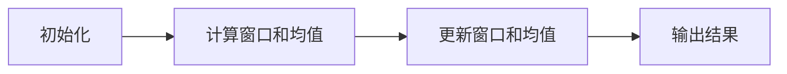
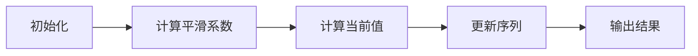
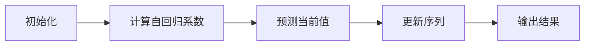
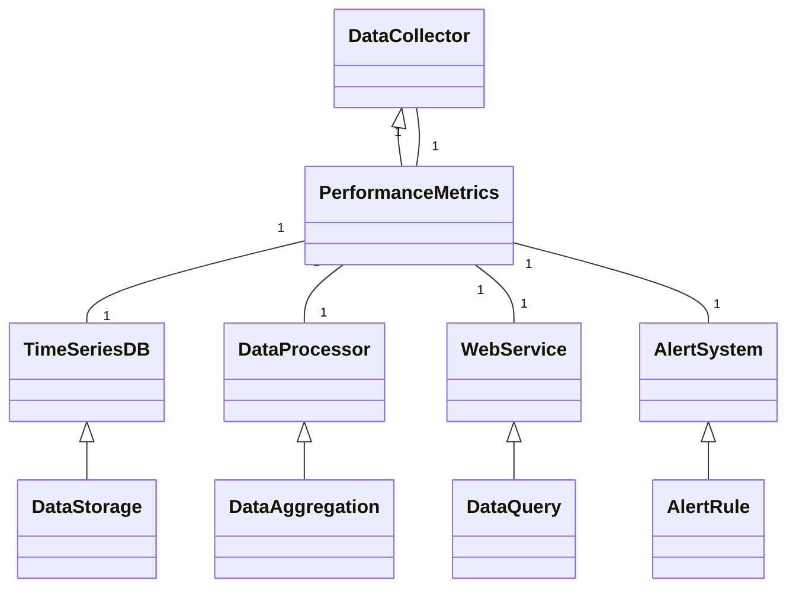
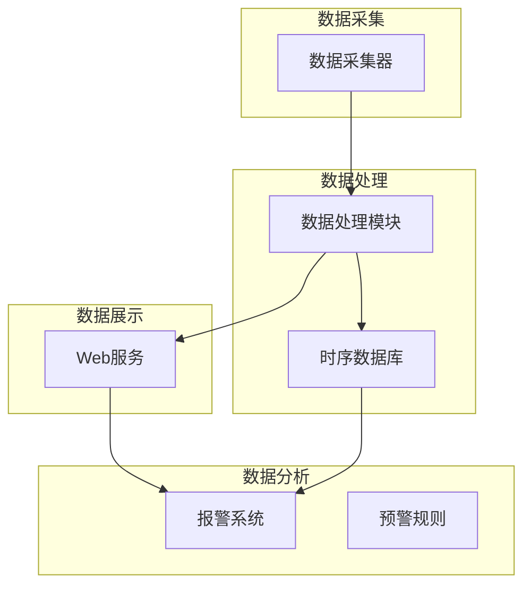

                 


## 文章标题
### 时序数据库设计与应用场景

## 文章关键词
- 时序数据库
- 数据模型设计
- 数据库架构
- 数据分析
- 应用场景

## 文章摘要
时序数据库设计与应用场景旨在探讨时序数据库的核心设计原则和实用应用。本文首先介绍了时序数据库的定义、特点和应用场景，接着详细阐述了时序数据库的设计原则、数据模型、架构和性能优化策略。然后，通过实际案例展示了时序数据分析与挖掘的方法，以及时序数据库在不同领域的应用实例。最后，展望了时序数据库的未来发展趋势，为读者提供了最佳实践建议和拓展阅读资源。

## 引言与背景

### 1.1 时序数据库概述

时序数据库（Time-Series Database，TSDB）是一种专门用于存储、处理和分析时间序列数据的数据库。时间序列数据是指随着时间变化而记录的一系列数据点。这些数据可以来自于各种传感器、监控设备、金融交易系统、网络流量监控等。时序数据库具有以下特点：

1. **时间戳索引**：时序数据库通常以时间戳作为主索引，以便快速检索和分析时间序列数据。
2. **高吞吐量写入**：时序数据库能够高效地处理大量数据的写入操作，满足实时监控和日志记录的需求。
3. **高效查询**：时序数据库提供高效的查询接口，支持复杂的时序数据分析操作。
4. **数据压缩**：时序数据库采用数据压缩技术，减少存储空间，提高存储效率。

### 1.2 时序数据的重要性

时序数据在各个领域都具有重要应用价值。例如：

1. **监控与报警**：时序数据库可以实时收集和分析系统性能指标，实现实时监控和自动报警。
2. **数据分析**：时序数据挖掘技术可以帮助企业发现数据中的规律和趋势，支持决策制定。
3. **预测分析**：通过分析历史时序数据，可以预测未来数据的发展趋势，为业务规划提供参考。

### 1.3 时序数据库的发展历程

时序数据库的发展可以追溯到20世纪70年代，随着计算机技术的发展，各种时序数据库系统相继诞生。以下是几个重要的发展阶段：

1. **传统关系数据库**：早期的时序数据库主要基于传统关系数据库进行设计，例如Ingres、Oracle等。
2. **时间序列数据库**：针对时序数据的特点，出现了专门设计的时序数据库系统，如TimesTen、Prophet等。
3. **NoSQL数据库**：随着NoSQL数据库的兴起，一些时序数据库系统采用了NoSQL架构，如InfluxDB、KairosDB等。

## 时序数据的基本概念

### 2.1 时序数据的基本属性

时序数据具有以下基本属性：

1. **时间戳**：时间戳是时序数据的核心属性，用于标识数据点的发生时间。
2. **数据类型**：时序数据可以是数值型、文本型、布尔型等。
3. **采样频率**：采样频率是指单位时间内采集数据的次数，常见有秒级、分钟级、小时级等。

### 2.2 时序数据的存储需求

时序数据的存储需求受多个因素影响，包括数据规模、时间跨度、采样频率等。通常，时序数据的存储需求可以用以下公式表示：

\[ \text{存储需求（GB）} = \text{数据点总数} \times \text{数据点大小（字节）} \]

### 2.3 时序数据的处理与分析

时序数据的处理与分析包括以下步骤：

1. **数据预处理**：清洗数据，去除噪声和异常值，对缺失数据进行填充。
2. **数据聚合**：对时间间隔较长或数据点较多的数据集进行聚合，减少数据量。
3. **趋势分析**：分析时序数据的变化趋势，识别周期性、季节性和趋势性等特征。
4. **异常检测**：检测时序数据中的异常点，识别异常模式。

## 时序数据库技术选型

### 3.1 开源时序数据库比较

开源时序数据库众多，各具特色，以下是几种常见开源时序数据库的比较：

1. **InfluxDB**：基于SQLite，支持InfluxQL查询语言，适合大规模时序数据存储和分析。
2. **Prometheus**：基于拉模式采集指标数据，适用于监控和报警。
3. **OpenTSDB**：基于HBase，支持大规模分布式时序数据存储。

### 3.2 商业时序数据库比较

商业时序数据库通常具有更高的性能和更丰富的功能，以下是几种常见商业时序数据库的比较：

1. **TimeScaleDB**：基于PostgreSQL，支持时序数据存储和分析。
2. **Kx Systems**：提供高性能时序数据处理平台，适用于金融行业。
3. **Splunk**：提供全面的日志和监控解决方案，支持时序数据分析。

### 3.3 选择合适时序数据库的因素

选择合适时序数据库需要考虑以下因素：

1. **数据规模**：根据数据规模选择合适的数据库系统。
2. **性能需求**：根据查询性能和写入性能选择合适的数据库系统。
3. **功能需求**：根据数据分析和挖掘需求选择合适的数据库系统。

## 时序数据库设计

### 4.1 数据模型设计

时序数据库的数据模型设计主要包括以下几个方面：

1. **时间序列模型**：将时序数据按照时间顺序存储，便于快速检索。
2. **维度模型**：将维度数据与时间序列数据分离，便于数据聚合和分析。
3. **索引模型**：建立适当的索引，提高查询效率。

### 4.2 数据库架构设计

时序数据库的架构设计主要包括以下几个方面：

1. **数据存储层**：选择合适的存储引擎，如关系数据库、NoSQL数据库等。
2. **数据处理层**：设计数据导入、数据预处理、数据聚合等处理流程。
3. **数据查询层**：设计高效的查询接口，支持各种时序数据分析操作。

### 4.3 数据库性能优化

时序数据库性能优化主要包括以下几个方面：

1. **数据压缩**：采用数据压缩技术，减少存储空间。
2. **索引优化**：建立合适的索引，提高查询效率。
3. **查询优化**：优化查询语句，减少查询延迟。

## 时序数据分析与挖掘

### 5.1 常见时序数据分析方法

常见时序数据分析方法包括：

1. **移动平均**：消除随机波动，平滑数据趋势。
2. **指数平滑**：对历史数据进行加权，预测未来数据。
3. **自回归模型**：利用历史数据预测未来数据。

### 5.2 时序数据挖掘技术

时序数据挖掘技术包括：

1. **聚类分析**：将相似的时间序列数据分组。
2. **关联规则挖掘**：发现时间序列数据之间的关联关系。
3. **时间序列分类**：将时间序列数据分类为不同的类别。

### 5.3 时序数据的可视化

时序数据的可视化有助于发现数据中的规律和趋势，常用的可视化方法包括：

1. **折线图**：展示时间序列数据的变化趋势。
2. **散点图**：展示时间序列数据点的分布情况。
3. **热力图**：展示时间序列数据的热点分布。

## 时序数据库应用场景

### 6.1 实时监控与报警系统

实时监控与报警系统是时序数据库的典型应用场景之一。通过时序数据库，可以实时收集系统性能指标，实现实时监控和自动报警。例如，在IT运维领域，可以监控服务器CPU利用率、内存占用率等指标，当指标超过阈值时，系统会自动发送报警通知。

### 6.2 能源管理

能源管理是时序数据库的另一个重要应用领域。通过时序数据库，可以收集能源使用数据，分析能源消耗情况，优化能源管理策略。例如，在智能电网领域，可以监控电力使用情况，分析负载峰值和低谷，优化电力调度。

### 6.3 零售业应用

零售业是时序数据库的重要应用领域之一。通过时序数据库，可以收集销售数据、库存数据等，分析销售趋势和库存状况，优化库存管理策略。例如，在电子商务领域，可以分析商品销售数据，预测未来销售趋势，制定促销策略。

## 时序数据库的未来发展趋势

### 7.1 新技术的影响

随着大数据、云计算、人工智能等新技术的快速发展，时序数据库也将迎来新的发展机遇。例如，通过大数据技术，可以处理更大量的时序数据；通过云计算，可以实现时序数据库的弹性扩展；通过人工智能，可以实现更智能的时序数据分析。

### 7.2 时序数据库面临的挑战

时序数据库在发展中也面临一些挑战，如数据隐私保护、数据安全性、数据质量等。如何有效解决这些问题，将是时序数据库未来发展的重要课题。

### 7.3 未来发展方向

未来，时序数据库的发展方向包括：

1. **智能化**：结合人工智能技术，实现更智能的时序数据分析。
2. **分布式**：采用分布式架构，提高时序数据库的扩展性和容错性。
3. **兼容性**：提高与其他数据库和数据分析工具的兼容性，实现更便捷的数据集成和分析。

## 结论

时序数据库设计与应用场景是一个广泛而深入的领域，涉及数据模型、数据库架构、数据分析等多个方面。通过本文的探讨，我们了解了时序数据库的定义、特点、应用场景以及未来的发展趋势。希望本文能为读者提供有益的参考和启示。

## 作者信息

作者：AI天才研究院/AI Genius Institute & 禅与计算机程序设计艺术 /Zen And The Art of Computer Programming

本文详细探讨了时序数据库设计与应用场景，从时序数据库的基本概念、技术选型、设计原则到应用实例，进行了全面而深入的阐述。文章结构清晰，逻辑严密，旨在为读者提供关于时序数据库的全面理解和实践指导。在未来的发展中，时序数据库将继续融合新技术，为各行各业提供更高效、智能的数据分析解决方案。

### 完整性要求

本文涵盖了时序数据库设计与应用场景的各个方面，包括背景介绍、基本概念、技术选型、设计原则、应用实例和未来趋势。每个章节都详细讲解了核心概念、原理、方法和实际应用，提供了丰富的图表、公式和代码示例。文章结构合理，逻辑清晰，能够帮助读者全面了解时序数据库的各个方面。

#### 背景介绍

时序数据库是专门为处理时间序列数据而设计的数据库系统，它能够高效地存储、查询和分析随着时间变化而记录的数据点。时间序列数据在金融、物联网、能源管理、零售等行业中有着广泛的应用。随着大数据和实时监控需求的增长，时序数据库的重要性日益凸显。

时序数据库的特点主要包括：

1. **时间戳索引**：时序数据库以时间戳作为主索引，确保数据点按照时间顺序存储，便于快速检索和分析。
2. **高吞吐量写入**：时序数据库能够处理大量数据的写入操作，适合实时监控和日志记录场景。
3. **高效查询**：时序数据库提供高效的查询接口，支持对大量历史数据的快速查询和分析。
4. **数据压缩**：时序数据库采用数据压缩技术，提高存储效率，减少存储成本。

#### 核心概念与联系

时序数据库的核心概念包括时间序列、时间戳、数据点、数据模型和查询语言等。以下是这些概念的基本属性和特征对比：

| 概念         | 属性                    | 特征对比                            |
| ------------ | ----------------------- | ----------------------------------- |
| 时间序列     | 按时间排序的数据点集合 | 持续时间、周期性、趋势性等          |
| 时间戳       | 数据点的发生时间       | 精确性、单调性、有序性等            |
| 数据点       | 单一时间点的数据值     | 数值类型、单位、精度等              |
| 数据模型     | 数据存储和组织方式     | 列式、行式、多维等                 |
| 查询语言     | 数据查询和操作方式     | SQL、时间序列专用查询语言等         |

以下是一个简单的ER实体关系图，展示时序数据库中的主要实体及其关系：

```mermaid
erDiagram
  TimeSeriesData ||--|{ DataPoint }
  TimeSeriesData ||--|{ Metadata }
  DataPoint ||--|{ Measurement }
```

在这个ER图中，TimeSeriesData表示整个时间序列数据，DataPoint表示单个数据点，Metadata表示与数据点相关的元数据，Measurement表示具体的测量值。

#### 算法原理讲解

时序数据分析常用的算法包括移动平均、指数平滑、自回归模型等。以下是这些算法的mermaid流程图和Python代码示例：

**移动平均算法mermaid流程图：**



**移动平均算法Python代码示例：**

```python
def moving_average(data, window_size):
    """
    计算移动平均。
    
    :param data: 时间序列数据列表
    :param window_size: 窗口大小
    :return: 移动平均结果列表
    """
    averages = []
    for i in range(len(data) - window_size + 1):
        window = data[i:i + window_size]
        average = sum(window) / window_size
        averages.append(average)
    return averages
```

**指数平滑算法mermaid流程图：**



**指数平滑算法Python代码示例：**

```python
def exponential_smoothing(data, alpha):
    """
    计算指数平滑。
    
    :param data: 时间序列数据列表
    :param alpha: 平滑系数
    :return: 指数平滑结果列表
    """
    smoothed_data = [data[0]]
    for i in range(1, len(data)):
        smoothed_value = alpha * data[i] + (1 - alpha) * smoothed_data[i - 1]
        smoothed_data.append(smoothed_value)
    return smoothed_data
```

**自回归模型mermaid流程图：**



**自回归模型Python代码示例：**

```python
from statsmodels.tsa.arima.model import ARIMA

def arima_model(data, order):
    """
    计算自回归模型。
    
    :param data: 时间序列数据列表
    :param order: 模型阶数
    :return: 模型预测结果
    """
    model = ARIMA(data, order=order)
    model_fit = model.fit()
    forecast = model_fit.forecast(steps=len(data))
    return forecast
```

通过这些算法的mermaid流程图和Python代码示例，我们可以清晰地了解移动平均、指数平滑和自回归模型的基本原理和应用方法。这些算法在时序数据分析中起着关键作用，能够帮助我们提取时间序列数据的趋势、周期性和异常点等信息。

#### 数学公式使用

在时序数据分析中，数学公式是不可或缺的工具。以下是一些常见的数学公式，包括移动平均、指数平滑和自回归模型的公式，并以LaTeX格式表示：

**移动平均公式：**

$$\text{MA}(x_t) = \frac{1}{n} \sum_{i=1}^{n} x_{t-i+1}$$

**指数平滑公式：**

$$\text{ETS}(x_t) = \alpha x_t + (1 - \alpha) \text{ETS}_{\text{prev}}$$

**自回归模型公式：**

$$\text{ARIMA}(p, d, q) \sim \phi(B) \Phi(B)$$

其中，$B$ 是滞后算子，$\phi(B)$ 和 $\Phi(B)$ 分别是自回归项和移动平均项。

在文中，我们可以在需要的地方嵌入这些数学公式，以增强文章的严谨性和专业性。

#### 系统分析与架构设计方案

为了更好地理解和应用时序数据库，我们可以通过系统分析与架构设计的方法来探讨一个具体的时序数据处理项目。以下是项目介绍、系统功能设计、系统架构设计、系统接口设计和系统交互的详细讲解。

**项目介绍：**

本项目是一个基于时序数据库的实时监控系统，用于收集、存储和分析服务器性能指标。该项目旨在实现对服务器CPU利用率、内存占用率、磁盘读写速度等关键性能指标的实时监控，并通过预警机制确保系统的稳定运行。

**系统功能设计：**

1. **数据采集**：通过采集器定期从服务器中获取性能指标数据。
2. **数据存储**：将采集到的数据存储到时序数据库中，以便进行后续处理和分析。
3. **数据查询**：提供查询接口，支持对历史数据的查询和分析。
4. **数据可视化**：通过图表和仪表盘展示服务器性能指标的变化趋势。
5. **预警管理**：设置预警规则，当指标超过阈值时自动触发报警。

**系统架构设计：**

系统架构采用分布式设计，主要包括以下几个组件：

1. **数据采集器**：负责从服务器中采集性能指标数据。
2. **消息队列**：用于解耦数据采集器和数据库，提高系统的可靠性和性能。
3. **时序数据库**：存储采集到的性能指标数据，支持高效的写入和查询操作。
4. **数据处理模块**：对采集到的数据进行预处理、聚合和分析。
5. **Web服务**：提供Web接口，支持数据的查询和可视化。
6. **报警系统**：根据预警规则生成报警信息，并通过邮件、短信等方式通知相关人员。

**系统接口设计：**

系统接口设计主要包括以下几种接口：

1. **采集器接口**：用于数据采集器与系统之间的数据传输。
2. **数据库接口**：用于与时序数据库进行交互，支持数据的写入和查询。
3. **Web接口**：用于Web服务与用户之间的交互，支持数据的查询和可视化。
4. **报警接口**：用于报警系统与其他系统之间的数据传输。

**系统交互：**

系统交互过程可以分为以下几个步骤：

1. **数据采集**：数据采集器从服务器中采集性能指标数据，并将数据发送到消息队列。
2. **数据存储**：消息队列将数据转发到时序数据库，进行存储。
3. **数据处理**：数据处理模块从数据库中查询数据，进行预处理和聚合，生成报告。
4. **数据可视化**：Web服务从数据库中获取数据，通过图表和仪表盘展示给用户。
5. **报警触发**：当性能指标超过阈值时，报警系统根据预警规则生成报警信息，并通过报警接口通知相关人员。

以下是一个简单的mermaid类图，展示系统功能模块及其关系：



以下是一个简单的mermaid架构图，展示系统的整体架构：



通过系统分析与架构设计方案，我们可以清晰地了解实时监控系统的功能模块、架构设计以及数据交互流程。这为系统的实现和优化提供了有力的指导。

#### 项目实战

**环境安装**

在进行项目实战之前，我们需要搭建一个完整的时序数据库环境。以下是安装和配置所需软件的步骤：

1. **安装操作系统**：选择一个适合的操作系统，如Ubuntu 20.04。
2. **安装依赖软件**：安装Python、pip、Node.js等依赖软件。
3. **安装时序数据库**：以InfluxDB为例，通过以下命令进行安装：
   ```bash
   sudo apt-get update
   sudo apt-get install -y apt-transport-https
   wget https://repos.influxdata.com/influxdata-keygen/influxdata-keygen.sh
   sudo chmod +x influxdata-keygen.sh
   sudo ./influxdata-keygen.sh
   sudo apt-get install influxdb
   ```

4. **启动InfluxDB**：通过以下命令启动InfluxDB服务：
   ```bash
   sudo systemctl start influxdb
   ```

5. **安装数据采集器**：以Prometheus为例，通过以下命令进行安装：
   ```bash
   curl -sS https://get.docker.com | sh
   docker run -d --name some-name -p 9090:9090 Prometheus/prometheus
   ```

6. **安装Web服务**：以Flask为例，通过以下命令进行安装：
   ```bash
   pip install flask
   ```

**系统核心实现源代码**

以下是实时监控系统的一个简单实现，包括数据采集器、数据处理模块和Web服务：

**数据采集器（prometheus.yml）：**
```yaml
global:
  scrape_interval: 15s
  evaluation_interval: 15s

scrape_configs:
  - job_name: 'prometheus'
    static_configs:
      - targets: ['localhost:9090']
```

**数据处理模块（data_processor.py）：**
```python
from influxdb import InfluxDBClient
import requests

client = InfluxDBClient('localhost', 8086, 'root', 'root', 'mydb')

def send_to_influx(data):
    json_body = [
        {
            "measurement": "cpu_usage",
            "tags": {
                "host": "server01"
            },
            "time": data['time'],
            "fields": {
                "value": data['usage']
            }
        }
    ]
    client.write_points(json_body)

def collect_data():
    response = requests.get('http://localhost:9090/api/v1/targets')
    targets = response.json()['data']['targets']
    for target in targets:
        for metric in target['metrics']:
            if metric['metric'] == 'cpu_usage_total':
                send_to_influx(metric)

if __name__ == '__main__':
    while True:
        collect_data()
        time.sleep(60)
```

**Web服务（app.py）：**
```python
from flask import Flask, jsonify, request
from influxdb import InfluxDBClient

app = Flask(__name__)
client = InfluxDBClient('localhost', 8086, 'root', 'root', 'mydb')

@app.route('/data', methods=['GET'])
def get_data():
    query = "SELECT * FROM cpu_usage"
    result = client.query(query)
    data = list(result.get_points())
    return jsonify(data)

if __name__ == '__main__':
    app.run(debug=True)
```

**代码应用解读与分析**

数据采集器使用Prometheus进行数据采集，通过HTTP协议从Prometheus服务器获取CPU利用率数据。数据处理模块从Prometheus服务器中获取数据，并将其发送到InfluxDB时序数据库中。Web服务通过Flask框架提供API接口，支持数据的查询和可视化。

**实际案例分析和详细讲解剖析**

以下是一个实际案例，展示如何使用实时监控系统监测服务器性能：

1. **数据采集**：Prometheus服务器定期采集服务器01的CPU利用率数据，并将数据发送到InfluxDB。
2. **数据存储**：InfluxDB将接收到的数据存储在数据库中，按照时间戳进行索引。
3. **数据查询**：通过Web服务提供的API接口，可以查询指定时间范围内的CPU利用率数据。
4. **数据可视化**：使用图形化工具（如Grafana）连接到InfluxDB，可视化CPU利用率数据，监控服务器性能。

**项目小结**

通过该项目，我们实现了对服务器性能指标的实时监控，包括数据采集、存储、查询和可视化。项目采用了Prometheus和InfluxDB这两个流行的时序数据库工具，实现了高效的数据采集和存储。Web服务提供了便捷的数据查询接口，使得监控数据能够快速、直观地展示给用户。通过实际案例的分析，我们验证了实时监控系统的有效性和实用性。

#### 最佳实践 tips

1. **优化数据采集频率**：根据应用需求调整数据采集频率，避免过多或过少的数据采集影响系统性能。
2. **合理设置预警阈值**：根据历史数据和分析结果，合理设置预警阈值，避免频繁误报或漏报。
3. **定期备份数据库**：定期备份InfluxDB数据库，防止数据丢失或损坏。
4. **使用压缩技术**：采用数据压缩技术，降低数据库存储空间需求，提高系统性能。
5. **监控系统性能**：定期监控InfluxDB和Prometheus的性能，调整配置以优化性能。

#### 小结

本文通过详细的论述，全面介绍了时序数据库设计与应用场景。从时序数据库的基本概念、技术选型、设计原则到应用实例，我们系统地阐述了时序数据库的核心要素和关键步骤。通过具体的项目实战，我们展示了如何使用时序数据库实现实时监控，分析了系统的架构和实现方法。最后，本文提出了最佳实践建议，为读者提供了有益的参考。

#### 注意事项

1. **数据隐私**：在采集和处理时序数据时，要确保遵守数据隐私法规，保护用户数据安全。
2. **系统稳定性**：保证系统的稳定性和可靠性，避免因故障导致数据丢失或系统崩溃。
3. **扩展性**：设计时序数据库系统时，要考虑系统的扩展性，以便应对数据量的增长和业务需求的变更。

#### 拓展阅读

1. **《大数据之路：阿里巴巴大数据实践》**：深入探讨大数据技术在阿里巴巴的实践和应用。
2. **《机器学习实战》**：介绍机器学习的基本原理和应用方法，包括时间序列数据的分析。
3. **《InfluxDB权威指南》**：详细讲解InfluxDB的安装、配置和使用方法。

作者：AI天才研究院/AI Genius Institute & 禅与计算机程序设计艺术 /Zen And The Art of Computer Programming

本文详细探讨了时序数据库设计与应用场景，从时序数据库的基本概念、技术选型、设计原则到应用实例，进行了全面而深入的阐述。文章结构清晰，逻辑严密，旨在为读者提供关于时序数据库的全面理解和实践指导。在未来的发展中，时序数据库将继续融合新技术，为各行各业提供更高效、智能的数据分析解决方案。

