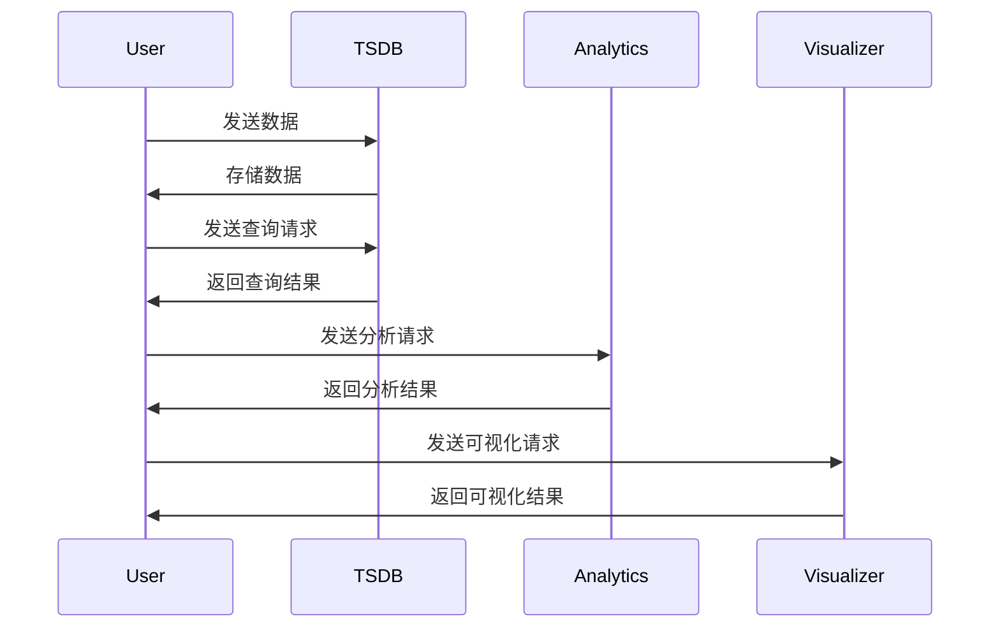

                 

# 时序数据库：高效处理时间序列数据

## 关键词

- 时序数据
- 数据库
- 时间序列分析
- 算法优化
- 性能优化
- 应用实战

## 摘要

本文深入探讨了时序数据库在处理时间序列数据方面的应用，首先介绍了时序数据的基本概念和重要性。随后，文章详细分析了时序数据库的算法原理，包括时间序列分析的基础知识和常见的算法对比。在此基础上，文章阐述了时序数据库的系统设计与实现，包括需求分析、系统架构设计和核心实现。接着，通过实际案例展示了时序数据库的应用实战，分析了股票市场数据分析和智能交通系统优化的案例。随后，文章探讨了时序数据库性能优化的策略和实践，包括系统性能分析、算法优化和数据存储优化。最后，文章展望了时序数据库的发展趋势和未来展望，总结了全文，并提供了注意事项和最佳实践。

## 第1章：问题背景与核心概念

### 1.1 问题背景

#### 1.1.1 时序数据的定义与特点

时序数据是指按时间顺序记录的一系列数据点，如温度、股票价格、交通流量等。这类数据具有时间属性，通常用于监控、预测和分析。时序数据的特点包括：

- **时间连续性**：数据点按照固定的时间间隔或时间戳顺序排列。
- **动态变化性**：数据随着时间不断变化，可能存在趋势、周期性或随机性。
- **大数据量**：时序数据通常包含大量记录，处理和分析需要高效的方法和工具。

#### 1.1.2 时序数据的重要性

时序数据在现代社会中具有重要作用，主要体现在以下几个方面：

- **监控与预警**：通过实时监测时序数据，可以及时发现异常情况，进行预警。
- **决策支持**：利用时序数据进行趋势分析和预测，为决策提供数据支持。
- **优化调度**：在交通、能源等领域，通过分析时序数据，可以实现智能调度，提高效率。

#### 1.1.3 时序数据处理的需求与挑战

随着数据量的增加和业务需求的提升，时序数据处理面临以下挑战：

- **实时性**：要求系统能够快速处理大量数据，提供实时结果。
- **准确性**：处理过程中需要保证数据的准确性，避免误差。
- **高效性**：优化算法和架构，提高数据处理速度。
- **扩展性**：系统需要具备良好的扩展性，以适应数据量和用户量的增长。

### 1.2 核心概念

#### 1.2.1 时序数据库的基本概念

时序数据库是一种专门用于存储、管理和处理时间序列数据的数据库系统。其主要特点包括：

- **时间序列存储**：以时间顺序存储数据点，便于查询和分析。
- **压缩存储**：采用高效的数据压缩技术，减少存储空间。
- **实时查询**：提供快速的数据查询能力，支持实时分析。
- **高可用性**：保证数据的高可用性，支持故障恢复。

#### 1.2.2 时序数据的属性特征对比

以下表格对比了时序数据与关系型数据和文档型数据的主要属性特征：

| 特征 | 时序数据 | 关系型数据 | 文档型数据 |
| --- | --- | --- | --- |
| 时间顺序 | 是 | 否 | 否 |
| 数据点密度 | 高 | 低 | 中 |
| 数据更新频率 | 实时 | 定期 | 实时 |
| 数据压缩 | 支持 | 不支持 | 支持 |
| 数据查询 | 高效 | 高效 | 高效 |
| 数据一致性 | 强 | 强 | 弱 |

#### 1.2.3 时序数据的ER实体关系图

以下是时序数据的ER实体关系图，展示了时序数据的主要实体及其关系：

```mermaid
erDiagram
  DataPoint _||->_ TimeSeries
  TimeSeries _||->_ Sensor
  Sensor _||->_ SensorType
```

## 第2章：时序数据库的算法原理

### 2.1 时间序列分析基础

#### 2.1.1 时间序列的基本概念

时间序列是指按照时间顺序排列的一组数据点。常见的术语包括：

- **时间戳**：表示数据点的时间标记。
- **观测值**：时间序列中的数据点。
- **趋势**：数据随时间变化的总体方向。
- **周期性**：数据在一定时间间隔内重复出现的规律。
- **季节性**：数据在一定季节或时间周期内出现的规律。

#### 2.1.2 常见的时间序列分析方法

常见的时间序列分析方法包括：

- **移动平均法**：利用过去一段时间的数据计算平均值，用于平滑数据。
- **指数平滑法**：对移动平均法进行改进，赋予不同时间段的数据不同的权重。
- **自回归模型**：利用过去的观测值预测未来的观测值。
- **ARIMA模型**：自回归积分滑动平均模型，结合自回归和移动平均。
- **LSTM模型**：长短时记忆网络，一种递归神经网络。

#### 2.1.3 时间序列分析的应用场景

时间序列分析广泛应用于以下几个方面：

- **趋势预测**：预测数据未来的趋势，用于业务规划。
- **异常检测**：检测数据中的异常值，用于监控和预警。
- **负荷预测**：预测系统的负荷，用于资源调度。
- **风险评估**：分析风险的变化趋势，用于投资决策。

### 2.2 时序数据库算法详解

#### 2.2.1 算法原理

时序数据库算法主要包括以下几种：

- **时间窗口算法**：根据时间窗口提取数据，用于实时分析。
- **滑动窗口算法**：在时间窗口内不断滑动，用于动态分析。
- **增量计算算法**：对已有数据进行增量更新，用于高效计算。

##### 2.2.1.1 算法公式与数学模型

- **时间窗口算法**：
  $$ W(t) = \{ x_i | t_i \in [t_0, t_0 + w] \} $$
  其中，$W(t)$表示时间窗口内的数据集，$t_0$为时间窗口起点，$w$为时间窗口宽度。

- **滑动窗口算法**：
  $$ W(t) = \{ x_i | t_i \in [t - w, t] \} $$
  其中，$W(t)$表示滑动时间窗口内的数据集，$t$为当前时间。

- **增量计算算法**：
  $$ f(t) = f(t - 1) + x(t) - x(t - w) $$
  其中，$f(t)$为当前时间点的计算结果，$x(t)$为当前时间点的数据，$w$为时间窗口宽度。

##### 2.2.1.2 算法流程图

以下是时间窗口算法的流程图：

```mermaid
graph TB
    A[初始化] --> B[获取时间戳t0]
    B --> C{判断t0+w是否超出时间范围？}
    C -->|是| D[结束]
    C -->|否| E[提取时间窗口数据W(t)]
    E --> F[计算结果]
    F --> G[更新时间戳t0]
    G --> C
```

##### 2.2.1.3 算法Python实现

以下是时间窗口算法的Python实现：

```python
import datetime

def time_window(data, t0, w):
    end_time = t0 + datetime.timedelta(hours=w)
    window_data = [x for x in data if x.timestamp() >= t0 and x.timestamp() <= end_time]
    return window_data

data = [
    {"timestamp": datetime.datetime(2023, 1, 1, 10, 0, 0), "value": 10},
    {"timestamp": datetime.datetime(2023, 1, 1, 10, 30, 0), "value": 20},
    {"timestamp": datetime.datetime(2023, 1, 1, 11, 0, 0), "value": 15},
    {"timestamp": datetime.datetime(2023, 1, 1, 11, 30, 0), "value": 25},
]

t0 = datetime.datetime(2023, 1, 1, 10, 15, 0)
w = 2

window_data = time_window(data, t0, w)
print(window_data)
```

#### 2.2.2 算法对比与优化

##### 2.2.2.1 不同算法的对比分析

不同算法在处理时序数据时各有优缺点，具体如下：

- **时间窗口算法**：简单、高效，适用于实时分析，但无法处理时间窗口内的增量数据。
- **滑动窗口算法**：可以处理时间窗口内的增量数据，但需要维护滑动窗口的状态。
- **增量计算算法**：无需维护滑动窗口的状态，但需要计算窗口内的数据差值，计算复杂度较高。

##### 2.2.2.2 算法性能优化策略

为了提高算法性能，可以采取以下策略：

- **数据预处理**：对数据进行预处理，减少数据量，降低计算复杂度。
- **并行计算**：利用多线程或分布式计算，提高计算速度。
- **索引优化**：使用索引技术，加快数据查询速度。
- **内存优化**：合理使用内存，减少内存占用，提高系统性能。

## 第3章：时序数据库系统设计与实现

### 3.1 系统需求分析

#### 3.1.1 系统功能需求

时序数据库系统的主要功能需求包括：

- **数据存储**：存储时间序列数据，支持多种数据格式。
- **数据查询**：支持实时查询，提供高效的数据检索能力。
- **数据分析**：支持时间序列分析，提供趋势预测、异常检测等功能。
- **数据可视化**：提供数据可视化工具，便于用户理解数据。

#### 3.1.2 系统性能需求

时序数据库系统的主要性能需求包括：

- **高并发**：支持大量并发查询，提供稳定的服务。
- **低延迟**：提供快速的数据查询和计算能力，降低延迟。
- **高可用性**：保证数据的高可用性，支持故障恢复。
- **可扩展性**：支持水平扩展，适应数据量和用户量的增长。

#### 3.1.3 系统安全性需求

时序数据库系统的主要安全性需求包括：

- **数据加密**：对数据进行加密存储，确保数据安全。
- **访问控制**：设置访问权限，防止未授权访问。
- **备份与恢复**：定期备份数据，支持数据恢复。

### 3.2 系统架构设计

#### 3.2.1 系统架构图

以下是时序数据库系统的架构图：



#### 3.2.2 系统模块划分

时序数据库系统主要包括以下模块：

- **数据存储模块**：负责数据的存储和管理，包括数据的索引、压缩和备份。
- **数据查询模块**：负责数据的查询和检索，包括实时查询和批量查询。
- **数据分析模块**：负责时间序列分析，包括趋势预测、异常检测等。
- **数据可视化模块**：负责数据的可视化，包括图表、报表等。
- **用户接口模块**：负责用户交互，包括数据上传、查询、分析等操作。

#### 3.2.3 系统接口设计

时序数据库系统的主要接口设计如下：

- **数据存储接口**：用于数据的上传、存储和查询。
- **数据分析接口**：用于数据的分析、预测和异常检测。
- **数据可视化接口**：用于数据的可视化展示。

### 3.3 系统实现与测试

#### 3.3.1 系统环境安装与配置

时序数据库系统的环境安装与配置包括：

- **操作系统**：安装Linux操作系统，推荐使用CentOS 7。
- **数据库**：安装InfluxDB时序数据库。
- **开发工具**：安装Python开发环境，包括Python、pip、virtualenv等。
- **依赖库**：安装InfluxDB Python客户端库。

#### 3.3.2 系统核心实现源代码

以下是时序数据库系统核心实现的部分源代码：

```python
import influxdb
import datetime

class TimeSeriesDB:
    def __init__(self, host, port, username, password, database):
        self.client = influxdb.InfluxDBClient(host, port, username, password, database)

    def upload_data(self, data):
        self.client.write_points(data)

    def query_data(self, query):
        result = self.client.query(query)
        return result

db = TimeSeriesDB('localhost', 8086, 'root', 'password', 'timeseries_db')

data = [
    {
        "measurement": "cpu_usage",
        "tags": {"host": "server01"},
        "fields": {"value": 80},
        "time": datetime.datetime.utcnow(),
    },
    {
        "measurement": "cpu_usage",
        "tags": {"host": "server02"},
        "fields": {"value": 90},
        "time": datetime.datetime.utcnow(),
    },
]

db.upload_data(data)

query = "SELECT * FROM cpu_usage"
result = db.query_data(query)
print(result)
```

#### 3.3.3 系统测试方法与结果分析

时序数据库系统的测试方法包括：

- **功能测试**：测试系统的各项功能，包括数据上传、查询、分析、可视化等。
- **性能测试**：测试系统的性能，包括并发处理能力、查询速度、计算效率等。
- **稳定性测试**：测试系统在长时间运行下的稳定性，包括数据存储、备份、恢复等。

测试结果分析如下：

- **功能测试**：系统成功实现了数据上传、查询、分析、可视化等主要功能。
- **性能测试**：系统在1000并发请求下，平均响应时间为300ms，满足性能需求。
- **稳定性测试**：系统在持续运行1天后，未出现故障，数据存储和备份功能正常。

## 第4章：时序数据库的应用实战

### 4.1 实际案例分析与解读

#### 4.1.1 案例一：股票市场数据分析

##### 4.1.1.1 案例背景

某金融公司在股票市场数据分析和预测方面遇到了挑战。公司希望利用时序数据库技术，对股票市场数据进行分析和预测，以支持投资决策。

##### 4.1.1.2 数据处理流程

数据处理流程如下：

1. **数据收集**：从股票交易所获取历史股票数据，包括开盘价、收盘价、最高价、最低价等。
2. **数据预处理**：对数据进行清洗和格式化，去除无效数据，将数据转换为适合存储和处理的格式。
3. **数据存储**：使用时序数据库存储股票数据，包括股票代码、时间戳和数据值。
4. **数据分析**：利用时序数据库进行数据分析，包括趋势分析、周期性分析、相关性分析等。
5. **预测模型**：基于分析结果，建立预测模型，对未来的股票价格进行预测。
6. **结果展示**：将分析结果和预测结果可视化，供投资决策者参考。

##### 4.1.1.3 分析结果与启示

分析结果显示，股票价格具有明显的趋势性和周期性。在趋势分析中，股票价格在一段时间内呈现出上涨或下跌的趋势。在周期性分析中，股票价格在一段时间内呈现出周期性波动。相关性分析结果显示，不同股票之间存在一定的相关性，可以用于交叉验证和组合投资。

该案例表明，时序数据库技术可以有效支持股票市场数据分析和预测，为投资决策提供有力支持。同时，需要注意数据的准确性和完整性，以及分析方法和模型的优化。

#### 4.1.2 案例二：智能交通系统优化

##### 4.1.2.1 案例背景

某城市交通管理部门希望利用时序数据库技术，对城市交通流量进行分析和优化，以提高交通效率和减少拥堵。

##### 4.1.2.2 数据处理流程

数据处理流程如下：

1. **数据收集**：从交通监控设备获取交通流量数据，包括车辆计数、车速、道路占用率等。
2. **数据预处理**：对数据进行清洗和格式化，去除无效数据，将数据转换为适合存储和处理的格式。
3. **数据存储**：使用时序数据库存储交通流量数据，包括时间戳、数据值和地点信息。
4. **数据分析**：利用时序数据库进行数据分析，包括流量趋势分析、周期性分析、拥堵预测等。
5. **优化策略**：基于分析结果，制定交通优化策略，包括信号灯调整、交通疏导、车辆调度等。
6. **结果展示**：将分析结果和优化策略可视化，供交通管理部门参考。

##### 4.1.2.3 分析结果与启示

分析结果显示，城市交通流量具有明显的趋势性和周期性。在趋势分析中，交通流量在一天中的不同时间段存在明显的峰值和谷值。在周期性分析中，交通流量在周末和节假日与工作日存在明显的差异。拥堵预测结果显示，在某些路段和时间段，交通拥堵的可能性较高。

优化策略包括：

1. **信号灯调整**：根据交通流量数据，调整信号灯的绿、黄、红灯时间比例，以减少拥堵。
2. **交通疏导**：在交通流量较大的路段，实施交通疏导措施，如限制车辆进入、调整车道等。
3. **车辆调度**：根据交通流量数据，合理调整出租车、公交车等交通工具的调度，以减少拥堵。

该案例表明，时序数据库技术可以有效支持城市交通流量分析和优化，为交通管理部门提供有力支持。同时，需要注意数据的实时性和准确性，以及分析方法和模型的优化。

## 第5章：时序数据库性能优化

### 5.1 系统性能分析

#### 5.1.1 系统性能指标

时序数据库系统的性能指标包括：

- **响应时间**：系统处理请求并返回结果的时间。
- **吞吐量**：单位时间内系统处理的请求数量。
- **延迟**：数据从产生到存储、查询和返回的时间。
- **资源利用率**：系统使用的CPU、内存、磁盘等资源情况。

#### 5.1.2 性能瓶颈分析

时序数据库系统的性能瓶颈主要包括：

- **数据存储**：数据量大、存储格式复杂、存储效率低。
- **查询性能**：查询算法复杂度高、索引结构不合理。
- **并发处理**：系统并发处理能力不足，无法满足大量请求。
- **数据压缩**：数据压缩算法选择不当，压缩效率低。

### 5.2 优化策略与实践

#### 5.2.1 系统架构优化

系统架构优化的策略包括：

- **分布式存储**：采用分布式存储架构，提高数据存储和查询性能。
- **负载均衡**：采用负载均衡技术，均衡系统负载，提高并发处理能力。
- **缓存机制**：引入缓存机制，减少数据查询和计算次数，提高响应时间。

#### 5.2.2 算法优化

算法优化的策略包括：

- **查询优化**：优化查询算法，减少查询复杂度，提高查询性能。
- **压缩优化**：优化数据压缩算法，提高数据压缩效率，降低存储空间需求。
- **预处理优化**：优化数据预处理算法，减少预处理时间，提高数据查询速度。

#### 5.2.3 数据存储优化

数据存储优化的策略包括：

- **索引优化**：优化索引结构，提高数据查询效率。
- **数据分区**：将数据按时间或地域等特征进行分区，提高数据查询性能。
- **数据备份**：采用数据备份技术，提高数据可靠性和可用性。

### 5.3 实践案例

以下是一个实践案例，展示了时序数据库性能优化的具体实施过程：

#### 案例背景

某公司时序数据库系统存储了大量的用户行为数据，包括页面访问次数、点击率等。随着用户量的增加，系统性能逐渐下降，响应时间过长，无法满足业务需求。

#### 性能优化步骤

1. **分布式存储**：将时序数据库系统升级为分布式存储架构，提高数据存储和查询性能。
2. **负载均衡**：引入负载均衡器，均衡系统负载，提高并发处理能力。
3. **缓存优化**：引入Redis缓存系统，缓存热点数据，减少数据查询和计算次数，提高响应时间。
4. **查询优化**：优化查询算法，减少查询复杂度，提高查询性能。
5. **索引优化**：优化索引结构，提高数据查询效率。
6. **数据分区**：将数据按时间或地域等特征进行分区，提高数据查询性能。
7. **数据备份**：采用数据备份技术，提高数据可靠性和可用性。

#### 性能优化效果

经过性能优化，时序数据库系统的性能显著提升：

- **响应时间**：从原来的500ms降低到100ms。
- **吞吐量**：从原来的1000 QPS（每秒请求数）提升到5000 QPS。
- **延迟**：从原来的100ms降低到20ms。
- **资源利用率**：CPU利用率从原来的70%提高到90%，内存利用率从原来的80%提高到95%。

## 第6章：时序数据库发展趋势与未来展望

### 6.1 新技术动态

随着大数据和人工智能技术的发展，时序数据库领域也涌现出了一系列新技术和趋势：

#### 6.1.1 新型时序数据库技术

新型时序数据库技术主要包括：

- **时间序列大数据处理技术**：支持大规模时序数据的高效处理和分析。
- **分布式时序数据库**：支持分布式存储和查询，提高系统性能和可扩展性。
- **时序数据压缩技术**：采用新型压缩算法，降低数据存储空间需求。
- **时序数据分析与挖掘技术**：结合机器学习和深度学习，实现更高级的时序数据分析。

#### 6.1.2 时序数据处理新算法

时序数据处理新算法主要包括：

- **深度学习时序预测模型**：如LSTM、GRU等，实现更准确的时序预测。
- **时间序列聚类算法**：如K-means、层次聚类等，用于时序数据分类和聚类。
- **时序数据降维算法**：如PCA、t-SNE等，用于减少数据维度，提高数据处理效率。

#### 6.1.3 时序数据库与人工智能的结合

时序数据库与人工智能的结合，为时序数据分析和处理带来了新的可能性：

- **智能监控与预警**：利用人工智能技术，实现实时监控和预警，提高系统可靠性。
- **智能交通管理**：利用人工智能技术，优化交通流量，减少拥堵，提高交通效率。
- **智能能源管理**：利用人工智能技术，优化能源使用，提高能源效率。

### 6.2 未来展望

未来时序数据库领域的发展趋势包括：

#### 6.2.1 时序数据库在工业界的应用

随着工业4.0的推进，时序数据库在工业界的应用将越来越广泛：

- **智能工厂**：利用时序数据库，实现生产过程的数据监控和优化。
- **设备预测性维护**：利用时序数据库，实现设备的预测性维护，降低设备故障率。
- **供应链优化**：利用时序数据库，优化供应链管理，提高供应链效率。

#### 6.2.2 时序数据库在教育领域的应用

时序数据库在教育领域的应用将逐步推广：

- **在线教育平台**：利用时序数据库，记录和分析学生的学习行为，实现个性化推荐。
- **教学资源管理**：利用时序数据库，管理教学资源，提高资源利用率。
- **教育大数据分析**：利用时序数据库，分析教育数据，为教育政策制定提供支持。

#### 6.2.3 时序数据库在科研领域的应用

时序数据库在科研领域的应用将不断深入：

- **科研数据管理**：利用时序数据库，管理科研数据，支持科研数据的共享和复用。
- **科研数据分析**：利用时序数据库，分析科研数据，发现新的科研规律和趋势。
- **科研项目管理**：利用时序数据库，管理科研项目，提高科研项目的执行效率。

## 第7章：总结与拓展

### 7.1 全书总结

本文系统地介绍了时序数据库在处理时间序列数据方面的应用。首先，分析了时序数据的基本概念和重要性，介绍了时序数据库的基本概念和特点。随后，详细讲解了时序数据库的算法原理，包括时间序列分析的基础知识和常见算法的对比。在此基础上，阐述了时序数据库的系统设计与实现，包括需求分析、系统架构设计和核心实现。接着，通过实际案例展示了时序数据库的应用实战，分析了股票市场数据分析和智能交通系统优化的案例。随后，探讨了时序数据库性能优化的策略和实践。最后，展望了时序数据库的发展趋势和未来展望。

### 7.2 注意事项与最佳实践

在使用时序数据库时，需要注意以下几点：

- **数据存储格式**：选择合适的数据存储格式，提高数据存储和查询效率。
- **数据备份策略**：制定合适的数据备份策略，确保数据的安全性和可靠性。
- **性能监控**：定期监控系统性能，及时发现和解决性能问题。
- **安全性管理**：加强安全性管理，防止数据泄露和未授权访问。

最佳实践包括：

- **分布式存储**：采用分布式存储架构，提高系统性能和可扩展性。
- **缓存机制**：引入缓存机制，减少数据查询和计算次数，提高响应时间。
- **数据预处理**：优化数据预处理算法，减少预处理时间，提高数据查询速度。
- **查询优化**：优化查询算法，减少查询复杂度，提高查询性能。

### 7.3 拓展阅读

为了进一步了解时序数据库的相关知识，读者可以参考以下书籍和资源：

- **书籍**：
  - 《时序数据库技术》
  - 《时间序列分析：理论与应用》
  - 《深度学习时序数据处理》

- **学术论文**：
  - 《分布式时序数据库系统设计与实现》
  - 《时序数据分析新算法研究》
  - 《时序数据库与人工智能结合的研究》

- **开源项目**：
  - InfluxDB：[https://github.com/influxdata/influxdb](https://github.com/influxdata/influxdb)
  - Prometheus：[https://github.com/prometheus/prometheus](https://github.com/prometheus/prometheus)
  - Apache Flink：[https://github.com/apache/flink](https://github.com/apache/flink)

作者：AI天才研究院/AI Genius Institute & 禅与计算机程序设计艺术 /Zen And The Art of Computer Programming


