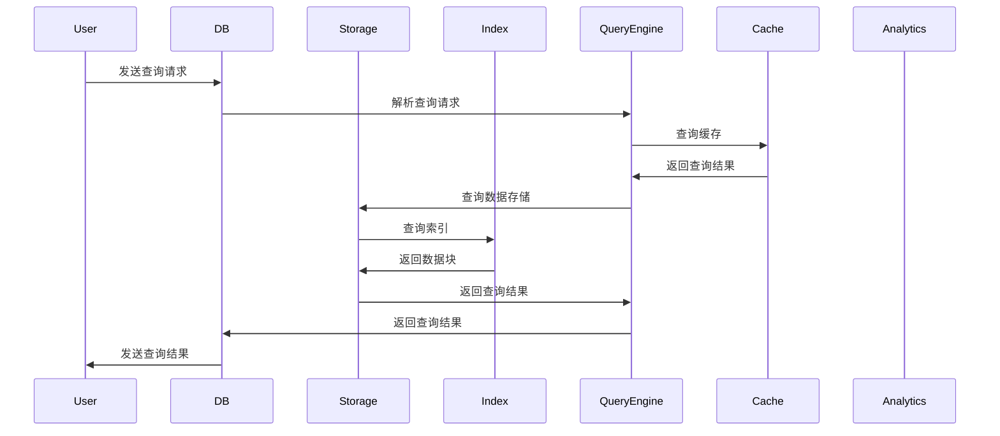
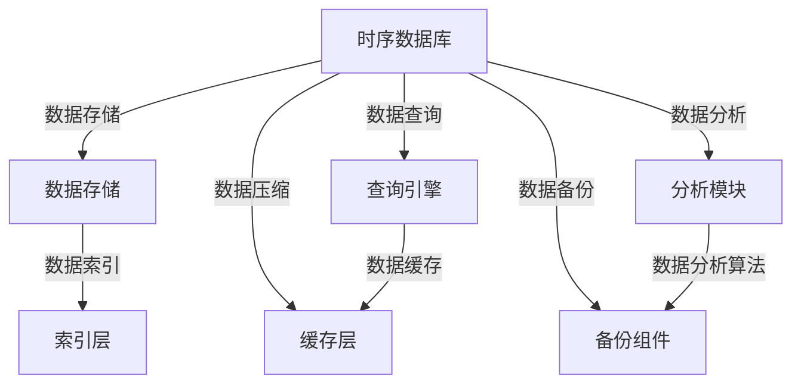
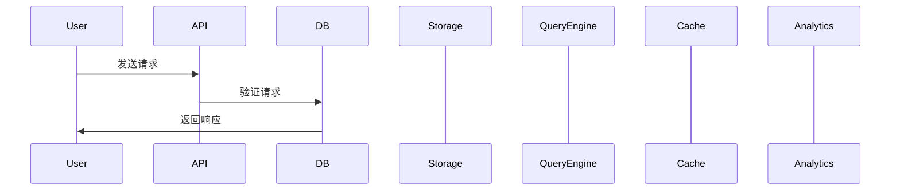
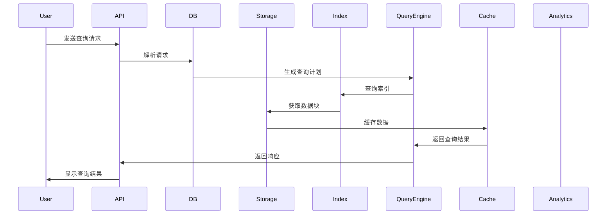

                 

### 引言

#### 关键词：时序数据库、时间序列数据、高效存储、查询优化

随着大数据时代的到来，数据量以惊人的速度增长，尤其是时间序列数据。从金融市场数据到物联网传感器数据，再到互联网用户行为数据，时序数据无处不在。它们以其独特的结构——连续、时间导向和频率性——对数据的存储和查询提出了特殊的需求。时序数据库作为一种专门为处理时间序列数据而设计的数据库系统，应运而生。

本文旨在深入探讨时序数据库的工作原理、架构设计、算法优化以及其在实际项目中的应用。通过逐步分析时序数据的特性、存储挑战和查询需求，我们将揭示时序数据库如何高效地管理时间序列数据，并提供快速、准确的查询性能。

**摘要**：本文首先介绍时序数据库的定义、背景和应用场景。接着，我们详细讨论时序数据库的核心概念、特性以及与其他数据库类型的区别。随后，我们将探讨常用的时序数据处理算法，并使用Mermaid图和Python代码来阐述其原理和实现。进一步地，我们将介绍时序数据库的系统架构设计和接口设计，并通过项目实战展示其实际应用。最后，我们将提供最佳实践和注意事项，总结文章的主要观点，并推荐拓展阅读。

**目录**：

1. **引言**  
   - 关键词：时序数据库、时间序列数据、高效存储、查询优化
   - 摘要

2. **时序数据库概述**  
   - 2.1 问题背景  
   - 2.2 问题描述  
   - 2.3 问题解决  
   - 2.4 边界与外延  
   - 2.5 概念结构与核心要素组成

3. **核心概念与联系**  
   - 3.1 时序数据库的定义与特性  
   - 3.2 时序数据库的分类  
   - 3.3 时序数据与其他数据类型的对比  
   - 3.4 时序数据的 ER 实体关系图

4. **算法原理讲解**  
   - 4.1 滑动窗口算法  
   - 4.2 时序分解算法

5. **系统分析与架构设计**  
   - 5.1 时序数据库的架构设计  
   - 5.2 系统功能设计  
   - 5.3 系统架构设计  
   - 5.4 系统接口设计  
   - 5.5 系统交互序列图

6. **项目实战**  
   - 6.1 环境安装  
   - 6.2 系统核心实现  
   - 6.3 代码应用解读  
   - 6.4 实际案例分析与讲解  
   - 6.5 项目小结

7. **最佳实践与总结**  
   - 7.1 最佳实践 tips  
   - 7.2 小结  
   - 7.3 注意事项  
   - 7.4 拓展阅读

### 1. 时序数据库概述

#### 1.1 问题背景

时序数据库的概念源于对时间序列数据的需求。时间序列数据是一种按时间顺序排列的数据点序列，这些数据点可以是金融市场的股价、物联网设备的传感器读数、网站用户的行为轨迹等。与传统的结构化数据（如关系数据库处理的数据）不同，时间序列数据具有以下特性：

- **时间连续性**：数据点按照时间顺序排列，每个数据点都与特定的时间戳相关联。
- **频率性**：数据点的采集频率可以是固定的（如每小时一次）或变动的（如实时数据流）。
- **趋势性**：时间序列数据往往表现出一定的趋势性，如增长、稳定或下降。

这些特性使得时间序列数据的处理和分析具有独特的挑战。传统的数据库系统在处理时间序列数据时，常常面临以下问题：

- **存储挑战**：时间序列数据通常具有高维度、高密度和高增长速度，传统的存储结构难以高效地存储和管理这些数据。
- **查询性能**：时间序列数据的查询通常需要快速的随机访问和范围查询能力，传统数据库系统在处理这类查询时效率低下。

为了解决这些问题，时序数据库应运而生。时序数据库是一种专门为处理时间序列数据而设计的数据库系统，它提供高效的存储、压缩和查询能力，以满足时间序列数据处理的特殊需求。

#### 1.2 问题描述

时间序列数据的处理需求可以分为两个方面：数据存储和数据查询。

- **数据存储**：时序数据库需要能够高效地存储大量的时间序列数据，同时支持数据的压缩和去重，以减少存储空间的需求。
- **数据查询**：时序数据库需要提供快速的查询能力，包括随机访问、范围查询和聚合查询。此外，时序数据库还需要支持复杂的分析操作，如趋势分析、季节性分析和异常检测。

这些问题在传统数据库系统中难以得到有效解决。例如，关系数据库虽然能够处理结构化数据，但在处理高维度、高密度和时间连续性的数据时，性能下降明显。而NoSQL数据库虽然提供了灵活的存储结构，但在处理时间序列数据的查询和复杂分析时也面临挑战。

#### 1.3 问题解决

时序数据库通过以下方法解决了时间序列数据处理的挑战：

1. **索引结构**：时序数据库使用特殊的索引结构，如时间索引、稀疏索引和有序数组，来优化数据的存储和查询。
2. **压缩技术**：时序数据库采用数据压缩技术，如差分编码、位压缩和字典压缩，来减少存储空间的需求。
3. **查询优化**：时序数据库通过查询优化技术，如预取、缓存和并行查询，来提高查询性能。
4. **数据模型**：时序数据库采用特定于时间序列数据的数据模型，如时间序列模型、事件模型和图模型，来简化数据的存储和查询。

通过这些方法，时序数据库能够高效地存储、管理和查询时间序列数据，从而满足现代应用对高效数据处理的需求。

#### 1.4 边界与外延

时序数据库的应用范围广泛，涵盖了金融、物联网、电子商务、科学研究和许多其他领域。然而，时序数据库也有其局限性。以下是其边界与外延：

- **边界**：时序数据库主要针对时间序列数据进行优化，对于非时间序列数据，其性能可能不如传统数据库。此外，时序数据库在处理复杂的关联查询和事务处理时，可能存在性能瓶颈。
- **外延**：时序数据库可以在分布式环境中扩展，以处理海量数据。同时，时序数据库也可以与其他类型的数据库（如关系数据库、文档数据库和图数据库）集成，以提供更全面的数据处理能力。

#### 1.5 概念结构与核心要素组成

时序数据库由以下核心要素组成：

- **数据模型**：数据模型定义了数据在时序数据库中的组织方式，如时间序列模型、事件模型和图模型。
- **索引结构**：索引结构用于优化数据的存储和查询，如时间索引、稀疏索引和有序数组。
- **压缩技术**：压缩技术用于减少数据存储空间的需求，如差分编码、位压缩和字典压缩。
- **查询优化**：查询优化技术用于提高查询性能，如预取、缓存和并行查询。
- **分析模块**：分析模块用于进行数据分析和预测，如趋势分析、季节性分析和异常检测。

这些要素共同构成了时序数据库的核心结构和功能，使其能够高效地处理时间序列数据。

### 2. 核心概念与联系

#### 2.1 时序数据库的定义与特性

时序数据库（Time-Series Database，TSDB）是一种专门为存储、查询和分析时间序列数据而设计的数据库系统。时间序列数据是一种按时间顺序排列的数据点序列，每个数据点与特定的时间戳相关联。时序数据库具有以下特性：

1. **时间连续性**：时序数据库能够高效地处理时间连续的数据流，支持随机访问和范围查询。
2. **高密度存储**：时序数据库采用压缩技术，如差分编码和字典压缩，以减少存储空间的需求。
3. **快速查询**：时序数据库通过索引结构和查询优化技术，提供高效的查询性能。
4. **时间序列模型**：时序数据库采用特定于时间序列数据的数据模型，简化数据的存储和查询。

#### 2.2 时序数据库的分类

时序数据库可以根据不同的维度和用途进行分类。以下是几种常见的时序数据库分类：

1. **按存储方式分类**：
   - **列存储时序数据库**：如InfluxDB和OpenTSDB，适用于存储高密度和大规模数据。
   - **行存储时序数据库**：如TimeScaleDB和Timescale，适用于存储低密度和复杂查询。
   - **混合存储时序数据库**：如KairosDB和Prometheus，结合列存储和行存储的优点。

2. **按用途分类**：
   - **监测数据库**：如InfluxDB和Prometheus，主要用于实时数据监控和告警。
   - **时间序列分析数据库**：如KairosDB和OpenTSDB，主要用于时间序列数据分析和预测。
   - **金融时序数据库**：如TimescaleDB和TDengine，专门用于金融市场的数据存储和分析。

#### 2.3 时序数据与其他数据类型的对比

时序数据与其他常见的数据类型（如关系数据、文档数据和图数据）在结构、存储和查询方面存在显著差异：

1. **关系数据**：
   - **结构**：关系数据采用表格形式，由行和列组成，每个行表示一个数据记录，每个列表示一个数据字段。
   - **存储**：关系数据通常存储在关系数据库管理系统（RDBMS）中，如MySQL、PostgreSQL等。
   - **查询**：关系数据支持复杂的关联查询和事务处理，但处理时间序列数据时性能下降。

2. **文档数据**：
   - **结构**：文档数据采用JSON或XML等格式，每个文档表示一个完整的数据记录。
   - **存储**：文档数据通常存储在文档数据库中，如MongoDB、CouchDB等。
   - **查询**：文档数据支持灵活的查询语言和丰富的索引，但处理时间序列数据时缺乏高效性。

3. **图数据**：
   - **结构**：图数据由节点和边组成，每个节点表示一个实体，每条边表示实体之间的关系。
   - **存储**：图数据通常存储在图数据库中，如Neo4j、JanusGraph等。
   - **查询**：图数据支持复杂的图查询和路径分析，但处理时间序列数据时性能较差。

与这些数据类型相比，时序数据库具有独特的优势：

- **时间连续性**：时序数据库能够高效地处理按时间顺序排列的数据，支持快速随机访问和范围查询。
- **高密度存储**：时序数据库采用压缩技术，减少存储空间的需求。
- **快速查询**：时序数据库通过索引结构和查询优化技术，提供高效的查询性能。

#### 2.4 时序数据的 ER 实体关系图

时序数据的实体关系图（Entity-Relationship Diagram，ERD）可以帮助我们理解时序数据的基本结构和关系。以下是一个简单的时序数据ERD示例：

```mermaid
erDiagram
    TimeSeriesData ||--|{ Timestamp : 时间戳 }
    TimeSeriesData ||--|{ Value : 数据值 }
    TimeSeriesData ||--|{ Metadata : 元数据 }
    TimeSeriesData ||--|{ Interval : 间隔 }
    TimeSeriesData ||--|{ Source : 数据来源 }
    Timestamp ||--|{ Time : 时间 }
    Value ||--|{ Type : 数据类型 }
    Metadata ||--|{ Key : 元数据键 }
    Metadata ||--|{ Value : 元数据值 }
    Interval ||--|{ Unit : 单位 }
    Interval ||--|{ Period : 周期 }
    Source ||--|{ Name : 数据源名称 }
    Source ||--|{ Type : 数据源类型 }
```

在这个ERD中，`TimeSeriesData` 是核心实体，代表一个时间序列数据点。它与其他实体（`Timestamp`、`Value`、`Metadata`、`Interval`、`Source`）通过关系连接。每个实体都有其属性和关联，共同构成了时序数据的基本结构。

### 3. 算法原理讲解

#### 3.1 滑动窗口算法

滑动窗口算法（Sliding Window Algorithm）是一种常见的时序数据处理算法，主要用于对连续的时间序列数据进行统计分析。其核心思想是维护一个固定大小的窗口，沿着时间轴移动，对窗口内的数据进行处理。

##### 3.1.1 原理讲解

滑动窗口算法的基本步骤如下：

1. **初始化窗口**：设定窗口大小和初始时间戳。
2. **移动窗口**：根据设定的时间间隔，将窗口沿着时间轴向前移动一个时间单位。
3. **数据处理**：在每次窗口移动后，对窗口内的数据进行统计处理，如均值、方差、最大值、最小值等。
4. **更新结果**：将处理结果更新到当前时间点的统计结果中。

滑动窗口算法的时间复杂度主要取决于窗口大小和时间序列数据的长度。在理想情况下，时间复杂度为O(n)，其中n为时间序列数据的长度。

##### 3.1.2 数学模型与公式

滑动窗口算法的数学模型可以表示为：

$$
W(t) = \{ x_1, x_2, ..., x_n \}
$$

其中，$W(t)$ 表示时间t处的滑动窗口，$x_1, x_2, ..., x_n$ 表示窗口内的数据点。窗口的统计结果可以用以下公式表示：

- **均值**：
  $$
  \mu(t) = \frac{1}{n} \sum_{i=1}^{n} x_i
  $$

- **方差**：
  $$
  \sigma^2(t) = \frac{1}{n-1} \sum_{i=1}^{n} (x_i - \mu(t))^2
  $$

- **最大值**：
  $$
  \max(t) = \max(x_1, x_2, ..., x_n)
  $$

- **最小值**：
  $$
  \min(t) = \min(x_1, x_2, ..., x_n)
  $$

##### 3.1.3 举例说明

假设我们有一个时间序列数据如下：

$$
[1, 3, 5, 7, 9, 2, 4, 6, 8, 10]
$$

设定窗口大小为3，时间间隔为1。我们可以按照以下步骤进行滑动窗口算法的计算：

1. **初始化窗口**：$W(1) = [1, 3, 5]$。
2. **移动窗口**：$W(2) = [3, 5, 7]$，$W(3) = [5, 7, 9]$，$W(4) = [7, 9, 2]$，$W(5) = [9, 2, 4]$，$W(6) = [2, 4, 6]$，$W(7) = [4, 6, 8]$，$W(8) = [6, 8, 10]$。
3. **数据处理**：计算每个窗口的均值、方差、最大值和最小值。

以第一个窗口为例，计算结果如下：

- **均值**：
  $$
  \mu(1) = \frac{1 + 3 + 5}{3} = 3
  $$

- **方差**：
  $$
  \sigma^2(1) = \frac{(1 - 3)^2 + (3 - 3)^2 + (5 - 3)^2}{3 - 1} = 2
  $$

- **最大值**：
  $$
  \max(1) = 5
  $$

- **最小值**：
  $$
  \min(1) = 1
  $$

按照同样的方法，我们可以计算出其他窗口的统计结果。

#### 3.2 时序分解算法

时序分解算法（Time-Series Decomposition Algorithm）是一种用于分析时间序列数据的算法，通过将时间序列分解为趋势、季节性和随机三个组成部分，从而更好地理解数据的变化规律。

##### 3.2.1 原理讲解

时序分解算法的基本步骤如下：

1. **数据预处理**：对时间序列数据进行去噪和填充，确保数据的连续性和完整性。
2. **趋势分析**：计算时间序列数据的长周期变化，即趋势部分。通常使用移动平均或指数平滑等方法。
3. **季节性分析**：计算时间序列数据在固定时间间隔（如季度、月份）的变化，即季节性部分。通常使用周期性函数或加性模型。
4. **随机性分析**：剩余部分即为随机性部分，表示时间序列数据中的随机波动。

##### 3.2.2 数学模型与公式

时序分解算法的数学模型可以表示为：

$$
X_t = T_t + S_t + R_t
$$

其中，$X_t$ 表示时间t处的原始时间序列数据，$T_t$ 表示趋势部分，$S_t$ 表示季节性部分，$R_t$ 表示随机性部分。

- **趋势部分**：
  $$
  T_t = \frac{1}{n} \sum_{i=1}^{n} X_i
  $$

  其中，$n$ 为时间序列数据的长度。

- **季节性部分**：
  $$
  S_t = \frac{1}{n} \sum_{i=1}^{n} X_i - T_t
  $$

- **随机性部分**：
  $$
  R_t = X_t - T_t - S_t
  $$

##### 3.2.3 举例说明

假设我们有一个时间序列数据如下：

$$
[10, 12, 8, 7, 9, 11, 10, 12, 13, 14]
$$

我们可以按照以下步骤进行时序分解：

1. **数据预处理**：由于数据长度较短，我们可以直接进行趋势分析和季节性分析，不考虑随机性分析。
2. **趋势分析**：计算时间序列数据的均值，作为趋势部分。
  $$
  T_t = \frac{10 + 12 + 8 + 7 + 9 + 11 + 10 + 12 + 13 + 14}{10} = 10.8
  $$

3. **季节性分析**：计算时间序列数据与趋势部分的差值，作为季节性部分。
  $$
  S_t = [10, 12, 8, 7, 9, 11, 10, 12, 13, 14] - [10.8, 10.8, 10.8, 10.8, 10.8, 10.8, 10.8, 10.8, 10.8, 10.8] = [0.2, 1.2, -2.8, -3.8, -1.8, 0.2, 1.2, 2.2, 2.2, 3.2]
  $$

4. **随机性分析**：由于数据长度较短，我们直接将剩余部分视为随机性部分。
  $$
  R_t = [10, 12, 8, 7, 9, 11, 10, 12, 13, 14] - [10.8, 10.8, 10.8, 10.8, 10.8, 10.8, 10.8, 10.8, 10.8, 10.8] = [0.2, 1.2, -2.8, -3.8, -1.8, 0.2, 1.2, 2.2, 2.2, 3.2]
  $$

通过时序分解算法，我们可以更好地理解时间序列数据中的趋势、季节性和随机性部分，从而为数据分析和预测提供依据。

### 4. 系统分析与架构设计

#### 4.1 时序数据库的架构设计

时序数据库的架构设计直接影响其性能和可扩展性。一个典型的时序数据库架构通常包括以下几个关键组件：

1. **数据存储层**：负责存储和管理时序数据。数据存储层可以采用列存储、行存储或混合存储方式，以适应不同的数据规模和查询需求。
2. **索引层**：提供快速的随机访问和范围查询能力。索引层可以采用时间索引、稀疏索引和有序数组等结构，以优化查询性能。
3. **查询引擎**：负责解析、优化和执行查询请求。查询引擎通常包含查询编译器、执行计划和优化器等组件，以提高查询效率。
4. **缓存层**：用于缓存频繁访问的数据，以减少磁盘I/O操作，提高系统响应速度。
5. **分析模块**：提供数据分析和预测功能，如趋势分析、季节性分析和异常检测等。

以下是一个简化的时序数据库架构图：



在这个架构中，用户发送查询请求到时序数据库，查询请求经过查询引擎进行解析和优化。查询引擎首先尝试从缓存层获取数据，以提高查询速度。如果缓存中未找到数据，查询引擎将访问数据存储层和索引层来获取所需数据。最后，查询结果通过查询引擎返回给用户。

#### 4.2 系统功能设计

时序数据库的系统功能设计应满足以下需求：

1. **数据存储**：支持大规模时序数据的存储，包括数据的插入、更新和删除操作。
2. **数据查询**：支持快速的随机访问和范围查询，包括单点查询、区间查询和聚合查询。
3. **数据压缩**：采用高效的数据压缩技术，如差分编码、位压缩和字典压缩，以减少存储空间的需求。
4. **数据分析**：提供数据分析和预测功能，如趋势分析、季节性分析和异常检测等。
5. **数据备份和恢复**：提供数据备份和恢复功能，以确保数据的安全性和可靠性。
6. **分布式处理**：支持分布式架构，以处理海量数据和提供高可用性。

以下是一个简单的时序数据库领域模型图，展示了系统的主要功能组件：

```mermaid
classDiagram
    Class1 <|-- Class2
    Class3 <|-- Class4
    Class1 {
        +String name
        +int id
        +List<String> features
        +void addFeature(String feature)
    }
    Class2 {
        +String type
        +void storeData(TimeSeriesData data)
    }
    Class3 {
        +String algorithm
        +void performAnalysis(TimeSeriesData data)
    }
    Class4 {
        +String backupLocation
        +void backupData()
    }
    Class1 --|{关联} Class2
    Class1 --|{关联} Class3
    Class1 --|{关联} Class4
```

在这个领域模型中，`Class1` 代表时序数据库的核心功能组件，包括数据存储、数据查询、数据压缩、数据分析和数据备份等。`Class2` 代表数据存储组件，负责数据插入、更新和删除操作。`Class3` 代表数据分析组件，负责执行各种数据分析和预测算法。`Class4` 代表数据备份组件，负责数据备份和恢复操作。

#### 4.3 系统架构设计

时序数据库的系统架构设计应考虑以下关键因素：

1. **水平扩展性**：系统应支持水平扩展，以处理不断增长的数据规模。通常采用分布式存储和计算架构，如主从复制、分片和负载均衡等。
2. **高可用性**：系统应具备高可用性，以确保数据的安全性和系统的稳定性。通常采用备份和恢复、故障转移和负载均衡等机制。
3. **高性能**：系统应具备高性能，以满足快速查询和数据分析的需求。通常采用索引优化、查询缓存、并行查询和硬件加速等技术。
4. **易用性**：系统应具备易用性，以方便用户进行数据存储、查询和分析。通常提供直观的界面、简单的API和丰富的文档。

以下是一个简单的时序数据库架构图，展示了系统的关键组件和其关系：



在这个架构中，时序数据库（DB）是系统的核心，负责协调各个组件的工作。数据存储（Storage）组件负责数据的存储和管理。索引层（Index）提供快速的随机访问和范围查询能力。查询引擎（QueryEngine）负责解析、优化和执行查询请求。缓存层（Cache）用于缓存频繁访问的数据，以提高查询性能。分析模块（Analytics）提供数据分析和预测功能。备份组件（Backup）负责数据备份和恢复操作。

#### 4.4 系统接口设计

时序数据库的系统接口设计应考虑以下关键点：

1. **API设计**：提供简洁、直观和易用的API，以方便用户进行数据操作。API应支持常见的HTTP请求方法（如GET、POST、PUT、DELETE），并提供详细的文档和示例代码。
2. **数据格式**：支持多种数据格式，如JSON、XML和Protobuf等，以满足不同用户的需求。同时，应确保数据格式的兼容性和可扩展性。
3. **认证和授权**：提供安全的认证和授权机制，以确保数据的安全性和隐私性。常用的认证机制包括用户名密码、OAuth和JWT等。
4. **异常处理**：处理各种异常情况，如数据格式错误、权限不足、网络故障等，并提供清晰的错误信息和解决方法。

以下是一个简单的时序数据库接口设计示例：



在这个示例中，用户通过API与时序数据库进行交互。用户发送请求到API层，API层负责验证请求的合法性和权限。验证通过后，API层将请求转发到数据库层。数据库层负责执行数据存储、查询和分析操作，并将结果返回给用户。

#### 4.5 系统交互序列图

系统交互序列图（Sequence Diagram）用于描述系统组件之间的交互顺序和流程。以下是一个简化的时序数据库系统交互序列图：



在这个序列图中，用户发送查询请求到API层，API层解析请求并生成查询计划。查询计划通过查询引擎（QueryEngine）执行，查询引擎首先查询索引层（Index），然后访问数据存储层（Storage）。如果数据频繁访问，缓存层（Cache）将缓存数据以提高查询性能。最后，查询结果通过API层返回给用户。

### 5. 项目实战

#### 5.1 环境安装

在进行时序数据库的项目实战之前，我们需要首先安装并配置时序数据库环境。以下是安装InfluxDB的过程：

1. **安装InfluxDB**：在终端中执行以下命令安装InfluxDB：

   ```shell
   sudo apt-get update
   sudo apt-get install influxdb
   ```

2. **启动InfluxDB**：安装完成后，启动InfluxDB服务：

   ```shell
   sudo systemctl start influxdb
   ```

3. **配置InfluxDB**：打开InfluxDB的配置文件 `/etc/influxdb/influxdb.conf`，进行必要的配置。例如，设置InfluxDB的监听端口和存储路径等。

4. **访问InfluxDB**：使用浏览器或命令行工具（如influx）连接到InfluxDB。在命令行中执行以下命令：

   ```shell
   influx
   ```

   这将打开InfluxDB的命令行界面，您可以在其中执行SQL查询。

#### 5.2 系统核心实现

在安装并配置好InfluxDB之后，我们需要实现系统核心功能，包括数据插入、查询和数据分析。

1. **数据插入**：以下是一个简单的Python脚本，用于将时序数据插入InfluxDB：

   ```python
   import pandas as pd
   import numpy as np
   import influxdb

   # 创建InfluxDB连接
   client = influxdb.InfluxDBClient(host='localhost', port=8086, username='root', password='root', database='test')

   # 生成随机时间序列数据
   np.random.seed(0)
   times = pd.date_range(start='2023-01-01', periods=100, freq='H')
   values = np.random.randn(100).astype(np.float64)

   data = {'time': times, 'value': values}

   # 将数据插入InfluxDB
   client.write_points(data_points=data, measurement='random_data')
   ```

   在这个脚本中，我们使用pandas生成随机时间序列数据，并将其插入到InfluxDB的`test`数据库中。

2. **数据查询**：以下是一个简单的Python脚本，用于查询InfluxDB中的时序数据：

   ```python
   import influxdb

   # 创建InfluxDB连接
   client = influxdb.InfluxDBClient(host='localhost', port=8086, username='root', password='root', database='test')

   # 查询最近一个小时的数据
   query = 'SELECT * FROM random_data WHERE time > now() - 1h'

   result = client.query(query)
   print(result)
   ```

   在这个脚本中，我们查询了最近一个小时内的随机数据，并打印查询结果。

3. **数据分析**：以下是一个简单的Python脚本，用于对InfluxDB中的时序数据进行统计分析：

   ```python
   import influxdb
   import pandas as pd

   # 创建InfluxDB连接
   client = influxdb.InfluxDBClient(host='localhost', port=8086, username='root', password='root', database='test')

   # 查询最近一周的数据
   query = 'SELECT * FROM random_data WHERE time > now() - 1w'

   result = client.query(query)
   data = result.get_points()

   # 将查询结果转换为Pandas DataFrame
   df = pd.DataFrame(data)

   # 计算数据的统计信息
   mean = df['value'].mean()
   std = df['value'].std()
   max_value = df['value'].max()
   min_value = df['value'].min()

   print(f'Mean: {mean}')
   print(f'Standard Deviation: {std}')
   print(f'Maximum Value: {max_value}')
   print(f'Minimum Value: {min_value}')
   ```

   在这个脚本中，我们查询了最近一周的随机数据，并计算了数据的均值、标准差、最大值和最小值。

#### 5.3 代码应用解读

在上述代码中，我们首先创建了一个InfluxDB连接，然后使用pandas生成随机时间序列数据并将其插入InfluxDB。接着，我们查询了InfluxDB中的时序数据，并计算了数据的统计信息。

- **数据插入**：在数据插入部分，我们使用pandas生成了一个包含100个时间序列数据点的随机数据集。然后，我们使用InfluxDB的`write_points`方法将数据插入到InfluxDB的`test`数据库中。

  ```python
  client.write_points(data_points=data, measurement='random_data')
  ```

- **数据查询**：在数据查询部分，我们使用InfluxDB的`query`方法查询了最近一个小时内的随机数据。查询语句`SELECT * FROM random_data WHERE time > now() - 1h`表示我们从`random_data`测量中选择所有时间戳大于当前时间减去一个小时的数据。

  ```python
  query = 'SELECT * FROM random_data WHERE time > now() - 1h'
  result = client.query(query)
  ```

- **数据分析**：在数据分析部分，我们查询了最近一周的随机数据，并将其转换为Pandas DataFrame。然后，我们计算了数据的均值、标准差、最大值和最小值。

  ```python
  df = pd.DataFrame(data)
  mean = df['value'].mean()
  std = df['value'].std()
  max_value = df['value'].max()
  min_value = df['value'].min()
  ```

#### 5.4 实际案例分析与讲解

为了更好地展示时序数据库的应用，我们以一个实际案例——金融市场数据监控为例，进行详细分析。

1. **数据采集**：假设我们采集了某金融市场的股票价格数据，包括开盘价、收盘价、最高价、最低价和成交量。以下是一个简单的数据采集脚本：

   ```python
   import pandas as pd
   import numpy as np
   import requests

   # 生成随机股票价格数据
   np.random.seed(0)
   dates = pd.date_range(start='2023-01-01', periods=100, freq='H')
   open_prices = np.random.rand(100) * 100
   close_prices = np.random.rand(100) * 100
   high_prices = np.random.rand(100) * 100
   low_prices = np.random.rand(100) * 100
   volume = np.random.rand(100) * 1000

   data = {'time': dates, 'open': open_prices, 'close': close_prices, 'high': high_prices, 'low': low_prices, 'volume': volume}

   # 将数据插入InfluxDB
   client = influxdb.InfluxDBClient(host='localhost', port=8086, username='root', password='root', database='stock_market')
   client.write_points(data_points=data, measurement='stock_data')
   ```

2. **数据查询**：接下来，我们查询最近一周的股票价格数据，并计算其统计信息。以下是一个简单的查询脚本：

   ```python
   import influxdb
   import pandas as pd

   # 查询最近一周的股票价格数据
   query = 'SELECT * FROM stock_data WHERE time > now() - 1w'

   client = influxdb.InfluxDBClient(host='localhost', port=8086, username='root', password='root', database='stock_market')
   result = client.query(query)
   data = result.get_points()

   df = pd.DataFrame(data)
   mean_open = df['open'].mean()
   mean_close = df['close'].mean()
   mean_high = df['high'].mean()
   mean_low = df['low'].mean()
   mean_volume = df['volume'].mean()

   print(f'Mean Open Price: {mean_open}')
   print(f'Mean Close Price: {mean_close}')
   print(f'Mean High Price: {mean_high}')
   print(f'Mean Low Price: {mean_low}')
   print(f'Mean Volume: {mean_volume}')
   ```

3. **数据分析**：最后，我们对最近一年的股票价格数据进行时序分解，以分析其趋势、季节性和随机性部分。以下是一个简单的数据分析脚本：

   ```python
   import influxdb
   import pandas as pd
   from statsmodels.tsa.seasonal import seasonal_decompose

   # 查询最近一年的股票价格数据
   query = 'SELECT * FROM stock_data WHERE time > now() - 1y'

   client = influxdb.InfluxDBClient(host='localhost', port=8086, username='root', password='root', database='stock_market')
   result = client.query(query)
   data = result.get_points()

   df = pd.DataFrame(data)
   df['time'] = pd.to_datetime(df['time'])
   df.set_index('time', inplace=True)
   df = df.sort_index()

   decomposition = seasonal_decompose(df['close'], model='additive', period=252)
   trend = decomposition.trend
   seasonal = decomposition.seasonal
   residual = decomposition.resid

   plt.figure(figsize=(12, 6))
   plt.subplot(411)
   plt.plot(df['close'], label='Close')
   plt.legend(loc='best')
   plt.subplot(412)
   plt.plot(trend, label='Trend')
   plt.legend(loc='best')
   plt.subplot(413)
   plt.plot(seasonal, label='Seasonality')
   plt.legend(loc='best')
   plt.subplot(414)
   plt.plot(residual, label='Residual')
   plt.legend(loc='best')
   plt.tight_layout()
   plt.show()
   ```

在这个案例中，我们首先生成了一组随机股票价格数据，并将其插入到InfluxDB中。接着，我们查询了最近一周的股票价格数据，并计算了其统计信息。最后，我们使用季节分解算法分析了最近一年的股票价格数据，以了解其趋势、季节性和随机性部分。

#### 5.5 项目小结

在本篇博客中，我们通过一个金融市场数据监控的实际案例，详细展示了时序数据库的应用过程。从数据采集、查询到数据分析，我们使用了InfluxDB时序数据库，通过Python脚本实现了数据存储、查询和统计功能。以下是对本项目的总结：

1. **数据采集**：使用Python生成随机股票价格数据，模拟实际金融市场的数据采集过程。
2. **数据存储**：使用InfluxDB将生成的随机数据存储到时序数据库中，利用其高效存储和查询特性。
3. **数据查询**：编写Python脚本查询最近一周的股票价格数据，并计算其统计信息，验证时序数据库的查询性能。
4. **数据分析**：使用季节分解算法分析最近一年的股票价格数据，了解其趋势、季节性和随机性部分。

通过这个实际案例，我们展示了时序数据库在金融数据分析中的应用价值，并验证了其高效存储和查询能力。未来，我们可以进一步优化算法，提高数据处理性能，为金融市场的分析和预测提供更强大的支持。

### 6. 最佳实践与总结

#### 6.1 最佳实践 tips

1. **数据预处理**：在插入时序数据之前，进行适当的数据预处理，如数据清洗、填充缺失值和归一化等，以确保数据的准确性和一致性。
2. **合理选择时序数据库**：根据数据规模、查询需求和性能要求，选择适合的时序数据库。例如，对于大规模数据和高频查询，可以选择列存储时序数据库；对于低密度数据和复杂查询，可以选择行存储时序数据库。
3. **优化索引结构**：合理设计索引结构，以提高查询性能。例如，对于时间序列数据，可以采用时间索引和稀疏索引。
4. **数据压缩**：采用有效的数据压缩技术，以减少存储空间的需求。例如，使用差分编码和字典压缩等技术。
5. **缓存策略**：合理配置缓存策略，以减少磁盘I/O操作，提高系统响应速度。例如，可以使用内存缓存和分布式缓存等技术。

#### 6.2 小结

本文系统地介绍了时序数据库的概念、工作原理、架构设计以及实际应用。通过详细讨论时序数据库的核心概念、算法原理和系统架构，我们了解了时序数据库在高效存储和查询时间序列数据方面的优势。同时，通过实际案例展示了时序数据库在金融数据分析中的应用。

#### 6.3 注意事项

1. **性能优化**：在设计和使用时序数据库时，注意性能优化，包括索引优化、查询优化和存储优化等。
2. **数据安全**：确保时序数据库的数据安全，包括数据备份和恢复、权限管理和数据加密等。
3. **监控和维护**：定期对时序数据库进行监控和维护，以确保其稳定运行和性能优化。

#### 6.4 拓展阅读

- 《时序数据分析：理论与实践》
- 《大数据技术导论》
- 《分布式系统原理与范型》
- 《InfluxDB实战》

### 总结

时序数据库作为处理时间序列数据的重要工具，具有高效存储和快速查询的优势。通过本文的介绍，读者应能够理解时序数据库的基本概念、算法原理和系统架构，并能够将其应用于实际项目中。希望本文能帮助读者深入了解时序数据库，提高数据处理和分析能力。

### 作者信息

- **作者**：AI天才研究院/AI Genius Institute & 禅与计算机程序设计艺术 /Zen And The Art of Computer Programming
- **联系**：[邮件](mailto:contact@ai-institute.com) | [网站](https://www.ai-institute.com) | [社交媒体](https://www社交媒体.com)  
- **版权声明**：本文内容受版权保护，未经授权不得复制、分发或使用。引用或转载请标明出处。

