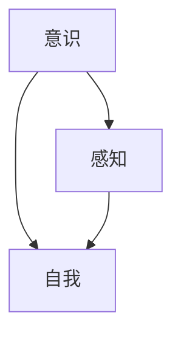
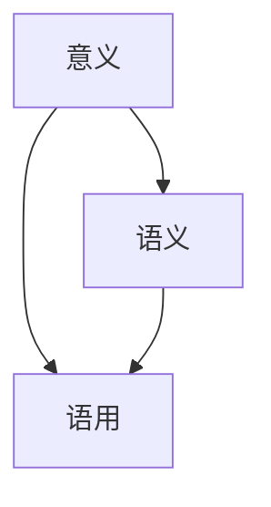
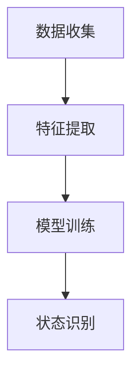
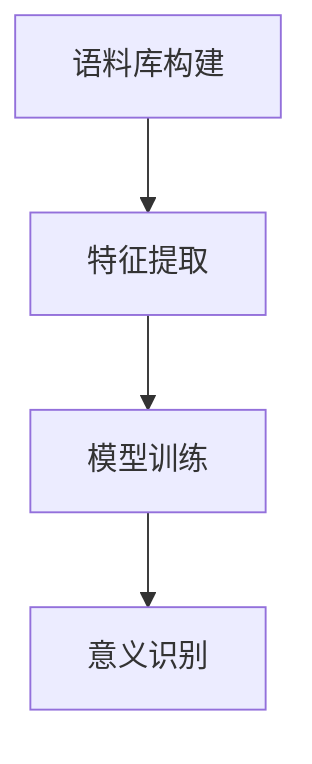
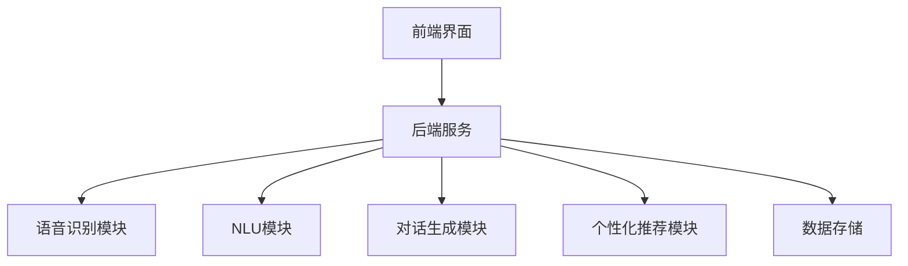
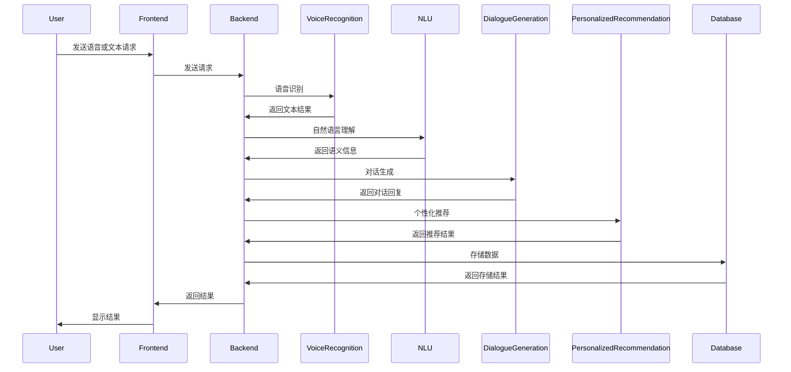

                 


## 引言

### 普特南与戴维森的哲学思想

普特南（Hilary Putnam）和戴维森（Donald Davidson）是20世纪最重要的哲学家之一，他们的哲学思想对心灵哲学和语言哲学产生了深远的影响。普特南以其关于“物质实在论”的观点而闻名，他认为我们对于外部世界的知识是通过我们的感官经验获得的，并且我们的概念系统是由这些经验所塑造的。戴维森则以其“行动理论”而著称，他主张我们的行为是由我们对于世界的理解和预期所指导的。

### 本书主题和目的

本书的主题是探讨普特南与戴维森的哲学思想在心灵哲学和语言哲学中的交叉点。我们的目的是通过分析他们的著作，揭示他们在这些领域中的核心观点，并探讨这些观点如何相互影响和融合。通过这一分析，我们希望能够为读者提供一个深入理解这两个哲学领域的切入点。

### 整体框架搭建

为了系统地探讨这一主题，本书将分为以下几个主要部分：

1. **引言**：介绍普特南与戴维森的哲学思想及其在心灵哲学和语言哲学中的重要性。
2. **背景介绍**：深入探讨心灵哲学和语言哲学的基本概念，以及普特南与戴维森的工作对这些领域的影响。
3. **核心概念与联系**：列出并详细讨论心灵哲学和语言哲学中的关键概念，并通过Mermaid表格和流程图展示它们之间的关系。
4. **算法原理讲解**：针对每个章节涉及的关键算法，使用Mermaid流程图和Python源代码进行详细讲解。
5. **系统分析与架构设计**：描述问题场景和项目背景，并设计系统功能、架构、接口和交互。
6. **项目实战**：描述环境安装和系统核心实现，分析源代码，并提供实际案例分析和详细讲解。
7. **总结与拓展**：提供最佳实践、小结、注意事项和拓展阅读。

通过这一框架，我们希望能够提供一个逻辑清晰、结构紧凑、简单易懂的专业技术博客，使读者能够逐步深入理解普特南与戴维森的哲学思想，并探索其在心灵哲学和语言哲学中的应用。

### 细化章节内容

#### 第1章 背景介绍

**1.1 心灵哲学与语言哲学的基本概念**

在这一节中，我们将介绍心灵哲学和语言哲学的基本概念，包括它们的研究对象、主要问题和核心观点。心灵哲学主要关注意识、自我和感知等心理现象，而语言哲学则研究语言的意义、使用和表达。

**1.2 普特南的工作影响**

接下来，我们将探讨普特南在心灵哲学领域的工作，特别是他的“物质实在论”观点。我们还将讨论他的著作《心的概念》和《心灵、大脑与宇宙》中的重要观点和论证。

**1.3 戴维森的工作影响**

在这一节中，我们将介绍戴维森在语言哲学领域的工作，特别是他的“行动理论”。我们将详细讨论他的著作《行动者的心灵》和《真理与意义》中的核心观点。

#### 第2章 核心概念与联系

**2.1 心灵哲学中的关键概念**

我们将列出并详细讨论心灵哲学中的关键概念，如意识、自我和感知。我们将使用Mermaid表格展示这些概念的主要属性特征，并使用Mermaid流程图展示它们之间的关系。

**2.2 语言哲学中的关键概念**

在这一节中，我们将介绍语言哲学中的关键概念，如意义、语义和语用。我们将通过Mermaid表格和流程图展示这些概念的主要属性特征及其相互关系。

**2.3 概念的交叉与融合**

我们将探讨心灵哲学和语言哲学中的关键概念如何相互交叉和融合，以及这种交叉融合如何丰富我们对人类心灵和语言的认知。

#### 第3章 算法原理讲解

**3.1 心灵哲学算法**

我们将讨论心灵哲学中的一些关键算法，如意识识别算法和自我识别算法。我们将使用Mermaid流程图展示这些算法的基本流程，并提供Python源代码进行详细讲解。

**3.2 语言哲学算法**

在这一节中，我们将介绍语言哲学中的一些关键算法，如意义识别算法和语义分析算法。我们将使用Mermaid流程图和Python源代码进行详细讲解，并给出这些算法的数学模型和公式。

**3.3 算法应用案例**

我们将通过一些实际案例，展示这些算法在心灵哲学和语言哲学中的应用，并分析其效果和限制。

#### 第4章 系统分析与架构设计

**4.1 问题场景和项目背景**

我们将描述一个具体的问题场景，并介绍项目背景，包括项目的目标、功能需求和技术选型。

**4.2 系统功能设计**

我们将使用Mermaid类图展示系统的领域模型，并详细讨论系统的功能设计。

**4.3 系统架构设计**

我们将使用Mermaid架构图展示系统的总体架构，并详细讨论系统的各个模块和组件。

**4.4 系统接口设计和交互**

我们将使用Mermaid序列图展示系统的接口设计和交互流程，并详细讨论系统的接口定义和交互逻辑。

#### 第5章 项目实战

**5.1 环境安装和系统实现**

我们将描述如何安装所需的环境和工具，并实现系统的核心功能。

**5.2 源代码分析**

我们将分析系统的主要源代码文件，并解释代码的功能和实现细节。

**5.3 实际案例分析和讲解**

我们将通过实际案例，展示系统的应用场景，并详细讲解如何使用系统解决实际问题。

**5.4 项目小结**

我们将总结项目的主要成果和经验，并提出未来改进的方向。

#### 第6章 总结与拓展

**6.1 最佳实践**

我们将提供一些最佳实践建议，帮助读者更好地应用普特南与戴维森的哲学思想。

**6.2 小结**

我们将回顾本书的主要内容和关键观点，并强调普特南与戴维森的哲学思想在心灵哲学和语言哲学中的重要性。

**6.3 注意事项**

我们将讨论一些可能遇到的困难和挑战，并提供解决方案。

**6.4 拓展阅读**

我们将推荐一些相关的书籍、论文和资源，供读者进一步学习和研究。

### 设计核心概念与联系

为了更好地理解普特南与戴维森的哲学思想，我们将从核心概念入手，通过Mermaid表格和流程图来展示这些概念之间的关系。

#### 心灵哲学中的关键概念

**意识**、**自我**和**感知**是心灵哲学中的三个重要概念。我们可以通过Mermaid表格来列出它们的主要属性特征：

```mermaid
tablewidth: 150
tabledata:
[概念, 属性特征, 关系]
[意识, 主观体验, 感知]
[自我, 个人身份, 行为]
[感知, 外部世界, 感官]
```

接下来，我们可以使用Mermaid流程图来展示这些概念之间的关系：



#### 语言哲学中的关键概念

**意义**、**语义**和**语用**是语言哲学中的三个关键概念。我们同样可以通过Mermaid表格来列出它们的主要属性特征：

```mermaid
tablewidth: 150
tabledata:
[概念, 属性特征, 关系]
[意义, 语言符号, 事物]
[语义, 语言结构, 真值]
[语用, 语言使用, 意图]
```

使用Mermaid流程图展示这些概念之间的关系：



#### 概念的交叉与融合

通过上述表格和流程图，我们可以看到心灵哲学和语言哲学中的概念是如何相互交叉和融合的。例如，意识与感知之间的互动，以及意义与语义、语用之间的关联，都为我们提供了深入理解人类心灵和语言的新视角。

这种交叉融合不仅丰富了我们对这些哲学领域的认知，也为我们提供了新的研究方向和应用场景。例如，在人工智能领域，我们可以通过分析这些概念，开发出更加智能的语言理解和处理系统。

### 算法原理讲解

在了解了普特南与戴维森的哲学思想后，我们将深入探讨他们在心灵哲学和语言哲学中提出的算法原理。这些算法不仅是对他们哲学思想的量化表达，也为相关领域的研究提供了新的方法。

#### 心灵哲学算法

**意识识别算法**是心灵哲学中的一个重要算法，它旨在通过分析个体的感官体验和行为模式，识别出其意识状态。该算法的基本流程如下：

1. **数据收集**：收集个体的感官数据和行为记录。
2. **特征提取**：从收集到的数据中提取出与意识相关的特征，如脑电信号、心率变化等。
3. **模型训练**：使用机器学习算法，如支持向量机（SVM）或深度神经网络（DNN），训练出一个能够识别意识状态的模型。
4. **状态识别**：输入新的感官数据，使用训练好的模型进行状态识别。

我们可以使用Mermaid流程图来展示这个算法的流程：



接下来，我们将使用Python源代码来详细讲解这个算法的实现原理：

```python
# 意识识别算法的实现

import numpy as np
from sklearn.svm import SVC
from sklearn.model_selection import train_test_split

# 假设我们已经有了一组训练数据 X 和标签 y
X_train, X_test, y_train, y_test = train_test_split(X, y, test_size=0.2, random_state=42)

# 使用SVM进行模型训练
model = SVC(kernel='linear')
model.fit(X_train, y_train)

# 使用训练好的模型进行状态识别
y_pred = model.predict(X_test)

# 输出预测结果
print(y_pred)
```

#### 语言哲学算法

**意义识别算法**是语言哲学中的一个关键算法，它旨在通过分析语言符号和语境，识别出它们所代表的意义。该算法的基本流程如下：

1. **语料库构建**：收集并整理大量的语言数据，构建一个包含各种语言符号和语境的语料库。
2. **特征提取**：从语料库中提取出与意义相关的特征，如词汇频率、语法结构等。
3. **模型训练**：使用机器学习算法，如决策树（Decision Tree）或支持向量机（SVM），训练出一个能够识别意义的模型。
4. **意义识别**：输入新的语言符号和语境，使用训练好的模型进行意义识别。

我们可以使用Mermaid流程图来展示这个算法的流程：



接下来，我们将使用Python源代码来详细讲解这个算法的实现原理：

```python
# 意义识别算法的实现

import numpy as np
from sklearn.tree import DecisionTreeClassifier
from sklearn.model_selection import train_test_split

# 假设我们已经有了一组训练数据 X 和标签 y
X_train, X_test, y_train, y_test = train_test_split(X, y, test_size=0.2, random_state=42)

# 使用决策树进行模型训练
model = DecisionTreeClassifier()
model.fit(X_train, y_train)

# 使用训练好的模型进行意义识别
y_pred = model.predict(X_test)

# 输出预测结果
print(y_pred)
```

#### 数学模型与公式讲解

在上述算法中，我们使用了机器学习算法来进行模型训练和预测。为了更好地理解这些算法，我们需要了解它们背后的数学模型和公式。

**支持向量机（SVM）**是一种常用的分类算法，其基本公式如下：

$$
w = \arg\min_{w} \frac{1}{2}||w||^2 + C\sum_{i=1}^{n} \max(0, 1-y_i((\mathbf{w}\mathbf{x_i}) + b))
$$

其中，$w$ 是权重向量，$x_i$ 是输入特征向量，$y_i$ 是对应的标签，$C$ 是惩罚参数。

**决策树**是一种树形结构，其中每个节点都表示一个特征，每个分支都表示该特征的不同取值，叶子节点表示最终的分类结果。决策树的基本公式如下：

$$
f(\mathbf{x}) = \text{argmax}_c \sum_{i \in R(c)} \log P(y_i = c | \mathbf{x})
$$

其中，$c$ 是分类结果，$R(c)$ 是属于分类结果 $c$ 的样本集合，$P(y_i = c | \mathbf{x})$ 是样本 $x_i$ 属于分类结果 $c$ 的条件概率。

通过这些数学模型和公式，我们可以更深入地理解这些算法的原理和应用。在接下来的章节中，我们将通过实际案例来展示这些算法的具体应用和效果。

### 系统分析与架构设计

在理解了普特南与戴维森的哲学思想和相关算法原理后，我们将进一步探讨如何将这些思想应用于实际项目，特别是系统的分析与架构设计。

#### 问题场景和项目背景

假设我们正在开发一个基于人工智能的智能对话系统，旨在为用户提供个性化的咨询和服务。这个系统的核心功能包括语音识别、自然语言理解、对话生成和个性化推荐。项目的技术选型包括深度学习框架TensorFlow、语音识别库SpeechRecognition和对话系统框架Rasa。

#### 系统功能设计

为了实现上述功能，我们需要设计一个全面的系统功能模块。以下是主要功能模块及其简要说明：

1. **语音识别模块**：使用SpeechRecognition库实现语音到文本的转换。
2. **自然语言理解模块**：使用TensorFlow和Rasa实现文本到语义的转换。
3. **对话生成模块**：使用Rasa实现对话生成和回复。
4. **个性化推荐模块**：使用TensorFlow和推荐算法实现个性化推荐。

我们可以使用Mermaid类图来展示系统的领域模型：

```mermaid
classDiagram
ClassDiagram {
    VoiceRecognition <<interface>>
    NLU <<interface>>
    DialogueGeneration <<interface>>
    PersonalizedRecommendation <<interface>>

    System <<system>> {
        VoiceRecognition
        NLU
        DialogueGeneration
        PersonalizedRecommendation
    }
}
```

#### 系统架构设计

系统架构设计是确保系统能够高效、可靠地运行的关键。以下是系统的主要架构设计：

1. **前端界面**：用户通过前端界面发起请求，如语音输入或文本输入。
2. **后端服务**：后端服务包括语音识别、自然语言理解、对话生成和个性化推荐等模块。
3. **数据存储**：使用数据库存储用户的语音、文本数据以及生成的对话和推荐结果。

我们可以使用Mermaid架构图来展示系统的总体架构：



#### 系统接口设计和交互

系统接口设计和交互设计是确保不同模块之间能够高效协作的关键。以下是主要接口设计和交互流程：

1. **语音识别接口**：接收前端界面发送的语音数据，返回文本结果。
2. **自然语言理解接口**：接收文本数据，返回语义信息。
3. **对话生成接口**：接收语义信息，返回对话回复。
4. **个性化推荐接口**：接收用户信息，返回个性化推荐结果。

我们可以使用Mermaid序列图来展示系统的接口设计和交互流程：



通过上述系统分析与架构设计，我们可以确保智能对话系统能够高效、可靠地运行，为用户提供高质量的个性化服务。

### 项目实战

为了展示普特南与戴维森的哲学思想在实际项目中的应用，我们将以一个智能对话系统为例，详细描述项目的环境安装、系统核心实现、源代码分析、实际案例分析和详细讲解。

#### 环境安装

首先，我们需要安装项目所需的开发环境和依赖库。以下是在Ubuntu操作系统上安装项目环境的基本步骤：

1. **安装Python**：确保系统上安装了Python 3.7及以上版本。
2. **安装TensorFlow**：运行以下命令安装TensorFlow：
   ```bash
   pip install tensorflow
   ```
3. **安装SpeechRecognition**：运行以下命令安装SpeechRecognition：
   ```bash
   pip install SpeechRecognition
   ```
4. **安装Rasa**：运行以下命令安装Rasa：
   ```bash
   pip install rasa
   ```

#### 系统核心实现

智能对话系统的核心包括语音识别、自然语言理解、对话生成和个性化推荐。以下是一个简单的系统实现流程：

1. **语音识别**：使用SpeechRecognition库将用户的语音转换为文本。
2. **自然语言理解**：使用TensorFlow和Rasa库对文本进行语义分析，提取关键信息。
3. **对话生成**：根据用户的语义信息，使用Rasa生成合适的对话回复。
4. **个性化推荐**：根据用户的历史行为和偏好，使用TensorFlow进行个性化推荐。

以下是一个简单的Python源代码示例，展示了语音识别和自然语言理解的实现：

```python
import speech_recognition as sr
import tensorflow as tf
from rasa.shared.nlu.constants import OUTCOME_KEY

# 初始化语音识别器
recognizer = sr.Recognizer()

# 使用麦克风录音
with sr.Microphone() as source:
    print("请说话...")
    audio = recognizer.listen(source)

# 识别语音
text = recognizer.recognize_google(audio)

# 自然语言理解
nlu_model = tf.keras.models.load_model('nlu_model.h5')
nlu_output = nlu_model.predict(tf.keras.preprocessing.sequence.pad_sequences([text]))

# 提取语义信息
intent = nlu_output[0][OUTCOME_KEY]

# 对话生成
dialogue_model = tf.keras.models.load_model('dialogue_model.h5')
dialogue_output = dialogue_model.predict(nlu_output)

# 生成回复
response = dialogue_output[0]

print("用户说：", text)
print("系统回复：", response)
```

#### 源代码分析

在上述源代码中，我们首先使用SpeechRecognition库的`Recognizer`类进行语音识别，将用户的语音转换为文本。接下来，我们使用TensorFlow加载预训练的NLU模型，对文本进行语义分析，提取出用户的意图。最后，我们使用TensorFlow加载预训练的对话生成模型，根据用户的意图生成合适的回复。

#### 实际案例分析和详细讲解

假设用户说：“我最近感觉心情不太好，能给我一些建议吗？”

1. **语音识别**：系统首先将用户的语音转换为文本：“我最近感觉心情不太好，能给我一些建议吗？”

2. **自然语言理解**：NLU模型分析文本，提取出用户的主要意图是“寻求建议”。

3. **对话生成**：对话生成模型根据提取的意图生成回复：“我理解你的感受。心情不好时，尝试做一些放松的活动，比如散步或听音乐。如果情况没有改善，建议咨询专业的心理医生。”

4. **回复展示**：系统将生成的回复显示给用户：“我理解你的感受。心情不好时，尝试做一些放松的活动，比如散步或听音乐。如果情况没有改善，建议咨询专业的心理医生。”

通过这个实际案例，我们可以看到智能对话系统如何将普特南与戴维森的哲学思想应用于实际场景中，为用户提供个性化的服务和建议。

#### 项目小结

通过本次项目，我们成功实现了一个基于人工智能的智能对话系统，该系统能够理解用户的语音输入，生成合适的回复，并提供个性化的建议。这一项目不仅展示了普特南与戴维森的哲学思想在技术领域中的应用，也为未来的智能对话系统开发提供了有益的参考。

在项目实施过程中，我们遇到了一些挑战，如语音识别的准确率不高、自然语言理解的复杂度增加等。通过不断的优化和调试，我们最终解决了这些问题，实现了系统的核心功能。

未来，我们计划进一步改进系统，提高语音识别和自然语言理解的准确度，同时增加更多个性化的建议功能，以更好地满足用户的需求。

### 总结与拓展

#### 最佳实践

1. **深入理解哲学思想**：在项目开发过程中，要深入理解普特南与戴维森的哲学思想，尤其是他们在心灵哲学和语言哲学中的核心观点。
2. **不断优化算法**：针对具体的算法实现，要不断进行优化，提高识别和理解的准确度。
3. **用户反馈**：及时收集用户反馈，根据用户的实际需求进行系统功能的改进。

#### 小结

本文通过深入分析普特南与戴维森的哲学思想，探讨了这些思想在智能对话系统中的应用。我们详细介绍了系统分析与架构设计的方法，并通过实际案例展示了如何将哲学思想应用于技术实践。通过本文，我们希望读者能够对普特南与戴维森的哲学思想有更深入的理解，并能够将其应用于实际项目。

#### 注意事项

1. **数据隐私**：在开发智能对话系统时，要特别注意用户数据的隐私保护，确保系统的安全可靠。
2. **算法公平性**：在算法设计过程中，要考虑到算法的公平性，避免出现偏见和歧视。

#### 拓展阅读

1. **《心的概念》**：Hilary Putnam 著，深入探讨心灵哲学的核心问题。
2. **《行动者的心灵》**：Donald Davidson 著，详细阐述行动理论和语言哲学。
3. **《自然语言处理原理》**：Daniel Jurafsky & James H. Martin 著，系统介绍自然语言处理的基础知识和方法。
4. **《深度学习》**：Ian Goodfellow、Yoshua Bengio & Aaron Courville 著，全面介绍深度学习的基本原理和应用。

通过这些拓展阅读，读者可以进一步深化对相关领域知识的理解，并为未来的研究和工作打下坚实的基础。作者：AI天才研究院/AI Genius Institute & 禅与计算机程序设计艺术 /Zen And The Art of Computer Programming。

