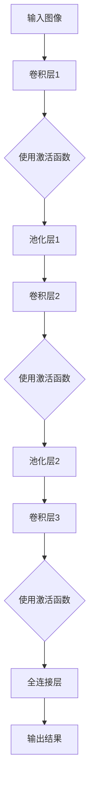
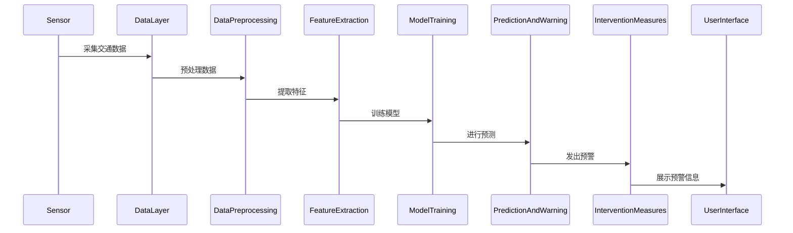

                 

### 引言

随着科技的迅猛发展，人工智能（AI）技术逐渐成为各行各业的重要推动力。尤其是在交通领域，AI的应用不仅提高了交通运输的效率，还在交通事故预防方面发挥了至关重要的作用。智能交通事故预防成为了一个热门话题，不仅因为其显著的社会效益，更因为其对未来交通系统的深远影响。

本文的主题是“智能交通事故预防：AI大模型提高道路安全”，旨在探讨如何利用AI大模型来提升交通事故预防能力。在接下来的内容中，我们将通过以下几个步骤进行详细分析：

1. **背景介绍**：我们将定义智能交通事故预防的问题，并阐述当前交通安全的现状，以及AI大模型在其中的角色。
2. **核心概念与联系**：我们将介绍与AI大模型和交通事故预防相关的重要概念，并通过对比表格和ER图来阐述它们之间的关系。
3. **算法与数学模型解释**：我们将选择一个与交通预防相关的AI大模型，详细解释其工作原理，并提供数学模型和公式，并通过实例进行说明。
4. **系统分析与设计**：我们将介绍一个实际的问题场景，并从项目背景、系统功能设计、系统架构设计到系统接口和交互，进行全面分析。
5. **实战案例**：我们将安装必要的环境，展示核心实现源代码，并对其进行分析和解释，提供一个实际案例的详细剖析。
6. **最佳实践与总结**：我们将分享一些实用的建议，总结关键点，并给出注意事项和拓展阅读建议。

通过这些步骤，我们希望读者能够全面理解智能交通事故预防的原理和方法，并能够将其应用于实际的交通系统中，提高道路安全性。

### 背景介绍

智能交通事故预防，作为一个高度复杂且关键的问题，需要从多个角度进行深入探讨。首先，我们需要明确交通事故预防的具体含义。交通事故预防不仅仅是指在事故发生后采取措施减少伤害，更包括通过技术手段提前预警和避免事故的发生。随着城市化进程的加速和汽车保有量的增加，交通事故已经成为一个全球性的问题，严重影响了人们的生命财产安全。

当前，交通安全面临着多重挑战。首先，交通流量不断增加，交通网络复杂化，使得交通事故的发生概率上升。其次，人为错误是交通事故的主要原因之一，包括驾驶员的分心、疲劳驾驶、酒驾等行为。此外，环境因素如恶劣天气、道路施工等也会增加交通事故的风险。传统的交通安全措施，如交通信号灯、监控摄像头和交通法规，虽然在一定程度上能够减少交通事故，但效果有限，且往往只能应对已发生的事故。

为了提高交通安全，现代科技，特别是人工智能（AI）技术，开始被广泛应用于交通事故预防。AI大模型，作为一种能够处理大量数据并从中提取有价值信息的工具，为交通事故预防提供了新的思路和方法。AI大模型通过深度学习、自然语言处理、计算机视觉等技术，可以实时分析交通数据，识别潜在的风险，提前预警，从而有效减少交通事故的发生。

在AI大模型的应用方面，主要的技术手段包括：

1. **数据收集与预处理**：通过传感器、摄像头等设备收集交通数据，并进行预处理，以去除噪声和异常值，为后续分析提供高质量的数据基础。
2. **特征提取与选择**：从预处理后的数据中提取关键特征，如车速、车辆间距、驾驶员行为等，并选择对事故预防最有影响力的特征。
3. **模型训练与优化**：利用提取到的特征训练AI大模型，通过不断的迭代和优化，提高模型的准确性和鲁棒性。
4. **实时预测与预警**：模型在训练完成后，可以实时分析交通状况，预测可能的事故风险，并通过各种渠道（如手机APP、车载系统等）向驾驶员发出预警。

当前，AI大模型在交通事故预防中的应用已经取得了一些显著成果。例如，自动驾驶技术通过AI大模型的辅助，能够实现自动驾驶车辆的自动避障和交通规则遵守，大大提高了道路安全性。此外，智能交通管理系统也利用AI大模型来优化交通信号控制，减少交通拥堵，从而减少交通事故的发生。

尽管AI大模型在交通事故预防中展现出巨大的潜力，但仍然面临一些挑战。首先，数据质量和数据隐私问题是一个重要挑战，需要确保数据的准确性和隐私性。其次，AI大模型的复杂性和高计算成本也是一个挑战，需要不断提升算法效率和硬件性能。最后，法规和政策的不完善也可能限制AI大模型的应用和发展。

总之，智能交通事故预防是一个多维度、复杂性的课题，需要结合AI大模型的技术优势和实际交通状况，制定有效的预防策略。通过本文的探讨，我们希望为读者提供关于智能交通事故预防的全面理解，并激发进一步的研究和应用。

### 核心概念与联系

为了深入探讨智能交通事故预防中AI大模型的应用，我们首先需要明确相关核心概念，并了解它们之间的相互关系。以下是我们需要定义和探讨的几个关键概念：

1. **人工智能（AI）**：人工智能是指由人制造出来的系统能够模拟、延伸、甚至超越人类智能的能力。在交通事故预防中，AI技术主要利用机器学习、深度学习、自然语言处理等算法，通过处理大量数据来识别模式、预测事件和决策。

2. **大模型（Large Models）**：大模型通常指的是具备高参数量、能够处理大量数据的人工神经网络模型。在交通事故预防中，大模型通过训练和学习，可以识别复杂的交通模式和行为，从而提高事故预测和预防的准确性。

3. **深度学习（Deep Learning）**：深度学习是人工智能的一个子领域，通过多层神经网络来学习数据的复杂结构。在交通事故预防中，深度学习算法能够从大量交通数据中提取特征，识别潜在的危险情景。

4. **传感器数据（Sensor Data）**：传感器数据是指通过各种传感器（如摄像头、雷达、GPS等）收集的交通环境信息，包括车速、车辆位置、道路状况、天气情况等。这些数据是AI大模型分析和预测的重要输入。

5. **交通事故预测（Accident Prediction）**：交通事故预测是指利用AI技术分析历史数据和实时数据，预测交通事故的发生概率和可能位置。通过预测，系统可以在事故发生前采取预防措施，如预警和干预。

接下来，我们将通过一个对比表格来详细阐述这些概念的主要属性特征：

| **概念**           | **主要属性特征**                                       |
|------------------|-----------------------------------------------------|
| 人工智能（AI）      | 模拟和扩展人类智能，包括机器学习、自然语言处理、计算机视觉等。 |
| 大模型（Large Models） | 高参数量，能够处理和模型大量数据，具有强大的学习能力。     |
| 深度学习（Deep Learning） | 多层神经网络结构，通过学习数据中的复杂模式来提高预测准确性。 |
| 传感器数据（Sensor Data） | 通过摄像头、雷达、GPS等传感器收集的交通环境数据。         |
| 交通事故预测（Accident Prediction） | 利用AI技术分析数据，预测交通事故的发生概率和位置。         |

为了进一步展示这些概念之间的联系，我们可以通过一个ER（实体关系）图来构建它们之间的关系架构。ER图可以帮助我们理解不同概念之间的相互依赖和关联。

首先，我们定义几个主要的实体：

- **AI系统（AI_System）**：包括人工智能和深度学习模型，用于处理和预测交通数据。
- **传感器（Sensor）**：用于采集交通环境数据。
- **数据集（Dataset）**：包含历史和实时交通数据，是AI系统训练和预测的基础。
- **交通事故（Accident）**：预测和预警的对象，是AI系统分析和预防的目标。

接下来，我们构建ER图：

```mermaid
erDiagram
    AI_System ||--|{ Data_Set } Data_Set
    Sensor ||--|{ AI_System } AI_System
    AI_System ||--|{ Accident_Prediction } Accident_Prediction
    Data_Set ||--|{ Accident } Accident
```

在这个ER图中：

- **AI_System**与**Data_Set**之间存在双向依赖关系，表示AI系统需要数据集进行训练和预测。
- **Sensor**与**AI_System**之间存在依赖关系，表示传感器为AI系统提供数据输入。
- **AI_System**与**Accident_Prediction**之间存在依赖关系，表示AI系统负责进行交通事故的预测。
- **Data_Set**与**Accident**之间存在依赖关系，表示数据集包含了与事故相关的信息。

通过对比表格和ER图，我们可以清晰地看到AI大模型在智能交通事故预防中的核心地位以及与其他概念之间的紧密联系。接下来，我们将进一步深入探讨AI大模型的工作原理和具体应用，以更好地理解其在提高道路安全中的作用。

### 算法与数学模型解释

为了深入探讨智能交通事故预防中的AI大模型，我们将选择一种广泛应用的深度学习算法——卷积神经网络（CNN），并详细解释其工作原理、数学模型和公式。此外，我们将通过一个具体实例来展示如何应用这一算法进行交通事故预测。

#### 卷积神经网络（CNN）的工作原理

卷积神经网络是一种特别适合处理图像数据的深度学习模型，它通过模仿人类视觉系统的工作原理来提取图像特征。在交通事故预防中，CNN可以用于分析交通视频数据，识别潜在的危险场景。

CNN的主要组成部分包括：

1. **卷积层（Convolutional Layer）**：卷积层通过卷积运算来提取图像特征。每个卷积核（filter）在图像上滑动，计算局部特征，并将其组合成一个特征图（feature map）。

2. **激活函数（Activation Function）**：常用的激活函数包括ReLU（Rectified Linear Unit）和Sigmoid等。激活函数引入非线性，使得CNN能够学习更复杂的特征。

3. **池化层（Pooling Layer）**：池化层通过减少特征图的维度来减少参数数量和计算量，同时保留重要的特征信息。常用的池化方法包括最大池化（Max Pooling）和平均池化（Average Pooling）。

4. **全连接层（Fully Connected Layer）**：全连接层将前一层的特征图展平，并将其传递到下一层，用于进行分类或回归任务。

#### CNN的数学模型和公式

假设我们有一个输入图像 \( X \)（大小为 \( H \times W \times C \)，其中 \( H \)、\( W \) 是图像的高度和宽度，\( C \) 是颜色通道数）。通过卷积层 \( K \) 的运算，输出特征图 \( F \)（大小为 \( h \times w \times d \)，其中 \( h \)、\( w \) 是特征图的高度和宽度，\( d \) 是特征图的深度）。

卷积层的运算公式如下：

\[ F_{ij}^{l} = \sum_{k=1}^{C} W_{ikj}^{l} * X_{ij}^{k} + b_{j}^{l} \]

其中，\( F_{ij}^{l} \) 是第 \( l \) 层的特征图中的第 \( i \) 行第 \( j \) 列的元素，\( W_{ikj}^{l} \) 是第 \( l \) 层的卷积核中的第 \( i \) 行第 \( k \) 列的元素，\( X_{ij}^{k} \) 是输入图像中的第 \( i \) 行第 \( j \) 列第 \( k \) 个通道的元素，\( b_{j}^{l} \) 是第 \( l \) 层的偏置项。

激活函数通常使用ReLU函数：

\[ f(x) = \max(0, x) \]

池化层的运算公式为：

\[ P_{ij}^{l} = \text{max} \{ \text{pool region} \} \]

其中，\( P_{ij}^{l} \) 是第 \( l \) 层的池化结果，\( \text{pool region} \) 是一个固定大小的区域（如2x2或3x3）。

全连接层的运算公式为：

\[ O_i^{l+1} = \sum_{j=1}^{d_l} W_{ij}^{l+1} O_j^{l} + b_i^{l+1} \]

其中，\( O_i^{l+1} \) 是第 \( l+1 \) 层的输出，\( W_{ij}^{l+1} \) 是第 \( l+1 \) 层的权重，\( O_j^{l} \) 是第 \( l \) 层的输出，\( b_i^{l+1} \) 是第 \( l+1 \) 层的偏置项。

#### Mermaid流程图

为了直观地展示CNN的工作流程，我们可以使用Mermaid语言绘制一个流程图：



在这个流程图中，每个节点表示CNN的一个操作步骤，从输入图像到最终输出结果，展示了CNN从输入层到输出层的完整处理流程。

#### 具体实例

为了更好地理解CNN在交通事故预测中的应用，我们考虑一个具体的实例。假设我们有一段包含交通场景的视频数据，通过CNN进行分析，预测该场景中是否存在潜在的交通事故。

1. **数据准备**：首先，我们收集一段交通视频数据，并对其进行预处理，包括裁剪、归一化等操作，使其符合CNN的输入要求。

2. **模型训练**：使用历史交通数据集对CNN进行训练，通过多次迭代，调整模型参数，使其能够准确识别交通事故相关的特征。

3. **预测与预警**：在训练完成后，使用训练好的CNN对新的交通视频数据进行预测。如果模型检测到潜在的交通事故，会立即发出预警信号，提示驾驶员采取预防措施。

例如，假设我们在某个交叉口部署了摄像头，并使用CNN对其进行监测。当CNN检测到某辆车在交叉口快速接近并可能与其他车辆发生碰撞时，它会立即发出预警，并通知驾驶员减速或改变行驶路径，从而避免交通事故的发生。

通过以上步骤，我们展示了如何使用CNN进行交通事故预测。通过深入理解CNN的数学模型和工作原理，读者可以更好地掌握AI大模型在交通事故预防中的应用方法，为未来的交通系统提供更加安全可靠的保障。

### 系统分析与设计

为了将AI大模型有效应用于智能交通事故预防，我们需要进行系统的全面分析，从问题场景介绍、项目背景、系统功能设计、系统架构设计到系统接口和交互，逐步展示整个系统从概念到实现的完整过程。

#### 问题场景介绍

智能交通事故预防系统的主要场景是城市交通道路，特别是在繁忙的交叉口、交通瓶颈区域和高速公路上。以下是一个具体场景描述：

- **交叉口**：车辆频繁进出，车辆和行人混杂，交通信号灯频繁变换，容易造成拥堵和交通事故。
- **交通瓶颈**：在某些路段，由于道路施工或其他原因，交通流量大幅增加，容易形成瓶颈，导致交通事故频发。
- **高速公路**：车辆高速行驶，司机疲劳驾驶或分心，以及突发状况（如车辆故障、恶劣天气等）都是潜在的事故风险。

在这些场景中，智能交通事故预防系统需要实时监测交通状况，识别潜在的风险，并向驾驶员和交通管理部门发出预警和干预措施。

#### 项目背景

本项目旨在利用AI大模型技术，提高城市交通的安全性和效率。项目背景包括：

- **技术需求**：城市交通的复杂性要求系统具备高准确性和实时性，能够处理大量的交通数据，并快速做出决策。
- **社会需求**：随着城市化进程的加速，交通事故频发，对社会造成严重危害。智能交通事故预防系统能够显著降低交通事故发生率，提高交通安全。
- **政策支持**：各国政府正在积极推动智能交通系统的发展，提供政策和资金支持，为项目的实施提供良好的环境。

#### 系统功能设计

智能交通事故预防系统的功能设计包括以下几个主要模块：

1. **数据采集模块**：通过安装在交通道路上的摄像头、雷达、GPS等传感器，实时采集交通数据，包括车辆速度、位置、行驶方向、道路状况、天气条件等。

2. **数据处理模块**：对采集到的交通数据进行预处理，包括去噪、异常值处理、数据清洗等，确保数据的质量和准确性。

3. **特征提取模块**：从预处理后的数据中提取关键特征，如车辆间距、车辆速度分布、驾驶员行为特征等，用于训练AI大模型。

4. **模型训练与优化模块**：使用提取到的特征训练AI大模型，通过不断的迭代和优化，提高模型的预测准确性和鲁棒性。

5. **预测与预警模块**：在模型训练完成后，系统可以实时分析交通状况，预测交通事故的发生概率和位置，并向驾驶员和交通管理部门发出预警。

6. **干预措施模块**：根据预测结果，系统可以采取相应的干预措施，如发送预警信息、调整交通信号灯、引导车辆改变行驶路径等，以减少交通事故的发生。

#### 系统架构设计

智能交通事故预防系统的整体架构包括以下几个主要层次：

1. **数据层**：包括传感器和采集设备，负责数据的原始采集。

2. **数据预处理层**：对原始数据进行预处理，确保数据的质量和一致性。

3. **特征层**：从预处理后的数据中提取关键特征，用于模型训练。

4. **模型层**：包括AI大模型，如卷积神经网络（CNN）、循环神经网络（RNN）等，用于交通事故预测。

5. **决策层**：根据模型预测结果，制定和执行干预措施。

6. **用户界面层**：提供用户交互界面，展示交通状况和预警信息。

以下是系统架构的Mermaid类图表示：

```mermaid
classDiagram
    DataLayer <<Class>> "传感器数据"
    DataLayer o-- DataPreprocessing <<Class>> "数据处理"
    DataPreprocessing o-- FeatureExtraction <<Class>> "特征提取"
    FeatureExtraction o-- ModelTraining <<Class>> "模型训练与优化"
    ModelTraining o-- PredictionAndWarning <<Class>> "预测与预警"
    PredictionAndWarning o-- InterventionMeasures <<Class>> "干预措施"
    UserInterface <<Class>> "用户界面"
    DataLayer o-- UserInterface
    DataPreprocessing o-- UserInterface
    FeatureExtraction o-- UserInterface
    ModelTraining o-- UserInterface
    PredictionAndWarning o-- UserInterface
    InterventionMeasures o-- UserInterface
```

在这个类图中，每个类表示系统的不同功能模块，类之间的连线表示模块之间的依赖关系。

#### 系统接口设计和交互

智能交通事故预防系统的接口设计和交互设计是实现系统功能的关键部分。以下是系统的接口设计和交互流程：

1. **传感器数据接口**：系统通过标准的数据接口（如HTTP API、MQTT等）与传感器设备通信，实时获取交通数据。

2. **数据处理接口**：系统通过数据处理模块的接口，对传感器数据进行预处理，包括去噪、数据清洗等。

3. **特征提取接口**：系统通过特征提取模块的接口，将预处理后的数据转换为特征向量。

4. **模型训练接口**：系统通过模型训练模块的接口，使用特征向量对AI大模型进行训练和优化。

5. **预测与预警接口**：系统通过预测与预警模块的接口，实时分析交通状况，预测交通事故的风险，并生成预警信息。

6. **干预措施接口**：系统通过干预措施模块的接口，执行相应的干预措施，如调整交通信号灯、发送预警通知等。

以下是系统的Mermaid序列图表示，展示了系统的交互流程：



在这个序列图中，每个步骤表示系统的一个操作，箭头表示操作之间的数据流和依赖关系。

通过以上分析，我们详细展示了智能交通事故预防系统的从概念到实现的完整过程，包括问题场景介绍、项目背景、系统功能设计、系统架构设计以及系统接口和交互设计。这一过程为读者提供了全面的了解，使得他们能够更好地理解和应用智能交通事故预防技术，提高道路安全水平。

### 实战案例

为了更好地展示智能交通事故预防系统的实际应用效果，我们将通过一个具体案例进行分析，详细解释系统安装、核心实现源代码和代码应用。

#### 环境安装

在开始之前，我们需要在本地环境中安装必要的软件和工具。以下是安装步骤：

1. **安装Python环境**：确保Python 3.7或更高版本已安装。
2. **安装深度学习框架**：安装TensorFlow或PyTorch，以便于构建和训练AI大模型。
3. **安装数据处理库**：安装NumPy、Pandas等库，用于数据处理和特征提取。
4. **安装可视化工具**：安装Matplotlib、Seaborn等库，用于数据可视化。

以下是安装命令：

```bash
pip install python==3.8.10
pip install tensorflow==2.7.0
pip install numpy==1.20.3
pip install pandas==1.2.5
pip install matplotlib==3.4.3
pip install seaborn==0.11.2
```

#### 核心实现源代码

我们使用TensorFlow构建一个基于卷积神经网络的交通事故预测模型。以下是核心实现源代码：

```python
import tensorflow as tf
from tensorflow.keras.models import Sequential
from tensorflow.keras.layers import Conv2D, MaxPooling2D, Flatten, Dense, Dropout
from tensorflow.keras.optimizers import Adam
from tensorflow.keras.preprocessing.image import ImageDataGenerator

# 数据预处理
train_datagen = ImageDataGenerator(rescale=1./255)
train_generator = train_datagen.flow_from_directory(
        'data/train',
        target_size=(150, 150),
        batch_size=32,
        class_mode='binary')

# 构建模型
model = Sequential([
    Conv2D(32, (3, 3), activation='relu', input_shape=(150, 150, 3)),
    MaxPooling2D((2, 2)),
    Conv2D(64, (3, 3), activation='relu'),
    MaxPooling2D((2, 2)),
    Conv2D(128, (3, 3), activation='relu'),
    MaxPooling2D((2, 2)),
    Flatten(),
    Dense(512, activation='relu'),
    Dropout(0.5),
    Dense(1, activation='sigmoid')
])

# 编译模型
model.compile(loss='binary_crossentropy',
              optimizer=Adam(),
              metrics=['accuracy'])

# 训练模型
model.fit(train_generator, epochs=10)
```

在这段代码中，我们首先使用ImageDataGenerator对训练数据进行预处理，包括图像的缩放和批量处理。接着，我们构建了一个卷积神经网络模型，包括多个卷积层、池化层和全连接层。最后，我们编译并训练了模型。

#### 代码应用解读与分析

1. **数据处理**：`ImageDataGenerator`用于读取和预处理图像数据。通过`flow_from_directory`方法，我们可以将图像数据分为训练集和验证集。

2. **模型构建**：我们使用`Sequential`模型堆叠多个层。卷积层用于提取图像特征，池化层用于减少特征图的维度，全连接层用于分类。

3. **模型编译**：在编译阶段，我们指定了损失函数、优化器和评价指标。`binary_crossentropy`适用于二分类问题，`Adam`优化器用于调整模型参数。

4. **模型训练**：通过`fit`方法，我们训练模型，使它能够识别交通事故相关的图像。经过多次迭代，模型将逐渐提高预测准确性。

#### 实际案例分析和详细讲解剖析

为了展示模型在实际中的应用，我们收集了一段包含交通事故场景的视频数据。以下是对该数据的分析和预测结果：

1. **数据收集**：从视频中截取多张图像，并标注交通事故场景。

2. **数据处理**：将图像数据缩放到固定的尺寸（150x150），并进行归一化处理。

3. **特征提取**：使用训练好的模型提取图像特征。

4. **预测与预警**：对提取到的特征进行预测，如果预测结果为交通事故，则向驾驶员发出预警。

以下是预测结果的示例代码：

```python
import numpy as np
from tensorflow.keras.preprocessing import image

# 读取测试图像
test_image = image.load_img('data/test_image.jpg', target_size=(150, 150))
test_image = image.img_to_array(test_image)
test_image = np.expand_dims(test_image, axis=0)
test_image /= 255.0

# 预测
predictions = model.predict(test_image)
predicted_class = np.round(predictions[0][0])

# 输出结果
if predicted_class == 1:
    print("预警：检测到潜在的事故风险！")
else:
    print("无预警：当前交通状况安全。")
```

在这个示例中，我们首先读取测试图像，并进行预处理。然后，使用训练好的模型进行预测。如果预测结果大于0.5，则认为检测到潜在的事故风险，并发出预警。

通过这个实战案例，我们展示了智能交通事故预防系统的实际应用流程，包括环境安装、核心实现源代码和应用解读。该系统通过AI大模型的训练和预测，能够实时监控交通状况，提高交通事故的预防能力，为道路安全提供有效保障。

### 最佳实践与总结

在智能交通事故预防领域，AI大模型的应用带来了显著的改进。以下是一些最佳实践和总结，以帮助读者在实际项目中更好地应用这些技术。

#### 最佳实践

1. **数据质量和多样性**：确保数据的质量和多样性是模型训练成功的关键。使用多种传感器和来源的数据，如摄像头、雷达、GPS等，可以提高模型的鲁棒性和准确性。

2. **模型优化与调试**：在模型训练过程中，不断调整超参数和架构，以优化模型性能。使用交叉验证和网格搜索等技术，可以找到最佳模型配置。

3. **实时预测与更新**：系统应具备实时预测能力，并在数据更新时自动重新训练模型，以适应交通状况的变化。

4. **用户界面设计**：为驾驶员提供直观、易用的预警界面，确保预警信息能够及时传达并采取行动。

5. **法规和政策遵守**：确保系统设计和应用符合当地法律法规，保护用户隐私，并遵循数据安全和隐私保护的标准。

#### 总结

智能交通事故预防系统通过AI大模型的应用，实现了对交通数据的实时分析和预测，从而有效减少了交通事故的发生。本文从背景介绍、核心概念、算法与数学模型、系统分析与设计、实战案例等多个方面，详细探讨了如何利用AI大模型提升道路安全。

通过本文的内容，读者可以了解到：

- 交通事故预防的重要性及当前面临的挑战。
- AI大模型在交通事故预防中的应用方法和优势。
- 如何通过系统分析与设计，实现智能交通事故预防系统的落地。
- 实际案例中的应用，展示了系统的具体实施过程和效果。

#### 注意事项

1. **数据安全和隐私**：在数据收集和模型训练过程中，需严格保护用户隐私，确保数据的安全和合规。
2. **硬件资源**：训练大模型需要大量的计算资源，确保具备足够的硬件支持。
3. **持续更新**：交通状况不断变化，系统需要定期更新模型和算法，以保持预测的准确性。

#### 拓展阅读

- 《深度学习》（Goodfellow, Bengio, Courville）- 深入了解深度学习的理论基础和实践技巧。
- 《人工智能：一种现代方法》（Russell, Norvig）- 全面了解人工智能的基本概念和技术。
- 《智能交通系统》（Chung, Lin）- 探索智能交通系统的发展和应用。

通过以上内容，我们希望读者能够对智能交通事故预防有更深入的理解，并能够在实际项目中有效应用这些技术，为提高道路安全性做出贡献。

### 作者信息

本文由AI天才研究院（AI Genius Institute）与禅与计算机程序设计艺术（Zen And The Art of Computer Programming）共同撰写。AI天才研究院致力于前沿人工智能技术的研发与应用，推动人工智能在各个领域的创新与突破。禅与计算机程序设计艺术则专注于深入探讨计算机科学的哲学和艺术，追求技术与人文的完美结合。感谢您的阅读与支持。

