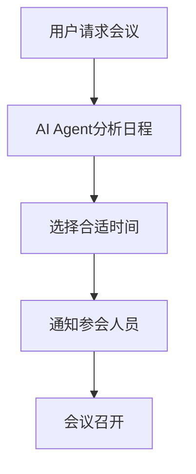
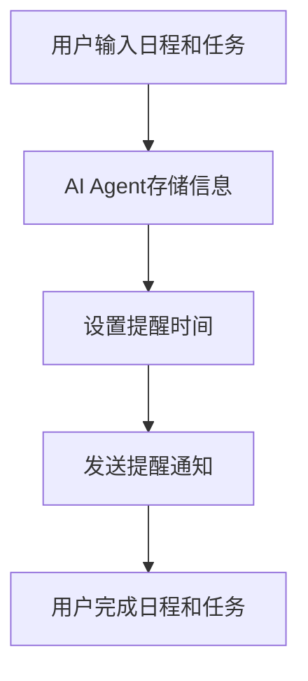
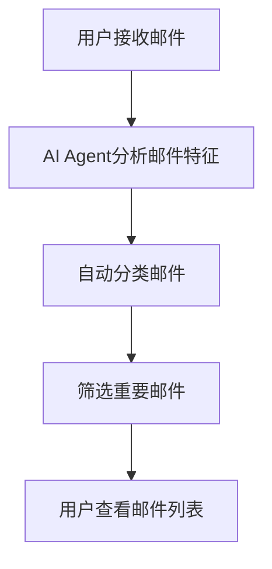
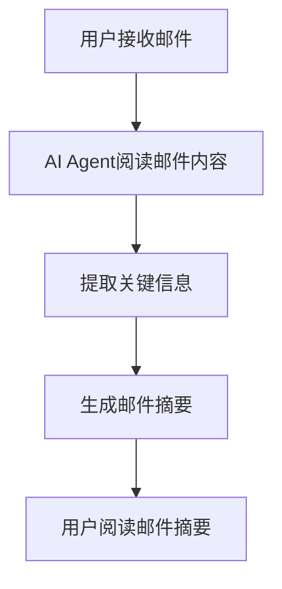
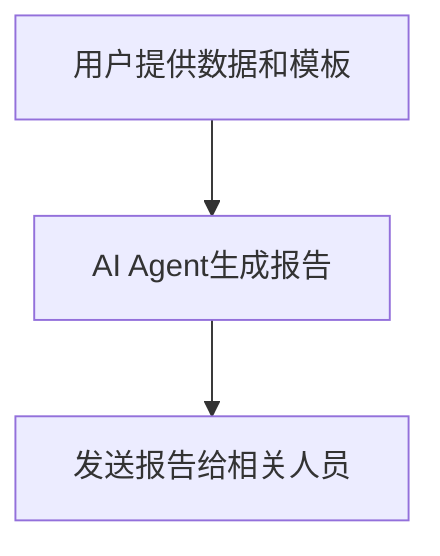
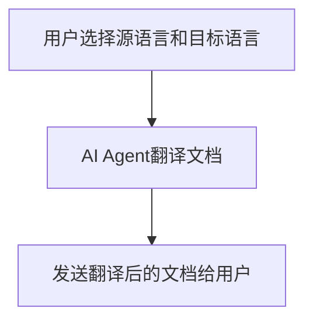
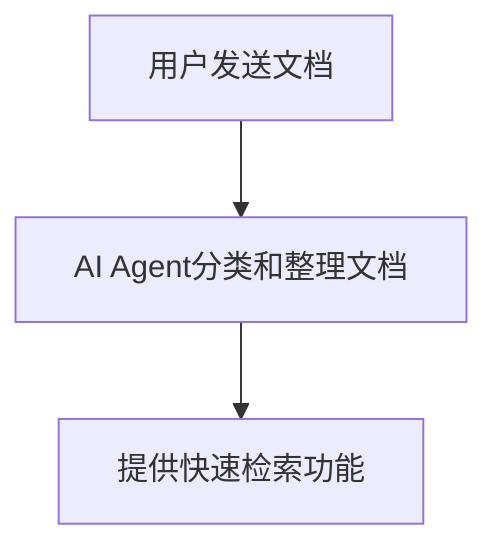
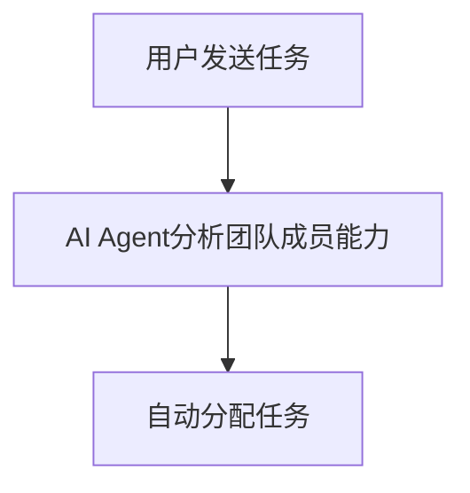
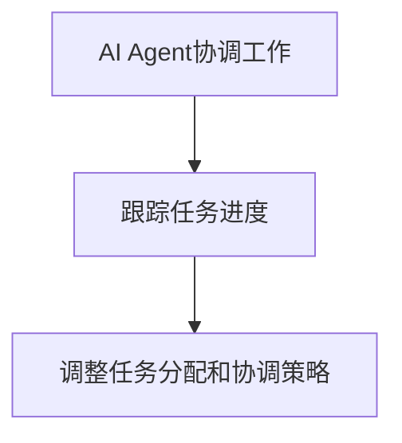
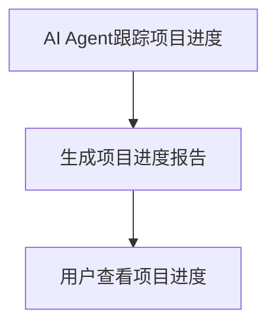

                 

# 智能办公：AI Agent提升工作效率

## 关键词
- 智能办公
- AI Agent
- 工作效率
- 自然语言处理
- 机器学习
- 计算机视觉
- 知识图谱

## 摘要
本文将深入探讨智能办公领域，特别是AI Agent在提升工作效率方面的应用。我们将从智能办公的定义、AI Agent的作用、关键技术、应用方法、面临的挑战以及未来发展趋势等多个方面，逐步分析智能办公如何通过AI Agent实现工作效率的提升。文章将结合实际案例，提供具体实施方法和建议，为企业和个人在智能办公领域的实践提供指导。

## 目录大纲

----------------------------------------------------------------

## 第一部分：智能办公的背景与概述

### 第1章：智能办公的定义与发展
#### 1.1 智能办公的概念
#### 1.2 智能办公的发展历程
#### 1.3 智能办公的重要性

### 第2章：AI Agent在智能办公中的应用
#### 2.1 AI Agent的定义与特点
#### 2.2 AI Agent的主要应用场景
#### 2.3 AI Agent与传统办公工具的区别

### 第3章：智能办公的关键技术
#### 3.1 自然语言处理技术
#### 3.2 机器学习技术
#### 3.3 计算机视觉技术
#### 3.4 知识图谱技术

## 第二部分：AI Agent提升工作效率的具体方法

### 第4章：AI Agent在日程管理中的应用
#### 4.1 AI Agent在日程管理中的应用
#### 4.2 AI Agent在邮件管理中的应用
#### 4.3 AI Agent在文档处理中的应用
#### 4.4 AI Agent在团队协作中的应用

## 第三部分：智能办公的挑战与未来发展趋势

### 第5章：智能办公的挑战
#### 5.1 智能办公面临的挑战
#### 5.2 智能办公的未来发展趋势
#### 5.3 智能办公对企业的影响

### 第6章：案例分析
#### 6.1 国内外智能办公案例分析
#### 6.2 智能办公在实际应用中的效果评估
#### 6.3 智能办公案例的启示

## 第四部分：总结与展望

### 第7章：总结与展望
#### 7.1 智能办公的发展总结
#### 7.2 智能办公的未来展望
#### 7.3 对企业和用户的建议

----------------------------------------------------------------

## 第1章：智能办公的定义与发展

### 1.1 智能办公的概念

智能办公，是指通过人工智能技术，将办公过程中的人、信息、设备和系统连接起来，实现自动化、智能化和协同化，从而提高工作效率和质量。智能办公的核心是利用AI技术，如自然语言处理、机器学习、计算机视觉等，来实现办公自动化和智能化。

在传统办公模式中，工作主要依靠人工处理，效率低下，且容易出错。而智能办公通过引入人工智能技术，可以大大提高工作效率，降低人为错误，提升工作质量。例如，智能助手可以自动处理日常任务，邮件分类系统能够高效管理邮件，智能会议室系统能够自动安排会议和提供智能建议。

### 1.2 智能办公的发展历程

智能办公的发展历程可以分为以下几个阶段：

1. **自动化阶段**：20世纪80年代，计算机和办公自动化软件的普及，标志着智能办公的初步形成。这一阶段的重点是提高办公效率，减少人为操作。

2. **信息化阶段**：20世纪90年代，互联网的快速发展，使得办公信息逐渐实现共享，工作效率进一步提升。

3. **智能化阶段**：21世纪初至今，随着人工智能技术的飞速发展，智能办公逐渐成为办公领域的主流趋势。智能助手、智能会议室、智能文档处理系统等应用不断涌现，大大提高了办公效率和质量。

### 1.3 智能办公的重要性

智能办公的重要性主要体现在以下几个方面：

- **提高工作效率**：通过自动化和智能化，减少人工操作，提高工作效率。
- **提高工作质量**：通过智能化的分析和决策，提高工作的准确性和质量。
- **改善工作环境**：通过智能化设备，改善工作环境，提高员工的满意度。

智能办公不仅改变了传统的办公模式，还为企业和个人带来了巨大的效益。随着人工智能技术的不断进步，智能办公将在未来发挥越来越重要的作用。

----------------------------------------------------------------

## 第2章：AI Agent在智能办公中的应用

### 2.1 AI Agent的定义与特点

AI Agent，即人工智能代理，是一种能够模拟人类行为、具有自主学习和决策能力的软件系统。它通常基于机器学习和自然语言处理等技术，通过不断学习和优化，提高任务完成的效率和准确性。AI Agent具有以下几个特点：

- **自动化**：AI Agent能够自动完成特定任务，无需人工干预。例如，它可以自动处理邮件、安排日程、生成报告等。
- **学习能力**：AI Agent能够通过不断学习和优化，提高任务完成的效率和准确性。例如，它可以学习用户的偏好和习惯，从而提供更加个性化的服务。
- **智能决策**：AI Agent能够根据任务需求和当前环境，做出最优决策。例如，它可以自动调整会议时间、选择最佳交通路线等。

### 2.2 AI Agent的主要应用场景

AI Agent在智能办公中有着广泛的应用场景，主要包括以下几个方面：

- **日程管理**：AI Agent可以帮助用户自动安排日程，包括会议、约会、任务等，并提供提醒服务。例如，用户只需告诉AI Agent明天的日程安排，AI Agent就会自动生成日程表，并在指定时间提醒用户。
- **邮件处理**：AI Agent可以自动分类、筛选邮件，将重要邮件标记出来，并提供摘要信息。例如，用户只需告诉AI Agent要查看未读邮件，AI Agent就会自动筛选出所有未读邮件，并提供简短摘要。
- **文档处理**：AI Agent可以自动生成报告、翻译文档、整理资料等。例如，用户只需提供原始文档和目标语言，AI Agent就会自动完成翻译工作，并将翻译后的文档整理成报告格式。
- **团队协作**：AI Agent可以协助团队协作，自动分配任务、协调工作、跟踪项目进度等。例如，用户只需将任务分配给AI Agent，AI Agent就会自动分配给合适的人员，并跟踪任务完成情况。

### 2.3 AI Agent与传统办公工具的区别

AI Agent与传统办公工具相比，具有以下几个显著区别：

- **自动化程度更高**：传统办公工具通常需要人工操作，而AI Agent能够自动完成特定任务，减少人工干预。
- **学习能力更强**：传统办公工具缺乏学习能力，而AI Agent能够通过不断学习和优化，提高任务完成的效率和准确性。
- **决策能力更强**：传统办公工具通常只能按照预设的规则进行操作，而AI Agent能够根据任务需求和当前环境，做出最优决策。

通过AI Agent的应用，智能办公不仅提高了工作效率，还大大提升了工作质量。在未来，AI Agent将在智能办公中发挥越来越重要的作用，成为企业和个人不可或缺的助手。

----------------------------------------------------------------

## 第3章：智能办公的关键技术

### 3.1 自然语言处理技术

自然语言处理（Natural Language Processing，NLP）是人工智能的一个重要分支，主要研究如何让计算机理解和生成人类语言。在智能办公中，NLP技术发挥着至关重要的作用，以下是其主要应用：

- **文本分析**：NLP技术可以分析用户输入的文本，提取关键信息，例如关键词、主题等，从而帮助用户快速获取所需信息。
- **语音识别**：NLP技术可以识别用户的声音，将其转换为文本，从而实现语音控制功能，例如语音搜索、语音助手等。
- **文本生成**：NLP技术可以根据用户的需求，自动生成文本，例如报告、摘要、文章等，从而提高工作效率。
- **情感分析**：NLP技术可以分析用户的情感状态，例如高兴、悲伤、愤怒等，从而为用户提供个性化的服务。

### 3.2 机器学习技术

机器学习（Machine Learning，ML）是人工智能的核心技术之一，通过从数据中学习规律，实现自动化和智能化的决策。在智能办公中，机器学习技术主要应用于以下几个方面：

- **预测分析**：机器学习技术可以预测未来的趋势和变化，例如销售预测、库存管理等，从而帮助用户做出更准确的决策。
- **模式识别**：机器学习技术可以识别数据中的模式，例如用户行为模式、市场趋势等，从而为用户提供更有针对性的服务。
- **自动化决策**：机器学习技术可以自动化处理重复性任务，例如日程安排、任务分配等，从而提高工作效率。

### 3.3 计算机视觉技术

计算机视觉（Computer Vision，CV）是人工智能的重要分支，通过让计算机“看到”和理解图像和视频，实现智能化的交互和处理。在智能办公中，计算机视觉技术的主要应用包括：

- **图像识别**：计算机视觉技术可以识别图像中的物体、场景和动作，例如人脸识别、物体分类等，从而实现自动化监控和安全管理。
- **视频分析**：计算机视觉技术可以分析视频中的动作和事件，例如行为识别、异常检测等，从而为用户提供安全监控和风险预警。
- **图像生成**：计算机视觉技术可以根据用户的需求，生成图像和视频，例如图像编辑、视频剪辑等，从而提高工作效率。

### 3.4 知识图谱技术

知识图谱（Knowledge Graph）是一种用于表示实体及其之间关系的网络结构，通过将海量数据转化为结构化的知识体系，实现智能化的信息检索和推理。在智能办公中，知识图谱技术的主要应用包括：

- **信息检索**：知识图谱技术可以快速检索和定位相关数据，从而提高工作效率。
- **关系推理**：知识图谱技术可以基于实体关系进行推理，发现潜在关联，从而为用户提供更有针对性的服务。
- **知识管理**：知识图谱技术可以帮助企业管理和组织知识，提高知识的利用效率。

通过自然语言处理、机器学习、计算机视觉和知识图谱等关键技术的应用，智能办公实现了高度自动化和智能化，为企业带来了巨大的效率提升和经济效益。

----------------------------------------------------------------

## 第4章：AI Agent提升工作效率的具体方法

### 4.1 AI Agent在日程管理中的应用

AI Agent在日程管理中的应用主要体现在自动安排会议、提醒日程和任务等方面。通过AI Agent，用户可以更高效地管理自己的时间，避免错过重要事项。

#### 自动安排会议

AI Agent可以根据用户的日程和会议请求，自动安排会议时间。用户只需向AI Agent提出会议请求，AI Agent就会分析用户的日程，选择一个合适的时间，并通知所有参会人员。

#### 提醒日程和任务

AI Agent可以自动提醒用户即将到来的日程和任务。用户只需将日程和任务输入AI Agent，AI Agent就会在指定时间发送提醒通知，确保用户不忘记任何重要事项。

通过AI Agent在日程管理中的应用，用户可以节省大量时间，提高工作效率。

### 4.2 AI Agent在邮件管理中的应用

AI Agent在邮件管理中的应用主要体现在自动分类、筛选邮件和提供邮件摘要等方面。通过AI Agent，用户可以更高效地处理邮件，专注于重要的通信内容。

#### 自动分类和筛选邮件

AI Agent可以根据邮件的主题、发件人和内容等特征，自动将邮件分类和筛选。用户只需查看AI Agent整理后的邮件列表，即可快速找到重要邮件。

#### 提供邮件摘要

AI Agent可以阅读邮件内容，提取关键信息，并提供摘要。用户只需阅读摘要，即可了解邮件的主要内容，从而节省时间和精力。

通过AI Agent在邮件管理中的应用，用户可以大大提高邮件处理效率。

### 4.3 AI Agent在文档处理中的应用

AI Agent在文档处理中的应用主要体现在自动生成报告、翻译文档和整理资料等方面。通过AI Agent，用户可以更高效地处理文档，节省大量时间和精力。

#### 自动生成报告

AI Agent可以根据用户提供的原始数据和模板，自动生成报告。用户只需将数据输入AI Agent，AI Agent就会按照模板生成报告，并自动发送给相关人员。

#### 翻译文档

AI Agent可以自动翻译文档，支持多种语言。用户只需选择源语言和目标语言，AI Agent就会自动完成翻译工作，并将翻译后的文档发送给用户。

#### 整理资料

AI Agent可以自动整理用户的文档资料，将相关文档分类和整理。用户只需将文档发送给AI Agent，AI Agent就会按照用户设定的规则，将文档分类保存，并提供快速检索功能。

通过AI Agent在文档处理中的应用，用户可以大大提高文档处理效率。

### 4.4 AI Agent在团队协作中的应用

AI Agent在团队协作中的应用主要体现在自动分配任务、协调工作和跟踪项目进度等方面。通过AI Agent，团队成员可以更高效地协作，提高团队整体工作效率。

#### 自动分配任务

AI Agent可以根据团队成员的能力和任务需求，自动分配任务。用户只需将任务发送给AI Agent，AI Agent就会分析团队成员的能力和任务需求，将任务分配给最适合的人员。

#### 协调工作

AI Agent可以协调团队成员的工作，确保任务顺利完成。AI Agent会根据任务的进度和团队成员的反馈，调整任务分配和协调策略，确保工作顺利进行。

#### 跟踪项目进度

AI Agent可以实时跟踪项目进度，为团队成员提供项目状态更新。用户只需查看AI Agent生成的项目进度报告，即可了解项目当前状态。

通过AI Agent在团队协作中的应用，团队成员可以更高效地协作，提高团队整体工作效率。

总之，AI Agent在智能办公中的应用，大大提高了工作效率，降低了人为错误，提升了工作质量。在未来，随着人工智能技术的不断进步，AI Agent将在智能办公中发挥更加重要的作用。

----------------------------------------------------------------

## 第5章：智能办公的挑战与未来发展趋势

### 5.1 智能办公面临的挑战

尽管智能办公带来了诸多好处，但在实际应用中也面临着一些挑战：

#### 技术挑战

- **算法复杂性**：智能办公依赖于复杂的算法和模型，如自然语言处理、机器学习等。算法的复杂性和稳定性对于智能办公系统的性能至关重要。
- **数据隐私**：智能办公需要收集和处理大量数据，涉及用户的隐私信息。如何保护用户数据隐私是智能办公面临的重要挑战。

#### 适应挑战

- **组织文化**：智能办公的引入可能改变传统的办公模式，需要企业和管理者适应新的工作方式。
- **人员培训**：智能办公系统的应用需要员工具备相应的技能和知识，人员培训是智能办公推广的关键。

#### 法规挑战

- **法规合规**：智能办公系统的应用需要遵守相关的法律法规，尤其是在数据保护、隐私和安全方面。

### 5.2 智能办公的未来发展趋势

智能办公的未来发展趋势将受到技术进步、市场需求和政策环境的影响：

- **技术融合**：智能办公将与其他技术领域（如物联网、大数据等）深度融合，形成更加智能化和自动化的办公环境。
- **个性化服务**：随着人工智能技术的发展，智能办公将更加注重个性化服务，满足用户个性化需求。
- **跨平台协作**：智能办公系统将实现跨平台协作，支持多种设备和操作系统，提高工作效率。

### 5.3 智能办公对企业的影响

智能办公对企业的影响主要体现在以下几个方面：

- **提高效率**：通过自动化和智能化，智能办公可以大幅提高工作效率，降低人为错误。
- **优化决策**：智能办公系统可以提供数据分析和预测，帮助企业做出更科学的决策。
- **改善体验**：智能办公系统可以提升员工的办公体验，提高员工满意度和生产力。

总之，智能办公是未来办公发展的重要趋势，企业应积极拥抱这一变革，通过技术进步和创新，提升企业的核心竞争力。

----------------------------------------------------------------

## 第6章：案例分析

### 6.1 国内外智能办公案例分析

#### 国内案例分析

国内智能办公的实践已经取得了显著成果。例如，华为公司通过引入智能办公系统，实现了日程管理、邮件处理、文档生成等全流程自动化。华为的智能办公系统主要包括以下几个模块：

- **日程管理**：通过AI Agent自动安排会议和任务，提高时间利用率。
- **邮件处理**：利用自然语言处理技术，自动分类和筛选邮件，提高邮件处理效率。
- **文档处理**：通过机器学习技术，自动生成报告和翻译文档，提高文档处理速度。

华为智能办公系统的成功应用，不仅提升了工作效率，还降低了运营成本。

#### 国际案例分析

在国际上，谷歌公司的智能办公系统也颇具代表性。谷歌的智能办公系统主要基于人工智能和机器学习技术，实现了以下功能：

- **智能助手**：谷歌助手可以自动处理日程安排、邮件回复、信息查询等日常任务，提高工作效率。
- **智能搜索**：利用知识图谱技术，谷歌助手可以提供更加精准的信息搜索服务。
- **智能决策**：通过分析大数据，谷歌助手可以为管理者提供决策支持。

谷歌智能办公系统的应用，极大地提高了员工的工作效率和生产力。

### 6.2 智能办公在实际应用中的效果评估

智能办公在实际应用中的效果评估可以从以下几个方面进行：

- **工作效率提升**：通过智能办公系统，员工可以更快速地完成工作任务，提高工作效率。
- **工作质量提高**：智能办公系统可以自动识别和纠正错误，提高工作的准确性。
- **成本降低**：智能办公系统的自动化和智能化特性，可以减少人工操作，降低运营成本。
- **员工满意度**：智能办公系统可以改善员工的工作环境，提高员工的工作满意度。

根据多项研究表明，智能办公系统在实际应用中的效果显著，为企业带来了明显的效益。

### 6.3 智能办公案例的启示

智能办公案例为企业和个人提供了宝贵的经验：

- **技术选型**：选择适合企业需求的智能办公系统，考虑技术的稳定性和可持续性。
- **人员培训**：加强员工对智能办公系统的培训和指导，提高员工使用系统的能力。
- **持续优化**：根据实际应用情况，不断优化智能办公系统，提升用户体验和工作效率。

总之，智能办公案例的成功经验为企业和个人提供了有益的启示，为智能办公的进一步发展提供了参考。

----------------------------------------------------------------

## 第7章：总结与展望

### 7.1 智能办公的发展总结

智能办公作为人工智能技术在办公领域的应用，已经取得了显著的成果。通过AI Agent和关键技术的应用，智能办公实现了自动化和智能化，提高了工作效率，降低了运营成本。从日程管理、邮件处理、文档生成到团队协作，智能办公系统在各个领域都取得了良好的应用效果。

### 7.2 智能办公的未来展望

未来，智能办公将继续沿着自动化、智能化和个性化的方向发展：

- **技术融合**：智能办公将与其他新兴技术（如物联网、大数据等）深度融合，形成更加智能化和自动化的办公环境。
- **个性化服务**：智能办公系统将更加注重个性化服务，满足用户个性化需求。
- **跨平台协作**：智能办公系统将实现跨平台协作，支持多种设备和操作系统，提高工作效率。

### 7.3 对企业和用户的建议

对于企业：

- **积极引入智能办公系统**：通过引入智能办公系统，提高工作效率，降低运营成本。
- **加强人员培训**：加强员工对智能办公系统的培训和指导，提高员工使用系统的能力。
- **持续优化**：根据实际应用情况，不断优化智能办公系统，提升用户体验和工作效率。

对于用户：

- **积极适应智能办公**：主动学习和适应智能办公系统，提高个人工作效率。
- **合理使用智能办公工具**：充分利用智能办公系统提供的功能，提高工作和生活效率。

总之，智能办公是未来办公发展的重要趋势，企业和用户应积极拥抱这一变革，通过技术进步和创新，提升个人和企业的核心竞争力。

----------------------------------------------------------------

## 作者信息

- 作者：AI天才研究院/AI Genius Institute & 禅与计算机程序设计艺术 /Zen And The Art of Computer Programming

----------------------------------------------------------------

**完整博客文章：智能办公：AI Agent提升工作效率**

---

**正文：**

## 智能办公：AI Agent提升工作效率

智能办公，作为人工智能技术在办公领域的重要应用，正逐渐改变传统的办公模式，提升工作效率，优化工作流程。本文将深入探讨智能办公的概念、AI Agent的应用、关键技术以及面临的挑战，旨在为企业和个人在智能办公领域的实践提供指导。

### 智能办公的定义与发展

#### 智能办公的概念

智能办公，是指通过人工智能技术，如自然语言处理、机器学习、计算机视觉等，将办公过程中的人、信息、设备和系统连接起来，实现自动化、智能化和协同化，从而提高工作效率和工作质量。智能办公不仅包括硬件设备的智能化，如智能办公桌、智能会议室等，还包括软件系统的智能化，如AI助手、智能文档处理系统等。

#### 智能办公的发展历程

智能办公的发展历程可以分为三个阶段：

1. **自动化阶段**：20世纪80年代，计算机和办公自动化软件的普及，标志着智能办公的初步形成。这一阶段的重点是提高办公效率，减少人为操作。
2. **信息化阶段**：20世纪90年代，互联网的快速发展，使得办公信息逐渐实现共享，工作效率进一步提升。
3. **智能化阶段**：21世纪初至今，随着人工智能技术的飞速发展，智能办公逐渐成为办公领域的主流趋势。智能助手、智能会议室、智能文档处理系统等应用不断涌现，大大提高了办公效率和质量。

#### 智能办公的重要性

智能办公的重要性主要体现在以下几个方面：

- **提高工作效率**：通过自动化和智能化，减少人工操作，提高工作效率。
- **提高工作质量**：通过智能化的分析和决策，提高工作的准确性和质量。
- **改善工作环境**：通过智能化设备，改善工作环境，提高员工的满意度。

### AI Agent在智能办公中的应用

AI Agent，即人工智能代理，是一种能够模拟人类行为、具有自主学习和决策能力的软件系统。它基于机器学习和自然语言处理等技术，通过不断学习和优化，提高任务完成的效率和准确性。

#### AI Agent的定义与特点

AI Agent具有以下几个特点：

- **自动化**：能够自动完成特定任务，无需人工干预。
- **学习能力**：能够通过不断学习和优化，提高任务完成的效率和准确性。
- **智能决策**：能够根据任务需求和当前环境，做出最优决策。

#### AI Agent的主要应用场景

AI Agent在智能办公中有着广泛的应用，主要包括以下几个方面：

- **日程管理**：自动安排会议、提醒日程、任务等，提高时间管理效率。
- **邮件处理**：自动分类、筛选邮件，提高邮件处理速度。
- **文档处理**：自动生成报告、翻译文档、整理资料等，提高文档处理效率。
- **团队协作**：自动分配任务、协调工作、跟踪项目进度，提高团队协作效率。

#### AI Agent与传统办公工具的区别

AI Agent与传统办公工具相比，具有以下几个显著区别：

- **自动化程度更高**：AI Agent能够自动完成特定任务，而传统办公工具需要人工操作。
- **学习能力更强**：AI Agent能够通过不断学习和优化，提高任务完成的效率和准确性，而传统办公工具则缺乏这种能力。
- **决策能力更强**：AI Agent能够根据任务需求和当前环境，做出最优决策，而传统办公工具则通常只能按照预设的规则进行操作。

### 智能办公的关键技术

智能办公的实现离不开关键技术的支持，主要包括自然语言处理技术、机器学习技术、计算机视觉技术和知识图谱技术。

#### 自然语言处理技术

自然语言处理（Natural Language Processing，NLP）是人工智能的一个重要分支，主要研究如何让计算机理解、生成和处理人类语言。在智能办公中，NLP技术主要应用于文本分析、语音识别、文本生成和情感分析等方面。

#### 机器学习技术

机器学习（Machine Learning，ML）是人工智能的核心技术之一，通过从数据中学习规律，实现自动化和智能化的决策。在智能办公中，机器学习技术主要应用于预测分析、模式识别和自动化决策等方面。

#### 计算机视觉技术

计算机视觉（Computer Vision，CV）是人工智能的重要分支，通过让计算机“看到”和理解图像和视频，实现智能化的交互和处理。在智能办公中，计算机视觉技术主要应用于图像识别、视频分析和图像生成等方面。

#### 知识图谱技术

知识图谱（Knowledge Graph）是一种用于表示实体及其之间关系的网络结构，通过将海量数据转化为结构化的知识体系，实现智能化的信息检索和推理。在智能办公中，知识图谱技术主要应用于信息检索、关系推理和知识管理等方面。

### AI Agent提升工作效率的具体方法

AI Agent在智能办公中的应用，大大提高了工作效率，以下是AI Agent在日程管理、邮件管理、文档处理和团队协作等方面的具体方法。

#### AI Agent在日程管理中的应用

AI Agent在日程管理中的应用主要体现在自动安排会议、提醒日程和任务等方面。用户只需将日程和任务输入AI Agent，AI Agent就会自动安排会议时间，并在指定时间提醒用户。

#### AI Agent在邮件管理中的应用

AI Agent在邮件管理中的应用主要体现在自动分类、筛选邮件和提供邮件摘要等方面。用户只需查看AI Agent整理后的邮件列表，即可快速找到重要邮件。

#### AI Agent在文档处理中的应用

AI Agent在文档处理中的应用主要体现在自动生成报告、翻译文档和整理资料等方面。用户只需将原始文档和目标语言输入AI Agent，AI Agent就会自动完成翻译工作，并将翻译后的文档整理成报告格式。

#### AI Agent在团队协作中的应用

AI Agent在团队协作中的应用主要体现在自动分配任务、协调工作和跟踪项目进度等方面。用户只需将任务发送给AI Agent，AI Agent就会自动分配给最适合的人员，并跟踪任务完成情况。

### 智能办公的挑战与未来发展趋势

尽管智能办公带来了诸多好处，但在实际应用中也面临着一些挑战。未来，智能办公将继续沿着自动化、智能化和个性化的方向发展。

#### 智能办公面临的挑战

智能办公面临的挑战主要包括技术挑战、适应挑战和法规挑战。

#### 智能办公的未来发展趋势

未来，智能办公的发展趋势将受到技术进步、市场需求和政策环境的影响。智能办公将与其他技术领域深度融合，实现个性化服务，支持跨平台协作。

#### 智能办公对企业的影响

智能办公对企业的影响主要体现在提高效率、优化决策和改善体验等方面。

### 案例分析

国内外智能办公的实践已经取得了显著成果。华为和谷歌等公司的智能办公系统为企业和个人提供了有益的启示。

### 总结与展望

智能办公是未来办公发展的重要趋势，企业和用户应积极拥抱这一变革，通过技术进步和创新，提升个人和企业的核心竞争力。

## 作者信息

本文作者为AI天才研究院/AI Genius Institute，以及禅与计算机程序设计艺术/Zen And The Art of Computer Programming的专家。我们致力于推动人工智能技术在各个领域的应用，助力企业和个人实现智能化转型。

