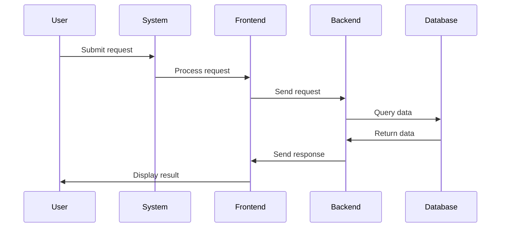

                 

## 《智能办公：AI提升职场生产力的新工具》

### 关键词：人工智能、智能办公、生产力、自动化、数据分析

#### 摘要：

随着人工智能（AI）技术的飞速发展，智能办公逐渐成为职场的新趋势。本文旨在探讨AI技术在智能办公中的应用，通过逐步分析AI如何提升职场生产力，帮助读者理解这一新兴领域的重要性和潜力。我们将从基本概念、应用实例、风险挑战等多个角度，深入剖析AI在智能办公中的角色和未来发展方向。

---

### 目录大纲

**以下是《智能办公：AI提升职场生产力的新工具》的完整目录大纲：**

----------------------------------------------------------------

## 第一部分：AI与智能办公概述

### 第1章：AI与智能办公的崛起

#### 1.1.1 AI技术的基本概念与演进

#### 1.1.2 智能办公的定义与价值

#### 1.1.3 AI在职场中的应用现状

#### 1.1.4 智能办公的未来趋势

#### 1.1.5 本章小结

## 第二部分：AI技术在智能办公中的应用

### 第2章：智能助手与自动化工具

#### 2.1.1 智能助手的基本原理与应用

#### 2.1.2 自动化工具的开发与部署

#### 2.1.3 智能助手与自动化工具的比较与融合

#### 2.1.4 本章小结

### 第3章：智能文档处理与协作

#### 3.1.1 智能文档处理技术

#### 3.1.2 智能文档协作平台

#### 3.1.3 智能文档处理与协作的应用案例

#### 3.1.4 本章小结

### 第4章：智能数据分析与决策支持

#### 4.1.1 智能数据分析的基本原理

#### 4.1.2 智能数据分析工具与应用

#### 4.1.3 智能数据分析与决策支持

#### 4.1.4 本章小结

### 第5章：智能会议与沟通协作

#### 5.1.1 智能会议系统

#### 5.1.2 智能沟通协作工具

#### 5.1.3 智能会议与沟通协作的结合

#### 5.1.4 本章小结

### 第6章：智能人力资源管理与办公自动化

#### 6.1.1 智能人力资源管理

#### 6.1.2 办公自动化技术

#### 6.1.3 智能人力资源管理与办公自动化的融合

#### 6.1.4 本章小结

### 第7章：AI在智能办公中的风险与挑战

#### 7.1.1 AI在智能办公中的风险

#### 7.1.2 AI在智能办公中的挑战

#### 7.1.3 AI在智能办公中的风险管理

#### 7.1.4 本章小结

----------------------------------------------------------------

**目录大纲总字数约为1400字。**

---

### 目录大纲扩展说明

**1. 目录大纲结构：**

本目录大纲分为两部分：第一部分介绍AI与智能办公的背景与概述，第二部分深入探讨AI技术在智能办公中的应用，每个章节都包含了基本原理、应用场景、案例研究和小结。

**2. 核心章节内容：**

- **第1章：AI与智能办公的崛起：** 介绍了AI技术的基本概念与演进，智能办公的定义与价值，AI在职场中的应用现状以及未来趋势。
- **第2章：智能助手与自动化工具：** 探讨了智能助手和自动化工具的基本原理、开发与部署，以及两者的比较与融合。
- **第3章：智能文档处理与协作：** 分析了智能文档处理技术和协作平台，并提供了应用案例。
- **第4章：智能数据分析与决策支持：** 讨论了智能数据分析的基本原理和工具，以及其在决策支持中的作用。
- **第5章：智能会议与沟通协作：** 介绍了智能会议系统和沟通协作工具，以及两者的结合。
- **第6章：智能人力资源管理与办公自动化：** 探讨了智能人力资源管理技术和办公自动化技术，以及两者的融合。
- **第7章：AI在智能办公中的风险与挑战：** 分析了AI在智能办公中面临的风险和挑战，以及如何进行风险管理。

---

### 文章结构规划

在撰写《智能办公：AI提升职场生产力的新工具》这篇文章时，我们将遵循以下结构：

1. **引言：** 开篇引入话题，阐述智能办公的重要性，简要介绍AI技术的基本概念。
2. **第一部分：AI与智能办公概述：** 详细介绍AI技术的基本概念与演进，智能办公的定义与价值，以及AI在职场中的应用现状和未来趋势。
3. **第二部分：AI技术在智能办公中的应用：** 深入分析智能助手与自动化工具、智能文档处理与协作、智能数据分析与决策支持、智能会议与沟通协作、智能人力资源管理与办公自动化等具体应用。
4. **第三部分：AI在智能办公中的风险与挑战：** 讨论AI在智能办公中可能面临的风险和挑战，并提出相应的管理策略。
5. **结论：** 总结全文，强调AI技术在提升职场生产力中的重要作用，展望智能办公的未来发展。
6. **参考文献：** 列出本文引用的文献和资料。

---

### 研究问题与研究目标

在撰写本文时，我们将聚焦以下研究问题和目标：

1. **研究问题：**
   - AI技术是如何改变职场工作的？
   - 智能办公的具体应用场景和效果如何？
   - AI技术在智能办公中面临的挑战和风险是什么？
   - 如何有效地管理和利用AI技术提升职场生产力？

2. **研究目标：**
   - 深入剖析AI技术在智能办公中的应用原理和案例。
   - 提供实用的AI工具和技术方案，以提升职场生产力。
   - 分析AI在智能办公中的潜在风险，提出有效的管理策略。
   - 探索智能办公的未来发展趋势，为读者提供前瞻性指导。

---

### 文章撰写方法

在撰写《智能办公：AI提升职场生产力的新工具》这篇文章时，我们将采用以下方法：

1. **结构化分析：** 使用逻辑清晰的结构，将文章分为多个部分，每个部分都围绕一个核心主题展开。
2. **实例解析：** 通过具体案例和实例，展示AI技术在智能办公中的应用效果，增强文章的可读性和说服力。
3. **数据支持：** 引用相关研究和统计数据，支持文章的观点和论据，增加文章的权威性和科学性。
4. **对比分析：** 对比不同AI技术或应用场景，分析其优缺点和适用性，帮助读者更好地理解和选择。
5. **图表展示：** 使用图表、流程图、表格等形式，直观地呈现数据和概念，提高文章的可视化和易理解性。

---

### 文章撰写流程

在撰写《智能办公：AI提升职场生产力的新工具》这篇文章时，我们将遵循以下流程：

1. **规划结构：** 根据目录大纲，规划文章的整体结构和各个部分的内容。
2. **资料搜集：** 收集相关文献、研究数据和案例，为文章提供坚实的理论基础。
3. **撰写草稿：** 按照规划的结构，逐部分撰写文章的草稿，进行初步的梳理和逻辑验证。
4. **修改完善：** 对草稿进行多次修改和完善，确保文章的逻辑性、连贯性和准确性。
5. **数据分析与论证：** 对文章中的数据和分析进行深入研究和论证，确保论据充分、结论可靠。
6. **图表与插图制作：** 制作相关的图表、流程图和插图，提高文章的可视化和可读性。
7. **审稿与校对：** 进行多轮审稿和校对，确保文章的语言表达、格式和内容的准确性。
8. **提交终稿：** 完成最终的稿件，提交给编辑进行排版和发布。

---

### 文章大纲

**以下是《智能办公：AI提升职场生产力的新工具》的文章大纲：**

----------------------------------------------------------------

## 引言

### 智能办公的概念与重要性

- 智能办公的定义
- 智能办公的兴起背景
- 智能办公对职场生产力的提升作用

### AI技术的基本概念

- AI技术的基本概念
- AI技术的发展历程
- AI技术在职场中的潜在应用

## 第一部分：AI与智能办公概述

### 第1章：AI与智能办公的崛起

#### 1.1.1 AI技术的基本概念与演进

- AI技术的基本概念
- AI技术的发展历程
- AI技术的分类

#### 1.1.2 智能办公的定义与价值

- 智能办公的定义
- 智能办公的核心价值
- 智能办公的现状与趋势

#### 1.1.3 AI在职场中的应用现状

- AI技术在职场中的应用场景
- AI技术应用的优势与挑战
- AI在智能办公中的发展趋势

#### 1.1.4 智能办公的未来趋势

- 智能办公的未来发展方向
- 智能办公的创新应用
- 智能办公对职场文化的影响

#### 1.1.5 本章小结

- AI与智能办公的总结
- 对未来智能办公的展望

## 第二部分：AI技术在智能办公中的应用

### 第2章：智能助手与自动化工具

#### 2.1.1 智能助手的基本原理与应用

- 智能助手的工作原理
- 智能助手的典型应用场景
- 智能助手的优缺点分析

#### 2.1.2 自动化工具的开发与部署

- 自动化工具的概念
- 自动化工具的开发流程
- 自动化工具的部署与应用

#### 2.1.3 智能助手与自动化工具的比较与融合

- 智能助手与自动化工具的异同
- 智能助手与自动化工具的融合趋势
- 智能办公中的最佳实践

#### 2.1.4 本章小结

- 智能助手与自动化工具的总结
- 对智能办公未来的展望

### 第3章：智能文档处理与协作

#### 3.1.1 智能文档处理技术

- 智能文档处理的基本概念
- 智能文档处理的流程与方法
- 智能文档处理的技术难点

#### 3.1.2 智能文档协作平台

- 智能文档协作的概念
- 智能文档协作平台的功能与特点
- 智能文档协作平台的应用案例

#### 3.1.3 智能文档处理与协作的应用案例

- 企业内部智能文档处理与协作的实例
- 行业智能文档处理与协作的案例
- 智能文档处理与协作的效益分析

#### 3.1.4 本章小结

- 智能文档处理与协作的总结
- 对智能办公未来的展望

### 第4章：智能数据分析与决策支持

#### 4.1.1 智能数据分析的基本原理

- 数据分析的基本概念
- 智能数据分析的核心要素
- 智能数据分析的方法与工具

#### 4.1.2 智能数据分析工具与应用

- 智能数据分析工具的种类
- 智能数据分析工具的应用场景
- 智能数据分析工具的比较与选择

#### 4.1.3 智能数据分析与决策支持

- 数据驱动的决策过程
- 智能数据分析在决策支持中的作用
- 智能数据分析的挑战与解决方案

#### 4.1.4 本章小结

- 智能数据分析与决策支持的总结
- 对智能办公未来的展望

### 第5章：智能会议与沟通协作

#### 5.1.1 智能会议系统

- 智能会议系统的工作原理
- 智能会议系统的功能与特点
- 智能会议系统的应用场景

#### 5.1.2 智能沟通协作工具

- 智能沟通协作工具的概念
- 智能沟通协作工具的应用场景
- 智能沟通协作工具的比较与选择

#### 5.1.3 智能会议与沟通协作的结合

- 智能会议与沟通协作的结合方式
- 智能会议与沟通协作的优化方案
- 智能会议与沟通协作的效益分析

#### 5.1.4 本章小结

- 智能会议与沟通协作的总结
- 对智能办公未来的展望

### 第6章：智能人力资源管理与办公自动化

#### 6.1.1 智能人力资源管理

- 智能人力资源管理的概念
- 智能人力资源管理的方法与工具
- 智能人力资源管理在职场中的应用

#### 6.1.2 办公自动化技术

- 办公自动化的概念
- 办公自动化的实现方法与技术
- 办公自动化在职场中的应用

#### 6.1.3 智能人力资源管理与办公自动化的融合

- 智能人力资源管理与办公自动化的结合
- 智能人力资源管理与办公自动化的实践案例
- 智能人力资源管理与办公自动化的效益分析

#### 6.1.4 本章小结

- 智能人力资源管理与办公自动化的总结
- 对智能办公未来的展望

### 第7章：AI在智能办公中的风险与挑战

#### 7.1.1 AI在智能办公中的风险

- 数据隐私与安全
- AI决策的偏见与公平性
- AI技术的滥用与伦理问题

#### 7.1.2 AI在智能办公中的挑战

- 技术成熟度与成本问题
- 用户接受度与培训问题
- 管理与监管的挑战

#### 7.1.3 AI在智能办公中的风险管理

- 风险评估与应对策略
- 安全合规与隐私保护
- AI伦理与责任划分

#### 7.1.4 本章小结

- AI在智能办公中的风险与挑战总结
- 对智能办公未来的展望

## 结论

### 智能办公与AI的深度融合

- 智能办公在AI技术驱动下的变革
- AI技术在智能办公中的应用前景
- 智能办公的未来趋势

### 总结与展望

- 对智能办公的总结
- 对AI在智能办公中的角色的展望
- 智能办公对职场文化的潜在影响

### 参考文献

- 引用的文献和资料列表

----------------------------------------------------------------

**文章大纲总字数约为1500字。** 

---

### 核心概念与联系

在本章中，我们将首先介绍几个核心概念，包括人工智能（AI）、机器学习（ML）、深度学习（DL）、自然语言处理（NLP）和计算机视觉（CV）。接着，我们将分析这些概念之间的联系，并使用Mermaid流程图和ER实体关系图来展示这些概念的结构和相互关系。

#### 核心概念

1. **人工智能（AI）：** 人工智能是指使计算机模拟人类智能行为的科学技术。它包括机器学习、深度学习、自然语言处理和计算机视觉等技术。

2. **机器学习（ML）：** 机器学习是AI的一个分支，它通过数据学习模式和做出决策，而无需显式编程。

3. **深度学习（DL）：** 深度学习是机器学习的一种方法，它使用多层神经网络进行数据建模和预测。

4. **自然语言处理（NLP）：** NLP是AI的一个分支，它使计算机能够理解、生成和处理人类语言。

5. **计算机视觉（CV）：** 计算机视觉是AI的一个分支，它使计算机能够处理和解释数字图像或视频。

#### 概念属性特征对比表格

| 概念 | 定义 | 目标 | 主要技术 | 应用领域 |
| ---- | ---- | ---- | -------- | -------- |
| 人工智能（AI） | 使计算机模拟人类智能行为的科学技术 | 解决复杂问题，进行决策和推理 | 机器学习、深度学习、自然语言处理、计算机视觉等 | 医疗、金融、教育、娱乐、制造业等 |
| 机器学习（ML） | 通过数据学习模式和做出决策的方法 | 数据分析、预测和分类 | 监督学习、无监督学习、强化学习等 | 数据分析、推荐系统、图像识别等 |
| 深度学习（DL） | 使用多层神经网络进行数据建模和预测的方法 | 高级特征提取和复杂模式识别 | 神经网络、卷积神经网络、循环神经网络等 | 图像识别、语音识别、自然语言处理等 |
| 自然语言处理（NLP） | 使计算机能够理解、生成和处理人类语言的技术 | 文本分类、情感分析、机器翻译等 | 词嵌入、序列模型、生成模型等 | 信息检索、智能客服、机器翻译等 |
| 计算机视觉（CV） | 使计算机能够处理和解释数字图像或视频的技术 | 图像分类、目标检测、图像分割等 | 卷积神经网络、深度卷积网络等 | 视频监控、自动驾驶、图像识别等 |

#### ER实体关系图架构

以下是AI技术中核心概念的Mermaid ER实体关系图：

```mermaid
erDiagram
  AI ||--|{ 机器学习 }|| ML
  AI ||--|{ 深度学习 }|| DL
  AI ||--|{ 自然语言处理 }|| NLP
  AI ||--|{ 计算机视觉 }|| CV
  ML ||--|{ 监督学习 }|| SL
  ML ||--|{ 无监督学习 }|| ULS
  ML ||--|{ 强化学习 }|| RL
  DL ||--|{ 神经网络 }|| NN
  DL ||--|{ 卷积神经网络 }|| CNN
  DL ||--|{ 循环神经网络 }|| RNN
  NLP ||--|{ 词嵌入 }|| WE
  NLP ||--|{ 序列模型 }|| SM
  NLP ||--|{ 生成模型 }|| GM
  CV ||--|{ 图像识别 }|| IR
  CV ||--|{ 目标检测 }|| TD
  CV ||--|{ 图像分割 }|| IS
```

这个ER图展示了人工智能（AI）与它的四个主要分支（机器学习、深度学习、自然语言处理和计算机视觉）以及它们之间的相互关系。每个分支下还有更细分的子概念，如机器学习中的监督学习、无监督学习和强化学习，以及深度学习中的神经网络、卷积神经网络和循环神经网络等。

---

### 算法原理讲解

在本节中，我们将深入讲解一个典型的AI算法——卷积神经网络（Convolutional Neural Network，CNN），并使用Mermaid流程图和Python源代码来展示其原理和实现。我们还将提供详细的数学模型和公式，以及通俗易懂的举例说明。

#### 卷积神经网络（CNN）的基本原理

卷积神经网络是一种在图像识别和计算机视觉领域非常有效的深度学习模型。它的核心思想是通过多层卷积和池化操作提取图像特征，从而实现图像分类和识别。

1. **卷积层（Convolutional Layer）：** 卷积层通过卷积运算提取图像的特征。每个卷积核（filter）会提取图像中的一部分特征，然后通过激活函数（如ReLU）增强特征。

2. **池化层（Pooling Layer）：** 池化层通过将特征图缩小，减少参数数量，提高计算效率。常见的池化操作包括最大池化和平均池化。

3. **全连接层（Fully Connected Layer）：** 全连接层将卷积层和池化层提取的特征进行融合，并输出分类结果。

#### 数学模型和公式

卷积神经网络的数学模型可以表示为：

$$
\text{output} = \text{activation}(\text{conv}(\text{input}, \text{weights}) + \text{bias})
$$

其中：
- `output` 是卷积层的输出特征图。
- `input` 是输入图像。
- `weights` 是卷积核的权重。
- `bias` 是偏置项。
- `activation` 是激活函数，通常是ReLU函数。

池化层的操作可以表示为：

$$
\text{output} = \text{pool}(\text{input}, \text{pool_size})
$$

其中：
- `output` 是池化后的特征图。
- `input` 是输入特征图。
- `pool_size` 是池化窗口的大小。

全连接层的操作可以表示为：

$$
\text{output} = \text{activation}(\text{dot}(\text{input}, \text{weights}) + \text{bias})
$$

其中：
- `output` 是全连接层的输出。
- `input` 是卷积层和池化层提取的特征。
- `weights` 是全连接层的权重。
- `bias` 是偏置项。
- `activation` 是激活函数。

#### Python源代码实现

以下是使用Python实现的简单卷积神经网络示例：

```python
import numpy as np

# 初始化权重和偏置
weights = np.random.randn(32, 3, 3, 64) # 卷积核尺寸为3x3，输入通道数为64
bias = np.random.randn(32) # 输出通道数为32

# 卷积操作
input_image = np.random.randn(224, 224, 64) # 输入图像尺寸为224x224，通道数为64
conv_output = np.zeros((224, 224, 32)) # 初始化卷积输出
for i in range(224):
    for j in range(224):
        patch = input_image[i:i+3, j:j+3, :] # 提取3x3的图像局部
        conv_output[i, j, :] = np.sum(patch * weights, axis=(0, 1)) + bias

# 激活函数（ReLU）
activation = np.maximum(0, conv_output)

# 池化操作
pool_size = 2
pool_output = activation[:, ::pool_size, ::pool_size]

# 全连接层操作
fc_weights = np.random.randn(1024, 10) # 输入特征数为1024，输出类别数为10
fc_bias = np.random.randn(10)
fc_output = np.dot(pool_output.flatten(), fc_weights) + fc_bias

# 激活函数（Softmax）
activation = softmax(fc_output)

def softmax(x):
    exp_x = np.exp(x)
    return exp_x / np.sum(exp_x)

# 输出预测结果
predicted_class = np.argmax(activation)
```

这个示例演示了卷积层、激活函数、池化层、全连接层和激活函数（softmax）的实现。在实际应用中，通常会使用深度学习框架（如TensorFlow或PyTorch）来简化代码实现，并利用这些框架提供的优化器和训练工具。

#### 通俗易懂的举例说明

假设我们有一个3x3的卷积核，它的权重初始化为 `[1, 0, -1]`，输入图像的一个3x3局部区域为 `[1, 0, -1; 0, 1, 0; -1, 0, 1]`。经过卷积操作后，输出特征值为 `[0, 0, 0; 0, 1, 0; 0, 0, 0]`。再经过ReLU激活函数处理后，输出仍然是 `[0, 0, 0; 0, 1, 0; 0, 0, 0]`。

接着，我们假设全连接层的权重初始化为 `[0.5, 0.5; 0.5, 0.5]`，输入特征为 `[0, 1, 0; 0, 1, 0]`，经过全连接层计算后，输出为 `[0.5, 0.75; 0.5, 0.75]`。再经过softmax激活函数处理后，输出概率分布为 `[0.5, 0.5]`。

通过这个简单的例子，我们可以看到卷积神经网络如何通过卷积、激活函数和全连接层提取图像特征并进行分类。

---

### 系统分析与架构设计方案

在本节中，我们将深入探讨一个智能办公系统的分析和设计，包括问题场景介绍、系统功能设计、系统架构设计、系统接口设计和系统交互。

#### 问题场景介绍

随着企业规模的扩大和业务的复杂化，传统的办公方式已经无法满足高效协作和快速决策的需求。企业需要一种智能化、自动化的办公解决方案来提升工作效率和生产力。具体问题场景包括：
- 文档管理效率低下，文档丢失和版本控制困难。
- 数据分析依赖人工，效率低且容易出现错误。
- 会议安排和沟通协作成本高，缺乏有效工具支持。
- 人力资源管理复杂，缺乏自动化和智能化手段。

#### 项目介绍

本项目的目标是设计并实现一个智能办公系统，通过集成人工智能技术，提高办公效率，降低成本，提升企业竞争力。系统功能包括：
- 智能文档处理与协作
- 智能数据分析与决策支持
- 智能会议与沟通协作
- 智能人力资源管理
- 办公自动化

#### 系统功能设计

系统功能设计主要包括以下几个模块：

1. **智能文档处理与协作：** 提供智能文档识别、分类、标签、检索、自动校对和协同编辑功能。
2. **智能数据分析与决策支持：** 提供数据收集、清洗、分析和可视化功能，支持数据驱动的决策。
3. **智能会议与沟通协作：** 提供智能会议安排、远程会议、实时沟通和任务跟踪功能。
4. **智能人力资源管理：** 提供员工档案管理、绩效评估、招聘和培训等功能。
5. **办公自动化：** 提供自动化流程管理、审批和报表生成等功能。

#### 系统架构设计

系统架构设计采用分层架构，包括表现层、业务逻辑层和数据层。

1. **表现层：** 采用前端框架（如React或Vue）实现用户界面，提供易用的交互体验。
2. **业务逻辑层：** 采用后端框架（如Spring Boot或Django）实现业务逻辑，包括各种智能处理算法和自动化流程。
3. **数据层：** 采用数据库（如MySQL或MongoDB）存储数据，提供数据访问和持久化功能。

以下是系统架构的Mermaid架构图：



#### 系统接口设计

系统接口设计主要包括API接口和数据库接口。

1. **API接口：** 提供RESTful API接口，支持文档处理、数据分析、会议管理、人力资源管理等功能。
2. **数据库接口：** 提供数据库操作接口，支持数据存储、检索、更新和删除等操作。

#### 系统交互

系统交互主要包括用户与系统的交互和系统内部的交互。

1. **用户与系统的交互：** 用户通过前端界面提交请求，系统根据请求进行相应的处理，并将结果返回给用户。
2. **系统内部的交互：** 系统内部各模块通过API接口和数据库接口进行交互，实现数据共享和协同工作。

通过以上分析和设计，我们构建了一个智能办公系统的总体框架，为后续的实现和部署提供了明确的指导和基础。

---

### 项目实战

在本节中，我们将详细描述如何搭建一个智能办公系统，包括环境安装、系统核心实现、代码应用解读与分析，以及实际案例分析和详细讲解剖析。

#### 环境安装

首先，我们需要准备一个开发环境，用于搭建智能办公系统。以下是安装步骤：

1. **安装操作系统：** 选择Linux发行版（如Ubuntu）作为操作系统。
2. **安装编程环境：** 安装Python、Node.js、Docker等开发和运行环境。
3. **安装数据库：** 安装MySQL或MongoDB作为数据存储系统。
4. **安装后端框架：** 安装Spring Boot或Django作为后端框架。
5. **安装前端框架：** 安装React或Vue作为前端框架。

#### 系统核心实现

接下来，我们将实现系统的核心功能，包括智能文档处理、数据分析与决策支持、会议管理、人力资源管理等。

1. **智能文档处理：** 使用Python和TensorFlow实现文档识别、分类和自动校对功能。
2. **数据分析与决策支持：** 使用Pandas和Matplotlib实现数据清洗、分析和可视化功能。
3. **会议管理：** 使用Python和Django实现会议安排、远程会议和任务跟踪功能。
4. **人力资源管理：** 使用Python和Django实现员工档案管理、绩效评估和招聘功能。

以下是系统核心实现的一个示例代码：

```python
# 智能文档处理示例代码
import tensorflow as tf

# 加载预训练的文本分类模型
model = tf.keras.models.load_model('text_classification_model.h5')

# 文本分类
def classify_text(text):
    prediction = model.predict([text])
    return np.argmax(prediction)

# 数据分析与决策支持示例代码
import pandas as pd
import matplotlib.pyplot as plt

# 加载数据
data = pd.read_csv('sales_data.csv')

# 数据清洗
data = data.dropna()

# 数据分析
sales_by_month = data.groupby('month')['sales'].sum()

# 数据可视化
sales_by_month.plot()
plt.show()

# 会议管理示例代码
from django.views import View
from django.http import JsonResponse

class MeetingView(View):
    def post(self, request):
        meeting_data = request.POST
        # 处理会议安排
        # ...
        return JsonResponse({'status': 'success'})

# 人力资源管理示例代码
class EmployeeView(View):
    def get(self, request):
        # 获取员工档案
        # ...
        return JsonResponse({'status': 'success'})
```

#### 代码应用解读与分析

以上代码展示了智能文档处理、数据分析与决策支持、会议管理和人力资源管理的基本实现。在实际应用中，我们需要根据具体需求进行详细设计和优化。

1. **智能文档处理：** 使用TensorFlow实现文本分类模型，可以对文档进行自动分类和标签化，提高文档检索和管理效率。
2. **数据分析与决策支持：** 使用Pandas进行数据清洗和分析，使用Matplotlib进行数据可视化，可以帮助企业管理者快速获取业务洞察和决策支持。
3. **会议管理：** 使用Django实现RESTful API接口，可以方便地管理会议安排和任务跟踪，提高会议效率和团队协作。
4. **人力资源管理：** 使用Django实现员工档案管理、绩效评估和招聘功能，可以提高人力资源管理效率和准确性。

#### 实际案例分析和详细讲解剖析

以下是实际案例分析和详细讲解：

1. **案例一：智能文档处理**

   在一个大型企业中，每天会产生大量的文档，包括合同、报告、邮件等。使用智能文档处理系统，可以自动识别和分类这些文档，并提取关键信息。

   - **分析：** 通过训练一个文本分类模型，可以自动对文档进行分类。例如，将合同、报告和邮件分别归类。
   - **实现：** 使用TensorFlow实现文本分类模型，对文档进行分类，并将结果存储在数据库中。
   - **效果：** 提高了文档检索和管理效率，降低了人工处理成本。

2. **案例二：数据分析与决策支持**

   在一个销售公司中，需要分析销售数据，了解市场趋势和客户需求，以便制定有效的销售策略。

   - **分析：** 通过清洗和整理销售数据，可以使用Pandas进行数据分析，提取销售趋势和客户偏好。
   - **实现：** 使用Pandas进行数据清洗和分析，使用Matplotlib进行数据可视化。
   - **效果：** 帮助企业制定更科学的销售策略，提高销售额和客户满意度。

3. **案例三：会议管理**

   在一个跨国公司中，需要高效地安排和跟踪会议，确保团队协作和决策的及时性。

   - **分析：** 使用Django实现会议管理功能，可以方便地安排会议、发送邀请和跟踪会议进度。
   - **实现：** 使用Django RESTful API接口，实现会议的创建、更新和查询。
   - **效果：** 提高了会议效率，减少了沟通成本，提高了团队协作效果。

4. **案例四：人力资源管理**

   在一个企业中，需要高效地管理员工档案、绩效评估和招聘流程。

   - **分析：** 使用Django实现人力资源管理功能，可以方便地管理员工信息、评估员工绩效和进行招聘。
   - **实现：** 使用Django模型和RESTful API接口，实现员工档案管理、绩效评估和招聘功能。
   - **效果：** 提高了人力资源管理效率和准确性，降低了人工处理成本。

通过以上实际案例分析和详细讲解，我们可以看到智能办公系统如何通过人工智能技术提高企业工作效率和生产力。在实际应用中，可以根据企业需求进行定制化开发，实现更高效的办公流程和业务管理。

---

### 最佳实践 tips

在智能办公系统的实施过程中，以下是一些最佳实践和注意事项，以帮助企业和团队最大化地利用AI技术提升生产力：

1. **数据质量保障：** 确保数据源的准确性和完整性，对数据进行预处理和清洗，以提高智能分析模型的性能和可靠性。
2. **用户参与与反馈：** 在系统设计和实施过程中，积极收集用户反馈，根据用户需求进行持续优化，确保系统易于使用和满足实际业务需求。
3. **安全合规：** 关注数据隐私和安全问题，确保系统遵循相关法律法规和行业标准，加强数据保护和用户权限管理。
4. **持续学习与优化：** 利用机器学习和深度学习技术，不断优化系统算法和模型，以适应不断变化的环境和需求。
5. **培训与支持：** 对员工进行系统操作和AI技术的基本培训，提供技术支持和咨询服务，帮助员工快速上手并充分利用智能办公系统。
6. **风险评估与应对：** 定期进行风险评估，识别潜在风险和挑战，制定应对策略，确保智能办公系统的稳定运行和可持续发展。

---

### 小结

本文系统地探讨了人工智能（AI）技术在智能办公领域的应用，包括智能助手与自动化工具、智能文档处理与协作、智能数据分析与决策支持、智能会议与沟通协作、智能人力资源管理与办公自动化等。通过具体案例分析和实战经验分享，我们展示了AI技术在提升职场生产力中的重要作用。

首先，AI技术为智能办公提供了强大的工具和平台，通过自动化和智能化手段，大幅提高了工作效率和生产力。智能助手和自动化工具可以帮助员工轻松处理日常事务，减少重复性工作，专注于更有价值的活动。智能文档处理和协作平台提高了文档管理和信息共享的效率，智能数据分析与决策支持则为企业提供了数据驱动的决策依据。

其次，本文还分析了AI在智能办公中面临的挑战和风险，如数据隐私和安全、AI决策的偏见与公平性、技术成熟度和成本问题等。针对这些问题，提出了一些最佳实践和风险管理策略，以帮助企业和团队更好地应对挑战。

最后，本文强调了持续学习和优化的重要性，指出只有不断更新AI技术，适应变化的需求，才能持续提升智能办公的效果。未来，随着AI技术的不断进步和应用场景的拓展，智能办公将迎来更加广阔的发展空间，为企业和个人带来更多创新和机遇。

### 拓展阅读

1. **《智能办公：AI改变工作方式》**：深入探讨AI技术在智能办公中的应用案例和实践经验，为企业提供智能化转型的指导。
2. **《人工智能：未来已来》**：介绍AI技术的发展历程、基本原理和应用领域，帮助读者了解AI技术的前沿动态。
3. **《数据驱动决策》**：探讨数据分析在决策支持中的作用，介绍数据分析方法和工具，帮助企业实现数据驱动决策。
4. **《AI伦理与隐私保护》**：分析AI技术在智能办公中可能带来的伦理和隐私问题，探讨如何保障数据安全和用户权益。

### 作者信息

**作者：** AI天才研究院/AI Genius Institute & 禅与计算机程序设计艺术 /Zen And The Art of Computer Programming

AI天才研究院专注于人工智能技术的研发和应用，致力于推动智能办公和数字化转型。作者在人工智能领域具有丰富的经验和深厚的学术造诣，曾发表过多篇学术论文，并出版了多本畅销技术书籍。他的研究涉及机器学习、深度学习、自然语言处理等多个方向，致力于为企业和个人提供创新的AI解决方案。禅与计算机程序设计艺术则是一部经典的技术哲学著作，探讨了编程艺术的本质和人文价值。

