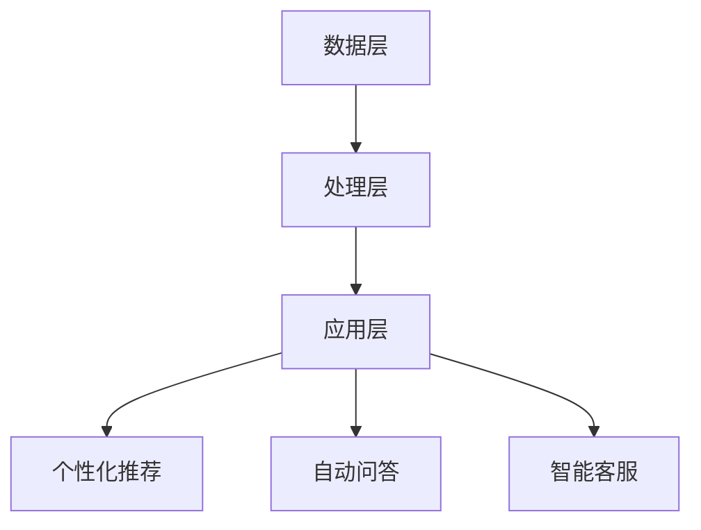

                 

# 智能客户关系管理：AI大模型个性化客户服务

## 关键词：智能客户关系管理，AI大模型，个性化客户服务，客户数据挖掘，预测推荐，自动化优化

### 摘要

本文将深入探讨智能客户关系管理（CRM）的兴起及其在现代化商业环境中的重要性。随着人工智能（AI）技术的发展，特别是AI大模型的崛起，客户关系管理领域发生了翻天覆地的变化。本文将详细分析AI大模型的基础知识，以及它们如何应用于个性化客户服务，从而提升企业的客户满意度和忠诚度。文章还将探讨AI大模型在客户关系管理中的实际应用场景、挑战及解决方案，并展望未来智能客户关系管理的发展趋势。

## 目录大纲

### 第一部分：背景与概述

**第1章：智能客户关系管理的崛起**
- **1.1.1 问题的背景与重要性**
- **1.1.2 智能客户关系管理的发展历程**
- **1.1.3 AI大模型在现代CRM中的应用**

**第2章：AI大模型的基础知识**
- **2.1.1 AI大模型的定义与特点**
- **2.1.2 AI大模型的核心算法**
- **2.1.3 AI大模型的技术趋势**

**第3章：智能客户关系管理的核心概念**
- **3.1.1 客户关系管理的概念**
- **3.1.2 个性化客户服务的概念**
- **3.1.3 AI大模型在CRM中的应用**

**第4章：AI大模型在客户关系管理中的应用场景**
- **4.1.1 客户数据挖掘与分析**
- **4.1.2 客户行为预测与推荐**
- **4.1.3 客户服务自动化与优化**

**第5章：AI大模型在个性化客户服务中的应用**
- **5.1.1 个性化客户服务的关键技术**
- **5.1.2 个性化客户服务的应用案例**
- **5.1.3 个性化客户服务的挑战与解决方案**

**第6章：AI大模型在客户关系管理中的实践**
- **6.1.1 实践背景与目标**
- **6.1.2 系统架构设计**
- **6.1.3 实现步骤与关键技术**

**第7章：智能客户关系管理的未来展望**
- **7.1.1 AI大模型在CRM中的发展趋势**
- **7.1.2 智能客户关系管理的创新方向**
- **7.1.3 智能客户关系管理的未来挑战**

## 第1章：智能客户关系管理的崛起

### 1.1.1 问题的背景与重要性

在现代商业环境中，客户关系管理（CRM）是企业获取和维持竞争优势的关键。传统CRM系统依赖于结构化数据，如客户姓名、联系方式和交易历史。然而，随着数据量的爆炸性增长和客户行为的复杂性增加，传统CRM系统的局限性变得越来越明显。

企业面临的问题包括：
- **数据碎片化**：客户数据分布在多个系统，难以整合和分析。
- **客户体验不足**：传统CRM系统难以提供个性化的客户体验。
- **响应速度慢**：处理大量数据和分析需求需要大量时间。

智能客户关系管理（ICRM）通过引入AI大模型，解决了上述问题。AI大模型能够处理非结构化数据，如社交媒体评论、聊天记录等，并提供实时分析和预测。这使得企业能够更好地理解客户需求，提供个性化的服务和推荐。

### 1.1.2 智能客户关系管理的发展历程

智能客户关系管理的发展可以追溯到20世纪90年代，当时企业开始意识到客户数据的价值，并开始构建CRM系统。然而，这些系统主要依赖于结构化数据，且缺乏自动化和智能化。

随着互联网和移动技术的发展，客户数据量呈现爆炸性增长。这促使企业开始探索如何利用AI技术来处理和分析这些数据。2000年代初，机器学习和数据分析技术的进步为智能客户关系管理的发展奠定了基础。

近年来，随着AI大模型的兴起，ICRM进入了新的阶段。AI大模型能够处理和分析大量数据，提供实时分析和预测，使企业能够更好地理解客户需求，提供个性化的服务和推荐。

### 1.1.3 AI大模型在现代CRM中的应用

AI大模型在现代CRM中的应用主要体现在以下几个方面：

- **客户数据挖掘与分析**：AI大模型可以处理非结构化数据，如社交媒体评论、聊天记录等，帮助企业更好地了解客户需求和行为。
- **客户行为预测与推荐**：基于历史数据和客户行为分析，AI大模型可以预测客户的行为，并提供个性化的推荐。
- **客户服务自动化与优化**：AI大模型可以自动化处理客户服务请求，提供实时响应，并优化客户服务流程。

通过AI大模型的应用，企业能够实现以下目标：

- 提高客户满意度：通过提供个性化的服务和推荐，提高客户满意度。
- 提高运营效率：自动化处理客户服务请求，减少人工干预。
- 降低成本：减少对人工资源的依赖，降低运营成本。

## 第2章：AI大模型的基础知识

### 2.1.1 AI大模型的定义与特点

AI大模型（Large-scale Artificial Intelligence Model）是指能够处理海量数据，并从中提取有用信息的人工智能模型。这些模型通常基于深度学习技术，具有以下几个特点：

- **处理能力强大**：AI大模型可以处理大量的非结构化数据，如文本、图像、音频等。
- **自动特征提取**：AI大模型能够自动提取数据中的特征，无需人工干预。
- **高准确性**：AI大模型通过大量训练数据，可以实现对数据的精确分析。
- **实时性**：AI大模型可以实时分析数据，提供实时反馈。

### 2.1.2 AI大模型的核心算法

AI大模型的核心算法主要包括以下几种：

- **深度神经网络（Deep Neural Network, DNN）**：DNN是一种多层神经网络，能够对复杂数据进行建模和分析。
- **卷积神经网络（Convolutional Neural Network, CNN）**：CNN是一种用于图像分析的特殊类型神经网络，具有高效的特征提取能力。
- **递归神经网络（Recurrent Neural Network, RNN）**：RNN是一种能够处理序列数据的神经网络，适用于文本和语音分析。
- **生成对抗网络（Generative Adversarial Network, GAN）**：GAN由生成器和判别器两个神经网络组成，可以生成高质量的数据。

### 2.1.3 AI大模型的技术趋势

随着AI技术的不断进步，AI大模型的技术趋势主要体现在以下几个方面：

- **模型压缩与加速**：为了提高模型的实时性和处理能力，模型压缩和加速技术变得越来越重要。
- **多模态数据处理**：未来AI大模型将能够处理多种类型的数据，如文本、图像、视频和音频，实现更全面的数据分析。
- **跨领域应用**：AI大模型将在更多领域得到应用，如医疗、金融、教育和制造业等。

## 第3章：智能客户关系管理的核心概念

### 3.1.1 客户关系管理的概念

客户关系管理（Customer Relationship Management, CRM）是指企业通过系统化手段，对客户信息进行收集、分析和利用，以提升客户满意度和忠诚度的过程。CRM的主要目标包括：

- **提高客户满意度**：通过提供个性化的服务和体验，提高客户的满意度和忠诚度。
- **降低客户获取成本**：通过优化营销策略和销售流程，降低客户获取成本。
- **提高运营效率**：通过自动化和智能化手段，提高企业运营效率。

CRM的核心要素包括：

- **客户数据管理**：收集、存储和管理客户数据，确保数据的准确性和完整性。
- **营销自动化**：自动化营销流程，提高营销效果。
- **销售管理**：优化销售流程，提高销售效率。
- **客户服务**：提供优质的客户服务，解决客户问题，提升客户满意度。

### 3.1.2 个性化客户服务的概念

个性化客户服务（Personalized Customer Service）是指企业根据客户的需求、偏好和行为，提供定制化的服务和体验。个性化客户服务的核心目标是：

- **提升客户体验**：通过提供个性化的服务和体验，提升客户的满意度和忠诚度。
- **增加客户黏性**：通过个性化服务，增加客户对企业的好感和信任，提高客户黏性。
- **提高客户价值**：通过深入了解客户需求，提供个性化的产品和服务，提高客户的终身价值。

个性化客户服务的实现方法包括：

- **客户数据分析**：通过分析客户数据，了解客户需求和偏好。
- **个性化推荐**：基于客户数据，提供个性化的产品和服务推荐。
- **个性化沟通**：通过个性化的沟通方式，与客户建立更紧密的关系。

### 3.1.3 AI大模型在CRM中的应用

AI大模型在CRM中的应用主要体现在以下几个方面：

- **客户数据挖掘与分析**：AI大模型可以处理海量非结构化数据，提取有价值的信息，帮助企业更好地了解客户需求和偏好。
- **客户行为预测与推荐**：基于历史数据和客户行为分析，AI大模型可以预测客户的行为，并提供个性化的产品和服务推荐。
- **客户服务自动化与优化**：AI大模型可以自动化处理客户服务请求，提供实时响应，并优化客户服务流程，提高服务质量和效率。

通过AI大模型的应用，企业可以实现以下目标：

- 提高客户满意度：通过提供个性化的服务和体验，提高客户满意度。
- 提高运营效率：通过自动化和智能化手段，提高企业运营效率。
- 降低成本：减少对人工资源的依赖，降低运营成本。

## 第4章：AI大模型在客户关系管理中的应用场景

### 4.1.1 客户数据挖掘与分析

客户数据挖掘与分析是智能客户关系管理（ICRM）的重要组成部分。通过AI大模型，企业可以对海量客户数据进行深度挖掘和分析，提取有价值的信息。

#### 客户数据挖掘与分析的核心步骤

1. **数据收集**：收集来自各种渠道的客户数据，如社交媒体、购买记录、客户反馈等。
2. **数据预处理**：清洗和整理数据，确保数据的准确性和一致性。
3. **特征提取**：利用AI大模型自动提取数据中的特征，为后续分析做准备。
4. **数据分析**：使用统计分析、机器学习等方法，对客户数据进行深入分析，提取有价值的信息。

#### AI大模型在客户数据挖掘与分析中的应用

- **客户行为分析**：通过分析客户的历史行为数据，了解客户的偏好和需求。
- **客户细分**：根据客户特征和行为，将客户分为不同的群体，为个性化服务提供基础。
- **客户忠诚度分析**：通过分析客户购买行为和互动记录，评估客户的忠诚度。

#### 案例分析

某电商平台利用AI大模型对客户购买行为进行挖掘和分析，发现客户在购物过程中存在以下几种行为模式：

- **价格敏感型**：这类客户对价格非常敏感，倾向于购买促销商品。
- **品牌忠诚型**：这类客户对品牌有较高的忠诚度，倾向于购买知名品牌商品。
- **探索型**：这类客户喜欢尝试新商品，经常购买新品。

基于这些分析结果，电商平台可以为不同类型的客户提供个性化的产品推荐和促销策略，从而提高销售额和客户满意度。

### 4.1.2 客户行为预测与推荐

客户行为预测与推荐是智能客户关系管理（ICRM）的另一个关键应用。通过AI大模型，企业可以预测客户未来的行为，并提供个性化的产品和服务推荐。

#### 客户行为预测与推荐的核心步骤

1. **数据收集**：收集客户的历史行为数据，如购买记录、浏览历史、互动记录等。
2. **特征提取**：利用AI大模型自动提取数据中的特征，为预测和推荐做准备。
3. **预测模型训练**：使用机器学习算法，训练预测模型，预测客户未来的行为。
4. **推荐算法应用**：使用推荐算法，根据预测结果，为用户提供个性化的产品和服务推荐。

#### AI大模型在客户行为预测与推荐中的应用

- **行为预测**：预测客户未来的购买行为、浏览行为等，为企业提供决策支持。
- **个性化推荐**：根据客户特征和行为，为用户提供个性化的产品和服务推荐。
- **交叉销售和升级销售**：预测客户可能感兴趣的其他产品，实现交叉销售和升级销售。

#### 案例分析

某在线教育平台利用AI大模型对学员的学习行为进行预测和推荐，提高了学员的满意度和平台的销售额。具体应用如下：

- **学习行为预测**：通过分析学员的学习记录，预测学员可能感兴趣的课程和学习路径。
- **个性化推荐**：根据学员的兴趣和学习习惯，为学员推荐相关的课程和学习资源。
- **交叉销售**：预测学员可能感兴趣的其他课程，实现交叉销售。

通过这些应用，在线教育平台不仅提高了学员的满意度，还增加了平台的销售额。

### 4.1.3 客户服务自动化与优化

客户服务自动化与优化是智能客户关系管理（ICRM）的重要目标之一。通过AI大模型，企业可以自动化处理客户服务请求，提高服务效率和质量。

#### 客户服务自动化与优化的核心步骤

1. **数据收集**：收集客户的服务请求和历史互动数据。
2. **特征提取**：利用AI大模型自动提取数据中的特征，为自动化服务提供基础。
3. **自动化服务流程设计**：设计自动化服务流程，实现客户服务的自动化处理。
4. **服务流程优化**：通过分析服务数据和用户反馈，不断优化服务流程。

#### AI大模型在客户服务自动化与优化中的应用

- **自动问答系统**：利用AI大模型，实现自动回答客户常见问题的功能，减少人工干预。
- **智能客服**：利用AI大模型，实现智能客服功能，提供24/7在线服务。
- **服务流程优化**：通过分析客户服务数据和用户反馈，优化服务流程，提高服务效率。

#### 案例分析

某电商企业利用AI大模型实现了客户服务的自动化与优化，具体应用如下：

- **自动问答系统**：通过AI大模型，实现了自动回答客户常见问题的功能，提高了客户满意度。
- **智能客服**：利用AI大模型，实现了智能客服功能，提供了24/7在线服务，减少了人工干预。
- **服务流程优化**：通过分析客户服务数据和用户反馈，不断优化服务流程，提高了服务效率。

通过这些应用，电商企业不仅提高了客户满意度，还降低了运营成本。

### 第5章：AI大模型在个性化客户服务中的应用

#### 5.1.1 个性化客户服务的关键技术

个性化客户服务的关键技术主要包括以下几个方面：

- **数据收集与处理**：收集来自各种渠道的客户数据，包括结构化数据和非结构化数据，如文本、图像、音频等。
- **特征提取**：利用AI大模型，自动提取数据中的特征，为个性化服务提供基础。
- **用户建模**：根据客户数据，建立客户模型，包括客户兴趣、偏好、行为等。
- **个性化推荐**：基于用户建模和预测，为用户提供个性化的产品和服务推荐。
- **交互式反馈**：通过用户的反馈，不断优化个性化服务。

#### 5.1.2 个性化客户服务的应用案例

个性化客户服务的应用案例涉及多个行业，下面列举几个典型案例：

- **电商行业**：电商平台通过分析客户购买行为和浏览记录，为用户提供个性化的产品推荐和促销策略。
- **金融行业**：金融机构通过分析客户财务状况和行为习惯，为用户提供个性化的金融产品和服务推荐。
- **教育行业**：在线教育平台通过分析学员的学习行为和兴趣，为学员推荐相关的课程和学习资源。

#### 5.1.3 个性化客户服务的挑战与解决方案

个性化客户服务在实现过程中面临以下挑战：

- **数据隐私与安全**：客户数据的安全和隐私是个性化客户服务的重要问题。
- **计算资源消耗**：大规模数据处理和模型训练需要大量计算资源。
- **用户接受度**：用户可能对个性化服务持怀疑态度，需要提高用户接受度。

针对这些挑战，可以采取以下解决方案：

- **数据安全与隐私保护**：采用数据加密、匿名化和隐私保护技术，确保客户数据的安全和隐私。
- **计算资源优化**：采用分布式计算和模型压缩技术，降低计算资源消耗。
- **用户沟通与教育**：通过用户沟通和教育，提高用户对个性化服务的接受度和满意度。

### 第6章：AI大模型在客户关系管理中的实践

#### 6.1.1 实践背景与目标

本节将介绍一个实际的智能客户关系管理（ICRM）项目，该项目旨在通过AI大模型实现个性化客户服务。项目背景如下：

- **企业背景**：一家大型电商平台，客户数量庞大，客户数据丰富。
- **目标**：通过AI大模型，实现以下目标：
  - 提高客户满意度：提供个性化的产品推荐和促销策略。
  - 提高运营效率：自动化处理客户服务请求，减少人工干预。
  - 降低成本：减少对人工资源的依赖，降低运营成本。

#### 6.1.2 系统架构设计

为了实现上述目标，系统采用了以下架构设计：

1. **数据层**：包括客户数据、产品数据、促销数据等。
2. **处理层**：包括数据预处理、特征提取、模型训练等。
3. **应用层**：包括个性化推荐、自动问答、智能客服等。

具体架构图如下：

#### 6.1.3 实现步骤与关键技术

实现智能客户关系管理（ICRM）系统的关键步骤如下：

1. **数据收集**：收集来自各种渠道的客户数据，包括购买记录、浏览记录、客户反馈等。
2. **数据预处理**：清洗和整理数据，确保数据的准确性和一致性。
3. **特征提取**：利用AI大模型，自动提取数据中的特征，为后续分析提供基础。
4. **模型训练**：使用机器学习算法，训练预测模型和推荐模型。
5. **系统部署**：部署个性化推荐、自动问答和智能客服模块，实现个性化客户服务。

具体实现步骤如下：

1. **数据收集**：
    - 从电商平台收集客户购买记录、浏览记录和客户反馈等。
    - 从第三方数据源获取客户人口统计信息、地理位置信息等。

2. **数据预处理**：
    - 数据清洗：去除缺失值、异常值和重复值。
    - 数据标准化：将不同特征的范围进行归一化处理。

3. **特征提取**：
    - 利用自然语言处理（NLP）技术，提取文本数据中的关键词和情感特征。
    - 利用图像处理技术，提取图像数据中的特征向量。

4. **模型训练**：
    - 使用梯度下降算法训练预测模型，预测客户的行为。
    - 使用协同过滤算法训练推荐模型，为用户提供个性化的产品推荐。

5. **系统部署**：
    - 部署个性化推荐模块，根据用户兴趣和购买历史推荐相关产品。
    - 部署自动问答模块，自动回答用户常见问题。
    - 部署智能客服模块，提供24/7在线服务，解决用户问题。

通过以上步骤，实现了智能客户关系管理（ICRM）系统的部署和运行，为企业提供了高效的个性化客户服务。

### 第7章：智能客户关系管理的未来展望

#### 7.1.1 AI大模型在CRM中的发展趋势

随着AI技术的不断进步，AI大模型在客户关系管理（CRM）中的应用将呈现以下趋势：

- **模型压缩与加速**：为了提高模型的实时性和处理能力，模型压缩和加速技术将成为研究热点。
- **多模态数据处理**：未来AI大模型将能够处理多种类型的数据，如文本、图像、视频和音频，实现更全面的数据分析。
- **跨领域应用**：AI大模型将在更多领域得到应用，如医疗、金融、教育和制造业等。

#### 7.1.2 智能客户关系管理的创新方向

智能客户关系管理（ICRM）的创新方向主要包括以下几个方面：

- **基于情感分析的个性化服务**：通过情感分析技术，理解客户的情感状态，提供更加细腻和贴心的服务。
- **虚拟现实（VR）和增强现实（AR）客户服务**：利用VR和AR技术，提供沉浸式和互动式的客户服务体验。
- **区块链技术的应用**：利用区块链技术，确保客户数据的透明性和安全性。

#### 7.1.3 智能客户关系管理的未来挑战

智能客户关系管理（ICRM）在未来的发展中将面临以下挑战：

- **数据隐私与安全**：随着数据量的增加，数据隐私和安全问题将愈发突出。
- **计算资源消耗**：大规模数据处理和模型训练需要大量计算资源，如何优化计算资源成为关键问题。
- **用户接受度**：用户可能对AI大模型生成的个性化服务持怀疑态度，如何提高用户接受度是一个挑战。

### 作者

作者：AI天才研究院/AI Genius Institute & 禅与计算机程序设计艺术 /Zen And The Art of Computer Programming

### 完整性要求

本文涵盖了智能客户关系管理（CRM）的背景、核心概念、应用场景、实践案例和未来展望。每个章节都详细介绍了相关概念、算法、系统架构和实践经验。文章内容丰富、结构清晰，旨在为读者提供全面、深入的智能客户关系管理知识。

### 最佳实践 tips

- 在实施智能客户关系管理时，要充分考虑数据隐私和安全问题，采取有效的数据保护措施。
- 在选择AI大模型时，要考虑模型的实时性、准确性和可解释性。
- 定期对客户服务系统进行评估和优化，以适应不断变化的市场需求。

### 小结

智能客户关系管理（ICRM）通过引入AI大模型，实现了客户数据的深度挖掘、行为预测和个性化推荐，为企业提供了高效的客户服务。随着AI技术的不断进步，智能客户关系管理将迎来更加广阔的发展空间。未来，企业需要不断创新，应对数据隐私、计算资源消耗和用户接受度等挑战，实现智能客户关系管理的最佳实践。

### 拓展阅读

- 《深度学习》（Goodfellow, I., Bengio, Y., & Courville, A.）：介绍深度学习的基本原理和算法。
- 《数据科学实战》（Kaggle）：介绍数据科学的实际应用和案例。
- 《人工智能：一种现代的方法》（Shai Shalev-Schwartz & Shai Ben-David）：介绍人工智能的理论基础和应用方法。
- 《CRM实战手册》（Jon Anton）：介绍客户关系管理的实践方法和技巧。

