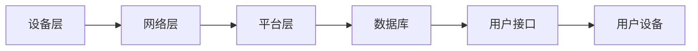

                 

# 智能家居系统架构设计

关键词：智能家居、系统架构、设备层、网络层、平台层、应用层、安全

摘要：随着科技的进步和智能家居市场的迅速发展，智能家居系统架构设计成为了一个热门话题。本文将从背景、核心组成部分、技术挑战和发展趋势等多个方面，系统地探讨智能家居系统架构设计。希望通过本文，读者能对智能家居系统有一个全面而深刻的理解。

### 目录大纲

1. 第一部分：智能家居系统架构设计概述
   - 第1章：智能家居系统背景与现状
     1.1 智能家居的概念与发展历程
     1.2 智能家居系统的重要性
     1.3 智能家居系统的核心组成部分
     1.4 智能家居系统的架构模式
     1.5 本章小结
   - 第2章：设备层技术
     2.1 设备层技术概述
     2.2 设备层的关键技术
     2.3 设备层技术的挑战与发展趋势
     2.4 本章小结
   - 第3章：网络层技术
     3.1 网络层技术概述
     3.2 常见的网络层技术
     3.3 网络层技术的选择与优化
     3.4 本章小结
   - 第4章：平台层技术
     4.1 平台层技术概述
     4.2 常见的平台层技术
     4.3 平台层技术的架构设计
     4.4 本章小结
   - 第5章：应用层技术
     5.1 应用层技术概述
     5.2 常见的应用层技术
     5.3 应用层技术的开发与优化
     5.4 本章小结
   - 第6章：智能家居系统安全与隐私
     6.1 智能家居系统安全概述
     6.2 设备层安全技术
     6.3 网络层安全技术
     6.4 平台层安全技术
     6.5 应用层安全技术
     6.6 本章小结

2. 第二部分：技术实现与实战
   - 第7章：项目实战
     7.1 项目介绍
     7.2 系统功能设计
     7.3 系统架构设计
     7.4 系统接口设计
     7.5 系统交互设计
     7.6 环境安装与核心实现
     7.7 代码应用解读与分析
     7.8 实际案例分析与详细讲解
     7.9 项目小结

3. 第三部分：最佳实践与总结
   - 第8章：最佳实践
     8.1 设计原则
     8.2 技术选型
     8.3 安全策略
     8.4 持续优化
   - 第9章：小结与展望
     9.1 小结
     9.2 拓展阅读
     9.3 未来展望

---

### 1.1 智能家居的概念与发展历程

**智能家居的定义**

智能家居（Smart Home）是指利用物联网技术、云计算和人工智能等技术，将家庭中的各种设备互联互通，实现自动化控制和智能管理的一种家居生活方式。它通过智能设备对家庭环境中的温度、湿度、光照、空气质量等参数进行实时监测和控制，从而提升居住的舒适度、安全性和节能性。

**智能家居的发展历程**

智能家居的概念最早可以追溯到20世纪80年代。当时，随着计算机技术的迅猛发展，人们开始尝试将计算机应用于家庭中，例如通过计算机控制家庭电器和照明设备。这一时期，智能家居的概念更多是作为一个未来愿景而存在。

进入21世纪，随着物联网技术的发展，智能家居开始进入实际应用阶段。2005年，英国BT公司推出了第一款智能家庭控制系统，标志着智能家居进入了商业化的初期。此后的几年中，随着传感器技术、无线通信技术、云计算和人工智能技术的不断进步，智能家居逐渐普及，成为了现代家居生活中不可或缺的一部分。

**智能家居的现状**

当前，智能家居市场呈现出快速发展的态势。根据市场研究公司的数据，全球智能家居市场规模将从2019年的417亿美元增长到2026年的1488亿美元，年复合增长率达到22.5%。这一增长趋势主要受到以下几个方面因素的影响：

1. **技术进步**：物联网技术、传感器技术、无线通信技术等技术的不断进步，为智能家居的发展提供了强大的技术支撑。
2. **政策支持**：各国政府纷纷出台相关政策，鼓励智能家居的研发和应用，推动智能家居市场的快速发展。
3. **消费者需求**：随着生活水平的提高，消费者对家居舒适度、安全性和节能性的要求越来越高，智能家居正逐步成为消费者的首选。

### 1.2 智能家居系统的重要性

**对个人生活的影响**

智能家居系统对个人生活的影响是深远且多方面的。首先，它极大地提升了居住的舒适度。通过智能设备对家庭环境的实时监测和控制，用户可以随时随地调整室内温度、湿度、光照等参数，创造一个舒适的居住环境。其次，智能家居系统提高了家庭的安全性。例如，通过智能摄像头和报警系统，用户可以实时监控家庭的安全情况，一旦发生异常，系统会立即发出警报，提醒用户采取相应的措施。

此外，智能家居系统还大大提升了家庭的节能性。通过智能设备对能源的精细化管理，用户可以实现能量的有效利用，减少能源消耗，从而降低生活成本。

**对社会经济的贡献**

智能家居系统不仅对个人生活产生重大影响，也对社会经济产生了积极的贡献。首先，智能家居系统推动了相关产业的发展。随着智能家居市场的不断扩大，传感器、通信设备、云计算、人工智能等领域的需求不断增加，促进了这些产业的繁荣发展。

其次，智能家居系统提高了社会的生产效率。通过智能家居系统，企业可以实现生产过程的智能化和自动化，降低生产成本，提高生产效率。例如，智能工厂中的设备可以通过物联网技术实现远程监控和控制，从而实现生产的自动化和智能化。

**安全隐患与挑战**

虽然智能家居系统给人们的生活带来了诸多便利，但同时也带来了一定的安全隐患和挑战。首先，智能家居系统涉及大量的个人信息和数据。这些数据一旦泄露，可能会给用户带来严重的隐私泄露风险。其次，智能家居系统中的设备种类繁多，不同设备之间的通信协议和数据格式可能不一致，这给系统的安全性和稳定性带来了挑战。

此外，智能家居系统还需要面对网络攻击的风险。由于智能家居系统通常连接到互联网，黑客可以通过网络入侵智能家居系统，控制家庭设备，甚至对用户进行勒索。因此，智能家居系统的安全性是当前亟待解决的问题。

### 1.3 智能家居系统的核心组成部分

**设备层**

设备层是智能家居系统的底层，由各种智能设备组成，如智能灯泡、智能插座、智能摄像头、智能门锁等。这些设备通过传感器和执行器对家庭环境进行实时监测和控制。

**网络层**

网络层负责连接设备层和平台层，实现设备之间的数据传输和通信。常见的网络层技术包括Wi-Fi、Zigbee、Z-Wave等。

**平台层**

平台层是智能家居系统的核心，负责处理和分析设备层传输的数据，并实现对智能家居设备的统一管理和控制。常见的平台层技术包括HomeKit、Google Assistant、Alexa等。

**应用层**

应用层是智能家居系统的外部接口，用户通过智能手机、平板电脑等终端设备，实现对智能家居系统的远程控制和操作。

### 1.4 智能家居系统的架构模式

**中心化架构**

中心化架构以一个中心化的服务器为核心，所有设备和用户都通过这个服务器进行通信和数据交换。中心化架构的优点是实现简单，易于管理和维护。但缺点是系统的扩展性较差，一旦中心化服务器出现故障，整个系统将瘫痪。

**去中心化架构**

去中心化架构通过分布式网络实现设备之间的直接通信和数据交换，不需要依赖中心化的服务器。去中心化架构的优点是系统扩展性强，可靠性高，但缺点是实现复杂，管理和维护难度大。

**混合架构**

混合架构结合了中心化架构和去中心化架构的优点，通过中心化和去中心化相结合的方式，实现智能家居系统的可靠性和扩展性的优化。例如，设备层和平台层采用中心化架构，而网络层采用去中心化架构。

### 1.5 本章小结

本章对智能家居系统的背景、现状、重要性、核心组成部分以及架构模式进行了详细的介绍。通过本章的学习，读者可以了解到智能家居系统的发展历程，掌握智能家居系统的核心组成部分和架构模式，为后续章节的学习打下基础。

---

### 2.1 设备层技术概述

**设备层技术的定义与分类**

设备层技术是智能家居系统的底层技术，主要涉及智能设备的硬件和软件设计。设备层技术可以分为以下几类：

1. **传感器技术**：用于采集家庭环境中的各种参数，如温度、湿度、光照、空气质量等。
2. **通信技术**：用于实现设备之间的数据传输和通信，常见的通信技术有Wi-Fi、Zigbee、Z-Wave等。
3. **电源管理技术**：用于优化设备的电源使用，延长设备的使用寿命。
4. **数据处理技术**：用于对采集到的数据进行分析和处理，为平台层提供有用的信息。

**设备层的关键技术**

1. **传感器技术**

传感器技术是设备层技术的基础，主要用于采集家庭环境中的各种参数。常见的传感器有温度传感器、湿度传感器、光照传感器、空气质量传感器等。传感器技术的关键在于如何提高传感器的精度、稳定性和响应速度。

2. **通信技术**

通信技术是设备层技术的关键，它决定了设备之间的数据传输速度和通信可靠性。常见的通信技术有Wi-Fi、Zigbee、Z-Wave、蓝牙等。每种通信技术都有其优缺点，需要根据具体的应用场景进行选择。

3. **电源管理技术**

电源管理技术是设备层技术的重要一环，它关系到设备的使用寿命和能源效率。常见的电源管理技术有电池管理、电源转换、能量采集等。电源管理技术的关键在于如何优化电源的使用，延长设备的使用寿命。

4. **数据处理技术**

数据处理技术是对采集到的数据进行分析和处理，为平台层提供有用的信息。数据处理技术主要包括数据清洗、数据分析和数据挖掘等。数据处理技术的关键在于如何高效地处理大量数据，提取有价值的信息。

**设备层技术的挑战与发展趋势**

1. **挑战**

设备层技术面临以下挑战：

- **数据准确性**：如何提高传感器的精度和稳定性，确保数据准确性。
- **通信可靠性**：如何在复杂的家庭环境中实现稳定的数据传输。
- **能源效率**：如何优化电源管理技术，延长设备的使用寿命。
- **数据处理能力**：如何高效地处理大量数据，提取有价值的信息。

2. **发展趋势**

设备层技术未来的发展趋势包括：

- **传感器技术的进步**：随着微电子技术的发展，传感器的精度、稳定性和响应速度将不断提高。
- **通信技术的革新**：新型通信技术，如5G和Li-Fi，将进一步提升通信速度和通信可靠性。
- **电源管理技术的优化**：新型电源管理技术，如能量采集和无线充电，将进一步提高能源效率。
- **数据处理技术的提升**：大数据和人工智能技术的应用，将进一步提高数据处理能力，为智能家居系统提供更智能的决策支持。

### 2.2 设备层技术的分类

**传感器技术**

传感器技术是设备层技术的重要组成部分，用于采集家庭环境中的各种参数。常见的传感器有：

- **温度传感器**：用于检测环境温度，常见的有热敏电阻、热电偶等。
- **湿度传感器**：用于检测环境湿度，常见的有电容式湿度传感器、电阻式湿度传感器等。
- **光照传感器**：用于检测环境光照强度，常见的有光敏电阻、光敏二极管等。
- **空气质量传感器**：用于检测空气中的颗粒物、有害气体等，常见的有PM2.5传感器、甲醛传感器等。

**通信技术**

通信技术是实现设备之间数据传输和通信的关键，常见的通信技术有：

- **Wi-Fi**：无线局域网技术，通信速度快，但功耗较高。
- **Zigbee**：低功耗无线个人区域网络技术，通信距离较短，但功耗低，适合家居环境。
- **Z-Wave**：低功耗无线通信技术，通信距离较远，但功耗较高。
- **蓝牙**：短距离无线通信技术，通信速度较快，但功耗较高。

**电源管理技术**

电源管理技术是设备层技术的重要一环，用于优化设备的电源使用，延长设备的使用寿命。常见的电源管理技术有：

- **电池管理**：对电池进行智能管理，提高电池的利用效率。
- **电源转换**：将交流电转换为直流电，为设备提供稳定的电源。
- **能量采集**：利用太阳能、风能等可再生能源，为设备提供能源。

**数据处理技术**

数据处理技术是对采集到的数据进行分析和处理，为平台层提供有用的信息。常见的数据处理技术有：

- **数据清洗**：去除数据中的噪声和错误，提高数据的准确性。
- **数据分析**：对数据进行统计分析和模式识别，提取有价值的信息。
- **数据挖掘**：从大量数据中挖掘潜在的关联和规律，为智能家居系统提供智能决策支持。

### 2.3 设备层技术的挑战与发展趋势

**挑战**

设备层技术面临以下挑战：

1. **数据准确性**：如何提高传感器的精度和稳定性，确保数据准确性。
2. **通信可靠性**：如何在复杂的家庭环境中实现稳定的数据传输。
3. **能源效率**：如何优化电源管理技术，延长设备的使用寿命。
4. **数据处理能力**：如何高效地处理大量数据，提取有价值的信息。

**发展趋势**

设备层技术未来的发展趋势包括：

1. **传感器技术的进步**：随着微电子技术的发展，传感器的精度、稳定性和响应速度将不断提高。
2. **通信技术的革新**：新型通信技术，如5G和Li-Fi，将进一步提升通信速度和通信可靠性。
3. **电源管理技术的优化**：新型电源管理技术，如能量采集和无线充电，将进一步提高能源效率。
4. **数据处理技术的提升**：大数据和人工智能技术的应用，将进一步提高数据处理能力，为智能家居系统提供更智能的决策支持。

### 2.4 本章小结

本章对设备层技术进行了详细的介绍，包括其定义、分类、关键技术、挑战与发展趋势。通过本章的学习，读者可以了解设备层技术在智能家居系统中的重要性，掌握设备层技术的核心概念和实现方法，为后续章节的学习打下基础。

---

### 3.1 网络层技术概述

**网络层技术的定义与作用**

网络层技术是智能家居系统的关键组成部分，主要负责实现设备之间的数据传输和通信。网络层技术的作用在于：

1. **实现设备间的互联互通**：通过网络层技术，智能家居系统中的各个设备可以相互通信，共享数据和资源，形成一个完整的智能家居生态。
2. **提供数据传输通道**：网络层技术为设备层提供稳定、可靠的数据传输通道，确保设备能够实时获取和处理数据。
3. **实现系统的分布式控制**：通过网络层技术，智能家居系统可以实现分布式控制，提高系统的扩展性和容错性。

**网络层技术在智能家居系统中的作用**

1. **数据传输**：网络层技术负责将设备层采集到的数据传输到平台层，为平台层提供数据支持。
2. **设备控制**：通过网络层技术，平台层可以实现对设备层的控制，实现对智能家居设备的远程控制和自动化管理。
3. **安全防护**：网络层技术提供了数据传输的安全性保障，通过加密、认证等技术，确保数据在传输过程中的安全性。

### 3.2 常见的网络层技术

**Wi-Fi**

Wi-Fi（无线保真）是一种常见的无线网络技术，广泛应用于智能家居系统中。Wi-Fi技术的优点包括：

1. **传输速度快**：Wi-Fi技术可以提供高速的数据传输，满足设备之间的数据传输需求。
2. **覆盖范围广**：Wi-Fi技术可以覆盖较大的范围，适合大型住宅或办公室的智能家居系统。
3. **兼容性好**：Wi-Fi技术支持多种设备连接，兼容性好，便于系统的扩展和升级。

**Zigbee**

Zigbee是一种低功耗、短距离的无线通信技术，广泛应用于智能家居系统中。Zigbee技术的优点包括：

1. **低功耗**：Zigbee技术具有低功耗的特点，适合电池供电的设备。
2. **可靠性高**：Zigbee技术具有较好的可靠性，能够保证数据传输的稳定性。
3. **网络容量大**：Zigbee技术支持大量的设备连接，适合大型智能家居系统。

**Z-Wave**

Z-Wave是一种低功耗、短距离的无线通信技术，广泛应用于智能家居系统中。Z-Wave技术的优点包括：

1. **传输速度快**：Z-Wave技术可以提供较快的传输速度，满足设备之间的数据传输需求。
2. **网络容量大**：Z-Wave技术支持大量的设备连接，适合大型智能家居系统。
3. **兼容性好**：Z-Wave技术兼容性好，可以与其他智能家居设备无缝集成。

**蓝牙**

蓝牙是一种短距离的无线通信技术，广泛应用于智能家居系统中。蓝牙技术的优点包括：

1. **传输速度快**：蓝牙技术可以提供较快的传输速度，满足设备之间的数据传输需求。
2. **低功耗**：蓝牙技术具有低功耗的特点，适合电池供电的设备。
3. **连接稳定**：蓝牙技术具有较好的连接稳定性，保证数据传输的可靠性。

### 3.3 网络层技术的选择与优化

**选择依据**

在选择网络层技术时，需要考虑以下几个方面：

1. **传输速度**：根据智能家居系统的数据传输需求，选择合适的网络层技术，确保传输速度满足要求。
2. **功耗**：根据智能家居设备的供电方式，选择低功耗的网络层技术，延长设备的使用寿命。
3. **可靠性**：选择具有较高可靠性的网络层技术，保证数据传输的稳定性。
4. **网络容量**：根据智能家居系统的规模，选择能够支持大量设备连接的网络层技术。
5. **兼容性**：选择兼容性好的网络层技术，便于系统的扩展和升级。

**技术优化**

1. **网络拓扑优化**：通过优化网络拓扑结构，提高网络的传输效率和可靠性。例如，采用星型拓扑结构，减少网络节点的传输距离。
2. **信道优化**：通过优化信道分配，减少网络干扰，提高网络的传输速度和可靠性。
3. **加密与认证**：通过加密和认证技术，提高网络传输的安全性，防止数据泄露和恶意攻击。
4. **协议优化**：通过优化网络协议，提高数据传输的效率和可靠性。例如，采用TCP/IP协议，实现可靠的数据传输。

### 3.4 本章小结

本章对网络层技术进行了详细的介绍，包括其定义、作用、常见的网络层技术以及选择与优化策略。通过本章的学习，读者可以了解网络层技术在智能家居系统中的重要性，掌握常见的网络层技术及其优缺点，为智能家居系统的设计和实施提供参考。

---

### 4.1 平台层技术概述

**平台层技术的定义与作用**

平台层技术是智能家居系统的核心组成部分，负责处理和分析设备层传输的数据，并实现对智能家居设备的统一管理和控制。平台层技术的作用包括：

1. **数据处理**：平台层技术负责对设备层传输的数据进行存储、处理和分析，提取有价值的信息，为智能家居系统提供数据支持。
2. **设备管理**：平台层技术负责对智能家居设备进行统一管理，包括设备的信息注册、状态监控、故障诊断等。
3. **用户交互**：平台层技术提供用户与智能家居系统的交互界面，用户可以通过手机、平板电脑等终端设备，实现对智能家居设备的远程控制和操作。

**平台层技术在智能家居系统中的作用**

1. **数据整合**：平台层技术可以将来自不同设备的各种数据进行整合，形成统一的数据视图，为用户提供全面的数据支持。
2. **智能控制**：平台层技术可以实现智能家居设备的自动化控制和智能管理，例如，根据用户的习惯和需求，自动调整室内温度、湿度等参数。
3. **安全防护**：平台层技术可以提供数据传输的安全性保障，通过加密、认证等技术，确保数据在传输过程中的安全性。
4. **扩展性**：平台层技术具有较好的扩展性，可以支持多种设备接入和多种应用场景，方便系统的扩展和升级。

### 4.2 常见的平台层技术

**HomeKit**

HomeKit是苹果公司推出的一款智能家居平台，旨在实现苹果设备与智能家居设备的无缝连接和智能控制。HomeKit的主要特点包括：

1. **安全性**：HomeKit采用安全性较高的加密技术，确保数据传输的安全性和设备的完整性。
2. **易用性**：HomeKit提供了直观的界面和简单易用的控制方式，用户可以通过iPhone、iPad等苹果设备，实现对智能家居设备的远程控制和操作。
3. **设备兼容性**：HomeKit支持多种智能家居设备，包括灯光、温度传感器、门锁等，方便用户进行设备接入和集成。

**Google Assistant**

Google Assistant是谷歌公司推出的一款智能家居平台，旨在通过语音交互，实现智能家居设备的智能控制。Google Assistant的主要特点包括：

1. **智能语音交互**：Google Assistant支持智能语音交互，用户可以通过语音指令，实现对智能家居设备的远程控制和操作。
2. **跨平台支持**：Google Assistant支持多种操作系统，包括Android、iOS等，方便用户在不同设备上进行智能家居控制。
3. **个性化体验**：Google Assistant可以根据用户的习惯和需求，提供个性化的智能家居控制体验。

**Alexa**

Alexa是亚马逊公司推出的一款智能家居平台，旨在通过语音交互，实现智能家居设备的智能控制。Alexa的主要特点包括：

1. **智能语音交互**：Alexa支持智能语音交互，用户可以通过语音指令，实现对智能家居设备的远程控制和操作。
2. **设备兼容性**：Alexa支持多种智能家居设备，包括智能音箱、智能灯泡、智能插座等，方便用户进行设备接入和集成。
3. **集成应用**：Alexa可以与亚马逊的各类应用和服务无缝集成，提供丰富的智能家居控制功能。

**Samsung SmartThings**

Samsung SmartThings是三星公司推出的一款智能家居平台，旨在实现智能家居设备的智能连接和自动化控制。Samsung SmartThings的主要特点包括：

1. **设备兼容性**：Samsung SmartThings支持多种智能家居设备，包括三星和其他品牌的设备，方便用户进行设备接入和集成。
2. **跨平台支持**：Samsung SmartThings支持多种操作系统，包括Android、iOS等，方便用户在不同设备上进行智能家居控制。
3. **智能自动化**：Samsung SmartThings提供了丰富的自动化控制功能，用户可以根据需求和场景，自定义智能自动化规则。

### 4.3 平台层技术的架构设计

**架构设计原则**

平台层技术的架构设计需要遵循以下原则：

1. **模块化**：平台层技术应采用模块化设计，将不同的功能模块分离，便于系统的维护和升级。
2. **分布式**：平台层技术应采用分布式架构，提高系统的扩展性和容错性。
3. **安全性**：平台层技术应采用安全性较高的技术，确保数据传输的安全性和设备的完整性。
4. **兼容性**：平台层技术应具有良好的兼容性，支持多种设备接入和多种应用场景。
5. **易用性**：平台层技术应提供直观的界面和简单易用的控制方式，方便用户进行操作。

**架构设计实例**

以下是一个简单的平台层技术架构设计实例：

1. **设备接入模块**：负责处理设备接入和认证，包括设备的注册、登录、信息更新等功能。
2. **数据处理模块**：负责对设备传输的数据进行存储、处理和分析，提取有价值的信息，为智能家居系统提供数据支持。
3. **用户管理模块**：负责用户管理和权限控制，包括用户的注册、登录、权限分配等功能。
4. **控制模块**：负责实现用户与智能家居设备的交互，包括远程控制、自动化控制等功能。
5. **安全模块**：负责数据传输的安全保障，包括数据加密、认证等技术。

### 4.4 本章小结

本章对平台层技术进行了详细的介绍，包括其定义、作用、常见的平台层技术以及架构设计原则。通过本章的学习，读者可以了解平台层技术在智能家居系统中的重要性，掌握常见的平台层技术及其优缺点，为智能家居系统的设计和实施提供参考。

---

### 5.1 应用层技术概述

**应用层技术的定义与分类**

应用层技术是智能家居系统的最高层，主要负责为用户提供实际的应用场景和功能体验。应用层技术可以按照功能进行分类，主要包括以下几类：

1. **自动化场景**：通过预设的规则和条件，实现家庭设备的自动化控制，提高家居生活的便利性。
2. **安全监控**：通过摄像头、门磁等设备，实现对家庭安全的实时监控，提高家庭的安全保障。
3. **能源管理**：通过智能设备对家庭的能源使用进行监控和管理，实现节能减排，降低能源消耗。
4. **远程控制**：通过互联网和移动设备，实现对家庭设备的远程控制和操作，方便用户随时随地管理家居。
5. **健康监测**：通过智能设备对家庭成员的健康状况进行监测，提供个性化的健康建议和服务。

**应用层技术在智能家居系统中的作用**

1. **提升用户体验**：应用层技术为用户提供了丰富多样的功能，使用户能够更加便捷地控制和管理家庭设备，提升家居生活的体验。
2. **实现智能化**：通过自动化场景和安全监控等应用，智能家居系统能够根据用户的习惯和需求，自动调整设备状态，实现真正的智能化。
3. **提高安全性**：安全监控功能可以实时监控家庭环境，及时发现异常情况，提高家庭的安全保障。
4. **节约能源**：能源管理功能可以通过智能化的能源监控和管理，实现节能减排，降低家庭的能源消耗。
5. **健康服务**：健康监测功能可以为家庭成员提供健康监测和个性化健康建议，提高家庭成员的健康水平。

### 5.2 常见的应用层技术

**自动化场景**

自动化场景是智能家居系统中最常见的应用之一，通过预设的规则和条件，实现家庭设备的自动化控制。常见的自动化场景包括：

1. **回家模式**：当用户回到家时，智能家居系统会自动开启灯光、空调等设备，调整到用户预设的温度和亮度，提供舒适的家居环境。
2. **离家模式**：当用户离家时，智能家居系统会自动关闭灯光、空调等设备，节省能源，提高安全性。
3. **晚上模式**：在晚上，智能家居系统会自动调整灯光的亮度和色温，提供舒适的照明环境，同时关闭不需要的电器设备，提高睡眠质量。

**安全监控**

安全监控是智能家居系统中至关重要的应用，通过摄像头、门磁等设备，实现对家庭安全的实时监控。常见的安全监控功能包括：

1. **实时监控**：通过摄像头，用户可以实时查看家庭的安全状况，了解家庭成员的动态。
2. **移动检测**：当检测到异常移动时，智能家居系统会自动发送警报信息给用户，提醒用户注意安全。
3. **紧急求助**：当发生紧急情况时，用户可以通过智能家居系统一键呼叫紧急求助，通知家庭成员和安保人员。

**能源管理**

能源管理是智能家居系统中的一项重要应用，通过智能设备对家庭的能源使用进行监控和管理，实现节能减排。常见的能源管理功能包括：

1. **能源监控**：通过智能插座、智能电表等设备，用户可以实时了解家庭能源的使用情况，掌握能源消耗的详细信息。
2. **节能模式**：当家庭无人时，智能家居系统会自动关闭不必要的电器设备，节省能源。
3. **能源优化**：通过大数据分析和人工智能技术，智能家居系统可以为用户提供个性化的能源优化建议，帮助用户实现节能减排。

**远程控制**

远程控制是智能家居系统中最实用的应用之一，通过互联网和移动设备，用户可以随时随地控制家庭设备。常见的远程控制功能包括：

1. **远程开关**：用户可以通过手机APP，远程控制家中的灯光、空调、窗帘等设备的开关。
2. **远程调节**：用户可以通过手机APP，远程调节家中设备的温度、亮度、湿度等参数，实现个性化的家居环境。
3. **远程监控**：用户可以通过手机APP，实时查看家庭的安全状况，了解家庭成员的动态。

**健康监测**

健康监测是智能家居系统中的一项新兴应用，通过智能设备对家庭成员的健康状况进行监测，提供个性化的健康建议和服务。常见的健康监测功能包括：

1. **心率监测**：通过智能手环、智能手表等设备，用户可以实时了解自己的心率情况，掌握身体健康状况。
2. **睡眠监测**：通过智能枕头、智能床垫等设备，用户可以了解自己的睡眠质量，为健康生活方式提供数据支持。
3. **健康建议**：通过大数据分析和人工智能技术，智能家居系统可以为用户提供个性化的健康建议，帮助用户改善生活习惯，提高健康水平。

### 5.3 应用层技术的开发与优化

**开发流程**

应用层技术的开发需要遵循以下流程：

1. **需求分析**：明确用户的需求和功能需求，确定智能家居系统需要实现哪些应用层功能。
2. **技术选型**：根据需求分析结果，选择合适的开发技术和平台，包括编程语言、框架、数据库等。
3. **系统设计**：设计系统的架构和接口，明确各个模块的功能和职责，确保系统的稳定性和可扩展性。
4. **编码实现**：根据系统设计，进行编码实现，实现各个功能模块。
5. **测试与优化**：对系统进行功能测试、性能测试和安全测试，发现并修复存在的问题，优化系统的性能和稳定性。
6. **部署上线**：将系统部署到服务器，进行上线发布，供用户使用。

**优化策略**

为了提高应用层技术的性能和用户体验，可以采取以下优化策略：

1. **优化网络通信**：通过优化网络协议和传输策略，提高数据传输的速度和可靠性。
2. **优化数据处理**：通过优化数据处理算法和数据结构，提高数据处理的效率和准确性。
3. **优化界面交互**：通过优化用户界面和交互设计，提高用户的操作体验和满意度。
4. **引入人工智能技术**：通过引入人工智能技术，实现智能家居系统的智能化和个性化，提高系统的智能水平。
5. **优化系统安全性**：通过引入安全防护技术，提高系统的安全性，防止恶意攻击和数据泄露。

### 5.4 本章小结

本章对应用层技术进行了详细的介绍，包括其定义、分类、常见的技术以及开发与优化策略。通过本章的学习，读者可以了解应用层技术在智能家居系统中的重要性，掌握常见的应用层技术及其实现方法，为智能家居系统的设计和实施提供参考。

---

### 6.1 智能家居系统安全概述

**智能家居系统安全的重要性**

随着智能家居技术的普及和应用，智能家居系统已经成为现代家庭生活中不可或缺的一部分。然而，智能家居系统涉及到大量的个人隐私和重要数据，因此其安全性显得尤为重要。智能家居系统安全的重要性体现在以下几个方面：

1. **数据安全**：智能家居系统收集和存储了大量的用户数据，包括家庭环境参数、生活习惯、家庭成员信息等。一旦这些数据泄露，可能会对用户造成严重的隐私泄露和财产损失。
2. **设备安全**：智能家居系统中的设备与互联网连接，容易成为黑客攻击的目标。如果设备安全受到威胁，黑客可能会远程控制设备，甚至破坏家庭安全。
3. **系统安全**：智能家居系统是一个复杂的分布式系统，涉及到多个设备和多个网络。如果系统安全受到威胁，可能会导致整个系统的瘫痪，影响用户的日常生活。

**安全风险分析**

智能家居系统在运行过程中可能会面临以下安全风险：

1. **数据泄露**：由于智能家居系统涉及到大量的用户数据，一旦数据存储和传输过程存在漏洞，可能会导致数据泄露。
2. **设备入侵**：智能家居系统中的设备与互联网连接，如果设备安全措施不足，可能会被黑客入侵，导致设备被恶意控制。
3. **网络攻击**：智能家居系统通常连接到公共网络，容易受到网络攻击，如DDoS攻击、DNS劫持等。
4. **软件漏洞**：智能家居系统中的软件可能存在漏洞，一旦被黑客利用，可能会对系统造成严重的影响。

**安全威胁防范**

为了防范智能家居系统的安全威胁，可以采取以下措施：

1. **数据加密**：对用户数据和设备通信数据进行加密，确保数据在传输过程中的安全性。
2. **设备安全**：对智能家居设备进行安全设置，如设置密码、启用两步验证等，防止设备被恶意控制。
3. **网络安全**：加强网络防护，如使用防火墙、反病毒软件等，防止网络攻击。
4. **软件更新**：及时更新智能家居系统的软件，修复已知漏洞，提高系统的安全性。

**安全策略制定**

为了确保智能家居系统的安全，需要制定一系列的安全策略，包括：

1. **访问控制**：对系统中的不同用户角色设置不同的访问权限，确保用户只能访问授权的资源。
2. **身份认证**：采用多因素身份认证，确保用户的身份真实性。
3. **安全审计**：定期进行安全审计，检查系统的安全漏洞和安全隐患。
4. **应急预案**：制定应急预案，确保在发生安全事件时能够及时应对，减少损失。

### 6.2 设备层安全技术

**传感器安全**

传感器是智能家居系统的重要组成部分，负责采集家庭环境中的各种数据。传感器安全主要包括以下几个方面：

1. **数据加密**：对传感器采集的数据进行加密，确保数据在传输过程中的安全性。
2. **数据完整性**：对传感器采集的数据进行完整性校验，确保数据的准确性。
3. **电源管理**：对传感器进行电源管理，延长传感器的工作寿命，降低设备的故障率。
4. **防护措施**：对传感器进行物理防护，防止传感器被恶意破坏。

**通信安全**

智能家居系统中的设备通过无线通信进行数据传输，通信安全至关重要。通信安全主要包括以下几个方面：

1. **加密传输**：对设备之间的通信数据进行加密，确保数据在传输过程中的安全性。
2. **身份认证**：对通信双方进行身份认证，确保通信的合法性。
3. **安全协议**：采用安全协议，如SSL/TLS等，确保通信的安全性和可靠性。
4. **频率管理**：合理管理无线通信的频率，避免通信干扰。

**电源安全**

智能家居系统中的设备通常采用电池供电，电源安全至关重要。电源安全主要包括以下几个方面：

1. **电池管理**：对电池进行智能管理，延长电池的使用寿命。
2. **充电安全**：对充电过程进行安全控制，防止充电设备损坏和火灾等安全事故。
3. **电源监测**：对电源进行实时监测，确保电源的稳定性和安全性。

### 6.3 网络层安全技术

**防火墙**

防火墙是网络安全的重要手段，用于防止未经授权的访问和攻击。在智能家居系统中，可以采用防火墙来保护系统安全。防火墙的安全功能包括：

1. **访问控制**：根据用户身份和访问权限，控制用户对网络资源的访问。
2. **安全策略**：定义网络访问的安全策略，如允许或拒绝特定的访问请求。
3. **日志记录**：记录网络访问的日志，方便进行安全审计和异常检测。

**入侵检测系统**

入侵检测系统（IDS）是一种用于检测网络攻击和安全威胁的安全设备。在智能家居系统中，可以部署入侵检测系统来监控网络流量，及时发现和阻止攻击。入侵检测系统的功能包括：

1. **异常检测**：检测网络流量中的异常行为，如异常数据包、异常流量等。
2. **攻击检测**：检测网络攻击，如DDoS攻击、网络扫描等。
3. **报警与响应**：对检测到的异常行为和攻击进行报警，并采取相应的响应措施。

**VPN**

虚拟专用网络（VPN）是一种用于安全传输的网络技术，可以在公共网络中建立安全的通信隧道。在智能家居系统中，可以使用VPN来保护设备之间的通信安全。VPN的安全功能包括：

1. **数据加密**：对传输的数据进行加密，确保数据在传输过程中的安全性。
2. **身份认证**：对通信双方进行身份认证，确保通信的合法性。
3. **隐私保护**：保护用户的隐私信息，防止数据泄露。

### 6.4 平台层安全技术

**数据加密**

平台层技术负责处理和分析智能家居设备传输的数据，因此数据加密是平台层安全技术的核心。平台层的数据加密主要包括以下几个方面：

1. **传输加密**：对设备传输的数据进行加密，确保数据在传输过程中的安全性。
2. **存储加密**：对存储在平台服务器中的数据加密，防止数据泄露。
3. **加密算法**：选择合适的加密算法，如AES、RSA等，确保加密的安全性和效率。

**身份认证**

平台层技术需要实现用户和设备之间的身份认证，确保通信的合法性。身份认证主要包括以下几个方面：

1. **用户认证**：对用户进行身份验证，确保用户是合法的用户。
2. **设备认证**：对设备进行认证，确保设备是合法的设备。
3. **多因素认证**：采用多因素认证，如密码、指纹、手机验证码等，提高认证的安全性。

**安全审计**

平台层技术需要实现安全审计功能，记录系统中的操作和事件，方便进行安全分析和追踪。安全审计主要包括以下几个方面：

1. **日志记录**：记录系统中的操作和事件，如用户登录、设备连接、数据访问等。
2. **异常检测**：通过分析日志数据，检测系统中的异常行为和潜在的安全威胁。
3. **报警与响应**：对检测到的异常事件进行报警，并采取相应的响应措施。

### 6.5 应用层安全技术

**应用层技术安全**

应用层技术安全主要关注用户在使用智能家居系统时面临的安全威胁，包括：

1. **应用层攻击**：防止恶意攻击，如SQL注入、跨站脚本攻击（XSS）等。
2. **数据安全**：对用户数据和应用数据进行加密和完整性校验，确保数据安全。
3. **身份认证**：采用多因素认证，确保用户身份的合法性。

**用户隐私保护**

智能家居系统涉及到大量的用户隐私数据，因此用户隐私保护至关重要。用户隐私保护主要包括以下几个方面：

1. **数据收集与使用**：明确数据收集的目的和使用范围，避免过度收集用户数据。
2. **数据存储与传输**：对用户数据加密存储和传输，确保数据在存储和传输过程中的安全性。
3. **隐私政策**：制定详细的隐私政策，告知用户数据收集、存储和使用的情况，确保用户的知情权。

**安全意识与培训**

智能家居系统的安全性不仅依赖于技术手段，还需要用户的安全意识和知识。因此，加强用户的安全意识和培训至关重要。安全意识和培训主要包括以下几个方面：

1. **安全意识教育**：向用户普及网络安全知识，提高用户的安全意识。
2. **安全操作指导**：提供安全操作指南，帮助用户正确使用智能家居系统。
3. **应急处理**：培训用户在遇到安全事件时如何应对，减少损失。

### 6.6 本章小结

本章对智能家居系统安全进行了详细的介绍，包括其重要性、安全风险分析、安全策略制定以及设备层、网络层、平台层和应用层的安全技术。通过本章的学习，读者可以了解智能家居系统的安全挑战，掌握常见的安全技术，为智能家居系统的安全设计提供参考。

---

### 7.1 项目实战

**项目介绍**

本项目的目标是设计并实现一个智能家居系统，通过设备层、网络层、平台层和应用层的协同工作，实现家庭环境的智能化管理和控制。该项目主要包括以下功能：

1. **温度监测与控制**：通过智能温度传感器监测家庭环境温度，并根据用户需求自动调节空调和暖气设备。
2. **照明控制**：通过智能灯泡实现室内照明的远程控制和定时开关。
3. **安全监控**：通过智能摄像头和门磁传感器实现家庭安全的实时监控和报警功能。
4. **能源管理**：通过智能电表和智能插座实现家庭能源的实时监控和节能管理。
5. **远程控制**：通过手机APP实现家庭设备的远程控制和场景设置。

**系统功能设计**

系统功能设计主要包括以下几个方面：

1. **设备功能**：设计智能温度传感器、智能灯泡、智能摄像头、智能门磁传感器、智能电表和智能插座等设备的功能和接口。
2. **数据采集与传输**：设计数据采集模块，负责从设备层获取环境参数和设备状态，并通过网络层传输到平台层。
3. **数据处理与存储**：设计数据处理模块，负责对采集到的数据进行分析和处理，并存储到数据库中。
4. **用户交互**：设计用户交互界面，包括手机APP和网页界面，方便用户远程控制和查看设备状态。
5. **安全控制**：设计安全控制模块，确保数据传输的安全性和系统的完整性。

**系统架构设计**

系统架构设计采用分层架构，主要包括以下层次：

1. **设备层**：包括各种智能设备，如智能温度传感器、智能灯泡等。
2. **网络层**：包括网络通信模块，如Wi-Fi、Zigbee等，负责实现设备之间的数据传输。
3. **平台层**：包括数据处理和存储模块，如服务器、数据库等，负责处理和分析设备传输的数据。
4. **应用层**：包括用户交互界面，如手机APP和网页界面，负责实现用户与系统的交互。

**系统接口设计**

系统接口设计主要包括以下几个方面：

1. **设备接口**：设计智能设备的接口，包括数据采集接口、控制接口等。
2. **网络接口**：设计网络通信接口，包括Wi-Fi接口、Zigbee接口等。
3. **数据库接口**：设计数据库接口，包括数据存储接口、数据查询接口等。
4. **用户接口**：设计用户交互接口，包括手机APP接口、网页接口等。

**系统交互设计**

系统交互设计主要采用Mermaid流程图表示，具体如下：



**环境安装与核心实现**

**环境安装**

1. 安装操作系统：安装支持智能家居系统所需操作系统的虚拟机，如Ubuntu 20.04。
2. 安装开发环境：安装Python开发环境，如Python 3.8及以上版本。
3. 安装数据库：安装支持关系型数据库，如MySQL 8.0。

**核心实现**

1. **设备层实现**：编写设备层程序，实现数据采集和控制功能。使用Python编写设备层程序，如下：

```python
import time
import board
import busio
import adafruit_dht

# 初始化DHT传感器
dht = adafruit_dht.DHT22(board.GPIO16)

while True:
    temperature, humidity = dht.temperature, dht.humidity
    print(f"Temperature: {temperature}°C, Humidity: {humidity}%")
    time.sleep(1)
```

2. **网络层实现**：编写网络层程序，实现数据传输功能。使用Python编写网络层程序，如下：

```python
import socket

def send_data(server_socket, data):
    server_socket.sendall(data.encode())

def receive_data(server_socket):
    data = server_socket.recv(1024)
    return data.decode()

# 创建套接字
server_socket = socket.socket(socket.AF_INET, socket.SOCK_STREAM)

# 绑定地址和端口
server_socket.bind(('localhost', 12345))

# 监听端口
server_socket.listen(1)

# 接受连接
client_socket, client_address = server_socket.accept()

# 发送数据
send_data(client_socket, "Hello, this is the network layer.")

# 接收数据
data = receive_data(client_socket)
print(f"Received data: {data}")

# 关闭连接
client_socket.close()
server_socket.close()
```

3. **平台层实现**：编写平台层程序，实现数据处理和存储功能。使用Python编写平台层程序，如下：

```python
import mysql.connector

# 连接数据库
db = mysql.connector.connect(
    host="localhost",
    user="root",
    password="password",
    database="smart_home"
)

# 创建表
cursor = db.cursor()
cursor.execute("""
CREATE TABLE IF NOT EXISTS temperature (
    id INT AUTO_INCREMENT PRIMARY KEY,
    temperature FLOAT,
    humidity FLOAT,
    timestamp TIMESTAMP
)
""")

# 插入数据
cursor.execute("""
INSERT INTO temperature (temperature, humidity, timestamp)
VALUES (%s, %s, NOW())
""", (25.5, 60.5))

# 提交事务
db.commit()

# 关闭数据库连接
cursor.close()
db.close()
```

4. **用户接口实现**：编写用户接口程序，实现远程控制和查看功能。使用Python编写用户接口程序，如下：

```python
import tkinter as tk
import requests

def update_temp():
    response = requests.get("http://localhost:5000/temperature")
    temp = response.json()["temperature"]
    temp_label.config(text=f"Temperature: {temp}°C")

root = tk.Tk()
root.title("Smart Home")

temp_label = tk.Label(root, text="")
temp_label.pack()

update_button = tk.Button(root, text="Update", command=update_temp)
update_button.pack()

root.mainloop()
```

**代码应用解读与分析**

1. **设备层代码分析**：设备层程序使用Adafruit DHT库，实现DHT22传感器的数据采集。程序通过循环读取传感器的温度和湿度数据，并打印到控制台。

2. **网络层代码分析**：网络层程序使用Python的socket库，实现设备层与平台层之间的数据传输。程序创建一个TCP套接字，绑定到本地地址和端口，监听客户端连接。接收客户端发送的数据，并打印到控制台。

3. **平台层代码分析**：平台层程序使用MySQL Connector/Python库，实现与MySQL数据库的连接和操作。程序创建一个数据库连接，执行SQL语句创建表，插入数据，并提交事务。

4. **用户接口代码分析**：用户接口程序使用Python的tkinter库，实现一个简单的图形用户界面。程序定义一个标签，显示温度数据。定义一个按钮，点击后更新标签上的温度数据。

**实际案例分析与详细讲解**

**案例一：远程控制空调**

1. **需求分析**：用户需要远程控制家中的空调，包括启动、关闭和调整温度。

2. **方案设计**：在平台层添加空调控制模块，通过用户接口发送控制指令，平台层接收指令后，通过网络层发送到设备层，实现空调的控制。

3. **实现步骤**：
   - 在用户接口程序中添加空调控制按钮。
   - 在平台层程序中添加接收空调控制指令的接口。
   - 在设备层程序中添加空调控制代码。

**案例二：自动化场景设置**

1. **需求分析**：用户需要设置自动化场景，例如在回家前自动开启灯光和空调。

2. **方案设计**：在平台层添加自动化场景管理模块，用户可以在APP中设置自动化规则。平台层接收用户设置的规则，通过网络层发送到设备层，实现自动化场景的触发。

3. **实现步骤**：
   - 在用户接口程序中添加自动化场景设置界面。
   - 在平台层程序中添加自动化场景管理接口。
   - 在设备层程序中添加自动化场景触发代码。

**项目小结**

本项目通过设计并实现智能家居系统，实现了家庭环境的智能化管理和控制。项目涵盖了设备层、网络层、平台层和应用层的协同工作，实现了温度监测与控制、照明控制、安全监控、能源管理和远程控制等功能。项目过程中，我们学习了智能家居系统的设计原则和实现方法，提高了对智能家居技术的理解和应用能力。

---

### 8.1 最佳实践

**设计原则**

在进行智能家居系统架构设计时，应遵循以下设计原则：

1. **模块化**：将系统划分为多个模块，每个模块负责一个特定的功能，便于系统的维护和扩展。
2. **分布式**：采用分布式架构，提高系统的扩展性和容错性，确保系统在高负载和故障情况下仍能正常运行。
3. **安全性**：确保系统的安全性，包括数据安全、设备安全和网络安全，防止数据泄露和设备被恶意控制。
4. **易用性**：设计直观、易用的用户界面，提高用户的使用体验。
5. **兼容性**：支持多种设备和平台的接入，确保系统的兼容性和灵活性。

**技术选型**

在智能家居系统架构设计中，技术选型至关重要。以下是常见的技术选型和理由：

1. **设备层技术**：
   - **传感器技术**：选择精度高、稳定性好的传感器，确保数据采集的准确性。
   - **通信技术**：根据实际需求选择合适的通信技术，如Wi-Fi、Zigbee等，确保通信的可靠性和速度。
   - **电源管理技术**：选择功耗低、寿命长的电源管理方案，延长设备的使用寿命。

2. **网络层技术**：
   - **Wi-Fi**：适用于高速数据传输和大型智能家居系统。
   - **Zigbee**：适用于低功耗、短距离的智能家居设备。
   - **Z-Wave**：适用于中距离、高速数据传输的智能家居系统。

3. **平台层技术**：
   - **HomeKit**：适用于苹果设备，提供安全、易用的智能家居控制。
   - **Google Assistant**：适用于Android和iOS设备，提供智能语音交互。
   - **Alexa**：适用于亚马逊设备，提供丰富的智能家居控制功能。

4. **应用层技术**：
   - **自动化场景**：使用编程语言和脚本，实现自动化场景的设置和触发。
   - **安全监控**：采用视频监控技术，实现对家庭环境的实时监控。
   - **能源管理**：采用智能电表和智能插座，实现对家庭能源的实时监控和优化。

**安全策略**

智能家居系统的安全性至关重要，以下是一些安全策略：

1. **数据加密**：对传输的数据进行加密，确保数据在传输过程中的安全性。
2. **身份认证**：采用多因素认证，确保用户的身份真实性。
3. **访问控制**：对系统中的不同用户角色设置不同的访问权限，确保用户只能访问授权的资源。
4. **安全审计**：定期进行安全审计，检查系统的安全漏洞和安全隐患。
5. **安全培训**：加强用户的安全意识和知识，提高用户的安全操作能力。

**持续优化**

智能家居系统是一个不断发展和优化的过程，以下是一些优化策略：

1. **性能优化**：对系统进行性能测试，识别和修复性能瓶颈。
2. **功能优化**：根据用户反馈和需求，不断改进和优化系统的功能和用户体验。
3. **安全性优化**：定期更新系统的安全策略和防护措施，确保系统的安全性。
4. **技术升级**：跟踪最新的技术趋势，引入新技术，提高系统的智能化和自动化水平。

### 8.2 小结

智能家居系统架构设计是一个复杂而充满挑战的过程。通过本文，我们系统地介绍了智能家居系统的背景、核心组成部分、技术实现、实战案例和最佳实践。希望通过本文，读者能够对智能家居系统有一个全面而深入的理解，为智能家居系统的设计和实施提供有益的参考。

### 8.3 拓展阅读

1. **《智能家居系统设计与实现》**：本书详细介绍了智能家居系统的设计和实现方法，包括设备层、网络层、平台层和应用层的技术实现。
2. **《物联网技术与应用》**：本书全面介绍了物联网技术的原理和应用，包括传感器技术、无线通信技术和网络层技术。
3. **《智能家居安全与隐私保护》**：本书重点关注智能家居系统的安全问题和隐私保护，介绍了常见的安全威胁和防护措施。

---

### 作者信息

作者：AI天才研究院/AI Genius Institute & 禅与计算机程序设计艺术 /Zen And The Art of Computer Programming

