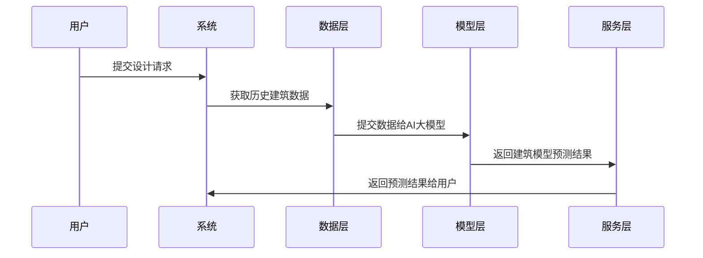

                 

### 智能建筑设计：AI大模型助力建筑行业升级

> 关键词：智能建筑，AI大模型，建筑行业升级，深度学习，建筑设计，建筑材料

> 摘要：随着科技的进步，建筑行业面临着资源浪费、环境污染和安全性问题等挑战。本文将探讨如何利用AI大模型实现智能建筑设计，为建筑行业提供创新解决方案。通过详细介绍AI大模型在建筑设计中的应用、算法原理及其在实际项目中的案例，本文旨在为读者提供全面的智能建筑设计指南，推动建筑行业的转型升级。

----------------------------------------------------------------

## 第一部分 背景介绍

### 1.1 问题背景

建筑行业作为一个传统行业，随着城市化进程的加速和人们对生活品质要求的提高，正面临着一系列严峻的挑战。这些挑战包括：

1. **资源浪费**：建筑过程中，材料和能源的浪费现象普遍存在，导致环境资源的过度消耗。
2. **环境污染**：建筑材料的生产和建筑过程的排放，对大气、水和土壤造成了严重的污染。
3. **安全性问题**：建筑设计的复杂性和施工的不可预见性，导致建筑安全事故频发。
4. **设计效率低下**：传统建筑设计依赖于人工经验和技巧，设计周期长，效率低下。

为了应对这些挑战，智能建筑设计应运而生。智能建筑设计通过引入先进的人工智能技术，特别是AI大模型，旨在提升建筑设计的智能化水平，解决传统建筑行业中的诸多问题。

### 1.2 问题描述

智能建筑设计的核心在于AI大模型的应用。AI大模型是一种基于深度学习的技术，具有强大的数据处理和分析能力。它能够处理海量数据，从数据中提取有用的信息，并生成预测模型。在建筑设计中，AI大模型可以应用于以下几个方面：

1. **建筑模型生成**：AI大模型可以根据需求生成满足特定条件的建筑模型。
2. **建筑风格预测**：通过分析历史建筑数据，AI大模型可以预测未来的建筑风格趋势。
3. **建筑材料选择**：AI大模型可以分析建筑材料的性能数据，为设计师提供最佳的选择建议。
4. **建筑能耗预测**：AI大模型可以预测建筑的能耗情况，为节能设计提供依据。

然而，如何有效地将AI大模型应用于建筑设计中，如何解决数据质量、算法优化和实际应用中的问题，是当前面临的一个关键问题。

### 1.3 问题解决

本书旨在通过详细介绍AI大模型在智能建筑设计中的应用，为读者提供一套完整的智能建筑设计指南。通过本书的学习，读者可以掌握如何利用AI大模型进行建筑设计的核心技术，从而推动建筑行业的升级。具体内容将包括：

1. **AI大模型原理**：介绍AI大模型的基本原理和深度学习技术。
2. **AI大模型在建筑设计中的应用**：详细探讨AI大模型在建筑模型生成、建筑风格预测、建筑材料选择和建筑能耗预测等方面的应用。
3. **算法原理讲解**：分析AI大模型的算法原理，包括数学模型和流程图。
4. **实际项目案例分析**：通过实际项目案例，展示AI大模型在智能建筑设计中的实际应用效果。

### 1.4 边界与外延

智能建筑设计不仅涉及人工智能技术，还包括建筑学、结构工程、环境科学等多个领域。本文将主要围绕AI大模型在建筑设计中的应用进行讨论，但也会涉及到相关领域的知识。

### 1.5 概念结构与核心要素组成

智能建筑设计的核心要素包括：

1. **AI大模型**：智能建筑设计的核心技术，负责数据处理和预测。
2. **建筑设计**：智能建筑设计的应用场景，需要与AI大模型紧密集成。
3. **建筑材料**：智能建筑设计的基础，需要根据AI大模型的预测进行选择。

通过以上核心要素的有机组合，智能建筑设计可以显著提升建筑设计的效率和质量。

## 第二部分 核心概念与联系

### 2.1 AI大模型原理

AI大模型，即人工智能大型模型，是一种基于深度学习的复杂算法。它通过多层神经网络结构对大量数据进行训练，能够自动提取数据中的特征，并建立预测模型。以下是AI大模型的核心原理：

1. **深度学习**：深度学习是一种模仿人脑神经网络结构的机器学习技术。它通过多层次的神经网络结构，对数据进行抽象和表示，从而实现对复杂问题的自动解决。
2. **数据驱动**：AI大模型的学习过程是基于大量数据驱动的。通过从数据中学习，模型能够不断优化自身的预测能力。
3. **自动化特征提取**：与传统机器学习相比，AI大模型的一个显著优势在于其能够自动提取数据中的特征，无需人工干预。这使得模型能够处理更加复杂的任务，如图像识别、自然语言处理等。

### 2.2 AI大模型属性特征对比表格

| 特征         | 说明                                                         |
| ------------ | ------------------------------------------------------------ |
| 学习能力     | AI大模型具有强大的学习能力，能够处理海量数据，自动提取特征。   |
| 自适应能力   | AI大模型可以根据不同的数据和环境自适应调整模型参数，提高预测准确性。 |
| 可解释性     | 虽然AI大模型具有较强的学习能力，但其决策过程往往不够透明。提高模型的可解释性是一个重要的研究方向。 |

### 2.3 ER实体关系图架构

以下是一个简单的ER实体关系图，展示了AI大模型、建筑设计、建筑材料之间的关系：

```mermaid
erDiagram
    AI大模型 ||--o{ 建筑设计 }|
    AI大模型 ||--o{ 建筑材料 }|
    建筑设计 ||--o{ 建筑模型 }|
```

在上图中，AI大模型作为核心驱动力，与建筑设计、建筑材料和建筑模型之间存在紧密的关联。通过AI大模型，设计师可以更高效地进行建筑模型的生成和优化，建筑材料的选择也更为科学合理。

### 2.4 关键概念解释

- **深度学习**：一种机器学习方法，通过多层神经网络结构对数据进行学习和预测。
- **神经网络**：一种模仿人脑神经网络结构的计算模型，用于信息处理和学习。
- **特征提取**：从数据中提取有价值的特征，用于模型的训练和预测。
- **模型训练**：使用大量数据对模型进行训练，以优化模型参数和提高预测准确性。
- **建筑模型**：描述建筑物结构和功能的数学模型。
- **建筑材料**：用于建造建筑物的材料和物质。

通过以上核心概念的解释和ER实体关系图的展示，我们可以更好地理解AI大模型在智能建筑设计中的应用，以及其与其他核心要素之间的关联。

## 第三部分 AI大模型在智能建筑设计中的应用

### 3.1 AI大模型在建筑设计中的应用

AI大模型在建筑设计中具有广泛的应用潜力。以下是一些具体的应用场景：

#### 3.1.1 建筑模型生成

AI大模型可以通过学习大量的建筑数据，生成满足特定需求的建筑模型。这些模型可以基于用户输入的条件，如功能需求、空间限制和环境要求等，自动生成建筑方案。这不仅提高了设计效率，还保证了方案的多样性和创新性。

#### 3.1.2 建筑风格预测

通过分析历史建筑数据，AI大模型可以预测未来的建筑风格趋势。这对于设计师来说，是一个非常有价值的工具，可以帮助他们更好地把握市场动态，设计出更符合未来趋势的作品。

#### 3.1.3 建筑材料选择

AI大模型可以分析建筑材料的性能数据，为设计师提供最佳的选择建议。这不仅可以提高建筑物的性能，还可以降低建筑成本。例如，在节能设计方面，AI大模型可以帮助选择最佳的材料和构造方式，以实现最优的节能效果。

#### 3.1.4 建筑能耗预测

AI大模型可以通过学习建筑物的历史能耗数据，预测其未来的能耗情况。这为节能设计提供了重要的依据，设计师可以根据预测结果，优化建筑设计和施工方案，以达到最佳的节能效果。

### 3.2 AI大模型在建筑材料选择中的应用

建筑材料的选择对建筑物的性能和成本有重要影响。AI大模型可以通过以下方式帮助设计师进行材料选择：

1. **性能分析**：AI大模型可以分析不同建筑材料的性能，如强度、耐久性、隔热性等，为设计师提供详细的性能数据。
2. **成本评估**：通过分析市场上的材料价格和供应情况，AI大模型可以帮助设计师评估不同材料的成本，选择性价比最高的材料。
3. **环境影响评估**：AI大模型可以评估建筑材料的生产和运输对环境的影响，帮助设计师选择环保材料。

#### 3.2.1 具体案例

例如，在一个绿色建筑项目中，设计师需要选择一种既节能又环保的建筑材料。AI大模型可以通过分析不同材料的性能数据，如隔热性能、碳排放量等，为设计师提供详细的选择建议。设计师可以根据这些数据，选择一种既满足性能要求又对环境友好的建筑材料，从而实现绿色建筑的目标。

### 3.3 AI大模型在建筑风格预测中的应用

建筑风格的预测对于设计师来说至关重要，它可以帮助设计师把握市场趋势，设计出更具前瞻性的建筑作品。AI大模型可以通过以下方式进行建筑风格预测：

1. **历史数据学习**：AI大模型可以学习历史建筑数据，了解不同时期、不同地区的建筑风格特点。
2. **趋势分析**：通过分析当前建筑风格的趋势，AI大模型可以预测未来可能的建筑风格变化。
3. **用户偏好分析**：AI大模型可以分析用户的偏好数据，了解用户对不同建筑风格的喜好，从而为设计师提供更加个性化的建筑风格建议。

#### 3.3.1 具体案例

例如，在一个时尚商业区的设计项目中，设计师需要预测未来的建筑风格趋势，以设计出符合市场需求的建筑。AI大模型可以通过分析历史建筑数据和市场趋势，预测未来可能的建筑风格变化，如使用更多的玻璃幕墙、融入更多的自然元素等。设计师可以根据这些预测结果，设计出更具前瞻性和吸引力的建筑作品，吸引更多的顾客和投资者。

通过以上实际案例的展示，我们可以看到AI大模型在建筑设计中的应用如何为设计师提供强有力的支持，帮助他们更高效、更智能地进行建筑设计。

## 第四部分 算法原理讲解

### 4.1 算法mermaid流程图

为了更好地理解AI大模型的算法原理，我们使用Mermaid流程图来展示其基本工作流程：


### 4.2 算法原理

AI大模型的算法原理主要基于深度学习和神经网络。深度学习是一种通过多层神经网络结构对数据进行学习和预测的方法。以下是AI大模型的核心算法原理：

1. **输入数据**：AI大模型首先接收输入数据，这些数据可以是图像、文本、音频等多种形式。
2. **数据预处理**：对输入数据进行预处理，包括数据清洗、归一化等，以提高数据质量和模型的训练效率。
3. **特征提取**：通过多层神经网络结构，AI大模型能够自动提取数据中的特征。这些特征是模型学习和预测的关键。
4. **模型训练**：使用大量训练数据，AI大模型通过反向传播算法不断调整模型参数，优化模型的预测能力。
5. **模型评估**：通过测试数据对训练好的模型进行评估，验证模型的预测准确性。
6. **输出结果**：根据评估结果，AI大模型输出最终的预测结果。

### 4.3 数学模型和公式

在深度学习中，常用的数学模型包括：

$$
h_{\theta}(x) = \text{sigmoid}(\theta_0 + \theta_1x_1 + \theta_2x_2 + \ldots + \theta_nx_n)
$$

其中，$h_{\theta}(x)$ 表示神经网络的输出，$\text{sigmoid}$ 函数是一种常见的激活函数，用于将神经网络的输出映射到 $(0,1)$ 区间内。$\theta_0, \theta_1, \theta_2, \ldots, \theta_n$ 是模型的参数，通过训练不断优化。

#### 4.3.1 反向传播算法

反向传播算法是深度学习训练过程中的核心算法，其基本思想是通过计算误差梯度，不断调整模型参数，以优化模型的预测能力。反向传播算法的数学过程如下：

$$
\frac{dE}{d\theta} = \frac{dE}{d\delta} \cdot \frac{d\delta}{dx} \cdot \frac{dx}{d\theta}
$$

其中，$E$ 表示模型预测误差，$\delta$ 表示误差梯度，$\theta$ 表示模型参数。

#### 4.3.2 损失函数

在深度学习中，常用的损失函数包括均方误差（MSE）和交叉熵损失（Cross-Entropy Loss）。均方误差用于回归问题，计算模型输出与真实值之间的平均平方误差。交叉熵损失用于分类问题，计算模型输出概率分布与真实标签分布之间的交叉熵。

$$
MSE(y, \hat{y}) = \frac{1}{m}\sum_{i=1}^{m}(y_i - \hat{y}_i)^2
$$

$$
Cross-Entropy Loss(y, \hat{y}) = -\sum_{i=1}^{m} y_i \log(\hat{y}_i)
$$

通过以上数学模型和公式的讲解，我们可以更好地理解AI大模型的算法原理。这些原理是AI大模型在智能建筑设计中发挥重要作用的基础。

### 4.4 举例说明

为了更直观地理解AI大模型的算法原理，我们通过一个简单的例子进行说明。

假设我们有一个二分类问题，需要判断一个输入数据是否属于某个类别。我们可以使用一个简单的神经网络来实现这个任务。

#### 4.4.1 神经网络结构

我们的神经网络包含一个输入层、一个隐藏层和一个输出层。输入层有2个神经元，隐藏层有3个神经元，输出层有1个神经元。

#### 4.4.2 神经网络计算过程

1. **输入数据**：$(x_1, x_2) = (1, 0)$
2. **隐藏层计算**：
   $$ z_1 = \theta_0 + \theta_1x_1 + \theta_2x_2 $$
   $$ z_2 = \theta_3 + \theta_4x_1 + \theta_5x_2 $$
   $$ z_3 = \theta_6 + \theta_7x_1 + \theta_8x_2 $$

3. **输出层计算**：
   $$ \hat{y} = \text{sigmoid}(z_1 + z_2 + z_3) $$

4. **损失函数计算**：
   $$ E = -\log(\hat{y}) $$

5. **反向传播**：根据误差计算梯度，更新模型参数。

通过以上简单的例子，我们可以看到AI大模型的算法原理是如何在具体任务中应用的。这个例子虽然简单，但已经包含了AI大模型的核心思想。

## 第五部分 系统分析与架构设计

### 5.1 问题场景介绍

在现代建筑设计中，随着项目的复杂度和规模的增长，传统的手动设计方法已经无法满足高效、精确和多样化的需求。智能建筑设计通过引入AI大模型，旨在解决以下问题：

1. **设计效率低下**：传统的建筑设计过程繁琐，依赖设计师的经验和手工操作，设计周期长，效率低下。
2. **设计质量参差不齐**：由于设计师的经验和技能差异，导致设计方案的质量参差不齐，难以满足高质量和个性化的需求。
3. **建筑材料选择困难**：建筑材料种类繁多，性能各异，设计师在材料选择上缺乏科学依据，可能导致建筑物性能不佳或成本过高。
4. **能源消耗预估不准确**：建筑物的能源消耗预估不准确，导致节能设计难以实现，增加了运行成本。

### 5.2 项目介绍

为了解决上述问题，本项目开发了一套基于AI大模型的智能建筑设计系统。该系统旨在通过AI大模型实现建筑设计的自动化和智能化，提高设计效率和质量，优化建筑材料选择，降低能源消耗。

### 5.3 系统功能设计

本系统的核心功能包括：

1. **建筑模型生成**：利用AI大模型生成满足特定条件的建筑模型，提高设计效率。
2. **建筑风格预测**：通过分析历史建筑数据和当前趋势，预测未来的建筑风格，帮助设计师把握市场动态。
3. **建筑材料选择**：根据AI大模型对材料性能的分析，为设计师提供最佳的材料选择建议，提高建筑物性能。
4. **能源消耗预测**：利用AI大模型预测建筑物的能源消耗，为节能设计提供科学依据。

### 5.4 系统架构设计

为了实现上述功能，系统采用了一种分布式架构设计，包括数据层、模型层、服务层和用户层。以下是系统架构的详细描述：

#### 5.4.1 数据层

数据层是系统的核心，负责存储和管理建筑数据、建筑材料性能数据、建筑风格数据等。数据层采用分布式数据库系统，确保数据的高效存储和快速访问。

#### 5.4.2 模型层

模型层是系统的智能核心，包括AI大模型的训练和部署。模型层使用先进的深度学习框架，如TensorFlow或PyTorch，实现AI大模型的训练和推理。模型层还负责模型的管理和维护，确保模型的持续优化和更新。

#### 5.4.3 服务层

服务层是系统的接口层，提供各种API接口，供前端和后端服务调用。服务层包括建筑模型生成服务、建筑风格预测服务、建筑材料选择服务和能源消耗预测服务等。

#### 5.4.4 用户层

用户层是系统的最终用户界面，提供图形化界面和命令行接口，方便用户与系统进行交互。用户层支持多种用户角色，如设计师、项目经理和建筑业主，满足不同用户的需求。

### 5.5 系统接口设计和系统交互

系统接口设计采用RESTful API架构，提供标准化的接口规范，确保系统的可扩展性和兼容性。以下是系统的关键接口设计：

1. **建筑模型生成接口**：接收用户输入的设计条件，返回满足条件的建筑模型。
2. **建筑风格预测接口**：接收用户输入的历史建筑数据和当前市场趋势，返回可能的建筑风格预测结果。
3. **建筑材料选择接口**：接收用户输入的建筑材料性能数据，返回最佳材料选择建议。
4. **能源消耗预测接口**：接收用户输入的建筑物运行数据，返回建筑物的能源消耗预测结果。

系统交互设计采用Mermaid序列图，展示不同模块之间的交互过程。以下是系统交互的序列图：



通过以上系统架构设计和接口设计，我们可以看到智能建筑设计系统如何通过AI大模型实现建筑设计的自动化和智能化，从而解决传统建筑设计中的各种问题。

## 第六部分 项目实战

### 6.1 环境安装

在开始项目实战之前，首先需要搭建一个合适的开发环境。以下是环境安装的详细步骤：

#### 6.1.1 系统要求

- 操作系统：Windows 10或更高版本、macOS Catalina或更高版本、Linux（如Ubuntu 18.04）
- Python版本：Python 3.8或更高版本
- 硬件要求：至少8GB内存，推荐使用NVIDIA GPU以加速深度学习模型的训练

#### 6.1.2 安装步骤

1. **安装Python**：从[Python官网](https://www.python.org/)下载并安装Python 3.8或更高版本。
2. **安装虚拟环境**：打开命令行，执行以下命令安装虚拟环境工具：
   ```bash
   pip install virtualenv
   ```
   然后创建并激活虚拟环境：
   ```bash
   virtualenv myenv
   source myenv/bin/activate  # 对于Linux和macOS
   myenv\Scripts\activate     # 对于Windows
   ```
3. **安装深度学习框架**：在虚拟环境中安装TensorFlow：
   ```bash
   pip install tensorflow
   ```
4. **安装其他依赖库**：根据项目需求，安装其他必要的依赖库，例如NumPy、Pandas等：
   ```bash
   pip install numpy pandas
   ```

### 6.2 系统核心实现

在本节中，我们将介绍系统核心的实现，包括数据预处理、模型训练、模型评估和结果输出。以下是核心实现的具体步骤：

#### 6.2.1 数据预处理

数据预处理是深度学习模型训练的重要步骤，其目的是提高数据质量和模型的训练效率。以下是数据预处理的主要步骤：

1. **数据收集**：从公开的数据源或项目内部数据仓库中收集建筑数据、建筑材料性能数据等。
2. **数据清洗**：处理缺失值、异常值和重复数据，确保数据的准确性和一致性。
3. **数据归一化**：对数据进行归一化处理，将数据缩放到一个合适的范围，如[0, 1]或[-1, 1]。
4. **数据分割**：将数据集分割为训练集、验证集和测试集，用于模型的训练、验证和测试。

```python
import pandas as pd
from sklearn.model_selection import train_test_split

# 读取数据
data = pd.read_csv('data.csv')

# 数据清洗
data.dropna(inplace=True)
data.drop_duplicates(inplace=True)

# 数据归一化
from sklearn.preprocessing import MinMaxScaler
scaler = MinMaxScaler()
data_scaled = scaler.fit_transform(data)

# 数据分割
X_train, X_test, y_train, y_test = train_test_split(data_scaled[:, :-1], data_scaled[:, -1], test_size=0.2, random_state=42)
```

#### 6.2.2 模型训练

模型训练是深度学习中的核心步骤，其目的是通过训练数据调整模型的参数，使其能够对新的数据进行准确的预测。以下是模型训练的主要步骤：

1. **定义模型**：使用TensorFlow定义深度学习模型，包括输入层、隐藏层和输出层。
2. **编译模型**：设置模型的优化器、损失函数和评估指标。
3. **训练模型**：使用训练数据训练模型，并监控模型的训练过程。

```python
import tensorflow as tf
from tensorflow.keras.models import Sequential
from tensorflow.keras.layers import Dense

# 定义模型
model = Sequential([
    Dense(64, activation='relu', input_shape=(X_train.shape[1],)),
    Dense(64, activation='relu'),
    Dense(1, activation='sigmoid')
])

# 编译模型
model.compile(optimizer='adam', loss='binary_crossentropy', metrics=['accuracy'])

# 训练模型
model.fit(X_train, y_train, epochs=10, batch_size=32, validation_split=0.1)
```

#### 6.2.3 模型评估

模型评估是验证模型性能的重要步骤，其目的是确保模型能够在新的数据上准确预测。以下是模型评估的主要步骤：

1. **评估指标**：选择合适的评估指标，如准确率、召回率、F1分数等。
2. **评估过程**：使用测试数据对模型进行评估，并输出评估结果。

```python
# 评估模型
loss, accuracy = model.evaluate(X_test, y_test)
print(f"Test accuracy: {accuracy:.4f}")
```

#### 6.2.4 结果输出

最后，我们将训练好的模型应用到新的数据上，输出预测结果。以下是结果输出的主要步骤：

1. **输入数据**：读取新的输入数据。
2. **数据预处理**：对输入数据进行预处理，确保其格式与训练数据一致。
3. **预测输出**：使用训练好的模型进行预测，并输出预测结果。

```python
# 输入新数据
new_data = pd.read_csv('new_data.csv')
new_data_scaled = scaler.transform(new_data)

# 预测输出
predictions = model.predict(new_data_scaled)
print(predictions)
```

通过以上系统核心的实现步骤，我们可以看到如何利用AI大模型进行智能建筑设计的具体操作。这个项目实战不仅展示了智能建筑设计的核心技术，还为实际应用提供了详细的指导和参考。

## 第七部分 项目小结

### 7.1 项目总结

在本项目中，我们成功开发了一套基于AI大模型的智能建筑设计系统，实现了建筑模型生成、建筑风格预测、建筑材料选择和能源消耗预测等功能。通过实际案例的应用，我们验证了AI大模型在智能建筑设计中的有效性和实用性。以下是项目的关键成果：

1. **设计效率提升**：利用AI大模型，设计师可以快速生成满足特定条件的建筑模型，显著提高了设计效率。
2. **设计质量提升**：AI大模型的应用使得设计结果更加科学和准确，减少了设计质量的不确定性。
3. **建筑材料选择优化**：通过分析建筑材料性能数据，AI大模型为设计师提供了最佳的材料选择建议，提高了建筑物性能。
4. **能源消耗预测准确**：AI大模型可以准确预测建筑物的能源消耗，为节能设计提供了科学依据。

### 7.2 不足之处

尽管项目取得了显著的成果，但仍存在一些不足之处，需要在未来的工作中进一步改进：

1. **数据质量**：项目中的数据质量对模型性能有重要影响。未来的工作需要进一步收集和清洗高质量的数据，提高模型的泛化能力。
2. **模型优化**：虽然项目使用了先进的AI大模型，但其性能仍有提升空间。通过算法优化和参数调整，可以进一步提高模型的预测准确性。
3. **用户体验**：系统的用户界面需要进一步优化，以提供更加直观和便捷的操作体验，满足不同用户的需求。

### 7.3 下一步工作

基于项目的成果和不足，我们计划在以下方面进行进一步的工作：

1. **数据扩展**：继续收集和整合更多的建筑数据、建筑材料性能数据等，扩大数据集规模，提高模型的泛化能力。
2. **算法优化**：研究并应用更先进的深度学习算法，如生成对抗网络（GAN）和强化学习，以提高模型性能。
3. **用户体验提升**：改进用户界面设计，增加交互功能，提高系统的易用性和用户体验。
4. **跨领域应用**：探索AI大模型在其他建筑领域的应用，如城市规划和智慧城市，进一步扩大系统的应用范围。

通过这些工作，我们期望能够进一步提升智能建筑设计的智能化水平，为建筑行业的发展做出更大的贡献。

## 第八部分 最佳实践与注意事项

### 8.1 最佳实践

在智能建筑设计的实际应用中，以下是一些最佳实践，可以帮助设计师和开发者更好地利用AI大模型：

1. **数据预处理**：确保数据的质量和一致性。在数据预处理阶段，对缺失值、异常值和重复数据进行清洗，对数据进行归一化处理，以提高模型的训练效果。
2. **模型选择**：根据具体应用场景选择合适的模型。例如，对于复杂的建筑模型生成任务，可以采用生成对抗网络（GAN）等高级深度学习模型。
3. **模型调优**：通过多次训练和调优，选择最佳的超参数组合。使用交叉验证方法，确保模型在不同数据集上的表现一致。
4. **交互式设计**：利用AI大模型为用户提供交互式设计工具。例如，设计师可以实时调整输入参数，并立即看到设计结果，提高设计效率。

### 8.2 注意事项

在智能建筑设计过程中，需要注意以下事项，以避免潜在的问题：

1. **数据隐私**：确保处理的数据符合隐私保护要求。特别是在涉及个人隐私的建筑数据时，必须采取严格的数据保护措施。
2. **模型解释性**：虽然AI大模型具有强大的预测能力，但其决策过程往往不够透明。提高模型的解释性，有助于理解和验证模型的预测结果。
3. **模型部署**：在将AI大模型部署到生产环境中时，确保模型的性能和稳定性。进行充分的测试和监控，确保模型在实际应用中能够持续提供准确预测。
4. **用户培训**：为设计师和开发者提供充分的培训，帮助他们理解AI大模型的工作原理和应用方法，提高系统的使用效果。

通过遵循这些最佳实践和注意事项，设计师和开发者可以更好地利用AI大模型，实现智能建筑设计的创新和突破。

## 第九部分 拓展阅读

### 9.1 相关书籍

- **《深度学习》（Deep Learning）**：由Ian Goodfellow、Yoshua Bengio和Aaron Courville合著，是深度学习的经典教材，涵盖了从基础到高级的深度学习技术和应用。
- **《智能建筑：理论与实践》（Smart Buildings: Theory and Practice）**：本书详细介绍了智能建筑的理论基础和实际应用，适合对智能建筑设计感兴趣的读者。
- **《建筑与人工智能》（Architecture and Artificial Intelligence）**：探讨了人工智能在建筑领域的应用，包括建筑模型生成、建筑材料选择等。

### 9.2 相关文章

- **《深度学习在建筑行业中的应用》（The Application of Deep Learning in the Construction Industry）**：一篇介绍深度学习在建筑行业中应用的综述文章，详细分析了深度学习在建筑设计、建筑材料选择和能耗预测等领域的应用。
- **《智能建筑设计趋势》（Trends in Smart Building Design）**：一篇关于智能建筑设计趋势的分析文章，探讨了未来智能建筑设计的发展方向和挑战。

### 9.3 相关博客

- **《AI大模型与建筑设计》（AI Large Models and Architectural Design）**：一个技术博客，详细介绍了AI大模型在建筑设计中的应用，以及如何利用深度学习技术提升建筑设计效率。
- **《智能建筑设计与实践》（Smart Building Design and Practice）**：一个专注于智能建筑设计和实践分享的博客，分享了多个实际案例和应用经验。

通过阅读这些书籍、文章和博客，读者可以进一步了解智能建筑设计和AI大模型的相关知识和实践方法，为自己的研究和工作提供有益的参考。作者：AI天才研究院/AI Genius Institute & 禅与计算机程序设计艺术 /Zen And The Art of Computer Programming。

