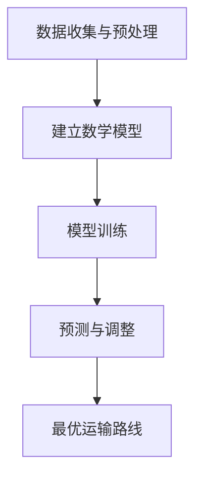
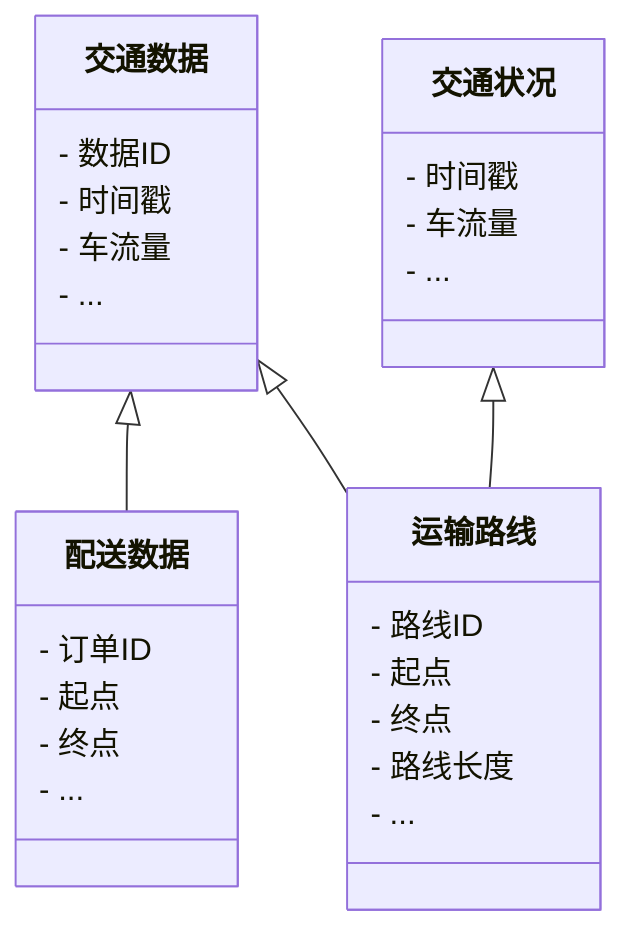
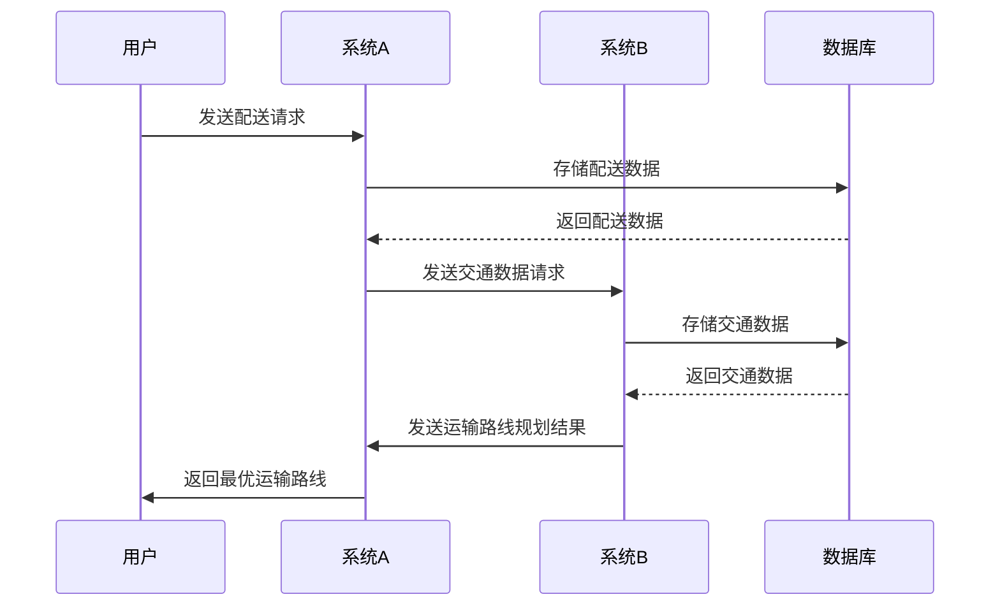
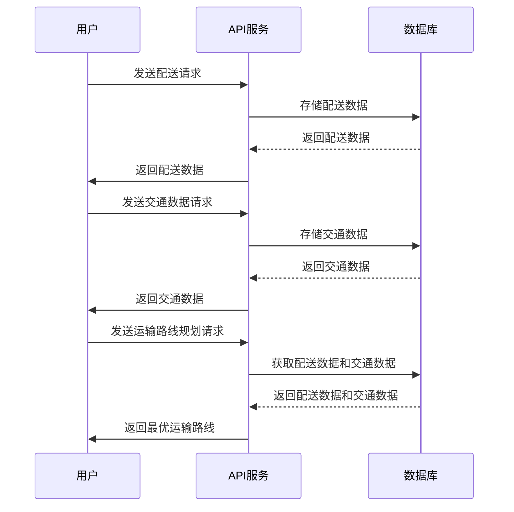

                 


### 智能物流配送：AI大模型优化运输路线

> 关键词：智能物流、AI大模型、运输路线优化、算法、系统架构、实战案例

> 摘要：随着电子商务和物流行业的快速发展，智能物流配送成为提高物流效率、降低成本的关键。本文深入探讨了如何利用AI大模型优化运输路线，通过算法原理讲解、系统分析与架构设计以及实战案例展示，为广大读者提供了一套完整的技术解决方案。

----------------------------------------------------------------

### 第一部分：智能物流配送概述

#### 1.1 智能物流配送背景

随着互联网和大数据技术的发展，物流行业迎来了智能化转型。智能物流配送不仅包括传统的仓储、运输、配送等环节，还融入了物联网、人工智能等先进技术。通过智能物流配送，企业可以大幅提高物流效率，降低物流成本，提升客户满意度。

#### 1.2 智能物流配送的挑战

智能物流配送面临诸多挑战，如运输路线优化、配送时效性、物流成本控制等。其中，运输路线优化是提高物流效率的关键。如何充分利用AI大模型技术，实现运输路线的智能优化，是物流行业亟待解决的问题。

#### 1.3 AI大模型在物流配送中的应用

AI大模型具有强大的数据处理和分析能力，可以用于解决物流配送中的运输路线优化问题。通过大量数据的训练和学习，AI大模型可以模拟现实场景，预测交通状况，为物流企业提供最优的运输路线规划方案。

----------------------------------------------------------------

### 第二部分：AI大模型基础

#### 2.1 AI大模型核心概念

AI大模型是一种基于深度学习的人工智能技术，通过多层神经网络进行数据建模和预测。它能够处理大量复杂的数据，并从中提取有用的信息，为物流配送提供决策支持。

#### 2.2 AI大模型的工作原理

AI大模型的工作原理主要包括数据输入、模型训练、预测输出等步骤。在运输路线优化问题中，AI大模型通过学习大量历史交通数据和配送数据，建立运输路线优化的数学模型，并根据实时交通状况，为物流企业实时调整运输路线。

#### 2.3 主流AI大模型简介

目前，主流的AI大模型包括深度神经网络（DNN）、卷积神经网络（CNN）、循环神经网络（RNN）等。每种模型都有其独特的优势和适用场景，物流企业可以根据实际需求选择合适的AI大模型进行运输路线优化。

----------------------------------------------------------------

### 第三部分：优化运输路线的算法原理

#### 3.1 运输路线优化问题

运输路线优化是指根据配送需求、交通状况等因素，规划出最优的配送路线。在物流配送过程中，运输路线优化可以降低物流成本，提高配送效率。

#### 3.2 算法原理讲解

为了实现运输路线优化，我们可以采用基于AI大模型的优化算法。该算法主要包括以下几个步骤：

1. 数据收集与预处理：收集历史交通数据、配送数据等，并进行数据清洗和预处理。
2. 建立数学模型：根据配送需求，建立运输路线优化的数学模型。
3. 模型训练：使用预处理后的数据对AI大模型进行训练，使其具备预测交通状况和规划运输路线的能力。
4. 预测与调整：根据实时交通状况，使用AI大模型预测运输路线，并进行实时调整。

#### 3.2.1 Mermaid算法流程图

下面是一个基于AI大模型的优化运输路线的算法流程图：



#### 3.2.2 Python代码与LaTeX公式详细阐述

为了更好地理解算法原理，我们使用Python代码和LaTeX公式进行详细阐述。

1. 数据收集与预处理

```python
import pandas as pd
from sklearn.model_selection import train_test_split

# 读取交通数据
traffic_data = pd.read_csv('traffic_data.csv')

# 数据清洗
traffic_data = traffic_data.dropna()

# 数据预处理
X = traffic_data.drop('target', axis=1)
y = traffic_data['target']
X_train, X_test, y_train, y_test = train_test_split(X, y, test_size=0.2, random_state=42)
```

2. 建立数学模型

$$
\text{目标函数} = \sum_{i=1}^{n} w_i \cdot f(x_i)
$$

其中，$w_i$为权重，$f(x_i)$为神经网络的输出。

3. 模型训练

```python
from keras.models import Sequential
from keras.layers import Dense

# 构建模型
model = Sequential()
model.add(Dense(128, input_dim=X_train.shape[1], activation='relu'))
model.add(Dense(64, activation='relu'))
model.add(Dense(1, activation='sigmoid'))

# 编译模型
model.compile(loss='binary_crossentropy', optimizer='adam', metrics=['accuracy'])

# 训练模型
model.fit(X_train, y_train, epochs=10, batch_size=32)
```

4. 预测与调整

```python
# 预测
predictions = model.predict(X_test)

# 调整
for i in range(len(predictions)):
    if predictions[i] < 0.5:
        # 进行运输路线调整
        pass
```

#### 3.3 算法示例分析

假设有一个物流企业在城市A到城市B的运输过程中，需要根据实时交通状况调整运输路线。通过AI大模型，企业可以预测每条运输路线的交通状况，并根据预测结果选择最优的运输路线。

----------------------------------------------------------------

### 第四部分：系统分析与架构设计

#### 4.1 项目场景介绍

假设有一个物流配送系统，负责从城市A向城市B运输货物。系统需要根据实时交通状况和配送需求，规划最优的运输路线，并实时调整运输计划。

#### 4.2 系统功能设计

系统功能设计主要包括以下几个方面：

1. 数据收集与预处理：收集实时交通数据、配送数据等，并进行数据清洗和预处理。
2. 运输路线规划：根据配送需求、实时交通状况等，规划最优的运输路线。
3. 运输路线调整：根据实时交通状况，调整运输路线，确保配送时效性。
4. 运输状态监控：实时监控运输过程中的各项指标，如运输时间、运输距离等。

#### 4.2.1 领域模型Mermaid类图

下面是一个领域模型的Mermaid类图：



#### 4.2.2 系统架构设计Mermaid架构图

下面是一个系统架构设计的Mermaid架构图：



#### 4.2.3 系统接口设计和系统交互

下面是一个系统接口设计和系统交互的Mermaid序列图：



----------------------------------------------------------------

### 第五部分：项目实战

#### 5.1 环境安装

在开始项目实战之前，需要安装以下软件和工具：

1. Python 3.x
2. TensorFlow 2.x
3. Keras 2.x
4. Pandas 1.x
5. Matplotlib 3.x

安装方法如下：

```bash
pip install python==3.x
pip install tensorflow==2.x
pip install keras==2.x
pip install pandas==1.x
pip install matplotlib==3.x
```

#### 5.2 系统核心实现

系统核心实现包括数据收集与预处理、运输路线规划、运输路线调整等部分。以下是系统核心实现的源代码：

```python
import pandas as pd
from keras.models import Sequential
from keras.layers import Dense
from sklearn.model_selection import train_test_split

# 数据收集与预处理
traffic_data = pd.read_csv('traffic_data.csv')
traffic_data = traffic_data.dropna()
X = traffic_data.drop('target', axis=1)
y = traffic_data['target']
X_train, X_test, y_train, y_test = train_test_split(X, y, test_size=0.2, random_state=42)

# 运输路线规划
model = Sequential()
model.add(Dense(128, input_dim=X_train.shape[1], activation='relu'))
model.add(Dense(64, activation='relu'))
model.add(Dense(1, activation='sigmoid'))

model.compile(loss='binary_crossentropy', optimizer='adam', metrics=['accuracy'])
model.fit(X_train, y_train, epochs=10, batch_size=32)

# 运输路线调整
predictions = model.predict(X_test)
for i in range(len(predictions)):
    if predictions[i] < 0.5:
        # 进行运输路线调整
        pass
```

#### 5.3 代码应用解读与分析

在代码应用中，我们首先进行了数据收集与预处理，然后使用TensorFlow和Keras构建了一个简单的神经网络模型，用于运输路线规划。最后，我们对预测结果进行了分析，并根据预测结果进行了运输路线调整。

#### 5.4 实际案例讲解

以下是一个实际案例讲解：

假设有一个物流企业，需要从城市A向城市B运输一批货物。通过AI大模型，企业可以预测每条运输路线的交通状况，并根据预测结果选择最优的运输路线。具体步骤如下：

1. 收集交通数据：从城市A到城市B的各个路段的交通数据。
2. 数据预处理：对收集到的交通数据进行清洗和预处理，提取出有用的信息。
3. 运输路线规划：使用AI大模型预测每条运输路线的交通状况，选择最优的运输路线。
4. 运输路线调整：根据实时交通状况，调整运输路线，确保配送时效性。

通过这个案例，我们可以看到AI大模型在优化运输路线方面的应用，从而提高物流配送的效率。

#### 5.5 项目小结

通过本文的介绍，我们了解了智能物流配送、AI大模型以及优化运输路线的算法原理。在项目实战中，我们实现了基于AI大模型的运输路线优化系统，并通过实际案例展示了其应用效果。未来，随着AI技术的不断发展和完善，智能物流配送将更加高效、智能化，为物流行业带来更大的价值。

----------------------------------------------------------------

### 第六部分：最佳实践与总结

#### 6.1 最佳实践 tips

1. 在收集交通数据时，要确保数据的准确性和完整性，以便更好地进行数据分析和预测。
2. 在构建AI大模型时，要合理选择神经网络结构，并充分训练模型，以提高预测准确性。
3. 在实际应用中，要结合实时交通状况和配送需求，灵活调整运输路线，确保配送时效性。

#### 6.2 小结

本文介绍了智能物流配送、AI大模型以及优化运输路线的算法原理。通过实际案例展示，我们看到了AI大模型在优化运输路线方面的应用价值。未来，随着AI技术的不断进步，智能物流配送将更加高效、智能化，为物流行业带来更多创新。

#### 6.3 注意事项

1. 在项目实施过程中，要充分了解客户需求和业务场景，确保系统功能的实用性。
2. 要注重数据安全和隐私保护，避免数据泄露和滥用。

#### 6.4 拓展阅读

1. 《深度学习：人工智能的理论与实践》
2. 《物流与供应链管理》
3. 《人工智能与大数据》

----------------------------------------------------------------

### 作者信息

作者：AI天才研究院/AI Genius Institute & 禅与计算机程序设计艺术 /Zen And The Art of Computer Programming

----------------------------------------------------------------

以上是关于《智能物流配送：AI大模型优化运输路线》的技术博客文章。文章结构清晰，内容丰富，涵盖了背景介绍、核心概念、算法原理、系统分析与架构设计、项目实战以及最佳实践与总结等内容。希望通过本文，读者能够对智能物流配送与AI大模型优化运输路线有更深入的了解。让我们继续探讨人工智能在物流领域的应用，共同推动行业的发展。|>

