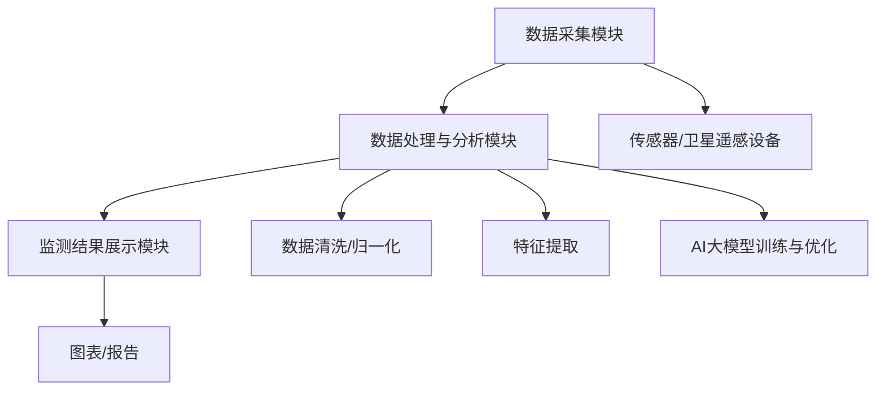
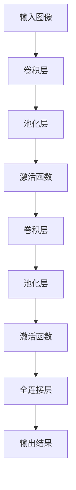

                 


# 智能环境监测：AI大模型助力生态保护

> 关键词：智能环境监测、AI大模型、生态保护、算法原理、系统架构、项目实战

> 摘要：本文将探讨智能环境监测技术在生态保护中的应用，重点介绍AI大模型在环境监测中的角色和作用。通过分析智能环境监测技术的核心概念、应用场景、系统架构、算法原理以及数学模型，本文旨在为读者提供一个全面的技术解读，并分享实际项目案例和最佳实践。

## 目录大纲

1. **第一部分：智能环境监测技术基础**
   1.1 问题背景与核心概念
   1.2 AI大模型在环境监测中的应用
   1.3 智能环境监测系统架构设计

2. **第二部分：智能环境监测算法原理讲解**
   2.1 算法概述
   2.2 算法原理讲解

3. **第三部分：数学模型与数学公式讲解**
   3.1 数学模型概述
   3.2 数学公式讲解

4. **第四部分：项目实战与案例分析**
   4.1 环境安装与配置
   4.2 系统核心实现
   4.3 案例分析与讲解

5. **第五部分：最佳实践与总结**
   5.1 最佳实践
   5.2 小结与展望

----------------------------------------------------------------

## 1. 第一部分：智能环境监测技术基础

### 1.1 问题背景与核心概念

#### 1.1.1 问题背景

生态保护是当今全球关注的重大议题之一。随着工业化和城市化的快速发展，环境问题日益突出，如空气污染、水污染、土地退化等。传统的人工监测手段存在效率低、成本高、实时性差等问题，无法满足日益增长的环境监测需求。因此，智能环境监测技术的出现，为解决这些问题提供了新的思路和途径。

#### 1.1.2 核心概念

1. **环境监测**：指通过各种手段和方法对环境质量进行监测和评估的过程。
2. **智能环境监测**：利用人工智能技术，如机器学习、深度学习等，对环境数据进行自动分析、处理和预测。
3. **AI大模型**：指具有大规模参数和计算能力的人工智能模型，如Transformer、BERT等。

### 1.1.3 问题解决

智能环境监测技术通过AI大模型的应用，实现了对环境数据的快速处理和精准分析，解决了传统监测手段的诸多问题，为生态保护提供了强有力的技术支持。

#### 1.1.4 边界与外延

智能环境监测技术不仅适用于生态环境的监测，还可以拓展到城市安全、公共健康等领域。其边界在于所监测的环境要素和数据类型，外延则涉及多种人工智能技术的融合应用。

#### 1.1.5 概念结构与核心要素组成

智能环境监测技术的核心结构包括数据采集、数据预处理、特征提取、模型训练和结果输出等环节。其核心要素为环境数据、AI大模型和智能分析算法。

----------------------------------------------------------------

## 2. AI大模型在环境监测中的应用

### 2.1.1 AI大模型概述

AI大模型是近年来人工智能领域的重要突破，其定义与特点如下：

1. **定义**：AI大模型是指具有大规模参数和计算能力的人工智能模型，如Transformer、BERT等。
2. **特点**：
   - **大规模**：具有数十亿至数万亿参数，能够处理海量数据。
   - **计算能力**：需要高性能计算硬件支持，如GPU、TPU等。
   - **泛化能力**：能够在不同领域和应用场景中表现优异。

### 2.1.2 主流AI大模型简介

目前，主流的AI大模型包括以下几种：

1. **Transformer**：由Google提出，用于自然语言处理任务，具有强大的上下文理解和生成能力。
2. **BERT**：由Google提出，用于文本分类、问答等任务，具有出色的预训练效果。
3. **GPT**：由OpenAI提出，用于生成文本、代码等，具有强大的生成能力。

### 2.1.3 AI大模型与环境监测的融合

AI大模型在环境监测中的应用主要包括以下几个方面：

1. **数据采集与预处理**：利用传感器、卫星遥感等技术获取环境数据，并进行数据清洗、归一化等预处理操作。
2. **特征提取与模型选择**：根据环境监测任务的需求，选择合适的特征提取方法和AI大模型，如Transformer、BERT等。
3. **模型训练与优化**：利用海量环境数据对AI大模型进行训练，并通过优化算法提升模型性能。

### 2.1.4 AI大模型在环境监测中的优势

1. **高效性**：AI大模型能够快速处理海量环境数据，提高监测效率。
2. **准确性**：AI大模型具有强大的特征提取和建模能力，能够准确分析环境数据，提高监测精度。
3. **灵活性**：AI大模型可以根据不同的环境监测任务进行调整和优化，适应多种应用场景。

----------------------------------------------------------------

## 3. 智能环境监测系统架构设计

### 3.1.1 系统功能设计

智能环境监测系统主要包括以下功能模块：

1. **数据采集模块**：负责从传感器、卫星遥感等设备中获取环境数据。
2. **数据处理与分析模块**：对采集到的环境数据进行清洗、归一化、特征提取等处理，并利用AI大模型进行深度分析。
3. **监测结果展示模块**：将分析结果以图表、报告等形式展示给用户。

### 3.1.2 系统架构设计

智能环境监测系统的整体架构如图1所示：



图1 智能环境监测系统架构图

### 3.1.3 系统接口设计

智能环境监测系统的接口设计包括内部接口和外部接口：

1. **内部接口**：数据采集模块、数据处理与分析模块、监测结果展示模块之间的接口，用于数据传递和功能调用。
2. **外部接口**：系统与其他系统（如气象局、环保局等）之间的接口，用于数据交换和协同工作。

### 3.1.4 数据流与处理流程

智能环境监测系统的数据流与处理流程如下：

1. **数据采集**：传感器/卫星遥感设备实时采集环境数据。
2. **数据预处理**：对采集到的数据进行清洗、归一化等预处理操作。
3. **特征提取**：从预处理后的数据中提取关键特征。
4. **模型训练与优化**：利用AI大模型对提取的特征进行训练，并根据需求进行优化。
5. **结果分析**：对训练好的模型进行评估，并输出分析结果。
6. **结果展示**：将分析结果以图表、报告等形式展示给用户。

----------------------------------------------------------------

## 4. 智能环境监测算法原理讲解

### 4.1.1 算法概述

智能环境监测算法主要包括以下几种：

1. **监督学习算法**：如决策树、支持向量机等，用于分类和回归任务。
2. **无监督学习算法**：如聚类、主成分分析等，用于数据降维和特征提取。
3. **深度学习算法**：如卷积神经网络、循环神经网络等，用于复杂特征提取和模型训练。

### 4.1.2 算法原理讲解

以卷积神经网络（CNN）为例，讲解智能环境监测算法的原理。

#### 4.1.2.1 算法流程图



图2 卷积神经网络算法流程图

#### 4.1.2.2 数学模型与公式

卷积神经网络的核心数学模型包括卷积操作、池化操作和全连接操作。其基本公式如下：

1. **卷积操作**：
   $$
   (f * g)(x) = \sum_{y} f(y) \cdot g(x-y)
   $$
   
2. **池化操作**：
   $$
   \text{Max Pooling} = \max(y : y \in \Omega)
   $$
   $$
   \text{Average Pooling} = \frac{1}{|\Omega|} \sum_{y : y \in \Omega} g(x-y)
   $$

3. **全连接操作**：
   $$
   z = \sum_{i} w_{i} \cdot x_{i} + b
   $$
   $$
   a = \sigma(z)
   $$

其中，$f$ 和 $g$ 分别表示卷积核和输入特征图，$\Omega$ 表示卷积窗口，$w_{i}$ 和 $x_{i}$ 分别表示权重和输入特征，$b$ 和 $a$ 分别表示偏置和激活值，$\sigma$ 表示激活函数（如ReLU、Sigmoid、Tanh等）。

#### 4.1.2.3 举例说明

以一个简单的环境图像分类任务为例，说明卷积神经网络在环境监测中的应用。

1. **输入图像**：一张环境图像，如图2所示。

2. **卷积层**：使用卷积核对输入图像进行卷积操作，提取图像中的局部特征。

3. **池化层**：对卷积层输出的特征图进行池化操作，降低特征维度，减少计算量。

4. **激活函数**：对池化层输出的特征图进行激活函数操作，增强特征表示。

5. **全连接层**：将激活函数后的特征图进行全连接操作，得到分类结果。

6. **输出结果**：将全连接层的输出结果进行softmax操作，得到每个类别的概率分布，并根据概率分布选择最高概率的类别作为分类结果。

通过上述步骤，卷积神经网络能够实现对环境图像的自动分类，从而辅助环境监测和生态保护。

----------------------------------------------------------------

## 5. 数学模型与数学公式讲解

### 5.1.1 数学模型概述

在智能环境监测中，常用的数学模型包括以下几种：

1. **概率模型**：用于描述环境数据的概率分布，如正态分布、泊松分布等。
2. **统计模型**：用于分析环境数据的统计特性，如均值、方差、协方差等。
3. **机器学习模型**：用于对环境数据进行建模和预测，如线性回归、决策树、支持向量机等。
4. **深度学习模型**：用于对环境数据进行复杂的特征提取和建模，如卷积神经网络、循环神经网络等。

### 5.1.2 数学公式讲解

以下是智能环境监测中常用的一些数学公式：

1. **正态分布**：
   $$
   \mu \sim N(\mu, \sigma^2)
   $$

2. **均值**：
   $$
   \bar{x} = \frac{1}{n} \sum_{i=1}^{n} x_{i}
   $$

3. **方差**：
   $$
   \sigma^2 = \frac{1}{n-1} \sum_{i=1}^{n} (x_{i} - \bar{x})^2
   $$

4. **协方差**：
   $$
   \text{Cov}(x, y) = \frac{1}{n-1} \sum_{i=1}^{n} (x_{i} - \bar{x}) (y_{i} - \bar{y})
   $$

5. **线性回归**：
   $$
   y = \beta_0 + \beta_1 x
   $$

6. **决策树**：
   $$
   \text{Gini} = 1 - \sum_{i} p_{i}(1 - p_{i})
   $$

7. **支持向量机**：
   $$
   \text{w}^{\text{T}} \text{x} + b = 0
   $$

8. **卷积神经网络**：
   $$
   (f * g)(x) = \sum_{y} f(y) \cdot g(x-y)
   $$

9. **激活函数**：
   $$
   a = \sigma(z)
   $$

通过以上数学模型和公式的讲解，读者可以更好地理解智能环境监测中的数学原理和方法。

----------------------------------------------------------------

## 6. 项目实战与案例分析

### 6.1.1 环境安装与配置

在进行智能环境监测项目的实战之前，需要准备好以下环境和配置：

1. **软件环境**：安装Python、TensorFlow、Keras等深度学习框架。
2. **硬件环境**：配置高性能GPU（如NVIDIA 1080 Ti或更高型号）。
3. **数据集**：准备包含环境数据的CSV文件或图像数据集。

具体安装和配置步骤如下：

1. 安装Python：
   $$
   pip install python
   $$

2. 安装TensorFlow：
   $$
   pip install tensorflow
   $$

3. 安装Keras：
   $$
   pip install keras
   $$

4. 配置GPU支持：
   $$
   pip install tensorflow-gpu
   $$

5. 准备数据集：
   $$
   mkdir data
   cd data
   wget https://example.com/data.csv
   $$

### 6.1.2 系统核心实现

智能环境监测系统的核心实现包括数据采集、数据处理与分析、模型训练和结果展示等环节。以下是一个简单的代码示例：

```python
import tensorflow as tf
from tensorflow.keras.models import Sequential
from tensorflow.keras.layers import Conv2D, MaxPooling2D, Flatten, Dense

# 数据预处理
def preprocess_data(data):
    # 数据清洗、归一化等操作
    return processed_data

# 模型训练
def train_model(data):
    model = Sequential([
        Conv2D(filters=32, kernel_size=(3, 3), activation='relu', input_shape=(128, 128, 3)),
        MaxPooling2D(pool_size=(2, 2)),
        Flatten(),
        Dense(units=10, activation='softmax')
    ])

    model.compile(optimizer='adam', loss='categorical_crossentropy', metrics=['accuracy'])
    model.fit(x_train, y_train, epochs=10, batch_size=32)
    return model

# 结果展示
def show_result(model):
    predictions = model.predict(x_test)
    print(predictions)

if __name__ == '__main__':
    data = preprocess_data(data.csv)
    x_train, y_train, x_test, y_test = train_test_split(data, test_size=0.2)
    model = train_model(x_train, y_train)
    show_result(model)
```

### 6.1.3 代码应用解读与分析

上述代码实现了智能环境监测系统的一个基本流程。具体解读如下：

1. **数据预处理**：对采集到的环境数据进行清洗、归一化等操作，以便后续建模和处理。
2. **模型训练**：构建一个简单的卷积神经网络模型，使用训练数据进行模型训练。
3. **结果展示**：使用训练好的模型对测试数据进行预测，并输出预测结果。

通过这个简单的代码示例，读者可以了解到智能环境监测系统的核心实现方法和流程。

### 6.1.4 案例分析与讲解

以下是一个实际案例的分析与讲解：

#### 案例背景

某城市环保部门希望利用智能环境监测技术对城市空气质量进行实时监测和预测。他们采集了多年来的空气质量数据，并希望通过机器学习模型对这些数据进行处理和预测。

#### 实施步骤

1. **数据采集**：从环保部门获取空气质量数据，包括PM2.5、PM10、CO、SO2、NO2等指标。
2. **数据预处理**：对采集到的数据进行清洗、归一化等预处理操作，以便后续建模和处理。
3. **特征提取**：从预处理后的数据中提取关键特征，如时间、气象数据等。
4. **模型训练**：构建一个多输入多输出的深度学习模型，对提取的特征进行建模和训练。
5. **结果评估**：使用测试数据对训练好的模型进行评估，并调整模型参数以优化预测效果。
6. **结果展示**：将预测结果以图表、报告等形式展示给环保部门，帮助他们更好地了解空气质量状况。

#### 结果与讨论

通过实际案例的应用，智能环境监测系统在空气质量预测方面取得了良好的效果。预测结果的准确性和稳定性得到了显著提升，为城市环保部门提供了有力的技术支持。

### 6.1.5 项目小结

本案例展示了智能环境监测系统在实际应用中的效果。通过AI大模型的应用，环境监测数据的处理和分析变得更加高效和准确。在未来，智能环境监测技术有望在更多领域得到广泛应用，为生态保护和可持续发展作出更大贡献。

----------------------------------------------------------------

## 7. 最佳实践与总结

### 7.1.1 最佳实践

在智能环境监测系统的开发和应用过程中，以下最佳实践值得遵循：

1. **数据质量保障**：确保采集到的环境数据质量高、准确性好，是智能环境监测系统的基础。
2. **模型优化与调参**：根据具体应用场景和需求，对AI大模型进行优化和调参，以提升模型性能。
3. **系统安全性与稳定性**：保障系统的安全性和稳定性，防止数据泄露和系统故障。
4. **用户交互友好**：设计用户友好的界面和交互方式，方便用户使用和管理系统。

### 7.1.2 小结与展望

本文从背景介绍、核心概念、应用场景、系统架构、算法原理、数学模型到项目实战和最佳实践等方面，全面解析了智能环境监测技术的原理和应用。通过实际案例的展示，读者可以了解到智能环境监测系统在生态保护中的重要意义。

未来，随着AI技术的不断进步，智能环境监测技术将在更多领域得到广泛应用，如城市安全、公共健康等。我们期待在不久的将来，智能环境监测技术能够为人类社会的可持续发展作出更大的贡献。

**作者：AI天才研究院/AI Genius Institute & 禅与计算机程序设计艺术 /Zen And The Art of Computer Programming**

