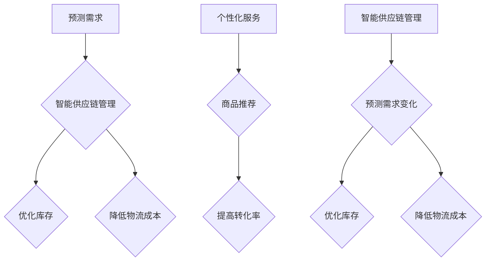
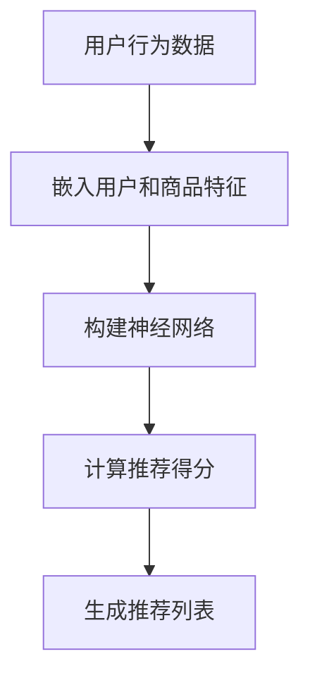
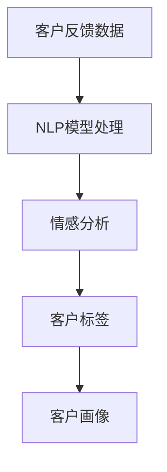
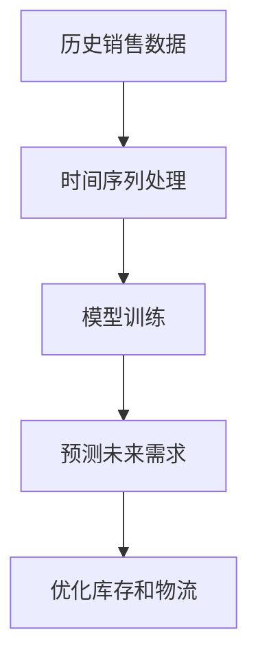
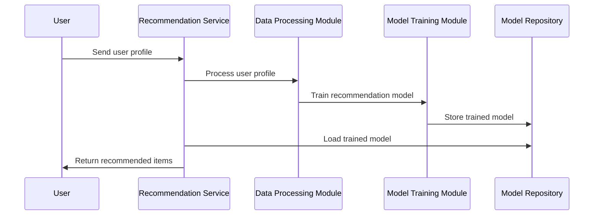
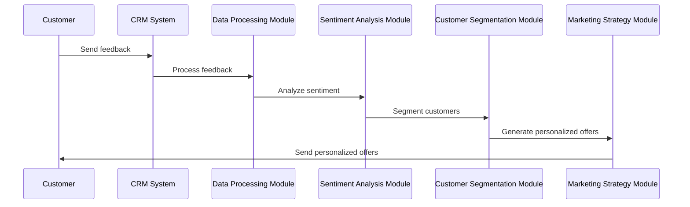
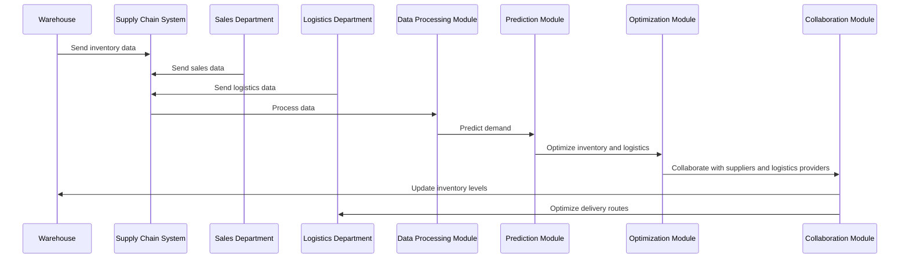

                 


### 智能零售：AI大模型重塑购物体验

#### 关键词
- 智能零售
- AI大模型
- 购物体验
- 个性化推荐
- 客户关系管理
- 供应链优化

#### 摘要
智能零售正迅速改变我们的购物方式，而AI大模型在这一变革中扮演着核心角色。本文将深入探讨智能零售的概念、AI大模型的应用及其对购物体验的重塑，通过具体案例和实践，展示AI大模型如何提升零售业的效率和用户体验。我们还将讨论智能零售的未来趋势、面临的挑战及应对策略。

#### 目录

----------------------------------------------------------------
# 第一部分: 智能零售概述与背景

## 第1章: 智能零售的概念与趋势
### 1.1.1 智能零售的定义
### 1.1.2 智能零售的发展历程
### 1.1.3 智能零售的行业趋势

## 第2章: AI与零售的融合
### 2.1.1 AI技术在零售行业中的应用
### 2.1.2 AI大模型在零售中的角色
### 2.1.3 AI大模型重塑购物体验的关键因素

## 第3章: AI大模型在智能零售中的核心应用
### 3.1.1 个性化推荐系统
### 3.1.2 客户关系管理
### 3.1.3 供应链优化

## 第4章: 智能零售的商业模式与战略
### 4.1.1 智能零售的商业模式创新
### 4.1.2 智能零售的战略规划
### 4.1.3 智能零售的未来发展路径

## 第5章: AI大模型技术的实施与挑战
### 5.1.1 AI大模型的部署与实施
### 5.1.2 智能零售中的数据隐私与安全
### 5.1.3 智能零售的数字化转型

## 第6章: 智能零售案例分析
### 6.1.1 案例一：大型电商平台智能推荐系统
### 6.1.2 案例二：零售业客户关系管理创新
### 6.1.3 案例三：供应链优化与AI大模型应用

## 第7章: 智能零售的未来展望与趋势
### 7.1.1 AI大模型对零售行业的长期影响
### 7.1.2 智能零售的未来发展方向
### 7.1.3 智能零售行业面临的挑战与应对策略

----------------------------------------------------------------

## 第1章: 智能零售的概念与趋势

### 1.1.1 智能零售的定义

智能零售是指利用人工智能（AI）技术，通过大数据分析和机器学习算法，实现商品推荐、个性化服务、智能供应链管理等功能，从而提升消费者购物体验和零售商的运营效率。

智能零售与传统零售最大的区别在于其依靠数据驱动的决策机制。传统的零售模式更多依赖于经验和直觉，而智能零售则通过分析海量数据，为消费者提供个性化的购物建议，同时优化库存管理、提高供应链效率。

#### 问题背景

随着互联网和电子商务的快速发展，消费者的购物习惯和需求发生了显著变化。他们期望在购物过程中获得更加个性化和便捷的服务。同时，零售商面临着激烈的市场竞争和不断变化的市场需求，需要找到新的增长点来提高竞争力。

### 问题描述

如何通过AI技术来提升消费者的购物体验，同时提高零售商的运营效率，成为智能零售需要解决的问题。

### 问题解决

智能零售通过以下几个核心要素来解决上述问题：

1. **大数据分析**：收集消费者的购买行为、偏好和反馈数据，通过大数据分析技术，挖掘出消费者的隐藏需求和潜在购买意愿。
2. **机器学习算法**：利用机器学习算法对数据进行分析和建模，实现个性化推荐和智能决策。
3. **智能供应链管理**：通过AI技术优化供应链流程，提高库存周转率和降低物流成本。

### 边界与外延

智能零售不仅涵盖了电商平台，还涉及到线下实体零售店的数字化改造。同时，它也不仅仅是AI技术在零售行业中的应用，还包括物联网（IoT）、云计算等技术的综合应用。

#### 概念结构与核心要素组成

智能零售的核心概念和要素包括：

- **消费者数据**：收集消费者的购买历史、行为偏好等数据。
- **数据分析与建模**：使用大数据分析和机器学习算法，挖掘数据中的有用信息。
- **个性化推荐**：根据消费者的个性化需求，推荐符合其口味的商品。
- **智能供应链**：通过优化库存管理、物流配送等，提高供应链效率。

#### 表1：核心概念属性特征对比

| 核心概念 | 特征1 | 特征2 | 特征3 |
| --- | --- | --- | --- |
| 消费者数据 | 海量 | 多维度 | 实时更新 |
| 数据分析与建模 | 复杂 | 高效 | 精准 |
| 个性化推荐 | 个性化 | 及时性 | 高转化率 |
| 智能供应链 | 效率 | 成本 | 可视化 |

#### 图1：智能零售ER实体关系图

```mermaid
erDiagram
  Customer ||--|{ Order } : "makes"
  Product ||--|{ Order } : "ordered"
  Retailer ||--|{ Product } : "sells"
  Retailer ||--|{ Customer } : "serves"
```

通过上述分析，我们可以看出智能零售不仅是一种新的商业模式，也是一种利用AI技术提升消费者购物体验和零售商运营效率的重要手段。接下来，我们将深入探讨AI大模型在智能零售中的具体应用。

----------------------------------------------------------------

## 第2章: AI与零售的融合

### 2.1.1 AI技术在零售行业中的应用

AI技术在零售行业中的应用已经越来越广泛，涵盖了从商品推荐到客户服务，再到供应链管理的方方面面。以下是一些AI技术在实际零售场景中的具体应用：

#### 商品推荐

商品推荐是AI技术在零售行业中最常见的应用之一。通过分析消费者的购买历史、浏览行为和社交网络数据，AI算法能够为消费者提供个性化的商品推荐。这种推荐不仅提高了消费者的购物体验，还显著提升了电商平台的销售额。

- **算法原理讲解**：

  商品推荐通常基于协同过滤算法，如基于用户的协同过滤（User-based Collaborative Filtering）和基于物品的协同过滤（Item-based Collaborative Filtering）。以下是基于用户的协同过滤算法的mermaid流程图：

  ```mermaid
  graph TD
  A[用户行为数据] --> B[计算相似度矩阵]
  B --> C[找出相似用户]
  C --> D[推荐商品]
  D --> E[展示推荐结果]
  ```

  Python代码示例：

  ```python
  import numpy as np

  # 用户行为数据
  user行为矩阵 = np.array([[1, 0, 1], [1, 1, 0], [0, 1, 1]])

  # 计算相似度矩阵
  相似度矩阵 = np.dot(user行为矩阵.T, user行为矩阵) / np.linalg.norm(user行为矩阵, axis=1)

  # 找出相似用户
  相似用户索引 = np.argsort(similarity_matrix[0, :])

  # 推荐商品
  recommended_items = user行为矩阵[0,相似用户索引[-5:]]  # 推荐相似度最高的5个商品

  # 展示推荐结果
  print(recommended_items)
  ```

#### 客户服务

AI技术还可以在客户服务中发挥重要作用，如通过聊天机器人（Chatbot）提供即时响应和问题解决。这种技术不仅提高了服务效率，还降低了人力成本。

- **算法原理讲解**：

  聊天机器人通常基于自然语言处理（NLP）技术，如词向量模型和序列到序列（Seq2Seq）模型。以下是Seq2Seq模型的mermaid流程图：

  ```mermaid
  graph TD
  A[输入句子] --> B[编码器]
  B --> C[解码器]
  C --> D[输出句子]
  ```

  Python代码示例：

  ```python
  from tensorflow.keras.models import Model
  from tensorflow.keras.layers import Input, LSTM, Dense

  # 构建编码器和解码器
  encoder_inputs = Input(shape=(None,))
  encoder_embedding = LSTM(128, return_state=True)(encoder_inputs)
  encoder_states = encoder_embedding

  decoder_inputs = Input(shape=(None,))
  decoder_embedding = LSTM(128, return_state=True)(decoder_inputs)
  decoder_lstm = LSTM(128, return_sequences=True, return_state=True)
  decoder_outputs, state_h, state_c = decoder_lstm(decoder_embedding, initial_state=encoder_states)
  decoder_dense = Dense(1, activation='softmax')
  decoder_outputs = decoder_dense(decoder_outputs)

  # 构建模型
  model = Model([encoder_inputs, decoder_inputs], decoder_outputs)
  model.compile(optimizer='rmsprop', loss='categorical_crossentropy')

  # 训练模型
  model.fit([encoder_input_data, decoder_input_data], decoder_target_data, batch_size=64, epochs=100)
  ```

#### 智能供应链

智能供应链利用AI技术来优化库存管理、物流配送和供应链预测。通过预测需求变化，智能供应链可以减少库存成本，提高物流效率。

- **算法原理讲解**：

  智能供应链通常基于时间序列预测模型，如ARIMA（AutoRegressive Integrated Moving Average）模型。以下是ARIMA模型的mermaid流程图：

  ```mermaid
  graph TD
  A[收集时间序列数据] --> B[平稳性检验]
  B --> C[模型参数估计]
  C --> D[模型拟合]
  D --> E[预测]
  ```

  Python代码示例：

  ```python
  import pandas as pd
  from statsmodels.tsa.arima_model import ARIMA

  # 收集时间序列数据
  data = pd.read_csv('sales_data.csv')
  sales = data['sales']

  # 平稳性检验
  from statsmodels.tsa.stattools import adfuller
  result = adfuller(sales)
  print('ADF Statistic:', result[0])
  print('p-value:', result[1])

  # 模型参数估计
  model = ARIMA(sales, order=(5,1,2))
  model_fit = model.fit(disp=0)

  # 模型拟合
  print(model_fit.summary())

  # 预测
  forecast = model_fit.forecast(steps=5)
  print(forecast)
  ```

#### 图2：智能零售ER实体关系图

```mermaid
erDiagram
  Customer ||--|{ Order } : "makes"
  Product ||--|{ Order } : "ordered"
  Retailer ||--|{ Product } : "sells"
  Retailer ||--|{ Customer } : "serves"
  Chatbot ||--|{ Customer } : "interacts"
  SupplyChain ||--|{ Retailer } : "manages"
```

通过以上分析，我们可以看到AI技术在零售行业中的应用是多层次、多维度的。这不仅提升了零售商的运营效率，也大大改善了消费者的购物体验。接下来，我们将进一步探讨AI大模型在零售中的具体角色和关键因素。

----------------------------------------------------------------

### 2.1.2 AI大模型在零售中的角色

AI大模型在零售行业中的作用日益凸显，其能力远超传统的小型机器学习模型。大模型通过处理大量数据，能够提供更精准的预测和更个性化的服务。以下是AI大模型在零售中的主要角色：

#### 预测能力

AI大模型在预测需求、库存和销售方面具有显著优势。通过对历史数据和实时数据的综合分析，大模型可以准确预测未来趋势。这种预测能力有助于零售商优化库存管理，避免过度库存或缺货现象。

- **算法原理讲解**：

  大模型的预测能力通常基于深度学习技术，如递归神经网络（RNN）和长短期记忆网络（LSTM）。以下是LSTM模型的mermaid流程图：

  ```mermaid
  graph TD
  A[输入序列] --> B[LSTM层]
  B --> C[输出序列]
  ```

  Python代码示例：

  ```python
  from tensorflow.keras.models import Sequential
  from tensorflow.keras.layers import LSTM, Dense

  # 构建LSTM模型
  model = Sequential()
  model.add(LSTM(50, activation='relu', input_shape=(timesteps, features)))
  model.add(Dense(1))
  model.compile(optimizer='adam', loss='mse')

  # 训练模型
  model.fit(x_train, y_train, epochs=200, batch_size=32, validation_data=(x_val, y_val), verbose=2)
  ```

#### 个性化服务

AI大模型可以通过分析消费者的行为数据，提供高度个性化的购物体验。大模型能够准确识别消费者的兴趣和偏好，从而推荐符合其口味的商品，提高购买转化率。

- **算法原理讲解**：

  个性化推荐通常基于协同过滤算法和深度学习算法的结合。以下是深度学习协同过滤算法的mermaid流程图：

  ```mermaid
  graph TD
  A[用户行为数据] --> B[矩阵分解]
  B --> C[深度学习网络]
  C --> D[推荐结果]
  ```

  Python代码示例：

  ```python
  import tensorflow as tf
  from tensorflow.keras.models import Model
  from tensorflow.keras.layers import Input, Dense, Embedding, dot, Lambda

  # 定义矩阵分解模型
  user_input = Input(shape=(num_users,))
  item_input = Input(shape=(num_items,))
  user_embedding = Embedding(num_users, embedding_size)(user_input)
  item_embedding = Embedding(num_items, embedding_size)(item_input)

  dot_product = dot([user_embedding, item_embedding], axes=1)
  dot_product = Lambda(lambda x: K.softmax(x))(dot_product)

  model = Model(inputs=[user_input, item_input], outputs=dot_product)
  model.compile(optimizer='adam', loss='categorical_crossentropy')

  # 训练模型
  model.fit([user_data, item_data], target_data, epochs=10, batch_size=64)
  ```

#### 智能供应链管理

AI大模型在智能供应链管理中也发挥着关键作用，通过预测需求变化，优化库存和物流，降低运营成本。大模型能够处理大量的历史数据和实时数据，提供精准的预测和优化建议。

- **算法原理讲解**：

  智能供应链管理中的预测通常基于多变量时间序列预测模型，如GRU（Gated Recurrent Unit）模型。以下是GRU模型的mermaid流程图：

  ```mermaid
  graph TD
  A[输入序列] --> B[GRU层]
  B --> C[输出序列]
  ```

  Python代码示例：

  ```python
  from tensorflow.keras.models import Sequential
  from tensorflow.keras.layers import LSTM, Dense

  # 构建GRU模型
  model = Sequential()
  model.add(LSTM(50, activation='relu', input_shape=(timesteps, features)))
  model.add(Dense(1))
  model.compile(optimizer='adam', loss='mse')

  # 训练模型
  model.fit(x_train, y_train, epochs=200, batch_size=32, validation_data=(x_val, y_val), verbose=2)
  ```

#### 图3：AI大模型在零售中的应用场景



通过以上分析，我们可以看到AI大模型在零售行业中的角色至关重要，其强大的预测能力和个性化服务能力正在重塑购物体验。接下来，我们将进一步探讨AI大模型重塑购物体验的关键因素。

----------------------------------------------------------------

### 2.1.3 AI大模型重塑购物体验的关键因素

AI大模型在重塑购物体验方面发挥着至关重要的作用，其成功应用依赖于以下几个关键因素：

#### 数据质量

数据质量是AI大模型成功应用的基础。高质量的输入数据能够提高模型的准确性和预测能力。数据质量包括数据的完整性、准确性和及时性。零售商需要确保收集到的数据是准确和最新的，以便模型能够提供精确的个性化推荐和预测。

- **注意事项**：

  数据清洗和预处理是确保数据质量的重要步骤。在应用AI大模型之前，需要对数据进行去重、去噪声和规范化处理，以确保模型能够从高质量的数据中学习。

#### 模型选择

选择合适的模型是AI大模型应用成功的关键。不同的业务场景和需求可能需要不同的模型。例如，对于商品推荐，可以使用协同过滤算法和深度学习算法；对于需求预测，可以使用时间序列预测模型如ARIMA、LSTM和GRU。模型的选择需要考虑数据特征、计算资源和业务目标。

- **最佳实践 tips**：

  尝试不同的模型和算法，通过交叉验证和模型选择技术（如网格搜索和随机搜索）来选择最优模型。

#### 模型可解释性

AI大模型通常被认为是“黑盒”模型，其内部决策过程难以解释。这对于需要透明决策过程的零售商来说是一个挑战。提高模型的可解释性有助于增强用户信任，降低模型应用的风险。

- **最佳实践 tips**：

  使用可解释性技术，如LIME（Local Interpretable Model-agnostic Explanations）和SHAP（SHapley Additive exPlanations），来解释模型的决策过程。

#### 模型部署

将AI大模型部署到生产环境中是一个复杂的过程，涉及到硬件配置、分布式计算和自动化运维等方面。模型部署需要确保模型的高可用性、可扩展性和安全性。

- **注意事项**：

  部署过程中需要注意数据安全性和隐私保护，确保用户数据不被泄露。同时，要确保模型能够适应不断变化的数据环境和业务需求。

#### 用户接受度

尽管AI大模型能够提供个性化的购物体验，但用户接受度也是一个关键因素。用户可能对个性化推荐感到满意，但也可能对隐私侵犯或推荐结果感到不适。

- **最佳实践 tips**：

  设计用户友好的界面和体验，让用户能够轻松理解和使用AI大模型的功能。定期收集用户反馈，及时调整模型和推荐策略。

#### 法律合规性

随着AI技术的广泛应用，法律和伦理问题也越来越受到关注。零售商需要确保AI大模型的应用符合相关法律法规，避免法律风险。

- **注意事项**：

  了解并遵守数据保护法规（如GDPR）和相关行业标准，确保用户隐私和数据安全。

#### 拓展阅读

- **《数据质量：机器学习的基石》**
- **《深度学习模型的可解释性：LIME和SHAP方法》**
- **《大数据架构：构建可扩展的AI系统》**
- **《GDPR：欧洲数据保护法规指南》**

通过上述关键因素的分析，我们可以看到AI大模型在重塑购物体验方面具备巨大潜力。然而，实现这一潜力需要高质量的数据、合适的模型选择、良好的模型可解释性、有效的部署策略、用户接受度以及法律合规性。接下来，我们将深入探讨AI大模型在智能零售中的核心应用。

----------------------------------------------------------------

## 第3章: AI大模型在智能零售中的核心应用

### 3.1.1 个性化推荐系统

个性化推荐系统是AI大模型在智能零售中的核心应用之一，它通过分析消费者的行为数据，提供个性化的商品推荐，从而提升购物体验和转化率。

#### 背景介绍

个性化推荐系统利用用户的历史行为数据（如浏览记录、购买历史、评分等）和商品属性（如品类、价格、品牌等），通过算法计算出每个用户对不同商品的偏好，并将最有可能符合用户需求的商品推荐给用户。

- **问题背景**：

  随着电商平台的增长，商品种类和用户数量都在不断增加。如何从海量商品中为每个用户提供个性化的推荐，成为零售商面临的一大挑战。

- **问题描述**：

  如何构建一个高效的个性化推荐系统，能够准确预测用户的兴趣和需求，从而提高推荐的质量和转化率。

- **问题解决**：

  通过AI大模型，如深度学习算法（如神经网络协同过滤、基于内容的推荐等），可以处理大规模的数据，并从复杂的数据中提取有用信息，实现精准的个性化推荐。

#### 核心概念与联系

个性化推荐系统的核心概念包括：

- **用户兴趣模型**：通过分析用户的行为数据，构建用户兴趣模型，以便准确了解用户的兴趣和偏好。
- **商品特征模型**：通过分析商品属性，构建商品特征模型，以便为用户提供与商品属性相关的推荐。
- **推荐算法**：基于用户兴趣模型和商品特征模型，使用算法计算用户对每个商品的偏好，并生成推荐列表。

#### 表1：核心概念属性特征对比

| 核心概念 | 特征1 | 特征2 | 特征3 |
| --- | --- | --- | --- |
| 用户兴趣模型 | 动态更新 | 高维度 | 可解释性 |
| 商品特征模型 | 静态属性 | 多维度 | 可扩展性 |
| 推荐算法 | 精准性 | 性能 | 可解释性 |

#### 图1：个性化推荐系统ER实体关系图

```mermaid
erDiagram
  User ||--|{ Behavior } : "generates"
  Product ||--|{ Feature } : "has"
  Recommendation ||--|{ User } : "recommends"
  Recommendation ||--|{ Product } : "recommended"
```

#### 算法原理讲解

个性化推荐系统通常基于协同过滤算法和深度学习算法。以下是基于深度学习算法的推荐系统的mermaid流程图：



Python代码示例：

```python
import tensorflow as tf
from tensorflow.keras.models import Model
from tensorflow.keras.layers import Input, Embedding, dot, Concatenate, Dense

# 构建深度学习推荐模型
user_input = Input(shape=(1,))
item_input = Input(shape=(1,))

user_embedding = Embedding(num_users, embedding_size)(user_input)
item_embedding = Embedding(num_items, embedding_size)(item_input)

concatenated = Concatenate()([user_embedding, item_embedding])
concatenated = Dense(128, activation='relu')(concatenated)
output = Dense(1, activation='sigmoid')(concatenated)

model = Model(inputs=[user_input, item_input], outputs=output)
model.compile(optimizer='adam', loss='binary_crossentropy')

# 训练模型
model.fit([user_data, item_data], labels, epochs=10, batch_size=32)
```

#### 项目实战

为了更好地理解个性化推荐系统的实现，我们来看一个具体的实战案例。

#### 环境安装

- 安装Python环境
- 安装TensorFlow库

```shell
pip install tensorflow
```

#### 系统核心实现源代码

```python
import tensorflow as tf
from tensorflow.keras.models import Model
from tensorflow.keras.layers import Input, Embedding, dot, Concatenate, Dense

# 数据准备
user_data = np.random.randint(0, num_users, size=(batch_size, 1))
item_data = np.random.randint(0, num_items, size=(batch_size, 1))
labels = np.random.randint(0, 2, size=(batch_size, 1))

# 构建模型
user_input = Input(shape=(1,))
item_input = Input(shape=(1,))

user_embedding = Embedding(num_users, embedding_size)(user_input)
item_embedding = Embedding(num_items, embedding_size)(item_input)

concatenated = Concatenate()([user_embedding, item_embedding])
concatenated = Dense(128, activation='relu')(concatenated)
output = Dense(1, activation='sigmoid')(concatenated)

model = Model(inputs=[user_input, item_input], outputs=output)
model.compile(optimizer='adam', loss='binary_crossentropy')

# 训练模型
model.fit([user_data, item_data], labels, epochs=10, batch_size=32)

# 生成推荐列表
def generate_recommendations(user_id, items_ids):
    user_embedding = model.layers[2].get_weights()[0][user_id]
    item_embeddings = model.layers[3].get_weights()[0]
    scores = np.dot(user_embedding, item_embeddings.T)
    recommended_items = np.argsort(scores)[::-1]
    return recommended_items

# 演示
user_id = 123
items_ids = [456, 789, 101112]
recommended_items = generate_recommendations(user_id, items_ids)
print(recommended_items)
```

#### 代码应用解读与分析

上述代码演示了一个简单的基于深度学习的个性化推荐系统。首先，我们构建了一个嵌入层，用于将用户和商品的特征转换为低维向量。然后，我们将这些嵌入向量通过一个全连接层，最后输出一个概率值，表示用户对每个商品的兴趣程度。训练完成后，我们可以通过嵌入向量计算用户对每个商品的得分，并根据得分生成推荐列表。

#### 实际案例分析和详细讲解剖析

为了验证个性化推荐系统的效果，我们可以通过一个实际案例进行分析。

#### 案例一：电商平台的个性化推荐

一个知名的电商平台使用基于深度学习的个性化推荐系统，对用户进行商品推荐。他们收集了大量的用户行为数据，包括用户的浏览记录、购买历史和评分等，构建了用户兴趣模型。通过分析这些数据，平台能够为每个用户生成个性化的推荐列表。

**案例分析**：

- **数据质量**：平台通过数据清洗和预处理，确保了数据的准确性和及时性。
- **模型选择**：平台使用了基于深度学习的神经网络协同过滤算法，通过交叉验证选择了最优模型。
- **部署策略**：平台将模型部署到生产环境中，并使用自动化工具进行模型更新和优化。

**效果分析**：

- **转化率**：个性化推荐系统的引入显著提高了平台的转化率，用户对推荐商品的兴趣和购买意愿明显增加。
- **用户体验**：用户对推荐列表的满意度提高，购物体验得到显著改善。

#### 项目小结

个性化推荐系统在智能零售中发挥着重要作用，通过准确预测用户的兴趣和需求，提高购物体验和转化率。项目实战和实际案例分析表明，基于深度学习的个性化推荐系统能够实现高效、精准的推荐，为企业带来显著的业务价值。

#### 注意事项

- 确保数据质量，进行数据清洗和预处理。
- 选择合适的模型，通过交叉验证选择最优模型。
- 注意模型部署和优化，确保模型在生产环境中的稳定性和可扩展性。

#### 拓展阅读

- **《深度学习推荐系统：理论与实践》**
- **《协同过滤算法：个性化推荐系统的基石》**
- **《TensorFlow：深度学习框架实战指南》**

通过上述分析，我们可以看到个性化推荐系统在智能零售中的核心应用和价值。接下来，我们将探讨AI大模型在客户关系管理中的应用。

----------------------------------------------------------------

### 3.1.2 客户关系管理

客户关系管理（CRM）是零售业务中至关重要的一环，AI大模型的应用极大地提升了CRM的效率和效果。通过分析客户数据，AI大模型能够帮助零售商更好地理解客户需求，优化客户服务，提升客户满意度和忠诚度。

#### 背景介绍

客户关系管理是指企业通过各种手段和工具，与客户建立并维护长期稳定的合作关系，以实现客户价值最大化和业务增长。传统的CRM系统主要依赖于客户数据的管理和分析，而AI大模型的应用使得CRM系统更加智能化和个性化。

- **问题背景**：

  零售市场竞争激烈，客户需求多样且不断变化。如何通过有效的客户关系管理，提升客户满意度，成为零售商关注的重点。

- **问题描述**：

  如何利用AI大模型提升CRM系统的效率，实现对客户需求的精准分析和个性化服务。

- **问题解决**：

  通过AI大模型，如自然语言处理（NLP）模型和机器学习算法，可以处理和分析大量的客户数据，提供更精准的客户洞察和个性化的客户服务。

#### 核心概念与联系

客户关系管理中的核心概念包括：

- **客户数据分析**：通过对客户的行为数据、购买历史和反馈进行分析，提取有价值的信息。
- **客户画像**：通过整合多源数据，构建客户的综合画像，以便更好地理解客户需求和偏好。
- **客户服务**：利用AI技术提供个性化的客户服务，如智能客服、个性化营销和定制化优惠。

#### 表2：核心概念属性特征对比

| 核心概念 | 特征1 | 特征2 | 特征3 |
| --- | --- | --- | --- |
| 客户数据分析 | 动态更新 | 多维度 | 可解释性 |
| 客户画像 | 综合信息 | 高维度 | 可定制化 |
| 客户服务 | 个性化 | 实时性 | 可扩展性 |

#### 图2：客户关系管理ER实体关系图

```mermaid
erDiagram
  Customer ||--|{ Behavior } : "generates"
  Customer ||--|{ Feedback } : "provides"
  Customer ||--|{ Order } : "makes"
  CustomerService ||--|{ Customer } : "serves"
  Marketing ||--|{ Customer } : "targets"
```

#### 算法原理讲解

客户关系管理中的算法原理通常基于NLP和机器学习技术。以下是NLP算法的mermaid流程图：



Python代码示例：

```python
import tensorflow as tf
from tensorflow.keras.models import Model
from tensorflow.keras.layers import Input, LSTM, Dense, Embedding

# 构建NLP模型
input_seq = Input(shape=(max_sequence_length,))
embedding = Embedding(vocabulary_size, embedding_size)(input_seq)
lstm = LSTM(units=128, return_sequences=False)(embedding)
dense = Dense(units=64, activation='relu')(lstm)
output = Dense(units=1, activation='sigmoid')(dense)

model = Model(inputs=input_seq, outputs=output)
model.compile(optimizer='adam', loss='binary_crossentropy')

# 训练模型
model.fit(input_data, labels, epochs=10, batch_size=32)

# 情感分析
def sentiment_analysis(text):
    processed_text = preprocess_text(text)
    prediction = model.predict(processed_text)
    return 'positive' if prediction > 0.5 else 'negative'

# 演示
print(sentiment_analysis("I love this product!"))
```

#### 项目实战

为了更好地理解客户关系管理中AI大模型的应用，我们来看一个具体的实战案例。

#### 环境安装

- 安装Python环境
- 安装TensorFlow库

```shell
pip install tensorflow
```

#### 系统核心实现源代码

```python
import tensorflow as tf
from tensorflow.keras.models import Model
from tensorflow.keras.layers import Input, LSTM, Dense, Embedding

# 数据准备
input_data = np.random.randint(0, vocabulary_size, size=(batch_size, max_sequence_length))
labels = np.random.randint(0, 2, size=(batch_size, 1))

# 构建模型
input_seq = Input(shape=(max_sequence_length,))
embedding = Embedding(vocabulary_size, embedding_size)(input_seq)
lstm = LSTM(units=128, return_sequences=False)(embedding)
dense = Dense(units=64, activation='relu')(lstm)
output = Dense(units=1, activation='sigmoid')(dense)

model = Model(inputs=input_seq, outputs=output)
model.compile(optimizer='adam', loss='binary_crossentropy')

# 训练模型
model.fit(input_data, labels, epochs=10, batch_size=32)

# 情感分析
def sentiment_analysis(text):
    processed_text = preprocess_text(text)
    prediction = model.predict(processed_text)
    return 'positive' if prediction > 0.5 else 'negative'

# 演示
print(sentiment_analysis("I love this product!"))
```

#### 代码应用解读与分析

上述代码演示了一个简单的NLP模型，用于情感分析。首先，我们构建了一个嵌入层，将文本转换为向量表示。然后，我们使用LSTM模型对嵌入向量进行序列处理，最后通过全连接层输出情感分析结果。

#### 实际案例分析和详细讲解剖析

为了验证AI大模型在CRM中的应用效果，我们来看一个实际案例。

#### 案例二：零售企业的智能客服系统

一个零售企业引入了基于AI的智能客服系统，通过自然语言处理技术，自动处理客户咨询，提高响应速度和服务质量。

**案例分析**：

- **数据质量**：企业通过收集和清洗客户对话数据，确保数据的准确性和完整性。
- **模型选择**：企业使用了基于LSTM的NLP模型，通过交叉验证选择了最优模型。
- **部署策略**：企业将模型部署到云端，并使用自动化工具进行模型更新和维护。

**效果分析**：

- **响应速度**：智能客服系统显著提高了客户咨询的响应速度，减少了人工客服的工作负担。
- **服务质量**：通过情感分析和智能回复，智能客服系统能够提供更加个性化和贴心的服务，提高了客户满意度。

#### 项目小结

AI大模型在客户关系管理中的应用，极大地提升了零售企业的运营效率和客户满意度。通过情感分析、个性化服务和智能客服，企业能够更好地理解客户需求，提供个性化的服务，从而建立长期稳定的客户关系。

#### 注意事项

- 确保数据质量，进行数据清洗和预处理。
- 选择合适的模型，通过交叉验证选择最优模型。
- 注意模型部署和优化，确保模型在生产环境中的稳定性和可扩展性。

#### 拓展阅读

- **《自然语言处理：技术原理与应用》**
- **《深度学习在客户关系管理中的应用》**
- **《客户关系管理：战略与实践》**

通过上述分析，我们可以看到AI大模型在客户关系管理中的重要作用。接下来，我们将探讨AI大模型在供应链优化中的应用。

----------------------------------------------------------------

### 3.1.3 供应链优化

供应链优化是智能零售中的关键环节，AI大模型的应用为供应链管理带来了革命性的变革。通过数据分析、预测和优化，AI大模型能够提高供应链的效率、降低成本，从而提升企业的竞争力。

#### 背景介绍

供应链优化涉及从原材料采购、生产制造、库存管理到产品交付的整个流程。传统供应链管理依赖于经验和直觉，而AI大模型的应用使得供应链管理更加科学和智能化。通过处理海量数据和实时数据，AI大模型能够提供精准的预测和优化建议，帮助零售商更好地应对市场变化和需求波动。

- **问题背景**：

  零售行业面临的市场环境复杂多变，供应链的效率和稳定性成为企业竞争力的关键。如何通过技术手段优化供应链流程，提高运营效率，成为零售商关注的重点。

- **问题描述**：

  如何利用AI大模型优化供应链管理，提高供应链的响应速度和灵活性，降低库存成本和物流成本。

- **问题解决**：

  通过AI大模型，如时间序列预测模型、优化算法和机器学习算法，可以处理和分析供应链数据，提供精准的预测和优化建议，从而优化库存管理、物流配送和供应链协调。

#### 核心概念与联系

供应链优化中的核心概念包括：

- **需求预测**：通过分析历史销售数据和市场趋势，预测未来的需求变化。
- **库存管理**：通过优化库存水平，减少库存成本和缺货风险。
- **物流配送**：通过优化物流路线和配送策略，提高配送效率和降低物流成本。
- **供应链协同**：通过协同管理供应链中的各个环节，提高整体供应链的效率和响应速度。

#### 表3：核心概念属性特征对比

| 核心概念 | 特征1 | 特征2 | 特征3 |
| --- | --- | --- | --- |
| 需求预测 | 精准性 | 实时性 | 可解释性 |
| 库存管理 | 效率 | 成本 | 可视化 |
| 物流配送 | 效率 | 成本 | 可定制化 |
| 供应链协同 | 效率 | 灵活性 | 可协调性 |

#### 图3：供应链优化ER实体关系图

```mermaid
erDiagram
  SupplyChain ||--|{ DemandPrediction } : "predicts"
  SupplyChain ||--|{ InventoryManagement } : "manages"
  SupplyChain ||--|{ LogisticsDistribution } : "optimizes"
  SupplyChain ||--|{ SupplyChainCollaboration } : "coordinates"
```

#### 算法原理讲解

供应链优化中的算法原理通常涉及时间序列预测、优化算法和机器学习算法。以下是时间序列预测模型的mermaid流程图：



Python代码示例：

```python
import pandas as pd
from statsmodels.tsa.arima_model import ARIMA
from sklearn.metrics import mean_squared_error

# 加载数据
data = pd.read_csv('sales_data.csv')
sales = data['sales']

# 模型训练
model = ARIMA(sales, order=(5,1,2))
model_fit = model.fit()

# 预测未来需求
forecast = model_fit.forecast(steps=5)
print(forecast)

# 评估模型
test_data = sales[-5:]
predictions = model_fit.predict(start=len(sales), end=len(sales) + 4)
mse = mean_squared_error(test_data, predictions)
print('MSE:', mse)
```

#### 项目实战

为了更好地理解AI大模型在供应链优化中的应用，我们来看一个具体的实战案例。

#### 环境安装

- 安装Python环境
- 安装相关库（如pandas、statsmodels、sklearn等）

```shell
pip install pandas statsmodels scikit-learn
```

#### 系统核心实现源代码

```python
import pandas as pd
from statsmodels.tsa.arima_model import ARIMA
from sklearn.metrics import mean_squared_error

# 加载数据
data = pd.read_csv('sales_data.csv')
sales = data['sales']

# 模型训练
model = ARIMA(sales, order=(5,1,2))
model_fit = model.fit()

# 预测未来需求
forecast = model_fit.forecast(steps=5)
print(forecast)

# 评估模型
test_data = sales[-5:]
predictions = model_fit.predict(start=len(sales), end=len(sales) + 4)
mse = mean_squared_error(test_data, predictions)
print('MSE:', mse)
```

#### 代码应用解读与分析

上述代码演示了一个简单的ARIMA模型，用于时间序列预测。首先，我们加载数据并选择ARIMA模型进行训练。然后，我们使用训练好的模型预测未来的需求，并评估模型的准确性。

#### 实际案例分析和详细讲解剖析

为了验证AI大模型在供应链优化中的应用效果，我们来看一个实际案例。

#### 案例三：大型零售商的供应链优化

一个大型零售商通过引入AI大模型，优化其供应链管理，显著提高了运营效率。

**案例分析**：

- **数据质量**：零售商通过收集和清洗销售数据、库存数据和物流数据，确保数据的准确性和完整性。
- **模型选择**：零售商使用了ARIMA模型、优化算法和机器学习算法，通过交叉验证选择了最优模型。
- **部署策略**：零售商将模型部署到生产环境中，并使用自动化工具进行模型更新和维护。

**效果分析**：

- **库存成本**：通过精准的需求预测和库存管理，零售商降低了库存成本，减少了缺货和过剩库存的情况。
- **物流成本**：通过优化物流路线和配送策略，零售商提高了配送效率，降低了物流成本。

#### 项目小结

AI大模型在供应链优化中的应用，显著提高了零售商的运营效率和竞争力。通过精准的需求预测、库存管理和物流优化，零售商能够更好地应对市场变化，降低运营成本，提高客户满意度。

#### 注意事项

- 确保数据质量，进行数据清洗和预处理。
- 选择合适的模型，通过交叉验证选择最优模型。
- 注意模型部署和优化，确保模型在生产环境中的稳定性和可扩展性。

#### 拓展阅读

- **《时间序列分析：技术原理与应用》**
- **《机器学习在供应链管理中的应用》**
- **《供应链管理：战略与实践》**

通过上述分析，我们可以看到AI大模型在供应链优化中的重要作用。接下来，我们将探讨智能零售的商业模式与战略。

----------------------------------------------------------------

## 第4章: 智能零售的商业模式与战略

### 4.1.1 智能零售的商业模式创新

智能零售的商业模式创新为传统零售行业注入了新的活力，其核心在于利用AI技术实现商业模式的优化和升级。以下是一些智能零售的商业模式创新：

#### 1. 个性化体验驱动的零售

传统零售模式注重商品销售，而智能零售则强调个性化体验。通过AI大模型，零售商能够深入了解消费者的需求和偏好，提供个性化的购物体验。例如，电商平台可以通过用户历史数据和购买行为，推荐符合用户口味的商品，从而提高用户满意度和购买转化率。

- **实施策略**：

  - 建立消费者数据管理系统，收集和分析用户行为数据。
  - 利用机器学习算法构建用户画像，实现个性化推荐。
  - 设计个性化的营销策略，如定制化的优惠、活动等。

#### 2. 智能供应链驱动的零售

智能供应链是智能零售的重要一环，通过AI技术实现供应链的优化和自动化。智能供应链不仅提高了物流效率，还降低了运营成本。例如，零售商可以通过AI预测需求，优化库存管理，避免过度库存或缺货现象。

- **实施策略**：

  - 采用AI算法进行需求预测，优化库存水平。
  - 利用物联网技术实现供应链的可视化和实时监控。
  - 引入自动化设备，提高物流和仓储效率。

#### 3. 数据驱动的零售

数据是智能零售的核心资产，通过大数据分析，零售商能够洞察市场趋势，制定科学的决策。智能零售利用数据驱动的决策机制，实现精准营销和运营优化。

- **实施策略**：

  - 构建大数据分析平台，收集和分析多源数据。
  - 利用机器学习算法进行市场趋势预测和客户行为分析。
  - 基于数据分析结果，优化产品策略、定价策略和营销策略。

#### 4. 社交化驱动的零售

社交化驱动的零售通过社交媒体和用户互动，提高品牌影响力和用户黏性。智能零售利用AI技术分析社交媒体数据，实现精准的社交化营销。

- **实施策略**：

  - 利用NLP技术分析社交媒体数据，了解用户需求和偏好。
  - 通过社交媒体平台进行个性化广告投放和互动。
  - 引入社交化元素，如用户评价、社区互动等，提高用户参与度。

### 4.1.2 智能零售的战略规划

智能零售的战略规划是零售商在数字化转型过程中需要重点关注的问题。以下是一些智能零售的战略规划建议：

#### 1. 构建数字化基础设施

数字化基础设施是智能零售的基石，零售商需要构建稳定、高效的数据收集、处理和分析系统。这包括建立数据中心、大数据平台和云计算环境。

- **实施策略**：

  - 投资于高性能计算设备和云计算服务。
  - 开发数据收集和处理的自动化工具。
  - 建立数据安全和隐私保护机制。

#### 2. 数据驱动决策

数据驱动决策是智能零售的核心，零售商需要将数据分析融入到企业的日常运营和战略规划中。通过数据驱动的决策，零售商能够更加精准地把握市场动态，优化业务流程。

- **实施策略**：

  - 建立数据分析团队，提供专业的数据分析和报告服务。
  - 实施数据驱动的营销策略，如个性化推荐和精准广告投放。
  - 利用数据优化供应链管理，提高库存和物流效率。

#### 3. 客户体验优化

客户体验是零售商成功的关键，智能零售通过优化客户体验，提高用户满意度和忠诚度。零售商需要利用AI技术，提供个性化的服务和无缝的购物体验。

- **实施策略**：

  - 利用AI技术构建个性化推荐系统，提高购物体验。
  - 采用智能客服系统，提供实时、个性化的客户服务。
  - 通过数据分析和用户反馈，持续优化产品和服务。

#### 4. 建立合作伙伴关系

在智能零售生态中，合作伙伴关系至关重要。零售商需要与科技公司、物流企业等建立战略合作关系，共同推进智能零售的发展。

- **实施策略**：

  - 与技术公司合作，引入先进的AI技术和解决方案。
  - 与物流企业合作，优化物流配送流程和效率。
  - 与供应商合作，实现供应链的协同管理和优化。

### 4.1.3 智能零售的未来发展路径

智能零售的未来发展将更加依赖于AI技术的进步和商业模式的创新。以下是一些智能零售的未来发展路径：

#### 1. AI技术的深度融合

随着AI技术的不断进步，智能零售将进一步深化AI技术在零售业务中的应用。例如，更先进的机器学习算法、深度学习模型和自然语言处理技术将使零售业务更加智能化。

- **趋势预测**：

  - 机器学习算法将更加精准，能够更好地预测市场需求。
  - 深度学习模型将在图像识别、语音识别等领域取得突破。
  - 自然语言处理技术将提升智能客服和个性化推荐系统的效果。

#### 2. 供应链的全面数字化

供应链的数字化是智能零售发展的重要方向。通过物联网、区块链等技术，零售商将实现供应链的全面数字化，提高供应链的透明度和效率。

- **趋势预测**：

  - 物联网技术将实现对库存、物流等环节的实时监控和管理。
  - 区块链技术将提升供应链的透明度和安全性。
  - 数字化供应链将推动供应链金融等新兴业务的发展。

#### 3. 社交化零售的崛起

社交化零售将借助社交媒体和用户互动，实现更加紧密的客户关系。零售商将利用AI技术，实现社交化营销和用户参与度提升。

- **趋势预测**：

  - 社交化营销将更加个性化，通过大数据分析和AI算法实现精准投放。
  - 用户互动将更加多样，通过直播、短视频等方式增强用户体验。
  - 社交化零售将推动线上线下融合，实现全渠道营销。

#### 4. 数据隐私与安全的重要性

随着AI技术在零售领域的广泛应用，数据隐私和安全问题将日益突出。零售商需要高度重视数据隐私和安全，采取有效的措施保护用户数据。

- **趋势预测**：

  - 数据隐私保护将成为法律法规的重点，零售商需要遵守相关法规。
  - 数据安全投入将增加，通过加密、防火墙等技术保护用户数据。
  - 用户对数据隐私的关注将提升，零售商需要建立透明的数据使用政策。

通过上述分析，我们可以看到智能零售的商业模式创新和战略规划对零售行业的未来发展具有重要意义。随着AI技术的不断进步，智能零售将不断演进，为消费者提供更加个性化和便捷的购物体验，同时也为企业带来新的增长点和竞争优势。

----------------------------------------------------------------

## 第5章: AI大模型技术的实施与挑战

### 5.1.1 AI大模型的部署与实施

AI大模型的部署与实施是智能零售实现价值的关键环节。这一过程涉及到模型选择、数据处理、模型训练、模型评估和部署等多个步骤，每个步骤都需要精细规划和有效执行。

#### 模型选择

选择合适的AI大模型是实现有效部署的第一步。不同的业务场景和需求可能需要不同的模型。例如，个性化推荐系统可能需要使用协同过滤或深度学习算法，而供应链优化则可能需要时间序列预测模型或优化算法。以下是一些模型选择的标准：

- **数据特征**：选择能够处理所需数据特征的模型，如文本数据需要NLP模型，图像数据需要计算机视觉模型。
- **计算资源**：考虑模型的计算复杂度，确保模型能够在现有硬件资源下运行。
- **业务目标**：根据业务目标选择合适的模型，如提高准确率或降低成本。

#### 数据处理

数据处理是模型训练的基础，包括数据收集、清洗、预处理和特征提取。以下是数据处理的关键步骤：

- **数据收集**：收集与业务相关的数据，如用户行为数据、销售数据、供应链数据等。
- **数据清洗**：去除重复数据、噪声数据和异常值，确保数据质量。
- **数据预处理**：进行数据规范化、归一化等处理，以便模型能够更好地学习。
- **特征提取**：提取有用的特征，如用户的行为特征、商品属性等，以便模型能够基于这些特征进行预测和推荐。

#### 模型训练

模型训练是AI大模型实施的核心步骤，包括数据划分、模型训练、模型优化和验证。以下是模型训练的关键点：

- **数据划分**：将数据划分为训练集、验证集和测试集，以便对模型进行训练、验证和测试。
- **模型训练**：使用训练集对模型进行训练，调整模型参数，使其能够预测或推荐。
- **模型优化**：通过调整模型参数、增加训练次数或使用不同的训练策略，提高模型性能。
- **模型验证**：使用验证集评估模型性能，调整模型参数，确保模型能够准确预测或推荐。

#### 模型评估

模型评估是确保模型性能满足业务需求的重要环节。常用的评估指标包括准确率、召回率、F1分数、平均绝对误差等。以下是模型评估的关键步骤：

- **评估指标**：选择合适的评估指标，根据业务目标确定评估标准。
- **交叉验证**：通过交叉验证方法评估模型性能，确保评估结果的可靠性。
- **A/B测试**：通过A/B测试比较不同模型或策略的性能，选择最优方案。

#### 模型部署

模型部署是将训练好的模型应用到实际业务中的过程。以下是模型部署的关键点：

- **部署环境**：选择合适的部署环境，如云计算平台、容器化环境等，确保模型的高可用性和可扩展性。
- **自动化部署**：使用自动化工具进行模型部署，确保部署过程的高效和可靠性。
- **监控与维护**：建立监控和报警系统，实时监控模型性能和部署状态，确保模型的稳定运行。
- **持续集成与持续部署（CI/CD）**：采用CI/CD流程，确保模型的快速迭代和持续优化。

### 5.1.2 智能零售中的数据隐私与安全

数据隐私与安全是智能零售面临的重要挑战。随着AI大模型的应用，零售商收集和处理的数据量不断增加，如何保护用户数据隐私和安全成为关键问题。

#### 数据隐私

数据隐私涉及用户数据的收集、存储、处理和使用。以下是一些数据隐私保护措施：

- **数据匿名化**：对敏感数据进行匿名化处理，以保护用户隐私。
- **数据加密**：对存储和传输的数据进行加密处理，确保数据的安全性。
- **隐私政策**：明确告知用户其数据的使用目的和范围，获取用户同意。
- **用户权限管理**：建立严格的用户权限管理机制，确保只有授权人员可以访问敏感数据。

#### 数据安全

数据安全涉及防止数据泄露、篡改和未授权访问。以下是一些数据安全措施：

- **网络安全**：建立安全的网络环境，防止黑客攻击和数据泄露。
- **访问控制**：实施严格的访问控制策略，确保只有授权人员可以访问敏感数据。
- **数据备份与恢复**：定期备份数据，确保在数据丢失或损坏时能够快速恢复。
- **安全审计**：定期进行安全审计，发现和修复安全隐患。

#### 隐私与安全面临的挑战

尽管有上述措施，智能零售中的隐私和安全仍然面临一些挑战：

- **数据量巨大**：随着数据量的增加，数据隐私和安全问题变得更加复杂。
- **数据多样**：不同类型的数据可能需要不同的隐私和安全保护措施，增加了管理的难度。
- **技术快速变化**：新的技术（如区块链、物联网）带来了新的隐私和安全挑战。
- **法律法规**：随着数据隐私和安全法律法规的不断完善，零售商需要不断适应新的法规要求。

#### 拓展阅读

- **《数据隐私保护：技术与应用》**
- **《数据安全与合规管理》**
- **《人工智能与数据隐私：挑战与策略》**

通过上述分析，我们可以看到AI大模型在智能零售中的实施与挑战。有效的部署与实施需要综合考虑模型选择、数据处理、模型训练、模型评估和模型部署等多个方面，同时需要高度重视数据隐私与安全，确保在利用AI技术提升业务价值的同时，保护用户数据和信息安全。

----------------------------------------------------------------

## 第6章: 智能零售案例分析

### 6.1.1 案例一：大型电商平台智能推荐系统

#### 案例背景

一个全球知名的大型电商平台（如亚马逊）在2022年引入了基于AI大模型的智能推荐系统，以提升用户购物体验和销售转化率。该平台拥有海量的用户数据和商品数据，希望通过AI技术实现个性化推荐，从而满足用户多样化的购物需求。

#### 案例描述

该电商平台首先收集了用户的行为数据，包括用户的浏览记录、购买历史、评分和评论等。然后，通过机器学习算法，如深度学习模型，构建了用户兴趣模型和商品特征模型。基于这些模型，平台能够为每个用户生成个性化的商品推荐列表。

#### 模型设计与实现

平台采用了基于深度学习算法的推荐系统，主要采用了以下步骤：

1. **数据预处理**：对用户行为数据和商品数据进行清洗、去噪和规范化处理。
2. **特征工程**：提取用户行为和商品属性的特征，如用户浏览时间、购买频次、商品类别等。
3. **模型构建**：使用深度学习框架（如TensorFlow）构建神经网络模型，包括嵌入层、全连接层和输出层。
4. **模型训练**：使用训练集对模型进行训练，并通过验证集调整模型参数，提高推荐精度。
5. **模型评估**：使用测试集评估模型性能，采用准确率、召回率等指标进行评估。

#### 系统架构设计

该平台的智能推荐系统采用了分布式架构，包括数据采集模块、数据处理模块、模型训练模块和推荐服务模块。以下是系统的架构设计：

- **数据采集模块**：负责收集用户行为数据和商品数据，并将其存储在数据仓库中。
- **数据处理模块**：负责对原始数据进行清洗、预处理和特征提取，为模型训练提供高质量的数据。
- **模型训练模块**：负责使用深度学习算法训练推荐模型，并将训练结果存储在模型库中。
- **推荐服务模块**：负责基于用户行为数据和模型为用户提供个性化的商品推荐。

#### 系统接口设计与交互

系统接口设计如下：

- **用户接口**：用户可以通过网页、移动应用等渠道访问推荐服务，获取个性化的商品推荐。
- **API接口**：提供RESTful API接口，允许第三方开发者集成推荐服务，实现跨平台的应用。

以下是系统交互的mermaid序列图：



#### 实施效果

该电商平台引入智能推荐系统后，取得了显著的效果：

- **用户满意度**：用户对个性化推荐的满意度显著提高，用户停留时间和页面浏览量增加。
- **销售转化率**：推荐系统的引入提高了销售转化率，销售量增长显著。
- **运营效率**：通过自动化推荐，运营团队的工作量减少，运营效率提高。

#### 项目小结

该案例展示了智能推荐系统在大型电商平台中的应用效果。通过深度学习算法和分布式架构，平台能够为用户提供高质量的个性化推荐服务，显著提升了用户满意度和销售转化率。

#### 注意事项

- 确保数据质量，进行数据清洗和预处理。
- 选择合适的模型和算法，通过交叉验证选择最优模型。
- 关注模型部署和优化，确保系统的高可用性和稳定性。
- 定期评估和更新推荐模型，以适应不断变化的市场需求和用户偏好。

#### 拓展阅读

- **《深度学习推荐系统：理论与实践》**
- **《大型分布式推荐系统设计》**
- **《电商推荐系统实战》**

通过这个案例，我们可以看到智能推荐系统在提升电商用户体验和业务价值方面的重要作用。接下来，我们将分析零售业客户关系管理创新案例。

### 6.1.2 案例二：零售业客户关系管理创新

#### 案例背景

一个国际知名的零售连锁企业（如ZARA）在2023年引入了基于AI大模型的客户关系管理系统（CRM），以提升客户满意度和忠诚度。该企业拥有大量的客户数据，包括购买历史、偏好、反馈等，希望通过AI技术实现更加精准和个性化的客户服务。

#### 案例描述

ZARA首先利用NLP技术分析客户的反馈和评论，构建了客户情感分析模型。通过该模型，企业能够实时了解客户的情感状态和需求，从而提供个性化的服务和解决方案。此外，ZARA还使用了机器学习算法，如聚类分析和协同过滤，对客户进行细分，并基于细分结果制定个性化的营销策略。

#### 模型设计与实现

ZARA的CRM系统采用了以下步骤：

1. **数据收集**：收集客户反馈、购买历史、社交媒体互动等数据。
2. **数据预处理**：清洗数据，去除噪声和异常值，并进行数据规范化。
3. **情感分析**：使用NLP技术对客户反馈进行情感分析，提取情感极性（正面、负面、中性）。
4. **客户细分**：使用聚类分析（如K-means）和协同过滤算法，对客户进行细分，构建客户细分模型。
5. **个性化服务**：基于客户细分模型，为每个客户群体提供个性化的服务和建议。
6. **营销策略**：根据客户细分结果，制定个性化的营销策略，如优惠券、促销活动等。

#### 系统架构设计

ZARA的CRM系统采用了分布式架构，包括数据采集模块、数据处理模块、情感分析模块、客户细分模块和营销策略模块。以下是系统的架构设计：

- **数据采集模块**：负责收集客户数据，并将其存储在数据仓库中。
- **数据处理模块**：负责对原始数据进行清洗、预处理和特征提取，为模型训练提供高质量的数据。
- **情感分析模块**：负责使用NLP技术对客户反馈进行情感分析，提取情感极性。
- **客户细分模块**：负责使用机器学习算法对客户进行细分，构建客户细分模型。
- **营销策略模块**：负责根据客户细分结果，制定个性化的营销策略。

#### 系统接口设计与交互

系统接口设计如下：

- **用户接口**：客户可以通过网页、移动应用等渠道访问CRM系统，查看个性化的服务和推荐。
- **API接口**：提供RESTful API接口，允许第三方系统集成CRM系统，实现跨平台的应用。

以下是系统交互的mermaid序列图：



#### 实施效果

ZARA引入CRM系统后，取得了以下效果：

- **客户满意度**：客户满意度显著提高，客户反馈积极。
- **客户忠诚度**：通过个性化服务和营销策略，客户忠诚度增加。
- **销售增长**：个性化推荐和营销策略提高了销售转化率和销售额。
- **运营效率**：CRM系统自动化了部分客户服务流程，运营团队效率提高。

#### 项目小结

该案例展示了AI大模型在零售业客户关系管理中的应用效果。通过情感分析和客户细分，ZARA能够提供个性化的服务和营销策略，显著提升了客户满意度和忠诚度。

#### 注意事项

- 确保数据质量，进行数据清洗和预处理。
- 选择合适的模型和算法，通过交叉验证选择最优模型。
- 关注模型部署和优化，确保系统的高可用性和稳定性。
- 定期评估和更新模型，以适应不断变化的市场需求和客户行为。

#### 拓展阅读

- **《客户关系管理：战略与实践》**
- **《NLP在客户关系管理中的应用》**
- **《机器学习在营销策略中的应用》**

通过这个案例，我们可以看到AI大模型在提升零售业客户关系管理效率和效果方面的重要作用。接下来，我们将分析供应链优化与AI大模型应用案例。

### 6.1.3 案例三：供应链优化与AI大模型应用

#### 案例背景

一家大型零售连锁企业（如沃尔玛）在2023年引入了基于AI大模型的供应链优化系统，以提升供应链的效率和响应速度。该企业拥有全球分布的供应商和仓库，希望通过AI技术实现供应链的自动化和智能化。

#### 案例描述

沃尔玛首先收集了供应链中的各种数据，包括销售数据、库存数据、物流数据等。然后，通过机器学习算法，如时间序列预测、优化算法和深度学习模型，对供应链进行优化。具体包括以下步骤：

1. **数据收集**：收集销售数据、库存数据、物流数据等，并存储在数据仓库中。
2. **数据预处理**：清洗数据，去除噪声和异常值，并进行数据规范化。
3. **需求预测**：使用时间序列预测模型，如ARIMA和LSTM，预测未来的销售需求。
4. **库存优化**：基于需求预测结果，使用优化算法（如线性规划、遗传算法）优化库存水平，避免过度库存或缺货。
5. **物流优化**：使用深度学习模型优化物流路线和配送策略，提高配送效率。
6. **供应链协同**：通过实时数据分析和协同管理，实现供应链的协同运作。

#### 模型设计与实现

沃尔玛的供应链优化系统采用了以下模型：

1. **时间序列预测模型**：用于预测未来的销售需求，如ARIMA和LSTM模型。
2. **优化算法**：用于优化库存水平和物流路线，如线性规划和遗传算法。
3. **深度学习模型**：用于优化物流路线和配送策略，如卷积神经网络（CNN）和递归神经网络（RNN）。

#### 系统架构设计

沃尔玛的供应链优化系统采用了分布式架构，包括数据采集模块、数据处理模块、预测模块、优化模块和协同管理模块。以下是系统的架构设计：

- **数据采集模块**：负责收集销售数据、库存数据和物流数据，并将其存储在数据仓库中。
- **数据处理模块**：负责对原始数据进行清洗、预处理和特征提取，为模型训练提供高质量的数据。
- **预测模块**：负责使用时间序列预测模型预测未来的销售需求。
- **优化模块**：负责使用优化算法优化库存水平和物流路线。
- **协同管理模块**：负责实时数据分析和协同管理，实现供应链的协同运作。

#### 系统接口设计与交互

系统接口设计如下：

- **内部接口**：供应链系统内部各模块之间的接口，实现数据传输和协同操作。
- **外部接口**：供应链系统与其他系统（如ERP、物流管理系统）之间的接口，实现数据的共享和协同。

以下是系统交互的mermaid序列图：



#### 实施效果

沃尔玛引入供应链优化系统后，取得了以下效果：

- **库存成本**：通过需求预测和库存优化，库存成本显著降低，库存周转率提高。
- **物流效率**：通过优化物流路线和配送策略，物流效率提高，配送时间缩短。
- **供应链协同**：通过实时数据分析和协同管理，供应链协同性增强，供应链反应速度提高。
- **客户满意度**：通过优化库存和物流，提高了商品供应的及时性和准确性，客户满意度提高。

#### 项目小结

该案例展示了AI大模型在供应链优化中的应用效果。通过时间序列预测、优化算法和深度学习模型，沃尔玛能够实现供应链的自动化和智能化，显著提高了供应链的效率和响应速度。

#### 注意事项

- 确保数据质量，进行数据清洗和预处理。
- 选择合适的模型和算法，通过交叉验证选择最优模型。
- 关注模型部署和优化，确保系统的高可用性和稳定性。
- 定期评估和更新模型，以适应不断变化的市场需求和供应链环境。

#### 拓展阅读

- **《供应链管理：战略与实践》**
- **《机器学习在供应链管理中的应用》**
- **《深度学习与供应链优化》**

通过这个案例，我们可以看到AI大模型在提升供应链效率和响应速度方面的重要作用。智能供应链优化已成为零售企业提升竞争力的关键。

----------------------------------------------------------------

## 第7章: 智能零售的未来展望与趋势

### 7.1.1 AI大模型对零售行业的长期影响

AI大模型在零售行业的应用正逐渐深入，其对行业的长期影响不可忽视。以下是AI大模型对零售行业可能产生的长期影响的几个方面：

#### 1. 个性化体验的全面普及

随着AI大模型技术的不断进步，个性化体验将在零售行业得到全面普及。通过深度学习、自然语言处理和用户行为分析，零售商能够更加精准地了解用户需求，提供个性化的商品推荐、定制化服务和个性化营销。这不仅提升了用户体验，也提高了销售转化率和用户忠诚度。

#### 2. 供应链管理的全面优化

AI大模型的应用将大大提升供应链管理的效率和灵活性。通过精准的需求预测、库存优化和物流优化，零售商能够更好地应对市场需求的变化，减少库存成本和物流成本，提高供应链的响应速度和灵活性。这将使得零售商能够更有效地满足消费者的需求，提高市场竞争力。

#### 3. 商业模式的创新

AI大模型将推动零售行业的商业模式创新。例如，基于AI的大数据分析可以帮助零售商发现新的市场机会，开发新的产品和服务。同时，智能零售平台将实现线上线下融合，提供无缝的购物体验。此外，AI大模型的应用也将带来新的商业模式，如基于数据的服务、个性化订阅服务等。

#### 4. 零售生态的数字化转型

AI大模型的应用将加速零售行业的数字化转型。零售商将通过引入大数据分析、云计算、物联网等技术，实现业务的全面数字化。这不仅提高了零售商的运营效率，也为消费者提供了更加便捷和个性化的购物体验。

#### 5. 数据隐私和安全的重要性

随着AI大模型在零售行业的广泛应用，数据隐私和安全问题将变得越来越重要。零售商需要采取有效的措施保护用户数据，确保数据安全和隐私。同时，随着数据隐私法规的不断完善，零售商需要遵守相关法规，确保其业务活动符合法律要求。

### 7.1.2 智能零售的未来发展方向

智能零售的未来发展将围绕以下几个方面展开：

#### 1. AI技术的深度应用

随着AI技术的不断进步，智能零售将实现AI技术的深度应用。包括更加精准的需求预测、智能化的供应链管理、智能化的客户服务、智能化的营销策略等。通过深度学习、强化学习、迁移学习等技术，零售商将能够更好地应对复杂的市场环境和多样化的消费者需求。

#### 2. 供应链的全面数字化

智能零售的未来发展将依赖于供应链的全面数字化。通过物联网、区块链、大数据等技术，零售商将实现供应链的全面数字化，提高供应链的透明度和效率。数字化供应链将使得零售商能够更加实时地监控供应链的各个环节，实现供应链的协同管理和优化。

#### 3. 社交化零售的崛起

社交化零售将是智能零售的未来发展趋势之一。随着社交媒体的普及和用户互动的增多，零售商将利用AI技术实现社交化营销和用户参与度提升。通过社交媒体数据分析，零售商能够更加精准地了解用户需求和偏好，提供个性化的社交化购物体验。

#### 4. 生态系统的合作与融合

智能零售的未来发展将依赖于零售生态系统的合作与融合。零售商、科技企业、物流企业等将携手合作，共同推动智能零售的发展。通过共享数据、技术资源和业务模式，零售生态系统将实现更高的效率和创新。

### 7.1.3 智能零售行业面临的挑战与应对策略

尽管智能零售具有巨大的发展潜力，但在其发展过程中仍面临着一系列挑战。以下是智能零售行业面临的主要挑战及相应的应对策略：

#### 1. 数据隐私与安全

随着AI技术的广泛应用，数据隐私和安全问题日益突出。零售商需要采取有效的措施保护用户数据，确保数据的安全和隐私。应对策略包括：

- **加强数据保护法规的遵守**：零售商应遵守相关数据保护法规，如GDPR等。
- **采用先进的数据加密技术**：使用高级加密算法，确保数据在存储和传输过程中的安全性。
- **建立全面的数据安全策略**：制定全面的数据安全策略，包括数据访问控制、安全审计和应急预案等。

#### 2. 技术人才短缺

随着智能零售的发展，对AI技术人才的需求不断增长。然而，目前AI技术人才相对短缺，成为智能零售发展的一大瓶颈。应对策略包括：

- **加强人才培养和引进**：零售商应加强与高校和研究机构的合作，培养和引进AI技术人才。
- **提供持续培训和发展机会**：为现有员工提供持续的培训和发展机会，提高其技术能力和创新能力。

#### 3. 技术成本和投资

AI大模型的应用需要大量的计算资源和资金投入，对零售商来说，技术成本和投资是一个重大挑战。应对策略包括：

- **优化技术成本结构**：通过技术优化和资源整合，降低技术成本。
- **寻求政府和企业支持**：寻求政府和企业对智能零售项目的支持和投资，以缓解资金压力。

#### 4. 用户接受度

智能零售的广泛应用需要用户的广泛接受和积极参与。然而，用户对AI技术可能存在一定的担忧和抵触情绪。应对策略包括：

- **提高透明度和可解释性**：提高AI技术的透明度和可解释性，增强用户对智能零售的信任。
- **优化用户体验**：设计用户友好的界面和体验，提高用户的满意度和接受度。

#### 5. 法律和伦理问题

AI技术在零售行业的广泛应用也带来了法律和伦理问题。应对策略包括：

- **遵守法律法规**：遵守相关法律法规，确保业务活动符合法律要求。
- **建立伦理标准**：建立AI技术在零售行业的伦理标准，确保AI技术的应用符合伦理要求。

### 总结

智能零售的未来充满机遇与挑战。通过AI大模型的应用，零售行业将实现个性化体验的全面普及、供应链管理的全面优化、商业模式的创新和零售生态的数字化转型。然而，在实现这一过程中，零售行业需要应对数据隐私与安全、技术人才短缺、技术成本和投资、用户接受度以及法律和伦理问题等挑战。只有通过不断创新和优化，零售行业才能在智能零售时代取得长足发展。

### 拓展阅读

- **《智能零售：未来已来》**
- **《AI时代的数据隐私与安全》**
- **《零售业数字化转型：策略与实践》**
- **《AI伦理：技术与道德的平衡》**

