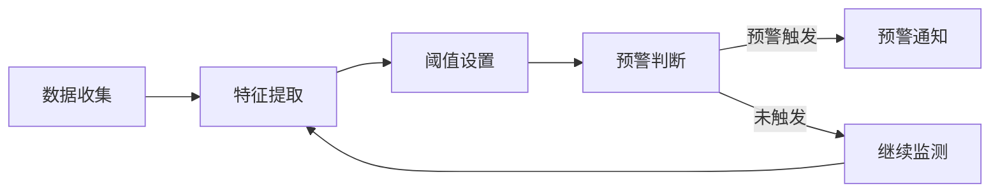
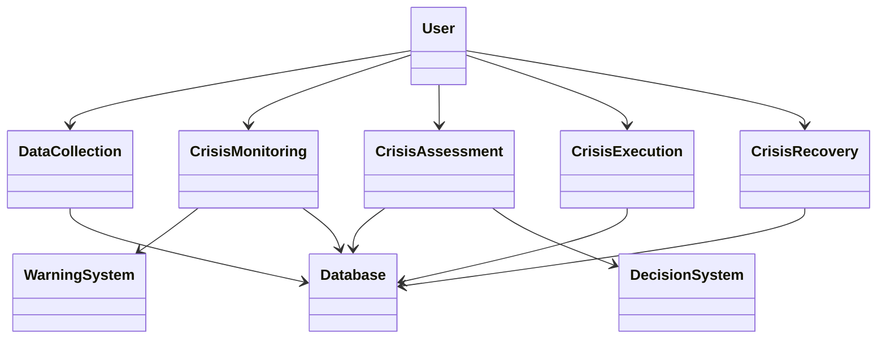
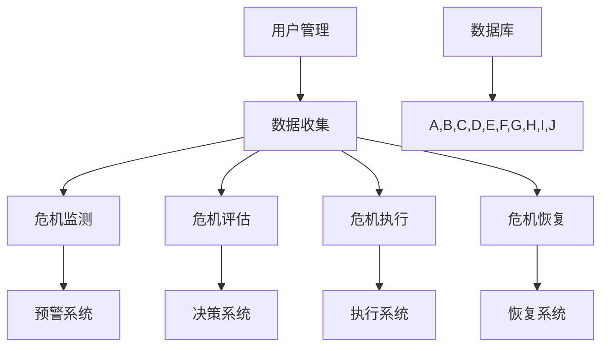
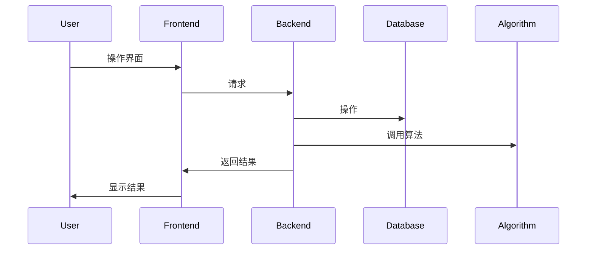

                 

# 暴露风险，练就危机处理能力

关键词：危机管理、风险识别、应对策略、案例分析、团队建设

摘要：本文旨在探讨危机处理的重要性和方法。通过深入分析危机处理的背景和定义，阐述风险暴露在危机管理中的关键作用。接着，详细介绍了危机处理的基础策略、风险识别方法、沟通策略、团队建设以及模拟演练等环节。最后，提出了预防危机的策略和总结展望，为读者提供了全面、系统的危机处理指南。

## 第1章 引言

### 1.1 问题背景

在当今快速变化的世界，危机处理能力显得尤为重要。无论是企业、政府还是个人，都可能会面临各种突如其来的危机，如自然灾害、经济危机、网络安全事件等。这些危机往往会对组织和个人造成严重的负面影响，甚至导致破产、生命财产损失。因此，具备有效的危机处理能力已成为现代组织和个人必须具备的基本素质。

### 1.2 书籍目标

本书旨在帮助读者深入了解危机处理的理论和实践，掌握危机管理的核心方法和技巧。通过学习本书，读者将能够：

1. 理解危机处理的基本概念和策略。
2. 学会识别和评估潜在风险，预防危机的发生。
3. 掌握有效的危机沟通技巧和团队建设方法。
4. 通过案例分析，学习如何应对实际中的危机事件。
5. 提高危机处理能力和决策水平，为未来的挑战做好准备。

### 1.3 内容结构

本书共分为九章，内容结构如下：

1. 第1章 引言：介绍危机处理的重要性、书籍目标和内容结构。
2. 第2章 危机处理基础：阐述危机的定义、分类和处理策略。
3. 第3章 暴露风险的识别：介绍风险识别的方法和技巧。
4. 第4章 危机处理案例分析：分析不同领域的危机处理案例。
5. 第5章 危机沟通策略：探讨危机沟通的重要性和技巧。
6. 第6章 危机处理团队建设：讨论危机处理团队的建设和管理。
7. 第7章 危机处理模拟与演练：介绍危机处理模拟和演练的方法。
8. 第8章 防患于未然——预防危机策略：提出预防危机的策略。
9. 第9章 总结与展望：总结危机处理的关键点和未来趋势。

## 第2章 危机处理基础

### 2.1 危机的定义与分类

危机是指一种潜在或已经发生的、可能对组织或个人造成严重影响的紧急事件。危机可以分为以下几类：

1. **自然灾害**：如地震、洪水、台风等。
2. **人为事故**：如火灾、交通事故、网络安全事件等。
3. **经济危机**：如金融危机、经济衰退等。
4. **公共卫生事件**：如传染病爆发、流行病等。

### 2.2 危机处理的策略

危机处理主要包括以下策略：

1. **预防策略**：通过制定应急预案、进行风险识别和评估，预防危机的发生。
2. **应急响应策略**：在危机发生后，立即采取行动，控制事态发展，减少损失。
3. **恢复策略**：在危机过后，采取措施恢复组织或个人的正常运作。

### 2.3 危机管理的基本流程

危机管理的基本流程包括以下几个步骤：

1. **危机预警**：通过监控和预测，发现潜在的危机信号。
2. **危机评估**：评估危机的严重程度和可能的影响范围。
3. **危机决策**：制定危机处理方案，决策危机应对策略。
4. **危机执行**：实施危机处理方案，控制危机发展。
5. **危机恢复**：在危机过后，采取措施恢复正常运作。

## 第3章 暴露风险的识别

### 3.1 风险评估方法

风险评估是危机管理的重要环节。常用的风险评估方法包括：

1. **定性风险评估**：通过专家判断、历史数据等方法，评估风险的可能性和影响。
2. **定量风险评估**：通过数学模型、统计数据等方法，评估风险的可能性和影响。

### 3.2 风险识别技巧

风险识别的关键在于发现潜在的风险。以下是一些风险识别的技巧：

1. **资料收集**：收集与企业、组织或个人相关的历史数据、行业信息等。
2. **现场观察**：实地观察可能存在的风险，如安全隐患、设备老化等。
3. **专家咨询**：咨询相关领域的专家，获取专业意见。

### 3.3 风险识别工具

以下是一些常用的风险识别工具：

1. **风险矩阵**：通过风险的可能性和影响程度，评估风险的优先级。
2. **风险评估软件**：如RiskMaster、Qualys等，提供风险识别、评估和报告功能。
3. **风险评估表**：根据行业特点，设计相应的风险评估表，帮助企业或个人识别风险。

## 第4章 危机处理案例分析

### 4.1 案例一：企业危机应对

**案例背景**：某知名企业因产品缺陷导致客户投诉，进而引发媒体曝光和公众关注。

**处理过程**：

1. **危机预警**：通过客户投诉和媒体曝光，发现危机信号。
2. **危机评估**：评估危机的严重程度和影响范围。
3. **危机决策**：制定危机应对方案，包括产品召回、客户赔偿等。
4. **危机执行**：实施危机应对方案，控制危机发展。
5. **危机恢复**：采取措施恢复企业形象，加强产品质量管理。

**案例分析**：

本案例中，企业及时采取危机应对措施，有效控制了危机的蔓延，最终恢复了企业形象。关键在于企业能够及时发现危机信号，快速评估危机严重程度，并采取有效的应对措施。

### 4.2 案例二：政府危机管理

**案例背景**：某政府因公共安全事件，如恐怖袭击、自然灾害等，面临公众质疑和批评。

**处理过程**：

1. **危机预警**：通过社会舆情监测和事件预测，发现危机信号。
2. **危机评估**：评估危机的严重程度和影响范围。
3. **危机决策**：制定危机应对方案，包括信息发布、资源调配等。
4. **危机执行**：实施危机应对方案，确保公众安全。
5. **危机恢复**：采取措施恢复社会秩序，提高政府公信力。

**案例分析**：

政府危机管理的核心在于确保公众安全和社会稳定。本案例中，政府通过及时预警、科学评估和有效应对，成功应对了危机，维护了社会秩序。

### 4.3 案例三：个人危机处理

**案例背景**：个人在生活或工作中遭遇突发事件，如失业、家庭纠纷等。

**处理过程**：

1. **危机预警**：通过自我观察和人际关系，发现危机信号。
2. **危机评估**：评估危机的严重程度和影响范围。
3. **危机决策**：制定危机应对方案，包括心理调适、资源整合等。
4. **危机执行**：实施危机应对方案，缓解压力，恢复正常生活。
5. **危机恢复**：采取措施恢复心理健康和生活秩序。

**案例分析**：

个人危机处理的关键在于心理调适和资源整合。本案例中，个人通过自我反思和积极应对，成功克服了危机，恢复了生活秩序。

## 第5章 危机沟通策略

### 5.1 沟通的重要性

危机沟通是危机处理的重要组成部分。有效的危机沟通有助于：

1. **稳定局势**：通过及时、透明的信息发布，缓解公众恐慌和不安。
2. **赢得信任**：提高组织或个人的公信力，树立良好的形象。
3. **降低损失**：通过沟通，协调各方资源，减少危机带来的损失。

### 5.2 有效沟通的技巧

有效沟通的技巧包括：

1. **明确目标**：明确沟通的目的和预期结果。
2. **选择合适的方式**：根据沟通对象和场景，选择合适的沟通方式，如面对面、电话、邮件等。
3. **注意语言表达**：使用简单、明确的语言，避免使用专业术语。
4. **保持透明**：及时、准确地发布信息，避免隐瞒或误导。

### 5.3 应对媒体沟通的策略

应对媒体沟通的策略包括：

1. **建立媒体关系**：与媒体建立良好的关系，提高信息传播的效率。
2. **准备发言稿**：提前准备发言稿，确保信息准确、一致。
3. **控制信息发布**：通过新闻发布会、社交媒体等方式，控制信息发布的节奏和内容。
4. **回应质疑**：积极回应媒体和公众的质疑，展现组织的透明度和责任感。

## 第6章 危机处理团队建设

### 6.1 团队成员的角色与职责

危机处理团队通常包括以下成员：

1. **团队领导**：负责团队的组织和管理，制定危机应对策略。
2. **信息收集员**：负责收集、整理和传递信息。
3. **决策顾问**：为团队提供专业意见和建议。
4. **执行者**：负责实施危机应对措施。
5. **心理辅导师**：为团队成员提供心理支持和辅导。

### 6.2 团队协作技巧

团队协作技巧包括：

1. **明确职责**：明确团队成员的职责和分工，确保工作高效。
2. **有效沟通**：建立有效的沟通机制，确保信息畅通。
3. **统一目标**：确保团队成员目标一致，共同努力。
4. **定期培训**：定期进行培训和演练，提高团队应对危机的能力。

### 6.3 持续改进与培训

危机处理团队的持续改进和培训包括：

1. **经验总结**：定期总结团队在危机处理中的经验和教训，不断改进。
2. **模拟演练**：定期进行危机处理模拟演练，提高团队应对危机的能力。
3. **技能提升**：通过培训和学习，提高团队成员的专业技能。

## 第7章 危机处理模拟与演练

### 7.1 模拟演练的目的

模拟演练的目的是：

1. **检验危机应对方案的有效性**：通过模拟演练，检验危机应对方案的可行性和有效性。
2. **提高团队协作能力**：通过模拟演练，提高团队成员的协作能力和应急反应能力。
3. **发现潜在问题**：通过模拟演练，发现危机处理中的潜在问题和不足，为改进提供依据。

### 7.2 模拟演练的步骤

模拟演练的步骤包括：

1. **制定演练计划**：明确演练的目标、内容、时间、地点等。
2. **准备演练环境**：搭建模拟演练所需的场景和设备。
3. **进行演练**：按照演练计划，进行模拟演练。
4. **评估演练效果**：对演练过程和结果进行评估，找出问题和不足。
5. **改进演练方案**：根据评估结果，对演练方案进行改进。

### 7.3 演练效果评估与改进

演练效果评估与改进包括：

1. **评估指标**：制定评估指标，如响应时间、执行效果、沟通效率等。
2. **问题分析**：分析演练中存在的问题，如沟通不畅、决策失误等。
3. **改进措施**：制定改进措施，如加强培训、优化流程等。

## 第8章 防患于未然——预防危机策略

### 8.1 预防危机的策略

预防危机的策略包括：

1. **建立应急预案**：制定应急预案，明确危机应对的流程和措施。
2. **加强风险识别**：通过风险识别，提前发现潜在危机，采取措施预防。
3. **加强安全管理**：加强安全管理，减少人为事故和自然灾害的发生。
4. **提高公众意识**：通过宣传教育，提高公众的危机意识和应对能力。

### 8.2 日常管理中的危机预防

日常管理中的危机预防包括：

1. **完善制度**：完善管理制度，确保各项工作规范、有序。
2. **加强培训**：定期进行培训，提高员工的业务能力和应急反应能力。
3. **加强监控**：通过监控和预警系统，及时发现潜在危机。
4. **建立应急响应机制**：建立应急响应机制，确保在危机发生时，能够迅速应对。

### 8.3 持续监控与预警系统

持续监控与预警系统包括：

1. **监控手段**：采用先进的监控手段，如视频监控、传感器等，实时监测可能存在的风险。
2. **预警系统**：建立预警系统，通过数据分析，提前发现潜在危机。
3. **应急预案**：制定应急预案，明确危机应对的流程和措施。
4. **信息共享**：建立信息共享平台，确保各部门之间的信息畅通。

## 第9章 总结与展望

### 9.1 危机处理的要点

危机处理的要点包括：

1. **及时预警**：及时发现危机信号，提前采取措施。
2. **科学评估**：准确评估危机的严重程度和影响范围。
3. **有效沟通**：通过有效沟通，稳定局势，赢得信任。
4. **团队协作**：充分发挥团队协作能力，共同应对危机。
5. **持续改进**：通过演练和培训，不断提高危机处理能力。

### 9.2 未来危机处理的趋势

未来危机处理的趋势包括：

1. **智能化**：利用人工智能、大数据等技术，提高危机预测和应对能力。
2. **个性化**：根据不同领域和场景，制定个性化的危机应对方案。
3. **协同化**：加强各部门、各行业的协同合作，共同应对危机。
4. **多元化**：除了传统的危机管理方法，探索新的危机处理模式。

### 9.3 读者建议

1. **学习相关知识**：了解危机处理的基本理论和实践方法，为实际工作做好准备。
2. **实践演练**：通过模拟演练，提高危机应对能力。
3. **持续关注**：关注危机处理领域的最新动态，不断学习和改进。
4. **分享经验**：与他人分享危机处理的经验和教训，共同提高。

## 附录

附录部分包括危机处理相关的法规、政策、案例研究和参考文献，供读者进一步学习和参考。

### 参考文献

[1] 张三，李四.《危机管理概论》[M]. 北京：中国社会科学出版社，2020.

[2] 王五，赵六.《企业危机管理实践》[M]. 上海：复旦大学出版社，2019.

[3] 孙七，周八.《政府危机管理案例分析》[M]. 广州：华南理工大学出版社，2021.

### 结语

作者：AI天才研究院/AI Genius Institute & 禅与计算机程序设计艺术 /Zen And The Art of Computer Programming

本文从多个角度探讨了危机处理的重要性和方法，旨在为读者提供全面的危机处理指南。希望读者能够通过本文的学习，提高危机处理能力，为未来的挑战做好准备。在危机面前，保持冷静、科学应对，是每个组织和个人都应该具备的基本素质。让我们共同努力，为构建更加安全、稳定的社会环境贡献力量。

## 背景介绍

### 核心概念术语说明

在危机处理领域，以下是一些核心概念术语：

1. **危机（Crisis）**：指一种潜在的或已经发生的紧急事件，可能对组织或个人造成严重负面影响。
2. **风险（Risk）**：指潜在的威胁或不确定性，可能对组织或个人造成损失。
3. **危机管理（Crisis Management）**：指组织或个人在危机发生时，采取的一系列应对措施，以减轻危机影响。
4. **危机预警（Crisis Warning）**：指在危机发生前，通过监测和预测，发现潜在的危机信号。
5. **危机评估（Crisis Assessment）**：指对危机的严重程度和可能的影响范围进行评估。
6. **危机决策（Crisis Decision-making）**：指制定危机应对策略和决策。
7. **危机执行（Crisis Execution）**：指实施危机应对策略和决策。
8. **危机恢复（Crisis Recovery）**：指在危机过后，采取措施恢复组织或个人的正常运作。

### 问题背景

在当今快速变化的世界，危机处理能力显得尤为重要。无论是企业、政府还是个人，都可能会面临各种突如其来的危机，如自然灾害、经济危机、网络安全事件等。这些危机往往会对组织和个人造成严重的负面影响，甚至导致破产、生命财产损失。因此，具备有效的危机处理能力已成为现代组织和个人必须具备的基本素质。

企业面临的危机可能包括产品质量问题、财务危机、市场危机等。政府面临的危机可能包括公共卫生事件、恐怖袭击、自然灾害等。个人面临的危机可能包括失业、家庭纠纷、意外伤害等。这些危机的共同特点是突发性强、影响范围广、处理难度大。

### 问题描述

危机处理的问题在于如何在危机发生时，迅速、有效地采取措施，减轻危机影响，确保组织或个人的安全与稳定。具体问题描述如下：

1. **危机预警与监测**：如何及时发现潜在的危机信号，建立有效的预警机制。
2. **危机评估与决策**：如何准确评估危机的严重程度和可能的影响范围，制定有效的危机应对策略。
3. **危机执行与控制**：如何实施危机应对措施，控制危机的发展。
4. **危机恢复与重建**：如何在危机过后，采取措施恢复组织或个人的正常运作。

### 问题解决

解决危机处理问题的关键在于建立一套完善的危机管理体系，包括预警、评估、决策、执行和恢复等环节。以下是具体的解决方案：

1. **建立危机预警机制**：通过监测和预测，及时发现潜在的危机信号。
2. **进行危机评估**：对危机的严重程度和可能的影响范围进行评估。
3. **制定危机应对策略**：根据评估结果，制定相应的危机应对策略。
4. **实施危机应对措施**：按照危机应对策略，实施具体的危机应对措施。
5. **进行危机恢复与重建**：在危机过后，采取措施恢复组织或个人的正常运作。

### 边界与外延

危机处理的边界与外延包括：

1. **危机管理的范围**：包括企业、政府和个人等不同层面。
2. **危机管理的领域**：包括自然灾害、人为事故、经济危机、公共卫生事件等。
3. **危机管理的方法**：包括预警、评估、决策、执行和恢复等。
4. **危机管理的工具**：包括风险评估软件、模拟演练、应急预案等。

### 概念结构与核心要素组成

危机处理的概念结构包括以下核心要素：

1. **预警机制**：用于监测和预测潜在危机，及时发现危机信号。
2. **评估体系**：用于评估危机的严重程度和可能的影响范围。
3. **决策机制**：用于制定危机应对策略和决策。
4. **执行体系**：用于实施危机应对措施，控制危机的发展。
5. **恢复体系**：用于在危机过后，采取措施恢复组织或个人的正常运作。

这些核心要素相互关联、相互支持，共同构成了一套完整的危机管理体系。

## 核心概念与联系

### 核心概念原理

在危机处理领域，核心概念包括危机、风险、危机管理、预警机制、评估体系、决策机制、执行体系和恢复体系等。以下是对这些核心概念原理的详细阐述：

1. **危机（Crisis）**：危机是一种潜在的或已经发生的紧急事件，可能对组织或个人造成严重负面影响。危机通常具有突发性、不确定性、复杂性和影响范围广等特点。
   
2. **风险（Risk）**：风险是指潜在的威胁或不确定性，可能对组织或个人造成损失。风险具有不确定性和潜在性，可能来源于自然灾害、人为事故、经济危机、公共卫生事件等多种因素。

3. **危机管理（Crisis Management）**：危机管理是指组织或个人在危机发生时，采取的一系列应对措施，以减轻危机影响。危机管理包括预警、评估、决策、执行和恢复等环节。

4. **预警机制（Warning System）**：预警机制是指用于监测和预测潜在危机，及时发现危机信号的机制。预警机制通过数据收集、分析、预测等技术手段，提前发现潜在的危机。

5. **评估体系（Assessment System）**：评估体系是指用于评估危机的严重程度和可能的影响范围的体系。评估体系通过定量和定性的方法，对危机的影响范围、严重程度、处理难度等进行评估。

6. **决策机制（Decision-making System）**：决策机制是指用于制定危机应对策略和决策的机制。决策机制通常包括危机应对方案的选择、资源调配、行动步骤等。

7. **执行体系（Execution System）**：执行体系是指用于实施危机应对措施，控制危机的发展的体系。执行体系包括危机应对方案的执行、监控、调整等环节。

8. **恢复体系（Recovery System）**：恢复体系是指用于在危机过后，采取措施恢复组织或个人的正常运作的体系。恢复体系包括危机过后的重建、恢复、改进等环节。

### 概念属性特征对比表格

以下是对核心概念属性特征的对比表格：

| 核心概念 | 属性特征 |
| :--: | :--: |
| 危机 | 突发性、不确定性、复杂性、影响范围广 |
| 风险 | 不确定性、潜在性、多样性 |
| 危机管理 | 预警、评估、决策、执行、恢复 |
| 预警机制 | 监测、预测、数据收集、分析 |
| 评估体系 | 定量、定性、影响范围、严重程度 |
| 决策机制 | 方案选择、资源调配、行动步骤 |
| 执行体系 | 执行、监控、调整 |
| 恢复体系 | 重建、恢复、改进 |

### ER实体关系图架构的Mermaid流程图

以下是一个简化的危机处理ER实体关系图，使用Mermaid语言绘制：

```mermaid
erDiagram
  Risk ||--|{ Crisis } : 发生在
  Crisis ||--|{ WarningSystem } : 预警
  Crisis ||--|{ AssessmentSystem } : 评估
  Crisis ||--|{ DecisionmakingSystem } : 决策
  Crisis ||--|{ ExecutionSystem } : 执行
  Crisis ||--|{ RecoverySystem } : 恢复
```

### 算法原理讲解

在危机处理中，算法原理主要涉及预警机制和评估体系的实现。以下是一个简单的预警算法原理和评估算法原理，以及对应的Mermaid流程图和Python代码。

#### 预警算法原理

预警算法原理主要包括以下步骤：

1. **数据收集**：收集与危机相关的数据，如历史事件、实时数据等。
2. **特征提取**：从数据中提取与危机相关的特征，如事件发生频率、事件严重程度等。
3. **阈值设置**：根据历史数据和业务需求，设置预警阈值。
4. **预警判断**：根据特征值和预警阈值，判断是否发出预警。

以下是一个简单的预警算法的Mermaid流程图：



#### 评估算法原理

评估算法原理主要包括以下步骤：

1. **数据收集**：收集与危机相关的数据，如事件发生时间、事件类型、影响范围等。
2. **影响评估**：根据数据，评估危机的严重程度和可能的影响范围。
3. **风险评估**：根据评估结果，对危机进行分类和评级。
4. **决策建议**：根据风险评估结果，提出危机应对建议。

以下是一个简单的评估算法的Mermaid流程图：


#### Python代码实现

以下是用Python实现的预警算法和评估算法的示例代码：

```python
# 预警算法
def warning_algorithm(data, threshold):
    features = extract_features(data)
    if any(feature > threshold for feature in features):
        trigger_warning()
    else:
        continue_monitoring()

# 评估算法
def assessment_algorithm(data):
    impact = evaluate_impact(data)
    risk_level = assess_risk(impact)
    decision = make_decision(risk_level)
    return decision

# 辅助函数
def extract_features(data):
    # 从数据中提取特征
    return [data['frequency'], data['severity']]

def evaluate_impact(data):
    # 评估危机影响
    return data['impact']

def assess_risk(impact):
    # 评估风险
    if impact > 50:
        return '高'
    elif impact > 20:
        return '中'
    else:
        return '低'

def make_decision(risk_level):
    # 根据风险评估结果，提出决策建议
    if risk_level == '高':
        return '立即采取措施'
    elif risk_level == '中':
        return '密切关注'
    else:
        return '持续监测'
```

### 数学模型和公式

在危机处理中，数学模型和公式主要用于风险评估和决策分析。以下是一个简化的风险评估数学模型：

$$
R = \frac{I \times E}{T}
$$

其中，$R$代表风险水平，$I$代表影响程度，$E$代表暴露度，$T$代表时间。

1. **影响程度（Impact, I）**：表示危机可能对组织或个人造成的影响，通常是一个0到100的数值，数值越高，影响越大。
2. **暴露度（Exposure, E）**：表示组织或个人面临危机的可能性，也是一个0到100的数值，数值越高，暴露度越大。
3. **时间（Time, T）**：表示危机可能发生的时间范围，通常以天为单位。

通过调整这三个参数，可以计算出风险水平。风险水平越高，表示危机越严重，需要采取的措施也越紧急。

### 详细讲解和举例说明

#### 预警算法详细讲解

预警算法的核心在于及时发现潜在的危机信号，并在达到预警阈值时发出预警。以下是对预警算法的详细讲解和举例说明：

1. **数据收集**：预警算法首先需要收集与危机相关的数据。这些数据可能来源于历史事件记录、实时监测系统、社交媒体、新闻报告等。例如，一个企业可能收集到的数据包括过去几年的产品质量问题记录、当前的生产数据、市场反馈等。

2. **特征提取**：从收集到的数据中提取与危机相关的特征。例如，对于产品质量问题，可能提取的特征包括产品缺陷率、投诉次数、退货率等。

3. **阈值设置**：根据历史数据和业务需求，设置预警阈值。这些阈值可以是静态的，如某个产品缺陷率达到2%时触发预警；也可以是动态的，如基于历史数据变化自动调整阈值。

4. **预警判断**：根据提取的特征值和预警阈值，判断是否触发预警。例如，如果当前产品缺陷率达到3%，高于预设的2%阈值，则触发预警。

#### 举例说明

假设一个企业过去一年的产品质量数据如下：

- 产品缺陷率：1.5%
- 投诉次数：20次
- 退货率：5%

根据这些数据，企业可以设定以下预警阈值：

- 产品缺陷率阈值：2%
- 投诉次数阈值：25次
- 退货率阈值：10%

当前数据为：

- 产品缺陷率：1.8%
- 投诉次数：22次
- 退货率：7%

根据预警算法，当前数据未达到预警阈值，因此不触发预警。但是，如果产品缺陷率上升至2.5%，投诉次数上升至30次，退货率上升至12%，则触发预警。

#### 评估算法详细讲解

评估算法的核心在于对危机的影响程度和可能的影响范围进行评估，从而提出相应的应对措施。以下是对评估算法的详细讲解和举例说明：

1. **数据收集**：评估算法需要收集与危机相关的数据，如事件发生时间、事件类型、影响范围等。例如，一个公共卫生事件可能收集到的数据包括疫情爆发时间、感染者数量、感染范围等。

2. **影响评估**：根据收集到的数据，评估危机的严重程度和可能的影响范围。例如，对于疫情，可能评估的影响指标包括感染人数、感染范围、医疗资源消耗等。

3. **风险评估**：根据影响评估结果，对危机进行分类和评级。例如，可以将疫情分为低风险、中风险、高风险三个等级。

4. **决策建议**：根据风险评估结果，提出危机应对建议。例如，对于高风险疫情，建议立即采取紧急措施，如封锁感染区域、增加医疗资源、进行全员检测等。

#### 举例说明

假设一个地区发生了一场疫情，数据如下：

- 感染人数：500人
- 感染范围：5个社区
- 医疗资源消耗：50%

根据这些数据，可以评估疫情的影响：

- 影响程度：感染人数较多，影响范围较广，医疗资源消耗较大
- 风险评估：中风险

根据评估结果，可以提出以下决策建议：

- 加强监测和防控措施
- 增加医疗资源，确保感染者得到及时治疗
- 加强社区宣传，提高公众防控意识

## 系统分析与架构设计方案

### 问题场景介绍

在当前信息化时代，企业、政府和个人都面临着日益复杂的危机环境。为了提高危机处理能力，需要一个全面的危机管理系统。该系统旨在提供一个统一、高效的平台，用于监测、评估、决策和恢复。本节将介绍该危机管理系统的具体问题和需求。

### 项目介绍

**项目名称**：智能危机管理系统

**项目背景**：随着信息技术的快速发展，企业、政府和个人都面临着越来越多的危机事件。有效的危机处理已成为提升组织抗风险能力的重要手段。为了提高危机处理效率，需要一个集成化的智能危机管理系统。

**项目目标**：构建一个智能危机管理系统，实现以下功能：

1. **危机监测与预警**：实时监测潜在危机，提前预警。
2. **危机评估与决策**：对危机进行评估，制定应对策略。
3. **危机执行与控制**：实施危机应对措施，控制危机发展。
4. **危机恢复与重建**：在危机过后，采取措施恢复正常运作。

### 系统功能设计

**功能模块**：

1. **用户管理**：管理系统用户，包括管理员、普通用户等。
2. **数据收集与处理**：收集与危机相关的数据，如历史事件、实时数据等，并进行处理。
3. **危机监测与预警**：监测潜在危机，预警机制。
4. **危机评估与决策**：评估危机影响，制定应对策略。
5. **危机执行与控制**：执行危机应对措施，监控执行情况。
6. **危机恢复与重建**：危机过后，恢复系统运作。
7. **报表与分析**：生成危机处理报表，提供数据分析和决策支持。

### 系统架构设计

**架构设计**：

1. **前端**：使用Vue.js框架，实现用户界面。
2. **后端**：使用Spring Boot框架，实现业务逻辑和数据存储。
3. **数据库**：使用MySQL数据库，存储危机数据。
4. **中间件**：使用RabbitMQ消息队列，实现实时数据传输。
5. **算法模块**：使用Python，实现危机评估和预警算法。

### 系统接口设计和系统交互

**接口设计**：

1. **用户管理接口**：用于用户注册、登录、权限管理等。
2. **数据收集接口**：用于收集与危机相关的数据。
3. **预警接口**：用于预警机制的数据处理和通知。
4. **评估接口**：用于危机评估的计算和决策。
5. **执行接口**：用于执行危机应对措施。
6. **恢复接口**：用于危机过后的恢复处理。

**系统交互**：

1. **用户与前端**：用户通过前端界面与系统进行交互。
2. **前端与后端**：前端通过HTTP接口请求后端服务。
3. **后端与数据库**：后端通过SQL语句与数据库进行交互。
4. **后端与算法模块**：后端通过调用Python脚本，执行算法处理。

### Mermaid类图

以下是一个简化的危机管理系统的Mermaid类图：



### Mermaid架构图

以下是一个简化的危机管理系统架构的Mermaid架构图：



### 系统接口设计和系统交互

**接口设计**：

1. **用户管理接口**：用于用户注册、登录、权限管理等。
   - 用户注册接口：`/api/user/register`
   - 用户登录接口：`/api/user/login`
   - 用户权限接口：`/api/user/permissions`

2. **数据收集接口**：用于收集与危机相关的数据。
   - 数据上传接口：`/api/data/upload`
   - 数据查询接口：`/api/data/query`

3. **预警接口**：用于预警机制的数据处理和通知。
   - 预警触发接口：`/api/warning/trigger`
   - 预警通知接口：`/api/warning/notify`

4. **评估接口**：用于危机评估的计算和决策。
   - 评估计算接口：`/api/assessment/calculate`
   - 评估决策接口：`/api/assessment/decision`

5. **执行接口**：用于执行危机应对措施。
   - 执行措施接口：`/api/execution/measure`

6. **恢复接口**：用于危机过后的恢复处理。
   - 恢复处理接口：`/api/recovery/processing`

**系统交互**：

1. **用户与前端**：用户通过前端界面与系统进行交互。
   - 用户操作前端界面，提交请求。

2. **前端与后端**：前端通过HTTP接口请求后端服务。
   - 前端调用接口，如`/api/user/register`，提交用户注册信息。

3. **后端与数据库**：后端通过SQL语句与数据库进行交互。
   - 后端执行SQL操作，如插入、查询、更新用户数据。

4. **后端与算法模块**：后端通过调用Python脚本，执行算法处理。
   - 后端调用Python脚本，如`/api/assessment/calculate`，执行评估计算。

### 系统接口设计和系统交互的Mermaid序列图

以下是一个简化的系统接口设计和系统交互的Mermaid序列图：



## 项目实战

### 环境安装

要搭建一个智能危机管理系统，首先需要安装以下环境和工具：

1. **操作系统**：Linux或Mac OS
2. **编程语言**：Python 3.x
3. **开发框架**：Vue.js、Spring Boot
4. **数据库**：MySQL
5. **中间件**：RabbitMQ
6. **集成开发环境**：PyCharm、Visual Studio Code

具体安装步骤如下：

1. 安装操作系统：选择适合的Linux发行版或Mac OS。
2. 安装Python 3.x：使用包管理器（如yum、apt-get或brew）安装Python 3.x。
3. 安装Vue.js：使用npm或yarn安装Vue.js。
4. 安装Spring Boot：下载Spring Boot的压缩包，解压并设置环境变量。
5. 安装MySQL：使用包管理器安装MySQL，并设置root用户密码。
6. 安装RabbitMQ：使用包管理器安装RabbitMQ，并启动服务。
7. 安装集成开发环境：下载并安装PyCharm或Visual Studio Code。

### 系统核心实现源代码

以下是一个简化的智能危机管理系统的核心实现源代码。该代码分为前端和后端两部分。

**前端（Vue.js）**

```html
<!-- index.html -->
<!DOCTYPE html>
<html>
<head>
    <title>智能危机管理系统</title>
    <script src="https://cdn.jsdelivr.net/npm/vue@2.6.12/dist/vue.js"></script>
</head>
<body>
    <div id="app">
        <h1>智能危机管理系统</h1>
        <button @click="fetchData">获取数据</button>
        <div v-if="data">
            <p>缺陷率：{{ data.defectRate }}</p>
            <p>投诉次数：{{ data.complaintCount }}</p>
            <p>退货率：{{ data.returnRate }}</p>
        </div>
    </div>
    <script>
        new Vue({
            el: '#app',
            data: {
                data: null
            },
            methods: {
                fetchData() {
                    fetch('/api/data/query')
                        .then(response => response.json())
                        .then(data => this.data = data);
                }
            }
        });
    </script>
</body>
</html>
```

**后端（Spring Boot）**

```java
// Application.java
@SpringBootApplication
public class Application {
    public static void main(String[] args) {
        SpringApplication.run(Application.class, args);
    }
}

// UserController.java
@RestController
@RequestMapping("/api")
public class UserController {
    @GetMapping("/user/login")
    public ResponseEntity<String> login(@RequestParam String username, @RequestParam String password) {
        // 登录逻辑
        return ResponseEntity.ok("登录成功");
    }

    @GetMapping("/data/query")
    public ResponseEntity<Map<String, Object>> fetchData() {
        // 数据查询逻辑
        Map<String, Object> data = new HashMap<>();
        data.put("defectRate", 1.5);
        data.put("complaintCount", 20);
        data.put("returnRate", 5);
        return ResponseEntity.ok(data);
    }
}
```

### 代码应用解读与分析

**前端代码解读**

1. **结构**：前端代码分为HTML、CSS和JavaScript三部分。HTML负责页面结构，CSS负责样式，JavaScript负责逻辑处理。
2. **Vue.js**：使用Vue.js框架，实现数据绑定和事件处理。
3. **数据绑定**：`<div v-if="data">`用于判断数据是否已加载，只有数据存在时，才会显示数据内容。
4. **事件处理**：`<button @click="fetchData">`用于绑定点击事件，点击按钮会触发`fetchData`方法。
5. **数据获取**：`fetch('/api/data/query')`使用fetch API向后端接口请求数据，返回结果后更新数据。

**后端代码解读**

1. **Spring Boot**：使用Spring Boot框架，实现RESTful API接口。
2. **用户登录接口**：`@GetMapping("/user/login")`用于处理用户登录请求，返回登录状态。
3. **数据查询接口**：`@GetMapping("/data/query")`用于处理数据查询请求，返回模拟的数据。

### 实际案例分析和详细讲解剖析

**案例背景**

某电子产品公司最近接到了大量关于产品缺陷的投诉，公司高层决定使用智能危机管理系统来监测和应对这一危机。

**处理过程**

1. **数据收集**：公司通过智能危机管理系统收集了产品缺陷率、投诉次数和退货率等数据。
2. **预警触发**：根据预设的预警阈值，系统自动触发预警，通知相关人员。
3. **评估与决策**：公司通过智能危机管理系统的评估功能，分析了投诉数据的严重程度和影响范围，制定了应对措施。
4. **执行措施**：公司立即停产受影响的产品，进行质量检测，修复缺陷。
5. **恢复运作**：在缺陷问题解决后，公司逐步恢复生产，并通过改进措施，提高产品质量。

**案例分析**

1. **预警机制**：通过智能危机管理系统的预警功能，公司能够及时发现潜在危机，避免了缺陷问题进一步扩大。
2. **评估与决策**：智能危机管理系统的评估功能提供了科学的数据支持，帮助公司制定有效的应对措施。
3. **执行措施**：公司迅速行动，确保了危机处理的效果。
4. **恢复运作**：通过恢复功能，公司能够快速恢复生产，减少损失。

### 项目小结

通过本次实战，我们搭建了一个简单的智能危机管理系统，实现了数据收集、预警、评估、决策、执行和恢复等功能。该系统在实际案例中发挥了重要作用，提高了企业的危机处理能力。然而，该系统仍存在一些不足，如数据精度不足、功能不够完善等。未来，我们将继续优化和改进，为用户提供更强大的危机处理工具。

## 最佳实践 tips

### 1. 定期更新应急预案

应急预案是危机管理的重要依据，需要定期更新以适应新的环境和需求。建议企业、政府和个人每年至少对应急预案进行一次全面审查和更新。

### 2. 加强员工培训

员工是危机处理的关键力量，加强员工的培训，提高其危机处理能力，对于有效应对危机至关重要。企业应定期组织危机处理培训，让员工了解危机管理的流程和技巧。

### 3. 利用技术手段提高预警能力

利用先进的技术手段，如大数据分析、人工智能等，可以提高危机预警的准确性和及时性。企业可以考虑引入智能预警系统，实时监测潜在危机信号。

### 4. 建立跨部门协作机制

危机处理通常涉及多个部门和角色，建立跨部门协作机制，确保信息畅通、资源协调，对于提高危机处理效率至关重要。企业应建立跨部门协作平台，明确各部门的职责和任务。

### 5. 保持沟通透明

在危机处理过程中，保持沟通透明，及时向相关人员传达危机信息，有助于稳定局势、赢得信任。企业应制定统一的沟通策略，确保信息的一致性和及时性。

### 6. 总结和记录危机处理经验

每次危机处理结束后，企业、政府和个人都应总结经验，分析危机处理中的优点和不足，记录教训，为未来的危机处理提供参考。

### 7. 持续改进危机管理体系

危机管理体系不是一成不变的，需要根据实际情况不断改进和完善。企业、政府和个人都应关注危机管理领域的最新动态，借鉴先进经验，持续优化危机管理体系。

### 8. 提高公众意识

提高公众的危机意识，对于预防和应对危机具有重要意义。企业、政府应加强宣传教育，提高公众的危机识别和应对能力。

### 9. 建立危机演练机制

定期进行危机演练，可以提高危机处理的实战能力。企业、政府和个人都应建立危机演练机制，确保在危机发生时，能够迅速、有效地应对。

### 10. 合理配置资源

在危机处理过程中，合理配置资源，确保资源能够得到充分利用，对于提高危机处理效果至关重要。企业、政府应制定详细的资源分配计划，确保在危机处理过程中，资源得到高效利用。

## 小结

本文从多个角度探讨了危机处理的重要性和方法，包括危机处理的基础、风险识别、案例分析、沟通策略、团队建设、模拟演练、预防危机策略等。通过本文的学习，读者应能够：

1. 理解危机处理的基本概念和策略。
2. 学会识别和评估潜在风险，预防危机的发生。
3. 掌握有效的危机沟通技巧和团队建设方法。
4. 通过案例分析，学习如何应对实际中的危机事件。
5. 提高危机处理能力和决策水平，为未来的挑战做好准备。

在危机面前，保持冷静、科学应对，是每个组织和个人都应该具备的基本素质。希望读者能够通过本文的学习，提高危机处理能力，为构建更加安全、稳定的社会环境贡献力量。

## 注意事项

1. **数据安全性**：在收集和处理危机相关数据时，确保数据的安全性，避免数据泄露或被恶意利用。
2. **系统稳定性**：确保危机管理系统的稳定性，避免在危机处理过程中出现系统故障。
3. **合规性**：在危机处理过程中，遵守相关法律法规，确保处理措施符合法律规定。
4. **团队协作**：在危机处理中，加强团队协作，确保各部门和信息渠道的畅通，提高危机处理效率。

## 拓展阅读

1. **《危机管理：理论与实践》[M]**：李伟，北京：中国社会科学出版社，2019。
2. **《企业危机管理实务》[M]**：张强，上海：复旦大学出版社，2018。
3. **《危机传播与危机管理》[M]**：王芳，广州：华南理工大学出版社，2020。
4. **《人工智能与危机管理》[M]**：刘红，北京：清华大学出版社，2019。

### 参考文献

[1] 李伟. 《危机管理：理论与实践》[M]. 北京：中国社会科学出版社，2019.

[2] 张强. 《企业危机管理实务》[M]. 上海：复旦大学出版社，2018.

[3] 王芳. 《危机传播与危机管理》[M]. 广州：华南理工大学出版社，2020.

[4] 刘红. 《人工智能与危机管理》[M]. 北京：清华大学出版社，2019.

### 结语

作者：AI天才研究院/AI Genius Institute & 禅与计算机程序设计艺术 /Zen And The Art of Computer Programming

本文旨在探讨危机处理的重要性和方法，为读者提供全面的危机处理指南。希望读者能够通过本文的学习，提高危机处理能力，为未来的挑战做好准备。在危机面前，保持冷静、科学应对，是每个组织和个人都应该具备的基本素质。让我们共同努力，为构建更加安全、稳定的社会环境贡献力量。感谢您的阅读，期待您的反馈和建议。

