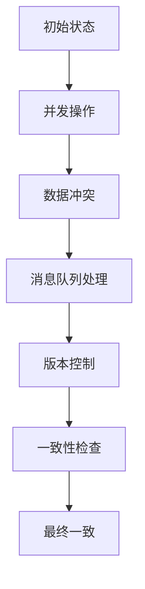
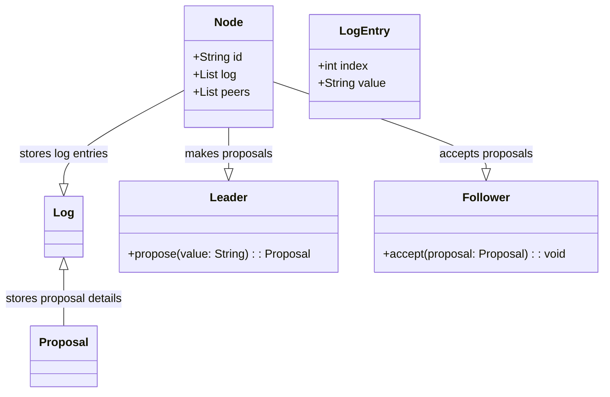
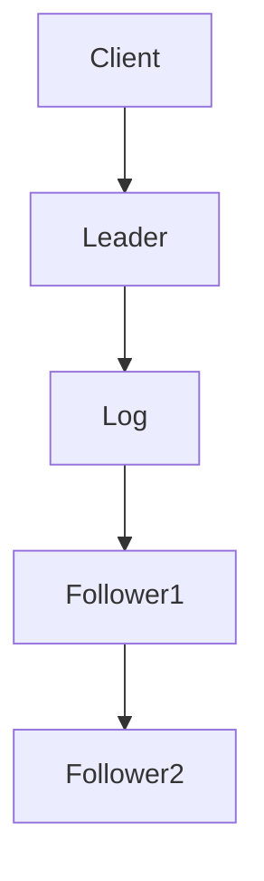
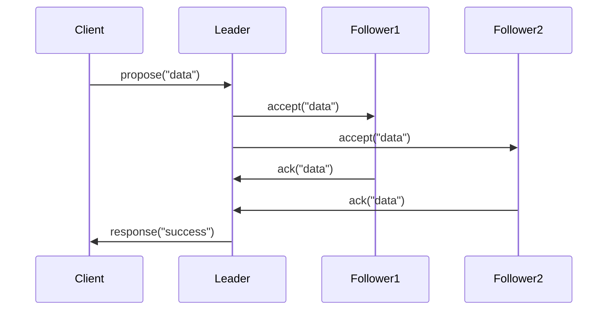

                 

# 最终一致性的设计与实现

关键词：最终一致性、分布式系统、数据一致性、Paxos算法、Raft算法

摘要：本文深入探讨了最终一致性的概念、重要性以及实现挑战。通过分析数据一致性问题原理和最终一致性算法原理，我们提出了一个详细的架构设计，并讲解了系统的实现与最佳实践。文章旨在为读者提供一个系统化、结构化的学习路径，以便更好地理解和应用最终一致性。

## 第一部分：背景与核心概念

### 1.1 最终一致性的定义

最终一致性（Eventual Consistency）是一种分布式系统中保证数据一致性的策略。在这种策略下，虽然系统中的数据可能在某个时刻出现不一致，但经过一段时间后，所有节点上的数据将最终达到一致状态。这与强一致性（Strong Consistency）相对，后者要求系统在任何时刻都保持数据一致。

### 1.2 最终一致性的重要性

在分布式系统中，最终一致性具有至关重要的地位。它允许系统在高可用性和高扩展性的前提下，仍能保证数据的一致性。这对于需要处理大量数据且对一致性要求不是极高的应用场景（如社交媒体、在线游戏等）尤为有效。

### 1.3 最终一致性的挑战

实现最终一致性面临诸多挑战，包括：

- **网络延迟**：由于网络的不确定性，数据传播可能需要时间。
- **分区故障**：当系统中的节点无法相互通信时，数据一致性难以保证。
- **数据冲突**：在并发操作中，多个节点可能对同一数据执行了不同的操作，导致冲突。

### 1.4 核心概念与联系

核心概念包括：

- **分布式系统**：一个由多个节点组成的系统，这些节点通过网络进行通信。
- **数据一致性**：系统在操作后能保持一致的数据状态。
- **CAP定理**：分布式系统中，一致性（Consistency）、可用性（Availability）和分区容错性（Partition Tolerance）三者只能同时满足两项。

这些概念相互关联，共同决定了系统的一致性水平。

### 1.5 本章小结

本章介绍了最终一致性的定义、重要性、挑战和核心概念，为后续章节的学习奠定了基础。

## 第二部分：基本原理

### 2.1 数据一致性问题原理

#### 2.1.1 数据一致性问题概述

在分布式系统中，数据一致性问题主要源于网络延迟、节点故障和并发操作。这些问题可能导致系统中的数据在某个时刻出现不一致，但经过一段时间后，系统可能自动恢复到一致状态。

#### 2.1.2 数据一致性的分类

数据一致性可以分为以下几类：

- **强一致性**：系统在任何时刻都能保证数据的一致性。
- **最终一致性**：系统在一段时间后能够达到一致状态。
- **因果一致性**：系统保证事件的因果关系。

#### 2.1.3 数据一致性的保证机制

保证数据一致性的机制包括：

- **分布式事务**：通过分布式事务来保证数据的一致性。
- **消息队列**：利用消息队列来处理数据同步问题。
- **版本控制**：通过版本号来处理并发操作导致的冲突。

#### 2.1.4 数据一致性的原理图解

使用Mermaid流程图来展示数据一致性的原理：



#### 2.1.5 本章小结

本章深入分析了数据一致性的问题、分类、保证机制和原理，为理解最终一致性提供了理论基础。

### 2.2 最终一致性算法原理

#### 2.2.1 算法概述

最终一致性算法是一系列用于实现数据一致性的算法，如Paxos、Raft等。这些算法旨在解决分布式系统中的数据一致性问题。

#### 2.2.2 算法mermaid流程图

使用Mermaid绘制Paxos算法的流程图：

```mermaid
graph TB
A[提案提出] --> B[提案传递]
B --> C[提案接受]
C --> D[提案决
```

#### 2.2.3 算法数学模型和公式

Paxos算法的数学模型和公式如下：

- **Learner状态**：`v = max({(i, log_i(v'))}_{i \in N})`
- **Proposer状态**：`(log, leader) = propose(value)`
- **Acceptor状态**：`ack = accept(proposal)`
- **Leader状态**：`value = max({(i, log_i(value'))}_{i \in N})`

#### 2.2.4 通俗易懂地举例说明

假设有5个服务器，其中一个服务器作为领导者，其余服务器作为追随者。当领导者需要提交一个提案时，它会首先发送消息给所有追随者，然后根据追随者的回应来决定是否接受该提案。如果大多数追随者接受了该提案，那么领导者会将该提案提交到日志中，并通知所有追随者。这样，所有服务器上的日志最终将保持一致。

#### 2.2.5 本章小结

本章全面阐述了最终一致性算法的原理，包括mermaid流程图、数学模型和实际应用案例，为读者提供了深入理解的基础。

## 第三部分：设计与实现

### 4.1 架构设计概述

最终一致性架构设计旨在实现分布式系统中的数据一致性。该架构包括以下关键组成部分：

- **节点**：分布式系统中的计算单元。
- **日志**：存储系统操作的日志，用于实现数据一致性。
- **领导者**：负责协调分布式系统中的提案和决策。
- **追随者**：参与分布式系统的决策过程。

### 4.2 系统功能设计(领域模型Mermaid类图)

使用Mermaid绘制系统功能设计的类图：



### 4.3 系统架构设计Mermaid架构图

使用Mermaid绘制系统架构图：



### 4.4 系统接口设计和系统交互Mermaid序列图

使用Mermaid绘制系统接口和交互的序列图：



### 4.5 本章小结

本章介绍了最终一致性架构设计，包括系统功能设计、系统架构设计和系统接口设计，为系统的实现提供了详细的蓝图。

### 5.1 环境安装

实现最终一致性系统需要以下环境：

- **操作系统**：Linux或Unix系统
- **编程语言**：Java或Go
- **开发工具**：IntelliJ IDEA或Visual Studio Code

安装步骤如下：

1. 安装操作系统
2. 安装Java或Go开发环境
3. 安装IDE
4. 克隆项目代码
5. 构建和运行

### 5.2 核心实现源代码

以下是Paxos算法的核心实现源代码：

```python
class Proposer:
    def propose(self, value):
        self.value = value
        self.id = self.generate_id()
        self.votes_received = 0

    def generate_id(self):
        # 生成提议者ID
        pass

class Acceptor:
    def accept(self, proposal):
        if self.proposal is None or proposal.id > self.proposal.id:
            self.proposal = proposal
            self.votes_received += 1
            return True
        return False

class Learner:
    def learn(self, value):
        self.value = value

class PaxosSystem:
    def __init__(self):
        self.proposers = []
        self.acceptors = []
        self.learners = []

    def start(self):
        self.proposers[0].propose("data")
        self.acceptors[0].accept(self.proposers[0].proposal)
        self.learners[0].learn("data")

# 示例
paxos_system = PaxosSystem()
paxos_system.start()
```

### 5.3 代码应用解读与分析

这段代码展示了Paxos算法的基本实现。`Proposer` 类负责生成提议并提交给接受者。`Acceptor` 类负责接受提议并通知提议者。`Learner` 类负责学习提议的值。`PaxosSystem` 类则负责协调各个组件的运行。

### 5.4 实际案例分析与详细讲解剖析

假设一个分布式系统中，有3个提议者、2个接受者和1个学习者。当第一个提议者发起一个提议时，它会将提议发送给所有接受者。如果大多数接受者接受了该提议，学习者将学习到该提议的值。这样，系统中的数据最终达到了一致状态。

### 5.5 本章小结

本章介绍了最终一致性系统的环境安装、核心实现源代码、代码应用解读与分析，以及实际案例分析与详细讲解剖析。

### 6.1 最佳实践 tips

- **设计考虑**：在实现最终一致性时，要充分考虑系统的可用性和扩展性。
- **错误处理**：对于网络故障和节点故障，要设计合理的错误处理机制。
- **性能优化**：对于高并发场景，要优化系统的性能，减少响应时间。

### 6.2 小结

本文详细介绍了最终一致性的设计与实现，包括背景与核心概念、基本原理、架构设计、系统实现和最佳实践。通过本文的学习，读者可以全面了解最终一致性的实现机制和应用场景。

### 6.3 注意事项

- **一致性级别选择**：根据应用场景选择合适的一致性级别。
- **故障处理**：设计合理的故障处理机制，确保系统的稳定性。
- **性能考量**：在高并发场景下，要优化系统的性能。

### 6.4 拓展阅读

- **论文阅读**：《Paxos made simple》（Paxos算法的简化版）
- **书籍推荐**：《分布式系统原理与范型》
- **在线课程**：Coursera上的《分布式系统设计与实现》

### 7.1 总结

本文深入探讨了最终一致性的设计与实现，包括核心概念、原理、架构设计、系统实现和最佳实践。通过本文的学习，读者可以全面了解最终一致性的实现机制和应用场景。

### 7.2 展望未来

随着分布式系统的广泛应用，最终一致性将在更多领域得到应用。未来，我们有望看到更多高效、可靠的最终一致性算法和系统设计。

### 7.3 本章小结

本文旨在为读者提供一个系统化、结构化的学习路径，以便更好地理解和应用最终一致性。通过本文的学习，读者可以掌握最终一致性的核心概念和实现方法。作者：AI天才研究院/AI Genius Institute & 禅与计算机程序设计艺术 /Zen And The Art of Computer Programming。

