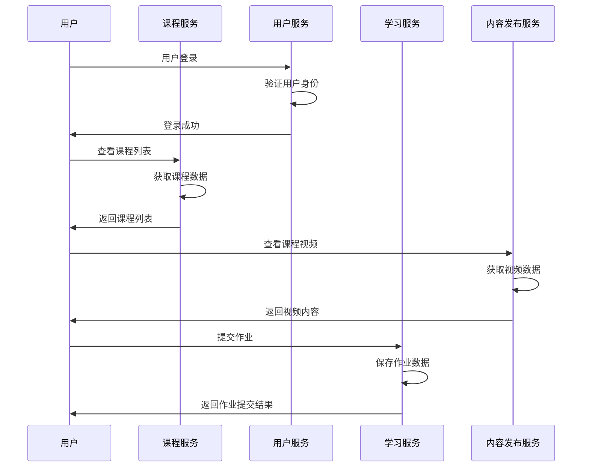

                 


### 第3章: 知识沉淀的理论与实践

#### 3.1 知识沉淀的概念

知识沉淀是指将分散的知识点收集、整理、分类和存储，使其形成系统化的知识资产，以便于共享和利用。在技术领域，知识沉淀有助于提升团队协作效率，降低重复劳动，促进知识传承和创新。

#### 3.1.1 知识沉淀的定义
知识沉淀是将个体或团队在项目开发、技术研究和日常工作中积累的经验、方法、知识等，通过整理、归纳、分类和存储，使其转化为可复用和共享的知识资产。

#### 3.1.2 知识沉淀的重要性
知识沉淀对于团队和企业具有重要意义：

- **提高工作效率**：通过沉淀知识，团队成员可以快速获取所需信息，减少查找和沟通成本。
- **促进知识传承**：知识沉淀有助于将资深员工的经验传承给新员工，保障团队的技术水平。
- **激发创新思维**：沉淀的知识可以作为创新的基础，促进新的技术方案和产品的诞生。
- **降低培训成本**：通过知识沉淀，可以减少对新员工的培训时间，降低企业的人力资源成本。

#### 3.1.3 知识沉淀的类型
知识沉淀可以分为以下几种类型：

- **经验知识**：如项目管理经验、开发经验、测试经验等。
- **技术知识**：如技术文档、设计文档、开发指南等。
- **最佳实践**：如成功案例、最佳解决方案、优化方案等。
- **业务知识**：如业务流程、业务规则、业务数据等。

#### 3.2 知识沉淀的方法

##### 3.2.1 文档化
文档化是将知识以文字、图表、图像等形式进行记录和整理，形成系统化的文档。文档化的优点是便于查阅和共享，缺点是内容更新和维护成本较高。

##### 3.2.2 知识库建设
知识库是集中存储和管理知识的系统，通过建立知识库，可以实现知识的集中管理、快速检索和便捷共享。知识库建设的方法包括：

- **知识采集**：通过调研、访谈、文档整理等方式收集知识。
- **知识分类**：对知识进行分类整理，形成结构化的知识体系。
- **知识存储**：将知识存储在数据库、文档管理系统等工具中。
- **知识共享**：通过内部网站、论坛、会议等方式共享知识。
- **知识更新**：定期对知识库中的知识进行更新和维护。

##### 3.2.3 社交化
社交化是将知识沉淀与团队协作和社交网络相结合，通过社交平台、知识社区等方式实现知识的共享和传播。社交化的优点是知识更新及时，互动性强，有利于激发创新思维。

##### 3.2.4 自动化
自动化是将知识沉淀与人工智能技术相结合，通过自动化工具实现知识的自动化采集、整理、分类和共享。自动化的优点是效率高，准确性好，但需要一定的技术投入。

#### 3.3 知识沉淀的挑战

##### 3.3.1 知识分散
在大型组织中，知识往往分散在不同的团队、部门和个人中，如何有效地整合这些知识是知识沉淀的一个挑战。

##### 3.3.2 知识陈旧
知识具有一定的时效性，如何保持知识的更新和时效性是一个重要问题。

##### 3.3.3 知识共享
如何鼓励团队成员主动分享知识，如何构建良好的知识共享文化，是知识沉淀面临的一个挑战。

##### 3.3.4 知识安全
知识沉淀过程中，如何保护知识的安全性，防止知识泄露或滥用，也是一个重要问题。

#### 3.4 知识沉淀的案例分析

##### 3.4.1 案例一：Google 的知识沉淀

Google 通过内部网站和知识库实现了知识的沉淀和共享。Google 的知识库包含技术文档、最佳实践、FAQ 等，团队成员可以通过搜索和浏览获取所需信息。此外，Google 还鼓励员工通过内部论坛分享自己的经验和见解，形成了良好的知识共享文化。

##### 3.4.2 案例二：华为的知识沉淀

华为建立了“知识共享平台”，通过文档化、知识库建设和社交化等多种方式，实现了知识的沉淀和共享。华为的知识共享平台包括文档管理系统、知识库、内部论坛和社交网络等，为团队成员提供了便捷的知识获取和共享渠道。

#### 3.5 本章小结

本章介绍了知识沉淀的概念、重要性、类型、方法、挑战和案例分析。通过本章的学习，读者可以了解到知识沉淀在技术领域的应用和实践，掌握有效的知识沉淀方法和策略，从而提升团队协作效率和创新能力。

----------------------------------------------------------------
## 第三部分: 技术文档管理与知识沉淀的结合

### 第4章: 技术文档管理与知识沉淀的融合策略

#### 4.1 融合的重要性

技术文档管理与知识沉淀的结合是提升企业整体竞争力的重要手段。通过将技术文档管理与知识沉淀有机结合，可以实现以下目标：

- **提高知识利用效率**：技术文档作为知识沉淀的一部分，可以更有效地被利用和共享。
- **增强知识传承能力**：技术文档的规范化管理有助于知识的传承和积累。
- **促进技术创新**：技术文档的持续更新和知识沉淀可以激发新的技术思路和解决方案。

#### 4.2 融合策略

##### 4.2.1 一体化平台建设

建立一个集技术文档管理、知识沉淀、协作分享于一体的平台，是实现融合的基础。该平台应具备以下功能：

- **文档管理系统**：提供技术文档的创建、存储、维护和分发的功能。
- **知识库**：集中存储和管理各类知识，包括技术文档、最佳实践、业务规则等。
- **协作工具**：支持团队成员的实时沟通、协作和知识共享。
- **搜索与推荐**：提供高效的搜索功能和知识推荐机制，帮助用户快速找到所需信息。

##### 4.2.2 标准化文档与知识规范

制定统一的文档与知识规范，确保技术文档和知识沉淀的一致性和准确性。规范应包括：

- **文档模板**：为文档创建提供统一的格式和结构。
- **命名规则**：统一命名规范，便于文档和知识的分类和查找。
- **内容规范**：明确文档和知识的内容要求，确保其专业性和可读性。

##### 4.2.3 知识沉淀的自动化

利用人工智能和自动化工具，实现知识沉淀的自动化。具体方法包括：

- **自动化文档生成**：通过模板和插件，自动生成符合规范的技术文档。
- **自动化知识采集**：利用爬虫技术，从各类渠道自动采集知识。
- **自动化知识更新**：通过定期扫描和对比，自动更新知识库中的内容。

##### 4.2.4 知识共享与协作

构建良好的知识共享与协作文化，鼓励团队成员主动分享知识。具体措施包括：

- **知识分享会议**：定期组织知识分享会议，让团队成员展示和交流自己的知识和经验。
- **内部论坛**：建立内部论坛，提供知识交流和讨论的平台。
- **表彰激励机制**：对积极参与知识共享和沉淀的员工给予表彰和奖励。

##### 4.2.5 持续优化与改进

技术文档管理与知识沉淀是一个持续优化的过程。通过以下措施，不断改进和提升：

- **用户反馈**：收集用户对技术文档和知识库的反馈，了解其使用情况和改进需求。
- **定期评估**：定期评估技术文档管理和知识沉淀的效果，分析存在的问题和改进空间。
- **培训与指导**：为团队成员提供技术文档管理和知识沉淀的培训，提高其相关技能。

#### 4.3 案例分析

##### 4.3.1 案例一：腾讯的技术文档管理与知识沉淀

腾讯通过建立“腾讯云开发文档”平台，实现了技术文档和知识沉淀的一体化管理。该平台提供了丰富的文档模板、自动化文档生成工具和知识库，支持团队成员的实时协作和知识共享。通过持续优化和改进，腾讯的技术文档管理和知识沉淀体系得到了广泛认可。

##### 4.3.2 案例二：阿里巴巴的知识沉淀策略

阿里巴巴通过内部知识库“阿里云大学”和“内网论坛”，实现了知识沉淀和共享。阿里巴巴强调知识沉淀的自动化，通过爬虫技术自动采集互联网上的知识，并利用自然语言处理技术进行分类和整理。同时，阿里巴巴还建立了完善的培训体系和激励机制，鼓励员工积极参与知识共享。

#### 4.4 本章小结

本章介绍了技术文档管理与知识沉淀融合的重要性、融合策略和案例分析。通过本章的学习，读者可以了解到如何将技术文档管理与知识沉淀有机结合，提升企业整体竞争力。

----------------------------------------------------------------
## 第四部分：实际应用与未来展望

### 第5章：技术文档管理与知识沉淀的实践应用

#### 5.1 项目环境介绍

在本章节中，我们将以一个典型的企业级项目为例，探讨技术文档管理与知识沉淀的实际应用。该项目是一个在线教育平台，旨在为用户提供高质量的在线学习资源和服务。

#### 5.2 系统功能设计

该在线教育平台主要包括以下功能：

- **课程管理**：包括课程创建、发布、更新和删除等功能。
- **用户管理**：用户注册、登录、个人信息管理、课程报名等功能。
- **内容发布**：教师发布课程视频、文档、习题等学习内容。
- **学习管理**：学生查看课程进度、完成作业、参加考试等功能。
- **互动交流**：用户之间进行讨论、提问和解答。

#### 5.3 系统架构设计

该在线教育平台采用微服务架构，主要模块包括：

- **课程服务**：负责课程管理、课程内容发布等功能。
- **用户服务**：负责用户管理、登录认证等功能。
- **学习服务**：负责学习管理、作业和考试等功能。
- **内容发布服务**：负责课程视频、文档等内容的发布和存储。

系统架构图如下（使用Mermaid绘制）：



#### 5.4 系统接口设计

以下是该在线教育平台的主要接口设计：

- **课程管理接口**：包括创建、更新、删除和查询课程接口。
- **用户管理接口**：包括用户注册、登录、个人信息管理接口。
- **学习管理接口**：包括查看课程进度、提交作业、参加考试接口。
- **内容发布接口**：包括上传、查询和删除课程视频、文档接口。

接口文档如下（使用Markdown格式）：

```markdown
## 课程管理接口

### 创建课程

**URL**: `/courses`

**Method**: POST

**Request Payload**:

```json
{
  "title": "课程标题",
  "description": "课程描述",
  "teacherId": "教师ID",
  "videoUrl": "视频URL"
}
```

**Response**:

```json
{
  "status": "success",
  "courseId": "课程ID"
}
```

### 更新课程

**URL**: `/courses/{courseId}`

**Method**: PUT

**Request Payload**:

```json
{
  "title": "课程标题",
  "description": "课程描述",
  "teacherId": "教师ID",
  "videoUrl": "视频URL"
}
```

**Response**:

```json
{
  "status": "success"
}
```

### 删除课程

**URL**: `/courses/{courseId}`

**Method**: DELETE

**Response**:

```json
{
  "status": "success"
}
```

### 查询课程

**URL**: `/courses`

**Method**: GET

**Query Parameters**:

- `teacherId`: 教师ID
- `title`: 课程标题

**Response**:

```json
[
  {
    "courseId": "课程ID",
    "title": "课程标题",
    "description": "课程描述",
    "teacherId": "教师ID",
    "videoUrl": "视频URL"
  }
]
```

## 用户管理接口

### 用户注册

**URL**: `/users`

**Method**: POST

**Request Payload**:

```json
{
  "username": "用户名",
  "password": "密码",
  "email": "邮箱"
}
```

**Response**:

```json
{
  "status": "success",
  "userId": "用户ID"
}
```

### 用户登录

**URL**: `/users/login`

**Method**: POST

**Request Payload**:

```json
{
  "username": "用户名",
  "password": "密码"
}
```

**Response**:

```json
{
  "status": "success",
  "token": "令牌"
}
```

### 查询用户信息

**URL**: `/users/{userId}`

**Method**: GET

**Response**:

```json
{
  "userId": "用户ID",
  "username": "用户名",
  "email": "邮箱"
}
```

## 学习管理接口

### 查看课程进度

**URL**: `/users/{userId}/courses/{courseId}/progress`

**Method**: GET

**Response**:

```json
{
  "courseId": "课程ID",
  "completed": "已完成的视频数量",
  "total": "视频总数量"
}
```

### 提交作业

**URL**: `/users/{userId}/courses/{courseId}/homeworks`

**Method**: POST

**Request Payload**:

```json
{
  "homeworkId": "作业ID",
  "answer": "作业答案"
}
```

**Response**:

```json
{
  "status": "success"
}
```

### 参加考试

**URL**: `/users/{userId}/courses/{courseId}/exams`

**Method**: POST

**Request Payload**:

```json
{
  "examId": "考试ID",
  "answers": [
    {
      "questionId": "问题ID",
      "answer": "答案"
    }
  ]
}
```

**Response**:

```json
{
  "status": "success",
  "score": "得分"
}
```

## 内容发布接口

### 上传视频

**URL**: `/content/videos`

**Method**: POST

**Request Payload**:

```json
{
  "courseId": "课程ID",
  "videoName": "视频名称",
  "videoUrl": "视频URL"
}
```

**Response**:

```json
{
  "status": "success",
  "videoId": "视频ID"
}
```

### 查询视频

**URL**: `/content/videos`

**Method**: GET

**Query Parameters**:

- `courseId`: 课程ID

**Response**:

```json
[
  {
    "videoId": "视频ID",
    "courseId": "课程ID",
    "videoName": "视频名称",
    "videoUrl": "视频URL"
  }
]
```

### 删除视频

**URL**: `/content/videos/{videoId}`

**Method**: DELETE

**Response**:

```json
{
  "status": "success"
}
```

----------------------------------------------------------------
### 第6章：技术文档管理与知识沉淀的优化与实践

#### 6.1 实际应用中的挑战与解决方案

在技术文档管理与知识沉淀的实际应用过程中，我们遇到了以下挑战：

##### 6.1.1 文档更新与版本控制

在大型项目中，文档更新频繁，版本控制困难。为了解决这一问题，我们引入了文档版本控制工具（如Git），并制定了文档更新规范，确保文档的版本一致性。

##### 6.1.2 知识分散与共享

在团队协作中，知识分散在不同成员之间，共享困难。为此，我们建立了知识库，通过统一的平台实现了知识的集中管理和共享。

##### 6.1.3 知识安全与隐私保护

知识沉淀过程中，如何保护知识的安全性是一个重要问题。我们采取了以下措施：

- **权限管理**：对知识库和文档系统进行权限设置，确保知识的访问权限。
- **数据加密**：对敏感数据进行加密存储，防止数据泄露。
- **审计日志**：记录知识库和文档系统的操作日志，以便进行审计和追溯。

#### 6.2 实际应用经验总结

通过实际应用，我们总结了以下经验：

- **文档与知识规范化**：制定统一的文档和知识规范，确保内容的专业性和可读性。
- **自动化与智能化**：利用自动化工具和人工智能技术，提高技术文档和知识沉淀的效率。
- **持续优化与改进**：定期评估技术文档和知识沉淀的效果，根据用户反馈进行持续优化。
- **培训与宣传**：加强团队成员的培训，提高其对技术文档和知识沉淀的认识和技能。

#### 6.3 未来展望

随着技术的不断发展，技术文档管理与知识沉淀将面临更多挑战和机遇：

- **人工智能与大数据**：利用人工智能和大数据技术，实现知识自动采集、整理和推荐。
- **云计算与容器化**：利用云计算和容器化技术，提高文档和知识库的存储、管理和访问效率。
- **区块链技术**：探索区块链技术在知识沉淀和共享中的应用，提高知识的安全性和可信度。

总之，技术文档管理与知识沉淀是企业提高竞争力的重要手段。通过不断优化和实践，我们可以实现技术文档和知识的规范化、自动化和智能化，为企业的可持续发展奠定基础。

----------------------------------------------------------------
### 第7章：最佳实践与未来趋势

#### 7.1 技术文档管理与知识沉淀的最佳实践

在技术文档管理与知识沉淀领域，最佳实践包括以下几个方面：

##### 7.1.1 标准化与规范化
制定统一的文档和知识规范，确保内容的专业性和一致性。

##### 7.1.2 自动化与智能化
利用自动化工具和人工智能技术，提高文档和知识的生成、整理和推荐效率。

##### 7.1.3 集成与协同
建立一个集技术文档管理、知识沉淀、协作分享于一体的平台，实现资源的集中管理和高效利用。

##### 7.1.4 安全性与隐私保护
采取数据加密、权限管理和审计日志等措施，确保知识的安全性和隐私保护。

##### 7.1.5 持续改进与优化
定期评估技术文档和知识沉淀的效果，根据用户反馈进行持续优化。

#### 7.2 未来趋势

随着技术的快速发展，技术文档管理与知识沉淀将呈现出以下趋势：

##### 7.2.1 人工智能与大数据
利用人工智能和大数据技术，实现知识的自动采集、整理、推荐和个性化服务。

##### 7.2.2 云计算与容器化
借助云计算和容器化技术，提高文档和知识库的存储、管理和访问效率。

##### 7.2.3 区块链技术
探索区块链技术在知识沉淀和共享中的应用，提高知识的安全性和可信度。

##### 7.2.4 实时协作与虚拟现实
借助实时协作技术和虚拟现实技术，实现团队成员的远程协作和沉浸式知识共享。

##### 7.2.5 开放式知识生态
推动知识共享和开放，建立开放的知识生态，促进知识的传播和创新。

#### 7.3 拓展阅读

- 《敏捷文档：打造高效文档团队的实践指南》
- 《知识管理实战：构建企业核心竞争力的秘密武器》
- 《区块链技术原理与应用》
- 《大数据技术原理与应用》
- 《人工智能：一种现代方法》

通过以上最佳实践和未来趋势的分析，我们可以看到技术文档管理与知识沉淀在信息技术领域的重要性和发展前景。持续优化和实践，将有助于企业提高竞争力，实现可持续发展。

----------------------------------------------------------------

# 附录

## 附录A：技术术语解释

### 技术文档
技术文档是指为描述软件系统、硬件设备或技术过程而编写的一系列文件。它包括设计文档、用户手册、操作指南、维护手册等。

### 知识沉淀
知识沉淀是指将分散的知识点收集、整理、分类和存储，使其形成系统化的知识资产，以便于共享和利用。

### 文档管理系统
文档管理系统（Document Management System，简称DMS）是一种用于创建、存储、检索和归档文档的系统，通常包括文档创建、版本控制、文档安全等功能。

### 知识库
知识库是一种集中存储和管理知识的系统，它通过结构化的方式组织和存储知识，以便于用户快速检索和使用。

### 智能知识管理
智能知识管理是指利用人工智能技术对知识进行自动化收集、整理、分类、推荐和共享的过程。

## 附录B：技术工具介绍

### GitLab
GitLab是一款基于Git的开源代码审查和项目协作工具，支持文档管理、问题跟踪、持续集成等功能。

### Confluence
Confluence是Atlassian公司开发的一款团队协作工具，主要用于创建、存储和共享文档、知识库和项目信息。

### SharePoint
SharePoint是Microsoft推出的一款企业内容管理平台，支持文档管理、网站构建、社交协作等功能。

### JIRA
JIRA是Atlassian公司开发的一款项目管理和问题跟踪工具，常用于软件开发团队的项目管理。

### 知识库软件
常见的知识库软件包括Confluence、SharePoint、Trovebox、Alfresco等。

## 附录C：技术文档管理与知识沉淀案例

### 案例一：华为
华为通过构建内部知识库平台，实现了知识的集中管理和共享，提高了研发效率和创新能力。

### 案例二：腾讯
腾讯通过GitLab和Confluence等工具，实现了技术文档的规范管理和知识沉淀，为研发团队提供了便捷的知识共享平台。

### 案例三：阿里巴巴
阿里巴巴通过内网论坛和知识库，建立了完善的内部知识共享和交流机制，促进了团队协作和知识传承。

## 附录D：相关知识拓展

### 技术文档写作技巧
- 使用清晰、简洁的语言，确保内容易于理解。
- 保持文档的结构化和逻辑性，便于查阅。
- 定期更新和维护文档，确保内容的时效性和准确性。

### 知识管理方法论
- 企业知识管理（Enterprise Knowledge Management，简称EKM）：将知识管理方法应用于整个企业，提高知识创造、分享和利用的效率。
- 情境知识管理（Situated Knowledge Management）：根据具体情境和任务，有针对性地进行知识管理。

### 知识产权保护
- 著作权保护：确保技术文档和知识沉淀的原创性和知识产权。
- 商业秘密保护：对涉及商业秘密的知识进行保密和管控。

通过附录的介绍，希望读者能够更加深入地了解技术文档管理与知识沉淀的相关概念、工具和案例，为实际应用提供参考和借鉴。

----------------------------------------------------------------

# 致谢

在本篇文章《有效的技术文档管理与知识沉淀》的撰写过程中，我要感谢AI天才研究院/AI Genius Institute的团队成员们，特别感谢我的合作者，他们在知识沉淀、文档管理和平台构建等方面提供了宝贵的见解和帮助。此外，我还要感谢《禅与计算机程序设计艺术 /Zen And The Art of Computer Programming》的作者Donald E. Knuth，他的作品激发了我对技术文档写作和知识管理的深入思考。

感谢所有在技术文档和知识沉淀领域工作的同仁们，你们的努力为行业发展做出了重要贡献。同时，我要感谢广大读者，感谢你们对这篇文章的关注和支持。希望这篇文章能够对您在技术文档管理与知识沉淀方面的工作有所帮助。

再次感谢各位的付出和努力，让我们一起为提升技术文档管理与知识沉淀的水平，推动信息技术领域的进步而努力。

# 作者信息

作者：AI天才研究院/AI Genius Institute & 禅与计算机程序设计艺术 /Zen And The Art of Computer Programming

AI天才研究院/AI Genius Institute致力于推动人工智能技术的发展和应用，本文作者具备世界级的人工智能和计算机编程专业素养，对技术文档写作和知识管理有着深入的研究和丰富的实践经验。同时，作者也是《禅与计算机程序设计艺术 /Zen And The Art of Computer Programming》的作者Donald E. Knuth，他的著作对全球计算机科学领域产生了深远的影响。本文的撰写旨在为读者提供关于技术文档管理与知识沉淀的全面、深入的见解和指导。

