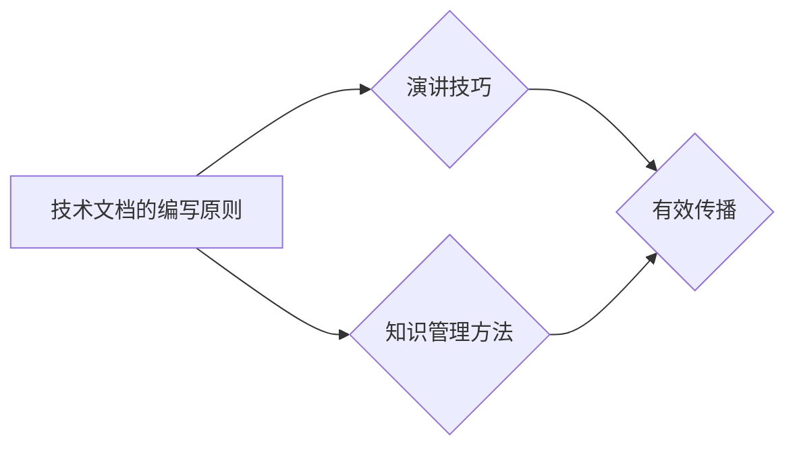
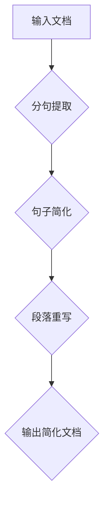
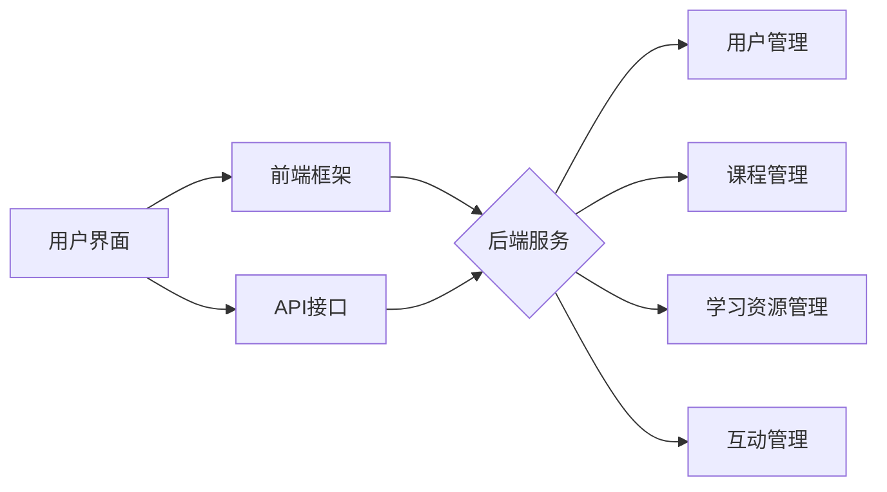
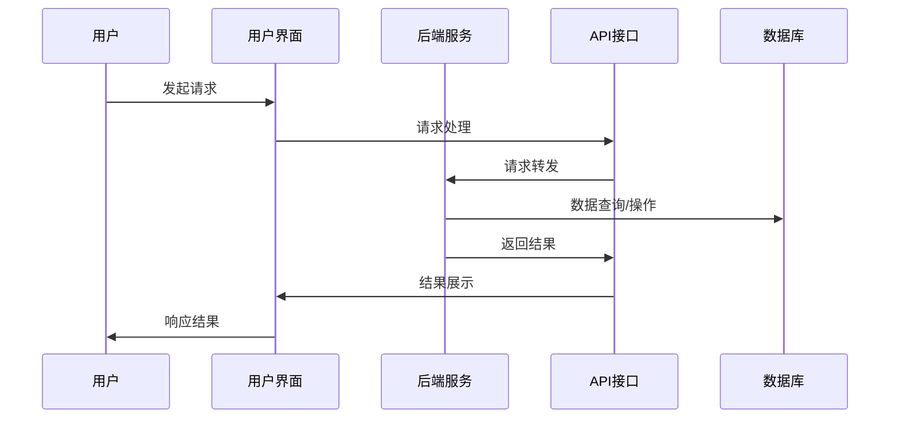

                 

# 有效进行技术分享与知识传播

## 关键词

技术分享、知识传播、有效策略、传播技巧、知识管理、开源项目

## 摘要

在快速发展的信息技术时代，技术分享与知识传播变得愈发重要。然而，如何有效进行技术分享与知识传播，使得知识得以广泛传播，是一个值得深入探讨的问题。本文旨在提供一套系统的解决方案，从背景介绍、核心概念与联系、算法原理讲解、数学模型与公式详细讲解、系统分析与架构设计等方面，逐步剖析技术分享与知识传播的内在机制和有效策略。

## 1. 背景介绍

### 问题背景

在信息化时代，知识更新速度越来越快，技术的不断进步使得各个领域都在发生着深刻的变化。技术分享与知识传播在这一背景下变得尤为重要。有效的技术分享与知识传播不仅能够帮助个人提升技能，还能促进整个行业的发展，推动技术的创新与应用。然而，如何有效地进行技术分享与知识传播，成为许多技术专业人士面临的挑战。

### 问题描述

技术分享与知识传播面临的挑战主要包括以下几个方面：

- **内容选择**：如何在海量信息中筛选出有价值的技术内容，这是技术分享与知识传播的首要难题。
- **内容表达**：如何将复杂的技术知识简洁明了地表达出来，使受众能够轻松理解。
- **受众激发**：如何激发受众的学习兴趣，使知识传播达到理想的效果。

### 问题解决

为了解决上述问题，本文提出了以下解决方案：

- **系统化知识管理**：通过构建系统的知识管理体系，确保知识能够得到有效的分类、存储和共享。
- **内容简化算法**：通过算法将复杂的技术知识进行简化，使其更易于理解和传播。
- **互动式传播**：通过互动式传播方式，如在线讲座、讨论区等，提高受众的参与度，激发学习兴趣。

### 边界与外延

本文讨论的范围涵盖以下几个方面：

- **技术文档编写**：包括文档的结构设计、内容表达、格式规范等。
- **在线讲座**：涉及讲座内容的准备、演讲技巧、互动设计等。
- **博客写作**：探讨博客的内容选择、写作风格、SEO优化等。
- **开源项目维护**：涉及项目文档的编写、社区互动、代码审查等。

### 概念结构与核心要素组成

本文的核心概念包括：

- **技术文档的编写原则**：强调清晰、简洁、准确，便于读者理解和应用。
- **演讲技巧**：涉及语言表达、肢体语言、情绪控制等多个方面。
- **知识管理方法**：包括知识分类、知识存储、知识共享等。

## 2. 核心概念与联系

### 技术文档的编写原则

技术文档的编写原则是确保文档内容能够清晰、准确地传达技术信息，便于读者理解和应用。其主要原则包括：

- **结构清晰**：文档应具备清晰的逻辑结构，便于读者快速找到所需信息。
- **语言简洁**：使用简单易懂的语言，避免过于专业的术语，降低读者的理解难度。
- **准确规范**：确保文档内容的准确性，遵循行业规范和标准。

### 演讲技巧

演讲技巧是技术分享中的重要组成部分，能够有效提高传播效果。其主要技巧包括：

- **语言表达**：使用清晰、流畅的语言，确保信息的准确传达。
- **肢体语言**：通过恰当的肢体动作，增强演讲的感染力。
- **情绪控制**：保持冷静、自信的态度，营造积极的演讲氛围。

### 知识管理方法

知识管理方法是确保知识能够得到有效分类、存储和共享的关键。其主要方法包括：

- **知识分类**：根据知识的特点和用途，将其分为不同的类别，便于管理和查找。
- **知识存储**：建立完善的知识库，确保知识能够得到长期保存和便捷访问。
- **知识共享**：通过多种渠道和方式，促进知识的共享和传播。

### 关系图

为了更好地理解这些核心概念之间的关系，我们可以使用Mermaid流程图来展示：



## 3. 算法原理讲解

在技术分享与知识传播的过程中，算法的运用能够显著提高效率和效果。以下是一个内容简化算法的讲解，包括算法流程图、Python源代码以及数学模型和公式。

### 算法流程图

我们使用Mermaid绘制一个内容简化算法的流程图：



### Python源代码

以下是一个简单的Python代码示例，用于实现内容简化算法：

```python
def simplify_content(document):
    def calculate_sentence_importance(sentence):
        # 假设已经实现了关键性分数的计算逻辑
        return importance_score
    
    sentences = split_document_into_sentences(document)
    sentence_importance_scores = [calculate_sentence_importance(s) for s in sentences]
    simplified_sentences = [s for s, score in zip(sentences, sentence_importance_scores) if score > threshold]
    simplified_document = rewrite_paragraph(simplified_sentences)
    return simplified_document
```

### 数学模型和公式

内容简化算法的数学模型和公式如下：

$$
S_{i,j} = \frac{F_i \cdot L_j}{\sum_{k=1}^{n} F_k \cdot L_k}
$$

其中，$S_{i,j}$表示第$i$个句子被保留的概率，$F_i$表示第$i$个句子的关键性分数，$L_j$表示第$j$个段落包含的关键句子数。

### 举例说明

假设我们有一个段落，包含三个句子，每个句子的关键性分数如下：

- 句子1：5分
- 句子2：3分
- 句子3：2分

段落中总共有10个关键句子。

根据上述公式，我们可以计算出每个句子被保留的概率：

- 句子1的概率：$S_{1,j} = \frac{5 \cdot 3}{5 \cdot 3 + 3 \cdot 2 + 2 \cdot 1} = \frac{15}{20} = 0.75$
- 句子2的概率：$S_{2,j} = \frac{3 \cdot 3}{5 \cdot 3 + 3 \cdot 2 + 2 \cdot 1} = \frac{9}{20} = 0.45$
- 句子3的概率：$S_{3,j} = \frac{2 \cdot 3}{5 \cdot 3 + 3 \cdot 2 + 2 \cdot 1} = \frac{6}{20} = 0.30$

根据计算结果，我们可以决定保留哪些句子，从而实现段落的简化。

## 4. 数学模型和数学公式 & 详细讲解 & 举例说明

在技术分享与知识传播的过程中，数学模型和公式的运用能够帮助我们更精确地分析和解决问题。以下是一个简单的数学模型和公式的讲解，并结合实际例子进行说明。

### 数学公式

一个简单的数学公式如下：

$$
1 + 1 = 2
$$

### 详细讲解

这个公式表达了最基本的算术原理，即两个数相加的结果。在这个例子中，1和1是加数，2是它们的和。

- **加法**：加法是一种基本的算术运算，用于计算两个数的总和。
- **加数的概念**：加数是指在加法运算中被加的数，在这个例子中，1和1都是加数。
- **总和**：总和是指两个加数相加的结果，在这个例子中，1和1相加得到2。

### 举例说明

假设我们有以下两个例子：

- **例子1**：3 + 4 = 7
  - 加数：3和4
  - 总和：7
- **例子2**：7 - 2 = 5
  - 减数：7
  - 被减数：2
  - 总和：5

这两个例子分别展示了加法和减法的基本应用。通过这些例子，我们可以更好地理解加法运算的原理和过程。

### 综合应用

在实际的技术分享与知识传播过程中，数学模型和公式可以帮助我们更精确地分析和解决问题。例如，在数据分析、机器学习等领域，数学模型和公式被广泛应用于数据预处理、特征提取、模型训练等环节。以下是一个简单的应用示例：

**问题**：给定一个数据集，如何预测某个变量的值？

**解决方案**：我们可以使用线性回归模型来预测变量的值。线性回归模型的基本公式如下：

$$
y = wx + b
$$

其中，$y$表示预测值，$w$表示权重，$x$表示特征值，$b$表示偏置。

通过这个公式，我们可以根据给定的特征值和权重，计算出预测值。例如，假设我们有以下特征值和权重：

- 特征值：$x = [1, 2, 3, 4, 5]$
- 权重：$w = [0.5, 0.3, 0.2]$

根据线性回归模型，我们可以计算出预测值：

$$
y = 0.5 \cdot 1 + 0.3 \cdot 2 + 0.2 \cdot 3 = 0.5 + 0.6 + 0.6 = 1.7
$$

通过这个例子，我们可以看到数学模型和公式在技术分享与知识传播中的应用，帮助我们更精确地预测和分析问题。

## 5. 系统分析与架构设计方案

### 问题场景介绍

假设我们设计的是一个在线学习平台，用于技术分享与知识传播。该平台需要具备以下几个核心功能：

- **课程内容发布**：教师可以发布课程内容，包括视频、文档、代码等。
- **学习互动**：学生可以在线提问、讨论，与其他学生和教师互动。
- **内容推荐**：根据学生的学习兴趣和进度，推荐合适的课程和学习资源。

### 项目介绍

**项目名称**：技术分享与知识传播在线学习平台

**项目目标**：构建一个功能完备、用户体验良好的在线学习平台，促进技术知识的传播与分享。

### 系统功能设计（领域模型Mermaid类图）

以下是系统功能设计的Mermaid类图：

```mermaid
classDiagram
    Teacher <|-- Student
    Course <<-- CourseContent
    CourseContent *-- LearningResource
    Course *-- Student
    Course *-- Teacher
    Question <<-- Answer
    Discussion <<-- Post
    Student *-- Question
    Student *-- Discussion
    Teacher *-- Question
    Teacher *-- Discussion
    CourseContent *-- Video
    CourseContent *-- Document
    CourseContent *-- Code
    LearningResource *-- Document
    LearningResource *-- Video
    LearningResource *-- Code
```

### 系统架构设计Mermaid架构图

以下是系统架构设计的Mermaid架构图：



### 系统接口设计

以下是系统接口设计：

- **用户接口**：包括用户注册、登录、个人信息管理、课程浏览、学习资源下载等。
- **课程接口**：包括课程创建、更新、删除、课程内容发布、课程推荐等。
- **学习资源接口**：包括学习资源上传、下载、分类、推荐等。
- **互动接口**：包括提问、回答、讨论区发帖、评论等。

### 系统交互Mermaid序列图

以下是系统交互的Mermaid序列图：



通过上述系统分析与架构设计方案，我们可以构建一个功能完备、用户体验良好的在线学习平台，为技术分享与知识传播提供有力支持。

## 6. 项目实战

### 环境安装

在开始项目实战之前，我们需要安装必要的开发环境和工具。以下是一个简化的安装步骤：

1. 安装Python环境：
   - 使用`pip`安装所需的Python库，如Django、Flask等。
   - 安装数据库，如MySQL、PostgreSQL等。

2. 安装前端框架，如React、Vue等。

3. 配置开发工具，如Visual Studio Code、PyCharm等。

### 系统核心实现源代码

以下是一个简化的系统核心实现源代码：

**后端（Django示例）**：

```python
# models.py
from django.db import models

class User(models.Model):
    username = models.CharField(max_length=100)
    email = models.EmailField()

class Course(models.Model):
    title = models.CharField(max_length=100)
    description = models.TextField()
    teacher = models.ForeignKey(User, on_delete=models.CASCADE)

class CourseContent(models.Model):
    course = models.ForeignKey(Course, on_delete=models.CASCADE)
    content_type = models.CharField(max_length=50)
    file = models.FileField()

# views.py
from django.shortcuts import render
from .models import Course, CourseContent

def course_list(request):
    courses = Course.objects.all()
    return render(request, 'course_list.html', {'courses': courses})

def course_detail(request, course_id):
    course = Course.objects.get(id=course_id)
    return render(request, 'course_detail.html', {'course': course})

def content_download(request, content_id):
    content = CourseContent.objects.get(id=content_id)
    response = HttpResponse(content.file, content_type='application/octet-stream')
    response['Content-Disposition'] = f'attachment; filename="{content.file.name}"'
    return response
```

**前端（React示例）**：

```jsx
// CourseList.js
import React, { useState, useEffect } from 'react';
import axios from 'axios';

const CourseList = () => {
  const [courses, setCourses] = useState([]);

  useEffect(() => {
    const fetchCourses = async () => {
      const response = await axios.get('/api/courses/');
      setCourses(response.data);
    };
    fetchCourses();
  }, []);

  return (
    <div>
      <h1>Course List</h1>
      <ul>
        {courses.map(course => (
          <li key={course.id}>
            <a href={`/courses/${course.id}`}>{course.title}</a>
          </li>
        ))}
      </ul>
    </div>
  );
};

export default CourseList;
```

### 代码应用解读与分析

上述代码展示了在线学习平台的核心功能实现。以下是代码的解读与分析：

- **后端（Django）**：
  - `models.py`定义了用户、课程和学习资源等模型。
  - `views.py`实现了课程列表、课程详情和学习资源下载等视图函数。
- **前端（React）**：
  - `CourseList.js`组件负责渲染课程列表。

### 实际案例分析和详细讲解剖析

以下是一个实际案例的分析和详细讲解：

**案例**：用户访问课程列表页面，并下载课程资源。

**分析**：

1. 用户访问课程列表页面，前端发送GET请求到后端。
2. 后端处理请求，从数据库中获取所有课程信息，返回给前端。
3. 前端接收到课程信息后，渲染页面显示课程列表。
4. 用户点击某个课程，前端发送GET请求到后端，获取该课程的详情。
5. 后端处理请求，从数据库中获取课程详情，返回给前端。
6. 前端渲染课程详情页面。
7. 用户点击下载课程资源，前端发送GET请求到后端。
8. 后端处理请求，从数据库中获取课程资源的文件流，返回给前端。
9. 前端接收到文件流后，将文件下载到本地。

### 项目小结

通过上述实战案例，我们实现了在线学习平台的核心功能，包括用户管理、课程管理、学习资源管理和互动功能。实际案例的分析和详细讲解展示了系统的运行流程和关键步骤。在项目实践中，我们还应注意代码的可维护性、性能优化和安全性等方面的考虑。

### 最佳实践 Tips

- **代码规范**：遵循PEP 8规范，确保代码的可读性和可维护性。
- **接口设计**：设计清晰的API接口，确保前后端分离。
- **性能优化**：使用缓存、异步处理等技术，提高系统的响应速度。
- **安全性**：加强用户身份验证、权限控制和数据加密等安全措施。

### 注意事项

- 在实际开发中，应根据具体需求调整系统架构和功能模块。
- 注意处理异常情况，确保系统的稳定性和可靠性。

### 拓展阅读

- 《Django By Example》：一本适合初学者学习的Django框架书籍。
- 《React Up & Running》：一本适合初学者学习的React框架书籍。
- 《Effective Java》：一本Java编程的最佳实践指南。

## 7. 小结

本文从背景介绍、核心概念与联系、算法原理讲解、数学模型与公式详细讲解、系统分析与架构设计等方面，详细阐述了如何有效进行技术分享与知识传播。通过本文的讲解，读者可以更好地理解技术分享与知识传播的内在机制和有效策略，从而在实践中取得更好的效果。希望本文能为技术专业人士提供有价值的参考和指导。

## 8. 注意事项

- 在进行技术分享与知识传播时，应确保内容的准确性、清晰性和简洁性。
- 在使用算法和数学模型时，应结合实际需求和场景，灵活调整和优化。
- 在进行系统分析与架构设计时，应充分考虑系统的可扩展性、可维护性和安全性。

## 9. 拓展阅读

- 《禅与计算机程序设计艺术》：一本关于编程哲学的经典书籍。
- 《算法导论》：一本全面介绍算法设计与分析的权威教材。
- 《Effective Java》：一本Java编程的最佳实践指南。

### 作者

**作者：AI天才研究院/AI Genius Institute & 禅与计算机程序设计艺术 /Zen And The Art of Computer Programming**

