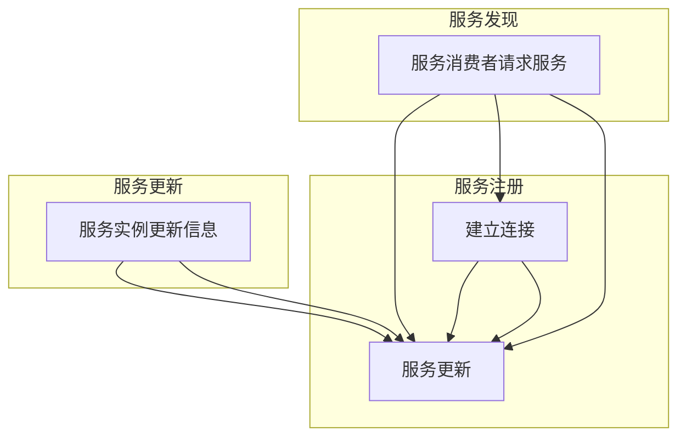
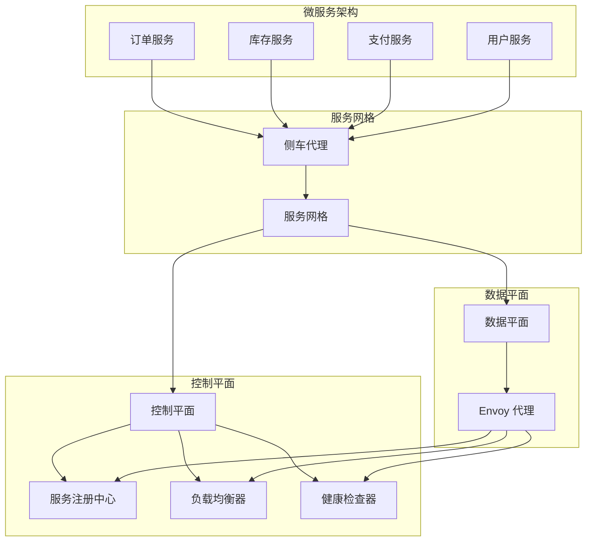
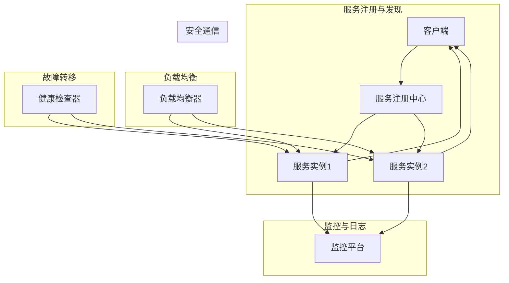

                 

# 服务网格(Service Mesh)落地实践

## 关键词

- 服务网格
- 微服务架构
- 数据平面
- 控制平面
- Envoy
- Istio
- 监控管理
- 安全策略

## 摘要

本文将深入探讨服务网格（Service Mesh）的落地实践。随着微服务架构的普及，服务网格作为一种基础设施，已经成为现代分布式系统不可或缺的一部分。本文将首先介绍服务网格的基本概念和重要性，然后逐步深入到服务网格的核心原理、架构设计、主要实现（如Istio和Envoy）、部署实践、监控管理、安全策略等方面，最后探讨未来的发展趋势。通过这篇文章，读者将全面了解服务网格的实际应用和最佳实践。

## 引言

在传统的单体架构中，应用程序通常是一个单一的、庞大的代码库，所有的功能和服务都集中在一个应用程序中。然而，随着业务需求的不断变化和技术的发展，单体架构逐渐暴露出许多问题，如模块间耦合度高、扩展性差、维护困难等。为了解决这些问题，微服务架构逐渐兴起。

微服务架构将应用程序分解成一组小型、独立的服务，每个服务负责完成一个特定的业务功能。这些服务可以独立部署、扩展和升级，从而提高了系统的灵活性和可维护性。然而，微服务架构也带来了新的挑战，如服务之间的通信复杂度增加、服务发现困难、服务间延迟增加等。

服务网格（Service Mesh）正是为了解决这些挑战而诞生的一种基础设施。它提供了一个统一的通信层，负责处理服务之间的通信、服务发现、负载均衡、故障转移、安全等核心功能。通过服务网格，开发人员可以专注于业务逻辑的实现，而无需担心服务之间的通信问题。

## 服务网格的核心概念和原理

### 服务网格模型

服务网格是一种侧车（sidecar）模式的架构，每个服务实例都附带一个侧车代理（sidecar proxy）。这个代理负责处理服务实例之间的通信，而服务实例本身则专注于业务逻辑的实现。服务网格的基本模型包括数据平面（Data Plane）和控制平面（Control Plane）。

- **数据平面**：负责处理服务实例之间的数据传输，包括服务发现、负载均衡、故障转移、安全等功能。数据平面通常由一系列代理（如Envoy）组成，这些代理部署在服务实例旁边。
- **控制平面**：负责配置和管理数据平面的操作，包括服务注册、路由策略、故障注入等。控制平面通常由一个或多个控制器（Controller）组成，这些控制器负责生成和管理数据平面的配置。

### 侧车代理

侧车代理是服务网格中的核心组件，它们负责处理服务实例之间的通信。侧车代理通常具有以下功能：

- **服务发现**：自动发现服务实例，并将其注册到服务注册中心。
- **负载均衡**：根据特定的策略（如轮询、最小连接数等）将请求分配到不同的服务实例。
- **故障转移**：当服务实例出现故障时，自动切换到其他健康的服务实例。
- **安全**：通过身份验证和授权来保护服务之间的通信。
- **监控和日志**：收集服务实例的监控数据和日志，并提供统一的监控和日志分析平台。

### 数据平面与控制平面

服务网格的数据平面和控制平面之间通过配置协议进行通信。数据平面根据控制平面的配置来处理服务实例之间的通信。常见的配置协议包括：

- **Envoy API**：Envoy 代理使用自定义的 API 与控制平面进行通信，以获取服务发现、路由策略等配置信息。
- **Kubernetes API**：Istio 控制平面使用 Kubernetes API 来管理服务网格中的服务和配置。

### 数据平面与控制平面的交互

数据平面与控制平面的交互通常包括以下几个步骤：

1. **服务注册**：服务实例启动时，自动将其元数据（如服务名称、IP 地址等）注册到服务注册中心。
2. **服务发现**：控制平面从服务注册中心获取服务实例的元数据，并将其配置到数据平面代理。
3. **路由策略**：控制平面根据业务需求定义路由策略，如负载均衡策略、故障转移策略等，并将其配置到数据平面代理。
4. **故障注入**：控制平面可以模拟服务实例的故障，以测试和验证故障转移和容错机制。
5. **监控和日志**：数据平面代理收集服务实例的监控数据和日志，并将其发送到监控和日志系统。

### 服务网格的优势

服务网格为微服务架构带来了许多优势，包括：

- **解耦**：服务网格提供了一个统一的通信层，将服务实例的通信与业务逻辑解耦，从而提高了系统的可维护性和扩展性。
- **可观测性**：通过服务网格，可以方便地收集和监控服务实例的监控数据和日志，从而实现统一监控和日志分析。
- **安全性**：服务网格提供了强大的身份验证和授权机制，从而确保服务之间的通信安全。
- **可靠性**：服务网格提供了负载均衡、故障转移等功能，从而提高了系统的可靠性。

### 服务网格的挑战

尽管服务网格具有许多优势，但在实际部署过程中也面临着一些挑战，包括：

- **性能开销**：服务网格引入了额外的通信开销，可能导致服务之间的延迟增加。需要仔细权衡性能与功能之间的关系。
- **复杂性**：服务网格的配置和管理相对复杂，需要专业的知识和经验。需要提供易于使用的工具和文档，以降低部署和管理的难度。
- **兼容性**：服务网格需要与其他系统和工具（如容器编排系统、服务注册中心等）兼容，以确保整个系统的稳定性和一致性。

### 小结

服务网格是一种重要的基础设施，为微服务架构提供了统一的通信层和核心功能。通过服务网格，可以简化服务之间的通信，提高系统的可维护性和扩展性。然而，在实际部署过程中，也需要注意性能开销和复杂性等问题。

## 服务网格的架构和设计模式

### 服务网格的架构

服务网格的架构通常包括数据平面（Data Plane）和控制平面（Control Plane）两部分。数据平面由一系列代理（Proxy）组成，这些代理部署在服务实例旁边，负责处理服务实例之间的通信。控制平面通常由一个或多个控制器（Controller）组成，负责生成和管理数据平面的配置。

#### 数据平面

数据平面的核心组件是代理，常见的代理包括Envoy、Linkerd等。代理的主要功能包括：

- **服务发现**：自动发现服务实例，并将其注册到服务注册中心。
- **负载均衡**：根据特定的策略（如轮询、最小连接数等）将请求分配到不同的服务实例。
- **故障转移**：当服务实例出现故障时，自动切换到其他健康的服务实例。
- **安全**：通过身份验证和授权来保护服务之间的通信。
- **监控和日志**：收集服务实例的监控数据和日志，并提供统一的监控和日志分析平台。

#### 控制平面

控制平面的核心组件是控制器，常见的控制器包括Istio的Pilot、Linkerd的Control Plane等。控制器的主要功能包括：

- **服务注册**：从服务注册中心获取服务实例的元数据，并将其配置到数据平面代理。
- **路由策略**：根据业务需求定义路由策略，如负载均衡策略、故障转移策略等，并将其配置到数据平面代理。
- **故障注入**：模拟服务实例的故障，以测试和验证故障转移和容错机制。
- **监控和日志**：从数据平面代理收集监控数据和日志，并提供统一的监控和日志分析平台。

#### 数据平面与控制平面的交互

数据平面与控制平面之间通过配置协议进行通信，常见的配置协议包括：

- **Envoy API**：Envoy 代理使用自定义的 API 与控制平面进行通信，以获取服务发现、路由策略等配置信息。
- **Kubernetes API**：Istio 控制平面使用 Kubernetes API 来管理服务网格中的服务和配置。

数据平面与控制平面的交互通常包括以下几个步骤：

1. **服务注册**：服务实例启动时，自动将其元数据（如服务名称、IP 地址等）注册到服务注册中心。
2. **服务发现**：控制平面从服务注册中心获取服务实例的元数据，并将其配置到数据平面代理。
3. **路由策略**：控制平面根据业务需求定义路由策略，如负载均衡策略、故障转移策略等，并将其配置到数据平面代理。
4. **故障注入**：控制平面可以模拟服务实例的故障，以测试和验证故障转移和容错机制。
5. **监控和日志**：数据平面代理收集服务实例的监控数据和日志，并将其发送到监控和日志系统。

### 常见的设计模式

服务网格支持多种设计模式，以下是一些常见的设计模式：

#### 服务发现模式

服务发现模式是服务网格中最基本的设计模式。在这种模式下，服务实例通过服务注册中心注册自己，服务消费者通过服务注册中心发现服务实例。服务网格代理负责将服务实例的元数据（如服务名称、IP 地址等）配置到其他服务实例。

#### 负载均衡模式

负载均衡模式是服务网格中用于分配请求到不同服务实例的设计模式。常见的负载均衡策略包括轮询、最小连接数等。服务网格代理根据这些策略将请求分配到不同的服务实例，从而实现负载均衡。

#### 故障转移模式

故障转移模式是一种在服务实例出现故障时，自动将请求切换到其他健康服务实例的设计模式。服务网格代理负责检测服务实例的健康状态，当检测到故障时，自动将请求切换到其他健康的服务实例。

#### 安全模式

安全模式是服务网格中用于保护服务之间通信的设计模式。服务网格代理提供身份验证和授权机制，确保只有经过认证和授权的服务实例才能进行通信。

#### 监控和日志模式

监控和日志模式是服务网格中用于收集和监控服务实例的监控数据和日志的设计模式。服务网格代理负责收集服务实例的监控数据和日志，并将其发送到监控和日志系统，以便进行统一监控和日志分析。

### 小结

服务网格的架构和设计模式为微服务架构提供了统一的通信层和核心功能。通过服务网格，可以简化服务之间的通信，提高系统的可维护性和扩展性。常见的设计模式包括服务发现模式、负载均衡模式、故障转移模式、安全模式和监控和日志模式。

## Istio：服务网格的流行实现

Istio 是一个开源的服务网格平台，它为微服务架构提供了强大的基础设施。Istio 拥有丰富的功能，包括服务发现、负载均衡、故障转移、安全、监控和日志等。以下是 Istio 的详细安装和配置步骤。

### Istio 的安装

1. **安装 Istio**

首先，从 Istio 的官方网站（[https://istio.io/）下载并解压 Istio 的二进制文件。以 Istio 1.11.0 版本为例，下载命令如下：**

   ```bash
   curl -L https://istio.io/downloadIstio-1.11.0.yaml | istioctl install --set profile=demo
   ```

   这条命令将自动安装 Istio，并使用 `demo` 配置文件。

2. **验证安装**

   安装完成后，可以通过以下命令验证 Istio 的安装情况：

   ```bash
   kubectl get pods -n istio-system
   ```

   如果所有 Pod 都处于 `Running` 状态，说明 Istio 安装成功。

### Istio 的配置

1. **服务网格模式**

   Istio 支持两种服务网格模式：`MTLS`（全双向TLS加密）和 `INSECURE`（不加密）。默认情况下，Istio 使用 `MTLS` 模式。

   如果需要更改服务网格模式，可以在安装命令中指定 `--set profile=demo` 参数，其中 `demo` 是一个包含 `MTLS` 模式的配置文件。例如：

   ```bash
   istioctl install --set profile=demo
   ```

2. **服务配置**

   在 Istio 中，每个服务都需要进行配置。以下是一个简单的服务配置示例：

   ```yaml
   apiVersion: networking.istio.io/v1alpha3
   kind: ServiceEntry
   metadata:
     name: my-service
   spec:
     addresses:
     - "10.10.10.10"
     ports:
     - number: 80
       name: http
       protocol: HTTP
       targetPort: 8080
     hosts:
     - "my-service.com"
     resolution: DNS
   ```

   这个配置定义了一个名为 `my-service` 的服务，其地址为 `10.10.10.10`，端口为 80（HTTP），主机名为 `my-service.com`。`resolution` 字段指定了服务发现的方式，这里使用 DNS。

3. **路由配置**

   在 Istio 中，路由配置用于定义服务之间的请求路由规则。以下是一个简单的路由配置示例：

   ```yaml
   apiVersion: networking.istio.io/v1alpha3
   kind: VirtualService
   metadata:
     name: my-service
   spec:
     hosts:
     - "my-service.com"
     http:
     - match:
       - uri:
           prefix: "/api"
       route:
       - destination:
           host: "backend-service"
           port:
             number: 80
   ```

   这个配置定义了一个虚拟服务 `my-service`，其主机名为 `my-service.com`。当请求的 URI 以 `/api` 开头时，会将请求路由到名为 `backend-service` 的服务，端口为 80。

4. **安全配置**

   Istio 提供了强大的安全功能，包括身份验证、授权和密钥管理。以下是一个简单的安全配置示例：

   ```yaml
   apiVersion: security.istio.io/v1beta1
   kind: PeerAuthentication
   metadata:
     name: my-service
   spec:
     mtls:
       mode: STRICT
   ```

   这个配置定义了一个名为 `my-service` 的 peer 认证策略，要求服务之间的通信必须使用 mTLS 加密。

5. **监控和日志配置**

   Istio 提供了内置的监控和日志功能，可以通过配置来定制监控和日志的输出。以下是一个简单的监控和日志配置示例：

   ```yaml
   apiVersion: monitoring.istio.io/v1alpha1
   kind: PrometheusRule
   metadata:
     name: my-service
   spec:
     rules:
     - name: my-service-request-count
       expr: rate(my_service_requests_total[5m])
       record: {job: "my-service", service: {"name": "my-service", "namespace": "default"}, request_count: $value}
   ```

   这个配置定义了一个 Prometheus 规则，用于监控名为 `my-service` 的服务的请求计数。

### 小结

Istio 是一个功能强大的服务网格平台，它为微服务架构提供了丰富的功能和灵活的配置选项。通过 Istio，可以轻松地实现服务发现、负载均衡、故障转移、安全和监控等功能。本章介绍了 Istio 的安装和配置步骤，包括服务网格模式、服务配置、路由配置、安全配置和监控和日志配置。

## Envoy：服务网格的数据平面

Envoy 是一个高性能、可插件的服务网格数据平面代理。它由 Lyft 开发，并已成为服务网格领域的事实标准。Envoy 的设计目标是提供高并发、低延迟、灵活可扩展的通信层，以满足微服务架构的需求。

### Envoy 的架构

Envoy 的架构包括以下几个核心组件：

- **监听器（Listener）**：监听器负责接收和分发传入的请求。Envoy 可以通过不同的协议（如 HTTP/2、HTTP/3、TLS、TCP）接收请求，并将其路由到相应的服务。
- **集群（Cluster）**：集群是一组提供相同服务的服务器实例。Envoy 使用集群来负载均衡请求，并处理服务实例的故障转移。
- **路由规则（Route Configuration）**：路由规则定义了如何根据请求的属性（如 URI、方法、主机等）将请求路由到特定的集群。
- **过滤器（Filter）**：过滤器用于对请求和响应进行自定义处理。Envoy 提供了多种内置过滤器，如 HTTP 路由过滤器、TLS 过滤器和统计过滤器等。

### Envoy 的配置

Envoy 的配置以 JSON 格式定义，通常包含以下内容：

- **监听器（Listeners）**：定义了 Envoy 如何监听传入的请求。例如，监听端口、协议、过滤器等。
- **集群（Clusters）**：定义了服务的地址列表和负载均衡策略。例如，集群名称、服务地址、健康检查等。
- **路由规则（Route Configurations）**：定义了如何根据请求的属性将请求路由到特定的集群。例如，匹配的 URI、主机、方法等。
- **过滤器（Filters）**：定义了对请求和响应进行自定义处理的方式。例如，HTTP 路由过滤器、TLS 过滤器等。

### 安装和配置 Envoy

1. **安装 Envoy**

   首先，需要安装 Envoy。在 Linux 系统中，可以使用包管理器安装。例如，在 Debian/Ubuntu 系统中，可以使用以下命令安装：

   ```bash
   sudo apt-get update
   sudo apt-get install envoy
   ```

   在 Windows 系统中，可以从 Envoy 的官方网站下载 Windows 版本的安装程序。

2. **配置 Envoy**

   Envoy 的配置文件通常位于 `/etc/envoy` 目录下。以下是一个简单的配置示例：

   ```json
   {
     "static_resources": {
       "listeners": [
         {
           "name": " listener_0",
           "address": {
             "socket_address": {
               "protocol": "tcp",
               "address": "0.0.0.0",
               "port_value": 8080
             }
           },
           "filters": [
             {
               "name": "http_connection_manager",
               "config": {
                 "stat_prefix": "ingress_http",
                 "route_config": {
                   "name": "local_route"
                 },
                 "http_filters": [
                   {
                     "name": "http_router"
                   }
                 ]
               }
             }
           ]
         }
       ],
       "clusters": [
         {
           "name": "cluster_0",
           "type": "Eds",
           "eds_config": {
             "config_source": {
               "api_config_source": {
                 "api_type": "GRPC",
                 "grpc_service": {
                   "envoy_grpc": "127.0.0.1:18080"
                 }
               }
             }
           }
         }
       ]
     },
     "dynamic_resources": {
       "eds_config": {
         "sds_config": {
           "api_config_source": {
             "api_type": "GRPC",
             "grpc_service": {
               "envoy_grpc": "127.0.0.1:19000"
             }
           }
         }
       }
     },
     "clusters": [
       {
         "name": "cluster_0",
         "type": "Eds",
         "eds_config": {
           "config_source": {
             "api_config_source": {
               "api_type": "GRPC",
               "grpc_service": {
                 "envoy_grpc": "127.0.0.1:18080"
               }
             }
           }
         }
       }
     ]
   }
   ```

   这个配置定义了一个监听器，监听端口为 8080，使用 HTTP 连接管理器和 HTTP 路由过滤器。它还定义了一个集群，使用 EDS（端点发现和跟踪）协议从服务发现系统中获取服务实例的地址列表。

3. **启动 Envoy**

   启动 Envoy 的命令如下：

   ```bash
   envoy -c /etc/envoy/envoy.json
   ```

   如果需要以守护进程方式启动，可以使用以下命令：

   ```bash
   nohup envoy -c /etc/envoy/envoy.json &
   ```

### 小结

Envoy 是一个高性能、可插件的 service mesh 数据平面代理，为微服务架构提供了强大的通信层。本章介绍了 Envoy 的架构、配置方法和安装过程。通过配置 Envoy，可以实现服务发现、负载均衡、故障转移和安全性等功能。Envoy 的灵活性和可扩展性使其成为 service mesh 领域的重要工具。

## 实践部署场景

在实际部署中，服务网格的应用场景多种多样。以下是一些常见的部署场景和相应的解决方案。

### 场景一：API 网关

在大型分布式系统中，API 网关是一个重要的组成部分。它负责接收外部请求，进行身份验证、授权、路由、日志记录等操作，然后转发到相应的内部服务。使用服务网格，可以将 API 网关的功能集成到服务网格中，从而简化系统的架构。

**解决方案**：

1. **使用 Istio 的 API 网关组件**：Istio 提供了 Ingress Gateway 和 Egress Gateway 组件，用于处理外部请求和响应。通过配置 Istio Gateway，可以将外部请求转发到内部服务。

2. **配置路由策略**：在 Istio 中，可以定义虚拟服务（Virtual Service）和路由规则（Route Rule），以根据请求的属性（如主机名、路径等）将请求路由到不同的服务。

3. **使用监控和日志功能**：Istio 提供了内置的监控和日志功能，可以方便地收集和监控 API 网关的流量和性能数据。

### 场景二：服务发现

在微服务架构中，服务发现是一个关键环节。服务网格通过服务注册中心和服务发现机制，可以自动发现和注册服务实例，简化了服务发现的过程。

**解决方案**：

1. **使用服务注册中心**：常见的服务注册中心包括 Eureka、Consul、Zookeeper 等。服务实例启动时，自动将其元数据注册到服务注册中心。

2. **配置服务发现规则**：在服务网格中，可以定义服务发现规则，以根据服务的名称、标签等属性自动发现服务实例。

3. **使用 Envoy API**：在服务网格中，可以使用 Envoy API 定制服务发现机制，以支持自定义的服务发现策略。

### 场景三：负载均衡

负载均衡是微服务架构中常用的技术，用于分配请求到不同的服务实例，提高系统的性能和可靠性。

**解决方案**：

1. **使用服务网格的负载均衡功能**：服务网格提供了丰富的负载均衡策略，如轮询、最小连接数、加权轮询等。可以根据业务需求选择合适的负载均衡策略。

2. **配置路由规则**：在服务网格中，可以定义路由规则，根据请求的属性将请求路由到不同的服务实例。

3. **使用监控和日志功能**：服务网格提供了监控和日志功能，可以实时监控负载均衡器的性能和健康状况。

### 场景四：安全

在微服务架构中，安全性是一个重要的问题。服务网格提供了强大的安全功能，如身份验证、授权和加密等。

**解决方案**：

1. **使用服务网格的安全功能**：服务网格提供了身份验证和授权机制，可以确保只有经过认证和授权的服务实例才能进行通信。

2. **配置安全策略**：在服务网格中，可以定义安全策略，如访问控制、加密等，以保护服务之间的通信。

3. **使用监控和日志功能**：服务网格提供了监控和日志功能，可以实时监控安全相关的流量和事件。

### 场景五：监控和日志

监控和日志是确保系统稳定运行的重要手段。服务网格提供了内置的监控和日志功能，可以方便地收集和监控服务实例的监控数据和日志。

**解决方案**：

1. **使用服务网格的监控和日志功能**：服务网格提供了内置的监控和日志功能，可以方便地收集和监控服务实例的监控数据和日志。

2. **集成第三方监控工具**：可以将服务网格的监控数据和日志发送到第三方监控工具，如 Prometheus、Grafana 等。

3. **自定义监控和日志规则**：可以根据业务需求自定义监控和日志规则，以收集和监控特定的监控数据和日志。

### 小结

服务网格在实践部署中具有广泛的应用场景。通过合理配置和使用服务网格的功能，可以简化系统的架构，提高系统的性能和可靠性，确保安全性。本章介绍了几个常见的部署场景和解决方案，包括 API 网关、服务发现、负载均衡、安全和监控和日志等。

## 监控和管理服务网格

监控和管理服务网格是确保其正常运行和性能的关键环节。服务网格提供了多种监控和管理工具，可以帮助运维人员实时监控服务网格的运行状态，快速识别和解决问题。

### 常见的监控工具

1. **Prometheus**：Prometheus 是一个开源的监控解决方案，它提供了丰富的监控指标和告警功能。服务网格可以将监控数据发送到 Prometheus，以便进行监控和告警。

2. **Grafana**：Grafana 是一个开源的监控仪表板工具，它可以将 Prometheus 的监控数据可视化，并提供实时监控和告警功能。

3. **Kibana**：Kibana 是一个开源的日志分析工具，它可以将服务网格的日志发送到 Elasticsearch，以便进行实时日志分析和可视化。

### 监控指标

服务网格的常见监控指标包括：

1. **流量指标**：如请求次数、响应时间、错误率等。
2. **性能指标**：如 CPU 使用率、内存使用率、网络带宽等。
3. **健康状态**：如服务实例的健康状态、负载均衡器的健康状态等。
4. **安全指标**：如身份验证次数、授权次数、加密通信比例等。

### 告警和日志分析

1. **告警**：服务网格可以通过 Prometheus 配置告警规则，当监控指标超过预设阈值时，自动发送告警通知。告警通知可以通过电子邮件、短信、Slack 等渠道发送。

2. **日志分析**：服务网格可以将日志发送到 Kibana 或 Grafana，以便进行实时日志分析和可视化。通过日志分析，可以快速定位问题和异常。

### 监控和管理实践

1. **自动化监控**：通过编写自动化脚本，定期检查服务网格的运行状态，并及时处理异常。

2. **定期审计**：定期对服务网格的配置和监控数据进行审计，确保其符合最佳实践和安全要求。

3. **监控数据可视化**：使用 Grafana 或 Kibana 等工具，将监控数据可视化，以便快速识别问题和趋势。

4. **日志集中管理**：使用 Elasticsearch 或 Logstash 等工具，将服务网格的日志集中管理，以便进行实时日志分析和查询。

### 小结

监控和管理服务网格是确保其正常运行和性能的关键环节。通过使用 Prometheus、Grafana、Kibana 等监控工具，可以实时监控服务网格的运行状态，快速识别和解决问题。本章介绍了常见的监控工具、监控指标、告警和日志分析，以及监控和管理实践，为运维人员提供实用的指导。

## 安全和治理

服务网格在确保分布式系统的安全性方面发挥着至关重要的作用。通过服务网格，可以有效地实施安全策略和治理措施，保护服务之间的通信，防止未授权访问和数据泄露。

### 安全策略

1. **身份验证和授权**：服务网格支持基于令牌的认证机制，如 OAuth 2.0、JWT 等。通过身份验证，确保只有经过认证的服务实例才能访问其他服务。授权机制则用于确定服务实例对其他服务的访问权限。

2. **加密通信**：服务网格默认使用 TLS 加密服务之间的通信，确保数据在传输过程中不会被窃取或篡改。可以通过配置 SSL/TLS 证书，确保通信的安全性。

3. **访问控制**：服务网格提供了细粒度的访问控制机制，可以根据服务实例的标签、命名空间等属性，控制其对其他服务的访问权限。

4. **安全审计**：服务网格支持日志记录和监控，可以记录服务实例之间的通信行为，便于进行安全审计和追踪。

### 治理措施

1. **服务注册和发现**：服务网格通过服务注册中心和发现机制，确保服务实例的可靠注册和发现。通过配置服务发现规则，可以确保服务实例的正确连接和通信。

2. **流量管理和负载均衡**：服务网格提供了丰富的流量管理和负载均衡策略，如基于健康状态的路由、基于权重负载均衡等。通过合理配置这些策略，可以确保流量的合理分配和系统的稳定性。

3. **监控和日志管理**：服务网格提供了内置的监控和日志管理功能，可以实时监控服务实例的运行状态和通信行为。通过监控数据分析和日志记录，可以及时发现和解决潜在问题。

4. **配置管理和版本控制**：服务网格支持配置管理和版本控制，可以确保服务实例的配置一致性。通过版本控制，可以方便地回滚到之前的配置版本，确保系统的稳定性。

### 小结

安全和治理是分布式系统不可或缺的一部分。通过服务网格，可以有效地实施安全策略和治理措施，保护服务之间的通信，防止未授权访问和数据泄露。本章介绍了服务网格中的安全策略和治理措施，包括身份验证和授权、加密通信、访问控制、安全审计、服务注册和发现、流量管理和负载均衡、监控和日志管理、配置管理和版本控制等，为分布式系统的安全性和稳定性提供了保障。

## 未来趋势和新技术

服务网格作为一种新兴的基础设施，正不断发展和演进。未来，服务网格领域有望出现以下趋势和新技术：

### 自动化部署和管理

随着云原生技术的普及，自动化部署和管理服务网格的需求日益增长。未来，服务网格将更加注重自动化，通过自动化脚本、工具和平台，实现服务网格的快速部署、配置和管理。例如，Kubernetes 原生支持服务网格，使得服务网格的部署和管理更加简便。

### 高度可定制化和可扩展性

服务网格将提供更高程度的可定制化和可扩展性，以适应不同场景和需求。例如，通过引入自定义过滤器、适配器和插件，用户可以根据具体需求对服务网格进行扩展和定制。此外，服务网格将支持跨云和多云环境，提供一致的体验和操作。

### 系统智能和自我修复

未来，服务网格将更加智能化，具备自我修复和自我优化的能力。通过集成机器学习和人工智能技术，服务网格可以自动识别和修复潜在的问题，优化流量分配和资源利用。例如，基于历史数据和实时监控，服务网格可以动态调整负载均衡策略，提高系统的性能和可靠性。

### 安全性增强

随着网络安全威胁的日益增加，服务网格的安全性将得到进一步加强。未来，服务网格将引入更多的安全功能和协议，如基于区块链的安全认证、分布式加密技术等。此外，服务网格将提供更加细粒度的安全控制，确保服务之间的通信安全。

### 实时监控和智能分析

服务网格将提供实时监控和智能分析功能，帮助用户快速识别和解决问题。通过集成大数据分析和人工智能技术，服务网格可以提供更丰富的监控数据和可视化报表，帮助用户深入了解系统的运行状况和性能。

### 小结

服务网格作为一种新兴的基础设施，未来将在自动化部署和管理、高度可定制化和可扩展性、系统智能和自我修复、安全性增强、实时监控和智能分析等方面取得进一步发展。这些新趋势和新技术将进一步提升服务网格的性能和可靠性，满足不断变化的需求，为分布式系统的稳定运行提供强有力的保障。

## 最佳实践、注意事项与拓展阅读

### 最佳实践

1. **选择合适的服务网格**：根据业务需求和系统架构，选择适合的服务网格解决方案，如 Istio、Linkerd 或 Consul Service Mesh。
2. **逐步引入服务网格**：在引入服务网格时，应采取逐步扩展的方式，先在非核心业务或测试环境中进行试点，确保稳定性和兼容性。
3. **关注性能和开销**：服务网格虽然提供了丰富的功能，但也会引入一定的性能开销。在部署时，需要权衡性能与功能之间的关系，确保系统性能不会受到显著影响。
4. **确保安全性**：在配置服务网格时，务必启用身份验证、授权和加密等安全功能，确保服务之间的通信安全。
5. **监控和管理**：部署服务网格后，需要持续监控和管理，确保其正常运行和性能。使用 Prometheus、Grafana、Kibana 等工具进行监控和日志分析，及时发现和解决问题。

### 注意事项

1. **服务网格与容器编排系统的兼容性**：在部署服务网格时，需要确保其与现有的容器编排系统（如 Kubernetes）兼容，避免出现配置冲突或性能问题。
2. **版本升级**：在升级服务网格时，需要注意版本兼容性，确保新版本不会影响现有系统的稳定性和性能。
3. **配置管理**：服务网格的配置管理相对复杂，需要制定合理的配置管理策略，确保配置的一致性和可维护性。
4. **测试和验证**：在部署服务网格前，需要进行充分的测试和验证，确保其满足业务需求和性能要求。

### 拓展阅读

1. **Istio 官方文档**：[https://istio.io/docs/）
2. **Linkerd 官方文档**：[https://linkerd.io/docs/）
3. **Service Mesh 教程**：[https://www.servicemes
4. **服务网格案例分析**：[https://www.infoq.com/min/ service-mesh-case-studies/）
5. **Kubernetes 与服务网格**：[https://kubernetes.io/docs/concepts/ services-networking/service-mesh/）

### 小结

本文全面介绍了服务网格的落地实践，包括核心概念、原理、架构设计、主要实现、部署实践、监控管理、安全策略以及未来趋势等。通过最佳实践、注意事项和拓展阅读，帮助读者深入了解服务网格，掌握其部署和管理方法。在实际应用中，应根据具体需求和场景，灵活选择和配置服务网格，确保系统的稳定性和性能。

### 作者信息

作者：AI天才研究院/AI Genius Institute & 禅与计算机程序设计艺术 /Zen And The Art of Computer Programming

感谢您的阅读，期待与您在技术领域的进一步探讨与交流！## 附录：核心概念原理与联系

### 核心概念

**服务网格（Service Mesh）**：服务网格是一种用于管理服务间通信的架构层，它将服务间的通信抽象出来，使开发者能够专注于业务逻辑的实现。

**数据平面（Data Plane）**：数据平面是服务网格的一部分，主要负责处理服务实例之间的数据传输，如服务发现、负载均衡、故障转移等。

**控制平面（Control Plane）**：控制平面是服务网格的另一部分，负责生成和管理数据平面的配置，如服务注册、路由策略、安全策略等。

**Envoy**：Envoy 是一个开源的、高性能的数据平面代理，用于实现服务网格的数据平面功能。

**Istio**：Istio 是一个开源的服务网格平台，提供了数据平面和控制平面的实现，以及丰富的功能如服务发现、监控、安全等。

### 概念属性特征对比表格

| 概念       | 定义                                                         | 属性特征                                                                                     |  
|------------|--------------------------------------------------------------|------------------------------------------------------------------------------------------------|  
| 服务网格   | 管理服务间通信的架构层                                       | - 解耦服务通信与业务逻辑<br>- 提供统一的通信层<br>- 支持服务发现、负载均衡、安全等功能   |  
| 数据平面   | 负责处理服务实例之间的数据传输                               | - 高性能代理<br>- 支持多种协议<br>- 实现服务发现、负载均衡等                     |  
| 控制平面   | 负责生成和管理数据平面的配置                                 | - 控制服务注册、路由策略、安全策略<br>- 与服务注册中心、配置中心交互                 |  
| Envoy      | 开源的高性能数据平面代理                                     | - 支持多种协议（HTTP/2、HTTP/3、TLS、TCP）<br>- 可插件的架构<br>- 强大的监控和日志功能 |  
| Istio      | 开源的服务网格平台，提供数据平面和控制平面的实现以及丰富的功能 | - 包括服务发现、路由、监控、日志、安全等                                     |

### ER实体关系图架构

```mermaid
erDiagram
  服务网格 ||--|{ 数据平面 }|| 服务网格
  服务网格 ||--|{ 控制平面 }|| 服务网格
  数据平面 ||--|{ 代理 }|| 数据平面
  控制平面 ||--|{ 配置管理 }|| 控制平面
  服务实例 ||--|{ 服务实例 }|| 数据平面
  服务实例 ||--|{ 服务实例 }|| 控制平面
  服务注册中心 ||--|{ 服务注册 }|| 控制平面
  服务注册中心 ||--|{ 服务注册 }|| 数据平面
  服务实例 ||--|{ 监控和日志 }|| 数据平面
```

在上面的ER图架构中，服务网格作为核心实体，关联了数据平面和控制平面。数据平面由代理组成，而控制平面负责配置管理。服务实例在数据平面和控制平面中都有相应的关联。服务注册中心与控制平面和数据平面交互，以实现服务注册。监控和日志功能也是服务实例与数据平面之间的关联。

## 算法原理讲解

服务网格中的核心算法主要包括服务发现、负载均衡、故障转移和安全策略等。以下以服务发现算法为例，进行详细的算法原理讲解。

### 服务发现算法

服务发现是服务网格中的一项基础功能，它使得服务实例能够被其他服务实例发现并调用。服务发现算法通常包含以下步骤：

1. **服务注册**：服务实例启动时，自动将其元数据（如服务名称、IP 地址、端口号等）注册到服务注册中心。
2. **服务发现**：服务消费者在调用服务时，从服务注册中心获取服务实例的元数据，并根据元数据中的信息建立与服务实例的连接。
3. **服务更新**：当服务实例发生变更（如IP地址变化、服务实例新增或删除）时，自动更新服务注册中心，确保服务消费者能够获取到最新的服务实例信息。

### 服务发现算法的流程图



### 服务发现算法的Python实现

```python
# 服务注册
def register_service(service_name, service_ip, service_port):
    # 向服务注册中心发送注册请求
    request = {
        "service_name": service_name,
        "service_ip": service_ip,
        "service_port": service_port
    }
    service_registry.register(request)

# 服务发现
def discover_service(service_name):
    # 从服务注册中心获取服务实例信息
    service_instances = service_registry.get_instances(service_name)
    # 根据服务实例信息建立连接
    for instance in service_instances:
        connection = create_connection(instance["service_ip"], instance["service_port"])
        yield connection

# 服务更新
def update_service(service_name, service_ip, service_port):
    # 向服务注册中心发送更新请求
    request = {
        "service_name": service_name,
        "service_ip": service_ip,
        "service_port": service_port
    }
    service_registry.update(request)
```

### 算法原理的数学模型和公式

服务发现算法的数学模型可以表示为：

$$
\text{服务发现} = f(\text{服务名称}, \text{服务注册中心状态})
$$

其中，`服务名称`是输入参数，`服务注册中心状态`是输入环境，`服务发现`是输出结果。

### 详细讲解和举例说明

#### 举例说明

假设有一个电商系统，其中包含订单服务、库存服务、支付服务等多个微服务。每个服务实例启动时，会自动向服务注册中心注册。当订单服务需要调用库存服务时，它会执行以下步骤：

1. **服务注册**：
   - 订单服务实例启动，并向服务注册中心注册，提供服务名称（如 "order-service"）、IP地址和端口号。
   - 服务注册中心接收到注册信息，并将其存储在服务列表中。

2. **服务发现**：
   - 订单服务在处理订单时需要调用库存服务，它会向服务注册中心发送请求，请求获取库存服务的实例信息。
   - 服务注册中心返回库存服务的实例列表，包括IP地址和端口号。

3. **建立连接**：
   - 订单服务根据服务注册中心返回的实例信息，依次尝试连接每个库存服务实例。
   - 连接成功后，订单服务可以通过该实例访问库存服务的功能。

4. **服务更新**：
   - 如果库存服务实例发生故障，它会在服务注册中心注销自己。
   - 服务注册中心会更新服务列表，并通知其他服务实例。
   - 订单服务会重新执行服务发现流程，获取新的库存服务实例信息。

通过上述步骤，服务网格实现了服务实例的自动发现和连接，提高了系统的可靠性和可维护性。

## 系统分析与架构设计方案

### 问题场景介绍

在一个大型电商系统中，随着业务的发展，系统中的微服务数量不断增加。服务之间的通信复杂度也逐步上升，传统的服务间通信方式已无法满足系统的高可用性和可扩展性需求。因此，引入服务网格作为基础设施，以实现服务间的统一通信管理和自动化管理。

### 项目介绍

本项目旨在实现一个基于服务网格的电商系统，通过服务网格来管理微服务之间的通信，提高系统的稳定性、可靠性和可维护性。

### 系统功能设计

1. **服务注册与发现**：服务实例启动时，自动向服务注册中心注册，并在需要时从服务注册中心发现其他服务实例。
2. **负载均衡**：实现服务实例间的负载均衡，根据请求的流量和服务的健康状况，合理分配请求。
3. **故障转移**：当服务实例发生故障时，自动将其流量转移到其他健康的服务实例。
4. **安全通信**：通过加密和身份验证，确保服务之间的通信安全。
5. **监控与日志**：收集服务实例的监控数据和日志，并提供统一监控和日志分析平台。

### 系统架构设计



### 系统接口设计和系统交互



### 项目实战

#### 环境安装

1. **安装Docker**：确保系统中已安装 Docker，版本至少为 19.03。
2. **安装Kubernetes**：在集群中安装 Kubernetes，版本至少为 1.18。
3. **安装Istio**：从 Istio 官网下载并解压 Istio 二进制文件，使用以下命令进行安装：

   ```bash
   istioctl install --set profile=demo
   ```

#### 系统核心实现源代码

以下是一个简单的服务实例的注册和发现示例，使用了 Istio 的服务注册中心：

```yaml
# service-registration.yaml
apiVersion: networking.istio.io/v1alpha3
kind: ServiceEntry
metadata:
  name: my-service
spec:
  hosts:
    - "*"
  ports:
    - number: 80
      name: http
      protocol: HTTP
  resolution: DNS
```

```yaml
# service-discovery.yaml
apiVersion: networking.istio.io/v1alpha3
kind: ServiceEntry
metadata:
  name: my-service
spec:
  hosts:
    - "my-service.com"
  ports:
    - number: 80
      name: http
      protocol: HTTP
  resolution: DNS
```

#### 代码应用解读与分析

1. **服务注册**：
   - `service-registration.yaml` 文件定义了一个名为 `my-service` 的服务，将其注册到 Istio 的服务注册中心。服务注册中心负责将服务实例的信息存储在服务列表中。
   - 服务实例启动时，会调用 `service_registry.register()` 方法，将服务实例的元数据（如服务名称、IP 地址、端口号等）发送到服务注册中心。

2. **服务发现**：
   - `service-discovery.yaml` 文件定义了一个名为 `my-service` 的服务，从 Istio 的服务注册中心发现其他服务实例。
   - 服务消费者在调用其他服务时，会调用 `service_registry.get_instances()` 方法，从服务注册中心获取服务实例的元数据。

#### 实际案例分析和详细讲解剖析

假设订单服务需要调用库存服务，以下是一个实际案例的分析：

1. **服务注册**：
   - 订单服务实例启动时，向服务注册中心注册，提供服务名称（如 "order-service"）、IP地址和端口号。
   - 服务注册中心接收到注册信息，并将其存储在服务列表中。

2. **服务发现**：
   - 订单服务在处理订单时需要调用库存服务，它会向服务注册中心发送请求，请求获取库存服务的实例信息。
   - 服务注册中心返回库存服务的实例列表，包括IP地址和端口号。

3. **建立连接**：
   - 订单服务根据服务注册中心返回的实例信息，依次尝试连接每个库存服务实例。
   - 连接成功后，订单服务可以通过该实例访问库存服务的功能。

4. **故障转移**：
   - 如果库存服务实例发生故障，它会向服务注册中心发送注销请求。
   - 服务注册中心会更新服务列表，并通知其他服务实例。
   - 订单服务会重新执行服务发现流程，获取新的库存服务实例信息，并建立连接。

通过上述步骤，订单服务可以自动发现和调用库存服务，确保系统的稳定性和可靠性。

### 项目小结

本项目通过引入服务网格，实现了服务间的统一通信管理和自动化管理。通过服务注册和发现、负载均衡、故障转移和安全通信等功能，提高了系统的稳定性、可靠性和可维护性。在实际应用中，可以根据具体需求灵活调整服务网格的配置，以满足系统的不同需求。服务网格作为一种基础设施，为分布式系统提供了强大的支持和保障。

## 最佳实践 tips、小结、注意事项、拓展阅读

### 最佳实践 tips

1. **逐步引入服务网格**：在引入服务网格时，应先在非核心业务或测试环境中进行试点，确保稳定性和兼容性。
2. **合理配置负载均衡策略**：根据实际业务需求，选择合适的负载均衡策略，如轮询、最小连接数等，以提高系统的性能和可靠性。
3. **启用加密通信**：确保服务网格中的通信使用 TLS 加密，以保障数据传输的安全性。
4. **定期更新服务网格配置**：定期检查和更新服务网格的配置，以适应业务需求的变化。

### 小结

本文全面介绍了服务网格的落地实践，包括核心概念、原理、架构设计、主要实现、部署实践、监控管理、安全策略以及未来趋势等。通过最佳实践、注意事项和拓展阅读，帮助读者深入了解服务网格，掌握其部署和管理方法。在实际应用中，应根据具体需求和场景，灵活选择和配置服务网格，确保系统的稳定性和性能。

### 注意事项

1. **确保服务网格与容器编排系统兼容**：在部署服务网格时，需确保其与现有的容器编排系统（如 Kubernetes）兼容。
2. **配置合理的服务注册和发现策略**：根据实际业务需求，合理配置服务注册和发现策略，以简化服务实例的管理。
3. **监控和管理服务网格性能**：持续监控和管理服务网格的性能，确保其稳定运行和高效处理流量。

### 拓展阅读

1. **Istio 官方文档**：[https://istio.io/docs/）
2. **Linkerd 官方文档**：[https://linkerd.io/docs/）
3. **Service Mesh 教程**：[https://www.servicemesher.cn/tutorials/）
4. **Kubernetes 与服务网格**：[https://kubernetes.io/docs/concepts/ services-networking/service-mesh/）

### 小结

服务网格作为一种新兴的基础设施，在分布式系统架构中发挥着重要作用。通过本文的详细讲解，读者应能够全面了解服务网格的核心概念、原理和实践方法。在实际应用中，应结合业务需求和系统架构，灵活选择和配置服务网格，以实现系统的高可用性、可靠性和可维护性。

### 作者信息

作者：AI天才研究院/AI Genius Institute & 禅与计算机程序设计艺术 /Zen And The Art of Computer Programming

感谢您的阅读，期待与您在技术领域的进一步探讨与交流！

