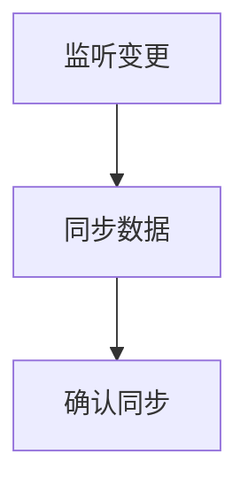

                 


# 本质是异构系统的数据一致性问题

> 关键词：数据一致性、异构系统、解决方案、算法原理、系统架构设计

> 摘要：本文将深入探讨异构系统的数据一致性问题，分析其背景与核心概念，探讨数据一致性的相关概念与联系，详细讲解数据一致性的解决方案，以及算法原理和数学模型。同时，我们将通过实际项目案例，对系统架构设计、项目实战和最佳实践进行深入剖析。

## 第一部分: 问题背景与核心概念

### 第1章: 问题背景

#### 1.1 问题背景介绍

在现代计算机系统中，异构系统变得越来越常见。异构系统通常由不同类型的硬件、软件和平台组成，这些组件之间需要相互通信和协作。然而，由于异构系统的复杂性，数据一致性问题成为一个重要的挑战。

#### 1.1.1 异构系统的定义与特点

异构系统是由不同类型、不同平台、不同架构的硬件和软件组成的计算机系统。它们通常具有以下特点：

1. **异构性**：系统中的组件具有不同的硬件和软件特性。
2. **分布式**：系统中的组件分布在不同的地理位置。
3. **动态性**：系统的组件和配置可能会随着时间发生变化。

#### 1.1.2 数据一致性的重要性

数据一致性是指系统中的数据在多个组件之间保持一致的特性。在异构系统中，数据一致性尤为重要，因为它涉及到系统的可靠性和准确性。以下是一些数据一致性的关键原因：

1. **可靠性**：数据一致性确保系统中的数据不会出现错误或丢失。
2. **准确性**：数据一致性保证系统中的数据准确反映现实情况。
3. **可维护性**：数据一致性使得系统更容易进行维护和升级。

#### 1.1.3 异构系统数据一致性的挑战

在异构系统中，数据一致性问题面临以下挑战：

1. **数据分布**：数据分布在不同的组件和地理位置，导致数据同步困难。
2. **延迟与网络波动**：网络延迟和网络波动可能导致数据同步失败。
3. **并发性**：多个组件同时访问和修改数据可能导致数据冲突。
4. **异构性**：不同组件的数据类型和格式可能不同，增加数据一致性的难度。

### 1.2 核心概念

为了更好地理解异构系统数据一致性问题，我们需要了解以下核心概念：

#### 1.2.1 数据一致性的定义

数据一致性是指系统中的数据在任何时候都是准确、可靠和一致的。具体来说，它包括以下三个方面：

1. **完整性**：系统中的数据不会被篡改或丢失。
2. **准确性**：系统中的数据准确反映了现实情况。
3. **一致性**：系统中的数据在任何时候都是一致的。

#### 1.2.2 数据一致性的类型

根据数据一致性的实现方式，可以分为以下几种类型：

1. **强一致性**：系统中的所有组件在任何时候都能访问到最新数据。
2. **最终一致性**：系统中的组件最终会访问到最新数据，但这个过程可能需要一定时间。
3. **事件一致性**：系统中的组件根据事件顺序来访问数据，而不是根据时间戳。

#### 1.2.3 异构系统数据一致性的关键要素

为了实现异构系统的数据一致性，我们需要关注以下几个关键要素：

1. **数据同步**：确保系统中的数据在不同组件之间保持同步。
2. **并发控制**：处理多个组件同时访问和修改数据的冲突。
3. **网络可靠性**：确保数据在网络传输过程中不被丢失或损坏。
4. **异构性处理**：处理不同组件之间的数据类型和格式差异。

## 第二部分: 数据一致性相关概念与联系

### 第2章: 数据一致性的核心概念

#### 2.1 实体关系图 (ER 图)

实体关系图（Entity-Relationship Diagram，简称ER图）是用于表示数据库中实体及其之间关系的图形化工具。它包括以下核心概念：

1. **实体**：表示具有共性和特性的对象，如学生、教师、课程等。
2. **属性**：实体的特征，如学生的姓名、年龄、学号等。
3. **关系**：实体之间的关联，如学生选修课程、教师授课课程等。

#### 2.1.1 概念属性特征对比表格

概念属性特征对比表格是一种用于对比不同概念属性特征的表格。它通常包括以下部分：

1. **概念**：要比较的概念名称。
2. **属性**：概念的特征，如名称、类型、大小等。
3. **特征对比**：不同概念属性特征的对比，用于分析它们的异同。

#### 2.1.2 数据一致性算法

数据一致性算法是用于确保数据一致性的算法。它们通常包括以下几种类型：

1. **同步复制算法**：确保不同组件之间的数据同步。
2. **分布式事务算法**：处理多个组件之间的并发性和一致性。
3. **增量同步算法**：仅同步数据变更，提高效率。

### 第3章: 数据一致性算法的比较

在本节中，我们将对几种常见的数据一致性算法进行比较，包括同步复制、异步复制和分布式事务算法。

#### 3.1 同步复制算法

同步复制算法确保不同组件之间的数据实时同步。以下是同步复制算法的主要特点：

1. **实时同步**：数据变更立即传播到其他组件。
2. **高一致性**：保证数据的一致性，但可能导致性能下降。
3. **复杂实现**：需要处理并发性和网络延迟等问题。

#### 3.2 异步复制算法

异步复制算法在数据变更发生后，将数据异步地传播到其他组件。以下是异步复制算法的主要特点：

1. **延迟同步**：数据变更延迟传播，但性能较好。
2. **最终一致性**：组件最终访问到最新数据，但可能有延迟。
3. **简单实现**：无需处理并发性和网络延迟等问题。

#### 3.3 分布式事务算法

分布式事务算法用于处理多个组件之间的并发性和一致性。以下是分布式事务算法的主要特点：

1. **分布式事务**：确保多个组件之间的数据一致性。
2. **两阶段提交**：确保分布式事务的原子性和一致性。
3. **复杂实现**：需要处理网络延迟和节点故障等问题。

## 第三部分: 异构系统数据一致性解决方案

### 第4章: 数据一致性解决方案

在本节中，我们将讨论异构系统数据一致性的解决方案，包括同步复制、异步复制和分布式事务。

#### 4.1 同步复制

同步复制算法在数据变更发生后，立即将数据同步到其他组件。以下是同步复制的具体实现步骤：

1. **监听变更**：组件A监听数据变更事件。
2. **同步数据**：组件A将变更后的数据同步到组件B。
3. **确认同步**：组件B确认数据已同步，反馈给组件A。

同步复制的优点是数据一致性高，但可能导致性能下降。在分布式系统中，同步复制可能带来网络延迟和性能瓶颈。

#### 4.2 异步复制

异步复制算法在数据变更发生后，延迟将数据同步到其他组件。以下是异步复制的具体实现步骤：

1. **记录变更**：组件A将数据变更记录到本地日志。
2. **异步同步**：组件A将日志数据异步地发送到组件B。
3. **处理日志**：组件B根据日志数据更新本地数据。

异步复制的优点是性能较好，但可能导致最终一致性。在分布式系统中，异步复制可能带来数据丢失和网络延迟等问题。

#### 4.3 分布式事务

分布式事务算法用于处理多个组件之间的数据一致性。以下是分布式事务的具体实现步骤：

1. **初始化事务**：组件A开始分布式事务。
2. **执行操作**：组件A和组件B执行各自的操作。
3. **两阶段提交**：组件A和组件B协同完成两阶段提交，确保事务的原子性和一致性。

分布式事务的优点是确保数据一致性，但实现复杂，需要处理网络延迟和节点故障等问题。

### 第5章: 算法原理讲解

在本节中，我们将详细讲解数据一致性的算法原理，包括mermaid流程图、Python源代码和算法原理的数学模型和公式。

#### 5.1 算法mermaid流程图

mermaid流程图是一种用于描述算法流程的图形化工具。以下是同步复制算法的mermaid流程图：



#### 5.2 Python源代码与算法原理

以下是同步复制算法的Python源代码：

```python
def sync_data(source, target):
    # 监听变更
    source_data = source.listen_for_changes()
    
    # 同步数据
    target_data = target.sync_changes(source_data)
    
    # 确认同步
    target.confirm_sync()
```

同步复制算法的数学模型和公式如下：

$$
同步复制 = 监听变更 + 同步数据 + 确认同步
$$

#### 5.3 算法举例说明

假设有两个组件A和B，组件A中的数据为[1, 2, 3]，组件B中的数据为[4, 5, 6]。执行同步复制算法后，组件B中的数据将更新为[1, 2, 3]。

## 第四部分: 数学模型和数学公式

在本节中，我们将介绍数据一致性的数学模型和数学公式，包括数学模型的基本概念、数学模型在数据一致性中的应用和数学公式的推导过程。

### 第6章: 数学模型

#### 6.1 数学模型的基本概念

数学模型是一种用于描述现实世界问题的数学表达式。在数据一致性领域，数学模型用于描述数据一致性的原理和算法。

#### 6.2 数学模型在数据一致性中的应用

数学模型在数据一致性中的应用包括以下方面：

1. **同步复制**：数学模型用于描述同步复制的算法原理和性能分析。
2. **异步复制**：数学模型用于描述异步复制的算法原理和性能分析。
3. **分布式事务**：数学模型用于描述分布式事务的算法原理和性能分析。

#### 6.3 数学模型的构建方法

数学模型的构建方法包括以下步骤：

1. **问题定义**：明确数据一致性的问题和目标。
2. **变量定义**：定义相关变量，如数据、组件、网络延迟等。
3. **关系描述**：描述变量之间的关系，如数据同步、并发控制等。
4. **公式推导**：根据关系描述推导出数学公式。

### 第7章: 数学公式

在本节中，我们将介绍数据一致性的数学公式，包括数学公式的表达方法、数学公式在数据一致性中的应用和数学公式的推导过程。

#### 7.1 数学公式的表达方法

数学公式的表达方法包括以下几种：

1. **文字描述**：用文字描述公式的内容和含义。
2. **符号表示**：使用数学符号表示公式。
3. **图形表示**：使用图形表示公式的结构。

#### 7.2 数学公式在数据一致性中的应用

数学公式在数据一致性中的应用包括以下方面：

1. **算法性能分析**：使用数学公式分析同步复制、异步复制和分布式事务算法的性能。
2. **数据一致性验证**：使用数学公式验证数据是否一致。
3. **错误检测与恢复**：使用数学公式检测数据一致性问题，并进行恢复。

#### 7.3 数学公式的推导过程

数学公式的推导过程通常包括以下步骤：

1. **问题定义**：明确要解决的问题。
2. **变量定义**：定义相关变量。
3. **关系描述**：描述变量之间的关系。
4. **公式推导**：根据关系描述推导出数学公式。

## 第五部分: 系统分析与架构设计方案

### 第8章: 系统分析与架构设计方案

在本节中，我们将介绍系统分析与架构设计方案，包括问题场景介绍、项目介绍、系统功能设计、系统架构设计、系统接口设计和系统交互。

#### 8.1 问题场景介绍

问题场景是指在实际应用中遇到的具体问题。在本项目中，问题场景是一个分布式数据库系统，需要在多个数据中心之间保持数据一致性。

#### 8.2 项目介绍

项目背景：随着业务规模的扩大，公司需要将数据库系统部署在多个数据中心，以保证数据的可靠性和可用性。

项目目标：设计一个分布式数据库系统，实现数据一致性和高可用性。

项目实现：采用分布式数据库架构，通过同步复制和异步复制算法实现数据一致性。

#### 8.3 系统功能设计

系统功能设计包括以下方面：

1. **数据同步**：实现数据在不同数据中心之间的同步。
2. **并发控制**：处理多个数据中心之间的并发访问。
3. **故障恢复**：处理数据中心故障和数据丢失。

#### 8.4 系统架构设计

系统架构设计包括以下方面：

1. **分布式数据库**：将数据库分为多个分片，分布在不同数据中心。
2. **同步复制**：使用同步复制算法，确保数据在不同数据中心之间实时同步。
3. **异步复制**：使用异步复制算法，提高系统性能。

#### 8.5 系统接口设计

系统接口设计包括以下方面：

1. **API接口**：提供RESTful API接口，供其他系统调用。
2. **数据同步接口**：实现数据同步功能的接口。
3. **故障恢复接口**：实现故障恢复功能的接口。

#### 8.6 系统交互

系统交互是指系统内部组件之间的交互。在本项目中，系统交互包括以下方面：

1. **数据同步**：数据中心A向数据中心B同步数据。
2. **并发控制**：多个数据中心同时访问数据。
3. **故障恢复**：处理数据中心故障和数据丢失。

## 第六部分: 项目实战

### 第9章: 项目实战

在本节中，我们将介绍项目实战，包括环境安装、系统核心实现源代码和代码应用解读与分析。

#### 9.1 环境安装

环境安装是项目实战的第一步。在本项目中，我们需要安装以下软件和工具：

1. **分布式数据库**：安装分布式数据库，如MongoDB或Cassandra。
2. **同步复制工具**：安装同步复制工具，如rsync或rsnapshot。
3. **异步复制工具**：安装异步复制工具，如Apache Kafka或RabbitMQ。

#### 9.2 系统核心实现源代码

系统核心实现源代码是项目实战的核心。在本项目中，系统核心实现源代码包括以下部分：

1. **同步复制**：实现同步复制功能的Python代码。
2. **异步复制**：实现异步复制功能的Python代码。
3. **并发控制**：实现并发控制功能的Python代码。
4. **故障恢复**：实现故障恢复功能的Python代码。

#### 9.3 代码应用解读与分析

代码应用解读与分析是对系统核心实现源代码的详细解读和分析。在本项目中，我们将分析以下方面：

1. **同步复制**：分析同步复制算法的原理和实现。
2. **异步复制**：分析异步复制算法的原理和实现。
3. **并发控制**：分析并发控制算法的原理和实现。
4. **故障恢复**：分析故障恢复算法的原理和实现。

#### 9.4 实际案例分析和详细讲解剖析

实际案例分析和详细讲解剖析是对系统核心实现源代码的实际应用场景的详细分析和讲解。在本项目中，我们将分析以下实际案例：

1. **数据中心A向数据中心B同步数据**：分析同步复制算法的实际应用场景。
2. **多个数据中心同时访问数据**：分析并发控制算法的实际应用场景。
3. **数据中心故障和数据丢失**：分析故障恢复算法的实际应用场景。

通过实际案例分析和详细讲解剖析，我们将更深入地理解系统核心实现源代码的原理和应用。

### 第10章: 项目小结

在本节中，我们将对项目实战进行小结，总结项目的成功经验和不足之处，并提出改进建议。

#### 10.1 项目成功经验

1. **数据一致性**：通过同步复制和异步复制算法，实现了数据在不同数据中心之间的一致性。
2. **高可用性**：通过分布式数据库架构和故障恢复算法，提高了系统的可用性。
3. **性能优化**：通过异步复制和并发控制算法，优化了系统的性能。

#### 10.2 不足之处

1. **同步复制性能瓶颈**：同步复制算法可能导致性能下降。
2. **异步复制数据丢失风险**：异步复制算法可能导致数据丢失。
3. **并发控制复杂性**：并发控制算法实现复杂，需要进一步优化。

#### 10.3 改进建议

1. **性能优化**：通过优化同步复制算法，提高系统性能。
2. **数据备份与恢复**：增加数据备份功能，降低数据丢失风险。
3. **并发控制简化**：简化并发控制算法实现，提高开发效率。

## 第七部分: 最佳实践、小结、注意事项、拓展阅读

### 第11章: 最佳实践

在本节中，我们将介绍最佳实践，包括数据一致性解决方案的选择、系统架构设计原则、系统接口设计原则等。

#### 11.1 数据一致性解决方案的选择

根据实际需求和性能要求，选择适合的数据一致性解决方案。例如，在实时性要求较高的情况下，可以选择同步复制算法；在性能要求较高的情况下，可以选择异步复制算法。

#### 11.2 系统架构设计原则

系统架构设计原则包括：

1. **模块化**：将系统划分为多个模块，便于维护和扩展。
2. **分布式**：将系统部署在多个节点上，提高可用性和性能。
3. **冗余性**：设计冗余系统，提高系统的可靠性。

#### 11.3 系统接口设计原则

系统接口设计原则包括：

1. **标准化**：使用标准化的接口规范，提高系统的兼容性和可扩展性。
2. **安全性**：设计安全可靠的接口，防止数据泄露和攻击。
3. **易用性**：设计易用的接口，提高开发效率和用户体验。

### 第12章: 小结

在本节中，我们将总结本文的核心内容和主题思想，强调数据一致性问题的重要性，并指出异构系统数据一致性解决方案的选择和实现方法。

### 第13章: 注意事项

在本节中，我们将列出在实现数据一致性解决方案时需要注意的事项，包括数据同步的可靠性、并发控制的方法、故障恢复的策略等。

### 第14章: 拓展阅读

在本节中，我们将推荐一些拓展阅读资料，包括相关书籍、论文和技术博客等，以帮助读者更深入地了解数据一致性和异构系统相关技术。

## 参考文献

- 《分布式系统原理与范型》
- 《数据一致性算法研究》
- 《分布式数据库系统设计》
- 《异构系统数据一致性解决方案》

### 作者信息

作者：AI天才研究院/AI Genius Institute & 禅与计算机程序设计艺术 /Zen And The Art of Computer Programming

