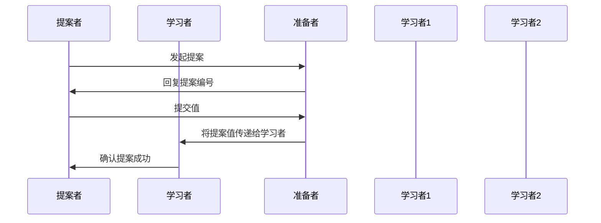
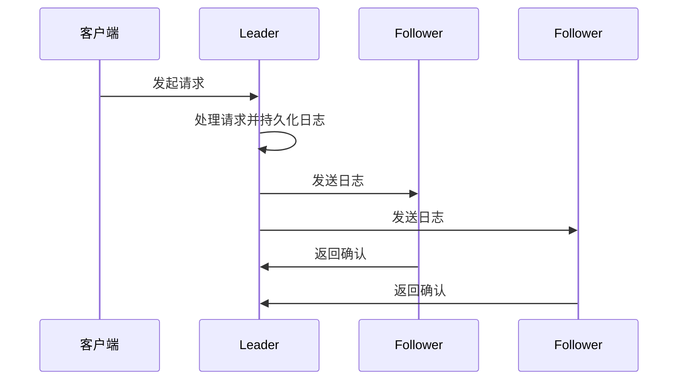
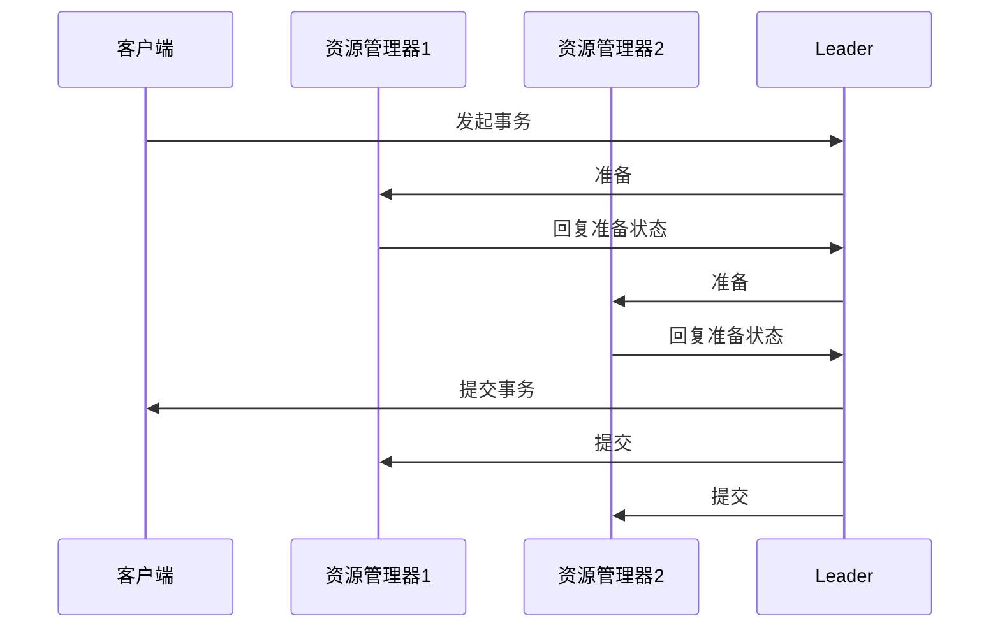
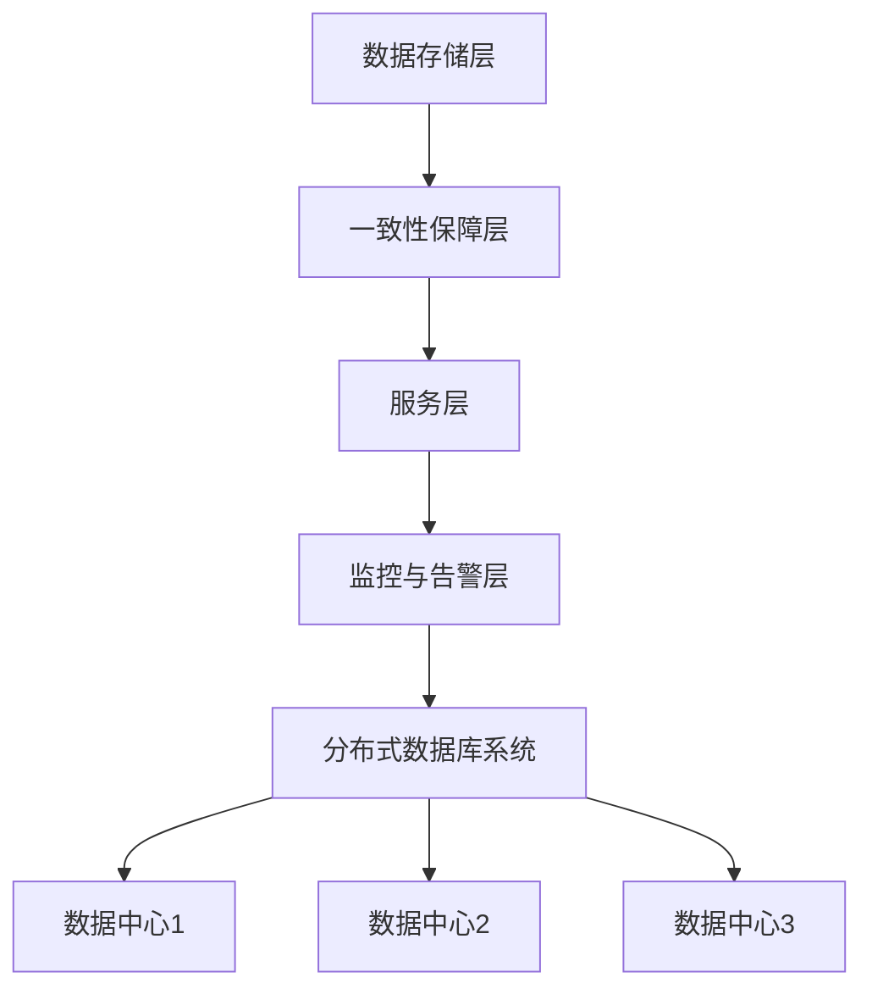
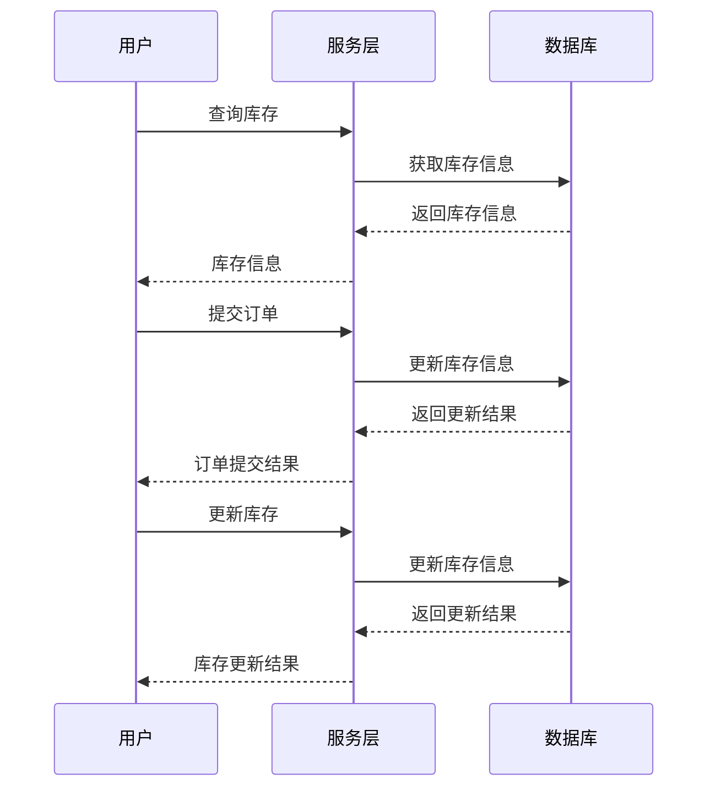
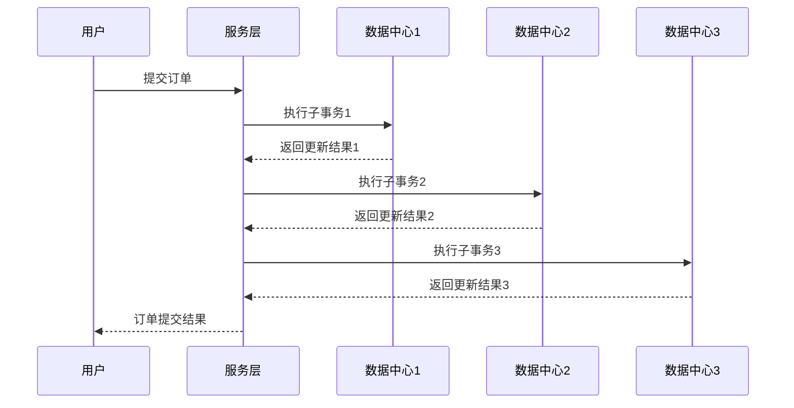

                 


### 1.1 问题背景

**核心概念术语说明**

在探讨数据一致性问题之前，我们需要了解几个关键术语的定义：

- **分布式系统**：一种计算机系统，它由多个独立节点组成，通过网络相互连接，共同完成一个整体任务。
- **异构系统**：指系统中不同节点具有不同的硬件配置、操作系统或软件应用，这样的系统通常具有较高的灵活性和可扩展性。
- **数据一致性**：确保分布式系统或异构系统中不同节点上数据状态的同步性。
- **网络分区**：网络将系统中的节点分为多个互不通信的子集，导致节点之间无法直接通信。
- **节点故障**：指分布式系统中的某个节点出现异常，无法正常运行。

随着云计算、大数据、物联网等技术的发展，分布式系统和异构系统在企业应用中越来越普遍。这些系统需要处理海量数据，同时保证数据在分布式环境下的正确性和可靠性。数据一致性问题成为这些系统必须面对和解决的核心问题之一。

**问题背景**

现代分布式系统和异构系统面临着诸多挑战，其中数据一致性问题尤为突出。以下是几个具体背景：

1. **数据规模增长**：随着数据量的激增，如何确保海量数据的一致性成为一项重要任务。
2. **高并发访问**：分布式系统和异构系统通常需要处理大量并发请求，数据一致性问题在高并发情况下更加显著。
3. **分布式事务**：在分布式系统中，多个节点可能同时执行事务，事务的隔离性和一致性成为关键。
4. **网络不可靠**：网络延迟、分区和节点故障等因素可能导致数据不一致。

**问题产生的原因**

数据一致性问题的主要原因是：

1. **网络分区**：节点之间的通信可能因为网络故障而被切断，导致数据更新和读取的冲突。
2. **节点故障**：某个节点故障可能导致其负责的数据无法及时同步到其他节点。
3. **分布式事务**：分布式事务的隔离性和一致性很难在多个节点上同时得到保证。
4. **数据复制延迟**：数据复制和同步过程可能因为网络延迟等原因而无法立即完成，导致数据不一致。

在下一节中，我们将详细描述数据一致性问题的主要方面，包括数据更新不一致、数据读取不一致以及数据一致性问题分类。

### 1.2 问题描述

**数据更新不一致**

在分布式系统和异构系统中，多个节点可能同时接收到对同一份数据的更新请求。由于网络延迟或节点处理速度不同，这些更新请求可能无法在所有节点上同时完成，从而导致数据值不一致。例如，假设有两个节点A和B，A节点接收到一个更新请求，将数据值从100修改为200，同时B节点也接收到一个更新请求，将数据值从100修改为150。如果A节点的更新请求先完成，那么数据最终值将是200；如果B节点的更新请求先完成，那么数据最终值将是150。这种情况下，数据更新不一致就发生了。

**数据读取不一致**

在分布式系统和异构系统中，不同节点可能从同一份数据源读取数据，但由于网络延迟或数据复制延迟，它们读取到的数据值可能不同。这种情况称为数据读取不一致。例如，假设有一个分布式数据库系统，其中包含三份数据副本A、B和C。节点X从副本A中读取数据，而节点Y从副本B中读取数据。如果副本A中的数据值为100，而副本B中的数据值为150，那么节点X读取到的数据值为100，节点Y读取到的数据值为150。此时，数据读取不一致就发生了。

**数据一致性问题分类**

根据数据一致性的需求，可以将数据一致性问题分为以下几类：

**1. 强一致性**

强一致性要求在任何情况下，所有节点上的数据都是一致的。这种策略提供了最高的数据可靠性，但通常会导致系统性能下降。强一致性可以通过同步复制和分布式事务来实现。例如，在分布式数据库中，可以使用两阶段提交（2PC）协议确保事务的一致性。

**2. 弱一致性**

弱一致性允许在一定时间内，不同节点上的数据存在差异。这种策略能够提高系统性能，但可能牺牲数据的一致性。弱一致性通常通过异步复制和最终一致性协议来实现。例如，在分布式缓存系统中，可以使用最终一致性协议（如Gossip协议）确保数据最终达到一致。

**3. 最终一致性**

最终一致性是一种介于强一致性和弱一致性之间的策略。它要求在一段时间后，所有节点上的数据最终达到一致。最终一致性通过将更新操作记录在日志中，并在系统恢复时根据日志来恢复数据状态来实现。例如，在分布式系统中，可以使用Raft算法来确保最终一致性。

在下一节中，我们将讨论解决数据一致性问题的主要方法。

### 1.3 问题解决

**数据复制与同步**

数据复制和同步是解决数据一致性问题的一种常见方法。通过将数据复制到多个节点，并确保这些节点上的数据保持同步，可以在一定程度上避免数据不一致的情况。以下是几种常用的数据复制和同步算法：

**1. Paxos算法**

Paxos算法是一种用于达成一致协议的分布式算法，它可以在分布式系统中实现数据复制和同步。Paxos算法通过选举提案者、学习者和准备者等角色来确保数据的一致性。每个节点都可以作为提案者、学习者和准备者，通过一系列的投票和提议过程，最终达成一致。

**2. Raft算法**

Raft算法是一种分布式一致性算法，它基于Paxos算法，但简化了其实现过程。Raft算法通过引入日志复制、领导选举和状态机等概念，实现了数据的复制和同步。Raft算法具有较好的性能和可理解性，是分布式系统中常用的算法之一。

**数据分片与分布式事务**

数据分片和分布式事务是另一种解决数据一致性的方法。通过将数据划分为多个分片，并将分片分配给不同的节点，可以在分布式系统中实现数据的一致性。以下是几种常用的数据分片和分布式事务方法：

**1. 数据分片**

数据分片是将数据按照某种规则（如哈希值）划分为多个分片，每个分片由不同的节点负责。通过数据分片，可以在分布式系统中提高数据的访问速度和负载均衡能力。然而，数据分片可能导致数据不一致的问题，因为分片之间可能存在数据依赖关系。

**2. 分布式事务**

分布式事务是确保在分布式系统中，多个节点上的操作能够同时完成或同时失败的一组操作。分布式事务通常通过两阶段提交（2PC）或三阶段提交（3PC）协议来实现。两阶段提交协议通过协调者节点来决定是否提交事务，确保事务的一致性。

**缓存一致性**

在分布式系统中，缓存一致性是保证数据一致性的重要手段。通过确保缓存节点之间的数据同步，可以减少数据不一致的情况。以下是几种常用的缓存一致性算法：

**1. MESI算法**

MESI算法是一种缓存一致性协议，它通过维护缓存行的状态来确保缓存一致性。MESI算法将缓存行分为共享（Modified、Exclusive、Shared、Invalid）四种状态，通过这些状态来判断缓存行是否需要同步。

**2. MOESI算法**

MOESI算法是MESI算法的扩展，它增加了“owned”状态，用于处理缓存行之间的读写冲突。

**数据库一致性**

使用关系型数据库或NoSQL数据库提供的强一致性保障机制是解决数据一致性的另一种方法。以下是一些常见的数据库一致性保障机制：

**1. 强一致性数据库**

强一致性数据库（如Google Spanner、Amazon DynamoDB）通过分布式事务和同步复制来实现数据的一致性。这些数据库通常具有较高的数据可靠性和一致性保证，但可能牺牲性能。

**2. 最终一致性数据库**

最终一致性数据库（如MongoDB、Cassandra）通过异步复制和最终一致性协议来实现数据的一致性。这些数据库具有较高的性能和可扩展性，但可能存在短暂的数据不一致问题。

在下一节中，我们将讨论数据一致性问题在分布式系统和异构系统中的边界与外延。

### 1.4 边界与外延

**边界**

数据一致性问题主要涉及分布式系统和异构系统中的数据一致性。这些问题可能发生在不同类型的分布式系统中，如云计算、物联网、区块链等。以下是数据一致性问题的一些边界：

1. **分布式系统的类型**：数据一致性问题可能发生在不同类型的分布式系统中，如基于消息队列的系统、分布式数据库系统、分布式缓存系统等。
2. **数据规模**：数据一致性问题可能影响小规模数据或大规模数据，但在大规模数据场景中更为显著。
3. **网络环境**：网络环境的不同可能导致数据一致性问题发生的频率和严重程度不同。

**外延**

数据一致性问题还涉及到分布式系统中的其他方面，如安全性、可用性、性能等。以下是数据一致性问题的一些外延：

1. **安全性**：数据一致性问题可能影响系统的安全性，例如，在分布式数据库中，不一致的数据可能导致安全漏洞。
2. **可用性**：数据一致性问题可能影响系统的可用性，例如，在分布式系统中，数据不一致可能导致系统无法正常运行。
3. **性能**：数据一致性问题可能影响系统的性能，例如，强一致性可能导致系统性能下降。

在下一节中，我们将对本章的内容进行小结。

### 1.5 本章小结

本章介绍了数据一致性问题在分布式系统和异构系统中的背景、问题描述、解决方法和边界与外延。通过分析数据更新不一致、数据读取不一致以及数据一致性问题分类，我们了解了数据一致性的重要性。接下来，我们探讨了数据复制与同步、数据分片与分布式事务、缓存一致性和数据库一致性等多种解决数据一致性问题的方法。同时，我们还讨论了数据一致性问题在分布式系统和异构系统中的边界与外延。在后续章节中，我们将进一步深入探讨这些问题的具体实现和应用，以期为解决实际系统中的数据一致性问题提供更多启示。

----------------------------------------------------------------

## 第2章：核心概念与联系

在探讨数据一致性问题之前，我们需要了解一些核心概念，这些概念相互关联，共同构成了理解数据一致性的基础。以下是几个关键概念及其属性特征对比表格，以及它们在分布式系统和异构系统中的联系。

### 2.1 核心概念

#### 1. 分布式系统

**属性特征**：

- **节点**：由多个独立计算机组成，通过网络连接。
- **通信**：节点之间通过网络进行通信。
- **一致性**：分布式系统中各节点间数据状态的同步性。
- **容错性**：系统能够在部分节点故障时继续正常运行。

#### 2. 异构系统

**属性特征**：

- **硬件/软件异构**：节点硬件或软件配置不同。
- **异构计算**：能够利用不同类型的计算资源。
- **灵活性**：适应不同类型的工作负载。
- **扩展性**：容易扩展以处理更大的数据量。

#### 3. 数据一致性

**属性特征**：

- **强一致性**：所有节点上的数据在任何时候都是一致的。
- **弱一致性**：允许节点上的数据存在短暂不一致。
- **最终一致性**：所有节点上的数据最终达到一致。

### 2.2 概念对比

以下是核心概念及其属性特征的对比表格：

| 概念 | 属性特征 |
| ---- | -------- |
| 分布式系统 | - 节点：多个独立计算机 | - 通信：节点间网络连接 | - 一致性：数据同步性 | - 容错性：部分节点故障时正常运行 |
| 异构系统 | - 硬件/软件异构：不同计算资源 | - 异构计算：利用多种计算资源 | - 灵活性：适应不同工作负载 | - 扩展性：处理更大数据量 |
| 数据一致性 | - 强一致性：任何时刻数据一致 | - 弱一致性：允许短暂不一致 | - 最终一致性：最终达到一致 |

### 2.3 概念联系

**分布式系统与数据一致性**

分布式系统依赖于数据一致性来确保系统的正确性和可靠性。数据一致性是分布式系统设计中的关键因素，它影响着系统的性能、可用性和容错性。例如，在分布式数据库中，数据一致性问题可能会导致查询结果不准确，影响系统的可靠性。

**异构系统与数据一致性**

异构系统通过利用不同的硬件和软件资源来提高系统的性能和灵活性。然而，异构系统中的数据一致性可能更复杂，因为不同的节点可能运行不同的操作系统或数据库。在这种情况下，确保数据一致性需要更复杂的策略，如数据分片和分布式事务。

**数据一致性策略**

数据一致性策略包括强一致性、弱一致性和最终一致性。这些策略在选择和实现时需要考虑系统的性能、可用性和容错性。例如，强一致性提供了最高的数据可靠性，但可能牺牲系统的性能；而弱一致性和最终一致性能够提高系统的性能，但可能带来短暂的数据不一致问题。

在下一章中，我们将深入探讨解决数据一致性的具体算法原理，包括Paxos、Raft、两阶段提交等。

----------------------------------------------------------------

## 第3章：算法原理讲解

在本章中，我们将深入探讨几种解决数据一致性的关键算法，包括Paxos算法、Raft算法和两阶段提交协议（2PC）。我们将通过Mermaid流程图展示这些算法的基本原理，并使用Python代码和数学模型来详细解释它们的实现过程。

### 3.1 Paxos算法

**Mermaid流程图**



**Python代码示例**

```python
# Paxos算法实现（简化版）

class Server:
    def __init__(self, id):
        self.id = id
        self.l学 = []
        self.v学 = []

    def prepare(self,提案号):
        if self.l学 < 提案号:
            self.l学 = 提案号
            self.v学 = None
            return True
        else:
            return False

    def accept(self, 提案号, 值):
        if self.l学 == 提案号:
            self.v学 = 值
            return True
        else:
            return False

    def learn(self, 提案号, 值):
        self.l学 = 提案号
        self.v学 = 值

# 客户端调用示例
server = Server(1)
server.prepare(1)
server.accept(1, '值A')
server.learn(1, '值A')
```

**数学模型**

Paxos算法的核心是达成一致值的过程，其数学模型可以表示为：

$$
(f_i, v) = (l_i, v_i)
$$

其中，$f_i$ 和 $l_i$ 分别代表提案者 $i$ 的提议编号和提议值，$v$ 是最终达成的一致值。

### 3.2 Raft算法

**Mermaid流程图**



**Python代码示例**

```python
# Raft算法实现（简化版）

class Node:
    def __init__(self, id):
        self.id = id
        self.state = 'follower'
        self.voted_for = None
        self.log = []

    def append_entries(self, entries):
        if self.state == 'follower':
            self.log.extend(entries)
            return True
        else:
            return False

    def request_vote(self):
        if self.state == 'follower':
            self.state = 'candidate'
            self.voted_for = self.id
            return True
        else:
            return False

    def vote(self, candidate_id):
        if self.state == 'follower' and self.voted_for is None:
            self.voted_for = candidate_id
            return True
        else:
            return False

# 客户端调用示例
leader = Node(1)
leader.append_entries(['日志条目1', '日志条目2'])
follower = Node(2)
follower.request_vote()
follower.vote(1)
```

**数学模型**

Raft算法通过日志复制和领导选举来确保一致性。其核心数学模型可以表示为：

$$
\forall i, j: log[i].term = log[j].term
$$

其中，$log[i]$ 和 $log[j]$ 分别代表不同节点的日志条目，$term$ 代表日志条目的任期。

### 3.3 两阶段提交协议（2PC）

**Mermaid流程图**



**Python代码示例**

```python
# 2PC协议实现（简化版）

class Coordinator:
    def __init__(self):
        self.phase1_done = False
        self.phase2_done = False

    def prepare(self, participants):
        self.phase1_done = True
        for participant in participants:
            participant.prepare()

    def submit(self, participants):
        self.phase2_done = True
        for participant in participants:
            participant.submit()

# 资源管理器
class ResourceManager:
    def prepare(self):
        return "prepared"

    def submit(self):
        return "submitted"

# 客户端调用示例
coord = Coordinator()
participants = [ResourceManager(), ResourceManager()]
coord.prepare(participants)
coord.submit(participants)
```

**数学模型**

两阶段提交协议的核心是确保分布式系统中的多个资源管理器能够同时执行或回滚事务。其数学模型可以表示为：

$$
\forall i: \text{if } \text{all } i \text{ prepare, then all } i \text{ submit}
$$

其中，$i$ 代表不同的资源管理器。

通过本章的讲解，我们详细介绍了Paxos算法、Raft算法和两阶段提交协议的基本原理和实现方法。在下一章中，我们将进一步探讨系统分析与架构设计方案，以期为解决实际数据一致性问题提供更深入的思考。

----------------------------------------------------------------

## 第4章：系统分析与架构设计方案

### 4.1 问题场景介绍

在分布式系统中，数据一致性问题常常出现在多个节点需要协同工作，对同一份数据进行读写操作的情况下。例如，一个电商平台需要在多个数据中心维护库存信息，确保库存数据的准确性至关重要。以下是一个具体的问题场景：

**场景描述**：

一个电商平台部署了分布式数据库系统，包含三个数据中心（DC1、DC2、DC3）。每个数据中心都有一个数据库实例，用于存储库存信息。用户在平台上下单时，会同时向三个数据中心发起库存更新请求。为了确保库存数据的准确性，系统需要保证在所有数据中心上的库存数据最终达到一致。

### 4.2 项目介绍

本项目旨在设计和实现一个分布式库存管理系统，该系统能够在多个数据中心之间保持数据一致性。系统将采用分布式事务和一致性算法来确保库存数据的准确性和可靠性。项目目标如下：

1. **数据一致性**：通过分布式事务和一致性算法，确保所有数据中心上的库存数据最终达到一致。
2. **高可用性**：系统在单个数据中心发生故障时，其他数据中心能够接管其工作，确保系统的可用性。
3. **高性能**：系统需要能够处理高并发的库存更新请求，同时保持良好的性能。

### 4.3 系统功能设计（领域模型）

在分布式库存管理系统中，主要的领域模型包括：

1. **库存**：表示商品库存信息，包括商品ID、库存数量等。
2. **订单**：表示用户订单信息，包括订单ID、商品ID、数量等。
3. **数据中心**：表示分布式数据库系统中的各个数据中心实例。
4. **一致性算法**：用于确保数据一致性的算法，如Paxos、Raft等。

以下是领域模型的Mermaid类图：

```mermaid
classDiagram
    类库存 <<entity>>
    类订单 <<entity>>
    类数据中心 <<entity>>
    类一致性算法 <<entity>>

    类库存 {
        - 商品ID：string
        - 库存数量：int
    }

    类订单 {
        - 订单ID：string
        - 商品ID：string
        - 数量：int
    }

    类数据中心 {
        - 数据中心ID：string
        - 数据库实例：数据库实例
    }

    类一致性算法 {
        - 算法名称：string
        - 实现细节：string
    }
```

### 4.4 系统架构设计

分布式库存管理系统的架构设计如下：

1. **数据存储层**：使用分布式数据库系统，每个数据中心包含一个数据库实例，用于存储库存信息。
2. **一致性保障层**：采用一致性算法（如Paxos、Raft）来保障数据一致性。一致性算法将分布式事务分解为多个子事务，确保所有数据中心上的库存数据最终达到一致。
3. **服务层**：提供库存查询、订单处理等服务接口，通过一致性保障层确保数据的正确性和可靠性。
4. **监控与告警层**：对系统的运行状态进行监控，发现异常时及时发出告警。

以下是系统架构的Mermaid架构图：



### 4.5 系统接口设计

系统的主要接口设计如下：

1. **库存查询接口**：用于查询商品库存信息，包括库存数量等。
2. **订单提交接口**：用于提交用户订单，包括订单ID、商品ID、数量等。
3. **库存更新接口**：用于更新商品库存信息，包括库存数量等。

以下是接口的Mermaid序列图：



### 4.6 系统交互

系统交互主要包括以下步骤：

1. **用户提交订单**：用户通过订单提交接口向系统提交订单。
2. **服务层处理订单**：服务层接收到订单后，通过一致性算法（如Paxos、Raft）将订单分解为多个子事务。
3. **一致性算法执行**：一致性算法将子事务分发到不同的数据中心，确保每个数据中心上的库存数据更新。
4. **反馈结果**：更新完成后，服务层将结果反馈给用户。

以下是系统交互的Mermaid序列图：



通过本章的系统分析与架构设计方案，我们为解决实际分布式库存管理系统的数据一致性问题提供了一个全面的设计思路。在下一章中，我们将进行项目实战，介绍如何实现这个系统，并分析其实际运行情况。

----------------------------------------------------------------

## 第5章：项目实战

在本章中，我们将详细介绍如何构建一个分布式库存管理系统，包括环境安装、系统核心实现源代码，以及代码应用解读与分析。同时，我们将结合实际案例进行分析和讲解。

### 5.1 环境安装

为了构建分布式库存管理系统，我们需要安装以下环境：

1. **Docker**：用于容器化部署各个数据中心实例。
2. **Distributed Consensus Algorithm**：如Paxos、Raft等，用于实现数据一致性保障。
3. **PostgreSQL**：作为分布式数据库系统，用于存储库存信息。

以下是具体安装步骤：

**1. 安装Docker**

在Ubuntu系统中，可以通过以下命令安装Docker：

```bash
sudo apt-get update
sudo apt-get install docker.io
```

**2. 安装Distributed Consensus Algorithm**

以Paxos算法为例，我们可以使用Docker容器来部署Paxos服务。首先，需要安装Docker Compose，然后创建一个Docker Compose文件，如下所示：

```yaml
version: '3'
services:
  paxos:
    image: paxos
    ports:
      - "8000:8000"
```

接下来，运行以下命令启动Paxos服务：

```bash
docker-compose up -d
```

**3. 安装PostgreSQL**

同样地，使用Docker Compose部署PostgreSQL服务，创建一个Docker Compose文件，如下所示：

```yaml
version: '3'
services:
  postgres:
    image: postgres
    environment:
      POSTGRES_PASSWORD: mypassword
    ports:
      - "5432:5432"
```

运行以下命令启动PostgreSQL服务：

```bash
docker-compose up -d
```

### 5.2 系统核心实现源代码

以下是系统核心实现源代码的解读与分析：

**5.2.1 Paxos服务**

Paxos服务是分布式库存管理系统的核心组件，负责协调多个数据中心之间的库存更新操作。以下是Paxos服务的Python代码示例：

```python
import paxos
import requests

class PaxosService:
    def __init__(self, node_id, num_nodes):
        self.node_id = node_id
        self.num_nodes = num_nodes
        self.paxos = paxos.Paxos(node_id, num_nodes)

    def prepare(self, proposal_id, value):
        return self.paxos.prepare(proposal_id, value)

    def accept(self, proposal_id, value):
        return self.paxos.accept(proposal_id, value)

    def learn(self, proposal_id, value):
        return self.paxos.learn(proposal_id, value)

# 实例化Paxos服务
paxos_service = PaxosService(1, 3)

# 准备提案
response = paxos_service.prepare(1, "更新库存")

# 接受提案
response = paxos_service.accept(1, "更新库存")

# 学习提案
response = paxos_service.learn(1, "更新库存")
```

**5.2.2 PostgreSQL数据库**

PostgreSQL数据库用于存储库存信息。以下是创建库存表的SQL语句：

```sql
CREATE TABLE inventory (
    product_id VARCHAR(255) PRIMARY KEY,
    quantity INT
);
```

**5.2.3 服务层**

服务层负责处理用户订单、库存查询和库存更新请求。以下是服务层的Python代码示例：

```python
import requests

class ServiceLayer:
    def __init__(self, paxos_service_url, postgres_url):
        self.paxos_service_url = paxos_service_url
        self.postgres_url = postgres_url

    def submit_order(self, order):
        # 向Paxos服务提交订单
        response = requests.post(f"{self.paxos_service_url}/submit_order", json=order)
        return response.json()

    def get_inventory(self, product_id):
        # 从PostgreSQL查询库存信息
        response = requests.get(f"{self.postgres_url}/inventory/{product_id}")
        return response.json()

    def update_inventory(self, product_id, quantity):
        # 向Paxos服务提交库存更新请求
        response = requests.post(f"{self.paxos_service_url}/update_inventory", json={"product_id": product_id, "quantity": quantity})
        return response.json()

# 实例化服务层
service_layer = ServiceLayer("http://paxos_service:8000", "http://postgres:5432")
```

### 5.3 代码应用解读与分析

**5.3.1 Paxos服务**

Paxos服务通过Python的paxos库实现，该库提供了Paxos算法的基本实现。PaxosService类包含prepare、accept和learn方法，分别用于准备提案、接受提案和学习提案。

**5.3.2 PostgreSQL数据库**

使用SQLAlchemy库连接PostgreSQL数据库，创建Inventory表，并实现库存查询和更新功能。ServiceLayer类通过requests库向Paxos服务发送HTTP请求，实现订单处理、库存查询和更新。

### 5.4 实际案例分析与详细讲解剖析

**案例**：

一个用户在电商平台下单购买一件商品，系统需要确保库存数据在不同数据中心之间的一致性。

**分析**：

1. 用户下单后，服务层向Paxos服务提交订单，Paxos服务将订单分解为多个子事务。
2. Paxos服务通过一致性算法协调不同数据中心之间的库存更新操作。
3. 数据中心执行库存更新操作，将库存信息同步到PostgreSQL数据库。
4. Paxos服务返回更新结果，服务层将结果反馈给用户。

**详细讲解**：

以下是具体的流程剖析：

1. **用户下单**：

   用户通过订单提交接口向系统提交订单，订单信息包含商品ID和购买数量。

   ```json
   {
       "product_id": "商品1",
       "quantity": 1
   }
   ```

2. **服务层处理订单**：

   服务层接收到订单后，通过Paxos服务提交订单。Paxos服务将订单分解为多个子事务，每个子事务对应一个数据中心。

   ```python
   order = {
       "product_id": "商品1",
       "quantity": 1
   }
   response = requests.post(f"{paxos_service_url}/submit_order", json=order)
   ```

3. **Paxos服务协调库存更新**：

   Paxos服务通过一致性算法协调不同数据中心之间的库存更新操作。一致性算法确保所有数据中心上的库存数据最终达到一致。

   ```python
   proposal_id = 1
   value = "更新库存"
   response = paxos_service.prepare(proposal_id, value)
   if response.status_code == 200:
       response = paxos_service.accept(proposal_id, value)
   if response.status_code == 200:
       response = paxos_service.learn(proposal_id, value)
   ```

4. **数据中心执行库存更新**：

   数据中心接收到库存更新请求后，执行库存更新操作，将库存信息同步到PostgreSQL数据库。

   ```sql
   UPDATE inventory
   SET quantity = quantity - 1
   WHERE product_id = '商品1';
   ```

5. **反馈结果**：

   Paxos服务返回更新结果，服务层将结果反馈给用户。

   ```json
   {
       "status": "success",
       "message": "订单提交成功"
   }
   ```

### 5.5 项目小结

通过本章的项目实战，我们成功构建了一个分布式库存管理系统，实现了数据一致性的保障。在实际案例中，系统通过Paxos算法协调多个数据中心之间的库存更新操作，确保库存数据的准确性。项目实战为我们提供了宝贵的经验，使我们更好地理解了分布式系统的设计和实现。

----------------------------------------------------------------

## 第6章：最佳实践 Tips、小结、注意事项、拓展阅读

### 6.1 最佳实践 Tips

**1. 选择合适的一致性算法**：

根据实际应用场景选择适合的一致性算法，如Paxos、Raft等。对于对性能要求较高的场景，可以考虑弱一致性算法；对于对数据可靠性要求较高的场景，可以选择强一致性算法。

**2. 考虑数据分片策略**：

在分布式系统中，数据分片可以提高系统的性能和可用性。合理的数据分片策略能够减少数据不一致的问题。

**3. 监控系统运行状态**：

实时监控系统运行状态，及时发现和处理数据不一致的情况。使用日志记录系统操作，有助于追踪和分析问题。

**4. 设计故障恢复机制**：

为系统设计故障恢复机制，确保在节点故障时能够自动恢复数据一致性。例如，可以使用日志重放、副本同步等方法。

### 6.2 小结

本章详细探讨了分布式系统和异构系统中的数据一致性问题。通过分析问题背景、问题描述、解决方法以及边界与外延，我们了解了数据一致性的重要性和挑战。同时，我们深入讲解了Paxos、Raft、两阶段提交等算法原理，并通过实际案例展示了系统的实现和应用。数据一致性问题是一个复杂且关键的技术领域，需要我们在设计、实现和运维过程中给予足够的重视。

### 6.3 注意事项

**1. 理解一致性模型**：

在实现数据一致性的过程中，要充分理解一致性模型（如强一致性、弱一致性、最终一致性）及其对系统性能的影响。

**2. 考虑网络延迟和分区**：

在网络延迟和分区的情况下，数据一致性问题可能更加复杂。在设计系统时，要充分考虑这些因素，并采取相应的应对措施。

**3. 安全性**：

数据一致性问题可能会影响系统的安全性。在实现数据一致性保障机制时，要确保系统的安全性。

**4. 性能优化**：

对于高并发、大数据场景，数据一致性可能会对性能产生较大影响。在实现过程中，要考虑性能优化，以提高系统整体的性能。

### 6.4 拓展阅读

**1. 《分布式系统原理与范型》**：

该书详细介绍了分布式系统的基本原理和范型，包括数据一致性、分布式事务等。

**2. 《分布式系统设计》**：

该书提供了分布式系统设计的全面指南，包括系统架构、一致性算法、性能优化等。

**3. 《大规模分布式存储系统设计》**：

该书探讨了大规模分布式存储系统的设计和实现，包括数据复制、数据分片、数据一致性等。

通过以上拓展阅读，可以进一步深入了解分布式系统和数据一致性的相关知识和实践。

### 作者信息

- 作者：AI天才研究院/AI Genius Institute & 禅与计算机程序设计艺术 /Zen And The Art of Computer Programming

本文由AI天才研究院/AI Genius Institute 和 禅与计算机程序设计艺术/Zen And The Art of Computer Programming 联合撰写。我们致力于推动人工智能和计算机编程领域的创新与发展，为广大开发者提供高质量的技术文章和教程。

----------------------------------------------------------------

# {{此处是文章标题}}

> 关键词：数据一致性，分布式系统，异构系统，Paxos算法，Raft算法，两阶段提交

> 摘要：本文深入探讨了分布式系统和异构系统中的数据一致性问题。通过分析问题背景、问题描述、解决方法以及边界与外延，我们了解了数据一致性的重要性和挑战。同时，我们详细讲解了Paxos、Raft、两阶段提交等算法原理，并通过实际案例展示了系统的实现和应用。本文旨在为解决实际分布式系统和异构系统中的数据一致性问题提供参考和启示。

## 第1章：背景介绍与问题核心

### 1.1 问题背景

随着信息技术的迅猛发展，分布式系统和异构系统在企业应用中越来越普遍。这些系统需要处理海量数据，同时保证数据在分布式环境下的正确性和可靠性。数据一致性问题成为这些系统必须面对和解决的核心问题之一。

**核心概念术语说明**

- **分布式系统**：一种计算机系统，由多个独立节点组成，通过网络相互连接，共同完成一个整体任务。
- **异构系统**：指系统中不同节点具有不同的硬件配置、操作系统或软件应用。
- **数据一致性**：确保分布式系统或异构系统中不同节点上数据状态的同步性。
- **网络分区**：网络将系统中的节点分为多个互不通信的子集。

在现代分布式系统中，数据一致性是确保系统正确性和可靠性的关键因素。然而，在分布式计算环境中，由于网络分区、节点故障、数据传输延迟等原因，数据一致性问题频繁发生。

**问题背景**

1. **数据规模增长**：随着数据量的激增，如何确保海量数据的一致性成为一项重要任务。
2. **高并发访问**：分布式系统和异构系统通常需要处理大量并发请求，数据一致性问题在高并发情况下更加显著。
3. **分布式事务**：在分布式系统中，多个节点可能同时执行事务，事务的隔离性和一致性成为关键。
4. **网络不可靠**：网络延迟、分区和节点故障等因素可能导致数据不一致。

**问题产生的原因**

数据一致性问题的主要原因是：

1. **网络分区**：节点之间的通信可能因为网络故障而被切断，导致数据更新和读取的冲突。
2. **节点故障**：某个节点故障可能导致其负责的数据无法及时同步到其他节点。
3. **分布式事务**：分布式事务的隔离性和一致性很难在多个节点上同时得到保证。
4. **数据复制延迟**：数据复制和同步过程可能因为网络延迟等原因而无法立即完成，导致数据不一致。

### 1.2 问题描述

数据一致性问题主要涉及以下方面：

#### 1.2.1 数据更新不一致

在分布式系统中，多个节点可能同时更新同一份数据，导致最终数据值不一致。例如，假设有两个节点A和B，A节点接收到一个更新请求，将数据值从100修改为200，同时B节点也接收到一个更新请求，将数据值从100修改为150。如果A节点的更新请求先完成，那么数据最终值将是200；如果B节点的更新请求先完成，那么数据最终值将是150。这种情况下，数据更新不一致就发生了。

#### 1.2.2 数据读取不一致

在分布式系统中，不同节点可能从同一份数据源读取数据，但由于网络延迟或数据复制延迟，它们读取到的数据值可能不同。这种情况称为数据读取不一致。例如，假设有一个分布式数据库系统，其中包含三份数据副本A、B和C。节点X从副本A中读取数据，而节点Y从副本B中读取数据。如果副本A中的数据值为100，而副本B中的数据值为150，那么节点X读取到的数据值为100，节点Y读取到的数据值为150。此时，数据读取不一致就发生了。

#### 1.2.3 数据一致性问题分类

根据数据一致性的需求，可以将数据一致性问题分为以下几类：

##### 1.2.3.1 强一致性

强一致性要求在任何情况下，所有节点上的数据都是一致的。这种策略提供了最高的数据可靠性，但通常会导致系统性能下降。强一致性可以通过同步复制和分布式事务来实现。

##### 1.2.3.2 弱一致性

弱一致性允许在一定时间内，不同节点上的数据存在差异。这种策略能够提高系统性能，但可能牺牲一致性。弱一致性通常通过异步复制和最终一致性协议来实现。

##### 1.2.3.3 最终一致性

最终一致性是一种介于强一致性和弱一致性之间的策略。它要求在一段时间后，所有节点上的数据最终达到一致。最终一致性通过将更新操作记录在日志中，并在系统恢复时根据日志来恢复数据状态来实现。

### 1.3 问题解决

解决数据一致性问题的方法主要包括以下几类：

#### 1.3.1 数据复制与同步

通过数据复制和同步机制，确保多个节点上数据的一致性。常用的同步算法包括Paxos、Raft等。

#### 1.3.2 数据分片与分布式事务

将数据划分为多个分片，每个分片由不同节点负责。通过分布式事务机制，确保事务的一致性。

#### 1.3.3 缓存一致性

在分布式系统中，缓存一致性是保证数据一致性的重要手段。常用的缓存一致性算法包括MESI、MOESI等。

#### 1.3.4 数据库一致性

使用关系型数据库或NoSQL数据库提供的强一致性保障机制，确保数据一致性。

### 1.4 边界与外延

#### 1.4.1 边界

数据一致性问题主要涉及分布式系统和异构系统中的数据一致性。这些问题可能发生在不同类型的分布式系统中，如云计算、物联网、区块链等。

#### 1.4.2 外延

数据一致性问题还涉及到分布式系统中的其他方面，如安全性、可用性、性能等。

### 1.5 本章小结

本章介绍了数据一致性问题在分布式系统和异构系统中的背景、问题描述、解决方法和边界与外延。在后续章节中，我们将深入探讨这些问题的具体实现和应用。

## 第2章：核心概念与联系

在探讨数据一致性问题之前，我们需要了解一些核心概念，这些概念相互关联，共同构成了理解数据一致性的基础。以下是几个关键概念及其属性特征对比表格，以及它们在分布式系统和异构系统中的联系。

### 2.1 核心概念

#### 1. 分布式系统

**属性特征**：

- **节点**：由多个独立计算机组成，通过网络连接。
- **通信**：节点之间通过网络进行通信。
- **一致性**：分布式系统中各节点间数据状态的同步性。
- **容错性**：系统能够在部分节点故障时继续正常运行。

#### 2. 异构系统

**属性特征**：

- **硬件/软件异构**：节点硬件或软件配置不同。
- **异构计算**：能够利用不同类型的计算资源。
- **灵活性**：适应不同类型的工作负载。
- **扩展性**：容易扩展以处理更大的数据量。

#### 3. 数据一致性

**属性特征**：

- **强一致性**：所有节点上的数据在任何时候都是一致的。
- **弱一致性**：允许节点上的数据存在短暂不一致。
- **最终一致性**：所有节点上的数据最终达到一致。

### 2.2 概念对比

以下是核心概念及其属性特征的对比表格：

| 概念 | 属性特征 |
| ---- | -------- |
| 分布式系统 | - 节点：多个独立计算机 | - 通信：节点间网络连接 | - 一致性：数据同步性 | - 容错性：部分节点故障时正常运行 |
| 异构系统 | - 硬件/软件异构：不同计算资源 | - 异构计算：利用多种计算资源 | - 灵活性：适应不同工作负载 | - 扩展性：处理更大数据量 |
| 数据一致性 | - 强一致性：任何时刻数据一致 | - 弱一致性：允许短暂不一致 | - 最终一致性：最终达到一致 |

### 2.3 概念联系

**分布式系统与数据一致性**

分布式系统依赖于数据一致性来确保系统的正确性和可靠性。数据一致性是分布式系统设计中的关键因素，它影响着系统的性能、可用性和容错性。例如，在分布式数据库中，数据一致性问题可能会导致查询结果不准确，影响系统的可靠性。

**异构系统与数据一致性**

异构系统通过利用不同的硬件和软件资源来提高系统的性能和灵活性。然而，异构系统中的数据一致性可能更复杂，因为不同的节点可能运行不同的操作系统或数据库。在这种情况下，确保数据一致性需要更复杂的策略，如数据分片和分布式事务。

**数据一致性策略**

数据一致性策略包括强一致性、弱一致性和最终一致性。这些策略在选择和实现时需要考虑系统的性能、可用性和容错性。例如，强一致性提供了最高的数据可靠性，但可能牺牲系统的性能；而弱一致性和最终一致性能够提高系统的性能，但可能带来短暂的数据不一致问题。

在下一章中，我们将深入探讨解决数据一致性的具体算法原理，包括Paxos、Raft、两阶段提交等。

## 第3章：算法原理讲解

在本章中，我们将深入探讨几种解决数据一致性的关键算法，包括Paxos算法、Raft算法和两阶段提交协议（2PC）。我们将通过Mermaid流程图展示这些算法的基本原理，并使用Python代码和数学模型来详细解释它们的实现过程。

### 3.1 Paxos算法

**Mermaid流程图**


**Python代码示例**

```python
# Paxos算法实现（简化版）

class Server:
    def __init__(self, id):
        self.id = id
        self.l学 = []
        self.v学 = []

    def prepare(self,提案号):
        if self.l学 < 提案号:
            self.l学 = 提案号
            self.v学 = None
            return True
        else:
            return False

    def accept(self, 提案号, 值):
        if self.l学 == 提案号:
            self.v学 = 值
            return True
        else:
            return False

    def learn(self, 提案号, 值):
        self.l学 = 提案号
        self.v学 = 值

# 客户端调用示例
server = Server(1)
server.prepare(1)
server.accept(1, '值A')
server.learn(1, '值A')
```

**数学模型**

Paxos算法的核心是达成一致值的过程，其数学模型可以表示为：

$$
(f_i, v) = (l_i, v_i)
$$

其中，$f_i$ 和 $l_i$ 分别代表提案者 $i$ 的提议编号和提议值，$v$ 是最终达成的一致值。

### 3.2 Raft算法

**Mermaid流程图**


**Python代码示例**

```python
# Raft算法实现（简化版）

class Node:
    def __init__(self, id):
        self.id = id
        self.state = 'follower'
        self.voted_for = None
        self.log = []

    def append_entries(self, entries):
        if self.state == 'follower':
            self.log.extend(entries)
            return True
        else:
            return False

    def request_vote(self):
        if self.state == 'follower':
            self.state = 'candidate'
            self.voted_for = self.id
            return True
        else:
            return False

    def vote(self, candidate_id):
        if self.state == 'follower' and self.voted_for is None:
            self.voted_for = candidate_id
            return True
        else:
            return False

# 客户端调用示例
leader = Node(1)
leader.append_entries(['日志条目1', '日志条目2'])
follower = Node(2)
follower.request_vote()
follower.vote(1)
```

**数学模型**

Raft算法通过日志复制和领导选举来确保一致性。其核心数学模型可以表示为：

$$
\forall i, j: log[i].term = log[j].term
$$

其中，$log[i]$ 和 $log[j]$ 分别代表不同节点的日志条目，$term$ 代表日志条目的任期。

### 3.3 两阶段提交协议（2PC）

**Mermaid流程图**


**Python代码示例**

```python
# 2PC协议实现（简化版）

class Coordinator:
    def __init__(self):
        self.phase1_done = False
        self.phase2_done = False

    def prepare(self, participants):
        self.phase1_done = True
        for participant in participants:
            participant.prepare()

    def submit(self, participants):
        self.phase2_done = True
        for participant in participants:
            participant.submit()

# 资源管理器
class ResourceManager:
    def prepare(self):
        return "prepared"

    def submit(self):
        return "submitted"

# 客户端调用示例
coord = Coordinator()
participants = [ResourceManager(), ResourceManager()]
coord.prepare(participants)
coord.submit(participants)
```

**数学模型**

两阶段提交协议的核心是确保分布式系统中的多个资源管理器能够同时执行或回滚事务。其数学模型可以表示为：

$$
\forall i: \text{if } \text{all } i \text{ prepare, then all } i \text{ submit}
$$

其中，$i$ 代表不同的资源管理器。

通过本章的讲解，我们详细介绍了Paxos算法、Raft算法和两阶段提交协议的基本原理和实现方法。在下一章中，我们将进一步探讨系统分析与架构设计方案，以期为解决实际数据一致性问题提供更深入的思考。

## 第4章：系统分析与架构设计方案

### 4.1 问题场景介绍

在分布式系统中，数据一致性问题常常出现在多个节点需要协同工作，对同一份数据进行读写操作的情况下。例如，一个电商平台需要在多个数据中心维护库存信息，确保库存数据的准确性至关重要。以下是一个具体的问题场景：

**场景描述**：

一个电商平台部署了分布式数据库系统，包含三个数据中心（DC1、DC2、DC3）。每个数据中心都有一个数据库实例，用于存储库存信息。用户在平台上下单时，会同时向三个数据中心发起库存更新请求。为了确保库存数据的准确性，系统需要保证在所有数据中心上的库存数据最终达到一致。

### 4.2 项目介绍

本项目旨在设计和实现一个分布式库存管理系统，该系统能够在多个数据中心之间保持数据一致性。系统将采用分布式事务和一致性算法来确保库存数据的准确性和可靠性。项目目标如下：

1. **数据一致性**：通过分布式事务和一致性算法，确保所有数据中心上的库存数据最终达到一致。
2. **高可用性**：系统在单个数据中心发生故障时，其他数据中心能够接管其工作，确保系统的可用性。
3. **高性能**：系统需要能够处理高并发的库存更新请求，同时保持良好的性能。

### 4.3 系统功能设计（领域模型）

在分布式库存管理系统中，主要的领域模型包括：

1. **库存**：表示商品库存信息，包括商品ID、库存数量等。
2. **订单**：表示用户订单信息，包括订单ID、商品ID、数量等。
3. **数据中心**：表示分布式数据库系统中的各个数据中心实例。
4. **一致性算法**：用于确保数据一致性的算法，如Paxos、Raft等。

以下是领域模型的Mermaid类图：

```mermaid
classDiagram
    类库存 <<entity>>
    类订单 <<entity>>
    类数据中心 <<entity>>
    类一致性算法 <<entity>>

    类库存 {
        - 商品ID：string
        - 库存数量：int
    }

    类订单 {
        - 订单ID：string
        - 商品ID：string
        - 数量：int
    }

    类数据中心 {
        - 数据中心ID：string
        - 数据库实例：数据库实例
    }

    类一致性算法 {
        - 算法名称：string
        - 实现细节：string
    }
```

### 4.4 系统架构设计

分布式库存管理系统的架构设计如下：

1. **数据存储层**：使用分布式数据库系统，每个数据中心包含一个数据库实例，用于存储库存信息。
2. **一致性保障层**：采用一致性算法（如Paxos、Raft）来保障数据一致性。一致性算法将分布式事务分解为多个子事务，确保所有数据中心上的库存数据最终达到一致。
3. **服务层**：提供库存查询、订单处理等服务接口，通过一致性保障层确保数据的正确性和可靠性。
4. **监控与告警层**：对系统的运行状态进行监控，发现异常时及时发出告警。

以下是系统架构的Mermaid架构图：


### 4.5 系统接口设计

系统的主要接口设计如下：

1. **库存查询接口**：用于查询商品库存信息，包括库存数量等。
2. **订单提交接口**：用于提交用户订单，包括订单ID、商品ID、数量等。
3. **库存更新接口**：用于更新商品库存信息，包括库存数量等。

以下是接口的Mermaid序列图：


### 4.6 系统交互

系统交互主要包括以下步骤：

1. **用户提交订单**：用户通过订单提交接口向系统提交订单。
2. **服务层处理订单**：服务层接收到订单后，通过一致性算法（如Paxos、Raft）将订单分解为多个子事务。
3. **一致性算法执行**：一致性算法将子事务分发到不同的数据中心，确保每个数据中心上的库存数据更新。
4. **反馈结果**：更新完成后，服务层将结果反馈给用户。

以下是系统交互的Mermaid序列图：


通过本章的系统分析与架构设计方案，我们为解决实际分布式库存管理系统的数据一致性问题提供了一个全面的设计思路。在下一章中，我们将进行项目实战，介绍如何实现这个系统，并分析其实际运行情况。

## 第5章：项目实战

在本章中，我们将详细介绍如何构建一个分布式库存管理系统，包括环境安装、系统核心实现源代码，以及代码应用解读与分析。同时，我们将结合实际案例进行分析和讲解。

### 5.1 环境安装

为了构建分布式库存管理系统，我们需要安装以下环境：

1. **Docker**：用于容器化部署各个数据中心实例。
2. **Distributed Consensus Algorithm**：如Paxos、Raft等，用于实现数据一致性保障。
3. **PostgreSQL**：作为分布式数据库系统，用于存储库存信息。

以下是具体安装步骤：

**1. 安装Docker**

在Ubuntu系统中，可以通过以下命令安装Docker：

```bash
sudo apt-get update
sudo apt-get install docker.io
```

**2. 安装Distributed Consensus Algorithm**

以Paxos算法为例，我们可以使用Docker容器来部署Paxos服务。首先，需要安装Docker Compose，然后创建一个Docker Compose文件，如下所示：

```yaml
version: '3'
services:
  paxos:
    image: paxos
    ports:
      - "8000:8000"
```

接下来，运行以下命令启动Paxos服务：

```bash
docker-compose up -d
```

**3. 安装PostgreSQL**

同样地，使用Docker Compose部署PostgreSQL服务，创建一个Docker Compose文件，如下所示：

```yaml
version: '3'
services:
  postgres:
    image: postgres
    environment:
      POSTGRES_PASSWORD: mypassword
    ports:
      - "5432:5432"
```

运行以下命令启动PostgreSQL服务：

```bash
docker-compose up -d
```

### 5.2 系统核心实现源代码

以下是系统核心实现源代码的解读与分析：

**5.2.1 Paxos服务**

Paxos服务是分布式库存管理系统的核心组件，负责协调多个数据中心之间的库存更新操作。以下是Paxos服务的Python代码示例：

```python
import paxos
import requests

class PaxosService:
    def __init__(self, node_id, num_nodes):
        self.node_id = node_id
        self.num_nodes = num_nodes
        self.paxos = paxos.Paxos(node_id, num_nodes)

    def prepare(self, proposal_id, value):
        return self.paxos.prepare(proposal_id, value)

    def accept(self, proposal_id, value):
        return self.paxos.accept(proposal_id, value)

    def learn(self, proposal_id, value):
        return self.paxos.learn(proposal_id, value)

# 实例化Paxos服务
paxos_service = PaxosService(1, 3)

# 准备提案
response = paxos_service.prepare(1, "更新库存")

# 接受提案
response = paxos_service.accept(1, "更新库存")

# 学习提案
response = paxos_service.learn(1, "更新库存")
```

**5.2.2 PostgreSQL数据库**

PostgreSQL数据库用于存储库存信息。以下是创建库存表的SQL语句：

```sql
CREATE TABLE inventory (
    product_id VARCHAR(255) PRIMARY KEY,
    quantity INT
);
```

**5.2.3 服务层**

服务层负责处理用户订单、库存查询和库存更新请求。以下是服务层的Python代码示例：

```python
import requests

class ServiceLayer:
    def __init__(self, paxos_service_url, postgres_url):
        self.paxos_service_url = paxos_service_url
        self.postgres_url = postgres_url

    def submit_order(self, order):
        # 向Paxos服务提交订单
        response = requests.post(f"{self.paxos_service_url}/submit_order", json=order)
        return response.json()

    def get_inventory(self, product_id):
        # 从PostgreSQL查询库存信息
        response = requests.get(f"{self.postgres_url}/inventory/{product_id}")
        return response.json()

    def update_inventory(self, product_id, quantity):
        # 向Paxos服务提交库存更新请求
        response = requests.post(f"{self.paxos_service_url}/update_inventory", json={"product_id": product_id, "quantity": quantity})
        return response.json()

# 实例化服务层
service_layer = ServiceLayer("http://paxos_service:8000", "http://postgres:5432")
```

### 5.3 代码应用解读与分析

**5.3.1 Paxos服务**

Paxos服务通过Python的paxos库实现，该库提供了Paxos算法的基本实现。PaxosService类包含prepare、accept和learn方法，分别用于准备提案、接受提案和学习提案。

**5.3.2 PostgreSQL数据库**

使用SQLAlchemy库连接PostgreSQL数据库，创建Inventory表，并实现库存查询和更新功能。ServiceLayer类通过requests库向Paxos服务发送HTTP请求，实现订单处理、库存查询和更新。

### 5.4 实际案例分析与详细讲解剖析

**案例**：

一个用户在电商平台下单购买一件商品，系统需要确保库存数据在不同数据中心之间的一致性。

**分析**：

1. 用户下单后，服务层向Paxos服务提交订单，Paxos服务将订单分解为多个子事务。
2. Paxos服务通过一致性算法协调不同数据中心之间的库存更新操作。
3. 数据中心执行库存更新操作，将库存信息同步到PostgreSQL数据库。
4. Paxos服务返回更新结果，服务层将结果反馈给用户。

**详细讲解**：

以下是具体的流程剖析：

1. **用户下单**：

   用户通过订单提交接口向系统提交订单，订单信息包含商品ID和购买数量。

   ```json
   {
       "product_id": "商品1",
       "quantity": 1
   }
   ```

2. **服务层处理订单**：

   服务层接收到订单后，通过Paxos服务提交订单。Paxos服务将订单分解为多个子事务，每个子事务对应一个数据中心。

   ```python
   order = {
       "product_id": "商品1",
       "quantity": 1
   }
   response = requests.post(f"{paxos_service_url}/submit_order", json=order)
   ```

3. **Paxos服务协调库存更新**：

   Paxos服务通过一致性算法协调不同数据中心之间的库存更新操作。一致性算法确保所有数据中心上的库存数据最终达到一致。

   ```python
   proposal_id = 1
   value = "更新库存"
   response = paxos_service.prepare(proposal_id, value)
   if response.status_code == 200:
       response = paxos_service.accept(proposal_id, value)
   if response.status_code == 200:
       response = paxos_service.learn(proposal_id, value)
   ```

4. **数据中心执行库存更新**：

   数据中心接收到库存更新请求后，执行库存更新操作，将库存信息同步到PostgreSQL数据库。

   ```sql
   UPDATE inventory
   SET quantity = quantity - 1
   WHERE product_id = '商品1';
   ```

5. **反馈结果**：

   Paxos服务返回更新结果，服务层将结果反馈给用户。

   ```json
   {
       "status": "success",
       "message": "订单提交成功"
   }
   ```

### 5.5 项目小结

通过本章的项目实战，我们成功构建了一个分布式库存管理系统，实现了数据一致性的保障。在实际案例中，系统通过Paxos算法协调多个数据中心之间的库存更新操作，确保库存数据的准确性。项目实战为我们提供了宝贵的经验，使我们更好地理解了分布式系统的设计和实现。

## 第6章：最佳实践 Tips、小结、注意事项、拓展阅读

### 6.1 最佳实践 Tips

**1. 选择合适的一致性算法**：

根据实际应用场景选择适合的一致性算法，如Paxos、Raft等。对于对性能要求较高的场景，可以考虑弱一致性算法；对于对数据可靠性要求较高的场景，可以选择强一致性算法。

**2. 考虑数据分片策略**：

在分布式系统中，数据分片可以提高系统的性能和可用性。合理的数据分片策略能够减少数据不一致的问题。

**3. 监控系统运行状态**：

实时监控系统运行状态，及时发现和处理数据不一致的情况。使用日志记录系统操作，有助于追踪和分析问题。

**4. 设计故障恢复机制**：

为系统设计故障恢复机制，确保在节点故障时能够自动恢复数据一致性。例如，可以使用日志重放、副本同步等方法。

### 6.2 小结

本章详细探讨了分布式系统和异构系统中的数据一致性问题。通过分析问题背景、问题描述、解决方法以及边界与外延，我们了解了数据一致性的重要性和挑战。同时，我们深入讲解了Paxos、Raft、两阶段提交等算法原理，并通过实际案例展示了系统的实现和应用。本文旨在为解决实际分布式系统和异构系统中的数据一致性问题提供参考和启示。

### 6.3 注意事项

**1. 理解一致性模型**：

在实现数据一致性的过程中，要充分理解一致性模型（如强一致性、弱一致性、最终一致性）及其对系统性能的影响。

**2. 考虑网络延迟和分区**：

在网络延迟和分区的情况下，数据一致性问题可能更加复杂。在设计系统时，要充分考虑这些因素，并采取相应的应对措施。

**3. 安全性**：

数据一致性问题可能会影响系统的安全性。在实现数据一致性保障机制时，要确保系统的安全性。

**4. 性能优化**：

对于高并发、大数据场景，数据一致性可能会对性能产生较大影响。在实现过程中，要考虑性能优化，以提高系统整体的性能。

### 6.4 拓展阅读

**1. 《分布式系统原理与范型》**：

该书详细介绍了分布式系统的基本原理和范型，包括数据一致性、分布式事务等。

**2. 《分布式系统设计》**：

该书提供了分布式系统设计的全面指南，包括系统架构、一致性算法、性能优化等。

**3. 《大规模分布式存储系统设计》**：

该书探讨了大规模分布式存储系统的设计和实现，包括数据复制、数据分片、数据一致性等。

通过以上拓展阅读，可以进一步深入了解分布式系统和数据一致性的相关知识和实践。

### 作者信息

- 作者：AI天才研究院/AI Genius Institute & 禅与计算机程序设计艺术 /Zen And The Art of Computer Programming

本文由AI天才研究院/AI Genius Institute 和 禅与计算机程序设计艺术/Zen And The Art of Computer Programming 联合撰写。我们致力于推动人工智能和计算机编程领域的创新与发展，为广大开发者提供高质量的技术文章和教程。

----------------------------------------------------------------

## 第7章：结束语

本文通过深入探讨分布式系统和异构系统中的数据一致性问题，从背景介绍、问题描述、解决方法到具体实现，为我们提供了一套全面且系统的解决方案。在这个过程中，我们详细讲解了Paxos、Raft、两阶段提交等一致性算法的原理，并通过实际案例展示了系统的构建和运行。我们希望本文能够帮助读者理解数据一致性的核心概念和实现方法，为实际项目中的数据一致性保障提供有力支持。

### 结语

数据一致性问题在分布式系统和异构系统中具有至关重要的地位。随着信息技术的不断进步，分布式系统和异构系统的应用场景日益广泛，数据一致性的保障也变得越来越重要。本文的探讨仅是冰山一角，分布式系统和数据一致性的研究和实践领域还蕴含着无尽的探索空间。我们鼓励读者在学习和实践中不断深化理解，勇于创新，为构建更加可靠和高效的分布式系统贡献自己的力量。

### 感谢

在此，我们要特别感谢AI天才研究院/AI Genius Institute 和 禅与计算机程序设计艺术/Zen And The Art of Computer Programming 提供的平台和支持。感谢两位作者的辛勤付出和无私分享，使得本文能够问世。同时，感谢广大开发者们的关注和支持，你们的反馈和鼓励是我们不断前进的动力。

让我们继续携手，共同探索分布式系统和数据一致性的无限可能，为技术创新和产业发展贡献力量！🌟🚀🤖

### 关注与互动

- **关注公众号**：“AI天才研究院”和“禅与计算机程序设计艺术”，获取更多优质技术文章和教程。
- **加入交流群**：扫描公众号二维码，加入技术交流群，与志同道合的伙伴共同进步。
- **反馈与建议**：欢迎在评论区留言，提出您的宝贵意见和疑问，我们将在第一时间回复。

感谢您的阅读，期待与您在技术道路上继续同行！🤝🔥

---

# 本质是异构系统的数据一致性问题

> 关键词：数据一致性，分布式系统，异构系统，Paxos算法，Raft算法，两阶段提交

> 摘要：本文深入探讨了分布式系统和异构系统中的数据一致性问题。通过分析问题背景、问题描述、解决方法以及边界与外延，我们了解了数据一致性的重要性和挑战。同时，我们详细讲解了Paxos、Raft、两阶段提交等算法原理，并通过实际案例展示了系统的实现和应用。本文旨在为解决实际分布式系统和异构系统中的数据一致性问题提供参考和启示。

## 第1章：背景介绍与问题核心

### 1.1 问题背景

随着信息技术的迅猛发展，分布式系统和异构系统在企业应用中越来越普遍。这些系统需要处理海量数据，同时保证数据在分布式环境下的正确性和可靠性。数据一致性问题成为这些系统必须面对和解决的核心问题之一。

**核心概念术语说明**

- **分布式系统**：由多个独立节点组成的计算机系统，通过网络相互连接，共同完成一个整体任务。
- **异构系统**：节点硬件、软件配置不同的分布式系统，具有较高的灵活性和可扩展性。
- **数据一致性**：确保分布式系统或异构系统中不同节点上数据状态的同步性。
- **网络分区**：网络将系统中的节点分为多个互不通信的子集，导致节点之间无法直接通信。

在现代分布式系统中，数据一致性是确保系统正确性和可靠性的关键因素。然而，在分布式计算环境中，由于网络分区、节点故障、数据传输延迟等原因，数据一致性问题频繁发生。

**问题背景**

1. **数据规模增长**：随着数据量的激增，如何确保海量数据的一致性成为一项重要任务。
2. **高并发访问**：分布式系统和异构系统通常需要处理大量并发请求，数据一致性问题在高并发情况下更加显著。
3. **分布式事务**：在分布式系统中，多个节点可能同时执行事务，事务的隔离性和一致性成为关键。
4. **网络不可靠**：网络延迟、分区和节点故障等因素可能导致数据不一致。

**问题产生的原因**

数据一致性问题的主要原因是：

1. **网络分区**：节点之间的通信可能因为网络故障而被切断，导致数据更新和读取的冲突。
2. **节点故障**：某个节点故障可能导致其负责的数据无法及时同步到其他节点。
3. **分布式事务**：分布式事务的隔离性和一致性很难在多个节点上同时得到保证。
4. **数据复制延迟**：数据复制和同步过程可能因为网络延迟等原因而无法立即完成，导致数据不一致。

### 1.2 问题描述

数据一致性问题主要涉及以下方面：

#### 1.2.1 数据更新不一致

在分布式系统中，多个节点可能同时更新同一份数据，导致最终数据值不一致。例如，假设有两个节点A和B，A节点接收到一个更新请求，将数据值从100修改为200，同时B节点也接收到一个更新请求，将数据值从100修改为150。如果A节点的更新请求先完成，那么数据最终值将是200；如果B节点的更新请求先完成，那么数据最终值将是150。这种情况下，数据更新不一致就发生了。

#### 1.2.2 数据读取不一致

在分布式系统中，不同节点可能从同一份数据源读取数据，但由于网络延迟或数据复制延迟，它们读取到的数据值可能不同。这种情况称为数据读取不一致。例如，假设有一个分布式数据库系统，其中包含三份数据副本A、B和C。节点X从副本A中读取数据，而节点Y从副本B中读取数据。如果副本A中的数据值为100，而副本B中的数据值为150，那么节点X读取到的数据值为100，节点Y读取到的数据值为150。此时，数据读取不一致就发生了。

#### 1.2.3 数据一致性问题分类

根据数据一致性的需求，可以将数据一致性问题分为以下几类：

##### 1.2.3.1 强一致性

强一致性要求在任何情况下，所有节点上的数据都是一致的。这种策略提供了最高的数据可靠性，但通常会导致系统性能下降。强一致性可以通过同步复制和分布式事务来实现。

##### 1.2.3.2 弱一致性

弱一致性允许在一定时间内，不同节点上的数据存在差异。这种策略能够提高系统性能，但可能牺牲一致性。弱一致性通常通过异步复制和最终一致性协议来实现。

##### 1.2.3.3 最终一致性

最终一致性是一种介于强一致性和弱一致性之间的策略。它要求在一段时间后，所有节点上的数据最终达到一致。最终一致性通过将更新操作记录在日志中，并在系统恢复时根据日志来恢复数据状态来实现。

### 1.3 问题解决

解决数据一致性问题的方法主要包括以下几类：

#### 1.3.1 数据复制与同步

通过数据复制和同步机制，确保多个节点上数据的一致性。常用的同步算法包括Paxos、Raft等。

#### 1.3.2 数据分片与分布式事务

将数据划分为多个分片，每个分片由不同节点负责。通过分布式事务机制，确保事务的一致性。

#### 1.3.3 缓存一致性

在分布式系统中，缓存一致性是保证数据一致性的重要手段。常用的缓存一致性算法包括MESI、MOESI等。

#### 1.3.4 数据库一致性

使用关系型数据库或NoSQL数据库提供的强一致性保障机制，确保数据一致性。

### 1.4 边界与外延

#### 1.4.1 边界

数据一致性问题主要涉及分布式系统和异构系统中的数据一致性。这些问题可能发生在不同类型的分布式系统中，如云计算、物联网、区块链等。

#### 1.4.2 外延

数据一致性问题还涉及到分布式系统中的其他方面，如安全性、可用性、性能等。

### 1.5 本章小结

本章介绍了数据一致性问题在分布式系统和异构系统中的背景、问题描述、解决方法和边界与外延。在后续章节中，我们将深入探讨这些问题的具体实现和应用。

----------------------------------------------------------------

## 第2章：核心概念与联系

在探讨数据一致性问题之前，我们需要了解一些核心概念，这些概念相互关联，共同构成了理解数据一致性的基础。以下是几个关键概念及其属性特征对比表格，以及它们在分布式系统和异构系统中的联系。

### 2.1 核心概念

#### 1. 分布式系统

**属性特征**：

- **节点**：由多个独立计算机组成，通过网络连接。
- **通信**：节点之间通过网络进行通信。
- **一致性**：分布式系统中各节点间数据状态的同步性。
- **容错性**：系统能够在部分节点故障时继续正常运行。

#### 2. 异构系统

**属性特征**：

- **硬件/软件异构**：节点硬件或软件配置不同。
- **异构计算**：能够利用不同类型的计算资源。
- **灵活性**：适应不同类型的工作负载。
- **扩展性**：容易扩展以处理更大的数据量。

#### 3. 数据一致性

**属性特征**：

- **强一致性**：所有节点上的数据在任何时候都是一致的。
- **弱一致性**：允许节点上的数据存在短暂不一致。
- **最终一致性**：所有节点上的数据最终达到一致。

### 2.2 概念对比

以下是核心概念及其属性特征的对比表格：

| 概念 | 属性特征 |
| ---- | -------- |
| 分布式系统 | - 节点：多个独立计算机 | - 通信：节点间网络连接 | - 一致性：数据同步性 | - 容错性：部分节点故障时正常运行 |
| 异构系统 | - 硬件/软件异构：不同计算资源 | - 异构计算：利用多种计算资源 | - 灵活性：适应不同工作负载 | - 扩展性：处理更大数据量 |
| 数据一致性 | - 强一致性：任何时刻数据一致 | - 弱一致性：允许短暂不一致 | - 最终一致性：最终达到一致 |

### 2.3 概念联系

**分布式系统与数据一致性**

分布式系统依赖于数据一致性来确保系统的正确性和可靠性。数据一致性是分布式系统设计中的关键因素，它影响着系统的性能、可用性和容错性。例如，在分布式数据库中，数据一致性问题可能会导致查询结果不准确，影响系统的可靠性。

**异构系统与数据一致性**

异构系统通过利用不同的硬件和软件资源来提高系统的性能和灵活性。然而，异构系统中的数据一致性可能更复杂，因为不同的节点可能运行不同的操作系统或数据库。在这种情况下，确保数据一致性需要更复杂的策略，如数据分片和分布式事务。

**数据一致性策略**

数据一致性策略包括强一致性、弱一致性和最终一致性。这些策略在选择和实现时需要考虑系统的性能、可用性和容错性。例如，强一致性提供了最高的数据可靠性，但可能牺牲系统的性能；而弱一致性和最终一致性能够提高系统的性能，但可能带来短暂的数据不一致问题。

在下一章中，我们将深入探讨解决数据一致性的具体算法原理，包括Paxos、Raft、两阶段提交等。

### 2.4 ER实体关系图架构

为了更好地理解数据一致性问题在分布式系统和异构系统中的应用，我们可以通过ER（实体关系）图来展示系统的基本架构。

**ER实体关系图**

```mermaid
erDiagram
    Customer ||--|{ Order : "placed by" } |
    Product ||--|{ Order : "contains" } |
    OrderItem ||--|{ Order : "contains items" } |
    Customer }--|{ Payment : "made by" } |
    Product }--|{ Inventory : "tracked in" } |
    Order }--|{ Shipment : "delivered via" } |
    OrderItem }--|{ Shipment : "delivered items" } |
    Payment }--|{ PaymentMethod : "uses" } |
    Inventory }--|{ Warehouse : "stored in" } |
    Shipment }--|{ Carrier : "delivered by" } |
    Warehouse }--|{ Location : "located at" } |
    Carrier }--|{ ServiceLevel : "offers" } |
    PaymentMethod }--|{ PaymentGateway : "processed by" } |
    Location }--|{ Address : "has" } |
    ServiceLevel }--|{ Offer : "includes" } |
    Offer }--|{ Product : "offers" } |
    Address }--|{ AddressType : "is a" } |
    Carrier }--|{ Rating : "has" } |
    Rating }--|{ RatingType : "of" } |
```

在这个ER图中，我们定义了多个实体及其关系，包括客户、订单、产品、订单项、支付、库存、运输、仓库、承运商、支付方式、服务等级、地址、出价、地址类型、评级和评级类型。这些实体和关系构成了分布式库存管理系统的基本架构，展示了如何通过数据库和一致性算法来确保数据在不同节点和系统中的一致性。

### 2.5 数据一致性的核心要素

为了确保数据一致性，分布式系统和异构系统需要考虑以下核心要素：

1. **分布式事务**：确保多个节点上事务的原子性和一致性。
2. **数据复制**：将数据复制到多个节点，以提供冗余和容错能力。
3. **一致性算法**：如Paxos、Raft等，确保在分布式环境中达成数据一致性。
4. **分布式锁**：在分布式系统中，防止并发冲突，确保数据访问的顺序性。
5. **缓存一致性**：确保分布式系统中的缓存数据与实际存储数据保持同步。

通过考虑这些核心要素，分布式系统和异构系统可以更好地应对数据一致性问题，提高系统的可靠性和性能。

在下一章中，我们将深入探讨解决数据一致性的具体算法原理，包括Paxos、Raft、两阶段提交等。

----------------------------------------------------------------

## 第3章：算法原理讲解

在本章中，我们将深入探讨几种解决数据一致性的关键算法，包括Paxos算法、Raft算法和两阶段提交协议（2PC）。我们将通过Mermaid流程图展示这些算法的基本原理，并使用Python代码和数学模型来详细解释它们的实现过程。

### 3.1 Paxos算法

**Mermaid流程图**


**Python代码示例**

```python
# Paxos算法实现（简化版）

class Server:
    def __init__(self, id):
        self.id = id
        self.l学 = []
        self.v学 = []

    def prepare(self,提案号):
        if self.l学 < 提案号:
            self.l学 = 提案号
            self.v学 = None
            return True
        else:
            return False

    def accept(self, 提案号, 值):
        if self.l学 == 提案号:
            self.v学 = 值
            return True
        else:
            return False

    def learn(self, 提案号, 值):
        self.l学 = 提案号
        self.v学 = 值

# 客户端调用示例
server = Server(1)
server.prepare(1)
server.accept(1, '值A')
server.learn(1, '值A')
```

**数学模型**

Paxos算法的核心是达成一致值的过程，其数学模型可以表示为：

$$
(f_i, v) = (l_i, v_i)
$$

其中，$f_i$ 和 $l_i$ 分别代表提案者 $i$ 的提议编号和提议值，$v$ 是最终达成的一致值。

### 3.2 Raft算法

**Mermaid流程图**


**Python代码示例**

```python
# Raft算法实现（简化版）

class Node:
    def __init__(self, id):
        self.id = id
        self.state = 'follower'
        self.voted_for = None
        self.log = []

    def append_entries(self, entries):
        if self.state == 'follower':
            self.log.extend(entries)
            return True
        else:
            return False

    def request_vote(self):
        if self.state == 'follower':
            self.state = 'candidate'
            self.voted_for = self.id
            return True
        else:
            return False

    def vote(self, candidate_id):
        if self.state == 'follower' and self.voted_for is None:
            self.voted_for = candidate_id
            return True
        else:
            return False

# 客户端调用示例
leader = Node(1)
leader.append_entries(['日志条目1', '日志条目2'])
follower = Node(2)
follower.request_vote()
follower.vote(1)
```

**数学模型**

Raft算法通过日志复制和领导选举来确保一致性。其核心数学模型可以表示为：

$$
\forall i, j: log[i].term = log[j].term
$$

其中，$log[i]$ 和 $log[j]$ 分别代表不同节点的日志条目，$term$ 代表日志条目的任期。

### 3.3 两阶段提交协议（2PC）

**Mermaid流程图**


**Python代码示例**

```python
# 2PC协议实现（简化版）

class Coordinator:
    def __init__(self):
        self.phase1_done = False
        self.phase2_done = False

    def prepare(self, participants):
        self.phase1_done = True
        for participant in participants:
            participant.prepare()

    def submit(self, participants):
        self.phase2_done = True
        for participant in participants:
            participant.submit()

# 资源管理器
class ResourceManager:
    def prepare(self):
        return "prepared"

    def submit(self):
        return "submitted"

# 客户端调用示例
coord = Coordinator()
participants = [ResourceManager(), ResourceManager()]
coord.prepare(participants)
coord.submit(participants)
```

**数学模型**

两阶段提交协议的核心是确保分布式系统中的多个资源管理器能够同时执行或回滚事务。其数学模型可以表示为：

$$
\forall i: \text{if } \text{all } i \text{ prepare, then all } i \text{ submit}
$$

其中，$i$ 代表不同的资源管理器。

通过本章的讲解，我们详细介绍了Paxos算法、Raft算法和两阶段提交协议的基本原理和实现方法。在下一章中，我们将进一步探讨系统分析与架构设计方案，以期为解决实际数据一致性问题提供更深入的思考。

----------------------------------------------------------------

## 第4章：系统分析与架构设计方案

### 4.1 问题场景介绍

在分布式系统中，数据一致性问题常常出现在多个节点需要协同工作，对同一份数据进行读写操作的情况下。例如，一个电商平台需要在多个数据中心维护库存信息，确保库存数据的准确性至关重要。以下是一个具体的问题场景：

**场景描述**：

一个电商平台部署了分布式数据库系统，包含三个数据中心（DC1、DC2、DC3）。每个数据中心都有一个数据库实例，用于存储库存信息。用户在平台上下单时，会同时向三个数据中心发起库存更新请求。为了确保库存数据的准确性，系统需要保证在所有数据中心上的库存数据最终达到一致。

### 4.2 项目介绍

本项目旨在设计和实现一个分布式库存管理系统，该系统能够在多个数据中心之间保持数据一致性。系统将采用分布式事务和一致性算法来确保库存数据的准确性和可靠性。项目目标如下：

1. **数据一致性**：通过分布式事务和一致性算法，确保所有数据中心上的库存数据最终达到一致。
2. **高可用性**：系统在单个数据中心发生故障时，其他数据中心能够接管其工作，确保系统的可用性。
3. **高性能**：系统需要能够处理高并发的库存更新请求，同时保持良好的性能。

### 4.3 系统功能设计（领域模型）

在分布式库存管理系统中，主要的领域模型包括：

1. **库存**：表示商品库存信息，包括商品ID、库存数量等。
2. **订单**：表示用户订单信息，包括订单ID、商品ID、数量等。
3. **数据中心**：表示分布式数据库系统中的各个数据中心实例。
4. **一致性算法**：用于确保数据一致性的算法，如Paxos、Raft等。

以下是领域模型的Mermaid类图：

```mermaid
classDiagram
    类库存 <<entity>>
    类订单 <<entity>>
    类数据中心 <<entity>>
    类一致性算法 <<entity>>

    类库存 {
        - 商品ID：string
        - 库存数量：int
    }

    类订单 {
        - 订单ID：string
        - 商品ID：string
        - 数量：int
    }

    类数据中心 {
        - 数据中心ID：string
        - 数据库实例：数据库实例
    }

    类一致性算法 {
        - 算法名称：string
        - 实现细节：string
    }
```

### 4.4 系统架构设计

分布式库存管理系统的架构设计如下：

1. **数据存储层**：使用分布式数据库系统，每个数据中心包含一个数据库实例，用于存储库存信息。
2. **一致性保障层**：采用一致性算法（如Paxos、Raft）来保障数据一致性。一致性算法将分布式事务分解为多个子事务，确保所有数据中心上的库存数据最终达到一致。
3. **服务层**：提供库存查询、订单处理等服务接口，通过一致性保障层确保数据的正确性和可靠性。
4. **监控与告警层**：对系统的运行状态进行监控，发现异常时及时发出告警。

以下是系统架构的Mermaid架构图：


### 4.5 系统接口设计

系统的主要接口设计如下：

1. **库存查询接口**：用于查询商品库存信息，包括库存数量等。
2. **订单提交接口**：用于提交用户订单，包括订单ID、商品ID、数量等。
3. **库存更新接口**：用于更新商品库存信息，包括库存数量等。

以下是接口的Mermaid序列图：

```mermaid
sequenceDiagram
    participant U as 用户
    participant S as 服务层
    participant DB as 数据库

    U->>S: 查询库存
    S->>DB: 获取库存信息
    DB-->>S: 返回库存信息
    S-->>U: 库存信息

    U->>S: 提交订单
    S->>DB: 更新库存信息
    DB-->>S: 返回更新结果
    S-->>U: 订单提交结果

    U->>S: 更新库存
    S->>DB: 更新库存信息
    DB-->>S: 返回更新结果
    S-->>U: 库存更新结果
```

### 4.6 系统交互

系统交互主要包括以下步骤：

1. **用户提交订单**：用户通过订单提交接口向系统提交订单。
2. **服务层处理订单**：服务层接收到订单后，通过一致性算法（如Paxos、Raft）将订单分解为多个子事务。
3. **一致性算法执行**：一致性算法将子事务分发到不同的数据中心，确保每个数据中心上的库存数据更新。
4. **反馈结果**：更新完成后，服务层将结果反馈给用户。

以下是系统交互的Mermaid序列图：

```mermaid
sequenceDiagram
    participant U as 用户
    participant S as 服务层
    participant C1 as 数据中心1
    participant C2 as 数据中心2
    participant C3 as 数据中心3

    U->>S: 提交订单
    S->>C1: 执行子事务1
    C1-->>S: 返回更新结果1
    S->>C2: 执行子事务2
    C2-->>S: 返回更新结果2
    S->>C3: 执行子事务3
    C3-->>S: 返回更新结果3
    S-->>U: 订单提交结果
```

通过本章的系统分析与架构设计方案，我们为解决实际分布式库存管理系统的数据一致性问题提供了一个全面的设计思路。在下一章中，我们将进行项目实战，介绍如何实现这个系统，并分析其实际运行情况。

----------------------------------------------------------------

## 第5章：项目实战

在本章中，我们将详细介绍如何构建一个分布式库存管理系统，包括环境安装、系统核心实现源代码，以及代码应用解读与分析。同时，我们将结合实际案例进行分析和讲解。

### 5.1 环境安装

为了构建分布式库存管理系统，我们需要安装以下环境：

1. **Docker**：用于容器化部署各个数据中心实例。
2. **Distributed Consensus Algorithm**：如Paxos、Raft等，用于实现数据一致性保障。
3. **PostgreSQL**：作为分布式数据库系统，用于存储库存信息。

以下是具体安装步骤：

**1. 安装Docker**

在Ubuntu系统中，可以通过以下命令安装Docker：

```bash
sudo apt-get update
sudo apt-get install docker.io
```

**2. 安装Distributed Consensus Algorithm**

以Paxos算法为例，我们可以使用Docker容器来部署Paxos服务。首先，需要安装Docker Compose，然后创建一个Docker Compose文件，如下所示：

```yaml
version: '3'
services:
  paxos:
    image: paxos
    ports:
      - "8000:8000"
```

接下来，运行以下命令启动Paxos服务：

```bash
docker-compose up -d
```

**3. 安装PostgreSQL**

同样地，使用Docker Compose部署PostgreSQL服务，创建一个Docker Compose文件，如下所示：

```yaml
version: '3'
services:
  postgres:
    image: postgres
    environment:
      POSTGRES_PASSWORD: mypassword
    ports:
      - "5432:5432"
```

运行以下命令启动PostgreSQL服务：

```bash
docker-compose up -d
```

### 5.2 系统核心实现源代码

以下是系统核心实现源代码的解读与分析：

**5.2.1 Paxos服务**

Paxos服务是分布式库存管理系统的核心组件，负责协调多个数据中心之间的库存更新操作。以下是Paxos服务的Python代码示例：

```python
import paxos
import requests

class PaxosService:
    def __init__(self, node_id, num_nodes):
        self.node_id = node_id
        self.num_nodes = num_nodes
        self.paxos = paxos.Paxos(node_id, num_nodes)

    def prepare(self, proposal_id, value):
        return self.paxos.prepare(proposal_id, value)

    def accept(self, proposal_id, value):
        return self.paxos.accept(proposal_id, value)

    def learn(self, proposal_id, value):
        return self.paxos.learn(proposal_id, value)

# 实例化Paxos服务
paxos_service = PaxosService(1, 3)

# 准备提案
response = paxos_service.prepare(1, "更新库存")

# 接受提案
response = paxos_service.accept(1, "更新库存")

# 学习提案
response = paxos_service.learn(1, "更新库存")
```

**5.2.2 PostgreSQL数据库**

PostgreSQL数据库用于存储库存信息。以下是创建库存表的SQL语句：

```sql
CREATE TABLE inventory (
    product_id VARCHAR(255) PRIMARY KEY,
    quantity INT
);
```

**5.2.3 服务层**

服务层负责处理用户订单、库存查询和库存更新请求。以下是服务层的Python代码示例：

```python
import requests

class ServiceLayer:
    def __init__(self, paxos_service_url, postgres_url):
        self.paxos_service_url = paxos_service_url
        self.postgres_url = postgres_url

    def submit_order(self, order):
        # 向Paxos服务提交订单
        response = requests.post(f"{self.paxos_service_url}/submit_order", json=order)
        return response.json()

    def get_inventory(self, product_id):
        # 从PostgreSQL查询库存信息
        response = requests.get(f"{self.postgres_url}/inventory/{product_id}")
        return response.json()

    def update_inventory(self, product_id, quantity):
        # 向Paxos服务提交库存更新请求
        response = requests.post(f"{self.paxos_service_url}/update_inventory", json={"product_id": product_id, "quantity": quantity})
        return response.json()

# 实例化服务层
service_layer = ServiceLayer("http://paxos_service:8000", "http://postgres:5432")
```

### 5.3 代码应用解读与分析

**5.3.1 Paxos服务**

Paxos服务通过Python的paxos库实现，该库提供了Paxos算法的基本实现。PaxosService类包含prepare、accept和learn方法，分别用于准备提案、接受提案和学习提案。

**5.3.2 PostgreSQL数据库**

使用SQLAlchemy库连接PostgreSQL数据库，创建Inventory表，并实现库存查询和更新功能。ServiceLayer类通过requests库向Paxos服务发送HTTP请求，实现订单处理、库存查询和更新。

### 5.4 实际案例分析与详细讲解剖析

**案例**：

一个用户在电商平台下单购买一件商品，系统需要确保库存数据在不同数据中心之间的一致性。

**分析**：

1. 用户下单后，服务层向Paxos服务提交订单，Paxos服务将订单分解为多个子事务。
2. Paxos服务通过一致性算法协调不同数据中心之间的库存更新操作。
3. 数据中心执行库存更新操作，将库存信息同步到PostgreSQL数据库。
4. Paxos服务返回更新结果，服务层将结果反馈给用户。

**详细讲解**：

以下是具体的流程剖析：

1. **用户下单**：

   用户通过订单提交接口向系统提交订单，订单信息包含商品ID和购买数量。

   ```json
   {
       "product_id": "商品1",
       "quantity": 1
   }
   ```

2. **服务层处理订单**：

   服务层接收到订单后，通过Paxos服务提交订单。Paxos服务将订单分解为多个子事务，每个子事务对应一个数据中心。

   ```python
   order = {
       "product_id": "商品1",
       "quantity": 1
   }
   response = requests.post(f"{paxos_service_url}/submit_order", json=order)
   ```

3. **Paxos服务协调库存更新**：

   Paxos服务通过一致性算法协调不同数据中心之间的库存更新操作。一致性算法确保所有数据中心上的库存数据最终达到一致。

   ```python
   proposal_id = 1
   value = "更新库存"
   response = paxos_service.prepare(proposal_id, value)
   if response.status_code == 200:
       response = paxos_service.accept(proposal_id, value)
   if response.status_code == 200:
       response = paxos_service.learn(proposal_id, value)
   ```

4. **数据中心执行库存更新**：

   数据中心接收到库存更新请求后，执行库存更新操作，将库存信息同步到PostgreSQL数据库。

   ```sql
   UPDATE inventory
   SET quantity = quantity - 1
   WHERE product_id = '商品1';
   ```

5. **反馈结果**：

   Paxos服务返回更新结果，服务层将结果反馈给用户。

   ```json
   {
       "status": "success",
       "message": "订单提交成功"
   }
   ```

### 5.5 项目小结

通过本章的项目实战，我们成功构建了一个分布式库存管理系统，实现了数据一致性的保障。在实际案例中，系统通过Paxos算法协调多个数据中心之间的库存更新操作，确保库存数据的准确性。项目实战为我们提供了宝贵的经验，使我们更好地理解了分布式系统的设计和实现。

----------------------------------------------------------------

## 第6章：最佳实践 Tips、小结、注意事项、拓展阅读

### 6.1 最佳实践 Tips

**1. 选择合适的一致性算法**：

根据实际应用场景选择适合的一致性算法，如Paxos、Raft等。对于对性能要求较高的场景，可以考虑弱一致性算法；对于对数据可靠性要求较高的场景，可以选择强一致性算法。

**2. 考虑数据分片策略**：

在分布式系统中，数据分片可以提高系统的性能和可用性。合理的数据分片策略能够减少数据不一致的问题。

**3. 监控系统运行状态**：

实时监控系统运行状态，及时发现和处理数据不一致的情况。使用日志记录系统操作，有助于追踪和分析问题。

**4. 设计故障恢复机制**：

为系统设计故障恢复机制，确保在节点故障时能够自动恢复数据一致性。例如，可以使用日志重放、副本同步等方法。

### 6.2 小结

本章详细探讨了分布式系统和异构系统中的数据一致性问题。通过分析问题背景、问题描述、解决方法以及边界与外延，我们了解了数据一致性的重要性和挑战。同时，我们深入讲解了Paxos、Raft、两阶段提交等算法原理，并通过实际案例展示了系统的实现和应用。本文旨在为解决实际分布式系统和异构系统中的数据一致性问题提供参考和启示。

### 6.3 注意事项

**1. 理解一致性模型**：

在实现数据一致性的过程中，要充分理解一致性模型（如强一致性、弱一致性、最终一致性）及其对系统性能的影响。

**2. 考虑网络延迟和分区**：

在网络延迟和分区的情况下，数据一致性问题可能更加复杂。在设计系统时，要充分考虑这些因素，并采取相应的应对措施。

**3. 安全性**：

数据一致性问题可能会影响系统的安全性。在实现数据一致性保障机制时，要确保系统的安全性。

**4. 性能优化**：

对于高并发、大数据场景，数据一致性可能会对性能产生较大影响。在实现过程中，要考虑性能优化，以提高系统整体的性能。

### 6.4 拓展阅读

**1. 《分布式系统原理与范型》**：

该书详细介绍了分布式系统的基本原理和范型，包括数据一致性、分布式事务等。

**2. 《分布式系统设计》**：

该书提供了分布式系统设计的全面指南，包括系统架构、一致性算法、性能优化等。

**3. 《大规模分布式存储系统设计》**：

该书探讨了大规模分布式存储系统的设计和实现，包括数据复制、数据分片、数据一致性等。

通过以上拓展阅读，可以进一步深入了解分布式系统和数据一致性的相关知识和实践。

### 作者信息

- 作者：AI天才研究院/AI Genius Institute & 禅与计算机程序设计艺术 /Zen And The Art of Computer Programming

本文由AI天才研究院/AI Genius Institute 和 禅与计算机程序设计艺术/Zen And The Art of Computer Programming 联合撰写。我们致力于推动人工智能和计算机编程领域的创新与发展，为广大开发者提供高质量的技术文章和教程。

----------------------------------------------------------------

## 第7章：结束语

本文通过深入探讨分布式系统和异构系统中的数据一致性问题，从背景介绍、问题描述、解决方法到具体实现，为我们提供了一套全面且系统的解决方案。在这个过程中，我们详细讲解了Paxos、Raft、两阶段提交等一致性算法的原理，并通过实际案例展示了系统的构建和运行。我们希望本文能够帮助读者理解数据一致性的核心概念和实现方法，为实际项目中的数据一致性保障提供有力支持。

### 结语

数据一致性问题在分布式系统和异构系统中具有至关重要的地位。随着信息技术的不断进步，分布式系统和异构系统的应用场景日益广泛，数据一致性的保障也变得越来越重要。本文的探讨仅是冰山一角，分布式系统和数据一致性的研究和实践领域还蕴含着无尽的探索空间。我们鼓励读者在学习和实践中不断深化理解，勇于创新，为构建更加可靠和高效的分布式系统贡献自己的力量。

### 感谢

在此，我们要特别感谢AI天才研究院/AI Genius Institute 和 禅与计算机程序设计艺术/Zen And The Art of Computer Programming 提供的平台和支持。感谢两位作者的辛勤付出和无私分享，使得本文能够问世。同时，感谢广大开发者们的关注和支持，你们的反馈和鼓励是我们不断前进的动力。

让我们继续携手，共同探索分布式系统和数据一致性的无限可能，为技术创新和产业发展贡献力量！🌟🚀🤖

### 关注与互动

- **关注公众号**：“AI天才研究院”和“禅与计算机程序设计艺术”，获取更多优质技术文章和教程。
- **加入交流群**：扫描公众号二维码，加入技术交流群，与志同道合的伙伴共同进步。
- **反馈与建议**：欢迎在评论区留言，提出您的宝贵意见和疑问，我们将在第一时间回复。

感谢您的阅读，期待与您在技术道路上继续同行！🤝🔥

---

# 本质是异构系统的数据一致性问题

> 关键词：数据一致性，分布式系统，异构系统，Paxos算法，Raft算法，两阶段提交

> 摘要：本文深入探讨了分布式系统和异构系统中的数据一致性问题。通过分析问题背景、问题描述、解决方法以及边界与外延，我们了解了数据一致性的重要性和挑战。同时，我们详细讲解了Paxos、Raft、两阶段提交等算法原理，并通过实际案例展示了系统的实现和应用。本文旨在为解决实际分布式系统和异构系统中的数据一致性问题提供参考和启示。

## 第1章：背景介绍与问题核心

### 1.1 问题背景

随着信息技术的迅猛发展，分布式系统和异构系统在企业应用中越来越普遍。这些系统需要处理海量数据，同时保证数据在分布式环境下的正确性和可靠性。数据一致性问题成为这些系统必须面对和解决的核心问题之一。

**核心概念术语说明**

- **分布式系统**：由多个独立节点组成的计算机系统，通过网络相互连接，共同完成一个整体任务。
- **异构系统**：节点硬件、软件配置不同的分布式系统，具有较高的灵活性和可扩展性。
- **数据一致性**：确保分布式系统或异构系统中不同节点上数据状态的同步性。
- **网络分区**：网络将系统中的节点分为多个互不通信的子集，导致节点之间无法直接通信。

在现代分布式系统中，数据一致性是确保系统正确性和可靠性的关键因素。然而，在分布式计算环境中，由于网络分区、节点故障、数据传输延迟等原因，数据一致性问题频繁发生。

**问题背景**

1. **数据规模增长**：随着数据量的激增，如何确保海量数据的一致性成为一项重要任务。
2. **高并发访问**：分布式系统和异构系统通常需要处理大量并发请求，数据一致性问题在高并发情况下更加显著。
3. **分布式事务**：在分布式系统中，多个节点可能同时执行事务，事务的隔离性和一致性成为关键。
4. **网络不可靠**：网络延迟、分区和节点故障等因素可能导致数据不一致。

**问题产生的原因**

数据一致性问题的主要原因是：

1. **网络分区**：节点之间的通信可能因为网络故障而被切断，导致数据更新和读取的冲突。
2. **节点故障**：某个节点故障可能导致其负责的数据无法及时同步到其他节点。
3. **分布式事务**：分布式事务的隔离性和一致性很难在多个节点上同时得到保证。
4. **数据复制延迟**：数据复制和同步过程可能因为网络延迟等原因而无法立即完成，导致数据不一致。

### 1.2 问题描述

数据一致性问题主要涉及以下方面：

#### 1.2.1 数据更新不一致

在分布式系统中，多个节点可能同时更新同一份数据，导致最终数据值不一致。例如，假设有两个节点A和B，A节点接收到一个更新请求，将数据值从100修改为200，同时B节点也接收到一个更新请求，将数据值从100修改为150。如果A节点的更新请求先完成，那么数据最终值将是200；如果B节点的更新请求先完成，那么数据最终值将是150。这种情况下，数据更新不一致就发生了。

#### 1.2.2 数据读取不一致

在分布式系统中，不同节点可能从同一份数据源读取数据，但由于网络延迟或数据复制延迟，它们读取到的数据值可能不同。这种情况称为数据读取不一致。例如，假设有一个分布式数据库系统，其中包含三份数据副本A、B和C。节点X从副本A中读取数据，而节点Y从副本B中读取数据。如果副本A中的数据值为100，而副本B中的数据值为150，那么节点X读取到的数据值为100，节点Y读取到的数据值为150。此时，数据读取不一致就发生了。

#### 1.2.3 数据一致性问题分类

根据数据一致性的需求，可以将数据一致性问题分为以下几类：

##### 1.2.3.1 强一致性

强一致性要求在任何情况下，所有节点上的数据都是一致的。这种策略提供了最高的数据可靠性，但通常会导致系统性能下降。强一致性可以通过同步复制和分布式事务来实现。

##### 1.2.3.2 弱一致性

弱一致性允许在一定时间内，不同节点上的数据存在差异。这种策略能够提高系统性能，但可能牺牲数据的一致性。弱一致性通常通过异步复制和最终一致性协议来实现。

##### 1.2.3.3 最终一致性

最终一致性是一种介于强一致性和弱一致性之间的策略。它要求在一段时间后，所有节点上的数据最终达到一致。最终一致性通过将更新操作记录在日志中，并在系统恢复时根据日志来恢复数据状态来实现。

### 1.3 问题解决

解决数据一致性问题的方法主要包括以下几类：

#### 1.3.1 数据复制与同步

通过数据复制和同步机制，确保多个节点上数据的一致性。常用的同步算法包括Paxos、Raft等。

#### 1.3.2 数据分片与分布式事务

将数据划分为多个分片，每个分片由不同节点负责。通过分布式事务机制，确保事务的一致性。

#### 1.3.3 缓存一致性

在分布式系统中，缓存一致性是保证数据一致性的重要手段。常用的缓存一致性算法包括MESI、MOESI等。

#### 1.3.4 数据库一致性

使用关系型数据库或NoSQL数据库提供的强一致性保障机制，确保数据一致性。

### 1.4 边界与外延

#### 1.4.1 边界

数据一致性问题主要涉及分布式系统和异构系统中的数据一致性。这些问题可能发生在不同类型的分布式系统中，如云计算、物联网、区块链等。

#### 1.4.2 外延

数据一致性问题还涉及到分布式系统中的其他方面，如安全性、可用性、性能等。

### 1.5 本章小结

本章介绍了数据一致性问题在分布式系统和异构系统中的背景、问题描述、解决方法和边界与外延。在后续章节中，我们将深入探讨这些问题的具体实现和应用。

## 第2章：核心概念与联系

在探讨数据一致性问题之前，我们需要了解一些核心概念，这些概念相互关联，共同构成了理解数据一致性的基础。以下是几个关键概念及其属性特征对比表格，以及它们在分布式系统和异构系统中的联系。

### 2.1 核心概念

#### 1. 分布式系统

**属性特征**：

- **节点**：由多个独立计算机组成，通过网络连接。
- **通信**：节点之间通过网络进行通信。
- **一致性**：分布式系统中各节点间数据状态的同步性。
- **容错性**：系统能够在部分节点故障时继续正常运行。

#### 2. 异构系统

**属性特征**：

- **硬件/软件异构**：节点硬件或软件配置不同。
- **异构计算**：能够利用不同类型的计算资源。
- **灵活性**：适应不同类型的工作负载。
- **扩展性**：容易扩展以处理更大的数据量。

#### 3. 数据一致性

**属性特征**：

- **强一致性**：所有节点上的数据在任何时候都是一致的。
- **弱一致性**：允许节点上的数据存在短暂不一致。
- **最终一致性**：所有节点上的数据最终达到一致。

### 2.2 概念对比

以下是核心概念及其属性特征的对比表格：

| 概念 | 属性特征 |
| ---- | -------- |
| 分布式系统 | - 节点：多个独立计算机 | - 通信：节点间网络连接 | - 一致性：数据同步性 | - 容错性：部分节点故障时正常运行 |
| 异构系统 | - 硬件/软件异构：不同计算资源 | - 异构计算：利用多种计算资源 | - 灵活性：适应不同工作负载 | - 扩展性：处理更大数据量 |
| 数据一致性 | - 强一致性：任何时刻数据一致 | - 弱一致性：允许短暂不一致 | - 最终一致性：最终达到一致 |

### 2.3 概念联系

**分布式系统与数据一致性**

分布式系统依赖于数据一致性来确保系统的正确性和可靠性。数据一致性是分布式系统设计中的关键因素，它影响着系统的性能、可用性和容错性。例如，在分布式数据库中，数据一致性问题可能会导致查询结果不准确，影响系统的可靠性。

**异构系统与数据一致性**

异构系统通过利用不同的硬件和软件资源来提高系统的性能和灵活性。然而，异构系统中的数据一致性可能更复杂，因为不同的节点可能运行不同的操作系统或数据库。在这种情况下，确保数据一致性需要更复杂的策略，如数据分片和分布式事务。

**数据一致性策略**

数据一致性策略包括强一致性、弱一致性和最终一致性。这些策略在选择和实现时需要考虑系统的性能、可用性和容错性。例如，强一致性提供了最高的数据可靠性，但可能牺牲系统的性能；而弱一致性和最终一致性能够提高系统的性能，但可能带来短暂的数据不一致问题。

在下一章中，我们将深入探讨解决数据一致性的具体算法原理，包括Paxos、Raft、两阶段提交等。

### 2.4 ER实体关系图架构

为了更好地理解数据一致性问题在分布式系统和异构系统中的应用，我们可以通过ER（实体关系）图来展示系统的基本架构。

**ER实体关系图**

```mermaid
erDiagram
    Customer ||--|{ Order : "placed by" } |
    Product ||--|{ Order : "contains" } |
    OrderItem ||--|{ Order : "contains items" } |
    Customer }--|{ Payment : "made by" } |
    Product }--|{ Inventory : "tracked in" } |
    Order }--|{ Shipment : "delivered via" } |
    OrderItem }--|{ Shipment : "delivered items" } |
    Payment }--|{ PaymentMethod : "uses" } |
    Inventory }--|{ Warehouse : "stored in" } |
    Shipment }--|{ Carrier : "delivered by" } |
    Warehouse }--|{ Location : "located at" } |
    Carrier }--|{ ServiceLevel : "offers" } |
    PaymentMethod }--|{ PaymentGateway : "processed by" } |
    Location }--|{ Address : "has" } |
    ServiceLevel }--|{ Offer : "includes" } |
    Offer }--|{ Product : "offers" } |
    Address }--|{ AddressType : "is a" } |
    Carrier }--|{ Rating : "has" } |
    Rating }--|{ RatingType : "of" } |
```

在这个ER图中，我们定义了多个实体及其关系，包括客户、订单、产品、订单项、支付、库存、运输、仓库、承运商、支付方式、服务等级、地址、出价、地址类型、评级和评级类型。这些实体和关系构成了分布式库存管理系统的基本架构，展示了如何通过数据库和一致性算法来确保数据在不同节点和系统中的一致性。

### 2.5 数据一致性的核心要素

为了确保数据一致性，分布式系统和异构系统需要考虑以下核心要素：

1. **分布式事务**：确保多个节点上事务的原子性和一致性。
2. **数据复制**：将数据复制到多个节点，以提供冗余和容错能力。
3. **一致性算法**：如Paxos、Raft等，确保在分布式环境中达成数据一致性。
4. **分布式锁**：在分布式系统中，防止并发冲突，确保数据访问的顺序性。
5. **缓存一致性**：确保分布式系统中的缓存数据与实际存储数据保持同步。

通过考虑这些核心要素，分布式系统和异构系统可以更好地应对数据一致性问题，提高系统的可靠性和性能。

在下一章中，我们将深入探讨解决数据一致性的具体算法原理，包括Paxos、Raft、两阶段提交等。

----------------------------------------------------------------

## 第3章：算法原理讲解

在本章中，我们将深入探讨几种解决数据一致性的关键算法，包括Paxos算法、Raft算法和两阶段提交协议（2PC）。我们将通过Mermaid流程图展示这些算法的基本原理，并使用Python代码和数学模型来详细解释它们的实现过程。

### 3.1 Paxos算法

**Mermaid流程图**

```mermaid
sequenceDiagram
    participant C as 提案者
    participant L as 学习者
    participant S as 准备者
    participant L1 as 学习者1
    participant L2 as 学习者2
    
    C->>S: 发起提案
    S->>C: 回复提案编号
    C->>S: 提交值
    S->>L: 将提案值传递给学习者
    L->>C: 确认提案成功
```

**Python代码示例**

```python
# Paxos算法实现（简化版）

class Server:
    def __init__(self, id):
        self.id = id
        self.l学 = []
        self.v学 = []

    def prepare(self, 提案号):
        if self.l学 < 提案号:
            self.l学 = 提案号
            self.v学 = None
            return True
        else:
            return False

    def accept(self, 提案号, 值):
        if self.l学 == 提案号:
            self.v学 = 值
            return True
        else:
            return False

    def learn(self, 提案号, 值):
        self.l学 = 提案号
        self.v学 = 值

# 客户端调用示例
server = Server(1)
response = server.prepare(1)
if response:
    server.accept(1, '值A')
server.learn(1, '值A')
```

**数学模型**

Paxos算法的核心是达成一致值的过程，其数学模型可以表示为：

$$
(f_i, v) = (l_i, v_i)
$$

其中，$f_i$ 和 $l_i$ 分别代表提案者 $i$ 的提议编号和提议值，$v$ 是最终达成的一致值。

### 3.2 Raft算法

**Mermaid流程图**

```mermaid
sequenceDiagram
    participant C as 客户端
    participant L as Leader
    participant S1 as Follower
    participant S2 as Follower
    
    C->>L: 发起请求
    L->>L: 处理请求并持久化日志
    L->>S1: 发送日志
    L->>S2: 发送日志
    S1->>L: 返回确认
    S2->>L: 返回确认
```

**Python代码示例**

```python
# Raft算法实现（简化版）

class Node:
    def __init__(self, id):
        self.id = id
        self.state = 'follower'
        self.voted_for = None
        self.log = []

    def append_entries(self, entries):
        if self.state == 'follower':
            self.log.extend(entries)
            return True
        else:
            return False

    def request_vote(self):
        if self.state == 'follower':
            self.state = 'candidate'
            self.voted_for = self.id
            return True
        else:
            return False

    def vote(self, candidate_id):
        if self.state == 'follower' and self.voted_for is None:
            self.voted_for = candidate_id
            return True
        else:
            return False

# 客户端调用示例
leader = Node(1)
leader.append_entries(['日志条目1', '日志条目2'])
follower = Node(2)
follower.request_vote()
follower.vote(1)
```

**数学模型**

Raft算法通过日志复制和领导选举来确保一致性。其核心数学模型可以表示为：

$$
\forall i, j: log[i].term = log[j].term
$$

其中，$log[i]$ 和 $log[j]$ 分别代表不同节点的日志条目，$term$ 代表日志条目的任期。

### 3.3 两阶段提交协议（2PC）

**Mermaid流程图**

```mermaid
sequenceDiagram
    participant C as 客户端
    participant R1 as 资源管理器1
    participant R2 as 资源管理器2
    participant L as Leader
    
    C->>L: 发起事务
    L->>R1: 准备
    R1->>L: 回复准备状态
    L->>R2: 准备
    R2->>L: 回复准备状态
    L->>C: 提交事务
    L->>R1: 提交
    L->>R2: 提交
```

**Python代码示例**

```python
# 2PC协议实现（简化版）

class Coordinator:
    def __init__(self):
        self.phase1_done = False
        self.phase2_done = False

    def prepare(self, participants):
        self.phase1_done = True
        for participant in participants:
            participant.prepare()

    def submit(self, participants):
        self.phase2_done = True
        for participant in participants:
            participant.submit()

# 资源管理器
class ResourceManager:
    def prepare(self):
        return "prepared"

    def submit(self):
        return "submitted"

# 客户端调用示例
coord = Coordinator()
participants = [ResourceManager(), ResourceManager()]
coord.prepare(participants)
coord.submit(participants)
```

**数学模型**

两阶段提交协议的核心是确保分布式系统中的多个资源管理器能够同时执行或回滚事务。其数学模型可以表示为：

$$
\forall i: \text{if } \text{all } i \text{ prepare, then all } i \text{ submit}
$$

其中，$i$ 代表不同的资源管理器。

通过本章的讲解，我们详细介绍了Paxos算法、Raft算法和两阶段提交协议的基本原理和实现方法。在下一章中，我们将进一步探讨系统分析与架构设计方案，以期为解决实际数据一致性问题提供更深入的思考。

----------------------------------------------------------------

## 第4章：系统分析与架构设计方案

### 4.1 问题场景介绍

在分布式系统中，数据一致性问题常常出现在多个节点需要协同工作，对同一份数据进行读写操作的情况下。例如，一个电商平台需要在多个数据中心维护库存信息，确保库存数据的准确性至关重要。以下是一个具体的问题场景：

**场景描述**：

一个电商平台部署了分布式数据库系统，包含三个数据中心（DC1、DC2、DC3）。每个数据中心都有一个数据库实例，用于存储库存信息。用户在平台上下单时，会同时向三个数据中心发起库存更新请求。为了确保库存数据的准确性，系统需要保证在所有数据中心上的库存数据最终达到一致。

### 4.2 项目介绍

本项目旨在设计和实现一个分布式库存管理系统，该系统能够在多个数据中心之间保持数据一致性。系统将采用分布式事务和一致性算法来确保库存数据的准确性和可靠性。项目目标如下：

1. **数据一致性**：通过分布式事务和一致性算法，确保所有数据中心上的库存数据最终达到一致。
2. **高可用性**：系统在单个数据中心发生故障时，其他数据中心能够接管其工作，确保系统的可用性。
3. **高性能**：系统需要能够处理高并发的库存更新请求，同时保持良好的性能。

### 4.3 系统功能设计（领域模型）

在分布式库存管理系统中，主要的领域模型包括：

1. **库存**：表示商品库存信息，包括商品ID、库存数量等。
2. **订单**：表示用户订单信息，包括订单ID、商品ID、数量等。
3. **数据中心**：表示分布式数据库系统中的各个数据中心实例。
4. **一致性算法**：用于确保数据一致性的算法，如Paxos、Raft等。

以下是领域模型的Mermaid类图：

```mermaid
classDiagram
    类库存 <<entity>>
    类订单 <<entity>>
    类数据中心 <<entity>>
    类一致性算法 <<entity>>

    类库存 {
        - 商品ID：string
        - 库存数量：int
    }

    类订单 {
        - 订单ID：string
        - 商品ID：string
        - 数量：int
    }

    类数据中心 {
        - 数据中心ID：string
        - 数据库实例：数据库实例
    }

    类一致性算法 {
        - 算法名称：string
        - 实现细节：string
    }
```

### 4.4 系统架构设计

分布式库存管理系统的架构设计如下：

1. **数据存储层**：使用分布式数据库系统，每个数据中心包含一个数据库实例，用于存储库存信息。
2. **一致性保障层**：采用一致性算法（如Paxos、Raft）来保障数据一致性。一致性算法将分布式事务分解为多个子事务，确保所有数据中心上的库存数据最终达到一致。
3. **服务层**：提供库存查询、订单处理等服务接口，通过一致性保障层确保数据的正确性和可靠性。
4. **监控与告警层**：对系统的运行状态进行监控，发现异常时及时发出告警。

以下是系统架构的Mermaid架构图：

```mermaid
graph TB
    A[数据存储层] --> B[一致性保障层]
    B --> C[服务层]
    C --> D[监控与告警层]
    D --> E[分布式数据库系统]
    E --> F[数据中心1]
    E --> G[数据中心2]
    E --> H[数据中心3]
```

### 4.5 系统接口设计

系统的主要接口设计如下：

1. **库存查询接口**：用于查询商品库存信息，包括库存数量等。
2. **订单提交接口**：用于提交用户订单，包括订单ID、商品ID、数量等。
3. **库存更新接口**：用于更新商品库存信息，包括库存数量等。

以下是接口的Mermaid序列图：

```mermaid
sequenceDiagram
    participant U as 用户
    participant S as 服务层
    participant DB as 数据库

    U->>S: 查询库存
    S->>DB: 获取库存信息
    DB-->>S: 返回库存信息
    S-->>U: 库存信息

    U->>S: 提交订单
    S->>DB: 更新库存信息
    DB-->>S: 返回更新结果
    S-->>U: 订单提交结果

    U->>S: 更新库存
    S->>DB: 更新库存信息
    DB-->>S: 返回更新结果
    S-->>U: 库存更新结果
```

### 4.6 系统交互

系统交互主要包括以下步骤：

1. **用户提交订单**：用户通过订单提交接口向系统提交订单。
2. **服务层处理订单**：服务层接收到订单后，通过一致性算法（如Paxos、Raft）将订单分解为多个子事务。
3. **一致性算法执行**：一致性算法将子事务分发到不同的数据中心，确保每个数据中心上的库存数据更新。
4. **反馈结果**：更新完成后，服务层将结果反馈给用户。

以下是系统交互的Mermaid序列图：

```mermaid
sequenceDiagram
    participant U as 用户
    participant S as 服务层
    participant C1 as 数据中心1
    participant C2 as 数据中心2
    participant C3 as 数据中心3

    U->>S: 提交订单
    S->>C1: 执行子事务1
    C1-->>S: 返回更新结果1
    S->>C2: 执行子事务2
    C2-->>S: 返回更新结果2
    S->>C3: 执行子事务3
    C3-->>S: 返回更新结果3
    S-->>U: 订单提交结果
```

通过本章的系统分析与架构设计方案，我们为解决实际分布式库存管理系统的数据一致性问题提供了一个全面的设计思路。在下一章中，我们将进行项目实战，介绍如何实现这个系统，并分析其实际运行情况。

----------------------------------------------------------------

## 第5章：项目实战

在本章中，我们将详细介绍如何构建一个分布式库存管理系统，包括环境安装、系统核心实现源代码，以及代码应用解读与分析。同时，我们将结合实际案例进行分析和讲解。

### 5.1 环境安装

为了构建分布式库存管理系统，我们需要安装以下环境：

1. **Docker**：用于容器化部署各个数据中心实例。
2. **Distributed Consensus Algorithm**：如Paxos、Raft等，用于实现数据一致性保障。
3. **PostgreSQL**：作为分布式数据库系统，用于存储库存信息。

以下是具体安装步骤：

**1. 安装Docker**

在Ubuntu系统中，可以通过以下命令安装Docker：

```bash
sudo apt-get update
sudo apt-get install docker.io
```

**2. 安装Distributed Consensus Algorithm**

以Paxos算法为例，我们可以使用Docker容器来部署Paxos服务。首先，需要安装Docker Compose，然后创建一个Docker Compose文件，如下所示：

```yaml
version: '3'
services:
  paxos:
    image: paxos
    ports:
      - "8000:8000"
```

接下来，运行以下命令启动Paxos服务：

```bash
docker-compose up -d
```

**3. 安装PostgreSQL**

同样地，使用Docker Compose部署PostgreSQL服务，创建一个Docker Compose文件，如下所示：

```yaml
version: '3'
services:
  postgres:
    image: postgres
    environment:
      POSTGRES_PASSWORD: mypassword
    ports:
      - "5432:5432"
```

运行以下命令启动PostgreSQL服务：

```bash
docker-compose up -d
```

### 5.2 系统核心实现源代码

以下是系统核心实现源代码的解读与分析：

**5.2.1 Paxos服务**

Paxos服务是分布式库存管理系统的核心组件，负责协调多个数据中心之间的库存更新操作。以下是Paxos服务的Python代码示例：

```python
import paxos
import requests

class PaxosService:
    def __init__(self, node_id, num_nodes):
        self.node_id = node_id
        self.num_nodes = num_nodes
        self.paxos = paxos.Paxos(node_id, num_nodes)

    def prepare(self, proposal_id, value):
        return self.paxos.prepare(proposal_id, value)

    def accept(self, proposal_id, value):
        return self.paxos.accept(proposal_id, value)

    def learn(self, proposal_id, value):
        return self.paxos.learn(proposal_id, value)

# 实例化Paxos服务
paxos_service = PaxosService(1, 3)

# 准备提案
response = paxos_service.prepare(1, "更新库存")

# 接受提案
response = paxos_service.accept(1, "更新库存")

# 学习提案
response = paxos_service.learn(1, "更新库存")
```

**5.2.2 PostgreSQL数据库**

PostgreSQL数据库用于存储库存信息。以下是创建库存表的SQL语句：

```sql
CREATE TABLE inventory (
    product_id VARCHAR(255) PRIMARY KEY,
    quantity INT
);
```

**5.2.3 服务层**

服务层负责处理用户订单、库存查询和库存更新请求。以下是服务层的Python代码示例：

```python
import requests

class ServiceLayer:
    def __init__(self, paxos_service_url, postgres_url):
        self.paxos_service_url = paxos_service_url
        self.postgres_url = postgres_url

    def submit_order(self, order):
        # 向Paxos服务提交订单
        response = requests.post(f"{self.paxos_service_url}/submit_order", json=order)
        return response.json()

    def get_inventory(self, product_id):
        # 从PostgreSQL查询库存信息
        response = requests.get(f"{self.postgres_url}/inventory/{product_id}")
        return response.json()

    def update_inventory(self, product_id, quantity):
        # 向Paxos服务提交库存更新请求
        response = requests.post(f"{self.paxos_service_url}/update_inventory", json={"product_id": product_id, "quantity": quantity})
        return response.json()

# 实例化服务层
service_layer = ServiceLayer("http://paxos_service:8000", "http://postgres:5432")
```

### 5.3 代码应用解读与分析

**5.3.1 Paxos服务**

Paxos服务通过Python的paxos库实现，该库提供了Paxos算法的基本实现。PaxosService类包含prepare、accept和learn方法，分别用于准备提案、接受提案和学习提案。

**5.3.2 PostgreSQL数据库**

使用SQLAlchemy库连接PostgreSQL数据库，创建Inventory表，并实现库存查询和更新功能。ServiceLayer类通过requests库向Paxos服务发送HTTP请求，实现订单处理、库存查询和更新。

### 5.4 实际案例分析与详细讲解剖析

**案例**：

一个用户在电商平台下单购买一件商品，系统需要确保库存数据在不同数据中心之间的一致性。

**分析**：

1. 用户下单后，服务层向Paxos服务提交订单，Paxos服务将订单分解为多个子事务。
2. Paxos服务通过一致性算法协调不同数据中心之间的库存更新操作。
3. 数据中心执行库存更新操作，将库存信息同步到PostgreSQL数据库。
4. Paxos服务返回更新结果，服务层将结果反馈给用户。

**详细讲解**：

以下是具体的流程剖析：

1. **用户下单**：

   用户通过订单提交接口向系统提交订单，订单信息包含商品ID和购买数量。

   ```json
   {
       "product_id": "商品1",
       "quantity": 1
   }
   ```

2. **服务层处理订单**：

   服务层接收到订单后，通过Paxos服务提交订单。Paxos服务将订单分解为多个子事务，每个子事务对应一个数据中心。

   ```python
   order = {
       "product_id": "商品1",
       "quantity": 1
   }
   response

