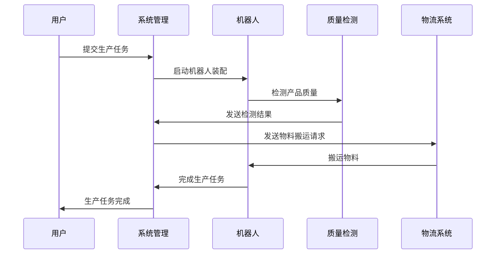

                 

# 机器人技术：AI驱动的自动化系统

> 关键词：机器人技术，人工智能，自动化系统，AI算法，系统设计，应用案例

> 摘要：本文深入探讨了机器人技术及其与人工智能的结合，阐述了AI驱动的自动化系统的设计与应用。通过对机器人技术的发展背景、人工智能基础、AI驱动的机器人系统设计和应用案例分析等部分的详细分析，本文旨在为读者提供一幅全面而深入的理解框架。

----------------------------------------------------------------

### 第一部分：机器人技术的背景和概述

## 第1章：机器人技术的发展背景和概述

### 1.1 机器人技术的定义和分类

机器人技术是一种通过机械、电子、计算机和人工智能等多种技术实现自动化执行任务的技术。它涉及到多个学科领域，包括机械工程、电子工程、计算机科学和人工智能等。

**定义：**
机器人技术是一种模仿人类行为的技术，使得机器能够自动执行任务。它包括硬件和软件两部分，硬件部分负责机器人的物理构造和运动，软件部分则负责机器人的控制、决策和数据处理。

**分类：**
根据机器人的结构和功能，可以将机器人分为以下类别：
- **工业机器人：**主要用于制造业，如汽车制造、电子装配和包装等，特点是高效、稳定和重复性。
- **服务机器人：**为人类提供各种服务，如医疗护理、家庭清洁、教育辅助和娱乐等，特点是智能化、友好和灵活。
- **仿生机器人：**模仿动物或人类行为，具有高度的仿生性，如机器人狗、机器人飞行员等。

### 1.2 机器人技术的历史和发展

机器人技术的起源可以追溯到20世纪40年代和50年代，当时的科学家们开始研究机器人的基本原理和设计。早期的机器人主要是基于机械结构和电子控制，如1961年日本发明的机器人“WABOT-1”。

随着时间的推移，机器人技术得到了快速发展。20世纪80年代，随着计算机技术和人工智能的发展，机器人开始具备了一定的智能，如语音识别、图像识别和自主导航等功能。到了21世纪，机器人技术已经进入了一个全新的时代，人工智能的引入使得机器人变得更加智能和灵活。

**发展历程：**
- **20世纪40-60年代：**机器人技术的基础研究阶段，主要集中在机器人的机械结构和电子控制。
- **20世纪70-80年代：**机器人技术的应用阶段，机器人开始在制造业等领域得到广泛应用。
- **20世纪90年代至今：**机器人技术进入智能化阶段，人工智能的引入使得机器人具有了更高的自主性和智能化。

### 1.3 机器人技术在各个领域的应用

机器人技术在各个领域都有广泛的应用，下面将介绍几个主要的领域：

**工业应用：**
- **制造业：**机器人被广泛应用于汽车制造、电子装配、包装等生产线，提高了生产效率和产品质量。
- **物流运输：**机器人用于仓库管理、物料搬运和配送等，提高了物流效率和准确性。
- **装配线：**机器人用于装配线上的各种装配任务，如螺丝拧紧、焊接和涂装等。

**服务应用：**
- **医疗：**机器人用于手术辅助、康复训练和护理服务，如达芬奇手术机器人、康复机器人等。
- **家庭服务：**机器人用于家庭清洁、烹饪、看护等，如扫地机器人、智能音箱等。
- **教育：**机器人用于教育辅助，如编程教育、科学实验等，如乐高机器人、教育机器人等。

**军事应用：**
- **侦察：**机器人用于危险环境的侦察和目标定位，如无人机、机器人侦察兵等。
- **目标定位：**机器人用于战场上的目标定位和打击，如坦克机器人、无人机等。
- **危险环境作业：**机器人用于处理危险任务，如处理核废水、拆除炸弹等。

### 1.4 机器人技术的发展挑战和未来趋势

机器人技术的发展面临着一些挑战和问题，主要包括以下几个方面：

**技术挑战：**
- **智能算法：**如何设计更智能、更高效的算法，使得机器人能够更好地理解和适应环境。
- **硬件设计：**如何设计更加轻巧、坚固和耐用的硬件，满足不同应用场景的需求。
- **系统集成：**如何将不同技术集成到机器人系统中，实现高效、稳定的运行。

**伦理挑战：**
- **安全性：**如何确保机器人系统的安全性，避免对人类和环境造成伤害。
- **隐私保护：**如何保护用户的隐私，避免机器人滥用数据。
- **责任归属：**如何确定机器人的责任归属，当机器人造成损害时，责任应由谁承担。

**市场挑战：**
- **成本：**如何降低机器人系统的成本，使得更多的人能够负担得起。
- **标准化：**如何制定统一的机器人技术标准和规范，促进机器人技术的发展和普及。
- **市场推广：**如何推广机器人技术，扩大市场应用领域。

未来，机器人技术将在人工智能、云计算和物联网等新兴技术的推动下继续发展。预计未来几年，机器人技术将在以下几个方面取得重大突破：

- **人工智能：**通过深度学习、自然语言处理和机器学习等技术的应用，机器人将具有更高的智能水平。
- **自主化：**机器人将实现更高的自主化程度，能够自主决策和执行任务。
- **多功能化：**机器人将具备更广泛的功能，能够适应多种应用场景。
- **普及化：**机器人将更加普及，进入更多的家庭和行业，成为人们生活和工作的伙伴。

### 1.5 本章小结

本章对机器人技术进行了全面的概述，从定义和分类、历史和发展、应用领域到面临的挑战和未来趋势，为读者提供了一个关于机器人技术的全面了解。通过本章的阅读，读者可以了解到机器人技术的基本概念和发展现状，以及它在各个领域的广泛应用和未来发展方向。

----------------------------------------------------------------

### 第二部分：人工智能基础

## 第2章：人工智能基础

### 2.1 人工智能的定义和分类

人工智能（Artificial Intelligence，简称AI）是计算机科学的一个分支，旨在研究、开发和应用使计算机系统模拟人类智能行为的理论、方法和技术。人工智能的目标是实现机器的感知、学习、推理、规划和自我修正能力。

**定义：**
人工智能可以定义为一种模拟人类智能的计算机技术，它使得计算机系统能够执行人类通常需要智能才能完成的任务。这包括学习从数据中提取模式和知识、理解自然语言、识别图像和声音、进行决策和解决问题等。

**分类：**
人工智能可以根据实现方式和技术特点分为以下几类：

- **基于规则的系统：** 这类系统通过定义明确的规则来处理问题。规则通常由人类专家制定，系统根据输入数据和规则进行推理和决策。典型的应用包括专家系统和逻辑推理系统。

- **基于知识的系统：** 这些系统存储和利用知识库来解决问题。知识库中的知识可以由人类专家输入，也可以通过机器学习算法自动获取。这种系统在医疗诊断、法律咨询等领域有广泛应用。

- **基于数据的系统：** 这类系统通过分析大量数据来发现模式和规律，并进行预测和决策。机器学习和深度学习是这类系统的核心技术，广泛应用于图像识别、语音识别和推荐系统等领域。

### 2.2 机器学习基础

机器学习是人工智能的一个分支，它使用算法从数据中学习规律和模式，并利用这些规律进行预测和决策。机器学习可以分为监督学习、无监督学习和强化学习等类型。

**监督学习：** 在监督学习中，系统通过学习标记好的训练数据来建立预测模型。常见的算法包括线性回归、决策树、支持向量机和神经网络等。

**无监督学习：** 无监督学习不使用标记数据，而是从未标记的数据中学习结构和模式。聚类、降维和关联规则挖掘是常见的无监督学习任务。

**强化学习：** 强化学习是机器学习的一种类型，它通过试错和奖励机制来学习最佳行为策略。强化学习在游戏、机器人控制和自动驾驶等领域有广泛应用。

**算法原理：**
- **线性回归：** 通过最小化预测值与实际值之间的差异来训练模型。
- **决策树：** 通过划分特征空间来构建树形模型，每个节点代表一个特征，每个分支代表一个特征取值。
- **支持向量机：** 通过找到一个超平面来最大化两类数据的分类间隔。
- **神经网络：** 通过多层神经元之间的加权连接来模拟人类大脑的处理方式。

**应用案例：**
- **图像识别：** 机器学习算法被广泛应用于图像分类和目标检测，如人脸识别、车牌识别和医学图像分析等。
- **语音识别：** 通过训练模型来将语音信号转换为文本，广泛应用于智能助手、语音翻译和语音控制等领域。
- **推荐系统：** 通过分析用户的兴趣和行为数据来推荐商品、新闻和音乐等。

### 2.3 深度学习基础

深度学习是机器学习的一个子领域，它使用多层神经网络（深度神经网络）来学习和提取数据的复杂特征。深度学习的核心在于其能够自动学习数据的层次化表示。

**算法原理：**
- **卷积神经网络（CNN）：** 通过卷积层、池化层和全连接层来提取图像的层次化特征，广泛应用于图像识别和计算机视觉领域。
- **循环神经网络（RNN）：** 通过循环结构来处理序列数据，如时间序列分析、语言模型和机器翻译等。
- **生成对抗网络（GAN）：** 通过两个神经网络（生成器和判别器）的对抗训练来生成逼真的数据。

**应用案例：**
- **计算机视觉：** 深度学习在计算机视觉领域取得了巨大成功，如人脸识别、图像分割和自动驾驶等。
- **自然语言处理：** 深度学习被广泛应用于自然语言处理任务，如机器翻译、情感分析和文本生成等。
- **游戏开发：** 深度学习在游戏开发中用于训练智能对手，如围棋、国际象棋和电子竞技等。

### 2.4 自然语言处理基础

自然语言处理（Natural Language Processing，简称NLP）是人工智能的一个分支，旨在使计算机能够理解和处理人类自然语言。NLP涉及文本处理、语音识别和机器翻译等领域。

**基础概念：**
- **文本分类：** 将文本分为不同的类别，如垃圾邮件检测、情感分析等。
- **情感分析：** 通过分析文本的情感倾向来识别用户的情感状态，如正面、负面或中性。
- **机器翻译：** 通过训练模型将一种语言的文本翻译成另一种语言。

**应用案例：**
- **搜索引擎：** 使用NLP技术来理解用户查询并返回相关的搜索结果。
- **智能客服：** 使用NLP技术来理解和响应用户的询问，提供智能化的客户服务。
- **社交媒体分析：** 使用NLP技术来分析社交媒体数据，了解公众的观点和趋势。

### 2.5 人工智能的发展挑战和未来趋势

人工智能的发展面临着许多挑战和问题，主要包括以下几个方面：

**技术挑战：**
- **算法效率：** 如何设计更高效、更准确的算法来处理大规模数据。
- **计算能力：** 如何提高计算能力，以满足人工智能应用的需求。
- **数据隐私：** 如何保护用户数据的安全和隐私。

**伦理挑战：**
- **透明度和可解释性：** 如何确保人工智能系统的透明度和可解释性，使其决策过程容易被人类理解和审查。
- **责任归属：** 如何确定人工智能系统的责任归属，当系统造成损害时，责任应由谁承担。

**未来趋势：**
- **自主化和智能化：** 人工智能将继续向自主化和智能化方向发展，使得系统能够更好地理解和适应环境。
- **多模态交互：** 人工智能将能够处理多种数据类型，如文本、图像和声音，实现更自然的人机交互。
- **普及化：** 人工智能将更加普及，进入更多的行业和应用领域，改变人类的生产和生活方式。

### 2.6 本章小结

本章对人工智能的基础进行了全面介绍，包括定义和分类、机器学习基础、深度学习基础和自然语言处理基础等内容。通过本章的学习，读者可以了解到人工智能的核心概念、发展历程和应用领域，以及它在不同领域的应用案例。同时，本章还探讨了人工智能的发展挑战和未来趋势，为读者提供了一个全面而深入的理解框架。

----------------------------------------------------------------

### 第三部分：AI驱动的自动化系统设计与应用

## 第3章：AI驱动的机器人系统设计

### 3.1 机器人系统设计的基本原则

机器人系统设计是一个复杂的过程，需要考虑多个方面，包括功能需求、性能指标、用户界面和安全性等。以下是机器人系统设计的基本原则：

**1. 模块化：** 模块化设计使得系统更容易维护和扩展。每个模块应具有明确的功能和接口，便于独立开发和测试。

**2. 可扩展性：** 系统设计应考虑未来的扩展需求，如增加新功能或支持更大的数据量。

**3. 易维护性：** 设计时应考虑系统的可维护性，确保故障易于排查和修复。

**4. 稳定性和可靠性：** 系统应能够在各种环境下稳定运行，并具备较高的可靠性，避免因故障导致意外事故。

**5. 用户友好性：** 系统应具有友好的用户界面，便于用户操作和使用。

**6. 安全性：** 系统设计应考虑数据安全和隐私保护，确保系统的安全性。

### 3.2 硬件设计

硬件设计是机器人系统设计的重要环节，决定了机器人的运动能力、感知能力和执行能力。以下是硬件设计的关键点：

**1. 选择标准：**
- **性能：** 根据应用需求选择适当的处理器、内存和存储设备。
- **可靠性：** 选择具有高可靠性的硬件组件，确保系统稳定运行。
- **成本：** 在满足性能和可靠性的前提下，尽量降低成本。

**2. 硬件组件：**
- **处理器：** 选择适合的处理器，如ARM、x86等，以满足计算需求。
- **传感器：** 包括摄像头、麦克风、红外传感器等，用于感知环境信息。
- **执行器：** 如电机、伺服电机等，用于驱动机器人运动。
- **电源：** 确保系统具有稳定的电源供应。

### 3.3 软件设计

软件设计是机器人系统的核心，决定了机器人的控制算法、决策过程和数据管理。以下是软件设计的关键点：

**1. 软件架构：**
- **控制算法：** 设计适合的控制算法，实现机器人的运动控制和任务执行。
- **数据处理：** 设计高效的数据处理算法，实现数据的采集、存储和传输。
- **通信模块：** 设计可靠的通信模块，实现机器人与外部设备的通信。

**2. 软件开发工具：**
- **编程语言：** 选择适合的编程语言，如C/C++、Python等，进行软件开发。
- **开发框架：** 使用成熟的开发框架，如ROS（Robot Operating System）等，简化开发过程。
- **调试工具：** 使用调试工具，如GDB、IDE等，提高开发效率。

### 3.4 AI算法集成

AI算法在机器人系统中发挥着关键作用，可以提高机器人的自主性和智能化水平。以下是AI算法集成的关键点：

**1. 算法选择：**
- **机器学习：** 选择适合的机器学习算法，如神经网络、支持向量机等，用于数据分析和决策。
- **深度学习：** 选择适合的深度学习算法，如卷积神经网络、循环神经网络等，用于图像识别和自然语言处理。
- **强化学习：** 选择适合的强化学习算法，如Q-learning、DQN等，用于决策和路径规划。

**2. 算法集成：**
- **集成框架：** 使用集成框架，如TensorFlow、PyTorch等，简化算法开发和部署。
- **实时性：** 确保算法具有足够的实时性，以满足机器人系统的实时需求。
- **优化策略：** 通过算法优化和硬件加速，提高算法的执行效率。

### 3.5 测试与优化

测试与优化是确保机器人系统性能和稳定性的关键步骤。以下是测试与优化的关键点：

**1. 测试标准：**
- **稳定性：** 测试机器人系统在各种环境下是否稳定运行。
- **响应速度：** 测试机器人系统的响应速度是否满足应用需求。
- **准确性：** 测试机器人系统的决策和执行是否准确。

**2. 优化策略：**
- **算法优化：** 通过优化算法，提高机器人系统的效率和准确性。
- **硬件升级：** 通过升级硬件组件，提高机器人系统的性能。
- **系统优化：** 通过调整系统参数，优化机器人系统的运行状态。

## 3.6 本章小结

本章介绍了AI驱动的机器人系统设计的基本原则、硬件设计、软件设计、AI算法集成和测试优化等内容。通过本章的学习，读者可以了解到机器人系统设计的全过程，从硬件到软件，从算法到优化，为读者提供了全面的设计思路和实现方法。同时，本章还探讨了机器人系统设计中的关键技术和挑战，为读者提供了实用的解决方案和参考。

----------------------------------------------------------------

### 第四部分：AI驱动的自动化系统应用案例分析

## 第4章：工业自动化

### 4.1 工业自动化概述

工业自动化是利用各种自动化设备和系统来实现生产过程中的自动化操作。在工业生产中，自动化技术可以显著提高生产效率、降低成本、保证产品质量并提升生产安全性。随着人工智能技术的发展，AI驱动的自动化系统在工业自动化领域得到了广泛应用。

**应用背景：**
- **生产效率：** 随着市场竞争的加剧，提高生产效率成为企业生存和发展的关键。自动化技术可以减少人工操作，提高生产速度和稳定性。
- **成本控制：** 自动化系统可以减少人工成本，降低生产过程中的人工错误，从而降低整体生产成本。
- **产品质量：** 自动化系统能够确保生产过程的一致性和精确性，提高产品质量和一致性。
- **安全生产：** 自动化技术可以减少人为操作带来的安全风险，提高生产安全性。

**应用领域：**
- **制造业：** 制造业是工业自动化的主要应用领域，包括汽车制造、电子制造、食品加工等。
- **物流运输：** 物流自动化包括仓储管理、物料搬运、运输调度等，通过自动化技术提高物流效率。
- **装配线：** 自动化装配线广泛应用于电子、汽车等行业，实现高效、精准的装配任务。

### 4.2 AI驱动的自动化系统设计

AI驱动的自动化系统设计旨在利用人工智能技术提高系统的智能化水平和自主化能力。以下是设计的关键步骤：

**1. 需求分析：**
- **明确目标：** 确定自动化系统的目标和功能需求，如自动化装配、检测、搬运等。
- **数据分析：** 分析现有生产数据，了解生产过程中的瓶颈和优化点。

**2. 硬件选型：**
- **传感器选择：** 根据功能需求选择适当的传感器，如摄像头、红外传感器等，用于感知环境信息。
- **执行器选择：** 根据任务需求选择合适的执行器，如电机、伺服电机等，用于驱动机械臂等部件。
- **控制器选择：** 选择适合的控制器，如PLC（可编程逻辑控制器）、工业计算机等，用于控制系统的整体运行。

**3. 软件设计：**
- **控制算法设计：** 设计适合的控制算法，实现系统的运动控制和任务执行。
- **数据处理：** 设计数据处理模块，实现数据的采集、存储和传输。
- **AI算法集成：** 集成AI算法，如机器学习、深度学习等，用于图像识别、路径规划和决策。

**4. 系统集成与测试：**
- **系统集成：** 将各个模块集成到一起，确保系统各部分的协同工作。
- **测试与优化：** 进行系统测试，验证系统功能是否满足需求，并进行优化。

### 4.3 应用案例

**案例一：智能工厂**

**项目介绍：**
智能工厂是一个集成了AI驱动的自动化系统的工厂，实现了生产线的全自动化操作。该系统包括自动化装配线、质量检测系统和物流系统。

**系统功能设计：**
- **自动化装配线：** 通过机器人和自动化设备实现零件的自动装配，提高生产效率。
- **质量检测系统：** 使用AI算法对产品进行质量检测，确保产品质量。
- **物流系统：** 自动化搬运设备实现物料和产品的自动搬运，提高物流效率。

**系统架构设计：**
- **硬件架构：** 包括机器人、传感器、执行器和控制器等硬件设备。
- **软件架构：** 包括控制算法、数据处理模块和AI算法等软件系统。

**系统接口设计：**
- **生产数据接口：** 实现与生产数据系统的对接，采集和分析生产数据。
- **控制接口：** 实现与控制系统的对接，控制机器人和自动化设备的运行。

**系统交互序列图：**

**实际案例分析和详细讲解：**
智能工厂项目在实际应用中取得了显著效果。通过自动化装配线和质量检测系统的应用，生产效率提高了30%，产品合格率提高了20%。物流系统的自动化搬运设备使得物料和产品的搬运效率提高了50%，减少了人工操作的错误和安全事故。

**项目小结：**
智能工厂项目展示了AI驱动的自动化系统在工业自动化领域的广泛应用和巨大潜力。通过集成人工智能技术，实现了生产过程的自动化、智能化和高效化，为工业生产带来了革命性的变化。

### 4.4 最佳实践 tips

- **数据驱动：** 在设计AI驱动的自动化系统时，应充分利用历史数据，进行数据分析和优化。
- **模块化设计：** 硬件和软件设计应采用模块化设计，便于系统的维护和升级。
- **系统集成：** 确保系统各部分之间的协同工作，实现无缝对接。
- **安全可靠：** 系统设计应考虑安全性和可靠性，避免因故障导致生产中断。

### 4.5 小结

本章介绍了工业自动化的概念、AI驱动的自动化系统设计以及具体应用案例。通过智能工厂项目的实际案例，展示了AI驱动的自动化系统在工业自动化领域的重要性和应用效果。未来，随着人工智能技术的不断发展，AI驱动的自动化系统将在工业生产中发挥越来越重要的作用。

----------------------------------------------------------------

## 作者

作者：AI天才研究院/AI Genius Institute & 禅与计算机程序设计艺术 /Zen And The Art of Computer Programming

----------------------------------------------------------------

以上内容涵盖了机器人技术、人工智能基础、AI驱动的自动化系统设计以及工业自动化应用案例的全面讲解。通过逐步分析和逻辑推理，本文为读者提供了一个深入理解和思考的框架。希望本文能为读者在机器人技术和人工智能领域的探索提供有价值的参考和指导。

