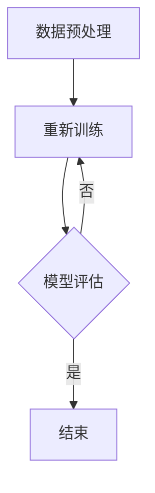
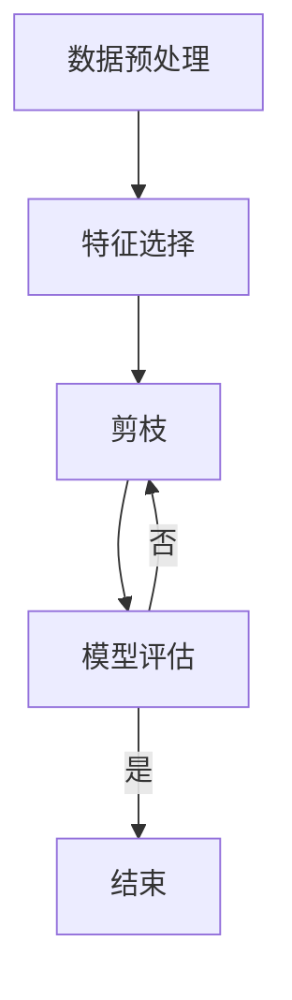
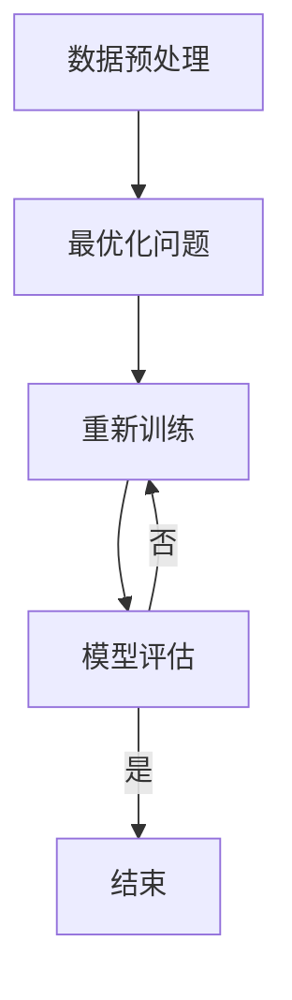
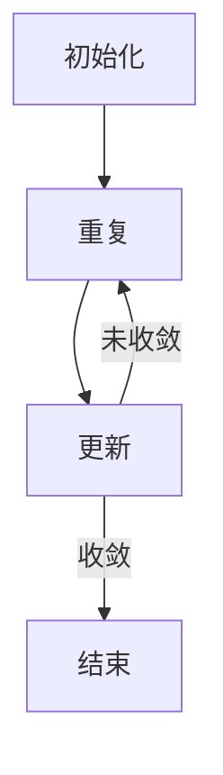
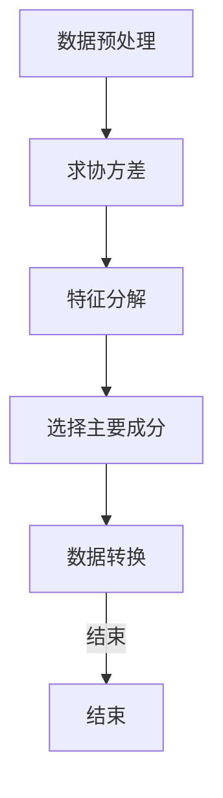
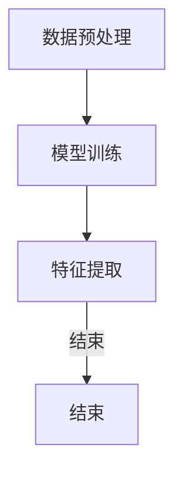

                 

# 机器学习在软件开发中的应用：从理论到实践

## 关键词
- 机器学习
- 软件开发
- 算法
- 数据预处理
- 模型部署
- 最佳实践

## 摘要
本文旨在探讨机器学习在软件开发中的应用，从理论到实践逐步分析其核心概念、算法原理、开发流程以及面临的挑战和未来发展趋势。通过深入解析机器学习与软件开发的交集，本文将帮助读者理解如何将机器学习技术有效地集成到软件开发中，提升系统的智能性和效率。

## 引言

### 1.1 问题背景

随着大数据和云计算的兴起，软件系统不再仅仅是执行预定任务的工具，而是需要具备自主学习和适应能力的智能系统。传统的软件开发方法在处理复杂性和动态性方面显得力不从心，而机器学习为软件系统带来了新的机遇。通过引入机器学习，软件系统能够从数据中自动提取知识，进行自我优化和更新，从而提高其性能和用户体验。

### 1.2 机器学习与软件开发的关系

机器学习作为人工智能的一个重要分支，其核心目标是通过算法让计算机具备从数据中学习和预测的能力。而软件开发则是将机器学习技术应用于实际问题的过程，通过设计、实现和维护软件系统，将机器学习算法的能力转化为实际应用。两者的结合使得软件系统能够更加智能化，具备更强的适应性和灵活性。

### 1.3 本书结构

本文将分为七个部分进行详细探讨：

1. **机器学习的软件应用基础**：介绍机器学习的基本概念和原理。
2. **机器学习算法**：讲解常见的机器学习算法及其原理。
3. **机器学习在软件开发中的应用**：探讨如何将机器学习集成到软件开发中。
4. **案例研究**：通过具体案例展示机器学习在软件开发中的应用。
5. **最佳实践与挑战**：分析机器学习应用中的最佳实践和面临的挑战。
6. **未来发展趋势**：展望机器学习在软件开发中的未来方向。
7. **总结与拓展**：对全文进行总结，并提出进一步的研究方向。

## 机器学习的软件应用基础

### 2.1 定义与基本概念

机器学习（Machine Learning，ML）是指通过算法从数据中自动学习和获取知识的过程。它不同于传统编程，后者需要手动编写具体的指令，而机器学习通过训练模型来让计算机自动识别数据中的模式。核心概念包括：

- **数据集（Dataset）**：用于训练和测试模型的原始数据集合。
- **特征（Feature）**：数据集中的单个变量，用于描述数据样本的属性。
- **模型（Model）**：通过学习数据中的规律生成的预测函数。

### 2.2 机器学习的基本原理

机器学习的基本原理基于统计学习和模式识别，主要包括以下几种方法：

- **监督学习（Supervised Learning）**：通过已标记的数据训练模型，从而对未知数据进行预测。
- **无监督学习（Unsupervised Learning）**：在未标记的数据中寻找数据中的结构和模式。
- **强化学习（Reinforcement Learning）**：通过与环境互动，不断调整策略以最大化某种奖励。

### 2.3 机器学习的类型

根据机器学习的过程和目标，可以分为以下几种类型：

- **回归（Regression）**：预测连续值。
- **分类（Classification）**：预测离散类别。
- **聚类（Clustering）**：将数据分组，使组内的数据尽可能相似，组间数据尽可能不同。
- **降维（Dimensionality Reduction）**：减少数据维度，同时保留重要信息。

### 2.4 概念属性特征对比表格

| 类型         | 定义                                                         | 应用场景                                                       |
| ------------ | ------------------------------------------------------------ | ------------------------------------------------------------ |
| 回归         | 预测连续值的算法                                             | 房价预测、股票市场分析                                         |
| 分类         | 预测离散类别的算法                                           | 信用卡欺诈检测、垃圾邮件分类                                   |
| 聚类         | 寻找数据中的自然分组                                         | 社交网络分析、图像分割                                         |
| 降维         | 将数据从高维空间映射到低维空间                               | 数据可视化、特征提取                                           |

### 2.5 ER实体关系图架构

```mermaid
erDiagram
  Product ||--|{ Customer }| Customer
  Customer ||--|{ Order }| Order
  Product ||--|{ Supplier }| Supplier
  Supplier ||--|{ Product }| Product
```

## 机器学习算法

### 3.1 监督学习算法

监督学习算法是最常见的机器学习类型之一，其核心思想是通过已标记的数据训练模型，从而对新数据进行预测。

#### 3.1.1 线性回归

线性回归（Linear Regression）是一种预测连续值的算法，其模型可以表示为：

$$
y = \beta_0 + \beta_1x
$$

其中，$y$ 是因变量，$x$ 是自变量，$\beta_0$ 和 $\beta_1$ 是模型的参数。

线性回归的流程包括：

1. 数据预处理：标准化输入数据。
2. 模型训练：使用梯度下降法等优化算法计算参数。
3. 模型评估：通过均方误差（MSE）等指标评估模型性能。

线性回归的 mermaid 流程图：



#### 3.1.2 决策树

决策树（Decision Tree）是一种基于树形结构进行决策的算法，其核心思想是通过一系列的测试来划分数据。

决策树的模型可以表示为：

$$
T = \{t_1, t_2, ..., t_n\}
$$

其中，$t_i$ 是一个测试，$T$ 是所有测试的集合。

决策树的流程包括：

1. 数据预处理：对特征进行选择和预处理。
2. 构建决策树：递归地选择最优测试。
3. 模型评估：通过验证集或测试集评估模型性能。

决策树的 mermaid 流程图：



#### 3.1.3 支持向量机

支持向量机（Support Vector Machine，SVM）是一种用于分类和回归的算法，其核心思想是通过找到最佳的超平面来分隔数据。

SVM 的模型可以表示为：

$$
\min_{\beta, \beta_0} \frac{1}{2}||\beta||^2 + C\sum_{i=1}^{n}y_i(\beta \cdot x_i + \beta_0)
$$

其中，$\beta$ 是模型参数，$\beta_0$ 是偏置，$C$ 是惩罚参数，$y_i$ 是样本标签，$x_i$ 是样本特征。

SVM 的流程包括：

1. 数据预处理：对特征进行标准化。
2. 模型训练：通过求解最优化问题计算模型参数。
3. 模型评估：通过验证集或测试集评估模型性能。

SVM 的 mermaid 流程图：



### 3.2 无监督学习算法

无监督学习算法在未标记的数据中寻找结构和模式。

#### 3.2.1 K-均值聚类

K-均值聚类（K-Means Clustering）是一种基于距离度量的聚类算法，其核心思想是将数据点划分成K个簇，使得簇内的数据点尽可能接近，簇间的数据点尽可能远离。

K-均值聚类的模型可以表示为：

$$
\min_{\mu_1, \mu_2, ..., \mu_k} \sum_{i=1}^{n} \sum_{j=1}^{k} ||x_i - \mu_j||^2
$$

其中，$\mu_j$ 是第j个簇的中心点，$x_i$ 是数据点。

K-均值聚类的流程包括：

1. 初始化：随机选择K个初始中心点。
2. 分配：将每个数据点分配到最近的中心点。
3. 更新：重新计算每个簇的中心点。
4. 重复步骤2和3，直至满足停止条件。

K-均值聚类的 mermaid 流程图：



#### 3.2.2 主成分分析

主成分分析（Principal Component Analysis，PCA）是一种用于降维和特征提取的算法，其核心思想是通过线性变换将原始数据投影到新的坐标系中，以保留主要的信息。

PCA 的模型可以表示为：

$$
z = P^T X
$$

其中，$P$ 是协方差矩阵的特征向量矩阵，$X$ 是原始数据矩阵，$z$ 是新的坐标。

PCA 的流程包括：

1. 数据预处理：对特征进行标准化。
2. 求解协方差矩阵：计算各特征的协方差。
3. 求解特征值和特征向量：对协方差矩阵进行特征分解。
4. 选择主要成分：根据特征值选择前k个特征向量。
5. 数据转换：将原始数据投影到新的坐标系中。

PCA 的 mermaid 流程图：



#### 3.2.3 自编码器

自编码器（Autoencoder）是一种无监督学习的神经网络模型，其核心思想是通过训练生成数据的低维表示。

自编码器的模型可以表示为：

$$
z = \sigma(W_2 \cdot \sigma(W_1 \cdot x))
$$

其中，$W_1$ 和 $W_2$ 是权重矩阵，$\sigma$ 是激活函数，$x$ 是输入数据，$z$ 是压缩后的输出数据。

自编码器的流程包括：

1. 数据预处理：对特征进行标准化。
2. 模型训练：通过最小化重构误差优化模型参数。
3. 特征提取：使用训练好的模型提取输入数据的低维表示。

自编码器的 mermaid 流程图：



## 机器学习在软件开发中的应用

### 4.1 软件开发中的数据预处理

在将机器学习模型集成到软件开发中时，数据预处理是关键的一步。数据预处理包括以下步骤：

1. **数据清洗**：处理缺失值、异常值和重复值。
2. **数据归一化**：将不同尺度的特征转换为相同的尺度。
3. **特征选择**：选择对模型性能有显著影响的重要特征。
4. **特征工程**：创建新的特征或变换现有特征以提高模型性能。

### 4.2 特征工程

特征工程是机器学习应用中至关重要的一环。有效的特征工程可以提高模型的性能和泛化能力。特征工程包括：

1. **特征提取**：从原始数据中提取有意义的特征。
2. **特征转换**：将原始特征转换为更适合模型的形式。
3. **特征组合**：结合多个特征创建新的特征。

### 4.3 模型选择与评估

在软件开发中，选择合适的模型和评估方法至关重要。常见的模型选择和评估方法包括：

1. **交叉验证**：通过多次划分训练集和验证集，评估模型的性能。
2. **性能指标**：如准确率、召回率、F1值等，用于评估模型的性能。
3. **模型选择**：根据评估结果选择最优模型。

### 4.4 机器学习模型集成

将机器学习模型集成到软件系统中，通常包括以下步骤：

1. **模型训练**：使用历史数据训练模型。
2. **模型部署**：将训练好的模型部署到软件系统中。
3. **模型更新**：定期使用新数据更新模型，以保持模型的准确性。

### 4.5 模型性能监控

在模型部署后，需要持续监控其性能，以确保其稳定运行。常见的性能监控方法包括：

1. **实时监控**：实时收集和监控模型性能指标。
2. **异常检测**：检测模型性能的异常，如过拟合或欠拟合。
3. **模型重训练**：根据监控结果决定是否重新训练模型。

## 案例研究

### 5.1 信用卡欺诈检测

信用卡欺诈检测是机器学习在金融领域的一个典型应用。通过训练模型，系统可以自动检测信用卡交易中的欺诈行为。

案例流程：

1. **数据收集**：收集历史信用卡交易数据。
2. **数据预处理**：清洗和标准化数据。
3. **特征工程**：提取和组合特征。
4. **模型训练**：使用监督学习算法训练模型。
5. **模型部署**：将训练好的模型部署到系统中。
6. **模型监控**：监控模型性能，进行必要的调整。

### 5.2 智能推荐系统

智能推荐系统是机器学习在电子商务和社交媒体领域的重要应用。通过分析用户行为和偏好，系统可以自动推荐用户可能感兴趣的商品或内容。

案例流程：

1. **数据收集**：收集用户行为数据，如浏览记录、购买记录等。
2. **数据预处理**：清洗和标准化数据。
3. **特征工程**：提取和组合特征。
4. **模型训练**：使用协同过滤或基于内容的推荐算法训练模型。
5. **模型部署**：将训练好的模型部署到系统中。
6. **模型监控**：监控模型性能，进行必要的调整。

## 最佳实践与挑战

### 6.1 最佳实践

在将机器学习集成到软件开发中时，以下最佳实践有助于提高模型的性能和稳定性：

1. **数据质量**：确保数据准确、完整和多样化。
2. **模型选择**：根据问题特点选择合适的模型。
3. **模型监控**：持续监控模型性能，及时发现并解决问题。
4. **团队协作**：鼓励跨学科团队合作，共同解决复杂问题。

### 6.2 面临的挑战

尽管机器学习在软件开发中具有巨大潜力，但仍面临以下挑战：

1. **数据隐私**：保护用户数据隐私是关键挑战。
2. **模型解释性**：提高模型的可解释性，以增强用户信任。
3. **模型泛化能力**：增强模型的泛化能力，避免过拟合。
4. **计算资源**：处理大规模数据和高维特征需要强大的计算资源。

## 未来发展趋势

### 7.1 机器学习在软件开发中的未来方向

未来的机器学习在软件开发中将朝着以下方向发展：

1. **自动化**：自动化机器学习工具将简化模型训练和部署过程。
2. **个性化**：基于个性化数据推荐更符合用户需求的软件功能。
3. **边缘计算**：将机器学习模型部署到边缘设备，提高实时性。
4. **多元融合**：融合多种数据源，提高模型的预测精度。

### 7.2 面临的挑战与解决方案

未来机器学习在软件开发中仍将面临以下挑战：

1. **数据隐私**：采用加密和匿名化技术保护用户数据隐私。
2. **模型可解释性**：开发可解释的机器学习算法，提高用户信任。
3. **资源优化**：优化算法和架构，提高计算效率和资源利用率。

## 总结与拓展

本文从理论到实践全面探讨了机器学习在软件开发中的应用。通过深入解析核心概念、算法原理以及开发流程，读者可以了解如何将机器学习技术有效地集成到软件开发中，提升系统的智能性和效率。

未来的研究可以关注以下几个方面：

1. **算法优化**：研究更高效、更可解释的机器学习算法。
2. **跨领域应用**：探索机器学习在更多领域的应用，如医疗、教育等。
3. **协同进化**：研究机器学习和软件开发的协同进化，提高整体系统的智能化水平。

## 拓展阅读

- **《Python机器学习》**：Goodfellow, I., Bengio, Y., & Courville, A. (2016). Deep Learning. MIT Press.
- **《机器学习实战》**：周志华 (2017). 机器学习。清华大学出版社。
- **《软件架构设计》**：Fowler, M. (2017). Patterns of Enterprise Application Architecture. Addison-Wesley.
- **《数据挖掘：概念与技术》**：Han, J., Kamber, M., & Pei, J. (2011). Data Mining: Concepts and Techniques. Morgan Kaufmann.

## 作者信息

作者：AI天才研究院/AI Genius Institute & 禅与计算机程序设计艺术 /Zen And The Art of Computer Programming

