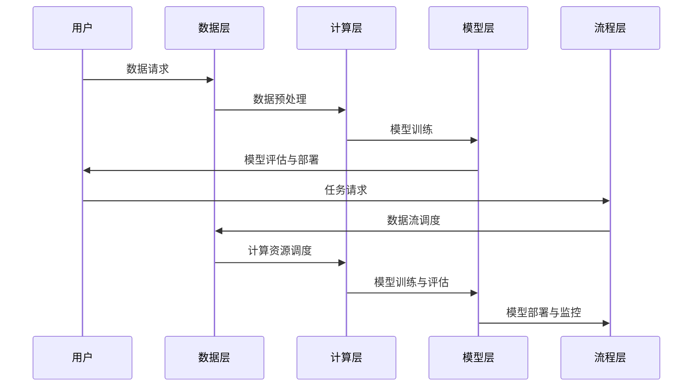
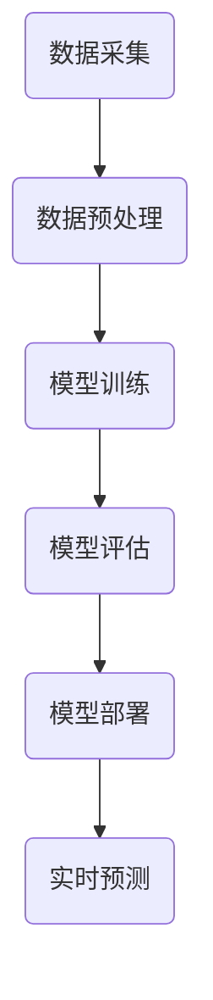
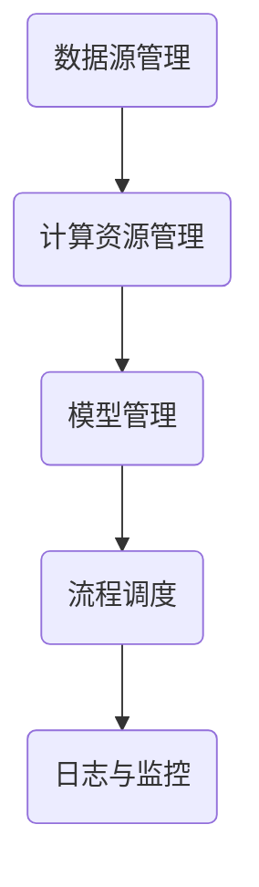
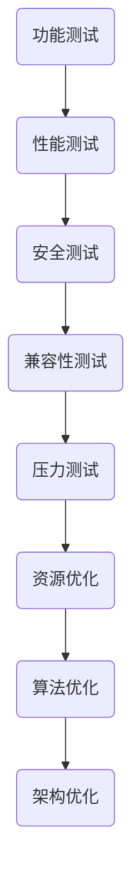

                 

## 引言

### 第1章：问题背景

#### 1.1.1 机器学习的普及与发展

随着互联网和大数据技术的快速发展，机器学习（Machine Learning，ML）已经成为现代科技中不可或缺的一部分。机器学习技术通过构建数学模型来分析数据，从中发现规律，进而对未知数据进行预测或决策。自20世纪50年代诞生以来，机器学习经历了多个发展阶段，从早期的统计学习、决策树，到现代的深度学习和强化学习，技术不断进步，应用范围也越来越广泛。

首先，机器学习技术的普及。人工智能（Artificial Intelligence，AI）的兴起推动了机器学习技术的发展，使得其在各个行业得到了广泛应用。例如，在医疗领域，机器学习可以用于疾病诊断和预测；在金融领域，可以用于风险评估和欺诈检测；在零售行业，可以用于商品推荐和库存管理；在交通领域，可以用于智能交通管理和自动驾驶。这些应用不仅提高了效率，还降低了成本，提升了用户体验。

其次，机器学习在各行业的应用。随着数据量的爆炸式增长，机器学习技术成为解决复杂问题的重要工具。例如，在图像识别领域，卷积神经网络（Convolutional Neural Network，CNN）的应用使得图像识别准确率大幅提升；在自然语言处理（Natural Language Processing，NLP）领域，循环神经网络（Recurrent Neural Network，RNN）和变压器模型（Transformer）的应用使得机器翻译、情感分析等任务取得了显著成果；在推荐系统领域，协同过滤和基于内容的推荐算法使得个性化推荐成为现实。

然而，随着机器学习应用的不断扩展，也面临了许多挑战。首先是如何处理大量数据，如何优化算法性能，如何保证模型的鲁棒性和可解释性。此外，随着数据隐私和安全问题的日益突出，如何在保护用户隐私的同时利用数据为机器学习服务也成为了一个亟待解决的问题。

#### 1.1.2 机器学习平台的重要性

机器学习平台在机器学习应用中扮演着至关重要的角色。一个高效的机器学习平台可以提供以下优势：

1. **数据集成与处理**：机器学习平台能够集成来自不同数据源的数据，并进行数据清洗、转换和预处理，为模型训练提供高质量的数据集。

2. **计算资源管理**：平台可以根据任务需求动态分配计算资源，确保模型训练和推理的效率。

3. **模型管理**：平台可以存储和管理模型，提供模型版本控制和模型生命周期管理，方便开发人员选择合适的模型进行部署。

4. **流程调度**：平台可以自动调度任务，确保模型训练、评估和部署的连续性和高效性。

5. **日志与监控**：平台可以记录系统的运行日志，提供实时监控和异常报警，确保系统的稳定性和可靠性。

根据应用场景和需求的不同，机器学习平台可以分为以下几类：

1. **开源平台**：如TensorFlow、PyTorch等，这些平台提供了丰富的API和工具库，方便开发者进行模型开发。

2. **商业平台**：如Google Cloud AI、AWS SageMaker等，这些平台提供了全面的服务和专业的支持，适合大规模生产和部署。

3. **企业级平台**：如华为ModelArts、百度AI平台等，这些平台结合了开源和商业平台的优点，适合企业内部使用。

总之，机器学习平台不仅是机器学习技术的载体，更是企业创新和发展的关键基础设施。一个高效、稳定的机器学习平台可以大幅提升机器学习应用的效率和效果，为企业带来巨大的商业价值。

### 第2章：核心概念

#### 2.1.1 机器学习的核心概念

机器学习是一门涉及多个学科领域的交叉学科，主要涉及以下几个核心概念：

**数据处理**：数据处理是机器学习的基础，包括数据采集、数据清洗、数据转换和数据存储等过程。良好的数据处理能力是构建高质量模型的前提。

**特征工程**：特征工程是通过对数据进行处理和转换，提取出对模型训练有帮助的特征。特征工程的质量直接影响到模型的性能。

**模型训练**：模型训练是机器学习的核心步骤，通过算法在数据集上进行迭代学习，不断调整模型参数，使其能够准确预测或分类新数据。

**模型评估**：模型评估是检验模型性能的重要步骤，常用的评估指标包括准确率、召回率、F1分数等。通过模型评估，可以了解模型的性能，并进行优化。

**模型部署**：模型部署是将训练好的模型应用到实际场景中，进行预测或决策。模型部署需要考虑系统的性能、可靠性和可扩展性。

#### 2.1.2 机器学习平台的关键组件

机器学习平台通常包含以下几个关键组件：

**数据源管理**：数据源管理负责集成和管理各种数据源，包括关系数据库、NoSQL数据库、文件系统等，提供数据访问接口和数据预处理工具。

**计算资源管理**：计算资源管理负责根据任务需求动态分配计算资源，包括CPU、GPU、TPU等，确保模型训练和推理的效率。

**模型管理**：模型管理负责存储和管理模型，包括模型版本控制、模型生命周期管理、模型推理服务等，方便开发人员和业务人员使用。

**流程调度**：流程调度负责自动调度任务，包括数据预处理、模型训练、模型评估、模型部署等，确保任务的连续性和高效性。

**日志与监控**：日志与监控负责记录系统的运行日志，提供实时监控和异常报警，确保系统的稳定性和可靠性。

### 第3章：系统架构设计

#### 3.1.1 系统架构概述

机器学习平台的系统架构设计需要综合考虑数据流、计算资源、模型管理和流程调度等多个方面。一个典型的机器学习平台架构可以分为以下几个层次：

1. **数据层**：包括数据源管理、数据存储和数据预处理等模块。数据层负责集成和管理各种数据源，并提供数据预处理工具，为模型训练提供高质量的数据集。

2. **计算层**：包括计算资源管理和模型训练等模块。计算层负责根据任务需求动态分配计算资源，并提供高效的模型训练算法，确保模型训练的效率和效果。

3. **模型层**：包括模型管理、模型评估和模型部署等模块。模型层负责存储和管理模型，提供模型版本控制和模型生命周期管理，并支持模型评估和部署。

4. **流程层**：包括流程调度、任务管理和日志监控等模块。流程层负责自动调度任务，确保任务的连续性和高效性，并提供日志记录和监控功能，确保系统的稳定性和可靠性。

下面是一个简化的系统架构图：



#### 3.1.2 数据流与处理流程

在机器学习平台中，数据流是一个核心概念。数据流从数据采集开始，经过数据处理、模型训练和模型部署等过程，最终产生预测结果或决策。下面是一个典型的数据流和处理流程：

1. **数据采集**：从各种数据源（如关系数据库、NoSQL数据库、文件系统等）采集数据，并进行初步的数据清洗。

2. **数据预处理**：对采集到的数据进行清洗、转换和归一化等处理，提取出对模型训练有帮助的特征。

3. **模型训练**：使用训练集进行模型训练，通过迭代优化模型参数，使模型能够对新数据进行准确预测。

4. **模型评估**：使用验证集对模型进行评估，计算模型的准确率、召回率等指标，评估模型性能。

5. **模型部署**：将训练好的模型部署到生产环境中，进行实际应用。

6. **实时预测**：对新的输入数据进行实时预测，生成预测结果或决策。

下面是一个简化的数据流和处理流程图：



#### 3.1.3 功能模块设计

机器学习平台的功能模块设计需要综合考虑系统的需求、性能、可扩展性和可维护性。以下是机器学习平台的主要功能模块设计：

1. **数据源管理**：负责集成和管理各种数据源，提供数据访问接口和数据预处理工具。

2. **计算资源管理**：负责根据任务需求动态分配计算资源，包括CPU、GPU、TPU等，提供资源监控和调度功能。

3. **模型管理**：负责存储和管理模型，提供模型版本控制、模型生命周期管理和模型推理服务。

4. **流程调度**：负责自动调度任务，包括数据预处理、模型训练、模型评估和模型部署等，提供任务管理和日志记录功能。

5. **日志与监控**：负责记录系统的运行日志，提供实时监控和异常报警，确保系统的稳定性和可靠性。

下面是一个简化的功能模块设计图：



### 第4章：接口设计与实现

#### 4.1.1 接口设计原则

接口设计是机器学习平台的重要组成部分，良好的接口设计可以提升系统的可扩展性、可维护性和用户体验。以下是接口设计的一些原则：

1. **标准化**：接口设计应遵循统一的规范，包括URL命名、参数传递、数据格式等，确保接口的一致性和易用性。

2. **RESTful风格**：推荐使用RESTful风格的接口设计，使用HTTP协议的GET、POST、PUT、DELETE等方法，方便接口的扩展和集成。

3. **安全性**：接口设计应考虑安全性，包括身份验证、权限控制和数据加密等，确保系统的安全和数据的隐私。

4. **易用性**：接口设计应考虑到用户的实际使用场景，提供简洁明了的API文档，方便用户快速上手。

5. **可扩展性**：接口设计应预留扩展接口，方便后续功能的增加和修改。

#### 4.1.2 接口实现

机器学习平台的接口实现通常包括以下步骤：

1. **HTTP接口设计**：设计HTTP接口的URL、参数和返回值，定义接口的功能和操作。

2. **API文档生成**：使用文档生成工具（如Swagger）自动生成API文档，提供详细的接口描述和示例代码。

3. **接口实现**：根据接口设计，使用编程语言（如Python、Java等）实现接口功能，并集成到机器学习平台中。

下面是一个简化的HTTP接口设计示例：

```json
// 用户登录接口
POST /api/user/login
Parameters:
    - username: 用户名（必填）
    - password: 密码（必填）
Responses:
    - 200: 成功
        {
            "token": "登录成功，返回的token",
            "message": "登录成功"
        }
    - 400: 参数错误
        {
            "message": "参数错误"
        }
    - 401: 登录失败
        {
            "message": "登录失败"
        }
```

### 第5章：系统测试与优化

#### 5.1.1 系统测试策略

系统测试是确保机器学习平台稳定性和可靠性的重要环节。一个全面的测试策略应包括以下内容：

1. **功能测试**：验证系统的各项功能是否按照预期工作，包括数据采集、数据处理、模型训练、模型评估和模型部署等。

2. **性能测试**：评估系统的性能指标，包括响应时间、吞吐量、并发处理能力等，确保系统在高负载情况下依然能够稳定运行。

3. **安全测试**：检测系统的安全漏洞，包括身份验证、权限控制、数据加密等，确保系统的安全性和数据的隐私。

4. **兼容性测试**：验证系统在不同操作系统、数据库和浏览器等环境下的兼容性。

5. **压力测试**：模拟高并发、大数据量的场景，测试系统的最大承载能力和稳定性。

#### 5.1.2 系统优化方法

系统优化是提升机器学习平台性能和效率的关键。以下是几种常见的系统优化方法：

1. **资源优化**：根据任务需求合理分配计算资源，避免资源浪费。例如，使用GPU加速计算，优化内存管理，减少I/O瓶颈等。

2. **算法优化**：优化模型训练和推理的算法，例如使用更高效的算法、减少冗余计算、并行化处理等。

3. **架构优化**：优化系统的架构设计，例如使用微服务架构、分布式存储和计算等，提升系统的可扩展性和稳定性。

下面是一个简化的系统测试与优化流程图：



### 第6章：案例分析

#### 6.1.1 案例选择

在本章节中，我们将通过一个实际案例来展示如何设计并实现一个机器学习平台。这个案例选择的是一家电子商务公司，该公司希望通过机器学习技术来提升其商品推荐的准确性和用户体验。

**案例背景**：该公司拥有大量用户行为数据和商品信息，包括用户浏览历史、购买记录、评价等。公司希望通过机器学习算法，根据用户的兴趣和行为，为用户推荐感兴趣的商品。

**案例目标**：设计并实现一个机器学习平台，实现以下功能：
1. 数据采集与预处理：从各种数据源（如数据库、日志文件等）采集数据，并进行清洗、转换和归一化处理。
2. 模型训练与评估：使用训练数据集，训练推荐算法模型，并进行评估，选择最优模型。
3. 模型部署与监控：将训练好的模型部署到生产环境中，进行实时推荐，并监控模型性能。

#### 6.1.2 案例实施

**1. 数据采集与预处理**

**数据源**：
- 用户行为数据：包括用户浏览历史、购买记录、评价等。
- 商品信息：包括商品ID、分类、价格、库存量等。

**数据处理流程**：
1. 数据采集：使用API或日志收集工具，从数据库和日志文件中采集数据。
2. 数据清洗：去除重复数据、空值数据，处理缺失值和异常值。
3. 数据转换：将不同类型的数据转换为统一的格式，如将日期转换为Unix时间戳。
4. 数据归一化：对数值型数据进行归一化处理，使数据之间的差异更加明显。

**2. 模型选择与训练**

**模型选择**：根据推荐算法的特点，选择以下几种模型进行训练和评估：
- 协同过滤算法：基于用户行为和商品信息，计算用户之间的相似度，为用户推荐相似用户喜欢的商品。
- 基于内容的推荐算法：根据商品的特征信息，为用户推荐具有相似特征的商品。
- 深度学习模型：如卷积神经网络（CNN）和循环神经网络（RNN），通过学习用户和商品的特征，进行推荐。

**模型训练**：
1. 数据预处理：将处理好的数据集划分为训练集、验证集和测试集。
2. 模型训练：使用训练集，对每种模型进行训练，并调整模型参数。
3. 模型评估：使用验证集，评估模型的性能，选择最优模型。

**3. 模型评估与优化**

**评估指标**：常用的推荐算法评估指标包括准确率（Precision）、召回率（Recall）和F1分数（F1 Score）。

**模型优化**：
1. 调整模型参数：根据评估结果，调整模型参数，提高模型性能。
2. 特征工程：通过增加或减少特征，优化模型性能。
3. 模型融合：将多种模型融合，提高推荐效果。

**4. 模型部署与监控**

**模型部署**：
1. 部署环境：将训练好的模型部署到生产环境中，包括服务器、数据库和网络等。
2. 部署流程：自动化部署，确保模型能够快速、稳定地运行。
3. 实时推荐：根据用户请求，实时调用模型进行推荐，返回推荐结果。

**模型监控**：
1. 性能监控：监控模型运行过程中的性能指标，如响应时间、吞吐量等。
2. 异常报警：监控模型运行过程中出现的异常情况，如内存溢出、计算错误等，并自动报警。
3. 持续优化：根据监控数据，持续优化模型性能和部署流程。

#### 6.1.3 案例分析与总结

**案例分析**：
通过本案例，我们展示了如何设计并实现一个机器学习平台，包括数据采集与预处理、模型选择与训练、模型评估与优化、模型部署与监控等步骤。在实际应用中，还需要根据业务需求和数据特点，不断调整和优化平台。

**总结**：
1. 数据质量对模型性能至关重要，需要重视数据采集和预处理工作。
2. 模型评估是选择最优模型的重要步骤，需要综合考虑多种评估指标。
3. 模型部署与监控是保障模型正常运行的关键，需要自动化部署和实时监控。
4. 持续优化是提升平台性能和用户体验的重要手段，需要不断调整和改进。

### 第7章：总结与展望

#### 7.1.1 总结

通过本文的详细讨论，我们对机器学习平台架构设计有了全面的了解。以下是对本文内容的总结：

1. **背景与重要性**：介绍了机器学习的普及与发展，以及机器学习平台在各行业的应用和重要性。
2. **核心概念**：阐述了数据处理、特征工程、模型训练、模型评估和模型部署等机器学习的核心概念。
3. **系统架构设计**：详细分析了机器学习平台的系统架构，包括数据层、计算层、模型层和流程层。
4. **接口设计与实现**：介绍了接口设计的原则和实现方法，包括HTTP接口设计和API文档生成。
5. **系统测试与优化**：阐述了系统测试的策略和优化方法，包括功能测试、性能测试、安全测试和兼容性测试。
6. **案例分析**：通过实际案例展示了机器学习平台的设计与实现过程，包括数据采集与预处理、模型选择与训练、模型评估与优化、模型部署与监控。

通过本文的讨论，我们不仅了解了机器学习平台的基本概念和架构设计，还掌握了系统测试和优化的方法，以及如何通过案例分析来实践和改进。

#### 7.1.2 展望

展望未来，机器学习平台的发展将继续呈现出以下趋势：

1. **云计算与分布式计算**：随着云计算和分布式计算技术的不断进步，机器学习平台将更加依赖于这些技术，实现更高效的数据处理和模型训练。
2. **实时性与流处理**：随着物联网（IoT）和实时数据应用的增长，机器学习平台将更加注重实时数据处理和流处理能力，实现快速响应。
3. **增强可解释性与透明度**：随着模型复杂度的增加，用户对模型的可解释性和透明度要求越来越高，未来的机器学习平台将更加注重可解释性技术的应用。
4. **数据隐私保护**：数据隐私和保护将成为机器学习平台的重要关注点，如何在不损害用户隐私的前提下利用数据，将是一个重要研究方向。
5. **人工智能与机器学习深度融合**：未来的机器学习平台将更加紧密地与人工智能技术融合，实现智能化的数据分析和决策支持。

在新技术的研究方向上，我们可以期待以下领域的突破：

1. **自动机器学习（AutoML）**：通过自动化工具，实现机器学习流程的自动化，降低对专家知识的依赖。
2. **迁移学习与少样本学习**：通过迁移学习技术，实现从少量数据中高效地训练模型，适用于数据稀缺的场景。
3. **模型压缩与量化**：通过模型压缩和量化技术，降低模型的存储和计算成本，提升模型在边缘设备上的应用能力。
4. **联邦学习**：通过联邦学习技术，实现分布式数据上的协同学习，保护用户数据隐私。

总之，随着技术的不断进步和应用的深入，机器学习平台将在未来的发展中扮演越来越重要的角色，为各行业的创新和发展提供强大的支持。我们期待在未来的研究中，能够继续探索和解决更多实际问题和挑战，推动机器学习技术的不断进步。

---

**作者：AI天才研究院/AI Genius Institute & 禅与计算机程序设计艺术 /Zen And The Art of Computer Programming**

本文介绍了机器学习平台架构设计的核心概念、系统架构、接口设计、系统测试与优化以及实际案例。通过对这些内容的详细探讨，我们不仅理解了机器学习平台的基本架构和实现方法，还对其未来发展和新技术研究方向有了更深的认识。希望本文能为广大技术爱好者提供有价值的参考和启示。在机器学习领域，我们仍需不断探索、学习和创新，共同推动技术的进步和应用。让我们保持对知识的渴望，不断追求卓越，为构建更加智能和高效的未来努力奋斗！

