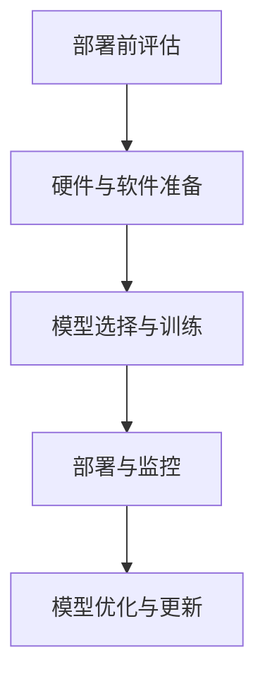
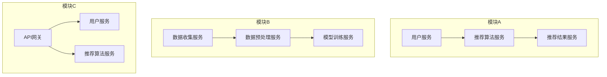

                 

# 机器学习模型部署与服务化

关键词：机器学习模型部署、服务化、自动化部署、容器化、微服务架构、API设计

摘要：本文将深入探讨机器学习模型的部署与服务化，从概述、模型准备与评估、部署策略、模型监控与优化、服务化架构设计、案例研究及未来展望等方面进行详细讲解，旨在为读者提供一套完整的机器学习模型部署与服务化实践指南。

## 第一部分：引言

### 第1章：机器学习模型部署与服务化概述

#### 1.1 机器学习模型部署的重要性

**背景介绍**：

随着人工智能技术的快速发展，机器学习模型已成为众多领域的重要工具。然而，从实验室到生产环境的模型部署过程却面临诸多挑战。有效的模型部署不仅有助于提高模型性能，还能降低维护成本，实现更高效的资源利用。

**问题背景**：

机器学习模型的部署涉及多个方面，包括模型准备、环境配置、性能优化等。如何确保模型在生产环境中稳定运行，同时保持高效和可扩展性，成为亟待解决的问题。

**问题描述**：

在当前技术环境中，机器学习模型的部署面临着以下问题：

1. **环境不一致性**：生产环境与开发环境的不一致可能导致模型性能下降。
2. **性能瓶颈**：模型在部署过程中可能遇到计算资源不足、响应速度慢等问题。
3. **安全与合规**：在部署过程中需要考虑数据安全、隐私保护等合规问题。

**问题解决**：

通过研究并应用先进的部署技术，如容器化、微服务架构等，可以有效解决上述问题。此外，实施严格的监控与优化策略，能够确保模型在部署后持续稳定运行。

**边界与外延**：

机器学习模型部署不仅涉及技术层面，还包括业务层面，如服务化的实现、自动化部署等。这些方面对于提升模型部署的效率和效果至关重要。

**概念结构与核心要素组成**：

- **模型准备**：包括模型选择、数据预处理和模型训练。
- **部署策略**：包括硬件与软件环境准备、部署模式选择、安全性与合规性。
- **模型监控与优化**：实时监控、日志分析、性能监控、模型更新与调参。

#### 1.2 服务化的概念与优势

**核心概念**：

服务化（Service-Oriented Architecture，SOA）是一种设计思想，将系统功能划分为多个独立的服务模块，通过接口进行通信，以实现模块化、解耦和高度可扩展的系统架构。

**概念属性特征对比表格**：

| 特征 | 服务化 | 传统架构 |
| --- | --- | --- |
| 模块化 | 高 | 低 |
| 解耦 | 高 | 低 |
| 扩展性 | 高 | 低 |
| 维护性 | 高 | 低 |

**ER实体关系图架构的 Mermaid 流程图**：

```mermaid
erDiagram
  ServiceA &&<<实体>> ModelDeployment
  ServiceB &&<<实体>> ModelEvaluation
  ServiceC &&<<实体>> ModelMonitoring
  ServiceA ||--|>> ServiceB : 部署与评估关系
  ServiceB ||--|>> ServiceC : 评估与监控关系
```

#### 1.3 机器学习模型部署与服务的挑战

**算法原理讲解**：

机器学习模型部署过程中，存在以下挑战：

1. **异构环境**：不同硬件和软件环境之间的差异可能导致模型部署困难。
2. **计算资源限制**：生产环境中的计算资源有限，如何充分利用资源成为关键问题。
3. **数据隐私与安全**：在部署过程中需要确保数据的安全性和隐私保护。

**数学公式**：

$$
P(\text{成功部署}) = \frac{\text{有效模型数}}{\text{总模型数}} \times \text{部署成功率}
$$

**算法流程图**：



**系统分析与架构设计方案**：

**问题场景介绍**：

假设一个企业需要将机器学习模型部署到生产环境中，以提供实时推荐服务。

**项目介绍**：

项目名为“智能推荐系统”，目标是根据用户行为数据，为用户推荐个性化的商品。

**系统功能设计（领域模型Mermaid类图）**：

```mermaid
classDiagram
  User <<类>> {
    id: 用户ID
    name: 用户名
    behavior: 用户行为数据
  }
  Product <<类>> {
    id: 商品ID
    name: 商品名称
    category: 商品分类
  }
  Recommendation <<类>> {
    userId: 用户ID
    productId: 商品ID
    score: 推荐分数
  }
  User ..|> Recommendation : 用户推荐关系
  Product ..|> Recommendation : 商品推荐关系
```

**系统架构设计（Mermaid架构图）**：



**系统接口设计和系统交互（Mermaid序列图）**：

```mermaid
sequenceDiagram
  User ->> G1[发起请求]
  G1 ->> H1[处理请求]
  H1 ->> D1[收集用户数据]
  D1 ->> E1[预处理数据]
  E1 ->> F1[训练模型]
  F1 ->> C1[生成推荐结果]
  C1 ->> G1[返回结果]
  G1 ->> User[返回推荐结果]
```

## 第二部分：机器学习模型部署

### 第2章：模型准备与评估

#### 2.1 模型准备

**模型选择**：

根据业务需求，选择适合的机器学习模型。例如，对于推荐系统，可以采用协同过滤、矩阵分解等方法。

**数据预处理**：

对原始数据进行清洗、归一化、缺失值填充等处理，以提高模型的训练效果。

**模型训练**：

使用训练数据对模型进行训练，通过调整参数和优化算法，使模型达到较高的准确率。

#### 2.2 模型评估

**评估指标**：

常用的评估指标包括准确率、召回率、F1值等。根据业务需求选择合适的评估指标。

**交叉验证**：

通过交叉验证方法，评估模型在不同数据集上的表现，以提高模型的泛化能力。

**评估流程**：

1. 数据集划分：将数据集划分为训练集、验证集和测试集。
2. 模型训练：使用训练集训练模型。
3. 模型评估：使用验证集和测试集评估模型性能。
4. 模型优化：根据评估结果调整模型参数，优化模型性能。

### 第3章：模型部署策略

#### 3.1 部署前的准备工作

**硬件与软件环境**：

确保部署环境与开发环境一致，以避免模型性能下降。

**部署模式选择**：

根据业务需求，选择合适的部署模式，如单机部署、分布式部署等。

**安全性与合规性**：

确保数据安全、隐私保护，遵守相关法律法规。

#### 3.2 部署方法

**容器化部署**：

使用容器化技术（如Docker），将模型和环境打包成一个可移植的容器，实现跨平台部署。

**微服务架构**：

采用微服务架构，将模型部署为独立的微服务，实现模块化、解耦和高效扩展。

**云服务部署**：

利用云服务（如AWS、Azure等），实现模型的弹性部署和资源优化。

### 第4章：模型监控与优化

#### 4.1 模型监控

**实时监控**：

实时监控模型性能、资源使用情况，及时发现并处理异常。

**日志分析**：

通过日志分析，了解模型运行状态，发现问题并进行优化。

**性能监控**：

监控模型响应时间、吞吐量等性能指标，确保模型稳定运行。

#### 4.2 模型优化

**模型更新**：

定期更新模型，以适应新的数据分布和业务需求。

**模型调参**：

调整模型参数，优化模型性能。

**模型压缩**：

使用模型压缩技术，降低模型体积，提高模型部署效率。

## 第三部分：服务化机器学习模型

### 第5章：API设计与实现

#### 5.1 API设计原则

**RESTful API**：

遵循RESTful架构风格，实现简洁、易用的API。

**GraphQL API**：

提供灵活的查询语言，支持复杂查询，提高API效率。

**API安全性**：

采用安全认证、权限控制等措施，确保API的安全性。

#### 5.2 API实现

**使用Flask**：

Flask是一个轻量级的Web框架，适合实现简单的API服务。

**使用Django**：

Django是一个全栈Web框架，提供丰富的功能，适合构建复杂API。

**使用FastAPI**：

FastAPI是一个高性能的Web框架，支持异步编程，适合构建高性能API。

### 第6章：服务化机器学习模型架构

#### 6.1 服务化机器学习模型架构设计

**微服务架构**：

采用微服务架构，将机器学习模型分解为多个微服务，实现模块化和解耦。

**负载均衡**：

实现负载均衡，确保模型服务的高可用性。

**分布式服务**：

采用分布式服务架构，实现模型的横向扩展和弹性部署。

#### 6.2 容器化与自动化部署

**Docker与Kubernetes**：

使用Docker容器化技术，将模型和服务打包为容器。使用Kubernetes进行容器编排，实现自动化部署和管理。

**CI/CD流程**：

实施持续集成和持续交付流程，实现模型和服务的自动化部署和持续优化。

**自动化运维**：

通过自动化运维工具，实现模型服务的监控、优化和故障处理。

### 第7章：案例研究

#### 7.1 案例一：实时推荐系统

**需求分析**：

分析实时推荐系统的需求，包括数据收集、模型训练、API设计与实现等。

**模型部署**：

部署实时推荐系统的模型，包括容器化部署和微服务架构的实施。

**API设计与实现**：

设计并实现实时推荐系统的API，包括RESTful API和GraphQL API。

#### 7.2 案例二：智能问答系统

**需求分析**：

分析智能问答系统的需求，包括问答场景、数据预处理、模型训练等。

**模型部署**：

部署智能问答系统的模型，包括容器化部署和微服务架构的实施。

**API设计与实现**：

设计并实现智能问答系统的API，包括RESTful API和GraphQL API。

## 第四部分：未来展望与最佳实践

### 第8章：未来发展趋势

**自动化与智能化部署**：

随着人工智能技术的进步，自动化和智能化部署将成为趋势。例如，基于AI的自动化模型选择和调参。

**大模型与定制化服务**：

大模型的兴起，如GPT-3等，将推动定制化服务的发展。用户可以根据自身需求，定制化模型和算法。

**人工智能伦理与法律法规**：

随着人工智能技术的应用，伦理和法律法规问题日益突出。需要制定相关法规，确保人工智能技术的健康发展。

### 第9章：最佳实践与总结

**部署与服务的最佳实践**：

1. **统一环境配置**：确保开发环境与生产环境的一致性。
2. **安全性与合规性**：加强数据安全保护，遵守相关法律法规。
3. **自动化与智能化**：采用自动化工具，提高部署和服务的效率。

**注意事项与挑战**：

1. **资源调度**：合理分配计算资源，避免资源浪费。
2. **数据隐私**：在部署过程中确保数据隐私，防止数据泄露。
3. **持续优化**：定期对模型和服务进行优化，提高性能和稳定性。

**拓展阅读与资源**：

- 《深度学习》（Goodfellow, Bengio, Courville著）
- 《Python机器学习》（Pedregosa et al.著）
- 《Kubernetes权威指南》（Jesse Lockhart et al.著）
- 《Docker深度实践》（张陈帆著）

## 结语

作者：AI天才研究院/AI Genius Institute & 禅与计算机程序设计艺术 /Zen And The Art of Computer Programming

本文系统地介绍了机器学习模型部署与服务化的核心概念、方法和实践。通过本文的阅读，读者可以全面了解机器学习模型部署与服务化的全过程，为实际项目提供有益的参考。在未来的工作中，我们期待与读者共同探索人工智能领域的更多可能。

