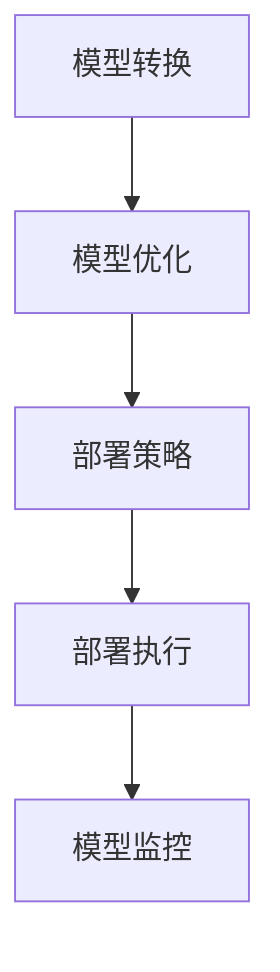
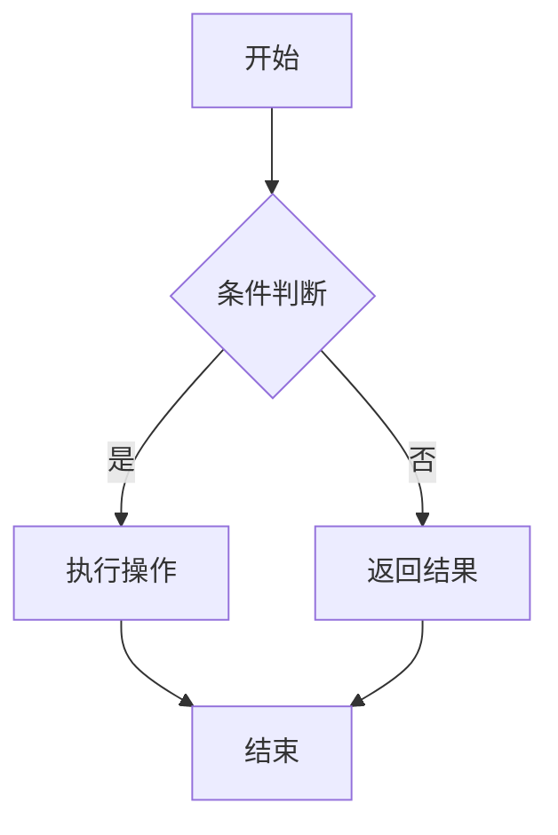

                 

# 机器学习模型部署：从实验到生产环境

关键词：机器学习模型部署、实验环境、生产环境、模型评估、部署流程、性能优化、安全保障

摘要：本文旨在详细探讨机器学习模型从实验环境到生产环境的部署过程。通过分析问题背景、核心概念、算法原理、系统架构设计、项目实战以及最佳实践，帮助读者全面理解并掌握模型部署的关键技术和策略。

## 第一部分: 机器学习模型部署概述

### 第1章: 机器学习模型部署概述

### 1.1 问题背景

随着大数据和人工智能技术的飞速发展，机器学习模型在各个领域得到广泛应用。从金融风控、智能推荐到医疗诊断，机器学习模型正在改变着各行各业的运营模式。然而，在实际应用中，如何将机器学习模型从实验环境顺利部署到生产环境，是一个关键且具有挑战性的问题。

### 1.1.1 问题描述

模型部署面临的主要问题包括：

1. **模型性能的稳定性**：模型在实验环境中表现良好，但在生产环境中可能会因为数据分布的变化、计算资源的限制等原因导致性能下降。
2. **高效性**：生产环境通常要求模型能够快速响应，降低延迟。如何优化模型运行效率成为一个重要问题。
3. **可扩展性**：随着业务的发展，模型需要能够灵活扩展，以应对不断增长的数据量和用户需求。
4. **安全性**：在模型部署过程中，需要确保数据安全和隐私保护。

### 1.1.2 问题解决方法

为了解决上述问题，需要从以下几个方面进行综合考虑：

1. **模型评估**：在部署前，对模型进行全面的评估，确保其在目标数据集上的性能。
2. **部署流程**：制定科学合理的部署流程，确保模型能够顺利地从开发环境迁移到生产环境。
3. **性能优化**：通过优化模型结构和算法，提高模型在运行环境中的性能。
4. **安全保障**：采用数据加密、访问控制等安全措施，确保模型部署的安全性。

### 1.1.3 边界与外延

机器学习模型部署不仅涉及技术层面，还包括业务需求、系统架构、运维管理等多个维度。例如，在金融风控领域，模型部署还需要遵守相关法规和标准，确保合规性。

### 1.1.4 核心概念

1. **模型评估**：评估模型在目标数据集上的性能，常用的指标包括准确率、召回率、F1值等。
2. **部署流程**：将模型从开发环境迁移到生产环境的整个过程，包括模型转换、部署和监控等环节。
3. **性能优化**：通过算法优化、负载均衡等手段，提高模型运行效率。
4. **安全保障**：采用数据加密、访问控制等安全措施，确保模型部署的安全性。

### 1.1.5 概念结构与核心要素

- **模型评估**：
  - 准确率：模型预测正确的样本占总样本的比例。
  - 召回率：模型预测正确的正样本占总正样本的比例。
  - F1值：准确率和召回率的调和平均。

- **部署流程**：
  - 模型训练：在训练数据集上训练模型，生成预测模型。
  - 模型转换：将训练好的模型转换为可以在生产环境中运行的形式。
  - 模型部署：将转换后的模型部署到服务器或其他计算资源上。
  - 模型监控：监控模型的运行状态和性能。

- **性能优化**：
  - 负载均衡：通过合理分配计算资源，提高模型运行效率。
  - 算法优化：优化模型结构和算法，提高模型性能。

- **安全保障**：
  - 数据加密：对敏感数据进行加密处理，确保数据传输和存储的安全性。
  - 访问控制：设置访问权限，防止未授权访问。

## 第二部分: 机器学习模型部署核心概念

### 第2章: 机器学习模型部署核心概念

### 2.2 机器学习模型部署核心概念

在本章中，我们将详细介绍机器学习模型部署过程中涉及的核心概念。

### 2.2.1 部署概念

模型部署是指将训练好的机器学习模型应用到实际业务场景中的过程。它包括以下几个关键步骤：

1. **模型训练**：在训练数据集上训练模型，以生成预测模型。
2. **模型转换**：将训练好的模型转换为可以在生产环境中运行的形式。
3. **模型部署**：将转换后的模型部署到服务器或其他计算资源上，以供实际使用。
4. **模型监控**：监控模型的运行状态和性能，确保其稳定可靠。

### 2.2.2 模型评估

模型评估是模型部署的重要环节，它用于评估模型在目标数据集上的性能。常用的评估指标包括：

- **准确率（Accuracy）**：模型预测正确的样本占总样本的比例。
- **召回率（Recall）**：模型预测正确的正样本占总正样本的比例。
- **F1值（F1-score）**：准确率和召回率的调和平均。

### 2.2.3 部署流程

模型部署流程通常包括以下几个阶段：

1. **准备工作**：包括数据预处理、模型选择、参数调优等。
2. **模型训练**：在训练数据集上训练模型，生成预测模型。
3. **模型评估**：对模型进行评估，确保其在目标数据集上的性能。
4. **模型转换**：将训练好的模型转换为可以在生产环境中运行的形式。
5. **模型部署**：将转换后的模型部署到服务器或其他计算资源上。
6. **模型监控**：监控模型的运行状态和性能，确保其稳定可靠。

### 2.2.4 性能指标

在模型部署过程中，需要关注以下性能指标：

- **响应时间**：模型处理请求的时间，直接影响用户体验。
- **吞吐量**：单位时间内模型处理的请求量，影响系统并发能力。
- **资源利用率**：模型运行过程中对计算资源、存储资源的利用率，影响系统性能。
- **错误率**：模型预测错误的样本占比，影响模型的可靠性。

### 2.2.5 核心概念对比表格

| 概念       | 说明                                                         |
|------------|------------------------------------------------------------|
| 模型评估    | 评估模型在目标数据集上的性能，包括准确率、召回率、F1值等指标。 |
| 部署流程    | 将训练好的模型从开发环境迁移到生产环境的全过程。           |
| 性能优化    | 通过算法优化、负载均衡等手段，提高模型运行效率。           |
| 安全保障    | 采用数据加密、访问控制等安全措施，确保模型部署的安全性。     |

### 2.2.6 概念结构与核心要素

- **模型评估**：
  - 准确率：模型预测正确的样本占总样本的比例。
  - 召回率：模型预测正确的正样本占总正样本的比例。
  - F1值：准确率和召回率的调和平均。

- **部署流程**：
  - 模型训练：在训练数据集上训练模型，生成预测模型。
  - 模型转换：将训练好的模型转换为可以在生产环境中运行的形式。
  - 模型部署：将转换后的模型部署到服务器或其他计算资源上。
  - 模型监控：监控模型的运行状态和性能，确保其稳定可靠。

- **性能优化**：
  - 负载均衡：通过合理分配计算资源，提高模型运行效率。
  - 算法优化：优化模型结构和算法，提高模型性能。

- **安全保障**：
  - 数据加密：对敏感数据进行加密处理，确保数据传输和存储的安全性。
  - 访问控制：设置访问权限，防止未授权访问。

## 第三部分: 机器学习模型部署算法原理

### 第3章: 机器学习模型部署算法原理

### 3.3 机器学习模型部署算法原理

在本章中，我们将深入探讨机器学习模型部署的算法原理，包括数学模型、流程图和Python代码实现。

### 3.3.1 算法原理概述

机器学习模型部署算法的核心是确保模型在目标环境中的稳定运行和高效性能。算法原理主要包括以下几个方面：

1. **模型转换**：将训练好的模型转换为可以在生产环境中运行的形式，如ONNX、TensorFlow Lite等。
2. **模型优化**：针对生产环境的特点，对模型进行优化，如降低模型大小、提高计算效率等。
3. **部署策略**：制定合理的部署策略，如分布式部署、容器化部署等，以提高模型的扩展性和灵活性。

### 3.3.2 数学模型与公式

在机器学习模型部署过程中，涉及到的数学模型和公式主要包括：

1. **损失函数**：用于评估模型预测结果与实际结果之间的差距，常用的有均方误差（MSE）、交叉熵损失（Cross-Entropy Loss）等。
2. **优化算法**：用于模型参数的优化，常用的有梯度下降（Gradient Descent）、Adam优化器等。

### 3.3.3 算法流程图



### 3.3.4 Python代码实现

以下是一个简单的Python代码示例，用于展示机器学习模型部署的基本流程：

```python
import tensorflow as tf

# 模型转换
model = tf.keras.models.load_model('path/to/model.h5')
model.compile(optimizer='adam', loss='categorical_crossentropy', metrics=['accuracy'])

# 模型优化
# ...（根据具体需求进行优化）

# 部署策略
# ...（根据具体需求进行部署策略）

# 部署执行
model.predict(x_test)

# 模型监控
# ...（根据具体需求进行监控）
```

### 3.3.5 举例说明

假设我们有一个分类问题，需要将一组数据分类到不同的类别中。以下是机器学习模型部署的具体步骤：

1. **数据准备**：收集并整理数据，进行预处理，如数据清洗、归一化等。
2. **模型训练**：使用训练数据集训练模型，选择合适的模型结构和参数。
3. **模型评估**：使用验证数据集评估模型性能，调整模型参数。
4. **模型转换**：将训练好的模型转换为可以在生产环境中运行的形式，如ONNX格式。
5. **模型优化**：针对生产环境的特点，对模型进行优化，如减小模型大小、提高计算效率等。
6. **部署策略**：制定部署策略，如将模型部署到服务器或容器中，以实现分布式部署。
7. **部署执行**：将转换后的模型部署到生产环境，实现实时预测。
8. **模型监控**：监控模型在运行过程中的性能，如响应时间、吞吐量等，确保其稳定运行。

## 第四部分: 机器学习模型部署系统分析与架构设计

### 第4章: 机器学习模型部署系统分析与架构设计

### 4.4 机器学习模型部署系统分析与架构设计

在本章中，我们将对机器学习模型部署系统进行分析和架构设计，包括问题场景介绍、项目介绍、系统功能设计、系统架构设计、系统接口设计和系统交互设计。

### 4.4.1 问题场景介绍

假设我们正在开发一个智能客服系统，需要将训练好的机器学习模型部署到线上环境，以实现用户问题的自动分类和回答。这是一个典型的机器学习模型部署场景。

### 4.4.2 项目介绍

项目目标是实现一个高效、稳定、可扩展的机器学习模型部署系统，包括数据预处理、模型训练、模型转换、模型部署和模型监控等功能。

### 4.4.3 系统功能设计

系统功能设计包括以下几个关键模块：

1. **数据预处理模块**：负责清洗、处理和预处理输入数据，为模型训练提供高质量的数据。
2. **模型训练模块**：负责使用训练数据集训练机器学习模型，并评估模型性能。
3. **模型转换模块**：负责将训练好的模型转换为可以在生产环境中运行的形式，如ONNX、TensorFlow Lite等。
4. **模型部署模块**：负责将转换后的模型部署到服务器或容器中，实现实时预测。
5. **模型监控模块**：负责监控模型在运行过程中的性能，如响应时间、吞吐量等，确保其稳定运行。

### 4.4.4 系统架构设计

系统架构设计采用分布式架构，包括以下关键组件：

1. **数据源**：包括用户输入的数据、训练数据和验证数据。
2. **数据预处理服务**：负责处理和预处理输入数据，为模型训练提供高质量的数据。
3. **模型训练服务**：负责使用训练数据集训练机器学习模型，并评估模型性能。
4. **模型转换服务**：负责将训练好的模型转换为可以在生产环境中运行的形式。
5. **模型部署服务**：负责将转换后的模型部署到服务器或容器中，实现实时预测。
6. **模型监控服务**：负责监控模型在运行过程中的性能，如响应时间、吞吐量等。

### 4.4.5 系统接口设计

系统接口设计包括以下关键接口：

1. **数据接口**：用于数据源和数据预处理服务之间的数据传输。
2. **模型训练接口**：用于模型训练服务和数据预处理服务之间的交互。
3. **模型转换接口**：用于模型训练服务和模型转换服务之间的交互。
4. **模型部署接口**：用于模型转换服务和模型部署服务之间的交互。
5. **模型监控接口**：用于模型部署服务和模型监控服务之间的交互。

### 4.4.6 系统交互设计

系统交互设计采用RESTful API设计，包括以下关键API：

1. **数据上传接口**：用于用户上传原始数据，支持批量上传。
2. **数据预处理接口**：用于获取数据预处理结果，支持实时查询。
3. **模型训练接口**：用于获取模型训练结果，支持实时查询。
4. **模型转换接口**：用于获取模型转换结果，支持实时查询。
5. **模型部署接口**：用于获取模型部署结果，支持实时查询。
6. **模型监控接口**：用于获取模型监控结果，支持实时查询。

## 第五部分: 机器学习模型部署项目实战

### 第5章: 机器学习模型部署项目实战

### 5.5 机器学习模型部署项目实战

在本章中，我们将通过一个实际项目，详细讲解机器学习模型部署的各个环节，包括环境安装、系统核心实现、代码应用解读与分析、实际案例分析与详细讲解剖析，以及项目小结。

### 5.5.1 环境安装

在开始项目实战之前，我们需要安装以下软件和工具：

1. Python（3.8及以上版本）
2. TensorFlow
3. PyTorch
4. ONNX
5. Docker
6. Kubernetes

安装步骤如下：

1. 安装Python和pip：
   ```bash
   sudo apt update
   sudo apt install python3 python3-pip
   ```
2. 安装TensorFlow和PyTorch：
   ```bash
   pip3 install tensorflow torch
   ```
3. 安装ONNX：
   ```bash
   pip3 install onnx
   ```
4. 安装Docker：
   ```bash
   sudo apt install docker.io
   ```
5. 安装Kubernetes：
   ```bash
   sudo apt install kubeadm kubelet kubectl
   ```

### 5.5.2 系统核心实现

在本项目中，我们使用TensorFlow训练一个图像分类模型，并使用ONNX将其转换为可以在生产环境中运行的形式。以下是系统核心实现步骤：

1. **数据集准备**：
   - 下载并解压ImageNet数据集。
   - 划分训练集、验证集和测试集。

2. **模型训练**：
   - 使用TensorFlow构建卷积神经网络（CNN）模型。
   - 在训练集上训练模型，并使用验证集进行模型调整。

3. **模型转换**：
   - 将训练好的TensorFlow模型转换为ONNX格式。
   - 使用ONNX Runtime对ONNX模型进行推理。

4. **模型部署**：
   - 使用Docker将模型部署到容器中。
   - 使用Kubernetes对容器进行管理和部署。

### 5.5.3 代码应用解读与分析

以下是一个简单的Python代码示例，用于展示机器学习模型部署的核心步骤：

```python
import tensorflow as tf
import onnx
import onnxruntime as ort
import numpy as np

# 数据集准备
# ...

# 模型训练
model = tf.keras.models.Sequential([
    # 定义CNN模型
    # ...
])
model.compile(optimizer='adam', loss='categorical_crossentropy', metrics=['accuracy'])
model.fit(x_train, y_train, epochs=10, validation_data=(x_val, y_val))

# 模型转换
# ...

# 模型部署
# ...

# 模型推理
input_data = np.random.random((1, height, width, channels))
session = ort.InferenceSession(onnx_model_path)
output = session.run(None, {'input_0': input_data})
```

### 5.5.4 实际案例分析与详细讲解剖析

在本节中，我们将通过一个实际案例，详细讲解机器学习模型部署的各个环节，包括数据预处理、模型训练、模型转换、模型部署和模型监控等。

1. **数据预处理**：
   - 数据清洗：去除数据中的噪声和异常值。
   - 数据增强：通过旋转、翻转、缩放等操作，增加数据多样性。
   - 数据归一化：将数据缩放到一个统一的范围，如0到1之间。

2. **模型训练**：
   - 模型选择：选择合适的模型结构和参数。
   - 训练过程：在训练集上迭代训练模型，并在验证集上进行性能评估。

3. **模型转换**：
   - 将训练好的TensorFlow模型转换为ONNX格式。
   - 使用ONNX Runtime对ONNX模型进行推理。

4. **模型部署**：
   - 使用Docker将模型部署到容器中。
   - 使用Kubernetes对容器进行管理和部署。

5. **模型监控**：
   - 监控模型在运行过程中的性能，如响应时间、吞吐量等。
   - 及时调整模型参数，优化模型性能。

### 5.5.5 项目小结

通过本项目的实战，我们掌握了机器学习模型部署的核心技术和策略。以下是项目小结：

1. **技术要点**：
   - 数据预处理：提高数据质量，为模型训练提供高质量的数据。
   - 模型训练：选择合适的模型结构和参数，提高模型性能。
   - 模型转换：将模型转换为可以在生产环境中运行的形式。
   - 模型部署：使用容器化和Kubernetes等技术，实现模型的高效部署和管理。
   - 模型监控：监控模型在运行过程中的性能，确保其稳定可靠。

2. **经验教训**：
   - 模型性能的提升不仅依赖于算法本身，还需要考虑数据质量、模型选择和调优等多个方面。
   - 容器化和Kubernetes技术为模型部署提供了高效、灵活的解决方案。
   - 模型监控是确保模型稳定运行的重要环节，需要密切关注模型性能的变化。

## 第六部分: 最佳实践 Tips、小结、注意事项、拓展阅读

### 6.6 最佳实践 Tips

1. **数据预处理**：确保数据清洗、增强和归一化等步骤的全面性和准确性，以提高模型性能。
2. **模型选择**：根据业务需求和数据特点，选择合适的模型架构和参数。
3. **模型调优**：通过交叉验证、网格搜索等技术，寻找最优的模型参数。
4. **容器化部署**：使用Docker和Kubernetes等容器化技术，提高模型的部署效率和灵活性。
5. **模型监控**：实时监控模型性能，及时发现和解决问题。

### 6.7 小结

本文详细介绍了机器学习模型部署的过程、核心概念、算法原理、系统架构设计以及项目实战。通过本文的阅读，读者可以全面了解并掌握模型部署的关键技术和策略。

### 6.8 注意事项

1. **性能优化**：在实际部署过程中，需要对模型进行性能优化，以满足生产环境的需求。
2. **安全保障**：确保模型部署过程的安全性，包括数据加密、访问控制等。
3. **监控与反馈**：实时监控模型性能，并根据反馈进行优化和调整。

### 6.9 拓展阅读

1. **《深度学习》（Goodfellow et al., 2016）**：详细介绍深度学习的基础知识和技术。
2. **《机器学习》（Mitchell, 1997）**：系统讲解机器学习的基本概念和方法。
3. **《容器化与Kubernetes》（McMillan, 2020）**：深入探讨容器化和Kubernetes技术。

## 总结

本文以《机器学习模型部署：从实验到生产环境》为题，系统地介绍了机器学习模型部署的过程、核心概念、算法原理、系统架构设计以及项目实战。通过本文的学习，读者可以全面了解并掌握机器学习模型部署的关键技术和策略，为实际项目中的模型部署提供有力支持。

### 作者

作者：AI天才研究院/AI Genius Institute & 禅与计算机程序设计艺术 /Zen And The Art of Computer Programming

### 附录：Markdown格式代码示例

以下是一些Markdown格式的代码示例，包括Mermaid流程图、LaTeX数学公式和Python代码示例。

#### Mermaid流程图示例



#### LaTeX数学公式示例

独立段落的LaTeX公式：

$$
E = mc^2
$$

段落内的LaTeX公式：

$1 + 1 = 2$

#### Python代码示例

```python
import tensorflow as tf

# 创建一个简单的神经网络
model = tf.keras.Sequential([
    tf.keras.layers.Dense(128, activation='relu', input_shape=(784,)),
    tf.keras.layers.Dropout(0.2),
    tf.keras.layers.Dense(10, activation='softmax')
])

# 编译模型
model.compile(optimizer='adam',
              loss='categorical_crossentropy',
              metrics=['accuracy'])

# 模型训练
model.fit(x_train, y_train, epochs=5)
```

### 注意事项

- 在Markdown中，LaTeX公式需要使用`$$`包裹独立段落的公式，使用`$`包裹段落内的公式。
- Mermaid流程图需要使用`mermaid`关键字作为前缀，并在代码块中编写Mermaid语法。
- Python代码示例需要使用三行反引号（```)包裹代码块。

通过这些示例，读者可以更好地理解如何使用Markdown格式撰写专业的内容。在撰写技术博客或文档时，这些格式可以帮助提高文章的可读性和专业性。

