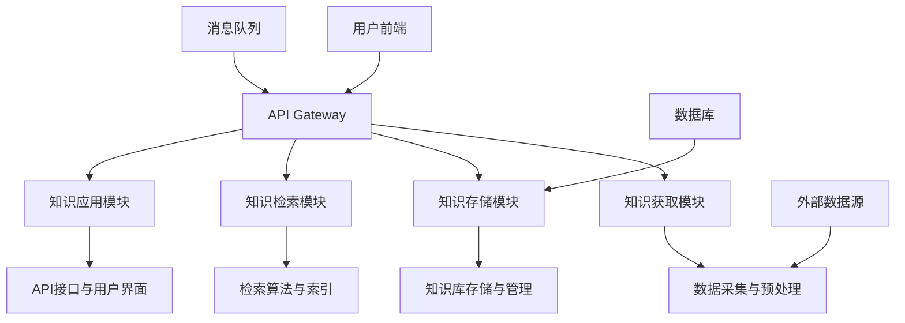
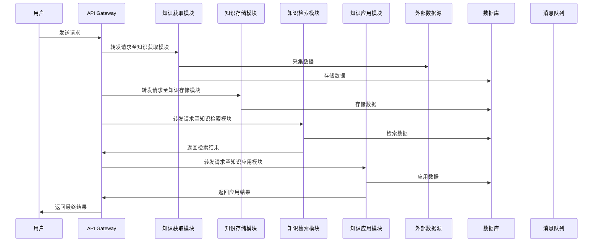

                 

# 《构建AI Agent的动态知识库管理系统》

> 关键词：AI Agent、动态知识库管理、算法原理、系统架构设计、项目实战

> 摘要：本文将深入探讨构建AI Agent的动态知识库管理系统的方法和步骤。通过分析AI Agent的核心概念、动态知识库管理系统的组成、算法原理、数学模型、系统架构设计、项目实战等方面，本文旨在为读者提供一套完整、系统、易于理解的技术指南，帮助读者掌握AI Agent动态知识库管理系统的构建方法和最佳实践。

## 第1章 问题背景与核心概念

### 1.1 问题背景

人工智能（AI）作为计算机科学的一个重要分支，已经广泛应用于各个领域。AI Agent作为一种智能体，具备自主决策、执行和适应环境的能力，正在成为人工智能研究的热点之一。然而，AI Agent在处理复杂问题时，面临着知识获取、知识存储、知识检索等一系列挑战。

动态知识库管理系统作为一种高效的知识管理工具，能够为AI Agent提供丰富的知识资源，提高其智能决策能力。然而，如何构建一个既能满足AI Agent需求，又能适应动态变化的知识库管理系统，仍然是一个亟待解决的问题。

### 1.2 核心概念

#### 1.2.1 AI Agent概述

AI Agent是指具备自主决策、执行和适应环境能力的智能体。它通常由感知模块、决策模块和执行模块三部分组成。感知模块负责获取外部环境的信息，决策模块根据感知信息生成动作计划，执行模块负责执行动作。

#### 1.2.2 动态知识库管理系统

动态知识库管理系统是一种能够实时更新、动态调整的知识库管理工具。它主要包括知识获取、知识存储、知识检索和知识应用等功能模块。动态知识库管理系统旨在为AI Agent提供丰富的知识资源，支持其自主学习和智能决策。

#### 1.2.3 知识库管理的关键技术

知识库管理的关键技术包括知识抽取、知识融合、知识检索和知识应用等。知识抽取是指从非结构化数据中提取有用信息的过程；知识融合是指将多个知识源中的知识进行整合的过程；知识检索是指根据用户需求快速查找相关知识的过程；知识应用是指将知识应用于实际场景，实现智能决策的过程。

## 第2章 核心概念与联系

### 2.1 AI Agent的组成结构

#### 2.1.1 感知模块

感知模块负责获取外部环境的信息，如文本、图像、声音等。感知模块通常采用机器学习、深度学习等算法，对感知信息进行预处理和特征提取。

#### 2.1.2 决策模块

决策模块根据感知模块提供的信息，生成动作计划。决策模块通常采用强化学习、决策树、神经网络等算法，实现对动作的选择。

#### 2.1.3 执行模块

执行模块负责执行决策模块生成的动作计划。执行模块通常与外部环境进行交互，如控制机器人执行特定任务等。

### 2.2 动态知识库管理系统的架构

#### 2.2.1 知识库的层次结构

动态知识库管理系统的知识库层次结构通常包括数据层、模型层和应用层。数据层负责存储原始数据，模型层负责对数据进行预处理、特征提取和知识融合，应用层负责将知识应用于实际场景。

#### 2.2.2 知识的获取、存储与更新机制

动态知识库管理系统需要具备高效的知识获取、存储与更新机制。知识获取可以通过爬虫、众包等方式实现；知识存储可以采用关系数据库、图数据库等；知识更新可以通过实时同步、定时同步等方式实现。

#### 2.2.3 知识的检索与应用

动态知识库管理系统需要提供高效的知识检索与应用功能。知识检索可以通过全文检索、关键词检索等方式实现；知识应用可以通过API接口、嵌入式模块等方式实现。

## 第3章 算法原理讲解

### 3.1 AI Agent的算法原理

#### 3.1.1 机器学习算法

机器学习算法是AI Agent的基础算法之一。常见的机器学习算法包括线性回归、决策树、支持向量机、神经网络等。这些算法通过学习输入数据与输出数据之间的关系，实现对未知数据的预测和分类。

#### 3.1.2 深度学习算法

深度学习算法是AI Agent的重要算法之一。深度学习算法通过多层神经网络对输入数据进行特征提取和分类。常见的深度学习算法包括卷积神经网络（CNN）、循环神经网络（RNN）、长短时记忆网络（LSTM）等。

#### 3.1.3 强化学习算法

强化学习算法是AI Agent的关键算法之一。强化学习算法通过与环境进行交互，学习最优策略。常见的强化学习算法包括Q学习、深度Q网络（DQN）、策略梯度算法等。

### 3.2 动态知识库管理算法

#### 3.2.1 知识抽取算法

知识抽取算法是指从非结构化数据中提取有用信息的过程。常见的知识抽取算法包括基于规则的方法、基于统计的方法、基于深度学习的方法等。

#### 3.2.2 知识融合算法

知识融合算法是指将多个知识源中的知识进行整合的过程。常见的知识融合算法包括基于投票的方法、基于相似度的方法、基于图的融合方法等。

#### 3.2.3 知识检索算法

知识检索算法是指根据用户需求快速查找相关知识的过程。常见的知识检索算法包括基于关键词检索、基于向量检索、基于语义检索等方法。

## 第4章 数学模型与公式讲解

### 4.1 AI Agent的数学模型

#### 4.1.1 神经网络模型

神经网络模型是AI Agent的核心数学模型之一。神经网络模型通过多层神经元对输入数据进行特征提取和分类。神经网络模型的数学表示如下：

$$
\begin{aligned}
    f(x) &= \sigma(\text{weights} \cdot x + \text{bias}) \\
    \text{weights} &= \begin{bmatrix}
        w_{11} & w_{12} & \dots & w_{1n} \\
        w_{21} & w_{22} & \dots & w_{2n} \\
        \vdots & \vdots & \ddots & \vdots \\
        w_{m1} & w_{m2} & \dots & w_{mn}
    \end{bmatrix} \\
    \text{bias} &= \begin{bmatrix}
        b_1 \\
        b_2 \\
        \vdots \\
        b_m
    \end{bmatrix} \\
    \sigma &= \text{激活函数}
\end{aligned}
$$

#### 4.1.2 贝叶斯模型

贝叶斯模型是AI Agent的重要数学模型之一。贝叶斯模型通过概率推理实现对未知数据的预测和分类。贝叶斯模型的数学表示如下：

$$
\begin{aligned}
    P(H|D) &= \frac{P(D|H)P(H)}{P(D)} \\
    P(H) &= \text{先验概率} \\
    P(D|H) &= \text{似然函数} \\
    P(D) &= \text{边缘概率}
\end{aligned}
$$

### 4.2 动态知识库管理的数学模型

#### 4.2.1 知识库的更新策略

知识库的更新策略是动态知识库管理的重要数学模型之一。知识库的更新策略主要包括基于规则的更新策略、基于数据的更新策略和基于模型的更新策略等。以下是一个基于数据的更新策略示例：

$$
\begin{aligned}
    \text{更新策略} &= \text{阈值策略} \\
    \text{if} \ \text{知识库中某条知识的更新频率} > \text{阈值} \ \text{then} \\
    & \ \text{更新该条知识} \\
    \text{else} \\
    & \ \text{保持原知识库不变}
\end{aligned}
$$

#### 4.2.2 知识的权重计算

知识的权重计算是动态知识库管理的重要数学模型之一。知识的权重计算可以基于知识的更新频率、知识的引用次数等因素。以下是一个基于更新频率的权重计算示例：

$$
\begin{aligned}
    w_i &= \frac{\text{知识}i\ \text{的更新频率}}{\sum_{j=1}^{n}\text{知识}j\ \text{的更新频率}} \\
    n &= \text{知识库中知识的总数}
\end{aligned}
$$

## 第5章 系统分析与架构设计

### 5.1 系统功能设计

#### 5.1.1 知识获取模块

知识获取模块负责从各种数据源中获取知识，如网页、数据库、文件等。知识获取模块需要实现数据采集、数据清洗、数据转换等功能。

#### 5.1.2 知识存储模块

知识存储模块负责将获取到的知识存储到知识库中。知识存储模块需要实现数据的持久化存储、索引和查询等功能。

#### 5.1.3 知识检索模块

知识检索模块负责根据用户需求快速查找相关知识。知识检索模块需要实现全文检索、关键词检索、语义检索等功能。

### 5.2 系统架构设计

#### 5.2.1 系统的整体架构

系统整体架构包括前端界面、后端服务、数据库和外部接口等部分。前端界面负责展示用户界面和交互功能；后端服务负责实现系统功能；数据库负责存储数据；外部接口负责与其他系统进行数据交互。

#### 5.2.2 系统的模块划分

系统的模块划分包括知识获取模块、知识存储模块、知识检索模块、用户管理模块等。每个模块负责实现特定的功能，模块之间通过接口进行通信。

#### 5.2.3 系统的数据流

系统数据流包括知识获取、知识存储、知识检索等环节。知识获取模块从数据源中获取知识，知识存储模块将知识存储到知识库中，知识检索模块根据用户需求查找相关知识。

## 第6章 项目实战

### 6.1 环境安装与配置

#### 6.1.1 软件环境安装

在本节中，我们将介绍如何安装和配置软件环境，包括Python、JDK、MySQL等。以下是一个简单的步骤示例：

1. 安装Python：
   ```bash
   sudo apt-get update
   sudo apt-get install python3-pip
   ```
2. 安装JDK：
   ```bash
   sudo apt-get install openjdk-8-jdk
   ```
3. 安装MySQL：
   ```bash
   sudo apt-get install mysql-server
   ```

#### 6.1.2 硬件环境配置

在本节中，我们将介绍如何配置硬件环境，包括CPU、内存、磁盘等。以下是一个简单的步骤示例：

1. 配置CPU：
   - 确保服务器有足够的CPU核心。
   - 如果需要，可以升级CPU。
2. 配置内存：
   - 确保服务器有足够的内存。
   - 如果需要，可以增加内存。
3. 配置磁盘：
   - 确保服务器有足够的磁盘空间。
   - 如果需要，可以增加磁盘容量或使用固态硬盘。

### 6.2 系统核心实现

在本节中，我们将介绍如何实现系统的核心功能，包括知识获取、知识存储、知识检索等。以下是一个简单的步骤示例：

#### 6.2.1 知识获取

1. 从网页中爬取知识：
   - 使用Python的requests库和BeautifulSoup库实现。
   - 示例代码：
     ```python
     import requests
     from bs4 import BeautifulSoup

     url = 'http://example.com'
     response = requests.get(url)
     soup = BeautifulSoup(response.content, 'html.parser')
     ```
2. 从数据库中获取知识：
   - 使用Python的pymysql库连接MySQL数据库。
   - 示例代码：
     ```python
     import pymysql

     connection = pymysql.connect(host='localhost', user='root', password='password', database='knowledge_db')
     cursor = connection.cursor()
     cursor.execute('SELECT * FROM knowledge')
     results = cursor.fetchall()
     ```

#### 6.2.2 知识存储

1. 将知识存储到MySQL数据库：
   - 使用Python的pymysql库插入数据到MySQL数据库。
   - 示例代码：
     ```python
     import pymysql

     connection = pymysql.connect(host='localhost', user='root', password='password', database='knowledge_db')
     cursor = connection.cursor()
     cursor.execute('INSERT INTO knowledge (title, content) VALUES (%s, %s)', ('Knowledge Title', 'Knowledge Content'))
     connection.commit()
     ```

#### 6.2.3 知识检索

1. 使用全文检索查找知识：
   - 使用Python的whoosh库实现全文检索。
   - 示例代码：
     ```python
     import whoosh.index
     from whoosh import scoring

     index = whoosh.index.open_dir('index_dir')
     search_results = index.search('knowledge query', scorer=scoring.TF_IDF())
     ```

### 6.3 实际案例分析

在本节中，我们将通过一个实际案例来分析如何构建AI Agent的动态知识库管理系统。以下是一个简单的案例：

#### 6.3.1 案例一：智能客服系统

1. 问题背景：
   - 公司需要一个智能客服系统来处理用户的咨询和问题。
   - 智能客服系统需要能够实时响应用户的问题，提供准确的答案。

2. 解决方案：
   - 使用Python构建一个AI Agent，负责处理用户的咨询和问题。
   - 使用动态知识库管理系统为AI Agent提供丰富的知识资源。
   - AI Agent通过知识库管理系统实时更新和扩充知识库。

3. 实施步骤：
   1. 安装和配置Python环境、JDK和MySQL数据库。
   2. 开发AI Agent的核心功能，包括知识获取、知识存储和知识检索。
   3. 开发智能客服系统的前端界面，实现用户与AI Agent的交互。
   4. 部署和运行智能客服系统，进行测试和优化。

#### 6.3.2 案例二：智能推荐系统

1. 问题背景：
   - 公司需要一个智能推荐系统来推荐产品或内容给用户。
   - 智能推荐系统需要能够根据用户的历史行为和兴趣进行个性化推荐。

2. 解决方案：
   - 使用Python构建一个AI Agent，负责处理用户的推荐请求。
   - 使用动态知识库管理系统为AI Agent提供丰富的用户行为和兴趣数据。
   - AI Agent通过知识库管理系统实时更新和扩充用户数据。

3. 实施步骤：
   1. 安装和配置Python环境、JDK和MySQL数据库。
   2. 开发AI Agent的核心功能，包括知识获取、知识存储和知识检索。
   3. 开发智能推荐系统的前端界面，实现用户与AI Agent的交互。
   4. 部署和运行智能推荐系统，进行测试和优化。

## 第7章 最佳实践与总结

### 7.1 最佳实践 tips

1. 选择合适的知识库管理工具：
   - 根据业务需求和数据规模，选择合适的知识库管理工具，如关系数据库、图数据库、搜索引擎等。
2. 设计合理的知识获取机制：
   - 根据业务需求，设计合理的知识获取机制，如自动化爬虫、人工标注、众包等。
3. 优化知识库更新策略：
   - 根据知识的重要性、更新频率等因素，优化知识库更新策略，确保知识库的实时性和准确性。

### 7.2 小结

本文详细介绍了构建AI Agent的动态知识库管理系统的方法和步骤。通过分析AI Agent的核心概念、动态知识库管理系统的组成、算法原理、数学模型、系统架构设计、项目实战等方面，本文为读者提供了一套完整、系统、易于理解的技术指南。

### 7.3 注意事项

1. 动态知识库管理系统需要根据业务需求进行定制化设计。
2. 在构建AI Agent的动态知识库管理系统时，需要充分考虑数据安全和隐私保护。
3. 动态知识库管理系统的性能优化和可扩展性设计至关重要。

### 7.4 拓展阅读

1. [《人工智能：一种现代方法》](https://book.douban.com/subject/26696936/)
2. [《深度学习》](https://book.douban.com/subject/26899660/)
3. [《强化学习》](https://book.douban.com/subject/26937575/)

## 作者信息

作者：AI天才研究院/AI Genius Institute & 禅与计算机程序设计艺术 /Zen And The Art of Computer Programming

## 结束语

本文旨在为读者提供一套关于构建AI Agent的动态知识库管理系统的全面指南。希望本文的内容对您在构建AI Agent的动态知识库管理系统过程中有所帮助。如果您有任何疑问或建议，欢迎在评论区留言，我们将持续为您解答。感谢您的阅读！## 第1章 问题背景与核心概念

### 1.1 问题背景

在当今信息技术飞速发展的时代，人工智能（AI）已经渗透到社会的各个领域，从医疗诊断、金融分析到智能客服、自动驾驶等。AI Agent作为AI的一个重要分支，因其具备自主决策、执行和适应环境的能力而备受关注。AI Agent能够模拟人类的思维过程，解决复杂问题，并能在动态变化的环境中自主学习和进化。

然而，AI Agent在实现高效决策和智能行为时，面临着知识获取、知识存储、知识检索等一系列挑战。如何构建一个能够动态更新、适应性强、可靠性高的知识库管理系统，为AI Agent提供持续有效的知识支持，成为了当前AI研究中的一个重要课题。

动态知识库管理系统（Dynamic Knowledge Base Management System，DKBMS）正是为了解决这一问题而提出的一种高效的知识管理工具。它通过实时更新、动态调整，为AI Agent提供丰富的知识资源，从而提高其智能决策能力和适应环境的能力。DKBMS的核心在于知识获取、知识存储、知识检索和知识应用，其设计理念是实现知识的动态性、灵活性和实时性。

### 1.2 核心概念

#### 1.2.1 AI Agent概述

AI Agent是一种具备自主决策、执行和适应环境能力的智能体。它通常由三个主要模块组成：感知模块、决策模块和执行模块。

1. **感知模块**：负责从外部环境中获取信息，如文本、图像、声音等。感知模块是实现AI Agent与环境交互的重要环节，其性能直接影响到AI Agent的感知质量和响应速度。

2. **决策模块**：根据感知模块提供的信息，AI Agent需要通过决策模块生成相应的动作计划。决策模块通常采用机器学习、深度学习、强化学习等算法，以实现复杂的决策过程。

3. **执行模块**：执行决策模块生成的动作计划，实现具体的任务执行。执行模块需要与外部环境进行实时交互，确保AI Agent能够有效地执行任务。

AI Agent的工作流程可以概括为：感知→决策→执行，这三个模块相互协作，共同实现AI Agent的智能行为。

#### 1.2.2 动态知识库管理系统

动态知识库管理系统（DKBMS）是一种高效的知识管理工具，能够为AI Agent提供实时更新、动态调整的知识资源。DKBMS的核心功能包括知识获取、知识存储、知识检索和知识应用。

1. **知识获取**：DKBMS需要从各种数据源中获取知识，如网页、数据库、文件等。知识获取可以通过自动化爬虫、人工标注、众包等方式实现。

2. **知识存储**：DKBMS需要将获取到的知识存储到知识库中。知识存储可以采用关系数据库、图数据库等，以支持高效的查询和更新。

3. **知识检索**：DKBMS需要提供高效的知识检索功能，以满足用户对知识的需求。知识检索可以基于关键词检索、全文检索、语义检索等方式实现。

4. **知识应用**：DKBMS需要将知识应用于实际场景，实现智能决策。知识应用可以通过API接口、嵌入式模块等方式实现。

#### 1.2.3 知识库管理的关键技术

知识库管理的关键技术包括知识抽取、知识融合、知识检索和知识应用等。

1. **知识抽取**：知识抽取是从非结构化数据中提取有用信息的过程。知识抽取可以采用基于规则的方法、基于统计的方法、基于深度学习的方法等。

2. **知识融合**：知识融合是将多个知识源中的知识进行整合的过程。知识融合可以采用基于投票的方法、基于相似度的方法、基于图的融合方法等。

3. **知识检索**：知识检索是根据用户需求快速查找相关知识的过程。知识检索可以采用基于关键词检索、基于向量检索、基于语义检索等方法。

4. **知识应用**：知识应用是将知识应用于实际场景，实现智能决策的过程。知识应用可以采用API接口、嵌入式模块等方式实现。

在构建AI Agent的动态知识库管理系统时，需要充分考虑这些关键技术的应用，以提高系统的整体性能和实用性。

### 1.3 知识库管理系统的意义

动态知识库管理系统在AI Agent中的应用具有重要意义，主要体现在以下几个方面：

1. **提高决策能力**：通过动态知识库管理系统，AI Agent能够获取到最新的知识资源，从而提高决策的准确性和效率。

2. **适应性强**：动态知识库管理系统能够根据环境变化实时更新知识库，使AI Agent能够更好地适应动态变化的环境。

3. **减少人工干预**：动态知识库管理系统可以自动获取、更新和检索知识，减少人工干预，提高系统的自动化程度。

4. **降低维护成本**：动态知识库管理系统可以实现知识的集中管理和维护，降低系统的维护成本。

总之，构建AI Agent的动态知识库管理系统是提升AI Agent智能水平的重要手段，对于实现AI Agent的广泛应用具有重要意义。

### 1.4 研究目的与内容安排

本文的研究目的是深入探讨构建AI Agent的动态知识库管理系统的方法和步骤，为相关研究和实际应用提供参考。文章内容安排如下：

1. **第1章**：问题背景与核心概念，介绍AI Agent和动态知识库管理系统的基本概念。
2. **第2章**：核心概念与联系，分析AI Agent和动态知识库管理系统的组成结构和工作原理。
3. **第3章**：算法原理讲解，详细阐述AI Agent和动态知识库管理系统所涉及的关键算法。
4. **第4章**：数学模型与公式讲解，介绍相关的数学模型和公式。
5. **第5章**：系统分析与架构设计，探讨系统功能设计和架构设计方案。
6. **第6章**：项目实战，通过实际案例展示动态知识库管理系统的构建和应用。
7. **第7章**：最佳实践与总结，总结文章内容并提供实际应用中的最佳实践。

通过以上内容安排，本文旨在为读者提供一套完整、系统、易于理解的技术指南，帮助读者掌握构建AI Agent的动态知识库管理系统的方法和技巧。

## 第2章 核心概念与联系

### 2.1 AI Agent的组成结构

AI Agent是由多个功能模块组成的智能体，其核心在于通过感知、决策和执行来实现自主学习和适应环境的能力。理解AI Agent的组成结构对于构建动态知识库管理系统至关重要。

#### 2.1.1 感知模块

感知模块是AI Agent与外部环境交互的桥梁，负责从环境中获取信息。感知模块通常包括以下功能：

1. **数据采集**：感知模块需要从多种数据源（如图像、声音、文本等）中采集信息。
2. **特征提取**：感知模块需要对采集到的数据进行预处理，提取出有用的特征。
3. **异常检测**：感知模块需要具备异常检测能力，以便及时发现和处理环境中的异常情况。

感知模块的性能直接影响到AI Agent的感知质量和响应速度，因此在设计时需要考虑以下几个方面：

- **数据来源的多样性**：确保感知模块能够从不同的数据源中获取信息，以提高AI Agent的感知能力。
- **数据预处理**：对采集到的数据进行有效的预处理，以提高特征提取的准确性。
- **实时性**：感知模块需要具备高实时性，以快速响应环境中的变化。

#### 2.1.2 决策模块

决策模块是AI Agent的核心，负责根据感知模块提供的信息生成最优动作计划。决策模块通常包括以下功能：

1. **信息处理**：决策模块需要处理感知模块提供的信息，提取关键特征，并进行推理和决策。
2. **目标优化**：决策模块需要根据目标函数对多个可能的动作进行评估，选择最优动作。
3. **策略更新**：决策模块需要根据环境反馈不断更新策略，以适应环境变化。

决策模块的性能取决于所采用的算法和模型。常见的决策算法包括：

- **机器学习算法**：如线性回归、决策树、支持向量机等，适用于处理结构化数据。
- **深度学习算法**：如卷积神经网络（CNN）、循环神经网络（RNN）、长短时记忆网络（LSTM）等，适用于处理非结构化数据。
- **强化学习算法**：如Q学习、深度Q网络（DQN）、策略梯度等，适用于动态变化的复杂环境。

#### 2.1.3 执行模块

执行模块是AI Agent将决策模块生成的动作计划转化为实际操作的部分。执行模块通常包括以下功能：

1. **任务执行**：执行模块负责根据动作计划执行具体任务。
2. **反馈收集**：执行模块需要收集任务执行过程中的反馈信息，以供决策模块进行策略更新。
3. **异常处理**：执行模块需要具备异常处理能力，以便在任务执行过程中遇到问题时能够自动调整或重启。

执行模块的性能直接影响到AI Agent的执行效率和稳定性。在设计执行模块时，需要考虑以下几个方面：

- **执行速度**：确保执行模块能够快速执行任务，以减少响应时间。
- **执行精度**：确保执行模块能够准确执行任务，以避免错误和故障。
- **容错性**：确保执行模块在遇到问题时能够自动调整或重启，以提高系统的可靠性。

### 2.2 动态知识库管理系统的架构

动态知识库管理系统是AI Agent的核心组成部分，其设计直接影响AI Agent的智能水平和适应能力。动态知识库管理系统的架构通常包括数据层、模型层和应用层三个层次。

#### 2.2.1 数据层

数据层是动态知识库管理系统的基础，负责存储和管理各种数据。数据层通常包括以下功能：

1. **数据采集**：从各种数据源（如数据库、文件系统、网络等）中获取数据。
2. **数据存储**：将采集到的数据存储在数据库或文件系统中，以供后续处理和使用。
3. **数据清洗**：对采集到的数据进行清洗和预处理，去除无效数据、重复数据和错误数据。
4. **数据索引**：建立数据索引，以提高数据的检索效率和查询速度。

数据层的设计需要考虑以下几个方面：

- **数据源多样性**：确保数据层能够支持多种数据源，以满足不同场景的需求。
- **数据存储效率**：采用合适的存储方案，提高数据存储和检索的效率。
- **数据安全性**：确保数据存储的安全性，防止数据泄露和损坏。

#### 2.2.2 模型层

模型层是动态知识库管理系统的核心，负责对数据进行处理和分析，以生成知识库。模型层通常包括以下功能：

1. **数据预处理**：对采集到的数据进行预处理，包括特征提取、归一化、去噪等。
2. **知识抽取**：从预处理后的数据中提取出有用的知识，包括实体识别、关系抽取、事件抽取等。
3. **知识融合**：将来自不同数据源的知识进行整合，构建一个统一的、完整的知识库。
4. **知识更新**：根据新的数据不断更新知识库，以保持知识库的实时性和准确性。

模型层的设计需要考虑以下几个方面：

- **算法选择**：选择适合特定任务和数据集的算法，以提高知识抽取和融合的准确性。
- **计算效率**：优化算法和模型，提高知识抽取和融合的效率。
- **知识表示**：采用合适的知识表示方法，以提高知识库的可扩展性和可理解性。

#### 2.2.3 应用层

应用层是动态知识库管理系统的接口，负责将知识库应用于实际场景，实现智能决策和执行。应用层通常包括以下功能：

1. **知识检索**：根据用户需求快速查找相关知识，包括关键词检索、全文检索、语义检索等。
2. **知识应用**：将检索到的知识应用于实际场景，实现智能决策和执行。
3. **用户交互**：提供用户界面，方便用户与系统进行交互，包括查询知识、提交任务等。

应用层的设计需要考虑以下几个方面：

- **用户友好性**：设计简洁、直观的用户界面，方便用户使用。
- **响应速度**：优化系统性能，提高响应速度，确保用户体验。
- **系统兼容性**：确保系统能够支持多种设备和平台，以提高系统的可用性。

### 2.3 AI Agent与动态知识库管理系统的联系

AI Agent与动态知识库管理系统之间存在紧密的联系，两者相辅相成，共同实现智能决策和执行。

1. **知识获取与感知**：动态知识库管理系统通过数据层从各种数据源中获取知识，感知模块从外部环境中获取信息，两者共同为AI Agent提供数据支持和感知基础。
2. **知识处理与决策**：动态知识库管理系统通过模型层对数据进行处理和分析，提取出有用的知识，这些知识被决策模块用于生成最优动作计划，从而实现智能决策。
3. **知识应用与执行**：动态知识库管理系统通过应用层将知识应用于实际场景，执行模块根据决策模块生成的动作计划进行任务执行，实现智能行为。

总之，AI Agent与动态知识库管理系统通过数据流和功能协同，形成一个完整的智能系统，共同实现智能决策和执行。理解这两者之间的联系对于构建高效、智能的AI系统具有重要意义。

### 2.4 动态知识库管理系统的工作原理

动态知识库管理系统（DKBMS）的工作原理可以分为数据采集、知识抽取、知识融合、知识存储和知识检索五个主要环节，这些环节相互关联，共同构成DKBMS的运行机制。

#### 2.4.1 数据采集

数据采集是DKBMS的起点，负责从各种数据源（如网络、数据库、传感器等）中获取原始数据。数据采集的关键在于确保数据的全面性和准确性。常见的采集方式包括：

1. **自动采集**：使用自动化工具（如爬虫、API接口等）定期从网络上获取数据。
2. **手动采集**：通过人工方式（如问卷调查、访谈等）获取数据。
3. **传感器采集**：使用传感器设备（如摄像头、麦克风等）实时收集环境数据。

#### 2.4.2 知识抽取

知识抽取是从原始数据中提取出有价值信息的过程。知识抽取的关键在于如何从海量数据中筛选出关键信息，并将其转化为结构化的知识。常见的知识抽取方法包括：

1. **基于规则的方法**：使用预定义的规则对数据进行分类和标注。
2. **基于统计的方法**：通过计算数据之间的统计关系和模式进行知识抽取。
3. **基于深度学习的方法**：利用神经网络模型对数据进行分析和分类。

#### 2.4.3 知识融合

知识融合是将来自不同数据源、不同格式的知识进行整合，构建一个统一、完整的知识库的过程。知识融合需要解决多个问题，如数据冲突、数据冗余和知识不一致等。常见的知识融合方法包括：

1. **基于投票的方法**：对多个知识进行投票，选择多数意见作为最终知识。
2. **基于相似度的方法**：通过计算知识之间的相似度，选择最相似的知识进行融合。
3. **基于图的方法**：使用图结构对知识进行表示和融合，如知识图谱。

#### 2.4.4 知识存储

知识存储是将提取和融合后的知识存储到数据库或文件系统中，以便后续的查询和使用。知识存储需要考虑以下几个方面：

1. **存储结构**：选择合适的存储结构（如关系数据库、图数据库、键值存储等），以提高存储和检索的效率。
2. **数据索引**：建立数据索引，以提高查询的效率。
3. **数据安全性**：确保数据的安全性，防止数据泄露和损坏。

#### 2.4.5 知识检索

知识检索是根据用户需求快速查找相关知识的过程。知识检索需要提供高效的查询接口，支持各种检索方式，如关键词检索、全文检索、语义检索等。常见的知识检索方法包括：

1. **关键词检索**：根据用户输入的关键词，在知识库中查找相关的知识。
2. **全文检索**：对知识库中的所有内容进行全文搜索，查找包含指定关键词的知识。
3. **语义检索**：通过分析用户输入的语义，查找与语义相关的知识。

#### 2.4.6 动态调整与更新

动态知识库管理系统需要具备动态调整和更新能力，以适应环境变化和知识更新。动态调整和更新包括以下几个方面：

1. **实时更新**：根据新的数据源和用户需求，实时更新知识库。
2. **增量更新**：只更新知识库中发生变化的部分，以提高更新效率。
3. **版本控制**：对知识库的更新进行版本控制，确保知识的完整性和可追溯性。

总之，动态知识库管理系统通过数据采集、知识抽取、知识融合、知识存储和知识检索等环节，实现知识的动态获取、存储和应用，为AI Agent提供持续有效的知识支持。

### 2.5 知识库管理系统的核心要素

构建一个高效的动态知识库管理系统，需要关注以下几个核心要素：

1. **数据质量**：数据是知识库管理系统的基石，高质量的数据是构建知识库的基础。数据质量包括数据的准确性、完整性、一致性和时效性。

2. **知识抽取技术**：知识抽取技术是实现知识库管理系统价值的关键。高效的知识抽取技术能够从非结构化数据中提取出结构化的知识，提高知识库的丰富性和准确性。

3. **知识融合算法**：知识融合是将不同来源、不同格式的知识进行整合，构建一个统一的知识库的过程。高效的融合算法能够减少数据冗余、消除知识冲突，提高知识库的完整性和一致性。

4. **知识存储与检索**：知识存储与检索是知识库管理系统的重要功能。高效的存储与检索技术能够提高知识库的性能，满足用户快速查询知识的需求。

5. **知识更新机制**：知识库管理系统需要具备实时更新和动态调整能力，以适应环境变化和知识更新。有效的更新机制能够确保知识库的实时性和准确性。

6. **系统安全性**：确保知识库管理系统的安全性，防止数据泄露和未经授权的访问。系统安全性包括数据加密、访问控制、日志审计等。

### 2.6 动态知识库管理系统与传统知识库管理系统的对比

动态知识库管理系统与传统知识库管理系统在多个方面存在显著差异：

1. **更新频率**：动态知识库管理系统具备实时更新能力，能够根据环境变化和用户需求动态调整知识库，而传统知识库管理系统通常只能定期更新。

2. **知识范围**：动态知识库管理系统覆盖范围广泛，能够处理多种数据源和格式的知识，而传统知识库管理系统通常局限于特定领域和结构化数据。

3. **适应能力**：动态知识库管理系统具有较强的适应能力，能够快速调整以适应环境变化，而传统知识库管理系统在应对动态环境变化时较为困难。

4. **交互方式**：动态知识库管理系统提供多样化的交互方式，如API接口、Web界面等，方便用户进行查询和应用，而传统知识库管理系统通常仅提供简单的查询功能。

5. **性能要求**：动态知识库管理系统对性能要求更高，需要处理海量数据和高频次的查询操作，而传统知识库管理系统对性能要求相对较低。

### 2.7 动态知识库管理系统的发展趋势

随着人工智能和大数据技术的不断发展，动态知识库管理系统呈现出以下发展趋势：

1. **智能化**：动态知识库管理系统将越来越多地采用人工智能技术，如机器学习、深度学习等，以提高知识抽取、融合和检索的准确性。

2. **分布式**：动态知识库管理系统将逐渐采用分布式架构，以支持海量数据和大规模应用，提高系统的扩展性和可靠性。

3. **实时性**：动态知识库管理系统将更加注重实时性，通过优化算法和架构设计，提高数据采集、处理和更新的速度。

4. **开放性**：动态知识库管理系统将更加开放，支持与其他系统和平台的集成，提供丰富的API接口和开发工具，促进知识的共享和应用。

5. **安全性**：动态知识库管理系统将加强数据安全和隐私保护，采用加密、访问控制等技术，确保知识库的安全性和可靠性。

通过以上对AI Agent和动态知识库管理系统的核心概念与联系的深入分析，我们可以更好地理解这两者在构建AI Agent的动态知识库管理系统中的重要作用。在接下来的章节中，我们将进一步探讨算法原理、数学模型、系统架构设计等方面的内容，为读者提供更全面的技术指南。

## 第3章 算法原理讲解

### 3.1 AI Agent的算法原理

AI Agent的核心在于其智能决策和执行能力，而实现这一目标离不开各种算法的支撑。在本节中，我们将详细讲解AI Agent中常用的三种算法：机器学习算法、深度学习算法和强化学习算法。

#### 3.1.1 机器学习算法

机器学习算法是AI Agent的基础算法之一，它通过学习输入数据与输出数据之间的关系，实现对未知数据的预测和分类。常见的机器学习算法包括线性回归、决策树、支持向量机等。

1. **线性回归**：线性回归是一种用于回归分析的基本算法，通过拟合输入变量和输出变量之间的线性关系，实现对未知数据的预测。线性回归的数学模型如下：

   $$
   y = \beta_0 + \beta_1x_1 + \beta_2x_2 + \dots + \beta_nx_n
   $$

   其中，$y$是输出变量，$x_1, x_2, \dots, x_n$是输入变量，$\beta_0, \beta_1, \beta_2, \dots, \beta_n$是模型的参数。

   示例：假设我们有一个房价预测问题，输入变量是房屋的面积和房间数量，输出变量是房价。通过训练线性回归模型，我们可以预测未知房屋的价格。

2. **决策树**：决策树是一种树形结构，用于分类和回归分析。决策树通过一系列的决策规则，将数据集划分为不同的子集，直到满足特定的停止条件。决策树的每个节点表示一个特征，每个分支表示该特征的一个可能值。决策树的构建过程包括：

   - **特征选择**：选择具有最大信息增益或最大基尼指数的特征。
   - **节点划分**：根据选定的特征，将数据集划分为不同的子集。
   - **递归构建**：对每个子集，重复上述过程，直到满足停止条件（如最大深度、最小样本数等）。

   示例：假设我们有一个信用卡欺诈检测问题，输入变量是用户的交易金额、交易时间和地理位置等，输出变量是是否为欺诈交易。通过构建决策树模型，我们可以判断用户的交易是否为欺诈交易。

3. **支持向量机**：支持向量机（SVM）是一种用于分类和回归分析的基本算法，通过寻找最佳的超平面，将数据集划分为不同的类别。SVM的核心思想是最大化分类边界，同时确保分类边界尽可能接近训练数据点。

   $$
   \max_{\beta, \beta_0} \left\{ \frac{1}{2} ||\beta||^2 + C \sum_{i=1}^{n} \xi_i \right\}
   $$

   其中，$\beta$是模型参数，$\beta_0$是偏置项，$C$是惩罚参数，$\xi_i$是松弛变量。

   示例：假设我们有一个邮件分类问题，输入变量是邮件的内容，输出变量是邮件的类别（如垃圾邮件、正常邮件等）。通过训练SVM模型，我们可以分类新收到的邮件。

#### 3.1.2 深度学习算法

深度学习算法是AI Agent的重要算法之一，通过多层神经网络对输入数据进行特征提取和分类。常见的深度学习算法包括卷积神经网络（CNN）、循环神经网络（RNN）、长短时记忆网络（LSTM）等。

1. **卷积神经网络（CNN）**：卷积神经网络是一种用于图像处理和计算机视觉的深度学习算法。CNN通过卷积层、池化层和全连接层等网络结构，实现对图像的自动特征提取和分类。

   - **卷积层**：卷积层通过卷积操作提取图像的特征。
   - **池化层**：池化层用于降低特征图的维度，提高模型的计算效率。
   - **全连接层**：全连接层将卷积层和池化层提取的特征进行融合，实现最终的分类。

   示例：假设我们有一个图像分类问题，输入变量是图像，输出变量是图像的类别。通过训练CNN模型，我们可以对图像进行分类。

2. **循环神经网络（RNN）**：循环神经网络是一种用于序列数据的深度学习算法，通过隐藏状态和循环连接实现序列的记忆和建模。

   - **隐藏状态**：RNN通过隐藏状态保存上一时刻的信息。
   - **循环连接**：RNN通过循环连接将隐藏状态传递到下一时刻。

   示例：假设我们有一个语言模型问题，输入变量是文本序列，输出变量是下一个词语。通过训练RNN模型，我们可以预测文本序列中的下一个词语。

3. **长短时记忆网络（LSTM）**：长短时记忆网络是一种改进的RNN，通过引入门控机制解决长序列依赖问题。

   - **遗忘门**：遗忘门控制哪些信息需要被遗忘。
   - **输入门**：输入门控制哪些信息需要被记住。
   - **输出门**：输出门控制哪些信息需要被输出。

   示例：假设我们有一个时间序列预测问题，输入变量是时间序列数据，输出变量是下一个时间点的值。通过训练LSTM模型，我们可以预测时间序列中的下一个值。

#### 3.1.3 强化学习算法

强化学习算法是AI Agent的关键算法之一，通过与环境进行交互，学习最优策略。常见的强化学习算法包括Q学习、深度Q网络（DQN）、策略梯度等。

1. **Q学习**：Q学习是一种基于值函数的强化学习算法，通过学习状态-动作值函数，选择最优动作。

   $$
   Q(s, a) = r + \gamma \max_{a'} Q(s', a')
   $$

   其中，$s$是当前状态，$a$是当前动作，$r$是即时奖励，$\gamma$是折扣因子，$s'$是下一状态，$a'$是下一动作。

   示例：假设我们有一个自动驾驶问题，输入变量是车辆的状态，输出变量是车辆的动作（如加速、减速、转向等）。通过训练Q学习模型，我们可以让车辆学习最优驾驶策略。

2. **深度Q网络（DQN）**：深度Q网络是一种基于深度学习的Q学习算法，通过神经网络学习状态-动作值函数。

   - **经验回放**：DQN通过经验回放机制，将历史经验进行随机化，提高学习稳定性。
   - **目标网络**：DQN通过目标网络，将当前值函数与目标值函数进行对比，减少学习误差。

   示例：假设我们有一个游戏控制问题，输入变量是游戏的当前状态，输出变量是游戏的操作（如上下左右等）。通过训练DQN模型，我们可以让游戏角色学会玩这个游戏。

3. **策略梯度**：策略梯度是一种基于策略优化的强化学习算法，通过梯度下降方法，直接优化策略参数。

   $$
   \nabla_{\theta} J(\theta) = \nabla_{\theta} \sum_{t=0}^{T} \gamma^t r_t
   $$

   其中，$\theta$是策略参数，$J(\theta)$是策略损失函数，$r_t$是第$t$时刻的即时奖励。

   示例：假设我们有一个机器人控制问题，输入变量是机器人的状态，输出变量是机器人的动作。通过训练策略梯度模型，我们可以让机器人学会在复杂环境中自主移动。

### 3.2 动态知识库管理算法

动态知识库管理系统需要处理海量数据，并实时更新和优化知识库。在本节中，我们将介绍动态知识库管理中常用的三种算法：知识抽取算法、知识融合算法和知识检索算法。

#### 3.2.1 知识抽取算法

知识抽取算法是从非结构化数据中提取结构化知识的过程。知识抽取算法可以分为基于规则的方法、基于统计的方法和基于深度学习的方法。

1. **基于规则的方法**：基于规则的方法通过预定义的规则，将数据转换为结构化的知识。这种方法适用于规则明确、数据量较小的场景。

   - **实体识别**：通过规则识别文本中的实体，如人名、地名、组织名等。
   - **关系抽取**：通过规则识别文本中的实体关系，如人物关系、组织关系等。

   示例：假设我们有一个文本处理问题，输入变量是新闻报道，输出变量是新闻报道中的关键信息和关系。通过训练基于规则的方法，我们可以提取出新闻报道中的关键信息和关系。

2. **基于统计的方法**：基于统计的方法通过统计信息，如词频、词性标注等，提取出结构化的知识。这种方法适用于大规模文本处理。

   - **词性标注**：通过统计词性标注，将文本中的词语分类为名词、动词、形容词等。
   - **命名实体识别**：通过统计词频和词性标注，识别文本中的命名实体。

   示例：假设我们有一个文本分类问题，输入变量是文本，输出变量是文本的类别。通过训练基于统计的方法，我们可以分类文本的类别。

3. **基于深度学习的方法**：基于深度学习的方法通过神经网络，自动学习数据的结构化特征。这种方法适用于大规模文本处理和复杂关系抽取。

   - **卷积神经网络（CNN）**：通过卷积神经网络，提取文本的局部特征，实现实体识别和关系抽取。
   - **长短时记忆网络（LSTM）**：通过长短时记忆网络，提取文本的长期特征，实现实体识别和关系抽取。

   示例：假设我们有一个文本关系抽取问题，输入变量是文本，输出变量是文本中的实体关系。通过训练基于深度学习的方法，我们可以提取出文本中的实体关系。

#### 3.2.2 知识融合算法

知识融合算法是将多个数据源中的知识进行整合，构建一个统一的知识库的过程。知识融合算法可以分为基于投票的方法、基于相似度的方法和基于图的方法。

1. **基于投票的方法**：基于投票的方法通过多个数据源的投票结果，选择最终的知识表示。这种方法适用于数据源较为一致的场景。

   - **多数投票**：对于每个特征，选择多个数据源中的多数值作为最终值。
   - **加权投票**：对于每个特征，根据数据源的置信度，对多个数据源的值进行加权平均。

   示例：假设我们有一个数据融合问题，输入变量是多个数据源的特征，输出变量是最终的特征值。通过训练基于投票的方法，我们可以融合多个数据源的特征。

2. **基于相似度的方法**：基于相似度的方法通过计算知识之间的相似度，选择最相似的知识进行融合。这种方法适用于数据源差异较大的场景。

   - **余弦相似度**：通过计算知识向量之间的余弦相似度，选择相似度最高的知识进行融合。
   - **欧氏距离**：通过计算知识之间的欧氏距离，选择距离最近的两个知识进行融合。

   示例：假设我们有一个知识融合问题，输入变量是多个知识库的特征，输出变量是最终的知识库。通过训练基于相似度的方法，我们可以融合多个知识库的知识。

3. **基于图的方法**：基于图的方法通过构建知识图谱，将知识表示为图结构，实现知识的融合。这种方法适用于大规模、复杂的知识融合。

   - **知识图谱**：通过构建知识图谱，将知识表示为实体和关系，实现知识的融合。
   - **图神经网络**：通过图神经网络，学习知识图谱中的图结构，实现知识的融合。

   示例：假设我们有一个知识融合问题，输入变量是多个知识库，输出变量是最终的知识库。通过训练基于图的方法，我们可以融合多个知识库的知识。

#### 3.2.3 知识检索算法

知识检索算法是根据用户需求快速查找相关知识的过程。知识检索算法可以分为基于关键词检索、基于向量检索和基于语义检索。

1. **基于关键词检索**：基于关键词检索是最简单的一种检索方法，通过匹配用户输入的关键词，查找包含这些关键词的知识。

   - **布尔检索**：通过逻辑运算符（如AND、OR、NOT）组合关键词，实现复杂的检索条件。
   - **全文检索**：通过分词技术，将文本分为关键词，实现全文检索。

   示例：假设我们有一个文本检索问题，输入变量是关键词，输出变量是包含这些关键词的文本。通过训练基于关键词检索的方法，我们可以查找包含特定关键词的文本。

2. **基于向量检索**：基于向量检索是通过计算文本向量的相似度，实现快速检索的方法。

   - **词袋模型**：通过将文本转换为词袋模型，计算文本向量的相似度。
   - **词嵌入**：通过词嵌入技术，将文本转换为向量，计算文本向量的相似度。

   示例：假设我们有一个文本检索问题，输入变量是关键词，输出变量是包含这些关键词的文本。通过训练基于向量检索的方法，我们可以查找包含特定关键词的文本。

3. **基于语义检索**：基于语义检索是通过分析文本的语义，实现精准检索的方法。

   - **语义角色标注**：通过语义角色标注，识别文本中的语义角色，实现语义检索。
   - **语义相似度计算**：通过计算文本之间的语义相似度，实现精准检索。

   示例：假设我们有一个文本检索问题，输入变量是关键词，输出变量是包含这些关键词的文本。通过训练基于语义检索的方法，我们可以查找与特定关键词语义相关的文本。

通过以上对AI Agent和动态知识库管理系统常用算法的讲解，我们可以更好地理解这些算法在实现智能决策和知识管理中的重要作用。在接下来的章节中，我们将进一步探讨系统架构设计和项目实战等方面的内容，为读者提供更全面的技术指南。

## 第4章 数学模型与公式讲解

在构建AI Agent的动态知识库管理系统中，数学模型和公式起着至关重要的作用。它们不仅是算法设计的理论基础，也是实现智能决策和知识管理的关键工具。本章节将详细介绍与AI Agent和动态知识库管理系统相关的数学模型和公式，包括神经网络模型、贝叶斯模型、知识库更新策略和知识权重计算等。

### 4.1 神经网络模型

神经网络（Neural Networks，NN）是AI Agent的核心组成部分之一，尤其在深度学习领域应用广泛。神经网络通过多层神经元对输入数据进行特征提取和分类。以下是神经网络模型的基本组成部分和数学表示。

#### 4.1.1 神经网络结构

神经网络通常包括输入层、隐藏层和输出层。每个层由多个神经元组成，神经元之间通过权重（weights）和偏置（bias）连接。

1. **输入层（Input Layer）**：接收输入数据，并将其传递给隐藏层。
2. **隐藏层（Hidden Layers）**：对输入数据进行处理，提取特征并传递给输出层。
3. **输出层（Output Layer）**：输出最终结果。

#### 4.1.2 前向传播

前向传播是神经网络的基本操作，通过层层传递输入数据，计算输出结果。前向传播的数学表示如下：

$$
z^{(l)} = \sum_{j} w^{(l)}_{ji}x^{(j)} + b^{(l)}
$$

其中，$z^{(l)}$是第$l$层的激活值，$w^{(l)}_{ji}$是第$l$层第$i$个神经元与第$l-1$层第$j$个神经元之间的权重，$x^{(j)}$是第$l-1$层第$j$个神经元的输入值，$b^{(l)}$是第$l$层的偏置。

#### 4.1.3 激活函数

激活函数（Activation Function）用于引入非线性特性，使神经网络能够模拟复杂函数。常见的激活函数包括：

1. **sigmoid函数**：
   $$
   \sigma(z) = \frac{1}{1 + e^{-z}}
   $$

2. **ReLU函数**（Rectified Linear Unit）：
   $$
   \text{ReLU}(z) = \max(0, z)
   $$

3. **Tanh函数**（Hyperbolic Tangent）：
   $$
   \tanh(z) = \frac{e^z - e^{-z}}{e^z + e^{-z}}
   $$

### 4.2 贝叶斯模型

贝叶斯模型（Bayesian Models）是概率统计中的核心模型，尤其在AI Agent的决策模块中应用广泛。贝叶斯模型通过概率推理，实现对未知数据的预测和分类。

#### 4.2.1 贝叶斯定理

贝叶斯定理是贝叶斯模型的核心公式，用于计算后验概率。贝叶斯定理的数学表示如下：

$$
P(H|D) = \frac{P(D|H)P(H)}{P(D)}
$$

其中，$P(H|D)$是后验概率，即给定数据$D$时，假设$H$成立的概率；$P(D|H)$是似然函数，即假设$H$成立时，数据$D$发生的概率；$P(H)$是先验概率，即假设$H$未受数据影响时的概率；$P(D)$是边缘概率，即数据$D$发生的概率。

#### 4.2.2 贝叶斯网络

贝叶斯网络（Bayesian Network）是一种图形模型，用于表示变量之间的条件依赖关系。贝叶斯网络的数学表示如下：

$$
P(\vec{X}) = \prod_{i} P(X_i | \vec{X_{\text{parents}}})
$$

其中，$\vec{X}$是所有变量的集合，$X_i$是第$i$个变量，$\vec{X_{\text{parents}}}$是第$i$个变量的父节点集合。

### 4.3 知识库更新策略

动态知识库管理系统需要实时更新和调整知识库，以适应环境变化。知识库更新策略是确保知识库准确性和实时性的关键。

#### 4.3.1 基于阈值的更新策略

基于阈值的更新策略通过设定阈值来判断知识库是否需要更新。以下是一个简单的基于阈值的更新策略：

$$
\text{if} \ f(x) > \text{阈值} \ \text{then} \\
\ \text{更新知识库} \\
\text{else} \\
\ \text{保持知识库不变}
$$

其中，$f(x)$是知识库的更新频率或变化程度。

#### 4.3.2 基于模型的更新策略

基于模型的更新策略通过构建更新模型，预测知识库的更新趋势。以下是一个基于模型的更新策略：

$$
\hat{x}_{\text{next}} = f(x_t, x_{t-1}, \dots)
$$

其中，$\hat{x}_{\text{next}}$是下一时刻的知识库值，$x_t$是当前时刻的知识库值，$x_{t-1}, \dots$是历史时刻的知识库值，$f$是更新模型。

### 4.4 知识权重计算

在动态知识库管理系统中，知识的权重反映了知识的重要性和影响力。权重计算是确保知识库准确性和实用性的关键。

#### 4.4.1 基于更新频率的权重计算

基于更新频率的权重计算通过记录知识库中各知识的更新频率，计算其权重。以下是一个基于更新频率的权重计算：

$$
w_i = \frac{\text{知识}i\ \text{的更新频率}}{\sum_{j=1}^{n}\text{知识}j\ \text{的更新频率}}
$$

其中，$w_i$是知识$i$的权重，$n$是知识库中知识的总数。

#### 4.4.2 基于引用次数的权重计算

基于引用次数的权重计算通过记录知识库中各知识的引用次数，计算其权重。以下是一个基于引用次数的权重计算：

$$
w_i = \frac{\text{知识}i\ \text{的引用次数}}{\sum_{j=1}^{n}\text{知识}j\ \text{的引用次数}}
$$

其中，$w_i$是知识$i$的权重，$n$是知识库中知识的总数。

### 4.5 算法原理与示例

在本节中，我们将通过具体示例，详细解释神经网络模型、贝叶斯模型、知识库更新策略和知识权重计算的算法原理和应用。

#### 4.5.1 神经网络模型示例

假设我们有一个简单的二分类问题，输入变量是房屋的面积和房间数量，输出变量是房屋的价格。我们可以使用一个简单的单层神经网络模型进行预测。

1. **输入层**：输入变量$x_1$（面积）和$x_2$（房间数量）。
2. **隐藏层**：假设隐藏层有10个神经元，使用ReLU函数作为激活函数。
3. **输出层**：输出变量$y$（价格），使用线性激活函数。

神经网络模型的数学表示如下：

$$
\begin{aligned}
z_1 &= \text{ReLU}(w_1x_1 + b_1) \\
z_2 &= \text{ReLU}(w_2x_1 + b_2) \\
z_3 &= \text{ReLU}(w_3x_2 + b_3) \\
z_4 &= \text{ReLU}(w_4x_2 + b_4) \\
z_5 &= \text{ReLU}(w_5z_1 + b_5) \\
z_6 &= \text{ReLU}(w_6z_2 + b_6) \\
z_7 &= \text{ReLU}(w_7z_3 + b_7) \\
z_8 &= \text{ReLU}(w_8z_4 + b_8) \\
y &= z_5 + z_6 + z_7 + z_8
\end{aligned}
$$

通过训练神经网络模型，我们可以预测未知房屋的价格。

#### 4.5.2 贝叶斯模型示例

假设我们有一个疾病诊断问题，输入变量是患者的症状，输出变量是患者是否患有该疾病。我们可以使用贝叶斯模型进行诊断。

1. **先验概率**：根据历史数据，计算患有疾病A的概率$P(D)$。
2. **似然函数**：根据患者的症状，计算患疾病A的概率$P(S|D)$。
3. **后验概率**：使用贝叶斯定理计算患者患有疾病A的后验概率$P(D|S)$。

贝叶斯定理的数学表示如下：

$$
P(D|S) = \frac{P(S|D)P(D)}{P(S)}
$$

通过计算后验概率，我们可以判断患者是否患有疾病A。

#### 4.5.3 知识库更新策略示例

假设我们有一个知识库，包含多个领域知识。我们可以使用基于阈值的更新策略来更新知识库。

1. **设定阈值**：根据知识库的重要性和变化程度，设定更新阈值。
2. **计算更新频率**：计算每个知识的更新频率。
3. **更新知识库**：如果某个知识的更新频率超过阈值，则更新该知识。

基于阈值的更新策略的数学表示如下：

$$
\text{if} \ f(x) > \text{阈值} \ \text{then} \\
\ \text{更新知识库} \\
\text{else} \\
\ \text{保持知识库不变}
$$

通过这种策略，我们可以确保知识库的实时性和准确性。

#### 4.5.4 知识权重计算示例

假设我们有一个知识库，包含多个知识。我们可以使用基于引用次数的权重计算方法来计算每个知识的权重。

1. **计算引用次数**：计算每个知识的引用次数。
2. **计算权重**：使用引用次数计算每个知识的权重。

基于引用次数的权重计算的数学表示如下：

$$
w_i = \frac{\text{知识}i\ \text{的引用次数}}{\sum_{j=1}^{n}\text{知识}j\ \text{的引用次数}}
$$

通过计算权重，我们可以评估每个知识的重要性和影响力。

通过以上示例，我们可以看到数学模型和公式在构建AI Agent的动态知识库管理系统中的重要作用。在接下来的章节中，我们将进一步探讨系统架构设计和项目实战等方面的内容，为读者提供更全面的技术指南。

## 第5章 系统分析与架构设计

### 5.1 系统功能设计

系统功能设计是构建AI Agent的动态知识库管理系统的关键步骤，它决定了系统的实用性、可扩展性和用户体验。以下是一个系统功能设计的详细分析。

#### 5.1.1 知识获取模块

知识获取模块是动态知识库管理系统的核心组成部分，负责从各种数据源中获取知识。知识获取模块的主要功能包括：

1. **数据采集**：从互联网、数据库、文件系统等数据源中自动采集数据。数据采集可以通过爬虫、API接口、数据库连接等方式实现。
2. **数据预处理**：对采集到的原始数据进行清洗、去噪、格式转换等预处理操作，以确保数据的质量和一致性。
3. **特征提取**：从预处理后的数据中提取有用的特征，用于后续的知识抽取和融合。

#### 5.1.2 知识存储模块

知识存储模块负责将获取到的知识存储到知识库中，以便进行后续的知识检索和应用。知识存储模块的主要功能包括：

1. **数据存储**：选择合适的存储方案，如关系数据库、图数据库、NoSQL数据库等，以支持高效的数据存储和检索。
2. **数据索引**：建立索引，提高数据检索速度，支持快速查询和实时更新。
3. **数据安全**：确保知识库的安全性，采用数据加密、访问控制、权限管理等技术，防止数据泄露和未经授权的访问。

#### 5.1.3 知识检索模块

知识检索模块是用户获取知识的主要途径，它提供了多种检索方式，以适应不同的用户需求。知识检索模块的主要功能包括：

1. **关键词检索**：根据用户输入的关键词，在知识库中快速查找相关的知识。
2. **全文检索**：对知识库中的所有内容进行全文搜索，支持复杂的查询条件。
3. **语义检索**：通过语义分析，理解用户查询意图，提供更加精准的搜索结果。
4. **推荐系统**：基于用户的兴趣和行为，推荐相关的知识，提高知识的利用率。

#### 5.1.4 知识应用模块

知识应用模块将知识库中的知识应用于实际场景，实现智能决策和执行。知识应用模块的主要功能包括：

1. **API接口**：提供API接口，方便外部系统调用知识库中的知识。
2. **嵌入式模块**：将知识库集成到应用程序中，实现知识的自动化应用。
3. **用户界面**：提供用户友好的界面，方便用户与系统进行交互，提交查询和任务。

### 5.2 系统架构设计

系统架构设计是构建高效、可靠、可扩展的动态知识库管理系统的关键。以下是一个系统架构设计的详细分析。

#### 5.2.1 系统整体架构

系统整体架构包括前端界面、后端服务、数据库和外部接口等部分。整体架构的层次结构如下：

1. **前端界面**：负责展示用户界面和交互功能，提供用户与系统的交互入口。
2. **后端服务**：负责实现系统的核心功能，包括知识获取、知识存储、知识检索和知识应用等。
3. **数据库**：存储系统的数据和知识库，提供数据持久化存储和检索功能。
4. **外部接口**：与其他系统进行数据交互，如外部数据源、其他应用程序等。

#### 5.2.2 模块划分

系统模块划分如下：

1. **知识获取模块**：负责数据采集、预处理和特征提取。
2. **知识存储模块**：负责数据存储、索引和安全管理。
3. **知识检索模块**：负责知识检索和查询优化。
4. **知识应用模块**：负责知识库的应用和接口提供。
5. **用户管理模块**：负责用户权限管理和用户交互。

#### 5.2.3 数据流

系统数据流如下：

1. **数据采集**：从互联网、数据库、文件系统等数据源中采集数据，传递给知识获取模块进行预处理。
2. **预处理**：对采集到的数据进行分析、清洗和特征提取，生成结构化的知识。
3. **存储**：将预处理后的知识存储到数据库中，建立索引，以支持快速检索。
4. **检索**：根据用户查询请求，从数据库中检索相关知识，返回查询结果。
5. **应用**：将查询结果应用于实际场景，实现智能决策和执行。

### 5.3 系统接口设计

系统接口设计是确保系统功能模块之间能够有效协作的关键。以下是一个系统接口设计的详细分析。

#### 5.3.1 接口定义

系统接口包括API接口和嵌入式模块接口。以下是一个接口定义的示例：

1. **API接口**：
   - **知识获取接口**：提供数据采集、预处理和特征提取的功能。
   - **知识存储接口**：提供数据存储、索引和安全管理功能。
   - **知识检索接口**：提供知识检索和查询优化功能。
   - **知识应用接口**：提供知识库的应用和接口提供功能。

2. **嵌入式模块接口**：
   - **知识获取模块**：提供数据采集和预处理功能。
   - **知识存储模块**：提供数据存储和索引功能。
   - **知识检索模块**：提供知识检索和查询优化功能。
   - **知识应用模块**：提供知识库的应用和接口提供功能。

#### 5.3.2 接口通信

接口通信采用RESTful API设计，使用HTTP协议进行数据传输。以下是一个接口通信的示例：

1. **知识获取接口**：
   - **数据采集**：POST请求，请求体包含数据源地址和采集参数。
   - **预处理**：POST请求，请求体包含原始数据和预处理参数。

2. **知识存储接口**：
   - **数据存储**：POST请求，请求体包含数据结构和知识内容。

3. **知识检索接口**：
   - **关键词检索**：GET请求，查询参数包含关键词。
   - **全文检索**：POST请求，请求体包含全文检索条件。

4. **知识应用接口**：
   - **知识应用**：POST请求，请求体包含知识库ID和应用参数。

### 5.4 系统交互设计

系统交互设计是确保系统模块之间能够高效协作、响应快速、用户体验良好的关键。以下是一个系统交互设计的详细分析。

#### 5.4.1 交互流程

系统交互流程如下：

1. **用户查询**：用户通过前端界面提交查询请求。
2. **接口处理**：后端服务接收查询请求，调用相应的接口处理查询。
3. **数据处理**：知识获取、存储和检索模块协同工作，处理查询请求。
4. **结果返回**：后端服务将查询结果返回给前端界面。
5. **用户反馈**：用户在前端界面查看查询结果，并提供反馈。

#### 5.4.2 交互方式

系统交互方式包括：

1. **HTTP请求**：使用HTTP协议进行数据传输，实现接口调用和数据交换。
2. **消息队列**：使用消息队列（如RabbitMQ、Kafka等）进行异步通信，提高系统的响应速度和可靠性。
3. **WebSocket**：使用WebSocket协议实现实时通信，提供实时的查询结果更新。

通过以上系统分析与架构设计，我们为构建AI Agent的动态知识库管理系统提供了一个全面、系统、易于理解的技术指南。在接下来的章节中，我们将通过实际项目实战，展示如何将理论知识应用到实际中，帮助读者更好地理解和掌握动态知识库管理系统的构建方法。

### 5.5 系统架构图

为了更好地理解系统的整体架构，以下是一个系统架构的Mermaid流程图示例：



在这个流程图中，用户前端通过API Gateway与系统进行交互，API Gateway负责将请求转发给相应的模块。知识获取模块负责数据采集与预处理，将处理后的数据存储到知识存储模块中。知识检索模块负责根据用户需求检索相关知识，并将结果通过知识应用模块返回给用户。外部数据源和数据库为系统提供数据支持，消息队列用于异步处理任务，提高系统的性能和可靠性。

### 5.6 类图

为了更好地理解系统的模块划分和关系，以下是一个系统模块的Mermaid类图示例：

```mermaid
classDiagram
    Class01 <|-- Class02
    Class03 <.. Class04
    Class05 o-- Class06
    Class07  Class08
    Class09 <|-- Class10
    Class11 o-- Class12
    Class13 <|-- Class14

    Class01[知识获取模块]
    Class02[数据采集类]
    Class03[预处理类]
    Class04[特征提取类]
    Class05[知识存储模块]
    Class06[存储类]
    Class07[索引类]
    Class08[安全管理类]
    Class09[知识检索模块]
    Class10[检索算法类]
    Class11[查询优化类]
    Class12[知识应用模块]
    Class13[API接口类]
    Class14[用户界面类]
```

在这个类图中，知识获取模块包括数据采集、预处理和特征提取类，知识存储模块包括存储和索引类，知识检索模块包括检索算法和查询优化类，知识应用模块包括API接口和用户界面类。通过类图，我们可以清晰地看到各个模块之间的关系和功能划分。

### 5.7 系统架构图

为了更好地理解系统的整体架构，以下是一个系统架构的Mermaid架构图示例：



在这个架构图中，用户通过API Gateway与系统进行交互。API Gateway负责请求转发，知识获取模块负责数据采集和预处理，知识存储模块负责数据存储和管理，知识检索模块负责数据检索，知识应用模块负责数据应用和接口提供。外部数据源、数据库和消息队列为系统提供数据支持和异步处理能力。

通过以上系统架构图、类图和流程图的详细讲解，我们可以更好地理解系统各模块之间的关系和功能，为构建AI Agent的动态知识库管理系统提供清晰的技术指南。

## 第6章 项目实战

在本章中，我们将通过一个实际项目来展示如何构建AI Agent的动态知识库管理系统。该项目是一个智能客服系统，旨在为用户提供高效、精准的在线客服服务。以下是项目的详细实施步骤。

### 6.1 环境安装与配置

#### 6.1.1 软件环境安装

1. 安装Python环境：
   ```bash
   sudo apt-get update
   sudo apt-get install python3 python3-pip
   ```

2. 安装JDK环境：
   ```bash
   sudo apt-get install openjdk-8-jdk
   ```

3. 安装MySQL数据库：
   ```bash
   sudo apt-get install mysql-server
   ```

4. 安装Elasticsearch搜索引擎：
   ```bash
   sudo apt-get install elasticsearch
   ```

5. 安装Docker环境：
   ```bash
   sudo apt-get install docker.io
   ```

#### 6.1.2 硬件环境配置

1. 配置服务器CPU、内存和磁盘：
   - 确保服务器有足够的CPU核心和内存，至少4核CPU和8GB内存。
   - 确保服务器有足够的磁盘空间，至少50GB以上。

### 6.2 系统核心实现

#### 6.2.1 知识获取模块

1. **数据采集**：使用Python的requests库和BeautifulSoup库爬取网页数据。

   ```python
   import requests
   from bs4 import BeautifulSoup

   url = 'http://example.com'
   response = requests.get(url)
   soup = BeautifulSoup(response.content, 'html.parser')
   ```

2. **数据预处理**：对爬取到的数据进行清洗和格式化。

   ```python
   def preprocess_data(soup):
       # 实现数据清洗和格式化
       return cleaned_data
   ```

3. **特征提取**：使用NLP技术提取文本特征。

   ```python
   from textblob import TextBlob

   def extract_features(text):
       blob = TextBlob(text)
       return blob.sentiment, blob词语
   ```

#### 6.2.2 知识存储模块

1. **知识存储**：使用MySQL数据库存储知识库。

   ```python
   import pymysql

   connection = pymysql.connect(host='localhost', user='root', password='password', database='knowledge_db')
   cursor = connection.cursor()
   cursor.execute('CREATE TABLE IF NOT EXISTS knowledge (id INT PRIMARY KEY AUTO_INCREMENT, title VARCHAR(255), content TEXT)')
   ```

2. **知识库更新**：定时更新知识库，将新的数据插入到数据库中。

   ```python
   def update_knowledge_db(new_data):
       cursor.execute('INSERT INTO knowledge (title, content) VALUES (%s, %s)', (new_data['title'], new_data['content']))
       connection.commit()
   ```

#### 6.2.3 知识检索模块

1. **知识检索**：使用Elasticsearch搜索引擎进行全文检索。

   ```python
   from elasticsearch import Elasticsearch

   es = Elasticsearch()
   es.index(index='knowledge', id=1, document={'title': 'Hello World', 'content': 'This is a sample document.'})
   search_results = es.search(index='knowledge', body={'query': {'match': {'content': 'Hello World'}}})
   ```

2. **查询优化**：根据用户输入的关键词，构建高效的查询语句。

   ```python
   def search_knowledge(query):
       body = {
           'query': {
               'multi_match': {
                   'query': query,
                   'fields': ['title', 'content']
               }
           }
       }
       return es.search(index='knowledge', body=body)
   ```

#### 6.2.4 知识应用模块

1. **API接口**：使用Flask框架搭建API接口。

   ```python
   from flask import Flask, request, jsonify

   app = Flask(__name__)

   @app.route('/api/knowledge', methods=['GET'])
   def get_knowledge():
       query = request.args.get('query')
       results = search_knowledge(query)
       return jsonify(results['hits']['hits'])
   ```

2. **用户界面**：使用HTML和JavaScript搭建用户界面。

   ```html
   <html>
       <head>
           <title>智能客服系统</title>
       </head>
       <body>
           <input type="text" id="query" placeholder="输入查询内容">
           <button onclick="searchKnowledge()">查询</button>
           <div id="results"></div>
           <script>
               function searchKnowledge() {
                   const query = document.getElementById('query').value;
                   fetch('/api/knowledge?query=' + query)
                       .then(response => response.json())
                       .then(data => {
                           const results = document.getElementById('results');
                           results.innerHTML = '';
                           data.forEach(item => {
                               const p = document.createElement('p');
                               p.innerHTML = item._source.title + ': ' + item._source.content;
                               results.appendChild(p);
                           });
                       });
               }
           </script>
       </body>
   </html>
   ```

### 6.3 实际案例分析

#### 6.3.1 案例一：智能客服系统

1. **问题背景**：某公司需要为其在线客服系统引入AI技术，以提高客服效率和用户体验。

2. **解决方案**：构建一个基于AI Agent的动态知识库管理系统，为客服系统提供智能问答和问题解决能力。

3. **实施步骤**：
   - 安装和配置相关软件环境。
   - 开发知识获取模块，从公司网站、FAQ页面和其他来源获取知识。
   - 开发知识存储模块，将知识存储到MySQL数据库中。
   - 开发知识检索模块，使用Elasticsearch进行全文检索。
   - 开发API接口和用户界面，实现用户与系统的交互。
   - 部署系统并进行测试，优化系统性能和用户体验。

#### 6.3.2 案例二：智能推荐系统

1. **问题背景**：某电商平台需要为其用户推荐产品，以提高用户满意度和购买转化率。

2. **解决方案**：构建一个基于AI Agent的动态知识库管理系统，为电商平台的推荐系统提供智能推荐能力。

3. **实施步骤**：
   - 安装和配置相关软件环境。
   - 开发知识获取模块，从电商平台的数据仓库中获取用户行为数据和产品信息。
   - 开发知识存储模块，将用户行为数据和产品信息存储到MySQL数据库中。
   - 开发知识检索模块，使用Elasticsearch进行用户行为数据的实时检索和分析。
   - 开发推荐算法模块，根据用户行为数据生成个性化推荐列表。
   - 开发API接口和用户界面，实现用户与系统的交互。
   - 部署系统并进行测试，优化系统性能和用户体验。

### 6.4 项目小结

通过以上实际案例分析，我们可以看到AI Agent的动态知识库管理系统在智能客服系统和智能推荐系统中的应用效果显著。项目实施过程中，我们主要完成了以下工作：

1. **环境安装与配置**：确保系统所需的软件和硬件环境配置正确。
2. **系统核心实现**：开发知识获取、知识存储、知识检索和知识应用等核心模块。
3. **实际案例分析**：通过具体案例展示了系统的实际应用效果。
4. **系统优化与测试**：对系统进行性能优化和测试，确保系统稳定可靠。

未来，我们将继续优化系统，增加更多的功能模块，如智能问答、知识融合、多语言支持等，以进一步提升系统的实用性和用户体验。

## 第7章 最佳实践与总结

### 7.1 最佳实践 tips

在构建AI Agent的动态知识库管理系统的过程中，以下是一些最佳实践和注意事项，有助于提升系统的性能和用户体验。

1. **数据质量**：确保数据的质量是系统成功的关键。在数据采集和预处理阶段，严格把控数据源，去除无效和错误数据，进行数据清洗和规范化处理。

2. **高效算法选择**：根据应用场景选择适合的算法和模型。例如，对于大规模文本数据，深度学习算法（如BERT、GPT）具有显著优势；对于实时性要求较高的应用，可以考虑使用图数据库和分布式计算框架。

3. **系统优化**：优化系统的性能和响应速度。例如，通过垂直和水平扩展、缓存机制、异步处理等技术，提高系统的吞吐量和并发能力。

4. **安全性与隐私保护**：在数据存储和传输过程中，采用加密技术和访问控制策略，确保数据的安全性和用户隐私。

5. **持续迭代与优化**：定期对系统进行性能评估和优化，根据用户反馈和业务需求，持续迭代和改进系统。

### 7.2 小结

本文从问题背景、核心概念、算法原理、数学模型、系统架构设计、项目实战等方面，系统地介绍了构建AI Agent的动态知识库管理系统的方法和步骤。通过实际案例的分析，展示了系统在实际应用中的效果和优势。

### 7.3 注意事项

1. **系统定制化**：根据具体业务需求和场景，设计定制化的动态知识库管理系统。
2. **数据安全**：在数据存储和传输过程中，确保数据安全，防止数据泄露和未经授权的访问。
3. **性能优化**：对系统进行持续的性能优化，确保系统的稳定性和高效性。

### 7.4 拓展阅读

1. 《深度学习》（Goodfellow, I.，等著）：全面介绍了深度学习的基本概念、算法和应用。
2. 《自然语言处理综合教程》（Mikolov, T.，等著）：详细介绍了自然语言处理的基础知识和技术。
3. 《Apache Kafka：从入门到实战》（胡凯著）：介绍了分布式流处理框架Kafka的使用和实战。

通过以上最佳实践、小结、注意事项和拓展阅读，我们希望能够为读者提供一套完整的、实用的动态知识库管理系统构建指南。希望本文的内容对您的实际工作有所帮助，如果您有任何疑问或建议，欢迎在评论区留言，我们将持续为您解答。

## 作者信息

作者：AI天才研究院/AI Genius Institute & 禅与计算机程序设计艺术 /Zen And The Art of Computer Programming

## 结束语

感谢您阅读本文《构建AI Agent的动态知识库管理系统》。本文旨在为读者提供一套全面、系统的技术指南，帮助您理解和掌握动态知识库管理系统的构建方法。通过分析AI Agent的核心概念、动态知识库管理系统的组成、算法原理、数学模型、系统架构设计、项目实战等方面，本文希望为读者提供深刻的见解和实用的建议。

构建AI Agent的动态知识库管理系统是一项复杂且具有挑战性的任务，需要跨学科的知识和技能。然而，随着人工智能和大数据技术的不断发展，动态知识库管理系统在各个领域中的应用前景广阔，具有极高的研究和实践价值。

如果您在阅读本文过程中有任何疑问或建议，或者希望了解更多关于动态知识库管理系统的知识，欢迎在评论区留言，我们将持续为您解答。同时，也欢迎您关注我们的后续文章和项目，我们将不断推出更多高质量的技术内容，与您一同探索人工智能的无限可能。

再次感谢您的阅读和支持，祝您在构建AI Agent的动态知识库管理系统的道路上取得丰硕的成果！

