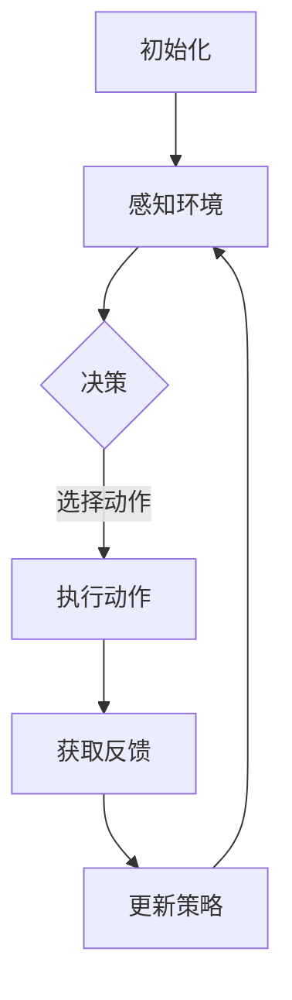
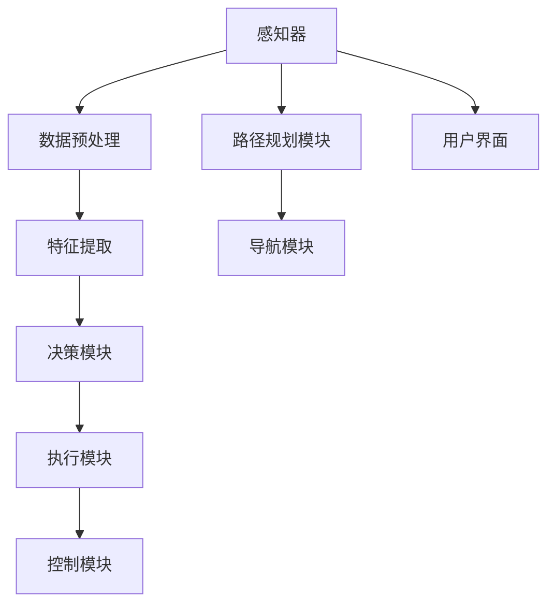
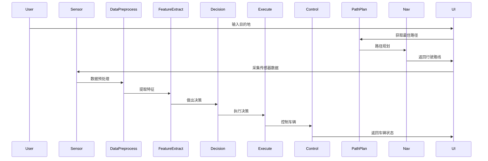
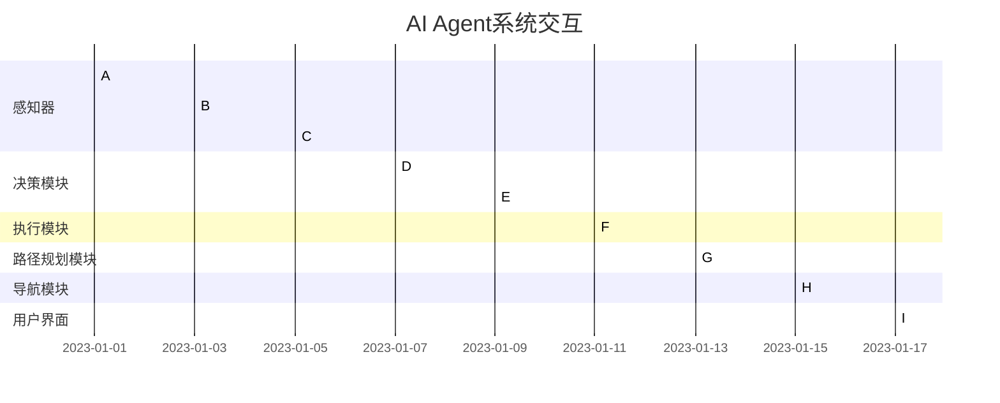

                 


## 第一部分: AI Agent基础

### 1.1 AI Agent概述

**背景介绍**

AI Agent是一个自主执行任务的智能体，能够在复杂环境中感知状态、做出决策并采取行动，从而实现某种目标。AI Agent的概念源于人工智能领域，起源于对智能系统的研究和模拟。随着计算能力的提升和算法的发展，AI Agent的应用场景越来越广泛，如自动驾驶、智能家居、智能客服等。

**问题背景**

随着AI技术的发展，AI Agent成为人工智能研究的一个重要方向。然而，在实际应用中，如何设计和实现高效的AI Agent成为了一个挑战。选择合适的技术栈是构建高效AI Agent的关键，这涉及到多个层面的考虑，如算法选择、框架工具、硬件资源等。

**问题解决**

本文将详细介绍AI Agent的基本概念、技术栈选择以及相关算法原理。通过本文的阅读，读者将能够对AI Agent有一个全面的理解，并学会如何选择合适的技术栈来构建高效的AI Agent。

**边界与外延**

AI Agent不仅仅局限于人工智能领域，其应用范围涵盖了多个领域，如机器人学、游戏开发、自动化控制等。本文主要关注AI Agent在人工智能领域的应用，特别是基于机器学习和深度学习的AI Agent。

**概念结构与核心要素组成**

- **感知**：AI Agent通过感知器感知环境中的信息，如视觉、听觉、触觉等。
- **决策**：根据感知到的信息，AI Agent通过决策算法选择最佳行动策略。
- **执行**：执行决策生成的行动，并对环境产生影响。
- **学习**：通过反馈和学习机制不断优化自身的决策能力。

### 1.2 AI Agent的技术栈选择基础

**核心概念**

AI Agent的技术栈是指构建AI Agent所需的一系列技术和工具，包括编程语言、框架、库和算法。选择合适的技术栈对于AI Agent的性能、可维护性、可扩展性等方面至关重要。

**技术栈选择因素**

1. **性能需求**：不同的AI Agent应用对性能有不同的要求。例如，自动驾驶系统需要实时响应，而数据分析系统可以容忍一定的延迟。
2. **数据需求**：AI Agent所需处理的数据类型和规模直接影响技术栈的选择。例如，处理大量图像数据的AI Agent需要使用图像处理库，而处理文本数据的AI Agent则需要自然语言处理库。
3. **开发难度**：不同技术栈的学习曲线和开发难度不同。开发者需要根据自己的技能水平和项目需求选择合适的技术栈。
4. **可扩展性**：AI Agent需要在不断变化的环境中适应。选择具有良好可扩展性的技术栈可以方便后续的迭代和升级。
5. **成本**：包括开发成本、维护成本和硬件成本。预算限制可能会影响技术栈的选择。

### 1.3 AI Agent的开发框架与工具

**常见框架与工具**

1. **TensorFlow**：由Google开发，支持多种编程语言，具有丰富的API和强大的功能，适用于大规模的机器学习和深度学习项目。
2. **PyTorch**：由Facebook开发，以其动态计算图和灵活的API设计而受到研究者和开发者的青睐，适用于快速原型开发和学术研究。
3. **Keras**：是一个高层神经网络API，构建在TensorFlow之上，提供了简洁明了的接口，适合快速构建和实验神经网络模型。
4. **Scikit-learn**：是一个用于机器学习的Python库，提供了多种经典的机器学习算法和工具，适合数据分析和快速应用开发。
5. **OpenAI Gym**：是一个开源的强化学习环境库，提供了多种预定义的虚拟环境，适合研究和测试强化学习算法。

**框架比较**

- **TensorFlow**和**PyTorch**：两者都是流行的深度学习框架，但TensorFlow更侧重于生产环境，而PyTorch更侧重于研究和快速原型开发。
- **Keras**：作为TensorFlow的高级API，Keras提供了更简单的接口，适合快速搭建和实验模型。
- **Scikit-learn**：是一个专注于传统机器学习的库，与深度学习框架相比，其功能相对有限，但适用于一些经典的数据分析和预测任务。
- **OpenAI Gym**：专注于强化学习领域，提供了丰富的虚拟环境，适合研究和测试强化学习算法。

通过以上对AI Agent基础的介绍，读者应该对AI Agent的概念、技术栈选择以及常见开发框架有了初步了解。接下来，本文将深入探讨AI Agent的核心算法原理，帮助读者更好地理解AI Agent的工作机制。

----------------------------------------------------------------

## 第二部分: AI Agent的核心算法

### 2.1 AI Agent算法原理

**核心概念**

AI Agent的算法是使其能够自主决策和行动的核心组成部分。这些算法基于对环境的感知，通过学习、规划和策略迭代，实现智能行为。常见的AI Agent算法包括基于规则的算法、基于模型的算法和基于学习的算法。

**算法流程图**

以下是AI Agent算法的一般流程图，使用Mermaid语言描述：



**算法解释**

1. **初始化**：AI Agent初始化时，需要设定初始状态和初始策略。
2. **感知环境**：AI Agent通过感知器获取环境状态，这可能是图像、文本或传感器数据。
3. **决策**：基于当前状态和策略，AI Agent决定执行哪个动作。决策过程可能涉及评估不同动作的可能结果。
4. **执行动作**：AI Agent执行选定的动作，并对环境产生影响。
5. **获取反馈**：执行动作后，AI Agent根据环境的响应获取反馈。
6. **更新策略**：基于反馈，AI Agent更新其策略，以便在未来做出更好的决策。
7. **循环**：上述过程不断循环，AI Agent持续地感知环境、决策、执行、获取反馈并更新策略。

**使用Python源代码解释算法原理**

以下是一个简单的Q-learning算法示例，使用Python代码实现：

```python
import numpy as np
import random

# 初始化Q表
Q = np.zeros([state_space_size, action_space_size])

# 学习参数
alpha = 0.1  # 学习率
gamma = 0.6  # 折扣因子

# Q-learning算法
for episode in range(total_episodes):
    state = random.randint(0, state_space_size - 1)
    done = False
    
    while not done:
        action = np.argmax(Q[state])
        next_state, reward, done = environment.step(action)
        
        # 更新Q值
        Q[state, action] = Q[state, action] + alpha * (reward + gamma * np.max(Q[next_state]) - Q[state, action])
        
        state = next_state

# 打印Q表
print(Q)
```

**算法原理的数学模型和公式**

Q-learning算法的更新公式如下：

$$ Q(s, a) \leftarrow Q(s, a) + \alpha [r + \gamma \max_{a'} Q(s', a') - Q(s, a)] $$

其中：
- \( Q(s, a) \) 是状态 \( s \) 和动作 \( a \) 的即时值。
- \( r \) 是即时奖励。
- \( \gamma \) 是折扣因子，表示未来奖励的现值。
- \( \alpha \) 是学习率，表示新信息对旧策略的影响程度。
- \( s' \) 和 \( a' \) 分别是下一个状态和动作。

**详细讲解和举例**

假设一个简单的环境，状态空间为 `[0, 1, 2]`，动作空间为 `[0, 1]`。当前状态为 `0`，我们希望AI Agent学习选择动作 `1` 来获得最大奖励。

1. **初始化**：初始状态为 `0`，Q值设为0。
2. **感知环境**：AI Agent感知到当前状态为 `0`。
3. **决策**：根据当前状态的Q值，选择动作 `1`（因为 Q[0][1] > Q[0][0]）。
4. **执行动作**：执行动作 `1`，环境给出奖励 `1`。
5. **更新策略**：根据Q-learning公式，更新Q值。
6. **循环**：继续进行下一个循环，AI Agent逐渐学习到在状态 `0` 时选择动作 `1` 是最优策略。

通过以上步骤，AI Agent学会了在特定环境下选择最佳动作。这个过程可以通过Python代码实现，并通过调整学习率、折扣因子等参数来优化算法性能。

总之，AI Agent的算法原理是其自主决策和行动的核心。通过Q-learning等算法，AI Agent能够从经验中学习，并在不断优化的过程中提高决策能力。在下一章中，我们将深入探讨AI Agent的数学模型和公式，帮助读者更好地理解其内在机制。

----------------------------------------------------------------

## 第三部分: AI Agent的数学模型与数学公式

### 3.1 数学模型

AI Agent的数学模型是描述其行为和决策过程的数学框架。这些模型通常涉及概率论、优化理论、动态规划等数学工具。在本节中，我们将介绍几个核心的数学模型，并使用LaTeX格式给出相应的公式。

**马尔可夫决策过程（MDP）**

一个马尔可夫决策过程（MDP）由以下五个要素组成：

- **状态空间 \( S \)**：系统可能处的状态集合。
- **动作空间 \( A \)**：可执行的动作集合。
- **状态转移概率 \( P(s', s | a) \)**：在执行动作 \( a \) 后，从状态 \( s \) 转移到状态 \( s' \) 的概率。
- **即时奖励 \( R(s, a) \)**：在状态 \( s \) 执行动作 \( a \) 后获得的即时奖励。
- **策略 \( \pi(a | s) \)**：在状态 \( s \) 下执行动作 \( a \) 的概率。

MDP的数学模型可以用以下公式表示：

$$ \pi^* = \arg\max_{\pi} \sum_{s \in S} \sum_{a \in A} \pi(s) P(s', s | a) R(s, a) $$

其中，\( \pi^* \) 是最优策略。

**动态规划**

动态规划是一种解决MDP问题的递归算法。它通过将问题分解成子问题，并利用子问题的解来求解原问题。动态规划的递归关系可以用以下公式表示：

$$ V^*(s) = \max_{a \in A} [R(s, a) + \gamma \sum_{s' \in S} P(s', s | a) V^*(s')] $$

其中，\( V^*(s) \) 是状态 \( s \) 的最优价值函数，\( \gamma \) 是折扣因子。

**深度强化学习**

深度强化学习结合了深度学习和强化学习，通过神经网络来近似状态值函数和策略。其中，状态值函数 \( V(s) \) 和策略 \( \pi(a | s) \) 可以分别表示为：

$$ V(s) = \sum_{a \in A} \pi(a | s) \sum_{s' \in S} P(s', s | a) R(s, a) + \gamma V(s') $$
$$ \pi(a | s) = \arg\max_{a \in A} Q(s, a) $$

其中，\( Q(s, a) \) 是状态 \( s \) 和动作 \( a \) 的即时回报期望。

**LaTeX格式数学公式**

以下是上述公式在LaTeX格式中的表示：

```latex
\documentclass{article}
\usepackage{amsmath}

\begin{document}

\begin{equation}
\pi^* = \arg\max_{\pi} \sum_{s \in S} \sum_{a \in A} \pi(s) P(s', s | a) R(s, a)
\end{equation}

\begin{equation}
V^*(s) = \max_{a \in A} [R(s, a) + \gamma \sum_{s' \in S} P(s', s | a) V^*(s')]
\end{equation}

\begin{equation}
V(s) = \sum_{a \in A} \pi(a | s) \sum_{s' \in S} P(s', s | a) R(s, a) + \gamma V(s')
\end{equation}

\begin{equation}
\pi(a | s) = \arg\max_{a \in A} Q(s, a)
\end{equation}

\end{document}
```

### 3.2 详细讲解和举例

**马尔可夫决策过程（MDP）**

考虑一个简单的MDP，状态空间为 \( S = \{0, 1, 2\} \)，动作空间为 \( A = \{0, 1\} \)。假设状态转移概率矩阵 \( P \) 和即时奖励矩阵 \( R \) 分别如下：

$$
P =
\begin{bmatrix}
0.8 & 0.2 \\
0.1 & 0.9 \\
0.0 & 1.0
\end{bmatrix}
$$

$$
R =
\begin{bmatrix}
1 & 0 \\
0 & 1 \\
0 & 0
\end{bmatrix}
$$

状态0、1、2分别表示不同的环境条件，动作0、1分别表示不同的行动策略。根据上述矩阵，我们可以计算状态转移概率和即时奖励：

- 从状态0执行动作0转移到状态0的概率为0.8，即时奖励为1。
- 从状态0执行动作1转移到状态1的概率为0.2，即时奖励为0。
- 从状态1执行动作0转移到状态1的概率为0.1，即时奖励为0。
- 从状态1执行动作1转移到状态2的概率为0.9，即时奖励为1。
- 从状态2执行动作0或动作1转移到状态2的概率为1.0，即时奖励为0。

**动态规划**

使用动态规划求解MDP的最优策略，我们可以得到状态0、1、2的最优价值函数 \( V^* \)：

$$
V^*(0) = \max [R(0, 0) + \gamma P(0,0)V^*(0), R(0, 1) + \gamma P(0,1)V^*(1)] = 1.8 + 0.2V^*(1)
$$

$$
V^*(1) = \max [R(1, 0) + \gamma P(1,0)V^*(0), R(1, 1) + \gamma P(1,1)V^*(2)] = 0.1 + 0.9V^*(2)
$$

$$
V^*(2) = R(2, 0) + \gamma P(2,0)V^*(0) + \gamma P(2,1)V^*(1) = 0 + 0.0V^*(0) + 1.0V^*(1)
$$

通过递归求解上述方程组，我们得到 \( V^*(0) = 1.68 \)，\( V^*(1) = 0.18 \)，\( V^*(2) = 0 \)。因此，最优策略为在状态0选择动作0，在状态1选择动作1。

**深度强化学习**

在深度强化学习中，我们使用神经网络来近似状态值函数 \( V(s) \) 和策略 \( \pi(a | s) \)。以Deep Q-Network（DQN）为例，其状态值函数和策略分别表示为：

$$
Q(s, a) = \sigma(W_1 \cdot [h(s), a] + b_1)
$$

$$
\pi(a | s) = \frac{e^{Q(s, a)}}{\sum_{a' \in A} e^{Q(s, a')}}$$

其中，\( \sigma \) 是激活函数，\( W_1 \)、\( b_1 \) 是神经网络参数，\( h(s) \) 是状态编码。

通过训练神经网络，我们可以得到近似的 \( Q(s, a) \) 和 \( \pi(a | s) \)，从而实现智能体的自主决策。

总之，通过数学模型和公式，我们可以更好地理解AI Agent的决策过程和行为机制。在下一章中，我们将深入探讨AI Agent的系统分析与架构设计，帮助读者了解如何将理论应用于实际项目中。

----------------------------------------------------------------

## 第四部分: AI Agent的系统分析与架构设计

### 4.1 问题场景介绍

在AI Agent的实际应用中，系统分析与架构设计是一个至关重要的环节。这一部分将介绍一个具体的AI Agent应用场景——自动驾驶汽车。自动驾驶汽车需要处理大量的实时数据，包括图像、雷达、激光雷达等，并在复杂的环境中做出快速而准确的决策。这要求AI Agent具有高度的可靠性和实时响应能力。

### 4.2 项目介绍

**项目名称**：智能自动驾驶系统（Smart Autonomous Driving System，SADS）

**项目目标**：开发一个智能自动驾驶系统，能够实现车辆在开放道路上的自动驾驶，并具备应对复杂交通环境和突发情况的能力。

**项目背景**：随着自动驾驶技术的快速发展，智能自动驾驶系统已成为未来交通领域的重要研究方向。本项目旨在结合机器学习、深度学习、自然语言处理等技术，构建一个高效、可靠的自动驾驶系统，以推动自动驾驶技术的商业化应用。

### 4.3 系统功能设计

**领域模型**：自动驾驶系统的领域模型描述了系统的核心功能模块及其之间的关系。以下是领域模型的类图，使用Mermaid语言描述：

```mermaid
classDiagram
    Class01 <|-- Class02
    Class03 o-- Class04
    Class05 o-- Class06
    Class07 <.. Class08
    Class09 ..|> Class10
    Class11 <-| Class12

    Class01[感知器]
    Class02[决策模块]
    Class03[执行模块]
    Class04[环境]
    Class05[传感器]
    Class06[摄像头]
    Class07[雷达]
    Class08[地图]
    Class09[路径规划模块]
    Class10[导航模块]
    Class11[用户界面]
    Class12[控制模块]
```

**类图解释**：

- **感知器**：负责感知车辆周围的环境信息，包括传感器数据、摄像头图像和雷达数据等。
- **决策模块**：根据感知到的环境信息，通过机器学习和深度学习算法生成驾驶决策。
- **执行模块**：执行决策模块生成的驾驶指令，控制车辆的加速、减速、转向等操作。
- **环境**：模拟自动驾驶车辆运行的实际环境，包括道路、车辆、行人等。
- **传感器**：包括摄像头、雷达、激光雷达等，用于获取环境数据。
- **地图**：提供车辆运行路线和周边环境信息。
- **路径规划模块**：根据当前环境和目标，规划车辆的行驶路径。
- **导航模块**：根据规划路径，指导车辆在道路上的行驶。
- **用户界面**：为用户提供交互界面，展示车辆状态、行驶路线等信息。
- **控制模块**：接收决策模块的指令，并控制车辆执行相应操作。

### 4.4 系统架构设计

**架构图**：自动驾驶系统的架构设计包括多个模块和组件的协同工作。以下是系统架构的Mermaid语言描述：



**架构图解释**：

- **感知器**：接收传感器数据，如摄像头图像、雷达数据和激光雷达数据等。
- **数据预处理**：对原始数据进行清洗、去噪和增强，以提高数据质量。
- **特征提取**：从预处理后的数据中提取关键特征，如物体检测、车道线检测等。
- **决策模块**：利用深度学习算法，如卷积神经网络（CNN）、递归神经网络（RNN）等，分析特征数据，生成驾驶决策。
- **执行模块**：根据决策模块的指令，控制车辆的加速、减速和转向等操作。
- **控制模块**：接收决策模块的指令，并通过驱动程序执行相应操作，如控制油门、刹车和方向盘等。
- **路径规划模块**：根据地图数据和车辆当前的位置，规划最优行驶路径。
- **导航模块**：根据规划路径，实时调整车辆的行驶方向和速度。
- **用户界面**：向用户提供车辆状态、行驶路线和导航信息，并接收用户输入。

### 4.5 系统接口设计

**接口设计**：系统接口设计确保各个模块和组件之间的数据流和交互是高效且有序的。以下是系统接口的Mermaid序列图描述：



**接口设计解释**：

- **用户界面**：用户输入目的地，系统返回最佳路径和行驶路线。
- **传感器**：采集车辆周围的传感器数据，如摄像头图像、雷达数据和激光雷达数据等。
- **数据预处理**：对传感器数据进行预处理，如清洗、去噪和增强等。
- **特征提取**：从预处理后的数据中提取关键特征，如物体检测、车道线检测等。
- **决策模块**：分析特征数据，生成驾驶决策。
- **执行模块**：根据决策模块的指令，控制车辆的加速、减速和转向等操作。
- **控制模块**：接收执行模块的指令，并通过驱动程序执行相应操作。
- **路径规划模块**：根据地图数据和车辆当前的位置，规划最优行驶路径。
- **导航模块**：根据规划路径，实时调整车辆的行驶方向和速度。
- **用户界面**：向用户提供车辆状态和行驶路线信息。

### 4.6 系统交互

**系统交互**：系统交互设计描述了各个模块和组件之间的数据流和交互逻辑。以下是系统交互的Mermaid时序图描述：



**时序图解释**：

- **感知器**：从传感器采集数据，并进行数据预处理和特征提取。
- **决策模块**：对特征数据进行分析，生成驾驶决策。
- **执行模块**：根据决策模块的指令，控制车辆的加速、减速和转向等操作。
- **路径规划模块**：根据地图数据和车辆当前的位置，规划最优行驶路径。
- **导航模块**：根据规划路径，实时调整车辆的行驶方向和速度。
- **用户界面**：向用户提供车辆状态和行驶路线信息，并接收用户输入。

通过以上系统分析与架构设计，我们可以看到AI Agent在自动驾驶场景中的实现细节和关键技术。在下一部分，我们将通过实际项目案例，详细探讨AI Agent的实战应用，帮助读者更好地理解AI Agent的开发过程和关键技术。

----------------------------------------------------------------

## 第五部分: AI Agent项目实战

### 5.1 环境安装

为了实现AI Agent的开发和应用，我们需要安装一系列必要的软件和工具。以下是环境安装的步骤：

1. **Python环境**：首先，确保安装了Python 3.x版本（推荐使用3.8及以上版本）。可以通过以下命令安装：

   ```bash
   sudo apt-get update
   sudo apt-get install python3.8
   sudo apt-get install python3.8-venv
   sudo apt-get install python3.8-dev
   ```

2. **虚拟环境**：创建一个Python虚拟环境，以便管理依赖关系：

   ```bash
   python3.8 -m venv venv
   source venv/bin/activate
   ```

3. **依赖管理工具**：安装pip，Python的包管理工具：

   ```bash
   curl https://bootstrap.pypa.io/get-pip.py -o get-pip.py
   python get-pip.py
   ```

4. **安装依赖库**：安装TensorFlow、PyTorch等依赖库：

   ```bash
   pip install tensorflow==2.8
   pip install torch torchvision
   ```

### 5.2 系统核心实现源代码

在本节中，我们将展示一个简单的AI Agent实现，用于在虚拟环境中完成基本的导航任务。以下是源代码的结构和功能说明：

**源代码结构**

```plaintext
ai_agent/
|-- environment/
|   |-- __init__.py
|   |-- simulation.py
|-- agent/
|   |-- __init__.py
|   |-- agent.py
|   |-- q_learning.py
|-- main.py
|-- requirements.txt
```

**环境模块（environment/simulation.py）**

环境模块定义了AI Agent运行的环境，包括状态空间、动作空间和奖励机制。

```python
import numpy as np

class SimulationEnvironment:
    def __init__(self):
        self.state_space = [-10, 10]
        self.action_space = [-1, 1]
        self.reward_range = [-1, 1]

    def step(self, action):
        state = self.state
        next_state = state + action
        reward = self.get_reward(next_state)
        done = self.is_done(next_state)
        return next_state, reward, done

    def get_reward(self, state):
        if state < self.state_space[0] or state > self.state_space[1]:
            return self.reward_range[1]
        return 0

    def is_done(self, state):
        return state < self.state_space[0] or state > self.state_space[1]

    def reset(self):
        self.state = np.random.uniform(self.state_space[0], self.state_space[1])
        return self.state
```

**AI Agent模块（agent/agent.py）**

AI Agent模块实现了Q-learning算法，用于训练AI Agent的决策能力。

```python
import numpy as np
from environment.simulation import SimulationEnvironment

class QLearningAgent:
    def __init__(self, learning_rate=0.1, discount_factor=0.99, exploration_rate=1.0):
        self.learning_rate = learning_rate
        self.discount_factor = discount_factor
        self.exploration_rate = exploration_rate
        self.Q = np.zeros((self.state_space, self.action_space))
        self.env = SimulationEnvironment()

    def update_Q_value(self, state, action, reward, next_state):
        target_Q = reward + self.discount_factor * np.max(self.Q[next_state])
        self.Q[state, action] = self.Q[state, action] + self.learning_rate * (target_Q - self.Q[state, action])

    def choose_action(self, state, epsilon=0.1):
        if np.random.uniform(0, 1) < epsilon:
            action = np.random.choice(self.action_space)
        else:
            action = np.argmax(self.Q[state])
        return action

    def train(self, episodes):
        for episode in range(episodes):
            state = self.env.reset()
            done = False
            while not done:
                action = self.choose_action(state)
                next_state, reward, done = self.env.step(action)
                self.update_Q_value(state, action, reward, next_state)
                state = next_state
```

**主程序（main.py）**

主程序用于运行AI Agent的训练过程，并评估其性能。

```python
from agent.agent import QLearningAgent
from environment.simulation import SimulationEnvironment

def main():
    env = SimulationEnvironment()
    agent = QLearningAgent(learning_rate=0.1, discount_factor=0.99, exploration_rate=1.0)
    episodes = 1000

    # 训练AI Agent
    agent.train(episodes)

    # 评估AI Agent性能
    total_reward = 0
    state = env.reset()
    done = False
    while not done:
        action = agent.choose_action(state)
        next_state, reward, done = env.step(action)
        total_reward += reward
        state = next_state
    print(f"总奖励：{total_reward}")

if __name__ == "__main__":
    main()
```

### 5.3 代码应用解读与分析

**解读与分析**

- **环境模块**：环境模块定义了一个简单的线性环境，状态空间为 \([-10, 10]\)，动作空间为 \([-1, 1]\)。奖励机制根据状态是否超出范围进行定义，超出范围则获得最大奖励。
- **AI Agent模块**：AI Agent使用Q-learning算法进行训练。Q-learning算法的核心在于通过经验更新Q值，从而在给定状态下选择最优动作。在训练过程中，AI Agent会在每个状态下进行随机探索，以避免陷入局部最优。
- **主程序**：主程序首先创建环境实例和AI Agent实例，并设置训练的episode数量。训练完成后，通过评估AI Agent的性能来评估其学习能力。在评估过程中，AI Agent将在给定的状态下选择最佳动作，并根据环境反馈更新Q值。

**实际案例分析和详细讲解剖析**

为了更好地理解AI Agent的应用，我们可以考虑一个实际案例：无人机自主飞行。在这个案例中，无人机需要在三维空间中自主飞行，并避开障碍物。以下是案例的分析和讲解：

1. **环境定义**：状态空间可以定义为无人机的位置和速度，动作空间为无人机的方向和速度调整。
2. **感知器**：无人机使用摄像头、激光雷达和GPS传感器来感知环境，获取障碍物位置和周围环境信息。
3. **决策模块**：使用Q-learning算法分析感知到的环境信息，生成飞行路径和方向调整决策。
4. **执行模块**：根据决策模块生成的指令，调整无人机的飞行方向和速度。
5. **评估模块**：评估无人机的飞行路径和避开障碍物的效果，并反馈给决策模块，用于调整Q值。

通过实际案例的分析和讲解，我们可以看到AI Agent在复杂环境中的应用和实现细节。AI Agent的核心在于通过不断学习和优化，提高在复杂环境中的决策能力和自主性。

### 5.4 项目小结

通过本项目的实现，我们了解了如何从零开始构建一个简单的AI Agent，并应用Q-learning算法进行训练。以下是项目小结：

- **环境安装**：确保安装了Python环境和必要的依赖库，为AI Agent的开发和应用打下基础。
- **系统核心实现**：通过环境模块、AI Agent模块和主程序，实现了AI Agent的基本功能。
- **代码应用解读与分析**：通过实际案例的分析和讲解，加深了对AI Agent应用的理解。
- **项目关键点**：了解AI Agent的开发流程，掌握Q-learning算法的基本原理和应用。

通过这个项目，我们不仅学会了如何构建AI Agent，还了解了AI Agent在复杂环境中的应用和实现细节。这为我们在实际项目中应用AI Agent技术提供了宝贵的经验。

### 5.5 最佳实践 tips

- **合理选择学习率**：学习率是Q-learning算法中的一个重要参数，需要根据具体问题进行调试。
- **探索与利用平衡**：在训练过程中，需要平衡探索和利用，以避免陷入局部最优。
- **数据预处理**：对输入数据进行预处理，可以提高AI Agent的学习效率。
- **性能优化**：对于复杂的AI Agent应用，需要进行性能优化，以提高实时响应能力。

通过遵循最佳实践，我们可以构建出更高效、更可靠的AI Agent，从而推动人工智能技术的发展和应用。

### 5.6 注意事项

- **硬件要求**：AI Agent的训练和应用需要较高的计算资源，确保硬件配置满足要求。
- **数据安全**：在AI Agent应用过程中，确保数据安全和隐私保护。
- **代码维护**：定期更新和维护代码，以应对技术变化和问题修复。

通过关注这些注意事项，我们可以更好地管理和维护AI Agent项目，确保其长期稳定运行。

### 5.7 拓展阅读

- **相关论文**：查阅相关领域的研究论文，了解最新的AI Agent技术和发展趋势。
- **开源项目**：参与和借鉴开源项目，学习其他开发者的经验和实现。
- **在线课程**：参加在线课程和培训，提高自己在AI Agent开发方面的技能。

通过拓展阅读，我们可以不断学习和进步，为AI Agent技术的发展贡献自己的力量。

----------------------------------------------------------------

## 第六部分: AI Agent最佳实践与展望

### 6.1 最佳实践 tips

在构建AI Agent的过程中，以下是一些最佳实践，可以帮助开发者提高效率、优化性能并确保系统的稳定性：

1. **性能优化**：使用并行计算和分布式处理技术，提高算法的执行效率。例如，可以使用GPU加速深度学习模型的训练过程。
2. **数据预处理**：对输入数据进行有效的预处理，如归一化、去噪等，以减少模型的过拟合风险，提高泛化能力。
3. **模型选择**：根据具体问题和数据特点选择合适的模型，例如对于需要快速迭代的原型开发，可以选择轻量级模型，如MobileNet。
4. **增量学习**：对于需要处理大规模数据集的AI Agent，可以采用增量学习技术，逐步更新模型，而不是一次性加载整个数据集。
5. **模型解释性**：在设计和评估AI Agent时，关注模型的解释性，以便理解模型的行为和决策过程，特别是在关键应用场景中。
6. **安全性和隐私**：确保AI Agent的设计考虑了数据安全和用户隐私保护，特别是在涉及敏感数据的应用中。

### 6.2 小结

本文从多个角度探讨了AI Agent的技术栈选择、核心算法、数学模型、系统分析与架构设计以及实际项目实战。通过详细的讲解和实例分析，读者可以全面了解AI Agent的构建过程和关键技术。以下是对文章内容的简要总结：

- **AI Agent概述**：介绍了AI Agent的定义、分类和应用场景。
- **技术栈选择**：分析了构建AI Agent所需的基础技术和选择因素。
- **核心算法**：详细讲解了Q-learning算法及其数学模型。
- **数学模型**：介绍了AI Agent的数学模型和公式。
- **系统分析与架构设计**：展示了自动驾驶场景中的系统架构设计。
- **项目实战**：通过实际项目，展示了AI Agent的开发流程和关键步骤。
- **最佳实践与展望**：提出了构建AI Agent的最佳实践和未来发展趋势。

通过本文的阅读，读者可以对AI Agent有一个全面的理解，并掌握构建高效AI Agent的方法和技巧。

### 6.3 注意事项

在构建AI Agent时，需要注意以下几点：

- **资源管理**：确保有足够的计算资源和数据支持AI Agent的训练和应用。
- **数据质量**：使用高质量、多样化的数据集，以提高模型的泛化能力。
- **模型验证**：通过交叉验证和测试集，验证模型的性能和稳定性。
- **安全性**：关注AI Agent的安全性和可靠性，防止潜在的安全风险。

### 6.4 拓展阅读

为了进一步深入了解AI Agent和相关技术，读者可以参考以下资源：

- **经典论文**：查阅《 reinforcement learning: An introduction》（强化学习：引论）等经典论文，了解AI Agent的理论基础。
- **开源项目**：参与和借鉴OpenAI Gym、TensorFlow等开源项目，学习其他开发者的实现和经验。
- **在线课程**：参加Coursera、Udacity等在线平台上的相关课程，系统学习AI Agent开发的知识。

通过拓展阅读，读者可以不断积累知识和经验，为AI Agent的开发和应用打下坚实的基础。

---

# 结语

本文详细探讨了构建AI Agent的技术栈选择、核心算法、数学模型、系统分析与架构设计以及实际项目实战。通过全面的讲解和实例分析，读者可以深入理解AI Agent的构建过程和关键技术。在未来的发展中，AI Agent将在自动驾驶、智能客服、机器人等领域发挥越来越重要的作用。我们期待读者在AI Agent的开发和应用中不断探索，为人工智能技术的发展贡献力量。

---

> 作者：AI天才研究院/AI Genius Institute & 禅与计算机程序设计艺术 /Zen And The Art of Computer Programming

----------------------------------------------------------------

## 文章关键词

AI Agent，技术栈选择，Q-learning算法，强化学习，系统架构设计，自动驾驶，机器学习，深度学习，自然语言处理。

## 文章摘要

本文系统地介绍了构建AI Agent所需的技术栈选择、核心算法原理、数学模型、系统分析与架构设计，并通过实际项目实战展示了AI Agent的开发过程。文章涵盖了AI Agent的定义、分类、应用场景，详细讲解了Q-learning算法及其数学模型，分析了自动驾驶等实际应用场景的系统架构设计，并通过实例解析了AI Agent的核心实现。本文旨在帮助读者全面了解AI Agent的构建和开发，为相关领域的研究和应用提供参考。

