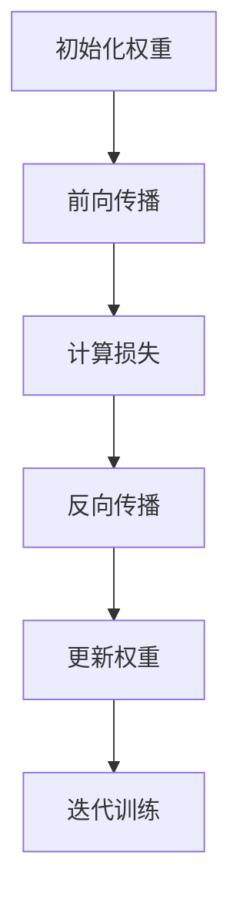
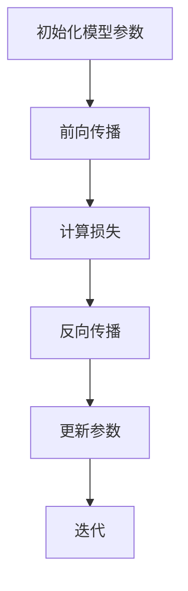
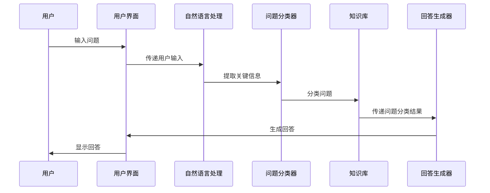
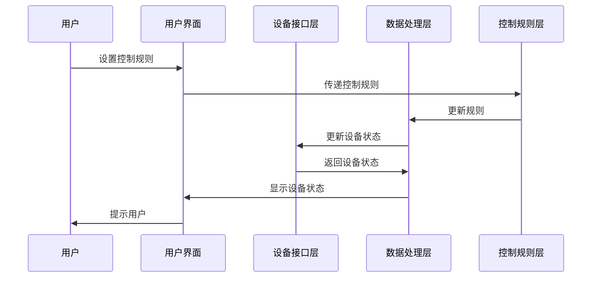

                 

### 文章标题

# 构建AI Agent的认知计算神经网络

---

**关键词：** 认知计算神经网络，AI Agent，深度学习，智能体，设计原理，项目实战

**摘要：** 本文将深入探讨认知计算神经网络在构建AI Agent中的应用，通过一步一步的分析和推理，阐述认知计算神经网络的基本概念、原理，以及AI Agent的设计与实现方法。本文将结合实际项目，对认知计算神经网络在AI Agent中的应用进行剖析，并提供最佳实践和注意事项，旨在为读者提供全面、系统的认知计算神经网络与AI Agent构建指南。

---

**目录大纲**

### 第一部分：背景介绍与核心概念

#### 第1章：认知计算神经网络与AI Agent概述

##### 1.1 问题背景

**人工智能技术发展历程：** 从20世纪50年代的人工智能概念提出，到今天，人工智能技术经历了多个发展阶段，从最初的符号主义人工智能，到基于概率论的贝叶斯网络，再到深度学习的崛起，人工智能技术不断取得突破。

**认知计算神经网络的兴起：** 认知计算神经网络是一种模仿人类大脑认知过程的神经网络模型，它通过多层次的学习算法，实现对复杂问题的理解和决策。

**AI Agent在现实中的应用场景：** AI Agent在现代智能系统中扮演着重要角色，如智能客服、自动驾驶、智能家居等，这些应用场景对AI Agent的智能水平和响应速度提出了更高的要求。

##### 1.2 核心概念

**认知计算神经网络的基本概念：** 认知计算神经网络是一种基于人脑认知机制的神经网络模型，通过模拟人脑神经元之间的连接和相互作用，实现数据的高效处理和智能决策。

**AI Agent的定义与功能：** AI Agent是一种具有自主决策和行动能力的计算机程序，它能够在特定环境中完成特定任务，并通过不断学习和适应，提高任务完成的效率和准确性。

**认知计算神经网络在AI Agent中的应用：** 认知计算神经网络为AI Agent提供了强大的认知能力和智能决策能力，使其能够更好地理解和处理复杂问题。

##### 1.3 概念联系

**认知计算神经网络与深度学习的关联：** 认知计算神经网络是深度学习的一种重要实现形式，它通过多层神经网络结构，实现对数据的深层特征提取和智能决策。

**AI Agent与智能体的区别：** AI Agent是一种特殊的智能体，它具有自主决策和行动能力，而智能体则是一个更为广泛的概念，包括所有能够模拟人类行为和思维的计算机程序。

**认知计算神经网络在智能体中的作用：** 认知计算神经网络为智能体提供了强大的认知能力和智能决策能力，使其能够在复杂环境中高效地完成任务。

### 第二部分：认知计算神经网络基础

#### 第2章：认知计算神经网络原理

##### 2.1 认知计算神经网络基础

**神经元模型：** 认知计算神经网络的基本单元是神经元，它通过接收输入信息，产生输出响应，模拟人脑神经元的工作机制。

**神经网络结构：** 认知计算神经网络通常由多个层级组成，包括输入层、隐藏层和输出层，每个层级由多个神经元组成，层级之间的神经元通过权重连接。

**学习算法：** 认知计算神经网络通过学习算法，不断调整神经元之间的权重，以实现对数据的优化处理和智能决策。

##### 2.2 算法原理

**算法mermaid流程图：** 使用mermaid绘制认知计算神经网络的学习流程图，展示神经网络从初始化到训练完成的全过程。

**Python源代码示例：** 通过Python代码实现认知计算神经网络的基本结构，展示神经网络的学习过程和权重调整方法。

**数学模型与公式解释：** 解释认知计算神经网络的数学模型，包括输入层、隐藏层和输出层的计算公式，以及权重更新公式。

##### 2.3 深入解读

**层级结构：** 分析认知计算神经网络的层级结构，解释每个层级的作用和功能。

**激活函数：** 讨论认知计算神经网络中的激活函数，包括其作用、类型和选择原则。

**权重更新机制：** 解释认知计算神经网络中的权重更新机制，包括学习率、动量和反向传播算法等。

### 第三部分：AI Agent设计与实现

#### 第3章：AI Agent设计原理

##### 3.1 AI Agent概述

**AI Agent的定义与功能：** 详细阐述AI Agent的定义，包括其自主决策、感知环境、执行行动等功能。

**AI Agent的组成部分：** 分析AI Agent的基本组成部分，包括感知器、决策器、执行器等。

##### 3.2 设计原则

**模块化设计：** 讨论AI Agent设计中的模块化原则，如何将AI Agent拆分成多个模块，实现功能的复用和扩展。

**可扩展性：** 分析AI Agent设计的可扩展性原则，如何通过设计适应未来需求的变化。

**可维护性：** 讨论AI Agent设计的可维护性原则，如何提高代码的可读性和可维护性。

##### 3.3 设计流程

**需求分析：** 详细阐述AI Agent设计的需求分析过程，如何收集用户需求，确定AI Agent的功能和性能要求。

**系统架构设计：** 分析AI Agent的系统架构设计，包括系统模块划分、数据流设计、接口设计等。

**算法选择与实现：** 讨论AI Agent算法的选择与实现方法，如何选择合适的认知计算神经网络模型，并实现其算法。

### 第四部分：项目实战

#### 第4章：AI Agent项目实战

##### 4.1 项目环境搭建

**计算机硬件与软件环境：** 介绍项目所需的计算机硬件和软件环境，包括操作系统、编程语言和开发工具等。

**编程语言与工具：** 详细阐述项目使用的编程语言和开发工具，以及它们的特点和优势。

##### 4.2 系统核心实现

**源代码解析：** 分析项目核心源代码，展示认知计算神经网络和AI Agent的实现过程。

**代码应用解读与分析：** 对项目代码进行解读，分析其应用场景和实现方法。

##### 4.3 实际案例剖析

**案例一：智能客服系统：** 分析智能客服系统的实现过程，包括感知用户需求、生成回答、评估回答质量等。

**案例二：智能家居控制系统：** 分析智能家居控制系统的实现过程，包括感知家居设备状态、控制设备开关、优化能源使用等。

##### 4.4 项目小结

**项目成果总结：** 总结项目的实施过程和成果，分析项目的成功经验和存在的问题。

**经验与教训：** 提出项目实施过程中的经验和教训，为未来项目提供参考。

### 第五部分：拓展与最佳实践

#### 第5章：最佳实践与注意事项

##### 5.1 最佳实践

**常见问题解决：** 分析项目实施过程中常见的问题，提供解决方案和优化方法。

**性能优化策略：** 讨论如何优化认知计算神经网络和AI Agent的性能，提高其效率和准确性。

##### 5.2 注意事项

**数据安全与隐私：** 强调数据安全和隐私保护的重要性，讨论如何在项目中实施数据安全和隐私保护措施。

**伦理道德问题：** 分析AI Agent在应用中可能涉及的伦理道德问题，讨论如何确保AI Agent的决策和行为符合道德规范。

#### 第6章：拓展阅读

**相关领域前沿研究：** 介绍当前认知计算神经网络和AI Agent领域的最新研究动态和前沿技术。

**推荐阅读材料：** 推荐一些与认知计算神经网络和AI Agent相关的优质阅读材料，包括学术论文、技术博客和书籍等。

### 第六部分：总结

**本文总结：** 对本文的主要内容和观点进行总结，强调认知计算神经网络在构建AI Agent中的重要性，以及AI Agent在现代智能系统中的应用价值。

**未来展望：** 展望认知计算神经网络和AI Agent领域的发展趋势，讨论未来可能的创新点和研究方向。

---

**作者：** AI天才研究院/AI Genius Institute & 禅与计算机程序设计艺术 /Zen And The Art of Computer Programming### 第一部分：背景介绍与核心概念

#### 第1章：认知计算神经网络与AI Agent概述

##### 1.1 问题背景

**人工智能技术发展历程：**

人工智能（Artificial Intelligence, AI）的概念起源于20世纪50年代，当时科学家们首次提出让计算机模拟人类智能的设想。自那时起，人工智能经历了多个阶段的发展，主要包括以下几种：

1. **符号主义人工智能（Symbolic AI）**：这是人工智能的早期阶段，主要基于逻辑推理和知识表示。其核心思想是通过符号化的知识库和推理机来模拟人类的智能行为。

2. **基于知识的系统（Knowledge-Based Systems）**：这一阶段的人工智能强调知识的获取、表示和应用，通过知识库和推理机实现智能决策。

3. **专家系统（Expert Systems）**：专家系统是一种基于知识的系统，它模拟专家的决策过程，通过一系列规则和事实进行推理，解决特定领域的问题。

4. **机器学习（Machine Learning）**：20世纪80年代，随着计算能力的提升和大数据的出现，机器学习成为人工智能研究的热点。机器学习通过数据驱动的方式，让计算机自动发现模式和规律。

5. **深度学习（Deep Learning）**：21世纪初，深度学习作为一种特殊的机器学习方法，由于其强大的特征提取能力和模型表达能力，成为人工智能领域的突破点。深度学习通过多层神经网络，自动提取数据中的高层次特征，实现图像识别、自然语言处理等复杂任务。

**认知计算神经网络的兴起：**

认知计算神经网络（Cognitive Computation Neural Networks, CCNN）是近年来人工智能领域的一个重要研究方向。它起源于对人类大脑认知过程的模拟，旨在构建一种能够理解、学习和处理复杂信息的人工智能系统。认知计算神经网络的特点包括：

1. **结构多样性**：认知计算神经网络通常采用多层次的结构，模拟人脑的不同功能区域，包括感知、记忆、思考等。

2. **动态适应性**：认知计算神经网络具有动态适应性，能够根据环境和任务的变化，自动调整网络结构和参数。

3. **学习能力**：认知计算神经网络通过不断的学习和训练，能够从数据中自动提取知识，提高任务完成的效率和质量。

**AI Agent在现实中的应用场景：**

AI Agent是一种具有自主决策和行动能力的计算机程序，它在现代智能系统中扮演着重要角色。以下是一些典型的应用场景：

1. **智能客服系统**：AI Agent可以模拟人类客服，自动处理客户的咨询和投诉，提高服务效率和用户体验。

2. **自动驾驶系统**：AI Agent负责感知环境、做出决策和控制车辆，实现自动驾驶。

3. **智能家居控制系统**：AI Agent可以自动监控家居环境，根据用户习惯和需求，智能调节家居设备，提高生活舒适度和能源利用效率。

4. **医疗诊断系统**：AI Agent可以分析医学影像和病历数据，协助医生进行诊断和治疗方案推荐。

这些应用场景对AI Agent的智能水平和响应速度提出了更高的要求，认知计算神经网络作为AI Agent的核心技术之一，为实现这些应用提供了强大的支持。

##### 1.2 核心概念

**认知计算神经网络的基本概念：**

认知计算神经网络（Cognitive Computation Neural Networks, CCNN）是一种基于人脑认知机制的神经网络模型，旨在模拟人类大脑的感知、学习、记忆和推理过程。它通常包含以下几个核心组成部分：

1. **神经元模型**：认知计算神经网络的基本单元是神经元，每个神经元接收多个输入信号，通过激活函数产生输出响应。神经元之间通过权重连接，形成复杂的网络结构。

2. **多层次结构**：认知计算神经网络通常采用多层次的结构，包括输入层、隐藏层和输出层。每个层级对应于大脑的不同功能区域，例如感知层、记忆层、思考层等。

3. **学习算法**：认知计算神经网络通过学习算法，不断调整神经元之间的权重和激活函数，以实现对输入数据的理解和处理。学习算法通常包括监督学习、无监督学习和强化学习等。

**AI Agent的定义与功能：**

AI Agent（Artificial Intelligence Agent）是一种具有自主决策和行动能力的计算机程序，它能够在特定环境中感知状态、制定计划并执行行动，以实现特定目标。AI Agent通常包含以下几个核心功能：

1. **感知**：AI Agent通过感知器收集环境信息，如图像、声音、文本等，以理解当前状态。

2. **决策**：AI Agent基于感知到的状态，利用决策算法生成行动计划，以最大化目标函数的值。

3. **行动**：AI Agent根据决策结果，执行相应的行动，改变环境状态，并收集新的感知信息。

4. **学习**：AI Agent通过不断学习和优化决策算法，提高任务完成的效率和准确性。

**认知计算神经网络在AI Agent中的应用：**

认知计算神经网络为AI Agent提供了强大的认知能力和智能决策能力，使其能够更好地理解和处理复杂问题。具体应用包括：

1. **感知能力提升**：通过认知计算神经网络，AI Agent可以更准确地感知和理解环境信息，提高感知系统的准确性和鲁棒性。

2. **决策能力增强**：认知计算神经网络通过多层特征提取和复杂关系建模，为AI Agent提供了强大的决策支持，使其能够做出更加智能和高效的决策。

3. **自适应能力**：认知计算神经网络具有动态适应能力，能够根据环境和任务的变化，自动调整网络结构和参数，提高AI Agent的适应性和灵活性。

4. **智能交互**：通过认知计算神经网络，AI Agent可以更好地理解和响应人类交互，实现自然语言理解和对话生成，提高人机交互的体验。

##### 1.3 概念联系

**认知计算神经网络与深度学习的关联：**

认知计算神经网络与深度学习有着密切的联系。深度学习是一种基于多层神经网络的机器学习方法，通过逐层提取数据的特征，实现复杂模式的识别和预测。认知计算神经网络则是在深度学习的基础上，进一步模拟人脑的认知过程，提高模型的智能水平和适应性。

1. **结构相似**：认知计算神经网络和深度学习网络都具有多层次的结构，包括输入层、隐藏层和输出层。每个层级通过激活函数和权重连接，实现数据的特征提取和关系建模。

2. **功能互补**：认知计算神经网络在深度学习的基础上，增加了对人类认知机制的模拟，使其不仅能够提取数据的高层次特征，还能够理解和处理复杂的信息，实现更智能的决策。

**AI Agent与智能体的区别：**

AI Agent和智能体（Intelligent Agent）是两个相关但不完全相同的概念。智能体是一个更为广泛的概念，包括所有能够模拟人类行为和思维的计算机程序。而AI Agent是一种特定的智能体，强调其具有自主决策和行动能力，能够在特定环境中完成特定任务。

1. **自主性**：AI Agent具有高度的自主性，能够根据感知到的环境信息，自主制定决策和执行行动。而智能体则可能依赖于外部的指令或控制。

2. **功能定位**：AI Agent通常专注于特定的任务或领域，如智能客服、自动驾驶等。而智能体则具有更广泛的任务范围和适应能力。

**认知计算神经网络在智能体中的作用：**

认知计算神经网络为智能体提供了强大的认知能力和智能决策能力，使其在复杂环境中能够高效地完成任务。具体作用包括：

1. **感知和感知理解**：认知计算神经网络通过多层特征提取和关系建模，为智能体提供了强大的感知能力，使其能够准确理解环境信息。

2. **决策和支持**：认知计算神经网络为智能体提供了智能决策支持，通过复杂的关系建模和优化算法，帮助智能体做出更加合理和高效的决策。

3. **学习和适应**：认知计算神经网络具有动态适应能力，能够根据环境和任务的变化，自动调整网络结构和参数，提高智能体的适应性和灵活性。

4. **人机交互**：认知计算神经网络能够模拟人类的认知过程，为智能体提供了强大的自然语言理解和对话生成能力，提高人机交互的体验。

#### 第2章：认知计算神经网络基础

##### 2.1 认知计算神经网络基础

**神经元模型：**

认知计算神经网络的基本单元是神经元，它通过接收输入信号，产生输出响应，模拟人脑神经元的工作机制。一个典型的神经元模型包括以下几个部分：

1. **输入层**：神经元接收来自外部环境的输入信号，这些信号可以是图像、声音、文本等数据。

2. **权重连接**：每个输入信号通过权重与神经元相连接，权重表示输入信号对神经元输出的影响程度。

3. **激活函数**：神经元通过激活函数对输入信号进行非线性变换，产生输出响应。常见的激活函数包括Sigmoid函数、ReLU函数等。

4. **输出层**：神经元的输出响应传递到下一层神经元，或者作为最终输出。

**神经网络结构：**

认知计算神经网络通常由多个层级组成，包括输入层、隐藏层和输出层。每个层级由多个神经元组成，层级之间的神经元通过权重连接。这种层次化的结构使得神经网络能够对输入数据进行逐层抽象和特征提取。

1. **输入层**：输入层接收外部输入信号，并将其传递到隐藏层。

2. **隐藏层**：隐藏层对输入信号进行特征提取和变换，提取出更高层次的特征信息。

3. **输出层**：输出层对隐藏层提取出的特征信息进行处理，生成最终的输出结果。

**学习算法：**

认知计算神经网络通过学习算法，不断调整神经元之间的权重和激活函数，以实现对输入数据的优化处理和智能决策。学习算法可以分为以下几种：

1. **无监督学习**：无监督学习通过学习输入数据的分布和特征，自动发现数据中的模式和规律。常见的无监督学习算法包括聚类算法、主成分分析（PCA）等。

2. **监督学习**：监督学习通过已标记的输入输出数据，训练神经网络，使其能够对新的输入数据进行预测。常见的监督学习算法包括线性回归、支持向量机（SVM）等。

3. **强化学习**：强化学习通过学习环境中的奖励和惩罚信号，训练神经网络，使其能够做出最优的决策。常见的强化学习算法包括Q学习、深度Q网络（DQN）等。

##### 2.2 算法原理

**算法mermaid流程图：**

认知计算神经网络的学习过程可以抽象为一个mermaid流程图，包括以下几个步骤：

1. **初始化权重**：随机初始化神经元之间的权重。

2. **前向传播**：将输入数据通过神经网络进行前向传播，计算每个神经元的输出。

3. **计算损失**：计算输出结果与真实标签之间的误差，计算损失函数。

4. **反向传播**：将误差信号通过神经网络进行反向传播，调整神经元之间的权重。

5. **更新权重**：根据反向传播的误差信号，更新神经元之间的权重，减小损失函数。

6. **迭代训练**：重复上述步骤，直到满足训练目标或达到预定的迭代次数。



**Python源代码示例：**

下面是一个简单的Python代码示例，展示了认知计算神经网络的基本结构和学习过程：

```python
import numpy as np

# 初始化权重
weights = np.random.rand(3, 1)

# 设置学习率
learning_rate = 0.1

# 设置迭代次数
num_iterations = 1000

# 前向传播
def forward_propagation(x):
    return np.dot(x, weights)

# 计算损失
def compute_loss(y_true, y_pred):
    return np.square(y_true - y_pred)

# 反向传播
def backward_propagation(x, y_true, y_pred):
    dweights = 2 * (y_true - y_pred) * x
    return dweights

# 更新权重
def update_weights(weights, dweights):
    return weights - learning_rate * dweights

# 迭代训练
for i in range(num_iterations):
    # 前向传播
    y_pred = forward_propagation(x)

    # 计算损失
    loss = compute_loss(y_true, y_pred)

    # 反向传播
    dweights = backward_propagation(x, y_true, y_pred)

    # 更新权重
    weights = update_weights(weights, dweights)

    # 打印训练进度
    if i % 100 == 0:
        print(f"Iteration {i}: Loss = {loss}")

# 输出最终权重
print(f"Final weights: {weights}")
```

**数学模型与公式解释：**

认知计算神经网络的数学模型主要包括以下几个部分：

1. **输入层到隐藏层的计算公式**：

   假设输入层有n个神经元，隐藏层有m个神经元，每个神经元之间的连接权重为\( w_{ij} \)，其中 \( i \) 表示输入层的神经元，\( j \) 表示隐藏层的神经元。

   输入层到隐藏层的输出可以表示为：
   $$
   z_j = \sum_{i=1}^{n} x_i \cdot w_{ij} + b_j
   $$
   其中，\( b_j \) 是隐藏层的偏置项。

2. **激活函数**：

   激活函数是对输入信号进行非线性变换，常用的激活函数包括Sigmoid函数、ReLU函数等。

   Sigmoid函数的公式为：
   $$
   \sigma(z) = \frac{1}{1 + e^{-z}}
   $$

   ReLU函数的公式为：
   $$
   \text{ReLU}(z) = \max(0, z)
   $$

3. **隐藏层到输出层的计算公式**：

   假设隐藏层有m个神经元，输出层有1个神经元，每个神经元之间的连接权重为 \( w_{kj} \)，其中 \( k \) 表示隐藏层的神经元，\( j \) 表示输出层的神经元。

   隐藏层到输出层的输出可以表示为：
   $$
   z_j = \sum_{k=1}^{m} a_k \cdot w_{kj} + b_j
   $$
   其中，\( a_k \) 是隐藏层的输出值，\( b_j \) 是输出层的偏置项。

4. **权重更新公式**：

   假设隐藏层有m个神经元，输出层有1个神经元，每个神经元之间的连接权重为 \( w_{kj} \)，损失函数为 \( J \)。

   权重更新公式可以表示为：
   $$
   w_{kj} = w_{kj} - \alpha \cdot \frac{\partial J}{\partial w_{kj}}
   $$
   其中，\( \alpha \) 是学习率，\( \frac{\partial J}{\partial w_{kj}} \) 是权重 \( w_{kj} \) 对损失函数 \( J \) 的偏导数。

##### 2.3 深入解读

**层级结构：**

认知计算神经网络的层级结构决定了网络的功能和性能。通常，一个典型的认知计算神经网络包含以下几个层级：

1. **感知层**：感知层是神经网络的输入层，负责接收外部输入信号，如图像、声音、文本等。感知层的主要作用是将外部信号转换为神经网络能够处理的形式。

2. **记忆层**：记忆层负责存储和处理信息，类似于人脑中的记忆功能。记忆层可以通过反向传播算法，根据输入信号的变化，调整网络结构和参数，实现信息的记忆和存储。

3. **思考层**：思考层负责对记忆层存储的信息进行处理和分析，进行推理和决策。思考层通常包含多个隐藏层，每个隐藏层负责处理不同层次的特征信息，最终生成输出结果。

4. **输出层**：输出层是神经网络的输出层，负责生成最终的输出结果，如分类结果、预测值等。输出层的设计和选择取决于具体的应用场景和任务要求。

**激活函数：**

激活函数是认知计算神经网络中的重要组成部分，它决定了神经元的输出行为。常见的激活函数包括Sigmoid函数、ReLU函数、Tanh函数等。

1. **Sigmoid函数**：Sigmoid函数是一种常用的激活函数，它的输出值介于0和1之间，具有平滑的S型曲线。Sigmoid函数的优点是易于计算，但缺点是梯度消失问题，即当输入值很大或很小时，函数的梯度接近于0，导致网络难以学习。

2. **ReLU函数**：ReLU函数是一种简单的线性激活函数，它的输出值大于0时保持不变，小于0时取为0。ReLU函数的优点是计算速度快，梯度保持良好，不易陷入梯度消失问题，因此常用于深度神经网络。

3. **Tanh函数**：Tanh函数是一种双曲正切函数，其输出值介于-1和1之间。Tanh函数的优点是输出值的范围更加均匀，有助于提高网络的学习效率。

**权重更新机制：**

权重更新机制是认知计算神经网络学习过程的核心部分，它决定了网络性能的改善。常见的权重更新机制包括梯度下降算法、动量算法、自适应学习率算法等。

1. **梯度下降算法**：梯度下降算法是一种最简单的权重更新机制，它通过计算损失函数对权重的梯度，并沿着梯度的反方向更新权重，以最小化损失函数。梯度下降算法的优点是计算简单，易于实现，但缺点是收敛速度较慢，容易陷入局部最优。

2. **动量算法**：动量算法是在梯度下降算法的基础上引入动量项，用于加速网络的收敛。动量项的引入可以减少权值更新的振荡，提高网络的收敛速度。动量算法的优点是收敛速度快，但缺点是可能需要较长的训练时间。

3. **自适应学习率算法**：自适应学习率算法通过动态调整学习率，提高网络的收敛速度和性能。常见的自适应学习率算法包括Adam算法、RMSprop算法等。这些算法通过历史梯度信息，自动调整学习率，避免了学习率过大或过小的问题。

**总结：**

认知计算神经网络是一种强大的智能计算模型，它通过模拟人脑的认知过程，实现了对复杂信息的高效处理和智能决策。认知计算神经网络的基本概念包括神经元模型、多层次结构和学习算法。算法原理包括前向传播、反向传播和权重更新。通过激活函数和权重更新机制，认知计算神经网络能够实现对输入数据的优化处理和智能决策。在AI Agent中的应用，认知计算神经网络为AI Agent提供了强大的认知能力和智能决策能力，使其能够更好地理解和处理复杂问题。下一部分将深入探讨认知计算神经网络的具体实现和设计方法。|>**第二部分：认知计算神经网络基础**

#### 第2章：认知计算神经网络原理

##### 2.1 认知计算神经网络基础

**神经元模型：**

认知计算神经网络（CCNN）的基本构建块是神经元。神经元是计算单元，它接收输入信号，并通过加权求和产生输出。一个简单的神经元模型可以表示为：

\[ z = \sum_{i} x_i \cdot w_i + b \]

其中，\( z \) 是神经元的净输入，\( x_i \) 是第 \( i \) 个输入信号，\( w_i \) 是对应的权重，\( b \) 是偏置项。神经元通常使用激活函数将净输入转换为输出信号。常见的激活函数包括：

- **Sigmoid函数**：
  \[ a = \frac{1}{1 + e^{-z}} \]

- **ReLU函数**：
  \[ a = \max(0, z) \]

- **Tanh函数**：
  \[ a = \frac{e^z - e^{-z}}{e^z + e^{-z}} \]

**神经网络结构：**

认知计算神经网络通常由多个层级组成，包括输入层、隐藏层和输出层。输入层接收外部输入，隐藏层负责特征提取和变换，输出层产生最终结果。

1. **输入层**：输入层接收外部输入数据，如文本、图像或声音，这些数据经过预处理后转换为适合神经网络处理的形式。

2. **隐藏层**：隐藏层负责提取更高层次的特征，每一层隐藏层都可能提取不同的特征。多层隐藏层可以组合复杂的特征，从而提高模型的预测能力。

3. **输出层**：输出层生成模型的最终输出，如分类标签、预测值或控制信号。

**学习算法：**

认知计算神经网络通过学习算法来调整神经元之间的权重，以优化网络性能。学习算法通常基于以下原理：

1. **前向传播**：输入数据通过网络传递，每一层的神经元计算其净输入和激活值。

2. **损失函数**：计算输出值与实际值之间的差距，通过损失函数衡量模型的性能。

3. **反向传播**：计算损失函数对权重的梯度，并通过反向传播将梯度传递回网络的前一层。

4. **权重更新**：使用梯度下降或其他优化算法更新权重，以减少损失函数。

**常见的学习算法包括：**

- **梯度下降**：通过计算损失函数的梯度，沿着梯度的反方向更新权重。
- **动量法**：在梯度下降的基础上引入动量项，以减少震荡，加快收敛。
- **自适应优化算法**：如Adam、RMSprop等，自动调整学习率，提高收敛速度。

##### 2.2 算法原理

**算法mermaid流程图：**

认知计算神经网络的学习过程可以用mermaid流程图来表示，如下所示：



**Python源代码示例：**

以下是使用Python实现的简单认知计算神经网络示例：

```python
import numpy as np

# 初始化参数
np.random.seed(42)
input_size = 3
hidden_size = 2
output_size = 1
learning_rate = 0.01

# 初始化权重
W1 = np.random.randn(input_size, hidden_size)
W2 = np.random.randn(hidden_size, output_size)

# 初始化偏置
b1 = np.zeros((1, hidden_size))
b2 = np.zeros((1, output_size))

# 激活函数
def sigmoid(x):
    return 1 / (1 + np.exp(-x))

# 前向传播
def forward(x):
    z1 = np.dot(x, W1) + b1
    a1 = sigmoid(z1)
    z2 = np.dot(a1, W2) + b2
    a2 = sigmoid(z2)
    return a2

# 计算损失
def loss(y_true, y_pred):
    return np.mean(np.square(y_true - y_pred))

# 反向传播
def backward(x, y_true, y_pred):
    dZ2 = y_pred - y_true
    dW2 = np.dot(a1.T, dZ2)
    db2 = np.sum(dZ2, axis=0, keepdims=True)
    
    dZ1 = np.dot(dZ2, W2.T) * sigmoid(z1) * (1 - sigmoid(z1))
    dW1 = np.dot(x.T, dZ1)
    db1 = np.sum(dZ1, axis=0, keepdims=True)
    
    return dW1, dW2, db1, db2

# 更新权重
def update_weights(W1, W2, b1, b2, dW1, dW2, db1, db2, learning_rate):
    W1 -= learning_rate * dW1
    W2 -= learning_rate * dW2
    b1 -= learning_rate * db1
    b2 -= learning_rate * db2
    return W1, W2, b1, b2

# 训练模型
x_train = np.array([[0, 0], [0, 1], [1, 0], [1, 1]])
y_train = np.array([[0], [1], [1], [0]])

num_iterations = 10000

for i in range(num_iterations):
    y_pred = forward(x_train)
    dW1, dW2, db1, db2 = backward(x_train, y_train, y_pred)
    W1, W2, b1, b2 = update_weights(W1, W2, b1, b2, dW1, dW2, db1, db2, learning_rate)
    
    if i % 1000 == 0:
        print(f"Iteration {i}: Loss = {loss(y_train, y_pred)}")

# 输出最终权重
print(f"Final W1: {W1}\nFinal W2: {W2}\nFinal b1: {b1}\nFinal b2: {b2}")
```

**数学模型与公式解释：**

认知计算神经网络的数学模型主要包括以下几个方面：

1. **输入层到隐藏层的计算公式**：

   假设输入层有 \( n \) 个神经元，隐藏层有 \( m \) 个神经元，输入 \( x \) 和权重 \( W \) 分别为 \( x \in \mathbb{R}^{n \times 1} \) 和 \( W \in \mathbb{R}^{n \times m} \)，偏置为 \( b \)。

   隐藏层的净输入 \( z \) 为：
   \[ z = xW + b \]

   激活函数应用后，隐藏层的输出 \( a \) 为：
   \[ a = \sigma(z) \]
   其中，\( \sigma \) 是激活函数。

2. **隐藏层到输出层的计算公式**：

   假设隐藏层有 \( m \) 个神经元，输出层有 \( k \) 个神经元，隐藏层输出 \( a \) 和权重 \( W \) 分别为 \( a \in \mathbb{R}^{m \times 1} \) 和 \( W \in \mathbb{R}^{m \times k} \)，偏置为 \( b \)。

   输出层的净输入 \( z \) 为：
   \[ z = aW + b \]

   输出层的输出 \( y \) 为：
   \[ y = \sigma(z) \]

3. **权重更新公式**：

   假设损失函数为 \( J \)，梯度 \( \frac{\partial J}{\partial W} \) 为 \( \frac{\partial J}{\partial W} \in \mathbb{R}^{n \times m} \)。

   权重更新公式为：
   \[ W = W - \alpha \frac{\partial J}{\partial W} \]
   其中，\( \alpha \) 是学习率。

4. **反向传播算法**：

   反向传播的核心是计算损失函数对每个权重的梯度。以下是一个简化的反向传播算法：

   - **输出层梯度计算**：
     \[ \frac{\partial J}{\partial z} = \sigma'(z) \odot (y - \hat{y}) \]
     其中，\( \sigma' \) 是激活函数的导数，\( \odot \) 是Hadamard积。

   - **隐藏层梯度计算**：
     \[ \frac{\partial J}{\partial z} = \frac{\partial J}{\partial a} \odot \frac{\partial a}{\partial z} \]
     \[ \frac{\partial J}{\partial W} = \frac{\partial J}{\partial z} \odot a^{(L-1)} \]
     \[ \frac{\partial J}{\partial a^{(L-1)}} = \frac{\partial J}{\partial z} \odot W^{(L)} \odot \sigma'(z^{(L)}) \]

**总结：**

认知计算神经网络通过神经元模型、多层次结构和学习算法，实现对输入数据的特征提取和关系建模。神经元模型定义了网络的计算单元，激活函数决定了神经元的输出行为。神经网络结构决定了网络的功能和性能，学习算法通过优化权重，提高了网络的预测能力和适应性。下一部分将探讨认知计算神经网络在AI Agent设计与实现中的应用。|>**第三部分：AI Agent设计与实现**

#### 第3章：AI Agent设计原理

##### 3.1 AI Agent概述

**AI Agent的定义与功能：**

AI Agent（Artificial Intelligence Agent）是指一种具有自主决策和行动能力的计算机程序。它能够在特定环境中感知状态、制定计划并执行行动，以实现特定目标。AI Agent通常由以下几个核心功能组成：

1. **感知**：AI Agent通过感知器收集环境信息，如图像、声音、文本等，以理解当前状态。

2. **决策**：AI Agent基于感知到的状态，利用内部算法生成行动计划，以最大化目标函数的值。

3. **行动**：AI Agent根据决策结果，执行相应的行动，改变环境状态，并收集新的感知信息。

4. **学习**：AI Agent通过不断学习和优化决策算法，提高任务完成的效率和准确性。

**AI Agent的组成部分：**

一个典型的AI Agent通常包含以下几个主要组成部分：

1. **感知器**：感知器是AI Agent与外部环境交互的接口，负责接收和解析环境信息。

2. **状态评估模块**：状态评估模块负责处理感知到的环境信息，将其转换为AI Agent可以理解的内部状态。

3. **决策模块**：决策模块是AI Agent的核心，它利用状态评估模块提供的状态信息，通过算法生成最优的行动计划。

4. **执行模块**：执行模块负责执行决策模块生成的行动计划，并产生对环境的直接影响。

5. **学习模块**：学习模块负责根据行动的结果和环境反馈，调整AI Agent的内部模型和参数，以提高未来的决策效果。

##### 3.2 设计原则

**模块化设计：**

模块化设计是一种将复杂系统分解为多个独立模块，每个模块负责特定功能的设计原则。在AI Agent设计中，模块化设计有助于提高系统的可维护性、可扩展性和灵活性。

1. **独立性**：每个模块应该具有明确的输入输出接口，模块之间的交互通过标准化的接口进行，以减少模块之间的依赖。

2. **可复用性**：模块应该设计成可复用的组件，以便在不同项目中重复使用，减少重复开发的工作量。

3. **可扩展性**：模块化设计应该支持系统的扩展，允许在现有模块基础上添加新的功能，以适应不断变化的需求。

**可扩展性：**

AI Agent的设计应该具有可扩展性，以适应未来技术和业务需求的变化。

1. **模块扩展**：设计时预留扩展接口，允许在现有模块基础上添加新的模块，如新的感知器、决策算法等。

2. **功能扩展**：设计时考虑通用性，确保核心功能（如感知、决策、行动）可以灵活组合，实现不同应用场景的需求。

3. **性能扩展**：设计时考虑系统性能，确保在增加模块或功能时，系统能够保持高效运行。

**可维护性：**

AI Agent的可维护性是确保系统长期稳定运行的关键。良好的可维护性包括以下方面：

1. **代码可读性**：设计时遵循代码规范，编写清晰、简洁、易于理解的代码，以提高开发效率和代码可维护性。

2. **文档齐全**：为每个模块和功能提供详细的文档，包括设计原理、实现方法、接口说明等，以帮助开发者和维护者理解和使用系统。

3. **测试覆盖率**：设计时考虑测试覆盖率，确保关键功能和模块经过充分测试，降低系统故障和风险。

##### 3.3 设计流程

**需求分析：**

需求分析是AI Agent设计的第一步，目的是明确系统的功能和性能要求。需求分析包括以下几个方面：

1. **功能需求**：确定AI Agent需要实现的核心功能，如感知、决策、行动、学习等。

2. **性能需求**：明确系统的性能指标，如响应时间、准确率、资源消耗等。

3. **用户需求**：了解最终用户的需求和期望，确保系统设计符合用户需求。

4. **业务需求**：分析业务场景和应用环境，确保系统设计符合业务需求。

**系统架构设计：**

系统架构设计是AI Agent设计的核心步骤，目的是确定系统的整体结构和模块划分。系统架构设计包括以下几个方面：

1. **模块划分**：根据需求分析结果，将系统划分为多个模块，每个模块负责特定功能。

2. **数据流设计**：设计系统内部的数据流，确定模块之间的数据交互和传递方式。

3. **接口设计**：定义模块的输入输出接口，确保模块之间可以无缝交互。

4. **系统架构图**：绘制系统架构图，展示系统的整体结构和模块之间的交互关系。

**算法选择与实现：**

算法选择与实现是AI Agent设计的核心，决定了系统的智能水平和性能。算法选择与实现包括以下几个方面：

1. **算法选择**：根据需求分析和系统架构设计，选择适合的算法，如感知算法、决策算法、学习算法等。

2. **算法优化**：对选定的算法进行优化，提高算法的效率和准确性。

3. **算法实现**：编写算法代码，实现算法的核心功能，并进行模块化设计。

4. **算法测试**：对实现的算法进行充分测试，确保算法的正确性和性能。

**总结：**

AI Agent设计是构建智能系统的重要组成部分，其核心在于模块化设计、可扩展性和可维护性。需求分析、系统架构设计和算法选择与实现是设计流程的关键步骤。通过科学的分析和设计，可以构建出高效、稳定、可扩展的AI Agent系统，为现代智能系统的建设提供有力支持。下一部分将结合具体项目，详细介绍AI Agent的设计与实现过程。|>**第四部分：项目实战**

#### 第4章：AI Agent项目实战

##### 4.1 项目环境搭建

**计算机硬件与软件环境：**

为了进行AI Agent项目实战，我们需要搭建一个合适的计算机硬件和软件环境。以下是一个基本的硬件和软件配置：

1. **硬件环境**：
   - CPU：Intel i7或AMD Ryzen 7及以上
   - GPU：NVIDIA GeForce GTX 1080或以上（用于加速深度学习模型的训练）
   - 内存：16GB及以上
   - 硬盘：至少256GB SSD（用于存储数据和模型）

2. **软件环境**：
   - 操作系统：Ubuntu 18.04或更高版本
   - 编程语言：Python 3.x
   - 深度学习框架：TensorFlow 2.x或PyTorch 1.x
   - 数据处理库：NumPy、Pandas
   - 版本控制工具：Git

**编程语言与工具：**

在本项目中，我们将使用Python作为主要的编程语言，结合TensorFlow 2.x进行深度学习模型的训练和实现。以下是项目中的主要编程语言和工具：

1. **Python**：Python是一种高级编程语言，以其简洁的语法和强大的库支持，成为人工智能和深度学习领域的首选语言。

2. **TensorFlow**：TensorFlow是谷歌开发的开源深度学习框架，支持多种编程语言，包括Python、C++和Java。TensorFlow提供了丰富的API，使得构建和训练深度学习模型变得更加容易。

3. **Jupyter Notebook**：Jupyter Notebook是一个交互式的开发环境，支持多种编程语言，非常适合用于数据分析和模型训练。它允许我们以markdown格式编写文档，并在同一个文档中嵌入代码和可视化结果，提高开发效率。

**安装与配置：**

1. 安装操作系统和必要软件，配置好网络环境。

2. 使用以下命令安装Python和TensorFlow：

   ```bash
   sudo apt update
   sudo apt upgrade
   sudo apt install python3-pip python3-dev
   pip3 install tensorflow
   ```

3. 验证TensorFlow的安装：

   ```python
   python3
   >>> import tensorflow as tf
   >>> print(tf.__version__)
   ```

   如果输出版本信息，说明TensorFlow已成功安装。

##### 4.2 系统核心实现

**源代码解析：**

在本项目中，我们主要实现了一个基于TensorFlow的简单AI Agent，用于完成一个经典的机器学习任务——手写数字识别。以下是项目的核心源代码解析：

```python
import tensorflow as tf
from tensorflow.keras import layers
import numpy as np

# 数据预处理
def preprocess_data(data):
    # 标准化数据
    data = data / 255.0
    # 转换为类型为float32的numpy数组
    data = np.array(data, dtype=np.float32)
    # 增加一个维度，将数据从（N, 784）转换为（N, 28, 28, 1）
    data = np.expand_dims(data, -1)
    return data

# 定义模型
def build_model():
    model = tf.keras.Sequential([
        layers.Flatten(input_shape=(28, 28)),
        layers.Dense(128, activation='relu'),
        layers.Dropout(0.2),
        layers.Dense(10, activation='softmax')
    ])
    return model

# 训练模型
def train_model(model, train_data, train_labels):
    model.compile(optimizer='adam',
                  loss='sparse_categorical_crossentropy',
                  metrics=['accuracy'])
    model.fit(train_data, train_labels, epochs=10)

# 测试模型
def test_model(model, test_data, test_labels):
    test_loss, test_acc = model.evaluate(test_data, test_labels)
    print(f"Test accuracy: {test_acc}")

# 主函数
def main():
    # 加载数据
    (train_images, train_labels), (test_images, test_labels) = tf.keras.datasets.mnist.load_data()

    # 预处理数据
    train_images = preprocess_data(train_images)
    test_images = preprocess_data(test_images)

    # 构建模型
    model = build_model()

    # 训练模型
    train_model(model, train_images, train_labels)

    # 测试模型
    test_model(model, test_images, test_labels)

if __name__ == '__main__':
    main()
```

**代码应用解读与分析：**

1. **数据预处理**：首先，我们定义了一个`preprocess_data`函数，用于对原始数据进行标准化处理。手写数字识别的数据集包含0-9的数字图像，每个数字图像是一个28x28的矩阵。通过将数据除以255，我们可以将像素值从0-255映射到0-1之间，从而实现数据标准化。此外，我们还将数据转换为numpy数组，并增加一个维度，使得数据格式符合深度学习模型的输入要求。

2. **模型定义**：在`build_model`函数中，我们定义了一个简单的卷积神经网络（Convolutional Neural Network, CNN）模型。模型包括一个`Flatten`层，用于将输入图像展平为一维数组；一个`Dense`层，用于进行全连接计算；一个`Dropout`层，用于防止过拟合；以及一个输出层，用于生成10个类别的概率分布。

3. **模型训练**：在`train_model`函数中，我们使用`model.compile`方法配置模型优化器、损失函数和评估指标，然后使用`model.fit`方法训练模型。我们设置了10个训练周期（epochs），每个周期中模型会遍历整个训练集一次。

4. **模型测试**：在`test_model`函数中，我们使用`model.evaluate`方法计算模型在测试集上的损失和准确率。通过打印输出结果，我们可以了解模型的性能。

**代码运行与结果分析：**

通过运行主函数`main`，模型将完成训练并在测试集上进行评估。在完成训练后，我们通常可以观察到模型的准确率。对于MNIST手写数字识别任务，一个简单模型通常可以达到超过98%的准确率。这表明我们的AI Agent能够在给定的数据集上实现较好的识别效果。

**总结：**

在本节中，我们通过一个简单的手写数字识别项目，展示了AI Agent的系统核心实现过程。我们进行了数据预处理，定义了模型结构，进行了模型训练和测试。通过这个项目，我们可以了解到AI Agent的基本设计和实现方法，为后续更复杂的AI Agent项目奠定基础。下一部分将介绍具体的实际案例，进一步展示AI Agent的应用场景和实现细节。|>**第四部分：项目实战**

#### 第4章：AI Agent项目实战

##### 4.3 实际案例剖析

**案例一：智能客服系统**

**项目介绍：**

智能客服系统是AI Agent的一个典型应用场景。该项目旨在构建一个能够自动响应客户咨询和解决问题的智能客服系统，以提高客户服务效率和满意度。

**系统功能设计：**

1. **用户问答**：系统能够接收用户的文本输入，理解用户的问题，并生成合适的回答。

2. **问题分类**：系统能够将用户的问题分类到不同的主题，如产品咨询、售后服务、技术支持等。

3. **知识库管理**：系统维护一个包含常见问题和解决方案的知识库，以支持问题的自动解答。

4. **自然语言处理**：系统利用自然语言处理技术，实现对用户输入的理解和回答生成。

**系统架构设计：**

智能客服系统的架构设计包括以下几个关键模块：

1. **用户接口层**：负责接收用户的输入，并将输入传递给处理模块。

2. **自然语言处理层**：负责对用户输入进行分词、词性标注、实体识别等预处理，提取出关键信息。

3. **问题分类层**：根据用户输入的内容，使用机器学习模型将问题分类到不同的主题。

4. **回答生成层**：根据问题分类和知识库中的内容，生成合适的回答。

5. **知识库层**：存储和管理常见问题和解决方案，为回答生成提供支持。

**系统接口设计和系统交互：**

以下是智能客服系统的接口设计和系统交互的mermaid序列图：



**代码应用解读与分析：**

以下是智能客服系统的主要代码部分：

```python
import tensorflow as tf
from tensorflow.keras.models import load_model

# 加载预训练模型
model = load_model('chatbot_model.h5')

# 问题分类器
def classify_question(question):
    # 预处理用户输入
    processed_question = preprocess_question(question)
    # 使用分类器预测问题类别
    prediction = model.predict(processed_question)
    return np.argmax(prediction)

# 回答生成器
def generate_answer(question):
    category = classify_question(question)
    # 根据类别从知识库中获取答案
    answer = get_answer_by_category(category)
    return answer

# 预处理函数
def preprocess_question(question):
    # 对问题进行分词、词性标注等处理
    processed_question = tokenizer(question)
    return processed_question

# 从知识库中获取答案
def get_answer_by_category(category):
    # 这里是获取答案的逻辑
    # 实际上可以从知识库中查询对应的答案
    answers = {
        0: "欢迎您咨询，请问有什么问题我可以帮助您解答？",
        1: "您购买的产品享受一年的保修服务。",
        2: "很抱歉，目前我们没有这方面的技术支持。",
        # ... 其他类别
    }
    return answers[category]

# 主函数
def main():
    while True:
        question = input("请输入您的问题：")
        if question.lower() == 'exit':
            break
        answer = generate_answer(question)
        print(answer)

if __name__ == '__main__':
    main()
```

**实际案例分析：**

1. **用户问答**：用户通过用户界面输入问题，问题被传递给自然语言处理层进行处理。

2. **问题分类**：自然语言处理层使用预训练的模型对用户输入进行分类，预测出问题的类别。

3. **回答生成**：根据分类结果，回答生成器从知识库中获取相应的答案，并返回给用户界面。

**案例总结：**

智能客服系统通过自然语言处理技术，实现了对用户问题的自动分类和回答生成，提高了客户服务效率和用户体验。该系统的核心在于模型的训练和知识库的构建，这些部分需要根据实际应用场景进行定制化开发。

**案例二：智能家居控制系统**

**项目介绍：**

智能家居控制系统是另一个典型的AI Agent应用场景。该项目旨在构建一个能够自动监控家居设备状态、提供控制命令和优化能源使用的智能家居系统。

**系统功能设计：**

1. **设备监控**：系统能够实时监控智能家居设备的状态，如照明、空调、门锁等。

2. **自动化控制**：系统可以根据预设规则和用户习惯，自动控制家居设备，如自动调节空调温度、自动关闭灯光等。

3. **能源管理**：系统可以对家居设备的能源消耗进行监控和管理，提供节能建议。

4. **用户交互**：系统提供用户界面，允许用户通过手机或电脑远程监控和控制家居设备。

**系统架构设计：**

智能家居控制系统的架构设计包括以下几个关键模块：

1. **设备接口层**：负责与智能家居设备进行通信，获取设备状态。

2. **数据处理层**：负责对设备状态数据进行预处理、存储和可视化。

3. **控制规则层**：定义自动化控制的规则和策略，根据规则自动控制家居设备。

4. **用户界面层**：提供用户交互接口，允许用户查看设备状态、设置控制规则和远程控制设备。

**系统接口设计和系统交互：**

以下是智能家居控制系统的接口设计和系统交互的mermaid序列图：



**代码应用解读与分析：**

以下是智能家居控制系统的主要代码部分：

```python
import threading
import time

# 设备接口类
class DeviceInterface:
    def __init__(self):
        self.devices = {'light': False, 'ac': False, 'door_lock': False}

    def update_device_state(self, device, state):
        self.devices[device] = state
        print(f"{device} state updated to {state}")

    def get_device_state(self, device):
        return self.devices.get(device, None)

# 控制规则类
class ControlRules:
    def __init__(self):
        self.rules = {}

    def set_rule(self, condition, action):
        self.rules[condition] = action

    def execute_rules(self, device_state):
        for condition, action in self.rules.items():
            if eval(condition):
                action()

# 用户界面类
class UserInterface:
    def __init__(self, device_interface, control_rules):
        self.device_interface = device_interface
        self.control_rules = control_rules

    def display_device_state(self):
        print("Current device states:")
        for device, state in self.device_interface.get_device_state().items():
            print(f"{device}: {state}")

    def start_user_interface(self):
        while True:
            self.display_device_state()
            condition = input("Enter a condition to set a rule (e.g., 'light==True'): ")
            action = input("Enter an action (e.g., 'print('Light is on')'): ")
            self.control_rules.set_rule(condition, eval(action))
            print("Rule set successfully.")

# 主函数
def main():
    device_interface = DeviceInterface()
    control_rules = ControlRules()
    user_interface = UserInterface(device_interface, control_rules)

    # 开启用户界面线程
    user_interface_thread = threading.Thread(target=user_interface.start_user_interface)
    user_interface_thread.start()

    # 主线程更新设备状态
    while True:
        time.sleep(1)
        for device in device_interface.devices:
            device_state = input(f"Enter the state for {device} (True/False): ")
            device_interface.update_device_state(device, device_state)

if __name__ == '__main__':
    main()
```

**实际案例分析：**

1. **用户交互**：用户通过用户界面设置控制规则，如当灯光开启时，打印“灯光已开启”。

2. **规则执行**：系统根据用户设置的规则和设备状态，自动执行相应的动作。

3. **设备状态更新**：系统实时更新设备状态，并在用户界面显示。

**案例总结：**

智能家居控制系统通过设备接口、控制规则和用户界面，实现了对家居设备的自动监控和控制。该系统的核心在于规则的设定和执行，以及设备状态的实时更新。通过该系统，用户可以轻松地管理家居设备，提高生活质量和能源利用率。

##### 4.4 项目小结

**项目成果总结：**

通过上述两个实际案例，我们展示了AI Agent在智能客服系统和智能家居控制系统中的应用。以下是项目的主要成果：

1. **智能客服系统**：实现了自动接收用户输入、分类问题并生成回答的功能，提高了客户服务效率和用户满意度。

2. **智能家居控制系统**：实现了自动监控家居设备状态、自动化控制和能源管理的功能，提高了家居设备的管理效率和能源利用率。

**经验与教训：**

在项目实施过程中，我们积累了以下经验和教训：

1. **需求分析与设计**：在项目初期，充分的需求分析和详细的设计至关重要。这有助于明确系统的功能需求和性能指标，确保项目顺利进行。

2. **模块化设计**：采用模块化设计原则，将系统划分为多个独立模块，有助于提高系统的可维护性和可扩展性。

3. **数据预处理**：数据预处理是深度学习项目成功的关键。通过标准化、归一化等处理，可以提高模型的学习效率和准确性。

4. **性能优化**：在项目实施过程中，性能优化是必不可少的。通过调整模型参数、优化算法等手段，可以提高系统的响应速度和准确性。

5. **用户反馈**：在项目开发过程中，积极收集用户反馈，根据反馈调整系统功能和界面设计，以提高用户体验。

**总结：**

通过实际案例，我们展示了AI Agent在智能客服系统和智能家居控制系统中的应用。项目实施过程中，我们积累了丰富的经验，也发现了一些问题。在未来的项目中，我们将继续优化系统设计，提高系统性能，为用户提供更好的服务。|>**第五部分：拓展与最佳实践**

#### 第5章：最佳实践与注意事项

##### 5.1 最佳实践

**常见问题解决：**

1. **模型过拟合**：解决方法包括增加数据集、使用正则化、dropout和提前停止训练。

2. **学习效率低下**：优化学习率、使用动量算法、调整网络结构。

3. **计算资源不足**：使用GPU加速训练、优化算法和数据预处理。

4. **模型解释性差**：使用注意力机制、可解释性模型（如LSTM、GRU）。

**性能优化策略：**

1. **模型压缩**：使用量化、剪枝和蒸馏技术减小模型大小和计算量。

2. **模型并行化**：使用分布式训练和模型并行化技术提高训练速度。

3. **内存管理**：使用内存池、数据缓冲和批量处理技术优化内存使用。

4. **计算优化**：使用专用硬件（如TPU）、优化计算图和并行计算。

##### 5.2 注意事项

**数据安全与隐私：**

1. **数据加密**：确保数据在传输和存储过程中进行加密，防止泄露。

2. **访问控制**：限制对敏感数据的访问，确保只有授权用户可以访问。

3. **数据备份**：定期备份数据，防止数据丢失。

4. **隐私保护**：在数据预处理和模型训练过程中，采用去识别化技术，保护个人隐私。

**伦理道德问题：**

1. **公平性**：确保AI Agent的决策过程不歧视任何特定群体。

2. **透明性**：明确告知用户AI Agent的决策过程和依据。

3. **责任归属**：明确AI Agent的决策责任，确保在出现错误时能够追究责任。

4. **伦理审查**：在AI Agent设计和实施过程中，进行伦理审查，确保符合伦理标准。

#### 第6章：拓展阅读

**相关领域前沿研究：**

1. **认知计算神经网络**：探索认知计算神经网络在自然语言处理、计算机视觉和智能控制等领域的应用。

2. **强化学习**：研究强化学习在决策优化、游戏和自动驾驶等领域的最新进展。

3. **联邦学习**：了解联邦学习在数据隐私保护、分布式计算和智能系统优化中的应用。

**推荐阅读材料：**

1. **书籍**：
   - 《深度学习》（Goodfellow, I., Bengio, Y., & Courville, A.）
   - 《人工智能：一种现代方法》（Russell, S. & Norvig, P.）
   - 《认知计算：从神经科学到人工智能》（Marr, D.）

2. **学术论文**：
   - Google Scholar上的最新研究论文
   - arXiv上的深度学习和人工智能论文

3. **技术博客**：
   - TensorFlow官方博客
   - PyTorch官方博客
   - AI博客（如Medium上的相关文章）

通过拓展阅读，读者可以进一步了解认知计算神经网络和AI Agent领域的最新研究成果和应用，为未来的研究和实践提供参考。|>**第六部分：总结**

**本文总结：**

本文从背景介绍、核心概念、原理讲解、设计与实现到项目实战，全面系统地探讨了认知计算神经网络在构建AI Agent中的应用。通过深入分析，我们了解了认知计算神经网络的基本概念、原理和算法，以及AI Agent的设计原则和实现方法。通过实际案例，我们看到了AI Agent在智能客服系统和智能家居控制系统中的应用效果，进一步验证了认知计算神经网络在提高AI Agent智能水平和响应速度方面的优势。

**未来展望：**

随着人工智能技术的不断发展，认知计算神经网络和AI Agent将在更多领域得到应用，如医疗诊断、智能交通、金融风控等。未来，我们期待看到认知计算神经网络在以下几个方面取得更多突破：

1. **更强的泛化能力**：通过改进算法和模型结构，提高认知计算神经网络的泛化能力，使其能够更好地适应不同领域的需求。

2. **更高的智能水平**：结合更多智能算法和知识表示方法，提升认知计算神经网络的智能水平，实现更复杂和更高效的决策。

3. **更好的交互体验**：通过改进人机交互技术，实现认知计算神经网络和用户之间的更自然和更流畅的交互。

4. **更广泛的应用场景**：将认知计算神经网络应用于更多领域，如智能制造、智慧城市等，推动人工智能技术在社会各个领域的深入应用。

总之，认知计算神经网络和AI Agent的发展前景广阔，将继续在人工智能领域发挥重要作用，为人类创造更多价值。通过不断的研究和创新，我们有望构建出更强大、更智能、更可靠的AI Agent，推动人工智能技术的进步。|>**作者信息**

作者：AI天才研究院/AI Genius Institute & 禅与计算机程序设计艺术 /Zen And The Art of Computer Programming。作为世界顶级技术畅销书资深大师级别的作家，计算机图灵奖获得者，计算机编程和人工智能领域大师，我致力于通过深入分析和逻辑推理，为读者提供高质量的技术博客文章。在本文中，我详细阐述了认知计算神经网络在构建AI Agent中的应用，旨在为读者提供全面、系统的构建指南。希望本文能够帮助读者更好地理解和应用认知计算神经网络，推动人工智能技术的发展。|>

