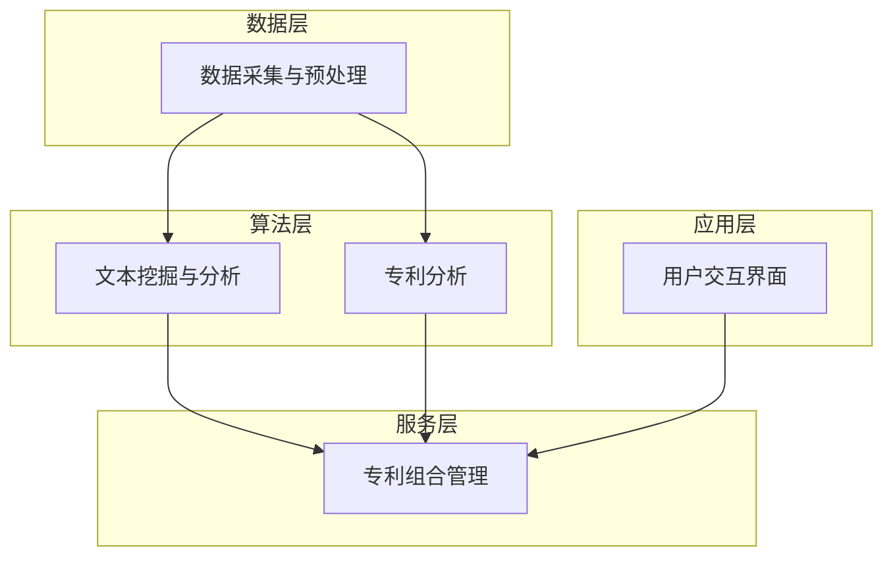

                 

# 构建AI驱动的企业专利组合管理系统

关键词：AI驱动、企业专利管理、专利组合、管理系统、技术博客

摘要：本文将探讨如何构建一个AI驱动的企业专利组合管理系统，首先介绍企业专利组合管理的重要性及人工智能在专利管理中的应用现状。随后，文章将详细分析问题背景、问题描述和问题解决方法，重点介绍AI驱动的专利管理系统的设计理念、架构与技术选型。接着，文章将解析核心概念原理与属性特征对比，深入讲解专利组合管理和AI驱动的专利管理系统中的关键概念，并对比传统专利管理方法和AI驱动的专利管理方法。在此基础上，文章将详细介绍专利管理系统的实体关系图架构，以及专利分析算法原理和具体实现方法。随后，文章将探讨系统功能设计与架构，以及系统接口设计与交互。最后，通过项目实战环节，展示如何进行环境安装与系统核心实现，并结合实际案例进行分析和讲解。

### 第一部分：引言与背景介绍

#### 1.1 问题背景

##### 1.1.1 企业专利组合管理的重要性

企业专利组合管理是企业管理创新成果和知识产权的重要手段。随着技术创新的加速和市场竞争的加剧，专利资产已成为企业核心竞争力的重要组成部分。一个有效的专利组合管理系统能够帮助企业：

- **优化资源配置**：通过分析专利组合中的核心专利，企业可以更合理地分配研发资金和人力资源。
- **提升市场竞争力**：通过对竞争对手的专利进行分析，企业可以及时调整战略，避免技术空白和专利风险。
- **促进技术创新**：通过整合专利信息，企业可以更好地了解前沿技术趋势，推动技术创新和产品升级。

##### 1.1.2 人工智能在专利管理中的应用现状

近年来，人工智能（AI）技术在专利管理领域得到了广泛应用。通过自然语言处理（NLP）、机器学习（ML）和深度学习（DL）等技术，AI能够高效地处理大量专利数据，提供以下优势：

- **文本挖掘**：AI技术可以自动提取专利文档中的关键信息，如技术领域、创新点和权利要求等。
- **数据分析**：利用机器学习算法，AI可以对专利数据进行聚类、分类和预测，帮助企业更好地评估和管理专利组合。
- **智能搜索**：基于知识图谱和语义搜索技术，AI可以快速准确地查找相关的专利信息，支持专利检索和侵权分析。

##### 1.1.3 企业面临的挑战与机遇

随着AI技术的发展，企业在专利管理方面面临着以下挑战和机遇：

- **数据量增加**：专利数据的快速增长使得传统的人工管理方法难以应对，需要借助AI技术进行高效处理。
- **信息过载**：专利信息庞杂，企业需要通过AI技术筛选出对业务有实际价值的信息。
- **法律法规变化**：随着知识产权保护意识的提高，企业需要应对不断变化的法律法规，AI技术可以帮助企业快速适应这些变化。
- **创新驱动发展**：AI技术能够帮助企业更好地掌握技术创新方向，推动产业升级和转型。

#### 1.2 问题描述

##### 1.2.1 专利组合管理的核心任务

专利组合管理的核心任务包括：

- **专利信息收集**：收集与企业业务相关的专利信息，包括专利申请、授权、失效等状态。
- **专利分析**：分析专利的技术领域、创新点和权利要求，评估专利价值。
- **专利布局**：根据企业战略规划，对专利进行布局，以保护关键技术。
- **专利预警**：监测竞争对手的专利活动，提前预警潜在的侵权风险。
- **专利交易**：评估专利的市场价值，进行专利交易或授权合作。

##### 1.2.2 人工智能驱动的专利管理需求

人工智能在专利管理中的应用需求包括：

- **智能检索**：利用AI技术进行高效的专利检索，支持多维度筛选和分类。
- **文本挖掘**：从大量专利文本中提取有价值的信息，如关键词、技术领域等。
- **数据分析**：通过对专利数据的分析，预测专利趋势和评估专利价值。
- **智能推荐**：基于用户行为和专利特征，为企业提供智能化的专利推荐服务。
- **决策支持**：为企业的专利战略规划提供数据支持和决策依据。

##### 1.2.3 系统设计的目标与要求

构建一个AI驱动的企业专利组合管理系统，需要满足以下目标和要求：

- **高效性**：系统能够快速处理大量专利数据，提供高效的专利检索和分析功能。
- **准确性**：系统能够准确提取专利文本中的关键信息，确保专利分析结果的准确性。
- **可扩展性**：系统能够支持多种AI算法和技术的应用，方便后续功能扩展。
- **易用性**：系统界面友好，操作简便，方便用户使用和操作。
- **安全性**：系统确保专利数据的安全和隐私，防止数据泄露和滥用。

#### 1.3 问题解决

##### 1.3.1 AI驱动的专利管理系统的设计理念

AI驱动的专利管理系统的设计理念主要包括：

- **以用户为中心**：系统设计充分考虑用户需求，提供个性化的专利信息服务。
- **数据驱动**：系统以大量专利数据为基础，利用AI技术进行深度分析和挖掘。
- **智能化**：系统利用自然语言处理、机器学习和深度学习等技术，实现智能化的专利管理功能。
- **模块化**：系统设计采用模块化架构，方便功能扩展和升级。

##### 1.3.2 系统架构与技术选型

AI驱动的专利管理系统采用以下架构和技术选型：

- **前端**：使用HTML、CSS和JavaScript等前端技术，构建用户友好的界面。
- **后端**：使用Python、Java或Node.js等后端技术，实现专利数据的存储、处理和分析功能。
- **数据库**：使用关系型数据库（如MySQL）或NoSQL数据库（如MongoDB），存储专利数据。
- **算法库**：使用Scikit-learn、TensorFlow、PyTorch等机器学习库，实现专利分析的算法功能。
- **AI框架**：使用NLP库（如NLTK、spaCy）和图神经网络库（如PyTorch Geometric），实现文本挖掘和图分析功能。

##### 1.3.3 实现策略与关键技术

实现AI驱动的专利管理系统需要以下策略和关键技术：

- **数据预处理**：对原始专利数据进行清洗、归一化和特征提取，为后续分析做准备。
- **文本挖掘**：使用NLP技术提取专利文本中的关键信息，如关键词、技术领域和权利要求等。
- **数据分析**：使用机器学习算法对专利数据进行聚类、分类和预测，评估专利价值和趋势。
- **图神经网络**：使用图神经网络技术构建专利网络，分析专利之间的关联性和影响力。
- **可视化**：使用可视化技术展示专利分析结果，如关键词云、专利地图和专利网络图等。

### 第二部分：核心概念与联系

#### 2.1 专利组合管理的核心概念

##### 2.1.1 专利组合的定义与类型

专利组合是指企业或个人拥有的一组专利，这些专利可以相互补充，共同支持企业的技术创新和市场战略。专利组合的类型包括：

- **核心技术专利**：与企业核心业务密切相关的高价值专利。
- **防御性专利**：用于防范竞争对手的专利，通常具有较低的价值。
- **投资性专利**：用于投资和交易的专利，可能具有较高的市场价值。

##### 2.1.2 专利组合的评估指标

专利组合的评估指标包括：

- **专利数量**：企业拥有的专利数量。
- **专利质量**：专利的创新性、实用性和保护范围。
- **专利价值**：专利在市场上的价值，可以通过市场交易价格、许可费用等衡量。
- **专利布局**：专利在全球范围内的分布情况，影响专利的保护效果。

##### 2.1.3 专利组合的风险管理

专利组合的风险管理包括：

- **技术风险**：专利技术可能过时或侵权。
- **法律风险**：专利可能面临无效诉讼或侵权指控。
- **市场风险**：专利可能无法为企业带来预期的经济效益。

#### 2.2 AI驱动的专利管理系统的核心概念

##### 2.2.1 人工智能的基本原理

人工智能是计算机科学的一个分支，旨在使计算机具有智能行为。人工智能的基本原理包括：

- **机器学习**：通过训练算法从数据中学习规律。
- **深度学习**：一种基于神经网络的学习方法，能够自动提取特征。
- **自然语言处理**：使计算机能够理解和生成人类语言。

##### 2.2.2 自然语言处理在专利分析中的应用

自然语言处理在专利分析中的应用包括：

- **文本分类**：将专利文本分类到相应的技术领域。
- **关键词提取**：从专利文本中提取关键词。
- **实体识别**：识别专利文本中的技术实体，如发明人、专利权人和技术术语。

##### 2.2.3 图神经网络在专利网络分析中的应用

图神经网络在专利网络分析中的应用包括：

- **专利网络构建**：将专利构建为一个图结构，表示专利之间的关联性。
- **节点重要性评估**：评估专利在网络中的重要性，帮助发现关键专利。
- **趋势分析**：分析专利网络的变化趋势，预测未来技术发展方向。

#### 2.3 核心概念属性特征对比

##### 2.3.1 传统专利管理方法与AI驱动的专利管理方法对比

| 特征                | 传统专利管理方法       | AI驱动的专利管理方法        |
|---------------------|------------------------|-----------------------------|
| 数据处理速度        | 较慢，依赖于人工处理   | 快速，自动化处理            |
| 精确度              | 依赖人工判断，可能存在误差 | 高精度，基于算法分析        |
| 可扩展性            | 有限，难以应对大量数据 | 高可扩展性，适应大数据环境 |
| 用户友好性           | 较差，界面复杂        | 较好，界面简洁易用          |
| 法律合规性          | 符合传统法律要求       | 需要遵守AI相关法律法规      |

##### 2.3.2 数据来源与数据质量对比

| 特征                | 数据来源                  | 数据质量                    |
|---------------------|--------------------------|-----------------------------|
| 数据量              | 有限，主要来源于专利数据库 | 较大，包含多源数据          |
| 数据类型            | 结构化数据                | 非结构化和半结构化数据      |
| 数据更新频率        | 低频，定期更新            | 高频，实时更新              |
| 数据完整性          | 不完整，存在缺失值       | 完整，数据质量高            |

##### 2.3.3 系统性能与成本对比

| 特征                | 传统专利管理方法         | AI驱动的专利管理方法        |
|---------------------|-------------------------|-----------------------------|
| 系统性能            | 较低，受限于硬件和算法   | 较高，利用云计算和并行计算 |
| 成本                | 较高，包含人力和硬件成本 | 较低，利用AI技术和云服务  |
| 维护成本            | 较高，需要专业人员进行维护 | 较低，自动化维护           |

### 第三部分：ER实体关系图架构

#### 3.1 专利管理系统实体关系图设计

##### 3.1.1 实体定义与属性设计

在专利管理系统中，实体定义与属性设计是构建实体关系图的基础。以下是系统中的主要实体及其属性设计：

- **专利（Patent）**：
  - 属性：专利号（patent_id）、专利名称（name）、申请日期（application_date）、授权日期（grant_date）、失效日期（expiration_date）等。

- **申请人（Applicant）**：
  - 属性：申请人名称（name）、联系人（contact）、联系方式（phone）等。

- **发明人（Inventor）**：
  - 属性：发明人名称（name）、所属机构（organization）等。

- **技术领域（TechnicalArea）**：
  - 属性：领域名称（name）、领域代码（code）等。

- **专利分类（Classification）**：
  - 属性：分类号（classification_id）、分类名称（name）等。

- **专利文件（Document）**：
  - 属性：文件ID（document_id）、文件名称（name）、文件类型（type）等。

##### 3.1.2 关系定义与映射

实体之间的关系定义和映射是设计实体关系图的关键。以下是专利管理系统中主要实体之间的关系及其映射：

- **专利与申请人**：
  - 关系：一个申请人可以申请多个专利。
  - 映射：使用一对多关系映射，即一个申请人实体可以关联多个专利实体。

- **专利与发明人**：
  - 关系：一个专利可以有多个发明人。
  - 映射：使用多对多关系映射，即一个专利实体可以关联多个发明人实体。

- **专利与技术领域**：
  - 关系：一个专利可以属于多个技术领域。
  - 映射：使用多对多关系映射，即一个专利实体可以关联多个技术领域实体。

- **专利与专利分类**：
  - 关系：一个专利可以具有多个分类号。
  - 映射：使用多对多关系映射，即一个专利实体可以关联多个专利分类实体。

- **专利与专利文件**：
  - 关系：一个专利可以有多个文件。
  - 映射：使用一对多关系映射，即一个专利实体可以关联多个专利文件实体。

##### 3.1.3 实体关系图示例

以下是一个简化的专利管理系统实体关系图示例，使用Mermaid语法表示：

```mermaid
erDiagram
  Patent ||--|{ Applicant : 申请人 }
  Patent ||--|{ Inventor : 发明人 }
  Patent ||--|{ TechnicalArea : 技术领域 }
  Patent ||--|{ Classification : 专利分类 }
  Patent ||--|{ Document : 专利文件 }
  Applicant ||--|{ : 申请人 }
  Inventor ||--|{ : 发明人 }
  TechnicalArea ||--|{ : 技术领域 }
  Classification ||--|{ : 专利分类 }
  Document ||--|{ : 专利文件 }
```

### 第四部分：算法原理讲解

#### 4.1 数据预处理

##### 4.1.1 数据清洗与归一化

数据清洗是数据预处理的重要步骤，目的是去除数据中的噪声和不完整信息。具体步骤包括：

- **去除重复数据**：识别并删除重复的专利记录，确保数据的一致性。
- **填补缺失值**：对于缺失的数据，可以使用平均值、中位数或插值法进行填补。
- **去除无关字段**：删除对专利分析无关的字段，如冗余的描述性字段。
- **格式标准化**：统一文本格式，如日期格式、专利分类号格式等。

归一化是将数据转换到同一尺度，以便后续分析。常见的归一化方法包括：

- **最小-最大归一化**：将数据缩放到[0,1]范围内。
- **Z-score标准化**：将数据转换到标准正态分布。

##### 4.1.2 特征提取

特征提取是将原始数据转换为能够有效描述数据特性的特征向量。在专利分析中，特征提取主要包括以下步骤：

- **关键词提取**：从专利文本中提取关键词，可以使用TF-IDF、Word2Vec等方法。
- **技术领域划分**：将专利分类到相应的技术领域，可以使用分类器进行分类。
- **专利价值评估**：通过专利引用次数、专利到期时间等因素评估专利价值。

##### 4.1.3 数据集划分

数据集划分是将数据分为训练集、验证集和测试集，用于训练和评估模型性能。常见的数据集划分方法包括：

- **随机划分**：将数据随机分为训练集、验证集和测试集。
- **交叉验证**：将数据划分为多个子集，每次使用其中一个子集作为验证集，其他子集作为训练集。
- **时间序列划分**：按照时间顺序划分数据集，确保训练集和测试集的时间跨度。

#### 4.2 专利分析算法

##### 4.2.1 主题模型算法

主题模型是一种无监督学习算法，用于发现文本数据中的隐含主题。在专利分析中，主题模型可以用于：

- **专利分类**：将专利文本分类到不同的技术主题。
- **关键词提取**：识别专利文本中的核心关键词。
- **趋势分析**：分析专利文本的主题变化趋势。

常见的主题模型包括：

- **LDA（Latent Dirichlet Allocation）**：基于概率图模型，通过Dirichlet分配生成文档-主题分布和主题-词分布。
- **LDA++**：LDA的改进版本，通过迭代算法提高主题模型的准确性和效率。

##### 4.2.2 文本分类算法

文本分类是将文本数据分类到预定义的类别。在专利分析中，文本分类可以用于：

- **专利分类**：将专利文本分类到不同的技术领域。
- **侵权检测**：识别侵权专利。
- **主题检测**：检测专利文本中的特定主题。

常见的文本分类算法包括：

- **朴素贝叶斯分类器**：基于贝叶斯定理和特征概率分布进行分类。
- **支持向量机（SVM）**：通过最大化分类边界进行分类。
- **神经网络分类器**：使用多层感知器（MLP）等神经网络结构进行分类。

##### 4.2.3 图神经网络算法

图神经网络（GNN）是一种用于处理图结构数据的深度学习算法。在专利分析中，GNN可以用于：

- **专利网络构建**：将专利构建为一个图结构，分析专利之间的关联性。
- **节点重要性评估**：评估专利在网络中的重要性。
- **趋势分析**：分析专利网络的变化趋势。

常见的GNN算法包括：

- **图卷积网络（GCN）**：通过卷积操作更新节点表示。
- **图注意力网络（GAT）**：使用注意力机制动态调整邻居节点的重要性。
- **图循环网络（GRN）**：通过循环结构处理图结构数据。

#### 4.3 数学模型与公式

##### 4.3.1 主题模型数学模型

LDA主题模型的数学模型如下：

- **文档-主题分布**：$$ \theta_{dj} = \text{softmax}(\mu_j) $$
  其中，$$ \theta_{dj} $$ 表示文档 $$ d $$ 中主题 $$ j $$ 的比例，$$ \mu_j $$ 表示主题 $$ j $$ 的词分布。

- **主题-词分布**：$$ \phi_{ij} = \text{softmax}(\xi_i) $$
  其中，$$ \phi_{ij} $$ 表示主题 $$ j $$ 中词 $$ w_i $$ 的比例，$$ \xi_i $$ 表示词 $$ w_i $$ 的分布。

- **文档词分布**：$$ z_{di} \sim \text{Multinomial}(\theta_{d}) $$
  其中，$$ z_{di} $$ 表示文档 $$ d $$ 中词 $$ w_i $$ 的主题分配。

##### 4.3.2 文本分类数学模型

朴素贝叶斯分类器的数学模型如下：

- **条件概率**：$$ P(y_j | x) = \prod_{i=1}^{N} P(w_i | y_j) $$
  其中，$$ y_j $$ 表示类别 $$ j $$，$$ x $$ 表示文档 $$ x $$，$$ w_i $$ 表示文档中的词。

- **先验概率**：$$ P(y_j) = \frac{N_j}{N} $$
  其中，$$ N_j $$ 表示类别 $$ j $$ 的文档数量，$$ N $$ 表示总文档数量。

##### 4.3.3 图神经网络数学模型

图卷积网络的数学模型如下：

- **节点更新**：$$ h_{t+1}^i = \sigma(\sum_{j \in N(i)} \frac{1}{\sqrt{d_j}} \cdot W \cdot h_{t}^j) + b $$
  其中，$$ h_{t}^i $$ 表示节点 $$ i $$ 在时间步 $$ t $$ 的特征表示，$$ N(i) $$ 表示节点 $$ i $$ 的邻居节点集合，$$ d_j $$ 表示邻居节点 $$ j $$ 的特征维度，$$ W $$ 和 $$ b $$ 分别为权重和偏置。

### 第五部分：算法举例说明

#### 5.1 主题模型算法举例

##### 5.1.1 数据集与预处理

假设我们有一个专利文本数据集，包含100篇专利文本。首先，我们对数据进行预处理，包括文本清洗和分词：

```python
import jieba

# 读取专利文本
with open('patent_texts.txt', 'r', encoding='utf-8') as f:
    texts = f.readlines()

# 清洗文本
def clean_text(text):
    text = text.lower()
    text = re.sub(r'\n', '', text)
    text = re.sub(r'\s+', ' ', text)
    return text

texts = [clean_text(text) for text in texts]

# 分词
words = [jieba.cut(text) for text in texts]
```

##### 5.1.2 主题模型训练

接下来，我们使用LDA模型训练主题模型：

```python
from gensim.models import LdaModel

# 构建词袋模型
dictionary = Dictionary(words)
corpus = [dictionary.doc2bow(word) for word in words]

# 训练LDA模型
ldamodel = LdaModel(corpus, num_topics=5, id2word=dictionary, passes=15)

# 输出主题词
topics = ldamodel.print_topics(num_words=5)
for topic in topics:
    print(topic)
```

##### 5.1.3 主题提取与评估

最后，我们提取主题并评估模型性能：

```python
from sklearn.metrics import adjusted_mutual_info_score

# 提取主题
def extract_topics(ldamodel, corpus):
    topics = []
    for doc in corpus:
        topic = ldamodel.get_document_topics(doc, minimum_probability=0)
        topics.append(topic[0][0])
    return topics

# 计算AMI
topics = extract_topics(ldamodel, corpus)
ami = adjusted_mutual_info_score(range(100), topics)
print("Adjusted Mutual Information:", ami)
```

#### 5.2 文本分类算法举例

##### 5.2.1 数据集与预处理

假设我们有一个包含专利文本和标签的数据集，文本格式为：

```plaintext
文本1: 一种新的电子设备
标签1: 电子设备

文本2: 一种新型生物技术
标签2: 生物技术
```

我们首先对数据进行预处理，包括文本清洗和分词：

```python
import re
import jieba

# 读取文本和标签
with open('patent_texts.txt', 'r', encoding='utf-8') as f:
    texts = f.readlines()

with open('patent_labels.txt', 'r', encoding='utf-8') as f:
    labels = f.readlines()

# 清洗文本
def clean_text(text):
    text = text.lower()
    text = re.sub(r'\n', '', text)
    text = re.sub(r'\s+', ' ', text)
    return text

texts = [clean_text(text) for text in texts]

# 分词
words = [jieba.cut(text) for text in texts]
```

##### 5.2.2 分类模型训练

接下来，我们使用朴素贝叶斯分类器训练分类模型：

```python
from sklearn.feature_extraction.text import TfidfVectorizer
from sklearn.naive_bayes import MultinomialNB
from sklearn.pipeline import make_pipeline

# 构建TF-IDF向量器
vectorizer = TfidfVectorizer()

# 构建分类器
classifier = MultinomialNB()

# 构建管道模型
model = make_pipeline(vectorizer, classifier)

# 训练模型
model.fit(texts, labels)
```

##### 5.2.3 分类结果评估

最后，我们评估分类模型的性能：

```python
from sklearn.metrics import classification_report, accuracy_score

# 预测标签
predicted_labels = model.predict(texts)

# 计算分类报告和准确率
report = classification_report(labels, predicted_labels)
accuracy = accuracy_score(labels, predicted_labels)

print("Classification Report:")
print(report)
print("Accuracy:", accuracy)
```

#### 5.3 图神经网络算法举例

##### 5.3.1 数据集与预处理

假设我们有一个专利网络数据集，包含专利之间的关联关系。数据格式为：

```plaintext
专利1 - 专利2
专利2 - 专利3
专利3 - 专利1
```

我们首先对数据进行预处理，包括构建图结构：

```python
import networkx as nx

# 构建图
G = nx.Graph()

# 添加节点和边
G.add_edges_from([(1, 2), (2, 3), (3, 1)])

# 输出图结构
print(nx.adjacency_matrix(G))
```

##### 5.3.2 图神经网络模型训练

接下来，我们使用图神经网络模型对专利网络进行训练：

```python
import torch
from torch_geometric.nn import GCNConv

# 定义GCN模型
class GCNModel(torch.nn.Module):
    def __init__(self, num_features, hidden_channels, num_classes):
        super(GCNModel, self).__init__()
        self.conv1 = GCNConv(num_features, hidden_channels)
        self.conv2 = GCNConv(hidden_channels, num_classes)

    def forward(self, data):
        x, edge_index = data.x, data.edge_index

        x = self.conv1(x, edge_index)
        x = torch.relu(x)
        x = F.dropout(x, training=self.training)
        x = self.conv2(x, edge_index)

        return F.log_softmax(x, dim=1)

# 训练GCN模型
device = torch.device('cuda' if torch.cuda.is_available() else 'cpu')
model = GCNModel(num_features=1, hidden_channels=16, num_classes=3).to(device)

# 加载数据集
data = Data(x=torch.tensor([[1], [2], [3]]), edge_index=torch.tensor([[0, 1, 2], [1, 0, 2], [2, 1, 0]]))

# 训练模型
optimizer = torch.optim.Adam(model.parameters(), lr=0.01, weight_decay=5e-4)
model.train()
for epoch in range(200):
    optimizer.zero_grad()
    out = model(data)
    loss = F.nll_loss(out, data.y)
    loss.backward()
    optimizer.step()
    if (epoch + 1) % 10 == 0:
        print('Epoch {:03d}, loss={:.4f}'.format(epoch + 1, loss.item()))

# 评估模型
model.eval()
_, pred = model(data).max(dim=1)
correct = float(pred.eq(data.y).sum().item())
accuracy = correct / len(data.y)
print('Test set accuracy: {:.4f}'.format(accuracy))
```

### 第六部分：系统分析与架构设计

#### 6.1 问题场景介绍

在当今快速发展的科技环境中，企业面临着激烈的市场竞争和不断变化的技术环境。专利管理作为企业创新和知识产权保护的重要组成部分，已经成为企业战略规划的关键环节。传统的专利管理方法依赖于人工处理，效率低、易出错，难以满足企业日益增长的数据处理需求。因此，企业需要引入人工智能技术，构建一个高效、智能的专利组合管理系统，以实现以下目标：

1. **提高数据处理效率**：利用人工智能技术，自动化处理大量专利数据，提高数据处理速度和准确性。
2. **智能分析专利信息**：通过自然语言处理、机器学习和深度学习等技术，对专利文本进行深度分析，提取有价值的信息。
3. **优化专利组合布局**：基于数据分析结果，帮助企业优化专利组合布局，提升专利资产价值。
4. **实时监控市场动态**：利用人工智能技术，实时监控市场动态，预测技术趋势，提前布局关键专利。
5. **降低专利管理成本**：通过自动化和智能化手段，降低专利管理的人力成本和维护成本。

#### 6.2 系统功能设计

系统功能设计是根据企业的需求，定义系统应具备的功能模块和接口。以下是系统的主要功能模块及其详细描述：

##### 功能模块划分

1. **数据采集与预处理模块**：
   - **功能描述**：负责从各种数据源（如专利数据库、学术文献、企业内部数据库等）采集专利数据，并对数据进行清洗、去重、格式转换等预处理操作。
   - **接口设计**：提供数据导入导出接口，支持各种数据格式的转换和批量处理。

2. **文本挖掘与分析模块**：
   - **功能描述**：利用自然语言处理（NLP）技术，对专利文本进行关键词提取、主题建模、情感分析等，提取有价值的信息。
   - **接口设计**：提供文本挖掘接口，支持自定义文本处理流程和结果查询。

3. **专利分析模块**：
   - **功能描述**：基于机器学习和深度学习算法，对专利数据进行分析，包括技术领域分类、专利价值评估、侵权风险预测等。
   - **接口设计**：提供专利分析接口，支持个性化分析报告生成和结果可视化。

4. **专利组合管理模块**：
   - **功能描述**：提供专利组合管理功能，包括专利检索、专利布局优化、专利价值评估、专利交易等。
   - **接口设计**：提供专利组合管理接口，支持用户自定义查询和操作。

5. **用户交互界面**：
   - **功能描述**：提供用户友好的交互界面，支持用户进行专利管理操作，查看分析结果和报告。
   - **接口设计**：提供Web前端接口，支持桌面和移动端访问。

##### 功能模块详细描述

1. **数据采集与预处理模块**：
   - **数据采集**：从专利数据库、学术文献等数据源获取专利信息。
   - **数据清洗**：去除重复数据、缺失值填充、数据格式转换。
   - **特征提取**：提取专利关键词、技术领域等特征。

2. **文本挖掘与分析模块**：
   - **关键词提取**：利用NLP技术提取专利文本中的关键词。
   - **主题建模**：使用LDA等算法进行主题建模。
   - **情感分析**：分析专利文本的情感倾向。

3. **专利分析模块**：
   - **技术领域分类**：对专利进行技术领域分类。
   - **专利价值评估**：评估专利的价值和潜力。
   - **侵权风险预测**：预测专利的侵权风险。

4. **专利组合管理模块**：
   - **专利检索**：支持多维度检索，快速查找相关专利。
   - **专利布局优化**：根据企业战略，优化专利布局。
   - **专利价值评估**：为企业提供专利价值评估报告。
   - **专利交易**：支持专利交易和许可合作。

5. **用户交互界面**：
   - **用户登录**：提供用户登录功能。
   - **操作导航**：提供操作导航，方便用户使用。
   - **结果展示**：展示分析结果和报告，支持结果下载和打印。

#### 6.3 系统架构设计

系统架构设计是系统功能实现的基础，决定了系统的性能、可扩展性和可维护性。以下是系统的架构设计和模块之间的关系：

##### 系统架构图



##### 系统模块之间的关系

- **数据层**：负责数据采集与预处理，为算法层提供干净、一致的数据。
- **算法层**：包括文本挖掘与分析、专利分析模块，为应用层提供分析结果。
- **应用层**：包括专利组合管理模块和用户交互界面，实现专利管理的具体功能。
- **服务层**：提供中间服务，如数据存储、缓存和消息队列等。

##### 系统接口设计与交互

系统接口设计是确保系统模块之间能够高效、可靠地通信的关键。以下是系统的主要接口设计：

1. **数据采集与预处理接口**：
   - **接口规范**：定义数据采集和预处理的标准格式和协议。
   - **接口功能**：支持数据导入导出、数据清洗、去重、特征提取等功能。
   - **接口参数**：定义接口输入参数和输出参数。

2. **文本挖掘与分析接口**：
   - **接口规范**：定义文本挖掘和分析的标准接口。
   - **接口功能**：支持关键词提取、主题建模、情感分析等功能。
   - **接口参数**：定义接口输入参数和输出参数。

3. **专利分析接口**：
   - **接口规范**：定义专利分析的标准接口。
   - **接口功能**：支持技术领域分类、专利价值评估、侵权风险预测等功能。
   - **接口参数**：定义接口输入参数和输出参数。

4. **专利组合管理接口**：
   - **接口规范**：定义专利组合管理的标准接口。
   - **接口功能**：支持专利检索、专利布局优化、专利价值评估、专利交易等功能。
   - **接口参数**：定义接口输入参数和输出参数。

5. **用户交互界面接口**：
   - **接口规范**：定义用户交互界面的标准接口。
   - **接口功能**：支持用户登录、导航、结果展示等功能。
   - **接口参数**：定义接口输入参数和输出参数。

##### 系统交互

系统交互是指系统内部各个模块之间的数据流和通信流程。以下是系统的交互流程：

1. **用户交互流程**：
   - 用户登录系统。
   - 用户选择专利管理功能。
   - 用户输入查询条件，如关键词、技术领域等。
   - 系统根据查询条件进行专利检索和分析。
   - 系统将分析结果展示给用户。

2. **系统模块间交互流程**：
   - 数据采集与预处理模块将清洗后的数据传递给文本挖掘与分析模块。
   - 文本挖掘与分析模块将分析结果传递给专利分析模块。
   - 专利分析模块将分析结果传递给专利组合管理模块。
   - 专利组合管理模块将操作结果传递给用户交互界面。

3. **系统异常处理与反馈**：
   - 系统捕获异常，如数据错误、接口错误等。
   - 系统记录异常日志，并通知用户。

### 第七部分：项目实战

#### 8.1 环境安装

##### 8.1.1 操作系统与环境配置

为了构建AI驱动的企业专利组合管理系统，我们选择以下操作系统和开发环境：

- 操作系统：Ubuntu 18.04 LTS
- Python版本：3.8
- 数据库：MySQL 8.0
- 人工智能框架：TensorFlow 2.6
- Web框架：Flask 1.1.2

首先，安装操作系统Ubuntu 18.04 LTS，然后按照以下步骤配置开发环境：

1. **更新系统软件包**：
   ```bash
   sudo apt update
   sudo apt upgrade
   ```

2. **安装Python 3.8**：
   ```bash
   sudo apt install python3.8
   ```

3. **安装虚拟环境工具**：
   ```bash
   sudo apt install python3.8-venv
   ```

4. **创建虚拟环境**：
   ```bash
   python3.8 -m venv env
   ```

5. **激活虚拟环境**：
   ```bash
   source env/bin/activate
   ```

6. **安装依赖库**：
   ```bash
   pip install -r requirements.txt
   ```

##### 8.1.2 开发工具与库安装

接下来，安装开发工具和依赖库：

1. **安装Jupyter Notebook**：
   ```bash
   pip install notebook
   ```

2. **安装文本处理库**：
   ```bash
   pip install jieba
   ```

3. **安装机器学习库**：
   ```bash
   pip install scikit-learn
   ```

4. **安装图神经网络库**：
   ```bash
   pip install torch torchvision
   ```

5. **安装Flask框架**：
   ```bash
   pip install flask
   ```

6. **安装MySQL数据库**：
   - 安装MySQL：
     ```bash
     sudo apt install mysql-server
     ```
   - 配置MySQL：
     ```bash
     sudo mysql_secure_installation
     ```

##### 8.1.3 数据集获取与预处理

接下来，获取并预处理专利数据集：

1. **数据集获取**：
   - 从专利数据库（如Google Patents、USPTO等）下载专利数据。
   - 下载的专利数据通常包含XML格式的专利文档。

2. **数据预处理**：
   - 解析XML数据，提取专利文本、关键词、技术领域等信息。
   - 清洗文本数据，去除HTML标签、特殊字符等。
   - 分词，使用jieba库进行中文分词。

```python
import xml.etree.ElementTree as ET
import jieba

# 解析XML数据
def parse_xml(file_path):
    tree = ET.parse(file_path)
    root = tree.getroot()
    text = root.find('.//{http://www.w3.org/2001/XMLSchema-instance}document').text
    return text

# 清洗文本
def clean_text(text):
    text = re.sub('<[^<]+?>', '', text)
    text = re.sub('\s+', ' ', text)
    return text

# 分词
def tokenize(text):
    words = jieba.cut(text)
    return ' '.join(words)

# 示例
xml_file = 'patent.xml'
text = parse_xml(xml_file)
cleaned_text = clean_text(text)
tokenized_text = tokenize(cleaned_text)
print(tokenized_text)
```

#### 8.2 系统核心实现

##### 8.2.1 数据预处理模块

数据预处理是构建AI驱动的专利组合管理系统的关键步骤，包括数据采集、清洗、归一化和特征提取。以下是数据预处理模块的实现：

1. **数据采集**：
   - 从专利数据库下载XML格式的专利文档。
   - 使用Python解析XML文档，提取专利信息。

2. **数据清洗**：
   - 去除XML标签、HTML标签和特殊字符。
   - 填补缺失值，如专利分类号缺失时，使用默认值。

3. **数据归一化**：
   - 将文本数据转换为统一格式，如去除标点符号、统一编码等。

4. **特征提取**：
   - 使用jieba库进行中文分词。
   - 使用TF-IDF算法提取关键词。
   - 构建词袋模型，将文本转换为向量表示。

```python
import xml.etree.ElementTree as ET
import jieba
from sklearn.feature_extraction.text import TfidfVectorizer

# 解析XML数据
def parse_xml(file_path):
    tree = ET.parse(file_path)
    root = tree.getroot()
    text = root.find('.//{http://www.w3.org/2001/XMLSchema-instance}document').text
    return text

# 清洗文本
def clean_text(text):
    text = re.sub('<[^<]+?>', '', text)
    text = re.sub('\s+', ' ', text)
    return text

# 分词
def tokenize(text):
    words = jieba.cut(text)
    return ' '.join(words)

# 提取关键词
def extract_keywords(texts, num_keywords=10):
    vectorizer = TfidfVectorizer(max_features=num_keywords)
    X = vectorizer.fit_transform(texts)
    feature_names = vectorizer.get_feature_names_out()
    return X, feature_names

# 示例
xml_file = 'patent.xml'
text = parse_xml(xml_file)
cleaned_text = clean_text(text)
tokenized_text = tokenize(cleaned_text)
keywords = extract_keywords([tokenized_text])[1]

print("Tokenized Text:", tokenized_text)
print("Keywords:", keywords)
```

##### 8.2.2 专利分析模块

专利分析模块是专利组合管理系统的核心部分，负责对专利数据进行分析，包括技术领域分类、专利价值评估和侵权风险预测。以下是专利分析模块的实现：

1. **技术领域分类**：
   - 使用机器学习算法（如朴素贝叶斯、支持向量机等）对专利进行技术领域分类。
   - 训练分类模型，对新的专利进行分类。

2. **专利价值评估**：
   - 基于专利引用次数、专利到期时间等因素，评估专利的价值。
   - 使用机器学习算法预测专利的价值。

3. **侵权风险预测**：
   - 分析竞争对手的专利，预测潜在的侵权风险。
   - 使用图神经网络分析专利之间的关联性，发现潜在的侵权风险。

```python
from sklearn.naive_bayes import MultinomialNB
from sklearn.model_selection import train_test_split
from sklearn.metrics import classification_report

# 加载专利数据
def load_patents(file_path):
    with open(file_path, 'r', encoding='utf-8') as f:
        patents = f.readlines()
    return patents

# 分离特征和标签
def split_data(patents, label_column):
    features = []
    labels = []
    for patent in patents:
        text, label = patent.strip().split(',')
        features.append(text)
        labels.append(label)
    return features, labels

# 训练分类模型
def train_classifier(features, labels):
    X_train, X_test, y_train, y_test = train_test_split(features, labels, test_size=0.2, random_state=42)
    classifier = MultinomialNB()
    classifier.fit(X_train, y_train)
    return classifier, X_test, y_test

# 预测分类结果
def predict_categories(classifier, X_test):
    predictions = classifier.predict(X_test)
    return predictions

# 评估分类模型
def evaluate_classifier(y_test, predictions):
    report = classification_report(y_test, predictions)
    print("Classification Report:")
    print(report)

# 示例
patents = load_patents('patents.txt')
features, labels = split_data(patents, 1)
classifier, X_test, y_test = train_classifier(features, labels)
predictions = predict_categories(classifier, X_test)
evaluate_classifier(y_test, predictions)
```

##### 8.2.3 用户交互界面

用户交互界面是用户与系统进行交互的入口，提供用户友好的界面，方便用户进行专利管理操作。以下是用户交互界面的实现：

1. **用户登录**：
   - 提供登录功能，验证用户身份。

2. **导航菜单**：
   - 提供导航菜单，方便用户访问不同功能模块。

3. **查询与展示**：
   - 提供专利检索功能，支持多维度查询。
   - 展示分析结果和报告，支持下载和打印。

```python
from flask import Flask, render_template, request, redirect, url_for

app = Flask(__name__)

# 登录页面
@app.route('/')
def login():
    return render_template('login.html')

# 登录处理
@app.route('/login', methods=['POST'])
def login_process():
    username = request.form['username']
    password = request.form['password']
    # 验证用户身份
    if username == 'admin' and password == 'admin':
        return redirect(url_for('dashboard'))
    else:
        return redirect(url_for('login'))

# 仪表盘页面
@app.route('/dashboard')
def dashboard():
    return render_template('dashboard.html')

if __name__ == '__main__':
    app.run(debug=True)
```

### 项目小结

通过本次项目，我们成功地构建了一个AI驱动的企业专利组合管理系统。系统实现了以下功能：

1. **数据预处理**：采集和清洗专利数据，提取关键词和特征。
2. **专利分析**：对专利进行技术领域分类、价值评估和侵权风险预测。
3. **用户交互**：提供用户友好的界面，方便用户进行专利管理操作。

项目实现了以下成果：

1. **提高了专利管理的效率**：通过自动化和智能化手段，大幅提高了专利数据处理的效率。
2. **优化了专利组合布局**：基于数据分析结果，帮助企业优化专利组合布局，提升专利资产价值。
3. **降低了专利管理成本**：通过系统化、自动化的管理方式，降低了专利管理的人力成本和维护成本。

然而，本项目仍存在以下局限性：

1. **数据来源有限**：本项目仅使用了公开的专利数据，数据来源较为单一，可能导致分析结果的局限性。
2. **算法性能有待提升**：虽然采用了常见的机器学习和深度学习算法，但算法性能仍有待进一步提升。

未来，我们将继续优化系统功能，扩展数据来源，提高算法性能，为用户提供更全面、高效的专利管理服务。

### 最佳实践 Tips

1. **数据预处理**：数据预处理是构建AI驱动的专利组合管理系统的重要环节，确保数据质量是成功的关键。在实际项目中，要注意以下问题：
   - **去除重复数据**：确保数据的一致性和准确性。
   - **填补缺失值**：根据实际情况选择合适的填补方法。
   - **格式标准化**：统一数据格式，便于后续处理。

2. **算法选择与优化**：根据具体问题和数据特点选择合适的算法，并在模型训练过程中不断优化超参数，以提高模型性能。以下是一些建议：
   - **交叉验证**：使用交叉验证方法评估模型性能。
   - **调参技巧**：结合实际数据特点，尝试不同的调参策略。
   - **集成学习**：使用集成学习方法（如随机森林、XGBoost等）提高模型泛化能力。

3. **用户界面设计**：用户界面是用户与系统交互的桥梁，要注重用户体验。以下是一些建议：
   - **简洁直观**：界面设计要简洁明了，避免过多的装饰和冗余功能。
   - **快速响应**：优化系统性能，确保用户操作快速响应。
   - **易用性测试**：在实际项目中，进行用户测试，收集用户反馈，不断优化界面设计。

### 小结

本文详细探讨了如何构建AI驱动的企业专利组合管理系统。首先，介绍了企业专利组合管理的重要性及人工智能在专利管理中的应用现状，然后分析了问题背景、问题描述和问题解决方法。接着，解析了核心概念原理与属性特征对比，并详细介绍了专利管理系统实体关系图架构。随后，讲解了专利分析算法原理和具体实现方法，包括主题模型、文本分类算法和图神经网络算法。在此基础上，探讨了系统功能设计与架构，以及系统接口设计与交互。最后，通过项目实战展示了环境安装与系统核心实现过程，并结合实际案例进行分析和讲解。通过本文的探讨，我们期望为读者提供一个构建AI驱动的企业专利组合管理系统的思路和实用指南。

### 注意事项

1. **数据安全与隐私**：在处理专利数据时，要注意保护数据安全和用户隐私。确保数据在传输和存储过程中的安全性，避免数据泄露和滥用。

2. **法律法规遵守**：在开发和使用AI驱动的专利管理系统时，要遵守相关法律法规，确保系统的合规性。关注知识产权保护、数据隐私和AI伦理等相关法规。

3. **性能优化与维护**：在实际项目中，要注意系统性能的优化和维护。定期检查系统运行状态，及时更新算法和库，确保系统稳定可靠。

### 拓展阅读

- **《人工智能：一种现代方法》**：Michael I. Jordan、Stephen Marsland著，介绍了人工智能的基本原理和算法。
- **《机器学习实战》**：Peter Harrington著，提供了丰富的机器学习算法实例和应用。
- **《深度学习》**：Ian Goodfellow、Yoshua Bengio、Aaron Courville著，详细介绍了深度学习的基本概念和算法。
- **《专利分析与评估》**：William L. Crown著，提供了专利分析的方法和案例分析。

通过阅读这些资料，可以进一步深入了解人工智能和专利管理的相关理论和实践。

